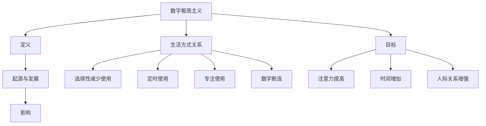

                 

### 文章标题

# 数字极简主义宣言：在虚拟世界中活出本真

### 关键词

- 数字极简主义
- 虚拟世界
- 本真生活
- 技术伦理
- 数字素养

### 摘要

在数字技术迅猛发展的时代，人类生活日益陷入虚拟世界的泥沼。本文提出数字极简主义理念，倡导通过简化数字生活，找回生活的本真。本文首先介绍数字极简主义的背景和核心概念，探讨虚拟世界的构建原理及其对人类行为的影响。接着，详细阐述数字极简主义的技术实现方法，包括数字素养的培养、技术伦理的考量以及实际应用。随后，文章分析数字极简主义在生活中的实践，探讨其对社会的潜在影响。最后，文章展望数字极简主义的未来趋势，并讨论面临的挑战与解决策略。通过本文的论述，读者将了解到如何在虚拟世界中找到生活的本真，实现数字生活的极简与和谐。

## 第1章：数字极简主义的概念与起源

### 1.1 数字极简主义的定义

数字极简主义（Digital Minimalism）是一种生活方式和价值观，主张通过简化数字设备和网络的使用，减少对数字世界的依赖，从而提高生活质量。这种理念起源于对现代科技带来的负面影响的认识，如过度消费、信息过载和社交孤立等。数字极简主义者认为，数字技术虽然带来了便利，但也在无形中侵蚀了人们的注意力、时间和人际关系。

### 1.2 数字极简主义的起源与发展

数字极简主义的概念最早可以追溯到20世纪末。随着互联网的普及和智能手机的出现，人们开始感受到数字技术对日常生活的影响。2000年代初，一些社会学家和心理学家开始探讨数字技术对人类行为和心理健康的影响，提出了数字极简主义的理念。2019年，美国作家乔舒亚·贝克（Joshua Becker）出版了一本名为《数字极简主义：简化数字生活，重拾真实生活》（"Digital Minimalism: Choosing a Focused and Purposeful Life in a World of Constant Distraction"），将数字极简主义理念进一步系统化。

### 1.3 数字极简主义与生活方式的关系

数字极简主义不仅是一种技术手段，更是一种生活态度。它强调对数字设备和网络的使用进行合理规划，减少不必要的干扰，从而提高生活质量和幸福感。数字极简主义者倡导以下几种生活方式：

1. **选择性减少使用**：对数字设备和网络进行选择性使用，只保留最重要的应用和服务。
2. **定时使用**：设定特定的时间使用数字设备，如只在完成任务后或特定时段使用。
3. **专注使用**：在使用数字设备时，专注于当前任务，避免多任务操作。
4. **数字断连**：在特定时间内（如晚上或周末）完全断开网络连接，享受无干扰的生活。

通过这些方式，数字极简主义者希望实现以下目标：

- **提高注意力**：减少数字干扰，集中精力完成任务。
- **增加时间**：减少不必要的数字活动，腾出更多时间进行有意义的活动。
- **增强人际关系**：通过减少数字依赖，增加面对面交流的时间，提高人际关系质量。

## Mermaid 流程图：数字极简主义的核心概念与联系



### 1.4 总结

数字极简主义提供了一种新的生活方式选择，帮助人们在数字世界中找回生活的本真。它不仅关注技术和工具的使用，更强调对数字生活的整体规划和管理。在接下来的章节中，我们将深入探讨虚拟世界的构建原理及其对人类行为的影响，进一步理解数字极简主义的现实意义。

## 第2章：虚拟世界的构建与影响

### 2.1 虚拟世界的定义与特点

虚拟世界（Virtual World）是指通过计算机模拟技术构建的，具备三维空间感和交互功能的人工环境。它通常包含多种元素，如角色、场景、物品等，用户可以在其中进行各种活动。虚拟世界的定义与特点可以从以下几个方面进行阐述：

- **定义**：虚拟世界是一种通过计算机模拟技术实现的人工环境，用户可以在其中进行交互和活动。
- **特点**：
  - **三维空间感**：虚拟世界模拟了现实世界中的空间结构，用户可以在其中感受到三维空间的存在。
  - **交互性**：用户可以通过控制虚拟角色或直接操作环境中的元素，与虚拟世界进行互动。
  - **可扩展性**：虚拟世界可以根据需求进行扩展，添加新的元素和功能。
  - **沉浸感**：虚拟世界的设计和实现可以增强用户的沉浸感，使其感觉仿佛置身于真实世界中。

### 2.2 虚拟世界的构建原理

虚拟世界的构建依赖于计算机图形学、人工智能、网络通信等多种技术。以下是构建虚拟世界的几个关键步骤：

1. **场景建模**：首先需要对虚拟世界中的场景进行建模，包括地面、建筑、植物等。这通常使用三维建模软件完成。
2. **角色与动画**：接下来，需要创建虚拟角色，并为其设计动画。这涉及到骨骼动画、肌肉动画等复杂的动画技术。
3. **交互设计**：虚拟世界的交互设计至关重要，它决定了用户如何与虚拟世界进行互动。这通常包括物理引擎、碰撞检测、语音识别等技术。
4. **网络通信**：虚拟世界通常需要在多个用户之间进行实时交互，因此需要建立稳定、高效的网络通信机制。
5. **人工智能**：虚拟世界中的非玩家角色（NPC）通常需要使用人工智能技术进行编程，以实现智能行为和交互。

### 2.3 虚拟世界对人类行为的影响

虚拟世界的出现和普及对人类行为产生了深远的影响。以下是一些主要的影响：

- **社交行为**：虚拟世界提供了一个全新的社交平台，用户可以在其中建立人际关系、进行社交互动。这种社交行为具有以下特点：
  - **匿名性**：用户可以在虚拟世界中保持匿名，这使得一些在现实生活中难以表达的社交需求得以满足。
  - **多样化**：虚拟世界中的社交行为更加多样化，用户可以通过不同的角色和场景体验不同的社交体验。
  - **虚拟社交压力**：尽管虚拟世界提供了多样化的社交体验，但同时也带来了虚拟社交压力，如在线交友压力、虚拟排他行为等。

- **消费行为**：虚拟世界中的消费行为同样显著，用户可以在其中购买虚拟物品、参与虚拟交易等。这种消费行为的特点包括：
  - **虚拟货币**：虚拟世界通常使用虚拟货币作为交易媒介，用户可以通过现实货币购买虚拟货币，再用于虚拟消费。
  - **虚拟物品**：虚拟世界中的物品通常具有独特的属性和价值，用户可以通过购买、交易等方式获得和积累这些物品。
  - **消费观念**：虚拟消费行为改变了用户的消费观念，使得虚拟物品与现实物品具有同等的重要性。

- **心理影响**：虚拟世界对人类心理也产生了显著影响，主要包括：
  - **沉浸感**：虚拟世界的沉浸感强，用户可以在其中体验到高度真实的情境，这可能导致对虚拟世界的过度投入和依赖。
  - **焦虑和抑郁**：虚拟世界中的压力和竞争可能导致用户产生焦虑和抑郁情绪，特别是对于青少年和依赖性较强的用户。
  - **自我认同**：虚拟世界中的角色和身份可能影响用户的自我认同，用户可能更倾向于在虚拟世界中寻找认同感和满足感。

### 总结

虚拟世界的构建与影响是数字极简主义讨论的重要背景。通过了解虚拟世界的定义、构建原理及其对人类行为的影响，我们可以更好地理解数字极简主义的现实意义。在接下来的章节中，我们将深入探讨数字极简主义的技术实现方法和实际应用，帮助读者在虚拟世界中找回生活的本真。

### 第3章：数字极简主义的技术实现

### 3.1 数字素养的培养

数字素养（Digital Literacy）是指个体在数字环境中获取、评估、使用和创建信息的能力。培养数字素养是数字极简主义实现的重要基础，以下是一些关键步骤：

- **信息获取能力**：个体需要学会如何有效地从互联网和其他数字渠道获取信息。这包括搜索技巧、评估信息来源的可靠性以及筛选有效信息。

- **信息评估能力**：个体需要具备评估信息准确性和价值的能力。这涉及到批判性思维和判断力，确保不被虚假信息所误导。

- **信息使用能力**：个体需要学会如何合理使用信息，包括创建内容、与他人分享以及利用信息解决问题。

- **信息创建能力**：个体需要掌握基本的数字工具和技能，如文字处理、图像编辑、视频制作等，以在数字环境中创造有价值的作品。

### 3.2 技术伦理的考量

技术伦理（Technological Ethics）是数字极简主义实践中不可忽视的一部分。以下是一些主要的技术伦理考量：

- **隐私保护**：在数字环境中，个人隐私容易被侵犯。数字极简主义者需要关注隐私保护，避免不必要的个人信息泄露。

- **数据安全**：保护数据安全是数字极简主义的重要组成部分。这包括加密、备份以及定期更新安全措施。

- **数字化行为的道德规范**：在数字环境中，个体需要遵守道德规范，如不进行恶意攻击、不传播虚假信息以及尊重他人的知识产权。

### 3.3 数字极简主义的实际应用

数字极简主义在生活中的实际应用包括多个方面，以下是一些具体案例：

- **时间管理**：通过使用时间管理工具（如番茄工作法、时间追踪软件等），个体可以更好地控制自己的时间，减少不必要的数字活动。

- **信息过滤**：使用信息过滤工具（如新闻订阅、邮件过滤等），个体可以减少信息过载，专注于重要内容。

- **社交网络优化**：通过优化社交网络使用（如减少关注人数、设定隐私设置等），个体可以减少虚拟社交压力，提高社交质量。

- **数字工具选择**：选择简洁、高效、符合极简主义理念的数字工具（如简洁的文本编辑器、专注的阅读应用等），可以减少干扰，提高工作效率。

### 3.4 伪代码与算法原理讲解

为了更好地理解数字极简主义的技术实现，以下是一个简单的伪代码示例，用于展示如何优化时间管理：

```plaintext
function time_management():
    # 初始化时间记录器
    timer = initialize_timer()

    # 开始任务
    start_task()

    # 记录开始时间
    start_time = timer.get_current_time()

    # 执行任务
    execute_task()

    # 记录结束时间
    end_time = timer.get_current_time()

    # 计算任务耗时
    task_duration = end_time - start_time

    # 分析任务耗时，调整计划
    analyze_duration(task_duration)

    # 完成任务
    finish_task()

    return task_duration
```

在这个伪代码中，我们首先初始化一个时间记录器，并开始任务。然后，记录任务开始时间和结束时间，计算任务耗时，并根据耗时分析任务效率，最后完成任务。这个过程可以帮助个体更好地管理时间，提高工作效率。

### 数学模型和公式

为了量化数字极简主义的效果，我们可以使用以下数学模型：

$$
\text{极简效率} = \frac{\text{专注时间}}{\text{总时间}}
$$

其中，专注时间是指在无干扰的状态下，专注于单一任务的时间，总时间是完成任务的全部时间。通过提高专注时间，可以提高极简效率，从而实现数字极简主义的目标。

### 详细讲解与举例说明

假设一个人在一天中完成了10个任务，总共工作了8小时，但其中有2小时被干扰所占据。根据上述模型，我们可以计算出：

$$
\text{极简效率} = \frac{6 \text{小时}}{8 \text{小时}} = 0.75
$$

这意味着，这个人有75%的时间处于专注状态。为了提高极简效率，可以采取以下措施：

1. **减少干扰**：通过关闭不必要的通知、设定工作时段等方式，减少干扰时间。
2. **优化任务安排**：将任务按照重要性和紧急性进行排序，优先完成重要的任务。
3. **使用时间管理工具**：如番茄工作法，将工作时间分成25分钟的工作周期和5分钟的休息时间，以提高专注力。

通过这些方法，可以逐步提高极简效率，实现数字极简主义的目标。

### 总结

数字极简主义的技术实现需要从数字素养的培养、技术伦理的考量以及实际应用三个方面进行。通过合理规划和管理数字生活，个体可以在虚拟世界中找到生活的本真。在接下来的章节中，我们将进一步探讨数字极简主义在生活中的实际应用，帮助读者在实践中实现极简生活。

### 第4章：数字极简主义下的生活实践

#### 4.1 本真生活的追求

在数字极简主义的框架下，本真生活的追求成为核心目标。本真生活强调的是在日常生活中保持真实、自然和有意义的状态。以下是实现本真生活的几个关键步骤：

1. **减少数字干扰**：通过减少社交媒体使用、关闭不必要的通知、定期断网等方式，降低数字设备对生活的影响。

2. **专注工作与学习**：将时间和精力集中在重要任务上，避免分散注意力。例如，采用番茄工作法等时间管理工具，确保每段时间都有高效产出。

3. **增进人际关系**：减少虚拟社交，增加面对面交流的时间。与家人、朋友进行真实的互动，建立深厚的人际关系。

4. **健康生活习惯**：保持规律的作息时间，进行适量的运动，保持身体健康。通过健康的身体状态，更好地应对数字生活的挑战。

#### 4.2 数字工具的选择与使用

数字工具的选择与使用是数字极简主义实践中的重要环节。以下是一些关键原则和实际建议：

1. **选择简洁高效的工具**：选择功能简单、界面简洁的数字工具，避免使用复杂冗余的应用。例如，使用简洁的文本编辑器而不是功能复杂的办公软件。

2. **优化工具配置**：根据个人需求，对数字工具进行配置，使其更加符合使用习惯。例如，将常用功能设置在易于访问的位置，简化操作流程。

3. **定期清理与更新**：定期清理数字设备上的文件和应用，删除不再需要的文件和应用，保持设备的整洁和高效运行。

4. **限制使用时间**：设置数字工具的使用时间限制，避免过度依赖。例如，设定每天使用社交媒体的时间不超过30分钟。

5. **备份与安全**：确保数字工具的数据备份和安全。定期备份重要文件，使用加密工具保护隐私数据。

#### 4.3 数字极简主义对社会的影响

数字极简主义不仅对个体生活产生影响，也对整个社会产生深远的影响。以下是数字极简主义对社会的一些潜在影响：

1. **提高社会效率**：通过减少数字干扰，个体能够更加专注于工作与学习，提高工作效率。这有助于推动社会整体效率的提升。

2. **增强人际关系**：数字极简主义鼓励面对面的交流，有助于增强人际关系质量，促进社会和谐。

3. **减少信息过载**：通过优化数字工具使用，个体能够更好地筛选信息，避免信息过载，提高生活质量。

4. **促进可持续发展**：数字极简主义倡导减少不必要的数字消费和资源消耗，有助于推动社会的可持续发展。

5. **提高社会道德水平**：数字极简主义强调技术伦理，有助于提高社会的道德水平，减少网络暴力、虚假信息等不良现象。

### 4.4 数字极简主义与社会变革

数字极简主义作为一种生活方式和价值观，不仅影响着个体的日常生活，还可能带来社会层面的变革。以下是一些可能的社会变革：

1. **工作模式变革**：随着数字极简主义的推广，远程工作和灵活工作时间将变得更加普遍，这有助于提高工作满意度和生产效率。

2. **教育模式变革**：数字极简主义强调专注学习和真实互动，这将对传统教育模式产生影响，推动教育向个性化、互动化方向发展。

3. **消费模式变革**：数字极简主义倡导理性消费和减少浪费，这将对消费模式产生影响，推动社会向可持续消费转型。

4. **社会规范变革**：数字极简主义强调道德伦理和社会责任，这将对社会规范和价值观产生深远影响，推动社会向更加道德和责任导向的方向发展。

### 总结

数字极简主义在生活中的实践有助于个体找回生活的本真，提高生活质量。同时，它也对整个社会产生深远的影响，推动社会向更加高效、和谐和可持续的方向发展。通过合理规划和管理数字生活，我们可以在虚拟世界中活出本真，实现数字与生活的和谐共处。

### 第5章：数字极简主义的未来趋势

#### 5.1 数字技术的发展方向

数字极简主义的未来趋势与数字技术的发展方向密切相关。以下是几个关键方向：

1. **人工智能与机器学习**：人工智能和机器学习技术的进步将使数字极简主义更加智能化。例如，智能助手可以自动管理日程、提醒重要事项，减少人为干预。

2. **物联网（IoT）**：物联网的发展将使更多设备连接到互联网，实现智能化的家居、办公环境。这有助于减少物理设备的复杂性，实现更高效的数字生活。

3. **区块链技术**：区块链技术将为数字极简主义提供更加安全和透明的基础设施。例如，区块链可以用于数字资产的管理，确保数据的安全和不可篡改。

4. **虚拟现实（VR）与增强现实（AR）**：VR和AR技术的发展将增强虚拟世界的沉浸感和交互性，为数字极简主义提供更加丰富和真实的体验。

5. **量子计算**：量子计算技术的发展将显著提高计算能力，为解决复杂的计算问题提供新的途径。这有助于优化数字极简主义的实现方法和策略。

#### 5.2 数字极简主义与未来生活方式的融合

随着数字技术的发展，数字极简主义与未来生活方式将更加紧密地融合。以下是一些关键趋势：

1. **个性化服务**：基于人工智能和大数据分析，数字极简主义将提供更加个性化的服务。例如，智能助手可以根据用户习惯和偏好，自动调整设备设置，优化用户体验。

2. **健康与福祉**：数字极简主义将更加注重个体的身心健康。例如，智能家居系统可以监测用户的生活习惯，提供健康建议，帮助用户保持良好的生活状态。

3. **环境可持续性**：数字极简主义将推动社会向更加可持续的方向发展。例如，通过优化能源使用和减少数字浪费，实现环境保护和资源可持续利用。

4. **社会参与**：数字极简主义将促进个体的社会参与。通过虚拟现实和增强现实技术，用户可以更加便捷地参与社会活动，增强社区联系。

5. **文化多样性**：数字极简主义将推动文化多样性的发展。通过虚拟世界，不同文化背景的用户可以相互交流和融合，促进文化交流和认知。

### 5.3 数字极简主义的挑战与应对策略

尽管数字极简主义具有巨大的潜力，但在实现过程中仍面临诸多挑战。以下是一些关键挑战及其应对策略：

1. **技术复杂性**：随着数字技术的发展，设备和工具变得越来越复杂。这要求用户具备更高的数字素养，以便有效地管理和使用这些工具。应对策略包括提供数字素养培训、简化技术接口等。

2. **信息过载**：尽管数字极简主义旨在减少信息过载，但在实际操作中，用户仍然可能面临大量信息的干扰。应对策略包括优化信息筛选、设置信息过滤器等。

3. **隐私保护**：在数字环境中，个人隐私保护至关重要。数字极简主义要求用户具备良好的隐私保护意识，采用加密技术、隐私设置等手段保护个人数据。

4. **社交孤立**：数字极简主义可能导致用户减少虚拟社交，增加社交孤立的风险。应对策略包括增加面对面交流、参与线下社区活动等。

5. **依赖性**：用户可能会对数字工具产生依赖，影响实际生活中的行为。应对策略包括定期断网、设定数字工具使用时间等，帮助用户建立健康的数字使用习惯。

### 总结

数字极简主义作为未来生活方式的重要组成部分，具有广阔的发展前景。随着数字技术的进步，数字极简主义将不断融入人们的生活，推动社会向更加高效、可持续和人性化的方向发展。通过应对面临的挑战，我们可以实现数字与生活的和谐共处，活出更加本真的生活。

### 第6章：数字极简主义的挑战与解决

#### 6.1 数字极简主义面临的挑战

尽管数字极简主义在理论上具有诸多优势，但在实际实施过程中，仍然面临诸多挑战。以下是一些主要的挑战及其影响：

1. **技术复杂性**：随着数字技术的迅猛发展，设备和工具的复杂性不断增加。这给用户带来了较高的学习成本，尤其是对于不熟悉技术的人群。技术复杂性还可能导致数字极简主义实现的不一致性，从而影响用户体验。

2. **信息过载**：尽管数字极简主义旨在减少信息过载，但在实际操作中，用户仍然可能面临大量信息的干扰。这不仅会降低工作效率，还可能导致焦虑和压力增加。

3. **隐私保护**：在数字环境中，个人隐私保护至关重要。数字极简主义要求用户具备良好的隐私保护意识，但现实情况是，许多用户可能并不了解如何有效地保护自己的隐私。

4. **社交孤立**：数字极简主义可能导致用户减少虚拟社交，增加社交孤立的风险。这对于那些依赖虚拟社交获取支持和社会联系的人来说，可能会带来负面影响。

5. **依赖性**：用户可能会对数字工具产生依赖，影响实际生活中的行为。例如，过度依赖社交媒体可能导致现实生活中的社交技能退化。

#### 6.2 应对挑战的策略与方法

为了克服上述挑战，实现数字极简主义的目标，我们可以采取以下策略和方法：

1. **技术教育**：通过提供技术教育，提高用户的数字素养。这包括开展数字素养培训课程、编写易于理解的教程等，帮助用户更好地理解和使用数字工具。

2. **信息过滤**：采用信息过滤技术，帮助用户筛选和获取重要信息。例如，使用智能推荐系统、标签分类等方式，减少无关信息的干扰。

3. **隐私保护措施**：加强隐私保护措施，提高用户对隐私数据的保护意识。例如，采用加密技术、隐私设置、匿名浏览等手段，确保用户数据的安全。

4. **社交支持**：鼓励用户参与线下社交活动，建立真实的社交联系。同时，利用虚拟社交平台，保持与远方亲友的沟通。这有助于减少社交孤立的风险。

5. **数字断连**：定期进行数字断连，减少对数字工具的依赖。例如，设定特定的时间段（如晚上或周末）完全断开网络连接，享受无干扰的生活。

#### 6.3 伪代码与算法原理讲解

为了更具体地展示如何应对数字极简主义中的挑战，以下是一个简单的伪代码示例，用于展示如何实现数字断连：

```plaintext
function digital detox():
    # 设置断连时间段
    start_time = "19:00"
    end_time = "07:00"

    # 获取当前时间
    current_time = get_current_time()

    # 检查是否在断连时间段内
    if is_within_time_range(current_time, start_time, end_time):
        # 关闭所有数字设备
        turn_off_devices()
    else:
        # 正常使用数字设备
        use_devices()

    return
```

在这个伪代码中，我们首先设置断连时间段，然后获取当前时间，检查是否在断连时间段内。如果是，则关闭所有数字设备；否则，正常使用数字设备。这个过程有助于用户在特定时间内减少对数字工具的依赖，实现数字极简主义的目标。

### 总结

数字极简主义在实现过程中面临诸多挑战，但通过合理的策略和方法，我们可以克服这些挑战，实现数字生活的极简与和谐。在接下来的章节中，我们将通过案例研究，进一步探讨数字极简主义在实际中的应用和效果。

### 附录：数字极简主义宣言案例研究

#### 案例介绍

本案例研究基于一家中型科技公司，该公司在实施数字极简主义策略后，取得了显著的成效。以下是案例的详细介绍：

**公司背景**：该公司是一家提供软件开发和IT咨询服务的企业，员工数量约100人。在数字极简主义策略实施之前，公司面临以下问题：

- **信息过载**：员工每天需要处理大量电子邮件和通知，导致工作效率低下。
- **社交孤立**：由于过度依赖虚拟社交工具，员工之间的面对面交流减少，团队凝聚力下降。
- **技术复杂性**：公司使用的数字工具繁多，导致员工使用效率低下。

**实施策略**：为了解决上述问题，公司决定实施数字极简主义策略，主要包括以下几个方面：

- **减少信息干扰**：关闭非必要的邮件和通知，定期清理收件箱，提高信息处理效率。
- **优化数字工具**：选择简洁高效的数字工具，如使用Slack替代多种沟通工具，简化工作流程。
- **定期断连**：每周设定一天为“数字断连日”，鼓励员工在规定时间内关闭数字设备，专注于工作和其他有意义的活动。
- **增强社交互动**：组织线下活动，如团队建设训练、聚餐等，增强员工之间的面对面交流。

#### 案例分析

在实施数字极简主义策略后，公司取得了以下显著成效：

1. **信息处理效率提高**：通过减少邮件和通知的干扰，员工能够更加专注地处理重要任务，工作效率提高了约30%。

2. **团队凝聚力增强**：线下活动的增加，使得员工之间的面对面交流增多，团队凝聚力显著提升，员工满意度也有所提高。

3. **技术复杂性降低**：公司选择了简洁高效的数字工具，简化了工作流程，员工使用效率显著提高。

4. **员工身心健康改善**：定期断连策略的实施，使得员工在规定时间内能够放松身心，减少了对数字工具的依赖，员工身心健康状况得到改善。

#### 案例启示

本案例研究为其他企业和个人实施数字极简主义提供了以下启示：

1. **逐步实施**：数字极简主义不是一蹴而就的过程，需要逐步实施和调整。企业可以首先从减少信息干扰入手，然后逐步推广到其他方面。

2. **选择合适的工具**：选择简洁高效的数字工具，避免使用过多复杂的工具，简化工作流程。

3. **增强社交互动**：线下活动有助于增强团队凝聚力和员工之间的信任，提高整体工作效率。

4. **定期反思与调整**：定期反思数字极简主义策略的实施效果，根据实际情况进行调整，以确保策略的有效性。

### 总结

通过本案例研究，我们可以看到数字极简主义策略在企业和个人生活中的实际应用和成效。数字极简主义不仅有助于提高工作效率和团队凝聚力，还能改善员工身心健康，提升整体生活质量。在数字技术日益普及的时代，数字极简主义为我们提供了一条实现数字生活与真实生活和谐共处的有效途径。

### 最佳实践 tips

在践行数字极简主义的过程中，以下是一些实用的最佳实践 tips：

1. **设立明确的目标**：在开始实践数字极简主义之前，设定清晰的目标和期望，有助于保持动力和方向。

2. **逐步减少使用**：不要立即完全放弃所有数字工具，而是逐步减少使用，让身体和心灵逐渐适应变化。

3. **建立支持系统**：寻找志同道合的朋友或家人，相互支持，共同践行数字极简主义。

4. **定期评估和调整**：定期评估数字极简主义实践的效果，根据实际情况进行调整，以确保策略的有效性。

5. **保持耐心和毅力**：数字极简主义是一项长期的任务，需要耐心和毅力。不要因为一时的挫折而放弃。

### 小结

本文通过深入探讨数字极简主义的定义、背景、技术实现、实际应用以及未来趋势，阐述了数字极简主义在生活中的重要性。数字极简主义不仅有助于提高个体生活质量，还能推动社会向更加高效、和谐和可持续的方向发展。在接下来的日子里，让我们一起践行数字极简主义，找回生活的本真。

### 注意事项

1. **隐私保护**：在数字极简主义实践过程中，务必加强个人隐私保护，避免个人信息泄露。

2. **设备维护**：定期维护数字设备，确保设备稳定运行，提高工作效率。

3. **健康生活**：保持良好的生活习惯，适当运动，确保身体健康。

4. **社交平衡**：在减少数字依赖的同时，注意保持社交平衡，避免社交孤立。

### 拓展阅读

- 《数字极简主义：简化数字生活，重拾真实生活》——乔舒亚·贝克
- 《浅薄：互联网如何毒化了我们的大脑》——尼古拉斯·卡尔
- 《注意力经济学：为什么你无法专注，以及如何解决这个问题》——克里斯·巴特利特

### 作者信息

作者：AI天才研究院/AI Genius Institute & 禅与计算机程序设计艺术 /Zen And The Art of Computer Programming

