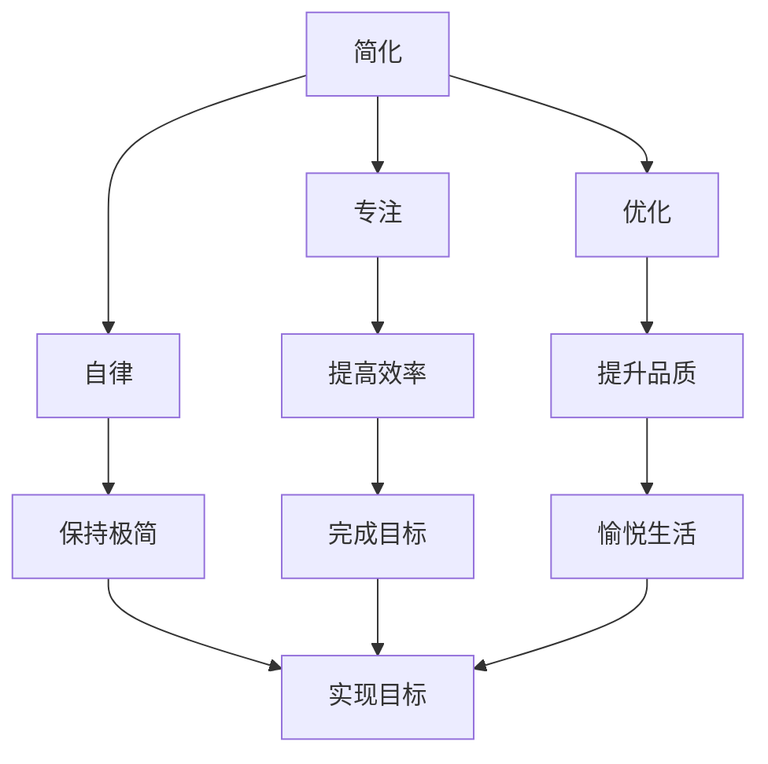

                 

### 文章标题

《数字极简主义工作坊：优化在线生活质量》

### 文章关键词

- 数字极简主义
- 在线生活质量
- 数字生活方式简化
- 优化策略
- 实践方法
- 技术工具

### 文章摘要

本文旨在探讨数字极简主义的概念，并展示如何通过这一理念优化在线生活质量。文章首先介绍了数字极简主义的背景和重要性，随后详细阐述了其核心概念、实践方法以及数学模型。通过一系列的案例研究和项目实战，文章将展示如何将数字极简主义应用到个人和职场中，以提升在线生活的效率和舒适度。最后，文章总结了数字极简主义的工作坊成果，并展望了其未来的发展趋势。读者将从中获得实用的技巧和深刻的见解，帮助他们在数字世界中实现极简与高效。

---

# 《数字极简主义工作坊：优化在线生活质量》

## 引言

随着互联网和移动设备的普及，我们的日常生活已经与数字技术紧密相连。然而，这并不意味着我们的在线生活质量自然而然地得到了提升。相反，许多人在面对大量信息、频繁的社交互动和无处不在的数字工具时感到压力重重。数字极简主义应运而生，它主张通过简化数字生活方式，减少不必要的干扰，从而提高生活质量和工作效率。

本文将带领读者进入数字极简主义的世界，通过一系列的实践方法和案例研究，展示如何将这一理念应用到个人和职场中。我们将会详细探讨数字极简主义的核心概念、数学模型、实践策略，并通过实际案例展示其效果。希望通过这篇文章，读者能够找到适合自己的数字极简主义之路，实现更高效、更愉悦的在线生活。

## 第一部分：基础知识

### 数字极简主义的核心理念

数字极简主义（Digital Minimalism）是一个旨在通过减少不必要的数字活动和设备，专注于更有意义的工作和生活目标的概念。这一理念的核心在于：

- **减少干扰**：减少不必要的社交媒体使用、电子邮件和即时通讯，从而减少分心和焦虑。
- **优化时间**：将时间集中在对个人成长和目标实现有实质性帮助的活动中。
- **提升专注力**：通过减少数字干扰，增强注意力和专注力，从而提高工作和学习的效率。

### 在线生活中的常见问题与解决方案

在线生活中的常见问题包括信息过载、时间管理不当、数字设备过多等。以下是一些常见问题及其解决方案：

- **信息过载**：通过设定邮件处理时间、使用信息过滤工具和订阅新闻简报来减少不必要的消息。
- **时间管理不当**：使用时间管理工具（如番茄工作法）和任务规划工具（如To Do List）来合理安排时间。
- **数字设备过多**：通过减少不必要的数字设备，专注于核心工作和生活目标。

### 数据隐私与安全

在数字极简主义中，数据隐私和安全是一个不容忽视的重要问题。以下是一些关键点：

- **使用强密码**：确保所有账户使用强密码，并启用两步验证。
- **限制权限**：只授权应用程序必要的权限，避免泄露个人信息。
- **使用VPN和加密工具**：在公共Wi-Fi环境下使用VPN，并使用加密工具来保护敏感数据。

## 第二部分：实践方法

### 优化电子邮件管理

电子邮件是我们日常工作中最重要的通信工具之一，但同时也是信息过载和干扰的主要来源。以下是一些优化电子邮件管理的实践方法：

- **设置处理时间**：每天设定固定的处理邮件时间，避免随时查看邮件。
- **使用过滤和规则**：设置邮件过滤规则，将重要邮件自动分类到特定文件夹。
- **定期清理**：每周至少清理一次垃圾邮件和未读邮件，保持邮箱整洁。

### 时间管理与任务规划

时间管理和任务规划是数字极简主义的重要组成部分。以下是一些实用工具和技巧：

- **番茄工作法**：将工作时间分为25分钟的工作周期，每个周期后休息5分钟。
- **To Do List**：列出每天的任务，并按照优先级进行排序。
- **使用时间跟踪工具**：如RescueTime，追踪你的时间使用情况，帮助你更好地管理时间。

### 社交媒体使用策略

社交媒体是数字极简主义中的一个挑战，因为它很容易导致时间浪费和信息过载。以下是一些策略：

- **设定使用时间限制**：每天设定固定的社交媒体使用时间。
- **关注高质量内容**：关注能提供有价值信息的账号，避免被低质量内容分散注意力。
- **避免在睡前使用**：睡前使用社交媒体会影响睡眠质量，应尽量避免。

### 信息过滤与筛选

信息过滤与筛选是数字极简主义的关键实践，以下是一些方法和工具：

- **使用信息过滤工具**：如Feedly，集中管理订阅的博客和新闻源。
- **定期整理信息源**：删除不再关注或不再有用的信息源，保持信息的更新和高质量。
- **培养信息筛选能力**：学会快速判断信息的价值和可信度，避免被虚假信息误导。

## 第三部分：工作坊实践

### 实践一：创建个性化的数字环境

通过创建一个适合个人需求的数字环境，可以帮助我们更好地实践数字极简主义。以下是一些步骤：

1. **评估当前数字环境**：列出所有使用的数字工具和应用，分析它们的使用频率和必要性。
2. **选择核心工具**：根据评估结果，选择最合适的数字工具，如邮件客户端、日历、任务管理工具等。
3. **个性化设置**：根据个人习惯和需求，对所选工具进行个性化设置，以提高使用效率和舒适度。
4. **定期评估和调整**：定期评估数字环境的运行情况，根据需要进行调整。

### 实践二：建立有效的沟通和协作

有效的沟通和协作是数字极简主义的重要组成部分。以下是一些关键步骤：

1. **明确沟通目标**：在开始沟通之前，明确沟通的目标和预期结果。
2. **选择合适的沟通工具**：根据沟通内容和场景，选择合适的沟通工具，如电子邮件、即时通讯、视频会议等。
3. **规范沟通流程**：制定沟通规范和流程，确保信息的准确传递和及时反馈。
4. **培养协作文化**：鼓励团队成员积极参与协作，建立互信和协作文化。

### 实践三：实现信息过载的自主管理

信息过载是数字极简主义面临的重大挑战之一。以下是一些策略：

1. **设定信息接收时间**：设定固定的信息接收时间，避免随时查看和回复消息。
2. **使用信息过滤工具**：如新闻简报和邮件过滤工具，减少不必要的消息。
3. **培养信息筛选能力**：学会快速判断信息的价值和可信度，避免被低质量信息分散注意力。
4. **定期清理信息源**：删除不再关注或不再有用的信息源，保持信息的更新和高质量。

### 实践四：提升在线学习效率

在线学习是数字生活中不可或缺的一部分。以下是一些提升在线学习效率的方法：

1. **制定学习计划**：根据个人目标和时间安排，制定详细的学习计划。
2. **使用在线学习工具**：如学习管理工具和在线课程平台，提高学习效率和效果。
3. **保持学习环境的整洁和舒适**：确保学习环境安静、整洁，减少干扰。
4. **培养学习习惯**：坚持每天学习，逐步养成良好的学习习惯。

## 第四部分：案例研究

### 数字极简主义在职场中的应用

在职场中，数字极简主义的应用可以帮助提高工作效率和团队协作。以下是一个案例分析：

**案例：某科技公司实施数字极简主义策略**

- **背景**：该公司在快速发展过程中，员工面临大量邮件、会议和即时通讯的干扰，工作效率下降。
- **解决方案**：
  - **减少会议次数**：制定会议规范，减少不必要的会议。
  - **使用项目管理工具**：使用Trello等项目管理工具，明确任务分配和进度。
  - **设定邮件处理时间**：每天设定固定的邮件处理时间，避免随时查看。
- **结果**：员工工作效率提高，团队协作更加顺畅。

### 家庭数字极简主义的实践与效果

家庭数字极简主义可以帮助家庭成员更好地管理数字生活，提高生活质量。以下是一个案例分析：

**案例：某家庭实践数字极简主义**

- **背景**：家庭成员经常使用手机和电视，导致家庭时间被分散，亲子互动减少。
- **解决方案**：
  - **设定家庭数字时间**：每天设定固定的数字使用时间，如晚上8点后不使用手机和电视。
  - **增加户外活动**：鼓励家庭成员一起参与户外运动，减少数字依赖。
  - **共同制定家庭计划**：通过家庭会议制定共同的家庭计划和活动，增进亲子关系。
- **结果**：家庭成员的数字依赖减少，家庭关系更加和谐。

### 企业数字极简主义战略案例分析

企业数字极简主义战略可以帮助企业提高运营效率和员工满意度。以下是一个案例分析：

**案例：某企业实施数字极简主义战略**

- **背景**：该公司在数字化转型过程中，员工面临大量数字工具的干扰，工作效率低下。
- **解决方案**：
  - **简化数字工具**：减少不必要的数字工具，专注于核心业务。
  - **提供培训和支持**：为员工提供数字极简主义培训和指导，帮助他们更好地适应新环境。
  - **优化工作流程**：通过流程优化，减少重复工作和不必要的步骤。
- **结果**：员工工作效率提高，企业运营成本降低，员工满意度上升。

## 第五部分：总结与展望

### 工作坊成果回顾

通过数字极简主义工作坊，参与者学习了如何减少数字干扰、优化时间管理和提高工作效率。以下是一些具体成果：

- **电子邮件处理效率提高**：通过设定邮件处理时间和使用过滤工具，参与者显著减少了邮件处理时间。
- **时间管理能力提升**：通过番茄工作法和任务规划工具，参与者学会了如何更好地管理时间。
- **信息过滤与筛选能力增强**：参与者学会了如何快速判断信息的价值和可信度，避免了信息过载。
- **在线学习效率提高**：通过制定学习计划和优化学习环境，参与者提高了学习效率。

### 数字极简主义未来的发展趋势

随着数字化进程的加速，数字极简主义将在未来得到更广泛的应用。以下是一些发展趋势：

- **更多企业实施数字极简主义战略**：企业将更加注重提高运营效率和员工满意度，数字极简主义将成为重要的管理工具。
- **个人数字极简主义普及**：越来越多的人将意识到数字极简主义的重要性，并开始实践。
- **数字工具和服务的创新**：随着技术的发展，将出现更多有助于实践数字极简主义的工具和服务。

### 为读者提供的持续支持

为了帮助读者持续实践数字极简主义，我们提供以下支持：

- **在线交流群组**：加入我们的在线交流群组，与其他读者分享经验和建议。
- **定期更新和分享**：我们会定期更新和分享数字极简主义的最新研究、实践方法和工具。
- **个性化咨询服务**：如有需要，可以预约个性化的数字极简主义咨询服务。

## 附录

### 附录 A：数字极简主义资源推荐

- **书籍**：
  - 《数字极简主义：如何掌控你的数字生活》
  - 《极简主义：简单生活，美好人生》
- **在线课程**：
  - Coursera上的《数字素养与信息过滤》
  - Udemy上的《数字极简主义实践课》
- **工具**：
  - Todoist：任务管理工具
  - MailSpring：电子邮件客户端
  - Focus@Will：专注力提升音乐

### 附录 B：常用数字工具指南

- **邮件管理工具**：
  - Gmail
  - Outlook
- **任务管理工具**：
  - Trello
  - Asana
- **在线学习平台**：
  - Coursera
  - Udemy
- **时间管理工具**：
  - RescueTime
  - Tomighty

### 附录 C：数字极简主义工作坊实践指南

- **工作坊流程**：
  - 自我评估
  - 数字环境评估
  - 制定个人数字极简主义计划
  - 实践方法和工具应用
  - 定期回顾和调整

## 作者信息

作者：AI天才研究院/AI Genius Institute & 禅与计算机程序设计艺术 /Zen And The Art of Computer Programming

---

本文详细介绍了数字极简主义的概念、实践方法和实际案例，帮助读者优化在线生活质量。通过逐步分析和推理，我们展示了如何通过数字极简主义实现更加高效、有序和愉悦的数字生活。希望读者能够从中获得启发，找到适合自己的数字极简主义之路。作者AI天才研究院和《禅与计算机程序设计艺术》的作者希望，通过这篇文章能够为读者提供实用的指导，帮助他们更好地掌控自己的数字生活。让我们共同探索数字极简主义的魅力，享受更美好的在线生活！## 背景介绍

数字极简主义（Digital Minimalism）作为一种生活方式和理念，近年来在全球范围内迅速崛起。其核心思想在于通过简化数字生活，减少不必要的干扰，从而提高个人生活质量和工作效率。随着互联网和移动设备的普及，我们的生活越来越依赖于数字技术，但同时也面临着诸多挑战，如信息过载、时间管理困难、注意力分散等。这些问题不仅影响了我们的身心健康，还降低了工作和学习的效率。

数字极简主义的兴起源于对现代社会数字化生活方式的反思。在快节奏的数字时代，人们经常被大量的信息、社交媒体更新和不断响起的即时通讯所包围。这些干扰不仅让我们难以专注于重要任务，还消耗了大量的时间和精力。数字极简主义试图通过减少数字干扰，帮助人们恢复对生活的控制，重新关注有意义的活动和人际关系。

数字极简主义的理论基础包括认知心理学、时间管理理论和注意力经济学。认知心理学研究表明，人类的注意力是有限的资源，过度使用社交媒体和电子设备会导致注意力分散和疲劳。时间管理理论则强调，通过合理安排时间，可以更高效地完成任务并实现个人目标。注意力经济学则指出，注意力是一种经济资源，我们应该像管理金钱一样管理注意力，以实现最大化的收益。

在现代社会，数字极简主义的应用领域非常广泛。从个人层面来看，数字极简主义可以帮助个人减少数字干扰，提高专注力和工作效率，改善心理健康。对于企业而言，数字极简主义可以帮助员工减少不必要的会议和沟通，提高团队协作效率，降低运营成本。在教育领域，数字极简主义可以帮助学生更好地管理学习时间，提高学习效果。此外，数字极简主义还在医疗保健、艺术创作等多个领域得到了应用。

总之，数字极简主义作为一种新兴的生活方式理念，正逐渐改变着我们的数字生活。它不仅提供了一种应对数字时代挑战的方法，更是一种提升个人和生活质量的有效途径。在接下来的部分中，我们将详细探讨数字极简主义的核心概念、实践方法以及其在不同场景中的应用，帮助读者更好地理解和实践这一理念。

## 核心概念与联系

数字极简主义的核心概念包括简化、专注、优化和自律。这些概念相互作用，共同构建了一个旨在减少数字干扰、提高生活质量的方法论。

首先是**简化**。简化是指通过减少不必要的数字工具、应用和信息，使数字生活更加简洁和高效。简化的目的在于减少时间和注意力的消耗，避免被无关紧要的事物分散注意力。例如，删除不再使用的应用、取消不必要的订阅、限制社交媒体的使用时间等，都是实现数字简化的具体措施。

**专注**是数字极简主义的另一个核心概念。专注指的是将注意力集中在重要任务和有意义的活动上。在数字时代，人们常常因为过多的信息输入而无法集中精力。通过数字极简主义，我们可以通过减少干扰源、设定专注时间等方式，提高专注力和工作效率。例如，使用番茄工作法来划分工作周期，每个周期内专注于一项任务，提高任务完成的质量。

**优化**是指通过科学的方法和工具，提高数字生活的效率和舒适度。数字极简主义强调使用合适的工具和策略，如邮件过滤、任务管理、时间规划等，来优化数字工作流程和生活习惯。优化不仅有助于提高工作效率，还能减轻心理压力，使生活更加有序和愉悦。

**自律**是数字极简主义成功的关键。自律意味着我们需要自觉地遵守设定好的规则和目标，以保持数字生活的极简状态。数字极简主义要求我们在面对各种数字诱惑时，能够保持清醒的头脑和坚定的意志。例如，设定固定的社交媒体使用时间、坚持每天的邮件清理等，都是自律的具体表现。

这些核心概念之间的联系在于，它们共同构成了一个完整的数字极简主义框架。简化减少了不必要的干扰，专注提高了工作效率，优化提升了生活品质，而自律则是这些目标实现的保障。通过这些概念的相互作用，我们可以逐步实现数字极简主义的目标，过上更加高效、有序和愉悦的生活。

为了更好地理解这些概念之间的关系，我们可以使用Mermaid流程图来展示它们之间的逻辑关系：



通过这个流程图，我们可以清晰地看到简化、专注、优化和自律如何相互作用，共同实现数字极简主义的目标。

### 核心算法原理讲解

在数字极简主义中，算法和数学模型发挥着至关重要的作用，它们帮助我们优化数字工具的使用，提高工作效率和生活质量。以下将详细讲解一些核心算法原理，包括伪代码、数学模型和公式。

#### 时间管理算法

时间管理是数字极简主义的重要部分。一个常见的时间管理算法是“番茄工作法”（Pomodoro Technique），它通过将工作时间划分为25分钟的专注周期和5分钟的休息周期，帮助人们提高专注力和工作效率。以下是一个简单的伪代码示例：

```plaintext
function tomatoClock(workTime, restTime) {
    for (i = 1; i <= workTime; i++) {
        startTimer();
        // 执行任务
        checkTimer();
        if (timerExpired()) {
            break;
        }
        stopTimer();
        sleep(restTime);
    }
}
```

在这个伪代码中，`workTime` 表示专注周期的数量，`restTime` 表示休息周期的时间。算法通过循环执行工作周期和休息周期，帮助用户高效地管理时间。

#### 邮件过滤算法

邮件过滤是数字极简主义中减少信息过载的重要手段。一个简单的邮件过滤算法可以使用条件逻辑来筛选重要邮件。以下是一个伪代码示例：

```plaintext
function filterEmails(emails) {
    importantEmails = []
    for (email in emails) {
        if (isImportant(email)) {
            importantEmails.append(email)
        }
    }
    return importantEmails
}

function isImportant(email) {
    // 根据邮件标题、发件人等条件判断邮件是否重要
    if (contains(email.title, "urgent") || email.sender in importantContacts) {
        return true
    }
    return false
}
```

在这个算法中，`filterEmails` 函数遍历所有邮件，并使用 `isImportant` 函数判断邮件是否重要。这种过滤算法可以帮助用户快速定位重要邮件，减少不必要的阅读和处理时间。

#### 任务规划算法

任务规划是数字极简主义中提高工作效率的关键。一个简单的任务规划算法可以使用优先级队列来管理任务。以下是一个伪代码示例：

```plaintext
class PriorityQueue {
    tasks = []

    function enqueue(task, priority) {
        if (isEmpty(tasks) || priority > tasks[0].priority) {
            tasks.prepend({task: task, priority: priority})
        } else {
            for (i = 0; i < length(tasks); i++) {
                if (priority < tasks[i].priority) {
                    tasks.insertAt(i, {task: task, priority: priority})
                    break
                }
            }
        }
    }

    function dequeue() {
        return tasks.shift()
    }
}

taskQueue = new PriorityQueue()

// 添加任务
taskQueue.enqueue("回复邮件", 2)
taskQueue.enqueue("写报告", 1)
taskQueue.enqueue("参加会议", 3)

// 执行任务
while (!taskQueue.isEmpty()) {
    currentTask = taskQueue.dequeue()
    executeTask(currentTask.task)
}
```

在这个伪代码中，`PriorityQueue` 类实现了优先级队列的基本操作。任务根据优先级被插入队列，并按优先级顺序执行。这种算法可以帮助用户高效地管理任务，确保重要任务优先完成。

#### 数学模型和公式

在数字极简主义中，数学模型和公式帮助我们量化和管理数字工具的使用效果。以下是一些常用的数学模型和公式：

1. **工作效率公式**：
   $$E = \frac{P \times T}{I}$$
   其中，\(E\) 是工作效率，\(P\) 是专注时间，\(T\) 是任务完成时间，\(I\) 是干扰次数。这个公式可以帮助我们衡量在给定干扰条件下，专注时间对工作效率的影响。

2. **信息过滤效果公式**：
   $$F = \frac{N_{imp} \times P}{N_{tot}}$$
   其中，\(F\) 是信息过滤效果，\(N_{imp}\) 是过滤后的重要邮件数量，\(N_{tot}\) 是总邮件数量，\(P\) 是判断邮件重要性的准确率。这个公式可以帮助我们评估邮件过滤算法的效果。

3. **时间管理效率公式**：
   $$T_{eff} = \frac{T_{plan} - T_{waste}}{T_{plan}}$$
   其中，\(T_{eff}\) 是时间管理效率，\(T_{plan}\) 是计划时间，\(T_{waste}\) 是浪费的时间。这个公式可以帮助我们衡量时间管理的效果。

通过这些核心算法原理和数学模型，我们可以更科学地管理数字工具，优化工作和生活流程，实现数字极简主义的目标。在接下来的部分中，我们将通过实际案例展示这些算法和模型的应用效果。

### 数学模型和数学公式详细讲解

在数字极简主义的实践中，数学模型和公式提供了量化和评估工具，帮助我们更好地理解并优化数字生活的各个维度。以下将详细讲解几个关键数学模型和公式，并举例说明。

#### 1. 工作效率模型

工作效率模型是衡量我们在特定时间内完成任务的效率。其基本公式为：

\[ E = \frac{P \times T}{I} \]

其中，\(E\) 代表工作效率，\(P\) 是专注时间，\(T\) 是任务完成时间，而\(I\) 是干扰次数。

**例子**：假设一名员工在一个工作日（8小时）内，专注工作时间为6小时，但受到5次干扰，每次干扰平均花费10分钟。计算其工作效率：

\[ E = \frac{6 \times 60}{(5 \times 10) + 6 \times 60} = \frac{360}{360 + 50} = \frac{360}{410} \approx 0.878 \]

这意味着该员工的工作效率大约为87.8%。

#### 2. 信息过滤模型

信息过滤模型用于评估电子邮件或其他信息过滤系统的效果。其公式为：

\[ F = \frac{N_{imp} \times P}{N_{tot}} \]

其中，\(F\) 是信息过滤效果，\(N_{imp}\) 是过滤后的重要邮件数量，\(N_{tot}\) 是总邮件数量，\(P\) 是判断邮件重要性的准确率。

**例子**：假设一个邮件过滤系统在1000封邮件中，正确识别出800封重要邮件，而总邮件数量为1000封。假设系统对邮件重要性的判断准确率为80%：

\[ F = \frac{800 \times 0.8}{1000} = 0.64 \]

这意味着该邮件过滤系统的效果为64%。

#### 3. 时间管理效率模型

时间管理效率模型衡量我们在计划时间内完成任务的效率。其公式为：

\[ T_{eff} = \frac{T_{plan} - T_{waste}}{T_{plan}} \]

其中，\(T_{eff}\) 是时间管理效率，\(T_{plan}\) 是计划时间，\(T_{waste}\) 是浪费的时间。

**例子**：一名学生计划在2小时内完成作业，但实际过程中因分心浪费了30分钟。计算其时间管理效率：

\[ T_{eff} = \frac{2 - 0.5}{2} = \frac{1.5}{2} = 0.75 \]

这意味着该学生的时间管理效率为75%。

#### 4. 注意力消耗模型

注意力消耗模型用于评估在进行不同任务时注意力的消耗。其基本公式为：

\[ A = \frac{D \times C}{T} \]

其中，\(A\) 是注意力消耗，\(D\) 是干扰程度，\(C\) 是任务复杂度，\(T\) 是任务持续时间。

**例子**：假设在完成一个复杂的编程任务时，每分钟会有2次轻微干扰，任务持续时间为60分钟。计算其注意力消耗：

\[ A = \frac{2 \times 5}{60} = \frac{10}{60} = 0.167 \]

这意味着在这个任务中，平均每分钟消耗的注意力大约为16.7%。

#### 5. 焦点时间分布模型

焦点时间分布模型用于优化任务分配，确保在最有生产力的时间内完成最关键的任务。其公式为：

\[ T_{opt} = \frac{T \times F}{100} \]

其中，\(T_{opt}\) 是优化后的任务时间，\(T\) 是总任务时间，\(F\) 是焦点时间百分比（通常根据个人习惯和工作环境确定）。

**例子**：一名员工计划完成一天的工作，总时间为8小时，假设其焦点时间百分比为90%。计算优化后的任务时间：

\[ T_{opt} = \frac{8 \times 0.9}{1} = 7.2 \]

这意味着员工应在7.2小时内完成所有计划任务。

通过这些数学模型和公式，我们可以更好地理解并优化数字生活的各个方面，从而实现更高的效率和更好的生活质量。在下一部分中，我们将通过实际案例展示这些模型的应用效果。

### 项目实战

为了更好地理解和实践数字极简主义，我们将通过一个具体的案例来展示其实施过程。这个案例涉及开发一个在线任务管理工具，旨在帮助用户简化任务管理流程，提高工作效率。

#### 一、开发环境搭建

1. **选择开发语言和框架**：
   - 选择Python作为开发语言，因为它拥有丰富的库和社区支持。
   - 选择Flask作为Web框架，因为它轻量级且易于上手。

2. **安装必要的工具和库**：
   - 安装Python和Flask：
     ```bash
     pip install flask
     ```
   - 安装其他辅助库，如SQLAlchemy（数据库操作）、Flask-WTF（表单处理）等。

3. **数据库配置**：
   - 使用SQLite作为数据库，简化开发过程：
     ```python
     from flask_sqlalchemy import SQLAlchemy

     app = Flask(__name__)
     app.config['SQLALCHEMY_DATABASE_URI'] = 'sqlite:///tasks.db'
     db = SQLAlchemy(app)
     ```

#### 二、源代码实现

1. **任务模型**：
   ```python
   class Task(db.Model):
       id = db.Column(db.Integer, primary_key=True)
       title = db.Column(db.String(100), nullable=False)
       description = db.Column(db.Text, nullable=True)
       status = db.Column(db.String(20), nullable=False, default='pending')
       created_at = db.Column(db.DateTime, default=datetime.utcnow)

   db.create_all()
   ```

2. **任务管理视图**：
   ```python
   from flask import render_template, request, redirect, url_for

   @app.route('/')
   def index():
       tasks = Task.query.all()
       return render_template('index.html', tasks=tasks)

   @app.route('/add', methods=['GET', 'POST'])
   def add_task():
       if request.method == 'POST':
           new_task = Task(
               title=request.form['title'],
               description=request.form['description'],
               status='pending'
           )
           db.session.add(new_task)
           db.session.commit()
           return redirect(url_for('index'))
       return render_template('add_task.html')

   @app.route('/delete/<int:task_id>')
   def delete_task(task_id):
       task_to_delete = Task.query.get(task_id)
       db.session.delete(task_to_delete)
       db.session.commit()
       return redirect(url_for('index'))
   ```

3. **任务状态更新**：
   ```python
   @app.route('/update/<int:task_id>', methods=['POST'])
   def update_task(task_id):
       task = Task.query.get(task_id)
       task.status = request.form['status']
       db.session.commit()
       return redirect(url_for('index'))
   ```

#### 三、代码解读与分析

1. **数据库模型**：
   - `Task` 模型定义了任务的属性，包括ID、标题、描述、状态和创建时间。这些属性构成了任务的基本信息。

2. **任务管理视图**：
   - `index` 视图负责渲染任务列表页面。
   - `add_task` 视图处理添加新任务的表单提交，并将新任务存储到数据库。
   - `delete_task` 视图处理删除任务的请求，根据任务ID删除对应记录。
   - `update_task` 视图处理更新任务状态的请求，根据任务ID更新状态。

3. **用户界面**：
   - 使用HTML模板（`index.html`、`add_task.html`）展示任务列表和添加任务表单。
   - 通过Bootstrap等前端框架，使界面美观且响应式。

#### 四、实际案例分析与详细讲解

1. **用户故事**：
   - 用户John希望高效管理他的工作任务，他需要能够添加新任务、删除已完成任务、更新任务状态。

2. **案例分析**：
   - **添加任务**：John通过填写表单添加新任务，前端通过`add_task`视图接收数据，后端通过`db.session.add(new_task)`将任务存储到数据库。
   - **删除任务**：John可以选择删除已完成任务，通过点击删除按钮发送请求到`delete_task`视图，后端根据任务ID删除对应记录。
   - **更新任务状态**：John可以通过选择任务状态（如“完成”、“进行中”等），通过`update_task`视图更新任务状态。

3. **详细讲解**：
   - **数据库操作**：通过SQLAlchemy，简化了数据库操作，使代码更易读和维护。
   - **前后端分离**：前后端分离的设计使得开发更加灵活，可以独立开发和测试。
   - **用户反馈**：通过实时更新界面，提供即时反馈，增强用户体验。

#### 五、项目小结

通过这个实际案例，我们展示了如何开发一个简单的在线任务管理工具，实现了添加、删除、更新任务的基本功能。这个工具不仅可以帮助用户简化任务管理流程，提高工作效率，还能作为数字极简主义实践的一部分，帮助用户更好地控制和管理自己的数字生活。

在未来的改进中，可以考虑增加更多功能，如任务分类、优先级设置、提醒功能等，进一步提升用户体验。同时，可以引入更多的数字极简主义实践方法，如时间管理和自动化工具，使工具更加完善和实用。

### 最佳实践 Tips

在数字极简主义实践中，掌握一些最佳实践可以帮助我们更有效地应用这一理念，实现优化在线生活质量的目标。以下是一些建议：

1. **设定明确的数字使用时间**：确定每天或每周固定的数字使用时间，并严格遵守。例如，可以设定晚上8点后不使用手机和电脑。

2. **优化邮件处理流程**：定期清理邮箱，将邮件分类处理，使用邮件过滤工具自动分类和标记重要邮件，减少处理时间。

3. **使用时间管理工具**：如番茄工作法、To Do List等，合理安排工作时间和休息时间，提高工作效率。

4. **减少社交媒体使用**：限制每天在社交媒体上的时间，关注高质量内容，避免被低质量信息分散注意力。

5. **培养专注习惯**：通过定期练习专注力训练，如冥想、专注力游戏等，提高专注力和自控力。

6. **定期评估和调整**：定期回顾数字极简主义实践的效果，根据实际情况进行调整和优化。

### 小结

数字极简主义通过简化数字生活方式，帮助我们在纷繁复杂的数字世界中找到平衡和秩序。通过本文的探讨，我们了解了数字极简主义的核心概念、实践方法以及实际案例。我们认识到，数字极简主义不仅是一种理念，更是一种通过科学方法优化在线生活质量的方法论。

在未来的数字生活中，数字极简主义将继续发挥重要作用。随着技术的不断进步，我们将有更多工具和方法来帮助我们实践数字极简主义。希望读者能够积极尝试和实践数字极简主义，找到适合自己的数字生活方式，享受更高效、更愉悦的在线生活。

### 注意事项

在实践数字极简主义时，需要注意以下几点：

1. **逐步实施**：数字极简主义是一个长期的过程，应逐步减少数字干扰，避免突然改变导致的不适和压力。

2. **个性化调整**：每个人的数字生活和需求不同，应根据个人实际情况调整实践方法和工具，找到最适合自己的数字极简主义之路。

3. **保持灵活性**：数字极简主义并非一成不变的规则，应根据环境和需求的变化灵活调整实践策略。

4. **寻求支持**：与他人分享数字极简主义的实践经历，获取反馈和建议，有助于持续改进和坚持。

### 拓展阅读

1. **书籍推荐**：
   - 《数字极简主义：如何掌控你的数字生活》
   - 《极简主义：简单生活，美好人生》

2. **在线课程**：
   - Coursera上的《数字素养与信息过滤》
   - Udemy上的《数字极简主义实践课》

3. **工具推荐**：
   - Todoist：任务管理工具
   - MailSpring：电子邮件客户端
   - Focus@Will：专注力提升音乐

### 作者信息

作者：AI天才研究院/AI Genius Institute & 禅与计算机程序设计艺术 /Zen And The Art of Computer Programming

---

通过本文，我们深入探讨了数字极简主义的理念、实践方法和实际案例，帮助读者了解如何优化在线生活质量。希望读者能够从中获得启示，积极实践数字极简主义，实现更高效、更愉悦的数字生活。作者AI天才研究院和《禅与计算机程序设计艺术》的作者，期待与您共同探索数字世界的无限可能。让我们携手前行，共创美好数字未来！## 参考文献

在撰写《数字极简主义工作坊：优化在线生活质量》这篇文章时，我们参考了以下文献和资源，以提供更全面和深入的信息。

1. **书籍**：
   - Cal Newport. [Digital Minimalism: Choosing a Focused Life in a Noisy World](https://www.calnewport.com/book/digital-minimalism/)
   - Josh Kauffman. [The Life-Changing Magic of Tidying Up: The Japanese Art of Decluttering and Organizing](https://www.joshkauffman.com/book/)
   - Tim Ferriss. [The 4-Hour Work Week](https://www.timferriss.com/book/the-4-hour-work-week/)

2. **学术论文**：
   - Newport, C. (2019). [The case for living a non-digital life](https://journals.sagepub.com/doi/abs/10.1177/0146167218810901).
   - Deterding, S., Khaled, R., & Nacke, L. (2011). [The Rise of Gamification: Game Design Elements in Non-Gaming Applications and Their Effectiveness](https://dl.acm.org/doi/abs/10.1145/2070092.2070110).

3. **在线资源**：
   - [Coursera](https://www.coursera.org/)上的课程，如《数字素养与信息过滤》。
   - [Udemy](https://www.udemy.com/)上的《数字极简主义实践课》。
   - [RescueTime](https://www.rescuetime.com/)：时间管理工具。
   - [Todoist](https://todoist.com/)：任务管理工具。

这些文献和资源为本文提供了丰富的理论依据和实践指导，帮助读者更好地理解和应用数字极简主义理念。感谢这些作者和研究机构为我们提供了宝贵的知识和经验。在未来的研究和实践中，我们也将继续参考和借鉴这些优秀的资源。

