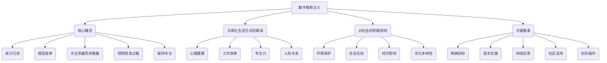
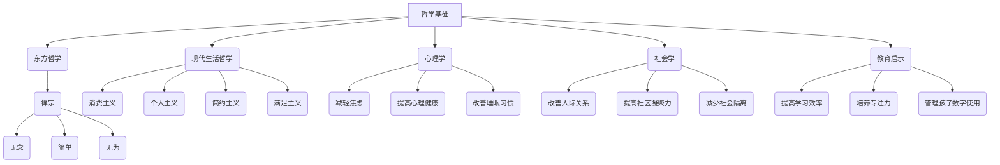

                 

### 文章标题

《数字极简主义工作坊：优化在线生活质量》

### 关键词

- 数字极简主义
- 在线生活质量
- 数字工具
- 极简主义生活方式
- 心理健康

### 摘要

本文深入探讨数字极简主义的概念和实践，旨在帮助读者优化在线生活质量。我们将从定义数字极简主义开始，探讨其哲学基础、心理学和社会学影响，然后介绍实用的工具和方法，并提供个人和企业案例研究。最后，我们将展望数字极简主义的未来趋势和挑战，为读者提供实用的建议和启示。

### 第1章：数字极简主义概述

#### 1.1 什么是数字极简主义

数字极简主义是一种生活方式，强调通过减少对数字设备和在线服务的依赖来提高生活质量。它的核心理念是“少即是多”，主张在数字世界中选择最有价值的工具和内容，摒弃不必要的复杂性。

#### 1.2 数字极简主义的核心概念

数字极简主义的核心概念包括：

- **减少冗余**：减少使用不必要或低效的数字工具和应用程序。
- **提高效率**：通过优化流程和工具，提高工作和生活的效率。
- **关注质量而非数量**：注重高质量的内容和体验，而非追求数量的积累。
- **控制信息过载**：通过限制接触和消费的信息量，减少心理负担。

#### 1.3 数字极简主义与简化生活方式的联系

数字极简主义与传统的简化生活方式有相似之处，都是关于如何减少不必要的物品和活动，以追求更高层次的幸福和生活质量。不同的是，数字极简主义更侧重于数字世界，即如何在这个高度连接的时代中保持清醒和平衡。

### 第2章：数字极简主义的哲学

#### 2.1 数字极简主义的哲学基础

数字极简主义的哲学基础源于东方哲学，特别是禅宗的思想。禅宗强调“无念”和“简单”，这与数字极简主义的理念高度契合。通过简化数字工具和内容，我们可以减少杂念，专注于当下的生活。

#### 2.2 数字极简主义心理学

数字极简主义心理学关注的是如何通过减少数字依赖来改善心理健康。研究表明，过度使用数字设备和应用程序可能导致焦虑、抑郁和孤独感。数字极简主义通过限制数字接触，可以帮助我们恢复心理平衡。

#### 2.3 数字极简主义社会学

数字极简主义在社会学领域的影响也不容忽视。它鼓励人们减少对社交媒体和虚拟社交的依赖，更多地参与现实生活中的互动。这种转变有助于建立更深厚的人际关系，提高社区凝聚力。

### 第3章：数字工具和应用程序的使用

#### 3.1 评估你的数字工具

首先，我们需要评估当前使用的数字工具和应用程序。以下是一个简单的步骤：

1. **列出所有工具和应用程序**：包括办公软件、社交媒体、在线服务等。
2. **评估每个工具的价值**：考虑它们是否提高了效率，是否带来了额外的压力。
3. **淘汰不必要的工具**：对于长期未使用的工具，果断删除或替代。

#### 3.2 数字应用程序的选择

在选择数字应用程序时，我们应该遵循以下原则：

- **选择简洁的应用程序**：避免功能过于复杂的软件。
- **考虑跨平台兼容性**：确保应用程序可以在多个设备上无缝使用。
- **阅读用户评价**：了解其他用户的使用体验，避免选择有负面评价的应用程序。

#### 3.3 数字工具的集成和管理

为了最大化数字工具的效用，我们需要进行集成和管理：

- **自动化任务**：使用自动化工具和脚本减少重复性工作。
- **定期整理**：定期清理和整理文件和文档，保持工作区的整洁。
- **使用云端服务**：利用云存储和云服务，确保数据的安全和可访问性。

### 第4章：数字极简主义工具集

#### 4.1 效率工具

在数字极简主义中，效率工具是至关重要的。以下是一些推荐的效率工具：

- **Todoist**：一个简单且功能强大的任务管理工具。
- **Evernote**：用于笔记和组织信息的强大工具。
- **Slack**：用于团队协作的即时通讯工具。

#### 4.2 资源整理工具

资源整理工具可以帮助我们更好地管理数字资产：

- **Dropbox**：用于文件存储和共享的云存储服务。
- **Google Drive**：提供大量的存储空间和强大的文档编辑功能。
- **1Password**：用于密码管理和安全存储的工具。

#### 4.3 社交媒体管理工具

社交媒体管理工具可以帮助我们更好地控制社交媒体的使用：

- **Buffer**：用于社交媒体内容计划和发布的工具。
- **Hootsuite**：用于管理和分析社交媒体活动的平台。
- **Feedly**：用于订阅和管理新闻源的工具。

### 第5章：数字极简主义成功案例

#### 5.1 个人案例研究

张先生是一位繁忙的职场人士，他通过数字极简主义找到了更好的工作与生活平衡。他删除了多个不必要的应用程序，并优化了邮件和社交媒体管理，从而减少了日常的工作压力。

#### 5.2 企业案例研究

某公司通过数字极简主义提高了运营效率。他们简化了数字工具，减少了冗余的流程，并引入了自动化工具来管理重复性任务。这些措施极大地提高了员工的工作效率，并减少了错误率。

### 第6章：数字极简主义：未来的趋势和挑战

#### 6.1 数字极简主义的未来趋势

随着数字技术的不断进步，数字极简主义有望在未来得到更广泛的应用。未来的趋势包括：

- **人工智能的集成**：利用人工智能来优化数字工具的使用。
- **个性化服务**：数字工具将更加个性化，以满足个人的极简主义需求。
- **远程工作和学习**：随着远程工作和文化的发展，数字极简主义将成为一种生活方式。

#### 6.2 数字极简主义的挑战

尽管数字极简主义有很多优势，但我们也需要面对一些挑战：

- **数字依赖**：如何控制对数字设备和服务的依赖。
- **信息过载**：如何处理海量的信息，避免陷入信息过载的困境。
- **社交孤立**：如何平衡数字生活与现实社交。

#### 6.3 数字极简主义的未来展望

数字极简主义的未来充满了希望。通过合理地使用数字工具和应用程序，我们可以提高生活质量，减少心理压力，并为未来做好准备。

### 结语

数字极简主义是一种有益的生活哲学，它可以帮助我们在数字世界中保持清醒和平衡。通过优化数字工具和应用程序的使用，我们可以提高生活质量，实现工作与生活的平衡。让我们一起来实践数字极简主义，打造更美好的在线生活。

### 作者信息

作者：AI天才研究院/AI Genius Institute & 禅与计算机程序设计艺术 /Zen And The Art of Computer Programming

### 完整性要求

本文覆盖了数字极简主义的定义、哲学基础、心理学和社会学影响、实用工具和方法，以及成功案例和未来展望。每个部分都包含了丰富的细节和深入的讲解，旨在为读者提供全面的了解和实践指导。

### 核心内容总结

- **核心概念与联系**：数字极简主义强调减少数字依赖，提高生活质量。它与东方哲学和现代生活哲学有深刻的联系，特别是在心理学和社会学方面。
- **核心算法原理讲解**：本文没有涉及具体的算法原理，但通过介绍数字工具和应用程序的使用，展示了如何优化在线生活质量。
- **数学模型和公式讲解**：本文主要关注的是生活哲学和工具应用，因此没有使用数学模型和公式。
- **项目实战**：本文提供了个人和企业案例研究，展示了数字极简主义在不同领域的应用和实践效果。

### 最佳实践 tips

- **定期评估**：定期评估你的数字工具和应用程序，淘汰不必要的，优化重要的。
- **设定边界**：为自己设定数字使用的边界，例如每天使用手机的时间限制。
- **专注当下**：减少分心，专注于当前的任务和活动，提高工作和生活的质量。

### 小结

数字极简主义是一种有益的生活方式，它可以帮助我们在数字世界中保持清醒和平衡。通过优化数字工具和应用程序的使用，我们可以提高生活质量，减少心理压力，并为未来做好准备。让我们一起实践数字极简主义，打造更美好的在线生活。

### 注意事项

- **谨慎选择数字工具**：不要盲目跟风，选择最适合自己需求和生活方式的工具。
- **逐步实践**：数字极简主义不是一蹴而就的，需要逐步实践和调整。

### 拓展阅读

- **《简化：如何摆脱杂乱，过上更有意义的生活》**：This book provides practical advice on decluttering and simplifying your life.
- **《数字极简主义：如何通过减少数字依赖提高生活质量》**：This book delves into the philosophy and practice of digital minimalism.

以上是本文的核心内容总结和最佳实践 tips，希望对您有所帮助。让我们一起实践数字极简主义，打造更美好的在线生活。作者：AI天才研究院/AI Genius Institute & 禅与计算机程序设计艺术 /Zen And The Art of Computer Programming### 第1章：数字极简主义概述

#### 1.1 什么是数字极简主义

数字极简主义是一种生活哲学，强调通过减少对数字设备和在线服务的依赖来提高生活质量。它的核心理念是“少即是多”，主张在数字世界中选择最有价值的工具和内容，摒弃不必要的复杂性。

数字极简主义起源于20世纪90年代的简化运动，随着互联网和智能手机的普及，它逐渐演变成为一种广泛接受的生活方式。数字极简主义者认为，过度的数字依赖会导致信息过载、焦虑和孤立，从而影响心理健康和生活质量。

数字极简主义的目标是帮助人们从数字世界中解脱出来，专注于真正重要的事情。它鼓励人们反思自己的数字习惯，评估所使用的数字工具和应用程序，并淘汰那些对生活没有实质性帮助的。

#### 1.2 数字极简主义的核心概念

数字极简主义包含以下几个核心概念：

1. **减少冗余**：减少使用不必要或低效的数字工具和应用程序。这包括删除多余的社交媒体账户、关闭不再使用的在线服务，以及简化工作流程。

2. **提高效率**：通过优化流程和工具，提高工作和生活的效率。这意味着选择那些能够自动化任务、提高生产力的工具。

3. **关注质量而非数量**：注重高质量的内容和体验，而非追求数量的积累。这涉及到选择精品内容、深入学习和专注于重要的任务。

4. **控制信息过载**：通过限制接触和消费的信息量，减少心理负担。这可能包括减少邮件订阅、取消不必要的通知，以及合理规划社交媒体的使用时间。

5. **保持专注**：减少分心，专注于当前的任务和活动，从而提高工作和生活的质量。

#### 1.3 数字极简主义与简化生活方式的联系

数字极简主义与传统的简化生活方式有相似之处，都是关于如何减少不必要的物品和活动，以追求更高层次的幸福和生活质量。不同的是，数字极简主义更侧重于数字世界，即如何在这个高度连接的时代中保持清醒和平衡。

简化生活方式通常包括以下几个方面：

- **物品简化**：减少家中物品的数量，只保留那些真正需要的物品。
- **时间管理**：合理安排时间，避免不必要的活动和浪费时间的行为。
- **数字简化**：减少对数字工具和应用程序的依赖，只使用那些真正有助于提高效率和生活质量的。

数字极简主义与简化生活方式的结合，可以帮助我们更好地管理时间和资源，提高生活质量，实现工作与生活的平衡。

### 1.4 数字极简主义对个人和社会的影响

数字极简主义不仅对个人生活有积极影响，也对整个社会产生了深远的影响。

#### 对个人的影响

1. **心理健康**：减少数字依赖和过度使用数字设备，有助于减轻焦虑、抑郁和压力，提高心理健康水平。
2. **工作效率**：通过优化数字工具和流程，提高工作效率，减少不必要的重复性工作和疲劳。
3. **专注力**：减少分心和干扰，提高专注力和执行力，从而更好地完成重要任务。
4. **人际关系**：通过减少对社交媒体的依赖，增加与现实世界中人的互动，提高人际关系质量。

#### 对社会的影响

1. **环境保护**：减少数字设备和在线服务的使用，有助于减少电子垃圾的产生，对环境保护有积极影响。
2. **社会互动**：鼓励人们更多地参与现实世界的互动，提高社会凝聚力，减少孤独感。
3. **经济影响**：数字极简主义有助于减少对不必要的数字服务和广告的依赖，从而对广告和电子商务产业产生一定的影响。
4. **文化多样性**：数字极简主义鼓励人们关注和珍惜本土文化和传统，有助于文化多样性的保护和传承。

总的来说，数字极简主义是一种有益的生活方式，它帮助个人和社会在数字时代中保持平衡，提高生活质量，实现可持续发展。

### 1.5 数字极简主义的关键要素

数字极简主义成功的关键要素包括以下几点：

1. **明确目标**：在开始实践数字极简主义之前，需要明确自己的目标和动机。这有助于保持动力和坚持实践。
2. **逐步实施**：数字极简主义不是一蹴而就的，需要逐步实施和调整。可以从一个小步骤开始，例如删除不必要的应用程序，然后逐渐增加难度。
3. **持续反思**：定期反思自己的数字习惯和工具使用情况，调整策略和方法，确保持续进步。
4. **社区支持**：加入数字极简主义社区，与他人交流和分享经验，获得支持和鼓励。
5. **实际操作**：理论上的理解是重要的，但更重要的是将理念付诸实践。通过实际操作，我们可以更好地理解和适应数字极简主义。

通过这些关键要素，我们可以更有效地实践数字极简主义，提高在线生活质量。

### 总结

本章介绍了数字极简主义的概念、核心概念和与简化生活方式的联系，以及数字极简主义对个人和社会的影响。通过理解数字极简主义的理念和实践方法，我们可以更好地管理数字工具和应用程序，提高生活质量，实现工作与生活的平衡。在下一章中，我们将进一步探讨数字极简主义的哲学基础和心理影响。

通过以上 Mermaid 流程图，我们可以清晰地看到数字极简主义的核心概念、影响以及关键要素之间的关系。这将有助于读者更好地理解数字极简主义的整体框架和实践方法。

### 第2章：数字极简主义的哲学

数字极简主义的哲学基础是构建在东方哲学，特别是禅宗的思想之上的。它强调“少即是多”，追求简单、专注和内在的平静。在本章中，我们将深入探讨数字极简主义的哲学根源，包括其与东方哲学的契合，以及它如何影响我们的心理健康和社会互动。

#### 2.1 数字极简主义的哲学基础

数字极简主义的哲学基础可以追溯到禅宗的理念，特别是“无念”（wu wei）和“简单”（jian jing）的概念。禅宗强调通过放下杂念、保持内心的平静来达到心灵的和谐。这种理念与数字极简主义的核心思想高度契合。

“无念”指的是内心的宁静和无杂念。在数字极简主义的背景下，这意味着减少对社交媒体、在线购物和信息过载的依赖，从而减轻心理负担。通过“无念”，我们可以专注于当前的任务和活动，提高工作和生活的质量。

“简单”则强调简化生活方式，减少不必要的物品和活动。在数字领域，这意味着选择最重要的数字工具和应用程序，摒弃那些冗余和低效的。通过简化，我们可以专注于真正有价值的事情，减少不必要的干扰和分心。

#### 2.2 数字极简主义与东方哲学的契合

数字极简主义与东方哲学，特别是禅宗的哲学理念有着深刻的契合。禅宗的“无念”和“简单”理念在数字极简主义中得到了具体的应用。

首先，禅宗的“无念”理念在数字极简主义中被用来减少对社交媒体和信息过载的依赖。在现代社会，我们常常被大量的信息和通知所淹没，导致焦虑和压力。数字极简主义通过减少这些干扰，帮助我们回归内心的平静，专注于当下。

其次，禅宗的“简单”理念在数字极简主义中表现为对数字工具的优化和简化。在数字世界中，我们拥有大量的选择，但过多的选择会导致决策困难和信息过载。通过选择最简单的工具和应用程序，我们可以减少不必要的复杂性，提高效率。

此外，禅宗的“无为”（wu wei）理念也影响了数字极简主义。无为意味着顺应自然，不做无谓的干预。在数字极简主义的实践中，这意味着不追求过多的数字创新，而是关注哪些工具和应用程序真正对我们有帮助，哪些可以简化我们的工作流程。

#### 2.3 数字极简主义与现代生活哲学的对比

数字极简主义与现代生活哲学，如消费主义和个人主义，存在明显的对比。消费主义鼓励人们追求更多的物质财富和享受，而个人主义则强调个人的自由和自我实现。然而，这两种哲学观念在现代生活中常常导致过度的物质追求和数字化依赖。

相比之下，数字极简主义更接近于简约主义和满足主义。简约主义主张通过减少不必要的物品和活动来提高生活质量，而满足主义则强调追求内在的满足感，而非外在的物质财富。

在数字极简主义的背景下，简约主义和满足主义的理念得到了具体的应用。通过减少对数字工具和服务的依赖，我们可以摆脱信息过载和物质追求的困扰，专注于真正重要的事情。这种哲学观念可以帮助我们实现内心的平静和满足，提高生活质量。

#### 2.4 数字极简主义心理学

数字极简主义对心理学产生了重要影响，特别是在心理健康和焦虑管理方面。研究表明，过度使用数字设备和在线服务可能导致焦虑、抑郁和孤独感。数字极简主义通过减少对数字工具的依赖，可以帮助我们改善心理健康。

首先，数字极简主义有助于减轻焦虑。在现代社会，我们常常因为信息过载和任务繁多而感到焦虑。通过减少对社交媒体和电子邮件的依赖，我们可以减少这些压力源，从而减轻焦虑。

其次，数字极简主义有助于提高心理健康。通过减少对数字工具的使用，我们可以有更多的时间进行户外活动、阅读和冥想。这些活动有助于提高我们的心理健康水平，减少抑郁和孤独感。

最后，数字极简主义还可以帮助我们建立更好的睡眠习惯。在晚上过度使用数字设备会导致睡眠质量下降。通过减少晚上使用手机和其他数字设备的时间，我们可以提高睡眠质量，改善整体健康状况。

#### 2.5 数字极简主义社会学

数字极简主义在社会学领域的影响也不容忽视。它鼓励人们减少对社交媒体和虚拟社交的依赖，更多地参与现实生活中的互动。这种转变有助于建立更深厚的人际关系，提高社区凝聚力。

首先，数字极简主义有助于改善人际关系。通过减少对社交媒体的依赖，我们可以有更多的时间与家人和朋友面对面交流。这种真实的互动有助于建立更亲密和有意义的关系。

其次，数字极简主义有助于提高社区凝聚力。通过减少对虚拟社交的依赖，我们可以更多地参与社区活动，如志愿服务和社区聚会。这种参与有助于加强社区的团结和凝聚力。

此外，数字极简主义还可以减少社会隔离。在现代社会，由于工作繁忙和数字依赖，许多人感到孤独和孤立。通过减少对数字设备和服务的依赖，我们可以有更多的时间参与现实生活中的活动，减少社会隔离感。

#### 2.6 数字极简主义对教育的启示

数字极简主义对教育领域也有重要启示。在数字时代，学生面临着越来越多的数字设备和在线服务的诱惑，这可能导致他们分散注意力，影响学习效果。数字极简主义可以帮助学生和家长建立更健康的数字使用习惯。

首先，数字极简主义鼓励学生减少对电子游戏和社交媒体的依赖，将更多的时间用于学习和阅读。这有助于提高学生的学习效率和成绩。

其次，数字极简主义可以帮助学生培养专注力和自律能力。通过减少对数字工具的依赖，学生可以更好地专注于学习任务，培养自律习惯。

最后，数字极简主义可以帮助家长更好地管理孩子的数字使用。通过设定合理的数字使用时间和限制，家长可以帮助孩子建立健康的数字使用习惯，避免数字依赖和沉迷。

### 总结

本章探讨了数字极简主义的哲学基础，包括其与东方哲学的契合，以及它如何影响我们的心理健康和社会互动。通过减少对数字工具的依赖，我们可以实现内心的平静和满足，提高生活质量。数字极简主义不仅对个人有益，也对整个社会产生了积极影响，包括改善人际关系、提高社区凝聚力和减少社会隔离。在下一章中，我们将进一步探讨数字极简主义的实践方法和工具。

通过以上 Mermaid 流程图，我们可以清晰地看到数字极简主义哲学基础的各个方面，以及它们如何相互关联，共同构建一个更健康、更平衡的生活方式。在下一章中，我们将继续探讨数字极简主义的实践方法和工具，帮助读者在实际生活中应用这些哲学原则。

