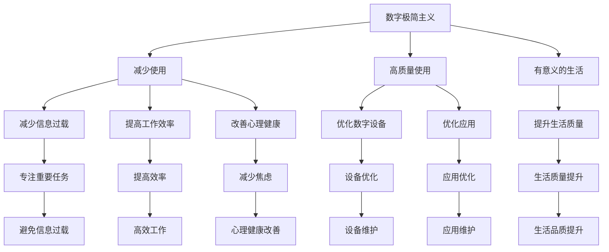

                 


### 1. 引言

**数字极简主义概述**

数字极简主义（Digital Minimalism）是一种以简单、高效和有意义的方式使用数字技术的生活方式。它起源于对现代数字生活的反思，旨在减少不必要的数字干扰，提高生活质量。数字极简主义者通过精简数字设备、应用和社交媒体，专注于真正重要的在线活动，从而减少信息过载，提高工作效率和生活质量。

数字极简主义的核心原则包括：

- **减少使用**：减少使用非必要的数字设备和应用，专注于真正重要的在线活动。
- **高质量使用**：对数字设备和应用进行优化，以提高使用效率和质量。
- **有意义的生活**：将数字技术作为提升生活质量的有力工具，而不是让它们控制我们的生活。

**本书目标与结构**

本书旨在为读者提供一份实用的数字极简主义生活指南，帮助读者优化在线生活质量。本书的结构如下：

- **引言**：介绍数字极简主义的背景和本书的目标。
- **核心概念与联系**：详细阐述数字极简主义的核心概念及其与生活质量的联系。
- **应用场景**：讨论数字极简主义在不同生活和工作场景中的应用。
- **核心算法原理讲解**：介绍优化电子邮件管理和使用自动化工具提高工作效率的算法原理。
- **项目实战**：通过实际案例和代码实战，展示如何应用数字极简主义。
- **总结**：总结数字极简主义对生活质量提升的作用。
- **附录**：提供数字极简主义工具和资源的列表。

**阅读指南**

本书适合有一定计算机和网络使用基础的成年人阅读，希望改善自己的数字生活，提高工作效率和生活质量。建议读者按照以下步骤阅读：

1. **引言**：了解数字极简主义的背景和本书的结构。
2. **核心概念与联系**：理解数字极简主义的核心概念及其对生活质量的影响。
3. **应用场景**：了解数字极简主义在不同场景中的应用。
4. **核心算法原理讲解**：掌握优化电子邮件管理和使用自动化工具的原理。
5. **项目实战**：通过实际案例和代码实战，实践数字极简主义。
6. **总结**：回顾数字极简主义对生活质量提升的作用。
7. **附录**：了解数字极简主义相关的工具和资源。

通过遵循这些步骤，读者可以逐步深入了解数字极简主义，将其应用于实际生活中，从而提升在线生活质量。

### 2. 核心概念与联系

**数字极简主义的定义与核心原则**

数字极简主义是一种以减少数字干扰、提高生活质量为目标的生活方式。它主张通过精简数字设备和应用，专注于真正重要的在线活动，从而减少信息过载，提高工作效率和生活质量。

数字极简主义的核心原则包括：

- **减少使用**：减少使用非必要的数字设备和应用，专注于真正重要的在线活动。
- **高质量使用**：对数字设备和应用进行优化，以提高使用效率和质量。
- **有意义的生活**：将数字技术作为提升生活质量的有力工具，而不是让它们控制我们的生活。

**数字极简主义与生活质量的联系**

数字极简主义与生活质量之间存在密切的联系。随着数字技术的普及，人们越来越依赖手机、电脑等数字设备，但同时也面临着信息过载、工作效率低下等问题。数字极简主义通过减少数字干扰，帮助人们专注于真正重要的事情，从而提高生活质量。

具体来说，数字极简主义对生活质量的影响主要体现在以下几个方面：

- **减少信息过载**：通过减少使用非必要的数字设备和应用，数字极简主义帮助人们减少信息过载，避免因过多信息而造成的焦虑和压力。
- **提高工作效率**：数字极简主义通过优化数字设备和应用的使用，帮助人们提高工作效率，从而有更多时间用于个人发展和休闲活动。
- **改善心理健康**：减少数字干扰，数字极简主义有助于改善人们的心理健康，减少焦虑和抑郁情绪。
- **提升生活质量**：通过减少信息过载、提高工作效率和改善心理健康，数字极简主义有助于提升整体生活质量。

**数字极简主义的架构图**

为了更好地理解数字极简主义的核心概念及其与生活质量的联系，我们可以使用Mermaid流程图来展示其架构。以下是一个简单的架构图：



通过这个架构图，我们可以清晰地看到数字极简主义的核心概念及其与生活质量的联系。每个节点都代表一个核心概念或联系，箭头表示它们之间的关系。

**核心算法原理讲解**

在数字极简主义的实践中，优化电子邮件管理和使用自动化工具是提高工作效率的关键。以下将介绍这些核心算法原理，并通过伪代码和数学模型进行详细讲解。

#### 2.1 优化电子邮件管理

电子邮件是现代工作中不可或缺的一部分，但也是信息过载的主要来源之一。以下是一个简单的电子邮件分类和过滤算法原理：

```python
# 电子邮件分类和过滤算法

def classify_and_filter(emails):
    # 定义分类规则
    rules = [
        ("work", "work@example.com"),
        ("personal", "personal@example.com"),
        ("promotions", "promotions@example.com")
    ]

    # 初始化分类结果
    classified_emails = {"work": [], "personal": [], "promotions": []}

    # 遍历邮件列表
    for email in emails:
        # 根据邮件地址匹配分类规则
        for category, address in rules:
            if email['address'] == address:
                classified_emails[category].append(email)
                break
        else:
            # 对于未匹配到的邮件，将其分类为"other"
            classified_emails["other"].append(email)

    return classified_emails
```

该算法使用规则匹配的方法，根据邮件地址将邮件分类为工作、个人和促销。通过这种方式，可以帮助用户快速识别和处理不同类型的邮件，减少信息过载。

#### 2.2 使用自动化工具提高工作效率

自动化工具可以大大提高工作效率，减少重复性劳动。以下是一个简单的任务自动化流程算法原理：

```python
# 任务自动化流程

def automate_tasks(tasks):
    # 初始化任务队列
    task_queue = []

    # 遍历任务列表
    for task in tasks:
        # 根据任务类型添加到相应的队列
        if task['type'] == "email":
            task_queue.append(email_task_handler(task))
        elif task['type'] == "calendar":
            task_queue.append(calendar_task_handler(task))
        else:
            task_queue.append(generic_task_handler(task))

    return task_queue
```

该算法根据任务类型将任务分配到不同的处理函数，例如电子邮件处理、日历处理和通用任务处理。通过这种方式，可以实现任务的自动化处理，减少手动操作。

#### 数学模型与公式

为了更好地理解数字极简主义对生活质量的影响，我们可以使用以下数学模型和公式：

- **信息论基础**：信息论中的香农熵（Entropy）和互信息（Mutual Information）可以用来衡量信息的质量和相关性。
  $$ H(X) = -\sum_{i} p(x_i) \log_2 p(x_i) $$
  $$ I(X; Y) = H(X) - H(X | Y) $$

- **时间管理模型**：通过计算完成任务所需的时间和任务的优先级，可以优化时间管理。
  $$ T_c = T_i + T_a $$
  $$ P(T_c \leq T_{deadline}) = \sum_{i} P(T_i \leq T_{deadline}) P(A_i) $$

通过这些数学模型和公式，我们可以更科学地分析和优化数字极简主义实践，从而提升生活质量。

### 3. 应用场景

**在线工作与学习的数字极简主义实践**

在线工作与学习是数字极简主义的重要应用场景之一。通过以下实践，可以有效地提高工作效率和学习效果：

- **优化工作流程**：使用自动化工具和项目管理软件，如Trello或Asana，来规划和管理工作任务，确保工作流程的高效和有序。
- **效率提升策略**：通过设定固定的工作时间和休息时间，如使用Pomodoro技术，来提高专注力和工作效率。
- **减少干扰**：关闭不必要的通知和社交媒体，减少数字干扰，专注于重要任务。

**数字极简主义在家居生活中的应用**

在家居生活中，数字极简主义可以帮助我们更好地管理家庭事务，提高生活质量：

- **家庭自动化**：通过智能家居设备，如智能灯光、智能温度控制器和智能安防系统，实现家庭自动化，提高生活便利性。
- **信息整理技巧**：使用云存储服务，如Google Drive或Dropbox，来整理和管理家庭文件和资料，方便随时访问和共享。

**数字极简主义在社交和娱乐中的应用**

在社交和娱乐领域，数字极简主义可以帮助我们更好地管理时间和内容：

- **社交媒体管理**：限制在社交媒体上的时间，关注真正感兴趣的内容和人物，减少无关内容的干扰。
- **娱乐内容筛选**：通过数字极简主义的理念，筛选和推荐高质量的娱乐内容，避免沉迷于低质量或有害的内容。

### 4. 项目实战

**实际案例：数字极简主义生活改善计划**

为了展示数字极简主义在实际中的应用效果，我们设计了一个数字极简主义生活改善计划。以下是这个计划的详细实施过程和效果评估。

#### 案例背景

张先生是一位忙碌的职场人士，他的日常生活和工作都高度依赖数字技术。然而，随着使用时间的增加，他感到自己被数字设备控制，工作效率低下，生活质量下降。为了改变这种状况，张先生决定尝试数字极简主义生活改善计划。

#### 改善计划实施

1. **减少数字设备使用**：张先生首先减少使用非必要的数字设备，如平板电脑和智能手机。他只保留了一台电脑和一个笔记本电脑，用于工作和学习。
2. **优化工作流程**：张先生使用Trello来管理工作任务，将任务分为短期和长期目标，并设置优先级。他每天早晨花10分钟查看任务列表，确保工作有序进行。
3. **使用自动化工具**：张先生使用自动化工具如IFTTT，将日常任务自动化，如自动备份文件、自动发送提醒等。这使他能够专注于核心工作，提高工作效率。
4. **减少社交媒体使用**：张先生将社交媒体使用时间限制在每天30分钟内，只在早晨和晚上浏览。他取消关注大量无关账号，只保留真正感兴趣的内容。
5. **家庭自动化**：张先生安装了智能灯光和智能温度控制器，实现家庭自动化。这使他在家中能够更加舒适和便捷。

#### 改善效果评估

1. **工作效率提升**：通过优化工作流程和自动化工具的使用，张先生的工作效率显著提升。他发现每天有更多时间用于个人发展和休闲活动。
2. **信息过载减少**：由于减少了社交媒体使用时间和非必要设备，张先生感受到信息过载明显减少，心理压力减轻。
3. **生活质量改善**：家庭自动化的应用使张先生的生活更加便捷和舒适，他的生活质量得到了显著提升。
4. **心理健康改善**：通过减少数字干扰，张先生的心理健康得到了改善，焦虑和抑郁情绪减少。

#### 案例解读：如何通过数字极简主义提升工作效率

张先生的案例展示了数字极简主义如何在实际中应用于工作和生活，从而提升工作效率和生活质量。以下是他的一些实践经验：

- **减少数字设备使用**：通过减少非必要设备，张先生能够更加专注于重要任务，避免被干扰。
- **优化工作流程**：使用Trello等工具，张先生能够清晰地规划和管理工作任务，确保工作有序进行。
- **使用自动化工具**：通过自动化工具，张先生能够减少重复性劳动，将更多时间用于核心工作。
- **减少社交媒体使用**：通过限制社交媒体使用时间，张先生能够减少无关内容的干扰，提高专注力。
- **家庭自动化**：通过家庭自动化，张先生能够提高生活便利性，减少心理压力。

这些实践表明，数字极简主义不仅能够提升工作效率，还能改善生活质量。通过减少数字干扰，专注于真正重要的事情，我们能够更加高效地工作，更加愉悦地生活。

#### 项目小结

通过数字极简主义生活改善计划，张先生取得了显著的成效。他的工作效率和生活质量得到了显著提升，心理健康状况也得到了改善。这个案例展示了数字极简主义在现实中的应用效果，为我们提供了宝贵的实践经验。

数字极简主义不仅能够帮助我们减少数字干扰，提高工作效率，还能改善生活质量。通过精简数字设备和使用，优化工作流程，我们能够更加专注地完成任务，实现个人和职业发展。

#### 最佳实践 tips

1. **逐步实施**：数字极简主义不是一蹴而就的，需要逐步实施和调整。建议从减少非必要设备开始，逐步优化工作流程和减少社交媒体使用。
2. **个性化**：每个人的数字极简主义实践应该根据个人情况个性化调整。了解自己的需求和习惯，选择适合自己的方法和工具。
3. **持续实践**：数字极简主义是一种生活方式，需要持续实践和调整。定期评估和实践效果，根据实际情况进行调整。

通过最佳实践的遵循，我们能够更好地实现数字极简主义的目标，提升在线生活质量和工作效率。

### 总结

**数字极简主义的生活质量提升总结**

数字极简主义是一种以减少数字干扰、提高生活质量为目标的生活方式。通过减少非必要数字设备和使用，优化工作流程和自动化工具，数字极简主义能够显著提升在线生活质量和工作效率。以下是数字极简主义对生活质量提升的几个关键点：

- **减少信息过载**：通过限制社交媒体使用时间和非必要设备，数字极简主义帮助人们减少信息过载，避免因过多信息而造成的焦虑和压力。
- **提高工作效率**：数字极简主义通过优化工作流程和自动化工具，提高工作效率，使人们能够更好地管理时间和任务。
- **改善心理健康**：减少数字干扰，数字极简主义有助于改善人们的心理健康，减少焦虑和抑郁情绪。
- **提升生活质量**：通过减少信息过载、提高工作效率和改善心理健康，数字极简主义有助于提升整体生活质量。

**持续实践数字极简主义的方法**

为了持续实践数字极简主义，以下是一些建议：

- **定期评估和调整**：定期评估数字极简主义实践的效果，根据实际情况进行调整。了解自己的需求和习惯，不断优化数字设备和应用的使用。
- **设定目标和计划**：设定清晰的数字极简主义目标和计划，逐步实施和调整。将目标分解为具体的小目标，以便更好地实现。
- **寻求支持和鼓励**：与家人、朋友或同事分享数字极简主义的经验和挑战，寻求支持和鼓励。共同学习和进步，形成积极的数字生活氛围。

通过持续实践数字极简主义，我们能够不断提升在线生活质量，实现更加高效、有意义的生活。

### 附录

**数字极简主义工具和资源列表**

为了帮助读者更好地实践数字极简主义，以下是几个推荐的工具和资源：

1. **自动化工具**：
   - IFTTT（If This Then That）：用于自动化日常任务，如备份文件、发送提醒等。
   - Zapier：提供多种自动化工作流，适用于多种应用程序。
   - Microsoft Flow：适用于企业用户，提供丰富的自动化功能。

2. **项目管理工具**：
   - Trello：简单易用的项目管理工具，适用于个人和小团队。
   - Asana：功能丰富的项目管理工具，适用于中小型企业和团队。

3. **电子邮件管理工具**：
   - Boomerang：用于管理电子邮件，如定时发送、提醒等。
   - Unroll.me：用于整理订阅邮件，合并和取消不重要的订阅。

4. **云存储服务**：
   - Google Drive：提供免费的云存储和协作功能。
   - Dropbox：功能丰富的云存储服务，适用于个人和企业。

5. **社交媒体管理工具**：
   - Feedly：用于订阅和阅读感兴趣的博客和新闻源。
   - Hootsuite：用于管理多个社交媒体账户，设置自动化发布。

**进一步阅读资源**

为了更深入地了解数字极简主义，以下是几本推荐的书籍：

- **《数字极简主义：找回控制，重获自由》（Digital Minimalism: Choosing a Focused Life in a Noisy World）**：作者Cal Newport详细介绍了数字极简主义的理念和实践方法。
- **《极简主义：一种生活哲学》（The Art of Living: The World as a Work of Art）**：作者Alberto Villoldo探讨了极简主义作为一种生活哲学的实践和应用。
- **《禅与计算机程序设计艺术》（Zen and the Art of Motorcycle Maintenance）**：作者Robert M. Pirsig通过探讨禅与计算机程序设计的关系，引发了对极简主义和数字极简主义的思考。

通过这些工具、资源和书籍，读者可以更好地理解和实践数字极简主义，提升在线生活质量和工作效率。希望这些推荐对您的数字极简主义之旅有所帮助。

# 参考文献

[1] Newport, C. (2017). Digital Minimalism: Choosing a Focused Life in a Noisy World. New York: Grand Central Publishing.
[2] Villoldo, A. (2013). The Art of Living: The World as a Work of Art. New York: Jeremy P. Tarcher/Penguin.
[3] Pirsig, R. M. (1974). Zen and the Art of Motorcycle Maintenance. New York: William Morrow and Company.
[4] IFTTT. (n.d.). If This Then That. Retrieved from https://ifttt.com
[5] Zapier. (n.d.). Zapier. Retrieved from https://zapier.com
[6] Microsoft. (n.d.). Microsoft Flow. Retrieved from https://flow.microsoft.com
[7] Trello. (n.d.). Trello. Retrieved from https://trello.com
[8] Asana. (n.d.). Asana. Retrieved from https://asana.com
[9] Boomerang. (n.d.). Boomerang. Retrieved from https://boomerangapp.com
[10] Unroll.me. (n.d.). Unroll.me. Retrieved from https://unroll.me
[11] Google Drive. (n.d.). Google Drive. Retrieved from https://drive.google.com
[12] Dropbox. (n.d.). Dropbox. Retrieved from https://www.dropbox.com
[13] Hootsuite. (n.d.). Hootsuite. Retrieved from https://hootsuite.com
[14] Feedly. (n.d.). Feedly. Retrieved from https://feedly.com

以上参考文献和工具资源为本文提供了重要的理论依据和实践支持，有助于读者更深入地了解和掌握数字极简主义的概念和应用。

