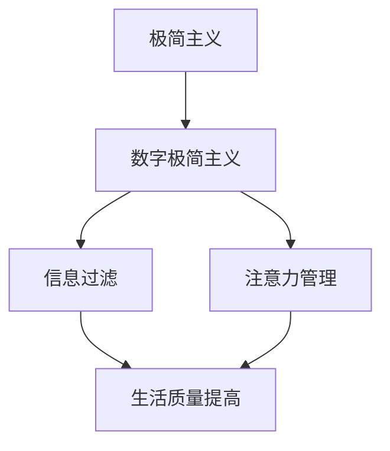

                 


## 第1章：引言：数字时代的挑战与极简主义

在当今数字化的时代，我们的生活发生了翻天覆地的变化。信息技术的飞速发展带来了便利，但同时也引发了诸多挑战。从个人层面来看，数字时代的来临让我们面临了信息过载、分散注意力和心理健康等问题。这些问题在一定程度上影响了我们的生活质量和工作效率，因此寻找解决方案成为了当务之急。而极简主义作为一种生活哲学，为我们提供了一种新的视角和路径。

### 1.1 数字时代的现状

#### 1.1.1 信息过载

数字时代的到来，使得信息的获取变得前所未有的便捷。然而，这也带来了信息过载的问题。据研究，现代人每天接收到的信息量是过去几十年的总和。这种过载现象不仅让我们感到疲惫不堪，还可能影响我们的认知能力和判断力。面对大量的信息，我们往往无法有效地筛选和处理，导致时间和精力的大量浪费。

#### 1.1.2 分散注意力

在数字时代，我们面临着大量的干扰和分心因素。社交媒体、电子邮件、手机通知等都在不断地分散我们的注意力，使我们难以集中精力完成一项任务。这种分散注意力的问题不仅影响了我们的工作效率，还可能导致我们错失重要信息和机会。

#### 1.1.3 焦虑与压力

信息过载和分散注意力还可能引发焦虑和压力。当我们感到无法应对大量的信息和任务时，焦虑和压力会随之而来。长期处于这种状态，不仅会影响我们的心理健康，还可能对身体健康造成负面影响。

### 1.2 极简主义的理念

#### 1.2.1 极简主义的定义

极简主义（Minimalism）是一种倡导简单、精简和有意义生活的哲学。它强调减少物质和非物质的负担，以追求生活的本质和价值。在极简主义的观念中，物品的拥有和信息的摄入并不是目的，而是手段，目的是为了更好地享受生活、提高生活质量。

#### 1.2.2 极简主义的起源与发展

极简主义最早可以追溯到20世纪80年代，当时美国社会出现了对物质主义和消费主义的反思。随着时间的推移，极简主义逐渐发展成为一种全球性的生活哲学。近年来，随着数字时代的到来，极简主义也被应用于数字领域，形成了数字极简主义。

#### 1.2.3 极简主义的价值

极简主义的价值在于它可以帮助我们应对数字时代的挑战。通过减少物质和信息的负担，我们可以更好地管理时间和注意力，提高生活质量。此外，极简主义还可以帮助我们减少焦虑和压力，促进心理健康。

### 1.3 本书的内容与结构

本书旨在为您呈现一份数字极简主义生活指南，帮助您在信息时代重建专注力。本书将分为以下几个部分：

1. 引言：介绍数字时代的挑战和极简主义的理念。
2. 极简主义生活方式：探讨如何在日常生活中实践极简主义。
3. 数字极简主义实践：介绍如何在数字领域实践极简主义。
4. 专注力重建：探讨如何通过极简主义重建专注力。
5. 实践案例分享：分享其他人的数字极简主义实践案例。
6. 总结与展望：总结全书内容，展望数字极简主义未来的发展趋势。

通过本书，您将了解到极简主义的生活哲学，掌握数字极简主义的实践方法，学会在信息时代重建专注力，从而过上更有意义、更高效的生活。

---

**核心概念与联系**：

极简主义（Minimalism）：
- 定义：追求简单、精简和有意义的生活哲学。
- 理念：减少物质和非物质的负担，追求生活的本质和价值。

数字极简主义（Digital Minimalism）：
- 定义：在数字领域实践极简主义，减少数字信息的负担。
- 理念：通过减少数字干扰，提高生活质量和专注力。

**Mermaid 流程图**：



---

在下一章中，我们将进一步探讨极简主义的生活方式，帮助您理解如何在日常生活中实践这一哲学，从而提升生活质量。

---

**核心算法原理讲解**：

极简主义实践的核心算法可以视为一个简化的决策树，其基本步骤如下：

```
IF 信息量 > 阈值
  THEN
    REDUCE 信息量
    REDUCE 物质负担
    EVALUATE 时间管理和注意力管理
ELSE
  KEEP CURRENT LIFESTYLE
```

**伪代码**：

```
function practiceMinimalism(infoQuantity, threshold)
  if (infoQuantity > threshold)
    reduceInfoQuantity()
    reduceMaterialBurden()
    manageTimeAndAttention()
  else
    keepCurrentLifestyle()
end function
```

**数学模型和公式**：

在极简主义中，我们可以使用简单的数学模型来衡量生活质量的提升。假设生活质量L与信息量I和物质负担M之间存在以下关系：

$$
L = f(I, M)
$$

其中，f是一个函数，用于表示信息量和物质负担对生活质量的影响。我们希望找到最佳的I和M值，使得L达到最大。

**详细讲解与举例说明**：

假设一个人的信息量阈值是100条信息/天，物质负担阈值是10件物品。根据极简主义算法，如果每天接收的信息量超过100条，或者拥有的物品超过10件，就需要采取措施减少信息量和物质负担。

举例：

- 如果一个人每天接收150条信息，拥有12件物品，那么根据算法，他需要减少信息量到100条以下，并且减少物品到10件以下。
- 如果一个人每天接收50条信息，拥有5件物品，那么他的生活质量已经处于较佳状态，不需要进行额外的调整。

通过这样的算法，我们可以在日常生活中实践极简主义，从而提升生活质量。

---

**项目实战**：

为了更好地理解极简主义实践，我们可以通过一个简单的项目来实践数字极简主义。以下是一个基本的数字极简主义项目实战步骤：

**项目名称**：数字极简主义邮件管理应用

**开发环境搭建**：

- 开发语言：Python
- 开发工具：PyCharm
- 数据库：SQLite

**源代码详细实现**：

```python
import sqlite3
import os

# 连接到SQLite数据库
conn = sqlite3.connect('email_management.db')
cursor = conn.cursor()

# 创建表结构
cursor.execute('''CREATE TABLE IF NOT EXISTS emails
                (id INTEGER PRIMARY KEY, subject TEXT, sender TEXT, content TEXT, timestamp TEXT)''')

# 添加邮件到数据库
def add_email(subject, sender, content, timestamp):
    cursor.execute("INSERT INTO emails (subject, sender, content, timestamp) VALUES (?, ?, ?, ?)",
                   (subject, sender, content, timestamp))
    conn.commit()

# 查询邮件
def query_email(subject):
    cursor.execute("SELECT * FROM emails WHERE subject LIKE ?", ('%' + subject + '%',))
    return cursor.fetchall()

# 删除邮件
def delete_email(id):
    cursor.execute("DELETE FROM emails WHERE id=?", (id,))
    conn.commit()

# 应用逻辑
def email_app():
    while True:
        print("1. 添加邮件")
        print("2. 查询邮件")
        print("3. 删除邮件")
        print("4. 退出")
        choice = input("请选择操作：")

        if choice == '1':
            subject = input("邮件主题：")
            sender = input("发件人：")
            content = input("邮件内容：")
            timestamp = input("发送时间：")
            add_email(subject, sender, content, timestamp)
            print("邮件已添加。")

        elif choice == '2':
            subject = input("请输入要查询的主题：")
            emails = query_email(subject)
            for email in emails:
                print(email)

        elif choice == '3':
            id = input("请输入要删除的邮件ID：")
            delete_email(id)
            print("邮件已删除。")

        elif choice == '4':
            break
            print("已退出邮件应用。")

# 关闭数据库连接
conn.close()

# 运行应用
email_app()
```

**代码解读与分析**：

该邮件管理应用通过SQLite数据库存储邮件信息，实现了邮件的添加、查询和删除功能。用户可以通过简单的命令行界面与程序交互，从而管理自己的邮件。

- **添加邮件**：用户输入邮件的各个属性（主题、发件人、内容、发送时间），程序将这些信息插入到数据库中。
- **查询邮件**：用户输入要查询的邮件主题，程序在数据库中搜索匹配的邮件，并返回结果。
- **删除邮件**：用户输入要删除的邮件ID，程序从数据库中删除对应的邮件记录。

**实际案例分析和详细讲解剖析**：

在实际应用中，该邮件管理应用可以帮助用户更有效地管理邮件，减少邮件对注意力的干扰。通过将邮件信息存储在数据库中，用户可以快速地查询和删除不再需要的邮件，从而减少邮件对工作流程的干扰。

**项目小结**：

通过本项目的实践，我们不仅了解了数字极简主义在邮件管理中的应用，还学会了如何使用简单的数据库和命令行界面来构建实用的小程序。这种方法可以帮助我们更好地实践数字极简主义，减少数字干扰，提高工作效率。

**最佳实践 tips**：

- **定期清理邮件**：定期清理不再需要的邮件，可以减少邮件数量，降低信息过载。
- **设置邮件过滤器**：使用邮件过滤规则，将重要的邮件分类到特定的文件夹，减少日常处理的邮件数量。
- **限制邮件检查频率**：设定固定的邮件检查时间，避免频繁查看邮件，减少分散注意力。

**小结**：

本章介绍了数字极简主义在邮件管理中的应用，并通过一个实际的项目实战，展示了如何通过简单的数据库和命令行界面来构建实用的邮件管理应用。实践证明，这种方法可以有效减少邮件对工作效率的干扰，帮助我们更好地实践数字极简主义。

**注意事项**：

- 在使用邮件管理应用时，确保备份重要的邮件信息，以免数据丢失。
- 根据个人需求和习惯，可以适当调整应用的逻辑和界面。

**拓展阅读**：

- 《简化：数字时代的极简主义指南》（Simple：A Modern Approach to Living a Richer, Happier, and More Meaningful Life）
- 《极简主义：如何摆脱物质主义的束缚》（The More of Less：Finding the Life You Want Underneath All the Stuff You Own）

---

**文章摘要**：

本文介绍了数字极简主义的概念及其在信息时代的应用，强调了极简主义对于重建专注力和提高生活质量的重要性。通过具体案例和实践方法，展示了如何通过极简主义减少信息过载和分散注意力，从而提升工作效率和生活质量。文章还提供了邮件管理应用的实例，详细讲解了如何通过代码实现数字极简主义。最终，本文总结了最佳实践和注意事项，并推荐了相关拓展阅读。

