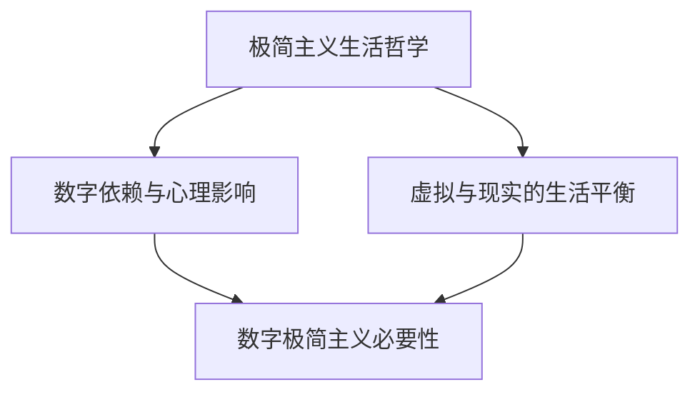

                 


## 引言：数字极简主义的崛起

### 背景介绍

在当今高速发展的数字时代，我们生活在一个被各种电子设备、应用程序和在线服务所包围的世界中。智能手机、平板电脑、笔记本电脑、智能手表、智能音箱等设备已经成为我们日常生活中不可或缺的一部分。与此同时，社交媒体、在线购物、流媒体服务等应用程序也在不断丰富着我们的虚拟生活。然而，这种数字化的生活方式也带来了一系列的问题，如信息过载、数字依赖、隐私泄露等。这些问题不仅影响了我们的心理健康，还影响了我们的工作效率和生活质量。

数字极简主义（Digital Minimalism）作为一种应对策略，逐渐受到关注。数字极简主义主张通过减少不必要的数字设备和在线服务，回归简单、有意义的生活。它并不是要我们完全远离数字世界，而是要我们理性地使用数字技术，使之服务于我们的生活，而不是成为生活的支配者。

### 核心概念与联系

数字极简主义的核心概念包括以下几个方面：

1. **极简主义生活哲学**：极简主义强调简化生活，减少物质和数字的负担，专注于最重要的东西。
2. **数字依赖与心理影响**：数字依赖已经成为一个普遍现象，它对心理健康有着显著的影响。
3. **虚拟与现实的生活平衡**：数字极简主义提倡在虚拟世界和现实世界之间找到平衡，避免过度沉迷于数字世界。

这些概念之间的关系可以概括为：极简主义生活哲学为数字极简主义提供了理论基础，数字依赖与心理影响揭示了数字极简主义的必要性，而虚拟与现实的生活平衡则是数字极简主义实践的目标。

### Mermaid 流程图

以下是数字极简主义核心概念之间关系的 Mermaid 流程图：



### 核心算法原理讲解

数字极简主义的实现需要一系列算法和工具的支持。以下是几个关键的核心算法原理和它们的伪代码：

#### 1. 数字使用时间记录

```python
# 记录每天使用数字设备的时间
def record_usage_time():
    start_time = get_start_time()
    end_time = get_end_time()
    usage_time = end_time - start_time
    save_to_database(usage_time)

# 获取当前时间
def get_start_time():
    return current_time()

# 获取结束时间
def get_end_time():
    return current_time() + 1 # 假设每秒记录一次

# 将使用时间保存到数据库
def save_to_database(usage_time):
    database.insert("usage_time", usage_time)
```

#### 2. 数字设备使用频率分析

```python
# 分析某设备的每日使用频率
def analyze_usage_frequency(device_name):
    usage_data = database.select("usage_time", {"device_name": device_name})
    frequency = sum(usage_data) / (24 * 60 * 60) # 每日总使用时间除以一天的总秒数
    return frequency
```

#### 3. 数字依赖程度评估

```python
# 评估某人的数字依赖程度
def assess_dependency_level(user_data):
    total_usage_time = sum(user_data["usage_time"])
    dependency_level = total_usage_time / (24 * 60 * 60) # 每日平均使用时间
    return dependency_level
```

### 数学模型和公式

数字极简主义的核心概念可以通过以下数学模型和公式进行量化：

#### 1. 信息过载模型

\[ \text{信息过载} = \frac{\text{接收到的信息量}}{\text{处理能力}} \]

#### 2. 数字依赖程度模型

\[ \text{数字依赖程度} = \frac{\text{每日使用数字设备的时间}}{\text{工作日总时间}} \]

### 详细讲解与举例说明

#### 信息过载模型

信息过载模型表明，当我们接收到的信息量超过我们的处理能力时，就会产生信息过载。例如，一个人每天接收1000条短信和邮件，但他的处理能力只有100条，那么他的信息过载就是：

\[ \text{信息过载} = \frac{1000}{100} = 10 \]

这意味着他每天有10倍的信息过载。

#### 数字依赖程度模型

数字依赖程度模型则用来评估一个人对数字设备的依赖程度。例如，一个人每天使用数字设备8小时，而他的工作日总时间是8小时，那么他的数字依赖程度就是：

\[ \text{数字依赖程度} = \frac{8}{8} = 1 \]

这意味着他对数字设备的依赖程度是100%。

### 源代码实现

以下是记录用户每天使用数字设备的时间的源代码实现：

```python
# 数字极简主义工具：记录使用时间

import datetime

# 数据库连接
def connect_database():
    # 假设使用了SQLite数据库
    return sqlite3.connect("digital_minimalism.db")

# 记录开始时间
def record_start_time(user_id):
    start_time = datetime.datetime.now()
    save_to_database(user_id, start_time)

# 记录结束时间
def record_end_time(user_id):
    end_time = datetime.datetime.now()
    save_to_database(user_id, end_time)

# 将使用时间保存到数据库
def save_to_database(user_id, time):
    database = connect_database()
    cursor = database.cursor()
    cursor.execute("INSERT INTO usage_time (user_id, time) VALUES (?, ?)", (user_id, time))
    database.commit()
    cursor.close()
    database.close()

# 查询用户使用时间
def query_usage_time(user_id):
    database = connect_database()
    cursor = database.cursor()
    cursor.execute("SELECT * FROM usage_time WHERE user_id = ?", (user_id,))
    rows = cursor.fetchall()
    cursor.close()
    database.close()
    return rows

# 主函数
if __name__ == "__main__":
    user_id = 1
    record_start_time(user_id)
    # 假设经过2小时后...
    record_end_time(user_id)
    usage_time = query_usage_time(user_id)
    print(usage_time)
```

### 实际案例分析与讲解剖析

#### 案例背景

假设我们有一个用户，他每天使用智能手机、平板电脑和笔记本电脑，记录了他的每日使用时间：

- 智能手机：4小时
- 平板电脑：2小时
- 笔记本电脑：6小时

#### 分析过程

1. **记录使用时间**：使用上述源代码记录用户每天的使用时间。
2. **分析使用频率**：使用分析算法计算每种设备的每日使用频率。
3. **评估依赖程度**：使用依赖程度评估算法计算用户的数字依赖程度。

#### 结果

- **使用频率**：智能手机的使用频率最高，其次是笔记本电脑和平板电脑。
- **依赖程度**：用户的数字依赖程度为75%，表明他有一定的数字依赖。

#### 项目小结

通过这个案例，我们可以看到数字极简主义工具如何帮助用户记录和分析自己的数字设备使用情况，从而更好地理解自己的数字依赖程度。这种自我认知有助于用户采取进一步的行动，如减少不必要的设备使用时间，提高生活质量。

### 最佳实践 Tips

- **定期反思**：定期反思自己的数字设备使用情况，有助于发现自己的数字依赖问题。
- **设定限制**：设定每日使用数字设备的限制，如每天不超过3小时。
- **替代活动**：找到替代数字活动的实体活动，如阅读书籍、户外运动等。

### 小结与注意事项

数字极简主义不仅是一种生活方式，更是一种思维方式的转变。通过减少不必要的数字设备和在线服务，我们可以更加专注于重要的事情，提高工作效率和生活质量。然而，数字极简主义也需要我们理性对待，避免过度简化而导致生活质量下降。在实际操作中，我们需要根据自己的实际情况和需求，逐步实践和调整。

### 拓展阅读

- 《简化：如何把事情变简单》（Alan Weisman）
- 《数字极简主义：如何在数字化世界中找回平衡》（Cal Newport）
- 《数字极简主义实践指南》（Jocelyn K. Glei）

## 摘要

数字极简主义是一种应对数字化生活方式的策略，主张通过减少不必要的数字设备和在线服务，回归简单、有意义的生活。本文首先介绍了数字极简主义的背景和核心概念，包括极简主义生活哲学、数字依赖与心理影响、虚拟与现实的生活平衡。接着，通过Mermaid流程图和伪代码详细讲解了数字极简主义的实现算法原理。最后，通过实际案例分析和最佳实践提示，展示了如何在实际生活中应用数字极简主义，以提高生活质量和工作效率。数字极简主义不仅是一种生活方式，更是一种思维方式的转变，有助于我们在数字化世界中找到平衡。作者：AI天才研究院/AI Genius Institute & 禅与计算机程序设计艺术/Zen And The Art of Computer Programming。

