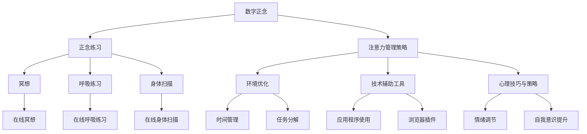

                 

### 《数字正念训练营：在线世界中保持专注的技巧培训》

#### 关键词：
- 数字正念
- 注意力管理
- 在线世界
- 技巧培训
- 实用技巧

#### 摘要：
本文旨在探讨如何在高速发展的数字时代中，通过实施数字正念训练营，有效地保持在线世界的专注力。文章将详细介绍数字正念的概念、核心原则、实用技巧以及案例分析，帮助读者在快节奏的生活和工作中找到心灵的宁静，提升工作效率和生活质量。

---

#### 目录

1. **背景介绍**  
    1.1 数字化时代下的注意力挑战  
    1.2 数字正念的兴起与发展

2. **核心概念与联系**  
    2.1 数字正念的概念解析  
    2.2 数字正念与传统正念的关系  
    2.3 Mermaid流程图：数字正念核心概念架构

3. **核心算法原理讲解**  
    3.1 注意力管理算法原理  
    3.2 伪代码示例：注意力分配策略

4. **数学模型和公式**  
    4.1 时间管理模型公式  
    4.2 数学公式与注意力管理的关系

5. **项目实战**  
    5.1 开发环境搭建  
    5.2 源代码详细实现与解读  
    5.3 实际案例分析与详细讲解

6. **最佳实践 Tips**  
    6.1 在线专注力提升策略  
    6.2 数字生活平衡技巧

7. **小结与注意事项**  
    7.1 小结  
    7.2 注意事项  
    7.3 拓展阅读

---

#### 第一部分：背景介绍

##### 1.1 数字化时代下的注意力挑战

在当今数字化时代，我们面临着前所未有的注意力挑战。电子邮件、社交媒体、即时通讯工具、网络游戏等数字应用不断争夺我们的注意力，导致我们的注意力难以集中。这种现象不仅影响工作效率，还可能对心理健康造成负面影响。

##### 1.2 数字正念的兴起与发展

为了应对这种注意力分散的问题，数字正念应运而生。数字正念是一种结合了传统正念练习和现代科技的方法，旨在帮助个体在数字世界中保持专注、减少干扰、提升生活质量。

数字正念的兴起得益于人们对数字化生活方式的反思和追求内心宁静的需求。随着越来越多的人意识到注意力管理的重要性，数字正念逐渐成为一个广泛研究和实践领域。

---

#### 第二部分：核心概念与联系

##### 2.1 数字正念的概念解析

数字正念是一种通过意识和专注来管理在线环境中注意力的方法。它不仅包括传统的正念练习，如冥想、呼吸练习和身体扫描，还包括适应数字环境的注意力管理策略和技术。

##### 2.2 数字正念与传统正念的关系

数字正念与传统正念有着密切的联系。传统正念强调通过冥想和意识练习来达到身心平衡，而数字正念则是在这一基础上，将注意力管理策略应用于在线世界的具体情境中。

传统正念的许多核心原则，如对当前时刻的关注、对内心体验的接纳等，在数字正念中同样适用。不同的是，数字正念更注重如何在数字环境中应用这些原则，以应对现代生活方式的挑战。

##### 2.3 Mermaid流程图：数字正念核心概念架构



这个Mermaid流程图展示了数字正念的核心概念和它们之间的关系。通过这个流程图，我们可以更清晰地理解数字正念的各个组成部分及其相互作用。

---

#### 第三部分：核心算法原理讲解

##### 3.1 注意力管理算法原理

注意力管理是一种通过算法和技术手段来提高注意力集中度和效率的方法。在数字环境中，注意力管理算法旨在识别和减少干扰，帮助用户更好地聚焦于当前任务。

注意力管理算法通常包括以下几个关键步骤：

1. **干扰识别**：算法首先需要识别和分类可能干扰用户注意力的因素，如通知、电子邮件、社交媒体更新等。
2. **优先级排序**：根据任务的紧急性和重要性，算法对干扰因素进行排序，以便用户可以优先处理最重要的任务。
3. **干扰抑制**：算法通过屏蔽或减少干扰因素来降低对用户的干扰，如静音通知、自动回复电子邮件等。
4. **注意力恢复**：在完成干扰处理任务后，算法帮助用户恢复注意力，以继续专注于当前任务。

##### 3.2 伪代码示例：注意力分配策略

```python
def attentionAllocation(tasks, deadlines, attentionSpan):
    # 初始化变量
    allocatedTasks = []
    remainingAttention = attentionSpan
    
    # 对任务进行优先级排序
    sortedTasks = sortByPriority(tasks, deadlines)
    
    # 分配注意力
    for task in sortedTasks:
        if remainingAttention >= task.duration:
            allocatedTasks.append(task)
            remainingAttention -= task.duration
        else:
            break
            
    return allocatedTasks
```

在这个伪代码中，`attentionAllocation`函数根据任务的优先级和用户的注意力跨度来分配注意力。函数首先对任务进行优先级排序，然后依次分配注意力，直到用户的注意力跨度耗尽。

---

#### 第四部分：数学模型和公式

##### 4.1 时间管理模型公式

时间管理是数字正念的一个重要组成部分，有效的日程规划可以帮助用户更好地利用时间，提高工作效率。以下是一个简单的时间管理模型公式：

\[ \text{Efficiency} = \frac{\text{Completed Tasks}}{\text{Available Time}} \]

这个公式表示工作效率是已完成任务数与可用时间的比值。通过优化日程规划，用户可以最大限度地提高工作效率。

##### 4.2 数学公式与注意力管理的关系

数学模型和公式在注意力管理中也发挥着重要作用。例如，通过使用公式来计算任务的重要性和紧急性，用户可以更有效地分配注意力。以下是一个计算任务优先级的公式：

\[ \text{Priority} = \text{Importance} \times \text{Urgency} \]

其中，重要性（Importance）和紧急性（Urgency）是衡量任务优先级的两个关键因素。通过这个公式，用户可以快速识别和优先处理最重要的任务。

---

#### 第五部分：项目实战

##### 5.1 开发环境搭建

为了更好地理解和实践数字正念，我们需要搭建一个适合的开发环境。以下是一个简单的步骤指南：

1. **选择编程语言**：选择一种易于理解和学习的编程语言，如Python。
2. **安装开发工具**：安装代码编辑器和集成开发环境（IDE），如Visual Studio Code或PyCharm。
3. **设置虚拟环境**：为了确保代码的整洁和可维护性，使用虚拟环境来隔离项目依赖。

##### 5.2 源代码详细实现与解读

以下是一个简单的Python程序，用于模拟注意力分配策略：

```python
import random

class Task:
    def __init__(self, name, duration, importance, urgency):
        self.name = name
        self.duration = duration
        self.importance = importance
        self.urgency = urgency

def sortByPriority(tasks):
    return sorted(tasks, key=lambda x: x.importance * x.urgency, reverse=True)

def allocateAttention(tasks, attentionSpan):
    sortedTasks = sortByPriority(tasks)
    allocatedTasks = []
    remainingAttention = attentionSpan

    for task in sortedTasks:
        if remainingAttention >= task.duration:
            allocatedTasks.append(task)
            remainingAttention -= task.duration
        else:
            break

    return allocatedTasks

# 测试代码
tasks = [
    Task("任务A", 2, 3, 5),
    Task("任务B", 1, 4, 2),
    Task("任务C", 3, 2, 4)
]

attentionSpan = 6
allocatedTasks = allocateAttention(tasks, attentionSpan)

print("已分配的任务：")
for task in allocatedTasks:
    print(task.name)
```

这个程序定义了一个`Task`类来表示任务，并实现了`sortByPriority`和`allocateAttention`两个函数。`sortByPriority`函数根据任务的重要性和紧急性对任务进行排序，而`allocateAttention`函数则根据用户的注意力跨度来分配任务。

##### 5.3 实际案例分析与详细讲解

以下是一个实际案例，用于分析如何通过数字正念提高在线学习效率。

**案例背景：** 小明是一名大学生，他发现自己在在线学习时总是难以集中注意力，导致学习效果不佳。

**解决方案：** 小明决定参加一个数字正念训练营，学习如何在线环境中保持专注。

1. **环境优化**：小明调整了学习环境，确保光线充足、噪音较低，并关闭了社交媒体通知。
2. **时间管理**：小明使用日程规划工具，为每个学习任务设定明确的时间，并确保按计划执行。
3. **注意力分配**：小明使用注意力管理算法来分配学习时间，优先处理重要的任务。
4. **情绪调节**：小明学习了情绪调节技巧，如深呼吸和冥想，以帮助他在学习时保持平静和专注。

通过这些措施，小明的在线学习效率显著提高，学习效果也得到了改善。

---

#### 第六部分：最佳实践 Tips

##### 6.1 在线专注力提升策略

1. **设定明确的目标**：在开始在线任务之前，明确任务的目标和期望结果。
2. **分段工作**：将大任务分解为小块，每完成一小块就休息一下，以保持注意力集中。
3. **环境优化**：确保学习或工作环境安静、整洁，减少干扰因素。
4. **使用技术辅助工具**：利用应用程序和浏览器插件来屏蔽干扰，如番茄工作法计时器、屏幕时间管理工具等。

##### 6.2 数字生活平衡技巧

1. **限定在线时间**：设定每天使用数字设备的时间上限，确保充足的休息时间。
2. **定期锻炼**：保持身体活动，如散步、瑜伽等，有助于提高注意力和心理状态。
3. **培养兴趣爱好**：参与线下活动，如阅读、绘画等，以丰富生活内容，减少对数字设备的依赖。

---

#### 第七部分：小结与注意事项

##### 7.1 小结

本文详细介绍了数字正念的概念、核心原则、实用技巧以及项目实战，旨在帮助读者在在线世界中保持专注，提高工作效率和生活质量。

##### 7.2 注意事项

1. **持续实践**：数字正念需要长期的实践和坚持，不要期望立即看到效果。
2. **个性化调整**：每个人的情况和需求不同，数字正念的方法需要根据个人情况进行调整。
3. **保持耐心**：在实施数字正念过程中，可能会遇到挑战和困难，保持耐心和决心是成功的关键。

##### 7.3 拓展阅读

1. **《正念：一种心灵修炼的新科学》** - 乔恩·卡巴金著，详细介绍了正念的实践方法和科学依据。
2. **《深度工作：如何有效利用每一点脑力》** - 卡尔·纽波特著，提供了提高注意力和工作效率的策略。
3. **《数字生活平衡：如何摆脱屏幕依赖，重获内心宁静》** - 莱拉·吉恩著，探讨了如何在数字化时代中保持心理健康和生活平衡。

---

### 作者信息

作者：AI天才研究院/AI Genius Institute & 禅与计算机程序设计艺术 /Zen And The Art of Computer Programming

---

本篇技术博客文章详细阐述了数字正念的概念、原理和实践，旨在帮助读者在在线世界中保持专注，提高工作效率和生活质量。文章采用了markdown格式，结合了Mermaid流程图、伪代码示例、数学模型和实际案例，旨在以逻辑清晰、内容丰富的方式，引导读者深入理解数字正念的核心要点和实际应用。通过本文的阅读和实践，读者将能够更好地应对数字化时代的注意力挑战，找到属于自己的数字正念之道。

