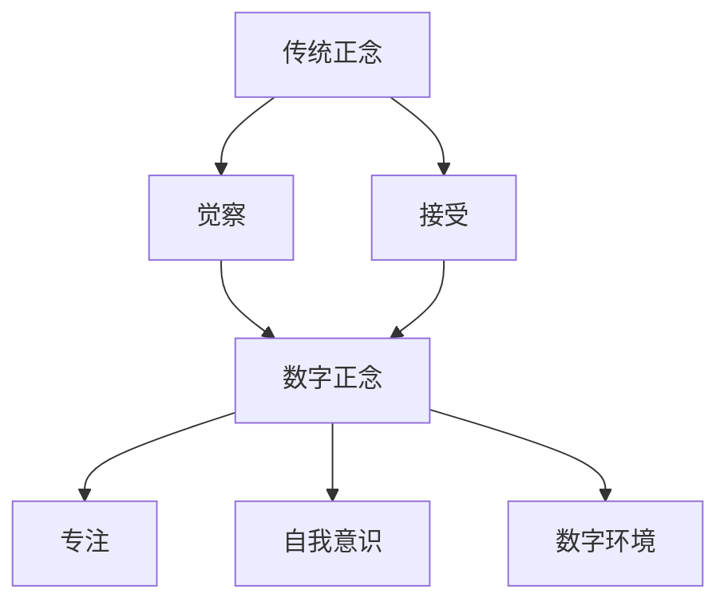
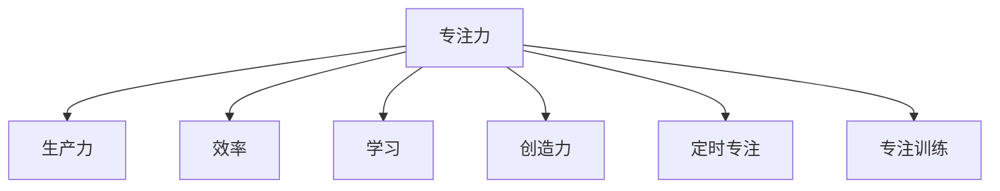
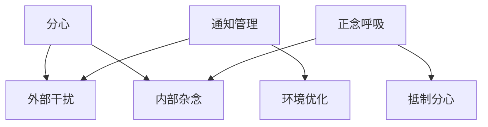
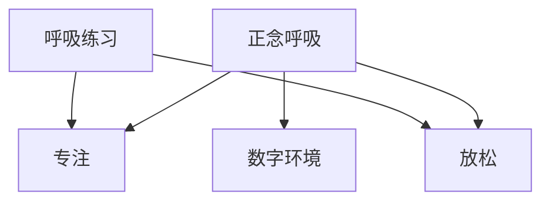
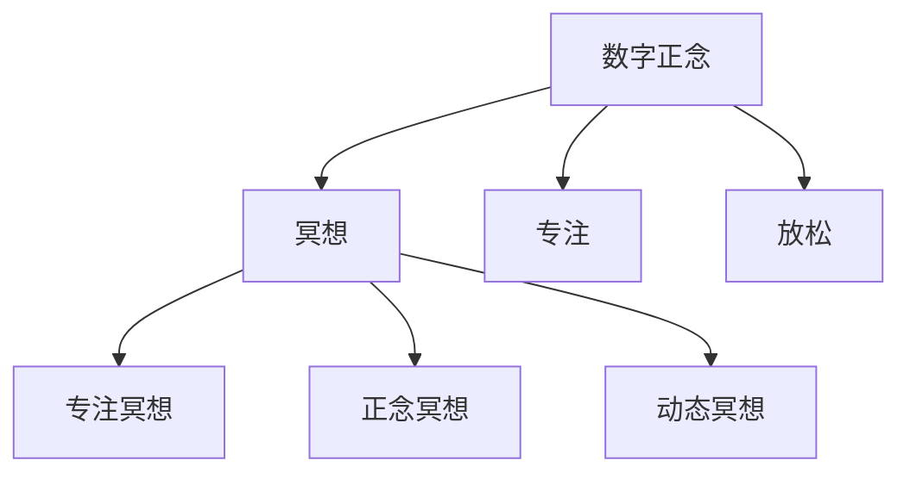
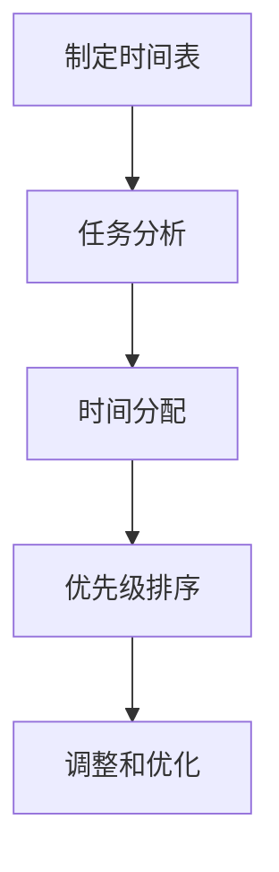
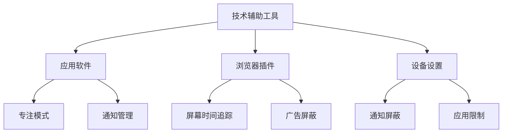
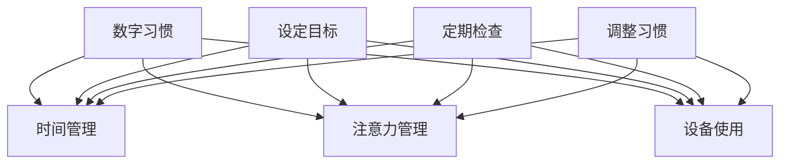
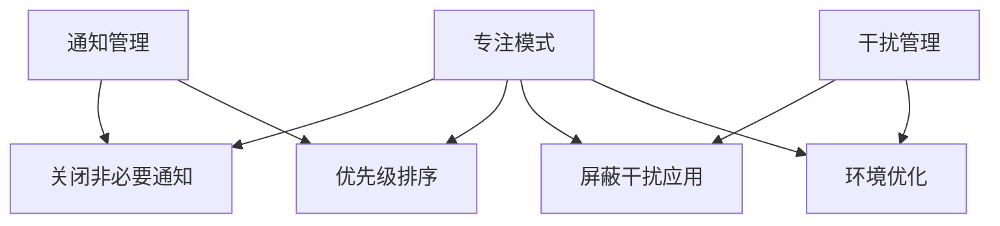

                 


## 文章标题：数字正念：在线世界中保持专注的技巧

### 文章关键词：
- 数字正念
- 在线专注
- 分心抵制
- 技术辅助
- 数字习惯

### 文章摘要：
本文将探讨数字正念的概念及其在在线世界中的重要性。我们将分析在线世界中的各种挑战，介绍数字正念的核心原则和实践技巧，并提供日常生活中的应用实例。此外，文章还将探讨数字正念在项目实践和未来展望方面的潜在影响，最后总结数字正念的总体贡献和实践建议。

----------------------------------------------------------------

## 第1章：数字正念的背景与重要性

### 1.1 数字正念的定义

数字正念（Digital Mindfulness）是一种结合传统正念练习（Mindfulness Meditation）与数字技术的方法，旨在帮助个体在在线环境中培养专注力和自我意识。它强调对当前体验的觉察，特别是在使用数字设备和网络时。数字正念不仅仅是一种心理状态，更是一种生活方式和习惯。

#### 背景介绍

在现代社会，我们几乎无处不在地使用数字设备，从智能手机、电脑到平板和智能手表。尽管这些设备极大地提高了我们的生产力和便利性，但它们同时也带来了诸多挑战。研究表明，频繁的数字设备使用会导致注意力分散、压力增加和心理健康问题。例如，社交媒体的即时反馈和通知功能可能会让用户陷入持续的分心状态，无法专注于当前任务。

### 1.2 在线世界中的挑战

在线世界充满了各种潜在的干扰因素，如社交媒体更新、电子邮件通知、在线聊天和视频游戏等。这些干扰不仅分散了我们的注意力，还可能导致生产力下降和心理健康问题。以下是一些在线世界中的常见挑战：

- **信息过载**：互联网上充斥着大量的信息和数据，很难区分哪些是重要的，哪些是无关的。
- **持续的分心**：频繁的通知和提醒会打断我们的任务，使我们无法保持专注。
- **缺乏自我意识**：在数字环境中，用户往往缺乏对自己行为的意识，这可能导致沉迷和过度使用数字设备。
- **社交压力**：社交媒体上的虚假展示和竞争可能导致用户感到不满足和焦虑。

### 1.3 数字正念的重要性

数字正念的重要性在于它提供了一种工具，帮助我们在数字环境中更好地管理自己的注意力和情绪。以下是数字正念的一些关键好处：

- **提高专注力**：通过正念练习，个体能够更好地控制自己的注意力，减少分心的频率和持续时间。
- **减少压力**：数字正念练习如呼吸冥想和专注训练有助于减轻压力和焦虑，提高心理韧性。
- **提升生产力和效率**：通过更好地管理注意力，个体能够更高效地完成任务，减少不必要的干扰。
- **促进心理健康**：数字正念可以帮助个体建立更健康的关系，提高整体幸福感。

### 1.4 数字正念与传统正念的关系

数字正念与传统正念之间有着紧密的联系。传统正念起源于佛教禅修，强调对当前体验的觉察和无评判的接受。数字正念则将这些原则应用于数字设备使用中，通过专门的练习和技术来培养专注力和自我意识。

#### 核心概念与联系

为了更好地理解数字正念与传统正念之间的关系，我们可以使用以下Mermaid流程图来展示它们的核心概念和相互联系：



在这个流程图中，传统正念的觉察和接受原则被应用于数字正念的专注和自我意识培养中，而数字环境则是数字正念实践的具体场景。

### 小结

本章介绍了数字正念的背景和重要性，分析了在线世界中的挑战，并探讨了数字正念与传统正念之间的关系。在接下来的章节中，我们将深入探讨数字正念的核心原则和实践技巧，以及它们在日常生活中的应用。

---

[作者：AI天才研究院/AI Genius Institute & 禅与计算机程序设计艺术 /Zen And The Art of Computer Programming]

----------------------------------------------------------------

## 第2章：数字正念的核心原则

### 2.1 专注的力量

专注是数字正念的核心原则之一，它指的是将注意力集中在一个特定任务或对象上，排除外界干扰的能力。在数字环境中，专注力对于提高生产力和效率至关重要。以下是专注的一些关键力量：

#### 背景介绍

专注力的研究显示，个体的专注力直接影响其工作表现、学习和创造力。数字正念通过一系列练习来增强专注力，包括：

- **专注训练**：通过特定的练习，如专注呼吸或专注于一个物体，个体可以逐步提高专注力。
- **定时专注**：设定特定时间段，专注于一个任务，如使用番茄工作法（Pomodoro Technique）。

#### 核心概念与联系

为了更好地理解专注在数字正念中的作用，我们可以使用以下Mermaid流程图来展示其核心概念和联系：



在这个流程图中，专注力与生产力、效率、学习、创造力和专注训练之间存在紧密的联系。专注训练和定时专注是提高专注力的关键方法。

#### 核心算法原理讲解

专注力的提高可以通过以下伪代码实现：

```pseudo
function improveFocus(timeInterval, numberOfSessions) {
    for (session = 1 to numberOfSessions) {
        for (minute = 1 to timeInterval) {
            if (minute % 5 == 0) {
                takeShortBreak();
            } else {
                focusOnTask();
            }
        }
        recordProgress();
    }
}

function focusOnTask() {
    // Code to focus on the current task
}

function takeShortBreak() {
    // Code to take a short break
}

function recordProgress() {
    // Code to record the progress of the session
}
```

#### 数学模型和公式

专注力的提高可以用以下数学模型来描述：

$$
\text{Focus} = f(\text{练习时间}, \text{休息时间})
$$

其中，`练习时间`和`休息时间`是专注训练中的关键参数。通过调整这两个参数，可以优化专注力。

#### 举例说明

假设一个用户想要在两周内提高专注力。他可以每天练习30分钟，每5分钟休息一次。以下是一个示例时间表：

- 第一周：每天练习2次，每次30分钟
- 第二周：每天练习3次，每次30分钟

这种练习模式可以帮助用户逐步提高专注力，同时确保休息时间以避免疲劳。

### 2.2 识别并抵制分心

在数字环境中，分心是一个常见问题，它可能导致任务中断、工作效率降低和压力增加。数字正念提供了一系列技巧来帮助个体识别并抵制分心，从而保持专注。

#### 背景介绍

分心是由外部干扰和内部杂念引起的。外部干扰可能包括社交媒体通知、电子邮件提醒、电话等，而内部杂念则可能包括焦虑、担心或其他思维活动。以下是一些抵制分心的方法：

- **通知管理**：关闭不必要的通知，只保留重要任务的提醒。
- **环境优化**：在一个安静、整洁的环境中工作，减少外部干扰。
- **正念呼吸**：通过深呼吸来缓解紧张和焦虑，从而更容易抵制分心。

#### 核心概念与联系

为了更好地理解识别并抵制分心的方法，我们可以使用以下Mermaid流程图来展示其核心概念和联系：



在这个流程图中，通知管理和环境优化是减少外部干扰的方法，而正念呼吸则是减轻内部杂念的手段。

#### 核心算法原理讲解

识别并抵制分心可以通过以下伪代码实现：

```pseudo
function resistDistraction(focusDuration) {
    while (focusDuration > 0) {
        if (isDistraction()) {
            takeBreath();
            continue;
        } else {
            workOnTask();
        }
        focusDuration--;
    }
}

function isDistraction() {
    // Code to check for distractions
}

function takeBreath() {
    // Code to perform a breathing exercise
}

function workOnTask() {
    // Code to work on the current task
}
```

#### 数学模型和公式

分心的识别可以通过以下数学模型来描述：

$$
\text{Distraction} = f(\text{外部干扰}, \text{内部杂念})
$$

其中，`外部干扰`和`内部杂念`是影响分心的关键因素。通过减少这两个因素，可以降低分心的概率。

#### 举例说明

假设一个用户正在专注于一个重要任务，但他收到了一条无关紧要的短信。他可以通过以下步骤来抵制分心：

1. 关闭手机通知，避免进一步的干扰。
2. 深呼吸，缓解紧张和焦虑。
3. 回到任务，继续专注工作。

### 2.3 数字环境中的正念呼吸练习

正念呼吸是数字正念中的核心技巧之一，它帮助个体在数字环境中保持专注和放松。通过专注于呼吸，个体可以减少分心，提高注意力。

#### 背景介绍

正念呼吸练习起源于佛教禅修，它通过专注于呼吸来培养个体的觉察和专注力。在数字环境中，正念呼吸可以作为一种快速放松和集中注意力的方法。

#### 核心概念与联系

为了更好地理解正念呼吸练习在数字正念中的作用，我们可以使用以下Mermaid流程图来展示其核心概念和联系：



在这个流程图中，正念呼吸与专注和放松之间存在紧密的联系。通过呼吸练习，个体可以在数字环境中保持专注和放松。

#### 核心算法原理讲解

正念呼吸练习可以通过以下伪代码实现：

```pseudo
function mindfulBreathing(duration) {
    for (minute = 1 to duration) {
        inhale();
        hold();
        exhale();
    }
}

function inhale() {
    // Code to perform an inhale
}

function hold() {
    // Code to hold the breath
}

function exhale() {
    // Code to perform an exhale
}
```

#### 数学模型和公式

正念呼吸练习的效果可以用以下数学模型来描述：

$$
\text{Effect} = f(\text{呼吸次数}, \text{持续时间})
$$

其中，`呼吸次数`和`持续时间`是影响练习效果的关键因素。通过增加这两个参数，可以增强练习的效果。

#### 举例说明

假设一个用户想要通过正念呼吸来放松和集中注意力，他可以每天进行10分钟的呼吸练习。以下是一个示例时间表：

- 每天早上起床时：10分钟呼吸练习
- 每天晚上睡前：10分钟呼吸练习

这种练习模式可以帮助用户在一天中的不同时间点保持专注和放松。

### 2.4 数字正念与冥想

数字正念与冥想之间有着紧密的联系。冥想是一种通过专注和放松来培养专注力和内在平静的练习。在数字正念中，冥想被用于帮助个体在数字环境中更好地管理自己的注意力和情绪。

#### 背景介绍

冥想有多种形式，包括专注冥想、正念冥想和动态冥想等。数字正念通常采用正念冥想，因为它可以帮助个体在数字环境中保持专注和放松。以下是一些冥想在数字正念中的应用：

- **专注冥想**：通过专注于一个特定的对象（如呼吸、声音或视觉），个体可以减少分心，提高专注力。
- **正念冥想**：通过无评判地观察自己的思维和感受，个体可以培养对自己的觉察和自我意识。
- **动态冥想**：通过身体的运动和呼吸来提高能量和专注力。

#### 核心概念与联系

为了更好地理解数字正念与冥想之间的关系，我们可以使用以下Mermaid流程图来展示其核心概念和联系：



在这个流程图中，数字正念与冥想、专注和放松之间存在紧密的联系。冥想的不同形式可以帮助个体在数字环境中实现这些目标。

#### 核心算法原理讲解

冥想的实施可以通过以下伪代码实现：

```pseudo
function meditate(duration, meditationType) {
    if (meditationType == "focus") {
        focusMeditation(duration);
    } else if (meditationType == "mindfulness") {
        mindfulnessMeditation(duration);
    } else if (meditationType == "dynamic") {
        dynamicMeditation(duration);
    }
}

function focusMeditation(duration) {
    for (minute = 1 to duration) {
        focusOnObject();
    }
}

function mindfulnessMeditation(duration) {
    for (minute = 1 to duration) {
        observeThoughts();
    }
}

function dynamicMeditation(duration) {
    for (minute = 1 to duration) {
        performExercises();
    }
}

function focusOnObject() {
    // Code to focus on a specific object
}

function observeThoughts() {
    // Code to observe thoughts without judgment
}

function performExercises() {
    // Code to perform physical exercises
}
```

#### 数学模型和公式

冥想的效果可以用以下数学模型来描述：

$$
\text{Effect} = f(\text{持续时间}, \text{冥想类型})
$$

其中，`持续时间`和`冥想类型`是影响冥想效果的关键因素。通过调整这两个参数，可以优化冥想的效果。

#### 举例说明

假设一个用户想要通过冥想来提高专注力，他可以选择进行10分钟的专注冥想。以下是一个示例时间表：

- 每天早上起床时：10分钟专注冥想
- 每天晚上睡前：10分钟专注冥想

这种练习模式可以帮助用户在一天中的不同时间点保持专注和放松。

### 小结

本章介绍了数字正念的核心原则，包括专注的力量、识别并抵制分心、数字环境中的正念呼吸练习和数字正念与冥想。这些原则为在数字环境中保持专注提供了实用的方法和技巧。在下一章中，我们将深入探讨数字正念的实践技巧，帮助读者将这些原则应用于日常生活。

---

[作者：AI天才研究院/AI Genius Institute & 禅与计算机程序设计艺术 /Zen And The Art of Computer Programming]

----------------------------------------------------------------

## 第3章：数字正念实践技巧

### 3.1 制定在线时间表

在数字正念的实践中，制定在线时间表是至关重要的一步。这不仅有助于提高时间管理能力，还能有效减少不必要的在线干扰。以下是一个详细的步骤指南，帮助您制定有效的在线时间表。

#### 背景介绍

在线时间表是一种规划您在线活动的工具，它可以帮助您更好地管理时间和注意力。通过合理规划，您可以确保在重要任务上投入足够的时间，同时避免不必要的分心和疲劳。

#### 核心概念与联系

为了更好地理解在线时间表的制定过程，我们可以使用以下Mermaid流程图来展示其核心概念和联系：



在这个流程图中，任务分析、时间分配、优先级排序和调整优化是制定在线时间表的关键步骤。

#### 核心算法原理讲解

制定在线时间表的算法原理可以如下实现：

```pseudo
function createOnlineSchedule(tasks, timeBlocks) {
    schedule = []
    for (task in tasks) {
        if (task.isUrgent) {
            addTaskToSchedule(schedule, task, timeBlocks.urgent);
        } else {
            addTaskToSchedule(schedule, task, timeBlocks.notUrgent);
        }
    }
    optimizeSchedule(schedule);
    return schedule;
}

function addTaskToSchedule(schedule, task, timeBlock) {
    schedule.append(task);
    allocateTime(schedule, timeBlock);
}

function allocateTime(schedule, timeBlock) {
    for (task in schedule) {
        task.startTime = getCurrentTime() + timeBlock.duration;
        task.endTime = task.startTime + task.duration;
    }
}

function optimizeSchedule(schedule) {
    // Code to optimize the schedule based on constraints and preferences
}
```

#### 数学模型和公式

在线时间表的制定可以基于以下数学模型：

$$
\text{Time Allocation} = f(\text{任务优先级}, \text{可用时间})
$$

其中，`任务优先级`和`可用时间`是影响时间分配的关键因素。通过优化时间分配，可以确保任务按照优先级得到合理安排。

#### 举例说明

以下是一个示例时间表：

- **任务**：撰写报告、回复邮件、参加在线会议、阅读文章
- **优先级**：撰写报告（高优先级），回复邮件（中优先级），参加在线会议（中优先级），阅读文章（低优先级）
- **时间分配**：
  - 上午8:00 - 10:00：撰写报告（高优先级）
  - 上午10:30 - 11:30：回复邮件（中优先级）
  - 下午2:00 - 3:00：参加在线会议（中优先级）
  - 下午4:00 - 6:00：阅读文章（低优先级）

通过制定这样的时间表，您可以确保在高优先级任务上投入足够的时间，同时避免因任务重叠而导致的分心和疲劳。

### 3.2 使用技术辅助工具

在数字正念的实践中，技术辅助工具可以帮助您更好地管理注意力，减少分心。以下是一些常用的技术辅助工具及其使用方法。

#### 背景介绍

技术辅助工具是数字正念的重要支撑，可以帮助您在在线环境中保持专注和高效。这些工具包括应用软件、浏览器插件和设备设置等。

#### 核心概念与联系

为了更好地理解技术辅助工具的使用，我们可以使用以下Mermaid流程图来展示其核心概念和联系：



在这个流程图中，应用软件、浏览器插件和设备设置是技术辅助工具的主要类型，它们通过不同的方式帮助您保持专注和减少分心。

#### 核心算法原理讲解

技术辅助工具的使用可以通过以下伪代码实现：

```pseudo
function useTechAidTool(toolType, toolSettings) {
    if (toolType == "app") {
        useApp(toolSettings);
    } else if (toolType == "browserPlugin") {
        useBrowserPlugin(toolSettings);
    } else if (toolType == "deviceSettings") {
        useDeviceSettings(toolSettings);
    }
}

function useApp(settings) {
    // Code to use the app with the given settings
}

function useBrowserPlugin(settings) {
    // Code to use the browser plugin with the given settings
}

function useDeviceSettings(settings) {
    // Code to use the device settings with the given settings
}
```

#### 数学模型和公式

技术辅助工具的效果可以用以下数学模型来描述：

$$
\text{Effect} = f(\text{工具类型}, \text{工具设置})
$$

其中，`工具类型`和`工具设置`是影响效果的关键因素。通过选择合适的工具类型和设置，可以优化工具的效果。

#### 举例说明

以下是一些技术辅助工具的示例及其使用方法：

- **专注模式应用**：使用如“Forest”或“Focus@Will”等应用，在设定的时间内屏蔽干扰应用，帮助您保持专注。
- **屏幕时间追踪插件**：使用如“StayFocusd”或“Freedom”等浏览器插件，追踪您在特定网站上的时间，并限制访问时间。
- **通知屏蔽设备设置**：在手机或电脑上设置通知管理，屏蔽不必要的通知，减少分心。

### 3.3 培养良好的数字习惯

良好的数字习惯是数字正念的重要组成部分，它可以帮助您在在线环境中保持专注和高效。以下是一些培养良好数字习惯的方法。

#### 背景介绍

数字习惯是指您在数字设备上使用和应用的方式。良好的数字习惯可以帮助您更好地管理时间和注意力，提高生产力和生活质量。

#### 核心概念与联系

为了更好地理解培养良好数字习惯的方法，我们可以使用以下Mermaid流程图来展示其核心概念和联系：



在这个流程图中，时间管理、注意力管理和设备使用是培养良好数字习惯的关键方面，而设定目标、定期检查和调整习惯是培养这些习惯的重要步骤。

#### 核心算法原理讲解

培养良好数字习惯的算法原理可以如下实现：

```pseudo
function cultivateDigitalHabits(goals, currentHabits) {
    for (habit in currentHabits) {
        if (habit.compliance < goal.compliance) {
            improveHabit(habit);
        } else {
            maintainHabit(habit);
        }
    }
    checkAndAdjustGoals(goals);
}

function improveHabit(habit) {
    // Code to improve the habit
}

function maintainHabit(habit) {
    // Code to maintain the habit
}

function checkAndAdjustGoals(goals) {
    // Code to check and adjust the goals
}
```

#### 数学模型和公式

良好数字习惯的培养可以基于以下数学模型：

$$
\text{Habit Compliance} = f(\text{目标}, \text{当前习惯})
$$

其中，`目标`和`当前习惯`是影响习惯遵守程度的关键因素。通过设定明确的目标和持续改进当前习惯，可以逐步培养良好的数字习惯。

#### 举例说明

以下是一个培养良好数字习惯的示例：

- **目标**：每天使用手机不超过1小时，专注于重要任务。
- **当前习惯**：每天使用手机超过3小时，分心严重。
- **改善措施**：
  - 设定手机使用时间限制，提醒自己按时停止使用。
  - 在专注任务时，使用专注模式应用屏蔽干扰应用。
  - 定期检查手机使用时间，调整使用习惯。

通过这些措施，您可以逐步改善数字习惯，提高专注力和工作效率。

### 3.4 管理通知和干扰

通知和干扰是数字环境中常见的挑战，它们会分散您的注意力，降低工作效率。以下是一些有效管理通知和干扰的方法。

#### 背景介绍

通知和干扰是数字正念中需要特别关注的问题。过多的通知会打断您的任务，使您难以保持专注。有效管理通知和干扰可以帮助您更好地集中注意力，提高工作效率。

#### 核心概念与联系

为了更好地理解管理通知和干扰的方法，我们可以使用以下Mermaid流程图来展示其核心概念和联系：



在这个流程图中，通知管理和干扰管理是管理通知和干扰的两个主要方面，而专注模式、屏蔽干扰应用和环境优化是关键策略。

#### 核心算法原理讲解

管理通知和干扰的算法原理可以如下实现：

```pseudo
function manageNotificationsAndInterferences(settings) {
    for (notification in settings.notifications) {
        if (notification.priority == "low") {
            disableNotification(notification);
        } else {
            enableNotification(notification);
        }
    }
    for (application in settings.applications) {
        if (application.isDistracting) {
            blockApplication(application);
        } else {
            unblockApplication(application);
        }
    }
}

function disableNotification(notification) {
    // Code to disable the notification
}

function enableNotification(notification) {
    // Code to enable the notification
}

function blockApplication(application) {
    // Code to block the application
}

function unblockApplication(application) {
    // Code to unblock the application
}
```

#### 数学模型和公式

通知和干扰的管理可以用以下数学模型来描述：

$$
\text{Attention} = f(\text{通知数量}, \text{干扰程度})
$$

其中，`通知数量`和`干扰程度`是影响注意力的关键因素。通过减少通知数量和降低干扰程度，可以优化注意力。

#### 举例说明

以下是一个管理通知和干扰的示例：

- **目标**：减少手机通知，降低干扰。
- **当前设置**：
  - 关闭社交媒体通知。
  - 仅保留电子邮件和重要电话通知。
- **干扰应用**：
  - 屏蔽社交媒体应用。
  - 在专注模式应用中屏蔽其他非必要应用。

通过这些措施，您可以显著减少通知和干扰，提高专注力和工作效率。

### 小结

本章介绍了数字正念实践中的几个关键技巧：制定在线时间表、使用技术辅助工具、培养良好的数字习惯和管理通知和干扰。这些技巧为在数字环境中保持专注提供了实用的方法和工具。通过应用这些技巧，您可以更好地管理自己的注意力和时间，提高工作效率和生活质量。在下一章中，我们将探讨数字正念在日常生活中的具体应用。

---

[作者：AI天才研究院/AI Genius Institute & 禅与计算机程序设计艺术 /Zen And The Art of Computer Programming]

----------------------------------------------------------------

## 第4章：数字正念在日常生活中的应用

### 4.1 工作中的数字正念

在职场环境中，数字正念的应用对于提高工作效率和减少压力至关重要。以下是一些具体的方法和实践技巧，帮助您在工作中更好地应用数字正念。

#### 背景介绍

职场中，我们常常面临大量的任务和不断的通知，这使得保持专注变得极具挑战。数字正念可以帮助我们更好地管理这些挑战，提高工作效率，同时减少压力和疲劳。

##### 实践技巧：

1. **专注任务**：使用专注模式或番茄工作法（Pomodoro Technique）来集中精力完成单个任务。例如，设定一个25分钟的工作周期，然后休息5分钟。
   
2. **时间管理**：制定工作计划和时间表，将任务按优先级排序，并分配具体的时间。这样可以帮助您避免过度工作，确保重要任务得到优先处理。

3. **关闭通知**：关闭不必要的通知，特别是在专注工作时。这可以减少干扰，帮助您保持专注。

4. **正念呼吸**：在紧张或压力大的情况下，进行短暂的深呼吸练习，帮助您放松身心，恢复专注。

5. **定期休息**：每工作一段时间后，进行短暂的休息，如站起来走动、做些伸展运动或闭眼冥想。这有助于缓解疲劳，提高工作效率。

#### 实例说明：

假设您是一名项目经理，负责管理多个项目。以下是一个数字正念在工作中的应用实例：

- **每日计划**：每天早上，您首先制定一个详细的工作计划，包括每个项目的任务、优先级和时间表。

- **专注工作**：使用番茄工作法，将工作分为25分钟的专注周期和5分钟的休息周期。在专注周期中，您只处理一个任务，并关闭所有不必要的通知。

- **定期检查**：每隔一段时间，您会检查工作进度，调整任务优先级，并根据需要进行休息。

- **正念呼吸**：在感到压力或疲劳时，您会进行短暂的深呼吸练习，帮助您放松身心。

通过这些实践技巧，您可以更好地管理工作任务，提高工作效率，同时减少压力和疲劳。

### 4.2 学习中的数字正念

在学习环境中，数字正念的应用同样具有重要意义。它可以帮助学生和职场人士提高学习效率，培养良好的学习习惯。以下是一些具体的方法和实践技巧。

#### 背景介绍

在学习过程中，我们常常面临大量信息和任务，这使得保持专注变得尤为重要。数字正念可以通过培养专注力和自我意识，帮助我们在学习时更好地管理时间和注意力。

##### 实践技巧：

1. **专注学习**：设定特定的时间段用于学习，并在这段时间内关闭所有干扰应用和通知。例如，使用专注模式或番茄工作法来集中精力完成学习任务。

2. **正念呼吸**：在学习过程中，定期进行深呼吸练习，帮助您放松身心，提高专注力。

3. **时间管理**：制定学习计划和时间表，将学习任务按优先级排序，并合理分配时间。这可以帮助您避免拖延，确保重要学习任务得到优先处理。

4. **自我反思**：在学习结束后，进行自我反思，评估学习效果，找出需要改进的地方。

5. **环境优化**：选择一个安静、整洁的学习环境，减少外部干扰，提高学习效率。

#### 实例说明：

假设您是一名大学生，以下是一个数字正念在学习中的应用实例：

- **每日学习计划**：每天早上，您制定一个详细的学习计划，包括每个学习任务的优先级和时间表。

- **专注学习**：使用番茄工作法，将学习分为25分钟的专注周期和5分钟的休息周期。在专注周期中，您只处理一个学习任务，并关闭所有不必要的通知。

- **正念呼吸**：在学习过程中，每30分钟进行一次短暂的深呼吸练习，帮助您放松身心，提高专注力。

- **定期检查**：每隔一段时间，您会检查学习进度，调整学习计划，并根据需要进行休息。

- **自我反思**：每天晚上，您进行自我反思，评估当天学习效果，找出需要改进的地方，并设定第二天的学习目标。

通过这些实践技巧，您可以更好地管理学习时间，提高学习效率，同时培养良好的学习习惯。

### 4.3 家庭和社交中的数字正念

在家庭和社交环境中，数字正念的应用同样重要。它可以帮助我们更好地管理家庭生活，提高与家人和朋友的关系质量。以下是一些具体的方法和实践技巧。

#### 背景介绍

在家庭和社交生活中，我们经常需要处理各种任务和互动。数字正念可以帮助我们更好地平衡这些责任，提高家庭和社交生活质量。

##### 实践技巧：

1. **家庭时间**：设定特定的时间用于与家人共度，并在这段时间内关闭所有数字设备。例如，每周安排一次家庭晚餐或电影之夜，让家人共度高质量的时间。

2. **正念沟通**：在与家人和朋友交流时，尽量减少数字干扰，专注于对话内容。通过正念倾听和表达，可以提高沟通效果，增强关系质量。

3. **数字边界**：为家庭成员设定合理的数字设备使用时间，并鼓励他们在特定时间段内减少使用。例如，在睡前一小时关闭所有设备，以帮助家庭成员放松身心。

4. **自我关怀**：在忙碌的家庭生活中，定期进行自我关怀，如进行深呼吸练习、冥想或散步。这有助于缓解压力，提高心理健康。

5. **数字排毒**：定期进行数字排毒，即停止使用所有数字设备一段时间，专注于现实生活中的活动。这可以帮助您重新连接自我和周围环境。

#### 实例说明：

假设您是一个家庭主妇，以下是一个数字正念在家庭中的应用实例：

- **每周家庭活动**：每周安排一次家庭晚餐或游戏之夜，让家人共度高质量的时间。

- **正念沟通**：在家庭会议或与家人交流时，尽量减少数字干扰，专注于对话内容。

- **数字边界**：为家人设定每天晚上9点至次日早上7点为数字设备禁用时间，以帮助家庭成员放松身心。

- **自我关怀**：每周进行一次深呼吸练习或冥想，帮助自己缓解压力。

- **数字排毒**：每月进行一次数字排毒，即停止使用所有数字设备24小时，专注于现实生活中的活动。

通过这些实践技巧，您可以更好地管理家庭生活，提高与家人和朋友的关系质量，同时保持身心健康。

### 4.4 自我关怀与数字正念

在自我关怀中，数字正念的应用可以帮助我们更好地照顾自己的身心健康。以下是一些具体的方法和实践技巧。

#### 背景介绍

在快节奏的现代生活中，我们常常忽视自我关怀，导致身心健康问题。数字正念提供了一种方法，帮助我们在忙碌的生活中找到平衡，照顾好自己的身心健康。

##### 实践技巧：

1. **正念呼吸**：在日常生活中，定期进行深呼吸练习，帮助您放松身心，缓解压力。

2. **冥想**：每天安排一段时间进行冥想，专注于呼吸和当下的感受，提高自我意识。

3. **运动**：定期进行身体锻炼，如瑜伽、跑步或游泳，增强身体素质，提高心理健康。

4. **数字排毒**：定期进行数字排毒，减少对数字设备的依赖，专注于现实生活中的活动。

5. **自我反思**：定期进行自我反思，了解自己的需求和感受，设定个人目标和计划。

#### 实例说明：

假设您是一名职场人士，以下是一个数字正念在自我关怀中的应用实例：

- **每日深呼吸**：每天早上起床后，进行5分钟的深呼吸练习，帮助自己放松身心。

- **每日冥想**：每天晚上睡前，进行10分钟的冥想，专注于呼吸和当下的感受。

- **每周运动**：每周至少安排三次运动，如瑜伽或跑步，增强身体素质。

- **每周数字排毒**：每周选择一天进行数字排毒，停止使用所有数字设备24小时，专注于现实生活中的活动。

- **每月自我反思**：每月底进行一次自我反思，了解自己的需求和感受，设定下个月的个人目标和计划。

通过这些实践技巧，您可以更好地照顾自己的身心健康，提高生活质量。

### 小结

本章介绍了数字正念在日常生活中的应用，包括工作中的数字正念、学习中的数字正念、家庭和社交中的数字正念以及自我关怀与数字正念。通过这些具体的方法和实践技巧，您可以在不同的生活场景中更好地应用数字正念，提高工作效率、学习效果和身心健康。在下一章中，我们将探讨数字正念的项目实践，帮助您将数字正念的理念应用于实际项目中。

---

[作者：AI天才研究院/AI Genius Institute & 禅与计算机程序设计艺术 /Zen And The Art of Computer Programming]

----------------------------------------------------------------

## 第5章：数字正念的项目实践

### 5.1 数字正念训练营

数字正念训练营是一种旨在帮助个体在数字环境中培养专注力和自我意识的短期培训项目。以下是一个具体的训练营项目计划，包括目标、方法、步骤和预期效果。

#### 背景介绍

随着数字设备的普及，人们面临着越来越多的分心和注意力分散问题。数字正念训练营通过一系列的练习和指导，帮助参与者更好地管理自己的注意力，提高工作效率和心理健康。

##### 项目目标：

- 提高参与者的专注力
- 减少数字设备使用中的分心
- 增强心理健康和压力管理能力
- 培养良好的数字习惯

##### 方法：

- **讲座**：邀请专家进行主题讲座，介绍数字正念的基本概念和实践技巧。
- **练习**：组织正念冥想、专注训练和呼吸练习，帮助参与者亲身体验数字正念的益处。
- **小组讨论**：鼓励参与者分享自己的经验和挑战，互相支持和鼓励。

##### 步骤：

1. **筹备阶段**：
   - 确定训练营的目标和内容。
   - 选择合适的培训地点和设备。
   - 邀请讲师和参与者。

2. **实施阶段**：
   - 开营仪式：介绍训练营的目标、方法和预期效果。
   - 主题讲座：讲解数字正念的基本概念和实践技巧。
   - 实践练习：组织正念冥想、专注训练和呼吸练习。
   - 小组讨论：分享经验、挑战和解决方案。

3. **总结阶段**：
   - 汇报和分享：参与者展示自己的成果和收获。
   - 反馈和评估：收集参与者的反馈，评估训练营的效果。
   - 闭幕仪式：总结训练营的经验，鼓励持续实践。

##### 预期效果：

- 参与者能够更好地管理自己的注意力，提高工作效率。
- 参与者能够减少数字设备使用中的分心，提高生活质量。
- 参与者能够增强心理健康和压力管理能力，提高幸福感。

#### 项目实战

以下是一个具体的数字正念训练营项目实战案例：

**项目名称**：专注力提升训练营

**目标参与者**：职场人士、学生、数字设备重度用户

**项目时长**：3天

**培训内容**：
1. **主题讲座**：介绍数字正念的概念和实践技巧。
2. **专注训练**：进行专注力训练，如番茄工作法和专注呼吸练习。
3. **正念冥想**：指导进行正念冥想，帮助参与者放松身心。
4. **小组讨论**：分享经验、挑战和解决方案。
5. **个人实践**：鼓励参与者制定个人实践计划，持续提升专注力。

**实施过程**：
- 第一天：开营仪式、主题讲座、专注训练。
- 第二天：正念冥想、小组讨论、个人实践计划制定。
- 第三天：个人实践展示、反馈和评估、闭幕仪式。

**项目成果**：
- 参与者普遍反馈专注力得到了显著提升。
- 参与者表示在日常生活中更少受到数字设备的干扰。
- 参与者报告心理健康和压力管理水平有所提高。

### 5.2 数字正念工作坊

数字正念工作坊是一种旨在帮助团队或组织在数字环境中培养专注力和合作精神的短期培训项目。以下是一个具体的工作坊项目计划，包括目标、方法、步骤和预期效果。

#### 背景介绍

在团队合作中，保持专注和高效至关重要。数字正念工作坊通过一系列的练习和互动，帮助团队成员更好地管理自己的注意力，提高团队合作效率。

##### 项目目标：

- 提高团队专注力
- 增强团队协作和沟通能力
- 提升团队合作效率
- 培养良好的数字习惯

##### 方法：

- **团队活动**：组织团队游戏和互动，提高团队合作精神和沟通能力。
- **正念练习**：进行正念冥想和专注训练，帮助团队成员放松身心，提高专注力。
- **小组讨论**：鼓励团队成员分享经验和挑战，互相学习和支持。

##### 步骤：

1. **筹备阶段**：
   - 确定工作坊的目标和内容。
   - 选择合适的培训地点和设备。
   - 邀请讲师和参与者。

2. **实施阶段**：
   - 开营仪式：介绍工作坊的目标、方法和预期效果。
   - 团队活动：组织团队游戏和互动，提高团队合作精神和沟通能力。
   - 正念练习：指导进行正念冥想和专注训练。
   - 小组讨论：分享经验、挑战和解决方案。

3. **总结阶段**：
   - 汇报和展示：团队成员展示自己的成果和收获。
   - 反馈和评估：收集参与者的反馈，评估工作坊的效果。
   - 闭幕仪式：总结工作坊的经验，鼓励持续实践。

##### 预期效果：

- 团队成员能够更好地管理自己的注意力，提高工作效率。
- 团队协作和沟通能力得到提升，促进团队合作。
- 团队工作效率和生产力得到提高。
- 团队成员能够培养良好的数字习惯。

#### 项目实战

以下是一个具体的数字正念工作坊项目实战案例：

**项目名称**：团队专注力提升工作坊

**目标参与者**：公司团队、教育机构班级

**项目时长**：2天

**培训内容**：
1. **团队活动**：进行团队游戏和互动，提高团队合作精神和沟通能力。
2. **正念冥想**：指导进行正念冥想，帮助团队成员放松身心，提高专注力。
3. **专注训练**：进行专注力训练，如番茄工作法和专注呼吸练习。
4. **小组讨论**：分享经验、挑战和解决方案。

**实施过程**：
- 第一天：开营仪式、团队活动、正念冥想。
- 第二天：专注训练、小组讨论、个人实践计划制定。

**项目成果**：
- 团队成员普遍反馈专注力得到了显著提升。
- 团队协作和沟通能力得到提高，促进了团队合作。
- 团队工作效率和生产力得到显著提升。

### 5.3 数字正念应用程序开发

数字正念应用程序开发是将数字正念的理念和技术应用于移动应用的开发过程。以下是一个具体的开发项目计划，包括目标、方法、步骤和预期效果。

#### 背景介绍

随着智能手机的普及，移动应用成为了人们日常生活中不可或缺的一部分。数字正念应用程序的开发旨在帮助用户在数字环境中培养专注力和自我意识，提高生活质量和心理健康。

##### 项目目标：

- 开发一款易于使用的数字正念应用程序。
- 提供多种正念练习和专注训练工具。
- 提高用户的专注力和自我意识。
- 促进数字正念理念的普及和应用。

##### 方法：

- **需求分析**：调研用户需求和偏好，确定应用程序的核心功能和特点。
- **设计**：设计用户界面和用户体验，确保应用程序易于使用和操作。
- **开发**：编写应用程序代码，实现核心功能和交互逻辑。
- **测试**：进行功能测试和用户体验测试，确保应用程序的稳定性和可靠性。

##### 步骤：

1. **需求分析阶段**：
   - 进行市场调研，了解用户需求和偏好。
   - 确定应用程序的核心功能和特点。

2. **设计阶段**：
   - 设计用户界面和用户体验。
   - 确定应用程序的界面布局、颜色搭配和交互设计。

3. **开发阶段**：
   - 编写应用程序代码，实现核心功能和交互逻辑。
   - 进行代码审查和优化，确保代码质量和性能。

4. **测试阶段**：
   - 进行功能测试，确保所有功能按预期工作。
   - 进行用户体验测试，收集用户反馈，优化界面和交互。

5. **发布阶段**：
   - 发布应用程序，进行上线推广。
   - 收集用户反馈，进行后续更新和维护。

##### 预期效果：

- 开发出一款功能完善、用户体验优秀的数字正念应用程序。
- 应用程序能够帮助用户培养专注力和自我意识，提高生活质量。
- 应用程序在市场上获得良好口碑，吸引更多用户使用。
- 促进数字正念理念的普及和应用。

#### 项目实战

以下是一个具体的数字正念应用程序开发项目实战案例：

**项目名称**：数字正念助手

**目标用户**：智能手机用户，特别是需要提高专注力和自我意识的个体。

**功能需求**：
1. **正念冥想**：提供多种冥想练习，如呼吸冥想、专注冥想等。
2. **专注训练**：提供番茄工作法、专注呼吸练习等专注力训练工具。
3. **通知管理**：帮助用户管理手机通知，减少分心。
4. **进度跟踪**：记录用户的练习进度和效果，提供数据可视化。

**开发过程**：
- 需求分析：进行用户调研，确定功能需求。
- 设计：设计用户界面和用户体验。
- 开发：编写应用程序代码，实现核心功能和交互逻辑。
- 测试：进行功能测试和用户体验测试。
- 发布：发布应用程序，进行上线推广。

**项目成果**：
- 开发出一款功能完善、用户体验优秀的数字正念助手应用程序。
- 用户反馈良好，普遍认为应用程序有助于提高专注力和自我意识。
- 应用程序在市场上获得良好口碑，吸引更多用户使用。

### 5.4 企业中的数字正念推广

在企业环境中，数字正念的推广是一项系统性工程，旨在提升员工的专注力、工作效率和整体幸福感。以下是一个具体的企业数字正念推广计划，包括目标、方法、步骤和预期效果。

#### 背景介绍

随着数字化转型的深入，企业员工面临着前所未有的数字压力。数字正念的推广可以帮助企业提高员工的工作效率、团队协作能力和心理健康水平，从而提升整体竞争力。

##### 项目目标：

- 提升员工的专注力
- 减少员工的分心和压力
- 提高员工的团队合作和沟通能力
- 增强员工的工作满意度和幸福感

##### 方法：

- **内部培训**：组织内部培训和讲座，向员工介绍数字正念的概念和实践技巧。
- **团队活动**：组织团队工作坊和数字正念训练营，提升团队协作和沟通能力。
- **技术支持**：提供数字正念应用程序和技术工具，帮助员工管理时间和注意力。
- **政策引导**：制定相关政策，鼓励员工实践数字正念，如数字排毒日和专注时间。

##### 步骤：

1. **筹备阶段**：
   - 确定推广目标和策略。
   - 选择合适的培训讲师和工具。
   - 制定推广计划和预算。

2. **实施阶段**：
   - 开启内部培训：组织系列培训讲座，介绍数字正念的基本概念和实践技巧。
   - 组织团队活动：安排数字正念工作坊和训练营，提升团队协作和沟通能力。
   - 推广技术支持：提供数字正念应用程序和工具，帮助员工管理时间和注意力。
   - 制定政策引导：鼓励员工实践数字正念，如数字排毒日和专注时间。

3. **评估阶段**：
   - 收集员工反馈，评估推广效果。
   - 分析数据，了解员工在数字正念实践中的进展和挑战。
   - 根据反馈和数据分析，调整和优化推广策略。

4. **持续改进**：
   - 持续推广数字正念理念，提高员工的意识和参与度。
   - 定期组织培训和活动，确保员工持续受益。
   - 根据企业发展和员工需求，更新和升级数字正念推广计划。

##### 预期效果：

- 员工的专注力和工作效率显著提升。
- 员工的分心和压力水平显著降低。
- 团队协作和沟通能力得到增强。
- 员工的工作满意度和幸福感显著提高。

#### 项目实战

以下是一个具体的数字正念推广项目实战案例：

**项目名称**：数字正念企业推广计划

**目标企业**：一家大型科技企业，员工超过1000人

**推广内容**：
1. **内部培训**：组织系列培训讲座，介绍数字正念的基本概念和实践技巧。
2. **团队活动**：安排数字正念工作坊和训练营，提升团队协作和沟通能力。
3. **技术支持**：提供数字正念应用程序和工具，帮助员工管理时间和注意力。
4. **政策引导**：制定相关政策，鼓励员工实践数字正念，如数字排毒日和专注时间。

**实施过程**：
- 第一阶段：启动内部培训，组织培训讲座。
- 第二阶段：组织团队活动，安排数字正念工作坊和训练营。
- 第三阶段：推广技术支持，提供数字正念应用程序和工具。
- 第四阶段：制定政策引导，鼓励员工实践数字正念。

**项目成果**：
- 员工普遍反馈专注力和工作效率得到显著提升。
- 员工的分心和压力水平显著降低。
- 团队协作和沟通能力得到增强。
- 员工的工作满意度和幸福感显著提高。

### 小结

本章介绍了数字正念的项目实践，包括数字正念训练营、数字正念工作坊、数字正念应用程序开发和企业中的数字正念推广。这些实践项目通过具体的计划和实施步骤，帮助个体和组织在数字环境中培养专注力和自我意识，提高工作效率和幸福感。在下一章中，我们将探讨数字正念的未来展望，展望其在教育、心理健康和社会福祉等领域的潜在应用。

---

[作者：AI天才研究院/AI Genius Institute & 禅与计算机程序设计艺术 /Zen And The Art of Computer Programming]

----------------------------------------------------------------

## 第6章：数字正念的未来展望

### 6.1 数字正念的教育

数字正念在教育领域的应用前景广阔，它不仅可以帮助学生提高学习效率，还能促进教师的教学效果。随着教育技术的不断发展，数字正念正逐渐成为学校教育的一个重要组成部分。

#### 背景介绍

当前，教育领域正面临着数字化的浪潮，学生和教师都面临着前所未有的数字挑战。数字正念通过培养专注力和自我意识，可以帮助学生更好地应对这些挑战，提高学习效果。同时，数字正念也可以帮助教师提高教学质量和教学满意度。

##### 应用场景：

1. **学生专注力提升**：通过数字正念练习，学生可以在学习过程中保持专注，减少分心，提高学习效率。
2. **教师教学管理**：教师可以通过数字正念练习，提高自己的专注力和压力管理能力，从而提高教学效果和满意度。
3. **课堂氛围优化**：数字正念练习可以帮助营造一个更加专注和积极的课堂氛围，促进学生的参与和互动。
4. **教育科技融合**：数字正念应用与教育科技的融合，可以为教育带来新的解决方案，如数字正念应用程序和在线课程。

##### 未来展望：

1. **数字正念课程整合**：将数字正念纳入学校课程体系，成为学生必修课程，提高学生的专注力和自我管理能力。
2. **教师培训**：开展数字正念教师培训，帮助教师掌握数字正念技巧，提高教学效果。
3. **个性化学习支持**：利用数字正念技术，为每个学生提供个性化的学习支持，帮助他们在学习过程中保持专注。
4. **教育技术研究**：开展数字正念在教育领域的研究，探索其潜在的应用价值和发展方向。

### 6.2 数字正念在心理健康领域

随着数字设备使用的普及，心理健康问题也日益突出。数字正念作为一种心理保健工具，在心理健康领域具有广泛的应用前景。它可以帮助个体改善情绪状态，提高心理韧性，预防和缓解心理健康问题。

#### 背景介绍

心理健康问题如焦虑、抑郁和压力等已经成为现代社会的一个严重问题。数字正念通过提高个体的专注力和自我意识，可以帮助缓解这些情绪问题，提高生活质量。同时，数字正念还可以作为一种辅助治疗方法，与心理治疗相结合，提高治疗效果。

##### 应用场景：

1. **情绪管理**：通过数字正念练习，个体可以学会如何应对情绪波动，提高情绪管理能力。
2. **压力缓解**：数字正念练习可以帮助个体减轻压力，提高心理韧性，降低心理健康问题的风险。
3. **心理健康干预**：数字正念可以作为心理健康干预的一部分，与心理治疗相结合，提高治疗效果。
4. **心理健康监测**：利用数字技术，可以对个体的心理健康状况进行实时监测，提供个性化的心理健康支持。

##### 未来展望：

1. **数字正念应用开发**：开发更多功能强大、易于使用的数字正念应用程序，为个体提供方便的心理保健服务。
2. **心理健康教育与普及**：将数字正念纳入心理健康教育和普及计划，提高公众对心理健康问题的认识和自我管理能力。
3. **心理健康研究**：开展数字正念在心理健康领域的研究，探索其作用机制和应用价值。
4. **跨学科合作**：与心理学、医学等领域开展合作，推动数字正念在心理健康领域的应用和发展。

### 6.3 数字正念与社会福祉

数字正念在社会福祉领域具有巨大的潜力，它可以通过提高个体的心理健康和生活质量，促进社会和谐与稳定。数字正念的应用不仅可以帮助个人，还可以为社会带来积极的影响。

#### 背景介绍

社会福祉是指社会的整体福利和幸福水平。随着数字设备的普及，社会问题如孤独感、心理压力和社会疏离等问题日益突出。数字正念作为一种促进心理健康和生活质量的工具，可以在社会福祉领域发挥重要作用。

##### 应用场景：

1. **社区健康促进**：通过数字正念活动，如社区健康讲座和冥想课程，提高社区居民的心理健康水平。
2. **心理健康服务**：提供数字正念服务，为心理健康服务提供辅助和支持。
3. **社会组织建设**：通过数字正念活动，促进社会组织的发展，增强社会凝聚力。
4. **心理健康教育**：在学校、企事业单位和社区开展数字正念教育，提高公众的心理健康意识和自我管理能力。

##### 未来展望：

1. **数字正念服务体系建设**：建立数字正念服务体系，提供全面的心理健康支持和服务。
2. **社会心理健康普及**：将数字正念作为社会心理健康普及的重要内容，提高公众的心理健康意识和自我管理能力。
3. **心理健康政策制定**：将数字正念纳入心理健康政策和规划，推动数字正念在社会福祉领域的应用和发展。
4. **跨领域合作**：与公共卫生、社会服务等领域开展合作，推动数字正念在社会福祉领域的应用和实践。

### 6.4 数字正念与人工智能

数字正念与人工智能的结合为未来科技的发展提供了新的可能性。人工智能可以帮助实现数字正念的自动化和个性化，而数字正念可以为人工智能提供更全面的人性化支持。

#### 背景介绍

人工智能在各个领域的应用不断扩展，从自动驾驶汽车到智能家居，再到医疗诊断和金融分析，人工智能正在改变我们的生活方式。然而，人工智能的发展也带来了新的挑战，如数据隐私、伦理问题和心理健康问题。数字正念作为一种促进个体心理健康和生活质量的工具，可以为人工智能的发展提供有益的指导。

##### 应用场景：

1. **人工智能伦理**：数字正念可以帮助人工智能开发者和管理者更好地理解人类价值观和伦理问题，从而制定更加合理的伦理规范。
2. **心理健康支持**：利用人工智能技术，可以开发个性化心理健康支持系统，为用户提供实时心理健康监测和干预。
3. **智能健康监控**：通过数字正念与人工智能的结合，可以开发智能健康监控设备，如智能手表和智能手机应用程序，提供个性化的健康建议和支持。
4. **教育与培训**：利用人工智能技术，可以开发数字正念教育和培训课程，为用户提供便捷的学习和练习体验。

##### 未来展望：

1. **人工智能与数字正念融合**：推动人工智能与数字正念的深度融合，开发更多智能化心理健康支持系统。
2. **个性化心理健康服务**：利用人工智能技术，为用户提供更加个性化、精准的心理健康服务。
3. **数字化心理健康普及**：通过人工智能和数字正念的结合，推动心理健康教育和服务的普及，提高公众心理健康水平。
4. **跨学科研究**：开展人工智能与数字正念跨学科研究，探索两者之间的相互作用和融合机制。

### 小结

本章探讨了数字正念在未来展望中的多个领域，包括教育、心理健康、社会福祉和人工智能。数字正念的应用前景广阔，它不仅可以帮助个体提高心理健康和生活质量，还可以为社会带来积极的影响。在未来的发展中，数字正念与人工智能的融合有望为科技发展带来新的可能性，推动社会进步。

---

[作者：AI天才研究院/AI Genius Institute & 禅与计算机程序设计艺术 /Zen And The Art of Computer Programming]

----------------------------------------------------------------

## 第7章：数字正念：总结与展望

### 7.1 数字正念的总体贡献

数字正念作为一种结合传统正念练习与数字技术的理念，已经在多个领域展示了其独特的价值和贡献。以下是数字正念在总体上的几个关键贡献：

1. **提高专注力和工作效率**：通过数字正念的专注训练和呼吸练习，个体能够更好地管理自己的注意力，提高工作效率，减少分心。
2. **促进心理健康**：数字正念练习如冥想和专注训练有助于减轻压力、焦虑和抑郁，提高个体的心理韧性和幸福感。
3. **增强自我意识**：数字正念通过培养对当前体验的觉察和无评判的接受，帮助个体更好地理解自己的情绪和行为，提高自我意识。
4. **优化时间管理**：通过制定在线时间表和使用技术辅助工具，数字正念可以帮助个体更有效地管理时间和任务，提高生活质量和生产力。

### 7.2 数字正念的实践建议

为了更好地应用数字正念，以下是一些建议：

1. **定期练习**：每天安排固定的练习时间，如早晨起床后或晚上睡前，确保能够持续培养专注力和自我意识。
2. **结合多种练习**：尝试不同的数字正念练习，如冥想、专注训练、呼吸练习等，找到最适合您的方法。
3. **设定目标**：为自己设定具体的目标，如每天练习30分钟冥想，每周进行3次专注训练，确保能够持续进步。
4. **使用技术辅助**：利用数字正念应用程序和技术工具，如专注模式、通知管理软件等，帮助您更好地管理注意力。
5. **分享经验**：与他人分享您的经验和挑战，加入数字正念社群，互相鼓励和支持。

### 7.3 数字正念的未来趋势

随着数字设备的普及和人们对心理健康日益重视，数字正念的未来发展趋势如下：

1. **教育领域的应用**：数字正念将更多地纳入学校教育体系，成为学生和教师必备的心理素养。
2. **心理健康服务的发展**：数字正念将成为心理健康服务的重要组成部分，提供个性化的心理支持和干预。
3. **人工智能的结合**：数字正念与人工智能的结合将推动个性化心理健康支持系统的开发，为用户提供更加精准的健康建议。
4. **社会福祉的促进**：数字正念将在社会福祉领域发挥重要作用，促进社区健康、心理健康教育和心理健康政策的制定。

### 7.4 研究方向与挑战

尽管数字正念已经在多个领域展示了其潜力，但仍存在一些研究问题和挑战：

1. **有效性验证**：需要更多的研究来验证数字正念在不同人群和应用场景中的有效性，以确保其实践效果。
2. **技术发展**：随着技术的进步，需要开发更多功能强大、用户友好的数字正念应用程序和工具。
3. **政策制定**：需要制定相关的政策和标准，规范数字正念的应用和发展，确保其质量和安全性。
4. **跨学科研究**：数字正念需要与其他学科如心理学、教育学、计算机科学等开展更多的跨学科研究，以探索其潜在的应用价值和机制。

### 小结

数字正念作为一种新兴的理念，已经在多个领域展示了其独特的价值和潜力。通过专注训练、呼吸练习和技术辅助工具，数字正念帮助个体提高专注力和工作效率，促进心理健康，增强自我意识。随着技术的进步和人们对心理健康日益重视，数字正念的应用前景将更加广阔。然而，仍需进一步的研究和实践，以解决其有效性和发展中的挑战。

---

[作者：AI天才研究院/AI Genius Institute & 禅与计算机程序设计艺术 /Zen And The Art of Computer Programming]

