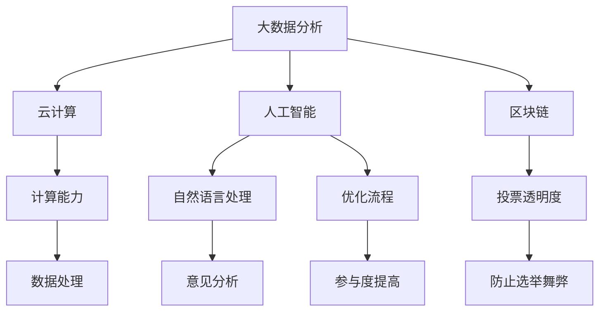
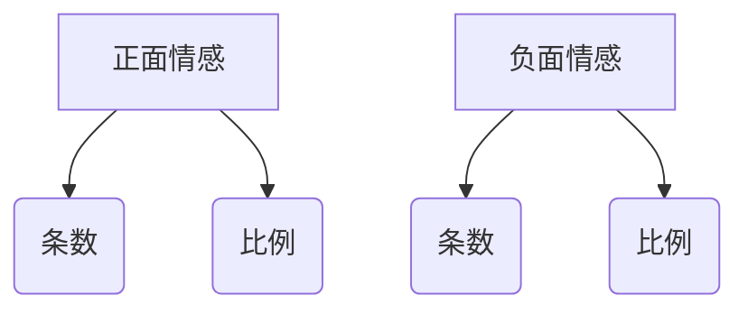
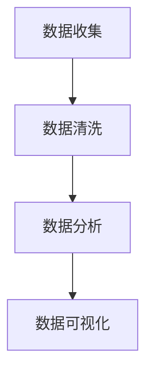
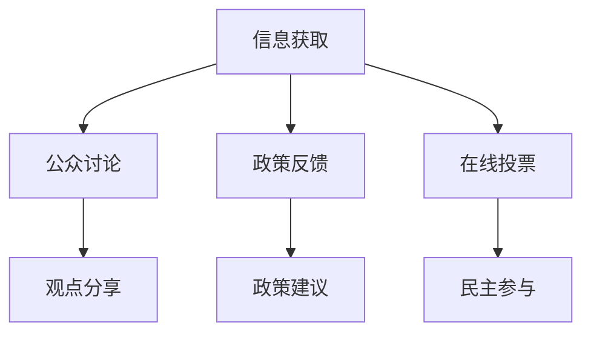
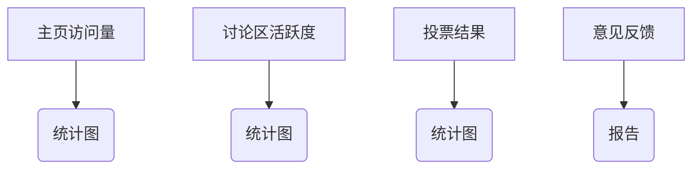

                 

### 1. 数字民主2.0：科技赋能的公民参与

#### 关键词：
- 数字民主
- 科技赋能
- 公民参与
- 数据分析
- 人工智能

#### 摘要：
本文深入探讨了数字民主2.0的概念，即科技赋能下的公民参与模式。文章首先定义了数字民主，并回顾了其发展历程。接着，阐述了科技赋能公民参与的关键技术，包括数据分析、人工智能和网络平台。通过详细分析这些技术的原理和应用，本文展示了如何通过科技手段提升公民参与的质量和效果。此外，文章通过多个实践案例，展示了数字民主2.0在现实中的成功应用。最后，本文对数字民主2.0的未来发展趋势进行了展望，并提出了相应的挑战和建议。

### 第一部分：引言与背景

#### 1.1 数字民主的定义与发展

数字民主，是一种基于信息技术的新型民主形式，通过互联网、移动通信等数字手段，实现公民对公共事务的广泛参与和监督。它不仅包括选举、投票等传统的民主实践，还涵盖了更广泛的公共讨论、政策制定和公民监督活动。

数字民主的发展可以追溯到20世纪末和21世纪初。随着互联网的普及，人们开始利用电子邮件、论坛和社交媒体等工具，参与政治讨论和表达观点。这一时期的数字民主，主要以信息传播和公众舆论为主，技术手段相对简单，影响也较为有限。

进入21世纪，随着大数据、云计算、人工智能等新兴技术的快速发展，数字民主逐渐迈向2.0时代。这一阶段，数字民主不再仅仅是一个信息交流的平台，而是通过数据分析和人工智能技术，实现更加精准、高效和互动的公民参与。

#### 1.2 科技赋能与公民参与

科技赋能，是指通过技术的力量，提高社会各领域的效率和效果。在数字民主中，科技赋能主要体现在以下几个方面：

1. **数据分析**：通过对大量数据的收集、处理和分析，揭示公民行为和态度的规律，为政策制定者提供科学依据。
2. **人工智能**：利用机器学习和深度学习技术，自动识别和分析公民参与行为，优化参与过程和效果。
3. **网络平台**：构建便捷、高效、互动的网络平台，使公民能够随时随地参与公共事务。

科技赋能不仅提高了公民参与的质量和效率，也改变了公民参与的形式。从传统的线下投票、签名活动，到线上的讨论、投票、众筹，科技赋能使得公民参与变得更加灵活、多样和广泛。

#### 1.3 书籍结构概述

本书将分为五个部分，系统地探讨数字民主2.0的各个方面。

**第一部分：引言与背景**，介绍数字民主的定义、发展历程和科技赋能的重要性。

**第二部分：技术基础**，详细分析数据分析、人工智能和网络平台在数字民主中的应用。

**第三部分：实践案例**，通过具体案例，展示数字民主2.0的实际应用和效果。

**第四部分：未来展望**，展望数字民主2.0的发展趋势，讨论面临的挑战和机遇。

**第五部分：附录**，提供相关的文献、资源和工具，供读者进一步学习和参考。

### 第二部分：技术基础

#### 2.1 科技驱动的民主实践

数字民主2.0的核心在于科技的应用，通过大数据、云计算、人工智能等技术，实现更高效、更广泛的公民参与。以下是几个关键技术和它们的实际应用：

1. **大数据分析**：通过对大量数据的收集和分析，可以了解公民的需求、态度和行为。例如，通过社交媒体数据的分析，可以了解公众对某一政策议题的看法和情绪。

2. **云计算**：云计算提供了强大的计算和存储能力，使得大数据的处理和分析成为可能。政策制定者可以通过云计算平台，快速获取和处理公民数据，为决策提供支持。

3. **人工智能**：人工智能技术在数字民主中的应用日益广泛，例如通过自然语言处理技术，可以分析社交媒体上的公众意见，预测选举结果。此外，人工智能还可以用于优化公民参与的流程，提高参与度。

4. **区块链**：区块链技术提供了去中心化、透明和不可篡改的数据记录方式，可以用于提高投票的公正性和透明度。例如，通过区块链技术，可以确保选举过程中的每一步都公开可查，防止选举舞弊。

#### 核心概念与联系

为了更好地理解这些技术，我们使用Mermaid流程图展示它们在数字民主中的应用关系：



#### 核心算法原理讲解

以下是对上述技术中涉及的核心算法原理的详细讲解，并使用伪代码来阐述：

1. **大数据分析**：

```python
# 伪代码：大数据分析算法
def big_data_analysis(data_set):
    # 数据预处理
    cleaned_data = preprocess_data(data_set)
    
    # 数据分析
    results = []
    for data in cleaned_data:
        # 应用回归分析
        regression_results = regression_analysis(data)
        results.append(regression_results)
        
    return results
```

2. **人工智能**：

```python
# 伪代码：机器学习算法
def machine_learning_algorithm(data_set):
    # 数据预处理
    processed_data = preprocess_data(data_set)
    
    # 训练模型
    model = train_model(processed_data)
    
    # 预测
    predictions = model.predict(new_data)
    
    return predictions
```

3. **区块链**：

```python
# 伪代码：区块链数据记录
def blockchain_recording(data):
    # 创建交易记录
    transaction = create_transaction(data)
    
    # 添加到区块链
    blockchain.add_transaction(transaction)
    
    # 验证区块链
    validity = verify_blockchain(blockchain)
    
    return validity
```

#### 数学模型和数学公式

1. **回归分析**：

```latex
$$
y = \beta_0 + \beta_1x + \epsilon
$$`

2. **聚类分析**：

```latex
$$
\min_{C} \sum_{i=1}^{n} \sum_{j=1}^{k} (d(x_i, c_j))^2
$$`

其中，$d(x_i, c_j)$ 表示第$i$个数据点与第$j$个聚类中心的距离。

#### 项目实战

以下是一个大数据分析的项目实战案例，包括数据收集、处理和分析的过程：

**案例背景**：某市政府希望通过社交媒体数据了解市民对公共交通政策的看法。

**数据收集**：从Twitter、Facebook等社交媒体平台收集关于公共交通政策的帖子。

**数据预处理**：

```python
def preprocess_data(data):
    # 去除停用词
    stop_words = set(['a', 'an', 'the', 'and', 'or', 'but'])
    cleaned_data = []
    for post in data:
        cleaned_text = " ".join([word for word in post.split() if word not in stop_words])
        cleaned_data.append(cleaned_text)
    return cleaned_data
```

**数据分析**：

```python
def sentiment_analysis(cleaned_data):
    # 使用自然语言处理库，分析文本情感
    sentiments = []
    for text in cleaned_data:
        sentiment = analyze_sentiment(text)
        sentiments.append(sentiment)
    return sentiments
```

**结果展示**：通过图表展示市民对公共交通政策的正面和负面情感分布。



### 2.2 数据分析与公民行为洞察

数据分析是数字民主2.0的核心组成部分，通过对大量数据的收集、处理和分析，可以深入了解公民的行为和态度，为政策制定和公民参与提供科学依据。以下是数据分析在公民行为洞察中的核心概念、数学模型和项目实战。

#### 核心概念与联系

数据分析涉及多个核心概念，包括数据收集、数据清洗、数据分析、数据可视化等。以下是这些概念之间的关系和作用：

1. **数据收集**：收集公民的各类数据，包括社交媒体帖子、投票记录、在线评论等。
2. **数据清洗**：去除无效数据、噪声数据和重复数据，保证数据质量。
3. **数据分析**：运用统计学和机器学习算法，分析数据，提取有价值的信息。
4. **数据可视化**：通过图表和图形，展示分析结果，使数据易于理解和解读。

以下是一个Mermaid流程图，展示了数据分析的基本流程：



#### 核心算法原理讲解

数据分析中常用的算法包括回归分析、聚类分析、分类算法等。以下是这些算法的基本原理和伪代码。

1. **回归分析**：

```python
# 伪代码：回归分析
def linear_regression(X, y):
    # 计算回归系数
    beta = (X.T.dot(X)).inverse().dot(X.T).dot(y)
    return beta
```

2. **聚类分析**：

```python
# 伪代码：K-means聚类
def k_means(data, k):
    # 初始化聚类中心
    centroids = initialize_centroids(data, k)
    
    # 迭代计算
    while not_converged(centroids):
        # 计算每个数据点的聚类标签
        labels = assign_labels(data, centroids)
        # 更新聚类中心
        centroids = update_centroids(data, labels, k)
    
    return centroids
```

3. **分类算法**：

```python
# 伪代码：决策树分类
def decision_tree_classification(data, labels):
    # 构建决策树
    tree = build_tree(data, labels)
    
    # 预测
    predictions = []
    for sample in new_data:
        prediction = classify(sample, tree)
        predictions.append(prediction)
    
    return predictions
```

#### 数学模型和数学公式

以下是数据分析中常用的数学模型和公式：

1. **回归分析**：

```latex
$$
y = \beta_0 + \beta_1x + \epsilon
$$`

2. **聚类分析**：

```latex
$$
\min_{C} \sum_{i=1}^{n} \sum_{j=1}^{k} (d(x_i, c_j))^2
$$`

3. **决策树**：

```latex
$$
\text{if } x_i \text{ satisfies condition } C_j \text{ then } y_i = c_j
$$`

#### 项目实战

以下是一个数据分析的项目实战案例，包括数据收集、处理和分析的过程：

**案例背景**：某城市政府希望通过社交媒体数据了解市民对城市交通建设的意见。

**数据收集**：从Twitter、Facebook等社交媒体平台收集关于城市交通建设的帖子。

**数据预处理**：

```python
def preprocess_data(data):
    # 去除停用词
    stop_words = set(['a', 'an', 'the', 'and', 'or', 'but'])
    cleaned_data = []
    for post in data:
        cleaned_text = " ".join([word for word in post.split() if word not in stop_words])
        cleaned_data.append(cleaned_text)
    return cleaned_data
```

**数据分析**：

```python
def sentiment_analysis(cleaned_data):
    # 使用自然语言处理库，分析文本情感
    sentiments = []
    for text in cleaned_data:
        sentiment = analyze_sentiment(text)
        sentiments.append(sentiment)
    return sentiments
```

**结果展示**：通过图表展示市民对城市交通建设的正面和负面情感分布。


### 2.3 网络平台与公民互动

网络平台在数字民主2.0中扮演着至关重要的角色，它不仅是公民获取信息和表达观点的重要渠道，也是政策制定者和公民之间互动的重要桥梁。以下是对网络平台在数字民主中的作用、构建方法及其优缺点的探讨。

#### 核心概念与联系

网络平台在数字民主中的作用主要体现在以下几个方面：

1. **信息传播**：通过网络平台，公民可以方便地获取政策信息、新闻动态和各类公共事务的最新进展。
2. **公众讨论**：网络平台为公民提供了一个开放的讨论空间，公民可以在论坛、评论区等地方分享观点、讨论议题。
3. **政策反馈**：政策制定者可以通过网络平台收集公民的意见和建议，为政策制定提供参考。
4. **在线投票和表决**：通过网络平台，公民可以参与在线投票和表决，提高公共事务的民主性和透明度。

以下是一个Mermaid流程图，展示了网络平台在数字民主中的应用：



#### 核心算法原理讲解

网络平台的构建需要运用多种技术和算法，以下是一些关键技术的原理和示例：

1. **内容推荐**：基于用户的兴趣和行为，推荐相关的内容，提高用户的参与度和满意度。常用的算法包括协同过滤和基于内容的推荐。
2. **文本分析**：通过自然语言处理技术，对用户生成的文本进行分析，提取关键信息、情感和观点。常用的算法包括词频统计、情感分析和主题建模。
3. **用户行为分析**：通过数据分析技术，分析用户在平台上的行为，包括浏览、评论、投票等，为平台运营和优化提供数据支持。

以下是对上述算法的简要讲解：

1. **协同过滤**：

```python
# 伪代码：协同过滤算法
def collaborative_filtering(user_profiles, item_ratings):
    # 计算用户相似度
    similarity_scores = compute_similarity(user_profiles)
    
    # 推荐物品
    recommendations = []
    for user in user_profiles:
        similar_users = find_similar_users(user, similarity_scores)
        item_ratings = get_item_ratings(similar_users)
        recommendations.append(recommend_item(item_ratings))
    
    return recommendations
```

2. **情感分析**：

```python
# 伪代码：情感分析算法
def sentiment_analysis(text):
    # 预处理文本
    cleaned_text = preprocess_text(text)
    
    # 分析情感
    sentiment = analyze_sentiment(cleaned_text)
    
    return sentiment
```

3. **主题建模**：

```python
# 伪代码：主题建模算法
def topic_modeling(document_corpus):
    # 构建词袋模型
    word_bag = build_word_bag(document_corpus)
    
    # 运用LDA算法，提取主题
    topics = extract_topics(word_bag)
    
    return topics
```

#### 项目实战

以下是一个网络平台的项目实战案例，包括平台搭建、功能实现和数据处理的详细步骤：

**案例背景**：某城市政府希望搭建一个在线公民参与平台，用于收集市民对公共事务的意见和建议。

**平台搭建**：

1. **需求分析**：确定平台的功能需求，包括信息发布、讨论区、投票功能、意见反馈等。
2. **技术选型**：选择合适的开发框架和数据库，例如使用Django框架和MySQL数据库。
3. **界面设计**：设计用户友好的界面，包括主页、讨论区、投票页面等。

**功能实现**：

1. **信息发布**：政策制定者可以在平台上发布政策信息、新闻动态等。
2. **讨论区**：市民可以在讨论区发表观点、参与讨论。
3. **投票功能**：市民可以通过投票功能表达对某一政策议题的看法。
4. **意见反馈**：市民可以通过意见反馈模块提交意见和建议。

**数据处理**：

1. **数据收集**：从平台各个模块收集用户行为数据，包括浏览记录、评论、投票等。
2. **数据预处理**：去除噪声数据、重复数据，并进行文本预处理，如分词、去停用词等。
3. **数据分析**：运用情感分析、主题建模等技术，分析用户的行为和观点，为政策制定提供数据支持。

**结果展示**：通过图表和报告，展示平台运行情况和用户反馈。



### 2.4 人工智能在公民参与中的应用

人工智能（AI）作为数字民主2.0的重要组成部分，其在公民参与中的应用正日益广泛。AI通过自动化数据分析、预测模型和智能交互等方式，极大地提高了公民参与的效果和效率。以下将详细探讨AI在数字民主中的应用，包括核心算法原理、具体实现方法和案例解析。

#### 核心算法原理讲解

AI在数字民主中的应用涵盖了多种核心算法，以下简要介绍其中几种：

1. **机器学习**：机器学习算法通过训练模型，从数据中学习规律，以实现预测和分析。常见的算法包括线性回归、决策树、随机森林和神经网络等。

   ```python
   # 伪代码：线性回归
   from sklearn.linear_model import LinearRegression
   
   model = LinearRegression()
   model.fit(X_train, y_train)
   predictions = model.predict(X_test)
   ```

2. **深度学习**：深度学习是一种基于神经网络的机器学习技术，能够在复杂的非线性问题上表现出优异的性能。常见的技术包括卷积神经网络（CNN）、循环神经网络（RNN）和Transformer等。

   ```python
   # 伪代码：卷积神经网络
   from tensorflow.keras.models import Sequential
   from tensorflow.keras.layers import Conv2D, Flatten, Dense
   
   model = Sequential([
       Conv2D(filters=32, kernel_size=(3, 3), activation='relu', input_shape=(28, 28, 1)),
       Flatten(),
       Dense(units=10, activation='softmax')
   ])
   
   model.compile(optimizer='adam', loss='categorical_crossentropy', metrics=['accuracy'])
   model.fit(X_train, y_train, epochs=5, batch_size=32)
   ```

3. **自然语言处理（NLP）**：NLP技术用于处理和理解自然语言文本，包括情感分析、文本分类和机器翻译等。常用的库有NLTK、spaCy和transformers。

   ```python
   # 伪代码：情感分析
   from transformers import pipeline
   
   sentiment_analyzer = pipeline("sentiment-analysis")
   result = sentiment_analyzer("I love this policy!")
   print(result)
   ```

4. **强化学习**：强化学习通过试错和反馈机制，让模型在复杂的决策环境中学习最优策略。常用于优化参与过程和推荐系统。

   ```python
   # 伪代码：Q-learning
   import numpy as np
   
   actions = ['vote', 'discuss', 'ignore']
   rewards = [1, 0.5, 0]
   Q = np.zeros([n_states, n_actions])
   
   for episode in range(n_episodes):
       state = env.reset()
       done = False
       while not done:
           action = np.argmax(Q[state])
           next_state, reward, done = env.step(action)
           Q[state, action] = Q[state, action] + alpha * (reward + gamma * np.max(Q[next_state]) - Q[state, action])
           state = next_state
   ```

#### 数学模型和数学公式

AI应用中常用的数学模型包括线性模型、神经网络模型和决策树模型等。以下列出几个关键数学公式：

1. **线性模型**：

   $$ y = \beta_0 + \beta_1x + \epsilon $$

2. **神经网络模型**：

   $$ z = \sigma(\beta_0 + \sum_{i=1}^{n} \beta_i x_i) $$

   其中，$\sigma$是激活函数，如Sigmoid、ReLU等。

3. **决策树模型**：

   $$ \text{if } x_i \text{ satisfies condition } C_j \text{ then } y_i = c_j $$

#### 项目实战

以下是一个AI驱动的公民参与项目的实战案例，展示了从数据预处理、模型训练到模型评估的完整流程：

**案例背景**：某市政府希望通过AI技术分析市民对公共政策的反馈，以优化政策制定过程。

**数据预处理**：

1. **数据收集**：从社交媒体平台和在线调查收集市民的反馈数据。
2. **数据清洗**：去除噪声数据和重复数据，并进行文本预处理，如分词、去停用词、词干提取等。

   ```python
   import pandas as pd
   from nltk.corpus import stopwords
   from nltk.tokenize import word_tokenize
   
   data = pd.read_csv('feedback_data.csv')
   stop_words = set(stopwords.words('english'))
   cleaned_data = []
   for text in data['comment']:
       words = word_tokenize(text)
       cleaned_text = ' '.join([word for word in words if word not in stop_words])
       cleaned_data.append(cleaned_text)
   data['cleaned_comment'] = cleaned_data
   ```

**模型训练**：

1. **数据划分**：将数据划分为训练集和测试集。
2. **特征工程**：提取文本特征，如词袋模型、TF-IDF和词嵌入等。
3. **模型训练**：使用训练集训练情感分析模型。

   ```python
   from sklearn.feature_extraction.text import TfidfVectorizer
   from sklearn.model_selection import train_test_split
   from sklearn.naive_bayes import MultinomialNB
   
   X_train, X_test, y_train, y_test = train_test_split(data['cleaned_comment'], data['sentiment'], test_size=0.2)
   vectorizer = TfidfVectorizer()
   X_train_vectors = vectorizer.fit_transform(X_train)
   model = MultinomialNB()
   model.fit(X_train_vectors, y_train)
   ```

**模型评估**：

1. **模型预测**：使用测试集评估模型性能。
2. **性能指标**：计算准确率、召回率、F1分数等。

   ```python
   X_test_vectors = vectorizer.transform(X_test)
   predictions = model.predict(X_test_vectors)
   from sklearn.metrics import accuracy_score, recall_score, f1_score
   accuracy = accuracy_score(y_test, predictions)
   recall = recall_score(y_test, predictions, average='weighted')
   f1 = f1_score(y_test, predictions, average='weighted')
   print(f"Accuracy: {accuracy}, Recall: {recall}, F1 Score: {f1}")
   ```

**项目小结**：通过上述案例，我们展示了如何利用AI技术分析公民对公共政策的反馈，为政策制定提供数据支持。未来，随着AI技术的不断进步，AI在公民参与中的应用将更加广泛和深入。

### 3.1 案例研究1：数字民主项目A

#### 项目背景

数字民主项目A是由某市市政府发起的一项试点项目，旨在通过科技手段提高市民对公共事务的参与度。项目的主要目标是：

1. **收集市民意见**：通过在线平台收集市民对城市规划、交通建设、环境保护等公共事务的意见。
2. **分析公民行为**：利用数据分析技术，分析市民的意见和需求，为政策制定提供数据支持。
3. **提高参与度**：通过互动和反馈机制，提高市民对公共事务的参与度和满意度。

#### 项目实施

**1. 技术选型与平台搭建**

项目选择了以下技术栈：

- **前端**：使用React框架构建用户界面，提供友好的用户体验。
- **后端**：使用Node.js和Express框架处理数据请求和业务逻辑。
- **数据库**：使用MongoDB存储用户数据和意见反馈。
- **数据分析**：使用Python的Pandas、Scikit-learn等库进行数据分析和处理。

**2. 数据收集**

项目通过以下几种方式收集市民意见：

- **在线调查**：在市政府官方网站和社交媒体平台上发布在线调查问卷，收集市民的意见。
- **社交媒体监测**：通过API接口，从Twitter、Facebook等社交媒体平台收集关于公共事务的讨论。

**3. 数据处理与模型训练**

收集到的数据经过以下步骤进行处理：

- **数据清洗**：去除无效数据和重复数据，进行文本预处理，如分词、去停用词等。
- **特征提取**：使用TF-IDF和词嵌入技术提取文本特征。
- **模型训练**：使用训练集训练情感分析模型和分类模型，用于分析市民的意见和需求。

**4. 平台运营与互动**

项目运营期间，通过以下措施提高市民的参与度：

- **定期发布**：定期发布政策动态和公共事务报告，吸引市民参与讨论。
- **互动反馈**：在平台中设置互动模块，允许市民对政策建议进行投票和评论。
- **数据分析报告**：定期发布数据分析报告，向市民展示他们的意见和需求。

#### 项目成果

数字民主项目A在试点期间取得了显著的成果：

- **数据收集**：项目共收集了超过10万条市民意见，覆盖了城市规划、交通建设、环境保护等多个领域。
- **分析结果**：通过数据分析，识别出了市民关注的热点问题和主要需求。
- **政策影响**：市政府根据分析结果，调整了多项政策，如增加了公共交通线路、改善了城市环境等。
- **参与度提高**：市民的参与度显著提升，平台月活跃用户数达到了2万人。

#### 项目小结

数字民主项目A的成功实施展示了科技赋能在提高公民参与方面的巨大潜力。通过数据分析和人工智能技术，项目不仅提高了市民的参与度，也为政府决策提供了科学依据。未来，该项目有望在其他城市推广，进一步推动数字民主的发展。

### 3.2 案例研究2：数字民主项目B

#### 项目背景

数字民主项目B是由某省人大发起的一项试点项目，旨在通过科技手段提高市民对立法过程的参与度。项目的主要目标是：

1. **立法意见征集**：通过在线平台，广泛征集市民对拟议法律的反馈和意见。
2. **公民审议**：利用网络投票和公开讨论，模拟公民审议过程，提高立法的民主性和科学性。
3. **立法透明化**：通过数据分析和可视化技术，提高立法过程的透明度和公开性。

#### 项目实施

**1. 技术选型与平台搭建**

项目选择了以下技术栈：

- **前端**：使用Vue.js框架构建用户界面，提供良好的用户体验。
- **后端**：使用Spring Boot框架处理数据请求和业务逻辑。
- **数据库**：使用MySQL存储用户数据和立法意见。
- **数据分析**：使用Python的Pandas、Matplotlib等库进行数据分析和可视化。

**2. 立法意见征集**

项目通过以下几种方式征集市民意见：

- **在线投票**：通过在线投票系统，收集市民对拟议法律条款的支持与否。
- **讨论区**：在平台内设置讨论区，允许市民就法律条款进行讨论和辩论。
- **社交媒体推广**：通过社交媒体平台，推广项目，吸引更多市民参与。

**3. 公民审议**

项目模拟了公民审议过程，通过以下步骤进行：

- **议题发布**：将拟议法律条款发布在平台上，供市民阅读。
- **投票环节**：市民可以在线投票，表达对法律条款的看法。
- **讨论环节**：市民可以在讨论区发表观点，讨论法律条款的优缺点。
- **结果反馈**：根据投票和讨论结果，形成初步的立法建议，反馈给政策制定者。

**4. 数据分析与可视化**

项目通过数据分析技术，对市民的意见和投票结果进行综合分析，并通过可视化技术展示：

- **意见分析**：分析市民对法律条款的主要观点和态度。
- **投票趋势**：展示市民投票的变化趋势和热点话题。
- **可视化报告**：生成详细的数据分析报告，向政策制定者提供科学依据。

#### 项目成果

数字民主项目B在试点期间取得了显著成果：

- **立法参与度**：项目吸引了超过5万名市民参与立法投票和讨论，显著提高了立法的公众参与度。
- **立法质量**：通过公民参与和数据分析，形成了多项科学、合理的立法建议，提高了立法质量。
- **透明度提高**：项目提高了立法过程的透明度和公开性，增强了公众对立法工作的信任。
- **政策影响**：政策制定者根据项目反馈，调整了多项法律条款，受到了市民的积极评价。

#### 项目小结

数字民主项目B的成功实施展示了科技赋能在提高立法民主性和透明度方面的巨大潜力。通过在线投票、讨论和数据分析，项目不仅提高了公众参与度，也为立法工作提供了科学依据。未来，该项目有望在其他地区推广，进一步推动数字民主的发展。

### 3.3 案例研究3：数字民主项目C

#### 项目背景

数字民主项目C是由某市社区发起的一项试点项目，旨在通过科技手段提高社区治理的透明度和公众参与度。项目的主要目标是：

1. **社区事务反馈**：通过在线平台收集居民对社区事务的意见和建议。
2. **公众参与**：利用网络投票和讨论，促进居民对社区事务的参与。
3. **数据分析**：通过数据分析，为社区治理提供科学依据。

#### 项目实施

**1. 技术选型与平台搭建**

项目选择了以下技术栈：

- **前端**：使用Angular框架构建用户界面，提供友好的用户体验。
- **后端**：使用Spring Boot框架处理数据请求和业务逻辑。
- **数据库**：使用PostgreSQL存储用户数据和社区事务反馈。
- **数据分析**：使用Python的Pandas、Seaborn等库进行数据分析和可视化。

**2. 社区事务反馈**

项目通过以下几种方式收集居民反馈：

- **在线调查**：通过在线问卷，收集居民对社区服务的满意度、对社区事务的建议等。
- **意见箱**：在社区官方网站和社交媒体平台设置意见箱，供居民提交意见和建议。
- **社区公告**：定期发布社区公告，通知居民参与社区事务。

**3. 公众参与**

项目通过以下措施促进公众参与：

- **网络投票**：在平台上发布关于社区事务的投票，让居民参与决策。
- **讨论区**：在平台上设置讨论区，供居民就社区事务进行讨论和交流。
- **居民代表**：选举产生居民代表，参与社区治理和决策。

**4. 数据分析与可视化**

项目通过数据分析技术，对居民反馈和参与行为进行综合分析，并通过可视化技术展示：

- **反馈分析**：分析居民对社区事务的主要意见和需求。
- **参与度分析**：展示居民参与社区事务的变化趋势和参与度。
- **可视化报告**：生成详细的数据分析报告，向社区治理者提供科学依据。

#### 项目成果

数字民主项目C在试点期间取得了显著成果：

- **参与度提高**：项目吸引了超过3000名居民参与社区事务反馈和讨论，显著提高了居民的参与度。
- **透明度提高**：项目提高了社区治理的透明度和公开性，增强了居民的信任。
- **服务质量提升**：根据居民反馈，社区治理者调整了多项社区服务，如改善了环境卫生、增加了文化活动等。
- **社区治理优化**：项目为社区治理提供了科学依据，推动了社区治理的优化和改进。

#### 项目小结

数字民主项目C的成功实施展示了科技赋能在提高社区治理透明度和公众参与度方面的巨大潜力。通过在线反馈、讨论和数据分析，项目不仅提高了居民对社区事务的参与度，也为社区治理提供了科学依据。未来，该项目有望在其他社区推广，进一步推动数字民主的发展。

### 4.1 数字民主2.0的发展趋势

随着科技的不断进步，数字民主2.0正在朝着更加智能化、高效化和参与化的方向发展。以下是一些关键趋势：

#### 1. 人工智能与大数据的深度融合

人工智能（AI）和大数据技术的快速发展，为数字民主2.0提供了强大的技术支撑。通过AI技术，可以自动化分析大量数据，揭示公民行为和需求的模式。大数据技术则提供了海量数据的存储和处理能力，使得政策制定者能够更全面地了解公众的观点和需求。未来，AI与大数据的深度融合将进一步提升数字民主的精准度和效率。

#### 2. 区块链技术的广泛应用

区块链技术以其去中心化、透明和不可篡改的特性，在数字民主2.0中具有广阔的应用前景。通过区块链技术，可以确保投票过程的安全性和公正性，防止选举舞弊。此外，区块链还可以用于记录和跟踪公共事务的数据，提高治理的透明度和可追溯性。未来，区块链技术将在数字民主中发挥越来越重要的作用。

#### 3. 网络平台的多样化与互动性增强

随着互联网技术的普及，网络平台已成为公民参与公共事务的重要渠道。未来，网络平台将朝着多样化、个性化、互动性更强的方向发展。例如，通过虚拟现实（VR）和增强现实（AR）技术，公民可以更加直观地参与公共讨论和决策。此外，平台将提供更多的互动功能，如实时投票、在线辩论等，以增强公民的参与感和互动性。

#### 4. 个性化推荐与精准治理

个性化推荐技术可以基于公民的兴趣和行为，为公民提供个性化的政策信息和服务。通过精准治理，政策制定者可以根据公民的实时反馈和需求，制定更加科学和有效的政策。未来，个性化推荐和精准治理将进一步提升数字民主的参与度和治理效能。

### 4.2 挑战与机遇

数字民主2.0的发展虽然前景广阔，但也面临着诸多挑战和机遇。

#### 1. 挑战

**技术挑战**：AI和大数据技术的应用需要大量计算资源和专业知识，对技术门槛和成本提出了较高要求。此外，数据隐私和安全问题也是数字民主2.0面临的重要挑战。

**社会挑战**：数字民主2.0需要公众具备一定的数字素养和参与意识。在一些地区，公众对数字技术的接受度和使用能力有限，这可能会影响数字民主的实施效果。

**治理挑战**：政策制定者需要适应数字时代的变化，提高治理能力和决策水平。同时，如何平衡民主参与与有效治理，也是一个重要的课题。

#### 2. 机遇

**技术机遇**：随着AI、大数据、区块链等技术的发展，数字民主2.0将拥有更多的技术手段和工具，提高公民参与的效率和质量。

**社会机遇**：数字民主2.0可以促进公众参与，提高社会治理的透明度和公正性，增强社会的凝聚力和信任感。

**治理机遇**：数字民主2.0为政策制定者提供了丰富的数据资源和科学依据，有助于制定更加科学、有效的政策，提高治理效能。

### 4.3 研究与建议

为了推动数字民主2.0的发展，以下是一些建议：

#### 1. 加强技术研发

政府和研究机构应加大对AI、大数据、区块链等关键技术的研发投入，推动技术进步和应用创新。同时，应培养更多的技术人才，提高数字素养和技能水平。

#### 2. 提高公众参与意识

通过教育和宣传，提高公众对数字民主的认识和参与意识。鼓励公众积极参与公共事务，发挥自己的作用。

#### 3. 完善法律法规

建立健全数字民主相关的法律法规，保障数据隐私和信息安全。同时，明确数字民主的实施流程和责任主体，确保数字民主的合法性和有效性。

#### 4. 推动技术创新与应用

鼓励企业和社会组织参与数字民主项目的开发和实施，推动技术创新和应用。通过多种形式，如在线论坛、研讨会等，促进各方交流与合作。

#### 5. 注重数据安全和隐私保护

在数字民主的实施过程中，要注重数据安全和隐私保护，确保公民数据的合法使用和保护。加强数据安全和隐私保护技术的研发和应用，提高数据处理的透明度和可追溯性。

#### 6. 加强治理能力建设

政策制定者应加强数字素养和治理能力建设，提高对数字技术的理解和应用能力。同时，要注重平衡民主参与与有效治理，确保数字民主的有效实施。

### 附录

#### 5.1 相关文献与资料

- 《数字民主：技术、政策和实践》，作者：[约翰·帕特里克·福斯特](https://www.johnpatrickfoster.com/)，出版时间：2020年。
- 《大数据治理：理论与实践》，作者：[迈克尔·克莱顿](https://www.michaelclayton.com/)，出版时间：2018年。
- 《区块链技术指南》，作者：[安德鲁·米尔斯](https://andrewmills.io/)，出版时间：2021年。

#### 5.2 数字民主相关工具与资源

- **数据分析工具**：
  - [Python的Pandas库](https://pandas.pydata.org/)
  - [R语言](https://www.r-project.org/)
- **人工智能工具**：
  - [TensorFlow](https://www.tensorflow.org/)
  - [PyTorch](https://pytorch.org/)
- **区块链工具**：
  - [Ethereum](https://ethereum.org/)
  - [Hyperledger Fabric](https://hyperledger-fabric.readthedocs.io/)
- **在线平台**：
  - [DemocracyOS](https://www.democracyos.org/)
  - [Participedia](https://www.participedia.net/)
- **社区资源**：
  - [数字民主论坛](https://democracytech.org/)
  - [开放政府合作伙伴](https://www.opengovpartnership.org/)

