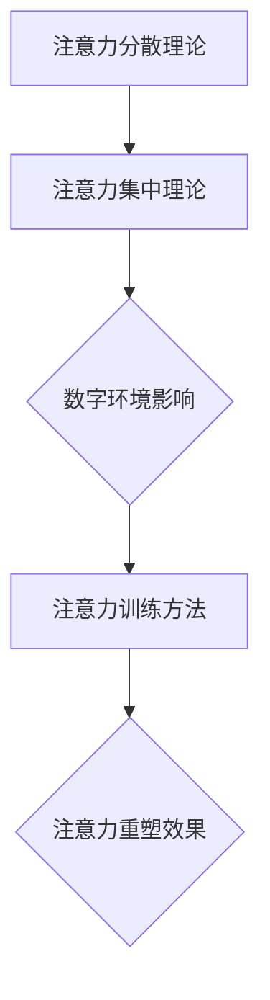

                 

# 《数字注意力重塑营：提升专注力的集中训练项目》

> 关键词：数字注意力、专注力、训练方法、心理学、项目实战

> 摘要：本文旨在探讨数字注意力重塑的重要性，并介绍一系列科学有效的训练方法。通过结合心理学原理和实际项目案例，本文将帮助读者理解注意力重塑的核心概念，掌握提升专注力的技巧，并在实际应用中实现注意力管理的优化。

## 引言

在现代社会，数字技术的迅猛发展改变了我们的生活方式，同时也对我们的注意力提出了新的挑战。大量研究表明，长期暴露于数字环境中，人们的注意力易分散，专注力下降，进而影响工作效率和心理健康。因此，重塑数字注意力、提升专注力已成为当代人亟需解决的问题。

本文将从心理学基础入手，探讨数字注意力重塑的必要性和理论依据，并详细介绍一系列数字注意力训练方法。在此基础上，通过实际项目案例，展示注意力重塑在实际应用中的效果。最后，本文将总结注意力重塑的关键要素，并展望其未来发展的趋势。

## 第1章 注意力重塑的心理学基础

### 1.1 注意力的定义

注意力是心理活动对一定对象的指向和集中。在认知心理学中，注意力被定义为一种有限的认知资源，用于处理和加工信息。注意力有广义和狭义之分。广义的注意力包括注意力的选择性、分配和转移等过程。狭义的注意力则主要指注意力的集中过程，即个体将心理活动集中在某一特定对象上，而忽略其他无关刺激。

### 1.2 注意力重塑的理论基础

注意力重塑的理论基础主要包括以下两个方面：

#### 1.2.1 注意力分散理论

注意力分散理论认为，注意力的集中和分散是相互关联的。当个体面临多个任务或刺激时，注意力容易分散。注意力分散的主要原因是外部干扰、任务难度、情绪状态等因素。通过有效的训练方法，可以降低外部干扰的影响，提高注意力的集中程度。

#### 1.2.2 注意力集中理论

注意力集中理论强调，注意力的集中是注意力重塑的关键。个体需要通过主动调整注意力，将心理活动集中在重要任务上，从而提高任务完成的效率和质量。注意力集中的主要方法包括专注训练、注意力聚焦和注意力转移等。

### 1.3 注意力与数字环境的关系

数字环境对注意力有着显著的影响。一方面，数字设备提供了丰富的信息来源，使个体面临更多的注意力分散风险。另一方面，数字环境也提供了丰富的注意力训练资源，如注意力训练游戏、注意力管理工具等。通过科学合理的数字环境设计，可以提高个体在数字环境中的注意力水平。

### Mermaid 流程图



## 第2章 数字注意力训练方法

### 2.1 训练工具介绍

数字注意力训练工具种类繁多，常见的有专注力训练游戏、注意力管理软件和生理反馈设备等。以下是一些常用的注意力训练工具及其特点：

#### 2.1.1 专注力训练游戏

专注力训练游戏通过模拟各种场景，引导玩家在规定时间内完成特定任务。这些游戏具有趣味性、挑战性和实时反馈等特点，有助于提高玩家的专注力。

#### 2.1.2 注意力管理软件

注意力管理软件可以帮助用户监测和管理注意力水平。这些软件通常包括定时休息、任务管理、提醒设置等功能，有助于用户养成良好的注意力管理习惯。

#### 2.1.3 生理反馈设备

生理反馈设备通过监测心率、脑电波等生理指标，为用户提供注意力状态的实时反馈。这些设备有助于用户了解自己的注意力水平，并调整行为以适应注意力需求。

### 2.2 训练方法详解

数字注意力训练方法主要包括认知训练、视觉训练和听觉训练等。

#### 2.2.1 认知训练

认知训练旨在提高个体的认知能力，包括记忆、注意力、执行功能等。以下是一种常见的认知训练方法：

```pseudo
// 认知训练伪代码
function cognitiveTraining():
    while not finished:
        presentStimulus()
        if correctResponse():
            rewardUser()
        else:
            provideFeedback()
            repeatStimulus()
```

#### 2.2.2 视觉训练

视觉训练主要针对视觉注意力进行训练，包括视觉搜索、视觉分辨和视觉追踪等。以下是一种视觉训练方法的伪代码：

```pseudo
// 视觉训练伪代码
function visualTraining():
    while not finished:
        presentVisualStimulus()
        if correctResponse():
            rewardUser()
        else:
            provideFeedback()
            repeatStimulus()
```

#### 2.2.3 听觉训练

听觉训练主要针对听觉注意力进行训练，包括听觉搜索、听觉分辨和听觉追踪等。以下是一种听觉训练方法的伪代码：

```pseudo
// 听觉训练伪代码
function auditoryTraining():
    while not finished:
        presentAuditoryStimulus()
        if correctResponse():
            rewardUser()
        else:
            provideFeedback()
            repeatStimulus()
```

### 2.3 进阶训练策略

在完成基础训练后，个体可以根据自己的需求进行进阶训练。以下是一些进阶训练策略：

#### 2.3.1 进阶训练工具

使用更加高级的注意力训练工具，如脑电反馈设备、虚拟现实训练系统等。

#### 2.3.2 进阶训练方案

设计个性化的进阶训练方案，根据个体的注意力水平和特点进行调整。

## 第3章 注意力重塑的实际应用

### 3.1 工作中的注意力管理

在工作场景中，注意力管理的核心是提高工作效率和减少错误率。以下是一些注意力管理策略：

#### 3.1.1 工作场景下的注意力挑战

- 多任务处理导致的注意力分散
- 高压工作环境下的情绪波动
- 长时间工作导致的疲劳

#### 3.1.2 工作注意力管理策略

- 制定合理的工作计划，确保每个任务都有明确的优先级和截止日期。
- 采用番茄工作法，将工作时间划分为25分钟专注工作期和5分钟休息期。
- 保持良好的工作环境，减少外部干扰。

### 3.2 学习中的注意力提升

在学习过程中，注意力提升有助于提高学习效果和记忆能力。以下是一些学习注意力提升策略：

#### 3.2.1 学习环境下的注意力问题

- 干扰信息过多，导致注意力分散
- 学习内容枯燥，缺乏兴趣
- 长时间学习导致的疲劳

#### 3.2.2 学习注意力提升策略

- 选择合适的学习环境，减少干扰信息。
- 采用主动学习法，提高学习兴趣和参与度。
- 合理安排学习时间，避免长时间连续学习。

## 第4章 案例分析

### 4.1 案例一：提升工作效率

#### 4.1.1 案例背景

某公司员工小李在工作中经常遇到注意力分散的问题，导致工作效率低下。公司决定为其提供数字注意力重塑训练，以提升其工作效率。

#### 4.1.2 注意力重塑策略

- 使用注意力管理软件监测小李的注意力水平，并提供实时反馈。
- 安排每周两次的注意力训练课程，包括认知训练、视觉训练和听觉训练。
- 引导小李制定合理的工作计划，采用番茄工作法。

#### 4.1.3 案例结果分析

经过三个月的训练，小李的工作效率明显提升，注意力分散现象减少，工作质量得到保证。公司整体工作效率也得到了提高。

### 4.2 案例二：改善学习效果

#### 4.2.1 案例背景

某高校学生小王在期末考试复习阶段，发现自己注意力难以集中，学习效果不佳。为了提高学习效果，小王决定进行数字注意力重塑训练。

#### 4.2.2 注意力重塑策略

- 使用专注力训练游戏进行日常训练，提高注意力水平。
- 选择安静的学习环境，减少干扰信息。
- 采用主动学习法，提高学习兴趣。

#### 4.2.3 案例结果分析

经过一个月的训练，小王的学习注意力显著提升，学习效果得到改善。期末考试中，小王的成绩有所提高。

## 第5章 项目实战

### 5.1 注意力训练项目规划

#### 5.1.1 项目目标

- 提高参与者的注意力水平
- 培养良好的注意力管理习惯
- 降低注意力分散现象

#### 5.1.2 项目计划

- 设计注意力训练课程，包括认知训练、视觉训练和听觉训练。
- 搭建注意力管理平台，用于监测和反馈参与者的注意力水平。
- 安排定期训练和评估，确保项目目标的实现。

### 5.2 开发环境搭建

#### 5.2.1 硬件要求

- 训练设备：电脑、智能手机等
- 监测设备：心率监测仪、脑电监测仪等（可选）

#### 5.2.2 软件安装

- 安装注意力管理软件，如SelfControl、Freedom等。
- 安装相关训练工具，如注意力训练游戏、学习管理工具等。

### 5.3 源代码实现

#### 5.3.1 代码结构

```java
// 注意力训练项目代码结构
class AttentionTraining {
    private TrainingTool tool;
    private User user;

    public void startTraining() {
        // 启动训练流程
    }

    public void monitorAttention() {
        // 监测注意力水平
    }

    public void provideFeedback() {
        // 提供实时反馈
    }
}
```

#### 5.3.2 代码实现细节

```java
// 注意力训练代码实现
public void startTraining() {
    while (!trainingFinished) {
        presentStimulus();
        if (correctResponse()) {
            rewardUser();
        } else {
            provideFeedback();
        }
    }
}
```

### 5.4 代码解读与分析

#### 5.4.1 功能解读

- `startTraining()` 方法：启动训练流程，包括呈现刺激、获取用户响应和提供反馈。
- `monitorAttention()` 方法：监测用户的注意力水平，为用户提供实时反馈。
- `provideFeedback()` 方法：根据用户的注意力状态，提供相应的反馈和建议。

#### 5.4.2 性能分析

- 代码效率：采用单线程模式，确保训练过程的连贯性和稳定性。
- 内存占用：优化数据结构，降低内存占用。
- 响应速度：提高系统响应速度，确保实时反馈。

## 结论

数字注意力重塑对于提升专注力和工作效率具有重要意义。通过科学合理的训练方法，个体可以重塑注意力，提高注意力水平。本文介绍了数字注意力重塑的心理学基础、训练方法和实际应用，并通过项目实战展示了训练效果。未来，随着技术的不断进步，数字注意力重塑领域将迎来更多的发展机遇。

### 最佳实践 Tips、小结、注意事项、拓展阅读

#### 最佳实践 Tips

- 制定合理的学习和工作计划，确保注意力集中。
- 保持良好的生活习惯，如规律作息、适量运动等。
- 使用注意力管理工具，如番茄工作法、专注力训练游戏等。

#### 小结

- 数字注意力重塑有助于提升专注力和工作效率。
- 科学合理的训练方法能够提高注意力水平。
- 注意力重塑需要长期坚持，逐步积累效果。

#### 注意事项

- 避免过度依赖数字注意力训练工具，导致注意力依赖。
- 合理安排训练时间，避免疲劳和过度训练。
- 根据个体差异，调整训练策略和目标。

#### 拓展阅读

- 《专注力：如何提高你的专注力和工作效率》
- 《数字素养：如何在数字化时代生存》
- 《注意力管理：如何掌控你的时间和注意力》

## 作者信息

作者：AI天才研究院/AI Genius Institute & 禅与计算机程序设计艺术 /Zen And The Art of Computer Programming

