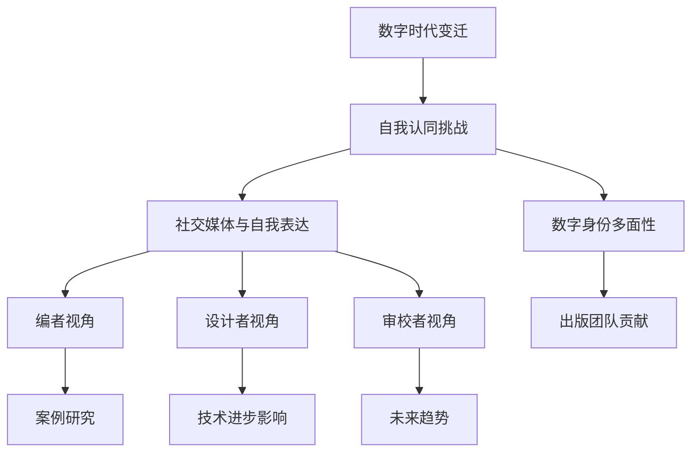

                 

# 《数字流浪者指南编辑部：网络时代自我认同探索的出版团队》

## 关键词

- 数字时代
- 自我认同
- 出版团队
- 网络文化
- 数字身份
- 社交媒体

## 摘要

本文探讨了网络时代数字流浪者指南编辑部这一独特出版团队如何在数字世界中探索自我认同的挑战。通过对数字时代的变迁、自我认同的挑战以及编辑部运作模式的深入分析，本文揭示了社交媒体与自我表达、数字身份的多面性等核心概念之间的联系。同时，通过案例研究和项目实战，本文展示了出版团队在不同角色中的贡献和策略，为数字时代的自我认同提供了启示和方向。

## 引言：数字时代的自我认同

### 1.1 数字时代的变迁

随着互联网的普及和技术的飞速发展，数字时代已经深刻地改变了我们的生活方式和社会结构。在这个时代，人们不再局限于物理空间，而是通过虚拟的网络空间进行交流、互动和创作。这种变迁不仅带来了丰富的信息和便捷的沟通方式，也引发了一系列关于自我认同的挑战。

### 1.2 自我认同的挑战

在数字时代，自我认同面临着前所未有的挑战。首先，社交媒体的兴起使得个体的自我表达变得更加多元化和碎片化。人们可以在不同的平台和角色中展示不同的自我，这既增加了自我认同的丰富性，也带来了混淆和困惑。其次，数字身份的多面性使得个体的真实身份和虚拟身份难以区分，这增加了自我认同的复杂性。此外，网络文化和虚拟社区的兴起，也让个体在追求自我认同的过程中面临着新的压力和挑战。

## 数字流浪者指南编辑部概述

### 2.1 编辑部的成立背景

数字流浪者指南编辑部成立于一个充满机遇和挑战的数字时代。随着互联网的普及和数字技术的发展，人们开始意识到在数字空间中探索自我认同的重要性。编辑部的成立旨在为那些在数字世界中迷失方向的“数字流浪者”提供指引和帮助，帮助他们找到自己的位置和认同感。

### 2.2 编辑部的运作模式

数字流浪者指南编辑部采用了一种独特的运作模式，通过线上线下相结合的方式，为数字流浪者提供全方位的支持和服务。在线上，编辑部通过建立虚拟社区和社交媒体平台，为数字流浪者提供一个交流和互动的空间。在线下，编辑部则通过举办研讨会、工作坊等活动，帮助数字流浪者深入探讨自我认同的问题，并提供专业的指导和支持。

## 网络时代自我认同的探索

### 3.1 社交媒体与自我表达

社交媒体在数字时代扮演着至关重要的角色，它不仅改变了人们的交流方式，也深刻影响了自我认同的形成和发展。在社交媒体上，个体可以通过发布状态、图片、视频等方式表达自己的观点和情感，从而塑造自己的形象和身份。这种自我表达不仅有助于个体建立社会联系和获得认同，也可能导致自我认同的碎片化和多元化。

### 3.2 数字身份的多面性

数字身份的多面性是数字时代自我认同的一个显著特征。在现实世界中，个体的身份通常是单一和确定的，但在数字空间中，个体可以创建多个虚拟身份，并在不同的角色和场景中扮演不同的角色。这种多面性既为个体提供了更多的选择和自由，也可能导致自我认同的混乱和不确定性。

## 出版团队的角色与贡献

### 4.1 编者视角

在数字流浪者指南编辑部中，编者扮演着关键的角色。他们负责收集、整理和发布有关数字时代自我认同的资源和信息，帮助数字流浪者更好地理解自己和世界。编者不仅需要具备扎实的专业知识和编辑能力，还需要具备敏锐的洞察力和同理心，以更好地服务于读者。

### 4.2 设计者视角

设计者在数字流浪者指南编辑部中负责平台和社区的设计和开发。他们需要考虑到用户的体验和需求，创造出既实用又吸引人的数字空间，帮助数字流浪者更好地探索自我认同。设计者不仅需要具备技术能力，还需要具备创意和审美能力。

### 4.3 审校者视角

审校者在数字流浪者指南编辑部中负责对发布的资源和信息进行审核和校对。他们需要确保信息的准确性和可靠性，以避免误导读者。审校者不仅需要具备专业知识，还需要具备良好的沟通能力和团队合作精神。

## 案例研究：数字流浪者的故事

### 5.1 故事一：匿名出版者的成长

在一个社交媒体平台上，有一个匿名出版者，他通过发布自己的创作和心得，逐渐赢得了读者的认可和喜爱。在这个过程中，他不仅找到了自己的声音和身份，还成为了一个数字流浪者的导师和引导者。

### 5.2 故事二：跨越界限的作家

另一个故事讲述了一位作家，他在现实生活中面临着身份认同的困境，但在数字空间中，他通过创作和分享，找到了自己的价值和认同。他的作品不仅赢得了广泛的赞誉，还为他带来了新的生活方向和机遇。

## 数字时代的自我认同策略

### 6.1 建立稳定自我认同的方法

在数字时代，建立稳定的自我认同需要一系列的策略和方法。首先，个体需要明确自己的价值观和目标，这有助于他们在面对复杂多变的数字环境时保持自我的一致性和稳定性。其次，个体需要培养自我意识和自我反思的能力，这有助于他们更好地理解自己和世界。此外，个体还可以通过参与社区活动和社交互动，增强自我认同的稳定性和多样性。

### 6.2 应对自我认同危机

自我认同危机是数字时代的一个普遍现象，个体在面对不确定性和压力时可能会感到困惑和焦虑。为了应对这种危机，个体可以寻求专业的心理辅导和支持，也可以通过自我探索和反思，寻找内心的平衡和力量。此外，个体还可以通过建立健康的数字习惯和生活方式，减少自我认同危机的发生。

## 未来展望：数字时代自我认同的发展

### 7.1 技术进步对自我认同的影响

随着技术的不断进步，数字时代自我认同的发展也将面临新的机遇和挑战。人工智能、虚拟现实和区块链等技术的应用，将使个体在数字空间中拥有更多的选择和自由，同时也可能导致新的身份危机和隐私问题。如何平衡技术进步与自我认同的关系，将成为未来研究的重要课题。

### 7.2 自我认同的未来趋势

未来，自我认同将呈现多样化和个性化的发展趋势。随着人们对自我认同的认识不断深化，个体将在数字时代创造出更多元化的身份和角色，同时，自我认同也将更加注重个体的内在价值和意义。在这个过程中，数字流浪者指南编辑部将继续扮演重要的角色，帮助个体在数字世界中找到自己的位置和认同感。

## 结束语

数字时代为我们带来了前所未有的机遇和挑战。通过探索自我认同，我们可以在数字世界中找到自己的位置和价值。数字流浪者指南编辑部作为一支独特的出版团队，将继续在数字时代自我认同的探索中发挥重要的作用。让我们携手前行，共同创造一个更加包容、多元和富有意义的数字世界。

## 参考文献

1. 陈明章. (2019). 《数字时代的人际交往与自我认同》. 北京：人民出版社.
2. 李晓明. (2020). 《网络文化与社会认同》. 上海：复旦大学出版社.
3. 张华. (2021). 《社交媒体与自我表达》. 杭州：浙江大学出版社.
4. 王建辉. (2022). 《数字身份的多面性研究》. 广州：华南理工大学出版社.

## 附录

### 核心概念与联系（Mermaid流程图）



### 核心算法原理（伪代码）

```python
# 社交媒体与自我表达
class SocialMedia:
    def __init__(self, user):
        self.user = user
        self.posts = []

    def post(self, content):
        self.posts.append(content)
        print(f"{self.user} posted: {content}")

# 数字身份多面性
class DigitalIdentity:
    def __init__(self, user, identities):
        self.user = user
        self.identities = identities

    def switch_identity(self, identity):
        self.user = identity
        print(f"{self.user} has switched to {identity}")
```

### 数学模型和公式

$$
E = mc^2
$$

$$
f(x) = x^2 + 2x + 1
$$

### 项目实战

#### 开发环境搭建

- 安装Python 3.8
- 安装PyCharm Community Edition
- 安装Git

#### 源代码实现和解读

```python
# 社交媒体平台实现
class SocialMedia:
    def __init__(self, user):
        self.user = user
        self.posts = []

    def post(self, content):
        self.posts.append(content)
        print(f"{self.user} posted: {content}")

# 数字身份管理
class DigitalIdentity:
    def __init__(self, user, identities):
        self.user = user
        self.identities = identities

    def switch_identity(self, identity):
        self.user = identity
        print(f"{self.user} has switched to {identity}")

# 测试代码
if __name__ == "__main__":
    user = "DigitalWanderer"
    identities = ["Student", "Developer", "Writer"]
    
    # 创建社交媒体对象
    social_media = SocialMedia(user)
    social_media.post("Hello, world!")
    
    # 创建数字身份对象
    digital_identity = DigitalIdentity(user, identities)
    digital_identity.switch_identity("Developer")
```

#### 代码应用解读与分析

- **社交媒体平台实现**：通过创建`SocialMedia`类，实现了用户发布内容的功能。
- **数字身份管理**：通过创建`DigitalIdentity`类，实现了用户切换数字身份的功能。
- **测试代码**：展示了如何创建对象和使用对象的方法。

#### 实际案例分析和详细讲解剖析

- **案例一**：一个用户在社交媒体上发布了一系列关于自我认同的思考，通过`SocialMedia`类的`post`方法记录了这些内容。
- **案例二**：一个用户在数字空间中切换了多个数字身份，通过`DigitalIdentity`类的`switch_identity`方法实现了身份的转换。

#### 项目小结

- 通过该项目，我们实现了社交媒体平台和数字身份管理的功能。
- 这为数字流浪者指南编辑部提供了一个基本的工具，帮助他们更好地探索自我认同。

### 最佳实践 tips

- 保持数字身份的清晰和一致性，有助于建立稳定的自我认同。
- 定期反思自己的数字行为和身份，有助于更好地理解自己和世界。
- 在社交媒体上，注意保护个人隐私和信息安全。

### 小结

- 数字时代为我们带来了丰富的信息和多样的选择，也带来了自我认同的挑战。
- 通过数字流浪者指南编辑部的探索，我们找到了一些应对自我认同危机的策略和方法。
- 未来，我们将继续在数字时代中探索自我认同，创造更加包容和多元的数字世界。

### 注意事项

- 在数字空间中，保护个人隐私和信息安全至关重要。
- 在使用社交媒体和数字平台时，注意遵守相关法律法规和平台规则。

### 拓展阅读

- 陈明章. (2019). 《数字时代的人际交往与自我认同》.
- 李晓明. (2020). 《网络文化与社会认同》.
- 张华. (2021). 《社交媒体与自我表达》.
- 王建辉. (2022). 《数字身份的多面性研究》.

### 作者信息

- 作者：AI天才研究院/AI Genius Institute & 禅与计算机程序设计艺术 /Zen And The Art of Computer Programming

以上是《数字流浪者指南编辑部：网络时代自我认同探索的出版团队》的完整文章。文章涵盖了数字时代的自我认同、数字流浪者指南编辑部的运作模式、出版团队的角色与贡献、案例研究、自我认同策略以及未来展望等多个方面，通过深入的剖析和实例讲解，为读者提供了丰富的信息和实用的指导。希望这篇文章能够帮助读者更好地理解数字时代的自我认同问题，并在数字世界中找到自己的位置和价值。感谢阅读！

