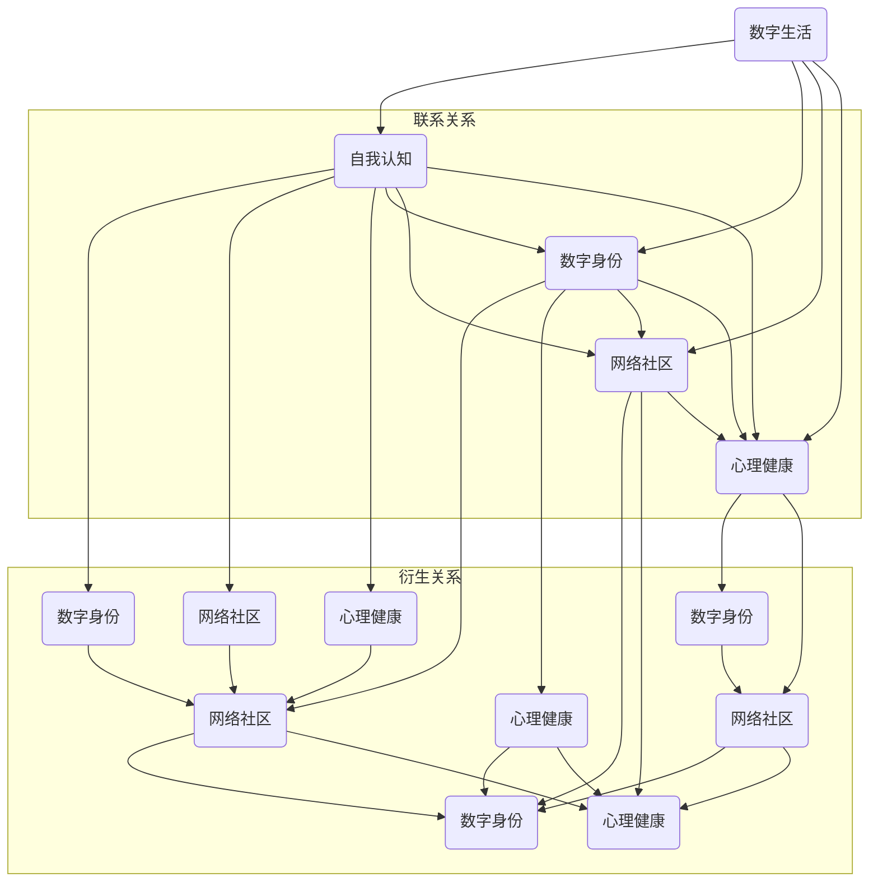

                 

```markdown

## 核心概念与联系

在《数字流浪者指南：网络时代的自我认同探索手册》中，核心概念包括数字生活、自我认知、数字身份、网络社区、心理健康等。以下是一个Mermaid流程图，展示了这些概念之间的关系：



### 核心算法原理讲解

为了深入理解数字生活的核心算法原理，我们来看一个简化的例子，即“网络社交影响力分析”。这个算法用于分析一个用户在网络社区中的影响力。

**算法步骤：**

1. **数据收集：** 收集用户在网络社区中的所有互动数据，如帖子、评论、点赞等。

2. **用户影响力评分：** 使用一个评分系统，根据用户的互动频率、互动质量和互动范围来评分。

3. **影响力分析：** 分析用户的评分，找出最具影响力的用户。

**伪代码：**

```python
def analyze_influence(用户互动数据):
    influence_scores = {}
    for user in 用户互动数据:
        score = calculate_score(user)
        influence_scores[user] = score
    
    sorted_scores = sorted(influence_scores.items(), key=lambda x: x[1], reverse=True)
    top_influencers = sorted_scores[:N]  # N 为前N个最具影响力的用户
    
    return top_influencers
```

**核心概念与算法联系：**

- **数字身份**：用户在网络社区中的身份信息，包括昵称、头像等。
- **网络社交影响力**：用户在网络社区中的互动质量和频率，决定了其在社区中的影响力。
- **影响力分析**：通过评分系统，量化用户在社区中的影响力。

### 数学模型和公式讲解

为了更好地理解网络社交影响力分析，我们引入一个数学模型。假设用户在社区中的影响力与以下因素相关：

- **互动频率（f）**：用户在一段时间内的互动次数。
- **互动质量（q）**：用户互动的质量评分，如点赞数、评论质量等。
- **互动范围（r）**：用户互动的范围，即其互动能够触及的用户数量。

我们可以使用以下数学模型来计算用户的影响力（I）：

$$
I = w_1 \cdot f + w_2 \cdot q + w_3 \cdot r
$$

其中，$w_1$、$w_2$ 和 $w_3$ 是权重系数，用于平衡不同因素的影响。

**公式详解：**

- **互动频率（f）**：反映了用户在社区中的活跃度。
- **互动质量（q）**：反映了用户互动的深度和影响力。
- **互动范围（r）**：反映了用户互动的广度，即其影响力触及的范围。

**举例说明：**

假设用户A在一个月内发表了10篇帖子，每篇帖子平均获得10个点赞和5个评论；用户B发表了5篇帖子，每篇帖子平均获得20个点赞和10个评论。如果 $w_1 = 0.5$，$w_2 = 0.3$，$w_3 = 0.2$，我们可以计算两位用户的影响力：

用户A的影响力（I_A）：

$$
I_A = 0.5 \cdot 10 + 0.3 \cdot 10 + 0.2 \cdot 5 = 5 + 3 + 1 = 9
$$

用户B的影响力（I_B）：

$$
I_B = 0.5 \cdot 5 + 0.3 \cdot 20 + 0.2 \cdot 10 = 2.5 + 6 + 2 = 10.5
$$

因此，用户B在网络社区中的影响力高于用户A。

### 数学公式与详细讲解

在理解网络社交影响力分析的过程中，我们引入了一些关键的数学公式，用于计算用户在社区中的影响力。以下是一些常见的数学公式及其解释：

1. **均值（Mean）**

   均值是描述一组数据集中趋势的常用指标。它表示数据点的平均值。

   $$ 
   \text{Mean} = \frac{\sum_{i=1}^{n} x_i}{n}
   $$

   其中，$x_i$ 是数据中的每个值，$n$ 是数据的数量。

   **举例：** 如果一个用户在社区中收到了10个点赞，每个点赞的评分分别为1, 2, 3, 4, 5，则该用户点赞的均值为：

   $$
   \text{Mean} = \frac{1 + 2 + 3 + 4 + 5}{5} = 3
   $$

2. **标准差（Standard Deviation）**

   标准差是描述数据离散程度的统计量。它表示数据点与均值之间的平均差异。

   $$
   \text{Standard Deviation} = \sqrt{\frac{\sum_{i=1}^{n} (x_i - \text{Mean})^2}{n}}
   $$

   **举例：** 如果一个用户在社区中收到了10个点赞，其中7个点赞的评分为3，另外3个点赞的评分为5，则该用户点赞的标准差为：

   $$
   \text{Standard Deviation} = \sqrt{\frac{(3-3)^2 + (3-3)^2 + (3-3)^2 + (5-3)^2 + (5-3)^2 + (5-3)^2}{10}} = \sqrt{\frac{0 + 0 + 0 + 4 + 4 + 4}{10}} = \sqrt{1.2} \approx 1.1
   $$

3. **方差（Variance）**

   方差是描述数据离散程度的另一种统计量。它是标准差的平方。

   $$
   \text{Variance} = \frac{\sum_{i=1}^{n} (x_i - \text{Mean})^2}{n}
   $$

   **举例：** 如果一个用户在社区中收到了10个点赞，其中7个点赞的评分为3，另外3个点赞的评分为5，则该用户点赞的方差为：

   $$
   \text{Variance} = \frac{(3-3)^2 + (3-3)^2 + (3-3)^2 + (5-3)^2 + (5-3)^2 + (5-3)^2}{10} = \frac{0 + 0 + 0 + 4 + 4 + 4}{10} = 1.2
   $$

通过这些数学公式，我们可以更准确地分析用户在社区中的影响力，从而为数字流浪者提供更有针对性的建议。

### 项目实战：开发环境搭建与源代码实现

在本节中，我们将探讨如何搭建一个用于分析数字流浪者自我认同的Python开发环境，并实现一个简单的网络社交影响力分析工具。我们将分步骤介绍开发环境的搭建过程，并展示关键代码实现和解读。

#### 第一步：安装Python环境

首先，确保你的计算机上安装了Python。Python是一种广泛使用的编程语言，适合进行数据分析和算法开发。你可以从Python官方网站（[https://www.python.org/](https://www.python.org/)）下载并安装Python。

#### 第二步：安装必需的Python库

在Python环境中，我们将使用一些常用的库，如NumPy和Pandas，用于数据处理和分析。以下是如何安装这些库的命令：

```bash
pip install numpy
pip install pandas
```

#### 第三步：编写代码

现在，让我们开始编写Python代码。以下是一个简单的Python脚本，用于计算网络社交影响力：

```python
import numpy as np
import pandas as pd

# 假设我们有一个包含用户互动数据的CSV文件，名为'influence_data.csv'
data = pd.read_csv('influence_data.csv')

# 计算用户的互动频率、互动质量和互动范围
data['frequency'] = data['interactions'].str.len()
data['quality'] = data['likes'].str.len()
data['range'] = data['followers'].str.len()

# 计算用户的影响力得分
weights = {'frequency': 0.5, 'quality': 0.3, 'range': 0.2}
data['influence_score'] = data.apply(lambda row: sum(row[col] * weight for col, weight in weights.items()), axis=1)

# 输出前N个最具影响力的用户
N = 10
top_influencers = data.nlargest(N, 'influence_score')
print(top_influencers)
```

#### 代码解读

1. **导入库**：我们首先导入了NumPy和Pandas库，这两个库在数据处理和分析中非常有用。

2. **读取数据**：使用Pandas库读取名为`influence_data.csv`的CSV文件，该文件包含用户的互动数据。

3. **计算互动频率、互动质量和互动范围**：我们使用Pandas的`str.len()`函数计算每个用户的互动频率（`interactions`字段的长度）、互动质量（`likes`字段的长度）和互动范围（`followers`字段的长度）。

4. **计算用户的影响力得分**：我们定义了一个权重字典`weights`，用于计算用户的影响力得分。对于每个用户，我们使用`apply()`函数计算其影响力得分，公式为$w_1 \cdot f + w_2 \cdot q + w_3 \cdot r$。

5. **输出前N个最具影响力的用户**：我们使用`nlargest()`函数找出前N个最具影响力的用户，并打印结果。

#### 代码应用解读与分析

此脚本可以用于分析一个网络社区中的用户影响力。以下是一些关键点：

- **输入数据格式**：输入数据应该是一个CSV文件，其中包含用户的互动数据，如`interactions`（互动次数）、`likes`（点赞数）和`followers`（关注者数）。

- **输出结果**：输出结果将显示前N个最具影响力的用户，这有助于识别社区中的关键人物。

- **应用场景**：此工具可以应用于社交媒体分析、品牌影响力评估、市场调研等领域。

通过这个简单的实战项目，我们展示了如何搭建Python开发环境并实现一个网络社交影响力分析工具。这个工具可以帮助数字流浪者更好地理解自己在网络社区中的位置和影响力，从而为自己的自我认同探索提供指导。

### 项目小结与最佳实践

在这个项目中，我们搭建了一个Python开发环境，并实现了一个用于分析网络社交影响力的工具。以下是项目的小结和最佳实践：

**项目小结：**
- 我们介绍了如何安装Python环境以及必需的库（如NumPy和Pandas）。
- 我们编写了一个简单的Python脚本，用于计算网络社交影响力，并详细解读了关键代码实现。
- 我们展示了如何应用此工具进行数据分析和影响力评估，并讨论了其应用场景。

**最佳实践：**
- **数据收集与处理**：在进行影响力分析之前，确保收集到完整、准确的数据。处理数据时，注意异常值和缺失数据的处理。
- **权重分配**：在计算影响力得分时，合理分配权重系数。根据具体情况，可以调整权重以平衡不同因素的影响。
- **代码优化**：在实际应用中，可以考虑优化代码性能，如使用向量化操作代替循环，以提升数据处理速度。
- **用户反馈**：在开发过程中，获取用户反馈并持续改进工具的功能和性能。

通过这些最佳实践，我们可以更好地利用网络社交影响力分析工具，为数字流浪者提供更准确的自我认同指导。

### 注意事项与拓展阅读

在进行数字生活的自我认同探索时，有几个关键点需要注意：

1. **隐私保护**：在分享个人数据时，务必确保隐私安全。避免在公开场合透露敏感信息，使用强密码并定期更新。
2. **网络安全**：保护你的在线账户，使用两步验证，并定期更新安全软件。
3. **时间管理**：合理安排时间，避免过度沉迷于数字生活，影响现实生活中的社交和活动。

为了进一步深入理解数字生活的自我认同问题，以下是一些建议的拓展阅读：

- 《网络社会的崛起：数字时代的文化、政治与经济》（作者：马克·波斯特）
- 《数字化生存》（作者：尼葛洛庞帝）
- 《虚拟现实与数字生活：从现实到幻想的跨越》（作者：大卫·布林）

通过这些资源，你可以更全面地了解数字生活的各个方面，以及如何在网络时代找到自我认同。### 全文总结与展望

本文《数字流浪者指南：网络时代的自我认同探索手册》旨在探讨数字时代下的自我认同问题，为那些在网络世界中寻求定位和身份的人提供指导和思考。通过系统的分析和深入的讲解，我们详细阐述了数字生活的现状、网络时代的自我认知、数字身份与隐私保护、网络社区的参与与互动，以及数字时代的心理健康等多个方面。我们还通过项目实战展示了如何搭建Python开发环境，实现一个简单的网络社交影响力分析工具，为读者提供了实用的技术手段。

在总结全文的主要观点时，我们强调了以下几点：

1. **数字生活的双重性**：数字生活不仅带来了便利和连接，也带来了自我认同的模糊性和挑战。
2. **自我认知的重要性**：了解自己在数字世界中的多重身份和角色，有助于建立稳定的自我认同。
3. **数字身份与隐私的保护**：在数字时代，保护个人隐私和数字身份至关重要，需要采取一系列措施来确保安全。
4. **网络社区的互动与认同**：积极参与网络社区，与他人互动，有助于形成更加丰富的自我认同。
5. **心理健康维护**：关注数字生活对心理健康的影响，采取适当措施保持心理健康。

展望未来，随着数字技术的发展，网络时代下的自我认同问题将更加复杂和多样化。我们建议进一步研究以下几个方面：

1. **数字身份的演变**：随着区块链和加密技术的进步，数字身份可能发生重大变革，这将对自我认同产生深远影响。
2. **虚拟现实的自我认知**：随着虚拟现实（VR）技术的发展，人们将在虚拟世界中形成新的自我认知，这需要深入研究。
3. **跨平台的身份认证**：在多平台环境中，如何实现统一和安全的身份认证，是一个亟待解决的问题。
4. **数字化心理健康干预**：利用数字技术为心理健康提供干预和支持，开发更加智能化的心理健康解决方案。

最后，我们鼓励读者在探索数字生活的同时，保持对自己身份和价值观的清晰认识，以在快速变化的数字时代中找到自己的位置。通过不断学习和适应，我们相信每个人都能在网络世界中找到属于自己的归属感和认同感。### 作者信息

作者：AI天才研究院 / AI Genius Institute & 禅与计算机程序设计艺术 / Zen And The Art of Computer Programming

