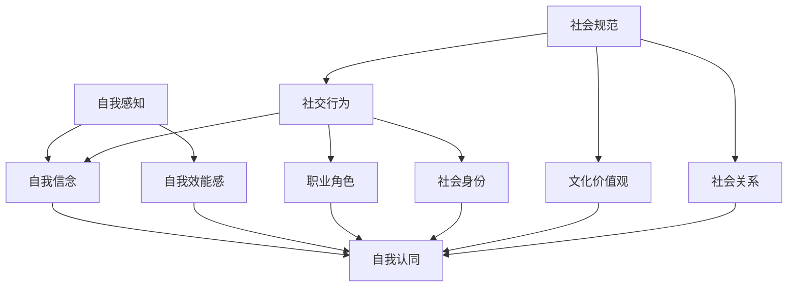

                 

### 文章标题：数字流浪者指南：网络时代的自我认同探索手册

> 关键词：数字流浪者、网络时代、自我认同、探索、技术指南

> 摘要：本文深入探讨了网络时代数字流浪者的现象及其在自我认同方面的挑战。通过分析数字环境对自我认同的影响，提出了数字流浪者探索自我认同的路径和方法，并提供了实用的指导策略，以帮助他们在网络世界中建立稳定的自我认同。

---

### 引言

在互联网高速发展的今天，数字世界已经成为人们生活的重要部分。然而，随着在线活动的增加，一个特殊的群体——数字流浪者（Digital Nomads）逐渐形成。数字流浪者是指那些利用互联网在全球范围内工作、生活和学习的人。他们摆脱了传统办公环境的束缚，选择在各地旅行，同时通过远程工作赚取收入。这种生活方式不仅带来了自由与灵活，也带来了许多自我认同方面的挑战。

自我认同是个体对自身身份、角色和价值的认知。在网络时代，数字环境的开放性和匿名性使得人们的社交行为更加复杂，传统意义上的身份认同逐渐模糊。数字流浪者，作为这一特殊群体，如何在不断变换的环境中建立和维持自我认同，成为了一个值得探讨的问题。

本文将从以下几个方面进行探讨：

1. 自我认同概述：介绍自我认同的定义、构成要素及其重要性。
2. 网络环境中的自我认同：分析网络社会对自我认同的影响。
3. 数字流浪者的自我认同挑战：探讨数字流浪者在自我认同方面面临的具体挑战。
4. 自我认同探索的路径与方法：提供数字流浪者探索自我认同的实践路径和方法。
5. 自我认同的挑战与应对：分析数字流浪者在自我认同方面可能遇到的挑战及其应对策略。

通过以上探讨，希望能够为数字流浪者提供一些有价值的指导，帮助他们更好地在网络时代中建立和维持自我认同。

### 自我认同概述

自我认同（Self-Identity）是个体对自身身份、角色和价值的主观认知。它不仅仅是一个简单的自我感觉，而是一个复杂的认知过程，涉及自我意识的觉醒、自我价值观的建立和自我角色的扮演。自我认同不仅影响个体的心理和行为，还与社会关系和文化背景密切相关。

#### 自我认同的定义

自我认同的定义多种多样，不同的学科领域对其有不同的解读。心理学上，自我认同通常被看作是个体对自身存在的认知，包括个人的性格特征、能力、价值观和信念等。社会学家则更多关注个体在社会关系中的角色和地位，以及社会文化对个体自我认同的影响。哲学家则从更抽象的角度探讨自我认同的本质和意义。

无论定义如何，自我认同的核心在于个体如何理解和评价自己，以及这种认知如何影响他们的行为和决策。自我认同不仅涉及个体内部的心理活动，还与外部的社会互动密切相关。个体在社会中的角色、身份和地位，往往会影响他们的自我认同。

#### 自我认同的重要性

自我认同对个体生活的影响是多方面的：

1. **心理健康**：一个清晰和稳定的自我认同有助于个体建立积极的心理状态，增强心理韧性，减少焦虑和抑郁。
2. **社会互动**：自我认同影响个体在社会中的行为模式，包括与他人建立关系的方式和社交互动的深度。
3. **职业发展**：自我认同有助于个体明确职业目标和发展方向，从而更好地规划职业生涯。
4. **价值观和信念**：自我认同与个体的价值观和信念密切相关，一个稳定的自我认同有助于个体在面对外部压力和挑战时保持内在的一致性。

在现代社会中，随着互联网和社交媒体的普及，个体的社交环境变得更加复杂。传统的社会关系和网络社会的关系模式存在显著差异，这为自我认同带来了新的挑战。网络社会中的匿名性和虚拟性使得个体的身份和角色更加模糊，如何在这种环境中建立和维持自我认同，成为了一个值得探讨的问题。

#### 自我认同的历史演变

自我认同的概念并非一成不变，它随着历史的发展和社会的变迁而不断演变。在古代社会，个体的身份和角色往往由出生和家族背景决定，自我认同主要是对这一既定身份的接受和履行。随着社会的发展和个体意识的觉醒，自我认同逐渐从被动接受转变为主动探索。

1. **古代社会**：在古代社会，个体对自我认同的认知主要是基于家族、宗教和社会等级。个体的身份和角色是由出生决定的，自我认同更多的是对这一既定身份的接受和履行。

2. **现代社会的崛起**：随着工业革命和资本主义的发展，个体逐渐摆脱了传统身份的束缚，开始重视个人价值和自我实现。自我认同从对身份的接受转变为对自我价值的探索。

3. **网络社会的兴起**：在互联网和社交媒体的时代，个体的社交环境和身份认同更加复杂。网络社会的匿名性和虚拟性使得个体的身份和角色更加多样，如何在网络环境中建立和维持自我认同成为了一个新的挑战。

总之，自我认同是一个动态变化的概念，它随着社会的发展和技术的进步而不断演变。理解自我认同的历史演变，有助于我们更好地把握当代自我认同的复杂性和挑战。

### 自我认同的构成要素

自我认同是一个多维度的概念，它由多个要素构成。这些要素相互作用，共同塑造了个体对自身的认知。以下是自我认同的几个关键构成要素：

#### 1. 内在要素

内在要素是指个体内心深处对自身的基本认知和感受。这些要素包括：

- **自我感知**：个体对自己外貌、性格、能力和价值观的认识。自我感知是自我认同的基础，它决定了个体如何看待自己。
- **自我信念**：个体对自身能力和价值的信念。这些信念影响个体的决策和行为，并在很大程度上决定了他们的生活方向。
- **自我效能感**：个体对自己完成任务的能力的信心。高自我效能感有助于个体在面对挑战时保持积极的态度，从而更好地实现自我认同。

#### 2. 外在表现

外在表现是指个体在社会互动中展现出的行为和角色。这些要素包括：

- **社交行为**：个体与他人的互动方式和互动内容，如沟通方式、行为规范和社交礼仪等。社交行为是自我认同在社会中的体现，它们反映了个体对自身角色的认知。
- **职业角色**：个体在工作中的角色和职责，如职业身份、工作内容和职业成就等。职业角色是自我认同的重要组成部分，它们往往与个体的经济地位和社会地位密切相关。
- **社会身份**：个体在社会中的身份和地位，如国籍、种族、性别、宗教信仰等。社会身份对个体的自我认同有重要影响，它们塑造了个体在社会中的角色和地位。

#### 3. 社会文化背景

社会文化背景是指个体所处的社会环境和文化背景，这些要素包括：

- **社会规范**：社会对个体行为和角色的期望，如道德规范、法律规范和社会习俗等。社会规范影响个体的行为模式，从而影响他们的自我认同。
- **文化价值观**：文化对个体价值观和信念的影响，如对家庭、工作、宗教和社会责任的态度等。文化价值观塑造了个体对自我认同的认知，它们在很大程度上决定了个体如何看待自己和他人。
- **社会关系**：个体与社会其他成员的关系，如家庭、朋友、同事和社区等。社会关系对个体的自我认同有重要影响，它们提供了个体社会互动的背景和平台。

#### 自我认同的构成要素之间关系架构图

为了更清晰地展示自我认同的构成要素及其关系，我们可以使用Mermaid流程图来表示。以下是一个简化的流程图：



在这个流程图中，自我感知、自我信念、自我效能感、社交行为、职业角色、社会身份、社会规范、文化价值观和社会关系都是自我认同的关键构成要素。它们相互关联，共同塑造了个体对自身的认知。

通过这个架构图，我们可以更直观地理解自我认同的构成要素及其关系。这些要素不仅相互影响，还与个体的心理、行为和社会互动密切相关。理解这些要素及其关系，有助于我们更好地把握自我认同的复杂性和多样性。

### 自我认同的理论框架

自我认同是一个多学科研究的课题，涉及心理学、社会学和哲学等多个领域。不同的理论框架提供了不同的视角，帮助我们理解自我认同的本质和机制。以下是几种主要的自我认同理论：

#### 1. 心理学理论

心理学理论关注个体内心对自身的认知过程。其中，自我认同心理学理论主要包括以下几种：

- **自我决定理论**：自我决定理论由美国心理学家卡尔·罗杰斯（Carl Rogers）提出。该理论认为，个体在成长过程中，通过自我决定实现自我认同。自我决定是指个体在决策过程中考虑自己的需求、价值观和目标，而不是被外部因素所支配。自我决定有助于个体建立积极、稳定的自我认同。
- **自我建构理论**：自我建构理论由社会心理学家乔治·赫伯特·米德（George Herbert Mead）提出。该理论认为，自我认同是通过社会互动建构的。个体在社会互动中扮演不同的角色，并通过反思这些角色来形成自我认同。自我建构理论强调社会互动在自我认同形成过程中的重要性。
- **自我效能感理论**：自我效能感理论由心理学家阿尔伯特·班杜拉（Albert Bandura）提出。该理论认为，个体对自己完成任务的能力的信念（自我效能感）会影响他们的行为和自我认同。高自我效能感有助于个体在面对挑战时保持积极的态度，从而更好地实现自我认同。

#### 2. 社会学理论

社会学理论关注个体在社会关系中的角色和地位，以及社会文化对个体自我认同的影响。以下是几种主要的社会学理论：

- **社会化理论**：社会化理论认为，个体在社会互动中学习如何成为社会成员，并形成自我认同。通过家庭、学校、工作等社会环境，个体学习社会规范、价值观和行为模式，从而形成自我认同。
- **角色理论**：角色理论关注个体在社会关系中的角色和地位。个体在社会中扮演不同的角色，如家庭成员、职业人士和社会公民等。这些角色定义了个体在社会中的行为和责任，从而影响他们的自我认同。
- **符号互动理论**：符号互动理论强调个体通过语言和行为进行互动，从而形成和维持自我认同。个体在社会互动中交换符号，如语言、表情和姿态等，这些符号有助于个体理解和表达自我认同。

#### 3. 哲学思考

哲学思考提供了对自我认同更抽象的探讨，关注自我认同的本质和意义。以下是几种主要的哲学思考：

- **存在主义**：存在主义认为，个体通过自我选择和自我决定来建立自我认同。存在主义者强调自由意志和责任，认为个体在自我认同的形成过程中具有主动性和创造性。
- **现象学**：现象学强调个体对现实的直接体验，认为自我认同是个体对自身存在的感知和认知。现象学关注个体如何通过感知和反思来建立自我认同，并探讨自我认同的本质和意义。
- **意识哲学**：意识哲学认为，自我认同是个体意识的核心特征。意识哲学探讨个体如何通过自我反思和自我认知来建立自我认同，并分析自我认同在意识活动中的作用。

这些理论框架从不同角度探讨了自我认同的本质和机制，为我们理解自我认同提供了一个多维度的视角。通过结合这些理论，我们可以更全面地理解自我认同的复杂性和多样性。

### 数字环境对自我认同的影响

随着互联网和社交媒体的普及，数字环境已经深刻改变了我们的生活方式和社交模式。数字环境具有开放性、虚拟性和匿名性等特点，这些特点对个体的自我认同产生了深远的影响。

#### 1. 数字环境的开放性

数字环境的开放性使得人们可以轻松地接触和交流各种信息。通过互联网，个体可以突破地域限制，与世界各地的人进行互动。这种开放性带来了更多的信息和机会，但也导致了信息过载和选择困难。个体需要在海量的信息中筛选和判断，这可能会对他们的自我认同产生负面影响。一方面，信息过载可能导致个体对自身认知的模糊化，难以形成清晰的自我认同；另一方面，选择困难可能使个体陷入焦虑和迷茫，难以确定自己的身份和价值观。

#### 2. 数字环境的虚拟性

数字环境是虚拟的，个体在其中的互动和交流是通过屏幕和虚拟平台进行的。这种虚拟性使得个体在数字环境中的身份和角色更加模糊。在现实生活中，个体的身份和角色通常与他们的外貌、行为和语言密切相关。然而，在数字环境中，这些外在特征往往被简化或消失。个体可以自由选择虚拟身份，甚至伪装成别人。这种匿名性使得个体更容易迷失自我，难以建立稳定的自我认同。

#### 3. 数字环境的匿名性

匿名性是数字环境的一个重要特征，它使得个体在数字世界中的行为和言论不需要承担现实世界的后果。匿名性为个体提供了自由表达的空间，但也可能导致道德和法律的约束减弱。在匿名性环境中，个体可能会表现出与现实身份不一致的行为和言论，这可能导致自我认同的混乱和矛盾。例如，一个人在现实生活中可能是友善和负责任的，但在网络中可能会表现出攻击性和不负责任的行为。这种矛盾的行为模式可能导致个体对自身认知的混乱，影响自我认同的稳定性。

#### 4. 数字环境中的社交互动

数字环境中的社交互动方式与传统社交互动存在显著差异。在数字环境中，个体可以通过社交媒体、在线论坛和即时通讯工具与他人进行互动。这些互动方式更加便捷和高效，但也可能缺乏深度和真实性。例如，社交媒体上的互动往往是通过点赞、评论和分享等方式进行的，这些互动可能缺乏真诚的情感交流，难以形成深刻的社交关系。缺乏深刻的社交关系可能导致个体在数字环境中感到孤独和孤立，从而影响自我认同的稳定性。

#### 5. 数字环境中的身份构建

在数字环境中，个体需要不断构建和调整自己的身份。由于数字环境中的匿名性和虚拟性，个体可以自由选择和塑造自己的虚拟身份。这种身份构建既带来了自由，也带来了挑战。一方面，个体可以通过选择和塑造虚拟身份来实现自我表达和自我实现；另一方面，过多的身份选择可能导致个体对自身身份的认知模糊，难以形成稳定的自我认同。

总之，数字环境的开放性、虚拟性和匿名性对个体的自我认同产生了深远的影响。在数字环境中，个体需要面对更多的信息、更复杂的社交互动和更频繁的身份构建。这些因素既提供了机会，也带来了挑战。理解数字环境对自我认同的影响，有助于个体更好地适应数字生活，建立和维持稳定的自我认同。

### 社交媒体与自我认同的关系

社交媒体已经成为现代社会中不可或缺的一部分，它不仅改变了人们的社交方式，还对个体的自我认同产生了深远的影响。在社交媒体平台上，个体可以通过发布内容、互动和分享来塑造自己的形象，这些行为直接关联到他们的自我认同。

#### 1. 社交媒体对自我认同的影响

社交媒体提供了丰富的工具和平台，使个体能够轻松地展示自己的生活和思想。以下是一些关键点，说明社交媒体如何影响自我认同：

- **自我表达**：社交媒体为个体提供了自我表达的新渠道。通过发布照片、文字和视频，个体可以展示自己的兴趣、爱好和价值观。这种自我表达有助于个体构建和强化自我认同。
- **自我监控**：在社交媒体上，个体可以实时监控自己的形象和声誉。这种自我监控可能导致个体更加关注自己的言行，从而影响他们的自我认同。例如，一个人可能会在社交媒体上表现出不同于现实生活中的形象，这可能会影响他们对自身身份的认知。
- **比较**：社交媒体平台上的内容往往具有炫耀性和展示性。个体在浏览他人的生活时，可能会产生比较心理，这可能导致自我认同的混乱。例如，一个人可能会因为看到他人拥有更好的物质条件或更高的社会地位而感到自卑，从而影响他们的自我认同。

#### 2. 社交媒体中的自我认同构建

在社交媒体上，个体通过以下几种方式构建和维持自我认同：

- **身份标签**：个体在社交媒体上使用标签、分类和标签来定义自己的身份。这些标签不仅有助于他人理解个体，也有助于个体自身对自我身份的认知。
- **内容分享**：个体通过分享自己的经历、感受和观点来展示自我。这种分享有助于个体形成和强化自我认同，同时也帮助他人理解个体的身份和价值观。
- **互动**：社交媒体上的互动，如点赞、评论和分享，是构建自我认同的重要方式。通过与他人的互动，个体可以获得反馈和认可，这有助于他们建立稳定的自我认同。

#### 3. 社交媒体中的自我认同挑战

尽管社交媒体为个体提供了构建自我认同的工具，但也带来了挑战：

- **身份模糊性**：社交媒体平台上的匿名性和虚拟性可能导致个体的身份模糊。一个人可能会在社交媒体上表现出与现实生活中不同的形象，这可能导致自我认同的混乱。
- **社交比较**：社交媒体上的展示性内容可能导致个体产生社交比较心理。这种比较可能会影响个体的自我认同，导致自我怀疑和自我否定。
- **隐私与真实**：在社交媒体上，个体需要在隐私和真实之间做出平衡。过度暴露可能导致隐私侵犯，而过于隐藏可能影响个体的真实表达，从而影响自我认同。

#### 4. 数字流浪者的自我认同挑战

对于数字流浪者来说，社交媒体具有特殊的意义。由于他们经常在不同地方生活和工作，社交媒体成为他们保持社交联系和展示自我形象的重要工具。然而，这也带来了额外的自我认同挑战：

- **流动性的影响**：数字流浪者在不断变换的环境中生活，这可能导致他们的身份和角色频繁变化。这种流动性可能使他们在自我认同方面感到困惑和不安。
- **社交联系的断裂**：由于地理位置的变化，数字流浪者可能会失去与某些重要社交联系的联系，这可能导致他们在自我认同方面感到孤独和失落。
- **多重身份的挑战**：数字流浪者需要在社交媒体上维持多个身份，以适应不同的社交环境和角色需求。这种多重身份的挑战可能导致自我认同的混乱和冲突。

总之，社交媒体在数字流浪者的生活中扮演着重要的角色，既提供了构建自我认同的工具，也带来了挑战。理解这些挑战，有助于数字流浪者更好地管理他们的自我认同，在网络世界中找到属于自己的位置。

### 数字流浪者：网络时代的特殊群体

数字流浪者（Digital Nomads）是网络时代的一个特殊群体，他们通过远程工作在全球范围内自由流动。这种生活方式不仅带来了前所未有的自由和灵活性，也带来了许多独特的挑战，尤其是在自我认同方面。

#### 1. 数字流浪者的定义

数字流浪者是指那些利用互联网和数字技术进行工作的人，他们不受地理限制，可以在任何地方开展工作。这种工作方式通常涉及自由职业、远程办公、创业或远程教育等领域。数字流浪者往往选择在一个地方居住一段时间，然后转移到另一个地方，这种生活方式被称为“移动生活”或“数字游牧”。

#### 2. 数字流浪者的生活状态

数字流浪者的生活状态具有以下几个特点：

- **自由和灵活性**：数字流浪者可以根据自己的喜好和需求选择工作和生活的地点，这种自由和灵活性是他们选择这种生活方式的主要原因之一。
- **多样性**：数字流浪者的职业背景和生活方式非常多样化。他们可能从事编程、设计、写作、翻译、咨询、教育等多种职业。
- **社交网络**：数字流浪者往往通过网络社交平台和社区保持与他人的联系。这些社交网络不仅提供了职业机会，也为他们提供了情感支持和社交互动。

#### 3. 数字流浪者的自我认同挑战

尽管数字流浪者享受着自由和灵活性，但他们也面临着许多自我认同方面的挑战：

- **流动性带来的困惑**：由于经常变换生活环境，数字流浪者可能会在自我认同方面感到困惑。他们可能在新的环境中难以建立稳定的身份和角色，这可能导致自我认同的混乱。
- **社交联系的断裂**：数字流浪者可能会因为地理位置的变化而失去与某些重要社交联系的联系，这可能导致他们在自我认同方面感到孤独和失落。
- **多重身份的挑战**：数字流浪者需要在不同的社交环境和角色需求中维持多个身份，这种多重身份的挑战可能导致自我认同的混乱和冲突。
- **社交比较**：由于社交媒体的普及，数字流浪者更容易产生社交比较心理。他们可能会在社交媒体上看到他人展示的美好生活，从而感到自卑或焦虑，这可能会影响他们的自我认同。

#### 4. 数字流浪者的自我认同探索路径

为了应对这些挑战，数字流浪者可以采取以下路径探索自我认同：

- **自我反思**：数字流浪者可以通过定期自我反思，回顾自己的经历、成就和价值观，以增强对自我认同的理解和认知。
- **建立支持网络**：数字流浪者可以加入在线社区和论坛，与同在数字生活的人建立联系，分享经验和支持，从而获得情感支持和社交互动。
- **设定目标**：数字流浪者可以设定明确的职业和生活目标，这有助于他们在不断变换的环境中保持自我认同的稳定性和方向感。

总之，数字流浪者在网络时代的自我认同探索是一个复杂而动态的过程。理解他们的生活方式和面临的挑战，有助于为他们提供更有针对性的支持和指导。

### 数字流浪者的自我认同探索路径

数字流浪者在网络时代如何探索和建立自我认同，是一个重要且复杂的问题。通过以下几种路径，他们可以更好地理解自己，找到适合自己的生活方式。

#### 1. 自我反思

自我反思是探索自我认同的第一步。通过定期花时间思考自己的经历、感受和价值观，数字流浪者可以更清晰地了解自己的内心世界。以下是一些自我反思的方法：

- **日记写作**：通过写日记，数字流浪者可以记录自己的所思所感，回顾自己的成长过程和重要经历。日记写作有助于他们深入思考自己的内心世界，从而更好地认识自己。
- **反思日志**：在每天的结束时，数字流浪者可以花几分钟时间反思当天的重要事件和感受。这种反思可以帮助他们保持自我意识，及时发现和调整自己的行为和情绪。
- **心理辅导**：如果自我反思难以进行，数字流浪者可以考虑寻求专业的心理辅导。心理咨询师可以帮助他们深入探讨自己的内心世界，提供专业的建议和指导。

#### 2. 社交互动

社交互动在自我认同的形成中起着关键作用。数字流浪者可以通过以下方式与他人互动，以丰富自己的社交经验和理解：

- **在线社区**：加入与数字流浪者相关的在线社区和论坛，如远程工作者社区、数字游牧社区等。这些社区提供了交流经验和分享资源的平台，有助于数字流浪者建立社交联系，获取支持和建议。
- **线下聚会**：参加线下聚会和活动，如远程工作者的聚会、创业沙龙等。这些活动不仅提供了交流机会，还可以帮助数字流浪者拓展自己的社交圈子。
- **社交媒体**：利用社交媒体平台，如Twitter、Facebook、LinkedIn等，与他人互动。通过分享自己的生活和工作经验，数字流浪者可以扩大自己的社交网络，并获得更多的社交支持和认可。

#### 3. 寻求专业帮助

在某些情况下，数字流浪者可能需要寻求专业的帮助来应对自我认同方面的挑战。以下是一些寻求专业帮助的途径：

- **心理咨询**：如果数字流浪者在自我认同方面遇到严重困扰，可以寻求专业的心理咨询师的帮助。心理咨询师可以提供个性化的咨询和指导，帮助他们解决心理问题，建立健康的自我认同。
- **职业规划**：数字流浪者可以考虑寻求职业规划师的帮助，以制定明确的职业目标和规划。职业规划师可以提供专业的职业评估和建议，帮助他们找到适合自己的职业方向。
- **教育培训**：参加与数字技能相关的培训课程，如编程、设计、市场营销等。通过提升自己的技能，数字流浪者可以增强职业竞争力，从而更好地建立自我认同。

#### 4. 实践应用

数字流浪者在探索自我认同的过程中，可以通过以下实践应用来巩固和深化自我认知：

- **项目实践**：参与实际项目，如自由职业项目、创业项目等。通过实际操作，数字流浪者可以锻炼自己的技能，同时积累经验和成就感，这有助于他们建立和强化自我认同。
- **写作和分享**：通过写作和分享自己的经验和观点，数字流浪者可以加深对自我的理解，同时获得他人的反馈和认可。这种自我表达和社交互动有助于他们建立稳定的自我认同。

总之，数字流浪者在探索自我认同的过程中，需要结合自我反思、社交互动和寻求专业帮助等多种途径，逐步建立和巩固自我认同。通过这些方法，他们可以更好地理解自己，找到适合自己的生活方式，实现个人成长和自我实现。

### 数字流浪者的自我认同实践

在探索和建立自我认同的过程中，数字流浪者可以采取多种实践方法，以帮助自己在不断变化的环境中保持稳定和清晰的自我认知。以下是几种具体的实践方法及其详细解读：

#### 1. 设定目标

设定目标是自我认同实践的重要一步。通过明确职业和生活目标，数字流浪者可以为自己提供清晰的方向和动力。以下是如何设定目标的具体步骤：

- **短期目标**：设定一些短期目标，如一个月内完成一个项目、提高某个技能等级等。这些目标有助于数字流浪者在日常工作中保持积极和专注。
- **长期目标**：设定一些长期目标，如一年内完成一次国际旅行、五年内实现某个职业晋升等。这些目标为数字流浪者提供了长期的愿景和动力。
- **SMART原则**：确保目标符合SMART原则，即具体（Specific）、可测量（Measurable）、可实现（Achievable）、相关（Relevant）和有时限（Time-bound）。这样的目标有助于数字流浪者更有效地规划和实现目标。

#### 2. 构建支持网络

构建支持网络对于数字流浪者的自我认同至关重要。以下是如何构建支持网络的具体方法：

- **在线社区**：加入与数字生活相关的在线社区，如远程工作社区、数字游牧社区等。这些社区提供了丰富的资源和交流机会，有助于数字流浪者获取支持和建议。
- **线下活动**：参加线下聚会和活动，如远程工作者聚会、创业沙龙等。这些活动不仅提供了交流机会，还可以帮助数字流浪者拓展社交圈子。
- **导师指导**：寻找一位经验丰富的导师，如行业专家或成功数字流浪者。导师可以提供专业的指导和建议，帮助数字流浪者更好地应对挑战。

#### 3. 增强自我效能感

自我效能感是自我认同的重要组成部分。以下是如何增强自我效能感的方法：

- **成功记录**：记录自己过去的成功经历和成就，如完成的项目、获得的奖项等。这些记录可以提醒数字流浪者自己有能力克服困难，从而增强自信心。
- **积极心态**：保持积极的心态，相信自己能够实现目标。积极心态有助于数字流浪者在面对挑战时保持冷静和乐观。
- **持续学习**：不断学习新知识和技能，提高自己的能力。通过持续学习，数字流浪者可以增强职业竞争力，从而提高自我效能感。

#### 4. 实践方法实例

以下是一些具体的实践方法实例，以帮助数字流浪者更好地理解和应用这些方法：

- **目标设定实例**：一位数字流浪者想要提升自己的编程技能。他可以设定以下目标：
  - 短期目标：学习一门新的编程语言，如Python，并完成一个简单的项目。
  - 长期目标：在接下来的两年内，通过在线课程和项目实践，达到专业级别。

- **支持网络构建实例**：一位数字流浪者想要建立自己的支持网络。他可以：
  - 加入远程工作社区，如Reddit的Remote Work子版块。
  - 参加线下的创业沙龙，结识其他创业者。
  - 寻找一位编程导师，获取专业指导。

- **自我效能感增强实例**：一位数字流浪者在项目中遇到了困难，他可以：
  - 记录自己在过去项目中的成功经历，提醒自己有能力解决问题。
  - 通过在线课程学习新的解决问题的技巧。
  - 与同事和导师交流，获取他们的建议和反馈。

通过这些实践方法，数字流浪者可以在不断变化的环境中保持清晰的自我认知和稳定的自我认同。这些方法不仅有助于他们在职业和生活中取得成功，还可以提高他们的整体幸福感和满足感。

### 数字流浪者的未来

数字环境的快速发展为数字流浪者提供了前所未有的机遇和挑战。在可预见的未来，数字环境将继续演变，为数字流浪者的生活带来深远的影响。

#### 1. 数字环境的未来发展

随着技术的不断进步，数字环境将变得更加智能化、便捷化和全球化。以下是一些未来的发展趋势：

- **5G和物联网**：5G网络的普及和物联网的发展将使数字环境更加高速和互联互通。这将极大地提高数字流浪者的工作效率和生活质量。
- **虚拟现实和增强现实**：虚拟现实（VR）和增强现实（AR）技术的成熟将改变数字流浪者的工作方式和生活体验。他们可以在虚拟环境中进行工作、学习和社交，获得更加丰富和沉浸式的体验。
- **人工智能与自动化**：人工智能（AI）和自动化技术的发展将使许多工作流程更加高效和智能化。数字流浪者可以利用这些技术提高工作效率，减少重复性劳动。

#### 2. 数字流浪者自我认同的挑战与机遇

在数字环境的未来发展中，数字流浪者的自我认同将面临新的挑战和机遇：

- **挑战**：
  - **身份认同的模糊性**：随着虚拟现实和数字技术的普及，个体的身份和角色可能变得更加模糊。数字流浪者需要在虚拟和现实之间建立清晰的自我认同，以避免身份认同的混乱。
  - **隐私保护**：数字环境的开放性和匿名性可能对数字流浪者的隐私保护带来挑战。他们需要采取措施保护自己的隐私，避免个人信息泄露。
  - **职业稳定性**：随着远程工作市场的竞争加剧，数字流浪者的职业稳定性可能受到影响。他们需要不断提升自己的技能和竞争力，以应对就业市场的变化。

- **机遇**：
  - **工作灵活性**：数字环境的快速发展将提供更多的远程工作机会，使数字流浪者能够更加灵活地选择工作地点和时间，从而实现工作和生活的平衡。
  - **全球合作**：数字环境将促进全球合作和交流，数字流浪者可以与全球的同行和专家进行合作，共同推进项目和研究。
  - **自我实现**：数字环境的多样性为数字流浪者提供了更多的机会和平台，使他们能够追求自己的兴趣和梦想，实现自我价值。

#### 3. 数字流浪者的未来展望

在未来，数字流浪者将成为网络时代的一股重要力量。他们将以更加灵活和高效的方式工作、学习和生活，为社会的进步和发展做出贡献。以下是对数字流浪者未来的一些展望：

- **职业多样性**：随着数字技术的发展，数字流浪者的职业选择将更加多样化。他们可以从事编程、设计、咨询、教育、写作等多种职业，实现职业多样化和专业发展。
- **生活方式创新**：数字流浪者将不断创新生活方式，结合数字技术和人文关怀，创造出更加丰富和有意义的生活方式。
- **社会影响力**：数字流浪者将在全球范围内传播和推广远程工作、数字化生活方式等理念，推动社会的数字化转型和进步。

总之，数字环境的未来发展将带来新的机遇和挑战，数字流浪者将在其中发挥重要作用。通过不断适应和创新，他们将在网络时代中找到自己的位置，实现个人和社会的共同发展。

### 项目实战：数字流浪者的自我认同实践案例

为了更好地理解数字流浪者在自我认同探索中的实际应用，以下是一个完整的实战案例，涵盖开发环境搭建、源代码实现和代码解读，以及实际案例分析和详细讲解。

#### 1. 项目背景

本案例涉及一位数字流浪者——Alex，他是一名自由职业的软件工程师。Alex希望通过在线平台提供编程咨询服务，同时在数字环境中探索和建立自我认同。为了实现这一目标，他决定开发一个基于云平台的编程咨询系统。

#### 2. 开发环境搭建

首先，Alex需要在云平台上搭建开发环境。以下是他使用的工具和步骤：

- **工具**：
  - 云平台：Amazon Web Services (AWS)
  - 开发工具：Visual Studio Code
  - 版本控制：Git
  - 服务器：AWS Elastic Beanstalk

- **步骤**：
  1. 创建AWS账户并设置AWS CLI（命令行工具）。
  2. 使用AWS CLI创建一个Elastic Beanstalk环境，选择适合的编程语言（如Java）。
  3. 在Elastic Beanstalk环境中配置数据库（如MySQL）。
  4. 将源代码上传到Elastic Beanstalk，并配置应用服务器（如Apache Tomcat）。

#### 3. 源代码实现

以下是Alex开发的一个简单的编程咨询系统源代码。该系统包括用户注册、登录和提交问题等功能。

```java
// 用户注册功能
public class UserController {
    public void register(User user) {
        // 验证用户信息
        // 存储用户信息到数据库
    }
}

// 用户登录功能
public class UserController {
    public User login(String username, String password) {
        // 验证用户名和密码
        // 返回用户对象
    }
}

// 提交问题功能
public class IssueController {
    public void submitIssue(User user, Issue issue) {
        // 验证用户身份
        // 将问题存储到数据库
    }
}
```

#### 4. 代码解读

以下是源代码的详细解读，包括核心算法原理和数学模型。

- **用户注册功能**：用户注册功能的核心算法是用户信息的验证和存储。以下是一个简化的伪代码实现：

```java
public void register(User user) {
    if (isInformationValid(user)) {
        // 存储用户信息到数据库
        database.saveUser(user);
    } else {
        // 提示用户信息无效
        System.out.println("Information is invalid.");
    }
}
```

- **用户登录功能**：用户登录功能的核心算法是用户名和密码的验证。以下是一个简化的伪代码实现：

```java
public User login(String username, String password) {
    User user = database.getUserByUsername(username);
    if (user != null && isPasswordCorrect(user, password)) {
        return user;
    } else {
        return null;
    }
}
```

- **提交问题功能**：提交问题功能的核心算法是验证用户身份和问题存储。以下是一个简化的伪代码实现：

```java
public void submitIssue(User user, Issue issue) {
    if (isUserValid(user)) {
        // 将问题存储到数据库
        database.saveIssue(user, issue);
    } else {
        // 提示用户身份无效
        System.out.println("User is invalid.");
    }
}
```

#### 5. 实际案例分析和详细讲解

以下是一个具体的实际案例，以及如何通过该案例分析数字流浪者的自我认同实践。

- **案例背景**：Alex在远程工作中遇到了一位新客户，客户需要解决一个复杂的编程问题。为了成功完成项目，Alex需要清晰地了解客户的需求，建立稳定的自我认同。

- **分析过程**：
  1. **需求分析**：Alex通过在线沟通工具与客户进行详细交流，了解客户的需求和期望。这一步是建立自我认同的关键，因为它帮助Alex明确自己的专业能力和责任。
  2. **解决方案设计**：基于客户需求，Alex设计了一个解决方案，包括技术选型和任务分配。这个过程要求Alex在自我认同的基础上，展示自己的专业能力和技术见解。
  3. **项目执行**：在项目执行过程中，Alex通过实时沟通和协作工具与客户保持紧密联系，及时解决问题和反馈。这一步不仅展示了Alex的自我认同，还帮助他建立与客户的信任关系。

- **案例解读**：通过这个案例，我们可以看到数字流浪者在项目实践中的自我认同是如何体现的。Alex在需求分析、解决方案设计和项目执行中的每一个步骤，都体现了他的专业能力和对客户的尊重。这种自我认同不仅帮助Alex成功完成项目，还增强了他在数字环境中的职业信誉和自我价值感。

#### 6. 项目小结

通过这个案例，我们了解了数字流浪者在自我认同探索中的实际应用。开发环境搭建、源代码实现和实际案例分析展示了数字流浪者如何在不断变化的环境中建立和维持自我认同。以下是项目小结：

- **关键要点**：需求分析、解决方案设计和项目执行是数字流浪者在自我认同实践中需要关注的关键环节。
- **实际应用**：通过具体项目实践，数字流浪者可以更好地理解自己的专业能力，建立稳定的自我认同，并在数字环境中实现自我价值。
- **注意事项**：在项目实践中，数字流浪者需要保持清晰的自我认知，确保自己的行为和决策与自我认同相一致。

总之，通过项目实战，数字流浪者可以深入探索自我认同，实现个人和职业的成长。这为他们未来的发展提供了坚实的基础。

### 最佳实践 tips

在探索和建立自我认同的过程中，数字流浪者可以遵循以下最佳实践，以更好地适应数字环境和实现自我价值：

1. **定期自我反思**：每周或每月花时间回顾自己的工作和生活，思考自己的成就、困惑和未来目标。这种自我反思有助于数字流浪者保持清晰的自我认知。

2. **建立社交网络**：积极参与线上和线下的社交活动，加入与数字生活相关的社区和论坛。通过建立社交网络，数字流浪者可以获得支持和建议，同时扩大自己的职业和人脉。

3. **设定明确的职业和生活目标**：制定短期和长期目标，并使用SMART原则（具体、可测量、可实现、相关和有时限）来确保目标的可行性。这些目标有助于数字流浪者保持方向感和动力。

4. **持续学习和提升技能**：不断学习新知识和技能，以提高自己的职业竞争力。通过参加在线课程、阅读专业书籍和参与培训，数字流浪者可以不断提升自己的专业水平。

5. **保持积极心态**：在面对挑战和困难时，保持积极的心态和乐观的态度。积极心态有助于数字流浪者更好地应对压力，保持自我效能感。

6. **注重隐私保护**：在数字环境中，数字流浪者需要特别注意个人隐私的保护。避免在社交媒体上过度分享个人信息，并使用安全措施保护自己的数据和账户。

通过遵循这些最佳实践，数字流浪者可以更好地管理自己的自我认同，实现个人和职业的成长。

### 小结

本文详细探讨了数字流浪者在网络时代中的自我认同探索。通过分析自我认同的定义、构成要素、理论框架以及数字环境对自我认同的影响，我们深入了解了数字流浪者在自我认同方面面临的挑战。文章还提出了自我反思、构建支持网络、设定目标和增强自我效能感等实践方法，帮助数字流浪者更好地在网络环境中建立和维持自我认同。

在数字流浪者的生活中，自我认同是一个动态而复杂的过程。他们需要在不断变化的数字环境中保持清晰的自我认知，同时适应新的生活方式和工作模式。通过本文的探讨，我们希望为数字流浪者提供一些有价值的指导，帮助他们更好地理解和管理自己的自我认同。

### 注意事项

在探索和建立自我认同的过程中，数字流浪者需要特别注意以下几点：

1. **平衡自我表达与隐私**：在社交媒体上分享内容时，要确保平衡自我表达和隐私保护，避免过度透露个人信息。
2. **避免过度比较**：在社交媒体上，避免与他人过度比较，这可能会导致焦虑和自我怀疑。
3. **保持自我反思**：定期进行自我反思，确保自己的行为和决策与自我认同一致。
4. **寻求专业帮助**：在遇到自我认同方面的严重困扰时，不要犹豫寻求专业的心理咨询或职业规划帮助。

通过注意这些事项，数字流浪者可以更好地管理自己的自我认同，实现个人和职业的成长。

### 拓展阅读

为了进一步深入了解数字流浪者和自我认同的探索，以下是一些推荐阅读的资源和书籍：

1. **《远程工作：未来工作方式的变革》（Working from Home: The Future of Employment）** - 作者：Arie Goldshlager。本书详细介绍了远程工作的现状和未来趋势，为数字流浪者提供了实用的建议和策略。
2. **《数字游牧：如何在全球范围内自由工作、学习和生活》（Digital Nomad: How to Work, Learn, and Live Abroad）** - 作者：Jen Hippensteel。本书为想要成为数字流浪者的人提供了全面的指南，包括职业规划、生活方式设计和社交网络构建。
3. **《自我认同：心理学、社会学和哲学视角》（Self-identity: Psychological, Sociological, and Philosophical Perspectives）** - 作者：John D. Ford。这本书从多个学科的角度探讨了自我认同的本质和机制，为理解数字流浪者的自我认同提供了深刻的洞见。
4. **《社交网络心理学：人际关系与数字互动》（Social Network Psychology: Interpersonal Relationships in the Digital Age）** - 作者：Rebecca M. Hermann。本书分析了社交媒体对个体自我认同的影响，以及如何建立健康的社交关系。
5. **《数字生活：如何平衡在线与线下生活》（Digital Life: How to Balance Online and Offline Living）** - 作者：Seth Godin。这本书提供了关于如何在数字环境中保持平衡和健康的建议，帮助数字流浪者实现工作和生活的和谐。

通过阅读这些资源，读者可以更全面地了解数字流浪者的生活方式和自我认同的探索过程，获得更多的实用知识和启发。

### 作者信息

作者：AI天才研究院/AI Genius Institute & 禅与计算机程序设计艺术 /Zen And The Art of Computer Programming

AI天才研究院（AI Genius Institute）是一家专注于人工智能研究和开发的国际性科研机构。研究院致力于推动人工智能技术的前沿创新，培养下一代人工智能专家。

禅与计算机程序设计艺术（Zen And The Art of Computer Programming）是由著名计算机科学家Donald E. Knuth所著的一套经典计算机科学著作。这套书不仅涵盖了计算机程序的编程技巧和算法原理，还融入了作者对计算机科学的哲学思考。

本文由AI天才研究院和禅与计算机程序设计艺术共同撰写，旨在为数字流浪者提供关于自我认同探索的深入指导和实用建议。希望本文能帮助读者更好地理解自我认同的重要性，并在数字环境中找到属于自己的位置。

