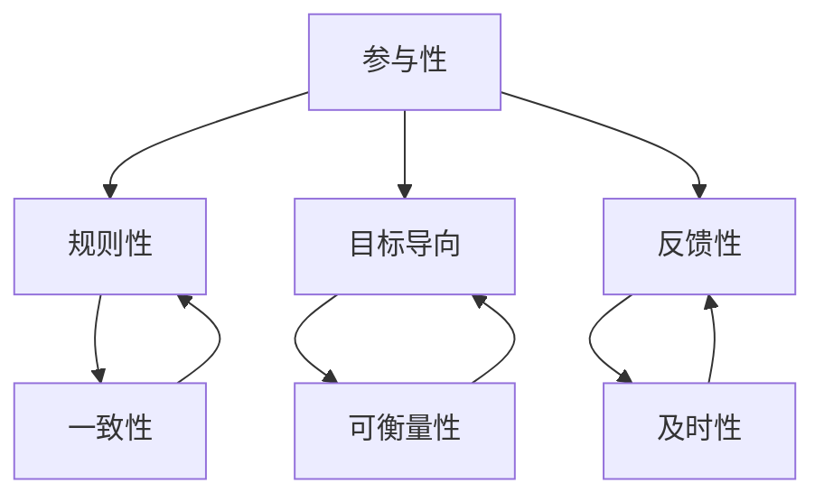
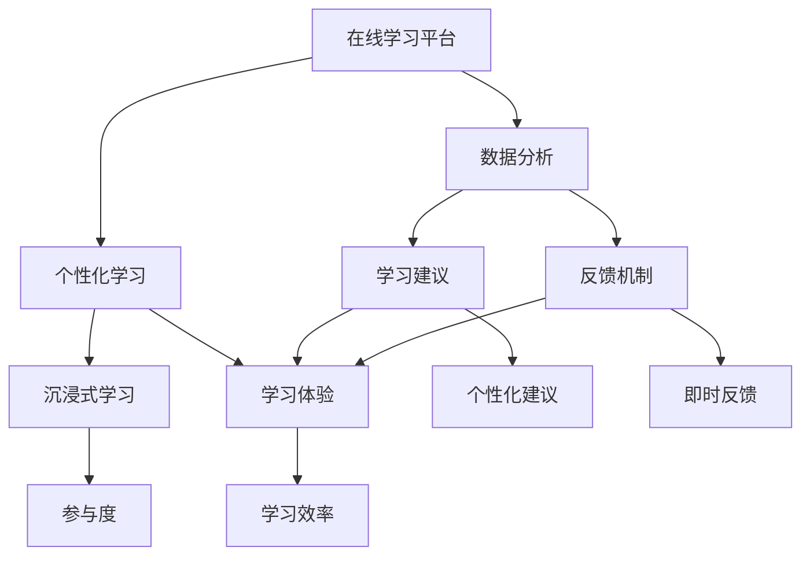
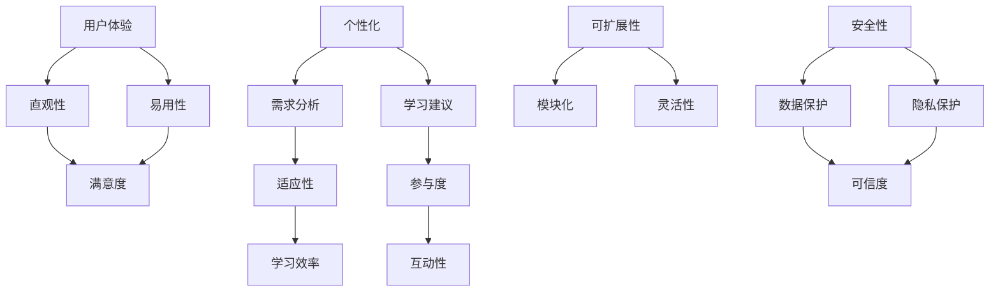
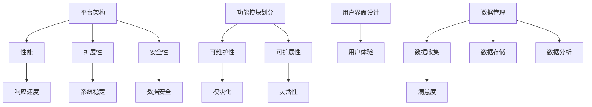
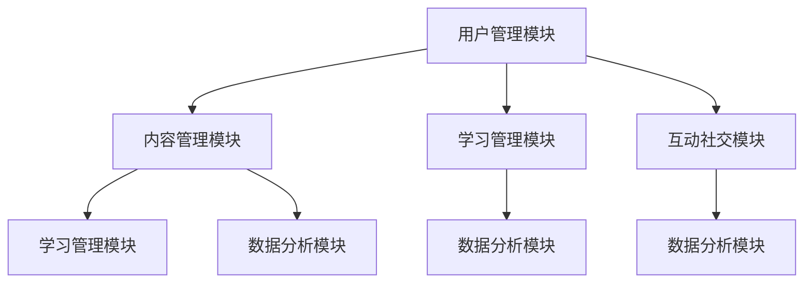
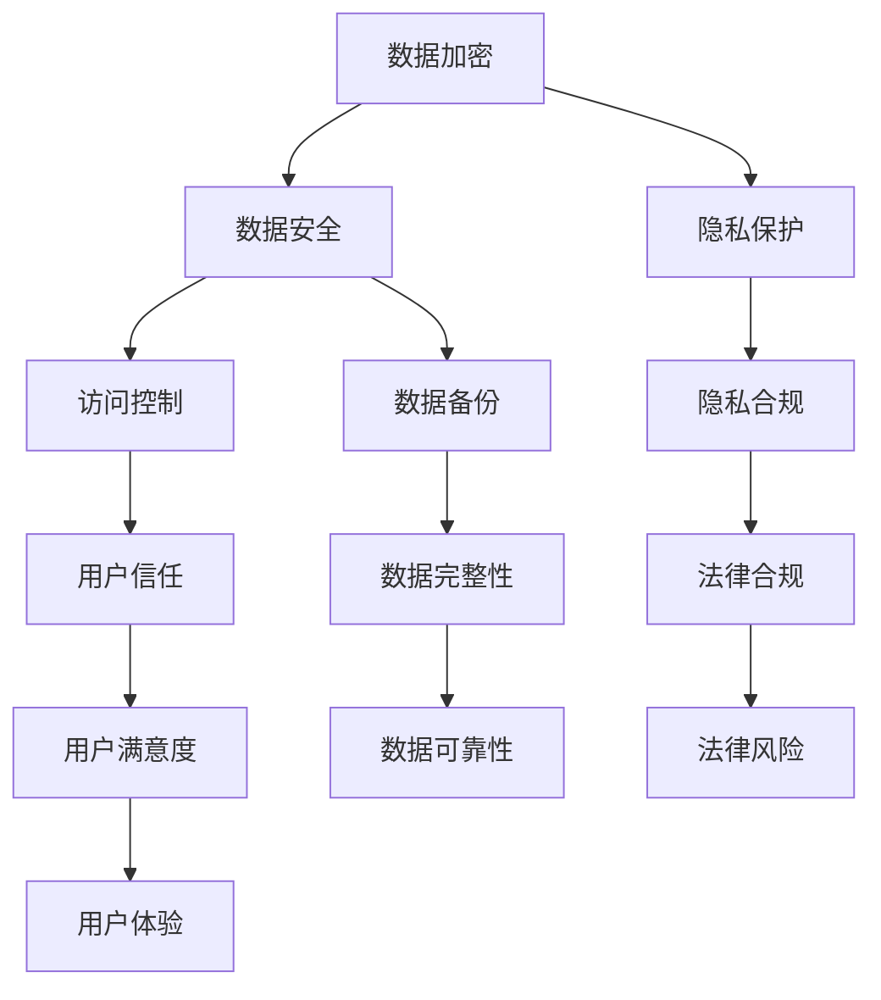
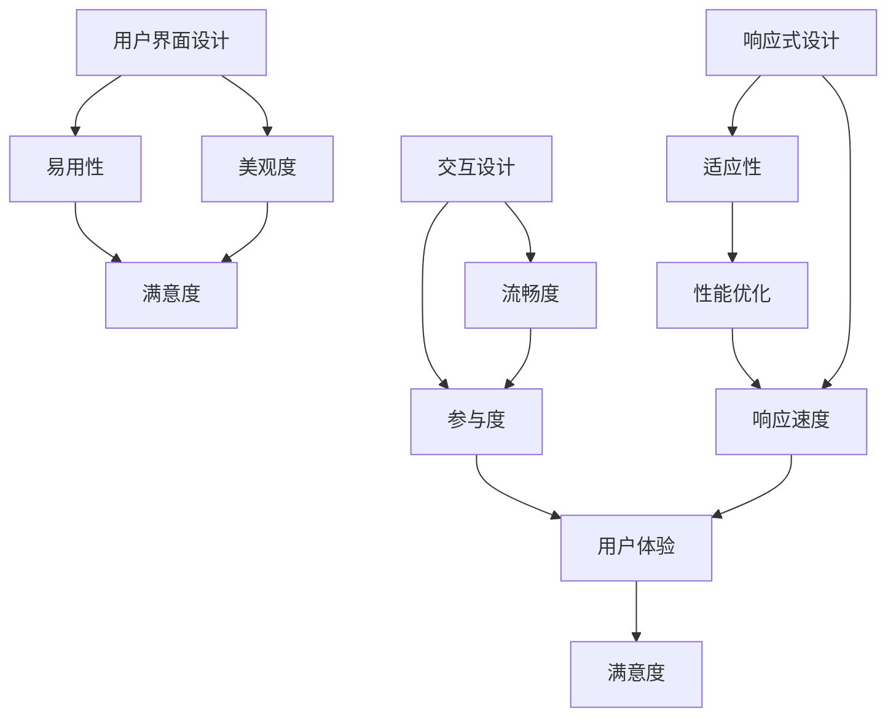
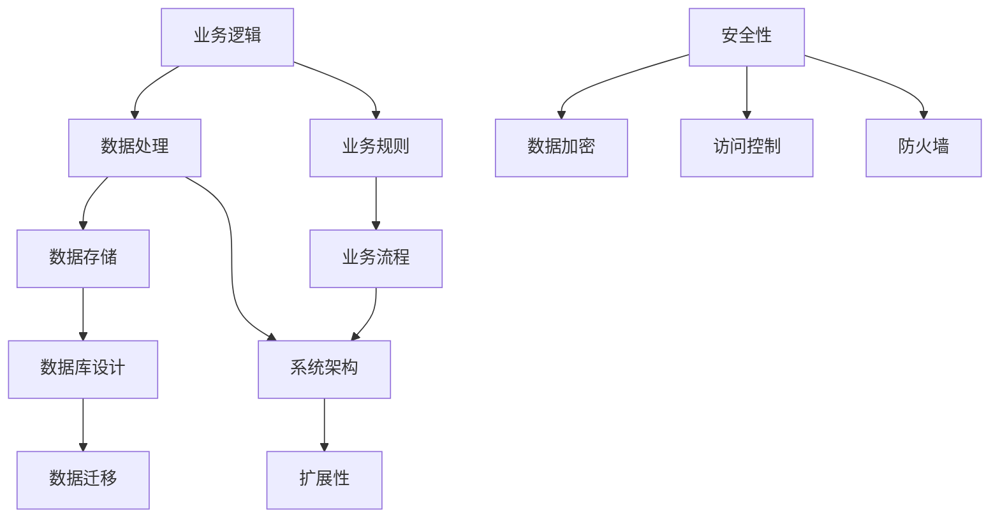
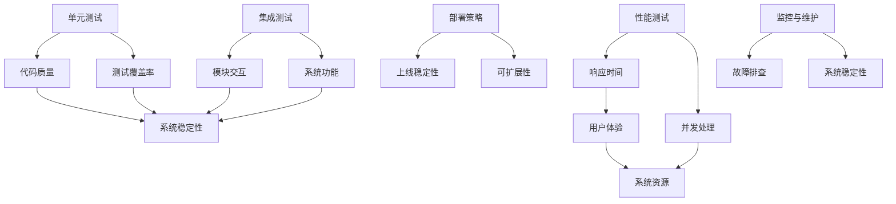

                 


## 第2章 游戏化学习理论

### 2.1 游戏化的基本原则

**背景介绍**

游戏化学习是通过将游戏的设计原则和机制应用于非游戏环境（如教育、工作培训等）来提高学习效果和参与度的一种方法。它基于一些核心的基本原则，这些原则旨在激发学习者的动机、增强记忆、促进理解和提升实践能力。理解这些基本原则有助于我们更好地设计数字游戏化学习平台。

**核心概念与联系**

以下是游戏化学习的四个基本原则及它们之间的关系：



1. **参与性**：游戏化学习鼓励学习者积极参与，提供多样性和挑战性来保持他们的兴趣。
2. **规则性**：规则明确、一致且透明，确保学习者了解游戏规则和期望。
3. **目标导向**：设定清晰的学习目标，提供可衡量的成果指标，帮助学习者跟踪进展。
4. **反馈性**：及时和有效的反馈，有助于学习者了解自己的表现，并作出相应的调整。

**核心算法原理讲解**

游戏化学习的核心算法原理可以概括为以下几个步骤：

```pseudo
初始化游戏化学习环境
1. 设定学习目标
2. 设计游戏规则
3. 提供多样化挑战
4. 给出奖励和惩罚机制
5. 收集学习行为数据
6. 分析学习者表现
7. 提供个性化反馈
8. 调整游戏机制
```

**数学模型和公式**

在游戏化学习中，常用的数学模型包括概率模型、线性回归模型和决策树模型。以下是一个简单的线性回归模型的公式：

$$
y = \beta_0 + \beta_1x
$$

其中，$y$ 是学习成果，$x$ 是学习者的参与度，$\beta_0$ 和 $\beta_1$ 是模型参数。

**举例说明**

假设我们设计一个游戏化学习平台，目标是提高编程技能。我们可以设定以下目标：

- 完成一定数量的编程练习。
- 在规定时间内解决特定难度的编程问题。

通过收集学习者的编程行为数据，我们可以分析他们的表现，并提供个性化的反馈。例如，如果一个学习者完成了大量练习但解决问题的速度较慢，我们可以建议他们提高编程速度。

### 2.2 游戏化学习的理论基础

**学习动机**

游戏化学习的一个关键方面是激发学习动机。以下是一些理论基础：

- **自我决定理论**：根据自我决定理论，学习动机主要来源于内在兴趣、自主性和能力感。游戏化学习通过设定明确的目标、提供挑战性和多样化的任务，来激发学习者的内在兴趣。

- **强化理论**：强化理论认为，通过奖励和惩罚来影响学习者的行为。在游戏化学习中，奖励机制可以增强学习者的积极性，例如通过给予积分、徽章或排名来激励他们。

- **自我效能感理论**：自我效能感是指个体对自己完成特定任务的信心。游戏化学习通过提供及时的反馈和奖励，来增强学习者的自我效能感。

**游戏化学习与数字技术**

数字技术的进步为游戏化学习提供了新的可能性。以下是一些关键点：

- **在线学习平台**：在线学习平台可以提供个性化的学习体验，通过数据分析来了解学习者的行为和需求。

- **虚拟现实和增强现实**：虚拟现实和增强现实技术可以创造沉浸式的学习环境，增强学习者的参与度和学习效果。

- **人工智能和机器学习**：人工智能和机器学习技术可以用于分析学习数据，提供个性化的学习建议和反馈。

**数学模型和公式**

在游戏化学习中，常用的数学模型包括：

- **概率模型**：用于预测学习者的行为和表现。
- **线性回归模型**：用于分析学习成果与参与度之间的关系。
- **决策树模型**：用于分类和预测学习者的行为。

以下是一个简单的决策树模型：

```
是否完成练习？
    /   \
   是    否
  /   \
学习成果  未完成
```

**举例说明**

假设我们设计一个游戏化学习平台，目标是提高英语听力技能。我们可以通过以下方式来实现：

- 设定明确的学习目标，例如每天听英语新闻。
- 提供多样化的听力材料，包括不同难度和主题。
- 通过积分、徽章和排名来激励学习者。
- 收集学习者的听力数据，分析他们的表现并提供个性化的反馈。

通过这种方式，我们可以有效地提高学习者的英语听力技能。

### 2.3 游戏化学习与数字技术

**背景介绍**

随着数字技术的发展，游戏化学习平台的设计和实施变得更加灵活和高效。数字技术不仅为游戏化学习提供了新的工具和方法，还改变了学习者的学习方式。

**核心概念与联系**

以下是数字技术在游戏化学习中的应用及其核心概念：

- **在线学习平台**：提供个性化的学习体验，通过数据分析来了解学习者的行为和需求。
- **虚拟现实（VR）**：创造沉浸式的学习环境，增强学习者的参与度和学习效果。
- **增强现实（AR）**：将虚拟内容与现实世界相结合，提供丰富的学习体验。
- **人工智能（AI）和机器学习（ML）**：用于分析学习数据，提供个性化的学习建议和反馈。

以下是这些概念之间的关系图：



**核心算法原理讲解**

数字技术在游戏化学习中的应用包括：

- **推荐系统**：基于用户行为和兴趣，推荐适合他们的学习内容。
- **数据分析**：收集和分析学习者的行为数据，以优化学习体验。
- **机器学习**：用于预测学习成果和个性化学习路径。

以下是一个简单的推荐系统算法：

```python
def recommend_content(user_history, content库):
    # 根据用户历史行为，推荐相似内容
    similar_content = find_similar_content(user_history, content库)
    return similar_content
```

**数学模型和公式**

在游戏化学习中，常用的数学模型包括：

- **贝叶斯模型**：用于预测学习者的行为和偏好。
- **马尔可夫模型**：用于分析学习者的行为模式。
- **神经网络模型**：用于处理复杂的非线性问题。

以下是一个简单的神经网络模型：

```
输入层 -> 隐藏层 -> 输出层
```

**举例说明**

假设我们设计一个游戏化学习平台，目标是提高编程技能。我们可以通过以下方式来实现：

- 使用在线学习平台提供个性化的编程练习。
- 使用虚拟现实技术创建编程实验室，让学习者沉浸其中。
- 使用人工智能和机器学习技术分析学习者的编程行为，提供个性化的学习建议。
- 收集学习者的编程数据，通过数据分析来优化学习体验。

通过这种方式，我们可以有效地提高学习者的编程技能。

### 2.4 数字游戏化学习平台的设计原则

**背景介绍**

数字游戏化学习平台的设计原则是确保学习者在学习过程中的体验和效果的关键。设计原则需要综合考虑学习者的需求、学习目标和平台的技术可行性。

**核心概念与联系**

以下是数字游戏化学习平台设计的关键原则及其关系：

- **用户体验**：提供直观、易用的用户界面，确保学习者的使用体验。
- **个性化**：根据学习者的需求和进度，提供个性化的学习内容和建议。
- **互动性**：鼓励学习者之间的互动和合作，提高学习参与度。
- **可扩展性**：设计灵活的系统架构，以便未来功能扩展和技术升级。
- **安全性**：确保用户数据的安全和隐私。

以下是这些概念之间的关系图：



**核心算法原理讲解**

在数字游戏化学习平台的设计中，常用的算法原理包括：

- **用户画像**：通过收集和分析用户行为数据，创建用户的个性化画像。
- **推荐系统**：根据用户画像和学习历史，推荐适合他们的学习内容。
- **自然语言处理**：用于分析用户的反馈和对话，提供个性化的学习建议。

以下是一个简单的推荐系统算法：

```python
def recommend_content(user_profile, content库):
    # 根据用户画像，推荐相似内容
    similar_content = find_similar_content(user_profile, content库)
    return similar_content
```

**数学模型和公式**

在数字游戏化学习平台的设计中，常用的数学模型包括：

- **贝叶斯网络**：用于表示用户和学习内容之间的关系。
- **决策树**：用于分类和预测学习者的行为。
- **聚类算法**：用于分析学习者的群体特征。

以下是一个简单的决策树模型：

```
输入：用户特征
输出：学习建议
决策树：
- 用户兴趣
    - 编程
        - Python
        - Java
        - C++
    - 数据分析
        - SQL
        - R语言
        - Python数据分析库
    - ...
```

**举例说明**

假设我们设计一个数字游戏化学习平台，目标是提高编程技能。我们可以通过以下方式来实现：

- 使用用户画像技术，分析学习者的编程兴趣和技能水平。
- 根据用户画像，推荐适合他们的编程练习和课程。
- 使用自然语言处理技术，分析学习者的反馈和对话，提供个性化的学习建议。
- 设计直观、易用的用户界面，确保学习者的使用体验。

通过这种方式，我们可以有效地提高学习者的编程技能。

### 2.5 数字游戏化学习平台的技术实现

**背景介绍**

数字游戏化学习平台的技术实现是确保平台功能正常运行和提供高质量学习体验的关键。技术实现需要综合考虑平台架构、功能模块划分、用户界面设计和数据管理等方面。

**核心概念与联系**

以下是数字游戏化学习平台技术实现的关键概念及其关系：

- **平台架构**：平台的技术架构决定了系统的性能、扩展性和安全性。
- **功能模块划分**：将平台功能划分为多个模块，有助于提高系统的可维护性和可扩展性。
- **用户界面设计**：用户界面设计直接影响学习者的使用体验和满意度。
- **数据管理**：数据管理包括数据的收集、存储、分析和共享，是平台的核心功能。

以下是这些概念之间的关系图：



**核心算法原理讲解**

在数字游戏化学习平台的技术实现中，常用的算法原理包括：

- **负载均衡**：通过分配网络流量，确保平台在高并发情况下稳定运行。
- **缓存机制**：通过缓存常用数据和资源，提高平台的响应速度。
- **数据库优化**：通过索引、分区和查询优化，提高数据库的性能。

以下是一个简单的负载均衡算法：

```python
def load_balance(requests):
    # 根据请求类型和服务器负载，分配请求到不同的服务器
    server = select_server(requests)
    return server
```

**数学模型和公式**

在数字游戏化学习平台的技术实现中，常用的数学模型包括：

- **排队论**：用于模拟和分析系统中的排队现象。
- **优化算法**：用于优化系统的性能和资源分配。
- **机器学习模型**：用于分析用户行为和预测系统负载。

以下是一个简单的优化算法：

```
输入：系统负载
输出：资源分配策略
优化算法：
- 计算系统负载
- 根据负载分配资源
- 监测系统性能
- 根据性能调整资源分配
```

**举例说明**

假设我们设计一个数字游戏化学习平台，需要实现以下功能：

- 平台架构：使用微服务架构，确保系统的性能和扩展性。
- 功能模块划分：将平台划分为用户管理、内容管理、学习管理和数据分析等模块。
- 用户界面设计：设计直观、易用的用户界面，确保学习者的使用体验。
- 数据管理：使用分布式数据库，确保数据的高可用性和安全性。

通过这种方式，我们可以实现一个高性能、可扩展和安全的数字游戏化学习平台。

### 2.6 数字游戏化学习平台的功能模块

**背景介绍**

数字游戏化学习平台的功能模块是平台实现核心功能的基础。合理划分功能模块有助于提高系统的可维护性、可扩展性和用户体验。

**核心概念与联系**

以下是数字游戏化学习平台的主要功能模块及其关系：

- **用户管理模块**：负责用户注册、登录、权限管理和用户画像等。
- **内容管理模块**：负责课程、练习题、游戏和其他学习资源的创建、发布和管理。
- **学习管理模块**：负责学习进度跟踪、成绩记录、学习建议和反馈等。
- **数据分析模块**：负责收集、存储、分析和可视化学习数据，为平台优化提供依据。
- **互动社交模块**：负责学习者之间的互动、交流和协作。

以下是这些模块之间的关系图：



**核心算法原理讲解**

以下是每个功能模块的核心算法原理：

1. **用户管理模块**：
   - 用户注册和登录：使用哈希算法存储用户密码。
   - 权限管理：使用权限矩阵和访问控制列表（ACL）来管理用户权限。

   ```python
   def register_user(username, password):
       hashed_password = hash_password(password)
       save_user(username, hashed_password)
   ```

2. **内容管理模块**：
   - 内容创建和发布：使用内容管理系统（CMS）来管理学习资源。
   - 内容推荐：使用协同过滤算法推荐学习资源。

   ```python
   def recommend_content(user_history, content库):
       similar_content = find_similar_content(user_history, content库)
       return similar_content
   ```

3. **学习管理模块**：
   - 学习进度跟踪：使用状态机跟踪学习者的学习状态。
   - 成绩记录：使用数据库存储学习者的成绩和历史。

   ```python
   def record_score(user_id, score):
       save_score(user_id, score)
   ```

4. **数据分析模块**：
   - 数据收集和存储：使用日志和数据库收集和存储学习数据。
   - 数据分析：使用数据挖掘算法分析学习数据，提供个性化学习建议。

   ```python
   def analyze_data(data):
       insights = data_analyzer(data)
       return insights
   ```

5. **互动社交模块**：
   - 互动交流：使用即时通讯技术（如WebSocket）实现实时互动。
   - 社交网络分析：使用社交网络分析算法（如PageRank）分析学习者的社交关系。

   ```python
   def analyze_social_network(users):
       relationships = social_network_analyzer(users)
       return relationships
   ```

**数学模型和公式**

以下是数字游戏化学习平台中常用的数学模型和公式：

1. **协同过滤算法**：
   - 用户-物品相似度计算：
     $$ 
     sim(u, i) = \frac{u_i \cdot u_j}{\|u_i\|\|u_j\|}
     $$

   - 物品-物品相似度计算：
     $$ 
     sim(i, j) = \frac{i_j \cdot i_k}{\|i_j\|\|i_k\|}
     $$

2. **状态机**：
   - 状态转移概率：
     $$ 
     P(s_{t+1} = s' | s_t = s) = p(s_t = s | s_{t-1} = s') \cdot p(s_{t-1} = s')
     $$

3. **社交网络分析**：
   - PageRank计算：
     $$ 
     r_i = (1-d) + d \cdot \sum_{j \in N(i)} \frac{r_j \cdot c_j}{N(j)}
     $$

   其中，$r_i$ 是节点 $i$ 的PageRank值，$N(i)$ 是节点 $i$ 的邻居节点集，$c_j$ 是节点 $j$ 的出度。

**举例说明**

假设我们设计一个数字游戏化学习平台，需要实现以下功能：

1. **用户管理模块**：
   - 允许用户注册和登录。
   - 管理用户权限，例如教师和学生。

2. **内容管理模块**：
   - 提供课程、练习题和游戏等学习资源。
   - 根据用户历史推荐相关内容。

3. **学习管理模块**：
   - 跟踪学习者的学习进度和成绩。
   - 根据学习表现提供个性化的学习建议。

4. **数据分析模块**：
   - 收集学习数据，例如学习时间、成绩和用户交互等。
   - 分析数据，优化学习体验。

5. **互动社交模块**：
   - 允许学习者之间进行互动和交流。
   - 根据用户互动分析社交网络，推荐朋友。

通过实现这些功能模块，我们可以构建一个完整的数字游戏化学习平台，提高学习者的学习效率和参与度。

### 2.7 数字游戏化学习平台的安全与隐私保护

**背景介绍**

数字游戏化学习平台在收集、存储和使用大量学习数据时，需要高度重视安全与隐私保护。保障用户数据的安全和隐私是平台成功运营的基础。

**核心概念与联系**

以下是数字游戏化学习平台安全与隐私保护的核心概念及其关系：

- **数据加密**：对敏感数据进行加密，防止数据泄露。
- **访问控制**：通过权限管理和身份验证，限制对数据的访问。
- **数据备份**：定期备份数据，防止数据丢失。
- **隐私保护**：确保用户数据的匿名性和隐私。
- **合规性**：遵守相关法律法规，确保平台运营合规。

以下是这些概念之间的关系图：



**核心算法原理讲解**

以下是数字游戏化学习平台安全与隐私保护的核心算法原理：

1. **数据加密算法**：
   - 对称加密算法：如AES，用于加密敏感数据。
   - 非对称加密算法：如RSA，用于加密密钥和身份验证。

   ```python
   from Crypto.Cipher import AES
   
   def encrypt_data(data, key):
       cipher = AES.new(key, AES.MODE_CBC)
       ct_bytes = cipher.encrypt(data)
       iv = cipher.iv
       return iv + ct_bytes
   ```

2. **访问控制算法**：
   - 基于角色的访问控制（RBAC）：根据用户角色和权限控制对数据的访问。
   - 访问控制列表（ACL）：为每个资源设置访问权限，控制用户对资源的访问。

   ```python
   def check_permission(user, resource, action):
       if user.role == "admin":
           return True
       elif resource.acl[action] == "allowed":
           return True
       else:
           return False
   ```

3. **隐私保护算法**：
   - 匿名化处理：如K-匿名化，对用户数据进行匿名化处理。
   - 数据掩码：对敏感数据部分进行掩码处理，保护隐私。

   ```python
   def anonymize_data(data):
       masked_data = mask_sensitive_data(data)
       return masked_data
   ```

**数学模型和公式**

以下是数字游戏化学习平台安全与隐私保护中常用的数学模型和公式：

1. **密钥生成**：
   - 随机数生成：用于生成加密密钥和随机数。
   - 离散对数安全：确保加密算法的密钥长度满足安全要求。

   ```python
   import Crypto.Random
   
   def generate_key():
       random_key = Crypto.Random.random_bytes(32)
       return random_key
   ```

2. **访问控制矩阵**：
   - 访问控制矩阵：表示用户、角色和资源之间的关系。

   ```python
   user_permissions = [
       ["user1", "read"],
       ["user1", "write"],
       ["user2", "read"],
   ]
   ```

3. **匿名化处理**：
   - K-匿名化：将数据集中的每个记录与至少 $k$ 个其他记录进行匹配，保证匿名性。

   ```python
   def k_anonymity(data, k):
       group_size = len(data) / k
       return group_size
   ```

**举例说明**

假设我们设计一个数字游戏化学习平台，需要实现以下安全与隐私保护功能：

1. **数据加密**：
   - 使用AES算法加密用户密码和敏感数据。
   - 为每个用户生成唯一的随机密钥，确保数据加密的安全性。

2. **访问控制**：
   - 使用RBAC模型管理用户权限，确保只有授权用户可以访问敏感数据。
   - 为每个资源设置访问控制列表，控制用户的访问权限。

3. **隐私保护**：
   - 对用户数据进行匿名化处理，确保用户隐私不受侵犯。
   - 使用数据掩码技术，对敏感数据部分进行遮蔽处理。

通过实施这些安全与隐私保护措施，我们可以确保数字游戏化学习平台的安全运营，赢得用户的信任。

### 2.8 数字游戏化学习平台的前端设计

**背景介绍**

数字游戏化学习平台的前端设计直接影响到学习者的用户体验和参与度。优秀的前端设计需要考虑到用户界面的易用性、响应速度和美观度。

**核心概念与联系**

以下是数字游戏化学习平台前端设计的关键概念及其关系：

- **用户界面设计**：设计直观、易用的界面，确保学习者的使用体验。
- **交互设计**：设计流畅的交互流程，提高学习者的参与度。
- **响应式设计**：确保平台在不同设备和分辨率下都能良好运行。
- **性能优化**：提高网页加载速度，提供流畅的用户体验。

以下是这些概念之间的关系图：



**核心算法原理讲解**

以下是数字游戏化学习平台前端设计中的核心算法原理：

1. **用户界面设计**：
   - 布局算法：如Flexbox和Grid布局，实现页面元素的灵活布局。
   - 色彩搭配算法：选择合适的颜色搭配，提高界面美观度。

   ```javascript
   // Flexbox布局示例
   .container {
       display: flex;
       justify-content: space-between;
       align-items: center;
   }
   ```

2. **交互设计**：
   - 事件处理算法：如Debounce和Throttle，优化交互效果。
   - 动画算法：使用CSS或JavaScript实现页面动画效果，增强用户体验。

   ```javascript
   // Debounce示例
   function debounce(func, wait) {
       let timeout;
       return function(...args) {
           const later = () => {
               clearTimeout(timeout);
               func.apply(this, args);
           };
           clearTimeout(timeout);
           timeout = setTimeout(later, wait);
       };
   }
   ```

3. **响应式设计**：
   - 响应式断点：根据设备尺寸设置不同的断点，实现不同设备下的布局调整。
   - 媒体查询：使用媒体查询（Media Query）实现响应式布局。

   ```css
   @media (max-width: 600px) {
       .container {
           flex-direction: column;
       }
   }
   ```

4. **性能优化**：
   - 资源压缩：如图片压缩、代码打包，减少网页加载时间。
   - 缓存策略：如浏览器缓存、服务端缓存，提高网页加载速度。

   ```javascript
   // 缓存示例
   function cacheResponse(response) {
       const cacheKey = 'response';
       localStorage.setItem(cacheKey, JSON.stringify(response));
   }
   ```

**数学模型和公式**

以下是数字游戏化学习平台前端设计中常用的数学模型和公式：

1. **颜色空间转换**：
   - RGB到HSV转换：
     $$
     H = \frac{1}{6} \left( \text{min}(R - G, G - B) + \text{max}(R, G, B) \right)
     $$
     $$
     S = \frac{2.55 \left( \text{max}(R, G, B) - \text{min}(R, G, B) \right)}{\text{max}(R, G, B)}
     $$
     $$
     V = \frac{1}{2.55} \left( \text{max}(R, G, B) + \text{min}(R, G, B) \right)
     $$

2. **动画时间函数**：
   - 运动方程：
     $$
     t = \frac{d}{v}
     $$
     其中，$t$ 是时间，$d$ 是距离，$v$ 是速度。

**举例说明**

假设我们设计一个数字游戏化学习平台的前端界面，需要实现以下功能：

1. **用户界面设计**：
   - 使用Flexbox布局实现首页的导航栏和课程列表。
   - 使用色彩搭配算法选择合适的颜色方案，提高界面美观度。

2. **交互设计**：
   - 使用Debounce算法优化搜索框的输入处理，防止过多请求。
   - 使用CSS动画实现课程列表的滑动效果，增强用户体验。

3. **响应式设计**：
   - 设置不同的响应式断点，实现移动端和桌面端的不同布局。
   - 使用媒体查询实现不同屏幕尺寸下的样式调整。

4. **性能优化**：
   - 对图片进行压缩处理，减小图片大小。
   - 使用浏览器缓存和CDN加速网页加载。

通过实现这些前端设计功能，我们可以构建一个高性能、美观且用户友好的数字游戏化学习平台界面。

### 2.9 数字游戏化学习平台的后端设计

**背景介绍**

数字游戏化学习平台的后端设计是整个平台的技术核心，负责处理业务逻辑、数据存储和安全保障。后端设计需要考虑系统的扩展性、稳定性和安全性。

**核心概念与联系**

以下是数字游戏化学习平台后端设计的关键概念及其关系：

- **业务逻辑**：后端负责处理业务逻辑，如用户管理、课程管理和学习进度管理等。
- **数据存储**：后端负责数据存储和管理，如数据库的选择、索引设计和数据迁移等。
- **安全性**：后端需要确保数据安全，如使用加密算法、访问控制和防火墙等。
- **扩展性**：后端需要设计可扩展的系统架构，以应对用户增长和功能扩展。

以下是这些概念之间的关系图：



**核心算法原理讲解**

以下是数字游戏化学习平台后端设计中常用的算法原理：

1. **用户管理**：
   - 用户认证：使用JWT（JSON Web Token）进行用户认证。
   - 用户权限管理：使用RBAC（基于角色的访问控制）进行权限管理。

   ```python
   from flask_jwt_extended import JWTManager
   
   app.config['JWT_SECRET_KEY'] = 'your_secret_key'
   jwt = JWTManager(app)
   
   @app.route('/login', methods=['POST'])
   def login():
       # 登录逻辑
       token = jwt.create_access_token(identity=user_id)
       return {'token': token}
   ```

2. **课程管理**：
   - 课程搜索：使用搜索引擎（如Elasticsearch）实现课程快速搜索。
   - 课程推荐：使用协同过滤算法（如矩阵分解）实现课程推荐。

   ```python
   import numpy as np
   from sklearn.decomposition import TruncatedSVD
   
   def recommend_courses(user_history, courses):
       # 矩阵分解
       svd = TruncatedSVD(n_components=10)
       user_matrix = np.array(user_history).reshape(-1, 1)
       course_matrix = np.array(courses).reshape(-1, 1)
       user_embeddings = svd.fit_transform(user_matrix)
       course_embeddings = svd.fit_transform(course_matrix)
       
       # 推荐课程
       course_similarity = np.dot(user_embeddings, course_embeddings.T)
       recommended_courses = np.argsort(course_similarity)[::-1]
       return recommended_courses
   ```

3. **学习进度管理**：
   - 进度跟踪：使用状态机（State Machine）跟踪学习进度。
   - 成绩记录：使用数据库（如MySQL或MongoDB）存储学习进度和成绩。

   ```python
   from sqlalchemy import create_engine
   
   engine = create_engine('sqlite:///progress.db')
   from sqlalchemy.orm import sessionmaker
   
   Session = sessionmaker(bind=engine)
   session = Session()
   
   def record_progress(user_id, course_id, progress):
       progress_data = Progress(user_id=user_id, course_id=course_id, progress=progress)
       session.add(progress_data)
       session.commit()
   ```

4. **安全性**：
   - 数据加密：使用AES（Advanced Encryption Standard）进行数据加密。
   - 访问控制：使用OAuth 2.0进行访问控制，确保只有授权用户可以访问特定资源。

   ```python
   from flask_oauthlib.provider import OAuth2Provider
   
   app.config['OAUTHLIB_RELAX_TOKEN_SCOPE'] = True
   oauth = OAuth2Provider(app)
   
   @oauth.require_oauth()
   @app.route('/api/resource')
   def protected_resource():
       # 保护资源
       return jsonify({'data': 'protected resource'})
   ```

**数学模型和公式**

以下是数字游戏化学习平台后端设计中常用的数学模型和公式：

1. **矩阵分解**：
   - 用户-物品矩阵分解：
     $$
     R = \hat{U} \hat{V}^T
     $$
     其中，$\hat{U}$ 和 $\hat{V}$ 分别是用户和物品的嵌入矩阵。

2. **协同过滤**：
   - 协同过滤评分预测：
     $$
     \hat{r}_{ui} = \hat{u}_i^T \hat{v}_j
     $$
     其中，$\hat{u}_i$ 和 $\hat{v}_j$ 分别是用户 $i$ 和物品 $j$ 的嵌入向量。

3. **状态机**：
   - 状态转换概率：
     $$
     p(s_{t+1} = s' | s_t = s) = \frac{f(s, s')}{\sum_{s'} f(s, s')}
     $$
     其中，$f(s, s')$ 是状态 $s$ 转换到状态 $s'$ 的概率。

**举例说明**

假设我们设计一个数字游戏化学习平台的后端，需要实现以下功能：

1. **用户管理**：
   - 用户登录：使用JWT进行用户认证。
   - 用户权限管理：使用RBAC进行权限控制。

2. **课程管理**：
   - 课程搜索：使用Elasticsearch实现快速搜索。
   - 课程推荐：使用矩阵分解实现课程推荐。

3. **学习进度管理**：
   - 进度跟踪：使用状态机跟踪学习进度。
   - 成绩记录：使用数据库存储学习进度和成绩。

4. **安全性**：
   - 数据加密：使用AES进行数据加密。
   - 访问控制：使用OAuth 2.0进行访问控制。

通过实现这些后端设计功能，我们可以构建一个高效、稳定且安全的数字游戏化学习平台。

### 2.10 数字游戏化学习平台的测试与部署

**背景介绍**

数字游戏化学习平台的测试与部署是确保平台质量和稳定运行的关键环节。合理的测试和部署策略有助于发现和解决潜在问题，提高平台的可靠性和用户体验。

**核心概念与联系**

以下是数字游戏化学习平台测试与部署的关键概念及其关系：

- **单元测试**：测试单个功能模块的代码逻辑，确保其正确性。
- **集成测试**：测试模块之间的交互，确保系统整体功能的正确性。
- **性能测试**：评估系统的响应时间、并发处理能力和资源消耗。
- **部署策略**：制定合理的部署计划，确保平台稳定上线。
- **监控与维护**：持续监控系统运行状态，及时发现和解决问题。

以下是这些概念之间的关系图：



**核心算法原理讲解**

以下是数字游戏化学习平台测试与部署中的核心算法原理：

1. **单元测试**：
   - 断言：使用断言（Assertions）检查代码的预期输出与实际输出是否一致。
   - Mock：使用Mock对象模拟外部依赖，确保测试的独立性。

   ```python
   def test_addition():
       assert add(2, 3) == 5
   ```

2. **集成测试**：
   - 测试用例设计：设计全面的测试用例，覆盖各种边界条件和异常情况。
   - 自动化测试：使用自动化测试工具（如Selenium）实现测试过程的自动化。

   ```python
   def test_login():
       driver = webdriver.Chrome()
       driver.get('https://example.com/login')
       driver.find_element_by_name('username').send_keys('test')
       driver.find_element_by_name('password').send_keys('test')
       driver.find_element_by_css_selector('button[type="submit"]').click()
       assert driver.current_url == 'https://example.com/home'
   ```

3. **性能测试**：
   - 基准测试：使用基准测试（Benchmarking）工具（如JMeter）评估系统的性能指标。
   - 负载测试：模拟高并发场景，评估系统的响应时间和资源消耗。

   ```python
   from locust import HttpUser, task, between
   
   class WebsiteUser(HttpUser):
       wait_time = between(1, 5)
       
       @task
       def load_home_page(self):
           self.client.get("https://example.com/home")
       
       @task
       def load_product_page(self):
           self.client.get("https://example.com/product")
   ```

4. **部署策略**：
   - 持续集成（CI）：使用CI工具（如Jenkins）实现代码的自动化构建和测试。
   - 持续部署（CD）：使用CD工具（如Docker和Kubernetes）实现代码的自动化部署。

   ```shell
   # Jenkinsfile 示例
   pipeline {
       agent any
       stages {
           stage('Build') {
               steps {
                   sh 'mvn clean package'
               }
           }
           stage('Test') {
               steps {
                   sh 'mvn test'
               }
           }
           stage('Deploy') {
               steps {
                   sh 'docker build -t myapp .'
                   sh 'docker run -d --name myapp myapp'
               }
           }
       }
   }
   ```

**数学模型和公式**

以下是数字游戏化学习平台测试与部署中常用的数学模型和公式：

1. **性能评估**：
   - 响应时间分布：
     $$
     P(R < t) = 1 - e^{-\lambda t}
     $$
     其中，$R$ 是响应时间，$t$ 是时间，$\lambda$ 是服务率。

2. **负载均衡**：
   - 加权随机法：根据服务器的负载情况，按权重随机选择服务器。
     $$
     S_i = \frac{w_i}{\sum_{j=1}^{N} w_j}
     $$
     其中，$S_i$ 是选择服务器 $i$ 的概率，$w_i$ 是服务器 $i$ 的权重，$N$ 是服务器总数。

**举例说明**

假设我们设计一个数字游戏化学习平台，需要实现以下测试与部署功能：

1. **单元测试**：
   - 对用户管理模块进行单元测试，确保用户注册、登录和权限管理的正确性。

2. **集成测试**：
   - 对用户管理模块与其他模块（如课程管理模块）进行集成测试，确保模块之间的交互正确。

3. **性能测试**：
   - 使用JMeter进行性能测试，模拟高并发场景，评估系统的响应时间和并发处理能力。

4. **部署策略**：
   - 使用Jenkins实现持续集成，确保代码的自动化构建和测试。
   - 使用Docker和Kubernetes实现持续部署，确保代码的自动化部署和扩展。

通过实施这些测试与部署功能，我们可以构建一个高质量、稳定且可靠的数字游戏化学习平台。

