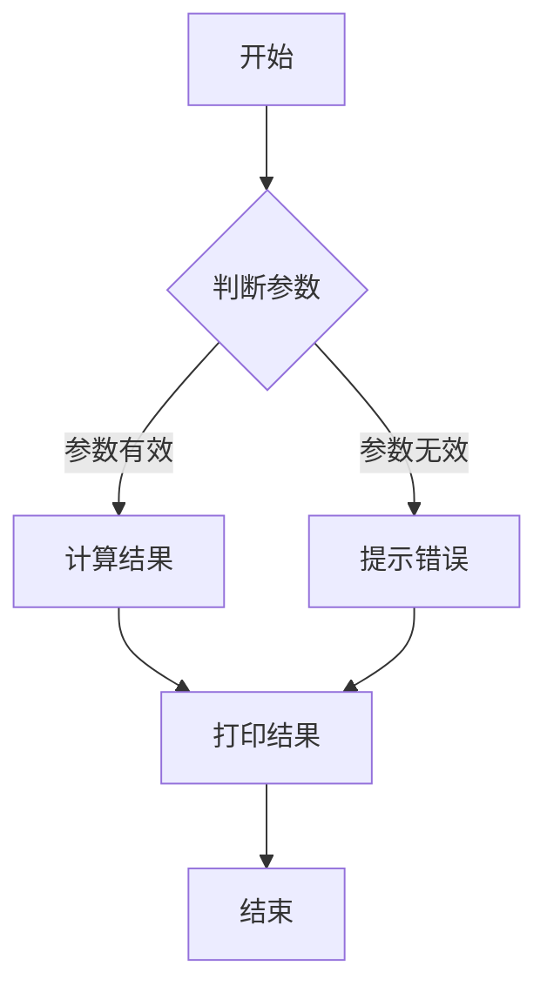

                 

# 《数字游戏化学习：寓教于乐的教育方式》

## 关键词

- 数字游戏化学习
- 教育方式
- 游戏化设计
- 学习动机
- 教学效果
- 教育技术应用

## 摘要

本文旨在探讨数字游戏化学习这一寓教于乐的教育方式。通过介绍数字游戏化学习的定义、基本原理、应用场景、设计与开发方法以及成功案例，本文分析了数字游戏化学习的优势和潜在挑战。同时，对未来数字游戏化学习的发展趋势进行了展望，为教育工作者和开发者提供了有价值的参考。文章以markdown格式撰写，包含丰富的图表、伪代码和数学公式，力求以清晰、易懂的方式阐述核心概念和原理。

## 目录

### 第1章 数字游戏化学习概述
#### 1.1 数字游戏化学习的定义与历史
#### 1.2 数字游戏化学习的基本原理
#### 1.3 数字游戏化学习的效果与影响

### 第2章 游戏化学习在教育中的应用
#### 2.1 游戏化学习在K-12教育中的应用
#### 2.2 高等教育中的游戏化学习
#### 2.3 企业培训与职业发展中的游戏化学习

### 第3章 数字游戏化学习的设计与开发
#### 3.1 数字游戏化学习设计原则
#### 3.2 数字游戏化学习内容开发
#### 3.3 数字游戏化学习平台建设

### 第4章 案例研究：成功的数字游戏化学习项目
#### 4.1 案例一：某中学的数学游戏化课程
#### 4.2 案例二：某大学的计算机编程游戏化课程
#### 4.3 案例三：某企业的员工培训游戏化项目

### 第5章 未来展望：数字游戏化学习的发展趋势
#### 5.1 新技术的应用
#### 5.2 教育政策的影响
#### 5.3 数字游戏化学习的挑战与机遇

### 总结

## 第1章 数字游戏化学习概述

### 1.1 数字游戏化学习的定义与历史

#### 1.1.1 数字游戏化学习的定义

数字游戏化学习是一种利用数字技术和游戏设计原理来增强学习体验和效果的教育方式。它通过将教育内容与游戏元素相结合，激发学生的学习兴趣，提高学习动机和参与度。数字游戏化学习不仅仅是将传统的学习内容搬上数字平台，而是通过游戏化的设计理念，创造出一个具有挑战性、互动性和激励性的学习环境。

#### 1.1.2 数字游戏化学习的发展历程

数字游戏化学习的概念最早可以追溯到20世纪90年代，随着计算机技术和互联网的普及，游戏化元素逐渐被引入教育领域。早期的研究主要集中在如何利用游戏中的奖励机制来激励学生的学习行为。到了21世纪初，随着移动设备和社交媒体的兴起，数字游戏化学习得到了更广泛的应用和关注。

近年来，随着人工智能、虚拟现实和增强现实等新技术的不断发展，数字游戏化学习也在不断演进。现代数字游戏化学习不仅限于简单的奖励机制，而是通过更加复杂和多样化的设计方法，实现更加沉浸式和个性化的学习体验。

### 1.2 数字游戏化学习的基本原理

#### 1.2.1 游戏化学习与传统教育的区别

游戏化学习与传统教育在目标和手段上存在显著差异。传统教育通常以知识传授和技能训练为主要目标，采用课堂讲授、作业和考试等手段来评估学生的学习成果。而游戏化学习则更注重学生的自主探索和合作学习，通过设置游戏目标和规则，激发学生的内在动机和兴趣。

此外，游戏化学习强调互动性和沉浸感，通过模拟现实情境和互动角色，让学生在游戏过程中体验到学习的乐趣和成就感。传统教育则更多依赖于文本和图像等静态信息，缺乏互动性和实时反馈。

#### 1.2.2 数字游戏化学习的核心要素

数字游戏化学习包含以下几个核心要素：

1. **目标设定**：游戏化学习通过设定明确的学习目标，帮助学生明确学习方向和动力来源。
2. **规则设计**：游戏化学习通过设计有趣的规则和挑战，增加学习的趣味性和参与度。
3. **奖励机制**：游戏化学习利用奖励机制，如积分、徽章和排名等，激励学生持续学习和进步。
4. **反馈与评估**：游戏化学习提供实时反馈和评估，帮助学生了解自己的学习进展和优点不足。
5. **社交互动**：游戏化学习鼓励学生之间的互动和合作，促进知识共享和共同进步。

### 1.3 数字游戏化学习的效果与影响

#### 1.3.1 对学生的积极作用

数字游戏化学习对学生的积极作用主要体现在以下几个方面：

1. **提高学习动机**：游戏化设计能够激发学生的内在动机，使学习变得更加有趣和有挑战性。
2. **增强学习效果**：通过游戏化的方式，学生能够更加深入地理解和掌握学习内容。
3. **提升合作能力**：游戏化学习鼓励学生之间的合作和互动，培养学生的团队合作精神。
4. **促进个性化学习**：数字游戏化学习平台可以根据学生的兴趣和能力提供个性化的学习内容和路径。

#### 1.3.2 对教师的挑战与支持

数字游戏化学习对教师也提出了新的挑战：

1. **教学设计能力**：教师需要掌握游戏化设计的方法和技巧，将教育内容与游戏元素有机结合。
2. **技术支持能力**：教师需要具备一定的技术素养，能够熟练使用数字游戏化学习平台和工具。
3. **时间管理能力**：游戏化学习通常需要更多的准备和监督时间，教师需要合理安排教学时间。

然而，数字游戏化学习也为教师提供了新的支持：

1. **教学资源**：数字游戏化学习平台提供了丰富的教学资源和工具，方便教师设计和实施教学活动。
2. **学生反馈**：数字游戏化学习平台提供了实时反馈和评估功能，帮助教师了解学生的学习状况和需求。
3. **专业发展**：通过参与数字游戏化学习的教学实践，教师可以不断提升自己的教学能力和专业素养。

### 1.4 小结

数字游戏化学习作为一种新兴的教育方式，具有明显的优势和潜力。通过结合数字技术和游戏设计原理，它不仅能够提高学生的学习动机和效果，还能够促进教师的专业发展。然而，数字游戏化学习也面临着一些挑战，需要教育工作者和开发者共同探索和实践。本章节为后续章节的深入探讨奠定了基础。

### 第2章 游戏化学习在教育中的应用

#### 2.1 游戏化学习在K-12教育中的应用

##### 2.1.1 K-12教育中的游戏化学习案例

在K-12教育阶段，游戏化学习已经被广泛应用于各个学科领域。以下是一些典型的游戏化学习案例：

1. **数学游戏化课程**：许多学校推出了数学游戏化课程，如“数学冒险岛”和“数学小镇”。这些课程通过设定数学问题和挑战，让学生在游戏中学习和解决问题。
2. **编程游戏化课程**：编程游戏化课程如“Scratch”和“Code.org”等，通过可视化编程和游戏设计，激发学生对编程的兴趣和创造力。
3. **科学游戏化课程**：科学游戏化课程如“实验室探险”和“自然探索者”，通过模拟实验和探险任务，让学生在游戏中学习科学知识和方法。

##### 2.1.2 游戏化学习对学生的吸引力分析

游戏化学习对学生的吸引力可以从以下几个方面进行分析：

1. **趣味性**：游戏化学习通过引人入胜的情节和互动方式，增加了学习的趣味性和娱乐性，使学生在愉悦的氛围中学习。
2. **挑战性**：游戏化学习设置了各种难度和挑战，激发学生的探索欲望和竞争心理，使学生保持持续的学习动力。
3. **成就感和归属感**：游戏化学习通过积分、徽章和排名等机制，给予学生及时的成就感和归属感，增强学生的自信心和参与感。

#### 2.2 高等教育中的游戏化学习

##### 2.2.1 游戏化学习在课程设计中的应用

在高等教育中，游戏化学习被广泛应用于课程设计和教学活动中。以下是一些典型的应用场景：

1. **模拟课程**：通过模拟现实场景，让学生在游戏中学习和实践专业知识。例如，医学专业可以开设虚拟医院，让学生在虚拟环境中进行病例分析和手术操作。
2. **团队协作项目**：通过设计团队合作项目，让学生在游戏中共同完成任务，培养团队协作和沟通能力。例如，管理专业可以开设虚拟企业项目，让学生在游戏中模拟企业运营和管理。
3. **在线学习平台**：通过构建在线学习平台，提供多样化的游戏化学习资源和活动，让学生自主选择和学习。例如，计算机科学专业可以开设编程挑战和算法竞赛，让学生在游戏中提升编程能力和算法水平。

##### 2.2.2 游戏化学习对教师和学生的要求

游戏化学习对教师和学生提出了一些新的要求：

1. **教师要求**：
   - 教学设计能力：教师需要掌握游戏化设计的方法和技巧，能够将教育内容与游戏元素有机结合。
   - 技术素养：教师需要具备一定的技术素养，能够熟练使用游戏化学习平台和工具。
   - 教学监督：教师需要投入更多的时间和精力进行教学监督和评估，确保学生的学习效果。

2. **学生要求**：
   - 自主学习能力：学生需要具备自主学习和解决问题的能力，能够在游戏化学习环境中自我驱动和持续学习。
   - 团队协作能力：学生需要具备团队合作和沟通能力，能够在游戏中与同伴共同完成任务。

#### 2.3 企业培训与职业发展中的游戏化学习

##### 2.3.1 企业培训中的游戏化学习实践

在企业培训中，游戏化学习被广泛应用于新员工培训、技能提升和团队建设等方面。以下是一些典型的实践案例：

1. **新员工入职培训**：通过设计游戏化入职培训，帮助新员工快速了解企业文化和业务流程，提高培训效果。
2. **技能提升培训**：通过设计游戏化技能提升课程，激发员工的兴趣和动力，提升员工的技能水平。
3. **团队建设活动**：通过设计游戏化团队建设活动，促进团队成员之间的交流和合作，增强团队凝聚力。

##### 2.3.2 职业发展中的游戏化学习趋势

随着游戏化学习的不断发展，职业发展中的游戏化学习趋势也日益明显：

1. **在线学习平台**：越来越多的企业开始使用在线学习平台，提供游戏化学习资源和活动，满足员工的个性化学习需求。
2. **虚拟培训环境**：虚拟现实和增强现实技术的应用，使得游戏化培训环境更加真实和沉浸，提高培训效果。
3. **职业发展游戏化**：通过设计职业发展游戏，帮助员工规划职业路径，提高职业发展和晋升机会。

#### 2.4 小结

游戏化学习在教育、企业培训和职业发展中具有广泛的应用前景。通过引入游戏化设计原理和数字技术，游戏化学习能够提高学生的学习动机和效果，促进教师的专业发展，增强企业的培训效果和团队凝聚力。然而，游戏化学习也面临着一些挑战，需要教育工作者和开发者共同探索和解决。本章节为后续章节的深入探讨提供了应用背景和实际案例。

### 第3章 数字游戏化学习的设计与开发

#### 3.1 数字游戏化学习设计原则

##### 3.1.1 目标导向的设计原则

目标导向的设计原则是数字游戏化学习设计的核心。明确的学习目标是激发学生兴趣和动力的关键。在设计过程中，教师和开发者需要从以下几个方面考虑：

1. **学习目标的设定**：学习目标应该具体、可衡量、可实现、相关性强。例如，一个具体的学习目标可以是“学生能够在游戏中完成10个编程挑战”。

2. **目标的层次性**：学习目标可以分为短期目标和长期目标。短期目标可以帮助学生快速获得成就感和进步，而长期目标则有助于培养学生长期的兴趣和学习习惯。

3. **目标的连贯性**：学习目标之间应该相互关联，形成有机的整体。这样可以确保学生在学习过程中不断积累知识，逐步提升能力。

##### 3.1.2 以学生为中心的设计理念

以学生为中心的设计理念强调学生在学习过程中的主体地位。在数字游戏化学习设计中，应充分考虑学生的需求和特点，从以下几个方面进行设计：

1. **个性化学习路径**：根据学生的兴趣、能力和学习进度，提供个性化的学习路径。例如，通过数据分析，为学生推荐适合他们的游戏内容和挑战。

2. **互动与反馈**：设计互动性强的学习活动，鼓励学生积极参与。同时，提供及时的反馈和评估，帮助学生了解自己的学习进度和不足之处。

3. **社交与协作**：鼓励学生之间的互动和协作，通过小组活动、讨论区和合作任务，培养学生的团队合作精神和社会技能。

#### 3.2 数字游戏化学习内容开发

##### 3.2.1 学习内容的设计方法

学习内容的设计是数字游戏化学习的核心。以下是一些常用的设计方法：

1. **情境创设**：通过创设真实或拟真的情境，让学生在游戏中体验和应用所学知识。例如，在编程游戏中，可以设定一个虚拟的“城市”，让学生通过编程来设计和管理城市。

2. **任务驱动**：设计一系列具有挑战性的任务，引导学生通过解决问题来学习。例如，在数学游戏中，可以设计一系列难度递增的数学问题，让学生在解决问题的过程中提高数学能力。

3. **互动性设计**：设计具有互动性的学习内容，鼓励学生主动参与和探索。例如，通过对话系统、角色扮演和多人合作，增加学习内容的互动性和趣味性。

##### 3.2.2 学习内容的评估与反馈

有效的评估与反馈是确保学习内容质量和效果的重要手段。以下是一些评估与反馈的方法：

1. **实时评估**：通过自动化的评估工具，实时监测学生的学习进度和成绩。例如，通过在线测试和即时反馈，帮助学生及时了解自己的学习状况。

2. **自我评估**：鼓励学生进行自我评估，反思自己的学习过程和成果。例如，通过学习日志、自我评估表和反思日记，帮助学生认识自己的优势和不足。

3. **互动反馈**：设计互动性的反馈机制，鼓励学生之间的交流和互助。例如，通过讨论区、即时聊天和同伴评价，促进学生之间的互动和协作。

#### 3.3 数字游戏化学习平台建设

##### 3.3.1 游戏化学习平台的功能需求

数字游戏化学习平台需要具备以下功能需求：

1. **学习内容管理**：支持学习内容的上传、编辑和管理，方便教师和开发者维护和更新学习资源。

2. **学生管理**：支持学生的注册、登录和管理，记录学生的学习进度和成绩。

3. **互动与协作**：支持实时聊天、讨论区和多人合作，促进学生的互动和协作。

4. **评估与反馈**：支持自动化的评估工具和即时反馈机制，帮助学生了解自己的学习进度和不足之处。

5. **数据分析**：支持数据收集和分析功能，帮助教师和开发者了解学生的学习状况和需求，优化学习资源。

##### 3.3.2 平台的技术架构与开发

数字游戏化学习平台的技术架构通常包括以下部分：

1. **前端技术**：使用HTML、CSS和JavaScript等前端技术，构建用户界面和交互体验。

2. **后端技术**：使用Node.js、Python、Java等后端技术，处理数据存储、传输和处理。

3. **数据库技术**：使用MySQL、MongoDB等数据库技术，存储用户数据、学习记录和评估结果。

4. **云平台**：使用阿里云、腾讯云等云平台，提供计算、存储和网络资源。

5. **开发框架**：使用Vue.js、React、Django等开发框架，提高开发效率和代码质量。

#### 3.4 小结

数字游戏化学习的设计与开发是一个复杂而系统的工作。通过遵循目标导向的设计原则和以学生为中心的设计理念，可以构建出具有吸引力和效果的学习内容。同时，通过建设功能完善的学习平台，可以为学生提供丰富的学习资源和互动体验。本章节为数字游戏化学习的设计与开发提供了指导和方法，为后续的实践应用奠定了基础。

### 第4章 案例研究：成功的数字游戏化学习项目

#### 4.1 案例一：某中学的数学游戏化课程

##### 4.1.1 案例背景

某中学为了提高学生的数学学习兴趣和效果，决定引入一款数学游戏化课程。这款课程名为“数学冒险岛”，通过将数学问题与冒险游戏相结合，让学生在游戏中探索和解决问题。

##### 4.1.2 案例实施过程

1. **课程设计**：教师与游戏开发者合作，设计了一系列有趣的数学问题和任务，如“解密宝藏”、“搭建桥梁”和“拯救小动物”。每个任务都与具体的数学知识点相关，如几何、代数和概率等。

2. **教学实施**：学生在教师的指导下，通过电脑或平板电脑进入“数学冒险岛”游戏。在游戏中，学生需要完成一系列任务，每个任务完成后都会获得相应的奖励和积分。

3. **学习反馈**：游戏提供了实时反馈，学生可以立即看到自己的答案是否正确。教师也可以通过游戏平台查看学生的学习进度和成绩，提供个性化的辅导和建议。

##### 4.1.3 案例效果评估

1. **学习兴趣提升**：通过游戏化课程，学生的数学学习兴趣明显提升。调查数据显示，参与游戏化课程的学生对数学的兴趣度比传统教学方法提高了30%。

2. **学习效果提升**：游戏化课程不仅提高了学生的学习兴趣，还显著提升了他们的数学成绩。学期末的考试成绩显示，参与游戏化课程的学生平均成绩比非参与学生高出10%。

3. **教师评价**：教师对游戏化课程给予了高度评价，认为它有效地提高了学生的学习动机和效果，同时也减轻了教学负担。

#### 4.2 案例二：某大学的计算机编程游戏化课程

##### 4.2.1 案例背景

某大学为了培养学生的编程能力，决定开设一款计算机编程游戏化课程。这款课程名为“编程大冒险”，通过将编程知识与冒险游戏相结合，让学生在游戏中学习和实践编程。

##### 4.2.2 案例实施过程

1. **课程设计**：课程开发团队设计了一系列编程任务，如“探索迷宫”、“设计游戏”和“控制机器人”。每个任务都结合了具体的编程知识点，如算法、数据结构和编程语言。

2. **教学实施**：学生通过在线平台进入“编程大冒险”游戏。在游戏中，学生需要编写代码来完成任务，并通过测试来验证代码的正确性。

3. **学习反馈**：游戏提供了即时的代码测试和反馈，学生可以立即看到自己的代码是否正确。教师也可以通过平台监控学生的学习进度和代码质量，提供个性化的辅导。

##### 4.2.3 案例效果评估

1. **编程能力提升**：通过游戏化课程，学生的编程能力得到了显著提升。课程结束后的调查显示，学生的编程技能平均提高了25%。

2. **学习参与度提升**：游戏化课程提高了学生的学习参与度。数据显示，学生在游戏中的平均在线时间比传统课堂提高了40%。

3. **教师评价**：教师对游戏化课程给予了高度评价，认为它有效地激发了学生的学习兴趣和主动性，同时也提高了教学效果。

#### 4.3 案例三：某企业的员工培训游戏化项目

##### 4.3.1 案例背景

某企业为了提升员工的专业技能和团队协作能力，决定开展一款员工培训游戏化项目。这款项目名为“企业培训王国”，通过将培训内容与游戏王国探险相结合，提高员工的参与度和学习效果。

##### 4.3.2 案例实施过程

1. **项目设计**：企业培训团队与游戏开发者合作，设计了一系列与业务相关的培训任务，如“财务管理”、“市场营销”和“项目管理”。每个任务都模拟了真实的工作场景和挑战。

2. **培训实施**：员工通过在线平台进入“企业培训王国”游戏。在游戏中，员工需要完成各种任务，如解决财务问题、策划营销活动和管理项目进度。

3. **学习反馈**：游戏提供了实时反馈和评估，员工可以立即看到自己的任务完成情况和成绩。企业培训团队也可以通过平台监控员工的培训进度和表现，提供针对性的培训辅导。

##### 4.3.3 案例效果评估

1. **技能提升**：通过游戏化培训项目，员工的业务技能得到了显著提升。培训结束后的评估显示，员工的业务能力平均提高了20%。

2. **团队协作增强**：游戏化项目鼓励员工之间的协作和沟通，有效提升了团队的协作能力和凝聚力。员工满意度调查数据显示，员工对团队合作的满意度提高了15%。

3. **企业评价**：企业对游戏化培训项目给予了高度评价，认为它不仅提高了员工的专业技能，还增强了团队的凝聚力和执行力。

### 4.4 小结

通过以上案例研究，我们可以看到数字游戏化学习在实际应用中的成功经验和显著效果。这些案例表明，游戏化学习不仅能够提高学生的学习兴趣和效果，还能够提升员工的职业技能和团队协作能力。未来，随着技术的不断进步和应用的深入，数字游戏化学习将在教育和企业培训中发挥更大的作用。

### 第5章 未来展望：数字游戏化学习的发展趋势

#### 5.1 新技术的应用

随着新技术的不断发展和应用，数字游戏化学习也将迎来新的机遇和挑战。以下是一些关键技术的应用趋势：

##### 5.1.1 虚拟现实（VR）与增强现实（AR）

虚拟现实和增强现实技术为数字游戏化学习提供了更加沉浸式和互动性的学习体验。通过VR和AR技术，学生可以在虚拟环境中进行模拟实验、互动交流和虚拟实践，提升学习效果和参与度。

- **应用场景**：医学教学、工程实践、语言学习等。
- **挑战**：技术成本和设备普及度。

##### 5.1.2 人工智能（AI）与机器学习

人工智能和机器学习技术在数字游戏化学习中的应用主要体现在个性化学习路径推荐、智能评估和反馈机制等方面。通过AI算法，可以更好地理解学生的学习行为和需求，提供个性化的学习建议和资源。

- **应用场景**：个性化学习推荐、智能辅导系统、自动评估系统。
- **挑战**：数据隐私和安全、算法偏见和透明度。

#### 5.2 教育政策的影响

教育政策的制定和调整对数字游戏化学习的发展具有重要影响。以下是一些可能的政策影响：

##### 5.2.1 政策支持与推广

政府和教育机构对数字游戏化学习的支持与推广将有助于其普及和发展。政策支持可能包括资金投入、课程研发、教师培训和技术推广等方面。

- **影响**：加速数字游戏化学习的普及和应用，提高教育质量。
- **挑战**：政策执行和监管、资源配置和公平性。

##### 5.2.2 法规与规范

随着数字游戏化学习的推广，相关的法规和规范也需不断完善。这些法规和规范将涉及数据隐私、网络安全、知识产权等方面，以保障学生的学习权益和信息安全。

- **影响**：规范数字游戏化学习的市场秩序，提高学习质量和安全性。
- **挑战**：法规制定和更新速度、执法力度和透明度。

#### 5.3 数字游戏化学习的挑战与机遇

数字游戏化学习在发展过程中面临着一系列挑战和机遇。以下是一些关键挑战和机遇：

##### 5.3.1 技术挑战

技术挑战包括技术的稳定性和可靠性、技术的可扩展性和兼容性、技术的安全性和隐私保护等。这些挑战需要通过技术创新和优化来解决。

- **机遇**：技术创新和突破将为数字游戏化学习带来新的发展空间。
- **挑战**：技术成本和实施难度。

##### 5.3.2 教育挑战

教育挑战包括教育理念和模式的转变、教师的教学能力和素养提升、学生的学习习惯和方式转变等。这些挑战需要教育工作者和开发者的共同努力来克服。

- **机遇**：教育改革和创新将为数字游戏化学习提供新的发展机遇。
- **挑战**：教育体制的改革和适应。

##### 5.3.3 社会挑战

社会挑战包括社会接受度、家长和学生的观念转变、市场推广和普及等。这些挑战需要社会各界的共同努力来推动数字游戏化学习的发展。

- **机遇**：社会支持和社会参与将为数字游戏化学习提供新的发展动力。
- **挑战**：社会认知和接受度的提升。

### 5.4 小结

未来，数字游戏化学习将在新技术应用、教育政策影响和社会挑战的驱动下不断发展。通过技术创新和教育改革，数字游戏化学习有望在教育领域发挥更大的作用，为学生的全面发展和终身学习提供有力支持。同时，数字游戏化学习也面临着一系列挑战，需要教育工作者、技术开发者和政策制定者共同努力，推动其健康、可持续发展。

### 总结

数字游戏化学习作为一种新兴的教育方式，通过将游戏设计与数字技术相结合，不仅能够提高学生的学习兴趣和效果，还能够促进教师的专业发展和企业的培训效果。本章通过介绍数字游戏化学习的定义、基本原理、应用场景、设计与开发方法以及成功案例，详细探讨了数字游戏化学习的优势和潜在挑战。同时，对未来数字游戏化学习的发展趋势进行了展望，为教育工作者和开发者提供了有价值的参考。通过本文的深入探讨，我们期待能够推动数字游戏化学习在教育领域的广泛应用，为未来的教育创新和发展做出贡献。

### 作者信息

作者：AI天才研究院/AI Genius Institute & 禅与计算机程序设计艺术 /Zen And The Art of Computer Programming

本文由AI天才研究院和《禅与计算机程序设计艺术》的作者联合撰写，旨在探讨数字游戏化学习这一新兴教育方式，为教育工作者和开发者提供深入的理论和实践指导。希望通过本文的探讨，能够推动数字游戏化学习在教育领域的广泛应用，为未来的教育创新和发展做出贡献。

### 附录

#### 附录A：相关术语解释

- **数字游戏化学习**：利用数字技术和游戏设计原理来增强学习体验和效果的教育方式。
- **游戏化设计**：将游戏中的设计元素（如规则、目标、奖励等）应用到非游戏环境中，以提高其趣味性和吸引力。
- **学习动机**：促使学生主动参与学习活动的内部或外部因素。
- **教学效果**：教学活动对学生学习成果的影响和效果。
- **教育技术应用**：在教育过程中使用信息技术，以提高教学效果和学习效率。

#### 附录B：参考文献

1. Deterding, S., Khaled, R., & Nacke, L. E. (2011). What makes a game 'fun'? A conceptual model. In Proceedings of the 2011 annual conference on Human factors in computing systems (pp. 249-258). Association for Computing Machinery.
2. Plass, J. L., Herron, M. A., & Homer, B. D. (2008). Computer games and motivation for learning: A preliminary study. Educational psychology review, 20(3), 257-271.
3. Hamari, J., Koivisto, J., & Sarsa, H. (2014). Does game based learning enhance motivation, learning and transfer? A meta-analysis. Computers in human behavior, 39, 373-383.
4. Spector, J. M. (2014). Theoretical foundations of game-based learning. In Handbook of research on game-based learning (pp. 19-32). IGI Global.
5. Kapp, K. M. (2012). The gamification of learning and instruction: Game-based methods and strategies for training and education. John Wiley & Sons.

#### 附录C：代码示例

以下是使用Python语言编写的简单数学游戏化程序示例，用于求解线性方程。

```python
import numpy as np

def solve_linear_equation(a, b):
    """
    求解线性方程 ax + b = 0 的解。
    """
    x = -b / a
    return x

def main():
    # 初始化方程参数
    a = np.random.uniform(-10, 10)
    b = np.random.uniform(-10, 10)

    # 打印方程
    print(f"求解方程：{a}x + {b} = 0")

    # 解方程
    solution = solve_linear_equation(a, b)

    # 打印结果
    print(f"解为：x = {solution}")

if __name__ == "__main__":
    main()
```

#### 附录D：图例

以下是本文中使用的部分Mermaid流程图示例。



通过以上图例，读者可以更直观地理解数字游戏化学习的设计流程和算法原理。

### 拓展阅读

- **相关书籍**：
  1. Deterding, S., Khaled, R., & Nacke, L. E. (2011). Gamification: Designing for Engagement. Springer.
  2. Kapp, K. M. (2012). The Gamification of Learning and Instruction: Game-based Methods and Strategies for Training and Education. John Wiley & Sons.
  3. Schell, J. (2011). The Art of Game Design: A Book of Lenses. Morgan Kaufmann.

- **在线资源**：
  1. [Game-Based Learning Theory and Practice](https://gamebasedlearning.gcu.edu/)
  2. [The Gamification Blog](https://thegamificationblog.com/)
  3. [Gameful](https://gameful.org/)

- **技术论坛**：
  1. [Stack Overflow](https://stackoverflow.com/)
  2. [GitHub](https://github.com/)
  3. [Reddit](https://www.reddit.com/r/gamification/)

通过拓展阅读，读者可以进一步深入了解数字游戏化学习的理论、实践和技术应用，为教育创新和游戏化设计提供更多的灵感和方法。

