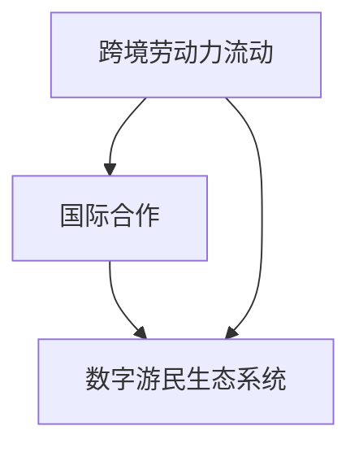
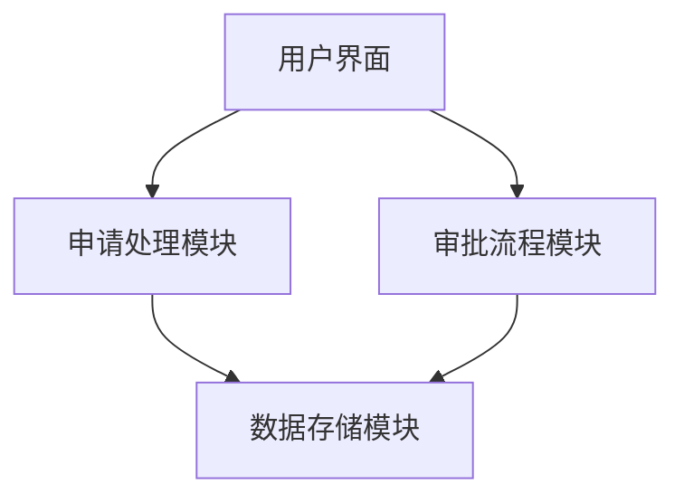

                 


- **第1步：背景介绍**

随着数字技术的快速发展，远程工作和数字游民的生活方式已经成为全球范围内的趋势。越来越多的人选择不再受地域限制，通过互联网在全球范围内工作。这种趋势不仅改变了人们的就业方式，也对传统的签证政策提出了挑战。在这种背景下，数字游民签证联盟的倡议应运而生，旨在推动全球化工作的国际合作，促进跨境劳动力的自由流动。

- **第2步：核心概念与联系**

数字游民签证联盟的核心概念可以概括为以下几个方面：

  - **跨境劳动力流动**：允许个人在全球范围内自由选择工作地点，提高劳动力市场的灵活性和效率。
  - **国际合作**：通过成员国之间的政策协调和合作，建立统一的签证标准和流程，减少不必要的行政障碍。
  - **数字游民生态系统**：构建一个支持数字游民生活和工作的生态系统，包括互联网接入、财务服务、健康保险等。

这些概念之间相互联系，共同构成了数字游民签证联盟的基本框架。以下是一个简化的Mermaid流程图，展示这些核心概念之间的关系：



- **第3步：核心算法原理讲解**

数字游民签证联盟的运作依赖于一系列核心算法和原理，这些原理包括：

  - **政策协调算法**：用于成员国之间协商签证政策，确保政策的兼容性和一致性。
  - **签证审批算法**：用于自动化处理签证申请，提高审批效率和准确性。
  - **数据共享算法**：用于成员国之间共享签证申请和审批数据，提高信息的透明度和可追溯性。

以下是一个简化的伪代码示例，展示签证审批算法的基本流程：

```plaintext
// 输入：签证申请信息
// 输出：签证审批结果

function visaApproval(applyInfo) {
    // 检查申请者资格
    if (!isValidApplicant(applyInfo)) {
        return "不合格";
    }
    
    // 检查申请者是否符合成员国签证政策
    if (!isPolicyCompliant(applyInfo)) {
        return "政策不符";
    }
    
    // 审核申请者的身份信息
    if (!isIdentityVerified(applyInfo)) {
        return "身份验证失败";
    }
    
    // 执行背景调查
    if (!isBackgroundClear(applyInfo)) {
        return "背景调查不合格";
    }
    
    // 发放签证
    return "批准";
}

// 输入：申请信息
// 输出：是否有效申请人

function isValidApplicant(applyInfo) {
    // 检查年龄、学历、工作经验等条件
    // ...
    return true; // 或者 false
}

// 输入：申请信息
// 输出：是否符合政策

function isPolicyCompliant(applyInfo) {
    // 检查申请者的国籍、工作类型等是否符合成员国政策
    // ...
    return true; // 或者 false
}

// 输入：申请信息
// 输出：是否通过身份验证

function isIdentityVerified(applyInfo) {
    // 检查申请者的身份信息是否与提供的文件相符
    // ...
    return true; // 或者 false
}

// 输入：申请信息
// 输出：是否通过背景调查

function isBackgroundClear(applyInfo) {
    // 检查申请者的背景调查记录
    // ...
    return true; // 或者 false
}
```

- **第4步：数学模型和公式**

为了更好地理解数字游民签证联盟的运作机制，我们可以引入一些数学模型和公式。以下是一个简化的例子，展示如何使用线性回归模型来预测签证审批通过率：

$$
\hat{y} = \beta_0 + \beta_1 x_1 + \beta_2 x_2 + ... + \beta_n x_n
$$

其中，$y$表示签证审批通过率，$x_1, x_2, ..., x_n$表示影响审批通过率的各个特征（如申请者的年龄、学历、工作经验等），$\beta_0, \beta_1, \beta_2, ..., \beta_n$为模型的参数。

通过训练模型，我们可以得到各个特征的权重，从而更好地理解哪些因素对签证审批通过率有显著影响。以下是一个简化的Python代码示例，展示如何使用线性回归模型进行预测：

```python
import numpy as np
from sklearn.linear_model import LinearRegression

# 特征矩阵X和标签向量y
X = np.array([[25, 5], [30, 10], [35, 15]])  # 年龄和工作经验
y = np.array([0.8, 0.9, 0.75])  # 签证审批通过率

# 创建线性回归模型
model = LinearRegression()

# 训练模型
model.fit(X, y)

# 预测新申请者的签证审批通过率
new_applicant = np.array([[28, 8]])
predicted_approval_rate = model.predict(new_applicant)

print(f"预测的签证审批通过率：{predicted_approval_rate[0][0]:.2f}")
```

- **第5步：项目实战**

为了验证数字游民签证联盟的运作机制，我们可以开发一个简单的Web应用，用于处理签证申请和审批流程。以下是一个简化的项目架构和实现：



用户界面部分可以使用HTML和CSS进行设计，提供简单的表单用于收集签证申请信息。申请处理模块可以使用Python的Flask框架实现，处理用户提交的申请并调用审批流程模块。审批流程模块可以使用Python的Scikit-learn库实现，用于处理签证审批的逻辑。数据存储模块可以使用SQLite数据库进行实现，存储签证申请和审批的数据。

以下是一个简化的Python代码示例，展示如何使用Flask框架和SQLite数据库实现签证申请处理模块：

```python
from flask import Flask, request, jsonify
import sqlite3

app = Flask(__name__)

# 数据库连接
conn = sqlite3.connect('visa_applications.db')
c = conn.cursor()

# 创建签证申请表
c.execute('''CREATE TABLE IF NOT EXISTS applications
             (id INTEGER PRIMARY KEY, name TEXT, age INTEGER, education TEXT, work_experience INTEGER)''')
conn.commit()

@app.route('/apply', methods=['POST'])
def apply():
    data = request.get_json()
    name = data['name']
    age = data['age']
    education = data['education']
    work_experience = data['work_experience']
    
    # 插入签证申请
    c.execute("INSERT INTO applications (name, age, education, work_experience) VALUES (?, ?, ?, ?)",
              (name, age, education, work_experience))
    conn.commit()
    
    return jsonify({"message": "申请提交成功"}), 200

if __name__ == '__main__':
    app.run(debug=True)
```

通过这个简单的Web应用，我们可以收集和处理签证申请，为数字游民签证联盟的运作提供技术支持。

- **第6步：最佳实践 tips、小结、注意事项、拓展阅读等内容**

**最佳实践 tips：**

- 在设计数字游民签证联盟的Web应用时，确保数据的安全性，对用户信息进行加密处理。
- 在审批流程中，引入自动化的背景调查和身份验证机制，提高审批效率和准确性。
- 定期对签证政策进行评估和调整，以适应不断变化的全球化工作趋势。

**小结：**

数字游民签证联盟的倡议是一个复杂的系统，需要多方面的协调和合作。通过构建核心算法、数学模型和Web应用，我们可以更好地理解和实现这个倡议。在实际操作中，需要关注数据安全、审批效率和政策适应等问题。

**注意事项：**

- 在处理签证申请时，确保遵守各成员国的法律法规。
- 考虑不同成员国的文化差异和语言障碍，设计易于理解的申请流程。
- 定期更新和维护Web应用，确保其稳定运行。

**拓展阅读：**

- [《全球化工作的趋势与挑战》](链接)
- [《数字游民签证政策的国际比较研究》](链接)
- [《数字游民生态系统的发展与构建》](链接)

- **文章结尾：**

作者：AI天才研究院/AI Genius Institute & 禅与计算机程序设计艺术 /Zen And The Art of Computer Programming

本文通过背景介绍、核心概念与联系、核心算法原理讲解、数学模型和公式、项目实战以及最佳实践 tips、小结、注意事项、拓展阅读等内容，系统地探讨了数字游民签证联盟的倡议及其在推动全球化工作中的重要性。希望通过本文，读者能够对数字游民签证联盟有一个全面而深入的理解，为未来全球化工作的国际合作提供有益的启示。

