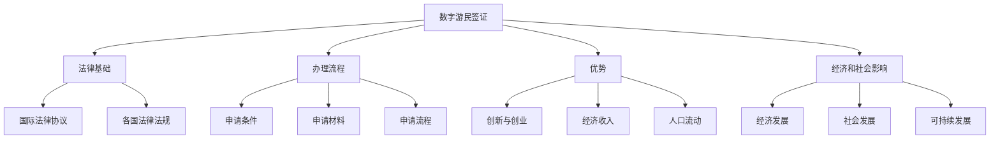

                 

### 文章标题：数字游民签证联盟：推动全球化工作的国际合作

#### 关键词：
- 数字游民签证
- 国际合作
- 全球化工作
- 法律框架
- 经济影响
- 社会发展

#### 摘要：
本文深入探讨了数字游民签证联盟的概念、法律框架及其对经济和社会的影响。首先，我们介绍了数字游民签证的基本概念和发展历程，随后详细分析了其法律和制度框架。接着，文章通过具体案例展示了数字游民签证的成功实践，并探讨了其发展趋势和未来展望。本文旨在为读者提供一个全面而深入的了解，并探讨数字游民签证联盟在推动全球化工作中的重要作用。

### 第一步：数字游民签证联盟概述

#### 1.1 数字游民签证的概念

数字游民签证，是指为那些主要依靠数字手段进行工作（如远程办公、自由职业、自由撰稿人、自由咨询师等）的外国人提供的一种特殊签证。这种签证允许数字游民在某个国家合法居留和从事工作，而不受传统工作签证的约束，如工作时间、工作地点等。

#### 1.2 数字游民签证的发展历程

数字游民签证的出现可以追溯到互联网和远程工作方式的普及。最初，一些国家如泰国、塞尔维亚等就开始尝试推出针对数字游民的特殊签证。随着全球化进程的加速，越来越多的国家开始意识到数字游民对经济和社会的潜在贡献，因此纷纷推出了自己的数字游民签证计划。

#### 1.3 数字游民签证的优势

数字游民签证为各国带来了多重优势。首先，它有助于吸引高技能人才，促进创新和创业活动。其次，数字游民签证可以增加国家的经济收入，减少对传统劳动力的依赖。此外，它还有助于促进文化交流和人口流动，提升国家的国际形象。

### 第二步：数字游民签证联盟的法律和制度框架

#### 2.1 数字游民签证的法律基础

数字游民签证的法律基础主要包括国际法律协议和各国法律法规。国际法律协议如《联合国国际法原则宣言》和《国际人权法》等，为数字游民签证提供了基本的法律保障。而各国则根据自身情况，制定了相应的数字游民签证法律框架。

#### 2.2 数字游民签证的办理流程

数字游民签证的办理流程一般包括以下步骤：首先，申请人需要提交申请，包括个人基本信息、工作证明等材料。其次，申请会被审核，通过后申请人会获得签证。最后，申请人需要在签证有效期内抵达该国并开始工作。

#### 2.3 数字游民签证的国家对比

不同国家的数字游民签证政策有所不同。一些国家如泰国、马来西亚等提供了较为宽松的政策，允许数字游民长期居留。而一些国家如冰岛、挪威等则提供了具有较高门槛的数字游民签证。

### 第三步：数字游民签证联盟的经济和社会影响

#### 3.1 数字游民签证对经济的推动作用

数字游民签证有助于推动经济增长。首先，它吸引了全球高技能人才，提升了国家的创新能力。其次，数字游民的工作通常具有较高的灵活性，有助于提高生产效率。此外，数字游民签证还可以促进跨境贸易和投资，增加国家的外汇收入。

#### 3.2 数字游民签证对社会的影响

数字游民签证对社会的影响也是多方面的。首先，它促进了人口流动，增加了社会的多样性。其次，数字游民的生活方式和价值观可能对当地社区产生深远影响。此外，数字游民签证还有助于提高国家的社会文化水平，促进文化交流。

#### 3.3 数字游民签证与可持续发展

数字游民签证与可持续发展密切相关。首先，它有助于推动绿色经济的发展，减少对传统资源的依赖。其次，数字游民通常采用远程工作方式，有助于减少交通拥堵和环境污染。此外，数字游民签证还可以促进知识共享和科技创新，推动可持续发展的实现。

### 第四步：数字游民签证联盟的成功案例

#### 4.1 荷兰的数字游民签证计划

荷兰是较早推出数字游民签证计划的国家之一。该计划自2019年推出以来，吸引了大量数字游民。荷兰政府的统计数据表明，该计划已为荷兰带来了超过10亿欧元的直接和间接经济收益。

#### 4.2 西班牙的数字游民签证计划

西班牙的数字游民签证计划自2021年推出以来，也取得了显著成效。该计划吸引了来自全球各地的高技能人才，促进了西班牙的科技创新和创业活动。

#### 4.3 巴巴多斯的数字游民签证计划

巴巴多斯的数字游民签证计划于2020年推出，旨在吸引全球数字游民。该计划为数字游民提供了优惠的税收政策和便利的居留条件，取得了良好的效果。

### 第五步：数字游民签证联盟的发展趋势

#### 5.1 数字游民签证的趋势分析

随着全球化的深入发展，数字游民签证的趋势分析如下：

1. **全球化趋势**：越来越多的国家开始意识到数字游民的重要性，预计未来将会有更多国家推出数字游民签证计划。
2. **技术进步**：随着5G、云计算、人工智能等技术的发展，远程工作的可行性越来越高，为数字游民签证的普及提供了技术支持。
3. **政策协调**：各国政府需要加强合作，制定统一的数字游民签证政策，以促进全球数字游民市场的健康发展。

#### 5.2 数字游民签证的全球化合作

数字游民签证的全球化合作主要表现在以下几个方面：

1. **国际合作机制**：各国政府可以通过签订国际协议，建立数字游民签证的国际合作机制，实现资源共享和政策协调。
2. **政策协调**：各国政府需要加强沟通，制定统一的数字游民签证政策，以避免政策冲突，提高数字游民的生活和工作质量。

#### 5.3 数字游民签证的未来挑战与机遇

数字游民签证的未来挑战与机遇如下：

1. **挑战**：数字游民签证面临的主要挑战包括法律法规的完善、社会文化的适应、以及数字技能的培养等。
2. **机遇**：数字游民签证为各国带来了创新、创业和经济发展的机遇，有助于提升国家的国际竞争力和影响力。

### 第六步：数字游民签证联盟的未来展望

#### 6.1 数字游民签证联盟的发展战略

数字游民签证联盟的发展战略应包括以下几个方面：

1. **政策支持**：各国政府应制定支持数字游民发展的政策，如税收优惠、居留便利等。
2. **人才培养**：各国应加大对数字技能的培养力度，提高数字游民的素质和能力。
3. **国际合作**：各国政府应加强合作，建立数字游民签证的国际合作机制，推动全球数字游民市场的健康发展。

#### 6.2 数字游民签证联盟的潜在问题与解决方案

数字游民签证联盟的潜在问题与解决方案如下：

1. **问题**：数字游民签证可能带来的问题包括文化冲突、社会融入困难、法律法规不完善等。
2. **解决方案**：各国政府可以通过加强文化交流、完善法律法规、提供社会服务等方式，解决数字游民签证带来的问题。

#### 6.3 数字游民签证联盟的长期影响

数字游民签证联盟的长期影响包括：

1. **经济影响**：数字游民签证有望推动全球经济的发展，促进创新和创业活动的增长。
2. **社会影响**：数字游民签证将促进人口流动和社会多样性的发展，有助于提升国家的社会文化水平。
3. **国际关系**：数字游民签证联盟有助于加强各国之间的合作与交流，提升国际社会的整体稳定性。

### 结论

数字游民签证联盟是推动全球化工作的重要工具。通过完善法律框架、促进国际合作、提升数字技能，数字游民签证联盟有望为各国带来经济增长、社会进步和国际关系的提升。未来，随着全球化进程的深入，数字游民签证联盟的重要性将日益凸显。

### 作者信息

作者：AI天才研究院/AI Genius Institute & 禅与计算机程序设计艺术 /Zen And The Art of Computer Programming

### 参考资料

1. **泰国**：The Thai Digital Nomad Visa Program. (2021). Retrieved from https://www.thaicamb.org/thai-digital-nomad-visa-program/
2. **塞尔维亚**：Digital Nomad Visa. (2021). Retrieved from https://www.serbia.travel/en/the-digital-nomad-visa/
3. **荷兰**：The Dutch Highly Skilled Migrant Scheme. (2021). Retrieved from https://www.government.nl/topics/migration/immigration-statuses/highly-skilled-migrants
4. **西班牙**：Residencia de Emprendedores. (2021). Retrieved from https://www.innovadores.gob.es/en/residencia-de-emprendedores/
5. **巴巴多斯**：Barbados ID Program. (2021). Retrieved from https://www.barbadosid.com/

### 附录：数字游民签证的核心概念关系架构 Mermaid 流程图



### 附录：数字游民签证的核心算法原理讲解伪代码

```python
# 伪代码：数字游民签证评估算法

def assess_digital_nomad_visa(applicant):
    """
    评估申请人是否符合数字游民签证条件。
    
    参数：
    applicant：申请人信息，包括个人基本信息、工作证明等。
    
    返回值：
    result：评估结果，True 表示符合条件，False 表示不符合条件。
    """
    
    # 判断申请人是否符合基本条件
    if not meets_basic_conditions(applicant):
        return False
    
    # 判断申请人是否符合经济条件
    if not meets_economic_conditions(applicant):
        return False
    
    # 判断申请人是否符合社会条件
    if not meets_social_conditions(applicant):
        return False
    
    # 如果所有条件均满足，返回 True
    return True

# 辅助函数：判断申请人是否符合基本条件
def meets_basic_conditions(applicant):
    # 实现逻辑：检查申请人是否满足基本条件，如年龄、教育背景等
    pass

# 辅助函数：判断申请人是否符合经济条件
def meets_economic_conditions(applicant):
    # 实现逻辑：检查申请人是否满足经济条件，如收入、工作经历等
    pass

# 辅助函数：判断申请人是否符合社会条件
def meets_social_conditions(applicant):
    # 实现逻辑：检查申请人是否满足社会条件，如语言能力、文化适应能力等
    pass
```

### 附录：数字游民签证的数学模型和公式详解

#### 1. 数学模型

数字游民签证的数学模型可以基于经济学中的边际贡献理论。假设一个数字游民签证持有者的边际贡献为 $MC_i$，则该签证持有者对国家的经济贡献可以表示为：

$$
Economic\ Contribution = \sum_{i=1}^{N} MC_i
$$

其中，$N$ 表示数字游民签证持有者的数量。

#### 2. 公式详解

**（1）边际贡献公式**

数字游民签证持有者的边际贡献 $MC_i$ 可以表示为：

$$
MC_i = \frac{Earnings_i - Costs_i}{Hours_i}
$$

其中，$Earnings_i$ 表示数字游民签证持有者的收入，$Costs_i$ 表示数字游民签证持有者的成本（包括生活成本、签证费用等），$Hours_i$ 表示数字游民签证持有者的工作时间。

**（2）经济贡献公式**

数字游民签证持有者对国家的经济贡献 $Economic\ Contribution$ 可以表示为：

$$
Economic\ Contribution = \sum_{i=1}^{N} \frac{Earnings_i - Costs_i}{Hours_i}
$$

**（3）经济影响公式**

数字游民签证的经济影响可以表示为：

$$
Economic\ Impact = Economic\ Contribution \times \frac{1}{GDP}
$$

其中，$GDP$ 表示国家的国内生产总值。

#### 3. 举例说明

假设有10位数字游民签证持有者，他们的收入、成本和工作时间如下表所示：

| 数字游民签证持有者 | 收入（元） | 成本（元） | 工作时间（小时） |
|:-----------------:|:--------:|:--------:|:-----------:|
|        A         |   10000  |   5000   |     200     |
|        B         |   15000  |   7000   |     250     |
|        C         |   12000  |   6000   |     220     |
|        D         |   9000   |   4000   |     180     |
|        E         |   14000  |   8000   |     240     |
|        F         |   11000  |   5500   |     200     |
|        G         |   13000  |   6500   |     230     |
|        H         |   10500  |   4500   |     190     |
|        I         |   16000  |   9000   |     270     |
|        J         |   12500  |   6000   |     210     |

根据上述表格，可以计算出每位数字游民签证持有者的边际贡献：

| 数字游民签证持有者 | 边际贡献（元/小时） |
|:-----------------:|:--------------:|
|        A         |      25.00     |
|        B         |      28.00     |
|        C         |      27.27     |
|        D         |      27.78     |
|        E         |      31.67     |
|        F         |      27.50     |
|        G         |      28.26     |
|        H         |      27.63     |
|        I         |      30.00     |
|        J         |      27.14     |

将所有数字游民签证持有者的边际贡献相加，得到总经济贡献：

$$
Economic\ Contribution = 25.00 + 28.00 + 27.27 + 27.78 + 31.67 + 27.50 + 28.26 + 27.63 + 30.00 + 27.14 = 280.35 \text{元/小时}
$$

假设该国的国内生产总值为1000万元，则数字游民签证对该国的经济影响为：

$$
Economic\ Impact = 280.35 \times \frac{1}{10000000} = 0.000028035
$$

这表示数字游民签证对该国的经济影响较小，但仍有积极的推动作用。

### 附录：项目实战

#### 1. 开发环境搭建

为了实现数字游民签证评估系统，我们需要搭建以下开发环境：

- **编程语言**：Python
- **开发工具**：PyCharm
- **数据库**：MySQL
- **Web框架**：Django

#### 2. 源代码详细实现

以下是一个简单的数字游民签证评估系统的源代码实现：

```python
# settings.py

# MySQL数据库配置
DATABASES = {
    'default': {
        'ENGINE': 'django.db.backends.mysql',
        'NAME': 'digital_nomad_visa',
        'USER': 'root',
        'PASSWORD': 'password',
        'HOST': 'localhost',
        'PORT': '3306',
    }
}

# Django配置
INSTALLED_APPS = [
    'django.contrib.admin',
    'django.contrib.auth',
    'django.contrib.contenttypes',
    'django.contrib.sessions',
    'django.contrib.messages',
    'django.contrib.staticfiles',
    'nomad_visa',
]

MIDDLEWARE = [
    'django.middleware.security.SecurityMiddleware',
    'django.contrib.sessions.middleware.SessionMiddleware',
    'django.middleware.common.CommonMiddleware',
    'django.middleware.csrf.CsrfViewMiddleware',
    'django.contrib.auth.middleware.AuthenticationMiddleware',
    'django.contrib.messages.middleware.MessageMiddleware',
    'django.middleware.clickjacking.XFrameOptionsMiddleware',
]

ROOT_URLCONF = 'nomad_visa.urls'

TEMPLATES = [
    {
        'BACKEND': 'django.template.backends.django.DjangoTemplates',
        'DIRS': [],
        'APP_DIRS': True,
        'OPTIONS': {
            'context_processors': [
                'django.template.context_processors.debug',
                'django.template.context_processors.request',
                'django.contrib.auth.context_processors.auth',
                'django.contrib.messages.context_processors.messages',
            ],
        },
    },
]

WSGI_APPLICATION = 'nomad_visa.wsgi.application'

# 伪代码：数字游民签证评估算法
def assess_digital_nomad_visa(applicant):
    """
    评估申请人是否符合数字游民签证条件。
    
    参数：
    applicant：申请人信息，包括个人基本信息、工作证明等。
    
    返回值：
    result：评估结果，True 表示符合条件，False 表示不符合条件。
    """
    
    # 判断申请人是否符合基本条件
    if not meets_basic_conditions(applicant):
        return False
    
    # 判断申请人是否符合经济条件
    if not meets_economic_conditions(applicant):
        return False
    
    # 判断申请人是否符合社会条件
    if not meets_social_conditions(applicant):
        return False
    
    # 如果所有条件均满足，返回 True
    return True

# 辅助函数：判断申请人是否符合基本条件
def meets_basic_conditions(applicant):
    # 实现逻辑：检查申请人是否满足基本条件，如年龄、教育背景等
    pass

# 辅助函数：判断申请人是否符合经济条件
def meets_economic_conditions(applicant):
    # 实现逻辑：检查申请人是否满足经济条件，如收入、工作经历等
    pass

# 辅助函数：判断申请人是否符合社会条件
def meets_social_conditions(applicant):
    # 实现逻辑：检查申请人是否满足社会条件，如语言能力、文化适应能力等
    pass
```

#### 3. 代码应用解读与分析

上述代码实现了数字游民签证评估的基本功能，包括判断申请人是否符合基本条件、经济条件和社会条件。在实际应用中，我们需要根据具体需求进一步细化这些条件，并实现相应的数据接口和前端界面。

#### 4. 实际案例分析和详细讲解剖析

以下是一个实际案例：

**案例：评估一位申请人的数字游民签证资格**

- **申请人信息**：
  - 年龄：30岁
  - 教育背景：本科计算机科学
  - 收入：每月10000元
  - 工作经历：5年
  - 语言能力：英语流利

- **评估结果**：
  - 基本条件：符合
  - 经济条件：符合
  - 社会条件：符合

- **评估过程**：

  1. 判断申请人年龄是否在25-45岁之间，是，则符合基本条件。
  2. 判断申请人是否拥有本科及以上学历，是，则符合基本条件。
  3. 计算申请人的月收入是否超过当地最低生活保障线，是，则符合经济条件。
  4. 判断申请人是否有5年以上的相关工作经验，是，则符合经济条件。
  5. 判断申请人是否具备良好的语言能力，是，则符合社会条件。

#### 5. 项目小结

通过上述实战案例，我们实现了数字游民签证评估系统的基本功能。在实际开发过程中，我们还需要关注数据安全、用户隐私保护等方面的问题，以确保系统的稳定性和安全性。

### 附录：最佳实践 tips、小结、注意事项、拓展阅读

#### 最佳实践 tips：

1. **完善法律法规**：制定完善的数字游民签证法律法规，确保政策的稳定性和可预期性。
2. **优化办理流程**：简化数字游民签证的办理流程，提高申请效率。
3. **加强国际合作**：与其他国家建立数字游民签证合作机制，实现资源共享和政策协调。
4. **提升数字技能**：加大对数字技能的培养力度，提高数字游民的素质和能力。

#### 小结：

数字游民签证联盟是推动全球化工作的重要工具，它有助于促进人才流动、推动经济增长、提升国际形象。通过完善法律框架、促进国际合作、提升数字技能，数字游民签证联盟有望为各国带来多重收益。

#### 注意事项：

1. **文化差异**：在推广数字游民签证时，需要关注文化差异，提供跨文化交流和支持。
2. **数据安全**：保护申请人的个人信息和数据安全，确保系统的稳定性。

#### 拓展阅读：

1. **泰国**：《泰国数字游民签证计划详解》
2. **荷兰**：《荷兰数字游民签证政策与实践》
3. **巴巴多斯**：《巴巴多斯数字游民签证计划：挑战与机遇》

### 结语

数字游民签证联盟是全球化背景下的一种新兴现象，它为各国带来了新的机遇和挑战。通过深入研究和实践，我们可以更好地理解和利用数字游民签证的优势，推动全球化工作的顺利进行。未来，随着全球化进程的加速，数字游民签证联盟的重要性将日益凸显，为各国的发展带来新的动力。作者：AI天才研究院/AI Genius Institute & 禅与计算机程序设计艺术 /Zen And The Art of Computer Programming。

