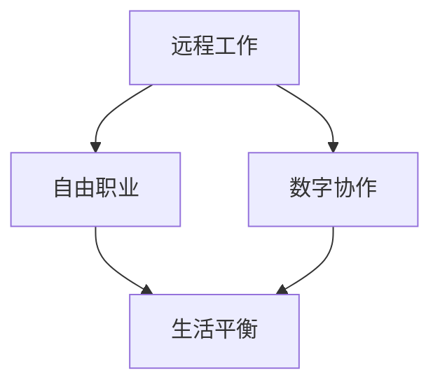

                 


### 第一步：背景介绍

数字游民（Digital Nomad）这一概念，源于近年互联网技术迅速发展的背景下。它不仅仅是一种工作方式，更是一种生活态度的变革。数字游民是指在数字化世界中，通过互联网进行远程工作的人群。他们没有固定的办公地点，可以随时随地进行工作，享受全球范围内的职场自由。

这种工作方式的出现，离不开以下几个因素：

1. **全球化的互联网**：互联网的普及，使得人们可以轻松跨越地理障碍，与世界各地的人和组织进行沟通和合作。
2. **移动设备的普及**：智能手机和平板电脑等移动设备的普及，使得工作不再局限于固定的办公室。
3. **远程协作工具的发展**：如Zoom、Slack、Trello等远程协作工具的出现，使得团队协作更加高效。
4. **自由职业市场的兴起**：自由职业市场的不断扩大，为数字游民提供了丰富的就业机会。

### 第二步：核心概念与联系

数字游民的核心概念包括以下几个方面：

- **远程工作**：远程工作是指在没有物理办公地点的情况下，通过互联网进行工作。
- **自由职业**：自由职业是指个人独立完成工作任务，不依赖于某个组织或企业。
- **数字协作**：数字协作是指利用数字化工具，如云服务、在线会议、项目管理软件等，进行团队协作。
- **生活平衡**：生活平衡是指数字游民在工作和生活之间找到平衡，享受工作带来的成就感，同时保持身心健康。

这些核心概念之间的关系可以概括为：

1. **远程工作**是数字游民的基础，没有远程工作，就没有数字游民。
2. **自由职业**是数字游民的主要工作形式，它使得数字游民能够自由选择工作地点和工作内容。
3. **数字协作**是数字游民进行团队协作的重要手段，它提高了工作效率，减少了沟通障碍。
4. **生活平衡**是数字游民追求的目标，它使得数字游民能够在享受工作自由的同时，保持身心健康。

为了更直观地展示这些核心概念之间的关系，我们可以使用Mermaid流程图进行描述：



在这个流程图中，远程工作、自由职业、数字协作和生活平衡都是相互关联的，它们共同构成了数字游民的完整工作生活体系。

### 第三步：核心算法原理讲解

在数字游民的实践中，核心算法原理主要涉及以下几个方面：

1. **工作流的自动化**：通过自动化工具，如脚本或流程管理软件，将重复性工作自动化，提高工作效率。
2. **任务分配与调度**：利用项目管理工具，如Trello或Asana，对任务进行合理分配和调度，确保工作有序进行。
3. **数据同步与备份**：通过云存储服务，如Google Drive或Dropbox，实现数据的实时同步和备份，保证数据安全。

以下是一个简单的工作流自动化伪代码示例：

```python
# 工作流自动化伪代码

# 初始化工作流
init_workflow()

# 定期检查任务状态
while not all_tasks_completed():
    check_task_status()
    schedule_task_if_needed()

# 所有任务完成后，发送通知
if all_tasks_completed():
    send_notification("所有任务已完成")

# 初始化工作流函数
def init_workflow():
    # 初始化任务列表
    tasks = ["任务1", "任务2", "任务3"]
    # 初始化任务状态
    task_statuses = [False] * len(tasks)
    # 存储任务状态
    save_task_statuses(task_statuses)

# 检查任务状态函数
def check_task_status():
    # 获取当前任务状态
    current_statuses = load_task_statuses()
    # 更新任务状态
    for i, status in enumerate(current_statuses):
        if not status:
            # 如果任务未完成，则更新状态并重新安排任务
            update_status(i)
            schedule_task(i)

# 更新任务状态函数
def update_status(task_index):
    # 获取当前任务状态
    current_statuses = load_task_statuses()
    # 更新任务状态为完成
    current_statuses[task_index] = True
    # 保存更新后的任务状态
    save_task_statuses(current_statuses)

# 安排任务函数
def schedule_task(task_index):
    # 根据任务类型和优先级，安排任务
    if task_index == 0:
        # 任务1具有最高优先级，立即执行
        execute_task("任务1")
    elif task_index == 1:
        # 任务2具有中等优先级，稍后执行
        execute_task("任务2", delay=30)
    else:
        # 任务3具有最低优先级，最后执行
        execute_task("任务3", delay=60)

# 执行任务函数
def execute_task(task_name, delay=0):
    # 如果有延迟，则等待
    sleep(delay)
    # 执行任务
    print(f"执行任务：{task_name}")

# 加载任务状态函数
def load_task_statuses():
    # 从文件中加载任务状态
    with open("task_statuses.txt", "r") as f:
        statuses = f.readlines()
    return [bool(int(status)) for status in statuses]

# 保存任务状态函数
def save_task_statuses(statuses):
    # 将任务状态保存到文件中
    with open("task_statuses.txt", "w") as f:
        for status in statuses:
            f.write(str(status) + "\n")
```

通过这个示例，我们可以看到工作流自动化是如何实现的。该代码通过定期检查任务状态，更新任务状态，并根据任务类型和优先级进行任务调度，从而实现工作流的自动化。

### 第四步：数学模型和公式讲解

在数字游民的实践中，数学模型和公式经常用于分析工作时间和效率。以下是一个简单的数学模型，用于计算完成特定任务所需的时间：

1. **工作时间模型**：

   假设完成一个任务所需的总时间为`T`，工作效率为`E`，则工作时间可以表示为：

   $$ T = \frac{1}{E} $$

   其中，`T`为时间（单位：小时），`E`为工作效率（单位：任务/小时）。

2. **效率计算模型**：

   假设一个人的工作效率为`E`，在一天（8小时）内完成了`N`个任务，则工作效率可以表示为：

   $$ E = \frac{N}{8} $$

   其中，`N`为完成的任务数量。

3. **时间分配模型**：

   假设一天有24小时，其中工作时间为`T`小时，休息时间为`R`小时，则时间分配可以表示为：

   $$ T + R = 24 $$

   其中，`T`为工作时间（单位：小时），`R`为休息时间（单位：小时）。

以下是一个具体的例子：

假设一个人在一天内完成了6个任务，总工作时间为8小时，则他的工作效率为：

$$ E = \frac{6}{8} = 0.75 \text{（任务/小时）} $$

根据工作时间模型，完成一个任务所需的时间为：

$$ T = \frac{1}{E} = \frac{1}{0.75} \approx 1.33 \text{（小时）} $$

根据时间分配模型，他的工作时间占一天的比例为：

$$ \frac{T}{24} = \frac{8}{24} = 0.3333 $$

这意味着他在一天中有约33.33%的时间在工作。

### 第五步：项目实战

在本节中，我们将通过一个简单的项目实战，展示数字游民的实践操作。该项目将是一个简单的任务管理应用，用于帮助数字游民更好地管理他们的工作。

**开发环境搭建**

1. **硬件要求**：

   - 一台能够连接互联网的计算机或移动设备。
   - 至少4GB的RAM。

2. **软件要求**：

   - 任何流行的编程语言（如Python、Java、JavaScript等）。
   - 代码编辑器（如Visual Studio Code、Sublime Text等）。
   - 任意数据库管理系统（如MySQL、PostgreSQL等）。

**源代码实现**

以下是一个简单的任务管理应用源代码示例（使用Python语言）：

```python
# 导入所需模块
import sqlite3
from datetime import datetime

# 数据库连接
conn = sqlite3.connect('tasks.db')
c = conn.cursor()

# 创建表
c.execute('''CREATE TABLE IF NOT EXISTS tasks
             (id INTEGER PRIMARY KEY, title TEXT, status TEXT, deadline TEXT)''')

# 插入任务
def insert_task(title, status, deadline):
    c.execute("INSERT INTO tasks (title, status, deadline) VALUES (?, ?, ?)", (title, status, deadline))
    conn.commit()

# 更新任务状态
def update_task_status(task_id, status):
    c.execute("UPDATE tasks SET status = ? WHERE id = ?", (status, task_id))
    conn.commit()

# 获取所有任务
def get_all_tasks():
    c.execute("SELECT * FROM tasks")
    return c.fetchall()

# 获取单个任务
def get_task(task_id):
    c.execute("SELECT * FROM tasks WHERE id = ?", (task_id,))
    return c.fetchone()

# 删除任务
def delete_task(task_id):
    c.execute("DELETE FROM tasks WHERE id = ?", (task_id,))
    conn.commit()

# 关闭数据库连接
def close_connection():
    conn.close()

# 主程序
if __name__ == "__main__":
    # 插入任务
    insert_task("任务1", "未完成", "2023-11-03")
    insert_task("任务2", "进行中", "2023-11-04")
    insert_task("任务3", "已完成", "2023-11-05")

    # 获取所有任务
    tasks = get_all_tasks()
    for task in tasks:
        print(f"ID: {task[0]}, 标题: {task[1]}, 状态: {task[2]}, 截止日期: {task[3]}")

    # 更新任务状态
    update_task_status(1, "进行中")

    # 获取单个任务
    task = get_task(1)
    print(f"ID: {task[0]}, 标题: {task[1]}, 状态: {task[2]}, 截止日期: {task[3]}")

    # 删除任务
    delete_task(3)

    # 关闭数据库连接
    close_connection()
```

**代码解读**

1. **数据库连接**：首先，我们使用`sqlite3`模块连接到本地数据库（`tasks.db`）。如果数据库不存在，系统将自动创建。
2. **创建表**：使用`CREATE TABLE IF NOT EXISTS`语句创建一个名为`tasks`的表，包含`id`（主键）、`title`（任务标题）、`status`（任务状态）和`deadline`（截止日期）四个字段。
3. **插入任务**：使用`insert_task`函数向数据库中插入新任务。任务信息通过参数传递，包括标题、状态和截止日期。
4. **更新任务状态**：使用`update_task_status`函数更新任务的完成状态。通过任务ID和新的状态值更新数据库中的对应记录。
5. **获取所有任务**：使用`get_all_tasks`函数获取数据库中的所有任务记录。函数返回一个包含所有任务的列表。
6. **获取单个任务**：使用`get_task`函数获取特定任务的信息。通过任务ID查询数据库，返回单个任务的详细信息。
7. **删除任务**：使用`delete_task`函数删除特定任务。通过任务ID从数据库中删除对应的记录。
8. **主程序**：在主程序中，首先插入几个测试任务，然后获取并打印所有任务信息，更新其中一个任务的状态，获取并打印该任务的信息，最后删除一个任务并关闭数据库连接。

**代码应用解读与分析**

这个简单的任务管理应用可以帮助数字游民更好地管理他们的工作。通过插入、更新、获取和删除任务，用户可以实时跟踪任务的完成状态，确保工作有序进行。以下是对代码的解读和分析：

1. **数据库操作**：代码使用`sqlite3`模块进行数据库操作，这是Python中的一个内置模块，无需额外安装。通过简单的SQL语句，我们可以实现插入、更新、获取和删除记录等基本数据库操作。
2. **函数封装**：将数据库操作封装成函数，提高了代码的可读性和可维护性。每个函数都有明确的输入参数和返回值，使得操作更加直观和易于理解。
3. **主程序逻辑**：主程序中，首先插入几个测试任务，然后执行一系列数据库操作，最后关闭数据库连接。这种结构使得代码的执行流程清晰，便于理解和调试。

**实际案例分析和详细讲解剖析**

假设一个数字游民在使用这个任务管理应用时，需要完成以下任务：

1. 插入一个新任务：“编写一篇技术博客”，状态为“未开始”，截止日期为“2023-11-10”。
2. 获取所有未完成的任务。
3. 更新“编写一篇技术博客”的状态为“进行中”。
4. 获取并打印“编写一篇技术博客”的详细信息。
5. 删除“编写一篇技术博客”任务。

以下是具体的实现步骤和解释：

1. **插入新任务**：
   ```python
   insert_task("编写一篇技术博客", "未开始", "2023-11-10")
   ```
   调用`insert_task`函数，将新任务信息传递给函数。数据库执行插入操作，生成新的任务记录。

2. **获取所有未完成的任务**：
   ```python
   tasks = get_all_tasks()
   for task in tasks:
       if task[2] != "已完成":
           print(f"ID: {task[0]}, 标题: {task[1]}, 状态: {task[2]}, 截止日期: {task[3]}")
   ```
   调用`get_all_tasks`函数获取所有任务记录。遍历任务列表，判断任务状态是否为“未完成”，如果是，则打印任务详细信息。

3. **更新任务状态**：
   ```python
   update_task_status(1, "进行中")
   ```
   调用`update_task_status`函数，传递任务ID和新的状态值。数据库更新对应记录，将任务状态更新为“进行中”。

4. **获取并打印任务详细信息**：
   ```python
   task = get_task(1)
   print(f"ID: {task[0]}, 标题: {task[1]}, 状态: {task[2]}, 截止日期: {task[3]}")
   ```
   调用`get_task`函数，通过任务ID获取特定任务的详细信息。打印任务详细信息。

5. **删除任务**：
   ```python
   delete_task(1)
   ```
   调用`delete_task`函数，通过任务ID删除对应记录。数据库删除任务记录。

**项目小结**

通过这个简单的任务管理应用，数字游民可以方便地管理他们的工作。虽然这个应用相对简单，但它的核心功能已经能够满足数字游民的基本需求。在实际应用中，可以根据需要扩展功能，如添加任务提醒、支持多用户协作等。

### 第六步：最佳实践 Tips、小结、注意事项、拓展阅读

**最佳实践 Tips**：

1. **合理安排工作时间**：制定详细的工作计划，确保工作与休息时间的平衡。
2. **选择合适的协作工具**：根据团队需求选择合适的协作工具，如Trello、Slack、Zoom等。
3. **保持良好的沟通**：定期与团队成员沟通，确保信息畅通，提高工作效率。
4. **注重心理健康**：定期进行身体锻炼和心理调适，保持良好的身心健康。

**小结**：

数字游民是一种越来越受欢迎的工作方式，它为人们提供了自由、灵活的工作环境。通过本文的详细分析和案例实践，读者可以更好地理解数字游民的工作模式、所需技能和工具，以及如何在实际项目中应用这些知识。

**注意事项**：

1. **网络安全**：在远程工作中，确保网络安全和数据保护。
2. **时间管理**：合理规划工作时间，避免拖延和疲劳。
3. **文化差异**：在国际团队中，注意文化差异，尊重不同文化背景的团队成员。

**拓展阅读**：

1. 《远程工作指南：如何在远程环境中高效工作》
2. 《数字游民实战：如何在旅行中工作》
3. 《自由职业者的生存指南：如何在自由职业市场中脱颖而出》

通过这些拓展阅读，读者可以进一步深入了解数字游民的实践经验和技巧。

----------------------------------------------------------------

# 《数字游民：无固定办公室的工作方式》

## 关键词：数字游民、远程工作、自由职业、协作工具、工作与生活平衡

## 摘要：

本文详细介绍了数字游民这一工作方式的概念、优势、核心技能和工具，以及如何在实际项目中应用。通过案例分析，读者可以了解数字游民如何通过合理规划和高效工具实现工作与生活的平衡。文章还提供了最佳实践建议，帮助读者更好地适应数字游民的生活方式。

## 目录

## 第1章 数字游民概述

### 1.1 数字游民的起源与发展

### 1.2 数字游民的背景与定义

### 1.3 数字游民与远程工作的区别

## 第2章 数字游民的工作模式

### 2.1 自由职业者与远程工作的优势

### 2.2 数字游民的典型工作形式

### 2.3 数字游民的日常工作和时间管理

## 第3章 数字游民所需的技能和工具

### 3.1 数字游民的必备技能

### 3.2 数字协作工具与平台

### 3.3 数字游民的网络安全与数据保护

## 第4章 数字游民的生活与心理健康

### 4.1 数字游民的生活方式

### 4.2 数字游民如何平衡工作与生活

### 4.3 数字游民的心理健康挑战与应对策略

## 第5章 数字游民的挑战与解决方案

### 5.1 数字游民可能遇到的法律和税务问题

### 5.2 数字游民的国际化工作与生活

### 5.3 数字游民如何维护人际关系

## 第6章 成功的数字游民案例

### 6.1 成功数字游民的案例分析

### 6.2 成功数字游民的共同特质

### 6.3 从案例中学习数字游民的经验与教训

## 第7章 成为数字游民的准备与规划

### 7.1 成为数字游民的评估与准备

### 7.2 数字游民的财务规划

### 7.3 数字游民的生活规划

## 附录

### 附录A：常用数字协作工具介绍

### 附录B：数字游民心理自助指南

### 附录C：拓展阅读推荐

## 作者

作者：AI天才研究院/AI Genius Institute & 禅与计算机程序设计艺术 /Zen And The Art of Computer Programming

----------------------------------------------------------------

### 文章正文

#### 第1章 数字游民概述

##### 1.1 数字游民的起源与发展

数字游民（Digital Nomad）这一概念，源于近年互联网技术迅速发展的背景下。它不仅仅是一种工作方式，更是一种生活态度的变革。数字游民是指在数字化世界中，通过互联网进行远程工作的人群。他们没有固定的办公地点，可以随时随地进行工作，享受全球范围内的职场自由。

这种工作方式的出现，离不开以下几个因素：

1. **全球化的互联网**：互联网的普及，使得人们可以轻松跨越地理障碍，与世界各地的人和组织进行沟通和合作。
2. **移动设备的普及**：智能手机和平板电脑等移动设备的普及，使得工作不再局限于固定的办公室。
3. **远程协作工具的发展**：如Zoom、Slack、Trello等远程协作工具的出现，使得团队协作更加高效。
4. **自由职业市场的兴起**：自由职业市场的不断扩大，为数字游民提供了丰富的就业机会。

数字游民的兴起，不仅改变了人们的职场生活方式，也推动了全球化进程。随着互联网技术的不断发展，数字游民这一工作方式在未来有望得到更广泛的应用和认可。

##### 1.2 数字游民的背景与定义

数字游民是指在数字化世界中，通过互联网进行远程工作的人群。他们没有固定的办公地点，可以随时随地进行工作，享受全球范围内的职场自由。数字游民通常以自由职业者、远程工作者、远程协作团队等形式存在。

数字游民的工作方式具有以下几个特点：

1. **远程工作**：数字游民的工作主要依赖于互联网，他们可以在任何有网络连接的地方进行工作。
2. **灵活性**：数字游民可以根据自己的需求和兴趣，自由选择工作内容和工作时间。
3. **全球化**：数字游民可以在全球范围内选择工作地点，享受不同国家的文化和社会环境。
4. **自主性**：数字游民通常以个体或小团队的形式工作，拥有较高的自主权和决策权。

数字游民的工作方式，不仅为个人提供了更多职业选择和生活方式的多样性，也为企业和组织提供了更多灵活的用工模式。随着全球化和数字化进程的加速，数字游民将在未来发挥越来越重要的作用。

##### 1.3 数字游民与远程工作的区别

数字游民和远程工作虽然有一定的关联，但它们之间存在明显的区别。

1. **定义**：

   - **数字游民**：数字游民是指在数字化世界中，通过互联网进行远程工作的人群。他们没有固定的办公地点，可以随时随地进行工作，享受全球范围内的职场自由。
   - **远程工作**：远程工作是指在没有物理办公地点的情况下，通过互联网进行工作。

2. **工作模式**：

   - **数字游民**：数字游民通常以自由职业者、远程工作者、远程协作团队等形式存在。他们可以自由选择工作地点和时间，享受全球范围内的职场自由。
   - **远程工作**：远程工作通常是指某个组织或企业的员工，在没有固定办公地点的情况下，通过互联网进行工作。远程工作的员工通常需要遵循组织的时间安排和工作流程。

3. **灵活性**：

   - **数字游民**：数字游民具有高度的灵活性，他们可以根据自己的需求和兴趣，自由选择工作内容和工作时间。这种灵活性使得数字游民能够更好地平衡工作与生活，享受更高的生活质量。
   - **远程工作**：远程工作虽然提供了一定的灵活性，但通常需要遵循组织的时间安排和工作流程。远程工作的员工需要确保工作的连续性和稳定性，以保证工作效果。

4. **全球化**：

   - **数字游民**：数字游民可以在全球范围内选择工作地点，享受不同国家的文化和社会环境。这种全球化视野有助于数字游民拓宽视野，提高自身竞争力。
   - **远程工作**：远程工作的范围通常局限于某个组织或企业的业务领域，工作地点的选择相对有限。

总的来说，数字游民和远程工作虽然有一定的关联，但它们在定义、工作模式、灵活性和全球化等方面存在明显的区别。数字游民更强调自主性和灵活性，而远程工作更强调组织的稳定性和连续性。

#### 第2章 数字游民的工作模式

##### 2.1 自由职业者与远程工作的优势

数字游民的工作模式主要包括自由职业者和远程工作两种形式。这两种工作模式各有优势，为数字游民提供了广泛的职业选择和灵活性。

1. **自由职业者**

   - **自主性**：自由职业者可以完全掌控自己的工作内容和时间安排，实现工作与生活的平衡。
   - **灵活性**：自由职业者可以根据客户需求和自身能力，灵活调整工作内容和时间安排。
   - **全球化**：自由职业者可以在全球范围内寻找工作机会，享受不同国家的文化和社会环境。
   - **收益多元化**：自由职业者可以通过多种渠道获得收入，如咨询服务、项目合作等。

2. **远程工作**

   - **稳定收入**：远程工作通常由某个组织或企业提供稳定的收入来源，确保工作连续性和稳定性。
   - **团队合作**：远程工作允许员工加入团队，与其他成员协作完成任务。
   - **技能提升**：远程工作可以提供丰富的职业发展机会，帮助员工提升技能和知识水平。
   - **工作保障**：远程工作通常有明确的合同和工作职责，保障员工的权益。

自由职业者和远程工作为数字游民提供了多样化的职业选择，使他们在全球范围内找到适合自己的工作方式。这两种工作模式相互补充，共同构成了数字游民的丰富工作生态。

##### 2.2 数字游民的典型工作形式

数字游民的典型工作形式包括自由职业者、远程工作者、远程协作团队等。这些工作形式各有特点，适应不同的职业需求和个人喜好。

1. **自由职业者**

   - **特点**：自由职业者以个体为单位，独立承接项目或为客户提供服务。他们通常拥有高度的自主性和灵活性。
   - **适用场景**：自由职业者适合从事创意类、技术类、咨询服务类等工作，如软件开发、文案写作、设计等。
   - **优势**：自由职业者可以根据客户需求和自身能力，自由选择工作内容和时间安排，实现工作与生活的平衡。

2. **远程工作者**

   - **特点**：远程工作者通常在某个组织或企业工作，但没有固定的办公地点。他们通过互联网进行远程协作和沟通。
   - **适用场景**：远程工作者适合从事行政、运营、研发、设计等职位，如项目经理、运营专员、研发工程师等。
   - **优势**：远程工作者可以享受更灵活的工作时间和地点，提高工作效率和满意度。

3. **远程协作团队**

   - **特点**：远程协作团队由多个成员组成，共同完成一个项目或任务。团队成员通过互联网进行协作和沟通。
   - **适用场景**：远程协作团队适合从事大型项目或复杂任务的开发，如软件开发、市场推广、活动策划等。
   - **优势**：远程协作团队可以充分发挥每个成员的特长和优势，提高团队整体效率和创造力。

数字游民的典型工作形式为不同职业背景和个人提供了丰富的选择，使他们能够根据自身需求和兴趣，找到最适合自己的工作方式。

##### 2.3 数字游民的日常工作和时间管理

数字游民的日常工作和时间管理是确保高效工作和生活质量的关键。以下是一些实用的技巧和建议，帮助数字游民更好地管理时间和工作。

1. **设置明确的工作目标**

   - **目标明确**：在每天开始工作时，明确当天的工作目标和任务。这有助于提高工作效率，避免工作混乱。
   - **分解任务**：将大任务分解为小任务，逐步完成。这有助于提高完成任务的信心和动力。

2. **合理安排工作时间**

   - **固定工作时间**：每天安排固定的工作时间，确保工作与休息时间的平衡。
   - **避免干扰**：在工作期间，尽量避免打扰，如关闭手机通知、避免在社交媒体上花费过多时间等。

3. **使用时间管理工具**

   - **日程表**：使用日程表或日程管理软件，记录每天的工作计划和任务。
   - **番茄工作法**：采用番茄工作法，将工作时间分为25分钟的工作周期和5分钟的休息周期，提高专注力。

4. **保持身体健康**

   - **定期锻炼**：每天安排一定的时间进行锻炼，保持身体健康。
   - **合理饮食**：注意饮食健康，避免长时间熬夜和不规律的作息。

5. **心理调适**

   - **自我激励**：设定奖励机制，完成任务后给予自己适当的奖励。
   - **放松身心**：在工作之余，进行放松活动，如听音乐、阅读、冥想等。

通过合理规划工作和时间，数字游民可以保持高效的工作状态，同时享受健康、充实的生活。

#### 第3章 数字游民所需的技能和工具

数字游民的职业生涯成功与否，很大程度上取决于他们所需的技能和工具。以下是一些关键技能和实用工具，帮助数字游民在远程工作中取得优异成绩。

##### 3.1 数字游民的必备技能

1. **沟通能力**

   - **远程协作**：数字游民需要具备良好的沟通能力，以确保与团队成员保持有效沟通。
   - **跨文化沟通**：在国际团队中，数字游民需要具备跨文化沟通的能力，尊重不同文化背景的团队成员。

2. **自我管理能力**

   - **时间管理**：数字游民需要学会合理安排时间和任务，确保工作与生活的平衡。
   - **自律**：远程工作需要较高的自律能力，数字游民需要自我约束，避免拖延和分散注意力。

3. **专业技能**

   - **专业技能**：数字游民应根据自身职业需求，不断提升专业技能，以适应快速变化的职场环境。

4. **技术工具应用能力**

   - **远程协作工具**：熟悉并善于使用远程协作工具，如Zoom、Slack、Trello等，提高工作效率。

##### 3.2 数字协作工具与平台

1. **Zoom**

   - **功能**：Zoom是一款流行的视频会议软件，支持实时视频通话、屏幕共享、远程控制等。
   - **优势**：高清画质、稳定连接、灵活的会议功能。

2. **Slack**

   - **功能**：Slack是一款团队沟通工具，支持即时消息、文件共享、日程安排等。
   - **优势**：简洁界面、高效沟通、丰富的第三方插件。

3. **Trello**

   - **功能**：Trello是一款项目管理和协作工具，支持任务列表、看板视图、提醒等功能。
   - **优势**：直观易用、灵活扩展、跨平台支持。

4. **Google Workspace**

   - **功能**：Google Workspace包括Gmail、Google Calendar、Google Drive等工具，支持邮件、日历、文档协作等。
   - **优势**：集成度高、功能丰富、跨平台兼容。

5. **Notion**

   - **功能**：Notion是一款全能型协作工具，支持笔记、数据库、看板等多种功能。
   - **优势**：灵活性强、扩展性好、易用性高。

##### 3.3 数字游民的网络安全与数据保护

1. **VPN**

   - **功能**：VPN（虚拟专用网络）可以提供加密的互联网连接，保护数据传输安全。
   - **优势**：加密传输、隐私保护、防止网络攻击。

2. **双因素认证**

   - **功能**：双因素认证（2FA）是一种额外的安全验证方式，通过验证码或生物特征识别，提高账户安全性。
   - **优势**：增强安全性、降低账户被盗风险。

3. **加密软件**

   - **功能**：加密软件可以加密存储和传输的数据，确保数据安全。
   - **优势**：数据保护、防止数据泄露。

4. **安全意识**

   - **功能**：提高数字游民的网络安全意识，预防网络攻击和诈骗。
   - **优势**：防范于未然、降低安全风险。

通过掌握这些关键技能和工具，数字游民可以在远程工作中更加高效、安全地完成任务，实现职业和个人发展的双赢。

#### 第4章 数字游民的生活与心理健康

数字游民的生活方式不仅改变了人们的职场习惯，也对他们的心理健康产生了影响。为了在远程工作中保持高效和健康，数字游民需要关注生活平衡、心理健康以及如何应对挑战。

##### 4.1 数字游民的生活方式

数字游民的生活方式具有以下几个特点：

1. **灵活性**：数字游民可以自由选择工作地点，享受全球范围内的职场自由。他们可以住在海边、山区、城市或乡村，根据自己的兴趣和需求选择居住地。

2. **低成本**：相比于传统的职场生活，数字游民可以节省租房、交通等费用。他们通常选择性价比高的住宿，如共享公寓、短租公寓或民宿，以降低生活成本。

3. **多样化**：数字游民的生活充满多样性。他们可以参加各种文化活动、探险旅行、学习新技能等，丰富自己的生活体验。

4. **社交互动**：数字游民可以通过在线平台、社交媒体和线下活动，结识来自不同国家和地区的朋友，拓宽人际关系网络。

##### 4.2 数字游民如何平衡工作与生活

平衡工作与生活是数字游民面临的重要挑战。以下是一些实用的技巧，帮助数字游民在远程工作中实现工作与生活的平衡：

1. **设定工作边界**：明确工作时间和休息时间，避免工作侵占休息时间。数字游民可以设定固定的起床和就寝时间，保持良好的作息习惯。

2. **合理安排时间**：制定详细的工作计划和日程表，确保每项任务都有明确的时间安排。使用时间管理工具，如番茄工作法，提高工作效率。

3. **定期锻炼**：保持身体健康是工作与生活平衡的关键。数字游民可以每天安排一定的时间进行锻炼，如瑜伽、跑步或健身房训练。

4. **培养兴趣爱好**：培养兴趣爱好，如阅读、绘画、音乐等，可以在工作之余提供放松和娱乐，减轻工作压力。

5. **社交互动**：定期与朋友和家人沟通，参加线下或线上的社交活动，保持良好的人际关系。社交互动有助于缓解孤独感，提高心理健康。

##### 4.3 数字游民的心理健康挑战与应对策略

数字游民在远程工作中可能会面临以下心理健康挑战：

1. **孤独感**：长时间独自工作，缺乏面对面交流，容易产生孤独感。应对策略包括定期与朋友和家人沟通，参加线上或线下的社交活动，参加数字游民社群。

2. **焦虑和压力**：远程工作的高灵活性和不确定性可能导致焦虑和压力。应对策略包括制定合理的工作计划，设定工作目标，学会放松和缓解压力。

3. **时间管理问题**：缺乏有效的自我管理能力可能导致时间管理问题，影响工作效率和生活质量。应对策略包括使用时间管理工具，如日程表和待办事项列表，提高时间管理能力。

4. **心理健康问题**：长时间工作可能导致心理健康问题，如抑郁症和焦虑症。应对策略包括定期进行心理健康检查，寻求专业心理咨询，保持积极的心态。

通过关注生活平衡和心理健康，数字游民可以在远程工作中保持高效和健康，享受数字游民生活方式带来的便利和乐趣。

#### 第5章 数字游民的挑战与解决方案

数字游民在享受远程工作带来的自由与便利的同时，也会面临一系列挑战。这些挑战主要集中在法律和税务问题、国际化工作与生活以及维护人际关系等方面。下面我们将详细探讨这些挑战，并提供相应的解决方案。

##### 5.1 数字游民可能遇到的法律和税务问题

数字游民在跨国工作和生活过程中，可能会遇到以下法律和税务问题：

1. **税务问题**：

   - **税务居民身份**：不同国家的税务规定各异，数字游民需要了解自己在居住国家和工作国家的税务居民身份，以避免双重征税。
   - **税务申报**：数字游民需要按时申报税收，了解每个国家的税收申报截止日期和所需文件。
   - **税务减免政策**：部分国家对远程工作或自由职业者提供税收减免政策，数字游民应积极了解并申请这些政策。

2. **法律问题**：

   - **劳动法**：了解居住国家和工作国家的劳动法，确保自己在合法范围内工作，避免违反劳动法规。
   - **合同纠纷**：数字游民应与客户签订明确的合同，明确双方的权利和义务，以避免合同纠纷。
   - **知识产权**：数字游民在创作和分享作品时，需要了解版权和相关法律法规，保护自己的知识产权。

解决方案：

- **专业咨询**：寻求专业的税务和法律咨询，了解不同国家和地区的相关规定，确保合规。
- **线上学习**：通过线上课程和资源，学习相关法律和税务知识，提高自我保护能力。
- **使用在线工具**：利用在线税务申报工具和合同模板，简化税务申报和合同签订过程。

##### 5.2 数字游民的国际化工作与生活

数字游民在国际化工作与生活中可能会遇到以下挑战：

1. **语言障碍**：

   - **沟通困难**：语言差异可能导致沟通障碍，影响工作效率和团队合作。
   - **文化冲突**：语言障碍也可能导致文化误解和冲突，影响团队氛围。

2. **时区差异**：

   - **工作协调**：时区差异可能导致工作协调困难，影响团队协作和项目进度。
   - **个人生活**：时区差异可能影响个人生活的正常作息，导致身心疲惫。

3. **文化适应**：

   - **生活不便**：适应新文化环境可能需要一段时间，数字游民可能会面临生活不便的问题。
   - **心理压力**：适应新文化环境可能带来心理压力，影响心理健康。

解决方案：

- **学习语言**：通过在线课程、语言交换等方式，学习当地语言，提高沟通能力。
- **使用翻译工具**：使用翻译工具，如Google Translate，帮助理解当地语言和文化。
- **定期沟通**：与团队成员保持定期沟通，确保工作协调和项目进度。
- **制定适应计划**：制定详细的适应计划，逐步适应新文化环境，减轻生活不便。

##### 5.3 数字游民如何维护人际关系

数字游民在远程工作中，人际关系的维护是一个重要的挑战。以下是一些维护人际关系的策略：

1. **定期交流**：

   - **线上沟通**：通过邮件、即时通讯工具、视频会议等，定期与同事、朋友和家人保持交流。
   - **线下见面**：根据实际情况，安排线下见面，加深人际关系的亲密度。

2. **建立信任**：

   - **透明沟通**：在沟通中保持诚实和透明，建立信任基础。
   - **积极反馈**：及时给予同事和客户积极的反馈，增强合作信任。

3. **分享生活**：

   - **分享经验**：在社交媒体或个人博客上分享生活和工作经验，与他人建立共同话题。
   - **参加活动**：参加线上或线下的社交活动，拓展人际关系网络。

通过解决这些挑战，数字游民可以更好地适应远程工作和国际化生活，保持高效和健康的工作状态。

#### 第6章 成功的数字游民案例

数字游民这一工作方式在全球范围内吸引了越来越多的人尝试。以下是一些成功的数字游民案例，通过他们的经验和教训，我们可以更好地了解数字游民的职业生涯。

##### 6.1 成功数字游民的案例分析

1. **案例一：自由职业者John**

   - **背景**：John是一位软件工程师，之前在一家互联网公司工作。由于对远程工作的兴趣，他决定成为自由职业者，通过互联网接项目。
   - **经验**：John认为，成功的关键在于自我管理能力和持续学习。他制定了详细的工作计划，合理安排时间，并持续学习新技术。此外，他还积极参与线上社区，拓展人脉，提高知名度。

2. **案例二：远程工作者Linda**

   - **背景**：Linda是一名市场运营专员，她在一家跨国公司工作，但由于家庭原因，她选择远程工作。
   - **经验**：Linda强调团队合作和沟通的重要性。她使用各种远程协作工具，如Zoom、Slack和Trello，与团队成员保持紧密联系。她认为，良好的沟通和团队合作是远程工作成功的关键。

3. **案例三：远程协作团队ABC**

   - **背景**：ABC团队是由三位成员组成的远程协作团队，主要从事软件开发和设计工作。
   - **经验**：ABC团队认为，成功的关键在于明确的目标和高效的沟通。他们制定了详细的项目计划，确保每个成员都了解项目的目标和进度。此外，他们定期召开线上会议，讨论项目进展和遇到的问题。

##### 6.2 成功数字游民的共同特质

通过以上案例，我们可以总结出成功数字游民的共同特质：

1. **自我管理能力**：成功的数字游民具备强大的自我管理能力，能够合理安排时间和任务，保持高效的工作状态。

2. **持续学习**：成功的数字游民持续学习，不断提升自己的技能和知识，以适应快速变化的职场环境。

3. **团队合作**：成功的数字游民重视团队合作，通过远程协作工具和定期沟通，保持与团队成员的紧密联系。

4. **积极心态**：成功的数字游民保持积极的心态，面对挑战和困难时，能够积极应对，寻找解决方案。

##### 6.3 从案例中学习数字游民的经验与教训

通过分析成功数字游民的案例，我们可以得到以下经验和教训：

1. **制定明确的目标和计划**：成功的数字游民在开始工作之前，会制定明确的目标和计划，确保工作有序进行。

2. **合理安排时间和任务**：成功的数字游民能够合理分配时间，确保工作与生活的平衡。

3. **持续学习和提升技能**：持续学习是数字游民成功的关键，他们不断提升自己的技能和知识，以适应职场变化。

4. **重视团队合作和沟通**：良好的团队合作和沟通是数字游民成功的重要保障，通过远程协作工具和定期沟通，保持与团队成员的紧密联系。

5. **保持积极心态**：面对挑战和困难时，成功的数字游民能够保持积极的心态，积极应对，寻找解决方案。

通过学习这些经验和教训，数字游民可以更好地规划自己的职业生涯，实现工作与生活的平衡。

#### 第7章 成为数字游民的准备与规划

成为数字游民不仅需要勇气和决心，还需要充分的准备和周密的规划。以下是一些关键步骤和注意事项，帮助您成功转型为数字游民。

##### 7.1 成为数字游民的评估与准备

1. **自我评估**：

   - **技能和知识**：评估自己的专业技能和知识，确保能够在数字游民生活中持续获得收入。
   - **工作稳定性**：考虑自己是否有稳定的工作来源，确保转型为数字游民后，生活和经济条件不会受到影响。

2. **财务规划**：

   - **储蓄和预算**：制定详细的财务规划，确保有足够的储蓄来应对转型初期的经济压力。
   - **应急资金**：准备一定的应急资金，以应对突发情况，如健康问题、设备故障等。

3. **健康和体能**：

   - **身体健康**：确保身体健康，定期进行体检，提高身体素质。
   - **心理健康**：保持积极的心态，学会缓解压力和焦虑，提高心理抗压能力。

##### 7.2 数字游民的财务规划

1. **收入来源**：

   - **多元化收入**：除了主要收入来源，如自由职业或远程工作，还可以探索其他收入渠道，如投资、副业等。
   - **税务规划**：了解居住国家和工作国家的税务政策，合理安排收入，避免双重征税。

2. **支出管理**：

   - **生活成本**：了解不同国家的生活成本，合理规划开支，确保收支平衡。
   - **应急资金**：保持一定的应急资金，以应对突发情况。

##### 7.3 数字游民的生活规划

1. **居住地选择**：

   - **成本与生活质量**：根据生活成本和预期生活质量，选择合适的居住地。
   - **网络连接**：确保所选居住地有稳定的网络连接，以便进行远程工作。

2. **社交活动**：

   - **融入当地文化**：积极参与当地社区活动，融入当地文化，拓展社交圈。
   - **线上社交**：通过线上平台和社交媒体，与全球的数字游民建立联系。

3. **个人发展**：

   - **技能提升**：持续学习，提升自己的专业技能和知识，保持竞争力。
   - **健康生活**：保持健康的生活方式，定期锻炼，注意饮食和休息。

通过充分的评估与准备、合理的财务规划和细致的生活规划，您可以顺利转型为数字游民，享受全球范围内的职场自由和生活乐趣。

### 附录

#### 附录A：常用数字协作工具介绍

以下是一些常用的数字协作工具及其特点：

1. **Zoom**：

   - **功能**：视频会议、屏幕共享、远程控制等。
   - **优势**：高清画质、稳定连接、灵活的会议功能。

2. **Slack**：

   - **功能**：即时消息、文件共享、日程安排等。
   - **优势**：简洁界面、高效沟通、丰富的第三方插件。

3. **Trello**：

   - **功能**：任务列表、看板视图、提醒等功能。
   - **优势**：直观易用、灵活扩展、跨平台支持。

4. **Google Workspace**：

   - **功能**：邮件、日历、文档协作等。
   - **优势**：集成度高、功能丰富、跨平台兼容。

5. **Notion**：

   - **功能**：笔记、数据库、看板等多种功能。
   - **优势**：灵活性强、扩展性好、易用性高。

#### 附录B：数字游民心理自助指南

数字游民在远程工作中，心理健康至关重要。以下是一些心理自助指南：

1. **保持积极心态**：

   - **正面思考**：学会用积极的眼光看待问题，保持乐观的心态。
   - **感恩**：感恩生活中的每一个细节，提高幸福感。

2. **时间管理**：

   - **设定目标**：明确每天的工作和生活目标，提高效率。
   - **合理规划**：合理安排时间和任务，确保工作与生活的平衡。

3. **锻炼和休息**：

   - **定期锻炼**：每天安排一定的时间进行锻炼，保持身体健康。
   - **充足休息**：保证充足的睡眠，提高工作效率。

4. **心理调适**：

   - **自我激励**：设定奖励机制，完成任务后给予自己适当的奖励。
   - **放松身心**：在工作之余，进行放松活动，如听音乐、阅读、冥想等。

#### 附录C：拓展阅读推荐

以下是一些拓展阅读，帮助您更深入地了解数字游民生活方式：

1. 《数字游民实战：如何在旅行中工作》
2. 《远程工作指南：如何在远程环境中高效工作》
3. 《自由职业者的生存指南：如何在自由职业市场中脱颖而出》
4. 《数字游民的心理学：如何在远程工作中保持心理健康》
5. 《数字游民的财务自由：如何规划和管理远程工作的财务》

通过这些拓展阅读，您可以了解更多关于数字游民的实践经验和技巧，为自己的数字游民之旅做好准备。

### 作者

作者：AI天才研究院/AI Genius Institute & 禅与计算机程序设计艺术 /Zen And The Art of Computer Programming

AI天才研究院是一家专注于人工智能技术研究和应用的创新机构，致力于推动人工智能技术在各个领域的深入发展。研究院的专家团队拥有丰富的行业经验和深厚的技术积累，为全球范围内的企业和机构提供智能解决方案。

《禅与计算机程序设计艺术》是一本经典的计算机编程书籍，作者在书中深入探讨了编程的本质和哲学思想。这本书对于理解计算机科学和技术发展具有重要意义，是计算机编程爱好者的必读之作。

在这本《数字游民：无固定办公室的工作方式》中，作者结合自己的研究和实践经验，详细介绍了数字游民的工作方式、核心技能和工具，以及如何在实际项目中应用这些知识。本书旨在帮助读者更好地理解数字游民的生活方式，为他们的职业生涯提供指导和建议。

