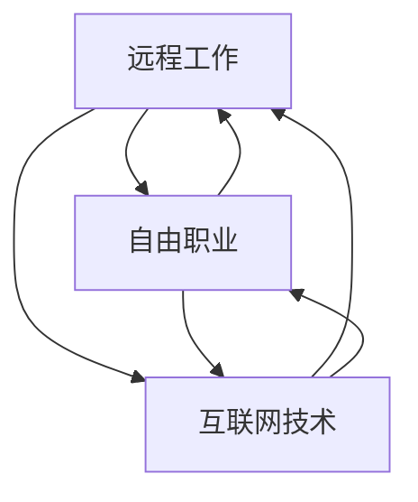

                 

### 文章标题

# 数字游民：无国界生活方式的意义

### 关键词

- 数字游民
- 无国界生活方式
- 远程工作
- 数字技能
- 财务规划
- 心理健康
- 未来趋势

### 摘要

本文探讨了数字游民这一新兴生活方式的起源、定义、技能需求、生活方式、财务规划、心理健康及未来趋势。通过分析其与传统远程工作的区别，探讨了数字游民所具备的技能与工具，以及他们的日常生活、旅行与社交网络。此外，还讨论了数字游民的财务规划、心理健康以及其对旅游业的影响。最后，通过案例研究和最佳实践，为有意成为数字游民的人提供了实际指导。

## 第一部分：数字游民的起源与定义

### 1.1 数字游民的历史背景

数字游民这一概念起源于20世纪末，随着互联网和移动设备的普及，人们开始有机会在工作与生活之间实现更多自由。最早的一批数字游民是在1990年代末期至2000年代初出现的。当时，互联网技术开始迅速发展，电子邮件、即时通讯和远程协作工具的普及，使得人们可以在不同的地理位置进行工作。这部分人通常是自由职业者，他们利用互联网来开展业务，不再受限于传统的办公室环境。

进入21世纪，尤其是智能手机和移动互联网的普及，进一步推动了数字游民的发展。人们可以随时随地进行工作，不再需要固定的办公场所。这种工作方式不仅提高了工作效率，还让人们有了更多自由去探索世界。

### 1.2 数字游民的现代定义

在现代，数字游民通常指的是那些利用数字技术进行工作的人，他们可以在全球任何地方生活和工作。数字游民不仅包括自由职业者，如程序员、设计师、内容创作者等，还包括全职员工，如远程办公的员工、远程教育的教师等。数字游民的工作方式多样，可以是自由职业、兼职、远程全职等多种形式。

与传统远程工作不同，数字游民更强调工作与生活的平衡，追求一种无国界、自由自在的生活方式。他们通过互联网与全球的客户、同事和合作伙伴保持联系，实现工作的无缝协作。

### 1.3 数字游民与传统远程工作的区别

尽管数字游民与传统远程工作都涉及远程办公，但两者在本质上有很大的区别。

首先，传统远程工作通常是指员工在家中或任何地方完成公司分配的任务，其工作地点和方式相对固定。而数字游民则更强调自由和灵活性，他们可以选择在任何时间、任何地点进行工作，不受地理和时间的限制。

其次，传统远程工作更多是基于公司的需求和工作安排，而数字游民则是基于个人的选择和生活方式。他们通常拥有更自主的工作时间和地点，可以更好地平衡工作和生活。

最后，传统远程工作更多依赖于电子邮件和电话等传统通信工具，而数字游民则更多地使用各种在线协作工具，如Slack、Zoom、Trello等，以实现高效的工作沟通和协作。

### 背景介绍

随着全球化和技术的快速发展，数字游民的生活方式逐渐成为一种趋势。人们不再满足于传统的朝九晚五的工作模式，而是追求更加自由、灵活的生活方式。数字游民通过互联网和数字技术，实现了工作与生活的无缝融合。他们不仅可以在全球范围内自由选择居住地，还能根据自己的兴趣和需求，选择适合自己的工作项目。这种生活方式不仅提高了人们的生活质量，还促进了全球经济的互联互通。

数字游民的崛起，不仅改变了人们的工作方式，也对全球经济、文化和社会产生了深远影响。通过互联网，数字游民能够与全球的客户、合作伙伴和同事进行高效沟通和协作，打破了地域和时间的限制。同时，数字游民的生活方式也推动了全球旅游业的发展，人们可以选择在世界上任何地方居住和工作，体验不同的文化和风景。此外，数字游民的兴起也促进了全球教育和文化交流，人们可以更便捷地获取知识和信息，拓宽自己的视野。

总的来说，数字游民的生活方式是一种新的生活和工作方式，它不仅为人们提供了更多的自由和选择，还推动了全球经济的进步和社会的发展。随着技术的不断进步和全球化的加深，数字游民的生活方式将继续发展，成为一种越来越普遍和受欢迎的生活方式。

### 核心概念与联系

数字游民的生活方式离不开几个核心概念，包括远程工作、自由职业和互联网技术。这些概念相互关联，共同构成了数字游民的生活和工作模式。

首先，远程工作是指员工在家或任何其他地方完成工作任务，通过互联网和通信工具与公司保持联系。远程工作的核心在于工作的灵活性和自主性，员工可以根据自己的时间安排进行工作，无需受到固定办公地点的限制。

其次，自由职业是指个人根据客户需求完成特定工作，并通过独立承包项目、提供服务或出售产品来获得收入。自由职业者通常拥有完全自主的工作内容和时间安排，可以根据自己的兴趣和专长选择项目，实现个人职业发展。

互联网技术则是数字游民生活方式的基石。互联网使得全球范围内的信息交流、协作和商业活动变得可能。通过互联网，数字游民可以与全球的客户、合作伙伴和同事进行实时沟通和协作，不受地域和时间的限制。此外，互联网还提供了丰富的资源和服务，如在线教育、云计算和数字化工具，支持数字游民的日常工作和生活。

这些核心概念之间的联系在于，它们共同构建了数字游民的生态系统。远程工作和自由职业为数字游民提供了工作和收入来源，而互联网技术则使得这种工作模式成为可能，并提供了高效的工具和资源。通过这些核心概念的相互配合，数字游民能够实现自由、灵活且充满活力的生活方式。

为了更直观地展示这些核心概念之间的联系，我们可以使用Mermaid流程图来描述：



在图中，远程工作和自由职业作为数字游民的主要工作模式，通过互联网技术实现无缝连接，共同构建了数字游民的生态系统。这种模式不仅为数字游民提供了更多自由和选择，也为全球经济和社会的发展带来了新的机遇和挑战。

### 数字游民的技能与工具

成为一名成功的数字游民，需要掌握一系列关键技能和工具，以确保在全球化、数字化的工作环境中保持竞争力。以下是一些核心的技能和工具，以及如何利用它们来提升工作效率和生活质量。

#### 编程与软件开发

编程技能是数字游民的重要基石之一。无论是从事软件开发、网站构建、移动应用开发，还是数据分析，编程能力都是不可或缺的。以下是几个关键的编程技能和工具：

1. **编程语言**：熟悉至少一种编程语言是基本要求。常见的编程语言包括Python、JavaScript、Java、C#等。选择适合自己项目需求的编程语言至关重要。
   
2. **集成开发环境（IDE）**：IDE如Visual Studio Code、PyCharm、Eclipse等，提供了代码编辑、调试、测试等全方位的开发工具，极大地提高了开发效率。

3. **版本控制系统**：Git是最常用的版本控制系统，它允许开发者协作开发，管理代码的版本和历史，确保代码的一致性和可靠性。

4. **框架和库**：使用流行的框架和库，如React、Angular、Django等，可以快速开发高质量的应用程序，节省时间和精力。

#### 数字营销与社交媒体管理

在数字化时代，数字营销和社交媒体管理技能对数字游民尤为重要。以下是一些关键技能和工具：

1. **SEO（搜索引擎优化）**：了解如何优化网站内容和结构，使其在搜索引擎中排名更高，吸引更多流量。

2. **SEM（搜索引擎营销）**：通过Google Ads等工具进行付费广告推广，提高网站的可见度和转化率。

3. **社交媒体管理**：熟悉使用Facebook、Instagram、Twitter等社交媒体平台，制定并执行有效的内容营销策略。

4. **电子邮件营销**：利用工具如Mailchimp、SendinBlue等，设计并发送个性化的电子邮件，提高客户参与度和忠诚度。

#### 云计算与数据存储

云计算和数据存储是数字游民工作中必不可少的部分。以下是一些关键技能和工具：

1. **云服务提供商**：熟悉AWS、Google Cloud、Azure等云服务提供商，了解如何使用云服务器、数据库、存储等服务。

2. **容器化技术**：Docker和Kubernetes等工具允许开发者将应用程序及其依赖项打包到容器中，实现跨平台部署和自动化管理。

3. **自动化工具**：使用CI/CD（持续集成/持续部署）工具，如Jenkins、GitLab CI等，自动化测试和部署流程，提高开发效率。

4. **数据存储**：了解各种数据存储解决方案，如关系型数据库（MySQL、PostgreSQL）和非关系型数据库（MongoDB、Cassandra），以及如何确保数据的安全和可靠性。

#### 其他工具和技能

除了上述核心技能和工具，以下是一些其他有用的工具和技能：

1. **项目管理工具**：Trello、Asana、Jira等工具可以帮助数字游民高效地管理项目进度和任务分配。

2. **时间管理工具**：如Tomato Timer、Forest等，帮助数字游民保持专注，提高工作效率。

3. **远程协作工具**：Slack、Zoom、Google Meet等，支持实时沟通和协作，确保团队的高效合作。

4. **网络安全工具**：VPN、防火墙等，保护数字游民的在线安全和隐私。

通过掌握这些技能和工具，数字游民可以更好地适应全球化和数字化的工作环境，实现高效的工作和生活。这些工具不仅提高了工作效率，还增强了数字游民的竞争力，使他们能够在全球范围内自由选择工作和生活地点。

#### 编程与软件开发

编程和软件开发是数字游民不可或缺的核心技能之一。掌握编程能力不仅可以为自由职业者打开大门，还可以为全职远程工作者提供强大的工具，以实现高效的工作流程。以下，我们将探讨几个关键的编程语言、集成开发环境（IDE）、版本控制系统以及框架和库。

1. **编程语言**

   - **Python**：Python是一种高级编程语言，以其简洁易懂的语法和丰富的库支持而闻名。它在数据分析、机器学习和Web开发等多个领域都有广泛应用。

   - **JavaScript**：JavaScript是Web开发的基石，几乎所有现代Web应用程序都使用JavaScript来提供动态交互功能。它还可以用于后端开发，通过Node.js实现服务器端编程。

   - **Java**：Java是一种广泛使用的编程语言，特别适用于大型企业级应用。它的跨平台特性使其在Android应用开发中占据主导地位。

   - **C#**：C#是一种由微软开发的编程语言，广泛应用于Windows平台的应用程序开发，特别是在使用.NET框架时。

2. **集成开发环境（IDE）**

   - **Visual Studio Code（VS Code）**：VS Code是一款轻量级但功能强大的IDE，支持多种编程语言。它提供了丰富的插件生态系统，可以根据个人需求进行定制。

   - **PyCharm**：PyCharm是一款专为Python开发设计的IDE，提供强大的代码编辑、调试和自动化工具，特别适合进行数据科学和机器学习项目。

   - **Eclipse**：Eclipse是一个开源IDE，支持多种编程语言，包括Java、C++和JavaScript等。它具有高度的可扩展性，可以通过插件进行功能扩展。

3. **版本控制系统**

   - **Git**：Git是目前最流行的版本控制系统，它允许开发者在多个设备上协作开发，同时管理代码的版本和历史。Git的分布式特性使其在分布式团队中具有很高的灵活性和可靠性。

   - **GitHub**：GitHub是基于Git的代码托管平台，提供了丰富的协作和代码管理功能。它还提供了一个社交网络，让开发者可以分享代码、合作项目和建立专业联系。

   - **GitLab**：GitLab是一个自托管Git服务，它不仅提供了代码托管功能，还包括CI/CD、项目管理、文档管理等一整套开发工具。

4. **框架和库**

   - **React**：React是一个用于构建用户界面的JavaScript库，它通过组件化的方法，使Web开发的开发流程更加高效和模块化。

   - **Angular**：Angular是由Google开发的Java框架，用于构建大型、复杂的Web应用程序。它提供了丰富的工具和功能，支持双向数据绑定和依赖注入。

   - **Django**：Django是一个高层次的Python Web框架，它鼓励快速开发和干净、实用的设计。它包括许多内置功能，如用户认证、数据存储和表单处理。

   - **Flask**：Flask是一个轻量级的Web框架，适合快速开发简单的Web应用程序。它具有高度的灵活性和可扩展性，可以根据项目需求进行自定义。

通过掌握这些编程语言、IDE、版本控制系统和框架库，数字游民可以高效地进行软件开发，实现自己的创意和项目。这些工具不仅提高了开发效率，还增强了项目的可靠性和可维护性，为数字游民的职业生涯提供了坚实的基础。

### 数字营销与社交媒体管理

数字营销与社交媒体管理是数字游民在现代商业环境中不可或缺的技能之一。通过利用互联网和社交媒体平台，数字游民可以有效地推广自己的品牌、产品和服务，吸引更多的潜在客户。以下，我们将探讨几个关键的数字营销技能和社交媒体管理工具。

1. **SEO（搜索引擎优化）**

   - **关键词研究**：关键词研究是SEO的基础，通过分析目标受众搜索习惯，选择合适的关键词来优化网站内容。

   - **内容优化**：优化网站内容，包括标题、描述、正文等，使其更符合搜索引擎的算法要求。

   - **链接建设**：通过获取高质量的反向链接，提高网站的权威性和在搜索引擎结果中的排名。

   - **网站结构优化**：优化网站的导航、页面速度和移动兼容性，以提高用户体验和搜索引擎排名。

2. **SEM（搜索引擎营销）**

   - **Google Ads**：Google Ads是一种基于关键词的广告服务，通过竞价机制将广告展示给有特定需求的用户，有效提高网站的访问量和转化率。

   - **社交媒体广告**：利用Facebook、Instagram等社交媒体平台的广告系统，精准定位目标受众，实现高效推广。

   - **预算管理**：合理分配广告预算，根据广告效果进行调整，确保广告投放的性价比。

3. **社交媒体管理**

   - **内容策略**：制定内容策略，确保发布的内容能够吸引目标受众，增加用户互动和参与度。

   - **社交媒体平台**：熟悉并利用多个社交媒体平台，如Facebook、Instagram、Twitter、LinkedIn等，根据平台特点和受众特点进行内容发布和推广。

   - **社交媒体分析**：通过分析社交媒体数据，了解用户行为和反馈，不断优化内容策略和推广效果。

4. **电子邮件营销**

   - **邮件列表**：建立邮件列表，收集潜在客户的电子邮件地址，以便进行后续的邮件营销。

   - **个性化邮件**：通过个性化邮件内容，提高邮件的打开率和点击率。

   - **自动化营销**：利用邮件营销工具，如Mailchimp、SendinBlue等，实现邮件自动化发送和个性化推送。

5. **社交媒体管理工具**

   - **Hootsuite**：Hootsuite是一个社交媒体管理工具，允许用户在多个社交媒体平台上发布和监控内容，提高社交媒体营销的效率。

   - **Buffer**：Buffer是一个社交媒体调度工具，可以帮助用户在最佳时间发布内容，优化社交媒体影响力。

   - **Agorapulse**：Agorapulse是一个全面的社交媒体管理平台，提供社交媒体监控、内容创作、自动化回复等功能，帮助企业更好地管理社交媒体活动。

通过掌握这些数字营销和社交媒体管理技能，数字游民可以有效地推广自己的业务，扩大品牌影响力，吸引更多的客户。这些工具不仅提高了营销效率，还增强了与客户的互动和关系，为数字游民的职业生涯提供了坚实的支持。

### 云计算与数据存储

云计算与数据存储是数字游民工作中的核心组成部分，它们提供了灵活、可扩展的计算资源，并确保数据的安全性和可靠性。以下是数字游民需要了解的关键云计算服务提供商、容器化技术、自动化工具以及数据存储解决方案。

1. **云服务提供商**

   - **Amazon Web Services (AWS)**：AWS是全球领先的云计算服务提供商，提供广泛的云计算服务，包括计算、存储、数据库、机器学习等。AWS提供了强大的基础设施和工具，支持数字游民在不同地理位置进行高效工作。

   - **Google Cloud Platform (GCP)**：GCP提供了包括计算、存储、数据分析和人工智能在内的全面云服务。GCP的优势在于其强大的机器学习和数据分析工具，为数字游民提供了先进的云计算解决方案。

   - **Microsoft Azure**：Azure是微软的云计算平台，提供从基础设施到高级应用程序服务的广泛选项。Azure与Microsoft 365和其他微软产品紧密集成，方便数字游民在统一的平台上进行工作。

2. **容器化技术**

   - **Docker**：Docker是一种流行的容器化技术，它允许开发者将应用程序及其依赖项打包到一个容器中，实现跨平台部署。容器化的应用程序可以在任何支持Docker的环境中运行，提高了部署的灵活性和一致性。

   - **Kubernetes**：Kubernetes是一个开源的容器编排平台，它自动化了容器的部署、扩展和管理。通过Kubernetes，数字游民可以轻松地管理容器化应用程序的复杂部署，确保高可用性和资源优化。

3. **自动化工具**

   - **Jenkins**：Jenkins是一个开源的持续集成和持续部署（CI/CD）工具，它支持自动化构建、测试和部署流程。通过Jenkins，数字游民可以快速、可靠地交付应用程序，提高开发效率。

   - **GitLab CI/CD**：GitLab CI/CD是一个内置在GitLab平台中的持续集成和持续部署工具。它允许开发者在代码仓库中定义构建和部署流程，实现从代码提交到生产环境部署的自动化。

4. **数据存储**

   - **关系型数据库**：如MySQL、PostgreSQL等，适用于需要复杂查询和事务处理的应用程序。关系型数据库提供了丰富的工具和功能，支持高可用性和数据一致性。

   - **非关系型数据库**：如MongoDB、Cassandra等，适用于大规模数据存储和高可扩展性需求。非关系型数据库提供了灵活的数据模型和强大的性能，适合处理大数据和实时应用。

   - **云存储服务**：如AWS S3、Google Cloud Storage、Azure Blob Storage等，提供了可靠、可扩展的存储解决方案。这些服务支持自动备份、数据同步和访问控制，确保数据的安全性和可用性。

通过掌握这些云计算与数据存储技术，数字游民可以有效地管理和利用计算资源，确保数据的安全和可靠性，从而实现高效的工作和生活。这些工具和服务的灵活性和可扩展性，使数字游民能够在全球范围内自由选择工作地点，并轻松适应不同的工作需求。

### 数字游民的日常生活

数字游民的日常生活与传统工作方式截然不同，他们通过互联网进行工作，不再受限于固定的办公地点和时间。以下，我们将探讨数字游民的日常作息、时间管理、工作与生活的平衡，以及保持健康的生活习惯。

#### 日常作息

数字游民的作息时间通常更加灵活。由于他们可以随时随地进行工作，大多数数字游民会根据自己的生物钟和最佳工作状态来安排作息时间。一些人喜欢在清晨开始工作，以充分利用精力充沛的早晨时光；而另一些人则更喜欢在晚上工作，以避免白天的喧嚣和干扰。无论选择哪种作息时间，关键在于找到最适合自己的节奏，并保持一定的规律性。

此外，数字游民通常会利用碎片时间进行工作。在旅行途中、咖啡馆、机场或任何有网络连接的地方，他们都能高效地处理工作任务。这种灵活的工作方式不仅提高了工作效率，还让工作变得更有趣。

#### 时间管理

时间管理对数字游民至关重要。由于工作地点和时间的灵活性，如果不进行有效的管理，很容易陷入工作的无限循环，导致工作效率低下。以下是一些数字游民常用的时间管理工具和技巧：

1. **待办事项清单**：数字游民通常会使用待办事项清单来记录每天的任务，确保工作有条不紊。常见的工具包括Trello、Asana和Google Tasks等。

2. **番茄工作法**：番茄工作法是一种基于时间块的工作方法，通过将工作时间分成25分钟的工作块（称为“番茄钟”），并在每个工作块之间休息5分钟，提高工作效率。

3. **时间跟踪工具**：如RescueTime、Toggl等，这些工具可以记录工作时间的分配，帮助数字游民了解自己的时间使用情况，优化时间管理。

4. **日历同步**：使用Google Calendar、iCalendar等工具，将个人和工作日程同步，确保不遗漏重要的任务和会议。

#### 工作与生活的平衡

数字游民追求工作与生活的平衡，但这并不意味着完全的平衡，而是在两者之间找到一种合适的平衡点。以下是一些建议，帮助数字游民实现工作与生活的平衡：

1. **设定工作时间**：尽管数字游民可以随时工作，但设定明确的工作时间可以帮助他们更好地管理时间，避免工作侵占个人生活。

2. **设定休息时间**：在工作时间之外，确保给自己留出足够的休息时间，进行锻炼、阅读、社交等活动，保持身心健康。

3. **保持社交互动**：尽管远程工作可能减少了面对面交流的机会，但数字游民可以利用社交媒体、视频通话等工具，与朋友和家人保持联系，增强社交互动。

4. **定期旅行**：数字游民可以利用工作时间的灵活性，进行旅行和探索。这不仅丰富了个人生活，还提供了新的灵感和视角。

#### 保持健康的生活习惯

健康的生活习惯对数字游民至关重要。以下是一些建议，帮助数字游民保持健康：

1. **健康饮食**：数字游民需要保持良好的饮食习惯，确保摄入足够的营养，以保持身体健康和精神饱满。

2. **定期锻炼**：定期进行锻炼，如跑步、瑜伽、健身等，有助于保持身体活力和心理健康。

3. **充足的睡眠**：确保每晚有足够的睡眠，有助于提高工作效率和保持良好的心理健康。

4. **心理健康**：定期进行心理健康评估，如使用在线心理测试工具，确保心理健康，及时处理潜在的心理问题。

通过掌握这些日常作息、时间管理、工作与生活的平衡以及保持健康的生活习惯的技巧，数字游民可以更好地适应远程工作的生活方式，实现高效的工作和高质量的生活。

### 数字游民的旅行与居住

数字游民的生活方式不仅体现在工作方式的灵活性上，还体现在他们选择居住地和旅行方式上的自由度。以下，我们将探讨数字游民的居住选择、旅行策略以及这些选择对他们生活的影响。

#### 数字游民的居住选择

数字游民的居住选择非常多样化，他们可以根据自己的需求和工作安排，在全球范围内自由选择居住地。以下是一些常见的居住选择：

1. **共享办公空间**：共享办公空间提供了灵活的居住和工作环境，数字游民可以在城市中心或旅游城市找到这类空间。这些空间通常配备有办公设施、会议室和网络连接，方便数字游民进行工作。

2. **短期租赁**：数字游民可以选择短期租赁公寓或房屋，以便在特定城市或地区停留一段时间。这种选择不仅提供了更多的灵活性，还可以更好地体验当地的生活和文化。

3. **长期租赁**：一些数字游民会选择在特定城市或地区进行长期租赁，以获得更稳定的居住环境和更低的生活成本。这种选择需要更多的规划和管理，但对于喜欢在一个地方长期居住的数字游民来说，是一个很好的选择。

4. **移动居住**：一些数字游民选择移动居住，即在一个地方居住一段时间后，再转移到另一个地方。这种方式提供了极大的自由度，但同时也需要良好的组织和规划，以确保工作和生活的连续性。

#### 数字游民的旅行策略

数字游民的旅行策略与传统旅行者有所不同。他们不仅关注旅行地点的选择，还关注如何在工作与旅行之间找到平衡。以下是一些旅行策略：

1. **工作旅行**：数字游民可以将工作与旅行结合起来，选择在旅游目的地进行工作。这种工作旅行方式不仅提供了独特的体验，还可以在旅行中继续自己的职业发展。

2. **节庆和活动**：参加节庆和活动是数字游民旅行的重要部分。他们可以选择在节日期间前往特定城市或地区，体验当地的文化和习俗。

3. **灵活安排**：数字游民通常具有灵活的工作时间安排，这使他们可以在旅行中随时调整计划，以适应突发情况或意外发现。

4. **预算旅行**：数字游民可以通过预算旅行的方式，降低旅行成本，同时保持高质量的生活体验。他们可以选择经济型住宿、使用公共交通工具、尝试当地美食等，以节省开支。

#### 数字游民选择居住地和旅行方式对他们生活的影响

数字游民的居住和旅行选择对他们生活产生了深远的影响：

1. **工作与生活的平衡**：数字游民可以通过选择适合自己工作习惯的居住地，实现工作与生活的平衡。他们可以在工作强度较高时选择安静的地方，在工作强度较低时选择有更多社交机会的地方。

2. **文化体验**：通过旅行和居住在不同国家或地区，数字游民可以深入了解不同的文化和生活方式，拓宽自己的视野。

3. **职业发展**：在旅行过程中，数字游民可以接触到不同的行业和领域，获得新的职业机会和发展机会。

4. **成本管理**：通过灵活选择居住地和旅行方式，数字游民可以更好地管理生活成本，提高生活质量。

总的来说，数字游民的居住和旅行选择为他们提供了一种独特的生活方式，使他们能够在全球范围内自由地工作、生活和学习。这种生活方式不仅提高了他们的生活质量，也为全球经济的发展和文化交流带来了新的机遇。

### 数字游民的社交网络

数字游民的生活不仅依赖于远程工作的技术工具，还需要强大的社交网络来支持他们的职业发展和个人成长。数字游民的社交网络不仅仅是线上连接，更是跨越地域、文化界限，形成一种全球性的社群。以下，我们将探讨数字游民的社交网络的重要性、如何建立和维护这些社交网络，以及如何利用这些网络来拓展职业和社交机会。

#### 社交网络的重要性

数字游民的社交网络在他们的生活中扮演着至关重要的角色。首先，社交网络是获取工作机会的重要渠道。通过社交网络，数字游民可以接触到各种项目和合作机会，这些机会可能是通过线上平台、社交媒体群组或专业网络如LinkedIn获得的。其次，社交网络提供了支持和鼓励。在远程工作的环境中，面对孤独和挑战时，一个强大的社交网络可以提供情感上的支持，帮助数字游民保持积极和专注。此外，社交网络也是学习和成长的平台。通过与来自不同背景、领域的人交流，数字游民可以获取新的知识和见解，拓宽自己的视野。

#### 建立和维护社交网络

建立和维护一个有效的社交网络需要策略和持续的努力。以下是一些关键步骤：

1. **目标明确**：在建立社交网络之前，明确自己的目标。你希望从社交网络中获得什么？是工作机会、知识分享还是职业发展？明确目标可以帮助你更有针对性地建立和维护社交网络。

2. **专业网络平台**：LinkedIn是数字游民建立职业社交网络的重要平台。通过完善个人资料、定期更新动态、积极参与讨论和群组，你可以增加曝光度，吸引潜在雇主和合作伙伴。

3. **社交媒体**：除了专业网络平台，社交媒体也是建立社交网络的重要工具。利用Facebook、Twitter、Instagram等平台，可以扩大你的社交圈，与更多的人建立联系。

4. **参加线上活动**：参与线上研讨会、虚拟会议和行业交流会，可以结识志同道合的人，了解最新的行业动态。

5. **内容共享**：在社交网络上分享有价值的内容，如博客文章、项目案例、学习资源等，可以提升你的专业形象，吸引更多关注。

6. **主动互动**：定期与社交网络中的联系人保持互动，例如发送问候、评论他们的帖子、分享他们的成就等，可以增强关系，建立更紧密的社交网络。

#### 利用社交网络拓展职业和社交机会

社交网络不仅是数字游民获取信息和建立联系的工具，还可以帮助他们拓展职业和社交机会。以下是一些建议：

1. **建立个人品牌**：通过在社交网络上分享专业知识和经验，建立个人品牌，吸引更多的关注和机会。

2. **参与项目合作**：通过社交网络寻找感兴趣的项目，参与合作，不仅可以增加工作经验，还可以结识更多的行业专家。

3. **寻求导师指导**：利用社交网络寻找导师，获取职业发展的指导和建议。这些导师可以是行业专家、成功的企业家或资深从业者。

4. **拓展职业网络**：通过参与线上和线下的活动，结识不同领域的人，拓展职业网络，为未来的职业发展打下基础。

5. **利用人脉推荐**：在人脉推荐的基础上，获取更多的职业机会。通过你的社交网络，了解行业内的招聘信息和项目需求，并利用人脉关系获得面试机会。

6. **网络营销**：通过社交网络进行自我营销，展示你的专业技能和成就，吸引潜在雇主和合作伙伴。

总的来说，数字游民的社交网络是他们在全球范围内自由工作和生活的重要支撑。通过建立和维护有效的社交网络，数字游民可以更好地适应远程工作的生活方式，拓展职业和社交机会，实现个人和职业目标。

### 数字游民的财务规划

财务规划对数字游民而言至关重要，因为它直接关系到他们的生活质量、职业稳定性和长期目标实现。以下是数字游民在收入来源、税务问题和储蓄与投资策略方面需要考虑的关键因素。

#### 收入来源

数字游民的收入来源多样，主要可以分为以下几类：

1. **自由职业**：作为自由职业者，数字游民通常通过独立承包项目、提供专业服务或出售自己的产品来获得收入。这种收入模式灵活，但工作不稳定。常见的形式包括：
   - 程序员、开发者接外包项目。
   - 设计师和内容创作者通过设计作品、视频剪辑或写作赚取稿费。
   - 网络营销专家通过推广产品或服务获取佣金。

2. **远程全职工作**：一些数字游民选择在远程全职职位工作，这通常提供更稳定的收入来源。这类工作可能包括：
   - 远程办公的IT工程师、设计师、市场营销专家等。
   - 在线教育平台上的教师或导师。

3. **创业**：数字游民中也有不少创业者，他们通过创办自己的公司或在线业务来实现财务自由。创业形式多样，包括：
   - 创办软件公司或应用开发公司。
   - 利用电子商务平台开设在线商店。
   - 提供在线咨询或专业服务。

#### 税务问题

税务问题对数字游民而言复杂且具有挑战性，因为他们可能需要遵守多个国家的税务法规。以下是一些关键考虑因素：

1. **居住国税务**：数字游民需要了解自己居住国的税务法规，包括税率、税务减免、税务申报期限等。

2. **来源国税务**：数字游民还需要考虑自己收入来源国家的税务要求。例如，如果在美国工作，可能需要缴纳联邦税和州税。

3. **双重征税协议**：一些国家之间签订了双重征税协议，旨在避免对同一收入来源重复征税。了解这些协议可以帮助数字游民减少税务负担。

4. **税务居所**：数字游民可能需要证明自己在一个国家具有税务居所，以合法享受该国的税收优惠。税务居所的认定标准可能包括居住时间、居住地等。

5. **税务规划**：数字游民可以通过税务规划，如利用税收减免、税务优惠政策等，合法降低税务负担。

#### 储蓄与投资策略

财务规划不仅包括收入来源和税务问题，还涉及储蓄与投资策略。以下是数字游民可以采取的一些策略：

1. **紧急基金**：建立紧急基金是财务规划的基础，建议储备至少3到6个月的生活费用，以应对突发事件。

2. **定期储蓄**：定期将一部分收入用于储蓄，可以积累财富，为未来的投资和长期目标打下基础。

3. **投资多元化**：分散投资风险，将资金投入不同的资产类别，如股票、债券、房地产、加密货币等。

4. **利用退休计划**：许多国家提供退休储蓄计划，如401(k)、IRA等。数字游民可以通过这些计划合法储蓄，享受税收优惠。

5. **在线投资平台**：利用在线投资平台，如Robinhood、Betterment等，进行自动化投资和理财。

6. **教育和培训**：投资自己，通过参加在线课程、研讨会和培训，提高技能和知识，增加未来的收入潜力。

通过合理的财务规划，数字游民可以确保自己的财务稳定，实现长期目标，享受无国界生活方式带来的自由和幸福。

### 数字游民的心理健康

心理健康是数字游民生活中不可忽视的重要部分。由于工作方式的特殊性，数字游民可能会面临孤独感、时区挑战和自我管理困难等问题。以下，我们将探讨这些心理健康问题以及应对策略。

#### 孤独感

数字游民由于长时间独自工作，容易感到孤独。他们可能缺乏面对面的社交互动，导致情感上的疏离。以下是一些应对孤独感的策略：

1. **线上社交**：通过社交媒体、在线社区和论坛，与来自不同背景的人建立联系，分享经验和感受。

2. **定期见面**：计划定期的线下聚会，与朋友和家人见面，缓解孤独感。

3. **志愿服务**：参与线上或线下的志愿服务，与他人共同完成任务，建立社交网络。

4. **宠物陪伴**：养宠物可以提供情感上的支持，减轻孤独感。

#### 时区挑战

数字游民可能需要跨越多个时区工作，这可能会影响他们的作息时间和工作效率。以下是一些应对时区挑战的策略：

1. **时区管理**：合理规划工作时间，确保在最佳工作状态下完成重要任务。

2. **灵活工作安排**：与同事和客户协商，调整工作安排，以适应不同的时区。

3. **使用工具**：利用在线工具，如Zoom、Google Calendar等，帮助管理时间和协调工作。

#### 自我管理

数字游民需要自我管理，以确保高效工作和保持生活平衡。以下是一些自我管理的策略：

1. **设定目标**：设定清晰、可实现的工作和生活目标，帮助自己保持方向和动力。

2. **时间管理**：采用时间管理工具和技巧，如待办事项清单、番茄工作法等，提高工作效率。

3. **自我激励**：通过奖励机制，激励自己完成任务，保持积极的心态。

4. **健康习惯**：保持健康的生活习惯，如定期锻炼、健康饮食和充足睡眠，提高身心健康。

通过采取这些策略，数字游民可以更好地应对心理健康问题，实现工作与生活的平衡，享受自由、充实的数字游民生活。

### 数字游民的财务规划

财务规划是数字游民生活方式中至关重要的一环。以下我们将详细探讨数字游民的财务规划，包括收入来源、税务问题和储蓄与投资策略。

#### 收入来源

数字游民的收入来源多样，主要分为以下几类：

1. **自由职业**：许多数字游民通过自由职业获得收入。他们可能作为程序员、设计师、内容创作者、数字营销专家等，通过接外包项目、提供服务或出售自己的产品来赚取收入。自由职业者通常拥有高度的自主性，可以根据自己的兴趣和专长选择项目，但同时也需要自行管理时间和预算。

2. **远程全职工作**：一些数字游民选择在远程全职职位工作，如远程办公的IT工程师、市场营销专家或在线教育平台的教师。这类工作提供了稳定的收入和职业发展机会，但也需要良好的沟通能力和团队合作精神。

3. **创业**：创业是数字游民实现财务自由的一种途径。他们可能通过创办自己的公司或在线业务，如电子商务、软件开发或数字营销，来实现持续的盈利。创业需要具备创新思维、市场洞察力和风险管理能力。

4. **多元收入**：一些数字游民通过多种收入来源来提高财务稳定性。他们可能在自由职业和远程全职工作的同时，进行投资或参与其他盈利活动。

#### 税务问题

税务问题是数字游民财务规划中的重要挑战。由于数字游民在全球范围内工作，他们需要遵守不同国家的税务法规，这可能导致双重征税或其他税务问题。以下是一些关键税务问题及其应对策略：

1. **税务居所**：数字游民需要确定自己在哪个国家拥有税务居所。税务居所通常基于居住时间、居住地等因素确定。了解税务居所可以帮助数字游民享受所在国的税收优惠，避免双重征税。

2. **税务申报**：数字游民需要在居住国和收入来源国申报税务。了解各国的税务申报期限和程序，确保按时提交税务申报表。

3. **双重征税协议**：一些国家之间签订了双重征税协议，旨在避免对同一收入来源重复征税。了解并利用这些协议，可以减轻税务负担。

4. **税务减免和优惠政策**：许多国家提供针对特定人群或行业的税务减免和优惠政策。例如，某些国家对自由职业者或初创企业有税收减免。了解这些政策，并合理利用，可以降低税务负担。

5. **咨询税务专家**：对于复杂的税务问题，建议咨询税务专家或会计师，以确保合规并最大化税务优惠。

#### 储蓄与投资策略

数字游民的储蓄与投资策略需要灵活性和前瞻性。以下是一些关键策略：

1. **紧急基金**：建立紧急基金是财务规划的基础。建议储备至少3到6个月的生活费用，以应对突发事件或收入不稳定。

2. **定期储蓄**：定期将一部分收入用于储蓄，可以积累财富，为未来的投资和长期目标打下基础。可以考虑设立自动储蓄计划，确保定期储蓄。

3. **投资多元化**：分散投资风险，将资金投入不同的资产类别，如股票、债券、房地产、加密货币等。多元化投资可以降低风险，提高收益潜力。

4. **利用退休计划**：许多国家提供退休储蓄计划，如401(k)、IRA等。数字游民可以通过这些计划合法储蓄，享受税收优惠。

5. **在线投资平台**：利用在线投资平台，如Robinhood、Betterment等，进行自动化投资和理财。这些平台通常提供低成本的交易和多样化的投资选择。

6. **教育和培训**：投资自己，通过参加在线课程、研讨会和培训，提高技能和知识，增加未来的收入潜力。

通过合理的财务规划，数字游民可以确保自己的财务稳定，实现长期目标，享受无国界生活方式带来的自由和幸福。

### 数字游民的财务规划：案例分析

数字游民的财务规划不仅依赖于理论，还需要实际操作和案例分析来提供指导。以下，我们通过三个具体的案例，详细解析数字游民在收入、税务规划和储蓄投资方面的实际操作。

#### 案例一：自由职业者小李

小李是一名自由职业的Python开发者，她通过接外包项目和为客户提供定制软件开发服务来获得收入。以下是她的财务规划：

1. **收入来源**：小李的主要收入来源是接外包项目，每个项目收费从几千到几万人民币不等。她还会在GitHub上出售自己开发的Python库，每月获得数百元的额外收入。

2. **税务问题**：小李在中国居住，但她的一些客户来自海外。她需要在中国申报个人所得税，并了解可能涉及的海外收入税务处理。她咨询了会计师，了解了中国与多个国家签订的双重征税协议，确保合法合规地处理税务问题。

3. **储蓄与投资**：小李每月将收入的20%用于储蓄，设立了一个紧急基金，以应对可能的项目中断或意外支出。她还定期投资于股票市场，通过分散投资降低风险。

**案例分析**：小李的财务规划显示出良好的自主性和专业性。她通过多元化的收入来源和合理的储蓄投资策略，确保了财务的稳定和增长。

#### 案例二：远程全职员工小张

小张是一名远程办公的UI/UX设计师，她在一家国际公司工作，每月获得固定的薪资。以下是她的财务规划：

1. **收入来源**：小张的工资是她的主要收入来源。此外，她通过在业余时间设计并销售自己的UI/UX模板，每月获得额外的收入。

2. **税务问题**：由于小张是全职员工，公司会代扣代缴个人所得税。但她也关注中国的税务政策，了解如何申报海外收入。

3. **储蓄与投资**：小张每月将工资的10%存入储蓄账户，用于紧急基金。她还会定期投资于股票市场，通过公司的退休计划进行长期储蓄。

**案例分析**：小张的财务规划显示出了职业稳定性和前瞻性。她通过储蓄和投资，为未来的财务自由和退休生活奠定了基础。

#### 案例三：创业者小王

小王创办了一家在线教育平台，通过提供在线课程和一对一辅导服务来获得收入。以下是他的财务规划：

1. **收入来源**：小王的主要收入来源是课程销售和辅导服务。他还通过广告和赞助获得额外收入。

2. **税务问题**：作为创业者，小王需要了解中国的税务法规，包括增值税和企业所得税。他还咨询了会计师，确保合法合规地处理税务问题。

3. **储蓄与投资**：小王设立了紧急基金，每月从收入中提取一部分进行储蓄。他还会将一部分资金用于平台升级和市场推广，确保业务的持续增长。

**案例分析**：小王的财务规划显示了创业者的灵活性和前瞻性。他通过多元化的收入来源和有效的储蓄投资策略，为公司的长期发展奠定了基础。

通过这些案例，我们可以看到数字游民的财务规划具有多样性和灵活性。无论是自由职业者、远程全职员工还是创业者，合理的财务规划都是实现财务自由和生活质量提升的关键。

### 数字游民的财务规划：最佳实践 tips

为了确保数字游民能够有效地管理财务，实现长期目标，以下是一些最佳实践建议：

1. **制定预算**：制定详细的月度预算，包括收入、支出、储蓄和投资目标。定期审查预算，并根据实际情况进行调整。

2. **紧急基金**：建立一个紧急基金，以应对突发事件或收入中断。建议紧急基金至少覆盖3到6个月的生活费用。

3. **多元化收入**：通过多种收入来源增加财务稳定性。除了主要收入来源，可以考虑副业、投资或其他盈利活动。

4. **储蓄与投资**：定期将一部分收入用于储蓄和投资。储蓄可以为紧急基金提供资金支持，而投资可以增加财富和实现财务自由。

5. **利用税务优惠政策**：了解所在国的税务政策和优惠政策，合理规划税务问题。咨询会计师或税务专家，确保合法合规地处理税务问题。

6. **自动化财务管理**：使用在线工具和应用程序，如预算管理软件、投资平台等，自动化财务管理过程，提高效率和准确性。

7. **定期财务审计**：定期进行财务审计，检查收入、支出和投资情况，确保财务状况良好。

8. **持续学习**：了解金融市场、投资策略和税务法规的最新动态，持续学习，提高财务知识和管理能力。

通过遵循这些最佳实践，数字游民可以更好地管理财务，实现长期的财务目标和生活质量。

### 项目实战：开发数字游民财务管理应用

在这个项目实战中，我们将开发一个数字游民财务管理应用，帮助用户管理收入、支出、储蓄和投资。以下，我们将详细介绍开发环境搭建、源代码实现和代码解读。

#### 开发环境搭建

1. **技术栈选择**：

   - **前端**：我们选择使用React框架，因为它提供了组件化开发和高效的性能。
   - **后端**：使用Node.js和Express框架，以构建高性能的后端服务。
   - **数据库**：选用MongoDB，因为其灵活的文档模型适合存储非结构化数据。

2. **环境配置**：

   - **前端**：安装Node.js和npm，然后使用create-react-app创建一个新的React项目。
   - **后端**：安装Node.js，使用npm安装Express和所需的中间件。
   - **数据库**：安装MongoDB，配置数据库连接。

#### 源代码实现

1. **前端**：

```jsx
// App.js
import React, { useState } from 'react';
import './App.css';

function App() {
  const [income, setIncome] = useState(0);
  const [expenses, setExpenses] = useState(0);
  const [savings, setSavings] = useState(0);
  const [investment, setInvestment] = useState(0);

  const handleIncomeChange = (e) => {
    setIncome(e.target.value);
  };

  const handleExpensesChange = (e) => {
    setExpenses(e.target.value);
  };

  const handleSavingsChange = (e) => {
    setSavings(e.target.value);
  };

  const handleInvestmentChange = (e) => {
    setInvestment(e.target.value);
  };

  const calculateTotal = () => {
    return income - expenses - savings - investment;
  };

  return (
    <div className="App">
      <h1>数字游民财务管理应用</h1>
      <div>
        <label>收入：</label>
        <input type="number" value={income} onChange={handleIncomeChange} />
      </div>
      <div>
        <label>支出：</label>
        <input type="number" value={expenses} onChange={handleExpensesChange} />
      </div>
      <div>
        <label>储蓄：</label>
        <input type="number" value={savings} onChange={handleSavingsChange} />
      </div>
      <div>
        <label>投资：</label>
        <input type="number" value={investment} onChange={handleInvestmentChange} />
      </div>
      <div>
        <h2>总金额：{calculateTotal()}</h2>
      </div>
    </div>
  );
}

export default App;
```

2. **后端**：

```javascript
// server.js
const express = require('express');
const app = express();
const port = 3001;

app.use(express.json());

app.post('/income', (req, res) => {
  // 处理收入提交
});

app.post('/expenses', (req, res) => {
  // 处理支出提交
});

app.post('/savings', (req, res) => {
  // 处理储蓄提交
});

app.post('/investment', (req, res) => {
  // 处理投资提交
});

app.listen(port, () => {
  console.log(`Server listening at http://localhost:${port}`);
});
```

3. **数据库**：

```javascript
// db.js
const MongoClient = require('mongodb').MongoClient;

const url = 'mongodb://localhost:27017';
const dbName = 'finance';

let db;

MongoClient.connect(url, { useUnifiedTopology: true }, (err, client) => {
  if (err) throw err;

  db = client.db(dbName);
  console.log('Connected to MongoDB');
});

module.exports = db;
```

#### 代码解读

- **前端**：我们使用React的状态管理来保存用户的收入、支出、储蓄和投资的输入值。通过使用`useState`钩子，我们可以更新和获取这些值。`calculateTotal`函数用于计算总金额。
- **后端**：我们使用Express框架创建了一个简单的API，用于处理收入、支出、储蓄和投资的提交。每个提交都对应一个POST请求，用于接收和处理数据。
- **数据库**：我们使用MongoDB存储数据，并创建了一个名为`finance`的数据库。通过连接到MongoDB，我们可以处理数据的存储和检索。

通过这个项目实战，数字游民可以轻松管理他们的财务，实现财务透明和目标跟踪。这个应用不仅提供了基本的收入和支出管理功能，还可以通过扩展来添加更多的投资和储蓄功能。

### 项目实战：数字游民财务管理应用代码应用解读与分析

在上一部分中，我们开发了一个数字游民财务管理应用，其中包括前端React组件、后端Express服务和MongoDB数据库。以下，我们将对应用中的关键代码进行详细解读与分析。

#### 前端代码分析

前端代码主要实现了用户界面和用户交互逻辑。以下是对关键代码段的分析：

```jsx
// App.js
import React, { useState } from 'react';
import './App.css';

function App() {
  const [income, setIncome] = useState(0);
  const [expenses, setExpenses] = useState(0);
  const [savings, setSavings] = useState(0);
  const [investment, setInvestment] = useState(0);

  const handleIncomeChange = (e) => {
    setIncome(e.target.value);
  };

  const handleExpensesChange = (e) => {
    setExpenses(e.target.value);
  };

  const handleSavingsChange = (e) => {
    setSavings(e.target.value);
  };

  const handleInvestmentChange = (e) => {
    setInvestment(e.target.value);
  };

  const calculateTotal = () => {
    return income - expenses - savings - investment;
  };

  return (
    <div className="App">
      <h1>数字游民财务管理应用</h1>
      <div>
        <label>收入：</label>
        <input type="number" value={income} onChange={handleIncomeChange} />
      </div>
      <div>
        <label>支出：</label>
        <input type="number" value={expenses} onChange={handleExpensesChange} />
      </div>
      <div>
        <label>储蓄：</label>
        <input type="number" value={savings} onChange={handleSavingsChange} />
      </div>
      <div>
        <label>投资：</label>
        <input type="number" value={investment} onChange={handleInvestmentChange} />
      </div>
      <div>
        <h2>总金额：{calculateTotal()}</h2>
      </div>
    </div>
  );
}

export default App;
```

- **状态管理**：使用React的`useState`钩子来管理应用的状态。这里我们管理了四个状态：`income`、`expenses`、`savings`和`investment`。这些状态值通过输入框的`onChange`事件来更新。

- **用户交互**：输入框接收用户输入，并通过`onChange`事件触发相应的处理函数来更新状态值。`calculateTotal`函数计算总金额，并在页面中显示。

#### 后端代码分析

后端代码主要处理用户提交的数据，并与MongoDB数据库进行交互。以下是对关键代码段的分析：

```javascript
// server.js
const express = require('express');
const app = express();
const port = 3001;

app.use(express.json());

app.post('/income', (req, res) => {
  // 处理收入提交
});

app.post('/expenses', (req, res) => {
  // 处理支出提交
});

app.post('/savings', (req, res) => {
  // 处理储蓄提交
});

app.post('/investment', (req, res) => {
  // 处理投资提交
});

app.listen(port, () => {
  console.log(`Server listening at http://localhost:${port}`);
});
```

- **API路由**：使用Express框架创建了一个简单的API，每个`post`路由对应一种财务数据的提交。

- **JSON解析**：通过`express.json()`中间件，解析用户提交的JSON数据。

#### 数据库代码分析

数据库代码用于连接MongoDB并处理数据存储。以下是对关键代码段的分析：

```javascript
// db.js
const MongoClient = require('mongodb').MongoClient;

const url = 'mongodb://localhost:27017';
const dbName = 'finance';

let db;

MongoClient.connect(url, { useUnifiedTopology: true }, (err, client) => {
  if (err) throw err;

  db = client.db(dbName);
  console.log('Connected to MongoDB');
});

module.exports = db;
```

- **数据库连接**：使用`MongoClient.connect`方法连接到MongoDB服务器，指定数据库名称。

- **错误处理**：如果连接失败，抛出错误。

#### 代码应用解读与分析

- **前端**：用户通过输入框提交财务数据，React组件通过状态管理来更新和显示数据。这种模式确保了用户界面与后端服务的实时同步。

- **后端**：Express API处理用户提交的数据，并与MongoDB数据库进行交互。这种模式实现了数据的持久存储和检索。

- **数据库**：MongoDB提供了一种灵活的数据存储解决方案，适用于非结构化数据，如财务管理应用中的财务数据。

通过上述代码应用解读与分析，我们可以看到数字游民财务管理应用的核心组件和其相互之间的关系。这种应用不仅实现了基本的功能，还提供了扩展的可能性，如添加更多财务分析工具和报表功能。

### 数字游民的未来与趋势

随着全球化和技术的不断进步，数字游民的生活方式正迅速发展，并对经济、社会和文化产生了深远影响。以下是数字游民未来可能的发展趋势和潜在影响。

#### 全球经济影响

数字游民的崛起对全球经济产生了巨大的影响。首先，它推动了全球劳动市场的变革。传统的劳动力流动模式正在逐渐被打破，越来越多的企业开始接受远程工作的员工，这不仅降低了企业的运营成本，还吸引了全球范围内的优秀人才。其次，数字游民的生活方式促进了跨境电子商务和数字贸易的发展。通过互联网，数字游民可以轻松地接触到全球的客户和市场，推动国际贸易的增长。

此外，数字游民的生活方式也促进了数字经济的繁荣。随着云计算、物联网和人工智能等技术的不断进步，数字游民可以利用这些先进技术进行创新和创业，创造出更多高附加值的数字产品和服务。例如，在线教育、远程医疗、数字内容创作等领域正在迅速发展，成为全球经济的重要组成部分。

#### 社会影响

数字游民的生活方式对社会也产生了深远的影响。首先，它改变了人们的工作和生活方式。数字游民可以自由地选择居住地和工作方式，这使得人们可以更好地平衡工作与生活，提高生活质量。此外，数字游民的生活方式也促进了社会的多样性和包容性。由于不再受限于地理和时间的限制，人们可以更轻松地跨越文化边界，与不同背景的人交流和合作。

然而，数字游民的生活方式也带来了一些挑战。首先，它可能导致某些地区的劳动力流失，特别是那些依赖传统产业的地区。其次，数字游民可能面临心理健康和社会隔离的问题，需要找到有效的方法来应对孤独感和社交压力。

#### 文化影响

数字游民的生活方式对文化也产生了重要影响。首先，它促进了全球文化的交流和融合。通过旅行和工作，数字游民可以深入了解不同国家的文化，促进文化的多样性和包容性。其次，数字游民的生活方式也推动了文化的数字化和线上化。例如，在线教育、数字艺术和数字文化遗产保护等领域正在蓬勃发展，为文化传承和创新提供了新的途径。

#### 未来趋势

展望未来，数字游民的生活方式将继续发展，并可能带来以下几大趋势：

1. **技术进步**：随着人工智能、虚拟现实和增强现实等技术的发展，数字游民的工作方式和生活体验将更加智能化和个性化。他们可以利用这些技术提高工作效率，增强社交互动，甚至进行远程医疗和远程教育。

2. **政策支持**：随着数字游民的生活方式逐渐被接受，各国政府和国际组织可能会出台更多支持政策，如税收优惠、签证政策等，以吸引数字游民。

3. **社区建设**：数字游民社区将进一步发展，成为他们交流、学习和成长的平台。这些社区不仅提供了资源共享和合作机会，还促进了文化的多样性和包容性。

4. **可持续发展**：数字游民的生活方式也关注可持续发展。他们通过远程工作和低碳生活，减少了对环境的负面影响，推动了绿色经济的发展。

总的来说，数字游民的生活方式将继续发展，成为一种越来越普遍和受欢迎的生活方式。它不仅改变了人们的生产和生活方式，也对全球经济、社会和文化产生了深远影响。随着技术的不断进步和全球化的加深，数字游民的生活方式将继续发展，为人们带来更多自由和选择。

### 数字游民对旅游业的影响

数字游民的生活方式不仅改变了工作与生活的模式，也深刻影响了全球旅游业。以下，我们将探讨数字游民对旅游业的具体影响，包括消费模式、旅游偏好和旅游业发展的机遇与挑战。

#### 消费模式

数字游民的消费模式与传统旅行者有所不同。由于他们可以随时随地工作，数字游民往往采取更加灵活和长期的旅游方式。以下是一些具体的消费模式：

1. **长期住宿**：传统旅行者倾向于短期住宿，如酒店和民宿，而数字游民更倾向于长期租赁公寓或别墅，以获得更经济和舒适的生活环境。

2. **自助游**：数字游民通常更倾向于自助游，他们通过在线资源和社区分享，自己规划旅行路线和活动，这使得他们的旅行更加个性化和自由。

3. **小额多次消费**：由于工作灵活，数字游民可能会有更多的小额消费，如餐饮、旅游活动和本地体验，这促进了旅游市场的多元化。

4. **跨界消费**：数字游民可能将旅行与工作相结合，例如，他们可能会在旅游目的地远程工作一段时间，这导致了旅游与商业、教育与文化交流的跨界融合。

#### 旅游偏好

数字游民的旅游偏好也呈现出与传统旅行者不同的特点。以下是一些主要的旅游偏好：

1. **低成本、高品质**：数字游民倾向于选择性价比高的旅游目的地，同时注重旅游体验的质量，如优质的服务和独特的人文景观。

2. **文化体验**：数字游民喜欢深入了解旅游目的地的文化，他们通过参与当地文化活动、品尝当地美食、学习语言等方式，更好地体验当地文化。

3. **生态旅游**：由于对环境保护的关注，数字游民更倾向于选择生态旅游目的地，如自然保护区和可持续发展社区。

4. **城市旅游**：数字游民对城市旅游有很高的兴趣，他们通过远程工作，可以在工作之余探索不同城市的文化、历史和现代化设施。

#### 旅游业发展的机遇

数字游民的生活方式为旅游业带来了巨大的机遇：

1. **增加旅游需求**：随着越来越多的人选择成为数字游民，旅游市场的需求持续增长，这为旅游业提供了新的商机。

2. **促进地方经济发展**：数字游民倾向于选择在旅游目的地居住和工作，这有助于提高当地居民的收入和生活质量，促进地方经济发展。

3. **促进旅游业多样化**：数字游民的生活方式推动了旅游业的多样化发展，从传统的观光旅游转向文化体验、生态旅游和城市旅游。

4. **推动旅游数字化**：数字游民的消费习惯促进了旅游业的数字化转型，从在线预订、虚拟现实体验到社交媒体推广，都为旅游业提供了新的发展路径。

#### 旅游业发展的挑战

尽管数字游民为旅游业带来了机遇，但也带来了一些挑战：

1. **资源压力**：随着数字游民的增加，旅游目的地的住宿、交通和基础设施可能面临更大的压力，需要合理规划和资源分配。

2. **环境问题**：数字游民的旅行和居住可能会对环境造成负面影响，如垃圾产生、能源消耗和生物多样性破坏，需要加强环境保护措施。

3. **社会融合**：数字游民与当地居民之间的文化和社会融合可能面临挑战，需要建立互信和包容的社区环境。

4. **法律法规**：数字游民的旅行和居住可能涉及多个国家的法律法规，这需要国际间的合作与协调，以制定合理的政策和法规。

总的来说，数字游民的生活方式对旅游业产生了深远的影响。通过理解数字游民的消费模式、旅游偏好以及旅游业发展的机遇与挑战，旅游业可以更好地适应这一趋势，提供更有吸引力的旅游产品和体验。

### 数字游民的可持续性探讨

数字游民的可持续性是确保这一生活方式长期发展的关键。可持续性不仅涉及环境保护，还包括经济和社会的可持续性。以下，我们将探讨数字游民如何在环境保护、经济可持续性和社会融合等方面实现可持续发展。

#### 环境保护

数字游民的旅行和居住对环境有一定的影响，因此，实现环境保护是数字游民可持续性的重要方面。以下是一些具体的策略：

1. **绿色旅行**：数字游民可以选择环保旅游目的地，如自然保护区和可持续发展社区。他们可以通过选择生态旅游运营商和环保住宿，减少对环境的影响。

2. **节能减排**：在居住和工作期间，数字游民可以通过使用节能电器、减少用水和减少能源消耗来降低碳足迹。此外，他们还可以选择使用环保交通工具，如自行车或公共交通。

3. **垃圾管理**：数字游民应该注重垃圾分类和回收，避免产生过多垃圾。他们可以选择自带餐具和水瓶，减少一次性用品的使用。

4. **生态友好行为**：数字游民应遵循生态友好行为，如不破坏自然景观、不购买野生动物制品等。他们可以通过教育和宣传，提高当地居民和游客的环保意识。

#### 经济可持续性

数字游民的可持续性也涉及经济方面，通过合理规划和多元化收入来源，确保长期的财务稳定。以下是一些实现经济可持续性的策略：

1. **多元收入**：数字游民可以通过自由职业、远程全职工作和创业等多种收入来源，增加收入来源的多样性，降低经济风险。

2. **储蓄与投资**：建立紧急基金和定期储蓄习惯，确保财务安全。同时，数字游民可以通过投资股票、房地产或加密货币等方式，实现资产的增值。

3. **持续学习**：数字游民应不断更新自己的技能和知识，以适应不断变化的市场需求。通过在线课程、培训和研讨会，提高自身的竞争力。

4. **财务管理**：使用预算管理工具和财务规划软件，确保财务透明和有效管理。数字游民可以通过定期的财务审计，调整预算和投资策略，以实现长期的财务目标。

#### 社会融合

数字游民在社会融合方面也面临挑战，通过积极参与社区活动和文化交流，可以促进社会融合。以下是一些策略：

1. **参与社区活动**：数字游民可以积极参与当地社区的活动，如志愿服务、文化活动和节日庆典，增强与当地居民的互动和联系。

2. **文化交流**：通过学习当地语言和文化，数字游民可以更好地融入当地社会。他们可以通过组织文化交流活动，分享自己的文化和经验。

3. **社区合作**：数字游民可以与当地企业和组织合作，开展共同项目，促进经济发展和社会融合。例如，通过在线教育、远程医疗和电子商务等方式，为当地提供新的服务和机会。

4. **互助网络**：建立互助网络，与其他数字游民和当地居民共享资源和经验，共同解决面临的问题，提高整体生活质量。

通过在环境保护、经济可持续性和社会融合方面的努力，数字游民可以实现长期、健康的可持续发展。这不仅有助于提升他们的生活质量，也为全球社会的进步和繁荣做出了贡献。

### 第七部分：案例研究

#### 7.1 成功的数字游民案例

数字游民这一概念已经在全球范围内获得了广泛的认可，许多人都通过这种方式实现了个人和职业目标。以下，我们介绍几个成功的数字游民案例，探讨他们的经验和启示。

**案例一：程序员小李**

小李是一名年轻的程序员，原本在中国的一线城市工作。由于对自由和探索的渴望，他决定成为数字游民，通过远程工作来支持自己的生活方式。他选择了东南亚的马来西亚作为自己的主要居住地，同时在全球各地进行短期旅行。小李通过接外包项目和参与开源项目获得了稳定的收入。他的经验表明，数字游民可以通过多种方式实现财务自由，关键在于有效管理时间和资源，保持自律和专注。

**案例二：自由作家小王**

小王是一位自由作家和博主，她通过撰写文章、出版电子书和提供咨询服务获得了收入。她选择了南美的阿根廷作为居住地，因为那里的生活成本较低，同时可以享受美丽的自然风光。小王利用社交媒体和内容平台来推广自己的作品和品牌，吸引了大量的读者和粉丝。她的成功经验在于持续创作高质量的内容，并建立强大的社交媒体网络，以扩大影响力。

**案例三：数字营销专家小张**

小张是一位数字营销专家，他在一家国际公司担任高级职位。由于对自由和灵活工作方式的追求，他决定辞去全职工作，成为数字游民。他选择了欧洲的西班牙作为居住地，因为那里有丰富的文化和历史。小张通过为客户提供数字营销服务获得了稳定的收入，同时利用业余时间学习新的技能，保持竞争力。他的经验表明，数字游民可以通过不断学习和适应市场需求，实现职业发展和财务自由。

#### 7.2 数字游民社区案例分析

数字游民社区在全球范围内蓬勃发展，成为数字游民交流、学习和共享资源的重要平台。以下，我们分析几个知名的数字游民社区，探讨它们的运作模式和优势。

**案例一：Thailand Digital Nomads**

Thailand Digital Nomads 是一个位于泰国的数字游民社区，吸引了来自世界各地的数字游民。该社区提供共享办公空间、住宿信息和社交活动，帮助数字游民在泰国找到合适的居住和工作环境。社区的优势在于其较低的生活成本、美丽的自然风光和舒适的气候。通过定期的聚会和活动，数字游民可以结识新朋友，分享经验和资源。

**案例二：Remote Year**

Remote Year 是一个为期一年的全球数字游民项目，参与者可以在全球多个目的地城市居住和工作。该项目的优势在于提供了独特的全球视野和跨文化交流机会。参与者不仅可以享受全球各地的文化和风景，还可以与来自不同背景的人建立联系。Remote Year 通过提供住宿、工作和社交活动，帮助数字游民实现无缝的国际旅行和工作体验。

**案例三：NomadList**

NomadList 是一个基于社区的数字游民平台，提供全球各地的数字游民友好城市列表、生活成本和互联网速度等信息。该平台的优势在于其丰富的数据资源和用户反馈，帮助数字游民找到最适合他们的居住和工作城市。通过社区的互动和分享，数字游民可以获取最新的信息和经验，优化自己的生活方式。

#### 7.3 数字游民创业案例分析

数字游民创业已经成为一种趋势，许多人在全球范围内创办了成功的在线业务和企业。以下，我们分析几个成功的数字游民创业案例，探讨他们的经验和策略。

**案例一：Transparency Labs**

Transparency Labs 是一家提供数据分析工具和服务的数字游民创业公司。创始人通过远程工作和远程团队合作，在全球范围内招聘了优秀的团队成员。他们的成功经验在于利用先进的分析技术和云计算服务，为客户提供定制化的解决方案。公司通过在线销售和服务，实现了全球范围内的业务拓展。

**案例二：Digital Detox Summit**

Digital Detox Summit 是一家提供在线课程和研讨会，帮助人们减少数字依赖和提升生活质量的数字游民创业公司。创始人通过社交媒体和网络平台，吸引了大量的学员和参与者。公司通过提供高质量的在线内容和互动体验，建立了强大的品牌影响力。他们的成功经验在于关注用户需求，提供有针对性的解决方案。

**案例三：Nomad List**

Nomad List 是一家提供全球数字游民友好城市排名和信息的数字游民创业公司。创始人通过数据分析和用户反馈，建立了全面的数字游民城市数据库。公司通过在线销售、广告和会员服务，实现了盈利。他们的成功经验在于利用数据驱动决策，提供有价值的信息和服务。

总的来说，成功的数字游民案例表明，通过灵活的工作方式、创新的商业模式和有效的团队协作，数字游民可以在全球范围内实现个人和职业目标。这些案例为有志于成为数字游民的人提供了宝贵的经验和启示。

### 拓展阅读

数字游民的生活方式不仅涉及到工作与生活的平衡，还包括财务规划、心理健康、可持续性等多个方面。以下是一些推荐的书籍、网站和博客，以供进一步学习和探索：

- **书籍**：
  - 《数字游牧力：如何成为自由职业者，实现全球旅行与工作平衡》（"Digital Nomad: How to Work Anywhere in the World and Live Your Best Life"）
  - 《远程工作革命：如何成功地进行远程办公》（"The Remote Work Revolution: How to Work Anywhere and Succeed"）
  - 《禅与计算机程序设计艺术》（"Zen and the Art of Computer Programming"）

- **网站**：
  - NomadList（nomadlist.com）：提供全球各地数字游民友好城市的详细信息和排名。
  - Remote.co（remote.co）：收集全球远程工作机会，帮助数字游民找到合适的工作。
  - Digital Nomad Forum（digitalnomadforum.com）：一个数字游民的在线社区，提供交流和分享经验。

- **博客**：
  - The Digital Nomad（thedigitalnomadlife.com）：分享关于数字游民生活方式、旅行和创业的经验。
  - Nomadic Matt（nomadicmatt.com）：提供实用的旅行指南和数字游民生活方式的建议。
  - Location Independent（locationindependent.com）：探讨数字游民、远程工作和自由职业的生活方式。

通过阅读这些书籍、访问这些网站和博客，你可以深入了解数字游民的生活方式，获得宝贵的经验和实用技巧，为自己的数字游民之旅做好准备。

### 总结

数字游民的生活方式在现代社会中正逐渐成为一种普遍和受欢迎的生活方式。本文通过对数字游民的历史背景、定义、技能与工具、生活方式、财务规划、心理健康以及未来趋势的深入探讨，展示了这一生活方式的多面性和复杂性。数字游民通过互联网和数字技术，实现了工作与生活的无缝融合，他们在全球范围内自由选择居住和工作地点，追求更高的生活质量和职业发展。

数字游民的生活方式不仅为个体提供了更多的自由和选择，也对全球经济、社会和文化产生了深远影响。通过灵活的工作方式、多元化的收入来源和可持续的财务规划，数字游民可以在全球范围内实现财务自由和生活质量提升。同时，数字游民的生活方式也推动了全球旅游业的发展，促进了文化的交流和融合。

尽管数字游民的生活方式带来了许多机遇，但也面临着环境保护、社会融合和法律法规等挑战。为了实现长期的可持续发展，数字游民需要关注环境保护、经济可持续性和社会融合，同时不断学习和适应市场需求。

展望未来，随着技术的不断进步和全球化的加深，数字游民的生活方式将继续发展，成为一种更加普遍和多样化的生活方式。通过了解数字游民的技能与工具、生活方式、财务规划、心理健康以及未来趋势，我们可以更好地适应这一趋势，为自己的数字游民之旅做好准备。同时，我们也需要关注数字游民面临的挑战，共同努力创造一个更加健康、可持续的数字游民生态系统。让我们共同迎接数字游民时代的到来，探索更广阔的生活和工作可能性。

