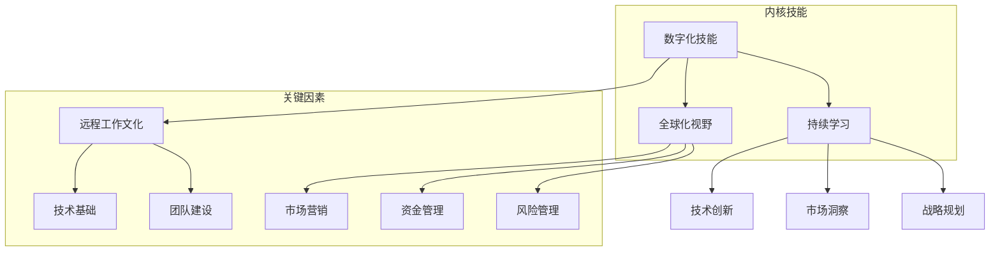

                 

# 数字游牧创业：无国界工作者的商业模式

## 关键词
- 数字游牧创业
- 无国界工作者
- 商业模式
- 技术技能
- 法律法规
- 风险管理
- 未来趋势

## 摘要
本文深入探讨数字游牧创业的概念、实践策略和未来趋势，旨在为无国界工作者提供完整的创业指南。首先，我们介绍了数字游牧创业的背景和重要性，然后详细分析了其核心概念与联系，通过Mermaid流程图展示了关键因素之间的关系。接着，我们探讨了实现无国界工作的策略，包括技能培养、个人品牌建设和工作生活方式的优化。随后，文章讲解了数字游牧创业涉及的法律法规和风险管理，并提供了成功的案例分析。最后，我们展望了数字游牧创业的未来趋势，提出了最佳实践建议，并总结了全文内容。

## 引言

### 数字游牧创业的概念
数字游牧创业，顾名思义，是指通过互联网技术，在多个国家和地区之间自由流动，以远程工作的形式实现创业目标的一种商业模式。这种创业方式不再局限于传统的办公场所，而是依赖于云计算、远程协作工具和虚拟办公室，使创业者能够打破地域限制，在全球范围内寻找机会和资源。

### 数字游牧创业的重要性
随着全球化和信息技术的迅猛发展，数字游牧创业已经成为一种不可忽视的创业趋势。它不仅为创业者提供了更多的选择和机会，还能够促进知识共享、文化多样性和经济繁荣。以下是数字游牧创业的重要性体现：

1. **灵活性**：数字游牧创业者可以根据个人喜好和工作需求，自由选择工作和生活的地点，从而实现工作与生活的平衡。
2. **资源丰富**：在全球范围内寻找合作伙伴和客户，可以接触到更多资源和市场，提高创业成功的可能性。
3. **成本效益**：无需租赁昂贵的办公空间，降低了创业的初始成本，同时也能够减少通勤时间，提高工作效率。
4. **知识共享**：通过跨国界合作，可以更容易地获取最新的技术和市场信息，促进知识共享和技能提升。
5. **文化多样性**：与来自不同文化背景的人合作，可以开阔视野，增加创新能力。

### 本书的目标和内容
本书旨在为数字游牧创业者提供全面的指南，帮助他们成功实现无国界创业。本书分为以下几个部分：

- **引言**：介绍数字游牧创业的概念和重要性。
- **理论基础**：探讨数字游牧创业的商业模式、核心概念和关键因素。
- **实践策略**：分享成功的数字游牧创业案例，讨论实现无国界工作的策略。
- **技能培养**：提供数字技能和软技能的培养方法，帮助读者提升自己的竞争力。
- **法律法规和风险管理**：介绍数字游牧创业涉及的法律法规和风险管理。
- **未来趋势**：探讨数字游牧创业的未来发展趋势和机遇。
- **案例分析**：深入分析成功的数字游牧创业案例，提供实战经验和教训。

通过以上内容的介绍，我们可以对数字游牧创业有一个整体的把握，接下来我们将深入探讨数字游牧创业的理论基础。

## 理论基础

### 数字游牧创业的商业模式

数字游牧创业的商业模式是指创业者通过远程工作，利用互联网技术和全球化资源，实现商业目标的一种方式。这种商业模式的核心特点包括：

1. **远程协作**：数字游牧创业依赖于远程协作工具，如视频会议、在线文档编辑和项目管理软件，使得团队成员可以在不同的地理位置协同工作。
2. **全球化市场**：通过互联网，数字游牧创业者可以接触到全球客户，不受地域限制，从而扩大市场范围。
3. **虚拟办公室**：虚拟办公室提供了在线办公环境，包括云存储、虚拟电话和邮件服务，使得创业者能够以低成本运营。
4. **灵活雇佣**：数字游牧创业通常采用灵活的雇佣模式，如自由职业者和远程兼职人员，根据项目需求进行招聘和分配。

### 数字游牧创业的核心概念

数字游牧创业涉及多个核心概念，这些概念相互关联，构成了创业的基础。以下是几个关键概念：

1. **数字化技能**：数字游牧创业者必须具备一系列数字化技能，如编程、数据分析、云计算和网络安全等，这些技能是他们能够远程工作的前提。
2. **远程工作文化**：远程工作文化是一种基于信任和自我管理的文化，它强调个人责任、自主性和团队协作。
3. **全球化视野**：数字游牧创业者需要具备全球化视野，了解不同国家和地区的文化、市场和法律法规，以便更好地开展国际业务。
4. **持续学习**：数字游牧创业是一个不断变化和发展的过程，创业者需要不断学习新技术、新方法和新策略，以保持竞争力。

### 数字游牧创业的关键因素

成功的数字游牧创业需要考虑多个关键因素，以下是一些重要的因素：

1. **技术基础**：创业者需要建立稳定的技术基础设施，包括高性能的计算机、可靠的互联网连接和安全的网络环境。
2. **团队建设**：建设一个高效、有凝聚力的团队对于数字游牧创业至关重要。团队成员需要具备互补的技能和共同的目标。
3. **市场营销**：有效的市场营销策略可以帮助数字游牧创业者在全球市场中脱颖而出，吸引潜在客户和合作伙伴。
4. **资金管理**：数字游牧创业通常需要较低的启动资金，但创业者仍然需要精打细算，确保资金的合理分配和有效利用。
5. **风险管理**：数字游牧创业面临多种风险，如数据安全风险、法律风险和经济风险，创业者需要制定相应的风险管理策略。

### 核心概念与联系

为了更好地理解数字游牧创业的核心概念和联系，我们可以使用Mermaid流程图来展示这些概念之间的关系。以下是数字游牧创业核心概念的Mermaid流程图：

在这个流程图中，数字化技能、远程工作文化和全球化视野构成了数字游牧创业的内核技能，这些技能与技术创新、市场洞察和战略规划等关键因素密切相关，共同支撑着数字游牧创业的实践。

通过以上对数字游牧创业的理论基础的分析，我们可以看到，数字游牧创业不仅需要技术技能，还需要对远程工作文化、全球市场和风险管理有深刻的理解。这些核心概念和关键因素共同构成了数字游牧创业的理论框架，为创业者的实践提供了指导。在接下来的部分，我们将深入探讨如何实现无国界工作，分享具体的实践策略。

### 实践策略

#### 选择适合的数字游牧职业

要实现无国界工作，首先需要选择一个适合的数字游牧职业。以下是一些适合数字游牧工作的职业类型：

1. **自由职业者**：自由职业者包括程序员、设计师、文案编辑、翻译等，他们可以利用远程协作工具和在线平台为客户提供服务。
2. **远程顾问**：远程顾问通常具有专业知识和经验，如市场营销顾问、财务顾问和人力资源顾问，他们可以通过在线咨询和视频会议提供服务。
3. **数字营销专家**：数字营销专家负责制定和执行数字营销策略，包括搜索引擎优化（SEO）、社交媒体营销和内容营销等。
4. **软件开发工程师**：软件开发工程师利用编程技能开发软件和应用程序，可以在全球范围内为不同客户提供服务。
5. **数据分析师**：数据分析师负责收集、处理和分析数据，帮助企业做出数据驱动的决策。

选择适合自己的数字游牧职业时，需要考虑以下因素：

1. **个人兴趣和技能**：选择自己感兴趣和擅长的领域，能够提高工作的满意度和工作效率。
2. **市场需求**：选择市场需求大、竞争较小的领域，可以提高找到客户和获得收入的概率。
3. **工作稳定性**：选择具有稳定工作需求的职业，如软件开发和维护、数字营销等，可以降低工作不稳定的风险。

#### 构建个人品牌和社交媒体

在数字游牧创业中，个人品牌和社交媒体至关重要。以下是一些建议来构建个人品牌和利用社交媒体：

1. **专业网站**：创建一个专业且易记的个人网站，展示自己的技能、经验和成就。网站应包含个人简介、服务目录、客户评价和联系信息。
2. **社交媒体账号**：在LinkedIn、Facebook、Twitter和Instagram等社交媒体平台上创建个人账号，定期发布相关内容，与潜在客户和同行建立联系。
3. **内容营销**：通过博客、视频和播客等渠道分享专业知识和经验，建立自己在行业中的权威性和影响力。
4. **互动与参与**：积极参与行业讨论、问答和社交活动，扩大自己的社交圈，增加曝光度。
5. **网络研讨会和直播**：组织网络研讨会和直播活动，与观众互动，展示自己的专业知识和能力。
6. **口碑营销**：通过优秀的服务和客户体验，获取客户的好评和推荐，进一步扩大自己的影响力。

#### 时间管理和工作生活方式

有效的时间管理和健康的工作生活方式对于数字游牧创业者至关重要。以下是一些建议：

1. **制定工作计划**：每天制定详细的工作计划，明确任务和时间安排，避免拖延和分散注意力。
2. **使用时间管理工具**：利用时间管理工具，如Trello、Asana和Google Calendar，来跟踪任务和日程，提高工作效率。
3. **设定工作界限**：设定明确的工作时间和休息时间，避免工作过度和影响生活质量。
4. **保持健康的生活习惯**：定期锻炼、保持良好的饮食习惯和充足的睡眠，有助于提高工作效率和保持身体健康。
5. **旅行和休息**：利用远程工作的灵活性，选择一个自己喜欢的城市或国家旅行，放松身心，激发创造力。
6. **寻求社交互动**：尽管远程工作可能缺乏面对面的社交互动，但可以通过在线社交活动和虚拟会议室与同事和朋友保持联系。

通过以上实践策略，数字游牧创业者可以更好地实现无国界工作，提高工作效率和生活质量。在接下来的部分，我们将讨论数字游牧创业所需的技能培养，帮助读者提升自己的竞争力。

### 技能培养

在数字游牧创业中，技能的培养是成功的关键。以下是一些重要的技能领域和培养方法：

#### 编程技能

编程技能是数字游牧创业的基础，无论是开发软件、构建网站还是分析数据，编程都是必不可少的。以下是一些建议来培养编程技能：

1. **选择合适的编程语言**：根据创业项目的需求，选择一种或几种适合的编程语言，如Python、JavaScript、Java或Ruby。
2. **在线编程课程**：参加在线编程课程，如Coursera、edX和Udemy等，系统学习编程基础和高级技能。
3. **实践项目**：通过实际项目来锻炼编程技能，例如开发一个简单的网页或移动应用程序。
4. **代码阅读**：阅读他人的代码，了解不同的编程风格和最佳实践，提高代码质量和效率。
5. **参与开源项目**：参与开源项目，与全球开发者合作，学习如何编写高质量、可维护的代码。

#### 数据分析技能

数据分析技能在数字游牧创业中同样重要，能够帮助创业者从大量数据中提取有价值的信息。以下是一些建议来培养数据分析技能：

1. **学习数据分析工具**：掌握常用的数据分析工具，如Excel、Tableau、Python的Pandas库和R语言。
2. **数据可视化**：学习如何将数据转换为图表和可视化报告，使数据更容易理解和解释。
3. **统计学知识**：了解基本的统计学概念和算法，如平均数、中位数、回归分析和聚类分析。
4. **在线数据分析课程**：参加在线数据分析课程，如Coursera的《数据分析：从数据中提取洞察》等。
5. **实践项目**：通过实际数据分析项目，如市场研究、用户行为分析等，应用所学技能。

#### 云计算和人工智能技能

云计算和人工智能是数字游牧创业中的新兴领域，提供了强大的工具和平台。以下是一些建议来培养这些技能：

1. **云计算平台**：熟悉主流的云计算平台，如AWS、Azure和Google Cloud Platform，了解如何部署和管理云基础设施。
2. **人工智能基础知识**：学习人工智能的基础知识，如机器学习、深度学习和自然语言处理。
3. **在线课程和认证**：参加在线课程和认证，如Coursera的《机器学习》和《深度学习》等。
4. **实际应用**：通过实际项目，如开发一个基于机器学习的应用程序，将所学知识应用于实践。
5. **开源项目和社区**：参与开源项目和人工智能社区，与同行交流和学习，不断提升自己的技能。

#### 软技能

除了技术技能，软技能在数字游牧创业中也同样重要。以下是一些建议来培养软技能：

1. **沟通能力**：学习有效沟通的技巧，如清晰表达、倾听和解决问题的能力。
2. **团队合作**：培养团队合作精神，学会在远程团队中协同工作和解决问题。
3. **自我管理**：提高自我管理能力，如时间管理、目标设定和压力应对。
4. **领导力**：学习领导力技能，如激励团队、决策和冲突管理。
5. **跨文化交际**：了解不同文化背景的交际习惯和沟通方式，提高跨文化交际能力。

通过以上技能的培养，数字游牧创业者可以提升自己的竞争力，为成功创业打下坚实基础。在接下来的部分，我们将探讨数字游牧创业涉及的法律法规和风险管理。

### 法律法规和风险管理

#### 数字游牧创业的法律问题

数字游牧创业涉及多个国家和地区的法律法规，创业者需要对这些法律问题有清晰的认识，以避免潜在的法律纠纷和风险。以下是一些常见的法律问题：

1. **税务问题**：创业者需要了解不同国家的税务制度，包括税收计算、税务申报和税务减免政策。一些国家可能对远程工作者征收较高的税收，而其他国家可能提供税收优惠。
2. **劳动合同**：与远程团队成员签订合法的劳动合同，确保双方的权利和义务明确。一些国家可能要求远程工作合同符合当地的劳动法规定。
3. **知识产权**：保护自己的知识产权，如专利、商标和版权，确保在创业过程中不侵犯他人的知识产权。
4. **数据隐私**：了解不同国家关于数据隐私的法律规定，确保在处理和存储客户数据时遵守相关法规，如欧盟的《通用数据保护条例》（GDPR）。
5. **跨边境交易**：了解跨境交易的法律法规，确保在国际业务中遵守相关法律规定，如国际贸易条例和国际支付规则。

#### 风险管理策略

数字游牧创业面临多种风险，包括技术风险、市场风险和法律风险。以下是一些有效的风险管理策略：

1. **多元化市场**：通过进入多个市场，降低单一市场波动对业务的影响。多元化市场可以分散风险，提高企业的抗风险能力。
2. **保险覆盖**：购买适当的保险，如商业保险、数据保险和责任保险，以应对可能出现的损失和风险。
3. **合规审查**：定期进行合规审查，确保企业的运营和管理符合相关法律法规的要求，避免因违规操作而引发的法律纠纷。
4. **数据备份**：定期备份重要数据和文件，确保在数据丢失或损坏时能够快速恢复。同时，确保数据存储在安全的云服务器或数据中心。
5. **应急预案**：制定应急预案，包括网络攻击、数据泄露和设备故障等，确保在发生紧急情况时能够迅速响应和解决问题。

#### 成功与失败的案例分析

为了更好地理解数字游牧创业中的法律和风险管理，以下提供两个案例：

**案例一：成功案例**

某数字游牧创业公司在全球范围内为客户提供软件开发服务。他们在进入新市场前，详细了解当地的税务和劳动法规定，并与专业律师合作制定详细的合同条款。此外，公司购买了商业保险，以应对可能出现的风险。通过有效的法律和风险管理，该公司在多个市场取得了成功，业务稳步增长。

**案例二：失败案例**

某远程数据分析公司在进入一个新市场时，未能了解当地的税务政策，导致被征收高额税款。此外，公司未能签订合法的劳动合同，导致部分员工在纠纷中处于不利地位。由于法律和风险管理不当，该公司业务受到严重影响，最终不得不退出市场。

通过以上案例分析，我们可以看到，有效的法律法规和风险管理对于数字游牧创业至关重要。在接下来的部分，我们将探讨数字游牧创业的未来趋势和机遇。

### 未来趋势

#### 技术发展趋势

随着信息技术的不断进步，数字游牧创业将在未来受到更多技术趋势的推动。以下是几个关键技术发展趋势：

1. **人工智能和机器学习**：人工智能和机器学习技术的成熟将为数字游牧创业带来更多自动化和智能化的解决方案。例如，智能客服系统可以帮助企业提高客户服务质量，自动化工具可以简化项目管理流程。
2. **区块链技术**：区块链技术提供了去中心化和安全的数据存储和交易方式，为数字游牧创业提供了新的机遇。例如，基于区块链的去中心化应用（DApps）可以提供更安全、透明的服务，减少中介成本。
3. **物联网（IoT）**：物联网技术的普及将使数字游牧创业能够更好地连接设备和传感器，实现更智能、更高效的管理。例如，智能家居设备和工业物联网可以为企业提供实时数据，优化生产和服务流程。
4. **云计算和边缘计算**：云计算和边缘计算技术的发展将提供更强大的计算能力和更灵活的部署方式。数字游牧创业者可以利用这些技术实现高效的数据处理和存储，降低运营成本。

#### 全球化对数字游牧创业的影响

全球化趋势对数字游牧创业的影响是深远且多方面的。以下是几个关键方面：

1. **市场扩张**：全球化使得数字游牧创业者能够接触到全球市场，不受地域限制。他们可以更容易地寻找客户和合作伙伴，扩大业务规模。
2. **文化多样性**：全球化带来了不同文化的交融，数字游牧创业者可以从不同文化中汲取灵感，提高创新能力和市场适应性。
3. **竞争加剧**：全球化也意味着竞争的加剧。数字游牧创业者需要不断提升自身竞争力，以在全球市场中脱颖而出。
4. **法律和监管环境**：全球化带来了复杂的法律和监管环境，数字游牧创业者需要熟悉不同国家和地区的法律法规，以确保合规运营。

#### 新兴市场的机遇

随着新兴市场的发展，数字游牧创业在这些地区也看到了巨大的机遇。以下是几个新兴市场的机遇：

1. **非洲市场**：非洲是一个人口增长迅速、互联网普及率逐渐提高的市场。数字游牧创业者可以在这个市场上提供远程服务，如软件开发、数字营销和数据分析等。
2. **东南亚市场**：东南亚地区拥有庞大的年轻人口和快速增长的经济，数字游牧创业者可以在这个市场上寻找机会，如电子商务、在线教育和移动支付等领域。
3. **中东市场**：中东地区在数字经济发展方面表现强劲，数字游牧创业者可以在这个市场上提供IT咨询、软件开发和网络安全等服务。

#### 未来趋势展望

未来，数字游牧创业将继续受到技术进步和全球化趋势的推动。以下是一些未来的趋势：

1. **去中心化工作模式**：随着区块链技术的发展，去中心化的工作模式将成为数字游牧创业的新常态。创业者可以通过去中心化平台建立团队，实现更高效的合作。
2. **个性化和定制化服务**：随着客户需求的变化，数字游牧创业者将提供更多个性化和定制化的服务，以满足不同市场的需求。
3. **可持续发展和社会责任**：数字游牧创业者将更加注重可持续发展和社会责任，通过创新和合作，推动社会进步和环境改善。

通过以上对数字游牧创业未来趋势的分析，我们可以看到，数字游牧创业不仅是一个充满机遇的领域，也是一个不断变化和发展的领域。创业者需要不断适应新的技术和市场环境，以保持竞争力。在接下来的部分，我们将通过具体案例深入探讨数字游牧创业的成功经验和教训。

### 案例分析

#### 案例一：成功案例

**公司简介**：Digital Nomad Co. 是一家全球性的数字营销公司，由两位年轻创业者创立。该公司提供包括搜索引擎优化（SEO）、社交媒体营销和内容营销在内的全方位数字营销服务。

**成功原因**：
1. **全球化视野**：Digital Nomad Co. 的创始人有着全球化的视野，他们了解到全球市场的重要性，并决定在全球范围内寻找客户。这使得公司能够迅速扩大业务，接触到更多的潜在客户。
2. **灵活的团队管理**：公司采用远程团队管理模式，充分利用了远程协作工具，如Slack、Trello和Zoom，确保团队成员能够高效合作。此外，公司还建立了明确的工作流程和沟通机制，确保项目顺利进行。
3. **技术创新**：Digital Nomad Co. 不断关注和引入最新的数字营销技术，如人工智能和大数据分析，为客户提供更优质的服务。通过技术创新，公司提高了市场竞争力，赢得了更多客户的信任。
4. **客户关系管理**：公司重视客户关系管理，通过定期沟通和反馈，了解客户需求，不断优化服务。这种客户至上的经营理念使公司在市场上建立了良好的口碑。

**启示与教训**：
- **全球化视野**：数字游牧创业者在全球市场中寻找机会，能够扩大业务范围，提高成功率。
- **灵活的管理**：远程团队管理需要建立有效的沟通和协作机制，确保团队成员能够高效合作。
- **技术创新**：持续关注和引入新技术，可以提高企业的竞争力，满足客户需求。
- **客户关系管理**：重视客户需求，建立良好的客户关系，有助于提高客户满意度和忠诚度。

#### 案例二：失败案例

**公司简介**：Tech Freelancer Services 是一家提供软件开发服务的数字游牧创业公司。公司由一位具有丰富编程经验的开发者创立，专注于为企业提供定制化的软件解决方案。

**失败原因**：
1. **法律风险**：Tech Freelancer Services 在进入新市场时，未能充分了解当地的法律法规，导致在签订合同和税务问题上出现纠纷。这不仅影响了公司的业务运营，还导致公司声誉受损。
2. **风险管理不当**：公司未能建立有效的风险管理策略，缺乏对潜在风险的预防和应对措施。在面临网络攻击和数据泄露风险时，公司未能及时采取应对措施，导致重大损失。
3. **团队稳定性**：由于缺乏有效的团队管理和激励机制，公司团队成员频繁离职，导致项目进度延误和客户满意度下降。
4. **市场定位不准确**：Tech Freelancer Services 在市场定位上存在偏差，未能准确识别目标客户群体，导致业务拓展困难。

**启示与教训**：
- **法律法规合规**：数字游牧创业者在进入新市场前，需要充分了解当地的法律法规，确保合规运营。
- **风险管理**：建立有效的风险管理策略，预防和应对潜在风险，确保业务的稳定运行。
- **团队管理**：重视团队建设和激励机制，确保团队稳定，提高工作效率和客户满意度。
- **市场定位**：准确识别目标客户群体，提供针对性的产品和服务，以提高市场竞争力。

通过以上成功和失败的案例分析，我们可以看到，数字游牧创业的成功与失败往往取决于多个因素，包括全球化视野、技术创新、法律法规合规、风险管理、团队管理和市场定位等。创业者需要全面考虑这些因素，制定有效的战略和策略，以实现数字游牧创业的成功。

### 总结

数字游牧创业作为一种新兴的商业模式，为无国界工作者提供了广阔的发展空间。本文详细探讨了数字游牧创业的概念、理论基础、实践策略、技能培养、法律法规和风险管理以及未来趋势。通过对核心概念的剖析和实践案例的深入分析，我们了解了数字游牧创业的各个方面，并从中汲取了宝贵的经验和教训。

在数字游牧创业中，选择适合的职业、构建个人品牌、培养技术技能、了解法律法规和风险管理是成功的关键。同时，灵活的时间管理和健康的工作生活方式也是确保创业成功的重要因素。未来，随着技术的不断进步和全球化趋势的加深，数字游牧创业将继续发展，为创业者带来更多的机遇。

**最佳实践建议**：
- **技术技能培养**：不断学习新技术，如人工智能、区块链和云计算，以提高竞争力。
- **法律法规合规**：深入了解不同国家和地区的法律法规，确保合规运营。
- **风险管理**：制定详细的风险管理策略，预防和应对潜在风险。
- **团队建设**：建立高效的远程团队，确保团队成员的稳定性和协作性。

**注意事项**：
- **全球市场**：了解全球市场的文化、法律和市场环境，避免文化冲突和法律纠纷。
- **客户关系**：重视客户关系管理，提供优质服务，提高客户满意度和忠诚度。

**拓展阅读**：
- 《远程工作：新时代的工作模式》
- 《全球数字化营销：策略与实践》
- 《数字游牧创业实战指南》

通过以上总结和建议，希望读者能够更好地理解数字游牧创业，并在实践中取得成功。

### 作者信息

作者：AI天才研究院/AI Genius Institute & 禅与计算机程序设计艺术 /Zen And The Art of Computer Programming

