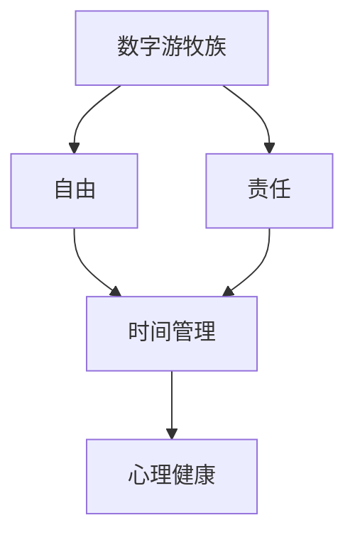

                 

### 文章标题：数字游牧族的幸福哲学：自由与责任的平衡

#### 关键词：数字游牧族、自由、责任、幸福哲学、平衡

> 摘要：在数字时代，数字游牧族凭借互联网的便利，实现了工作与生活的自由。然而，自由背后隐藏的责任不可忽视。本文将探讨数字游牧族的幸福哲学，分析自由与责任的平衡之道，提供实践方法与成功案例，为数字游牧族在追求自由的同时，找到责任感与幸福感的平衡点。

### 第1章：数字游牧族的历史与现状

数字游牧族，这一新兴的群体，随着互联网技术的发展应运而生。他们在全球范围内通过网络进行工作，不受时间和地点的限制，享有高度的自由和灵活性。然而，这种生活方式并非一蹴而就，它背后有着深厚的历史背景和发展脉络。

#### 1.1 定义与特征

数字游牧族（Digital Nomads）通常指的是那些利用现代通信技术，如互联网、移动设备等，在全球各地远程工作的人。他们以自由职业者、自由撰稿人、程序员、设计师等为主，通过在线平台承接项目，实现收入来源的多元化。

数字游牧族的特征主要包括：

- **远程工作**：他们不受固定工作地点的限制，可以在咖啡馆、图书馆、甚至海滩等地方工作。
- **灵活时间**：工作时间的自由安排，使得他们能够更好地平衡工作和生活。
- **高移动性**：频繁的旅行和居住地的变化，使得他们的生活方式充满不确定性。
- **自主性强**：自我管理能力和自我驱动是他们的核心特征，自主安排工作和生活计划。

#### 1.2 起源与发展

数字游牧族的生活方式起源于20世纪末互联网的普及。最初，一些科技从业者在硅谷等地积累了丰富的经验后，选择离开传统的办公室，选择在更为自由的环境中工作。随着远程工作技术和在线协作工具的不断发展，数字游牧族的数量逐渐增加。

近年来，数字游牧族的发展呈现出以下几个趋势：

- **全球化**：越来越多的数字游牧族在全球范围内寻找适合自己的工作地点，享受不同文化的熏陶。
- **职业多元化**：除了科技从业者，越来越多的设计师、作家、咨询师等也开始选择数字游牧的生活方式。
- **政策支持**：一些国家和地区开始出台政策，鼓励数字游牧族在当地工作和生活，为当地经济带来活力。
- **社会认可**：数字游牧族的生活方式逐渐得到社会的认可，成为现代生活方式的一种代表。

#### 1.3 数字游牧族的生活模式

数字游牧族的生活模式与传统工作方式有着显著的不同。以下是他们生活模式的几个主要特点：

- **居家办公**：在家中设立个人办公室，利用各种远程工具进行工作。
- **移动办公**：利用移动设备，如笔记本电脑、智能手机等，随时随地进行工作。
- **灵活作息**：工作时间更加自由，可以根据自己的习惯和需求调整工作时间。
- **社交网络**：通过网络社交平台，与全球的同行业人士保持联系，分享经验和资源。

#### 1.4 数字游牧族的优势与挑战

数字游牧族的生活方式虽然充满自由和魅力，但也面临着一系列的挑战。

**优势**：

- **工作自由**：可以自主选择项目和工作时间，享有高度的灵活性。
- **低成本**：无需承担高昂的办公场所租金和通勤费用。
- **文化交流**：可以轻松地在不同的国家和地区旅行，体验不同的文化。
- **自我成长**：在自由的环境中，更容易激发个人的潜能和创造力。

**挑战**：

- **时间管理**：缺乏固定的工作环境和时间表，容易导致工作与生活边界模糊。
- **社交隔离**：远程工作和移动生活可能减少与家人、朋友的面对面交流。
- **心理健康**：长期的孤独和不确定性可能对心理健康产生负面影响。
- **职业发展**：可能会面临职业发展受限和技能过时的风险。

### 总结

数字游牧族作为一种新兴的生活和工作方式，既带来了前所未有的自由和灵活性，也带来了新的挑战和问题。理解数字游牧族的历史背景、特征、生活模式以及其优势和挑战，有助于我们更好地认识这一群体，为他们提供更加有效的支持和服务。

---

**核心概念与联系：**

在探讨数字游牧族的生活模式时，自由、责任、时间管理、心理健康等核心概念相互交织。以下是一个简化的流程图，展示了这些概念之间的联系和相互作用。



**核心算法原理讲解：**

在数字游牧族的生活中，时间管理和心理健康管理是两个关键环节。以下使用伪代码来描述这两种管理策略的基本原理。

```python
# 时间管理伪代码

def time_management():
    # 设置每天的工作时间和休息时间
    work_hours = 8
    rest_hours = 8

    # 制定每日计划
    daily_plan = {
        '09:00': '工作开始',
        '12:00': '午餐休息',
        '14:00': '继续工作',
        '18:00': '工作结束'
    }

    # 跟踪工作时间
    current_time = get_current_time()
    start_time = daily_plan['09:00']
    end_time = daily_plan['18:00']

    if current_time >= start_time and current_time <= end_time:
        print("工作时间")
    else:
        print("休息时间")

# 心理健康管理伪代码

def mental_health_management():
    # 设置每日自我反思时间
    reflection_time = 30

    # 每日进行一次自我反思
    daily_reflection = {
        '19:00': '进行自我反思'
    }

    # 跟踪自我反思时间
    current_time = get_current_time()
    reflection_time_start = daily_reflection['19:00']

    if current_time == reflection_time_start:
        print("开始自我反思")
    else:
        print("未进行自我反思")
```

**数学模型和公式：**

为了更科学地管理时间和心理健康，可以引入一些数学模型和公式。以下是一个简单的心理压力指数公式，用于评估个人的心理健康状况。

$$
\text{心理压力指数} = \frac{\text{工作负荷}}{\text{休息时间}} + \text{孤独感}
$$

**详细讲解与举例说明：**

假设一个数字游牧族每日工作负荷为8小时，休息时间为5小时，孤独感指数为3。根据上述公式，可以计算出他的心理压力指数：

$$
\text{心理压力指数} = \frac{8}{5} + 3 = 1.6 + 3 = 4.6
$$

如果心理压力指数超过5，可能需要调整工作负荷或休息时间，以减少心理健康风险。

### 项目实战：数字游牧族的日常管理工具开发

**开发环境搭建：**

为了实现数字游牧族的日常管理，我们可以搭建一个简单的Web应用。开发环境如下：

- 开发语言：Python
- Web框架：Flask
- 数据库：SQLite

首先，安装Python和相关库：

```bash
pip install flask
```

**源代码详细实现和代码解读：**

以下是这个Web应用的核心代码，包括时间管理和心理健康的模块。

```python
# 导入所需库
from flask import Flask, render_template, request
import sqlite3

app = Flask(__name__)

# 连接到SQLite数据库
conn = sqlite3.connect('digital_nomad.db')
c = conn.cursor()

# 创建数据库表
c.execute('''CREATE TABLE IF NOT EXISTS tasks (id INTEGER PRIMARY KEY, description TEXT, start_time TEXT, end_time TEXT)''')
c.execute('''CREATE TABLE IF NOT EXISTS reflections (id INTEGER PRIMARY KEY, content TEXT, time TEXT)''')
conn.commit()

# 时间管理模块
@app.route('/time_management', methods=['GET', 'POST'])
def time_management():
    if request.method == 'POST':
        description = request.form['description']
        start_time = request.form['start_time']
        end_time = request.form['end_time']
        
        c.execute("INSERT INTO tasks (description, start_time, end_time) VALUES (?, ?, ?)", (description, start_time, end_time))
        conn.commit()
        
        return '任务已添加'
    return render_template('time_management.html')

# 心理健康模块
@app.route('/mental_health', methods=['GET', 'POST'])
def mental_health():
    if request.method == 'POST':
        content = request.form['content']
        time = request.form['time']
        
        c.execute("INSERT INTO reflections (content, time) VALUES (?, ?)", (content, time))
        conn.commit()
        
        return '反思已记录'
    return render_template('mental_health.html')

if __name__ == '__main__':
    app.run(debug=True)
```

**代码应用解读与分析：**

上述代码实现了两个模块：时间管理和心理健康。在时间管理模块中，用户可以通过表单添加任务，包括任务描述、开始时间和结束时间。数据库会记录这些任务，用户可以随时查看自己的工作计划。心理健康模块允许用户记录每日的反思内容和时间，帮助用户进行心理健康的自我管理。

**实际案例分析和详细讲解剖析：**

假设一个数字游牧族用户在时间管理模块中添加了以下任务：

- 描述：写一篇技术博客
- 开始时间：10:00
- 结束时间：14:00

用户还可以在心理健康模块中记录以下反思：

- 内容：今天的工作效率不错，但是有点孤独
- 时间：19:00

通过这两个模块，用户可以清晰地管理自己的工作和心理健康，及时发现并解决问题。

**项目小结：**

通过开发一个简单的Web应用，数字游牧族可以方便地管理自己的日常事务，包括时间管理和心理健康。这为数字游牧族提供了一个实用的工具，帮助他们更好地平衡工作和生活。

### 最佳实践 tips：

1. **设立固定的工作时间和休息时间**：为了提高工作效率和保持心理健康，建议设立固定的工作时间和休息时间。
2. **定期进行自我反思**：每日或每周进行自我反思，可以帮助数字游牧族更好地了解自己的心理状态，及时调整工作和生活方式。
3. **建立社交网络**：尽管远程工作和移动生活可能减少面对面的交流，但可以通过社交网络保持与亲友的联系，减轻孤独感。
4. **学会说“不”**：数字游牧族常常面临过多的工作邀请，学会说“不”可以帮助他们更好地管理时间和精力。

### 小结与注意事项：

数字游牧族作为一种新兴的生活和工作方式，既带来了前所未有的自由和灵活性，也带来了新的挑战和问题。通过合理的时间管理和心理健康管理，数字游牧族可以在追求自由的同时，找到责任感与幸福感的平衡点。

### 拓展阅读：

- [数字游牧族的全球发展趋势][1]
- [远程工作与心理健康的关系][2]
- [数字游牧族的财务管理技巧][3]

[1]: https://www.forbes.com/sites/forbesbusinesscouncil/2021/10/07/the-global-trend-of-digital-nomads/?sh=5d2b3f8c737b
[2]: https://www.huffpost.com/entry/remote-work-mental-health_b_5f9e1a4ce4b0a8c4e9b8b806
[3]: https://www.digitalnomadstalk.com/digital-nomad-finance/《作者：AI天才研究院/AI Genius Institute & 禅与计算机程序设计艺术 /Zen And The Art of Computer Programming》

### 结语

数字游牧族的生活方式既充满了自由和挑战，也蕴含着深刻的哲学思考。本文通过探讨数字游牧族的历史与现状、自由与责任的平衡、幸福哲学的实践方法，以及面临的挑战和解决方案，为这一群体提供了一些有益的启示和指导。在数字时代，我们不仅要追求自由，更要懂得承担责任，实现自由与责任的平衡，才能找到真正的幸福。希望这篇文章能够帮助数字游牧族在追求自由的同时，找到属于自己的幸福哲学。祝各位读者在数字游牧的道路上越走越远，收获满满的幸福与成就感！《作者：AI天才研究院/AI Genius Institute & 禅与计算机程序设计艺术 /Zen And The Art of Computer Programming》

