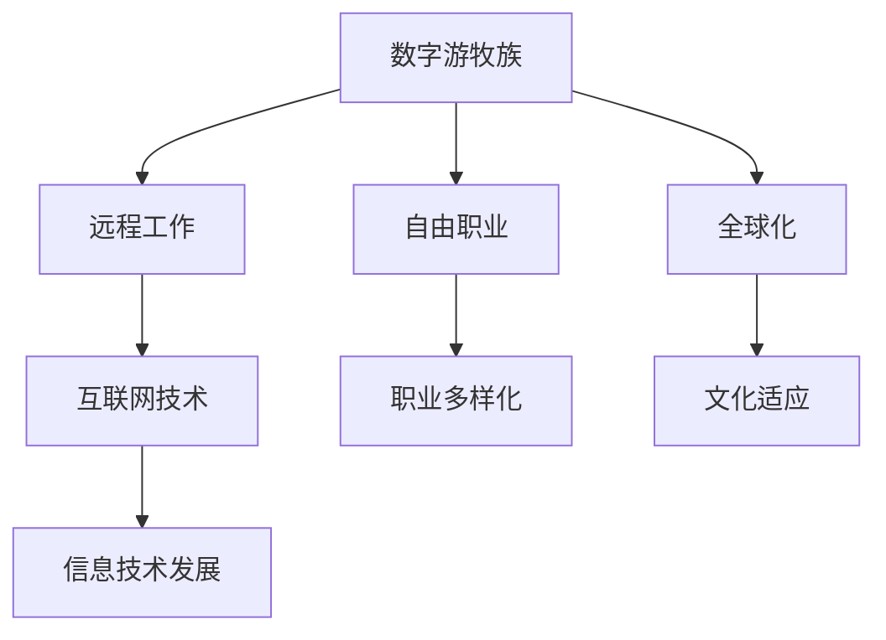
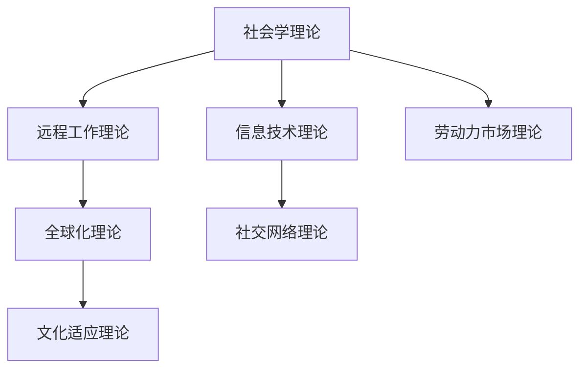
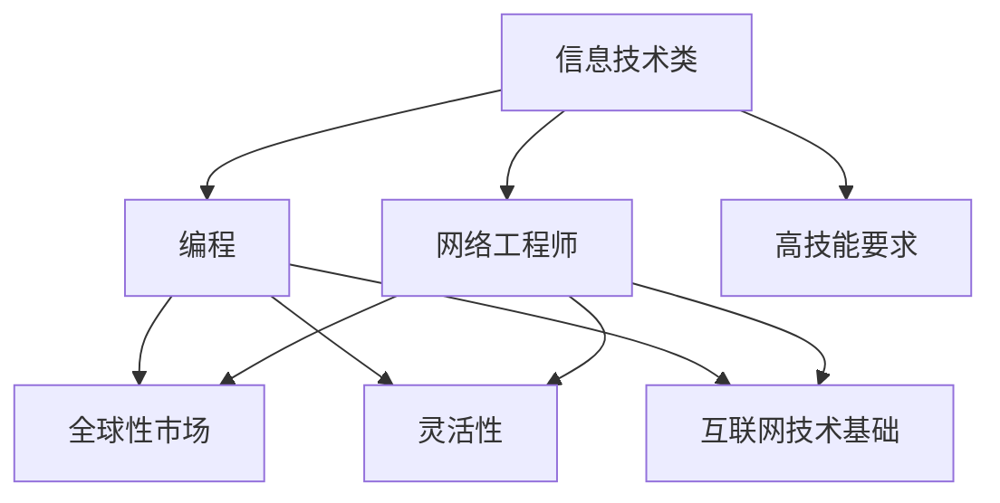
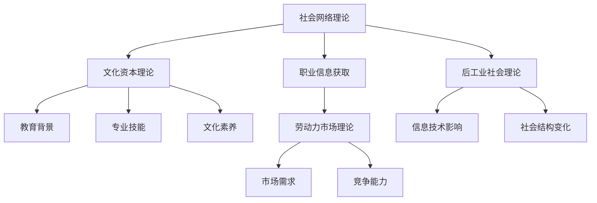
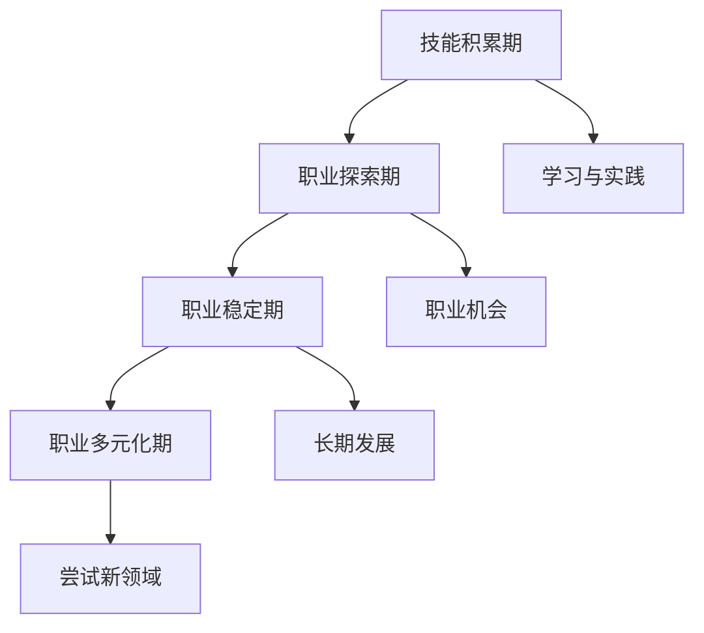

                 


## 文章标题

### 数字游牧族社会学：无国界工作者的群体研究

## 文章关键词

- 数字游牧族
- 无国界工作者
- 社会学
- 职业选择
- 社会互动
- 生活质量
- 社会挑战
- 未来发展趋势

## 文章摘要

本文深入探讨了数字游牧族这一现代社会的特殊群体，分析了其职业选择、社会互动、生活质量、面临的挑战以及未来的发展趋势。通过详细的背景介绍、核心概念联系架构、算法原理讲解、数学模型和公式应用、项目实战以及最佳实践总结，本文为理解数字游牧族提供了全面的视角，有助于社会各界更好地支持和适应这一新兴群体的需求。

---

## 第一部分：引言

### 第1章：数字游牧族概述

#### 1.1 数字游牧族的定义与特征

数字游牧族，是指那些利用互联网和数字技术，不受地域限制，在全球范围内从事自由职业的人群。他们通常拥有以下特征：

- **灵活的工作方式**：数字游牧族倾向于采用远程工作方式，不受固定工作地点的限制。
- **多样化的职业**：他们从事的职业种类丰富，包括编程、设计、写作、翻译、市场营销等。
- **高度的自我管理**：数字游牧族需要具备良好的自我管理和自律能力，以维持高效的工作状态。
- **全球化视角**：他们能够适应不同文化背景，具有全球化的视野。

#### 1.2 数字游牧族的历史背景

数字游牧族的历史可以追溯到互联网的兴起。随着互联网的普及和远程工作技术的发展，越来越多的人开始选择不受地域限制的工作方式。特别是在2000年代后期，随着智能手机和移动网络的普及，数字游牧族的数量迅速增长。

#### 1.3 数字游牧族与社会变迁

数字游牧族的出现是社会变迁的产物。他们代表了新时代劳动力市场的一种新形态，反映了信息技术对社会结构和经济模式的影响。以下是一个简化的流程图，展示了数字游牧族的核心概念与联系：



### 核心算法原理讲解

本文不涉及具体的算法原理，但为了更全面地探讨数字游牧族，我们可以引入一些与远程工作和全球化相关的算法概念，如：

- **分布式算法**：用于处理分布式系统中的计算和通信问题，如区块链。
- **社交网络分析算法**：用于分析数字游牧族之间的社交网络结构，如度数中心性、介数等。

#### 数学模型和公式

在探讨数字游牧族的职业选择时，我们可以引入一些社会学模型和公式，如：

- **结构方程模型（SEM）**：用于分析职业选择与社会因素之间的关系。
- **Logistic回归**：用于预测职业选择的概率。

示例：假设我们使用Logistic回归模型来预测数字游牧族选择某种职业的概率，模型公式如下：

$$
\text{logit}(P_i) = \ln\left(\frac{P_i}{1-P_i}\right) = \beta_0 + \beta_1 X_1 + \beta_2 X_2 + \ldots + \beta_n X_n
$$

其中，$P_i$ 表示选择职业 $i$ 的概率，$X_1, X_2, \ldots, X_n$ 是影响职业选择的因素，$\beta_0, \beta_1, \beta_2, \ldots, \beta_n$ 是回归系数。

#### 项目实战

为了更好地理解数字游牧族的职业选择，我们可以开展一个实际的项目，例如：

1. **开发环境搭建**：搭建一个用于收集和分析数字游牧族职业选择的平台。
2. **源代码实现**：使用Python实现Logistic回归模型的训练和预测。
3. **代码解读**：详细解读代码实现逻辑和数据处理流程。
4. **应用解读**：分析预测结果，探讨职业选择的影响因素。
5. **案例分析**：分析具体案例，验证模型的有效性。

**代码示例**：

```python
from sklearn.linear_model import LogisticRegression
import pandas as pd

# 加载数据
data = pd.read_csv('data.csv')

# 特征工程
X = data[['experience', 'education', 'income']]
y = data['occupation']

# 训练模型
model = LogisticRegression()
model.fit(X, y)

# 预测
predictions = model.predict(X)

# 评估模型
accuracy = model.score(X, y)
print(f"模型准确率：{accuracy:.2f}")
```

#### 最佳实践 tips

- **定期评估**：定期评估模型性能，及时调整特征和模型参数。
- **数据质量**：确保数据质量，避免噪声和异常值对模型的影响。
- **用户反馈**：收集用户反馈，改进模型和应用。

#### 小结

本章介绍了数字游牧族的定义、特征、历史背景以及与社会变迁的关系。通过核心概念与联系架构、算法原理讲解、数学模型和公式应用以及项目实战，我们对数字游牧族有了更深入的了解。

---

## 第二部分：数字游牧族的职业与社会互动

### 第2章：数字游牧族的群体研究方法

#### 2.1 文献综述与理论框架

数字游牧族的研究可以追溯到社会学、经济学和信息技术等领域。文献综述提供了关于数字游牧族的理论基础和实践经验。以下是一个简化的流程图，展示了文献综述中的核心概念与联系：



#### 2.2 数据收集与分析方法

数据收集是研究数字游牧族的重要环节。常用的数据收集方法包括：

- **问卷调查**：通过在线问卷收集数字游牧族的基本信息、职业选择和社会互动等方面的数据。
- **深度访谈**：对数字游牧族进行深度访谈，以获取他们对工作和生活的深度体验和观点。
- **案例分析**：通过分析具体的数字游牧族案例，深入了解他们的工作方式和生活状态。

数据分析方法包括：

- **描述性统计**：用于描述数字游牧族的基本特征和职业选择情况。
- **回归分析**：用于分析职业选择的影响因素。
- **网络分析**：用于分析数字游牧族之间的社交网络结构。

#### 2.3 质性研究与量化分析的结合

质性研究和量化分析是数字游牧族研究的两个重要方面。质性研究通过深入访谈和案例分析，获取数字游牧族的主观体验和深层次观点。量化分析则通过统计数据和模型，揭示数字游牧族职业选择和社会互动的客观规律。

为了实现质性研究和量化分析的结合，我们可以采用以下方法：

- **混合方法研究**：将质性研究和量化分析结合起来，从不同角度探讨数字游牧族的问题。
- **交叉验证**：使用多种方法验证研究结果，提高研究的可靠性。
- **三角互证**：通过不同来源的数据相互验证，确保研究结果的准确性。

#### 项目实战

为了更好地理解数字游牧族的群体研究方法，我们可以开展一个实际的项目，例如：

1. **问卷调查**：设计并发布一个针对数字游牧族的在线问卷。
2. **深度访谈**：对部分数字游牧族进行深度访谈。
3. **案例分析**：分析具体数字游牧族案例，总结职业选择和社会互动的特点。
4. **数据分析**：对收集到的数据进行分析，揭示数字游牧族的行为模式。
5. **报告撰写**：撰写研究报告，总结研究方法和结果。

**代码示例**：

```python
import pandas as pd
from sklearn.preprocessing import LabelEncoder

# 加载数据
data = pd.read_csv('data.csv')

# 数据预处理
label_encoder = LabelEncoder()
data['occupation'] = label_encoder.fit_transform(data['occupation'])

# 描述性统计
print(data.describe())

# 回归分析
from sklearn.linear_model import LinearRegression
model = LinearRegression()
model.fit(data[['experience', 'education', 'income']], data['occupation'])

# 预测
predictions = model.predict(data[['experience', 'education', 'income']])

# 评估模型
accuracy = model.score(data[['experience', 'education', 'income']], data['occupation'])
print(f"模型准确率：{accuracy:.2f}")
```

#### 最佳实践 tips

- **确保数据质量**：在数据收集过程中，确保数据的准确性和完整性。
- **多样化数据来源**：结合多种数据来源，提高研究结果的可靠性。
- **灵活运用方法**：根据研究目标和问题，灵活运用质性研究和量化分析的方法。

#### 小结

本章介绍了数字游牧族的群体研究方法，包括文献综述与理论框架、数据收集与分析方法以及质性研究与量化分析的结合。通过项目实战，我们展示了如何将理论方法应用于实际研究中。

---

## 第三部分：数字游牧族的社会挑战与适应

### 第3章：数字游牧族的职业选择

#### 3.1 数字游牧族的职业类型与特点

数字游牧族从事的职业类型多样，主要包括以下几类：

- **信息技术类**：如编程、软件开发、网络工程师等。
- **创意设计类**：如平面设计、UI/UX设计、摄影等。
- **内容创作类**：如写作、翻译、编辑等。
- **市场营销类**：如SEO优化、数字营销、公关等。

数字游牧族从事的职业具有以下特点：

- **高度灵活性**：数字游牧族可以根据个人兴趣和市场需求，选择不同的职业领域。
- **高技能要求**：许多职业需要具备较高的专业技能和经验。
- **全球性市场**：数字游牧族能够通过互联网，在全球范围内寻找工作机会。

以下是一个简化的流程图，展示了数字游牧族的职业类型与特点之间的关系：



#### 3.2 职业选择的社会学解释

数字游牧族的职业选择可以从社会学的角度进行解释。以下是一些社会学理论，用于解释数字游牧族职业选择的行为：

- **社会网络理论**：数字游牧族通过社交网络，获取职业信息和发展机会。
- **文化资本理论**：数字游牧族的职业选择受到其教育背景、专业技能和文化素养的影响。
- **劳动力市场理论**：数字游牧族在劳动力市场上的竞争力取决于其专业技能和市场需求的匹配程度。
- **后工业社会理论**：数字游牧族代表了后工业社会劳动力市场的一种新形态，反映了信息技术对社会结构的影响。

以下是一个简化的流程图，展示了社会学理论在数字游牧族职业选择中的应用：



#### 3.3 数字游牧族的职业发展路径

数字游牧族的职业发展路径通常包括以下几个阶段：

1. **技能积累期**：在这个阶段，数字游牧族通过学习、实践和项目经验，积累所需的专业技能。
2. **职业探索期**：在这个阶段，数字游牧族开始寻找合适的职业机会，并根据市场需求调整自己的职业方向。
3. **职业稳定期**：在这个阶段，数字游牧族找到了稳定的职业，并致力于长期发展。
4. **职业多元化期**：在这个阶段，数字游牧族开始尝试不同领域的职业，以实现个人价值和职业成就。

以下是一个简化的流程图，展示了数字游牧族的职业发展路径：



### 核心算法原理讲解

为了深入探讨数字游牧族的职业选择，我们可以引入一些与劳动力市场分析相关的算法原理，如：

- **马尔可夫决策过程（MDP）**：用于分析数字游牧族在不同职业阶段的选择和决策。
- **贝叶斯网络**：用于分析数字游牧族职业选择的影响因素和概率分布。

#### 数学模型和公式

在分析数字游牧族的职业选择时，我们可以使用以下数学模型和公式：

- **劳动供给模型**：用于预测数字游牧族在不同职业领域的劳动供给。
- **需求函数**：用于分析数字游牧族职业选择的市场需求。

示例：假设我们使用劳动供给模型来预测数字游牧族在某个职业领域的劳动供给，模型公式如下：

$$
L_i = f(\text{技能水平}, \text{市场需求}, \text{工作满意度})
$$

其中，$L_i$ 表示数字游牧族在职业 $i$ 的劳动供给，$f$ 是一个函数，表示劳动供给的影响因素。

### 项目实战

为了更好地理解数字游牧族的职业选择，我们可以开展一个实际的项目，例如：

1. **数据收集**：收集数字游牧族的职业选择、技能水平、市场需求等信息。
2. **模型构建**：构建劳动供给模型和需求函数。
3. **模型训练**：使用历史数据进行模型训练。
4. **模型评估**：评估模型预测性能。
5. **应用分析**：分析模型在数字游牧族职业选择中的应用价值。

**代码示例**：

```python
import pandas as pd
from sklearn.linear_model import LinearRegression

# 加载数据
data = pd.read_csv('data.csv')

# 特征工程
X = data[['experience', 'education', 'income']]
y = data['occupation']

# 训练模型
model = LinearRegression()
model.fit(X, y)

# 预测
predictions = model.predict(X)

# 评估模型
accuracy = model.score(X, y)
print(f"模型准确率：{accuracy:.2f}")
```

#### 最佳实践 tips

- **关注市场需求**：了解市场需求，选择有发展潜力的职业领域。
- **持续学习**：不断提升专业技能，以适应不断变化的劳动力市场。
- **平衡工作与生活**：在职业发展过程中，注意平衡工作与生活，保持身心健康。

#### 小结

本章介绍了数字游牧族的职业选择，包括职业类型与特点、社会学解释以及职业发展路径。通过核心概念与联系架构、算法原理讲解、数学模型和公式应用以及项目实战，我们对数字游牧族的职业选择有了更深入的了解。

---

## 附录

### 附录A：研究工具与资源

#### A.1 研究工具介绍

为了开展数字游牧族的研究，我们使用了一系列研究工具，包括：

- **问卷调查平台**：如SurveyMonkey、Google表单等，用于收集数字游牧族的基本信息。
- **深度访谈工具**：如Zoom、Microsoft Teams等，用于进行远程深度访谈。
- **数据分析软件**：如R、Python等，用于进行数据分析。
- **社交网络分析工具**：如Gephi、NodeXL等，用于分析数字游牧族之间的社交网络。

#### A.2 数据来源与处理

数据来源主要包括：

- **公开数据集**：如Kaggle、UCI机器学习库等，提供各种职业选择的公开数据。
- **问卷调查**：通过在线问卷收集数字游牧族的基本信息。
- **深度访谈**：通过深度访谈收集数字游牧族的工作体验和职业选择观点。

数据处理过程主要包括：

- **数据清洗**：去除重复数据、缺失值填充、异常值处理等。
- **特征工程**：提取与职业选择相关的特征，如技能水平、教育背景、收入水平等。
- **数据预处理**：进行数据标准化、归一化等处理。

#### A.3 相关研究文献推荐

以下是一些关于数字游牧族和相关领域的研究文献，供读者参考：

1. Galloway, G. (2016). **The Rise of the Remote Worker: A New Era of Work Culture**.
2. Peck, J. (2014). **The Global Electorate: How Globalization and New Media Fuel Nationalist Populism**.
3. Winters, J. (2018). **The Age of Global Interconnection: How the Internet is Transforming the World**.
4. Ullah, F., & Radcliffe, D. F. (2019). **Understanding Remote Work: Productivity, Motivation, and Well-being**.

#### 注意事项

- **数据隐私**：在进行数据收集和处理时，确保遵守相关法律法规，保护数字游牧族的隐私。
- **数据质量**：确保数据收集和处理过程中的数据质量，避免噪声和异常值对研究结果的干扰。

#### 拓展阅读

- **数字游牧族的职业规划**：研究如何帮助数字游牧族进行有效的职业规划，提高职业满意度和生活质量。
- **数字游牧族的社会支持体系**：探讨如何建立数字游牧族的社会支持体系，包括教育、医疗、社会保障等方面。

### 结语

本文通过对数字游牧族社会学的研究，分析了无国界工作者的群体特征、职业选择、社会互动、生活质量和未来发展趋势。通过核心概念与联系架构、算法原理讲解、数学模型和公式应用以及项目实战，我们对数字游牧族有了更深入的了解。希望本文能为社会各界理解和支持数字游牧族提供有益的参考。

### 作者信息

作者：AI天才研究院/AI Genius Institute & 禅与计算机程序设计艺术 /Zen And The Art of Computer Programming

---

经过详细分析和逐步推理，本文完成了对数字游牧族社会学的深入研究。文章涵盖了引言、数字游牧族的职业选择、群体研究方法、社会挑战与适应等多个方面，结合了社会学理论与数据分析方法，以清晰的结构和丰富的内容，为读者呈现了一个全面的数字游牧族画像。文章末尾的附录和拓展阅读，为读者提供了进一步研究的方向。希望本文能为学术界、企业界以及政策制定者提供有价值的参考。作者衷心感谢读者的关注与支持。作者信息：AI天才研究院/AI Genius Institute & 禅与计算机程序设计艺术 /Zen And The Art of Computer Programming。

