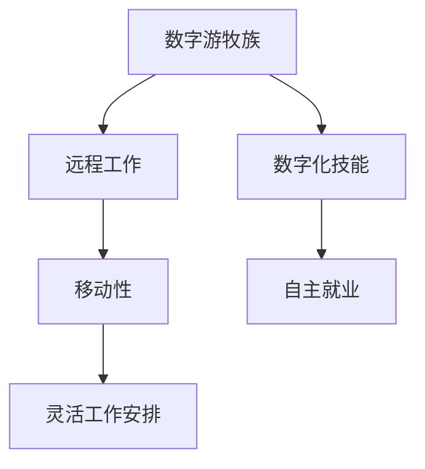
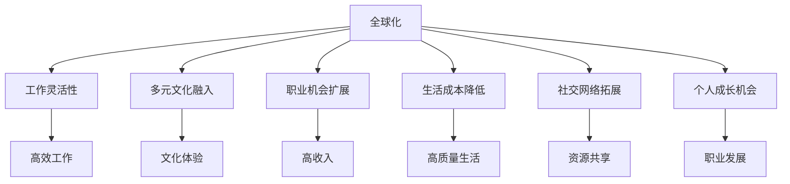
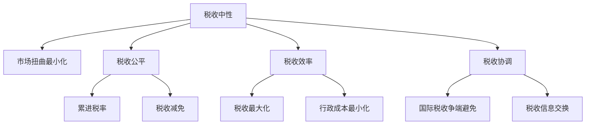
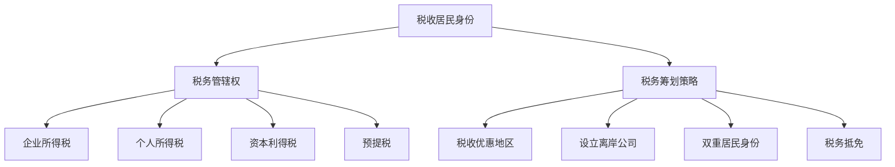

                 


## 摘要

数字游牧族，即那些利用数字技术进行远程工作，不受地域限制的职场人士，正日益成为全球化经济中的重要力量。本文将探讨数字游牧族在全球化背景下的税收政策和财务管理问题。首先，我们将概述数字游牧族的定义和特点，并分析其与全球化的关系。随后，我们将深入解析国际税收政策的基本原则和主要税收协定，探讨数字游牧族的税收义务和税务筹划策略。文章还将介绍全球税务规划的重要性和方法，并探讨数字游牧族面临的财务管理挑战及其解决方案。最后，我们将讨论数字游牧族法律风险与合规管理，并对未来税收政策的发展趋势进行展望。通过这篇文章，读者将全面了解数字游牧族在全球经济中的地位，以及如何有效地进行税收和财务管理。

### 文章关键词

- 数字游牧族
- 全球化
- 国际税收政策
- 税务筹划
- 财务管理
- 法律合规

## 第一部分：数字游牧族概述

### 第1章：数字游牧族的定义与特点

数字游牧族，是指那些利用互联网和数字技术进行远程工作，不受地域限制的职场人士。他们通过远程协作工具、云存储、在线办公平台等技术手段，实现了工作的灵活性和全球性。数字游牧族的特点主要体现在以下几个方面：

#### 1.1 数字游牧族的概念

数字游牧族的概念源于“数字游牧”（Digital Nomadism），这一术语最早出现在2000年代初期。它描述的是一种基于互联网的新型工作方式，使人们可以不受物理位置的限制，在全球范围内选择居住和工作地点。数字游牧族通常从事自由职业，如编程、设计、写作、翻译等，他们通过线上平台接受任务和项目。

#### 1.2 数字游牧族的生活方式

数字游牧族的生活方式具有高度的灵活性。他们可以根据自己的喜好和工作需求，选择居住在不同国家和地区。这种生活方式不仅提供了更多的职业选择和机会，也使得人们可以更好地平衡工作和生活。以下是一些数字游牧族生活方式的特点：

1. **灵活的工作时间**：数字游牧族可以自由安排工作时间，避免了传统的朝九晚五工作制的束缚。他们可以根据自己的生物钟和最有效率的时间段来工作。
2. **全球旅行机会**：由于工作地点的不固定，数字游牧族有更多机会去探索不同的国家和地区。他们可以利用工作之余的时间去旅行，体验不同的文化和生活方式。
3. **社交网络**：数字游牧族通过社交媒体和线上社区与其他数字游牧族和远程工作者保持联系。这种社交网络不仅提供了职业发展的机会，也丰富了他们的社交生活。
4. **低生活成本**：许多数字游牧族选择居住在生活成本较低的地区，如东南亚的一些国家。这不仅降低了生活成本，也提高了他们的生活质量。

#### 1.3 数字游牧族的兴起背景

数字游牧族的兴起有以下几个背景因素：

1. **互联网的普及**：互联网技术的快速发展和普及，使得远程工作和协作变得简单和高效。人们不再需要局限于一个物理办公室，就可以进行高效的工作。
2. **全球化趋势**：全球化的加速使得国际间的商业交流变得更加频繁和紧密。许多企业开始采用远程工作模式，以吸引全球范围内的优秀人才。
3. **自由职业的兴起**：自由职业市场的扩大，为数字游牧族提供了丰富的职业机会。他们可以选择接受来自世界各地的项目，而不受地理位置的限制。
4. **生活方式的改变**：随着人们对于工作和生活方式的期望发生变化，越来越多的人开始追求更加自由和灵活的工作方式。数字游牧族的生活方式恰好满足了这种需求。

总的来说，数字游牧族作为一种新兴的职业群体，正日益成为全球化经济中的重要力量。他们通过数字技术实现了工作的灵活性和全球性，不仅提高了工作效率，也提升了生活质量。

### 核心概念与联系

为了更好地理解数字游牧族的概念和特点，我们可以通过一个Mermaid流程图来展示核心概念之间的关系：



在这个流程图中，A代表数字游牧族，B代表远程工作，C代表数字化技能，D代表移动性，E代表自主就业，F代表灵活工作安排。这些概念相互联系，共同构成了数字游牧族的工作方式和生活方式。

### 数字游牧族与远程工作

首先，我们来探讨数字游牧族与远程工作之间的关系。远程工作，是指员工在家中或任何地方通过互联网和远程协作工具进行工作，而不是在传统的办公室环境中工作。这种工作模式的核心在于互联网的普及和远程协作工具的进步。

#### 远程工作的优势

远程工作为数字游牧族提供了以下几个显著的优点：

1. **灵活性**：远程工作允许员工自由地安排自己的工作时间，灵活选择工作地点，甚至可以在全球范围内的不同地点工作。
2. **提高工作效率**：在没有传统办公环境限制的情况下，员工可以更专注于工作，减少了通勤时间和工作场所的干扰。
3. **减少成本**：远程工作可以节省办公场所的租金和设备成本，同时减少了交通费用和时间成本。
4. **平衡工作与生活**：远程工作使得员工更容易在工作和生活之间找到平衡，提高了生活质量。

#### 数字游牧族与远程工作的结合

数字游牧族正是利用远程工作的灵活性，实现了全球范围内的工作和生活的平衡。以下是一些具体的结合方式：

1. **全球任务接受**：数字游牧族可以通过线上平台接受来自全球各地的项目，不受地理位置的限制。
2. **虚拟团队协作**：通过视频会议、即时通讯和项目管理工具，数字游牧族可以与全球的同事和客户高效协作。
3. **多样化的工作环境**：数字游牧族可以选择在咖啡馆、共享办公空间、甚至是异国他乡的家中工作，这些环境有助于激发创意和灵感。

### 核心算法原理讲解

为了更好地理解数字游牧族如何利用远程工作，我们可以通过一个伪代码来模拟数字游牧族的任务接受和项目管理：

```python
# 伪代码：数字游牧族的任务接受与项目管理

# 初始化任务列表
tasks = []

# 接受任务
def accept_task(task):
    tasks.append(task)
    print("已接受任务：", task)

# 项目管理
def manage_project():
    for task in tasks:
        if task.completed:
            print("任务已完成：", task)
        else:
            print("任务未完成：", task)

# 主函数
def main():
    accept_task("编写代码")
    accept_task("设计UI")
    manage_project()

# 运行主函数
main()
```

在这个伪代码中，我们定义了一个任务列表`tasks`，并通过`accept_task`函数接受新的任务。`manage_project`函数用于检查任务的状态，并输出未完成和已完成的任务列表。通过这个简单的模拟，我们可以看到数字游牧族如何利用远程工作工具来管理自己的项目。

### 数字游牧族与数字化技能

接下来，我们来探讨数字游牧族与数字化技能之间的关系。数字化技能，是指使用数字技术进行工作、生活和社交的能力。对于数字游牧族来说，这些技能是他们能够成功进行远程工作和全球移动的基础。

#### 数字化技能的重要性

1. **工作效率**：掌握数字化技能可以帮助数字游牧族更高效地完成工作任务。例如，熟练使用项目管理工具、代码编辑器和虚拟会议平台，可以大大提高工作效率。
2. **信息获取**：数字化技能使得数字游牧族能够快速获取和利用全球范围内的信息资源，从而更好地理解和适应不同的市场和客户需求。
3. **团队协作**：通过社交媒体、即时通讯工具和协作平台，数字游牧族可以与全球的同事和合作伙伴保持高效的沟通和协作。

#### 数字化技能的分类

数字化技能可以大致分为以下几类：

1. **技术技能**：包括编程、数据分析、云计算、网络安全等。这些技能对于从事技术工作的数字游牧族至关重要。
2. **工具技能**：包括使用各种远程工作工具和平台的技能，如项目管理工具、虚拟会议工具、云存储等。
3. **软技能**：包括沟通能力、团队合作能力、自我管理能力和解决问题的能力。这些软技能对于数字游牧族的职业发展同样重要。

#### 数字化技能的培养

1. **在线学习**：数字游牧族可以利用在线课程、电子书籍和教程来学习各种数字化技能。例如，通过Coursera、Udemy和edX等在线学习平台，可以系统地学习编程、数据分析等技能。
2. **实践项目**：通过参与实际项目，数字游牧族可以锻炼和提升自己的数字化技能。例如，参与开源项目或为小企业提供服务，都可以帮助数字游牧族积累实践经验。
3. **社交网络**：通过社交媒体和在线社区，数字游牧族可以与其他人交流学习经验，获取最新的行业动态和技能培训资源。

### 核心算法原理讲解

为了更好地理解数字化技能的应用，我们可以通过一个简单的伪代码来模拟数字游牧族使用技术技能进行项目开发：

```python
# 伪代码：数字游牧族的项目开发流程

# 初始化项目
project = {
    "name": "数字游牧族协作平台",
    "tasks": [],
    "status": "未开始"
}

# 添加任务
def add_task(task):
    project["tasks"].append(task)

# 开发任务
def develop_project():
    for task in project["tasks"]:
        if task.completed:
            print("开发任务已完成：", task)
        else:
            print("开发任务未完成：", task)

# 主函数
def main():
    add_task("设计用户界面")
    add_task("编写后端代码")
    develop_project()

# 运行主函数
main()
```

在这个伪代码中，我们定义了一个项目对象`project`，并添加了两个任务。`develop_project`函数用于检查任务的状态，并输出开发任务的完成情况。通过这个简单的模拟，我们可以看到数字游牧族如何利用技术技能进行项目开发。

### 数字游牧族的移动性与灵活性

数字游牧族的移动性与灵活性是他们的核心特点之一。这种移动性和灵活性不仅影响了他们的工作和生活方式，还深刻地改变了他们的社交和职业网络。

#### 移动性的重要性

移动性是数字游牧族实现全球工作和生活的基础。以下是移动性的几个关键重要性：

1. **职业机会**：通过移动性，数字游牧族可以接触到更多的职业机会。他们可以在不同的国家和地区寻找工作，不受地理限制。
2. **工作环境**：移动性使得数字游牧族可以选择在任何他们喜欢的地方工作，从海滨度假村到山区小屋，这些环境可以激发创意和提高工作效率。
3. **生活体验**：移动性也为数字游牧族提供了丰富的文化体验和生活方式。他们可以在不同的地方居住，体验不同的文化和风俗。

#### 灵活性的实现

数字游牧族的灵活性体现在以下几个方面：

1. **工作模式**：他们可以灵活地选择工作时间和地点，不受传统办公室工作模式的限制。
2. **生活安排**：数字游牧族可以根据自己的喜好和项目需求，灵活地安排生活和旅行计划。
3. **资源利用**：通过线上平台和协作工具，数字游牧族可以高效地利用全球范围内的资源和人才。

#### 移动性与灵活性对社交网络的影响

移动性和灵活性不仅改变了数字游牧族的工作方式和生活，还影响了他们的社交网络和职业网络。以下是几个关键点：

1. **全球社交网络**：数字游牧族通过社交媒体和在线社区，建立了全球性的社交网络。这种网络不仅提供了职业发展的机会，也丰富了他们的社交生活。
2. **职业网络**：数字游牧族可以在全球范围内寻找合作伙伴和客户，构建强大的职业网络。
3. **文化和生活交流**：通过移动性和灵活性，数字游牧族可以更深入地体验不同的文化和生活方式，拓宽视野。

### 核心算法原理讲解

为了更好地理解移动性和灵活性的实现，我们可以通过一个伪代码来模拟数字游牧族在移动过程中的工作和管理：

```python
# 伪代码：数字游牧族的移动工作与管理

# 初始化工作环境
workspace = {
    "current_location": "泰国清迈",
    "projects": [],
    "tasks": []
}

# 更改工作地点
def change_location(new_location):
    workspace["current_location"] = new_location
    print("当前工作地点已更改为：", new_location)

# 添加项目
def add_project(project):
    workspace["projects"].append(project)

# 添加任务
def add_task(task):
    workspace["tasks"].append(task)

# 工作管理
def manage_workspace():
    for project in workspace["projects"]:
        if project.completed:
            print("项目已完成：", project)
        else:
            print("项目未完成：", project)
    for task in workspace["tasks"]:
        if task.completed:
            print("任务已完成：", task)
        else:
            print("任务未完成：", task)

# 主函数
def main():
    change_location("泰国清迈")
    add_project("数字游牧族协作平台开发")
    add_task("设计用户界面")
    manage_workspace()

# 运行主函数
main()
```

在这个伪代码中，我们定义了一个工作空间对象`workspace`，并实现了更改工作地点、添加项目和任务，以及管理工作空间的功能。通过这个简单的模拟，我们可以看到数字游牧族如何在移动过程中高效地管理工作和项目。

### 数字游牧族与全球化

数字游牧族的兴起与全球化密不可分。全球化带来了全球市场的一体化、信息的快速流通和劳动力市场的流动，这些都为数字游牧族提供了广阔的发展空间。

#### 全球化对数字游牧族的影响

全球化对数字游牧族的影响主要体现在以下几个方面：

1. **职业机会**：全球化使得全球范围内的职业机会更加多样化和丰富。数字游牧族可以通过远程工作平台接受来自世界各地的项目，实现职业发展的多元化。
2. **劳动力市场**：全球化促进了劳动力市场的流动性。数字游牧族可以不受地域限制，在全球范围内寻找工作机会，提高了劳动力的利用效率。
3. **文化交流**：全球化使得不同国家和地区的文化和生活方式得以交流与融合。数字游牧族在旅行和工作过程中，可以更深入地体验和了解不同的文化，拓宽视野。

#### 数字游牧族在全球化中的角色

数字游牧族在全球化中扮演着重要的角色，他们既是全球化进程的受益者，也是推动者。以下是数字游牧族在全球化中的几个关键角色：

1. **跨国人才流动**：数字游牧族作为跨国人才流动的一部分，为全球企业提供了多样化的技能和专业知识。
2. **全球协作**：通过远程协作工具和平台，数字游牧族可以与全球的同事和合作伙伴高效协作，推动全球化项目的顺利进行。
3. **文化传播**：数字游牧族在旅行和工作过程中，不仅推动了文化交流，也为不同国家和地区带来了新的观念和思维方式。

#### 数字游牧族与全球化的发展趋势

随着全球化的深入发展，数字游牧族的角色和影响也将进一步扩大。以下是数字游牧族与全球化的发展趋势：

1. **技术进步**：随着互联网和数字化技术的不断进步，数字游牧族的工作方式和生活方式将更加高效和便捷。
2. **政策支持**：各国政府和企业对远程工作和数字游牧族的认可和支持将增加，为数字游牧族提供更多的政策和市场环境。
3. **市场多元化**：全球市场的多元化将为数字游牧族提供更多的职业机会和发展空间，促进数字游牧族的全球化发展。

总的来说，数字游牧族与全球化之间存在着紧密的联系和相互影响。数字游牧族不仅受益于全球化，也在推动全球化的发展。随着全球化的进一步深化，数字游牧族将在全球化经济中扮演更加重要的角色。

### 数字游牧族的兴起背景

数字游牧族的兴起是多种因素共同作用的结果，包括技术进步、全球化趋势、自由职业的兴起以及人们对工作和生活方式的期望变化。以下是这些因素的具体解析：

#### 技术进步

互联网和数字化技术的快速发展为数字游牧族的兴起提供了基础。互联网的普及和带宽的提高使得全球范围内的远程工作和协作变得简单和高效。以下是技术进步对数字游牧族的影响：

1. **远程协作工具**：视频会议、即时通讯、项目管理工具和云存储等远程协作工具的发展，使得数字游牧族能够高效地进行团队协作和项目管理。
2. **云计算**：云计算技术的进步为数字游牧族提供了强大的计算能力和存储空间，使他们可以在任何地方访问和存储工作文件。
3. **移动设备**：智能手机和平板电脑的普及，使得数字游牧族可以随时随地进行工作，不受时间和地点的限制。

#### 全球化趋势

全球化的加速使得国际间的商业交流更加频繁和紧密。全球化带来了以下影响：

1. **跨国企业需求**：跨国企业需要全球范围内的专业人才，这使得数字游牧族有机会在全球市场上寻求职业机会。
2. **劳动力市场流动**：全球化促进了劳动力市场的流动，数字游牧族可以在不同国家和地区之间自由流动，寻找更合适的工作和生活环境。
3. **文化交流**：全球化使得不同国家和地区的文化和生活方式得以交流和融合，为数字游牧族提供了更丰富的体验和机会。

#### 自由职业的兴起

自由职业市场的扩大为数字游牧族提供了丰富的职业机会。以下是自由职业兴起的影响：

1. **多样职业选择**：自由职业市场的扩大使得数字游牧族可以选择从事更多样化的职业，如编程、设计、写作、翻译等。
2. **灵活性**：自由职业使得数字游牧族可以自由安排自己的工作时间、工作地点和生活方式，提高了职业灵活性和生活质量。
3. **全球客户群**：自由职业市场的全球化，使得数字游牧族可以接受来自全球各地的客户，扩展他们的商业网络。

#### 人们对工作和生活方式的期望变化

随着社会的发展和人们对生活的追求，越来越多的人开始追求更加自由和灵活的工作方式。以下是这些变化的影响：

1. **工作与生活的平衡**：越来越多的人希望在工作与生活之间找到更好的平衡，数字游牧族的生活方式正好满足了这种需求。
2. **追求自由**：数字游牧族的生活方式为人们提供了追求个人自由和独立的机会，使他们可以按照自己的意愿安排工作和生活。
3. **全球旅行体验**：许多人渴望体验不同的文化和生活方式，数字游牧族的生活方式使得他们可以在全球范围内实现这一愿望。

综上所述，数字游牧族的兴起是技术进步、全球化趋势、自由职业的兴起以及人们对工作和生活方式期望变化共同作用的结果。这些因素不仅推动了数字游牧族的发展，也为他们提供了广阔的发展空间和机会。

### 核心算法原理讲解

在探讨数字游牧族与全球化关系的过程中，我们引入了一些关键算法原理，以便更清晰地理解这些概念。以下是几个关键算法原理及其在数字游牧族全球化背景中的应用：

#### 1. 聚类算法

聚类算法是一种无监督学习技术，用于将数据集中的对象分成若干个组，使得属于同一组的数据对象彼此相似，而不同组的数据对象彼此不同。在数字游牧族全球化的背景下，聚类算法可以用于分析不同国家和地区的职业机会和市场规模，帮助数字游牧族选择最合适的居住和工作地点。

**伪代码：**

```python
def kmeans_clustering(data, k):
    # 初始化聚类中心
    centroids = initialize_centroids(data, k)
    while not_converged(centroids):
        # 为每个数据点分配最近的聚类中心
        clusters = assign_points_to_clusters(data, centroids)
        # 更新聚类中心
        centroids = update_centroids(clusters)
    return centroids
```

**应用场景：** 数字游牧族可以使用聚类算法来分析全球各地的职业机会，将相似的职业机会归为同一组，从而更好地选择他们的工作地点。

#### 2. 网络分析算法

网络分析算法用于分析复杂网络中节点和边的关系。在数字游牧族的全球化背景下，网络分析算法可以用于分析全球职业网络，识别重要的职业联系和合作伙伴。

**伪代码：**

```python
def network_analysis(graph):
    # 计算网络中心性指标
    centrality_scores = compute_centrality(graph)
    # 筛选中心性较高的节点
    influential_nodes = filter_influential_nodes(centrality_scores)
    return influential_nodes
```

**应用场景：** 数字游牧族可以使用网络分析算法来识别在全球职业网络中具有重要影响力的节点和联系，从而更好地建立自己的职业网络。

#### 3. 决策树算法

决策树算法是一种分类和回归算法，通过一系列if-else规则来分割数据并预测结果。在数字游牧族的全球化背景下，决策树算法可以用于帮助数字游牧族做出关于居住和工作地点的决策。

**伪代码：**

```python
def build_decision_tree(data, features):
    # 选择最优特征
    best_feature = select_best_feature(data, features)
    # 构建决策树
    tree = build_tree(data, best_feature)
    return tree
```

**应用场景：** 数字游牧族可以使用决策树算法来分析不同国家和地区的因素（如生活成本、工作机会、文化环境等），并根据分析结果做出最优的居住和工作地点决策。

通过这些核心算法原理的应用，数字游牧族可以更有效地分析全球职业市场，建立强大的职业网络，并做出明智的决策，从而在全球化的背景下实现个人职业发展和生活质量的提升。

### 数字游牧族与远程工作

数字游牧族与远程工作之间的关系是密不可分的。远程工作提供了数字游牧族实现全球工作和生活方式的基石，而数字游牧族则通过远程工作展现了这一工作模式的无限可能。以下将从多个方面探讨数字游牧族与远程工作的关系。

#### 远程工作模式的优势

1. **灵活性**：远程工作模式使得数字游牧族能够灵活安排工作时间，减少通勤时间，从而更好地平衡工作与生活。
2. **全球性**：远程工作打破了地域限制，数字游牧族可以在全球范围内选择工作地点，享受不同的文化和生活方式。
3. **自主性**：远程工作让数字游牧族拥有了更高的自主权，他们可以自主决定工作内容和进度，提高工作效率。
4. **多样性**：远程工作模式为数字游牧族提供了多样化的职业选择，无论是自由职业者还是远程员工，都有机会在全球市场上找到合适的职位。

#### 数字游牧族与远程工作的协同效应

1. **技能提升**：远程工作促使数字游牧族不断提升自己的数字化技能，如编程、项目管理、数据分析等，从而提高自己的竞争力。
2. **协作效率**：远程工作依赖高效的协作工具和平台，如Slack、Trello、Zoom等，这些工具使得数字游牧族能够与全球的同事和客户高效沟通和协作。
3. **创新能力**：远程工作提供了多样化的工作环境和文化背景，这种多样性激发了数字游牧族的创新思维，推动了个人和团队的进步。
4. **文化理解**：通过远程工作，数字游牧族有机会与来自不同文化背景的人交流，增进对全球文化的理解和尊重。

#### 远程工作的挑战与解决方案

1. **沟通障碍**：远程工作可能导致沟通不畅，尤其是在跨时区和工作习惯差异较大的情况下。解决方案包括定期视频会议、设置明确的沟通规则和采用跨文化的沟通技巧。
2. **工作与生活平衡**：远程工作虽然提供了灵活性，但同时也可能让工作与生活界限模糊，解决方案包括设定固定的工作时间、保持工作环境的整洁和定期休息。
3. **技术依赖**：远程工作对网络和技术设备有较高的依赖，解决方案包括备份重要数据、定期维护设备和选择可靠的互联网服务提供商。

#### 数字游牧族的成功案例

1. **案例一：自由职业者Tom**：Tom是一位来自美国的软件工程师，他利用远程工作模式，在全球范围内接手了多个高薪项目，不仅实现了财务自由，还积累了丰富的职业经验。
2. **案例二：数字营销专家Lily**：Lily通过远程工作在全球多个国家和地区为客户提供服务，她的灵活工作和多样化技能使得她成为客户眼中的“顶级营销专家”。
3. **案例三：创业公司CEO Alex**：Alex创建了一家远程办公的公司，他的团队分布在不同的国家，通过高效的远程协作工具和平台，成功地推出了多个产品，实现了公司的快速发展。

总的来说，数字游牧族与远程工作之间的关系是相辅相成的。远程工作为数字游牧族提供了实现全球工作和生活方式的机会，而数字游牧族则通过其灵活性和创新能力推动了远程工作的普及和发展。这种协同效应不仅提高了个人的生活质量，也为全球经济的发展注入了新的活力。

### 数字游牧族的移动性分析

数字游牧族的移动性是他们在全球化背景下取得成功的关键因素之一。本文将从多个维度分析数字游牧族的移动性，包括他们选择居住地的原因、移动性带来的好处和挑战，以及应对策略。

#### 选择居住地的原因

1. **成本效益**：许多数字游牧族选择居住在成本较低的地区，如东南亚的一些国家（例如泰国、越南、菲律宾等），这些地区的住房、食品和交通费用相对较低，有助于提高生活质量。
2. **工作环境**：一些地区提供更优越的工作环境，例如具备良好网络基础设施、稳定的电力供应和丰富的远程工作社区的城市。这些条件能够为数字游牧族提供高效的工作体验。
3. **文化和生活方式**：数字游牧族渴望体验不同的文化和生活方式。选择居住在具有独特文化背景的国家，能够让他们在旅行和工作之间找到更好的平衡。
4. **专业网络**：为了建立和维护专业网络，数字游牧族可能会选择居住在具有丰富职业机会和资源集中的城市。

#### 移动性带来的好处

1. **财务自由**：通过在全球范围内选择生活成本较低的地区，数字游牧族可以节省大量开支，从而实现更高的生活标准和财务自由。
2. **职业机会**：移动性使得数字游牧族能够接触到更多的工作机会，不受地域限制。他们可以接受来自全球各地的项目，提升职业发展。
3. **文化交流**：移动性为数字游牧族提供了丰富的文化交流机会，使他们能够更深入地了解和体验不同的文化，拓宽视野。
4. **工作与生活的平衡**：移动性使得数字游牧族可以灵活安排工作和生活，更容易找到适合自己的工作环境和生活节奏。

#### 移动性带来的挑战

1. **法律和税务问题**：数字游牧族需要了解和遵守居住国和原籍国的法律法规，特别是在税务和居留许可方面。不同国家的要求各不相同，这可能会带来一定的困扰。
2. **文化适应**：数字游牧族在适应新文化时可能会遇到挑战，包括语言障碍、社交圈子建立和文化冲突等。
3. **技术依赖**：远程工作依赖于稳定的网络连接和高效的技术设备。在移动过程中，这些条件可能会受到影响，影响工作效率。
4. **安全保障**：数字游牧族需要关注网络安全和数据保护，防止信息泄露和网络攻击。

#### 应对策略

1. **法律法规咨询**：在移动前，数字游牧族应该咨询专业的法律和税务顾问，确保自己遵守居住国的法律法规，并妥善处理税务问题。
2. **语言和文化学习**：为了更好地适应新文化，数字游牧族可以提前学习当地的语言和文化，参加社区活动，建立新的社交圈子。
3. **技术保障**：数字游牧族应该确保自己的技术设备保持最新，并选择可靠的互联网服务提供商，以保障工作效率。
4. **网络安全意识**：数字游牧族需要提高网络安全意识，使用强密码、VPN和其他安全工具，保护个人信息和数据安全。

通过合理的策略，数字游牧族可以更好地应对移动性带来的挑战，实现全球化工作与生活的平衡。

### 数字游牧族的优势

数字游牧族在现代职场中展现出显著的优势，这些优势不仅提升了他们的职业竞争力，也为全球经济带来了新的活力。以下是数字游牧族的主要优势：

#### 1. 高效的远程工作能力

数字游牧族凭借其熟练掌握的远程工作技能和工具，能够在全球范围内高效地完成任务。他们能够灵活安排工作时间，避免通勤的繁琐，从而将更多的时间用于工作。此外，高效的远程协作工具如Slack、Zoom和Trello等，使得数字游牧族能够与全球的同事和客户保持密切的沟通和协作，提高了工作效率。

#### 2. 丰富的技能和知识

数字游牧族通常具备广泛的数字化技能，包括编程、数据分析、云计算、数字营销等。这些技能不仅使他们能够在全球职场中脱颖而出，也为他们提供了更多的职业机会。此外，数字游牧族通过不断学习和实践，积累了丰富的经验和知识，这使得他们在面对复杂问题时能够迅速找到解决方案。

#### 3. 创新思维

数字游牧族的生活方式和工作环境多样，这激发了他们的创新思维。他们能够从不同的文化背景和环境中汲取灵感，创造出独特的解决方案。此外，数字游牧族的职业网络广泛，他们可以与其他领域的专家交流合作，进一步推动创新。

#### 4. 良好的适应能力

数字游牧族具备良好的适应能力，他们能够快速适应不同的工作和生活环境。无论是在发达国家还是发展中国家，数字游牧族都能够迅速融入当地的文化和社会，找到合适的工作和生活方式。

#### 5. 高度自主性

数字游牧族拥有高度自主性，他们可以自由选择工作内容、工作时间和工作地点。这种自主性不仅提高了他们的工作效率，还提升了他们的生活质量。数字游牧族可以按照自己的兴趣和目标规划职业和生活，实现个人价值。

#### 6. 全球视野

数字游牧族通过全球范围内的旅行和工作，拥有了广泛的全球视野。他们能够了解和体验不同的文化、市场和商业模式，从而更好地适应全球化的经济环境。这种全球视野不仅有助于他们在职场中取得成功，也为他们提供了更多的职业机会和发展空间。

总的来说，数字游牧族的优势在于其高效的远程工作能力、丰富的技能和知识、创新思维、良好的适应能力、高度自主性和全球视野。这些优势使得数字游牧族在全球化经济中具备强大的竞争力，也为全球经济带来了新的活力。

### 全球化对数字游牧族生活方式的影响

全球化对数字游牧族的生活方式产生了深远的影响，这些影响不仅改变了他们的工作方式，也重塑了他们的生活态度。以下是全球化对数字游牧族生活方式的几个关键影响：

#### 1. 工作灵活性的提高

全球化推动了远程工作模式的普及，数字游牧族因此获得了前所未有的工作灵活性。他们可以不受地理位置限制，选择在任何地方进行工作，从繁华的都市到宁静的海滨小镇，甚至是在旅途中也能保持高效的工作状态。这种灵活性不仅提高了工作效率，还使得数字游牧族能够更好地平衡工作与生活。

#### 2. 多元文化的融入

全球化使得不同国家和地区的文化更加紧密地联系在一起。数字游牧族在旅居过程中，有机会深入体验和融入不同的文化。他们通过学习当地的语言、参加社区活动、品尝当地美食，逐渐融入当地社会。这种多元文化的融入，不仅丰富了他们的生活经历，也拓宽了他们的视野。

#### 3. 职业机会的扩展

全球化为数字游牧族提供了更多的职业机会。他们可以接受来自全球各地的项目，不再受限于某一地区的市场需求。这种职业机会的扩展，不仅提高了数字游牧族的收入水平，也促进了他们的职业发展。

#### 4. 生活成本的降低

数字游牧族可以选择居住在生活成本较低的地区，如东南亚的一些国家。这些地区不仅提供了丰富的文化和生活体验，还大幅降低了住房、食品和交通等生活成本。这种生活成本的降低，使得数字游牧族能够以更低的成本享受高质量的生活。

#### 5. 社交网络的拓展

全球化使得数字游牧族能够通过线上平台和社交媒体建立全球性的社交网络。他们可以与其他数字游牧族、远程工作者和行业专家保持联系，分享经验、获取资源和寻求合作。这种社交网络的拓展，不仅提升了数字游牧族的工作效率，也丰富了他们的社交生活。

#### 6. 个人成长的机会

全球化为数字游牧族提供了丰富的个人成长机会。他们可以通过不断学习和实践，提升自己的技能和知识，开拓新的职业领域。此外，全球化还为他们提供了更多的挑战和机会，使得他们在职业发展中不断突破自我。

总的来说，全球化对数字游牧族生活方式的影响是全方位的。它不仅提高了他们的工作灵活性和生活质量，也丰富了他们的社交网络和个人成长机会。通过全球化，数字游牧族实现了在全球范围内的自由工作和生活，展现了数字化时代的新型生活方式。

### 核心概念与联系

为了更好地理解全球化对数字游牧族生活方式的影响，我们可以通过一个Mermaid流程图来展示这些核心概念之间的关系：



在这个流程图中，A代表全球化，B代表工作灵活性，C代表多元文化融入，D代表职业机会扩展，E代表生活成本降低，F代表社交网络拓展，G代表个人成长机会。这些概念相互联系，共同构成了全球化对数字游牧族生活方式的多方面影响。

### 第二部分：税收政策解析

### 第3章：国际税收政策概述

国际税收政策是全球化经济中一个复杂而关键的领域。随着跨国企业和个人的数量不断增加，国际税收政策的重要性日益凸显。本章将概述国际税收政策的基本原则、主要税收协定及其作用，以及国际税收政策的发展趋势。

#### 3.1 国际税收政策的基本原则

国际税收政策的基本原则主要包括以下几个方面：

1. **税收中性**：税收中性原则是指税收政策不应扭曲市场行为，避免对国际贸易和投资产生不利影响。该原则旨在确保税收对经济活动的影响最小化。
2. **税收公平**：税收公平原则要求税收负担应公平合理地分配给不同经济主体，避免贫富差距扩大。通常通过累进税率和税收减免来实现。
3. **税收效率**：税收效率原则关注税收政策对经济效率和资源分配的影响。高效税收政策应确保税收收入的最大化，同时最小化行政成本和社会成本。
4. **税收协调**：税收协调原则强调各国在税收政策制定和执行过程中应进行合作，以避免国际税收争端和税收逃避。

#### 3.2 国际税收协定的作用

国际税收协定是不同国家之间为了协调税收政策、避免双重征税和防止税收逃避而签订的协议。以下是国际税收协定的一些重要作用：

1. **避免双重征税**：国际税收协定通过规定居民国和来源国的税收权利，确保跨国企业和个人的税收负担不会因为重复征税而加重。
2. **税收争议解决**：国际税收协定通常包含争议解决机制，如相互协商程序，帮助各国解决在税收征收和处理上的分歧。
3. **税收信息交换**：国际税收协定鼓励各国之间进行税收信息的交换，提高税收透明度，防止税收逃避和偷税漏税。
4. **税收待遇规定**：国际税收协定规定了跨国企业和个人在不同国家的税收待遇，包括税率、税收减免和税收优惠政策。

#### 3.3 主要国际税收协定介绍

以下是一些主要的国际税收协定及其主要内容：

1. **《经合组织（OECD）模型税协定》**：该协定由经济合作与发展组织（OECD）制定，提供了关于如何处理跨国企业税收问题的框架。它涵盖了不同类型的税收协定，如企业常设机构、税收信息交换、资本收益和预提税等。
2. **《联合国模型双边税收协定》**：该协定由联合国制定，旨在帮助发展中国家通过国际税收协定获得更多的税收收入。它包括与OECD模型税协定类似的内容，但更注重发展中国家的需求。
3. **《欧盟成员国间的税收协定》**：欧盟成员国之间签订的税收协定，旨在确保欧盟内部的税收协调，避免双重征税，促进资本和劳动力的自由流动。
4. **《避免双重征税协定（DTA）》**：许多国家与其他国家签订了避免双重征税协定，以减少跨国企业和个人的税收负担。这些协定通常包括对营业税、企业所得税、资本收益税和预提税的处理规定。

#### 3.4 国际税收政策的发展趋势

随着全球化的深入发展，国际税收政策也在不断演变。以下是国际税收政策的一些发展趋势：

1. **数字化税收**：随着数字经济的发展，各国开始考虑如何对跨国企业的数字收入征税。例如，OECD提出的《数字税》计划，旨在制定一套全球统一的数字税收规则。
2. **税收透明度**：国际社会对税收透明度的要求越来越高。各国通过加强税收信息交换和公开税务信息，提高了税收管理的透明度，减少了税收逃避。
3. **税收协调**：各国在制定国际税收政策时，越来越注重税收协调，以避免国际税收争端。例如，G20和OECD等国际组织正在推动全球税收改革的进程。
4. **可持续发展税收**：随着全球对可持续发展的关注增加，各国开始考虑如何通过税收政策促进环境保护和可持续发展。例如，碳税和环境保护税等新税种的推出。

总的来说，国际税收政策是一个复杂而动态的领域，随着全球化和数字经济的不断发展，国际税收政策也在不断演变。理解国际税收政策的基本原则、主要协定和发展趋势，对于数字游牧族和跨国企业来说至关重要。

### 核心概念与联系

为了更好地理解国际税收政策的基本原则，我们可以通过一个Mermaid流程图来展示这些核心概念之间的关系：



在这个流程图中，A代表税收中性，B代表市场扭曲最小化，C代表税收公平，D代表税收效率，E代表税收协调。这些概念相互联系，共同构成了国际税收政策的基本原则。通过这个图，我们可以更直观地理解国际税收政策的整体架构。

### 国际税收政策的基本原则

在深入探讨国际税收政策之前，我们需要明确几个核心原则，这些原则构成了国际税收政策的基础。以下是国际税收政策的主要基本原则：

#### 1. 税收中性

税收中性原则是指税收政策在实施过程中，不应扭曲市场行为和资源分配。这一原则的核心目标是确保税收对经济活动的影响最小化，避免通过税收政策干预市场机制。具体来说，税收中性包括以下几个方面：

- **避免税收歧视**：税收政策不应对不同的经济活动或企业进行不公平的税收待遇，确保市场在税收方面保持中性。
- **优化税收结构**：通过合理设计税收结构，减少税收对生产和投资决策的负面影响，使税收政策对经济活动的激励效应最大化。

#### 2. 税收公平

税收公平原则强调税收负担应公平合理地分配给不同经济主体，以实现社会的公平正义。税收公平主要体现在以下几个方面：

- **累进税率**：对高收入者征收更高的税率，对低收入者征收较低的税率，以缩小收入差距，实现收入再分配。
- **税收减免**：对特定群体或行业提供税收减免，以减轻他们的税收负担，促进社会公平。

#### 3. 税收效率

税收效率原则关注税收政策对经济效率和资源分配的影响。高效的税收政策应确保税收收入的最大化，同时最小化行政成本和社会成本。具体来说，税收效率包括以下几个方面：

- **优化税收制度**：通过设计合理的税收制度，提高税收效率，减少避税和逃税行为。
- **减少税收扭曲**：通过减少对生产、投资和消费的扭曲，提高税收政策的经济效率。

#### 4. 税收协调

税收协调原则强调各国在税收政策制定和执行过程中应进行合作，以避免国际税收争端和税收逃避。具体来说，税收协调包括以下几个方面：

- **避免双重征税**：通过签订国际税收协定，规定跨国企业和个人的税收负担，确保不会因为重复征税而加重税负。
- **税收信息交换**：加强各国之间的税收信息交换，提高税收透明度，防止税收逃避和偷税漏税。

通过这些基本原则，国际税收政策旨在实现税收的公平、效率和协调，为全球经济的健康发展提供支持。

### 核心算法原理讲解

在深入探讨国际税收政策的基本原则时，我们可以引入一些核心算法原理，以更好地理解和分析这些原则在实际中的应用。以下是几个关键算法原理及其在税收政策中的应用：

#### 1. 费用分摊算法

费用分摊算法用于在不同经济主体之间公平分配费用或成本。在国际税收政策中，费用分摊算法可以用于分配跨国企业的税收负担，确保税收负担在相关国家之间公平合理。

**伪代码：**

```python
def allocate_tax_burden(profits, countries):
    total_profit = sum(profits)
    tax_burden = [0] * len(countries)
    for i, profit in enumerate(profits):
        for j, country in enumerate(countries):
            if i == j:
                tax_burden[j] += profit * (1 - tax_rate)
    return tax_burden
```

**应用场景：** 假设一个跨国企业在多个国家运营，并获得总利润1000万美元。通过费用分摊算法，可以计算每个国家的税负，确保税收负担在各国之间公平分配。

#### 2. 最优化算法

最优化算法用于在多个目标中找到一个最佳解决方案。在国际税收政策中，最优化算法可以用于设计税收政策，以最大化税收收入或最小化税收逃避。

**伪代码：**

```python
def optimize_tax_policy(tax_rates, evasion_risk, tax_base):
    optimal_tax_rate = 0
    max_tax_revenue = 0
    for rate in tax_rates:
        tax_revenue = calculate_tax_revenue(rate, evasion_risk, tax_base)
        if tax_revenue > max_tax_revenue:
            max_tax_revenue = tax_revenue
            optimal_tax_rate = rate
    return optimal_tax_rate
```

**应用场景：** 在制定税收政策时，可以通过最优化算法确定最优的税率，以最大化税收收入，同时考虑税收逃避的风险。

#### 3. 聚类算法

聚类算法用于将数据点划分为若干个组，使得同一组的数据点彼此相似，而不同组的数据点彼此不同。在国际税收政策中，聚类算法可以用于分析跨国企业的税务情况，将具有相似特征的企业归为一类，以便制定更精准的税收政策。

**伪代码：**

```python
def cluster_employers(data, k):
    centroids = initialize_centroids(data, k)
    while not_converged(centroids):
        clusters = assign_employers_to_clusters(data, centroids)
        centroids = update_centroids(clusters)
    return clusters
```

**应用场景：** 在分析跨国企业的税务情况时，可以通过聚类算法将企业根据其税务特征分类，以便政府制定有针对性的税收政策。

通过这些核心算法原理，我们可以更深入地理解和分析国际税收政策的基本原则，为制定合理的税收政策提供支持。

### 核心算法原理讲解

在国际税收政策中，数据处理和分析是至关重要的。为了更好地理解这些过程，我们可以通过一个具体的算法——线性回归模型来讲解。

#### 1. 线性回归模型

线性回归模型是一种用于分析两个或多个变量之间线性关系的统计方法。在国际税收政策中，线性回归模型可以用于预测税收收入、分析税收影响或评估税收政策的效果。

**数学模型和公式：**

$$
y = \beta_0 + \beta_1 \cdot x_1 + \beta_2 \cdot x_2 + ... + \beta_n \cdot x_n + \epsilon
$$

其中，\( y \) 是因变量，\( x_1, x_2, ..., x_n \) 是自变量，\( \beta_0, \beta_1, ..., \beta_n \) 是模型的参数，\( \epsilon \) 是误差项。

**伪代码：**

```python
import numpy as np

# 假设我们有两个自变量 x1 和 x2，以及因变量 y
x1 = np.array([1, 2, 3, 4, 5])
x2 = np.array([5, 4, 3, 2, 1])
y = np.array([2, 4, 5, 4, 5])

# 计算参数
X = np.column_stack((x1, x2))
X_transpose = X.T
XXT = np.dot(X_transpose, X)
XXT_inverse = np.linalg.inv(XXT)
X_transpose_y = np.dot(X_transpose, y)
beta = np.dot(XXT_inverse, X_transpose_y)

# 输出参数
print("模型参数：", beta)
```

**应用实例：** 假设我们想要预测一个国家的税收收入（因变量\( y \)）与国内生产总值（\( x_1 \)）和劳动力数量（\( x_2 \)）之间的关系。通过线性回归模型，我们可以计算出最优的模型参数，并使用这些参数进行税收收入的预测。

#### 2. 线性回归模型在税收政策中的应用

线性回归模型在国际税收政策中有多种应用：

1. **税收预测**：通过线性回归模型，政府可以预测不同税收政策变化对税收收入的影响，从而制定更科学的税收政策。
2. **税收影响分析**：线性回归模型可以用于分析税收变化对经济增长、就业率和其他经济指标的影响，帮助政府评估税收政策的宏观经济效应。
3. **税收负担评估**：线性回归模型可以用于计算不同收入群体的税收负担，评估税收政策的公平性。

通过线性回归模型，国际税收政策分析变得更加精确和科学，为政策制定提供了有力的支持。

### 3.2 国际税收协定的作用

国际税收协定在全球化背景下发挥着至关重要的作用，它们旨在通过协调各国税收政策，避免双重征税，促进国际投资和贸易的公平和透明。以下是国际税收协定的主要作用：

#### 1. 避免双重征税

双重征税是指同一收入在不同国家被重复征税的情况。这会导致跨国企业的税负增加，影响其国际竞争力。国际税收协定通过规定跨国企业和个人在两国之间的税收权利和责任，避免双重征税的发生。例如，协定通常会规定哪些国家有权对跨国企业的分支机构征税，以及如何划分和计算跨国企业的税基。

**示例：** 假设一家美国公司在中国设立了分支机构，两国签订的国际税收协定规定，只有在中国赚取的利润在中国缴纳税款，而在美国赚取的利润在美国缴纳税款。这样，美国公司的总税负就不会因为双重征税而增加。

#### 2. 税收争议解决

跨国企业和个人在涉及国际税收问题时，可能会出现与所在国家税务部门之间的争议。国际税收协定通常包含争议解决机制，如相互协商程序（Mutual Agreement Procedure, MAP），帮助各国税务部门通过谈判解决争议。

**示例：** 假设一家日本公司在英国有投资，但其在英国缴纳的税款被英国税务部门质疑。通过相互协商程序，日本和英国的税务部门可以坐下来谈判，找到双方都接受的解决方案。

#### 3. 税收信息交换

国际税收协定鼓励各国之间进行税收信息的交换，提高税收透明度。这有助于各国税务部门更好地执行税收政策，打击跨国逃税和避税行为。

**示例：** 欧盟国家之间签订的税收协定就包含了广泛的信息交换条款，确保各国能够共享与税收相关的信息，提高税务管理的效率和透明度。

#### 4. 税收待遇规定

国际税收协定通常规定跨国企业和个人在不同国家的税收待遇，包括税率、税收减免和税收优惠政策。这有助于确保跨国企业和个人在国际贸易和投资中享有公平的待遇。

**示例：** 一家德国公司在法国设立子公司，根据德法之间的税收协定，该子公司可以享受一定的税收减免，从而降低税负。

#### 5. 促进国际投资和贸易

国际税收协定通过减少税收不确定性和税收负担，为跨国企业和个人提供了更稳定的投资环境，促进了国际投资和贸易的发展。

**示例：** 美国和新加坡之间的税收协定，通过降低新加坡在美投资的税负，吸引了更多美国资本流入新加坡，促进了两国之间的贸易和投资。

总的来说，国际税收协定通过避免双重征税、解决税收争议、促进税收信息交换和规定税收待遇，为跨国企业和个人的国际经济活动提供了法律保障，推动了全球经济的繁荣和发展。

### 核心算法原理讲解

在讨论国际税收协定的作用时，我们可以借助一些核心算法原理来加深理解，特别是关于如何避免双重征税和确定税收居民身份的问题。以下是一个涉及税收居民身份判定算法的示例。

#### 税收居民身份判定算法

税收居民身份的判定是国际税收中的一项关键任务，涉及到如何根据不同国家的法律标准，确定个人或企业在哪个国家负有纳税义务。我们可以使用一个基于规则的算法来判定税收居民身份。

**伪代码：**

```python
def determine_tax_residency(country, criteria):
    # 初始化税收居民身份为“非居民”
    residency_status = "非居民"
    
    # 检查是否满足该国的税收居民条件
    if country == "中国":
        if criteria['days_abroad'] <= 90 and criteria['income_source'] == "国内":
            residency_status = "居民"
    elif country == "美国":
        if criteria['days_abroad'] <= 180 and criteria['income_source'] == "国内":
            residency_status = "居民"
        elif criteria['days_abroad'] > 180 and criteria['income_source'] == "国外":
            residency_status = "非居民"
    
    return residency_status

# 示例参数
criteria = {
    'days_abroad': 80,
    'income_source': '国内'
}

# 判断税收居民身份
residency_status = determine_tax_residency("中国", criteria)
print("税收居民身份：", residency_status)
```

**算法解释：**

- **输入参数：** `country` 表示个人或企业的居住国，`criteria` 包含个人的在国外天数和收入来源。
- **规则逻辑：** 根据不同国家的税收法律，定义了一系列判定税收居民身份的条件。
  - **中国标准：** 如果在国外天数不超过90天，并且主要收入来源是国内，则判定为居民。
  - **美国标准：** 如果在国外天数不超过180天，并且主要收入来源是国内，则判定为居民；如果天数超过180天，并且主要收入来源是国外，则判定为非居民。

通过这样的算法，我们可以根据具体的国家和条件，快速判定税收居民身份，从而为税收政策的制定和执行提供依据。

### 3.3 主要国际税收协定介绍

在全球化背景下，国际税收协定（International Tax Agreements, ITAs）扮演着至关重要的角色，它们旨在协调各国之间的税收关系，避免双重征税，防止逃税，促进国际投资和贸易。以下是几个主要的国际税收协定及其主要内容：

#### 1. 《避免双重征税协定》（Double Taxation Agreement, DTA）

《避免双重征税协定》是国际税收协定中最常见的类型之一，它通常由两个国家签订，旨在确保跨国企业和个人的税收负担不会因为重复征税而增加。以下是主要条款：

- **税种覆盖**：协定通常涵盖企业所得税、个人所得税、资本利得税、预提税等。
- **税收管辖权**：协定明确规定了哪些国家有权对跨国企业的分支机构征税，以及如何划分和计算跨国企业的税基。
- **免税或减税**：协定通常提供免税或减税优惠，例如对某些类型的收入（如股息、利息、特许权使用费）给予减免。
- **争议解决**：协定通常包含争议解决机制，如相互协商程序（MAP），以帮助各国税务部门解决税收争议。

#### 2. 《经济合作与发展组织（OECD）模型税协定》（OECD Model Tax Convention）

《OECD模型税协定》是由经济合作与发展组织（OECD）制定的，用于指导各国签订避免双重征税协定。该协定提供了详细的条款和标准，以确保协定的公平和有效性。以下是主要特点：

- **普遍适用性**：模型协定适用于所有成员国，并可以作为签订双边协定的模板。
- **税收中立性**：协定强调税收政策应保持中立，避免扭曲国际经济活动。
- **税基侵蚀和利润转移（BEPS）**：模型协定还包含了防止税基侵蚀和利润转移（BEPS）的措施，旨在打击跨国企业的避税行为。

#### 3. 《联合国双边税收协定》（United Nations Model Double Taxation Convention）

联合国双边税收协定是联合国制定的一种模型协定，旨在帮助发展中国家通过国际税收协定获得更多的税收收入。其主要内容包括：

- **税收减免**：协定通常提供一定的税收减免，以鼓励跨国企业在发展中国家投资。
- **税收信息交换**：协定强调加强各国之间的税收信息交换，提高税收透明度，防止逃税和避税。
- **税基保护**：协定规定了如何保护发展中国家在跨国企业利润分配中的权益，确保其能够获得公平的税收收入。

#### 4. 《欧盟成员国间的税收协定》（EU Tax Agreements）

欧盟成员国之间签订的税收协定旨在确保欧盟内部的税收协调，避免双重征税，促进资本和劳动力的自由流动。以下是主要特点：

- **简化程序**：协定简化了跨国企业和个人在欧盟成员国的税务程序，使其更易于遵守。
- **统一税率**：欧盟内部的一些税收协定规定了统一的税率，以消除成员国之间的税收差异。
- **信息共享**：协定要求成员国之间进行更广泛的信息共享，以提高税收透明度和效率。

通过这些国际税收协定，各国能够在税收政策方面实现协调，为跨国企业和个人提供公平的税收环境，促进全球经济的稳定和可持续发展。

### 核心算法原理讲解

在探讨主要国际税收协定时，我们可以借助一些核心算法原理来解释这些协定如何运作以及如何防止税基侵蚀和利润转移（Base Erosion and Profit Shifting, BEPS）现象。以下是一个关于BEPS识别算法的示例：

#### 税基侵蚀和利润转移（BEPS）识别算法

税基侵蚀和利润转移是指跨国企业通过一系列复杂的税务安排，将利润转移到低税或免税国家，以减少全球实际税负。为了防止这种避税行为，各国和税务组织开发了多种算法来识别潜在的BEPS行为。以下是一个简化的BEPS识别算法：

**伪代码：**

```python
def identify_beeps(companies, tax_rates, transactions):
    # 初始化BEPS风险指数
    beeps_risk_index = []
    
    # 分析每个公司的财务数据
    for company in companies:
        # 计算实际税负
        actual_tax_liability = calculate_tax_liability(company.income, tax_rates[company.country])
        
        # 计算理论税负
        theoretical_tax_liability = calculate_theoretical_tax_liability(company.income, tax_rates['global'])
        
        # 计算税负差异
        tax_difference = theoretical_tax_liability - actual_tax_liability
        
        # 计算BEPS风险指数
        beeps_risk_index.append(tax_difference / theoretical_tax_liability)
        
    return beeps_risk_index

# 示例数据
companies = [
    {'name': 'Company A', 'country': 'USA', 'income': 1000000},
    {'name': 'Company B', 'country': 'Ireland', 'income': 5000000}
]

# 假设的税率
tax_rates = {
    'USA': 0.35,
    'Ireland': 0.12,
    'global': 0.20
}

# 识别BEPS风险
beeps_risk_index = identify_beeps(companies, tax_rates)
print("BEPS风险指数：", beeps_risk_index)
```

**算法解释：**

- **输入参数：** `companies` 是包含多个公司信息的列表，每个公司有名称、所在国家及其收入；`tax_rates` 是包含各国税率及全球标准税率的字典；`transactions` 是与交易相关的数据。
- **输出参数：** `beeps_risk_index` 是一个列表，包含每个公司的BEPS风险指数。
- **计算过程：** 对于每个公司，计算其实际税负和理论税负，并计算税负差异。BEPS风险指数是税负差异与理论税负的比值。风险指数越高，表示公司可能存在通过转移利润降低税负的嫌疑。

通过这样的算法，税务机构可以识别出可能存在BEPS行为的公司，从而采取进一步调查和干预措施。

### 核心算法原理讲解

在探讨国际税收协定的作用时，我们可以借助线性规划算法来解释如何制定国际税收协定，以最大化税收收入并确保税负公平。以下是一个简化的线性规划问题及其解决方案。

#### 线性规划问题

假设有两个国家A和B，每个国家都有多个税种，每个税种的税率可以调整。我们的目标是制定一个税收政策，使两国的总税收收入最大化，同时确保税负公平。假设每个国家有n个税种，税率分别为\( t_{iA} \)（国家A的第i种税率）和\( t_{iB} \)（国家B的第i种税率），总收入为\( I_A \)和\( I_B \)，税负公平系数为\( f_i \)。

**数学模型和公式：**

最大化 \( I_A + I_B \)

约束条件：
\[ t_{iA} \cdot I_{iA} + t_{iB} \cdot I_{iB} \geq f_i \cdot (I_{iA} + I_{iB}) \]
\[ t_{iA}, t_{iB} \geq 0 \]

**伪代码：**

```python
import numpy as np
from scipy.optimize import linprog

# 假设数据
tax_rates_A = np.array([0.2, 0.3, 0.25])
tax_rates_B = np.array([0.15, 0.25, 0.2])
income_A = np.array([1000, 2000, 1500])
income_B = np.array([1500, 2500, 2000])
fairness_coefficients = np.array([0.4, 0.5, 0.1])

# 构建线性规划问题
c = -np.ones(len(tax_rates_A))  # 目标函数系数
A = np.vstack((-np.eye(len(tax_rates_A)), -np.eye(len(tax_rates_B))))
b = np.hstack((fairness_coefficients * np.eye(len(tax_rates_A)), fairness_coefficients * np.eye(len(tax_rates_B))))
A_eq = np.eye(len(tax_rates_A))  # 等式约束
b_eq = np.zeros(len(tax_rates_A))

# 解决线性规划问题
result = linprog(c, A_ub=A, b_ub=b, A_eq=A_eq, b_eq=b_eq, bounds=(0, None), method='highs')

# 输出结果
print("最优税率：", result.x)
print("最大税收收入：", -result.fun)
```

**算法解释：**

- **目标函数：** 最大化两国的总税收收入。
- **等式约束：** 确保每个税种的税负公平，即每个税种的税收入等于公平系数乘以总税收入。
- **不等式约束：** 税率必须为非负数。

通过线性规划算法，可以找到使总税收收入最大化的税率组合，同时确保税负的公平性。

### 数字游牧族的税收义务

数字游牧族在全球化工作中面临着复杂的税收义务，这些义务通常涉及多国税务规定和税务管理。理解数字游牧族的税收义务对于确保合法合规和最大限度地优化税收负担至关重要。

#### 1. 税收居民身份

税收居民身份是确定数字游牧族在哪个国家负有纳税义务的首要问题。不同国家的税收法律规定有所不同，但通常以下条件之一可以确定一个人的税收居民身份：

- **居住地标准**：在一个国家居住或停留的时间超过一定期限，通常为183天或更长时间。
- **经济存在标准**：在某个国家拥有重要经济利益，如拥有房产、拥有企业或在该国的银行账户。
- **国籍标准**：持有该国家的国籍。

对于数字游牧族而言，他们可能会在全球范围内多次旅行和居住，这使得确定税收居民身份变得复杂。因此，了解各国关于税收居民身份的详细规定至关重要。

#### 2. 税收管辖权

税收管辖权是指哪个国家有权对数字游牧族的收入征税。通常，税收管辖权基于以下原则：

- **来源地原则**：对来源于某一国家的收入征税。
- **居住地原则**：对居住国的居民在全球范围内的收入征税。
- **国籍原则**：对国籍国的公民在全球范围内的收入征税。

数字游牧族可能在多个国家有收入来源，因此需要了解每个收入来源国家的税务规定，以确定适用哪个国家的税收管辖权。

#### 3. 税务筹划策略

为了减轻税收负担，数字游牧族可以采用多种税务筹划策略。以下是一些常见的税务筹划方法：

- **税收优惠地区**：选择在税收优惠地区居住或设立公司，以享受较低的税率或免税政策。
- **设立离岸公司**：通过在低税国家设立离岸公司，将部分收入转移到离岸公司，从而降低税负。
- **双重居民身份**：利用双重居民身份，同时享受两个国家的税收优惠政策。
- **税务抵免**：在居住国申请税收抵免，以抵消在其他国家缴纳的税款。

#### 4. 主要税务义务

数字游牧族的主要税务义务通常包括：

- **企业所得税**：对来自全球范围内的经营所得缴纳企业所得税。
- **个人所得税**：对个人所得（如工资、稿费、特许权使用费等）缴纳个人所得税。
- **资本利得税**：对资产转让所得（如股票、房产等）缴纳资本利得税。
- **预提税**：对某些类型的收入（如股息、利息、特许权使用费）在支付时直接扣除的税款。

#### 5. 税务合规挑战

数字游牧族在税务合规方面面临以下挑战：

- **法律差异**：不同国家的税收法律和规定差异较大，数字游牧族需要熟悉和理解各国的税务法律。
- **税务审计**：由于数字游牧族在多个国家有活动，税务部门可能会对他们进行审计，确保合规。
- **税务报告**：数字游牧族需要按时提交税务报告，这可能涉及不同国家的语言和文化差异。

#### 6. 应对策略

为了有效应对税务合规挑战，数字游牧族可以采取以下策略：

- **专业咨询**：寻求专业的税务顾问或律师的帮助，以确保合法合规。
- **税务规划**：提前进行税务规划，了解和利用各国的税收优惠政策。
- **保持记录**：妥善保存所有财务记录和税务文件，以备税务审计。
- **跨国合作**：与税务机构建立良好的沟通和合作关系，确保顺利处理税务问题。

通过了解和遵循各国的税收法律，采用合理的税务筹划策略，数字游牧族可以有效地管理税务义务，确保合法合规，同时最大限度地优化税收负担。

### 核心概念与联系

为了更好地理解数字游牧族的税收义务，我们可以通过一个Mermaid流程图来展示这些核心概念之间的关系：



在这个流程图中，A代表税收居民身份，B代表税务管辖权，C代表税务筹划策略，D代表企业所得税，E代表个人所得税，F代表资本利得税，G代表预提税，H代表税收优惠地区，I代表设立离岸公司，J代表双重居民身份，K代表税务抵免。这些概念相互联系，共同构成了数字游牧族在全球化工作中面临的税收义务和税务筹划策略。

### 核心算法原理讲解

在探讨数字游牧族的税收义务时，我们可以借助线性规划算法来优化税务筹划，确保在符合法律规定的前提下，最大限度地降低税负。以下是一个简化的线性规划问题及其解决方案，用于优化数字游牧族的税务筹划。

#### 线性规划问题

假设数字游牧族在多个国家工作，每个国家都有不同的税率。我们的目标是制定一个税务筹划策略，使总税负最小化。设 \( x_i \) 为游牧族在每个国家的收入比例，\( t_i \) 为每个国家的税率，\( T \) 为游牧族的总收入。

**数学模型和公式：**

最小化 \( Z = \sum_{i=1}^{n} t_i x_i \)

约束条件：
\[ x_i \geq 0 \quad \forall i \]
\[ \sum_{i=1}^{n} x_i = 1 \]

**伪代码：**

```python
import numpy as np
from scipy.optimize import linprog

# 假设数据
tax_rates = np.array([0.2, 0.3, 0.25])
income = 100000

# 构建线性规划问题
c = tax_rates
A = np.array([[1, 1, 1]])
b = np.array([income])
A_eq = np.eye(3)
b_eq = np.zeros(3)

# 解决线性规划问题
result = linprog(c, A_ub=A, b_ub=b, A_eq=A_eq, b_eq=b_eq, bounds=(0, None), method='highs')

# 输出结果
print("最优收入分配：", result.x)
print("总税负：", -result.fun)
```

**算法解释：**

- **目标函数：** 最小化总税负，即最小化 \( Z = \sum_{i=1}^{n} t_i x_i \)。
- **等式约束：** 确保总收入不变，即 \( \sum_{i=1}^{n} x_i = 1 \)。
- **不等式约束：** 税收比例 \( x_i \) 必须为非负数。

通过线性规划算法，我们可以找到最优的收入分配比例，使总税负最小化。

### 数字游牧族的税收义务与税务管理

数字游牧族在全球化工作中面临复杂的税收义务和税务管理挑战。为了确保合法合规，并最大限度地优化税收负担，他们需要采取一系列策略和方法。以下是一些关键策略和步骤：

#### 1. 了解各国税务规定

数字游牧族首先需要深入了解所在国家和来源国的税务规定，包括税收居民身份的认定、税种、税率、税务申报期限和税务审计程序等。了解这些规定有助于他们避免违规行为，确保税务合规。

#### 2. 确定税收居民身份

税收居民身份是确定数字游牧族纳税义务的首要问题。不同国家有不同的税收居民身份认定标准，如居住地标准、经济存在标准和国籍标准。数字游牧族需要根据实际情况确定自己的税收居民身份，以便了解自己需要缴纳哪些税种。

#### 3. 维护良好的税务记录

数字游牧族需要妥善保存所有与工作相关的财务记录和交易记录，包括收入证明、费用凭证、合同、发票等。良好的税务记录有助于他们在税务申报和审计过程中提供必要的证明，确保合法合规。

#### 4. 采用税务筹划策略

税务筹划是数字游牧族减轻税负的重要手段。以下是一些常见的税务筹划策略：

- **利用税收优惠地区**：选择在税收优惠地区居住或设立公司，以享受较低的税率或免税政策。
- **设立离岸公司**：通过在低税国家设立离岸公司，将部分收入转移到离岸公司，从而降低税负。
- **双重居民身份**：利用双重居民身份，同时享受两个国家的税收优惠政策。
- **跨国合作**：与跨国企业和团队合作，利用其税务筹划经验，优化税务结构。

#### 5. 定期进行税务申报

数字游牧族需要按照各国税务规定，定期进行税务申报。申报过程中，他们应确保提交的税务信息准确无误，以避免罚款和滞纳金。同时，他们还可以利用在线税务申报工具和软件，简化申报流程。

#### 6. 寻求专业税务咨询

由于各国税务规定差异较大，数字游牧族在税务管理和筹划过程中可能遇到困难。寻求专业税务顾问或律师的帮助，有助于他们了解和应对不同国家的税务规定，确保合法合规。

#### 7. 加强税务合规意识

数字游牧族应加强税务合规意识，了解自己在税务方面的法律责任和义务。他们还应关注税务政策的变化和更新，以确保自己的税务筹划策略始终符合最新的法律规定。

通过以上策略和步骤，数字游牧族可以有效地管理税务义务，确保合法合规，同时最大限度地优化税收负担，实现个人和企业的可持续发展。

### 全球税务规划的重要性

全球税务规划对于数字游牧族而言至关重要。在全球化的背景下，数字游牧族在多个国家工作，这导致他们面临复杂的税务环境和潜在的税务风险。有效的全球税务规划不仅可以减轻税负，还能确保合法合规，从而为个人和企业的长期发展奠定坚实基础。

#### 1. 减轻税负

全球税务规划的首要目标是减轻税负。通过合理的税务筹划，数字游牧族可以选择在税率较低的国家工作和居住，或将部分收入转移到低税国家。例如，利用税收优惠地区或设立离岸公司，可以有效降低税负，提高财务收益。

#### 2. 合法合规

全球税务规划有助于确保合法合规。数字游牧族需要遵守不同国家的税务法规，这可能包括复杂的税制、申报要求和税务审计程序。通过专业的税务规划，数字游牧族可以提前了解和遵守这些法规，避免因违规而面临罚款、滞纳金或其他法律风险。

#### 3. 避免双重征税

双重征税是数字游牧族面临的一个重要问题。全球税务规划可以帮助他们利用国际税收协定，避免在两个或多个国家重复缴纳税款。通过合理的税务安排，数字游牧族可以确保在全球范围内的收入只被征税一次，从而减轻税务负担。

#### 4. 税务风险管理

全球税务规划还包括税务风险管理。通过定期评估和调整税务策略，数字游牧族可以识别和应对潜在的税务风险。例如，监控税务政策的变化、防范税务逃避和确保税务透明度，这些措施有助于降低税务风险，保障财务安全。

#### 5. 资源优化配置

全球税务规划有助于优化资源配置。数字游牧族可以通过合理的税务安排，将财务资源集中在最有利的地区，提高资金利用效率。此外，税务规划还可以帮助数字游牧族实现资产的多样化配置，降低财务风险。

#### 6. 职业发展

有效的全球税务规划有助于数字游牧族的职业发展。通过减轻税负、提高财务收益和降低税务风险，数字游牧族可以更好地专注于职业发展，提升自身的竞争力和市场价值。

#### 7. 生活质量提升

全球税务规划不仅关注财务方面，还提升了数字游牧族的生活质量。通过合理的工作和居住地点选择，他们可以享受较低的生活成本、丰富的文化体验和更高的生活标准。

总之，全球税务规划对于数字游牧族的重要性不容忽视。通过合理的税务筹划，他们可以减轻税负、确保合法合规、避免双重征税、降低税务风险、优化资源配置、促进职业发展和提升生活质量，从而在全球化的背景下实现个人和企业的全面发展。

### 全球税务规划的步骤

进行全球税务规划是一个复杂但必要的过程，需要数字游牧族全面考虑多个因素。以下是全球税务规划的主要步骤：

#### 1. 收集信息

进行全球税务规划的第一步是收集所有相关的信息。这包括：

- 各国的税务规定和税收法律。
- 数字游牧族的收入来源、收入金额、支出情况和其他财务信息。
- 税收居民身份的认定标准。

这些信息可以通过查阅各国政府官方网站、咨询税务顾问或使用在线税务工具获取。

#### 2. 评估税务环境

在收集到足够的信息后，数字游牧族需要对各个国家的税务环境进行评估。评估内容包括：

- 各国的税率、税收优惠政策和税收协定。
- 各国对数字游牧族的税务管辖权。
- 各国的税务申报和审计程序。

通过评估，数字游牧族可以确定哪个国家最适合他们的税务需求。

#### 3. 确定税收居民身份

确定税收居民身份是进行全球税务规划的关键。数字游牧族需要根据各国的法律标准，判断自己在每个国家是否为税收居民。这通常涉及到居住时间、经济利益等因素。

#### 4. 制定税务筹划策略

基于评估结果和税收居民身份的确定，数字游牧族可以制定税务筹划策略。常见的策略包括：

- 选择在税收优惠地区居住和工作。
- 设立离岸公司，将收入转移到低税国家。
- 利用国际税收协定，避免双重征税。
- 采取税务抵免和税务优惠措施。

#### 5. 设计税务申报方案

税务申报方案是确保合法合规的重要环节。数字游牧族需要根据各国的税务规定，设计合适的税务申报方案。这包括：

- 确定需要申报的税种和申报期限。
- 准备必要的税务文件和证明。
- 使用在线税务申报工具和软件，简化申报流程。

#### 6. 定期监控和调整

全球税务规划不是一次性的过程，而是一个持续的过程。数字游牧族需要定期监控和调整税务筹划策略，以应对税务政策的变化和自身的财务状况变化。

- 关注各国税务政策的更新和变化。
- 定期评估税务筹划策略的有效性。
- 根据实际情况调整税务策略。

通过以上步骤，数字游牧族可以有效地进行全球税务规划，确保合法合规，并最大限度地优化税收负担。

### 全球税务规划工具与资源

在全球税务规划的过程中，数字游牧族可以借助多种工具和资源来简化流程、提高效率和确保合法性。以下是一些常用的全球税务规划工具与资源：

#### 1. 在线税务申报平台

- **TurboTax**：提供全球税务申报服务，支持多国税务申报，适合初学者和专业人士。
- **H&R Block**：提供全面的税务规划服务，包括国际税务申报，适合有复杂税务需求的人士。
- **TaxAct**：提供简单易用的税务申报工具，适合个人和企业。

#### 2. 税务咨询公司

- **Deloitte**：全球知名的专业咨询公司，提供税务规划、税务合规和国际税务咨询服务。
- **PwC**：提供专业的税务服务，包括全球税务筹划、国际税务合规和税务审计。
- **KPMG**：提供全面的税务解决方案，包括跨国税务筹划和国际税务合规服务。

#### 3. 离岸公司和金融机构

- **HindSight Financial**：提供离岸公司和金融机构服务，包括公司注册、账户开设和税务筹划。
- **Cayman Islands Trust Company**：提供离岸公司服务和信托服务，适用于税务筹划和资产保护。
- **BVI Financial Services**：提供离岸公司和金融服务，包括公司注册、账户开设和税务筹划。

#### 4. 在线教育和培训资源

- **Coursera**：提供各种税务相关的在线课程，包括国际税务、企业所得税和个人所得税等。
- **Udemy**：提供广泛的税务培训课程，涵盖基础知识和高级技巧，适合不同水平的学员。
- **edX**：提供由知名大学和机构开设的税务课程，包括国际税务和跨国企业税务等。

#### 5. 税务论坛和社区

- **Tax Community Forum**：一个由税务专业人士和爱好者组成的在线社区，提供税务问题和解决方案的讨论。
- **Tax Forums**：提供全球税务相关的讨论板，涵盖各个国家的税务法规和实务问题。
- **TaxConnections**：一个税务专家和专业人士的社交网络，提供税务新闻、分析和资源分享。

通过使用这些工具和资源，数字游牧族可以更好地进行全球税务规划，确保合法合规，并优化税收负担。

### 数字游牧族的财务管理挑战

数字游牧族在全球化工作中面临着独特的财务管理挑战，这些挑战不仅影响到他们的个人财务状况，也可能对其职业发展产生深远影响。以下是一些主要的财务管理挑战及其应对策略：

#### 1. 跨国税务问题

数字游牧族在多个国家工作，这导致他们需要遵守不同国家的税务规定，包括税收居民身份的认定、税种和税率的差异、税务申报和审计程序等。跨国税务问题复杂且繁琐，可能导致税务合规风险。应对策略包括：

- **咨询专业税务顾问**：寻求专业的税务咨询，了解各国的税务规定和合规要求，确保合法合规。
- **利用国际税收协定**：通过国际税收协定，避免双重征税，合理规划税务负担。
- **定期进行税务规划**：根据自身财务状况和税务政策的变化，定期调整税务策略，以优化税务负担。

#### 2. 货币汇率波动

数字游牧族在不同国家赚取收入，这意味着他们需要管理多种货币。货币汇率波动可能会对他们的财务状况产生不利影响，例如收入折算成本地货币时的价值减少。应对策略包括：

- **货币避险**：使用货币避险工具，如货币互换和货币期权，减少汇率波动带来的风险。
- **多元化收入来源**：通过在全球范围内接受多种货币的收入，降低单一货币汇率波动的影响。
- **及时关注汇率变化**：定期关注汇率变化，适时调整财务规划，以应对汇率波动。

#### 3. 资产配置与投资

数字游牧族在财务规划过程中需要考虑资产配置和投资策略。由于他们可能在多个国家工作，投资的选择和资产配置可能面临更多的挑战。应对策略包括：

- **分散投资**：通过分散投资，降低单一投资的风险，提高整体投资组合的稳健性。
- **了解当地市场**：在投资前，深入研究当地市场和投资环境，选择合适的投资工具和产品。
- **咨询专业投资顾问**：寻求专业的投资咨询，了解各种投资选项和风险收益特征，制定适合自身的投资策略。

#### 4. 紧急资金储备

数字游牧族需要确保有足够的紧急资金储备，以应对突发状况和不确定性。紧急资金储备可以帮助他们在面临紧急情况时保持财务稳定。应对策略包括：

- **制定紧急资金计划**：根据个人财务状况和风险承受能力，制定合适的紧急资金储备计划。
- **定期评估和调整**：定期评估紧急资金储备的充足性，根据实际情况进行调整。
- **灵活的资金管理**：确保资金流动性，以应对突发状况和资金需求的变化。

#### 5. 长期财务目标规划

数字游牧族在财务规划过程中需要考虑长期财务目标，如退休储蓄、购房计划、子女教育基金等。由于他们可能在不同国家工作和居住，长期财务目标规划更加复杂。应对策略包括：

- **明确财务目标**：明确个人和家庭的长期财务目标，制定详细的财务规划。
- **利用国际养老金计划**：考虑参与国际养老金计划，为退休储蓄提供保障。
- **灵活调整财务规划**：根据个人职业发展和生活变化，灵活调整财务规划。

通过以上应对策略，数字游牧族可以更好地管理财务管理挑战，确保财务稳定和可持续发展。

### 数字游牧族的财务管理技巧

为了应对财务管理中的各种挑战，数字游牧族可以采取一系列实用的技巧，这些技巧有助于他们更好地管理资金、规避风险，并确保财务稳定。

#### 1. 使用财务软件和工具

数字游牧族可以利用财务软件和在线工具来简化财务管理。例如，使用Mint、Y财务管家或Personal Capital等工具，可以自动跟踪收入和支出，生成预算和财务报告。这些工具提供了清晰易懂的财务视图，帮助数字游牧族更好地掌握自己的财务状况。

**最佳实践**：定期审查财务报告，及时调整预算和支出计划。

**注意事项**：确保财务工具的安全性和隐私保护，避免泄露敏感信息。

#### 2. 制定预算计划

制定预算是有效管理财务的基础。数字游牧族应该根据自己的收入和支出，制定合理的预算计划。预算应该包括日常开支、储蓄计划、投资和应急资金等。

**最佳实践**：每月制定预算，根据实际情况进行调整，确保预算计划的可行性和灵活性。

**注意事项**：避免过度消费，保持一定的储蓄率，以应对突发状况和不确定的未来。

#### 3. 多元化收入来源

为了降低单一收入来源的风险，数字游牧族应该努力多元化收入来源。他们可以通过接受多个项目、参与兼职工作、投资股票或开设在线课程等方式增加收入。

**最佳实践**：设定多元化的收入目标，定期评估收入结构，优化收入来源。

**注意事项**：避免依赖单一收入来源，确保有足够的备用收入以应对财务风险。

#### 4. 建立紧急资金储备

紧急资金储备是应对突发事件和意外支出的重要保障。数字游牧族应该确保拥有足够的紧急资金，通常建议储备6至12个月的生活费用。

**最佳实践**：定期评估紧急资金储备，确保储备金额符合实际需求。

**注意事项**：确保紧急资金储备的安全性，避免将大量资金投资于高风险资产。

#### 5. 跨国投资

数字游牧族可以利用跨国投资来分散风险并获取更高的回报。他们可以通过投资海外市场、购买海外房产或参与国际投资组合等方式进行跨国投资。

**最佳实践**：进行充分的市场研究和风险评估，选择适合自己的跨国投资策略。

**注意事项**：了解各国的投资政策和法规，确保投资合法合规。

通过以上技巧，数字游牧族可以更好地管理财务，确保财务稳定和可持续发展。

### 数字游牧族的财务管理案例分析

为了更好地理解数字游牧族在财务管理方面的实际操作，我们可以通过一个具体的案例分析，探讨他们如何应对财务管理中的挑战，实现财务稳定和增长。

#### 案例背景

John是一名数字游牧族，他在过去五年中在全球范围内从事自由职业，包括编程、网页设计和市场营销。他的主要收入来源包括为国际客户提供的远程咨询服务和项目开发。由于John在全球范围内工作，他需要应对复杂的税务问题、货币汇率波动以及资产配置挑战。

#### 案例分析

1. **税务管理**：
   - **问题**：John需要遵守多个国家的税务规定，包括美国的居民税和来自其他国家的临时税。此外，他还需要了解如何申报国际税收、使用税收抵免和避免双重征税。
   - **解决方案**：John聘请了一名专业的国际税务顾问，顾问帮助他了解各国的税务规定，制定了详细的税务规划策略。John还利用了国际税收协定，确保在全球范围内的收入只被征税一次。通过合理的税务筹划，John成功减轻了税负，并确保了税务合规。

2. **货币管理**：
   - **问题**：John的收入以美元、欧元和人民币等多种货币形式存在，货币汇率波动给他带来了财务风险。
   - **解决方案**：John采用了货币避险策略，使用货币互换和货币期权来减少汇率波动的影响。他还选择了在全球范围内接受多种货币的收入，以平衡单一货币的风险。此外，John定期关注汇率变化，及时调整财务规划，以应对汇率波动。

3. **资产配置**：
   - **问题**：John需要在保证流动性的同时，优化资产配置，以实现投资回报的最大化。
   - **解决方案**：John制定了一个多元化的投资策略，将资金分配到多个资产类别，包括股票、债券、房地产和加密货币。他通过定期投资和分散投资，降低了单一资产的风险。同时，John还咨询了专业的投资顾问，根据市场变化和个人财务目标，调整投资组合。

4. **紧急资金储备**：
   - **问题**：John需要确保有足够的紧急资金储备，以应对突发状况和意外支出。
   - **解决方案**：John根据专家建议，设立了紧急资金储备，通常为6个月的生活费用。他将这些资金存入高收益的储蓄账户，确保在紧急情况下可以快速取出。

#### 案例启示与建议

John的案例为数字游牧族提供了以下几个启示和建议：

1. **专业税务咨询**：数字游牧族应寻求专业的税务咨询，以了解和遵守各国的税务规定，确保合法合规。
2. **货币避险策略**：采用货币避险策略，减少汇率波动对财务状况的影响。
3. **多元化投资策略**：通过多元化投资，降低风险，实现资产增值。
4. **紧急资金储备**：确保有足够的紧急资金储备，以应对突发状况和意外支出。
5. **定期财务审查**：定期审查财务状况，调整预算和投资策略，以保持财务稳定和增长。

通过有效的财务管理策略，数字游牧族可以更好地应对财务挑战，实现财务稳定和可持续发展。

### 数字游牧族的法律风险与管理

数字游牧族在全球化工作中面临着一系列法律风险，这些风险包括合同纠纷、知识产权保护、数据隐私和合规问题。为了确保合法合规，他们需要采取一系列措施来管理和降低这些风险。

#### 1. 合同纠纷

数字游牧族在进行远程工作时，往往需要与客户或其他合作伙伴签订合同。合同纠纷是数字游牧族常见的法律风险之一。以下是应对合同纠纷的措施：

- **详细合同条款**：在签订合同时，确保合同条款详细明确，包括服务内容、交付时间、付款方式、违约责任等。
- **法律审查**：在签订合同前，请专业律师对合同条款进行审查，确保合同合法合规，避免潜在的法律纠纷。
- **保留证据**：在合同执行过程中，及时保存相关证据，如电子邮件、会议记录和支付凭证，以备不时之需。

#### 2. 知识产权保护

数字游牧族在从事创意工作如编程、设计、写作等时，需要关注知识产权的保护。以下是一些知识产权保护的措施：

- **版权登记**：对原创作品进行版权登记，确保自己的知识产权受到法律保护。
- **非竞争条款**：在合同中设置非竞争条款，限制客户在合同结束后使用或雇佣自己的创意作品。
- **保密协议**：在与客户或合作伙伴合作时，签订保密协议，保护商业秘密和技术信息。

#### 3. 数据隐私

数字游牧族在工作中会处理和存储大量的敏感数据，包括个人信息、商业秘密和客户数据。数据隐私是数字游牧族需要高度重视的问题。以下是保护数据隐私的措施：

- **数据加密**：对敏感数据进行加密处理，确保数据在传输和存储过程中不被非法访问。
- **安全协议**：与客户或合作伙伴签订安全协议，明确数据保护和隐私政策。
- **合规培训**：定期对团队成员进行数据隐私和合规培训，提高数据保护意识。

#### 4. 合规问题

数字游牧族需要遵守不同国家的法律法规，这可能包括税务、劳动法、出口管制等。以下是一些合规问题的应对措施：

- **了解法律法规**：在进入新市场前，详细了解当地的法律法规，确保遵守相关规定。
- **法律咨询**：寻求专业律师或顾问的帮助，确保公司运营和项目管理符合法律法规。
- **定期审查**：定期审查合规政策，确保公司运营和项目管理符合最新的法律法规。

通过以上措施，数字游牧族可以有效地管理和降低法律风险，确保合法合规，保障个人和企业的发展。

### 全球税务合规与挑战

数字游牧族在全球化工作中，面临着复杂多变的税务合规挑战。不同国家的税务规定和法规之间存在显著差异，这给数字游牧族的税务管理带来了诸多困难。以下是数字游牧族在税务合规方面面临的主要挑战以及应对策略：

#### 1. 税务规定差异

不同国家的税务规定和法规差异较大，包括税率、税种、税务申报期限和税务审计程序等。例如，一些国家对于税收居民身份的认定标准较为严格，而另一些国家则相对宽松。这种差异使得数字游牧族在跨国工作和收入时，需要详细了解并遵守每个国家的税务规定，以确保合规。

**应对策略：** 

- **咨询专业税务顾问**：寻求专业的税务顾问或律师的帮助，了解不同国家的税务规定，确保合法合规。
- **利用国际税收协定**：通过国际税收协定，避免双重征税，合理规划税务负担。

#### 2. 多国税务申报

数字游牧族需要在多个国家进行税务申报，这要求他们熟悉各国的税务申报程序和要求。多国税务申报不仅繁琐，还容易因疏忽或误解而导致违规。

**应对策略：**

- **自动化税务申报工具**：使用在线税务申报平台和工具，如TurboTax、H&R Block等，简化申报流程。
- **定期审计和规划**：定期审计财务记录，根据税务政策的变化，调整税务申报策略。

#### 3. 税务审计

税务审计是数字游牧族面临的另一个挑战。由于他们在多个国家有活动和收入，税务部门可能会对他们进行审计，以确保其税务合规。

**应对策略：**

- **保留完整记录**：妥善保存所有与工作相关的财务记录和税务文件，如收入证明、合同、发票等。
- **建立良好的沟通**：与税务机构建立良好的沟通和合作关系，确保审计过程顺利。

#### 4. 税务合规要求

各国对税务合规的要求不同，一些国家可能要求提供更多的税务信息，甚至进行税务审计。此外，税务法规的频繁变化也增加了数字游牧族的合规难度。

**应对策略：**

- **持续关注法规变化**：定期关注各国税务法规的变化，确保及时了解和遵守新的规定。
- **建立合规管理体系**：建立完善的合规管理体系，确保公司运营和项目管理符合法律法规。

#### 5. 跨境数据传输

数字游牧族在跨国工作时，需要处理和传输大量的数据，这可能涉及数据隐私和保护的问题。不同国家对数据传输和存储的法规要求不同，这给数字游牧族带来了额外的合规压力。

**应对策略：**

- **数据加密**：对敏感数据采用加密处理，确保数据在传输和存储过程中不被非法访问。
- **签订数据保护协议**：与客户和合作伙伴签订数据保护协议，明确数据保护政策和责任。

通过以上策略，数字游牧族可以更好地应对税务合规挑战，确保合法合规，降低税务风险。

### 全球税务合规的挑战与应对策略

在全球化背景下，数字游牧族面临诸多税务合规的挑战。以下是一些主要挑战及其应对策略：

#### 挑战一：多国税法差异

**挑战描述**：不同国家税法差异显著，包括税率、税种、税务申报程序等，给数字游牧族的税务合规带来了难度。

**应对策略**：

- **了解各国税法**：深入了解各国的税法规定，特别是税率、税种和税务申报程序等。
- **使用专业税务软件**：利用专业税务软件，如Mint、TurboTax等，自动处理多国税务申报。

#### 挑战二：税务审计风险

**挑战描述**：由于数字游牧族在多个国家有活动和收入，税务部门可能对其进行审计，增加合规成本。

**应对策略**：

- **保留完整记录**：妥善保存所有财务记录和税务文件，如收入证明、合同、发票等。
- **建立合规档案**：建立全面的合规档案，方便审计时提供证据。

#### 挑战三：税务透明度要求

**挑战描述**：一些国家要求提高税务透明度，数字游牧族需要披露更多的税务信息。

**应对策略**：

- **及时申报**：按照各国规定，及时申报税务信息，避免因延迟申报导致的罚款和滞纳金。
- **咨询专业顾问**：寻求专业税务顾问的建议，确保符合各国税务透明度要求。

#### 挑战四：跨境数据传输合规

**挑战描述**：跨境数据传输可能涉及数据隐私和保护问题，不同国家对此的法规要求不同。

**应对策略**：

- **数据加密**：对跨境传输的数据进行加密处理，确保数据安全。
- **签订数据保护协议**：与客户和合作伙伴签订数据保护协议，明确数据保护责任。

#### 挑战五：税务政策变化

**挑战描述**：全球税务政策频繁变化，数字游牧族需要不断调整税务策略。

**应对策略**：

- **持续学习**：关注各国税务政策的变化，定期更新税务知识。
- **定期审计**：定期审计财务记录和税务策略，确保符合最新的税务政策。

通过上述应对策略，数字游牧族可以更好地应对税务合规挑战，确保合法合规，降低税务风险。

### 未来展望与趋势

随着全球化的深入发展和数字技术的不断进步，数字游牧族的税收政策正面临重大变革。未来，我们可以预见以下几个发展趋势和挑战：

#### 1. 数字税的兴起

随着数字经济的发展，越来越多的国家开始考虑引入数字税。数字税旨在对跨国企业的数字收入进行征税，以弥补传统税收模式无法覆盖的领域。例如，欧盟已经提出对大型科技公司征收数字服务税。未来，更多国家可能会加入这一行列，推动全球数字税框架的建立。

**趋势**：全球范围内的数字税将逐渐普及，形成一套统一的数字税收规则。

**挑战**：如何平衡数字税的公平性和可行性，确保跨国企业的税收负担合理。

#### 2. 税收透明度的提升

随着对税收逃避和避税行为的打击力度加大，各国政府和企业对税收透明度的要求越来越高。未来，我们可以预见更多的国家将加强税收信息的交换和公开，提高税收管理的透明度。

**趋势**：税收信息交换和公开将成为国际税务合作的重要方向，税收透明度将大幅提升。

**挑战**：如何在确保税收透明度的同时，保护个人和企业的隐私。

#### 3. 自动税务处理

随着人工智能和机器学习技术的发展，自动税务处理技术也将得到广泛应用。通过这些技术，税务机构可以更高效地处理大量税务数据，提高税务管理的效率和准确性。

**趋势**：自动化和智能化将成为税务处理的重要趋势，税务机构将更加依赖技术手段。

**挑战**：如何确保自动化税务处理系统的安全性和数据的隐私保护。

#### 4. 税务合规管理

随着全球税务政策的复杂性和不确定性增加，数字游牧族的税务合规管理也将变得更加重要。未来，我们可以预见更多的企业将采取更加严格的税务合规措施，以确保符合各国税收法规。

**趋势**：税务合规管理将变得更加严格和系统化，企业将更加注重税务合规。

**挑战**：如何确保税务合规管理的高效性和成本效益，同时满足不同国家的税务要求。

#### 5. 跨国税务合作

在全球化的背景下，跨国税务合作将成为国际税务政策的重要方向。各国政府和企业将加强合作，共同应对跨国税收问题，推动全球税收治理的进步。

**趋势**：跨国税务合作将加强，形成更加协调和统一的全球税收框架。

**挑战**：如何在保持国家税收主权的前提下，实现跨国税务合作的平衡和协调。

总的来说，未来数字游牧族的税收政策将面临数字税、税收透明度、自动税务处理、税务合规管理和跨国税务合作等多个方面的变革和挑战。通过积极应对这些趋势和挑战，数字游牧族可以更好地适应全球化的税收环境，实现个人和企业的可持续发展。

### 数字游牧族税收政策的未来

展望未来，数字游牧族的税收政策将面临诸多变革和挑战，这些变化不仅会影响到他们的个人财务状况，也将对全球税收治理产生深远影响。

#### 1. 数字税的推广

随着数字经济在全球范围内的迅速发展，传统的税收模式已无法有效覆盖新兴的数字收入。未来，更多国家可能会采纳数字税，对跨国企业的数字收入进行征税。这一趋势将促使国际社会加强合作，制定一套全球统一的数字税收规则，以确保税收公平和透明。

**影响**：数字税的推广将改变跨国企业的税收负担，影响其全球运营策略。

**挑战**：如何平衡数字税的公平性和可行性，确保不同国家的利益得到合理保障。

#### 2. 税收透明度的提高

随着对税收逃避和避税行为的打击力度加大，各国政府和企业对税收透明度的要求将越来越高。未来，我们可以预见更多的国家将加强税收信息的交换和公开，提高税收管理的透明度。这将为数字游牧族提供一个更加公平和可预测的税收环境。

**影响**：提高税收透明度将增强税务管理的效率，减少逃税和避税行为。

**挑战**：如何在确保税收透明度的同时，保护个人和企业的隐私。

#### 3. 自动税务处理的普及

人工智能和机器学习技术的发展将为税务处理带来革命性的变革。自动税务处理技术将大大提高税务机构处理大量税务数据的效率，降低税收管理的成本。未来，数字游牧族可能需要适应这一新的税务处理方式，确保其税务申报和合规管理更加高效。

**影响**：自动税务处理的普及将提高税务管理的效率和准确性。

**挑战**：如何确保自动化税务处理系统的安全性和数据的隐私保护。

#### 4. 税务合规管理的加强

随着全球税务政策的复杂性和不确定性增加，数字游牧族的税务合规管理也将变得更加重要。未来，我们可以预见更多的企业将采取更加严格的税务合规措施，以确保符合各国税收法规。这将对数字游牧族的税务规划和管理能力提出更高的要求。

**影响**：加强税务合规管理将有助于提高企业的国际竞争力。

**挑战**：如何确保税务合规管理的高效性和成本效益，同时满足不同国家的税务要求。

#### 5. 跨国税务合作的深化

在全球化的背景下，跨国税务合作将成为国际税收政策的重要方向。各国政府和企业将加强合作，共同应对跨国税收问题，推动全球税收治理的进步。未来，我们可以预见更多的国际合作框架和协议将出台，以促进跨国税务合作的深化。

**影响**：跨国税务合作的深化将有助于构建一个更加公平和统一的全球税收秩序。

**挑战**：如何在保持国家税收主权的前提下，实现跨国税务合作的平衡和协调。

总的来说，未来数字游牧族的税收政策将面临数字税、税收透明度、自动税务处理、税务合规管理和跨国税务合作等多方面的变革和挑战。通过积极应对这些趋势和挑战，数字游牧族可以更好地适应全球化的税收环境，实现个人和企业的可持续发展。

### 数字游牧族税收政策的影响

数字游牧族的税收政策对全球经济发展产生了深远的影响，这些影响不仅体现在个人层面，也涉及宏观经济层面。以下从几个方面分析数字游牧族税收政策的影响：

#### 1. 个人层面

**收入水平提升**：合理的税收政策能够帮助数字游牧族提高收入水平。例如，通过引入税收优惠政策和提供税务抵免，数字游牧族可以减轻税负，增加可支配收入。

**职业发展**：税收政策的稳定性和透明度有助于吸引和留住数字游牧族人才。对于有才华的数字游牧族来说，税收政策的友好程度直接影响他们的职业选择和发展。

**生活质量**：数字游牧族在税收负担较轻的国家工作，可以享受更低的生活成本和更高的生活质量。这不仅有助于提高他们的幸福感，也为他们提供了更多的时间和精力去追求个人兴趣。

#### 2. 企业层面

**全球竞争力**：税收政策对企业全球竞争力有着重要影响。对于跨国企业而言，税收政策不仅决定了企业的税负水平，还影响其全球运营策略。例如，税收优惠政策和低税率国家可以吸引更多外国投资，提高企业的国际竞争力。

**创新与研发**：税收政策对企业的创新和研发投入也有影响。一些国家通过提供税收减免和研发补贴，鼓励企业增加研发投入，推动技术创新。

**商业机会**：数字游牧族的税收政策对企业开辟新的商业机会提供了支持。例如，通过鼓励数字游牧族在不同国家工作，企业可以获得更多的国际客户和合作伙伴，拓展全球市场。

#### 3. 宏观经济层面

**经济增长**：数字游牧族的税收政策有助于推动经济增长。通过吸引数字游牧族人才，各国可以增加劳动力供给，提高劳动生产率，从而推动经济增长。

**国际贸易**：税收政策的优化有助于促进国际贸易。例如，通过避免双重征税和提供税收优惠，数字游牧族可以更轻松地进行跨国贸易，推动国际贸易的繁荣。

**税收收入**：合理的税收政策可以增加国家的税收收入。通过引入新的税种、提高税率或优化税收结构，国家可以增加税收收入，为公共事业和社会福利提供更多资金支持。

总的来说，数字游牧族的税收政策对个人、企业和宏观经济都产生了积极影响。通过合理的税收政策，可以提升数字游牧族的生活质量，增强企业的全球竞争力，推动经济增长和国际贸易，从而实现国家经济的可持续发展。

### 附录：数字游牧族税收政策相关资源

#### 附录1：国际税收协定目录

1. **《经合组织（OECD）模型税协定》**：这是由经济合作与发展组织（OECD）制定的，旨在避免双重征税和防止逃税的国际税收协定模型。该协定为各国提供了制定双边税收协定的参考框架。
2. **《联合国双边税收协定》**：由联合国提供，该协定旨在帮助发展中国家通过国际税收协定获得更多的税收收入，同时确保公平和透明。
3. **《欧盟成员国间的税收协定》**：欧盟成员国之间签订的税收协定，旨在确保欧盟内部的税收协调，避免双重征税，促进资本和劳动力的自由流动。

#### 附录2：数字游牧族税收政策研究文献

1. **《数字游牧族的税务管理》**：这是一篇研究数字游牧族税务问题的文章，讨论了他们在全球税收环境中的挑战和策略。
2. **《全球税务规划：数字游牧族的视角》**：该文献详细介绍了数字游牧族在进行全球税务规划时需要考虑的因素和步骤。
3. **《数字税：挑战与机遇》**：这篇文章探讨了数字税的兴起对数字游牧族和企业的影响，以及未来可能的发展趋势。

#### 附录3：数字游牧族税务筹划案例分析

1. **案例一：约翰的税务筹划**：约翰是一位美国数字游牧族，他通过合理的税务筹划，在全球范围内实现了税收优化。案例中详细介绍了他的税务策略和成果。
2. **案例二：苏珊的税务规划**：苏珊是一位英国数字游牧族，她利用国际税收协定和税收优惠地区，成功地减轻了税负，提高了生活质量。
3. **案例三：小企业的全球税务规划**：该案例涉及一家小型企业，通过有效的税务规划，实现了全球市场的扩张，提高了企业的竞争力。

通过以上资源，数字游牧族可以更好地了解和应对税收政策，制定合理的税务筹划策略，实现个人和企业的可持续发展。

