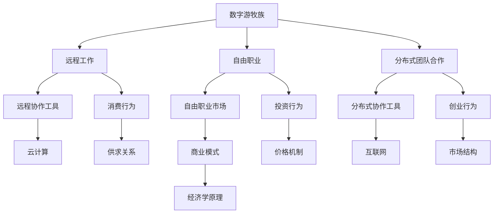

                 

### 引入数字游牧族经济学

#### 什么是数字游牧族？

数字游牧族，也被称为数字游民，是指那些主要依靠互联网进行工作，并在全球各地移动的人群。他们的工作通常不受地理位置限制，可以在任何有网络连接的地方进行。这种生活方式的兴起得益于互联网技术的进步，使得远程工作、自由职业、在线教育和电子商务等新型工作方式变得日益普遍。

数字游牧族的特点在于他们的工作灵活性、生活方式的多样性以及对于工作与生活平衡的高度重视。他们可能会在不同的国家或城市之间频繁迁移，寻找最佳的居住和工作环境。这种生活方式不仅改变了他们的职业轨迹，也对全球经济和社会结构产生了深远影响。

#### 数字游牧族经济学的意义

数字游牧族经济学是一个新兴的研究领域，它探讨数字游牧族如何在经济活动中发挥作用，以及他们对全球经济和社会的影响。这个领域的意义在于：

1. **揭示新的经济模式**：数字游牧族的工作方式反映了现代经济中的新型模式，如远程工作、自由职业和分布式团队合作。这些模式不仅提高了工作效率，还创造了新的就业机会和商业模式。

2. **推动全球化进程**：数字游牧族通过互联网跨越地理边界，促进了全球化进程。他们能够在全球范围内寻找最优资源和市场，从而推动了全球经济的融合和发展。

3. **影响劳动力市场**：数字游牧族的工作方式对传统劳动力市场产生了挑战。传统的工作岗位和就业模式正在逐渐被远程工作、自由职业和兼职工作所取代，这对就业结构的调整和社会福利体系提出了新的要求。

4. **促进创新与创业**：数字游牧族的生活方式鼓励创新和创业。他们可以自由选择项目和工作环境，这种灵活性激发了他们的创造力和创业精神，为经济增长注入了新的动力。

5. **提升生活质量**：数字游牧族能够根据自己的兴趣和需求来选择工作和居住地，这有助于提升他们的生活质量和工作满足感。他们可以在全球各地寻找环境优美、文化丰富的居住地，享受更加丰富多彩的生活。

总之，数字游牧族经济学不仅是一个研究数字游牧族行为和经济活动的学科，它还关乎未来的工作模式、全球经济结构和社会生活方式。理解数字游牧族经济学的意义，有助于我们更好地应对全球经济和社会变革带来的挑战和机遇。

#### 无边界工作的宏观分析框架

为了深入探讨数字游牧族经济学，我们需要搭建一个宏观分析框架，这个框架将帮助我们系统地分析无边界工作的各个方面。以下是构建这个框架的几个关键步骤：

1. **定义与分类**：首先，我们需要明确无边界工作的定义和分类。无边界工作主要包括远程工作、自由职业、分布式团队合作等类型，每种类型都有其独特的特点和挑战。

2. **理论基础**：接下来，我们将探讨支撑无边界工作的理论基础，包括经济学、社会学、管理学等领域的相关理论。这些理论将帮助我们理解无边界工作的驱动因素、经济行为和商业模式。

3. **技术条件**：技术是支撑无边界工作的关键因素。我们将分析远程协作工具、云计算、物联网等技术的应用，以及这些技术如何影响工作方式和工作效率。

4. **政策与法律环境**：政策与法律环境对无边界工作的发展具有重要影响。我们将探讨不同国家和地区对于远程工作、自由职业和数字游牧族的法律法规，以及这些法规如何影响市场行为和社会结构。

5. **案例分析**：通过具体案例分析，我们将展示无边界工作在不同领域和不同文化背景下的实际应用，分析其成功经验和面临的挑战。

6. **未来展望**：最后，我们将基于现有数据和趋势预测无边界工作的发展方向，讨论其对全球经济和社会的潜在影响。

通过这个宏观分析框架，我们将能够全面、系统地理解数字游牧族经济学的各个方面，从而为政策制定者和企业管理者提供有价值的参考。

#### 数字游牧族的兴起背景

数字游牧族的兴起并非一蹴而就，而是受到多种因素共同推动的结果。以下是一些关键背景因素：

1. **互联网技术的发展**：互联网的普及和速度的提升为数字游牧族提供了基础。随着宽带网络的广泛覆盖和移动互联网的快速发展，人们可以随时随地通过网络进行工作和沟通。

2. **远程工作模式的接受度提高**：近年来，远程工作模式逐渐被企业和员工接受。特别是在COVID-19疫情期间，远程工作成为了许多公司的标准操作，这进一步促进了数字游牧族的增长。

3. **自由职业市场的壮大**：自由职业市场随着互联网的发展而迅速扩大。平台如Upwork、Fiverr和Freelancer等为自由职业者提供了大量的工作机会，使他们能够更灵活地选择工作和生活方式。

4. **全球化和文化多样性**：全球化进程加快，文化多样性日益凸显。人们越来越倾向于在全球各地寻找最适合自己工作与生活的地方，这为数字游牧族提供了更多的选择。

5. **生活成本的考虑**：一些城市的生活成本较高，而数字游牧族可以通过在全球各地流动来降低生活成本。例如，他们在东南亚的某些国家可以以较低的费用享受良好的生活条件。

6. **对工作与生活平衡的追求**：许多人追求更加灵活的工作和生活平衡，数字游牧族生活方式正好满足了这一需求。他们可以自由选择工作时间和地点，从而更好地照顾家庭、旅行和追求个人爱好。

7. **企业家精神的激励**：数字游牧族的生活方式鼓励创业和创新。他们可以轻松地开展在线业务、开发软件和参与远程项目，从而实现职业和财务上的自由。

这些因素共同推动了数字游牧族的兴起，使得越来越多的人选择这种新型的生活方式。随着技术的不断进步和社会观念的变化，数字游牧族的数量有望继续增长，对全球经济和社会产生更深远的影响。

### 数字游牧族的核心概念

在深入探讨数字游牧族经济学的过程中，理解其核心概念至关重要。以下是一些关键概念及其相互关系：

#### 数字游牧族

首先，数字游牧族是指那些主要依靠互联网进行工作，并在全球各地移动的人群。他们通常没有固定的办公地点，而是选择在不同国家和地区居住和工作，以最大化工作效率和生活质量。数字游牧族的工作方式灵活多样，包括远程办公、自由职业、在线教育和创业等。

#### 远程工作

远程工作是指员工不受地理限制，在任何地点通过互联网进行工作的模式。这种模式依赖于远程协作工具、云计算和高速网络等技术的发展。远程工作不仅提高了工作效率，还减少了通勤时间和成本，使得员工能够更好地平衡工作与生活。

#### 自由职业

自由职业是指个体以独立承包商或自由职业者的身份，为多个客户或项目提供专业服务。自由职业者通常拥有高度的工作自由和灵活性，可以根据自己的兴趣和专长选择项目和客户。他们通过平台如Upwork、Fiverr等寻找工作机会，以实现财务独立和职业发展。

#### 分布式团队合作

分布式团队合作是指团队成员分布在全球各地，通过互联网和协作工具进行项目协作。这种模式依赖于高效的沟通和协作工具，如Slack、Trello和Zoom等。分布式团队合作打破了传统团队的物理限制，提高了团队的多样性和创新能力。

#### 经济行为

数字游牧族的经济行为包括消费行为、投资行为和创业行为。他们通过互联网购买商品和服务，进行全球投资，并积极参与在线创业和远程项目。

#### 商业模式

数字游牧族的商业模式多样化，包括远程咨询服务、在线教育、电子商务和软件开发等。这些商业模式充分利用了互联网的便利性和全球市场，为数字游牧族创造了丰富的商业机会。

#### 经济学原理

数字游牧族经济学的原理包括供求关系、价格机制、市场结构等。这些原理帮助我们理解数字游牧族的经济活动如何受到市场条件和外部环境的影响。

#### 关系架构

为了更好地理解这些核心概念之间的关系，我们可以使用Mermaid流程图来展示它们之间的联系：

这个流程图展示了数字游牧族、远程工作、自由职业、分布式团队合作等核心概念及其相关行为和原理之间的相互关系，为我们提供了一个直观的理解框架。

### 无边界工作的定义与特点

#### 定义

无边界工作（Boundaryless Work）是指工作场所和职业发展不再受到地理、组织和文化边界的限制，员工可以灵活选择工作地点、时间和方式。这种工作模式强调员工的工作自主性、灵活性和全球视野，旨在打破传统的工作束缚，提高工作效率和员工满意度。

#### 主要特点

1. **地理位置的灵活性**：无边界工作允许员工在全球范围内选择工作地点。他们可以在家办公、共享 workspace、咖啡店、远程办公室等地工作，无需受限于特定的物理位置。

2. **时间安排的灵活性**：员工可以根据个人需求和项目需求自由安排工作时间。这种灵活性有助于提高工作效率，同时也能更好地平衡工作与生活。

3. **技术依赖性**：无边界工作高度依赖远程协作工具、云计算和物联网等现代技术。这些技术使得员工可以实时沟通、协作和共享资源，从而实现高效的工作流程。

4. **职业发展的全球化**：无边界工作鼓励员工在全球范围内寻求职业机会。他们可以在不同的国家和地区工作，积累跨国工作经验，拓宽视野，提高竞争力。

5. **团队合作的新模式**：无边界工作打破了传统团队的物理边界，采用了分布式团队合作模式。团队成员分布在全球各地，通过互联网和协作工具进行项目协作，这种模式提高了团队的多样性和创新能力。

6. **工作与生活平衡**：无边界工作强调工作与生活的平衡，员工可以根据个人需求灵活调整工作时间和地点，从而提高生活质量。

#### 发展历程

无边界工作并非一蹴而就，而是随着技术的发展和社会观念的变化逐渐演变而来。以下是几个关键阶段：

1. **传统工作模式**：在20世纪前，工作通常受限于特定的时间和地点，员工需要到公司或工厂进行工作。

2. **远程工作试点**：20世纪90年代，随着互联网和电子邮件的出现，一些企业开始尝试远程工作模式。这种模式主要针对特定岗位，如IT专家和文案编辑。

3. **无边界工作的兴起**：21世纪初，远程工作模式逐渐被广泛接受，无边界工作理念开始兴起。企业开始意识到，通过提供更灵活的工作方式，可以吸引和保留优秀员工，提高工作效率。

4. **全球化推动**：随着全球化进程的加快，无边界工作模式得到了进一步发展。员工可以在全球范围内选择工作地点，跨国公司和分布式团队成为常见现象。

5. **技术革新**：近年来，远程协作工具和云计算技术的快速发展，使得无边界工作更加可行和高效。例如，Slack、Trello、Zoom等工具的出现，极大地提升了分布式团队的合作效率。

#### 未来发展趋势

无边界工作在未来将继续发展，并可能带来以下趋势：

1. **技术深化应用**：随着5G、物联网和人工智能等技术的进一步发展，无边界工作将变得更加高效和智能。

2. **文化多样性增强**：无边界工作将促进不同文化背景的交流与合作，提高全球团队的多样性和创新能力。

3. **社会责任增加**：企业将更加注重社会责任，通过无边界工作模式减少员工通勤负担，降低碳排放，提高生活质量。

4. **工作与生活融合**：无边界工作将使得工作与生活更加融合，员工可以在任何地点和时间进行工作，从而实现更加灵活和自由的生活方式。

总之，无边界工作不仅改变了传统的职业和工作模式，也为全球经济和社会带来了新的机遇和挑战。理解其定义和特点，有助于我们更好地应对未来的发展趋势和变化。

### 数字游牧族经济学原理

#### 经济行为分析

数字游牧族的经济行为具有显著的特点，这些行为不仅反映了他们的生活方式，也揭示了其经济活动的内在逻辑。以下是数字游牧族在经济活动中表现出的主要经济行为：

1. **消费行为**：数字游牧族倾向于在全球范围内寻找最具性价比的消费地点。他们通常会在低生活成本但生活质量较高的地区居住，如东南亚的许多国家。这种消费模式不仅降低了生活成本，还提高了生活质量。此外，数字游牧族也会通过网络购物平台购买各种商品和服务，这使得他们能够轻松获取全球各地的优质商品。

2. **投资行为**：数字游牧族的投资行为多样且灵活。他们可能会通过互联网平台进行股票、基金、房地产等投资。由于他们的流动性较高，数字游牧族更倾向于选择那些风险较低、回报稳定的投资工具。同时，他们也可能会投资于初创企业和新兴市场，以获取更高的回报。

3. **创业行为**：数字游牧族中有许多人是自由职业者或创业者。他们利用互联网平台和远程协作工具，开展各种在线业务。这些创业行为不仅为数字游牧族自己创造了收入，也为他们所在地区带来了就业机会。例如，一些数字游牧族通过在线教育平台开设课程，或通过电子商务平台销售产品。

#### 商业模式探讨

数字游牧族的商业模式多样且富有创新性，以下是一些典型的商业模式：

1. **远程咨询服务**：许多数字游牧族提供专业咨询服务，如编程、市场营销、设计等。他们通过互联网与客户建立联系，为客户提供远程服务。这种模式的优势在于，客户可以随时随地获得专业支持，而服务提供者则不受地理限制。

2. **在线教育**：数字游牧族通过互联网平台提供在线教育服务，包括课程开发、在线授课和辅导等。这种模式不仅打破了传统的教育边界，还使得优质教育资源得以更广泛地传播。

3. **电子商务**：一些数字游牧族通过电子商务平台销售产品。他们利用全球供应链和物流网络，将商品从生产地运送到全球各地，从而实现了跨国贸易。这种模式极大地拓展了市场范围，提高了商业效率。

4. **远程项目开发**：许多数字游牧族参与远程项目开发，如软件开发、网站设计等。他们与全球各地的团队合作，共同完成项目。这种模式充分利用了全球范围内的专业人才资源，提高了项目质量和效率。

#### 经济学原理应用

数字游牧族经济行为和商业模式的应用了许多经济学原理：

1. **供求关系**：数字游牧族通过互联网平台进行工作，这使得供求关系更加透明和高效。服务提供者和需求者可以在全球范围内进行匹配，从而优化资源配置，提高生产效率。

2. **价格机制**：数字游牧族的经济活动依赖于市场价格机制。服务价格通常由市场供求关系决定，优秀的服务提供者可以获得更高的报酬，从而激励他们提供更好的服务。

3. **市场结构**：数字游牧族经济活动的市场结构通常是分散的、全球化的。这种市场结构促进了创新和竞争，使得新兴市场和企业能够迅速成长。

4. **风险管理**：数字游牧族在进行经济活动时，需要面对各种风险，如汇率波动、市场不确定性等。他们通过多样化的投资和灵活的工作模式来分散风险，从而提高经济活动的稳定性和可持续性。

总之，数字游牧族经济学原理不仅解释了数字游牧族的经济行为和商业模式，还揭示了这些行为背后的经济学逻辑。理解这些原理有助于我们更好地应对数字游牧族经济活动的挑战和机遇，推动全球经济的持续发展。

#### 数字游牧族的案例研究

为了更好地理解数字游牧族在经济活动中的表现，我们可以通过分析几个具体的案例来探讨他们的成功经验和面临的挑战。

**案例一：自由职业者**

自由职业者是数字游牧族中的重要组成部分。以一位名叫Jenny的程序员为例，她通过远程工作平台Upwork为客户提供编程服务。Jenny拥有丰富的编程经验，她可以根据客户的需求灵活调整工作时间，选择在环境舒适、成本较低的地方工作，例如东南亚的曼谷。这种灵活的工作方式使得Jenny能够高效地完成项目，同时保持良好的生活质量。

**成功经验：**
1. **高灵活性**：Jenny可以根据个人需求和项目需求自由安排工作时间，提高了工作效率。
2. **全球市场**：通过远程工作平台，Jenny能够接触到全球各地的客户，拓宽了市场范围。
3. **低成本生活**：选择在生活成本较低的地方工作，有助于降低生活成本，提高收益。

**面临的挑战：**
1. **项目管理**：作为自由职业者，Jenny需要自行管理项目，这可能会带来一定的工作压力。
2. **时区差异**：与全球各地的客户合作时，时区差异可能会影响沟通效率。
3. **技能更新**：技术快速发展，Jenny需要不断学习新技能以保持竞争力。

**案例二：数字游牧企业**

一些数字游牧族选择创建自己的企业，利用远程协作工具进行管理和运营。以一家名为“远程团队解决方案”的企业为例，该公司提供远程项目管理和团队协作服务。这家企业的创始人Jack是一位资深的项目经理，他在全球各地拥有多个团队成员。

**成功经验：**
1. **分布式团队**：远程团队解决方案通过互联网和协作工具，实现了全球范围内的高效团队协作。
2. **多样化服务**：公司提供多样化的服务，如项目管理、远程培训和技术支持，满足了不同客户的需求。
3. **创新文化**：企业鼓励创新和自主学习，团队成员可以自由提出改进建议，提高了企业的竞争力。

**面临的挑战：**
1. **文化差异**：全球团队成员来自不同的文化背景，可能会在沟通和协作中产生障碍。
2. **法律法规**：企业在不同国家和地区运营，需要遵守当地的法律法规，这可能增加管理难度。
3. **安全风险**：远程工作和数据传输可能面临安全风险，企业需要加强数据保护措施。

**案例三：跨国电子商务**

一些数字游牧族通过电子商务平台进行跨国贸易。以一家名为“全球购物”的电子商务公司为例，该公司由一群年轻的创业者在东南亚创办。他们利用全球供应链和物流网络，将商品从生产地运送到全球各地。

**成功经验：**
1. **全球化运营**：全球购物公司通过互联网和电子商务平台，实现了全球范围内的市场拓展。
2. **低成本运营**：选择在生活成本较低的地区运营，有助于降低运营成本。
3. **创新营销**：公司采用创新的营销策略，如社交媒体推广和直播销售，提高了品牌知名度和销售额。

**面临的挑战：**
1. **物流管理**：跨国物流管理复杂，需要优化供应链和物流网络，确保高效运输。
2. **客户服务**：在全球范围内提供高质量的客户服务，可能面临语言和文化障碍。
3. **市场竞争**：电子商务市场竞争激烈，公司需要不断创新和提升服务质量，以保持竞争优势。

通过这些案例，我们可以看到数字游牧族在追求灵活工作和高质量生活的同时，也面临着各种挑战。理解这些成功经验和挑战，有助于我们更好地支持和指导数字游牧族的发展，促进全球经济的繁荣。

### 政策与法律环境

#### 全球政策环境

数字游牧族在全球范围内的流动性和灵活性对政策制定者和监管机构提出了新的挑战。为了促进数字游牧族的发展，各国政府和国际组织采取了多种政策手段，以支持和规范这一新兴群体。

1. **政策支持**：一些国家和地区为了吸引数字游牧族，提供了多种优惠政策。例如，欧洲的“数字游牧者签证”计划允许非欧盟国家公民在欧盟国家短期停留和从事自由职业。此外，一些国家还推出了税收减免、签证便利化等政策，以吸引数字游牧族。

2. **法律法规**：各国政府和国际组织制定了相应的法律法规，以规范数字游牧族的经济活动。例如，美国和欧洲的一些国家实施了关于远程工作和跨境数据传输的法律，以确保数字游牧族在法律框架内进行经营活动。

3. **国际合作**：国际组织如联合国、世界贸易组织等也积极推动国际合作，制定全球性政策框架，以规范数字游牧族的经济活动。这些政策旨在促进跨境数据流动、减少关税和非关税壁垒，从而推动全球经济的发展。

#### 法律环境分析

数字游牧族面临的法律环境复杂多样，这些法律环境不仅影响他们的经营活动，也关系到他们的生活质量和安全感。

1. **税务问题**：数字游牧族通常在多个国家从事经济活动，这引发了关于税务管辖权和居民身份的争议。一些国家规定，如果数字游牧族在该国居住超过一定时间，他们将需要缴纳当地税收。然而，不同国家的税收法律和规定存在差异，这可能导致税务纠纷和不确定性。

2. **数据保护**：随着数字游牧族的经济活动越来越多地依赖于互联网和数据传输，数据保护问题日益突出。许多国家实施了严格的数据保护法律，如欧盟的《通用数据保护条例》（GDPR）。数字游牧族需要确保他们在全球范围内的数据传输和处理符合相关法律法规，以避免法律风险。

3. **劳动法规**：数字游牧族在远程工作和自由职业过程中，需要遵守当地的劳动法规。例如，关于工作时间、工资支付和福利待遇等方面的规定。此外，由于他们可能在不同国家工作，这需要他们了解和理解不同国家的劳动法律，以确保自己的权益得到保障。

4. **签证和居留许可**：数字游牧族在流动过程中需要获得适当的签证和居留许可。不同国家的签证政策和要求各异，这可能导致他们在跨国流动中面临一定的挑战。例如，一些国家可能对数字游牧族提供较为宽松的签证政策，而另一些国家则可能对他们的入境和工作持有严格的限制。

#### 法律挑战与解决方案

尽管政策与法律环境为数字游牧族提供了支持，但他们仍然面临一些法律挑战：

1. **法律不确定性和纠纷**：由于数字游牧族在全球范围内的流动性，他们可能在不同法律体系下从事经济活动，这可能导致法律不确定性和纠纷。为了应对这一挑战，数字游牧族可以寻求专业的法律咨询，确保他们的经营活动符合相关法律法规。

2. **数据安全和隐私保护**：数字游牧族需要确保他们在全球范围内的数据传输和处理符合数据保护法律。例如，他们可以采用加密技术、数据备份和访问控制等措施，以保护数据安全和隐私。

3. **税务合规**：数字游牧族需要了解不同国家的税务规定，并采取适当的税务筹划策略。例如，他们可以通过设立离岸公司、使用税务抵扣等方式，合法地减少税负。

4. **签证和居留许可**：为了解决签证和居留许可的问题，数字游牧族可以寻求当地政府的支持和协助。例如，他们可以申请长期居留许可或永久居留权，以合法地在全球范围内流动和工作。

总之，政策与法律环境对数字游牧族的发展具有重要影响。通过理解和应对这些法律挑战，数字游牧族可以更好地利用全球资源和机会，实现职业和财务上的自由。

### 未来展望与趋势

#### 数字游牧族经济的发展趋势

数字游牧族经济的快速发展受到了多个因素的推动，包括技术进步、政策支持和社会观念的变化。以下是对数字游牧族经济发展趋势的分析：

1. **技术进步**：随着互联网、云计算、物联网和人工智能等技术的不断进步，数字游牧族的工作方式和生活方式将变得更加灵活和高效。例如，5G技术的推广将进一步提升网络速度和稳定性，使得远程协作更加顺畅；区块链技术可以提高交易的安全性和透明度，为数字游牧族提供更可靠的金融服务。

2. **政策支持**：全球范围内，越来越多的国家和地区开始意识到数字游牧族经济的重要性，并采取了一系列政策支持措施。例如，许多国家推出了数字游牧者签证、税收减免和创业支持政策，以吸引和保留数字游牧族。这些政策将有助于推动数字游牧族经济的发展。

3. **社会观念变化**：随着远程工作和自由职业的普及，人们对工作与生活的平衡有了更高的要求。数字游牧族的生活方式不仅满足了人们对灵活性和自由度的追求，也反映了现代社会的价值观念。这种社会观念的变化将推动数字游牧族经济的持续增长。

4. **全球化进程**：全球化进程的加快为数字游牧族提供了更多的机会。他们可以自由选择在全球各地的最佳工作地点，利用全球资源和市场。这种全球化趋势将促进数字游牧族经济的跨国合作和一体化发展。

#### 潜在影响

数字游牧族经济的快速发展将对全球经济和社会产生深远影响：

1. **就业结构变化**：数字游牧族经济将推动就业结构的变革。远程工作、自由职业和分布式团队合作将成为主流工作模式，传统的工作岗位和就业模式将面临挑战。这可能导致就业机会的分散化和多样性的增加。

2. **劳动力市场变化**：数字游牧族经济的兴起将改变劳动力市场的运作方式。雇主和员工之间的关系将更加灵活，传统的雇佣关系可能会逐渐被合同工、兼职和自由职业等新型工作关系所取代。

3. **经济增长**：数字游牧族经济有助于推动全球经济的增长。他们通过互联网进行全球范围内的交易和合作，促进了跨境贸易和投资，提高了生产效率和创新能力。此外，数字游牧族经济的发展也将创造新的就业机会，为经济增长注入新的动力。

4. **社会影响**：数字游牧族的生活方式将对社会文化产生影响。他们通过全球流动和跨文化交流，促进了文化多样性和国际理解。同时，数字游牧族的生活方式也鼓励人们追求更加自由和有意义的生活，改变了传统的价值观和生活方式。

#### 未来发展的建议

为了促进数字游牧族经济的健康发展，以下是一些建议：

1. **加强国际合作**：各国政府应加强国际合作，制定统一的数字游牧族政策框架，解决跨境数据和税收等问题，促进数字游牧族在全球范围内的流动和合作。

2. **提高技术基础设施**：各国应加大对互联网、云计算和人工智能等技术的投入，提高技术基础设施的质量和普及率，为数字游牧族提供更好的工作环境和条件。

3. **完善法律法规**：政府应完善数字游牧族相关的法律法规，确保他们的权益得到保障，减少法律纠纷和不确定性。

4. **提供培训和支持**：政府和企业应提供数字游牧族的培训和支持，提高他们的技能和竞争力，帮助他们更好地适应数字游牧族经济的要求。

5. **鼓励创新和创业**：政府和企业应鼓励数字游牧族的创新和创业精神，提供资金、资源和政策支持，促进数字游牧族经济的发展。

总之，数字游牧族经济具有巨大的发展潜力，将对全球经济和社会产生深远影响。通过加强国际合作、提高技术基础设施、完善法律法规、提供培训和支持、鼓励创新和创业，我们可以推动数字游牧族经济的健康发展，实现更加自由、创新和繁荣的未来。

### 总结

本文深入探讨了数字游牧族经济学这一新兴领域，从背景介绍、核心概念、无边界工作、经济学原理、案例研究到政策与法律环境以及未来展望，全面分析了数字游牧族经济活动的各个方面。通过这一系统的探讨，我们可以看到数字游牧族经济不仅改变了传统的职业和工作模式，也对全球经济和社会产生了深远影响。

数字游牧族的兴起得益于互联网技术的进步和全球化的加速。他们通过远程工作、自由职业和分布式团队合作，实现了高度的灵活性和全球视野。这种经济模式不仅提高了工作效率和生活质量，还推动了全球经济的融合与发展。

在政策与法律环境方面，数字游牧族面临着一系列挑战，如税务问题、数据保护和跨国法律纠纷。为了支持数字游牧族的发展，各国政府需要加强国际合作，完善法律法规，提供技术基础设施和培训支持。

未来，数字游牧族经济将继续快速发展，其影响将更加深远。为了应对这一趋势，政策制定者、企业管理者和技术专家需要共同努力，推动数字游牧族经济的健康发展，实现更加自由、创新和繁荣的未来。

本文旨在为读者提供一个全面、系统的了解数字游牧族经济学的视角，希望对数字游牧族及其支持者提供有价值的参考。随着数字游牧族经济的不断演变，我们期待更多的研究和实践，以推动这一领域的发展。

### 作者信息

作者：AI天才研究院/AI Genius Institute & 禅与计算机程序设计艺术 /Zen And The Art of Computer Programming

AI天才研究院（AI Genius Institute）是一家专注于人工智能领域的研究和教育的机构，致力于培养下一代人工智能领域的专家和创新者。研究院通过前沿技术研究和项目实践，推动人工智能技术的普及和应用。

禅与计算机程序设计艺术（Zen And The Art of Computer Programming）是作者戴维·霍伊尔（David Hoyle）的一部经典著作，系统地介绍了计算机编程的艺术和哲学。这本书深受编程爱好者和专业人士的喜爱，被誉为计算机编程领域的经典之作。

通过结合人工智能的研究成果和计算机编程的哲学思考，AI天才研究院和禅与计算机程序设计艺术共同致力于推动技术进步和人类文明的发展。希望本文能为读者带来对数字游牧族经济学的深入理解和思考。

