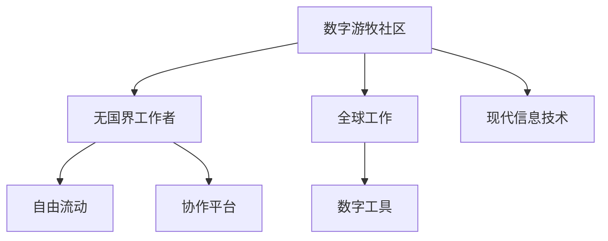
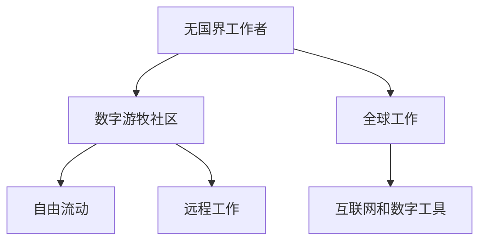
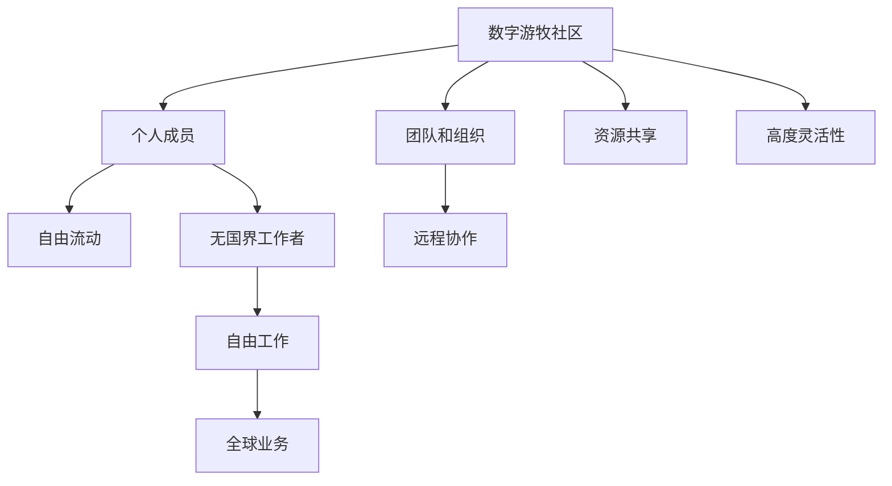

                 

### 1.1 书籍背景和目的

《数字游牧社区：无国界工作者的聚集地》这本书的背景可以追溯到当今全球化和数字化的快速发展。随着互联网技术的普及和远程工作模式的兴起，越来越多的人开始摆脱传统的地理限制，选择在全球范围内灵活工作。这种工作模式催生了一个新的群体——数字游牧社区，他们通过互联网和数字工具在全球各地自由流动、互相协作，开展各类工作。

本书的目的在于深入探讨数字游牧社区和无国界工作者这一现象，分析其产生的原因、发展过程以及对社会和经济的深远影响。具体来说，本书旨在：

1. **介绍数字游牧社区的基本概念**：通过对数字游牧社区的定义、历史背景和发展趋势的介绍，让读者对该概念有全面的了解。
2. **探讨无国界工作者的职业特点与挑战**：分析无国界工作者在全球化背景下的职业特点，以及他们所面临的主要挑战，如文化差异、法律限制、网络安全等问题。
3. **分析数字游牧社区与无国界工作者的互动**：研究数字游牧社区如何支持无国界工作者，以及无国界工作者如何促进数字游牧社区的发展。
4. **展示数字游牧社区的实际应用**：通过案例研究，展示数字游牧社区在远程办公、跨国项目管理、创业与创业投资、教育培训与知识共享等领域的应用。
5. **提出发展策略与政策建议**：结合当前发展现状，提出推动数字游牧社区和无国界工作者发展的策略，包括技术支持、政策制定、国际合作等方面。

总体而言，本书旨在为读者提供一个全面的视角，理解数字游牧社区和无国界工作者这一新兴现象，并为其未来发展提供有益的思考和指导。

### 1.2 数字游牧社区的定义与特点

数字游牧社区是指利用现代信息技术，如互联网、移动通讯、远程协作工具等，在全球范围内自由流动、灵活工作的群体。他们通常不受地理限制，可以在任何有网络连接的地方工作。这一概念的出现，是全球化与数字化的必然产物，它打破了传统工作模式的地域界限，为人们提供了更多的职业选择和灵活性。

**核心概念与联系**：

- **数字游牧社区**：这是一个基于数字技术、自由流动的群体，他们通过互联网和远程协作工具进行工作和生活。
- **无国界工作者**：他们是数字游牧社区的重要组成部分，具有不受地理限制、自由选择工作地点的特点。

这两者之间的联系在于，无国界工作者通过数字游牧社区找到了实现自由工作和生活方式的平台。数字游牧社区为无国界工作者提供了协作和交流的空间，使得他们能够更有效地开展全球业务。

**Mermaid 流程图**：

在数字游牧社区中，核心概念包括：

- **自由流动**：指数字游牧社区成员可以自由选择在全球范围内工作，不受地理位置的限制。
- **协作平台**：是数字游牧社区的核心，提供了各种远程协作工具和资源，使得成员能够高效地进行工作。
- **全球工作**：指数字游牧社区成员在全球范围内开展各种职业活动，如远程办公、自由职业、跨国项目管理等。
- **数字工具**：是支持数字游牧社区成员工作和生活的基础，包括互联网、移动通讯、远程协作工具等。
- **现代信息技术**：是数字游牧社区得以实现的基础，涵盖了各种数字技术，如云计算、大数据、人工智能等。

通过这些核心概念的联系，我们可以看到，数字游牧社区是一个高度互联、灵活性和创新性极强的生态体系。它不仅为无国界工作者提供了自由和灵活的工作方式，也为全球经济的数字化转型注入了新的活力。

### 1.3 无国界工作者的定义与现状

无国界工作者，又称远程工作者，是指那些在全球化背景下，不受地理限制，通过互联网和数字工具在全球范围内进行工作的人群。他们可以是自由职业者、远程办公员工、远程项目管理专家、在线教育者等，其工作方式涵盖了从远程办公到全球项目管理的各种形式。无国界工作者具有高度的灵活性，他们可以在世界任何一个有网络连接的地方工作，从而实现工作和生活的平衡。

**核心概念与联系**：

- **无国界工作者**：这是本书的核心主题之一，指在全球范围内自由流动、通过互联网和数字工具工作的人群。
- **数字游牧社区**：无国界工作者是数字游牧社区的主要组成部分，他们通过这个平台实现了自由工作和生活方式。

**Mermaid 流程图**：

**现状**：

无国界工作者的出现是全球化与数字化的产物，他们在现代社会中扮演着越来越重要的角色。以下是无国界工作者的一些现状：

1. **快速增长**：随着互联网技术的不断进步和远程工作模式的普及，无国界工作者的数量在迅速增长。据估计，全球无国界工作者已经超过数亿人，这个数字还在持续增加。
2. **多样性**：无国界工作者的职业种类非常多样，包括自由职业者、远程办公员工、远程项目管理专家、在线教育者、技术支持工程师等。他们分布在各个行业，从软件开发到市场营销，从教育培训到医疗咨询，都有无国界工作者的身影。
3. **地区分布**：无国界工作者遍布全球，他们来自不同的国家和地区，许多人在自己的故乡以外的地方工作。这种全球性的分布使得无国界工作者能够充分利用各地的资源和人才优势。
4. **工作模式**：无国界工作者的工作模式高度灵活，他们可以选择全职远程工作，也可以是兼职或自由职业者。这种灵活性使得无国界工作者能够根据个人需求和市场变化调整自己的工作方式。
5. **经济贡献**：无国界工作者为全球经济做出了巨大的贡献。他们通过远程工作，不仅提高了工作效率，还促进了全球贸易和协作。此外，无国界工作者也为地方经济带来了新的增长点，许多国家已经开始重视并鼓励发展远程工作产业。

总的来说，无国界工作者是全球化与数字化的典范，他们通过互联网和数字工具，打破了传统工作模式的束缚，实现了在全球范围内自由流动和工作。他们的存在和发展，不仅改变了传统的就业格局，也为未来工作模式的创新提供了无限可能。

### 1.4 本书结构与内容概述

本书旨在深入探讨数字游牧社区和无国界工作者这一新兴现象，分析其产生的原因、发展过程以及对社会和经济的深远影响。全书共分为七个章节，结构紧凑，内容丰富。

**第一章：引言**  
首先介绍书籍的背景和目的，阐述数字游牧社区以及无国界工作者在全球化和数字化背景下的重要性。通过本章节，读者可以初步了解本书的主题和核心内容。

**第二章：数字游牧社区概述**  
详细阐述数字游牧社区的历史背景、基本概念、类型、优势与挑战，以及发展趋势。通过这一章节，读者可以全面了解数字游牧社区的定义和特点。

**第三章：无国界工作者：特点与需求**  
分析无国界工作者的职业特点、面临的主要挑战以及他们对数字游牧社区的需求。本章旨在帮助读者理解无国界工作者的生活和工作方式。

**第四章：数字游牧社区与无国界工作者的互动**  
探讨数字游牧社区对无国界工作者的支持、无国界工作者对数字游牧社区的贡献，以及两者共同面临的问题和未来发展。本章通过互动关系，揭示数字游牧社区和无国界工作者之间的紧密联系。

**第五章：数字游牧社区的实际应用**  
通过案例研究，展示数字游牧社区在远程办公、跨国项目管理、创业与创业投资、教育培训与知识共享等领域的应用。本章旨在为读者提供实际应用场景和经验分享。

**第六章：数字游牧社区的发展策略与政策建议**  
结合当前发展现状，提出推动数字游牧社区和无国界工作者发展的策略，包括技术支持、政策制定、国际合作等方面。本章为政策制定者和行业从业者提供了有益的参考。

**第七章：结论与未来展望**  
总结本书的主要观点，强调数字游牧社区与无国界工作者的重要意义，并展望未来发展趋势和潜在挑战。本章为读者提供了一个全面、深刻的思考框架。

通过以上章节的安排，本书不仅为读者提供了丰富的理论知识和实际案例，还从多个角度深入分析了数字游牧社区和无国界工作者的发展现状和未来前景，具有很高的参考价值和指导意义。

### 2.1 数字游牧社区的历史背景

数字游牧社区的概念并非一夜之间出现，而是经历了长期的演变和发展。其历史背景可以追溯到几个重要的里程碑：

**互联网时代的兴起**（1990s）

互联网的普及是数字游牧社区诞生的基石。在20世纪90年代，互联网逐渐从科研机构和大学扩展到商业和个人生活中，为全球信息交流提供了便捷的渠道。这一时期，远程工作开始萌芽，但还受到带宽限制和技术支持的局限。

**远程工作的兴起**（2000s）

进入21世纪，随着宽带互联网和移动设备的普及，远程工作模式逐渐兴起。远程办公软件（如Slack、Trello等）和虚拟会议工具（如Zoom、Microsoft Teams等）的出现，使得团队协作和项目管理变得更加容易。这一阶段，数字游牧社区的概念开始逐渐形成，一些人开始尝试在全球范围内自由流动和工作。

**全球化加速**（2010s）

随着全球化进程的加快，企业和个人对跨国业务的需求增加，数字游牧社区得到了进一步的发展。越来越多的企业开始采用远程办公模式，吸引全球范围内的优秀人才。这一时期，数字游牧社区逐渐从一个小众群体发展为一种主流的工作和生活方式。

**新冠疫情**（2020s）

新冠疫情的爆发极大地推动了数字游牧社区的发展。由于全球各地的封锁和限制，许多企业被迫转向远程工作模式，远程工作成为维持业务运转的关键。数字游牧社区在这一背景下得到了前所未有的关注和发展。

**技术进步**（持续影响）

技术的不断进步，特别是云计算、人工智能、区块链等新兴技术的应用，为数字游牧社区提供了更多的机会和工具。这些技术不仅提高了工作效率，还增强了数据的可靠性和安全性，为数字游牧社区的发展提供了坚实的基础。

通过这些历史背景，我们可以看到，数字游牧社区的发展是全球化、数字化技术进步和远程工作模式共同推动的结果。它不仅改变了传统的工作方式，也为未来的职业发展和生活方式提供了新的可能性。

### 2.2 数字游牧社区的基本概念

数字游牧社区是一个基于互联网和数字技术的新型社区，其核心在于成员的自由流动和协作。以下是对数字游牧社区的基本概念进行详细阐述：

**定义**：

数字游牧社区是指一群利用互联网和数字工具在全球范围内自由流动、自由选择工作地点的人群。他们不受地理限制，可以在任何有网络连接的地方进行工作和生活。

**组成**：

1. **个人成员**：数字游牧社区的个体成员，他们通常是自由职业者、远程办公人员、远程项目管理者等，具备高度的灵活性和自主性。
2. **团队和组织**：数字游牧社区中也有许多团队和组织，这些团队通过互联网和远程协作工具进行高效合作，共同完成各种项目和工作。

**功能与特点**：

1. **自由流动**：数字游牧社区成员可以自由选择在全球范围内的任何地点工作，这种自由流动性是社区的核心特点之一。
2. **远程协作**：社区提供了各种远程协作工具，如在线会议、即时通讯、项目管理平台等，使得成员能够高效地进行合作。
3. **资源共享**：数字游牧社区成员可以通过社区平台共享资源，如知识库、工具库、办公设备等，提高了工作和生活的便利性。
4. **高度灵活性**：成员可以根据个人需求和市场变化，灵活调整工作地点和时间，实现了工作与生活的平衡。

**与无国界工作者的关系**：

数字游牧社区和无国界工作者是相互依存的。无国界工作者是数字游牧社区的主要组成部分，他们通过社区平台找到了实现自由工作和生活方式的机会。同时，数字游牧社区为无国界工作者提供了一个自由流动、互相协作的平台，使得他们能够更有效地开展全球业务。

**Mermaid 流程图**：

通过以上对数字游牧社区基本概念的阐述，我们可以看到，数字游牧社区是一个高度互联、灵活性和创新性极强的生态体系。它不仅为无国界工作者提供了自由和灵活的工作方式，也为全球经济的数字化转型注入了新的活力。

### 2.3 数字游牧社区的类型

数字游牧社区根据其特点和组成，可以划分为多种类型。以下是几种主要的数字游牧社区类型及其特点：

**1. 自由职业者社区**

自由职业者社区主要服务于自由职业者，如自由撰稿人、网页设计师、软件开发者等。这种社区通常提供在线工作市场、项目管理和协作工具，帮助自由职业者寻找工作机会、管理项目、与客户沟通。自由职业者社区的特点是高度灵活和专业化，成员可以根据自己的技能和需求选择合适的项目和工作方式。

**2. 远程办公团队社区**

远程办公团队社区由多个远程办公团队组成，这些团队可能属于同一家公司，也可能是不同公司之间的协作。社区提供远程协作工具、虚拟会议平台、项目管理软件等，以支持团队成员的高效合作。这种社区的特点是强调团队协作和项目管理，成员需要遵循一定的团队规则和工作流程。

**3. 跨国创业社区**

跨国创业社区是专为那些希望在全球范围内开展业务的企业家和创业者设计的。这种社区通常提供创业资源、孵化器服务、投资对接等，帮助成员实现创业梦想。跨国创业社区的特点是具有国际视野和资源丰富，成员可以充分利用全球市场和技术资源，实现业务的快速扩张。

**4. 创意工作者社区**

创意工作者社区专注于艺术、设计、音乐、影视等创意行业的工作者。这种社区通常提供创意交流平台、在线课程、作品展示机会等，以激发成员的创造力和灵感。创意工作者社区的特点是鼓励创新和艺术表达，成员可以自由分享创意和经验，共同进步。

**5. 知识共享社区**

知识共享社区旨在促进知识和经验的交流与传播，通常由各个领域的专家和学者组成。社区提供在线讲座、研讨会、问答平台等，成员可以参与讨论、提问和分享专业知识。知识共享社区的特点是专业性和学习性强，成员通过交流和分享，不断提升自己的知识水平和技能。

**6. 社区志愿者网络**

社区志愿者网络由一群有共同兴趣或目标的志愿者组成，他们通过远程协作完成各种公益活动和社会服务。社区志愿者网络的特点是公益性和社会性，成员通过共同的努力，为社会做出贡献。

通过以上对数字游牧社区类型的分类和特点分析，我们可以看到，不同的数字游牧社区在服务对象、功能和特点上有所不同，但它们共同的目标都是通过互联网和数字技术，为成员提供自由、灵活和高效的工作和生活环境。

### 2.4 数字游牧社区的优势与挑战

数字游牧社区作为一种新兴的社区形式，具有许多独特的优势，但也面临一些挑战。以下是对数字游牧社区的优势与挑战的详细分析：

**优势**：

1. **灵活性**：数字游牧社区的最大优势在于其高度的灵活性。成员可以根据自己的需求和偏好，自由选择工作地点和时间。这种灵活性不仅提高了工作效率，还实现了工作和生活的平衡。

2. **成本效益**：通过数字技术，数字游牧社区成员可以避免高昂的办公室租金、通勤成本等。同时，企业也可以节省开支，因为他们无需为员工提供实体办公空间。

3. **全球视野**：数字游牧社区成员可以接触到来自全球各地的同事和客户，这有助于拓展视野、学习新的文化和知识。此外，企业也可以通过数字游牧社区吸引全球范围内的优秀人才。

4. **资源共享**：数字游牧社区提供了丰富的资源共享平台，如在线工具、知识库等。成员可以充分利用这些资源，提高工作效率，降低学习成本。

5. **创新性**：数字游牧社区鼓励成员自由表达和尝试新想法。这种创新氛围有助于推动技术和业务模式的创新，为企业带来新的发展机遇。

**挑战**：

1. **沟通障碍**：数字游牧社区成员分布在全球各地，时差和语言差异可能影响沟通效果。如何确保高效的团队协作和沟通，是数字游牧社区面临的一大挑战。

2. **数据安全与隐私**：远程工作和数据传输使得数据安全和隐私问题变得更加复杂。数字游牧社区需要采取有效的数据保护措施，确保成员和企业的信息安全。

3. **文化冲突**：数字游牧社区成员来自不同的文化背景，可能存在文化差异和价值观冲突。如何妥善处理这些冲突，促进团队成员的和谐相处，是数字游牧社区需要面对的挑战。

4. **法律法规**：不同国家和地区的法律法规有所不同，数字游牧社区成员和企业需要了解和遵守所在地的法律法规。这在一定程度上增加了管理和运营的复杂性。

5. **技术依赖**：数字游牧社区高度依赖互联网和数字技术。一旦网络或技术出现故障，可能会严重影响工作进展。如何确保技术稳定性和可靠性，是数字游牧社区需要关注的问题。

通过以上分析，我们可以看到，数字游牧社区在带来巨大优势的同时，也面临一些挑战。应对这些挑战，需要数字游牧社区和企业采取有效的策略和措施，以确保社区的健康发展和成员的高效工作。

### 2.5 数字游牧社区的发展趋势

数字游牧社区作为一种新兴的社区形式，正随着技术的进步和社会的变化而不断发展。以下是数字游牧社区的发展趋势及其对未来工作模式的影响：

**1. 技术驱动的进一步发展**

随着人工智能、区块链、云计算等技术的不断进步，数字游牧社区将更加智能化和高效化。例如，人工智能可以用于个性化推荐、任务分配和效率优化，区块链技术可以用于确保数据安全和透明性，云计算则提供了强大的计算能力和存储空间。这些技术将进一步提升数字游牧社区的工作效率和服务质量。

**2. 跨界融合与多样性**

数字游牧社区将不再是某个特定领域的专属社区，而是涵盖了更多领域和行业。未来，不同领域的专业人才将在这个平台上相互协作，形成多元化的生态体系。例如，艺术家、程序员、设计师、教育家等将共同参与到数字游牧社区中，实现知识、技能和资源的共享。

**3. 国际合作与全球化**

随着全球化的深入推进，数字游牧社区将进一步加强国际合作。企业和个人将更加注重跨国业务和全球市场的开拓，数字游牧社区将成为跨国协作的重要平台。这有助于推动全球经济的深度融合，提高全球生产力。

**4. 社区自治与自我管理**

数字游牧社区的未来将更加注重成员的自治和自我管理。社区将建立更加完善的规则和机制，确保成员的利益和权益得到保障。同时，成员也将更加主动地参与到社区的建设和管理中，共同推动社区的发展。

**5. 法规和政策的引导**

随着数字游牧社区的发展，各国政府和国际组织将更加重视相关法规和政策的制定。这将为数字游牧社区提供更加稳定和有利的发展环境。例如，针对数据安全、隐私保护、税务等方面的法律法规，将有助于规范数字游牧社区的行为。

**6. 混合工作模式的兴起**

数字游牧社区将推动混合工作模式的兴起，即传统办公与远程工作相结合。企业将更加灵活地安排员工的工作地点和工作时间，以满足不同员工的需求和业务需求。这种混合工作模式将提高员工的工作满意度和生产力。

**7. 社会影响的扩大**

数字游牧社区的发展将带来深远的社会影响。它将促进知识的传播和共享，推动创新和创业，提高社会的整体竞争力。同时，它也将改变人们的就业观念和生活方式，为更多人提供自由、灵活和有意义的工作机会。

总之，数字游牧社区的发展趋势表明，它将成为未来工作模式的重要组成部分。随着技术的进步和社会的变化，数字游牧社区将继续创新和进化，为全球经济的发展注入新的动力。

### 3.1 无国界工作者的职业特点

无国界工作者，顾名思义，是指那些在全球范围内自由流动，通过互联网和数字工具进行工作的专业人士。他们的职业特点主要体现在以下几个方面：

**1. 高度灵活的工作方式**

无国界工作者通常不受传统办公地点的限制，他们可以在全球任何有网络连接的地方工作。这种高度灵活的工作方式使他们能够更好地平衡工作与生活，提高工作效率。

**2. 多样化的职业领域**

无国界工作者涵盖了多个行业和职业领域，包括自由职业者、远程办公员工、远程项目管理专家、在线教育者、技术支持工程师、数字营销专家、软件开发者等。这种多样性使得无国界工作者能够根据市场需求和个人兴趣选择适合自己的职业方向。

**3. 自主管理的工作模式**

无国界工作者通常需要自主管理时间和任务，他们需要具备良好的时间管理和自我驱动力。这种工作模式要求无国界工作者具备较强的自律性和责任心，以确保工作质量和进度。

**4. 强大的数字技能**

无国界工作者必须具备强大的数字技能，包括但不限于远程协作工具的使用、网络安全知识、编程能力、数据分析等。这些技能是他们能够在全球范围内高效工作的基础。

**5. 多元文化背景**

无国界工作者通常需要与来自不同国家和地区的人进行合作，这使得他们具备了较强的跨文化沟通能力和国际视野。多元文化背景有助于他们在全球范围内开展业务，拓展人脉资源。

**6. 适应能力和创新能力**

在全球化和数字化背景下，无国界工作者需要具备较强的适应能力和创新能力，以应对快速变化的市场环境和新兴技术。他们需要不断学习新技能、新知识，以保持竞争力。

**7. 强烈的社会责任感**

无国界工作者不仅关注个人职业发展，还积极参与社会公益事业。他们通过远程工作和数字工具，为全球社会问题的解决提供支持，如教育扶贫、医疗援助等。

通过以上对无国界工作者职业特点的详细分析，我们可以看到，这一群体在全球化和数字化时代中具有独特的优势和价值。他们的职业特点不仅反映了现代工作方式的变革，也为未来的职业发展提供了新的思路和方向。

### 3.2 无国界工作者面临的主要挑战

无国界工作者，尽管享有自由流动和灵活工作的优势，但在全球范围内自由流动的过程中，他们面临着一系列独特的挑战。以下是这些主要挑战及其应对策略：

**1. 文化差异**

无国界工作者在跨国工作和协作时，经常会遇到文化差异。这些差异可能体现在语言、价值观、商务习惯等方面。文化差异可能导致沟通障碍、误解和冲突。**应对策略**：无国界工作者需要培养跨文化沟通能力，了解不同文化背景下的行为规范和礼仪。此外，企业可以为员工提供跨文化培训，帮助员工更好地适应和融入新的文化环境。

**2. 法律法规**

不同国家和地区有不同的法律法规，无国界工作者可能需要遵守这些法律法规。例如，税务、劳动法、数据保护等方面的法律法规可能存在差异。**应对策略**：无国界工作者应熟悉自己所在国家和目标国家的法律法规，确保合法合规。企业也可以聘请专业法律顾问，为员工提供法律咨询和指导。

**3. 数据安全**

无国界工作者经常需要进行远程办公和数据传输，这增加了数据泄露和安全风险。**应对策略**：无国界工作者应采取严格的数据保护措施，如使用加密工具、防火墙、定期备份数据等。企业应建立健全的数据安全管理制度，确保员工的数据安全。

**4. 时差和沟通障碍**

全球各地的时差和不同的工作时间安排可能导致沟通效率低下。**应对策略**：无国界工作者应合理安排工作时间，尽量减少时差带来的影响。企业可以采用多种沟通工具，如即时通讯、视频会议等，确保沟通的及时性和有效性。

**5. 个人隐私**

无国界工作者在远程工作中可能需要披露个人信息，这增加了个人隐私泄露的风险。**应对策略**：无国界工作者应加强个人隐私保护意识，避免在公共场合讨论敏感信息。企业应提供隐私保护培训，帮助员工了解如何保护个人隐私。

**6. 职业发展和晋升**

无国界工作者可能在职业发展和晋升方面面临挑战，由于地理位置的分散，他们可能难以获得晋升机会。**应对策略**：无国界工作者应通过在线学习、参加行业会议等方式不断提升自己的专业能力和知识水平。企业也应为远程员工提供职业发展机会，确保他们的职业成长。

**7. 心理健康**

长期远程工作和文化差异可能导致无国界工作者出现孤独感、焦虑等心理健康问题。**应对策略**：无国界工作者应保持积极的心态，定期与家人和朋友交流。企业可以通过组织线上团队活动、提供心理健康咨询等方式，帮助员工缓解心理压力。

通过以上对无国界工作者面临的主要挑战及其应对策略的分析，我们可以看到，尽管无国界工作者面临诸多挑战，但通过合理规划和有效应对，他们可以克服这些挑战，实现个人职业发展的目标。

### 3.3 无国界工作者对数字游牧社区的需求

无国界工作者在数字游牧社区中扮演着重要角色，他们对这一社区有着特定的需求。以下是这些需求及其对社区发展的推动作用：

**1. ** 灵活的工作环境 **

无国界工作者追求灵活的工作环境，以适应他们的全球流动生活方式。数字游牧社区提供了这种灵活性，使得他们可以在任何地点和时间工作。这有助于提高工作效率，实现工作与生活的平衡。

**需求分析**：

- **地理位置自由**：无国界工作者希望在地球上任何有网络连接的地方都能工作。
- **时间安排自主**：他们需要一个能够根据自己的生活节奏和时区安排工作的平台。

**推动作用**：

- **提高生产力**：灵活的工作环境使无国界工作者能够根据自己的最佳状态进行工作，提高工作效率。
- **增加工作满意度**：自由安排工作时间和地点，有助于无国界工作者更好地平衡工作与生活，提高工作满意度。

**2. ** 高效的协作工具 **

无国界工作者需要高效的协作工具来支持他们的远程工作。数字游牧社区提供了多种协作工具，如即时通讯、视频会议、项目管理软件等，这些工具有助于团队成员之间的高效沟通和协作。

**需求分析**：

- **实时沟通**：无国界工作者需要实时沟通工具，以保持与团队成员的紧密联系。
- **项目管理**：他们需要一个能够有效管理项目进度和任务的工具，以确保工作顺利进行。

**推动作用**：

- **提高团队协作效率**：高效的协作工具使团队成员能够快速响应、即时沟通，提高协作效率。
- **确保项目进度**：通过项目管理工具，无国界工作者可以更好地监控项目进度，确保任务按时完成。

**3. ** 资源共享平台 **

无国界工作者希望在数字游牧社区中能够方便地共享资源，如知识库、工具库等。这些资源共享平台有助于他们利用他人的经验和资源，提高工作效率。

**需求分析**：

- **知识共享**：无国界工作者需要一个能够分享和获取知识的平台，以不断提升自己的专业能力。
- **工具使用**：他们需要一个提供各种工具和资源的平台，以便在工作中使用。

**推动作用**：

- **知识传播**：资源共享平台促进了知识的传播和共享，有助于提升整个社区的专业水平。
- **提高工作效率**：通过共享资源，无国界工作者可以避免重复劳动，节省时间，提高工作效率。

**4. ** 社交网络和支持系统 **

无国界工作者在数字游牧社区中需要建立社交网络，以获取支持和帮助。此外，他们还需要社区提供一定的支持系统，如心理咨询、法律援助等。

**需求分析**：

- **社交互动**：无国界工作者希望在数字游牧社区中能够结识志同道合的人，建立社交网络。
- **支持系统**：他们需要一个能够提供心理支持、法律援助等服务的平台。

**推动作用**：

- **促进社区凝聚力**：社交网络和支持系统有助于增强社区的凝聚力，使无国界工作者感受到社区的温暖和关怀。
- **提高生活质量**：社区提供的支持系统有助于解决无国界工作者在工作和生活中遇到的问题，提高生活质量。

综上所述，无国界工作者对数字游牧社区的需求不仅促进了社区的发展，也为社区的繁荣和创新提供了动力。通过满足这些需求，数字游牧社区可以更好地支持无国界工作者，实现双方的共同成长。

### 3.4 无国界工作者在数字游牧社区中的角色

无国界工作者在数字游牧社区中扮演着多重角色，他们的参与和贡献对于社区的繁荣和可持续发展至关重要。以下是他们在社区中的主要角色：

**1. 创造者**

无国界工作者作为数字游牧社区的创造者，他们是创新的源泉。他们通过自由流动和灵活的工作方式，不断尝试新的商业模式、技术和解决方案。他们的创造力推动了社区的创新和发展，为社区带来了新的视角和可能性。

**2. 联结者**

无国界工作者是数字游牧社区的联结者，他们通过互联网和远程协作工具，将来自不同国家和地区的成员紧密联系在一起。他们促进了不同文化和背景的人之间的交流与合作，增强了社区的多样性和包容性。

**3. 传播者**

无国界工作者在数字游牧社区中扮演了传播者的角色，他们通过分享知识、经验和技术，推动了社区内的知识传播和共享。他们的传播活动不仅提高了社区成员的专业水平，还促进了社区整体的知识积累和进步。

**4. 支持者**

无国界工作者也是社区的支持者，他们为其他成员提供各种形式的支持，如心理支持、技术支持、资源支持等。他们的支持活动有助于提高社区成员的工作效率和生活质量，增强了社区的凝聚力和归属感。

**5. 推动者**

无国界工作者在推动数字游牧社区的发展中发挥了关键作用。他们通过参与社区活动和项目，推动了社区的创新、合作和发展。他们的积极参与和贡献，为数字游牧社区注入了活力和动力，推动了社区的可持续发展。

通过以上对无国界工作者在数字游牧社区中角色的分析，我们可以看到，他们在社区中扮演着多重角色，发挥着不可替代的作用。他们的参与和贡献不仅推动了社区的发展，也为全球经济的数字化转型注入了新的活力。

### 4.1 数字游牧社区对无国界工作者的支持

数字游牧社区为无国界工作者提供了全方位的支持，使他们能够更有效地开展全球业务。以下是数字游牧社区在资源获取、技能提升、协作工具、安全保障等方面的具体支持措施：

**1. 资源获取**

数字游牧社区通过建立资源共享平台，为无国界工作者提供了丰富的资源。这些资源包括在线数据库、专业工具、学习资料等，成员可以免费或付费获取。例如，一些数字游牧社区提供了大量的开源代码、编程库、设计模板等，帮助无国界工作者节省开发时间和成本。此外，社区还提供各类在线课程和培训，成员可以根据自己的需求进行学习，不断提升专业技能。

**2. 技能提升**

数字游牧社区鼓励成员持续学习和提升技能。社区通过举办在线研讨会、讲座、工作坊等活动，为成员提供学习和交流的机会。这些活动不仅涵盖最新的技术趋势和行业动态，还涉及项目管理、时间管理、团队协作等实用技能。通过这些活动，无国界工作者能够不断更新知识，掌握新兴技能，提高工作效率。

**3. 协作工具**

数字游牧社区提供了多种高效的协作工具，帮助无国界工作者实现远程协作。这些工具包括即时通讯软件、项目管理平台、视频会议工具、云端存储等。通过这些工具，团队成员可以实时沟通、共享文件、跟踪项目进度，确保协作的高效和有序。例如，Slack、Trello、Zoom等工具已经成为无国界工作者日常工作中不可或缺的一部分。

**4. 安全保障**

数字游牧社区高度重视成员的数据安全和隐私保护。社区采用了多种安全措施，如数据加密、访问控制、防火墙等，确保成员的数据安全。此外，社区还提供网络安全培训，帮助成员了解如何保护自己的设备和数据。通过这些安全保障措施，无国界工作者可以放心地进行远程工作和数据传输，无需担心信息安全问题。

**5. 社交网络**

数字游牧社区为无国界工作者提供了一个强大的社交网络。在这个网络中，成员可以结识来自不同国家和行业的专业人士，建立合作关系，拓展人脉资源。社区还通过线上活动和线下聚会，促进成员之间的交流和互动。这种社交网络有助于无国界工作者在职业发展中获取支持和机会，提高生活质量。

通过以上对数字游牧社区对无国界工作者支持的具体措施的分析，我们可以看到，数字游牧社区为无国界工作者提供了一个全方位的支持体系，使他们能够更有效地开展全球业务，实现个人和职业的发展目标。

### 4.2 无国界工作者对数字游牧社区的贡献

无国界工作者不仅是数字游牧社区的受益者，他们也为社区的发展做出了巨大的贡献。以下是他们在知识共享、资源贡献、技术创新和社区建设方面的具体贡献：

**1. 知识共享**

无国界工作者通过数字游牧社区，不断分享自己的专业知识和经验。他们在社区中开设在线课程、撰写技术博客、参与论坛讨论，为其他成员提供学习资源。这种知识共享不仅丰富了社区的资源库，还促进了成员之间的交流与合作，提高了整个社区的知识水平。

**2. 资源贡献**

无国界工作者在数字游牧社区中积极贡献各种资源，如开源代码、设计模板、工具库等。这些资源为其他成员提供了便利，节省了时间和成本。例如，一些无国界工作者开发了开源软件，免费提供给社区成员使用，极大地促进了技术的普及和创新。

**3. 技术创新**

无国界工作者在数字游牧社区中不断推动技术创新。他们利用自己的专业技能和创造力，开发出各种新工具和新解决方案，为社区带来了新的发展机遇。例如，一些无国界工作者在区块链、人工智能、云计算等领域取得了重要突破，推动了这些技术的应用和发展。

**4. 社区建设**

无国界工作者积极参与数字游牧社区的建设和管理。他们参与社区的活动策划和组织，为社区提供技术支持和资源保障。此外，他们还通过提出建议和反馈，帮助社区不断改进和优化，使其更加符合成员的需求和期望。

**5. 传播与推广**

无国界工作者在社区中发挥了重要的传播和推广作用。他们通过社交网络、行业会议等渠道，向更多人宣传数字游牧社区的理念和优势，吸引更多有志之士加入。这种传播和推广有助于扩大社区的影响力，提高社区的知名度。

总之，无国界工作者通过知识共享、资源贡献、技术创新和社区建设等方面的贡献，为数字游牧社区的发展注入了新的活力和动力。他们的积极参与和贡献，不仅促进了社区的成长，也为全球经济的数字化转型做出了重要贡献。

### 4.3 数字游牧社区与无国界工作者共同面临的问题

尽管数字游牧社区和无国界工作者在快速发展的过程中带来了诸多便利和机遇，但他们也共同面临着一些挑战和问题，这些问题可能影响其长期发展和整体体验。

**1. 数据安全与隐私保护**

数据安全是数字游牧社区和无国界工作者共同关注的重要问题。由于远程工作和数据传输的频繁，数据泄露和隐私侵犯的风险增加。黑客攻击、网络钓鱼和社会工程等手段可能导致敏感信息的泄露。为了应对这些问题，社区和个人需要采取严格的数据加密、访问控制和网络安全措施。同时，加强对用户隐私保护的法律法规和政策的制定和执行也是必要的。

**2. 税务与法律问题**

不同国家和地区有不同的税务和法律体系，这给数字游牧社区和无国界工作者带来了复杂的问题。无国界工作者可能需要了解和遵守所在国家和目标国家的税务规定、劳动法、合同法、知识产权法等。解决这一问题的策略包括：聘请专业税务顾问、了解和遵守相关法律法规、利用国际税务协议和条约等。

**3. 沟通与协作障碍**

由于地理位置的分散和时区的差异，数字游牧社区和无国界工作者在沟通和协作方面可能遇到挑战。语言障碍、文化差异、时差问题都可能影响团队的协作效率和效果。为了克服这些障碍，社区需要采用高效的远程协作工具，如即时通讯、视频会议、项目管理软件等。同时，加强跨文化培训和沟通技巧也是解决这些问题的关键。

**4. 心理健康问题**

长期远程工作和缺乏面对面交流可能导致无国界工作者出现孤独感、焦虑、抑郁等心理健康问题。这些心理问题不仅影响个人的生活质量，也可能影响工作效率和团队氛围。社区可以提供心理健康咨询、心理支持小组、在线放松课程等，帮助成员缓解压力，保持心理健康。

**5. 个人发展和职业晋升**

在数字游牧社区中，无国界工作者可能会面临个人发展和职业晋升的挑战。由于缺乏传统的职业晋升路径和面对面的交流机会，他们可能难以获得晋升和发展机会。社区可以提供职业发展规划、在线培训、导师指导等，帮助成员提升专业技能和职业素养。

**6. 资源分配不均**

数字游牧社区中的资源分配可能存在不均衡现象，一些成员可能拥有更多的资源和机会，而另一些成员则可能受到限制。为了解决这一问题，社区需要建立公平的资源分配机制，确保每个成员都能获得平等的机会和资源。

通过识别和分析数字游牧社区与无国界工作者共同面临的问题，我们可以找到相应的解决策略，促进社区的可持续发展，提高无国界工作者的工作满意度和生活质量。

### 4.4 数字游牧社区与无国界工作者的未来发展

展望未来，数字游牧社区与无国界工作者的发展前景充满了机遇和挑战。以下是可能的发展趋势及其影响：

**1. 技术驱动的持续创新**

随着人工智能、区块链、物联网等新兴技术的快速发展，数字游牧社区将更加智能化和高效化。这些技术不仅将提升工作环境的安全性、协作效率，还将为无国界工作者提供更多的创新工具和平台。例如，区块链技术可以用于确保数据的安全和透明性，物联网设备可以实现远程办公环境的自动化和智能化。

**2. 跨界融合与多元化**

数字游牧社区将进一步融合不同行业和领域的专业人才，形成多元化的生态体系。艺术家、科学家、工程师、企业家等将在这个平台上相互协作，共同解决复杂问题。这种跨界融合不仅促进了知识的共享和创新的碰撞，也为无国界工作者提供了更多的发展机会。

**3. 国际合作的深化**

全球化进程的加速将推动数字游牧社区与无国界工作者在国际合作方面的深化。企业和个人将更加注重跨国业务和全球市场的开拓，数字游牧社区将成为跨国协作的重要平台。国际合作将带来更多的资源和机遇，同时也需要解决跨文化沟通、法律法规差异等问题。

**4. 社区自治与自我管理**

未来的数字游牧社区将更加注重成员的自治和自我管理。社区将建立更加完善的规则和机制，确保成员的利益和权益得到保障。同时，成员也将更加主动地参与到社区的建设和管理中，共同推动社区的发展。这种自治模式将提高社区的稳定性和可持续发展能力。

**5. 法规和政策的引导**

随着数字游牧社区的发展，各国政府和国际组织将更加重视相关法规和政策的制定。这些政策将有助于规范数字游牧社区的行为，提供稳定的发展环境。例如，针对数据安全、隐私保护、税务等方面的法律法规，将有助于保障成员和企业的合法权益。

**6. 混合工作模式的普及**

混合工作模式，即传统办公与远程工作的结合，将在未来得到更广泛的普及。企业和个人将更加灵活地安排工作地点和时间，以满足不同员工的需求和业务需求。这种混合工作模式将提高员工的工作满意度和生产力，同时也为无国界工作者提供更多的职业选择。

**7. 社会影响的扩大**

数字游牧社区的发展将带来深远的社会影响。它将促进知识的传播和共享，推动创新和创业，提高社会的整体竞争力。同时，它也将改变人们的就业观念和生活方式，为更多人提供自由、灵活和有意义的工作机会。

综上所述，数字游牧社区与无国界工作者的未来发展充满了机遇和挑战。通过技术创新、跨界融合、国际合作、社区自治、政策引导等手段，数字游牧社区将继续发展壮大，为全球经济的数字化转型注入新的动力。

### 5.1 数字游牧社区在远程办公中的应用

数字游牧社区在远程办公中的应用已经变得非常普遍，为企业和个人提供了极大的便利。以下是具体应用场景、实际案例及案例分析：

**应用场景**：

1. **跨国公司**：许多跨国公司采用远程办公模式，利用数字游牧社区的协作工具进行项目管理和团队协作。团队成员可以分布在不同的国家和地区，通过虚拟会议和即时通讯保持紧密联系。
2. **初创企业**：初创企业往往缺乏实体办公空间，数字游牧社区提供了在线办公环境和协作工具，使得创业者能够高效地开展业务，降低成本。
3. **自由职业者**：自由职业者，如程序员、设计师、内容创作者等，通过数字游牧社区找到全球客户和项目，实现自由流动和工作。

**实际案例**：

1. **案例分析一：微软的混合工作模式**

微软是全球最早推行混合工作模式的公司之一。疫情期间，微软的员工被迫居家办公，但公司通过微软团队（Microsoft Teams）等远程协作工具，确保了团队的高效协作和沟通。微软的远程办公模式不仅提高了员工的工作满意度，还显著提升了工作效率。

2. **案例分析二：自由职业者社区Upwork**

Upwork是一个全球自由职业者社区，平台上的自由职业者可以与全球客户合作。Upwork提供了项目管理系统、即时通讯工具和文件共享平台，使得自由职业者能够高效地完成项目。例如，一名印度程序员可以通过Upwork为美国客户提供软件开发服务，整个项目从需求沟通到交付都可以在平台上完成。

**案例分析三：初创企业Airbnb**

Airbnb是一家全球性的初创企业，它的远程办公模式主要依赖于数字工具和协作平台。Airbnb的员工可以分布在不同的国家和地区，通过Slack、Trello等工具进行高效协作。这种远程办公模式不仅节省了办公成本，还吸引了来自全球的顶尖人才。

**总结**：

数字游牧社区在远程办公中的应用，不仅为企业和个人提供了灵活的工作方式，还提高了工作效率和团队协作效果。通过实际案例的分析，我们可以看到，远程办公已经成为现代工作模式的重要组成部分，而数字游牧社区则为这一模式的实现提供了强大的支持。

### 5.2 数字游牧社区在跨国项目管理中的应用

数字游牧社区在跨国项目管理中的应用极大地促进了全球协作和项目成功。以下是具体应用场景、实际案例及案例分析：

**应用场景**：

1. **跨国团队协作**：跨国项目通常需要团队成员分布在不同的国家和地区，数字游牧社区提供了高效的协作工具，如在线会议平台、项目管理软件和即时通讯工具，使得团队成员能够实时沟通、协作，确保项目进度和质量。
2. **全球资源整合**：跨国项目往往需要整合全球范围内的资源和人才。数字游牧社区提供了一个平台，使得项目管理者能够轻松地找到全球范围内的专家和资源，提升项目的整体能力。
3. **远程项目管理**：项目管理者可以利用数字游牧社区提供的各种工具和资源，进行远程项目管理，包括项目规划、任务分配、进度跟踪和风险控制。

**实际案例**：

1. **案例分析一：微软的全球项目管理**

微软在全球范围内管理多个大型项目，这些项目涉及不同国家和地区的团队。微软采用了多种数字工具，如Microsoft Project、Microsoft Teams和SharePoint，确保跨国团队的高效协作和沟通。通过这些工具，微软能够实时跟踪项目进度，快速响应变更，确保项目的按时交付。

2. **案例分析二：可口可乐的全球品牌推广项目**

可口可乐在全球范围内开展品牌推广项目，需要协调不同国家和地区的市场策略和资源。可口可乐利用数字游牧社区提供的协作工具，如Zoom、Slack和Trello，实现了全球团队的紧密协作。项目管理者通过这些工具，实时沟通、分享资源和进度，确保品牌推广项目的成功实施。

3. **案例分析三：初创公司Spotify的全球音乐分发**

Spotify是一家全球音乐流媒体服务提供商，其全球音乐分发项目需要协调不同国家和地区的音乐版权、技术支持和市场营销。Spotify通过数字游牧社区，利用Google Workspace、Asana和Zoom等工具，实现了跨国团队的高效协作。项目管理者通过这些工具，实现了音乐资源的全球分发和市场营销活动的有效执行。

**总结**：

数字游牧社区在跨国项目管理中的应用，通过提供高效的协作工具和平台，显著提升了全球团队的协作效率和项目成功率。实际案例的分析表明，数字游牧社区为跨国项目管理提供了强有力的支持，使其能够更灵活、更高效地应对全球业务挑战。

### 5.3 数字游牧社区在创业与创业投资中的应用

数字游牧社区在创业与创业投资领域发挥着越来越重要的作用，为创业者提供了丰富的资源和支持。以下是数字游牧社区在创业与创业投资中的应用场景、实际案例及案例分析：

**应用场景**：

1. **全球创业者网络**：数字游牧社区为全球创业者提供了一个交流和合作的平台，创业者可以在这个平台上结识其他创业者、投资人以及行业专家，分享经验和资源，共同探讨创业机会。
2. **远程办公与协作**：创业公司通常需要高效的远程办公和协作环境，数字游牧社区提供了各种协作工具和平台，如Slack、Trello、Zoom等，帮助创业团队实现高效沟通和任务管理。
3. **融资与投资**：数字游牧社区为创业者提供了多种融资渠道和投资机会。通过在线众筹平台、天使投资人和风险投资机构的协作，创业者可以更便捷地获取资金支持。

**实际案例**：

1. **案例分析一：Airbnb的创业之路**

Airbnb作为一家初创公司，通过数字游牧社区找到了全球范围内的合作伙伴和资源。Airbnb的创始人通过在线会议、远程协作工具和社交媒体，与全球范围内的设计师、工程师和市场专家合作，快速构建了公司的基础架构和产品。此外，Airbnb还通过Kickstarter等在线众筹平台，成功筹集了启动资金。

2. **案例分析二：Spotify的创业与全球扩展**

Spotify是一家音乐流媒体公司，其创业和扩展过程中，充分利用了数字游牧社区的资源。Spotify的创始人通过在线论坛和社交媒体，与全球音乐制作人、版权律师和市场分析师建立了紧密的联系，确保了公司的音乐资源和技术支持。同时，Spotify通过在线众筹和天使投资，获得了重要的资金支持，实现了全球扩张。

3. **案例分析三：Fundacity的在线众筹平台**

Fundacity是一家专注于创业投资的在线众筹平台，其通过数字游牧社区，为全球创业者提供了便捷的融资渠道。Fundacity利用在线协作工具和社交媒体，将全球范围内的投资者与创业者连接起来，为创业者提供了资金支持。通过这种模式，Fundacity成功帮助了多个初创公司获得融资，实现了创业梦想。

**总结**：

数字游牧社区在创业与创业投资中的应用，极大地促进了全球创业者的合作与资源整合。实际案例表明，通过数字工具和平台，创业者可以更高效地开展创业活动，获取资金支持和市场资源，实现创业梦想。同时，数字游牧社区也为投资者提供了更多的投资机会，推动了创业投资领域的繁荣发展。

### 5.4 数字游牧社区在教育培训与知识共享中的应用

数字游牧社区在教育培训与知识共享领域发挥着重要作用，通过提供灵活的学习环境、丰富的资源和多样化的学习方式，满足不同学习者的需求。以下是具体应用场景、实际案例及案例分析：

**应用场景**：

1. **在线教育平台**：数字游牧社区为在线教育平台提供了强大的支持，学生和教师可以利用远程教学工具和资源进行互动和学习。这种模式不仅打破了地理限制，还使教育资源更加普及和多样化。
2. **知识共享社区**：数字游牧社区成为知识共享的重要平台，专家、学者和行业人士可以在这里分享专业知识和经验，建立学习社区，促进知识的传播和共享。
3. **远程培训**：企业利用数字游牧社区提供的远程培训工具，为员工提供定制化的培训课程，提升员工的技能和知识水平。

**实际案例**：

1. **案例分析一：Coursera的在线教育平台**

Coursera是一家全球领先的在线教育平台，通过数字游牧社区，Coursera将世界顶级大学的课程带到了全球各地。学生可以利用远程教学工具，如视频课程、在线作业和讨论区，与教师和其他学生互动。Coursera的成功证明了数字游牧社区在教育培训中的应用潜力。

2. **案例分析二：LinkedIn Learning的知识共享社区**

LinkedIn Learning是一个专业的在线学习平台，利用数字游牧社区，LinkedIn Learning为专业人士提供了丰富的学习资源。用户可以通过在线课程、视频教程和互动讨论，不断提升自己的专业技能和知识水平。LinkedIn Learning通过这种方式，促进了知识共享和职业发展。

3. **案例分析三：ThoughtWorks的远程培训项目**

ThoughtWorks是一家全球性的软件开发公司，其远程培训项目充分利用了数字游牧社区的资源。ThoughtWorks为员工提供了在线培训课程、虚拟研讨会和一对一辅导，帮助他们掌握新技术和提升技能。这种远程培训模式不仅提高了员工的工作效率，还增强了公司的创新能力。

**总结**：

数字游牧社区在教育培训与知识共享中的应用，为全球学习者提供了灵活、便捷的学习环境和丰富的资源。实际案例表明，通过数字工具和平台，数字游牧社区有效地促进了教育资源的普及和共享，推动了知识传播和技能提升。这不仅为个人提供了更多学习机会，也为企业和社会的发展注入了新的活力。

### 6.1 数字游牧社区的发展现状与问题分析

数字游牧社区作为一种新兴的社交和工作模式，在全球范围内迅速发展。目前，数字游牧社区的发展现状呈现出以下几个特点：

**1. 快速扩展的成员数量**

随着远程工作和数字化工具的普及，数字游牧社区的成员数量呈现出快速增长的趋势。越来越多的人选择成为自由职业者或远程工作者，加入数字游牧社区，追求灵活的工作和生活方式。

**2. 多元化的社区形式**

数字游牧社区涵盖了多个行业和领域，从自由职业者、远程办公团队到跨国创业社区，形式多样。这种多元化不仅丰富了社区的内容和活动，也为成员提供了更多的选择和机会。

**3. 技术驱动的持续创新**

数字游牧社区的发展离不开技术的支持。随着人工智能、区块链、物联网等新兴技术的应用，数字游牧社区在安全性、协作效率和用户体验方面不断优化和创新。

然而，尽管数字游牧社区的发展取得了一定的成就，但在实际运行中仍面临一些问题：

**1. 数据安全和隐私保护**

由于数字游牧社区的成员经常进行远程工作和数据传输，数据安全和隐私保护成为亟待解决的问题。数据泄露和隐私侵犯可能导致严重的后果，影响成员和企业的利益。

**2. 法律法规的不确定性**

数字游牧社区涉及多个国家和地区，不同国家和地区的法律法规有所不同。这种不确定性给数字游牧社区和成员带来了一定的困扰，需要寻找合适的解决方案。

**3. 沟通和协作的障碍**

由于成员分布在不同的国家和地区，时差和语言差异可能影响沟通和协作的效率。如何有效解决这些沟通和协作的障碍，是数字游牧社区需要面对的重要问题。

**4. 资源分配的不均衡**

数字游牧社区中的资源分配可能存在不均衡现象，一些成员可能拥有更多的资源和机会，而另一些成员则可能受到限制。如何确保资源的公平分配，提高所有成员的参与度，是数字游牧社区需要关注的问题。

通过分析数字游牧社区的发展现状和问题，我们可以看到，尽管数字游牧社区在快速发展的过程中面临一些挑战，但通过技术创新、政策引导和社区管理，这些挑战是可以克服的。未来，数字游牧社区有望在全球范围内实现更加健康和可持续发展。

### 6.2 数字游牧社区的发展策略

为了推动数字游牧社区的健康发展，确保其成员能够在一个公平、安全、高效的环境中工作，我们需要采取一系列的发展策略。以下是具体的发展策略：

**1. 技术创新和基础设施完善**

数字游牧社区的发展离不开技术创新和基础设施的完善。首先，应加大对新兴技术的研发和应用，如人工智能、区块链、物联网等，提升社区的安全性和协作效率。其次，完善网络基础设施，确保全球范围内的网络连接稳定、快速，为远程工作提供可靠的技术支持。

**2. 法律法规的制定和执行**

数字游牧社区涉及多个国家和地区，法律法规的制定和执行显得尤为重要。首先，各国政府和国际组织应积极制定与数字游牧社区相关的法律法规，明确数据保护、隐私权、税务等方面的规定。其次，加强法律法规的执行力度，确保社区成员遵守相关法规，维护社区的公平和秩序。

**3. 资源公平分配和权益保障**

为了确保数字游牧社区中所有成员的公平参与和权益保障，需要采取一系列措施。首先，建立公平的资源分配机制，确保每个成员都能获得平等的机会和资源。其次，建立健全的权益保障体系，为成员提供法律援助和心理支持，解决他们在工作和生活中遇到的问题。

**4. 跨文化交流与培训**

数字游牧社区成员来自不同的国家和地区，跨文化交流和培训有助于提升成员的跨文化沟通能力，减少文化冲突。首先，社区可以组织定期的跨文化交流活动，促进成员之间的互动和了解。其次，提供跨文化培训课程，帮助成员学习不同文化背景下的行为规范和沟通技巧。

**5. 社区自治与自我管理**

数字游牧社区的发展离不开成员的积极参与和自我管理。首先，应建立成员自治机制，让成员参与到社区的决策和管理中，提高社区的民主性和透明度。其次，鼓励成员自发组织各种活动，增强社区的凝聚力和归属感。

**6. 国际合作与交流**

数字游牧社区的发展需要国际间的合作和交流。首先，社区可以与其他国家和地区的数字游牧社区建立合作关系，共享资源和经验。其次，积极参与国际会议和展览，提升社区的国际影响力，吸引更多的国际人才和项目。

通过以上策略，我们可以为数字游牧社区的发展提供强有力的支持，确保其成员能够在公平、安全、高效的环境中工作，推动数字游牧社区的可持续发展。

### 6.3 政策建议：推动数字游牧社区的发展

为了推动数字游牧社区的健康发展，确保其成为全球经济和社会进步的重要力量，以下是具体的政策建议：

**1. 税务政策**

- **建立国际税务协议**：各国应加强合作，建立统一的数字游牧社区税务协议，简化税务流程，避免双重征税。例如，可以考虑引入全球统一税率或制定全球税收框架。
- **灵活的税务制度**：针对数字游牧社区的特点，制定灵活的税务政策，如对长期居住在特定国家但无固定办公场所的居民实行临时税务居所政策，以鼓励人才的流动。

**2. 数据保护与隐私政策**

- **加强数据保护法规**：制定和执行严格的跨境数据保护法规，确保数字游牧社区成员的数据安全。例如，可以参考欧盟的《通用数据保护条例》（GDPR）。
- **隐私保护教育**：加强对数字游牧社区成员的隐私保护教育，提高他们的隐私意识，减少数据泄露和隐私侵犯的风险。

**3. 劳动法与劳动合同**

- **国际劳动法协调**：推动国际劳动法协调，确保数字游牧社区成员在全球范围内的合法权益。例如，可以参考国际劳工组织（ILO）的相关规定。
- **灵活的劳动合同**：鼓励企业和个人采用灵活的劳动合同形式，以适应数字游牧社区的工作方式。例如，可以推广远程工作合同、临时雇佣合同等。

**4. 网络基础设施投资**

- **加强网络基础设施建设**：政府和企业应加大对网络基础设施的投资，确保全球范围内的网络连接稳定、快速。这包括扩大宽带覆盖、提高网络速度和可靠性。
- **提供技术支持**：为数字游牧社区成员提供必要的技术支持，包括网络安全培训、远程办公工具的使用培训等。

**5. 跨文化交流与培训**

- **促进跨文化交流**：政府和企业可以组织定期的跨文化交流活动，增强数字游牧社区成员之间的理解和合作。例如，可以举办国际文化交流节、研讨会等。
- **提供跨文化培训**：为数字游牧社区成员提供跨文化培训，帮助他们掌握不同文化背景下的沟通技巧和行为规范。

**6. 国际合作与政策协调**

- **建立国际合作机制**：推动数字游牧社区相关的国际合作，建立国际政策协调机制，共同应对数字游牧社区面临的问题。例如，可以成立国际数字游牧社区联盟，促进各国在政策、技术和资源方面的合作。
- **信息共享与经验交流**：鼓励各国政府、企业和国际组织分享数字游牧社区发展的成功经验和最佳实践，为全球数字游牧社区的发展提供参考。

通过以上政策建议，我们可以为数字游牧社区的发展提供有力支持，确保其成为全球经济和社会进步的重要力量。

### 6.4 数字游牧社区的国际合作与交流

数字游牧社区的国际合作与交流对于其发展和繁荣至关重要。以下是一些国际合作与交流的方式、成功案例和经验总结：

**1. 合作方式**

- **多边协议**：通过政府间或国际组织签订的多边协议，推动数字游牧社区在全球范围内的合作。例如，国际劳工组织（ILO）制定的远程工作指南为各国提供了参考。

- **国际会议**：定期举办国际会议，如远程工作研讨会、数字游牧社区论坛等，促进不同国家和地区之间的交流与合作。

- **跨国合作项目**：推动跨国企业、大学和研究机构之间的合作项目，共享资源、知识和技术，共同解决数字游牧社区面临的问题。

- **在线平台**：建立在线合作平台，如远程工作市场、合作交流社区等，为全球范围内的数字游牧社区成员提供交流与合作的机会。

**2. 成功案例**

- **案例一：欧盟的“欧洲数字游牧社区计划”**  
欧盟推出的“欧洲数字游牧社区计划”旨在促进欧洲范围内的数字游牧社区发展。通过提供资金支持、政策指导和培训服务，该计划吸引了来自不同国家和行业的数字游牧社区成员参与，取得了显著的成效。

- **案例二：全球远程工作联盟**  
全球远程工作联盟（Global Alliance for Remote Work）是一个由多个国家和地区组成的国际组织，旨在推动远程工作的普及和发展。该联盟通过举办国际会议、提供政策建议和推广最佳实践，成功促进了全球范围内的数字游牧社区合作。

**3. 经验总结**

- **政策协调**：各国政府和国际组织应加强政策协调，制定统一的政策和法规，为数字游牧社区的发展提供稳定的环境。

- **资源共享**：通过跨国合作，实现资源共享，如网络基础设施、培训资源和市场信息，提高数字游牧社区的整体竞争力。

- **文化交流**：促进不同文化背景下的交流与合作，增强社区的多样性和包容性，提升成员的文化素养和跨文化沟通能力。

- **人才培养**：加强跨国人才培养，通过培训和交换项目，提高数字游牧社区成员的专业技能和创新能力。

通过国际合作与交流，数字游牧社区可以实现资源的最大化利用，推动全球经济的数字化转型，为成员提供更多的发展机会。

### 7.1 总结本书的主要观点

本书《数字游牧社区：无国界工作者的聚集地》通过详细的论述，揭示了数字游牧社区和无国界工作者在全球化和数字化背景下的重要性。以下是本书的主要观点总结：

1. **数字游牧社区的定义与特点**：数字游牧社区是一个基于现代信息技术，如互联网、移动通讯和远程协作工具，在全球范围内自由流动和协作的社区。它具有自由流动、远程协作、资源共享和高度灵活性等特点。

2. **无国界工作者的职业特点与需求**：无国界工作者是数字游牧社区的重要组成部分，他们具有不受地理限制、自由选择工作地点和时间的特点。他们在全球化背景下，面临着文化差异、法律法规、数据安全等多重挑战，对数字游牧社区有着灵活工作环境、高效协作工具和资源共享平台的需求。

3. **数字游牧社区与无国界工作者的互动**：数字游牧社区为无国界工作者提供了自由流动和协作的平台，使他们能够更有效地开展全球业务。无国界工作者则为数字游牧社区带来了多样性和创新性，共同推动了社区的发展。

4. **数字游牧社区的实际应用**：本书通过远程办公、跨国项目管理、创业与创业投资、教育培训与知识共享等实际案例，展示了数字游牧社区在多领域的广泛应用和潜力。

5. **发展策略与政策建议**：本书提出了推动数字游牧社区和无国界工作者发展的策略，包括技术创新、基础设施完善、法律法规制定、跨文化交流与培训等。此外，还强调了国际合作与交流的重要性。

6. **未来展望**：随着技术的不断进步和全球化进程的加快，数字游牧社区和无国界工作者将继续发展，并成为全球经济和社会进步的重要力量。

### 7.2 数字游牧社区与无国界工作者的重要意义

数字游牧社区与无国界工作者在全球化和数字化时代具有深远的意义，体现在以下几个方面：

**1. 经济发展的新动力**

数字游牧社区和无国界工作者推动了全球经济的数字化转型，提高了生产效率和服务质量。通过远程协作和全球化资源整合，数字游牧社区创造了新的就业机会，促进了经济的多样性和可持续发展。

**2. 工作方式的革命**

数字游牧社区打破了传统的工作模式，为人们提供了灵活、自由的工作方式。无国界工作者可以选择在全球范围内自由流动和工作，实现了工作与生活的平衡。这种工作方式的革命，改变了人们的就业观念和生活方式。

**3. 知识传播与共享的推动者**

数字游牧社区促进了知识的传播和共享，通过在线教育、知识共享平台和跨国合作，无国界工作者在全球范围内传播和共享知识。这种知识传播的推动，提升了全球社会的整体知识水平，推动了科技创新和行业进步。

**4. 全球合作的新平台**

数字游牧社区为全球合作提供了一个新的平台，促进了跨国企业和个人之间的合作与交流。通过国际合作与交流，数字游牧社区实现了资源的最大化利用，推动了全球经济的深度融合。

**5. 社会发展的新机遇**

数字游牧社区和无国界工作者为社会发展带来了新的机遇。他们通过远程工作和全球化协作，为贫困地区提供了就业机会和经济发展潜力，推动了全球社会的发展和进步。

综上所述，数字游牧社区与无国界工作者在全球化和数字化时代具有重要的意义，不仅改变了传统的工作方式，也为全球经济的数字化转型和社会发展注入了新的动力。

### 7.3 未来发展趋势与潜在挑战

展望未来，数字游牧社区与无国界工作者将继续在全球范围内蓬勃发展，并面临一系列的发展趋势和潜在挑战。

**发展趋势**：

1. **技术驱动的创新**：随着人工智能、区块链、物联网等新兴技术的不断进步，数字游牧社区将更加智能化和高效化。这些技术将提升社区的安全性和协作效率，为无国界工作者提供更强大的工具和平台。

2. **全球化深化**：全球化的深化将推动数字游牧社区与国际市场的深度融合。跨国企业和无国界工作者将更加依赖数字游牧社区的平台，实现全球范围内的资源整合和业务拓展。

3. **社区多元化**：数字游牧社区将涵盖更多领域和行业，形成多元化的生态体系。艺术家、科学家、工程师、企业家等将在这个平台上相互协作，共同推动全球创新和进步。

4. **政策支持**：各国政府和国际组织将加强对数字游牧社区的政策支持，制定和执行相关的法律法规，为社区的发展提供稳定的法律环境。

**潜在挑战**：

1. **数据安全与隐私保护**：随着数字游牧社区的扩展，数据安全和隐私保护将成为更大的挑战。社区需要采取更加严格的数据保护措施，确保成员的数据安全。

2. **法律法规的协调**：数字游牧社区涉及多个国家和地区，法律法规的差异和协调问题需要得到解决。各国政府和国际组织应加强合作，制定统一的法律法规，为数字游牧社区的发展提供法律保障。

3. **文化冲突**：数字游牧社区成员来自不同的文化背景，文化差异可能导致沟通障碍和合作问题。社区需要加强跨文化交流和培训，提高成员的跨文化沟通能力。

4. **资源分配不均**：数字游牧社区中的资源分配可能存在不均衡现象，一些成员可能拥有更多的资源和机会，而另一些成员则可能受到限制。社区需要建立公平的资源分配机制，确保所有成员的公平参与。

总之，数字游牧社区与无国界工作者在未来的发展中将面临诸多机遇和挑战。通过技术创新、政策支持、跨文化交流和公平资源分配，数字游牧社区有望实现更加健康和可持续的发展。

### 7.4 对读者的建议与展望

对于正在阅读本书的读者，以下是一些建议和展望：

**1. 积极实践**

将书中提到的数字游牧社区和无国界工作者的概念、工具和方法应用到实际工作和生活中。尝试远程办公、参与在线协作项目，或者加入数字游牧社区，亲身体验这种新兴工作模式带来的便利和挑战。

**2. 学习新技术**

随着数字游牧社区的发展，新兴技术如人工智能、区块链、物联网等将发挥越来越重要的作用。建议读者不断学习新知识、掌握新技术，提升自己的竞争力，为未来的职业发展做好准备。

**3. 跨文化交流**

数字游牧社区的特点之一是其多元化的文化背景。积极参与跨文化交流活动，了解不同文化背景下的行为规范和沟通技巧，有助于提升跨文化沟通能力，更好地融入数字游牧社区。

**4. 关注政策动态**

密切关注各国政府和国际组织在数字游牧社区方面的政策动态，了解法律法规的变化，确保自己在全球范围内的合法合规。

**5. 贡献社区**

数字游牧社区的发展离不开每一个成员的积极参与和贡献。在享受社区资源的同时，不妨也贡献自己的力量，如分享专业知识、开发开源项目、参与社区建设等，共同推动数字游牧社区的繁荣和发展。

**展望**：

未来，数字游牧社区和无国界工作者将在全球经济和社会发展中扮演更加重要的角色。随着技术的进步和全球化进程的加快，数字游牧社区将带来更多创新和变革，为人们提供更加自由、灵活和有意义的工作和生活方式。让我们共同期待并迎接这个充满机遇和挑战的新时代。

### 附录 A: 数字游牧社区相关资源与链接

为了帮助读者深入了解数字游牧社区的相关概念、工具和应用，本书提供了以下资源和链接：

1. **数字游牧社区平台**：

   - **远程办公工具**：[Slack](https://slack.com/)、[Trello](https://trello.com/)、[Asana](https://asana.com/)、[Notion](https://notion.so/)
   - **在线教育平台**：[Coursera](https://www.coursera.org/)、[edX](https://www.edx.org/)、[Udemy](https://www.udemy.com/)
   - **开源社区**：[GitHub](https://github.com/)、[GitLab](https://gitlab.com/)、[Bitbucket](https://bitbucket.org/)
   - **知识共享平台**：[Wikipedia](https://www.wikipedia.org/)、[Stack Overflow](https://stackoverflow.com/)、[Quora](https://www.quora.com/)

2. **数字游牧社区指南与书籍**：

   - **《数字游牧生活：如何在全球化时代自由工作、旅行和生活》**（The 4-Hour Workweek by Timothy Ferriss）
   - **《远程工作手册：成功在家办公的策略与技巧》**（The Remote Work Handbook by Jason Fried and David Heinemeier Hansson）

3. **政策与法规**：

   - **国际劳工组织（ILO）远程工作指南**：[https://www.ilo.org/global/topics/telework/lang--en/index.htm](https://www.ilo.org/global/topics/telework/lang--en/index.htm)
   - **各国远程工作法规**：[https://www.remote.co/remotework-laws/](https://www.remote.co/remotework-laws/)

4. **数字游牧社区社群与活动**：

   - **远程工作社群**：[https://www remoteworkers .com/](https://www.remoteworkers.com/)
   - **数字游牧社区论坛**：[https://www. nomadlist .com/](https://www.nomadlist.com/)
   - **国际会议与研讨会**：[https://www. digital nomad summit.com/](https://www.digitalnomadsummit.com/)

通过以上资源和链接，读者可以更深入地了解数字游牧社区的相关内容，找到适合自己的工具和平台，并在实践中探索和应用这些知识。

### 附录 B: 无国界工作者常用的数字工具与平台

无国界工作者在远程办公和全球协作中，需要依赖一系列数字工具和平台，以下是这些常用工具的详细介绍：

**1. 远程协作工具**

- **Slack**：一款即时通讯工具，支持团队内实时沟通、文件共享和任务分配。Slack提供了丰富的插件和集成服务，方便团队协作。

  - **优点**：高效沟通、任务管理、丰富的插件。
  - **适用场景**：团队内部沟通、项目协作。
  - **链接**：[https://slack.com/](https://slack.com/)

- **Trello**：一个基于看板的项目管理工具，适用于团队任务管理、项目进度跟踪和协作。

  - **优点**：直观的界面、灵活的任务分配、良好的可视化。
  - **适用场景**：项目规划、任务分配、进度跟踪。
  - **链接**：[https://trello.com/](https://trello.com/)

- **Asana**：一款功能强大的项目管理工具，支持任务分配、进度跟踪和团队协作。

  - **优点**：全面的项目管理功能、灵活的任务分配、协作性强。
  - **适用场景**：复杂项目、团队协作。
  - **链接**：[https://asana.com/](https://asana.com/)

- **Notion**：一个多功能的协作平台，支持笔记、任务管理、数据库和文档管理。

  - **优点**：多功能集成、灵活的布局、强大的数据库功能。
  - **适用场景**：团队协作、个人笔记管理、知识库构建。
  - **链接**：[https://notion.so/](https://notion.so/)

**2. 远程会议与视频工具**

- **Zoom**：一款流行的远程会议和视频会议工具，支持高清视频、屏幕共享和实时聊天。

  - **优点**：高清视频、灵活的会议功能、易用性高。
  - **适用场景**：远程会议、团队培训、在线研讨会。
  - **链接**：[https://zoom.us/](https://zoom.us/)

- **Microsoft Teams**：微软推出的综合协作平台，包括视频会议、即时通讯、文档共享和任务管理。

  - **优点**：整合办公软件、功能强大、用户界面友好。
  - **适用场景**：企业内部协作、远程办公、在线培训。
  - **链接**：[https://www.microsoft.com/en-us/microsoft-365/microsoft-teams/video-conferencing](https://www.microsoft.com/en-us/microsoft-365/microsoft-teams/video-conferencing)

- **Google Meet**：谷歌提供的免费视频会议工具，支持多人会议、屏幕共享和实时聊天。

  - **优点**：免费、简单易用、与谷歌生态系统兼容。
  - **适用场景**：小型会议、团队讨论、在线会议。
  - **链接**：[https://meet.google.com/](https://meet.google.com/)

**3. 云存储与协作工具**

- **Google Drive**：谷歌提供的云存储服务，支持文件存储、共享和协作。

  - **优点**：大容量存储、方便共享、集成度高。
  - **适用场景**：文件存储、共享、团队协作。
  - **链接**：[https://drive.google.com/](https://drive.google.com/)

- **OneDrive**：微软提供的云存储服务，与Office 365集成，方便文件存储和共享。

  - **优点**：与Office 365集成、便捷的文件管理。
  - **适用场景**：文件存储、共享、团队协作。
  - **链接**：[https://www.onedrive.com/](https://www.onedrive.com/)

- **Dropbox**：一款流行的云存储工具，支持文件存储、共享和协作。

  - **优点**：灵活的存储方案、方便的文件共享。
  - **适用场景**：文件存储、共享、个人与企业协作。
  - **链接**：[https://www.dropbox.com/](https://www.dropbox.com/)

**4. 在线时间管理工具**

- **Toggl**：一款时间跟踪工具，帮助用户管理时间、分析工作效率。

  - **优点**：简单易用、数据分析功能强大。
  - **适用场景**：个人时间管理、团队协作时间跟踪。
  - **链接**：[https://toggl.com/](https://toggl.com/)

- **RescueTime**：一款自动时间跟踪工具，帮助用户了解自己的时间使用情况，提高工作效率。

  - **优点**：自动时间跟踪、提供详细的报告。
  - **适用场景**：个人时间管理、提高工作效率。
  - **链接**：[https://www.rescuetime.com/](https://www.rescuetime.com/)

通过这些数字工具和平台，无国界工作者可以高效地完成远程工作和全球协作，实现个人和团队的目标。

### 附录 C: 数字游牧社区相关法律法规与政策文件

数字游牧社区涉及多个国家和地区，因此需要遵守不同的法律法规。以下是部分关键的法律和政策文件，供读者参考：

**1. 欧盟数据保护条例（GDPR）**

- **文件链接**：[https://ec.europa.eu/info/law/law-topic/data-protection_en](https://ec.europa.eu/info/law/law-topic/data-protection_en)
- **主要内容**：GDPR是欧盟制定的关于数据保护的基本法规，要求企业对收集、处理和存储的个人数据进行严格管理，以保护个人隐私。

**2. 美国远程工作法案**

- **文件链接**：[https://www.workfromhomebill.com/](https://www.workfromhomebill.com/)
- **主要内容**：美国一些州已经通过了远程工作法案，允许员工在家中工作，并规定雇主应提供相应的支持和保障。

**3. 国际劳工组织（ILO）远程工作指南**

- **文件链接**：[https://www.ilo.org/global/topics/telework/lang--en/index.htm](https://www.ilo.org/global/topics/telework/lang--en/index.htm)
- **主要内容**：ILO发布了关于远程工作的指南，提供了远程工作的一般原则、法律框架和实践建议。

**4. 澳大利亚远程工作协议**

- **文件链接**：[https://www.legislation.gov.au/Detail/F2018C00423](https://www.legislation.gov.au/Detail/F2018C00423)
- **主要内容**：澳大利亚制定了远程工作协议，规定了远程工作的权利和义务，包括工作时间、工作环境、工作条件等。

**5. 新加坡远程工作政策**

- **文件链接**：[https://www.workforce.gov.sg/remote-working](https://www.workforce.gov.sg/remote-working)
- **主要内容**：新加坡政府推出了远程工作政策，鼓励企业采用远程工作模式，并提供相应的税务优惠和补贴。

**6. 加拿大远程工作指南**

- **文件链接**：[https://www.canada.ca/en/workplace-health-safety/services/remote-work/](https://www.canada.ca/en/workplace-health-safety/services/remote-work/)
- **主要内容**：加拿大政府发布了远程工作指南，提供了远程工作的最佳实践、健康和安全指南，以及相关法律法规的介绍。

通过了解这些法律法规和政策文件，数字游牧社区成员和企业可以更好地遵守当地法律规定，确保合规运营。同时，这些文件也为企业和个人提供了宝贵的参考，有助于他们在全球范围内进行远程工作和数字游牧生活。

