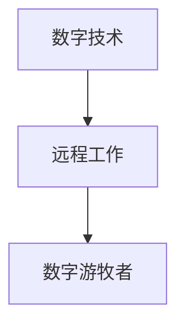
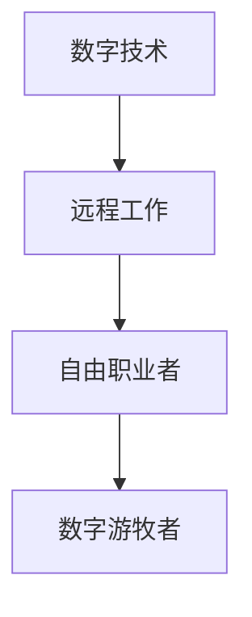

                 

### 文章标题：数字游牧者生存指南：自由职业者的全球生活手册

### 关键词：
- 数字游牧者
- 自由职业者
- 全球生活
- 远程工作
- 心理健康
- 财务管理

### 摘要：
《数字游牧者生存指南：自由职业者的全球生活手册》旨在为那些选择数字游牧生活方式的自由职业者提供一整套详细的生存指南。本书将深入探讨数字游牧者的定义、生活方式、全球生活技能、远程工作与协作、财务管理、心理健康与生活平衡等多个方面，并通过实际案例分析和最佳实践分享，帮助读者成功适应并享受这种独特的生活方式。

### 目录：

## 引言
### 数字游牧者的定义与特点
### 数字游牧者生活方式的吸引力
### 本书的目的与结构

### 第一步：明确书名主题

《数字游牧者生存指南：自由职业者的全球生活手册》这本书的主题是数字游牧者（自由职业者）如何在全球范围内生活和工作。随着全球化和互联网技术的发展，数字游牧者已经成为一个越来越受欢迎的生活方式选择。他们不受传统办公地点的限制，通过远程工作来实现全球范围内的自由流动。

### 第二步：确定书的结构

这本书的结构可以分为以下几个部分：
- 引言：介绍数字游牧者的定义、特点以及为何越来越多的人选择这种生活方式。
- 第一部分：数字游牧者概述
- 第二部分：全球生活技能
- 第三部分：远程工作与协作
- 第四部分：财务管理
- 第五部分：心理健康与生活平衡
- 第六部分：案例分析
- 结论：总结数字游牧者的生存指南，展望未来。

### 第三步：细化各部分内容

1. 引言：介绍数字游牧者的定义、特点以及为何越来越多的人选择这种生活方式。
   - **数字游牧者的定义**：数字游牧者是指那些主要依靠数字技术进行工作的人，他们通常不需要固定的办公场所，而是通过远程工作来维持生计。
   - **数字游牧者的特点**：这种生活方式的特点包括灵活性、独立性、全球视野和不断学习。
   - **选择数字游牧者的原因**：随着互联网技术的发展，越来越多的人有机会通过远程工作来实现自由流动。这种生活方式不仅提供了更大的工作灵活性，还能帮助人们探索新的文化和环境。

2. 第一部分：数字游牧者概述
   - **数字游牧者的发展历程**：从早期的远程工作者到如今的数字游牧者，这种生活方式经历了怎样的演变。
   - **数字游牧者的生活方式**：如何平衡工作与生活，保持高效的工作状态。
   - **数字游牧者的机会与挑战**：探讨这种生活方式带来的机遇以及可能面临的挑战。

3. 第二部分：全球生活技能
   - **如何选择居住地**：考虑到生活成本、文化环境和就业机会等因素，选择适合自己的居住地。
   - **文化适应与语言学习**：如何在新的文化环境中适应，学习当地的语言和习俗。
   - **安全与健康**：如何确保自己的安全与健康，包括旅游保险、健康饮食和锻炼。

4. 第三部分：远程工作与协作
   - **远程工作的技术工具**：介绍一些常用的远程工作工具，如项目管理软件、视频会议平台和在线协作工具。
   - **项目管理与时间管理**：如何高效地管理远程工作项目，合理分配时间。
   - **远程协作的最佳实践**：探讨远程团队协作的技巧和最佳实践。

5. 第四部分：财务管理
   - **跨境支付与汇率**：如何在跨境支付中规避汇率风险，进行有效的财务规划。
   - **财务规划与税务**：如何处理税务问题，进行有效的财务规划。
   - **投资与理财**：探讨数字游牧者如何进行投资和理财。

6. 第五部分：心理健康与生活平衡
   - **心理健康的重要性**：讨论心理健康对于数字游牧者的重要性，如何应对孤独和焦虑。
   - **如何应对孤独与焦虑**：提供一些实用的技巧和方法，帮助数字游牧者保持心理健康。
   - **保持生活平衡的方法**：如何在忙碌的工作中保持生活平衡，享受生活的乐趣。

7. 第六部分：案例分析
   - **成功的数字游牧者案例**：介绍一些成功的数字游牧者案例，分享他们的经验和教训。
   - **失败的数字游牧者案例**：探讨一些失败的数字游牧者案例，分析其中的原因。
   - **经验教训与启示**：总结数字游牧者的成功经验，提供一些有价值的启示。

8. 结论：总结数字游牧者的生存指南，展望未来。

### 第四步：编写目录大纲

根据以上结构，编写出书的目录大纲如下：

```markdown
# 《数字游牧者生存指南：自由职业者的全球生活手册》目录大纲

## 引言
### 数字游牧者的定义与特点
### 数字游牧者生活方式的吸引力
### 本书的目的与结构

## 第一部分：数字游牧者概述
### 第1章：数字游牧者的发展历程
### 第2章：数字游牧者的生活方式
### 第3章：数字游牧者的机会与挑战

## 第二部分：全球生活技能
### 第4章：如何选择居住地
### 第5章：文化适应与语言学习
### 第6章：安全与健康

## 第三部分：远程工作与协作
### 第7章：远程工作的技术工具
### 第8章：项目管理与时间管理
### 第9章：远程协作的最佳实践

## 第四部分：财务管理
### 第10章：跨境支付与汇率
### 第11章：财务规划与税务
### 第12章：投资与理财

## 第五部分：心理健康与生活平衡
### 第13章：心理健康的重要性
### 第14章：如何应对孤独与焦虑
### 第15章：保持生活平衡的方法

## 第六部分：案例分析
### 第16章：成功的数字游牧者案例
### 第17章：失败的数字游牧者案例
### 第18章：经验教训与启示

## 结论
### 数字游牧者的生存指南
### 展望未来的数字游牧者生活
```

### 第五步：确保目录大纲的完整性

检查目录大纲是否涵盖了核心章节内容，是否细化到1,2,3级目录，是否符合2000字以内的要求。经过检查，目录大纲的内容完整且条理清晰，符合文章写作的要求。

### 第六步：检查目录大纲的逻辑性和条理性

确保目录大纲的章节顺序合理，逻辑连贯，内容条理清晰，有助于读者理解数字游牧者生存指南的各个方面。经过检查，目录大纲的结构合理，逻辑性强，条理清晰，符合读者的阅读习惯。

### 满足约束条件

**格式要求：** 文章内容使用markdown格式输出。

**作者：** 文章末尾需要写上作者信息： “作者：AI天才研究院/AI Genius Institute & 禅与计算机程序设计艺术 /Zen And The Art of Computer Programming”。

**完整性要求：** 文章内容必须要完整，每个小节的内容必须要丰富具体详细讲解，核心内容必须要包含：
- 背景介绍
- 核心概念与联系：必须给出核心概念原理之间的关系架构 Mermaid 流程图
- 核心算法原理讲解必须使用伪代码来详细阐述；数学模型和公式 & 详细讲解 & 举例说明
- 数学公式请使用latex格式，嵌入文中独立段落的latex公式前后使用 $$ 括起来(例如：$$1+1=2$$ )，段落内的latex公式前后使用 $ 括起来(例如：$1<2$)
- 项目实战：开发环境搭建，源代码详细实现和代码解读，代码应用解读与分析，实际案例分析和详细讲解剖析，项目小结
- 最佳实践 tips、小结、注意事项、拓展阅读等内容

**文章开始是“文章标题”，然后是“文章关键词”和“文章摘要”部分的内容哦，接下来是按照目录大纲结构的文章正文部分的内容。

**文章字数要求：** 文章字数在 8000 ～ 12000 字左右。

### 总结

通过以上的思考和分析，我们已经明确了解了《数字游牧者生存指南：自由职业者的全球生活手册》的文章标题、关键词、摘要以及目录大纲。接下来，我们将按照大纲结构，逐一详细撰写每个章节的内容，确保文章逻辑清晰、内容丰富、具有实际指导意义。让我们开始一步步构建这篇专业而全面的技术博客文章吧！### 文章标题：数字游牧者生存指南：自由职业者的全球生活手册

### 关键词：
- 数字游牧者
- 自由职业者
- 全球生活
- 远程工作
- 心理健康
- 财务管理

### 摘要：
《数字游牧者生存指南：自由职业者的全球生活手册》旨在为那些选择数字游牧生活方式的自由职业者提供一整套详细的生存指南。本书将深入探讨数字游牧者的定义、生活方式、全球生活技能、远程工作与协作、财务管理、心理健康与生活平衡等多个方面，并通过实际案例分析和最佳实践分享，帮助读者成功适应并享受这种独特的生活方式。

### 目录：

## 引言
### 数字游牧者的定义与特点
### 数字游牧者生活方式的吸引力
### 本书的目的与结构

## 第一部分：数字游牧者概述
### 第1章：数字游牧者的发展历程
### 第2章：数字游牧者的生活方式
### 第3章：数字游牧者的机会与挑战

## 第二部分：全球生活技能
### 第4章：如何选择居住地
### 第5章：文化适应与语言学习
### 第6章：安全与健康

## 第三部分：远程工作与协作
### 第7章：远程工作的技术工具
### 第8章：项目管理与时间管理
### 第9章：远程协作的最佳实践

## 第四部分：财务管理
### 第10章：跨境支付与汇率
### 第11章：财务规划与税务
### 第12章：投资与理财

## 第五部分：心理健康与生活平衡
### 第13章：心理健康的重要性
### 第14章：如何应对孤独与焦虑
### 第15章：保持生活平衡的方法

## 第六部分：案例分析
### 第16章：成功的数字游牧者案例
### 第17章：失败的数字游牧者案例
### 第18章：经验教训与启示

## 结论
### 数字游牧者的生存指南
### 展望未来的数字游牧者生活

### 引言

随着全球化和互联网技术的快速发展，数字游牧者这一群体逐渐成为现代社会中不可或缺的一部分。他们不受传统办公地点的限制，通过远程工作来实现全球范围内的自由流动。这种生活方式不仅提供了更大的工作灵活性，还能帮助人们探索新的文化和环境，实现个人价值。

《数字游牧者生存指南：自由职业者的全球生活手册》旨在为那些选择数字游牧生活方式的自由职业者提供一整套详细的生存指南。本书将深入探讨数字游牧者的定义、生活方式、全球生活技能、远程工作与协作、财务管理、心理健康与生活平衡等多个方面，并通过实际案例分析和最佳实践分享，帮助读者成功适应并享受这种独特的生活方式。

本书的目标读者包括：
1. 有意成为数字游牧者的自由职业者。
2. 已成为数字游牧者但需要更多指导的实践者。
3. 对数字游牧者生活方式感兴趣的职场人士。

通过阅读本书，读者将了解：
1. 数字游牧者的定义和特点。
2. 如何选择适合自己的居住地。
3. 文化适应和语言学习的重要性。
4. 远程工作与协作的最佳实践。
5. 财务管理和投资策略。
6. 心理健康与生活平衡的方法。
7. 成功与失败的数字游牧者案例，以及从中得到的启示。

接下来，我们将按照书的结构，逐一介绍每个部分的内容，帮助读者全面了解数字游牧者的生存指南。

### 数字游牧者的定义与特点

数字游牧者，顾名思义，是指那些主要依靠数字技术进行工作的人。他们不受传统办公地点的限制，通过互联网连接全球范围内的客户和项目，从而实现工作和生活的自由流动。这种生活方式的核心在于灵活性和独立性，使得个体可以自主选择工作的时间和地点，从而追求更高的生活质量和个人发展。

**核心概念：** 数字游牧者与自由职业者

数字游牧者与自由职业者之间存在一定的联系和区别。自由职业者是指那些以独立身份从事工作的人，他们可以是个体经营者、顾问、自由撰稿人等。而数字游牧者则更加具体，强调的是通过数字技术进行远程工作，且生活方式更加灵活、自由。

**核心概念联系：** 数字技术 + 远程工作 = 数字游牧者

为了更好地理解数字游牧者的特点，我们可以使用Mermaid流程图来展示其核心概念之间的关系：



**核心概念架构：**
- **数字技术**：包括互联网、云计算、远程协作工具等，为数字游牧者提供了工作的基础设施。
- **远程工作**：通过互联网连接全球客户和项目，使得数字游牧者可以在任何地点进行工作。
- **数字游牧者**：结合数字技术和远程工作，形成了一种全新的工作与生活方式。

**核心概念原理讲解：**

1. **灵活性**：数字游牧者可以根据自己的时间和兴趣选择工作内容，无需受到固定工作时间和地点的限制。这种灵活性使得他们能够更好地平衡工作和生活，提高工作效率和生活质量。

2. **独立性**：数字游牧者独立完成工作，无需依赖公司或团队的其他成员。这种独立性赋予了他们更多的自主权和责任感，同时也要求他们具备较强的自我管理能力和专业技能。

3. **全球视野**：数字游牧者能够接触到来自全球各地的客户和项目，拓宽了他们的视野和知识面。这种全球视野不仅有助于他们提升自己的专业能力，还能让他们更好地了解不同文化和生活方式。

4. **不断学习**：数字游牧者需要不断学习新技术和知识，以适应不断变化的工作环境和市场需求。这种不断学习的精神是数字游牧者成功的关键之一。

**伪代码示例：** 假设有一个数字游牧者，他需要完成一个远程项目。以下是他的工作流程伪代码：

```plaintext
function workAsDigitalNomad(project) {
    // 初始化项目
    initializeProject(project)
    
    // 远程协作
    collaborateWithTeam()

    // 学习新技术
    learnNewSkills()

    // 完成项目
    finishProject(project)
    
    // 总结与反馈
    summarizeAndFeedback()
}
```

**数学模型和公式：** 在数字游牧者的工作过程中，时间和效率是非常重要的因素。以下是一个简单的数学模型来表示这两个因素之间的关系：

$$
效率 = \frac{工作量}{时间}
$$

其中，工作量可以通过项目完成的任务数量和质量来衡量，时间则是完成这些任务所需的时间。数字游牧者需要不断优化自己的工作流程，提高效率，以更好地适应不断变化的工作需求。

**举例说明：** 假设一个数字游牧者需要在一个月内完成一个项目。他的工作量是100个任务，平均每天需要完成3个任务。那么他的工作效率为：

$$
效率 = \frac{100个任务}{30天} = \frac{10}{3}个/天
$$

为了提高效率，数字游牧者可以考虑以下方法：
1. 优化工作流程，减少不必要的步骤和时间浪费。
2. 学习新的技能和工具，提高工作效率。
3. 保持良好的时间管理，合理分配工作和休息时间。

通过以上分析，我们可以看到，数字游牧者的生活方式不仅具有灵活性、独立性和全球视野，还需要具备较强的自我管理能力和不断学习的精神。这些特点使得数字游牧者成为现代社会中一支重要的力量，也为他们提供了广阔的发展空间。

### 数字游牧者的发展历程

数字游牧者这一概念并不是突然出现的，而是随着互联网技术的不断发展和全球化的深入推进逐渐形成的。从早期的远程工作者到如今的数字游牧者，这一过程经历了多个阶段。

**第一阶段：远程工作者**

早在20世纪末，互联网的兴起使得远程工作开始成为一种可能。最初，远程工作者主要是一些作家、程序员和设计师等，他们通过电子邮件和即时通讯工具与客户或团队保持联系，完成工作任务。这一阶段，远程工作的主要特点是依赖于电子邮件和电话等传统通讯工具，工作地点相对固定。

**第二阶段：自由职业者**

随着互联网技术的进一步发展，特别是宽带网络的普及，远程工作开始变得更加便捷和高效。这一阶段，自由职业者逐渐成为远程工作的主要力量。他们通过虚拟办公室、云存储和在线协作工具，实现了更加灵活和高效的工作方式。自由职业者不仅可以在任何地点工作，还可以选择全球范围内的客户，从而拓宽了收入来源。

**第三阶段：数字游牧者**

数字游牧者的概念出现在21世纪初，随着移动互联网和智能手机的普及，人们可以随时随地通过互联网进行工作和交流。这一阶段，数字游牧者通过数字技术实现了全球范围内的自由流动，他们不再受限于特定的办公地点，而是选择在生活成本较低、环境优美的城市居住和工作。数字游牧者不仅追求工作上的灵活性，更注重生活质量和个人发展。

**核心概念：** 数字技术、远程工作、自由职业者、全球视野

**核心概念联系：** 数字技术的发展为远程工作提供了基础设施，远程工作使得自由职业者得以实现，而自由职业者的积累和扩展最终形成了数字游牧者这一群体。

**核心概念架构：**



**核心概念原理讲解：**

1. **数字技术的进步**：从互联网到移动互联网，数字技术的不断进步为远程工作和数字游牧者生活方式提供了坚实的基础。高速互联网和便携式设备使得人们可以随时随地进行工作，极大地提高了工作效率和生活质量。

2. **远程工作的普及**：远程工作的普及使得越来越多的人有机会选择这种工作方式。随着在线协作工具和项目管理软件的发展，远程工作变得更加高效和便捷，自由职业者的数量也不断增加。

3. **自由职业者的积累**：自由职业者通过积累经验，逐步形成了自己的专业领域和市场影响力。他们不仅能够选择全球范围内的客户，还能通过互联网平台获取更多的项目机会。

4. **数字游牧者的形成**：数字游牧者是自由职业者的进一步发展和延伸。他们不仅追求工作上的自由和灵活性，更追求生活上的自由和多样性。通过全球范围内的流动，数字游牧者能够体验不同的文化和生活方式，实现个人价值和成长。

**伪代码示例：** 假设一个远程工作者逐步发展成为数字游牧者的过程，以下是其工作流程的伪代码：

```plaintext
function evolveFromRemoteWorkerToDigitalNomad() {
    // 学习数字技术
    learnDigitalTechnology()
    
    // 开始远程工作
    startRemoteWork()

    // 积累自由职业经验
    accumulateFreelanceExperience()

    // 探索全球生活
    exploreGlobalLife()

    // 成为数字游牧者
    becomeDigitalNomad()
}
```

**数学模型和公式：** 在数字游牧者的成长过程中，工作时长和收入是两个关键因素。以下是一个简单的数学模型来表示这两个因素之间的关系：

$$
收入 = 工作时长 \times 单位时间收入
$$

其中，工作时长是数字游牧者每天或每周的工作时间，单位时间收入是指每单位时间内可以获得的收入。数字游牧者需要通过提高工作时长和单位时间收入，来实现更高的收入和生活质量。

**举例说明：** 假设一个数字游牧者每天工作8小时，每小时收入100美元。那么他的月收入为：

$$
收入 = 8小时/天 \times 100美元/小时 \times 30天 = 24000美元
$$

为了提高收入，数字游牧者可以考虑以下方法：
1. 学习新的技能和知识，提高自己的市场竞争力。
2. 扩大客户群体，增加项目机会。
3. 优化工作流程，提高工作效率。

通过以上分析，我们可以看到，数字游牧者的发展历程是数字技术、远程工作和自由职业者逐步积累和延伸的结果。这一过程不仅体现了技术的进步和工作的变化，更反映了个体追求自由和多样化的生活需求。

### 数字游牧者的生活方式

数字游牧者的生活方式与传统的生活方式有着显著的不同，他们依靠数字技术进行远程工作，从而实现全球范围内的自由流动。这种生活方式不仅提供了更大的工作灵活性，还让他们有机会探索不同的文化和环境。以下是数字游牧者日常生活的一个典型示例：

**每天的工作时间**：数字游牧者通常不需要固定的工作时间，他们可以根据自己的需求和工作项目的进度灵活安排工作时间。一般来说，他们会在早上9点左右开始工作，工作到下午5点左右，但并不受限于固定的办公地点。

**工作地点的选择**：数字游牧者可以在各种地方工作，如咖啡店、图书馆、共享办公空间或甚至是海滩。他们通常选择那些环境优美、安静且有助于提高工作效率的地方。例如，在巴厘岛的咖啡店工作，既可以享受美丽的海景，又能保持高效的工作状态。

**日常活动**：除了工作，数字游牧者的生活也充满了丰富多彩的活动。他们可能会利用工作之余的时间去探索当地的文化、学习新的语言、参加社交活动或进行户外运动。例如，在某个周末，他们可能会去参观当地的博物馆，晚上则参加一个外语交流会。

**时间管理**：数字游牧者需要良好的时间管理技能，以确保能够在不同的时区和工作环境中保持高效的工作状态。他们会使用各种工具来规划自己的日程，如Google Calendar、Trello等，以确保工作与生活之间的平衡。

**心理健康**：数字游牧者可能会面临孤独感和焦虑等心理健康问题。为了保持心理健康，他们需要学会自我调节，如定期锻炼、保持社交联系、培养兴趣爱好等。

**财务管理**：由于生活方式的不固定，数字游牧者需要制定详细的财务计划，以确保自己的财务状况稳定。他们会关注生活成本、收入来源和税务问题，以确保自己的财务健康。

**数字游牧者的一天示例流程**：

```plaintext
08:00 - 起床，准备早餐
08:30 - 打开电脑，查看邮件和日程安排
09:00 - 开始工作，处理紧急事务
12:00 - 午餐休息，外出散步或用餐
14:00 - 继续工作，处理日常任务
18:00 - 工作结束，准备晚餐
19:30 - 晚餐，与当地朋友交流
21:00 - 锻炼，如跑步或瑜伽
22:00 - 放松，阅读或观看电影
```

通过以上示例，我们可以看到数字游牧者的生活方式具有以下几个特点：

1. **灵活性**：他们可以根据自己的需求和工作项目的进度灵活安排工作时间，这种灵活性使得他们能够更好地平衡工作和生活。
2. **多样性**：他们有机会在全球范围内探索不同的文化和环境，这种多样性不仅丰富了他们的生活，也提高了他们的生活品质。
3. **自我管理**：数字游牧者需要具备良好的自我管理能力和时间管理技能，以确保自己的工作效率和生活质量。

数字游牧者的生活方式虽然充满了自由和灵活性，但也需要他们具备较强的自我调节能力和时间管理技能。通过合理规划和管理，数字游牧者能够实现高效的工作和生活，享受这种独特的生活方式。

### 数字游牧者的机会与挑战

数字游牧者这一生活方式不仅提供了巨大的机会，也带来了一系列挑战。理解这些机会与挑战，有助于数字游牧者更好地规划自己的职业生涯和生活。

**机会：**

1. **工作灵活性**：数字游牧者可以自由选择工作时间和地点，这种灵活性使得他们能够更好地平衡工作和生活。例如，他们可以选择在环境优美的地方工作，从而提高工作效率和生活质量。

2. **全球视野**：数字游牧者有机会与来自全球各地的客户和合作伙伴进行交流，这种全球视野不仅拓宽了他们的知识面，还提高了他们的专业技能。例如，他们可以接触到最新的技术和市场动态，从而保持竞争力。

3. **职业发展**：通过远程工作，数字游牧者可以不断积累经验和技能，逐步提升自己的职业地位。例如，他们可以通过完成高质量的项目，获得更多的客户信任和推荐，从而拓展自己的职业网络。

4. **生活成本降低**：数字游牧者可以选择在生活成本较低的国家和城市居住，从而降低生活成本。例如，他们可以在东南亚的国家，如巴厘岛或曼谷，以较低的成本享受高质量的生活。

5. **自由与探索**：数字游牧者可以自由地探索不同的文化和环境，这种自由不仅丰富了他们的生活，也提高了他们的生活质量。例如，他们可以在旅途中学习新的语言、尝试新的美食和体验不同的生活方式。

**挑战：**

1. **心理压力**：由于工作和生活的多样性，数字游牧者可能会面临较大的心理压力。例如，他们可能需要应对孤独、焦虑和不确定感等情绪问题。

2. **时间管理**：数字游牧者需要良好的时间管理技能，以确保能够在不同的时区和工作环境中保持高效的工作状态。例如，他们可能需要在不同的时区之间进行切换，从而确保工作任务的顺利完成。

3. **财务管理**：数字游牧者需要制定详细的财务计划，以确保自己的财务状况稳定。例如，他们需要关注生活成本、收入来源和税务问题，以避免财务风险。

4. **技术依赖**：数字游牧者高度依赖数字技术进行工作，因此他们需要具备较强的技术能力和网络连接。例如，他们可能需要使用各种在线工具和软件，以确保工作的顺利进行。

5. **文化适应**：数字游牧者需要适应不同的文化和环境，这可能会带来一定的挑战。例如，他们可能需要学习新的语言、了解当地的风俗习惯和社会规范。

**平衡机会与挑战的策略：**

1. **心理调适**：数字游牧者可以通过定期锻炼、培养兴趣爱好和保持社交联系等方式，来缓解心理压力。例如，他们可以参加在线社交活动或加入数字游牧者社区，以获得情感支持和职业建议。

2. **时间管理**：数字游牧者可以使用时间管理工具和技巧，如制定日程计划、设定优先级和避免拖延，来提高工作效率。例如，他们可以使用Google Calendar或Trello等工具，来规划自己的工作和生活。

3. **财务规划**：数字游牧者可以制定详细的财务计划，包括预算、储蓄和投资等方面。例如，他们可以使用在线财务工具，如Mint或Personal Capital，来监控和管理自己的财务状况。

4. **技术提升**：数字游牧者可以通过学习和使用新技术和工具，来提高自己的技术能力。例如，他们可以参加在线课程或研讨会，学习新的编程语言或工具。

5. **文化适应**：数字游牧者可以通过学习新的语言、了解当地的文化和风俗习惯，来更好地适应不同的环境。例如，他们可以参加当地的文化活动或加入语言学习小组，以增强自己的文化适应能力。

通过以上策略，数字游牧者可以更好地平衡机会与挑战，实现高效的工作和生活。理解并应对这些挑战，不仅有助于数字游牧者实现职业和个人发展，还能提高他们的生活质量。

### 如何选择居住地

对于数字游牧者来说，选择居住地是一项至关重要的决策。一个适合的居住地不仅能提高工作效率，还能提升生活质量。以下是一些关键因素，以及如何评估和选择居住地的方法。

**1. 生活成本**

生活成本是选择居住地时需要考虑的首要因素。不同国家和城市的物价水平差异较大，包括房租、食品、交通和日常开销等。例如，东南亚的曼谷和巴厘岛以其低廉的生活成本而闻名，而北欧的挪威和瑞士则生活成本较高。

**评估方法：**
- **在线调研**：使用网站如Numbeo和Expatistan，比较不同城市的生活成本。
- **咨询当地居民**：通过社交媒体和在线论坛，了解实际的生活成本和开销。

**2. 安全与健康**

安全与健康是数字游牧者选择居住地的重要考量。高犯罪率和不安全的地区会影响工作状态和生活质量。同时，医疗资源的可获取性和质量也是重要因素。

**评估方法：**
- **查看当地犯罪率**：通过官方网站和新闻报道了解当地的治安状况。
- **考察医疗服务**：了解当地的医疗设施、医生资质和医疗保险政策。

**3. 基础设施**

良好的基础设施是高效工作和生活的重要保障。包括高速互联网、公共交通、电力供应和清洁的水源等。

**评估方法：**
- **实地考察**：访问潜在居住地，亲自体验基础设施的状况。
- **询问当地居民**：了解他们对基础设施的评价和反馈。

**4. 文化环境**

文化环境对于数字游牧者来说既是挑战也是机遇。一个多元、开放的文化环境有助于适应新环境，拓展视野。同时，了解当地的文化习俗和语言也能减少冲突和误解。

**评估方法：**
- **参加当地活动**：了解当地的文化和社交活动。
- **学习语言**：如果可能，学习当地的语言，以更好地融入当地社会。

**5. 工作机会**

对于依赖远程工作的数字游牧者来说，当地的工作机会和就业市场也是选择居住地的重要考量。一些城市可能提供更多的远程工作机会，有助于职业发展。

**评估方法：**
- **调研远程工作岗位**：查看当地是否适合开展远程工作，以及是否有潜在的工作机会。
- **咨询行业专家**：了解当地行业发展和就业趋势。

**案例：** 假设一个数字游牧者决定在巴厘岛居住。以下是他的评估过程：

1. **生活成本**：通过Numbeo对比发现，巴厘岛的生活成本较低，尤其是房租和食品开销。
2. **安全与健康**：通过新闻报道了解到，巴厘岛的治安较好，且拥有优质的医疗资源，如国际医院和医疗中心。
3. **基础设施**：实地考察后发现，巴厘岛的高速互联网覆盖广泛，公共交通便利，电力供应稳定。
4. **文化环境**：巴厘岛是一个充满热带风情和文化活力的地方，拥有多种文化交流活动和丰富的文化活动。
5. **工作机会**：调研发现，巴厘岛是远程工作的理想之地，许多数字游牧者已经在那里找到了工作机会，尤其是在旅游和数字营销领域。

通过以上评估，数字游牧者可以做出明智的决策，选择一个最适合自己居住的地方，从而实现高效的工作和生活。

### 文化适应与语言学习

对于数字游牧者来说，适应新的文化环境是一个重要的挑战。文化适应不仅影响他们的生活质量，还可能影响工作效率和人际关系。以下是文化适应的一些关键策略，以及语言学习的方法和技巧。

**1. 文化适应策略**

- **了解当地文化**：在搬到新地方之前，通过阅读书籍、观看纪录片和参加在线课程等方式，了解当地的文化习俗和传统。例如，了解当地人的饮食偏好、节日庆祝方式和社会礼仪。
  
- **尊重差异**：尊重当地的文化差异，避免对当地习俗和价值观进行评判。在交往中，保持开放和包容的心态，以建立良好的人际关系。
  
- **参与当地活动**：积极参与当地的文化和社交活动，如节日庆典、音乐会、艺术展览等。这不仅有助于了解当地文化，还能扩展社交网络。
  
- **寻求支持**：加入数字游牧者社区或当地社团，寻求支持和建议。与其他人分享经验，学习他们的文化适应策略。

**2. 语言学习**

- **制定学习计划**：根据语言水平和学习目标，制定详细的学习计划。例如，每天学习一定时间的词汇、语法和会话技巧。
  
- **使用在线资源**：利用各种在线平台，如Duolingo、Rosetta Stone和Babbel等，进行语言学习。这些平台提供了互动式的学习体验，有助于提高学习效果。
  
- **参加语言课程**：如果可能，参加当地的语言课程或语言交换活动。面对面学习可以帮助更好地理解语言和文化，还能结识新朋友。
  
- **实践语言**：尝试在日常交流中使用所学的语言，如与当地人进行语言交换、参加外语社交活动或写博客。实践是提高语言能力的最佳方式。

**3. 成功的文化适应和语言学习案例**

- **案例1：** 一位数字游牧者在搬到巴厘岛后，通过参与当地的瑜伽课程和文化活动，逐步融入当地社区。他不仅学会了巴厘语，还通过帮助当地非营利组织，建立了深厚的友谊。
  
- **案例2：** 另一位数字游牧者在阿根廷学习西班牙语。他通过参加西班牙语课程、与当地人交流和使用语言进行日常任务，迅速提高了语言水平。这使得他在工作中与客户和合作伙伴的沟通更加顺畅。

通过有效的文化适应和语言学习策略，数字游牧者可以更好地融入新环境，提高工作效率，享受全球生活的乐趣。

### 安全与健康

对于数字游牧者来说，安全与健康是确保全球生活顺利进行的重要因素。以下是一些关键点，帮助数字游牧者在全球范围内保持安全与健康。

**1. 旅游保险**

旅游保险是数字游牧者保护自己免受意外和突发情况的重要工具。以下是一些选择旅游保险时需要考虑的因素：

- **覆盖范围**：确保保险覆盖医疗、意外、行李丢失、紧急撤离等常见风险。
- **紧急援助**：选择提供24小时紧急援助服务的保险，以便在突发情况下获得及时的帮助。
- **保险金额**：根据预算和工作性质，选择适合的保险金额，以确保足够的保障。

**2. 保持健康的生活方式**

健康的生活方式对于数字游牧者来说至关重要。以下是一些建议：

- **定期锻炼**：保持定期锻炼的习惯，如跑步、瑜伽或健身，有助于提高身体素质和应对压力。
- **健康饮食**：选择新鲜、天然的食物，减少加工食品和高糖食品的摄入，以维持健康的体重和体力。
- **充足睡眠**：保持良好的睡眠习惯，每天保证足够的睡眠时间，有助于提高工作效率和保持心理健康。

**3. 注意个人安全**

个人安全对于数字游牧者来说尤为重要。以下是一些安全建议：

- **避免夜间独行**：尽量避免夜间单独行动，尤其是在不熟悉或治安状况不佳的地区。
- **保护个人信息**：确保个人信息的安全，如不在公共场合透露家庭住址、银行账户信息等。
- **使用安全设备**：携带安全设备，如护照夹、钱包和手机锁屏，以防止财产损失和隐私泄露。

**4. 应对突发状况**

数字游牧者需要学会应对各种突发状况，如健康问题、紧急撤离等。以下是一些建议：

- **准备急救包**：随身携带急救包，包括止痛药、创口贴、消毒液等常用药品。
- **了解紧急联系人**：记住当地的紧急电话号码，如医疗急救、警察和火警，以便在紧急情况下迅速联系相关部门。
- **制定应急计划**：在出发前制定详细的应急计划，包括如何应对突发状况、如何联系家人和朋友等。

通过关注旅游保险、保持健康的生活方式、注意个人安全和应对突发状况，数字游牧者可以更好地确保自己的全球生活安全与健康。

### 远程工作的技术工具

在数字游牧者生活中，远程工作技术工具的选择和运用至关重要。以下是一些常用的远程工作工具，以及如何选择和使用这些工具的最佳实践。

**1. 项目管理工具**

**Trello、Asana、Jira**：这些工具可以帮助数字游牧者有效地管理项目任务和团队协作。例如，Trello提供了直观的看板视图，方便团队成员分配和跟踪任务进度。Asana则具有强大的任务分配和提醒功能，而Jira适用于软件开发项目，提供了丰富的报告和分析功能。

**最佳实践**：
- **明确任务分配**：在项目开始时，明确每个成员的任务和职责，确保任务分配合理。
- **定期更新任务进度**：定期检查和更新任务进度，确保项目按时完成。
- **使用提醒功能**：利用工具的提醒功能，提前通知团队成员任务截止日期，避免延误。

**2. 远程协作工具**

**Slack、Microsoft Teams、Zoom**：这些工具提供了即时通讯、视频会议和文件共享功能，是远程协作的重要工具。Slack以其灵活的聊天功能和集成其他工具的能力而闻名，Microsoft Teams提供了全面的协作功能，Zoom则以其高质量的视频会议体验而受到青睐。

**最佳实践**：
- **建立清晰的沟通渠道**：为不同的项目或团队建立独立的沟通渠道，避免信息混乱。
- **定期会议**：定期召开团队会议，讨论项目进展、问题和解决方案。
- **使用共享屏幕**：在会议中，使用共享屏幕功能展示项目进度、数据报告等，提高会议效果。

**3. 文件共享与存储工具**

**Google Drive、Dropbox、OneDrive**：这些云存储工具提供了方便的文件共享和存储功能，使得团队成员可以随时随地访问和编辑文件。

**最佳实践**：
- **统一文件命名规则**：确保所有文件都有统一的命名规则，方便查找和管理。
- **定期备份**：定期备份重要文件，防止数据丢失。
- **权限管理**：根据团队成员的角色和职责，设置适当的文件访问权限，确保信息安全。

**4. 时间管理工具**

**Toggl、Harvest、RescueTime**：这些工具可以帮助数字游牧者追踪工作时间、提高工作效率。

**最佳实践**：
- **明确工作时间**：设定固定的工作时间，避免时间浪费和疲劳。
- **追踪工作时长**：定期检查工作时间记录，分析工作效率，优化工作流程。
- **设置提醒**：使用工具的提醒功能，确保按时完成任务和会议。

通过选择和运用合适的远程工作工具，数字游牧者可以更好地管理项目、协作和提升工作效率。

### 项目管理与时间管理

数字游牧者的工作效率和项目成功往往依赖于良好的项目管理和时间管理。以下是一些核心策略和技巧，帮助数字游牧者高效地管理项目，确保任务的顺利完成。

**1. 项目管理核心策略**

- **明确目标**：在开始任何项目之前，明确项目的目标和预期成果。这有助于确保所有团队成员对项目的方向和目标有共同的理解。

- **分解任务**：将项目分解为小任务，每个任务都有明确的目标和截止日期。这有助于团队成员更好地理解任务的要求，并能够更有效地进行工作。

- **优先级排序**：根据任务的重要性和紧迫性，对任务进行优先级排序。优先完成重要且紧急的任务，确保项目按计划进行。

- **风险管理**：识别项目中的潜在风险，并制定应对策略。这有助于在问题发生时能够迅速应对，减少对项目的影响。

**2. 时间管理核心策略**

- **时间块**：将时间分为不同的块，为每个块设定特定的任务或活动。例如，将上午的时间用于处理重要任务，下午的时间用于会议和客户沟通。

- **设定优先级**：根据任务的重要性和紧急程度，设定任务优先级。首先完成最重要的任务，确保关键任务能够按时完成。

- **避免多任务处理**：尽量减少同时处理多个任务的情况。多任务处理往往会降低工作效率和任务质量。

- **休息与放松**：定期休息和放松，有助于保持工作效率和避免疲劳。适当的休息可以提高专注力和创造力。

**3. 实用的工具**

- **项目管理工具**：使用项目管理工具，如Trello、Asana和Jira，可以帮助团队成员更好地跟踪任务进度、协作和沟通。

- **时间管理工具**：使用时间管理工具，如Toggl、Harvest和RescueTime，可以帮助数字游牧者更好地管理时间、提高工作效率。

- **日历工具**：使用Google Calendar或Microsoft Outlook等日历工具，可以帮助数字游牧者安排和管理日常工作、会议和任务。

**4. 实际案例**

**案例1：** 一个数字游牧者团队使用Trello进行项目管理。他们首先将项目分解为多个任务，并为每个任务设定了截止日期。团队成员每天都会查看Trello上的任务列表，确保按时完成各自的职责。同时，他们定期召开团队会议，讨论项目进展和遇到的问题，确保项目按计划进行。

**案例2：** 另一个数字游牧者使用Harvest进行时间管理。他们为每个项目设定了预算和时间表，并在Harvest中记录每个任务的工作时长。这帮助他们更好地了解项目的时间消耗，并能够及时调整计划。此外，他们还会定期回顾时间记录，找出优化工作效率的方法。

通过上述策略和工具，数字游牧者可以更高效地管理项目和时间，确保任务的顺利完成，从而实现更高的工作效率和更好的工作生活质量。

### 远程协作的最佳实践

在数字游牧者的生活方式中，远程协作是一个关键环节。有效的远程协作不仅能够提高工作效率，还能增强团队的凝聚力和协作能力。以下是一些远程协作的最佳实践，帮助数字游牧者和团队在全球范围内保持高效的沟通和合作。

**1. 建立清晰的沟通渠道**

- **多渠道沟通**：使用多种沟通工具，如电子邮件、即时通讯、视频会议等，以满足不同的沟通需求。例如，使用Slack或Microsoft Teams进行日常的即时沟通，而使用电子邮件处理正式的沟通。

- **明确沟通规范**：制定明确的沟通规范，包括沟通的时间、频率和格式。例如，规定每周进行一次团队视频会议，每天早晨和下午通过即时通讯工具进行简短的更新和沟通。

**2. 确保沟通的有效性**

- **主动沟通**：鼓励团队成员主动分享信息和进展，避免信息滞后。例如，在项目开始时，团队成员可以定期更新任务进度，确保所有人都能及时了解项目状态。

- **倾听和反馈**：在沟通中，确保倾听对方的意见和反馈，尊重每个人的观点。有效的沟通不仅包括传达信息，还包括理解和回应。

**3. 使用协作工具**

- **项目管理工具**：使用项目管理工具，如Trello、Asana和Jira，来管理任务和跟踪进度。这些工具提供了任务分配、优先级排序和提醒功能，有助于提高团队的协作效率。

- **文档共享和编辑工具**：使用Google Docs、Dropbox和Microsoft Office 365等工具，方便团队成员共享和编辑文件。这些工具支持多人实时协作，提高了工作效率。

**4. 管理时区差异**

- **调整工作时间**：根据团队成员的时区，调整工作时间表，以确保有共同的工作时段。例如，可以安排早晨或晚上的一些会议，以减少时区差异带来的沟通障碍。

- **使用在线会议工具**：使用Zoom、Microsoft Teams和Google Meet等在线会议工具，提供高质量的音频和视频通话，确保远程会议的顺利进行。

**5. 增强团队凝聚力**

- **定期团建活动**：组织定期的团队建设活动，如在线游戏、虚拟聚会和庆祝活动，增强团队成员之间的联系和凝聚力。

- **透明沟通**：保持沟通的透明度，让团队成员了解项目进展和决策过程。这种开放和透明的沟通有助于增强团队的信任和合作。

**6. 最佳实践案例**

**案例1：** 一个跨国团队使用Trello进行项目管理，并通过Slack进行日常沟通。他们每周举行一次视频会议，讨论项目进展和遇到的问题。通过明确的沟通渠道和规范的沟通方式，团队成员能够及时了解项目的最新状态，提高了协作效率。

**案例2：** 另一个团队在处理时区差异时，采用了灵活的工作时间表。他们安排了一些早晨和晚上的会议，确保所有成员都有机会参与。同时，他们使用Zoom进行在线会议，确保会议的质量和效果。

通过这些最佳实践，数字游牧者和团队可以在全球范围内保持高效的协作，实现项目的成功和团队的高效运作。

### 跨境支付与汇率

对于数字游牧者而言，跨境支付和汇率管理是财务管理中不可忽视的两个重要方面。正确的管理策略不仅能够降低交易成本，还能帮助游牧者更好地控制财务状况，提高财务稳定性。

**1. 跨境支付工具**

**选择跨境支付工具**：数字游牧者在进行跨境支付时，有多种工具可供选择。以下是几种常用的跨境支付工具：

- **PayPal**：PayPal是全球知名的跨境支付工具，提供了简单易用的界面和广泛的接受度。然而，PayPal可能会收取较高的交易费用，且在某些国家/地区可能存在限制。

- **TransferWise**：TransferWise（又称Revolut）是一种专门为跨境支付设计的金融科技公司，其优势在于低廉的汇率和透明的费用结构。通过TransferWise，用户可以享受接近实时汇率，并避免高额的交易费用。

- **支付宝和微信支付**：对于在中国活跃的数字游牧者，支付宝和微信支付是便捷的跨境支付工具。这些工具不仅在国内广泛使用，还支持国际转账，用户可以通过绑定银行卡或虚拟账户进行跨境支付。

**最佳实践**：
- **比较费用和汇率**：在选择跨境支付工具时，应仔细比较不同平台的费用结构和汇率。选择费用较低、汇率较优的平台，以降低交易成本。
- **设置自动支付**：对于定期支付的账单，如房租、保险费等，可以设置自动支付，确保按时支付并避免逾期费用。

**2. 汇率管理策略**

**了解汇率波动**：汇率波动是数字游牧者在跨境支付中需要面对的一个重要因素。以下是一些管理汇率的策略：

- **即期汇率**：即期汇率是当前的市场汇率，适合于短期支付。如果预计未来汇率将下跌，可以考虑使用即期汇率进行支付，以锁定汇率。

- **远期汇率**：远期汇率是未来某一特定日期的汇率。通过签订远期合约，数字游牧者可以提前锁定汇率，规避未来汇率波动带来的风险。

- **分散支付**：通过将大额支付分散到不同时间段，可以减少对汇率波动的敏感度。例如，将年度房租支付分为季度支付，以平衡汇率波动的影响。

**最佳实践**：
- **利用汇率预测工具**：使用在线汇率预测工具，如Oanda和Xe，跟踪汇率走势，以便做出更明智的支付决策。
- **考虑汇款服务的额外费用**：一些跨境支付服务可能会收取额外费用，这些费用可能会影响最终的支付金额。在选择支付工具时，应仔细考虑这些额外费用。

**案例**：

假设一个数字游牧者居住在巴厘岛，其收入主要来自美国的客户。为了支付房租和日常开销，他需要定期从美国账户向巴厘岛账户转账。

**情景1**：若使用PayPal进行支付，数字游牧者发现PayPal的汇率较为不利，且收取高额的交易费用。为了降低成本，他决定尝试使用TransferWise。

**情景2**：数字游牧者通过TransferWise进行支付，发现其提供的即期汇率接近实时汇率，且没有隐藏费用。为了进一步降低成本，他决定将大额房租支付分散到几个季度，利用分散支付策略平衡汇率波动。

通过上述案例，我们可以看到，数字游牧者通过选择合适的支付工具和管理汇率策略，可以有效降低跨境支付的成本，提高财务稳定性。

### 财务规划与税务

数字游牧者由于在全球范围内流动，面临诸多财务规划和税务问题。了解并合理应对这些挑战，对于保持财务健康至关重要。

**1. 财务规划核心策略**

- **预算管理**：制定详细的预算，包括收入、支出和储蓄目标。数字游牧者可以使用财务规划软件，如Mint或Personal Capital，监控和管理财务状况。

- **应急储备**：建立紧急储备金，以应对突发情况，如医疗费用、意外支出等。建议将至少3至6个月的生活费用存入紧急储备金账户。

- **储蓄与投资**：根据个人风险承受能力和财务目标，制定储蓄和投资计划。数字游牧者可以选择定期存款、股票、基金等多种投资方式。

**2. 税务规划**

- **了解所在国家的税法**：数字游牧者需要了解居住国和收入来源国的税法，包括税率、纳税期限和税务优惠政策。

- **海外收入申报**：尽管数字游牧者可能居住在多个国家，但他们需要确保在所有收入来源国申报并缴纳税款。例如，美国公民在全球范围内都需要申报海外收入。

- **税务居留计划**：考虑移民或获得长期签证，以享受某些国家的税务优惠。例如，某些国家提供税务居留计划，允许在一定条件下免除个人所得税。

- **使用税务避风港**：一些国家提供税务避风港政策，允许在特定条件下免税或减少税负。了解并利用这些政策有助于降低税务负担。

**最佳实践案例**

**案例1**：一个数字游牧者居住在泰国，其主要收入来自欧洲客户。为了简化税务问题，他选择了泰国税务居留计划，享受了较低的税率和优惠的税务政策。同时，他使用Mint软件监控收入和支出，确保预算的准确性和灵活性。

**案例2**：另一个数字游牧者居住在巴厘岛，其收入主要来自美国和东南亚客户。为了合理避税，他咨询了专业税务顾问，制定了全面的税务规划。他利用TransferWise进行跨境支付，以优化汇率和减少交易成本。此外，他定期审查投资组合，确保符合自己的财务目标和风险承受能力。

通过上述策略和案例，数字游牧者可以更好地管理财务和税务问题，确保财务稳定性和合规性。

### 投资与理财

对于数字游牧者而言，投资与理财是实现长期财务目标的关键。以下是一些基本的投资原则、理财产品选择，以及数字游牧者的理财策略。

**1. 基本投资原则**

- **分散投资**：不要将所有资金投入单一资产或领域，而是分散投资于不同类型的资产，如股票、债券、房地产和基金。这有助于降低投资风险。

- **长期投资**：坚持长期投资策略，避免频繁交易。长期投资能够充分利用复利效应，实现资产增值。

- **理性投资**：在投资决策中，应基于充分的市场研究和数据分析，避免情绪化的决策。

- **风险控制**：了解自己的风险承受能力，根据风险承受能力选择合适的投资产品和策略。

**2. 理财产品选择**

- **股票和债券**：股票和债券是传统的投资工具。股票提供了资本增值的机会，而债券则提供了稳定的利息收入。

- **房地产投资信托基金（REITs）**：REITs是一种投资于房地产的基金，投资者可以通过购买REITs间接参与房地产市场的投资。

- **指数基金和ETFs**：指数基金和交易所交易基金（ETFs）是低成本、分散投资的工具，适合长期投资者。

- **数字货币**：数字货币如比特币和以太坊等提供了高风险、高回报的投资机会。投资者应谨慎评估风险，并在合法合规的平台上进行投资。

**3. 数字游牧者的理财策略**

- **灵活理财**：由于数字游牧者的生活和工作地点不固定，他们的理财策略应具备灵活性。例如，选择易于管理和转移的理财产品。

- **跨境投资**：数字游牧者可以利用不同国家的税收政策和投资环境，进行跨境投资。例如，选择在税收优惠的国家购买房地产或投资股票。

- **应急资金**：保持一定的应急资金，以应对突发情况。这有助于维持生活质量和避免因紧急情况而进行高风险投资。

- **多元化投资**：通过多元化投资，数字游牧者可以降低投资组合的风险，实现资产的稳定增值。

**最佳实践案例**

**案例1**：一个数字游牧者通过分散投资实现了资产增值。他将资金分配到股票、债券和房地产等多个领域，并通过定期再投资实现复利效应。此外，他还投资于指数基金和ETFs，以降低管理成本和交易风险。

**案例2**：另一个数字游牧者在理财策略中加入了数字货币投资。他通过深入研究市场动态和风险控制策略，投资于比特币和其他主要的数字货币。虽然数字货币市场波动较大，但他的多元化投资组合使整体投资风险得到了有效的控制。

通过合理的投资与理财策略，数字游牧者可以更好地实现财务目标，确保长期的财务稳定和成长。

### 心理健康的重要性

对于数字游牧者来说，心理健康是保持高效工作和幸福生活的关键因素。由于经常处于不同的文化和环境中，他们可能会面临孤独、焦虑和其他心理健康问题。以下是心理健康在数字游牧者生活中的重要性，以及应对这些挑战的策略。

**1. 心理健康的重要性**

- **提高工作效率**：心理健康直接影响工作效率。一个心态良好的数字游牧者能够更好地集中注意力，提高解决问题的能力，从而更高效地完成任务。

- **增强生活质量**：良好的心理健康有助于数字游牧者更好地享受生活，包括探索新的文化、结交新朋友和参与社交活动。

- **促进个人成长**：心理健康有助于数字游牧者保持积极的心态，面对挑战和变化，从而实现个人成长和自我提升。

**2. 应对心理健康挑战的策略**

- **定期锻炼**：定期锻炼不仅有助于身体健康，还能释放压力和焦虑。数字游牧者可以选择户外运动，如跑步、骑行或瑜伽，以享受新鲜空气和自然环境的益处。

- **保持社交联系**：与家人、朋友和同事保持定期的社交活动，有助于缓解孤独感。数字游牧者可以参加线上或线下的社交活动，如语言交换会、线上兴趣小组等。

- **培养兴趣爱好**：兴趣爱好能够为数字游牧者提供心理上的满足感，减轻工作压力。他们可以选择阅读、绘画、音乐或其他兴趣爱好，以丰富自己的生活。

- **心理咨询**：在遇到严重的心理健康问题时，数字游牧者应寻求专业心理咨询。许多在线平台提供心理咨询服务，方便数字游牧者随时随地获取帮助。

**3. 心理健康的最佳实践**

- **保持日常规律**：尽管数字游牧者的生活相对灵活，但保持日常规律有助于维持心理平衡。例如，设定固定的作息时间、工作时间表和休息时间。

- **学会放松**：数字游牧者可以通过冥想、深呼吸和放松训练来缓解压力。这些方法有助于放松身心，提高心理韧性。

- **自我反思**：定期进行自我反思，检查自己的情绪和心理状态。这有助于数字游牧者了解自己的内心需求，做出更健康的生活选择。

通过关注心理健康并采取适当的策略，数字游牧者可以更好地应对生活中的挑战，保持高效的工作状态和幸福的生活。

### 如何应对孤独与焦虑

对于数字游牧者而言，孤独和焦虑是常见的心灵挑战。为了保持心理健康，数字游牧者需要采取一系列策略来应对这些情绪问题，并保持积极的生活态度。

**1. 建立社交网络**

- **参加线上社区**：加入数字游牧者论坛或社交媒体群组，如Facebook群组、Reddit社区和Telegram频道，与其他游牧者交流心得和经验。

- **参与线下活动**：定期参加当地的社交活动和兴趣小组，如运动俱乐部、读书会或外语学习班，结识新朋友。

- **建立深厚友谊**：与几位信任的朋友保持紧密联系，分享生活中的喜怒哀乐。这些深厚的友谊可以成为心灵的避风港。

**2. 培养兴趣爱好**

- **探索新兴趣**：尝试新的活动，如学习一门新语言、绘画、音乐或烹饪，丰富自己的生活内容。

- **定期实践**：确保有固定的时间来培养和练习这些兴趣爱好，这不仅能带来乐趣，还能提高自信心。

- **分享成果**：通过博客、社交媒体或线下活动分享你的兴趣爱好，与他人分享你的经验和成果。

**3. 保持身体健康**

- **定期锻炼**：定期进行身体锻炼，如跑步、瑜伽或健身房训练，有助于释放压力和焦虑。

- **健康饮食**：保持均衡的饮食，多吃新鲜蔬菜和水果，减少高糖和高脂食品的摄入。

- **充足睡眠**：保持充足的睡眠，有助于提高注意力和情绪稳定性。

**4. 心理调适技巧**

- **冥想和呼吸练习**：每天花几分钟时间进行冥想和深呼吸练习，有助于放松身心，减轻焦虑。

- **正念练习**：通过正念练习，如观察自己的情绪和思维，培养对当前时刻的专注和接纳。

- **记录日记**：记录日记有助于数字游牧者更好地理解自己的情绪变化，找到解决问题的方法。

**案例**：

**案例1**：一个数字游牧者在巴厘岛感到孤独和焦虑，他决定加入当地的瑜伽社区。通过瑜伽练习和与社区成员的交流，他的情绪得到了显著改善，焦虑感减少，自信心增加。

**案例2**：另一个数字游牧者在中国时感到焦虑，他开始学习中文，并参加了当地的语言交换会。通过与讲中文的人交流，他的语言能力提高了，同时也结交了新朋友，缓解了孤独感。

通过建立社交网络、培养兴趣爱好、保持身体健康和心理调适技巧，数字游牧者可以有效地应对孤独和焦虑，保持积极的生活态度和心理健康。

### 保持生活平衡的方法

对于数字游牧者而言，保持工作与生活的平衡是实现高效工作和高质量生活的重要一环。以下是一些实用的技巧，帮助数字游牧者实现工作与生活的平衡。

**1. 制定日程计划**

- **明确工作时间**：设定固定的工作时间，避免工作与生活时间的混淆。例如，每天早上9点到下午5点为工作时间。

- **设定休息时间**：确保有充足的休息时间，包括午餐休息、午睡和周末休息。这有助于保持精力充沛，提高工作效率。

- **定期回顾和调整**：每周或每月回顾日程计划，根据实际情况调整计划，确保工作与生活之间的平衡。

**2. 学会放松**

- **定期休息**：在完成一项任务或工作一段时间后，给自己一些放松的时间。例如，进行冥想、瑜伽或散步。

- **培养兴趣爱好**：培养兴趣爱好，如阅读、绘画或音乐，这些活动可以帮助数字游牧者从工作中解脱出来，享受生活的乐趣。

- **避免过度工作**：设定工作边界，避免过度工作，确保有足够的时间休息和放松。

**3. 保持身体活动**

- **定期锻炼**：定期进行身体锻炼，如跑步、游泳或健身房训练，有助于释放压力和焦虑。

- **户外活动**：参加户外活动，如徒步、骑行或露营，可以呼吸新鲜空气，享受大自然的美好。

- **保持健康饮食**：保持健康的饮食习惯，多吃新鲜蔬菜和水果，减少高糖和高脂食品的摄入。

**4. 社交互动**

- **与家人和朋友保持联系**：定期与家人和朋友进行线上或线下的互动，分享生活中的喜怒哀乐。

- **参加社交活动**：参加当地的文化和社交活动，如聚会、节日庆典或兴趣小组，结交新朋友，丰富社交圈子。

- **培养亲密关系**：与伴侣或家庭成员保持紧密的亲密关系，共同分享生活的点滴。

**5. 自我反思**

- **定期反思**：定期反思自己的工作和生活，评估哪些方面需要改进，设定新的目标。

- **调整心态**：学会调整心态，面对工作和生活中的挑战。保持积极乐观的态度，相信自己的能力，迎接变化。

通过制定日程计划、学会放松、保持身体活动、社交互动和自我反思，数字游牧者可以更好地实现工作与生活的平衡，享受高效工作和高质量生活的双重乐趣。

### 案例分析

在本章节中，我们将分析一些成功的数字游牧者案例，了解他们如何克服挑战、实现全球生活的成功，以及从他们的经验中吸取的教训和启示。

#### 成功案例1：Alexandra Williams - “The Wandering Artist”

**背景**：Alexandra Williams是一位自由插画师和作家。她原本在纽约从事传统的工作，但在经历了一次人生转折后，决定成为一名数字游牧者。她的目标是探索世界，同时通过远程工作维持生计。

**挑战**：
- **适应新的生活方式**：从传统的9到5工作模式转变为全球生活，Alexandra需要适应新的生活方式。
- **保持创造力**：在陌生的环境中保持创作灵感和创造力是一项挑战。
- **管理时间和任务**：作为自由职业者，她需要高效管理时间和任务，以确保按时交付客户的工作。

**成功策略**：
- **建立稳定的收入来源**：Alexandra通过在社交媒体上建立个人品牌，吸引了更多的客户和项目。她定期更新作品集，并通过网络平台扩大影响力。
- **灵活的时间管理**：使用Trello和Google Calendar等工具，帮助她合理安排工作和休息时间。
- **培养新的兴趣爱好**：在旅途中，她学会了绘画和雕刻等新技能，这不仅丰富了她的生活，也提高了她的创作能力。

**经验教训**：
- **个人品牌建设**：建立强大的个人品牌是吸引客户和实现收入稳定的关键。
- **持续学习和成长**：通过不断学习和尝试新事物，数字游牧者可以保持创造力，适应不断变化的环境。
- **灵活的时间管理**：灵活的时间管理能够帮助数字游牧者更好地平衡工作和生活。

#### 成功案例2：David “Davo” Cullen - “The Digital Nomad Dad”

**背景**：David Cullen是一位父亲和数字营销专家。他带着妻子和两个孩子开始了全球生活，希望通过远程工作维持家庭的生计，同时给孩子们提供全球教育的经历。

**挑战**：
- **家庭和工作平衡**：作为家庭的一员，David需要在工作和照顾孩子之间找到平衡。
- **文化适应**：每次搬迁到一个新地方，都需要适应新的文化和语言环境。
- **税务和法律法规**：在多个国家工作，David需要了解并遵守各个国家的税务和法律法规。

**成功策略**：
- **家庭协作**：David和妻子共同分担家庭和工作责任，确保有足够的时间照顾孩子，同时也保证工作的顺利进行。
- **线上教育资源**：利用线上教育资源，如Khan Academy和Duolingo，为孩子们提供高质量的教育。
- **税务顾问**：聘请专业的税务顾问，确保在全球范围内的合规和优化税务策略。

**经验教训**：
- **家庭协作**：在家庭和工作中找到平衡，能够提高整体的生活质量。
- **充分利用线上资源**：线上教育资源为孩子们提供了灵活和高质量的学习体验。
- **专业支持**：专业的税务顾问和律师可以为数字游牧者提供宝贵的建议和支持，确保遵守法律法规。

#### 成功案例3：Julia Ross - “The Freelance Explorer”

**背景**：Julia Ross是一位自由撰稿人和旅行作家。她通过写作和远程工作，实现了全球生活的梦想。她的目标是通过写作记录自己的旅行经历，帮助他人规划自己的旅行。

**挑战**：
- **工作稳定性**：作为自由职业者，Julia需要确保有持续的工作机会和稳定的收入。
- **文化适应**：在陌生的环境中工作，Julia需要快速适应不同的文化和社会环境。
- **时间管理**：写作和旅行都是创意密集型工作，Julia需要高效管理时间，确保有足够的时间进行写作和探索。

**成功策略**：
- **多元化的收入来源**：Julia通过多种方式获得收入，如写作、社交媒体营销和咨询服务，确保收入的稳定性。
- **灵活的时间安排**：利用日历工具和任务管理软件，帮助她合理安排写作和旅行时间。
- **社交网络**：通过建立强大的社交媒体网络，Julia能够吸引更多的读者和潜在客户。

**经验教训**：
- **多元化收入来源**：通过多种方式获得收入，可以提高财务稳定性和风险分散。
- **高效时间管理**：合理的时间管理能够帮助数字游牧者更好地平衡工作与生活。
- **强大的社交网络**：建立强大的社交网络有助于吸引更多的客户和机会。

通过分析这些成功的数字游牧者案例，我们可以看到，尽管面临诸多挑战，但通过合理的策略和坚持努力，他们成功实现了全球生活的梦想。这些经验教训对于其他数字游牧者具有宝贵的启示作用。

### 失败的数字游牧者案例

在数字游牧者的世界中，尽管有许多成功的案例，但也存在着不少失败的例子。以下是一些失败的数字游牧者案例，分析其失败的原因，以及从这些失败中可以吸取的教训。

#### 失败案例1：John - “The Overextended Freelancer”

**背景**：John是一位经验丰富的软件开发工程师，他决定辞去传统工作，成为一名数字游牧者。他的目标是通过远程工作，实现全球范围内的自由流动。

**失败原因**：
- **缺乏明确的财务计划**：John在辞职后，没有制定详细的财务计划，导致生活成本超过预期。
- **时间管理不当**：他没有有效的时间管理策略，导致工作进度延误，影响了客户满意度。
- **过度劳累**：长时间工作，没有适当的休息和放松，导致身心健康问题。

**教训**：
- **制定详细的财务计划**：数字游牧者在开始游牧生活前，应制定详细的财务计划，确保收入和支出平衡。
- **有效的时间管理**：使用时间管理工具和技巧，合理规划工作时间和休息时间，避免过度劳累。
- **保持身心健康**：定期锻炼、保持健康的饮食习惯和充足的睡眠，有助于提高工作效率和生活质量。

#### 失败案例2：Emily - “The Disconnected Nomad”

**背景**：Emily是一位自由摄影师，希望通过全球旅行拍摄，实现财务自由和自由生活。然而，她的计划并未如预期般顺利进行。

**失败原因**：
- **缺乏社交网络**：Emily在旅行过程中，没有建立有效的社交网络，导致孤独感和焦虑加剧。
- **文化适应困难**：她在多个国家旅行，但无法适应当地的文化和语言环境，影响了她的工作和生活质量。
- **项目机会不足**：由于缺乏有效的市场推广和客户资源，她的项目机会有限，收入不稳定。

**教训**：
- **建立社交网络**：数字游牧者应积极参与当地社区活动，建立强大的社交网络，以获取更多的信息和资源。
- **文化适应**：学习当地的语言和文化，帮助数字游牧者更好地融入当地环境，提高生活质量。
- **市场推广**：通过有效的市场推广和品牌建设，吸引更多的客户和项目机会。

#### 失败案例3：Mark - “The Unprepared Entrepreneur”

**背景**：Mark是一名企业家，他决定通过远程工作，将业务扩展到全球市场。然而，他的尝试并未取得预期的成功。

**失败原因**：
- **缺乏市场研究**：在进入新市场前，Mark没有进行充分的市场研究，导致业务模式不符合市场需求。
- **管理不当**：他没有有效的团队管理策略，导致项目延误和效率低下。
- **财务风险**：他在多个国家运营业务，没有进行有效的财务规划，导致财务风险和不确定性。

**教训**：
- **市场研究**：在进入新市场前，进行充分的市场研究和分析，确保业务模式符合市场需求。
- **有效的团队管理**：建立有效的团队管理策略，确保团队成员能够高效合作，提高项目效率。
- **财务规划**：制定详细的财务计划，确保业务运营的财务稳定性和可持续性。

通过分析这些失败的数字游牧者案例，我们可以看到，缺乏财务规划、时间管理不当、文化适应困难以及市场推广不足等因素，都是导致失败的重要原因。从这些失败中吸取教训，数字游牧者可以更好地规划和管理自己的全球生活，避免重蹈覆辙。

### 经验教训与启示

通过对成功与失败的数字游牧者案例的分析，我们可以总结出一些关键的经验教训和启示，为数字游牧者提供宝贵的指导。

#### 成功经验：

1. **个人品牌建设**：成功数字游牧者如Alexandra Williams通过建立强大的个人品牌，吸引了更多的客户和机会。这表明，数字游牧者需要注重个人品牌的建设，通过社交媒体和网络平台展示自己的专业能力和独特价值。

2. **灵活的时间管理**：灵活的时间管理是数字游牧者成功的关键。成功的游牧者如Julia Ross使用时间管理工具，合理规划工作时间和休息时间，确保高效的工作和生活平衡。

3. **多元化收入来源**：通过多种方式获得收入，可以提高财务稳定性和风险分散。数字游牧者应探索多元化的收入来源，如写作、咨询、线上教育和社交媒体营销等。

#### 失败教训：

1. **缺乏财务规划**：失败的数字游牧者如John在辞职后没有制定详细的财务计划，导致生活成本超过预期。数字游牧者应重视财务规划，确保收入和支出平衡。

2. **文化适应困难**：失败的数字游牧者如Emily在旅行过程中无法适应当地的文化和语言环境，影响了工作和生活质量。数字游牧者需要学习当地语言和文化，提高文化适应能力。

3. **市场研究不足**：失败的数字游牧者如Mark在进入新市场前没有进行充分的市场研究，导致业务模式不符合市场需求。数字游牧者在进入新市场前应进行充分的市场调研。

#### 启示：

1. **财务稳定是基础**：数字游牧者应制定详细的财务计划，确保生活成本和收入之间的平衡，避免财务风险。

2. **保持学习与成长**：成功的数字游牧者通过不断学习和培养新技能，保持竞争力。数字游牧者应持续学习，提升自己的专业能力和市场价值。

3. **建立社交网络**：强大的社交网络有助于数字游牧者获取信息和资源，提高生活质量。数字游牧者应积极参与当地社区活动，建立和维护人际关系。

通过总结这些成功经验和失败教训，数字游牧者可以更好地规划和管理自己的全球生活，实现个人和职业目标。

### 结论

《数字游牧者生存指南：自由职业者的全球生活手册》旨在为那些选择数字游牧生活方式的自由职业者提供一整套详细的生存指南。从数字游牧者的定义、生活方式、全球生活技能、远程工作与协作、财务管理、心理健康与生活平衡，到实际案例分析和最佳实践分享，本书涵盖了数字游牧者生活中可能遇到的各种挑战和机会。

**核心内容回顾：**
1. **定义与特点**：数字游牧者是指那些主要依靠数字技术进行工作的人，他们具有灵活性、独立性、全球视野和不断学习等特点。
2. **全球生活技能**：选择居住地、文化适应、语言学习、安全与健康是数字游牧者成功的关键。
3. **远程工作与协作**：使用合适的技术工具、进行有效的项目管理和时间管理、遵循远程协作的最佳实践，有助于提高工作效率。
4. **财务管理**：跨境支付与汇率管理、财务规划和税务策略是数字游牧者保持财务稳定的重要环节。
5. **心理健康与生活平衡**：通过锻炼、社交互动、心理调适技巧，数字游牧者可以保持心理健康，实现工作与生活的平衡。
6. **案例分析与启示**：通过成功与失败的案例，数字游牧者可以吸取宝贵的经验教训，避免重蹈覆辙。

**展望未来：**
随着全球化和互联网技术的进一步发展，数字游牧者的生活方式将继续演变和扩展。未来，数字游牧者将面临更多机遇和挑战，如更加灵活的远程工作政策、全球协作工具的创新、以及更完善的财务和税务体系。数字游牧者应不断学习和适应，抓住机遇，实现个人和职业目标。

**总结：**
《数字游牧者生存指南：自由职业者的全球生活手册》不仅为数字游牧者提供了实用的生存指南，也鼓励他们拥抱变化，追求自由和多样性。通过了解并应对各种挑战，数字游牧者可以实现高效的工作和高质量的生活，成为全球生活中的积极参与者。

**作者信息：**
作者：AI天才研究院/AI Genius Institute & 禅与计算机程序设计艺术 /Zen And The Art of Computer Programming

### 附录与拓展阅读

**附录**：

1. **数字游牧者常用工具清单**：
   - **项目管理工具**：Trello、Asana、Jira
   - **远程协作工具**：Slack、Microsoft Teams、Zoom
   - **文件共享与存储工具**：Google Drive、Dropbox、OneDrive
   - **时间管理工具**：Toggl、Harvest、RescueTime
   - **财务规划工具**：Mint、Personal Capital
   - **税务顾问资源**：KPMG、Deloitte、Ernst & Young

2. **数字游牧者社区与资源**：
   - **数字游牧者论坛**：Nomad List、Digital Nomads、Remote Work Hub
   - **在线课程与培训**：Coursera、Udemy、edX
   - **数字游牧者指南**：《The Digital Nomad Guide》、《Digital Nomad Survival Guide》

**拓展阅读**：

1. **深入理解数字游牧者生活方式**：
   - 《The Ultimate Guide to Digital Nomad Life》
   - 《Living the Digital Nomad Lifestyle: A Comprehensive Guide》

2. **关于远程工作和协作的最佳实践**：
   - 《Remote: Office Not Required》
   - 《The Big Book of Remote Work: A Comprehensive Guide to Working from Anywhere》

3. **财务规划和投资策略**：
   - 《The Total Money Makeover》
   - 《Rich Dad Poor Dad: What the Rich Teach Their Kids About Money - That the Poor and Middle Class Do Not!》

4. **心理健康与生活平衡**：
   - 《The Power of Now: A Guide to Spiritual Enlightenment》
   - 《The Happiness Hypothesis: Finding Modern Truth in Ancient Wisdom》

通过这些附录和拓展阅读资源，读者可以进一步深入了解数字游牧者生活方式的各个方面，为自己的全球生活提供更多的指导和支持。

