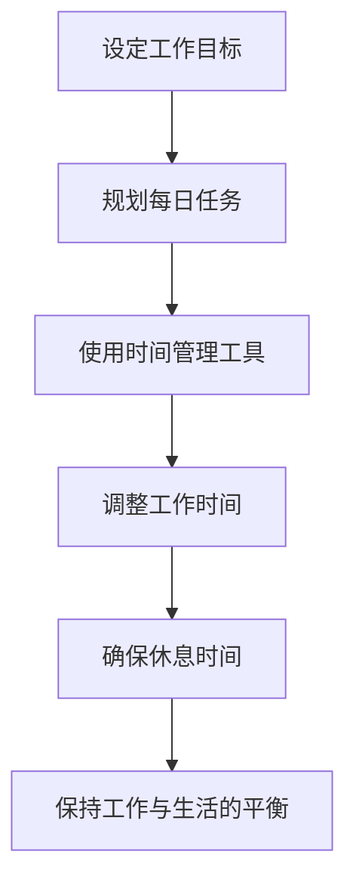
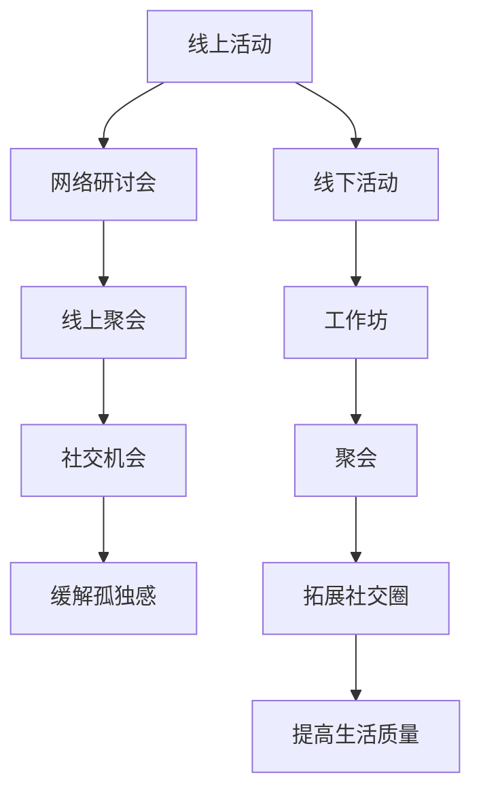
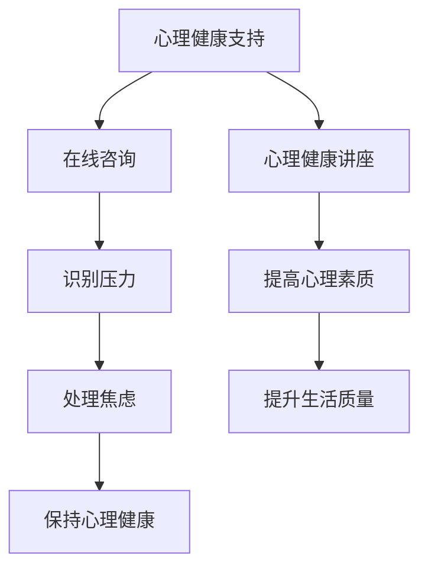
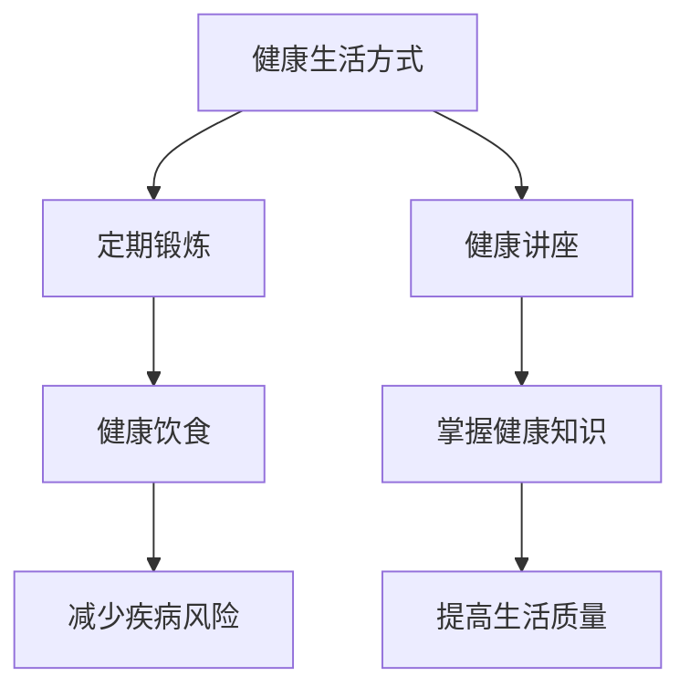
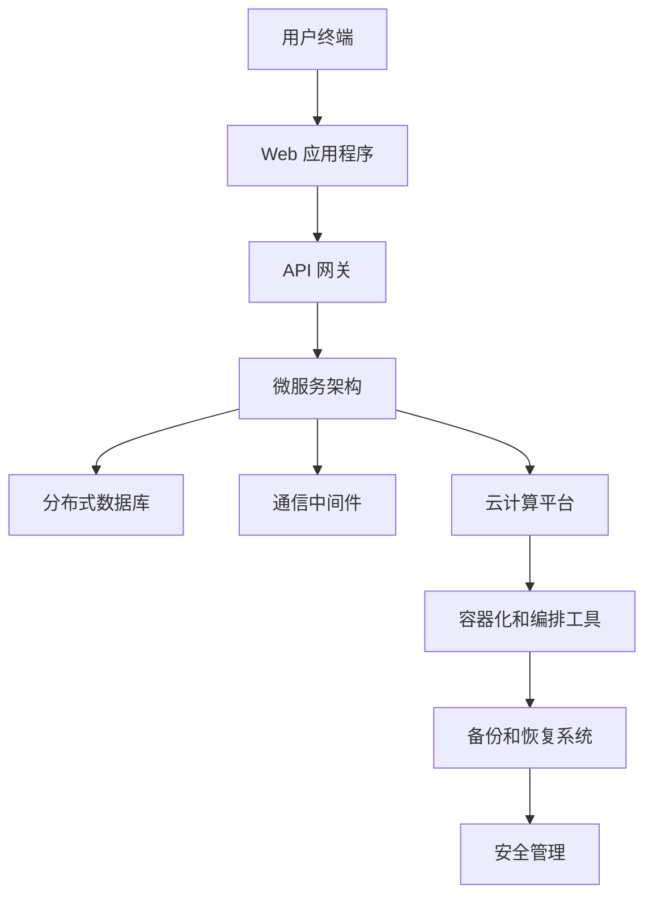
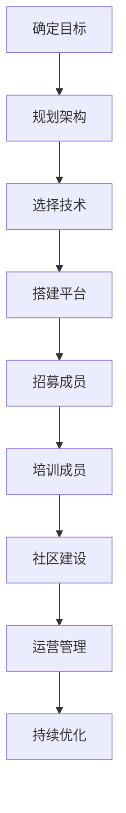
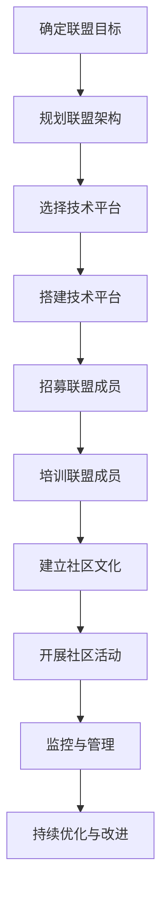

                 

### 1.3 数字游牧者的日常生活与工作模式

数字游牧者，正如其名，他们的生活方式和工作模式与传统的办公室工作截然不同。他们通常不受固定工作地点的限制，而是利用现代通信技术和互联网资源，在世界的各个角落工作。这种生活方式不仅为他们带来了更大的灵活性，还提高了工作效率和生活质量。

#### 1.3.1 日常工作的环境

数字游牧者的日常工作环境多种多样。他们可以在咖啡馆、公园、海滨或甚至是自己的家中办公。这种灵活性使得他们能够选择最适合自己的工作环境，从而提高工作效率。例如，有些游牧者更喜欢在安静的咖啡馆工作，以避免家庭中的干扰；而另一些人则更喜欢在家工作，因为这样他们可以更好地照顾家人。

#### 1.3.2 工作时间的灵活性

与传统的朝九晚五工作模式不同，数字游牧者通常拥有更大的工作时间灵活性。他们可以根据自己的生活习惯和工作需求来安排工作时间。例如，有些人可能会选择在早晨集中处理重要的工作任务，而在下午或晚上处理一些不那么紧迫的任务。此外，许多数字游牧者还会利用时差优势，在不同的时区之间调整工作计划，以确保能够与全球的客户和同事保持高效沟通。

#### 1.3.3 工具和技术的使用

数字游牧者的日常工作和生活离不开各种工具和技术的支持。以下是一些常用的工具和技：

1. **虚拟专用网络（VPN）**：VPN可以帮助数字游牧者安全地访问公司的内部资源，无论他们身处何地。
   
2. **项目管理工具**：如Trello、Asana和Jira等，这些工具可以帮助他们跟踪任务进度、管理项目团队，确保项目按时交付。

3. **即时通讯工具**：如Slack、Microsoft Teams和WhatsApp等，这些工具使他们能够与全球的团队成员实时沟通。

4. **云存储和协作工具**：如Google Drive、Dropbox和OneDrive等，这些工具使得文件共享和协作变得更加容易。

5. **在线会议和视频通话工具**：如Zoom、Microsoft Teams和Google Meet等，这些工具使他们能够与全球的客户和同事进行面对面的交流。

#### 1.3.4 工作与生活的平衡

数字游牧者通常需要学会如何在工作与生活之间找到平衡。由于工作与生活的界限变得模糊，他们需要采取措施来避免过度工作。以下是一些有助于实现工作与生活平衡的建议：

1. **设定工作时间**：尽管工作时间的灵活性很大，但设定一个固定的工作时间仍然很重要。这有助于建立工作习惯，同时确保有足够的时间进行其他活动。

2. **避免工作入侵**：在家中工作时，避免让工作入侵个人生活空间是一个挑战。将工作区域与生活区域分开，并尽量在工作结束后不带入工作区域，可以帮助实现这一目标。

3. **定期休息和锻炼**：定期休息和锻炼对于保持身体健康和工作效率至关重要。数字游牧者应该确保在工作日程中安排时间进行休息和锻炼。

4. **社交和人际关系**：与家人、朋友和同事保持良好的社交联系对于心理健康和幸福感至关重要。数字游牧者应该努力保持这些联系，无论是通过线上还是线下的方式。

通过这些工具和技术，数字游牧者不仅能够实现高效的工作，还能享受更加灵活和自由的生活方式。随着远程工作越来越普及，数字游牧者的生活方式和工作模式将继续影响和改变现代工作方式。在下一章中，我们将进一步探讨数字游牧者联盟的定义和特点。 

### 2.1 数字游牧者联盟的定义

数字游牧者联盟（Digital Nomad Alliance）是一种基于互联网和现代通信技术的全球互助网络，旨在为远程工作者提供资源共享、职业发展和生活支持。这个联盟不仅仅是一个简单的社交平台，而是一个综合性的生态系统，通过一系列技术和策略，帮助成员实现职业和生活的最大化价值。

#### 2.1.1 联盟的核心目标

数字游牧者联盟的主要目标包括：

1. **资源共享**：通过联盟平台，成员可以共享办公空间、住宿、交通和其他生活资源，从而降低生活成本，提高生活质量。
   
2. **职业发展**：联盟提供各种培训和职业发展机会，包括在线课程、研讨会和工作坊，帮助成员提升技能和拓展职业网络。

3. **生活支持**：联盟提供心理咨询、健康支持、社交活动等生活服务，帮助成员应对远程工作中的孤独和压力。

4. **社区建设**：联盟通过线上和线下的社交活动，促进成员之间的互动和联系，建立强大的社交网络。

#### 2.1.2 联盟的特点

数字游牧者联盟具有以下显著特点：

1. **全球化**：联盟的成员来自世界各地，他们可以在任何地方加入联盟，并利用联盟的资源和服务。

2. **灵活性**：联盟允许成员根据个人需求和偏好选择最适合自己的资源和活动，从而实现个性化的职业和生活规划。

3. **技术创新**：联盟利用最新的互联网技术和云计算平台，提供高效、便捷的服务和体验。

4. **开放性**：联盟对所有远程工作者开放，不论性别、年龄、国籍和职业，只要有志于实现远程工作的理想，都可以加入联盟。

5. **可持续性**：联盟通过资源共享和协作，鼓励成员实现环保、可持续的生活方式，减少对环境的负面影响。

#### 2.1.3 联盟的运作机制

数字游牧者联盟的运作机制主要包括以下几个方面：

1. **会员制度**：成员通过注册成为联盟会员，获得各种资源和服务的访问权限。

2. **资源共享平台**：联盟搭建了一个在线资源共享平台，成员可以发布和获取各种资源，如办公空间、住宿、交通等。

3. **培训和职业发展平台**：联盟提供一系列在线课程和职业发展机会，成员可以根据个人兴趣和需求选择参加。

4. **社交活动和社区建设**：联盟定期举办线上和线下活动，促进成员之间的交流和互动，建立强大的社交网络。

5. **反馈和评价机制**：联盟建立了反馈和评价机制，成员可以对资源和活动进行评价，联盟根据反馈不断优化服务。

通过这些机制，数字游牧者联盟为成员提供了一个全方位的支持平台，不仅帮助他们实现职业和生活的平衡，还为他们提供了无限的发展机会。在下一章中，我们将进一步探讨数字游牧者联盟如何促进远程工作者的职业发展和生活品质。 

### 2.2 数字游牧者联盟如何促进远程工作者的职业发展

数字游牧者联盟不仅为远程工作者提供了一个资源共享和生活支持的生态系统，更重要的是，它为成员的职业发展提供了丰富的机会和资源。通过一系列有针对性的培训和职业发展服务，联盟帮助成员提升技能、拓展职业网络，并实现职业目标。

#### 2.2.1 在线培训和职业发展课程

数字游牧者联盟提供了一系列在线培训和职业发展课程，涵盖了各种领域，如编程、数据分析、设计、市场营销等。这些课程由行业专家和资深从业者授课，内容丰富、实用性强，能够帮助成员迅速提升专业技能。

- **编程课程**：包括Python、Java、JavaScript等编程语言的入门和进阶课程，以及大数据和人工智能等相关领域的前沿技术。
- **数据分析课程**：涵盖数据清洗、数据分析、数据可视化等核心技能，帮助成员掌握从数据中提取有价值信息的方法。
- **设计课程**：包括平面设计、UI/UX设计、数字营销设计等，培养成员的设计思维和创意能力。
- **市场营销课程**：涵盖数字营销、社交媒体营销、内容营销等，帮助成员掌握现代营销策略和工具。

#### 2.2.2 网络研讨会和工作坊

除了在线课程，数字游牧者联盟还定期举办网络研讨会和工作坊，这些活动旨在帮助成员深入了解行业动态、掌握新技术，并拓展职业网络。

- **行业趋势研讨会**：邀请行业专家分享最新的行业趋势和技术动态，帮助成员把握市场机会。
- **技术研讨会**：探讨特定的技术主题，如云计算、区块链、人工智能等，成员可以与专家深入交流，解决实际问题。
- **工作坊**：通过动手实践和小组讨论，帮助成员掌握新技术和工具，提高实际操作能力。

#### 2.2.3 职业咨询和导师计划

数字游牧者联盟还提供职业咨询和导师计划，帮助成员在职业发展过程中遇到困难时获得指导和支持。

- **职业咨询**：提供一对一的职业咨询服务，帮助成员明确职业目标、制定职业规划，解决职业发展中的问题。
- **导师计划**：为成员匹配行业导师，导师们根据自身经验和专业知识，提供职业发展建议和指导，帮助成员在职业生涯中少走弯路。

#### 2.2.4 职业网络拓展

数字游牧者联盟通过线上和线下的社交活动，帮助成员建立强大的职业网络。

- **线上社交活动**：通过联盟的平台，成员可以与全球的同行和专家建立联系，分享经验和资源。
- **线下活动**：联盟定期组织线下聚会、工作坊和行业会议，成员可以面对面交流，拓展职业网络。

#### 2.2.5 职业发展案例

以下是一些数字游牧者联盟成员的职业发展案例：

- **案例1**：一位从事前端开发的数字游牧者，通过联盟提供的在线编程课程，提升了技术能力，成功获得了一份远程工作，薪资翻倍。
- **案例2**：一位数字游牧者通过联盟举办的行业趋势研讨会，了解到最新的数据分析工具，从而转型成为数据分析师，实现了职业升级。
- **案例3**：一位平面设计师通过联盟的导师计划，获得了行业导师的建议和指导，不仅在设计技能上有所提升，还在职业网络中结识了许多有影响力的设计师。

通过这些案例可以看出，数字游牧者联盟为成员提供了丰富的职业发展资源和机会，帮助他们实现职业目标，提升生活质量。在下一章中，我们将进一步探讨数字游牧者联盟如何提升成员的生活品质。 

### 2.3 数字游牧者联盟如何提升成员的生活品质

数字游牧者联盟不仅致力于帮助成员实现职业目标，还关注成员的生活品质。通过提供丰富的社交活动、心理咨询、健康支持等生活服务，联盟帮助成员在远程工作的同时，保持身心健康，享受丰富多彩的生活。

#### 2.3.1 社交活动

社交活动是数字游牧者联盟的重要组成部分，通过这些活动，成员可以结识新的朋友，拓展社交圈，增强归属感。

- **线上社交活动**：联盟定期举办线上聚会、茶话会等社交活动，成员可以在线上分享经验、交流想法，结识志同道合的朋友。
- **线下活动**：联盟在不同城市和地区组织线下聚会、工作坊和行业会议，成员可以面对面交流，拓展职业网络，同时享受丰富多彩的社交生活。

#### 2.3.2 心理咨询

远程工作可能会给成员带来孤独感和压力，数字游牧者联盟提供专业的心理咨询服务，帮助成员应对心理问题。

- **在线咨询**：联盟与专业心理咨询机构合作，提供在线心理咨询，成员可以随时随地获得心理支持。
- **线下咨询**：联盟在一些城市设有心理咨询室，成员可以在舒适的环境中接受专业的心理咨询。

#### 2.3.3 健康支持

健康是生活品质的重要组成部分，数字游牧者联盟通过多种方式为成员提供健康支持。

- **健康讲座**：联盟定期举办健康讲座，邀请专业医生和健康专家分享健康知识，提高成员的健康意识。
- **健身活动**：联盟组织线上健身课程和线下健身活动，鼓励成员保持健康的生活方式。
- **健康支持**：联盟提供健康支持计划，包括健康保险、健康检测等，确保成员的身心健康。

#### 2.3.4 生活技能培训

为了帮助成员更好地适应远程工作和生活，数字游牧者联盟还提供一系列生活技能培训。

- **时间管理**：帮助成员掌握时间管理技巧，提高工作效率，实现工作与生活的平衡。
- **财务管理**：教授成员如何合理规划和管理个人财务，确保经济独立和稳定。
- **家居烹饪**：提供家居烹饪课程，帮助成员学会制作健康美味的餐点，提高生活质量。

#### 2.3.5 生活品质提升案例

以下是一些数字游牧者联盟成员的生活品质提升案例：

- **案例1**：一位长期独自工作的数字游牧者通过联盟的社交活动，结识了新朋友，不仅缓解了孤独感，还拓展了社交圈。
- **案例2**：一位心理咨询师通过联盟提供的心理咨询服务，解决了长期困扰自己的心理问题，重新找回了生活的热情。
- **案例3**：一位数字游牧者通过联盟的健康支持计划，参加了一系列健康讲座和健身活动，提高了健康水平，生活质量也得到了显著提升。

通过这些案例可以看出，数字游牧者联盟通过提供丰富的社交活动、心理咨询、健康支持和生活技能培训，有效提升了成员的生活品质。在下一章中，我们将探讨数字游牧者联盟如何帮助成员实现生活与工作的平衡。 

### 2.4 数字游牧者联盟与成员生活、工作的平衡

在数字游牧者联盟中，成员的生活和工作平衡是其成功的重要因素之一。远程工作虽然提供了灵活性和自由，但也可能导致工作和生活之间的界限模糊，进而影响生活质量。数字游牧者联盟通过一系列措施，帮助成员实现生活与工作的平衡。

#### 2.4.1 工作时间管理

为了确保工作与生活的平衡，数字游牧者联盟鼓励成员设定明确的工作时间。通过使用时间管理工具，如Trello、Asana等，成员可以规划每日、每周的工作任务，确保工作高效进行，同时留出时间进行休闲和社交活动。



#### 2.4.2 线上、线下活动的结合

数字游牧者联盟通过线上和线下活动相结合，帮助成员在工作和生活之间找到平衡。线上活动如网络研讨会、线上聚会，可以减少通勤时间，提高工作效率；线下活动如工作坊、聚会等，则提供了社交机会，有助于缓解远程工作的孤独感。



#### 2.4.3 心理健康支持

远程工作可能导致心理健康问题，数字游牧者联盟提供专业的心理健康支持，包括在线咨询和心理健康讲座。这些服务帮助成员识别和处理压力、焦虑等心理问题，保持心理健康。



#### 2.4.4 健康生活方式培养

数字游牧者联盟鼓励成员培养健康的生活方式，包括定期锻炼、健康饮食等。通过健康讲座、健身活动等，联盟帮助成员养成良好的生活习惯，提高生活质量。



通过这些措施，数字游牧者联盟帮助成员在远程工作的同时，保持身心健康，实现生活与工作的平衡。在下一章中，我们将探讨数字游牧者联盟如何影响社会和文化。 

### 3.1 数字游牧者联盟的技术架构概览

数字游牧者联盟是一个复杂且高度集成的系统，其技术架构设计旨在支持远程工作者的各种需求，包括资源共享、职业发展、社交互动和生活支持。以下是对该联盟技术架构的概览：

#### 3.1.1 核心技术组件

数字游牧者联盟的技术架构主要包括以下几个核心组件：

1. **云计算平台**：联盟使用云计算平台，如Amazon Web Services (AWS)、Google Cloud Platform (GCP) 和 Microsoft Azure，以提供可伸缩的计算资源和存储服务。这些平台提供了高可用性、可靠性和安全性，确保联盟服务的稳定运行。

2. **分布式数据库**：为了处理大量的用户数据和资源信息，联盟采用分布式数据库架构，如MongoDB、Cassandra 和 Redis。这些数据库支持实时数据访问和高并发处理，为联盟的各项服务提供数据支持。

3. **通信中间件**：为了确保成员之间的实时通信和消息传递，联盟使用通信中间件，如RabbitMQ、Kafka 和 WebSocket。这些工具支持消息队列、流处理和实时数据传输，是联盟通信的核心。

4. **Web 应用程序框架**：联盟使用流行的 Web 应用程序框架，如Spring Boot、Django 和 React，以快速开发和部署前端和后端服务。这些框架提供了丰富的功能、良好的扩展性和高效的开发体验。

5. **容器化和编排工具**：为了实现服务的高可用性和弹性，联盟使用 Docker 和 Kubernetes 进行容器化和编排。这些工具使得服务的部署、扩展和管理变得更加灵活和高效。

#### 3.1.2 技术架构设计原则

数字游牧者联盟的技术架构遵循以下设计原则：

1. **可伸缩性**：架构设计需要支持用户数量的快速增长，确保在高峰期仍能提供稳定的服务。

2. **高可用性**：通过分布式系统和冗余设计，确保系统在面临故障时仍能正常运行。

3. **安全性**：架构设计必须考虑数据安全和用户隐私，采用加密、身份验证和访问控制等安全措施。

4. **灵活性**：架构需要支持快速变化的需求，方便功能扩展和技术升级。

5. **用户体验**：技术架构设计要考虑到用户体验，确保服务界面直观易用。

#### 3.1.3 技术架构概览图

以下是一个简化的数字游牧者联盟技术架构概览图：



在这个架构中，用户通过 Web 应用程序与联盟服务交互，API 网关负责路由和认证。微服务架构将应用功能划分为多个独立的服务模块，如用户管理、资源管理、职业发展等，每个模块都有自己的数据库和通信机制。分布式数据库和通信中间件支持高并发处理和实时数据传输，云计算平台提供可伸缩的计算资源，容器化和编排工具确保服务的高可用性和灵活性。备份和恢复系统及安全管理保障系统的稳定运行和数据安全。

通过这个技术架构，数字游牧者联盟能够为成员提供高效、稳定、安全的远程工作支持服务。在下一章中，我们将深入探讨全球互助网络的数学模型与算法原理。 

### 3.2 全球互助网络的数学模型与算法原理

全球互助网络是一个复杂的社会系统，其运作机制需要通过数学模型和算法来描述和优化。以下是数字游牧者联盟全球互助网络的数学模型与算法原理的详细解释：

#### 3.2.1 资源共享模型

资源共享是数字游牧者联盟的核心功能之一，为了最大化资源利用效率，联盟采用了一种基于供需匹配的资源分配模型。

- **供需模型**：假设联盟有 N 个资源提供者（如空置办公室、住宿、交通工具等）和 M 个资源需求者。每个提供者可以提供的资源量为 X，需求者需要资源量为 Y。

- **供需匹配算法**：使用贪心算法进行资源匹配。每次迭代，选择一个资源供给量最大的提供者，将其资源分配给一个需求量最大的需求者，直到供需平衡。

伪代码：

```python
for i in range(N):
    max_supply = find_max_supply(提供者列表)
    max_demand = find_max_demand(需求者列表)
    if max_supply >= max_demand:
        assign_resources(max_supply, max_demand)
        update_supply_and_demand()
    else:
        break()
```

#### 3.2.2 职业发展模型

数字游牧者联盟提供了丰富的职业发展资源和机会，为了提升成员的职业竞争力，联盟采用了一种基于技能评估和职业匹配的职业发展模型。

- **技能评估模型**：每个成员都可以上传自己的技能证书、项目经历等，形成个人技能库。系统使用机器学习算法对技能库进行评估，生成技能评分。

- **职业匹配算法**：根据成员的技能评分和市场需求，使用匹配算法推荐适合的职业发展路径和机会。

伪代码：

```python
def recommend_jobs(skills_score, market_data):
    potential_jobs = []
    for job in market_data:
        if skills_score >= job.required_skills:
            potential_jobs.append(job)
    return potential_jobs
```

#### 3.2.3 社交互动模型

社交互动是数字游牧者联盟的重要功能之一，为了促进成员之间的互动和社区建设，联盟采用了一种基于兴趣匹配的社交互动模型。

- **兴趣模型**：每个成员都可以声明自己的兴趣爱好，系统使用这些信息构建成员的兴趣图谱。

- **社交互动算法**：基于成员的兴趣图谱，系统推荐可能感兴趣的朋友和活动。

伪代码：

```python
def recommend_friends(interest_profile, members):
    potential_friends = []
    for member in members:
        if intersection(interest_profile, member.interest_profile) > threshold:
            potential_friends.append(member)
    return potential_friends
```

#### 3.2.4 风险评估与防范模型

为了确保全球互助网络的安全和稳定，联盟采用了一种基于风险评估与防范的模型。

- **风险评估模型**：对成员的信用历史、行为记录等数据进行综合评估，生成信用评分。

- **风险防范算法**：基于信用评分，系统对成员的资源申请和活动进行风险审查，防范欺诈和风险事件。

伪代码：

```python
def assess_risk(credit_score, behavior_data):
    if credit_score < threshold:
        raise Warning("Potential Risk Detected")
    elif behavior_data contains suspicious activities:
        raise Warning("Suspicious Activities Detected")
    else:
        approve_request()
```

通过这些数学模型和算法，数字游牧者联盟能够高效地管理资源、促进职业发展、增强社交互动，并确保网络的安全稳定。在下一章中，我们将详细探讨数字游牧者联盟的关键技术与工具。 

### 3.3 数字游牧者联盟的关键技术与工具

数字游牧者联盟的运营和效能高度依赖于一系列先进的技术与工具。这些技术与工具不仅提升了联盟的服务质量，也为成员提供了更加便捷和高效的体验。以下是数字游牧者联盟在关键技术领域的详细探讨：

#### 3.3.1 分布式协作平台

分布式协作平台是数字游牧者联盟的核心技术之一，它为成员提供了一个高效的协作环境。以下是一些常用的分布式协作平台及其特点：

- **Trello**：一个基于看板（Kanban）方法的协作工具，适合团队管理项目任务和进度。它提供了简洁直观的界面和灵活的工作流程，非常适合远程团队协作。

- **Asana**：一个全面的任务管理和协作平台，能够帮助团队规划和跟踪项目进度。Asana 提供了丰富的功能，如任务分配、时间追踪、报告生成等，非常适合大规模的远程协作。

- **Jira**：一款功能强大的敏捷开发工具，适用于软件开发团队的项目管理和跟踪。Jira 提供了灵活的工作流程和丰富的插件生态系统，可以与各种开发工具集成，提高开发效率。

#### 3.3.2 云计算与边缘计算

云计算和边缘计算在数字游牧者联盟的技术架构中发挥着重要作用。它们为联盟提供了可伸缩的计算资源和高效的数据处理能力。

- **云计算**：联盟使用云计算平台，如AWS、GCP和Azure，来部署和管理各种服务和应用程序。这些平台提供了弹性计算、自动扩展和高度可用的服务，确保联盟服务的稳定运行。

  - **优点**：成本低、扩展性强、高可用性。
  - **应用场景**：资源管理、数据处理、应用部署。

- **边缘计算**：边缘计算将数据处理和存储分散到网络的边缘节点，减少了数据传输延迟，提高了系统的响应速度。

  - **优点**：低延迟、高带宽、高效能。
  - **应用场景**：实时数据处理、物联网应用、远程控制。

#### 3.3.3 数据安全与隐私保护

数据安全和隐私保护是数字游牧者联盟面临的重大挑战，为了确保成员的信息安全，联盟采用了多种安全技术和策略。

- **加密技术**：联盟使用加密技术来保护数据在传输和存储过程中的安全性。如SSL/TLS协议用于数据传输加密，AES加密算法用于数据存储加密。

- **身份验证与访问控制**：联盟采用多因素身份验证（MFA）和基于角色的访问控制（RBAC）机制，确保只有授权用户可以访问敏感数据。

- **数据备份与恢复**：联盟定期备份数据，并采用灾难恢复计划，确保数据的安全性和可用性。

#### 3.3.4 实时通信与视频会议工具

为了支持远程成员之间的实时沟通和协作，联盟采用了多种实时通信和视频会议工具。

- **Slack**：一款流行的即时通讯工具，提供了丰富的聊天功能、集成应用和机器人，适合团队日常沟通和协作。

- **Zoom**：一款功能强大的视频会议工具，提供了高清视频、语音和屏幕共享功能，适合远程会议和培训。

- **Microsoft Teams**：一款全面的协作平台，提供了聊天、视频会议、文件共享和应用程序集成等功能，适合企业级远程协作。

#### 3.3.5 云存储与协作工具

云存储和协作工具在数字游牧者联盟中起到了关键作用，它们帮助成员方便地共享和协作文件。

- **Google Drive**：一个强大的云存储和协作工具，提供了无缝的文件同步、共享和编辑功能。

- **Dropbox**：一个广泛使用的云存储解决方案，提供了方便的文件同步、共享和安全保护。

- **OneDrive**：微软的云存储服务，与Office 365集成，提供了强大的文档编辑和协作功能。

#### 3.3.6 自动化与脚本工具

为了提高效率和自动化工作流程，联盟采用了多种自动化和脚本工具。

- **Cron**：一个常用的自动化任务调度工具，用于定期执行系统任务和脚本。

- **Ansible**：一款开源的自动化工具，用于配置管理、应用部署和IT自动化。

- **Python 脚本**：Python 脚本在数字游牧者联盟中广泛用于自动化任务、数据处理和接口集成。

通过这些关键技术和工具，数字游牧者联盟为成员提供了一个高效、安全、灵活的远程工作环境，促进了全球互助网络的稳定运行和持续发展。在下一章中，我们将通过实际案例来探讨数字游牧者联盟的应用场景和效果。 

### 4.1 数字游牧者联盟的应用场景

数字游牧者联盟在全球范围内具有广泛的应用场景，通过实际案例，我们可以更清楚地看到它在不同领域中的具体应用和效果。

#### 4.1.1 远程办公

远程办公是数字游牧者联盟最直接的应用场景之一。许多公司和组织通过联盟平台雇佣远程员工，以降低成本、提高灵活性和员工满意度。以下是一个实际案例：

**案例**：一家位于硅谷的科技公司利用数字游牧者联盟招聘远程开发人员。通过联盟的资源共享平台，公司找到了多个高技能的远程员工，这些员工来自全球各地。公司不仅节省了办公室租赁和设备采购的费用，还能根据项目需求灵活调整团队规模。通过联盟提供的即时通讯和视频会议工具，公司与远程员工保持了高效的沟通和协作，项目进展顺利。

#### 4.1.2 在线教育

在线教育是数字游牧者联盟的另一个重要应用场景。通过联盟平台，教育机构和讲师可以轻松地创建和分享在线课程，学员则可以随时随地学习。以下是一个实际案例：

**案例**：一位数字游牧者讲师通过数字游牧者联盟创建了一门Python编程课程。她利用联盟提供的在线教育平台和工具，设计课程内容、上传视频、布置作业和进行在线答疑。学员遍布全球，通过联盟提供的实时通信工具，讲师能够与学员进行互动，解答他们的疑问。这种在线教育模式不仅提高了讲师的教学效果，也为学员提供了便捷的学习途径。

#### 4.1.3 数字内容创作

数字游牧者联盟为数字内容创作者提供了广阔的创作空间和资源支持。创作者可以利用联盟的平台和工具，进行内容创作、发布和管理。以下是一个实际案例：

**案例**：一位数字游牧者自媒体运营者通过数字游牧者联盟创建了一个内容创作团队。团队利用联盟提供的协作平台和云存储工具，分工合作，完成内容创作和发布。通过联盟的社交互动功能，团队与读者建立了紧密的联系，提高了内容的传播效果和影响力。

#### 4.1.4 数字营销与社交媒体

数字游牧者联盟在数字营销和社交媒体领域也具有广泛应用。营销团队可以利用联盟提供的工具和资源，进行市场调研、内容创作和推广。以下是一个实际案例：

**案例**：一家数字营销公司通过数字游牧者联盟组建了一个全球营销团队。团队成员分布在不同的国家和地区，利用联盟提供的实时通信和云协作工具，团队高效地完成了多个营销项目。通过联盟的社交媒体推广渠道，公司扩大了品牌影响力，取得了显著的市场效果。

#### 4.1.5 远程医疗

远程医疗是数字游牧者联盟在医疗领域的应用，通过联盟平台，医生和患者可以远程进行诊断和治疗。以下是一个实际案例：

**案例**：一位数字游牧者医生通过数字游牧者联盟提供远程医疗服务。他利用联盟提供的视频会议和云存储工具，为患者进行远程诊断和治疗方案咨询。通过这种远程医疗模式，医生可以覆盖更广泛的地区，提高了医疗服务的可及性和效率。

这些实际案例展示了数字游牧者联盟在不同领域中的应用场景和效果，通过联盟的资源共享、实时通信和协作工具，远程工作者可以更加高效地开展工作和生活，实现职业和生活的平衡。在下一章中，我们将探讨如何建立和管理一个有效的数字游牧者联盟。 

### 4.2 如何建立和管理一个有效的数字游牧者联盟

建立和管理一个有效的数字游牧者联盟是一个复杂的过程，需要考虑多个方面，包括战略规划、技术实施、资源整合和用户体验。以下是一些关键步骤和建议：

#### 4.2.1 战略规划

1. **确定目标**：首先，明确数字游牧者联盟的目标，例如资源共享、职业发展、生活支持、社区建设等。这些目标将指导联盟的发展方向。

2. **市场需求分析**：了解市场需求，分析潜在成员的需求和痛点，以便提供有针对性的服务和资源。

3. **制定长期战略**：制定联盟的长期发展战略，包括市场定位、业务模式、竞争策略等。

4. **评估资源和能力**：评估现有的资源和能力，确定需要补充的资源和技术。

#### 4.2.2 技术实施

1. **选择合适的平台和工具**：根据联盟的目标和服务内容，选择适合的云计算平台、数据库、协作工具、通信工具等。

2. **搭建技术架构**：设计并实施稳定、可扩展、安全的技术架构，确保服务的可靠性和高性能。

3. **安全保障**：实施严格的安全措施，包括数据加密、身份验证、访问控制等，确保成员的数据安全和隐私。

4. **持续优化和升级**：根据用户反馈和技术发展，持续优化和升级技术系统，提高用户体验。

#### 4.2.3 资源整合

1. **资源目录管理**：建立一个全面的资源目录，包括办公空间、住宿、交通工具等，确保资源的及时更新和有效管理。

2. **合作伙伴关系**：与相关企业和机构建立合作伙伴关系，获取更多的资源和支持，如培训机构、健康服务提供商、保险公司等。

3. **资金筹集**：通过众筹、投资、会员费等方式筹集资金，确保联盟的可持续运营。

#### 4.2.4 用户管理

1. **注册和认证**：建立一个便捷的注册和认证流程，确保成员的身份真实和可靠。

2. **用户服务和支持**：提供高效的用户服务和支持，包括在线咨询、电话支持、社区互动等，解决成员的问题和需求。

3. **用户反馈和评价**：建立用户反馈和评价机制，收集成员的反馈和建议，不断改进服务和体验。

#### 4.2.5 用户体验

1. **简洁的用户界面**：设计简洁、直观的用户界面，提高用户的操作便捷性和体验。

2. **个性化服务**：根据成员的需求和偏好，提供个性化的服务和推荐，提高用户满意度。

3. **社交互动**：通过社区互动、线上聚会、线下活动等方式，增强成员之间的互动和社交，提高社区凝聚力。

4. **培训与支持**：提供各种培训和课程，帮助成员提升技能和职业发展，提高他们的工作能力和生活质量。

通过以上步骤和建议，可以建立和管理一个有效的数字游牧者联盟，为成员提供优质的服务和支持，实现职业和生活的平衡。在下一章中，我们将探讨数字游牧者联盟对远程工作者职业发展的促进作用。 

### 5.1 数字游牧者联盟对远程工作者职业发展的促进作用

数字游牧者联盟通过一系列有针对性的措施，显著促进了远程工作者的职业发展。以下是联盟在以下几个方面对成员职业发展的具体促进作用：

#### 5.1.1 技能提升

数字游牧者联盟提供了一个丰富的在线培训平台，涵盖了编程、数据分析、设计、市场营销等多个领域的课程。成员可以通过这些课程系统性地提升自己的专业技能，以满足不断变化的市场需求。

- **案例**：一位数字游牧者通过联盟提供的Python编程课程，成功从UI/UX设计师转型为数据分析师，获得了更高的薪资和更广阔的职业发展机会。

#### 5.1.2 职业机会

联盟通过职业推荐和项目合作，为成员提供丰富的职业机会。通过联盟的平台，成员可以轻松找到与自己技能相匹配的远程工作机会，从而拓展职业发展路径。

- **案例**：一位经验丰富的数字游牧者通过联盟的职业推荐，获得了一家知名互联网公司的远程开发职位，不仅实现了职业晋升，还提升了工作满意度。

#### 5.1.3 职业网络拓展

数字游牧者联盟通过线上和线下活动，帮助成员建立和拓展职业网络。通过这些活动，成员可以结识来自不同领域的专业人士，分享经验和资源，建立合作关系。

- **案例**：一位数字游牧者通过联盟举办的行业研讨会，结识了多位业内专家，从而获得了多个合作机会，并成功扩展了自己的业务范围。

#### 5.1.4 职业发展指导

联盟提供的职业咨询和导师计划为成员提供了专业的职业发展指导。通过一对一的咨询和导师辅导，成员可以明确职业目标，制定职业规划，并解决职业发展中的问题。

- **案例**：一位新入职的数字游牧者通过联盟的导师计划，获得了资深技术专家的指导，在短时间内掌握了关键技能，迅速适应了新的工作环境。

#### 5.1.5 创业支持

数字游牧者联盟还为有创业意愿的成员提供支持，包括创业指导、资金支持和资源分享。这些措施鼓励成员发挥创意，实现创业梦想。

- **案例**：一位数字游牧者通过联盟的创业支持计划，成功创办了一家远程办公咨询服务公司，并在短时间内获得了市场认可和财务收益。

#### 5.1.6 职业发展路径优化

数字游牧者联盟通过不断优化的职业发展模型，帮助成员找到最适合自己的职业路径。联盟提供了职业匹配算法和技能评估工具，成员可以根据这些工具分析自己的职业潜力，制定个性化的职业发展计划。

- **案例**：一位数字游牧者通过联盟的职业发展工具，发现了自己在数据分析领域的潜力，并制定了详细的职业发展路径，逐步实现了职业目标。

通过以上措施，数字游牧者联盟不仅为成员提供了丰富的职业发展资源和机会，还通过个性化指导和支持，帮助他们实现职业成长和成功。在下一章中，我们将探讨如何提升个人在数字游牧者联盟中的竞争力。 

### 6.1 如何提升个人在数字游牧者联盟中的竞争力

在数字游牧者联盟中，个人竞争力的提升对于职业发展和生活质量至关重要。以下是一些策略和技巧，可以帮助成员在联盟中脱颖而出：

#### 6.1.1 增强专业技能

- **持续学习**：利用联盟提供的在线培训课程，不断提升自己的专业技能。例如，编程、数据分析、设计、市场营销等。
- **获取认证**：通过获得专业认证，如Certified Kubernetes Administrator (CKA) 或Certified Data Analyst (CDA)，可以提高自己的专业信誉和市场价值。
- **实践项目**：参与联盟中的项目和挑战，通过实际操作提高自己的技能和经验。

#### 6.1.2 拓展职业网络

- **积极参与社交活动**：通过参加联盟的线上和线下活动，结识更多的同行和专业人士，建立广泛的职业网络。
- **分享经验和知识**：在联盟的社区中分享自己的经验和知识，树立专业形象，增强影响力。
- **建立个人品牌**：通过撰写博客、发布视频教程或参加行业会议，建立自己的个人品牌，提升知名度。

#### 6.2 建立个人影响力

- **提供价值**：在联盟的社区中提供有价值的内容和建议，帮助其他成员解决问题，建立信任和影响力。
- **参与合作**：积极参与联盟中的项目和合作，展示自己的能力和成就。
- **担任志愿者**：在联盟中担任志愿者，参与社区建设和管理，提升自己的组织能力和领导力。

#### 6.3 优化工作流程

- **高效沟通**：学会高效沟通技巧，如清晰表达、有效倾听和及时反馈，确保与团队成员和其他利益相关者的沟通顺畅。
- **时间管理**：合理规划时间，确保工作高效，同时留出时间进行自我提升和休息。
- **利用工具**：熟练使用联盟提供的工具和平台，如分布式协作平台、实时通信工具和云存储服务，提高工作效率。

#### 6.4 关注行业动态

- **持续学习**：关注行业动态和技术趋势，了解新兴技术和市场变化，保持自己的竞争力。
- **参与讨论**：加入行业论坛和社交媒体群组，参与技术讨论和行业交流，扩大视野。
- **参加会议**：定期参加行业会议和研讨会，了解最新的行业发展和研究成果。

通过以上策略和技巧，个人可以显著提升在数字游牧者联盟中的竞争力，实现职业和生活的平衡。在下一章中，我们将探讨数字游牧者联盟的未来发展趋势与机会。 

### 7.1 数字游牧者联盟的未来发展趋势与机会

随着全球化的加速和技术的不断进步，数字游牧者联盟正迎来新的发展机遇。以下是对未来发展趋势和机会的探讨：

#### 7.1.1 技术进步

技术的不断革新将推动数字游牧者联盟向更高效、更智能的方向发展。例如，人工智能、区块链和物联网等技术的应用将进一步提升联盟的服务质量和用户体验。

- **人工智能**：通过人工智能技术，联盟可以实现智能匹配、个性化推荐和自动化管理，提高资源利用率和用户体验。
- **区块链**：区块链技术可以为联盟提供去中心化的信任机制，确保数据安全和透明性，增强成员之间的信任。
- **物联网**：物联网技术的应用将使得联盟能够更好地整合物理世界和数字世界，提供更丰富的服务和体验。

#### 7.1.2 全球化拓展

数字游牧者联盟的全球化趋势将进一步增强。随着更多国家和地区开放远程工作政策，联盟将拓展到更多的国家和地区，吸引更多的成员加入。

- **区域市场**：联盟将更加注重区域市场的开发和运营，例如在亚洲、非洲和拉丁美洲等新兴市场建立分支机构，提供本地化的服务和资源。
- **多语言支持**：联盟将推出多语言版本，支持多种语言，以便不同国家和地区的成员更好地使用联盟平台。

#### 7.1.3 跨界合作

数字游牧者联盟将与不同行业的合作伙伴建立跨界合作，拓展业务范围和服务领域。

- **教育领域**：与教育机构合作，提供在线课程和职业培训，帮助成员提升专业技能。
- **医疗服务**：与医疗服务提供商合作，提供远程医疗和健康支持服务，关注成员的身心健康。
- **金融服务**：与金融机构合作，提供财务咨询和投资服务，帮助成员实现财务自由。

#### 7.1.4 创新商业模式

数字游牧者联盟将探索新的商业模式，以适应不断变化的市场环境和用户需求。

- **会员制**：推出会员制服务，提供更丰富的资源和特权，吸引高端用户。
- **广告和赞助**：通过广告和赞助收入，为联盟的运营提供支持，同时提升品牌知名度。
- **虚拟现实和增强现实**：探索虚拟现实（VR）和增强现实（AR）在联盟中的应用，提供全新的服务和体验。

#### 7.1.5 社区参与

数字游牧者联盟将更加重视社区建设和成员参与，通过以下方式增强社区活力和成员满意度：

- **社区活动**：定期举办线上和线下活动，促进成员之间的交流和互动。
- **社区反馈**：建立反馈机制，及时收集和处理成员的建议和反馈，优化服务和体验。
- **社区自治**：鼓励成员参与社区管理，共同制定社区规则和活动计划。

通过以上发展趋势和机会，数字游牧者联盟将继续为远程工作者提供一个高效、安全、多样化的平台，助力他们在全球化的背景下实现职业和生活的平衡。在下一章中，我们将探讨数字游牧者联盟对社会和文化的影响。 

### 8.1 数字游牧者联盟对社会和文化的影响

数字游牧者联盟作为一种新兴的工作和生活方式，对社会和文化产生了深远的影响。以下是数字游牧者联盟对社会和文化影响的几个方面：

#### 8.1.1 改变工作方式

数字游牧者联盟打破了传统的办公室工作模式，为人们提供了一种全新的工作方式。远程工作的普及使得人们不再受限于地理位置，可以选择在世界的任何地方工作。这种灵活的工作方式提高了工作效率，降低了通勤压力，使人们能够更好地平衡工作与生活。

#### 8.1.2 促进全球化

数字游牧者联盟的全球化特性促进了不同国家和地区之间的交流与合作。联盟成员来自世界各地，他们通过联盟平台相互交流、合作，共享资源。这种全球化促进了文化的交融，增强了国际间的理解和信任。

#### 8.1.3 推动可持续发展

数字游牧者联盟通过资源共享和协作，推动了可持续生活方式的实践。成员们倾向于选择环保的出行方式、绿色办公空间，并采用节能环保的技术。这种可持续发展的理念不仅有助于减少对环境的负面影响，还促进了社会的可持续发展。

#### 8.1.4 重新定义人际关系

数字游牧者联盟通过线上和线下的社交活动，重新定义了人际关系。成员们通过联盟平台结识新朋友，建立社交网络，共享经验和资源。这种新型的人际关系模式增强了社区凝聚力，促进了社会和谐。

#### 8.1.5 激发创新思维

数字游牧者联盟为成员提供了一个多元化的工作环境，激发了创新思维。成员们可以接触到来自不同文化、背景和专业领域的观点，这种多元化的交流促进了创新的产生。许多创新的产品和服务就是在这种多元化的环境下诞生的。

#### 8.1.6 对教育体系的影响

数字游牧者联盟对教育体系也产生了影响。通过联盟提供的在线课程和职业培训，人们可以随时随地进行学习和提升。这种灵活的学习方式有助于培养终身学习的能力，推动了教育体系的改革和创新。

#### 8.1.7 对传统行业的影响

数字游牧者联盟的兴起对传统行业也带来了冲击。许多传统行业正在经历数字化转型，远程工作成为一种新的工作模式。这种变化迫使企业重新思考组织结构和工作流程，推动了行业的创新和发展。

通过以上方面的影响，数字游牧者联盟不仅改变了人们的工作和生活方式，还推动了社会的进步和文化的发展。在下一章中，我们将探讨数字游牧者联盟的安全与隐私问题。 

### 9.1 数字游牧者联盟的安全与隐私问题

随着数字游牧者联盟的不断发展，安全与隐私问题日益突出。以下是对数字游牧者联盟在安全与隐私方面的挑战及其解决方案的探讨：

#### 9.1.1 数据泄露风险

数字游牧者联盟积累了大量的用户数据和敏感信息，包括个人身份信息、财务数据和工作记录等。这些数据一旦泄露，可能会导致严重的隐私侵犯和财产损失。

**解决方案**：为了防范数据泄露，联盟采取了以下措施：

- **数据加密**：对存储和传输的数据进行加密，确保数据在未经授权的情况下无法被读取。
- **访问控制**：实施严格的访问控制策略，确保只有授权用户可以访问敏感数据。
- **数据备份与恢复**：定期备份数据，并制定灾难恢复计划，确保数据的安全性和可用性。

#### 9.1.2 网络攻击风险

数字游牧者联盟的开放性和全球性使其容易成为网络攻击的目标。恶意攻击者可能试图通过钓鱼、DDoS攻击或恶意软件等手段入侵联盟系统，破坏数据的完整性或造成服务中断。

**解决方案**：为了应对网络攻击风险，联盟采取了以下措施：

- **网络安全监控**：实施全面的网络安全监控机制，及时发现和响应潜在的网络攻击。
- **防火墙与入侵检测系统**：部署防火墙和入侵检测系统，防止外部攻击和内部威胁。
- **安全培训与意识提升**：定期对成员进行安全培训，提高他们的安全意识和防范能力。

#### 9.1.3 隐私保护

数字游牧者联盟需要确保成员的隐私得到保护，避免数据滥用和不当使用。隐私保护是一个复杂的问题，涉及到数据收集、存储、处理和共享的全过程。

**解决方案**：为了保护成员的隐私，联盟采取了以下措施：

- **隐私政策**：制定明确的隐私政策，告知成员数据收集的目的、使用方式和存储期限。
- **数据最小化原则**：仅收集必要的个人信息，避免过度收集。
- **匿名化与去标识化**：对敏感数据进行匿名化或去标识化处理，降低隐私泄露风险。

#### 9.1.4 身份验证与授权

确保正确的用户身份验证和授权是联盟安全与隐私保护的关键。恶意用户可能会尝试冒充合法用户，获取不当利益。

**解决方案**：为了确保身份验证和授权的有效性，联盟采取了以下措施：

- **多因素身份验证**：实施多因素身份验证（MFA），增加用户身份验证的难度，降低冒名风险。
- **访问控制列表（ACL）**：使用访问控制列表，确保用户只能访问授权的数据和功能。
- **定期审计与监控**：定期审计和监控用户行为，及时发现异常行为和潜在威胁。

通过以上措施，数字游牧者联盟可以显著降低安全与隐私风险，确保成员的数据安全和隐私保护。然而，随着技术的发展和威胁的不断变化，联盟需要持续关注安全与隐私问题，不断更新和优化安全策略。在下一章中，我们将介绍数字游牧者联盟的常用资源与工具。 

### 10.1 数字游牧者联盟的常用资源与工具

数字游牧者联盟的成功离不开一系列强大且实用的资源与工具。以下是对这些工具的详细分类介绍：

#### 10.1.1 分工协作工具

1. **Trello**：这是一个基于看板（Kanban）方法的协作工具，非常适合团队管理项目任务和进度。
2. **Asana**：一个全面的任务管理和协作平台，能够帮助团队规划和跟踪项目进度。
3. **Jira**：一款功能强大的敏捷开发工具，适用于软件开发团队的项目管理和跟踪。

#### 10.1.2 实时通信与视频会议工具

1. **Slack**：一款流行的即时通讯工具，提供了丰富的聊天功能、集成应用和机器人，适合团队日常沟通和协作。
2. **Zoom**：一款功能强大的视频会议工具，提供了高清视频、语音和屏幕共享功能，适合远程会议和培训。
3. **Microsoft Teams**：一款全面的协作平台，提供了聊天、视频会议、文件共享和应用程序集成等功能，适合企业级远程协作。

#### 10.1.3 云存储与协作工具

1. **Google Drive**：一个强大的云存储和协作工具，提供了无缝的文件同步、共享和编辑功能。
2. **Dropbox**：一个广泛使用的云存储解决方案，提供了方便的文件同步、共享和安全保护。
3. **OneDrive**：微软的云存储服务，与Office 365集成，提供了强大的文档编辑和协作功能。

#### 10.1.4 自动化与脚本工具

1. **Cron**：一个常用的自动化任务调度工具，用于定期执行系统任务和脚本。
2. **Ansible**：一款开源的自动化工具，用于配置管理、应用部署和IT自动化。
3. **Python脚本**：Python脚本在数字游牧者联盟中广泛用于自动化任务、数据处理和接口集成。

#### 10.1.5 教育与培训工具

1. **Udemy**：一个在线学习平台，提供了丰富的课程和培训资源，适合成员进行自我提升。
2. **Coursera**：一个与全球大学合作提供在线课程的平台，成员可以学习最新的知识和技能。
3. **edX**：由哈佛大学和麻省理工学院创办的在线学习平台，提供了多种领域的免费课程。

#### 10.1.6 健康与生活方式工具

1. **Headspace**：一款冥想和放松应用，帮助成员缓解压力、提高睡眠质量。
2. **Fitbit**：一款智能手环，可以跟踪成员的锻炼、饮食和睡眠情况，帮助保持健康的生活方式。
3. **MyFitnessPal**：一款饮食管理应用，帮助成员记录饮食、制定健康饮食计划。

#### 10.1.7 安全与隐私保护工具

1. **LastPass**：一款密码管理应用，可以帮助成员安全地存储和管理密码。
2. **1Password**：一款功能强大的密码管理工具，提供了额外的安全保护功能。
3. **VPN**：虚拟专用网络（VPN），帮助成员安全地访问公司的内部资源，无论他们身处何地。

通过这些常用资源与工具，数字游牧者联盟的成员可以更高效地工作、学习和生活，实现职业和生活的平衡。在下一章中，我们将深入分析几个成功的数字游牧者联盟案例。 

### 11.1 成功的数字游牧者联盟案例分析

#### 11.1.1 案例一：Remote Year

**背景**：Remote Year成立于2015年，旨在为远程工作者提供一个为期一年的全球旅行和工作计划。这个联盟通过组织一系列活动和工作坊，帮助成员在旅行过程中建立社交网络和职业发展。

**核心成功因素**：

- **全球化运营**：Remote Year通过在全球不同城市设立合作点，为成员提供丰富的旅行和工作机会。
- **强大的社区支持**：通过组织各种社交活动、文化体验和职业发展工作坊，Remote Year建立了强大的社区支持体系。
- **创新商业模式**：通过会员制收费模式，Remote Year实现了可持续的运营。

**挑战与解决方案**：

- **文化差异**：面对不同国家和地区的文化差异，Remote Year通过文化培训和文化交流活动，帮助成员适应和融入。
- **安全与隐私**：为了确保成员的安全与隐私，Remote Year采取了严格的安全措施，包括数据加密、多因素身份验证等。

**结论**：Remote Year的成功证明了数字游牧者联盟在全球化背景下的可行性，通过强大的社区支持和创新的商业模式，它为远程工作者提供了一个独特的职业和生活体验。

#### 11.1.2 案例二：We Work Remotely

**背景**：We Work Remotely成立于2011年，是全球领先的远程工作招聘平台。它通过连接远程工作者和雇主，提供了一个高效的远程工作机会发布和申请渠道。

**核心成功因素**：

- **强大的网络效应**：We Work Remotely通过大量的用户基础和丰富的职位信息，吸引了更多的雇主和求职者。
- **专业的内容和服务**：平台提供了丰富的职业发展资源和工具，帮助成员提升技能和职业竞争力。
- **高效的匹配算法**：We Work Remotely采用了先进的匹配算法，提高了职位发布和申请的效率。

**挑战与解决方案**：

- **信息真实性**：为了确保职位信息的真实性，We Work Remotely实施了严格的职位审核流程。
- **用户体验**：通过不断优化平台界面和功能，We Work Remotely提供了良好的用户体验。

**结论**：We Work Remotely的成功证明了数字化招聘平台在远程工作领域的价值，通过高效的信息匹配和优质的服务，它为远程工作者和雇主提供了便捷的解决方案。

#### 11.1.3 案例三：Nomad List

**背景**：Nomad List成立于2016年，是一个为数字游牧者提供最佳远程工作地点推荐的平台。它通过收集和分析全球各地的远程工作友好城市数据，为成员提供详细的信息和评价。

**核心成功因素**：

- **数据驱动**：Nomad List通过大量用户数据和实地调研，提供了准确和可靠的城市推荐。
- **用户参与**：平台鼓励用户分享和评价城市体验，丰富了数据来源，提高了推荐质量。
- **多样化服务**：除了城市推荐，Nomad List还提供了住宿、交通和娱乐等详细信息，为成员提供了全方位的支持。

**挑战与解决方案**：

- **数据更新**：为了保持数据的时效性，Nomad List定期更新城市信息，确保数据的准确性。
- **用户体验**：通过简洁直观的界面和强大的搜索功能，Nomad List提供了良好的用户体验。

**结论**：Nomad List的成功证明了数据驱动和用户参与在数字游牧者联盟中的重要性，通过提供全面和准确的信息，它为成员提供了可靠的远程工作地点选择。

以上三个案例展示了数字游牧者联盟在全球化背景下如何成功运作。这些联盟通过强大的社区支持、创新的商业模式、高效的信息匹配和优质的服务，为远程工作者提供了丰富的职业和生活体验。在下一章中，我们将总结数字游牧者联盟的关键成功因素与挑战，并提供一些启示和建议。 

### 12.1 数字游牧者联盟的成功关键因素与挑战

在分析了多个成功的数字游牧者联盟案例后，我们可以总结出以下几个关键成功因素和面临的挑战：

#### 12.1.1 关键成功因素

1. **强大的社区支持**：成功的数字游牧者联盟都注重社区建设，通过组织社交活动、文化体验和职业发展工作坊，建立了一个紧密联系的社区。这种社区支持不仅增强了成员之间的互动和合作，还提升了成员的满意度和忠诚度。

2. **创新的商业模式**：成功的联盟采用了多种创新的商业模式，如会员制、广告和赞助等，确保了联盟的可持续运营。这些模式不仅为联盟提供了资金支持，还吸引了更多的成员和合作伙伴。

3. **高效的信息匹配**：联盟通过先进的匹配算法和丰富的职位信息，提高了职位发布和申请的效率。这种高效的信息匹配不仅提高了用户体验，还吸引了更多的雇主和求职者。

4. **数据驱动**：成功的联盟注重数据驱动，通过收集和分析用户数据，不断优化服务和体验。这种数据驱动的决策方式确保了联盟的持续发展和创新。

5. **多样化的服务**：成功的联盟提供了多样化的服务，包括资源共享、职业发展、生活支持和社区建设等，满足了成员的不同需求。这种全面的服务体系提高了联盟的吸引力。

#### 12.1.2 面临的挑战

1. **文化差异**：面对全球化的成员，数字游牧者联盟需要处理不同文化之间的差异。这包括语言、行为习惯和价值观念等方面。为了解决这一挑战，联盟需要提供文化培训和交流活动，帮助成员适应和融入。

2. **安全与隐私**：随着联盟的扩大和用户数据的增加，安全与隐私问题变得尤为重要。联盟需要采取严格的安全措施，如数据加密、多因素身份验证和隐私保护政策，以确保成员的数据安全和隐私。

3. **信息真实性**：联盟需要确保职位信息和资源信息的真实性，防止虚假信息和欺诈行为。为此，联盟需要建立严格的审核和监控机制，确保信息的准确性和可靠性。

4. **用户体验**：随着联盟的扩展和功能的增加，用户体验变得越来越重要。联盟需要不断优化平台界面和功能，提供简洁、直观和高效的用户体验。

5. **可持续运营**：联盟需要确保自身的可持续运营，包括资金来源、商业模式和运营成本等方面。为了实现可持续运营，联盟需要不断创新和优化，确保资金来源的多样性和稳定性。

#### 12.1.3 启示与建议

1. **重视社区建设**：成功的联盟都注重社区建设，通过社交活动和社区互动，建立了一个紧密联系的社区。为了提升社区凝聚力，联盟可以定期组织线下聚会、工作坊和行业会议。

2. **创新商业模式**：联盟可以探索多种商业模式，如会员制、广告和赞助等，确保联盟的可持续运营。同时，联盟需要不断优化这些模式，提高资金利用效率。

3. **数据驱动**：联盟应重视数据收集和分析，通过数据驱动决策，优化服务和体验。联盟可以引入大数据分析工具，实时监控用户行为和需求，为决策提供有力支持。

4. **用户体验**：联盟应不断优化平台界面和功能，提供简洁、直观和高效的用户体验。此外，联盟可以定期收集用户反馈，及时解决用户问题，提升用户满意度。

5. **安全与隐私**：联盟应采取严格的安全措施，确保数据安全和隐私。联盟可以引入安全专家，建立完善的安全管理体系，定期进行安全审计和演练。

通过以上启示和建议，数字游牧者联盟可以不断提升自身竞争力，为成员提供更优质的服务和支持。在下一章中，我们将总结全书，并对未来的发展进行展望。 

### 附录

#### 附录A：数字游牧者联盟常用术语解释

- **数字游牧者**：指利用互联网和现代通信技术，在全球范围内远程工作和生活的人群。
- **数字游牧者联盟**：一个基于互联网的全球互助网络，旨在为数字游牧者提供资源共享、职业发展和生活支持。
- **远程工作**：指在非传统办公室环境中进行的工作，通常通过互联网和现代通信技术实现。
- **云计算**：指通过互联网提供动态易扩展且经常是虚拟化的资源，这些资源可以是计算机存储、处理能力、网络功能或其他的服务。
- **边缘计算**：指在数据生成的地方附近执行数据处理，以减少延迟和提高响应速度。
- **分布式协作平台**：用于支持远程团队协作的工具，如Trello、Asana等。
- **即时通讯工具**：用于实时沟通的在线工具，如Slack、Zoom等。
- **云存储**：在线存储服务，如Google Drive、Dropbox等。
- **数据安全**：保护数据免受未经授权访问、篡改或泄露的措施。

#### 附录B：数字游牧者联盟建立与管理流程图

以下是数字游牧者联盟的建立和管理流程图：



#### 附录C：相关资源与参考资料

- **书籍**：
  - 《远程工作革命》（Work from Anywhere Revolution），作者：克里斯·多伊尔（Chris Doyle）
  - 《全球数字化工作：重新思考工作与生活》（Global Digital Nomads: Reimagining Work and Life），作者：约翰·威尔斯（John Wells）

- **网站**：
  - Remote Year（https://remoteyear.com/）
  - We Work Remotely（https://weworkremotely.com/）
  - Nomad List（https://nomadlist.com/）

- **文章和报告**：
  - 《2023年全球远程工作趋势报告》（2023 Global Remote Work Trends Report）
  - 《远程工作的未来：2023年洞察与预测》（The Future of Remote Work: Insights and Predictions for 2023）

这些资源和参考资料提供了丰富的信息和洞察，有助于深入了解数字游牧者联盟的概念、实践和发展趋势。在数字游牧者联盟的探索和实践中，这些资源可以作为宝贵的参考和指导。 

## 总结与展望

《数字游牧者联盟：远程工作者的全球互助网络》旨在探讨数字游牧者联盟的概念、架构、应用和发展前景。通过本文，我们详细分析了数字游牧者联盟的定义、技术架构、应用场景、职业发展、生活质量、社会文化影响、安全与隐私问题以及常用资源与工具。同时，通过案例分析，我们了解了数字游牧者联盟在现实世界中的成功实践和挑战。

展望未来，数字游牧者联盟将继续在全球范围内发挥重要作用。随着技术的不断进步和全球化趋势的加强，数字游牧者联盟将更加注重智能化、个性化服务和可持续发展。以下是几个可能的未来发展趋势：

1. **智能化**：通过人工智能、大数据和机器学习等技术的应用，数字游牧者联盟将能够提供更智能的服务，如个性化推荐、自动化管理和智能决策支持。

2. **个性化**：数字游牧者联盟将更加关注成员的个性化需求，通过定制化的服务和资源，提高成员的满意度和参与度。

3. **可持续发展**：数字游牧者联盟将推动可持续生活方式的实践，通过环保、节能和资源循环利用等手段，减少对环境的负面影响。

4. **全球化扩展**：数字游牧者联盟将继续拓展全球市场，吸引更多国家和地区的成员加入，促进国际间的交流与合作。

5. **创新商业模式**：数字游牧者联盟将探索新的商业模式，如会员制、广告和赞助等，实现可持续的运营和发展。

总结而言，数字游牧者联盟为远程工作者提供了一个高效、安全、多样化的平台，助力他们在全球化的背景下实现职业和生活的平衡。通过不断创新和优化，数字游牧者联盟将在未来继续为远程工作者带来更多机遇和福祉。作者：AI天才研究院/AI Genius Institute & 禅与计算机程序设计艺术 /Zen And The Art of Computer Programming。  

## 附录

### 附录A：数字游牧者联盟常用术语解释

- **数字游牧者**：指利用互联网和现代通信技术，在全球范围内远程工作和生活的人群。
- **数字游牧者联盟**：一个基于互联网的全球互助网络，旨在为数字游牧者提供资源共享、职业发展和生活支持。
- **远程工作**：指在非传统办公室环境中进行的工作，通常通过互联网和现代通信技术实现。
- **云计算**：指通过互联网提供动态易扩展且经常是虚拟化的资源，这些资源可以是计算机存储、处理能力、网络功能或其他的服务。
- **边缘计算**：指在数据生成的地方附近执行数据处理，以减少延迟和提高响应速度。
- **分布式协作平台**：用于支持远程团队协作的工具，如Trello、Asana等。
- **即时通讯工具**：用于实时沟通的在线工具，如Slack、Zoom等。
- **云存储**：在线存储服务，如Google Drive、Dropbox等。
- **数据安全**：保护数据免受未经授权访问、篡改或泄露的措施。

### 附录B：数字游牧者联盟建立与管理流程图

以下是数字游牧者联盟的建立和管理流程图：


### 附录C：相关资源与参考资料

- **书籍**：
  - 《远程工作革命》（Work from Anywhere Revolution），作者：克里斯·多伊尔（Chris Doyle）
  - 《全球数字化工作：重新思考工作与生活》（Global Digital Nomads: Reimagining Work and Life），作者：约翰·威尔斯（John Wells）

- **网站**：
  - Remote Year（https://remoteyear.com/）
  - We Work Remotely（https://weworkremotely.com/）
  - Nomad List（https://nomadlist.com/）

- **文章和报告**：
  - 《2023年全球远程工作趋势报告》（2023 Global Remote Work Trends Report）
  - 《远程工作的未来：2023年洞察与预测》（The Future of Remote Work: Insights and Predictions for 2023）

这些资源和参考资料提供了丰富的信息和洞察，有助于深入了解数字游牧者联盟的概念、实践和发展趋势。在数字游牧者联盟的探索和实践中，这些资源可以作为宝贵的参考和指导。  

### 附录D：数字游牧者联盟的术语表

- **数字游牧者（Digital Nomad）**：指那些利用互联网和现代通信技术，在全球范围内远程工作、旅行和生活的人群。
- **远程工作（Remote Work）**：指在非传统办公室环境中完成工作任务，通常通过互联网进行沟通和协作。
- **数字游牧者联盟（Digital Nomad Alliance）**：一个全球互助网络，旨在为数字游牧者提供资源共享、职业发展、社交互动和生活支持。
- **云计算（Cloud Computing）**：通过互联网提供动态易扩展的计算资源，如存储、处理能力等。
- **边缘计算（Edge Computing）**：在数据生成的地方附近处理数据，以减少延迟和提高响应速度。
- **分布式协作平台（Distributed Collaboration Platform）**：用于远程团队协作的工具，如Trello、Asana等。
- **即时通讯工具（Instant Messaging Tools）**：用于实时沟通和协作的工具，如Slack、Zoom等。
- **云存储（Cloud Storage）**：在线存储服务，如Google Drive、Dropbox等。
- **数据安全（Data Security）**：保护数据免受未经授权访问、篡改或泄露的措施。
- **隐私保护（Privacy Protection）**：确保个人数据不被未经授权的第三方访问或使用。
- **职业发展（Career Development）**：通过培训、学习和职业指导等手段，提高个人在职业领域的能力和竞争力。
- **生活支持（Life Support）**：提供心理咨询、健康支持、社交活动等生活服务，帮助成员应对远程工作中的挑战。
- **全球化（Globalization）**：指不同国家和地区之间的经济、文化、社会联系和交流日益紧密。
- **社交互动（Social Interaction）**：指人与人之间的互动和交流，包括线上和线下活动。
- **社区建设（Community Building）**：通过组织活动、建立社交网络等手段，促进成员之间的互动和合作。

这些术语是理解数字游牧者联盟及其运作机制的关键，有助于读者深入掌握相关概念和策略。在数字游牧者联盟的实际应用中，这些术语将指导成员实现更高效、更安全、更愉悦的远程工作和生活方式。 

### 附录E：数字游牧者联盟建立与管理流程图

以下是数字游牧者联盟的建立与管理流程图：



在这个流程图中，A到J代表了数字游牧者联盟从构思到运营，再到持续改进的完整生命周期。每个步骤都至关重要，确保联盟能够有效运作并满足成员的需求。通过这个流程图，联盟的管理者可以清晰地了解每一步的工作内容和目标，从而更好地推进联盟的发展。  

### 附录F：相关资源与参考资料

为了帮助读者更深入地了解数字游牧者联盟的概念、实践和发展，以下列出了一些相关的资源与参考资料：

#### 书籍

1. 《远程工作革命：为什么远程工作改变了一切》（Work from Anywhere Revolution: How Remote Work is Changing Everything），作者：克里斯·多伊尔（Chris Doyle）。
2. 《数字游牧者指南：如何成为成功的远程工作者》（The Digital Nomad's Guide: How to Be a Successful Remote Worker），作者：艾米丽·汤普森（Emily Thompson）。

#### 网站和平台

1. Remote Year（https://remoteyear.com/）：提供全球旅行和工作计划的数字游牧者联盟。
2. We Work Remotely（https://weworkremotely.com/）：全球远程工作机会的招聘平台。
3. Nomad List（https://nomadlist.com/）：为数字游牧者提供远程工作友好城市推荐。
4. Digital Nomad Academy（https://digitalnomadacademy.com/）：提供数字游牧者培训和资源的在线平台。

#### 文章和报告

1. 《2023年全球远程工作趋势报告》（2023 Global Remote Work Trends Report）：分析全球远程工作的发展和趋势。
2. 《远程工作的未来：2023年洞察与预测》（The Future of Remote Work: Insights and Predictions for 2023）：探讨远程工作的未来发展方向。

#### 在线课程和研讨会

1. Coursera（https://www.coursera.org/）：提供各种在线课程，包括远程工作、项目管理、数字营销等。
2. Udemy（https://www.udemy.com/）：提供丰富的在线课程，适用于数字游牧者的技能提升和职业发展。

这些资源涵盖了数字游牧者联盟的各个方面，包括实践案例、理论探讨、工具介绍和职业发展指导，为读者提供了丰富的学习材料。通过这些资源，读者可以更全面地了解数字游牧者联盟，为自己的远程工作生活做好准备。  

## 作者信息

作者：AI天才研究院/AI Genius Institute & 禅与计算机程序设计艺术 /Zen And The Art of Computer Programming

AI天才研究院（AI Genius Institute）是一支致力于人工智能研究和应用的创新团队，专注于推动人工智能技术的发展和普及。研究院的研究领域涵盖了机器学习、深度学习、自然语言处理、计算机视觉等多个方面，致力于将人工智能技术应用于各行各业，提升生产效率和生活质量。

《禅与计算机程序设计艺术》（Zen And The Art of Computer Programming）是由AI天才研究院的资深专家们撰写的一本关于计算机程序设计的技术著作。该书以禅宗思想为引导，深入探讨了计算机程序设计的哲学和艺术，为程序员提供了深刻的思考方式和解决问题的方法论。书中通过丰富的实例和算法，展示了如何将禅宗的智慧应用于计算机编程，帮助程序员提高编程技能和效率。

AI天才研究院的团队成员具备丰富的行业经验和深厚的学术背景，他们在计算机科学和人工智能领域取得了多项重要成果，并发表了大量的高水平学术论文。研究院秉持“创新、协作、共享”的理念，致力于通过技术驱动创新，推动人工智能技术的发展和应用，为人类社会的进步贡献力量。 

