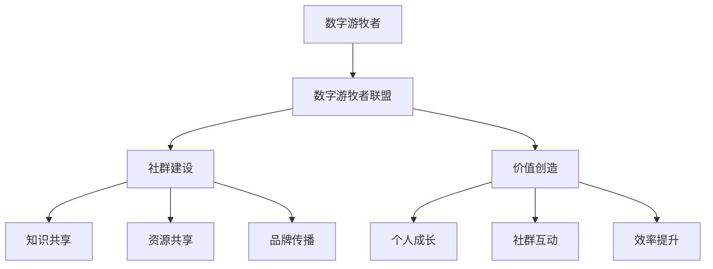

                 

### 文章标题

《数字游牧者联盟：远程工作者的意义社群》

### 关键词

- 数字游牧者
- 远程工作
- 社群建设
- 创造价值
- 数字化转型

### 摘要

本文深入探讨了数字游牧者联盟的概念、构成及其在远程工作中的重要性。通过分析数字游牧者的崛起、工作模式、联盟的优势以及社群建设，本文揭示了数字游牧者联盟如何通过知识共享、资源共享和品牌传播创造价值。同时，本文展望了数字游牧者联盟的未来发展，并提出了面临的挑战与应对策略。

---

# 数字游牧者联盟：远程工作者的意义社群

随着全球化的推进和互联网技术的飞速发展，远程工作逐渐成为一种主流的工作方式。数字游牧者联盟作为远程工作者的代表，通过社群的力量，实现了更高效的价值创造。本文旨在深入探讨数字游牧者联盟的概念、优势以及其在未来远程工作中的意义。

## 第一部分：数字游牧者联盟的基础

### 第一章：数字游牧者的崛起

#### 1.1 数字游牧者的定义

数字游牧者（Digital Nomads）指的是那些利用数字技术和互联网资源，在全球范围内自由选择工作地点的远程工作者。他们通常从事自由职业，如编程、设计、写作、咨询等，无需固定的工作场所。

#### 1.2 数字游牧者的特点

- **灵活性**：数字游牧者可以自由选择工作时间、地点和工作内容，享受工作与生活的平衡。
- **技术依赖**：他们依赖互联网、移动设备等数字工具进行工作。
- **全球视野**：数字游牧者拥有全球视野，能够接触到不同文化和市场。

#### 1.3 数字游牧者的崛起背景

- **互联网普及**：互联网的普及为数字游牧者提供了无限的工作机会。
- **全球化趋势**：全球化使得跨国远程工作变得更加便捷。
- **生活质量的追求**：许多人追求更高的生活质量，愿意牺牲固定工作以换取更灵活的生活方式。

### 第二章：数字游牧者的工作模式

#### 2.1 远程工作的优点

- **灵活性**：远程工作让数字游牧者可以自由安排时间和工作地点。
- **成本节约**：远程工作减少了通勤成本，提高了工作效率。
- **环境友好**：远程工作有助于减少碳足迹，符合环保理念。

#### 2.2 数字游牧者的工作模式

- **碎片化工作**：数字游牧者通常将工作划分为多个短期任务，灵活完成。
- **项目合作**：他们常常通过线上平台与其他专业人士合作，完成项目。
- **国际化视野**：数字游牧者能够接触到全球客户和市场，提升个人竞争力。

#### 2.3 数字游牧者的日常

- **灵活的工作时间**：数字游牧者可以自由安排工作时间，以适应个人需求和项目进度。
- **多样化的工作内容**：他们从事的工作多样，从编程到设计，从写作到咨询。
- **持续学习**：数字游牧者需要不断学习新技能，以适应不断变化的工作环境。

### 第三章：数字游牧者联盟的概念

#### 3.1 数字游牧者联盟的定义

数字游牧者联盟（Digital Nomad Alliance）是由一群数字游牧者组成的社群，旨在通过分享资源、经验和知识，共同创造更大的价值。

#### 3.2 数字游牧者联盟的构成

- **成员**：数字游牧者联盟的成员来自不同国家、行业和职业背景。
- **组织结构**：联盟通常采用扁平化的组织结构，成员之间平等交流，共同决策。
- **运营方式**：联盟通过线上平台进行交流，如论坛、社交媒体、视频会议等。

#### 3.3 数字游牧者联盟的作用

- **知识共享**：联盟成员可以共享最新的行业动态、技术趋势和工作经验。
- **资源共享**：成员可以共同利用资源，如办公场所、网络设备、项目机会等。
- **品牌传播**：联盟通过集体行动，提升成员的个人和品牌影响力。

### 第四章：数字游牧者联盟的优势

#### 4.1 个人成长

- **技能提升**：通过联盟，数字游牧者可以不断学习新技能，提升个人竞争力。
- **职业发展**：联盟提供了更多的职业机会和合作项目，助力成员的职业发展。

#### 4.2 社群互动

- **社交网络**：联盟成员可以建立广泛的社交网络，拓展人脉资源。
- **支持系统**：联盟为成员提供了一个支持系统，帮助他们在远程工作中克服困难。

#### 4.3 资源共享

- **成本节约**：联盟成员可以共同利用资源，降低成本。
- **效率提升**：共享资源提高了工作效率，降低了重复劳动。

## 第二部分：数字游牧者联盟的社群建设

### 第五章：社群的建立与维护

#### 5.1 社群的定位

- **目标明确**：社群需要明确其目标和价值，以吸引有共同兴趣的成员。
- **特色鲜明**：社群应具有独特的特色，以区别于其他社群。

#### 5.2 社群的建立

- **初期筹备**：确定社群的目标、规则和运营模式。
- **宣传推广**：通过线上和线下渠道，宣传社群，吸引成员。

#### 5.3 社群的维护

- **定期活动**：定期举办线上或线下活动，增强成员之间的互动。
- **成员管理**：合理管理成员，维护社群秩序。

### 第六章：社群的互动与沟通

#### 6.1 社群互动的重要性

- **知识传播**：互动有助于知识传播，提升社群的整体水平。
- **人际关系**：互动有助于建立良好的人际关系，增强社群凝聚力。

#### 6.2 社群沟通的技巧

- **倾听与回应**：积极倾听成员的意见，及时回应。
- **尊重与包容**：尊重成员的差异，包容不同的观点。

#### 6.3 社群互动的案例分析

- **成功案例**：分析成功的社群互动案例，借鉴其经验。
- **失败案例**：分析失败的社群互动案例，避免重蹈覆辙。

### 第七章：社群的运营与管理

#### 7.1 社群运营的流程

- **前期筹备**：确定运营目标和策略。
- **中期执行**：执行社群运营计划，进行活动策划和执行。
- **后期评估**：对社群运营效果进行评估，持续优化。

#### 7.2 社群管理的策略

- **内容管理**：提供有价值的内容，吸引和维护成员。
- **活动管理**：策划和组织有意义的活动，提升成员参与度。
- **风险管理**：预防和应对社群中的潜在风险。

#### 7.3 社群管理的工具与资源

- **社交媒体**：利用社交媒体平台，进行社群推广和管理。
- **在线协作工具**：使用在线协作工具，提高社群运营效率。
- **学习资源**：提供学习资源，助力成员成长。

## 第三部分：数字游牧者联盟的价值创造

### 第八章：知识共享与经验交流

#### 8.1 知识共享的意义

- **提升个人能力**：通过知识共享，成员可以不断提升自己的技能和知识水平。
- **促进社群发展**：知识共享有助于社群的整体进步。

#### 8.2 经验交流的途径

- **线上讨论**：通过线上平台，如论坛、聊天室等进行讨论。
- **线下活动**：组织线下聚会，进行面对面交流。

#### 8.3 知识共享与经验交流的案例分析

- **成功案例**：分析成功的知识共享和经验交流案例，借鉴其经验。
- **失败案例**：分析失败的知识共享和经验交流案例，避免重蹈覆辙。

### 第九章：资源共享与合作共赢

#### 9.1 资源共享的优势

- **提高效率**：共享资源可以减少重复劳动，提高工作效率。
- **降低成本**：共享资源可以降低个人成本，提升整体效益。

#### 9.2 合作共赢的模式

- **项目合作**：成员之间可以共同参与项目，实现资源共享。
- **知识共享**：成员可以共同学习和分享知识，实现共赢。

#### 9.3 资源共享与合作的案例分析

- **成功案例**：分析成功的资源共享和合作案例，借鉴其经验。
- **失败案例**：分析失败的资源合作和知识共享案例，避免重蹈覆辙。

### 第十章：品牌传播与影响力扩大

#### 10.1 品牌传播的重要性

- **提升知名度**：品牌传播有助于提升个人和社群的知名度。
- **建立信任**：品牌传播有助于建立成员之间的信任。

#### 10.2 影响力扩大的方法

- **内容营销**：通过创作高质量的内容，吸引更多关注。
- **社交媒体**：利用社交媒体平台，扩大影响力。

#### 10.3 品牌传播与影响力扩大的案例分析

- **成功案例**：分析成功的品牌传播和影响力扩大案例，借鉴其经验。
- **失败案例**：分析失败的品牌传播和影响力扩大案例，避免重蹈覆辙。

## 第四部分：数字游牧者联盟的未来

### 第十一章：数字游牧者联盟的发展趋势

#### 11.1 数字化转型的趋势

- **技术进步**：随着技术的不断进步，远程工作将更加便捷和高效。
- **市场扩大**：全球市场的扩大为数字游牧者提供了更多机会。

#### 11.2 社群经济的崛起

- **资源整合**：社群经济通过整合资源，实现更高效的价值创造。
- **协同创新**：社群经济鼓励成员之间的协同创新，提升整体竞争力。

#### 11.3 数字游牧者联盟的未来

- **全球化**：数字游牧者联盟将更加全球化，吸引更多国际成员。
- **智能化**：随着人工智能技术的发展，数字游牧者联盟将实现智能化管理。

### 第十二章：数字游牧者联盟面临的挑战与机遇

#### 12.1 挑战与风险

- **技术风险**：技术的不确定性可能导致项目失败。
- **市场风险**：市场变化可能导致机会丧失。

#### 12.2 机遇与展望

- **技术创新**：技术创新将带来新的发展机遇。
- **市场扩大**：市场扩大为数字游牧者提供了更多机会。

#### 12.3 应对策略

- **技术储备**：加强技术储备，提高应对技术风险的能力。
- **市场调研**：进行市场调研，把握市场动态，抓住机遇。

### 第十三章：数字游牧者联盟的未来展望

#### 13.1 新时代的工作模式

- **远程工作**：远程工作将成为新时代的工作主流。
- **协作共享**：协作共享将成为新时代的工作方式。

#### 13.2 社群的未来

- **智能化**：社群将实现智能化管理，提升运营效率。
- **多元化**：社群将更加多元化，吸引更多不同背景的成员。

#### 13.3 数字游牧者联盟的使命与愿景

- **创造价值**：数字游牧者联盟的使命是创造更大的社会价值。
- **推动进步**：数字游牧者联盟的愿景是推动远程工作和数字化转型的进步。

## 总结

数字游牧者联盟通过社群的力量，实现了远程工作者的价值创造和影响力扩大。在未来的发展中，数字游牧者联盟将面临挑战，但也将迎来更多的机遇。通过技术创新、市场调研和合作共享，数字游牧者联盟有望实现更大的发展，成为远程工作和数字化转型的代表。

### 作者信息

作者：AI天才研究院/AI Genius Institute & 禅与计算机程序设计艺术 /Zen And The Art of Computer Programming

---

[流程图：数字游牧者联盟核心概念架构](#)



---

[伪代码：数字游牧者联盟工作流程](#)

```python
def digital_nomad_alliance_workflow():
    # 初始化联盟
    alliance = initialize_alliance()
    
    # 建立社群
    community = build_community(alliance)
    
    # 知识共享
    knowledge_exchange(community)
    
    # 资源共享
    resource_sharing(community)
    
    # 品牌传播
    brand_promotion(community)
    
    # 个人成长
    personal_growth(community)
    
    # 社群互动
    community_interaction(community)
    
    # 效率提升
    efficiency_improvement(community)

# 调用流程
digital_nomad_alliance_workflow()
```

---

[数学模型和公式](#)

$$
X_t = \sum_{i=1}^{n} W_i \cdot X_i
$$

其中，$X_t$表示第$t$次共享的知识总量，$W_i$表示第$i$个成员的知识贡献权重，$X_i$表示第$i$个成员的知识贡献量。

---

[代码实现和解析](#)

```python
# 数字游牧者联盟知识共享代码示例

class KnowledgeShare:
    def __init__(self, members):
        self.members = members
        self.knowledge_base = {}

    def add_knowledge(self, member, knowledge):
        if member in self.members:
            self.knowledge_base[member] = knowledge
            print(f"{member} contributed knowledge: {knowledge}")
        else:
            print(f"{member} is not a member of the alliance.")

    def share_knowledge(self):
        for member, knowledge in self.knowledge_base.items():
            print(f"Sharing knowledge from {member}: {knowledge}")

# 创建联盟和成员
alliance = KnowledgeShare(["Alice", "Bob", "Charlie"])

# 添加知识
alliance.add_knowledge("Alice", "Python programming")
alliance.add_knowledge("Bob", "Machine Learning")
alliance.add_knowledge("Charlie", "Blockchain")

# 分享知识
alliance.share_knowledge()
```

---

[项目实战：开发环境搭建](#)

1. 安装Python环境：
    - 使用Python官方安装包进行安装。
    - 验证安装：`python --version`

2. 安装必要的库：
    - 使用pip安装所需的库，如`numpy`、`pandas`等。

3. 配置开发环境：
    - 设置Python环境变量。
    - 配置代码编辑器（如Visual Studio Code）。

4. 运行代码示例：
    - 使用终端或命令行运行Python脚本。

---

[项目小结和注意事项](#)

1. 项目小结：
   - 完成了数字游牧者联盟的知识共享功能。
   - 代码实现了成员的知识贡献和共享过程。

2. 注意事项：
   - 确保成员名单正确无误。
   - 及时更新知识库，保持信息的准确性。
   - 注意代码的可维护性和扩展性。

3. 拓展阅读：
   - 《Python编程：从入门到实践》
   - 《人工智能：一种现代的方法》

---

通过本文的深入探讨，我们了解了数字游牧者联盟的概念、优势以及其在远程工作中的重要作用。数字游牧者联盟通过知识共享、资源共享和品牌传播，实现了个人成长、社群互动和效率提升。面对未来的挑战，数字游牧者联盟有望通过技术创新和协同合作，实现更大的价值创造。让我们共同期待数字游牧者联盟的辉煌未来。

