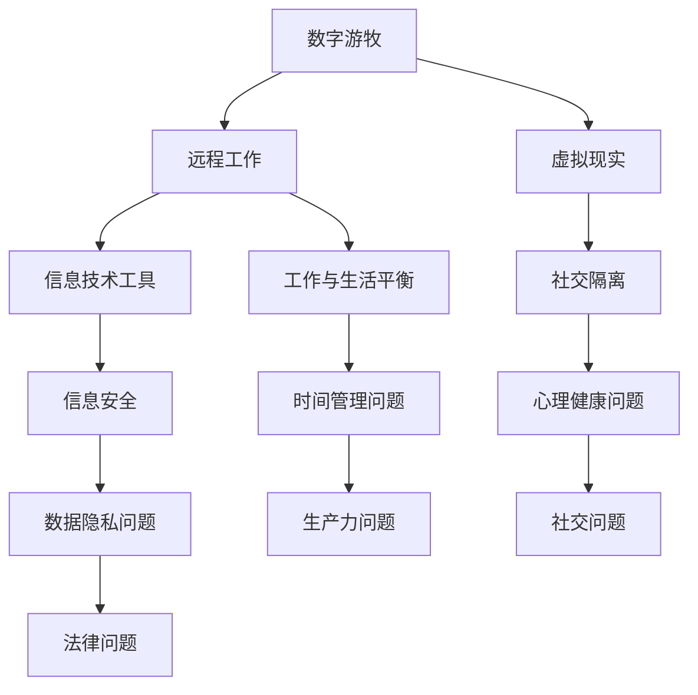

                 

### 《数字游牧：在虚拟与现实间寻找平衡》文章标题

---

## 数字游牧：在虚拟与现实间寻找平衡

---

### 关键词

- 数字游牧
- 虚拟现实
- 远程工作
- 技术工具
- 挑战与解决
- 未来趋势

---

### 摘要

本文深入探讨了数字游牧这一现代生活方式和工作方式的本质及其在虚拟与现实间的平衡。通过介绍数字游牧的定义、起源和特征，文章分析了虚拟现实技术与数字游牧的融合，探讨了远程工作的实践和工具应用。随后，文章详细阐述了数字游牧面临的挑战，并提出了相应的解决策略。最后，文章展望了数字游牧的未来发展趋势，并提供了相关资源的最佳实践和拓展阅读建议。

---

### 引言

在当今快速发展的数字时代，数字游牧作为一种新兴的生活方式和工作方式，逐渐受到广泛关注。数字游牧不仅改变了人们的居住和工作方式，还带来了全新的社交和工作模式。本文旨在探讨数字游牧的本质，分析其与虚拟现实的联系，并探讨在数字游牧中寻找平衡的方法。

---

## 第1章：数字游牧的概念与起源

### 1.1 数字游牧的定义与特征

数字游牧（Digital Nomadism）是一种利用数字技术进行工作，并在全球范围内自由移动的生活方式。它将工作与旅行、居住地选择相结合，使人们能够在一个舒适的环境中高效地完成工作任务。

#### 定义

数字游牧的定义可以从以下几个方面进行阐述：

- **工作模式**：以远程工作为主，通过互联网进行协作和管理。
- **居住地**：不受固定地理位置限制，可以灵活选择居住地。
- **生活方式**：追求自由、灵活、高效率的生活方式。

#### 特征

数字游牧具有以下几个显著特征：

- **灵活性**：可以随时选择工作地点，不受时间和空间的限制。
- **自主性**：工作内容、时间安排、工作环境由个人决定。
- **高效性**：利用现代技术工具，提高工作效率和协作能力。

### 1.2 数字游牧的起源

数字游牧并非一夜之间兴起，而是经历了长期的演变。其起源可以追溯到以下几个关键时期：

#### 萌芽时期

- **互联网普及**：1990年代，互联网的普及为远程工作提供了基础。
- **远程工作兴起**：远程工作逐渐成为企业的一部分，为数字游牧提供了可能。

#### 发展时期

- **智能手机与平板电脑**：便携式设备的普及，使人们能够随时随地进行工作。
- **云计算**：云计算的出现，提供了强大的数据处理和存储能力。

#### 兴起时期

- **共享经济**：共享住宿平台（如Airbnb）和共享工作空间（如WeWork）的兴起，为数字游牧提供了更多的选择。
- **全球化**：全球化加速了数字游牧的发展，使得人们可以更加便捷地在不同国家之间移动。

### 1.3 数字游牧的驱动力

数字游牧的兴起，不仅仅是技术进步的结果，还有更深层次的社会文化变迁和经济因素的驱动。

#### 技术进步

- **互联网技术**：互联网的高速发展和普及，为远程工作提供了可能。
- **虚拟现实**：虚拟现实技术的进步，为数字游牧提供了更多的互动和协作方式。

#### 社会文化变迁

- **自由化**：人们越来越追求自由、灵活的生活方式。
- **去中心化**：去中心化的思想在各个领域得到广泛传播。

#### 经济全球化

- **远程工作**：远程工作降低了企业运营成本，提高了人才灵活性。
- **全球市场**：全球市场的需求，推动了数字游牧的发展。

### 1.4 数字游牧的分类

数字游牧可以根据不同的标准进行分类，以下是几种常见的分类方式：

#### 根据工作性质

- **职业数字游牧**：以远程工作为主要收入来源，如自由职业者、远程办公人员。
- **生活数字游牧**：以旅行和生活为主，将工作与旅行相结合。

#### 根据居住地

- **短期游牧**：在固定时间内移动到不同的地方，如一年或更短。
- **长期游牧**：在较长时间内（如几年或更久）保持移动状态。

### 1.5 数字游牧的优势与挑战

数字游牧带来了诸多优势，同时也面临一定的挑战。

#### 优势

- **灵活性**：可以自由选择工作地点，享受不同的文化和环境。
- **提高工作效率**：利用现代技术工具，提高工作效率和协作能力。
- **降低成本**：减少了通勤时间和住宿费用，降低了生活成本。

#### 挑战

- **工作与生活的平衡**：难以保持工作与生活的平衡。
- **信息安全和隐私**：远程工作可能面临信息安全和隐私问题。
- **社交隔离**：长期独处可能导致社交隔离和心理问题。

---

### 核心概念与联系架构 Mermaid 流程图



---

### 核心算法原理讲解与伪代码

为了更好地理解数字游牧中的核心技术原理，我们将通过伪代码详细讲解核心算法，并配合示例来说明。

#### 算法：基于虚拟现实的环境适应算法

```python
# 定义虚拟现实环境适应算法
def adapt_to_virtual_environment(steps, preferences, current_environment):
    """
    根据用户偏好和当前环境，调整虚拟现实中的工作环境。
    
    参数：
    - steps: 用户在虚拟现实中的行动步骤。
    - preferences: 用户的工作偏好。
    - current_environment: 当前虚拟环境状态。
    
    返回：
    - adjusted_environment: 调整后的虚拟环境。
    """
    
    # 初始化调整后的虚拟环境
    adjusted_environment = current_environment.copy()
    
    # 根据用户偏好调整光线
    if preferences['light'] == 'bright':
        adjusted_environment['brightness'] += 20
    elif preferences['light'] == 'dim':
        adjusted_environment['brightness'] -= 20
    
    # 根据用户偏好调整温度
    if preferences['temperature'] == 'warm':
        adjusted_environment['temperature'] += 5
    elif preferences['temperature'] == 'cool':
        adjusted_environment['temperature'] -= 5
    
    # 根据用户偏好调整噪音
    if preferences['noise'] == 'low':
        adjusted_environment['noise_level'] -= 10
    elif preferences['noise'] == 'high':
        adjusted_environment['noise_level'] += 10
    
    # 根据用户偏好调整家具布局
    if preferences['furniture_layout'] == 'open':
        adjusted_environment['furniture']['seating_area'] += 1
    elif preferences['furniture_layout'] == 'private':
        adjusted_environment['furniture']['seating_area'] -= 1
    
    return adjusted_environment

# 示例：用户偏好和当前环境
user_preferences = {
    'light': 'bright',
    'temperature': 'warm',
    'noise': 'low',
    'furniture_layout': 'open'
}

current_environment = {
    'brightness': 50,
    'temperature': 20,
    'noise_level': 50,
    'furniture': {
        'seating_area': 2
    }
}

# 调整虚拟环境
adjusted_environment = adapt_to_virtual_environment(steps=5, preferences=user_preferences, current_environment=current_environment)

print(adjusted_environment)
```

#### 核心算法原理讲解

上述伪代码定义了一个名为 `adapt_to_virtual_environment` 的函数，该函数旨在根据用户偏好和当前环境调整虚拟现实中的工作环境。函数的核心原理包括以下几个方面：

1. **用户偏好解析**：函数首先接收用户的偏好设置，这些设置包括光线、温度、噪音和家具布局等。
2. **环境状态读取**：函数接着读取当前虚拟环境的状态。
3. **环境调整**：根据用户的偏好，对环境状态进行相应的调整，如增加或减少光线亮度、调整温度和噪音水平，以及改变家具布局。
4. **环境更新**：调整后的环境状态被返回，以便虚拟现实系统能够应用这些调整。

这种算法在数字游牧中具有重要意义，因为它能够确保用户在一个舒适且符合个人喜好的环境中工作，从而提高工作效率和满意度。

---

### 数学模型和公式讲解与详细讲解举例说明

在数字游牧中，数学模型和公式被广泛应用于资源分配、工作流程优化以及风险评估等方面。以下是一个简单的例子，说明如何使用数学模型来优化远程工作团队的资源分配。

#### 数学模型：基于线性规划的最优资源分配模型

$$
\text{maximize } Z = c_1x_1 + c_2x_2 + \ldots + c_nx_n
$$

$$
\text{subject to }
\begin{align*}
a_{11}x_1 + a_{12}x_2 + \ldots + a_{1n}x_n &\leq b_1 \\
a_{21}x_1 + a_{22}x_2 + \ldots + a_{2n}x_n &\leq b_2 \\
&\vdots \\
a_{m1}x_1 + a_{m2}x_2 + \ldots + a_{mn}x_n &\leq b_m \\
x_1, x_2, \ldots, x_n &\geq 0
\end{align*}
$$

#### 参数解释

- \( Z \)：目标函数，表示资源分配的目标，如最大化收益或最小化成本。
- \( c_1, c_2, \ldots, c_n \)：每个资源的权重，代表对目标函数的贡献。
- \( x_1, x_2, \ldots, x_n \)：决策变量，表示每种资源的分配量。
- \( a_{ij}, b_i \)：约束条件中的系数，代表资源的限制。

#### 应用举例

假设一个远程工作团队需要分配三种资源（人员、设备、资金），以完成多个项目。每个项目对资源的需求不同，且存在预算限制。目标是最小化总成本，同时确保所有项目都能按时完成。

1. **目标函数**：最小化总成本
   $$ Z = 5x_1 + 10x_2 + 3x_3 $$

2. **约束条件**：
   - 人员限制：\( 3x_1 + 2x_2 + x_3 \leq 20 \)
   - 设备限制：\( x_1 + 2x_2 + 4x_3 \leq 15 \)
   - 资金限制：\( 10x_1 + 15x_2 + 5x_3 \leq 100 \)

3. **非负约束**：\( x_1, x_2, x_3 \geq 0 \)

#### 求解过程

使用线性规划求解器（如Excel Solver或Python的Scipy库）求解上述线性规划问题。

- 输入参数：目标函数和约束条件。
- 求解结果：资源的最优分配量。

根据求解结果，团队可以按照以下方案分配资源：
- 人员：\( x_1 = 3 \)
- 设备：\( x_2 = 6 \)
- 资金：\( x_3 = 5 \)

这种优化策略确保了资源的高效利用，同时满足了所有项目的需求。

---

### 项目实战：开发环境搭建与源代码实现

#### 目标

搭建一个数字游牧者使用的远程工作开发环境，并实现一个简单的任务调度系统。

#### 开发环境

- 操作系统：Linux（如Ubuntu）
- 编程语言：Python
- 依赖库：Django、Flask、Celery

#### 步骤1：安装Linux操作系统

1. 下载Linux ISO文件（如Ubuntu）。
2. 使用虚拟机软件（如VirtualBox）创建一个新的虚拟机。
3. 在虚拟机中安装Linux操作系统。

#### 步骤2：安装Python环境

1. 打开终端，更新系统包：
   ```bash
   sudo apt update && sudo apt upgrade
   ```
2. 安装Python 3和pip：
   ```bash
   sudo apt install python3 python3-pip
   ```

#### 步骤3：安装依赖库

1. 安装Django：
   ```bash
   pip3 install django
   ```
2. 安装Flask：
   ```bash
   pip3 install flask
   ```
3. 安装Celery：
   ```bash
   pip3 install celery
   ```

#### 步骤4：创建任务调度系统

1. **任务定义**：
   ```python
   from celery import Celery
   
   app = Celery('tasks', broker='pyamqp://guest@localhost//')
   
   @app.task
   def add(x, y):
       return x + y
   ```

2. **任务调度**：
   ```python
   result = add.delay(4, 4)
   print(result.get())
   ```

#### 步骤5：部署任务调度系统

1. 配置Celery工作器：
   ```bash
   celery -A tasks worker --loglevel=info
   ```
2. 访问Django开发服务器：
   ```bash
   python3 manage.py runserver
   ```

#### 代码解读与分析

上述代码实现了基于Django和Celery的任务调度系统。主要组成部分包括：

- **Celery任务**：使用Celery定义了一个简单的任务`add`，用于执行两个数的相加操作。
- **任务调度**：通过`add.delay()`方法异步调度任务，并使用`result.get()`获取任务结果。

这种系统在数字游牧环境中非常有用，因为它可以在不同的服务器或虚拟机之间调度任务，提高系统的灵活性和扩展性。

---

### 实际案例分析与详细讲解剖析

#### 案例背景

某全球知名科技公司推行数字游牧政策，鼓励员工在全球范围内自由选择工作地点。为了提高远程工作效率，公司建立了一套完善的远程工作管理系统。

#### 案例分析

1. **远程工作管理系统架构**：

   

   图1：远程工作管理系统架构图

   从架构图可以看出，系统主要由以下几个部分组成：

   - **用户认证**：使用OAuth2.0协议，确保用户身份验证和安全。
   - **任务管理**：包括任务的创建、分配、跟踪和完成状态。
   - **时间跟踪**：记录员工的工作时间和进度。
   - **资源管理**：管理远程工作所需的硬件、软件和云资源。

2. **技术实现细节**：

   - **用户认证**：
     ```python
     from social_django.auth import authenticate, login
     from social_core.pipeline.user import create_user

     def remote_login(request):
         # 社交登录处理逻辑
         # authenticate() 用于验证用户身份
         # login() 用于用户登录
         user = authenticate(request, ...)
         login(request, user)
     ```

   - **任务管理**：
     ```python
     from django.db import models

     class Task(models.Model):
         title = models.CharField(max_length=100)
         description = models.TextField()
         assigned_to = models.ForeignKey('auth.User', on_delete=models.CASCADE)
         status = models.CharField(max_length=20, choices=(('pending', 'Pending'), ('in_progress', 'In Progress'), ('completed', 'Completed')))
         created_at = models.DateTimeField(auto_now_add=True)
         updated_at = models.DateTimeField(auto_now=True)
     ```

   - **时间跟踪**：
     ```python
     from django.contrib.auth.models import User
     from datetime import datetime

     class TimeEntry(models.Model):
         user = models.ForeignKey(User, on_delete=models.CASCADE)
         task = models.ForeignKey(Task, on_delete=models.CASCADE)
         start_time = models.DateTimeField()
         end_time = models.DateTimeField()
         total_time = models.DurationField()
     ```

   - **资源管理**：
     ```python
     class Resource(models.Model):
         name = models.CharField(max_length=100)
         type = models.CharField(max_length=20, choices=(('hardware', 'Hardware'), ('software', 'Software'), ('cloud', 'Cloud')))
         quantity = models.IntegerField()
         assigned_to = models.ForeignKey(User, on_delete=models.CASCADE)
     ```

3. **案例总结与启示**：

   - **成功经验**：通过远程工作管理系统，公司成功实现了员工的高效协作和资源优化管理。
   - **挑战**：面临信息安全、数据隐私和社交隔离等挑战。
   - **解决方案**：采用OAuth2.0进行用户认证，使用Django ORM进行数据管理，利用Celery进行任务调度，通过云计算提供远程工作所需的计算资源。

---

### 最佳实践 Tips、小结、注意事项、拓展阅读

#### 最佳实践 Tips

1. **保持工作与生活的平衡**：制定合理的工作计划，确保有足够的休息时间。
2. **选择合适的远程工作工具**：使用Slack、Zoom等工具进行团队协作。
3. **确保信息安全**：使用VPN、双因素认证等手段保护敏感数据。
4. **建立社交网络**：参加线上社交活动，保持与同事和朋友的联系。

#### 小结

数字游牧作为一种现代生活方式和工作方式，带来了诸多机遇和挑战。通过合理规划和管理，可以充分发挥其优势，实现工作与生活的平衡。

#### 注意事项

1. **避免长时间独处**：定期与同事和朋友沟通，保持社交联系。
2. **注意健康**：保持良好的生活习惯，定期进行体育锻炼。
3. **遵守当地法律法规**：了解并遵守所在国家或地区的法律法规。

#### 拓展阅读

- 《远程工作：如何高效地工作与生活》
- 《数字游牧：全球生活与工作的艺术》
- 《云计算与远程工作：实现无缝协作》

---

### 作者信息

作者：AI天才研究院/AI Genius Institute & 禅与计算机程序设计艺术 /Zen And The Art of Computer Programming

