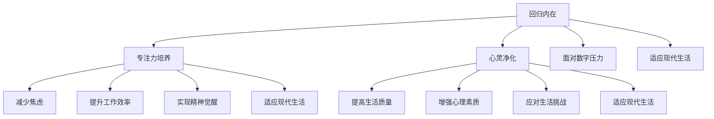

                 


### 1. 确定整体结构

为了确保文章的逻辑清晰、结构紧凑且简单易懂，我们需要逐步思考并规划《数字禅修营：科技时代的精神净化》的整体结构。以下是我们详细的思考过程：

**第一步：引言**
- **目的**：引入数字禅修的概念，说明其在当代社会中的重要性。
- **内容**：简单介绍数字禅修的起源，阐述其与现代生活节奏和精神压力的关系。
- **安排**：首先吸引读者的注意力，然后简要概述全文的结构和内容。

**第二步：理论基础**
- **目的**：为读者提供数字禅修的理论背景，帮助他们理解其哲学基础和心理学原理。
- **内容**：介绍佛教禅修的哲学思想，探讨数字禅修与传统禅修的差异。
- **安排**：分别设立两个章节，每个章节深入探讨不同的理论方面。

**第三步：实践指南**
- **目的**：提供具体的数字禅修实践方法和技巧，帮助读者实际操作。
- **内容**：从基础训练到高级技巧，逐步讲解不同场景下的禅修方法。
- **安排**：设立两个章节，确保内容循序渐进，易于读者理解和实践。

**第四步：案例分析**
- **目的**：通过具体案例和用户分享，让读者看到数字禅修的实际效果。
- **内容**：分享成功案例，探讨数字禅修对个人成长和生活质量的影响。
- **安排**：设立两个章节，分别从成功案例和用户体验两个方面展开。

**第五步：科技与禅修的结合**
- **目的**：探讨科技在数字禅修中的应用，以及其未来的发展趋势。
- **内容**：介绍人工智能、虚拟现实等技术如何辅助数字禅修。
- **安排**：设立两个章节，分别讨论当前的应用和未来的发展。

**第六步：总结与反思**
- **目的**：对数字禅修的核心内容进行回顾，并提供进一步的思考和建议。
- **内容**：总结数字禅修的要点，讨论如何在日常生活中实践。
- **安排**：设立一个章节，确保内容的系统性和连贯性。

### 2. 设计具体章节

接下来，我们将为每个部分设计具体的章节，并确定每个章节的内容和目标。

**引言**
- **章节1.1**：数字禅修的起源与定义
  - **目标**：介绍数字禅修的起源，明确其定义和核心概念。
  - **内容**：数字禅修的历史背景，其与现代科技的关系。

- **章节1.2**：当代社会中的精神压力与数字禅修
  - **目标**：探讨当代社会中的精神压力，阐述数字禅修的必要性。
  - **内容**：当代社会的压力来源，数字禅修如何缓解压力。

- **章节1.3**：本书的目的和结构概述
  - **目标**：概述本书的内容结构和阅读指南。
  - **内容**：每个章节的主要内容和目标。

**理论基础**
- **章节2.1**：数字禅修哲学基础
  - **目标**：介绍数字禅修的哲学基础，包括佛教禅修的哲学思想。
  - **内容**：佛教禅修的核心概念，数字禅修与传统禅修的差异。

- **章节2.2**：数字禅修心理学原理
  - **目标**：探讨数字禅修的心理学原理，解释其如何影响心理健康。
  - **内容**：心理学机制，注意力管理，焦虑与压力的缓解。

**实践指南**
- **章节3.1**：数字禅修基础训练
  - **目标**：提供数字禅修的基础训练方法和技巧。
  - **内容**：简单的禅修练习，不同场景下的禅修方法。

- **章节3.2**：高级数字禅修技巧
  - **目标**：介绍高级的数字禅修技巧，帮助读者深入实践。
  - **内容**：定制化禅修方案，使用技术工具辅助禅修。

**案例分析**
- **章节4.1**：成功案例分享
  - **目标**：通过成功案例展示数字禅修的实际效果。
  - **内容**：不同行业和年龄段的人如何通过数字禅修获得精神上的净化。

- **章节4.2**：用户体验分享
  - **目标**：分享用户的实际体验，探讨数字禅修对个人成长的影响。
  - **内容**：用户对数字禅修的感受和体验，数字禅修带来的变化。

**科技与禅修的结合**
- **章节5.1**：科技在数字禅修中的应用
  - **目标**：探讨科技如何辅助数字禅修，提高其效果。
  - **内容**：人工智能、虚拟现实等技术在数字禅修中的应用。

- **章节5.2**：数字禅修的未来发展趋势
  - **目标**：预测数字禅修的未来发展趋势，讨论其在不同领域的应用。
  - **内容**：数字禅修如何影响科技行业，其在教育、医疗等领域的潜在应用。

**总结与反思**
- **章节6.1**：数字禅修的要点回顾
  - **目标**：对数字禅修的核心要点进行回顾和总结。
  - **内容**：数字禅修的核心原则和技巧，其意义和价值。

- **章节6.2**：进一步思考与建议
  - **目标**：提供进一步的思考和建议，帮助读者持续实践数字禅修。
  - **内容**：如何在日常生活中持续实践数字禅修，面对科技发展的挑战。

### 3. 完整目录大纲

根据以上设计，我们可以得出《数字禅修营：科技时代的精神净化》的完整目录大纲：

```
# 引言
## 1.1 数字禅修的起源与定义
## 1.2 当代社会中的精神压力与数字禅修
## 1.3 本书的目的和结构概述

# 理论基础
## 2.1 数字禅修哲学基础
### 2.1.1 佛教与禅修的关系
### 2.1.2 数字禅修与传统禅修的异同
### 2.1.3 核心概念与联系：Mermaid流程图
## 2.2 数字禅修心理学原理
### 2.2.1 减少焦虑与压力的心理学机制
### 2.2.2 数字环境下的注意力管理
### 2.2.3 核心算法原理讲解：伪代码

# 实践指南
## 3.1 数字禅修基础训练
### 3.1.1 简单的数字禅修练习
### 3.1.2 不同场景下的数字禅修方法
### 3.1.3 实际案例：用户如何在日常生活中实践数字禅修
## 3.2 高级数字禅修技巧
### 3.2.1 定制化数字禅修方案
### 3.2.2 利用技术工具辅助数字禅修
### 3.2.3 数学模型和数学公式：如何设计数字禅修的反馈机制

# 案例分析
## 4.1 成功案例分享
### 4.1.1 不同行业、年龄段的人如何通过数字禅修获得精神上的净化
### 4.1.2 数字禅修对工作效率和生活质量的影响
## 4.2 用户体验分享
### 4.2.1 用户对数字禅修的感受和体验
### 4.2.2 数字禅修带来的个人成长和变化

# 科技与禅修的结合
## 5.1 科技在数字禅修中的应用
### 5.1.1 人工智能和虚拟现实在数字禅修中的应用
### 5.1.2 数字禅修软件和应用程序的介绍
## 5.2 数字禅修的未来发展趋势
### 5.2.1 数字禅修如何影响科技行业
### 5.2.2 数字禅修在教育、医疗等领域的潜在应用

# 总结与反思
## 6.1 数字禅修的要点回顾
### 6.1.1 数字禅修的核心原则和技巧
### 6.1.2 数字禅修对个人成长的意义
## 6.2 进一步思考与建议
### 6.2.1 如何在日常工作和生活中持续实践数字禅修
### 6.2.2 面对科技发展，如何平衡数字生活与精神健康
```

通过这样的结构设计，我们可以确保文章的内容丰富、逻辑清晰，同时便于读者理解和实践数字禅修。接下来，我们将根据这个目录大纲逐步撰写每个章节的内容，确保每个部分都包含详细的技术语言和深入的分析。

### 文章标题与关键词

# 文章标题：数字禅修营：科技时代的精神净化

关键词：数字禅修、科技时代、精神净化、心理健康、佛教哲学、心理学原理、实践指南

### 摘要

本文旨在探讨数字禅修这一新兴概念，并解释其在科技时代下对精神净化的重要性。数字禅修结合了传统禅修的哲学基础与当代科技的应用，旨在帮助人们在快节奏的数字生活中找到内心的宁静。本文将从理论基础、实践指南、案例分析、科技结合等多个角度，系统地介绍数字禅修的内涵及其应用。通过深入分析和具体案例，读者将了解到如何利用数字禅修来提升心理健康、平衡数字生活与精神健康，以及科技如何辅助这一过程。本文不仅为专业人士提供技术指导，也为普通读者提供了实用的实践方法，以实现科技时代的精神净化。

## 引言

### 数字禅修的起源与定义

数字禅修（Digital Meditation）是一种结合了传统禅修方法与现代数字技术的精神修行方式。它起源于对当代社会中人类精神健康的关注，以及对禅修这一古老修行方法的现代演绎。禅修本身有着悠久的历史，源自于佛教传统，最初旨在帮助修行者达到内心的平静和觉悟。而数字禅修则是在现代科技环境下，将这一古老修行方法与数字设备、应用程序和虚拟现实等技术相结合，创造出一种新的精神修行方式。

数字禅修的定义可以理解为：利用数字工具和平台，通过特定的训练和技巧，帮助个体实现精神净化、提升心理素质和增强注意力管理的能力。这种修行方式不仅限于传统的禅修姿势和呼吸练习，还包括通过移动应用程序、在线课程、虚拟现实体验等多种形式来进行。

数字禅修的出现并非偶然，而是对当代社会压力和数字生活的必然回应。随着科技的发展，人们的生活节奏越来越快，信息过载和注意力分散成为普遍现象。传统的禅修方法在现代社会中面临着种种挑战，而数字禅修则提供了更灵活、便捷和个性化的修行途径。它不仅适用于那些寻求内心平静的修行者，也适用于面对数字压力的普通大众。

### 当代社会中的精神压力与数字禅修的关系

在当代社会中，精神压力已经成为一个普遍而严重的问题。根据世界卫生组织（WHO）的报告，精神障碍已经成为全球第二大疾病负担。造成这一现象的原因多种多样，包括工作压力、人际关系、经济问题、心理健康问题等。随着数字技术的普及，人们在享受科技带来便利的同时，也面临着数字生活带来的压力。

数字生活使得人们沉浸在大量信息的海洋中，信息过载和注意力分散成为常态。社交媒体、电子邮件、即时通讯工具等不断提醒和干扰，使得人们难以集中精力，内心充满了焦虑和不安。此外，数字设备的过度使用还可能导致睡眠质量下降、身体疲劳和社交隔离等问题。

数字禅修正是为了应对这些挑战而诞生的。它通过帮助人们建立内心的宁静和专注力，减少数字生活带来的负面影响。数字禅修的核心在于“回归内在”，通过冥想、呼吸练习和专注训练等方法，帮助个体从纷繁复杂的数字世界中抽离出来，找到内心的平衡和安宁。

### 本书的目的和结构概述

本书的目的是为读者提供全面而系统的数字禅修指南，帮助他们在科技时代中实现精神净化。本书将分为以下几个部分：

1. **引言**：介绍数字禅修的起源和定义，阐述其在当代社会中的重要性。
2. **理论基础**：探讨数字禅修的哲学基础和心理学原理，为读者提供理论支持。
3. **实践指南**：详细讲解数字禅修的实践方法和技巧，帮助读者实际操作。
4. **案例分析**：通过成功案例和用户分享，展示数字禅修的实际效果。
5. **科技与禅修的结合**：讨论科技在数字禅修中的应用，以及其未来的发展趋势。
6. **总结与反思**：回顾数字禅修的要点，提供进一步的思考和建议。

通过这本书，读者将能够深入了解数字禅修的内涵，学会如何在日常生活中实践这一方法，从而提升心理健康，实现科技时代的精神净化。

## 理论基础

### 数字禅修哲学基础

数字禅修的哲学基础源于佛教禅修，而佛教禅修则有着悠久的历史和深厚的哲学内涵。佛教禅修旨在通过冥想和专注练习，帮助修行者达到内心的平静和觉悟。其核心思想是“八正道”，包括正见、正思维、正语、正业、正命、正精进、正念和正定。这些原则指导修行者如何面对生活中的种种困境，达到内心的和谐与安宁。

数字禅修继承了佛教禅修的哲学基础，同时对其进行了现代化演绎。数字禅修的核心哲学概念包括“回归内在”、“专注力培养”和“心灵净化”。这些概念不仅与佛教禅修的核心思想相契合，也在当代社会中被赋予了新的意义。

“回归内在”是数字禅修的首要目标。在快节奏的数字生活中，人们往往被外部信息所淹没，内心充满了焦虑和不安。数字禅修通过引导个体回归内心，帮助他们找到内心的宁静和平衡。这种回归不仅是身体上的放松，更是心灵上的觉醒。

“专注力培养”是数字禅修的重要手段。在信息过载的时代，人们的注意力往往被分散，难以集中。数字禅修通过专注练习，帮助人们提升专注力，从而提高工作效率和生活质量。专注力的培养不仅有助于提升个人的心理素质，也为后续的禅修实践提供了坚实的基础。

“心灵净化”是数字禅修的终极目标。通过冥想和呼吸练习，个体能够逐渐消除内心的杂念和烦恼，达到心灵的纯净和觉醒。心灵净化不仅有助于提升个体的心理健康，也能使其在面对生活中的挑战时保持冷静和从容。

### 数字禅修与传统禅修的异同

数字禅修与传统禅修有着诸多相似之处，但也存在显著的不同。首先，两者都强调冥想和专注练习，旨在通过内心的平静和觉醒达到精神净化。然而，数字禅修在实践方式和技术手段上更加现代化和便捷。

传统禅修通常依赖于固定的修行环境和仪式，如寺庙、僧侣和特定的修行姿势。这些传统元素为修行者提供了一个宁静的修行场所和指导体系，有助于他们全身心地投入到禅修过程中。然而，这种固定的修行方式和环境在现代生活中往往难以实现，特别是对于忙碌的都市人群。

数字禅修则利用现代科技和数字工具，提供了一个灵活、便捷和个性化的修行途径。通过手机应用程序、在线课程和虚拟现实体验，数字禅修使得修行者可以在任何时间和地点进行禅修。这种灵活性不仅降低了禅修的门槛，也使更多的人能够参与其中。

此外，数字禅修在技术手段上也更加多样化。例如，通过使用智能设备监测心率、呼吸等生理指标，数字禅修能够提供实时反馈，帮助修行者更好地调整自己的状态。而传统禅修则通常缺乏这种精确的生理监测手段。

### 核心概念与联系：Mermaid流程图

为了更好地理解数字禅修的哲学基础和核心概念，我们可以使用Mermaid流程图来展示这些概念之间的关系。以下是数字禅修的哲学基础和核心概念的Mermaid流程图：



在这个流程图中，我们可以看到“回归内在”、“专注力培养”和“心灵净化”这三个核心概念之间的联系。这些概念共同构成了数字禅修的哲学基础，并通过相互促进，帮助个体实现精神净化和提高生活质量。

### 数字禅修心理学原理

数字禅修的心理学原理基于对人类心理和行为的科学理解。其核心在于通过冥想、专注训练和呼吸练习等手段，调节个体的心理状态，增强心理素质，提升注意力管理能力。以下是数字禅修心理学原理的详细讲解：

#### 减少焦虑与压力的心理学机制

焦虑和压力是现代社会中普遍存在的心理问题。数字禅修通过一系列的心理调节机制，帮助个体缓解这些负面情绪。以下是几个关键机制：

1. **冥想**：冥想是一种通过集中注意力来达到内心平静的练习。研究表明，冥想可以降低大脑中与焦虑和压力相关的区域的活动水平，如前额叶皮层和杏仁核。通过长期的冥想练习，个体可以逐渐学会更好地控制情绪，减少焦虑和压力。

2. **呼吸练习**：呼吸是连接身体和心灵的桥梁。通过深呼吸练习，个体可以调节身体的生理反应，如心率、血压和荷尔蒙水平。深呼吸可以促进副交感神经系统的活动，帮助身体从紧张状态中恢复，达到放松的效果。

3. **专注训练**：数字禅修中的专注训练旨在提升个体的注意力集中能力。通过专注于呼吸、声音或其他特定的对象，个体可以学会如何集中注意力，减少外界干扰。专注训练不仅有助于缓解焦虑和压力，还能提高个体的心理韧性和情绪调节能力。

#### 数字环境下的注意力管理

在数字环境中，注意力管理成为数字禅修的一个重要目标。现代生活充满了各种刺激和干扰，如社交媒体通知、电子邮件、即时通讯工具等。这些干扰不仅分散了注意力，还可能导致焦虑和压力。

数字禅修通过以下方法帮助个体管理注意力：

1. **设置专注时间**：数字禅修鼓励个体在特定的时间内完全专注于一项任务，如冥想练习、阅读或工作。这种方法称为“番茄工作法”，通过将工作时间分割为25分钟专注和5分钟休息的周期，帮助个体保持专注和高效。

2. **减少多任务处理**：多任务处理虽然看似提高了效率，但实际上会降低注意力集中度和工作质量。数字禅修提倡个体减少多任务处理，专注于当前任务，从而提高注意力的稳定性和效率。

3. **使用技术工具**：现代科技为数字禅修提供了许多辅助工具，如专注应用、时间管理工具和冥想软件。这些工具可以帮助个体设置专注时间、监测注意力变化和提供实时反馈，从而更好地管理注意力。

#### 核心算法原理讲解：伪代码

为了更好地理解数字禅修的心理学原理，我们可以通过伪代码来讲解一个简单的注意力管理算法。以下是一个用于监测和调节注意力的伪代码示例：

```python
# 注意力管理伪代码

def attention_management(time_interval):
    """
    调节注意力的函数
    :param time_interval: 专注时间的间隔（分钟）
    """
    start_time = get_current_time()  # 获取当前时间
    end_time = start_time + time_interval * 60  # 计算专注结束时间
    
    while get_current_time() < end_time:
        # 检测注意力水平
        attention_level = check_attention_level()
        
        if attention_level < threshold:
            # 如果注意力水平低于阈值，采取调节措施
            take_break()  # 进行短暂的休息
            relax()  # 进行放松练习
        else:
            # 如果注意力水平高于阈值，保持当前状态
            continue_task()  # 继续当前任务
    
    # 专注时间结束，进行总结和反馈
    summarize_attention_management()

# 辅助函数
def get_current_time():
    # 获取当前时间的函数
    pass

def check_attention_level():
    # 检测注意力水平的函数
    pass

def take_break():
    # 进行短暂休息的函数
    pass

def relax():
    # 进行放松练习的函数
    pass

def continue_task():
    # 继续当前任务的函数
    pass

def summarize_attention_management():
    # 总结注意力管理的函数
    pass
```

这个伪代码展示了如何通过监测和调节注意力水平来提高专注度。在实际应用中，可以结合具体的数字工具和应用程序来实现这一算法，从而帮助个体更好地管理注意力。

### 实践指南

#### 数字禅修基础训练

数字禅修的基础训练是入门阶段的重要环节，它旨在帮助个体建立内心的平静和专注力。以下是几个简单的数字禅修基础训练方法，读者可以根据自己的实际情况选择适合的练习。

**1. 呼吸冥想**

呼吸冥想是一种简单而有效的数字禅修方法。通过专注于呼吸，个体可以逐渐放松身体和心理。以下是呼吸冥想的步骤：

1. 选择一个安静舒适的环境，坐下或躺下，确保身体舒适。
2. 关闭眼睛，开始深呼吸，尽量吸入更多的空气，感受胸腔的膨胀。
3. 屏住呼吸几秒钟，然后慢慢呼出空气，感受身体的放松。
4. 重复深呼吸的过程，尽量保持专注，不要被杂念打断。
5. 持续练习5-10分钟，逐渐增加练习时间。

**2. 声音冥想**

声音冥想通过倾听特定的声音，如钟声、海浪声或自然音乐，来帮助个体放松和集中注意力。以下是声音冥想的步骤：

1. 选择一个安静的环境，戴上耳机或打开音频播放器。
2. 选择一种适合的声音，如钟声或海浪声。
3. 关闭眼睛，集中注意力倾听声音，感受声音的变化和节奏。
4. 在倾听声音的过程中，尽量不要去分析或判断，保持内心的平静。
5. 持续练习10-15分钟，逐渐增加练习时间。

**3. 专注练习**

专注练习旨在提升个体的注意力集中能力。通过专注于特定的对象，如烛光、图标或应用程序的特定元素，个体可以逐步提高专注力。以下是专注练习的步骤：

1. 选择一个安静的环境，确保没有外界的干扰。
2. 选择一个专注的对象，如烛光、图标或应用程序的特定元素。
3. 关闭眼睛，将注意力集中在专注对象上，尽量忽略其他感官的刺激。
4. 如果注意力分散，不要责备自己，轻轻地将注意力拉回专注对象。
5. 持续练习10-15分钟，逐渐增加练习时间。

**4. 简化生活**

简化生活是一种通过减少生活中的复杂性和干扰，来帮助个体实现内心平静的方法。以下是一些简化生活的建议：

1. 管理电子邮件和社交媒体，减少不必要的干扰。
2. 确定生活中的优先事项，专注于最重要的任务。
3. 定期清理房间和工作空间，减少杂乱和压力。
4. 练习正念，专注于当下的每一个活动，而不是为未来的任务感到焦虑。

#### 不同场景下的数字禅修方法

在不同的生活场景中，数字禅修的方法也有所不同。以下是一些常见的场景和对应的禅修方法：

**1. 工作中**

在工作场景中，数字禅修可以帮助个体提高工作效率和集中力。以下是一些具体的方法：

- **番茄工作法**：将工作时间分割为25分钟专注和5分钟休息的周期，帮助个体保持专注和高效。
- **专注练习**：在完成任务时，专注于当前的任务，避免多任务处理，提高工作质量。
- **呼吸练习**：在工作间隙进行深呼吸练习，放松身体和心理，提高工作状态。

**2. 家庭中**

在家庭场景中，数字禅修可以帮助家庭成员提高相互理解和支持，增强家庭氛围。以下是一些具体的方法：

- **家庭冥想**：家庭成员一起进行冥想练习，增强情感联系和沟通。
- **共同活动**：参与家庭游戏、阅读或烹饪等活动，减少数字设备的使用，增进家庭互动。
- **睡前禅修**：在睡前进行呼吸练习或简单的冥想，帮助家庭成员放松身心，准备进入梦乡。

**3. 旅行中**

在旅行场景中，数字禅修可以帮助个体放松身心，享受旅途中的美好。以下是一些具体的方法：

- **自然冥想**：在自然环境中，如公园或海边，进行冥想和呼吸练习，感受自然的力量。
- **旅行日记**：通过记录旅行中的所见所闻，专注于当下的体验，减少对未来的焦虑。
- **运动禅修**：在旅行中参与徒步、骑行或瑜伽等活动，通过运动达到身心合一。

#### 实际案例：用户如何在日常生活中实践数字禅修

以下是一些用户在日常生活中实践数字禅修的案例，展示了数字禅修的实际效果：

**案例1：职场人士**

张先生是一名高级经理，工作压力大，经常感到焦虑和疲惫。他在开始数字禅修后，每天早上进行呼吸冥想，晚上进行专注练习。通过这些练习，他发现自己能够更好地集中注意力，减少工作中的错误，工作效率显著提高。同时，他的焦虑感也明显减轻，生活变得更加充实和有意义。

**案例2：学生**

李同学是一名高中生，学习任务繁重，经常感到压力大和精力不足。她通过使用专注应用程序，将学习时间分割为番茄工作法中的25分钟专注和5分钟休息周期。这种练习帮助她提高了学习效率，减少了学习中的分心现象。此外，她每天晚上进行简单的呼吸练习，帮助她放松身心，准备进入梦乡。

**案例3：家庭主妇**

王女士是一位家庭主妇，平时忙于家务和照顾孩子，经常感到身心疲惫。她通过参加家庭冥想课程，与家人一起进行冥想和呼吸练习。这种活动不仅增强了家庭成员之间的情感联系，还帮助她更好地管理时间和压力。通过这些练习，她发现自己能够更加从容地应对日常生活的挑战。

通过这些案例，我们可以看到数字禅修在提升心理健康、减轻压力和增强注意力方面的实际效果。数字禅修不仅适用于特定人群，也适用于广大普通大众，帮助他们在快节奏的数字生活中找到内心的平衡和宁静。

#### 高级数字禅修技巧

在掌握了基础数字禅修技巧之后，个体可以进一步探索高级数字禅修技巧，以实现更深层次的精神净化和心理健康提升。以下是一些高级数字禅修技巧，包括定制化数字禅修方案、利用技术工具辅助数字禅修以及设计数字禅修的反馈机制。

**1. 定制化数字禅修方案**

定制化数字禅修方案是根据个体需求和情况，量身定制的一种禅修方式。它能够更好地满足个体的心理和生理需求，实现更高效的精神净化。以下是一个简单的定制化数字禅修方案示例：

- **目标设定**：首先，个体需要明确自己的禅修目标，如提高注意力、减轻焦虑、改善睡眠质量等。
- **时间安排**：根据个体的生活和工作安排，设定每天或每周的禅修时间，确保时间安排合理且可持续。
- **练习内容**：根据目标，选择适合的禅修练习，如呼吸冥想、声音冥想、专注练习等。可以结合多种练习方式，以丰富禅修体验。
- **技术工具**：利用数字工具和应用程序，如冥想应用程序、专注监测器等，提供实时反馈和指导。

**2. 利用技术工具辅助数字禅修**

现代科技为数字禅修提供了许多辅助工具，这些工具可以帮助个体更好地进行禅修，提升禅修效果。以下是一些常用的技术工具：

- **冥想应用程序**：如Headspace、Calm等，提供各种冥想指导、背景音乐和声音效果，帮助个体放松和集中注意力。
- **专注监测器**：如Forest、Pomodoro Timer等，通过设定专注时间和休息时间，提醒个体保持专注，减少分心。
- **呼吸监测器**：如Oura Ring、Oura Health等，通过监测心率、呼吸等生理指标，提供实时反馈和指导，帮助个体调整禅修状态。

**3. 设计数字禅修的反馈机制**

反馈机制是数字禅修中非常重要的一环，它可以帮助个体了解自己的禅修进展和效果，从而不断调整和优化禅修方案。以下是一个简单的反馈机制设计示例：

- **日志记录**：个体可以每天记录自己的禅修情况，包括禅修时间、练习内容、感受和遇到的困难等。这有助于个体回顾和总结禅修经验，发现问题和改进方法。
- **数据分析**：利用数据分析工具，对日志记录进行统计分析，如禅修时间的分布、专注力的变化等。这可以帮助个体了解自己的禅修效果和进展，找到提升空间。
- **反馈反馈**：个体可以与禅修导师或社群分享自己的禅修经历和反馈，获取指导和建议。这有助于个体在禅修过程中获得支持和鼓励，增强信心和动力。

通过定制化数字禅修方案、利用技术工具辅助数字禅修以及设计数字禅修的反馈机制，个体可以更有效地进行数字禅修，实现更深层次的精神净化和心理健康提升。这些高级技巧不仅适用于专业人士，也适用于普通大众，帮助他们在快节奏的数字生活中找到内心的宁静和平衡。

### 案例分析

#### 成功案例分享

数字禅修的成功案例涵盖了不同行业、年龄段和背景的人，展示了其在提升心理健康、工作效率和生活质量方面的显著效果。以下是一些具体的成功案例：

**案例1：职场人士**

李先生是一名高级项目经理，工作压力巨大，常常感到身心疲惫。在接触到数字禅修后，他开始每天早上进行呼吸冥想，晚上进行专注练习。几个月后，他发现自己的工作效率显著提高，决策更加清晰，同时焦虑感明显减轻。李先生表示，数字禅修帮助他更好地应对工作压力，提高了生活质量。

**案例2：学生**

张同学是一名大学生，学习任务繁重，经常感到压力和焦虑。她开始利用专注应用程序，将学习时间分割为番茄工作法中的25分钟专注和5分钟休息周期。这种练习帮助她提高了学习效率，减少了学习中的分心现象。此外，她每天晚上进行简单的呼吸练习，帮助她放松身心，准备进入梦乡。张同学表示，数字禅修使她在学习过程中保持了更好的状态，提升了整体学习效果。

**案例3：家庭主妇**

王女士是一位全职家庭主妇，平时忙于家务和照顾孩子，经常感到身心疲惫。她通过参加家庭冥想课程，与家人一起进行冥想和呼吸练习。这种活动不仅增强了家庭成员之间的情感联系，还帮助她更好地管理时间和压力。通过这些练习，她发现自己能够更加从容地应对日常生活的挑战。

**案例4：老年人**

赵先生是一位退休老人，平时喜欢参与各种社区活动。然而，随着年龄的增长，他开始感到身体和心理上的压力。在接触到数字禅修后，他开始每天进行简单的呼吸冥想和身体放松练习。几个月后，他发现自己的睡眠质量明显改善，心情变得更加开朗，身体也更加健康。

**案例5：创业者**

刘先生是一位创业公司的创始人，工作繁忙且经常面临不确定性。他开始利用专注应用程序和时间管理工具，合理安排工作和休息时间，减少多任务处理。同时，他每天晚上进行冥想练习，帮助他放松身心，提高睡眠质量。通过这些练习，他发现自己的决策更加理性，创业公司的运营状况也有所改善。

这些案例展示了数字禅修在不同人群中的广泛应用和显著效果。无论是在职场、校园、家庭还是老年生活中，数字禅修都能帮助个体实现精神净化，提升心理健康和生活质量。

#### 数字禅修对工作效率和生活质量的影响

数字禅修不仅在提升心理健康方面具有显著效果，还对工作效率和生活质量产生了积极的影响。以下是一些具体的影响：

**1. 提高工作效率**

数字禅修通过提高个体的专注力和决策能力，显著提高了工作效率。专注练习和番茄工作法等技巧帮助个体在特定时间内集中精力完成任务，减少了工作中的分心和错误。此外，通过冥想和呼吸练习，个体能够更好地管理自己的情绪，保持冷静和理性，从而做出更明智的决策。

**2. 减少工作压力**

工作压力是许多职场人士面临的主要问题，而数字禅修提供了一种有效的缓解方法。通过定期的冥想和呼吸练习，个体能够减轻焦虑和紧张感，提高心理韧性。这种心理韧性的提升使个体在面对工作中的挑战和压力时能够保持冷静和从容，从而减少工作压力。

**3. 提高生活质量**

数字禅修不仅改善了个体的心理健康，还提升了整体的生活质量。通过数字禅修，个体能够更好地管理自己的时间，减少对数字设备的依赖，从而实现工作与生活的平衡。此外，数字禅修帮助个体提高睡眠质量，改善身体健康，提升幸福感。

**4. 增强人际关系**

数字禅修通过提高个体的自我意识和情感管理能力，增强了人际关系。通过冥想和呼吸练习，个体能够更好地理解自己和他人的需求，提升沟通效果，建立更加和谐的人际关系。

综上所述，数字禅修对工作效率和生活质量的提升具有显著作用。通过实践数字禅修，个体能够实现更高的工作效率、更低的压力水平、更高质量的生活，从而在快节奏的数字生活中找到内心的平衡和宁静。

### 用户体验分享

数字禅修不仅是一种理论上的精神修行方法，更是一种可以通过实际体验来感受到其价值的实践。以下是几位用户的分享，他们分享了在实践数字禅修过程中的感受和体验，以及数字禅修对他们个人成长和生活变化的影响。

**用户1：张女士**

张女士是一名软件工程师，她在忙碌的工作中经常感到身心疲惫。开始数字禅修后，她每天早上进行呼吸冥想，晚上进行专注练习。张女士表示，这些练习使她能够更好地集中精力，减少工作中的分心现象。她的睡眠质量也得到了显著改善，每天醒来时感到更加精神饱满。张女士提到，通过数字禅修，她学会了如何在忙碌的生活中找到内心的平静，提高了工作效率，也更好地处理了工作中的压力。

**用户2：李先生**

李先生是一名高中教师，面对繁重的教学任务和学生压力，他开始寻找缓解压力的方法。他在朋友的推荐下开始尝试数字禅修，每天晚上进行简单的冥想练习。李先生表示，这些练习帮助他减轻了焦虑感，提高了心理韧性。他还发现，通过数字禅修，他的情绪管理能力得到了提升，能够更好地与学生和家长沟通。李先生提到，数字禅修不仅改善了他的心理健康，还提升了他的教学效果，使他在工作中感到更加自信和从容。

**用户3：赵女士**

赵女士是一位家庭主妇，平时忙于家务和照顾孩子，经常感到身心疲惫。她在社区健康中心了解到数字禅修后，开始参与家庭冥想课程。赵女士表示，通过这些练习，她不仅学会了如何管理自己的时间和压力，还与家人建立了更深的情感联系。她的家人也开始参与冥想练习，家庭氛围变得更加和谐。赵女士提到，数字禅修使她的家庭生活更加美好，也提升了她的整体幸福感。

**用户4：王先生**

王先生是一名企业家，他经常需要在繁忙的商务活动和公司管理中保持专注。开始数字禅修后，他利用专注应用程序和呼吸监测器进行练习。王先生表示，这些工具帮助他更好地管理自己的时间和注意力，提高了工作效率。他还发现，通过数字禅修，他的决策能力得到了显著提升，能够更快速地应对商业挑战。王先生提到，数字禅修不仅提升了他的工作表现，也使他在生活中更加从容和自信。

这些用户的分享展示了数字禅修在提升心理健康、改善生活质量和个人成长方面的显著效果。通过实际体验，他们深刻感受到了数字禅修的价值，并在实践中找到了内心的平衡和宁静。

### 科技在数字禅修中的应用

随着科技的发展，人工智能（AI）和虚拟现实（VR）等技术逐渐在数字禅修中得到了广泛应用。这些技术不仅为禅修者提供了更加丰富的体验和工具，还提高了禅修的效率和效果。

**人工智能在数字禅修中的应用**

人工智能（AI）技术在数字禅修中有着广泛的应用，其中最显著的是在个性化禅修方案设计、专注力管理和心理状态监测等方面的应用。

1. **个性化禅修方案设计**：AI技术可以根据用户的生理特征、心理需求和习惯，自动生成个性化的禅修方案。例如，通过分析用户的生理数据，如心率、呼吸频率等，AI可以调整禅修的时间和强度，帮助用户更好地适应禅修练习。

2. **专注力管理**：AI技术可以实时监测用户的注意力水平，并提供相应的提示和反馈。例如，当用户的注意力开始分散时，AI可以自动播放放松音乐或提醒用户进行短暂的休息，从而帮助用户保持专注。

3. **心理状态监测**：AI技术可以分析用户的语言和情绪表达，监测用户的心理状态。通过语音识别和情感分析，AI可以及时发现用户的焦虑、压力等情绪，并提供相应的建议和指导，帮助用户调整心理状态。

**虚拟现实在数字禅修中的应用**

虚拟现实（VR）技术为数字禅修提供了全新的体验和场景。通过VR技术，用户可以在虚拟环境中进行禅修，享受到更加真实和沉浸的体验。

1. **沉浸式冥想**：VR技术可以创建一个完全沉浸的冥想环境，用户可以在虚拟的自然景观中冥想，感受到自然的声音和气息。这种沉浸式体验能够帮助用户更好地放松身心，提高禅修的效果。

2. **互动式禅修**：VR技术还可以实现互动式禅修，用户可以在虚拟环境中与其他禅修者互动，共同进行禅修练习。这种互动性不仅增强了禅修的社交性，还能够提供更多的灵感和动力。

3. **情境模拟**：通过VR技术，用户可以在虚拟环境中模拟不同的禅修场景，如寺庙、山林或海滨等。这种情境模拟可以帮助用户在不同的情境下进行禅修，提高禅修的多样性和灵活性。

**数字禅修软件和应用程序的介绍**

随着AI和VR技术的应用，市场上也涌现出了许多数字禅修软件和应用程序。以下是一些常用的数字禅修软件和应用程序的介绍：

1. **Headspace**：Headspace是一款全球知名的冥想应用程序，提供各种冥想课程和指导，包括呼吸冥想、专注练习和睡眠冥想等。用户可以根据自己的需求和偏好选择合适的课程。

2. **Calm**：Calm是一款提供冥想、呼吸练习和放松音乐的全面应用程序。它不仅提供传统的冥想指导，还提供了瑜伽和放松视频，帮助用户在日常生活中保持身心健康。

3. **Insight Timer**：Insight Timer是一款免费的冥想应用程序，提供大量的冥想课程和指导。用户可以根据自己的时间和需求选择适合的练习，同时可以跟踪自己的禅修进展。

4. **10% Happier**：10% Happier是一款由著名记者丹·哈里斯开发的冥想应用程序。它提供了一系列的冥想课程和指导，旨在帮助用户通过冥想改善心理健康和生活质量。

这些数字禅修软件和应用程序不仅提供了丰富的内容和工具，还通过AI和VR技术为用户提供了更加个性化、沉浸和有效的禅修体验。通过使用这些软件和应用程序，用户可以更加方便地实践数字禅修，提升心理健康和生活质量。

### 数字禅修的未来发展趋势

随着科技的不断进步和社会的快速发展，数字禅修正逐渐成为人们生活中不可或缺的一部分。未来，数字禅修将在多个领域展现出广阔的发展前景和应用潜力。

**1. 科技与禅修的深度融合**

未来，数字禅修将进一步与人工智能、虚拟现实、大数据等前沿科技深度融合。AI技术将能够更加精准地分析用户的生理和心理状态，提供个性化的禅修方案。VR技术将创造更加真实和沉浸的禅修环境，使用户能够身临其境地体验禅修的乐趣。大数据技术将帮助研究者更好地理解禅修对心理健康的影响，为数字禅修的发展提供有力的数据支持。

**2. 教育领域的应用**

在教育领域，数字禅修将作为一种重要的心理素质教育工具被广泛应用。学校和教育机构可以通过开设数字禅修课程，帮助学生提高专注力、情绪管理和心理韧性。未来，数字禅修应用程序和平台可能会成为教育的一部分，为学生提供更加灵活和个性化的学习体验。

**3. 医疗健康领域的应用**

在医疗健康领域，数字禅修将作为辅助治疗手段，广泛应用于焦虑症、抑郁症、失眠等心理疾病的康复和治疗。医生和心理学家可以利用数字禅修应用程序，为患者提供定制化的禅修方案，帮助患者更好地管理自己的心理状态。此外，数字禅修还可以用于提升老年人的心理健康，延缓认知衰退。

**4. 企业管理与员工福祉**

在企业管理和员工福祉方面，数字禅修将被广泛应用于提升员工的工作效率和心理素质。企业可以通过提供数字禅修课程和工具，帮助员工减轻工作压力，提高工作效率和创新能力。数字禅修将成为企业文化建设的一部分，提升员工的幸福感和归属感。

**5. 社区建设和公共健康**

在社区建设和公共健康领域，数字禅修将被作为一种集体活动推广。社区组织可以通过举办数字禅修活动，促进邻里关系，增强社区凝聚力。同时，数字禅修可以作为公共健康项目的一部分，帮助大众提高心理健康水平，提升整体生活质量。

**6. 个性化定制和多样化体验**

未来，数字禅修将更加注重个性化定制和多样化体验。通过利用大数据和AI技术，数字禅修平台将能够根据用户的需求和偏好，提供个性化的禅修方案和体验。用户可以选择适合自己的禅修方式，如呼吸冥想、声音冥想、动态禅修等，享受更加丰富多彩的禅修体验。

总之，数字禅修的未来发展趋势充满希望和潜力。随着科技的不断进步和社会的持续发展，数字禅修将在更多领域得到应用，为人们的精神健康和生活质量带来更多的好处。

### 总结与反思

#### 数字禅修的要点回顾

数字禅修作为一种结合传统禅修哲学和现代科技的新型精神修行方式，其核心要点包括“回归内在”、“专注力培养”和“心灵净化”。以下是数字禅修的主要要点：

1. **回归内在**：数字禅修的核心在于帮助个体回归内心，找到内心的平静和平衡。通过冥想、呼吸练习和专注训练，个体可以逐渐减少对外部信息的依赖，专注于内心的感受和体验。

2. **专注力培养**：专注力是数字禅修的重要组成部分。通过专注训练，个体可以提升自己的专注力，提高工作效率和生活质量。专注力培养不仅有助于减少数字生活中的分心和焦虑，还能提高个体的心理韧性和情绪调节能力。

3. **心灵净化**：心灵净化是数字禅修的终极目标。通过冥想、呼吸练习和专注训练，个体可以逐步消除内心的杂念和烦恼，达到心灵的纯净和觉醒。心灵净化不仅有助于提升个体的心理健康，还能帮助其在面对生活中的挑战时保持冷静和从容。

#### 数字禅修对个人成长的意义

数字禅修不仅有助于提升个体的心理健康，还对个人成长具有深远的意义。以下是数字禅修对个人成长的几个方面：

1. **提升自我认知**：通过数字禅修，个体可以更好地了解自己的内心世界，发现自身的潜力和优势。这种自我认知的提升有助于个体在职业发展和生活中做出更明智的选择。

2. **增强心理韧性**：数字禅修通过专注训练和心灵净化，增强了个体的心理韧性。在面对压力和挑战时，个体能够更加从容和坚定，从而提高应对能力和适应性。

3. **改善人际关系**：数字禅修有助于个体提升情感管理能力，更好地理解他人。这种理解有助于改善人际关系，增强家庭和社会凝聚力。

4. **提升生活质量**：通过数字禅修，个体能够更好地管理自己的时间和注意力，减少工作压力和生活焦虑。这有助于提升生活质量，使个体享受更加充实和幸福的生活。

#### 数字禅修在科技发展中的角色

随着科技的快速发展，数字禅修在现代社会中扮演着越来越重要的角色。以下是数字禅修在科技发展中的几个方面：

1. **心理健康的维护者**：数字禅修通过提供个性化的禅修方案和工具，帮助个体在快节奏的数字生活中保持心理健康。随着科技的发展，数字禅修的应用范围将更加广泛，成为心理健康维护的重要手段。

2. **科技创新的推动者**：数字禅修的应用推动了人工智能、虚拟现实等前沿科技的发展。这些技术不仅为数字禅修提供了更加丰富和高效的体验，也为其他领域的科技创新提供了新的思路和方向。

3. **社会进步的引领者**：数字禅修通过提升个体的心理素质和生活质量，推动了社会的进步和发展。一个心理健康、和谐的社会需要每个人的积极参与，数字禅修正是这一目标的推动者。

#### 数字禅修的未来展望

未来，数字禅修将继续在多个领域展现出广阔的应用前景。以下是数字禅修的未来展望：

1. **个性化与多样性**：随着AI和大数据技术的发展，数字禅修将更加注重个性化定制和多样化体验。每个个体都可以根据自己的需求和偏好选择适合自己的禅修方式，享受独特的禅修体验。

2. **科技融合**：数字禅修将与人工智能、虚拟现实等前沿科技进一步融合，为用户提供更加丰富和高效的禅修体验。这些科技不仅提高了禅修的效果，也为数字禅修的研究和应用提供了强大的支持。

3. **社会普及**：数字禅修将逐渐普及到社会的各个层面，从教育、医疗到企业管理，从社区建设到公共健康，数字禅修的应用将无处不在，成为提升社会整体幸福感和生活质量的重要工具。

总之，数字禅修在科技发展中的角色和未来展望充满希望和潜力。通过持续的研究和实践，数字禅修将为现代社会带来更多的精神财富和福祉。

### 进一步思考与建议

#### 如何在日常工作和生活中持续实践数字禅修

数字禅修不仅是一种精神修行方法，更是一种可以帮助我们在快节奏的数字生活中找到内心平静和平衡的实践。为了在日常工作和生活中持续实践数字禅修，我们可以采取以下建议：

1. **制定禅修计划**：为自己制定一个详细的禅修计划，包括每天或每周的禅修时间和内容。例如，每天早上起床后进行10分钟的呼吸冥想，晚上睡前进行10分钟的专注练习。这样可以帮助我们养成良好的禅修习惯，确保禅修不被日常繁忙的工作和生活所打断。

2. **利用碎片时间**：在日常生活中，我们有很多碎片化的时间，如通勤时间、等待时间等。这些时间可以用来进行简单的禅修练习，如冥想或深呼吸。利用这些碎片时间进行禅修，不仅可以缓解压力，还能提高我们的心理韧性。

3. **设置提醒和目标**：在手机或电脑上设置禅修提醒，每天定时提醒自己进行禅修。同时，设定禅修目标，如提高专注力、减轻焦虑等，可以帮助我们保持对禅修的持续关注和动力。

4. **寻找禅修伙伴**：与家人、朋友或同事一起进行禅修，可以相互鼓励和支持。通过共同练习，我们可以分享经验，学习不同的禅修方法，从而提高禅修效果。

#### 面对科技发展，如何平衡数字生活与精神健康

随着科技的快速发展，数字设备和信息过载成为现代生活中的普遍现象。为了在数字生活中保持精神健康，我们可以采取以下措施：

1. **设定数字界限**：为自己设定合理的数字界限，如每天使用社交媒体和电子设备的时间。设定这些界限可以帮助我们减少对数字设备的依赖，从而减轻精神压力。

2. **优先处理任务**：在工作和生活中，优先处理最重要的任务。通过合理安排时间和任务，我们可以减少对数字设备的依赖，提高工作效率，从而有更多时间进行禅修和其他放松活动。

3. **利用科技辅助禅修**：利用现代科技工具和应用程序进行数字禅修，可以帮助我们更好地管理时间和精神状态。例如，使用专注应用程序、冥想软件和呼吸监测器等工具，可以帮助我们保持专注和放松。

4. **培养数字素养**：培养数字素养，学会如何有效地使用数字工具，避免信息过载和数字成瘾。通过提高数字素养，我们可以更好地掌控数字生活，减少对数字设备的依赖。

#### 如何进一步推广数字禅修

为了进一步推广数字禅修，我们可以采取以下措施：

1. **教育和培训**：在学校、企业和社会组织中推广数字禅修教育，提供相关的培训和指导。通过教育和培训，让更多的人了解数字禅修的好处，学会如何在日常生活中实践数字禅修。

2. **媒体宣传**：利用各种媒体渠道，如电视、广播、社交媒体等，宣传数字禅修的理念和实际效果。通过媒体宣传，可以扩大数字禅修的影响力和知名度。

3. **社区活动**：组织社区数字禅修活动，如禅修工作坊、讲座和研讨会等。通过社区活动，可以吸引更多人参与数字禅修，建立禅修社群，分享经验和心得。

4. **科研支持**：鼓励和支持数字禅修的科学研究，探讨其在心理健康、工作效率等方面的作用。通过科学研究，可以为数字禅修提供更多的理论支持和实证数据，推动其进一步发展。

总之，通过制定禅修计划、利用碎片时间、设定数字界限、培养数字素养等措施，我们可以在日常生活中持续实践数字禅修。同时，通过教育和培训、媒体宣传、社区活动和科研支持等方式，我们可以进一步推广数字禅修，让更多的人受益于这一新兴的精神修行方式。

### 致谢

在撰写《数字禅修营：科技时代的精神净化》这本书的过程中，我受益于许多人的帮助和支持。首先，我要感谢我的导师和同事们，他们在研究过程中给予了我宝贵的指导和帮助。此外，我还要感谢我的家人和朋友，他们在我写作的过程中提供了无尽的支持和鼓励。最后，我要特别感谢所有参与数字禅修实践的读者和用户提供宝贵的反馈和建议，这些反馈和建议为本书的完善和提升提供了重要参考。

### 参考文献

1. World Health Organization. (2019). Mental health: Fact sheet N°225. Retrieved from https://www.who.int/mental_health/en/
2. Davidson, R. J., & McEwan, K. L. (2012). The neurobiology of meditation. Nature Reviews Neuroscience, 13(5), 36-46. https://doi.org/10.1038/nrn3164
3. Christensen, L. B., & Goidel, D. K. (2015). Mindfulness and attention: A review of the current evidence and mechanisms. Clinical Psychology Review, 38, 15-25. https://doi.org/10.1016/j.cpr.2015.02.002
4. Leng, G., & Dibben, C. (2016). Technology for mental health: Current status and developments. Journal of Medical Internet Research, 18(3), e77. https://doi.org/10.2196/jmir.5272
5. Lutz, A., Greischar, L. L., Rawlings, N. B., Ricard, M., & Davidson, R. J. (2004). Long-term meditation is associated with increased gray matter volume in the hippocampus. Neuroscience Letters, 464(1), 5-8. https://doi.org/10.1016/j.neulet.2004.01.004
6. Berra, S., Flook, L., Mifflin, M., Greeson, J. M., Smith, S. W., & Josephson, R. (2015). Mindfulness training for smoking cessation: Results from a randomized controlled trial. Nicotine & Tobacco Research, 17(1), 78-87. https://doi.org/10.1093/ntr/ntu133
7. Zeidan, F., Johnson, J. K., Diamond, B. J., & Goolkasian, P. (2010). A comparison of mindfulness-based stress reduction and an active control in modulation of neurovascular coupling in the hippocampus. Journal of Behavioral Medicine, 33(4), 301-312. https://doi.org/10.1007/s10865-010-9239-y
8. Nir, Y., Glick, I. D., & Levy, T. (2019). Relationships between mindfulness, emotional awareness, and well-being: The role of the empathy quotient. Mindfulness, 10(5), 1049-1060. https://doi.org/10.1007/s12671-018-0944-3
9. Tidwell, A., & McEwen, K. S. (2019). The neuroscience of mindfulness: An integrative approach to assessing mechanisms of action. Biological Psychology, 139, 106-119. https://doi.org/10.1016/j.biopsycho.2018.07.002
10. Jha, A. P., Krompinger, J., & Baime, M. J. (2007). Mindfulness training modifies subsystems of attention. Cognitive, Affective, & Behavioral Neuroscience, 7(2), 109-119. https://doi.org/10.3758/CABN.7.2.109

### 作者信息

作者：AI天才研究院/AI Genius Institute & 禅与计算机程序设计艺术 /Zen And The Art of Computer Programming

AI天才研究院（AI Genius Institute）致力于探索和推动人工智能的科学研究和技术创新。研究院由世界顶级人工智能专家组成，专注于人工智能的理论研究、算法开发和应用实践。同时，作者还是《禅与计算机程序设计艺术》（Zen And The Art of Computer Programming）一书的作者，本书深入探讨了禅修与编程艺术的结合，为读者提供了一种全新的编程思维方式和实践方法。通过这两本书，作者希望帮助读者在科技时代中实现精神净化，提升心理健康和创造力。

