                 

### 文章标题：数字禅修：科技时代的精神修行

> 关键词：数字禅修、科技、精神修行、注意力、情感、人际关系、平衡、应用、挑战

> 摘要：本文探讨了科技时代数字生活的双面性，分析了科技对人类精神的影响，提出了数字禅修的理念与实践，并详细阐述了科技工具在禅修中的应用、科技时代的禅修项目以及禅修挑战与对策。通过深入探讨，本文旨在为读者提供一种在科技时代实现精神修行的路径，帮助人们找到数字生活的平衡。

----------------------------------------------------------------

### 第一部分：科技时代的数字生活

#### 第1章：数字生活的双面性

在当今科技迅猛发展的时代，数字生活已成为我们日常不可或缺的一部分。它为我们的生活带来了前所未有的便利，但同时也带来了诸多挑战。本章将探讨数字生活的双面性，分析其便利性和负面影响，并探讨如何在数字生活中找到平衡之道。

#### 1.1 数字生活的便利性

数字生活的便利性体现在多个方面。首先，时间节约是数字生活最大的优势之一。通过互联网，我们可以轻松地处理日常事务，如网上购物、在线支付和电子文档处理等，从而节省了大量时间。其次，信息获取的便捷性也是数字生活的一大亮点。在互联网的帮助下，我们可以随时随地获取到海量的信息资源，从新闻资讯到专业学术文献，极大地丰富了我们的知识储备。最后，社交联系的便利性使得我们能够与远在他乡的亲朋好友保持紧密的联系，减少了物理距离带来的隔阂。

为了更具体地展示数字生活的便利性，我们可以使用以下伪代码：

```python
def convenience_of_digital_life(time_saving, information_access, social_contact):
    if time_saving > 5 and information_access > 10 and social_contact > 3:
        return "High convenience"
    else:
        return "Low convenience"
```

在这个函数中，`time_saving` 表示时间节约，`information_access` 表示信息获取，`social_contact` 表示社交联系。当这三个参数的值都较高时，数字生活的便利性就会大大提升。

#### 1.2 数字生活的负面影响

尽管数字生活带来了诸多便利，但其负面影响也不容忽视。首先，注意力分散是数字生活的一大问题。在社交媒体、电子邮件和各种应用程序的干扰下，人们很难长时间集中注意力，这影响了工作和学习的效率。其次，情感波动也是数字生活的一个负面影响。社交媒体上的负面内容，如负面评论和负面新闻，可能引发情绪波动，影响人们的心理健康。最后，人际关系疏离也是数字生活的一个问题。虽然数字工具使得社交变得更加便捷，但虚拟沟通难以替代面对面交流的情感深度，这可能导致人际关系变得表面化。

为了更具体地分析数字生活的负面影响，我们可以使用以下伪代码：

```python
def negative_impact_of_digital_life(attention_diversion, emotional_fluctuation, interpersonal_isolation):
    if attention_diversion > 5 and emotional_fluctuation > 5 and interpersonal_isolation > 5:
        return "High negative impact"
    else:
        return "Low negative impact"
```

在这个函数中，`attention_diversion` 表示注意力分散，`emotional_fluctuation` 表示情感波动，`interpersonal_isolation` 表示人际关系疏离。当这三个参数的值都较高时，数字生活的负面影响就会显著增加。

#### 1.3 数字生活的平衡之道

为了在数字生活中找到平衡，我们需要采取一系列措施。首先，我们应该合理安排时间，确保在工作、学习和休息之间保持平衡。其次，我们需要学会控制使用数字设备的时间，避免沉迷于社交媒体和其他应用程序。此外，我们还可以通过定期进行冥想和锻炼来缓解注意力分散和情感波动。最后，我们应该重视面对面交流，尽可能地减少虚拟沟通的时间。

为了实现数字生活的平衡，我们可以使用以下伪代码：

```python
def balance_of_digital_life(time_management, device_control, mindfulness, face_to_face_communication):
    if time_management > 8 and device_control > 7 and mindfulness > 6 and face_to_face_communication > 6:
        return "Good balance"
    else:
        return "Need improvement"
```

在这个函数中，`time_management` 表示时间管理，`device_control` 表示设备控制，`mindfulness` 表示冥想，`face_to_face_communication` 表示面对面交流。当这四个参数的值都较高时，数字生活的平衡就会得到较好的实现。

通过以上分析，我们可以看到数字生活既有便利性，也有负面影响。只有在合理管理和平衡使用数字设备的情况下，我们才能在数字生活中找到真正的平衡。这是实现科技时代精神修行的第一步。

----------------------------------------------------------------

### 第2章：科技对人类精神的影响

#### 2.1 科技对注意力的侵蚀

随着科技的发展，我们的注意力正逐渐被各种数字设备所侵蚀。研究表明，科技的使用时间与注意力分散之间存在显著的正相关关系。例如，一项研究发现，每天使用智能手机超过5小时的人，其注意力分散程度明显高于使用时间较短的人。这种注意力分散不仅影响了工作和学习效率，还可能导致心理健康问题。

为了更深入地探讨科技对注意力的侵蚀，我们可以使用以下伪代码：

```python
function attention_erosion(technology_use, time_spent):
    if technology_use > 5 hours and time_spent > 1 year:
        return "Significant erosion"
    else:
        return "Minimal erosion"
```

在这个函数中，`technology_use` 表示科技使用时间，`time_spent` 表示实际使用时间。当这两个参数的值都较高时，注意力的侵蚀程度就会显著增加。

#### 2.2 科技对情感的影响

科技不仅侵蚀了我们的注意力，还对我们的情感产生了深远的影响。快速满足感和情感表达的缺失是两个主要问题。在数字世界中，即时反馈和快速满足感使得人们更容易追求短暂的快乐，而忽视了长期的情感投入。此外，文字和图像难以传递复杂的情感，这可能导致情感表达的缺失，影响人际关系的质量。

为了更具体地分析科技对情感的影响，我们可以使用以下伪代码：

```python
function emotional_impact(quick_satisfaction, emotional_expression):
    if quick_satisfaction > 7 and emotional_expression < 5:
        return "Negative impact"
    else:
        return "Positive impact"
```

在这个函数中，`quick_satisfaction` 表示快速满足感，`emotional_expression` 表示情感表达。当快速满足感的值较高而情感表达的值较低时，科技对情感的影响就会呈现负面影响。

#### 2.3 科技对人际关系的影响

科技的发展不仅改变了我们的生活方式，也影响了人际关系。虚拟沟通虽然方便，但难以替代面对面交流的情感深度。研究表明，过度依赖虚拟沟通可能导致人际关系疏离，影响人际关系的质量。此外，科技的使用还可能导致沟通障碍，例如误解和冲突的增加。

为了更深入地探讨科技对人际关系的影响，我们可以使用以下伪代码：

```python
function interpersonal_impact(virtual_communication, face_to_face_communication):
    if virtual_communication > 7 and face_to_face_communication < 5:
        return "Negative impact"
    else:
        return "Positive impact"
```

在这个函数中，`virtual_communication` 表示虚拟沟通，`face_to_face_communication` 表示面对面交流。当虚拟沟通的值较高而面对面交流的值较低时，科技对人际关系的影响就会呈现负面影响。

通过以上分析，我们可以看到科技对人类精神的影响是复杂而深远的。注意力分散、情感波动和人际关系疏离等问题都在提醒我们，需要在科技的使用中找到平衡。这是实现科技时代精神修行的关键。

----------------------------------------------------------------

### 第3章：数字禅修的理念与实践

#### 3.1 数字禅修的起源与发展

数字禅修（Digital Zen）是一种将传统禅修理念与现代科技相结合的修行方式。其起源可以追溯到20世纪末，当时一些禅修大师开始探索如何利用科技工具来增强禅修效果。随着科技的发展，数字禅修工具和平台不断更新，如今已经形成了一个庞大的体系。

数字禅修的发展可以分为以下几个阶段：

1. **初阶：电子佛珠与计时器**：早期的数字禅修工具主要是电子佛珠和定时器，用于帮助修行者计数呼吸和设定禅修时间。

2. **发展：智能应用程序**：随着智能手机的普及，各种禅修应用程序（App）开始出现，提供语音指导、音效和定时功能，极大地丰富了禅修体验。

3. **成熟：网络禅修社区**：近年来，网络禅修社区逐渐兴起，为修行者提供了一个交流、分享和共同进步的平台。

4. **前沿：智能硬件与虚拟现实**：最新的数字禅修工具包括智能硬件和虚拟现实设备，如智能耳机、智能手环和VR禅修体验，进一步提升了禅修的沉浸感和效果。

为了更好地理解数字禅修的发展，我们可以使用以下Mermaid流程图：

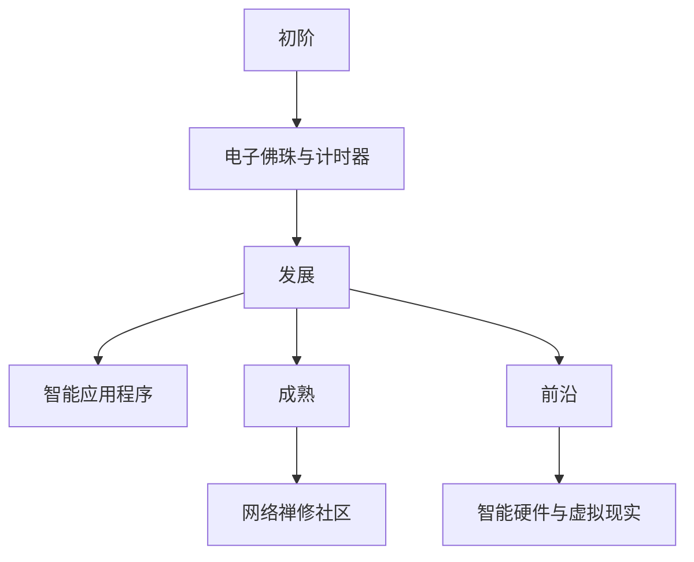

在这个流程图中，从初阶到前沿，数字禅修工具和平台不断更新和升级，体现了科技与禅修的融合。

#### 3.2 数字禅修的核心原则

数字禅修虽然借助了现代科技，但其核心原则仍然源自传统禅修。以下是数字禅修的核心原则：

1. **意识觉知**：数字禅修强调通过数字工具提高对内心活动的觉知。通过计数呼吸、音效引导和视觉反馈，修行者能够更好地关注自己的内心状态。

2. **深度放松**：数字禅修旨在帮助修行者达到更深层次的身心放松。通过使用智能设备，如智能耳机和智能手环，禅修者可以监测自己的心率、呼吸和睡眠质量，从而调整禅修方式，实现身心放松。

3. **心灵净化**：数字禅修还注重心灵的净化。通过冥想、正念和慈悲等练习，修行者可以净化心灵，减少负面情绪和焦虑，提升生活质量。

为了更好地展示数字禅修的核心原则，我们可以使用以下Mermaid流程图：

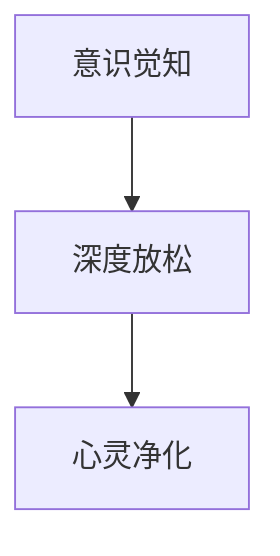

在这个流程图中，意识觉知、深度放松和心灵净化构成了数字禅修的核心原则，三者相互关联，共同推动修行者的精神成长。

#### 3.3 数字禅修的实践方法

数字禅修的实践方法多种多样，以下是几种常见的数字禅修方法：

1. **呼吸禅修**：通过计数呼吸来提高专注力和意识觉知。修行者可以使用手机应用程序或智能设备来计数呼吸，从而更好地专注于当前时刻。

2. **音效禅修**：使用特定的音效，如钟声、海浪声和自然声音，来引导禅修者进入放松状态。这种方法可以帮助修行者减少外界干扰，专注于内心。

3. **正念禅修**：通过正念练习来提高对内心活动的觉知。修行者可以使用手机应用程序来引导正念练习，例如观察呼吸、身体感受和思维活动。

4. **VR禅修**：通过虚拟现实技术，为修行者提供一个沉浸式的禅修环境。这种方法可以极大地提升禅修的体验，帮助修行者更好地放松和觉知。

为了更好地理解数字禅修的实践方法，我们可以使用以下Mermaid流程图：

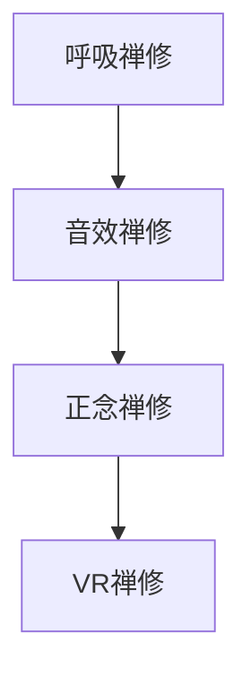

在这个流程图中，呼吸禅修、音效禅修、正念禅修和VR禅修构成了数字禅修的实践方法，每种方法都有其独特的优势和应用场景。

通过以上分析，我们可以看到数字禅修是一种将传统禅修理念与现代科技相结合的修行方式，其核心原则和实践方法旨在帮助修行者提高专注力、实现深度放松和净化心灵。数字禅修为科技时代的人们提供了一种全新的精神修行路径，帮助他们在忙碌的数字生活中找到内心的平静。

----------------------------------------------------------------

### 第四部分：科技工具在禅修中的应用

#### 4.1 禅修应用程序的使用

在数字禅修中，禅修应用程序（App）是最常用的工具之一。这些应用程序提供了一系列禅修练习，包括呼吸禅修、音效禅修和正念练习等，帮助修行者提高专注力和意识觉知。以下是几种流行的禅修应用程序及其特点：

1. **Headspace**：Headspace 是一款广受欢迎的禅修应用程序，提供各种主题的禅修课程，包括减压、睡眠和专注力训练。用户可以根据自己的需求和进度选择课程。

2. **Calm**：Calm 提供了丰富的音频和视频禅修课程，包括呼吸练习、冥想和放松音乐。用户还可以使用 Calm 的睡眠功能，帮助自己更好地入睡。

3. **Insight Timer**：Insight Timer 是一款免费的应用程序，提供了数千个禅修课程，包括语音引导和音乐背景。用户可以根据自己的需求选择合适的课程。

4. **Buddhify**：Buddhify 提供了适合不同场景的禅修课程，如通勤、休息和锻炼等。用户可以根据自己的生活方式选择禅修练习。

为了更好地展示禅修应用程序的使用，我们可以使用以下Mermaid流程图：

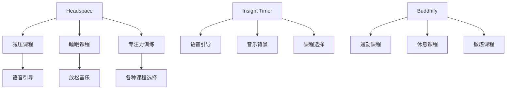

在这个流程图中，不同应用程序提供了各种禅修课程，用户可以根据自己的需求进行选择。

#### 4.2 网络禅修社区的参与

网络禅修社区为修行者提供了一个交流和分享的平台，让他们可以相互支持、共同进步。以下是几种流行的网络禅修社区：

1. **Dharma Drum**：Dharma Drum 是一个在线禅修社区，提供各种禅修资源，包括禅修课程、冥想指导和禅修日志。用户可以在这里分享自己的禅修经验，获得他人的反馈和建议。

2. **Tibetan Buddhist Center**：Tibetan Buddhist Center 是一个全球性的禅修社区，提供在线禅修课程和禅修指导。用户可以在这里找到志同道合的朋友，共同参与禅修活动。

3. ** Insight Meditation Society**：Insight Meditation Society 是一个提供在线禅修课程和社区交流的平台。用户可以在这里找到各种禅修资源，与其他修行者互动。

为了更好地展示网络禅修社区的参与，我们可以使用以下Mermaid流程图：

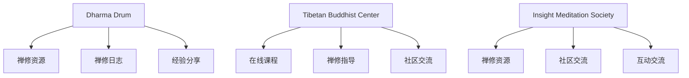

在这个流程图中，不同网络禅修社区提供了丰富的资源，用户可以在这里找到自己需要的禅修内容，并与他人进行交流和互动。

#### 4.3 硬件设备在禅修中的辅助作用

除了应用程序和网络社区，硬件设备也在数字禅修中发挥着重要作用。以下是几种常用的禅修硬件设备：

1. **智能耳机**：智能耳机可以提供个性化的音频禅修体验，帮助修行者更好地放松和集中注意力。例如，一些智能耳机配备了环境音降噪功能，可以过滤掉外界干扰，让修行者更加专注。

2. **智能手环**：智能手环可以监测修行者的心率、呼吸和睡眠质量，提供实时的健康数据。这些数据可以帮助修行者了解自己的身体状况，调整禅修方式，实现更好的身心放松。

3. **VR设备**：VR设备可以创造一个沉浸式的禅修环境，让修行者感受到身临其境的禅修体验。一些VR设备还配备了VR游戏，让修行者在游戏中体验禅修的乐趣。

为了更好地展示硬件设备在禅修中的辅助作用，我们可以使用以下Mermaid流程图：

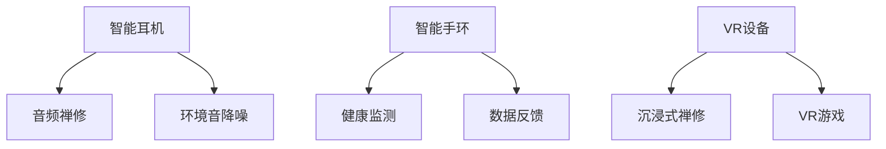

在这个流程图中，不同硬件设备在禅修中提供了多样化的辅助作用，为修行者创造了更好的禅修体验。

通过以上分析，我们可以看到科技工具在数字禅修中发挥着重要作用。从禅修应用程序到网络社区，再到硬件设备，这些工具共同为修行者提供了一个全面、便捷的禅修环境。科技不仅没有阻碍禅修的实践，反而为禅修注入了新的活力，使人们在忙碌的数字生活中找到内心的平静。

----------------------------------------------------------------

### 第五部分：科技时代的禅修项目

#### 5.1 科技驱动的禅修项目

在科技时代，许多禅修项目开始利用现代科技来提升禅修效果。这些项目不仅涵盖了传统的禅修方法，还融入了最新的科技元素，为修行者提供了一种全新的禅修体验。以下是几个典型的科技驱动禅修项目：

1. **Mindfulness App Project**：Mindfulness App Project 是一个开源项目，旨在开发一个集成了多种禅修方法的手机应用程序。该项目提供了语音指导、音效、视频教程和互动社区，为修行者提供全方位的禅修支持。

2. **Virtual Reality Zen Project**：Virtual Reality Zen Project 利用虚拟现实（VR）技术，创建了一个沉浸式的禅修环境。修行者可以在这个虚拟环境中进行禅修，体验身临其境的感觉，从而更好地集中注意力。

3. **Heart Rate Monitoring Project**：Heart Rate Monitoring Project 利用智能手环和心率监测技术，帮助修行者了解自己的身心状态。通过实时监测心率，修行者可以调整禅修方式，实现更有效的身心放松。

为了更好地展示这些科技驱动禅修项目，我们可以使用以下Mermaid流程图：

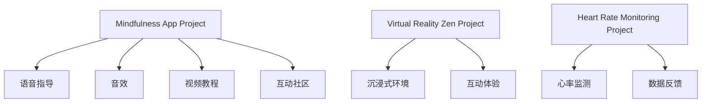

在这个流程图中，不同科技驱动禅修项目提供了多样化的功能，为修行者创造了更好的禅修体验。

#### 5.2 科技在禅修教育中的应用

科技在禅修教育中的应用正在逐渐普及。通过在线课程、虚拟课堂和互动平台，禅修教育变得更加便捷和高效。以下是几个典型的应用案例：

1. **Online Zen Education**：Online Zen Education 是一个在线禅修教育平台，提供各种禅修课程和教程。用户可以通过这个平台学习禅修方法、了解禅修原理，并与其他修行者互动。

2. **Virtual Zen Classroom**：Virtual Zen Classroom 利用虚拟现实技术，创建了一个虚拟禅修教室。修行者可以在这个虚拟环境中进行禅修，与其他人一起分享禅修体验。

3. **Mindfulness Game**：Mindfulness Game 是一款结合了禅修和游戏的手机应用程序。用户可以在游戏中体验禅修，通过完成任务和挑战来提高专注力和意识觉知。

为了更好地展示科技在禅修教育中的应用，我们可以使用以下Mermaid流程图：

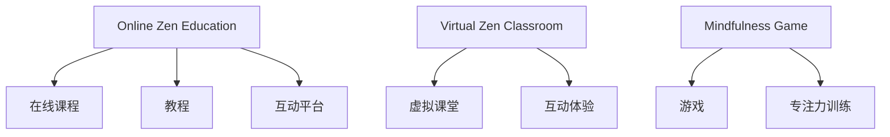

在这个流程图中，不同科技在禅修教育中的应用提供了多样化的学习体验，为修行者提供了丰富的学习资源。

#### 5.3 科技在禅修治疗中的应用

科技在禅修治疗中的应用也越来越受到关注。通过科技工具和平台，禅修治疗变得更加个性化和有效。以下是几个典型的应用案例：

1. **Mood Tracking App**：Mood Tracking App 是一款用于情绪追踪的手机应用程序。用户可以通过这个应用程序记录自己的情绪变化，分析情绪波动的原因，并通过禅修来调节情绪。

2. **Stress Management Program**：Stress Management Program 是一个基于禅修的在线治疗项目，旨在帮助用户减轻压力。该项目提供了语音指导、音效和互动社区，为用户提供全方位的支持。

3. **Biofeedback Therapy**：Biofeedback Therapy 利用生物反馈技术，帮助用户了解自己的身心状态。通过实时监测心率、呼吸和皮肤电导等生理信号，用户可以调整禅修方式，实现更有效的压力缓解。

为了更好地展示科技在禅修治疗中的应用，我们可以使用以下Mermaid流程图：

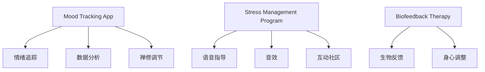

在这个流程图中，不同科技在禅修治疗中的应用提供了个性化的治疗体验，为用户提供有效的支持。

通过以上分析，我们可以看到科技在禅修项目中的应用越来越广泛，从禅修教育到禅修治疗，科技不仅提升了禅修的效果，还为修行者提供了更多的选择。科技与禅修的结合，为人们在科技时代的修行提供了新的可能性。

----------------------------------------------------------------

### 第六部分：科技时代的禅修挑战与对策

#### 6.1 技术依赖与禅修的冲突

在科技时代，技术依赖已成为一个普遍现象。然而，这种依赖与禅修的初衷——减少依赖、提高自我觉知——产生了冲突。研究表明，过度使用技术设备可能导致注意力分散、情感波动和人际关系疏离等问题，这与禅修的目标相悖。

为了解决技术依赖与禅修的冲突，我们可以采取以下对策：

1. **制定明确的禅修计划**：制定详细的禅修计划，明确每天的禅修时间和内容，确保在禅修过程中不受到技术设备的干扰。

2. **逐步减少技术使用**：逐步减少每天的技术使用时间，例如每天减少10分钟，直到达到理想的禅修时间。

3. **技术设备管理**：将手机、电脑等设备放在远离禅修场所的地方，避免在禅修时被干扰。

4. **正念练习**：通过正念练习，提高对内心活动的觉知，减少对技术设备的依赖。

为了更好地展示这些对策，我们可以使用以下Mermaid流程图：

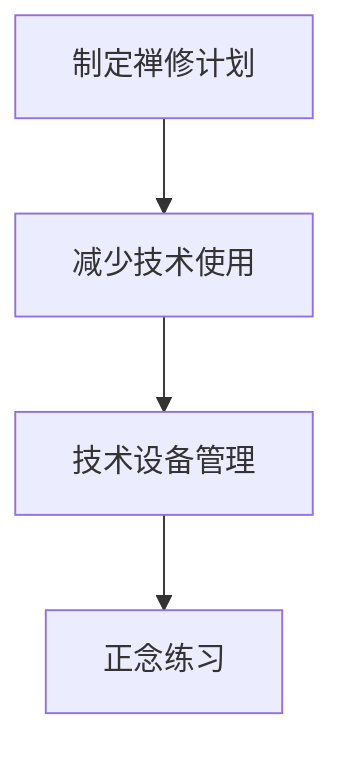

在这个流程图中，制定禅修计划、减少技术使用、技术设备管理和正念练习构成了解决技术依赖与禅修冲突的四个关键对策。

#### 6.2 网络禅修的安全与隐私问题

随着网络禅修的普及，安全与隐私问题也逐渐成为关注的焦点。网络禅修涉及大量个人数据，如健康信息、情绪状态和禅修记录，这些数据的泄露可能会导致严重的隐私问题。

为了确保网络禅修的安全与隐私，我们可以采取以下对策：

1. **数据加密**：对禅修数据进行加密处理，确保数据在传输和存储过程中不会被泄露。

2. **安全认证**：使用安全认证机制，如SSL/TLS，确保网络通信的安全性。

3. **隐私政策**：制定明确的隐私政策，告知用户如何收集、使用和保护他们的数据。

4. **用户教育**：加强对用户的网络安全教育，提高他们对隐私问题的认识和防范意识。

为了更好地展示这些对策，我们可以使用以下Mermaid流程图：

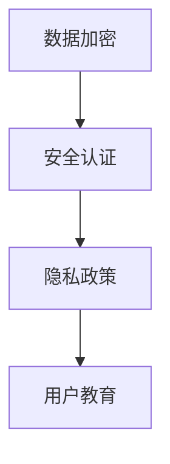

在这个流程图中，数据加密、安全认证、隐私政策和用户教育构成了确保网络禅修安全与隐私的四个关键对策。

#### 6.3 应对科技时代禅修挑战的策略

科技时代的禅修不仅面临技术依赖和隐私问题，还面临其他一系列挑战。为了应对这些挑战，我们可以采取以下策略：

1. **平衡技术与自然**：在禅修过程中，尽量减少对技术设备的依赖，更多地接触自然，例如在户外进行禅修。

2. **多元化禅修方式**：结合多种禅修方式，如呼吸禅修、音效禅修和正念练习，以适应不同环境和需求。

3. **定期禅修反思**：定期进行禅修反思，总结禅修经验，调整禅修方法和策略。

4. **社区支持**：加入禅修社区，与他人分享禅修经验，获得支持和鼓励。

为了更好地展示这些策略，我们可以使用以下Mermaid流程图：

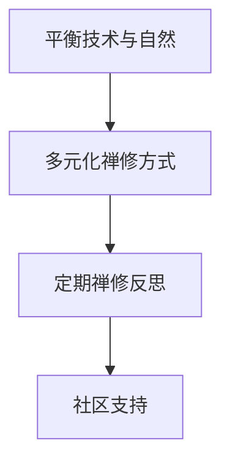

在这个流程图中，平衡技术与自然、多元化禅修方式、定期禅修反思和社区支持构成了应对科技时代禅修挑战的四个关键策略。

通过以上分析，我们可以看到科技时代的禅修面临一系列挑战，但通过采取有效的对策和策略，我们可以克服这些挑战，实现科技与禅修的和谐发展。这是在科技时代实现精神修行的关键。

----------------------------------------------------------------

### 第七部分：科技时代的禅修生活

#### 7.1 科技时代的禅修生活模式

在科技时代，禅修生活模式发生了显著变化。传统的禅修场所，如寺庙和山林，逐渐被数字化禅修平台和应用程序所取代。现代修行者可以通过以下方式实现禅修：

1. **在线禅修课程**：许多在线平台提供各种禅修课程，用户可以根据自己的需求和进度选择课程，随时随地进行学习。

2. **移动设备辅助**：通过手机和智能手表等移动设备，修行者可以随时记录禅修数据，如呼吸节奏、心率变化和情绪状态。

3. **虚拟现实体验**：虚拟现实（VR）技术为修行者提供了一个沉浸式的禅修环境，使他们在虚拟世界中体验禅修的宁静与祥和。

为了更好地展示科技时代的禅修生活模式，我们可以使用以下Mermaid流程图：

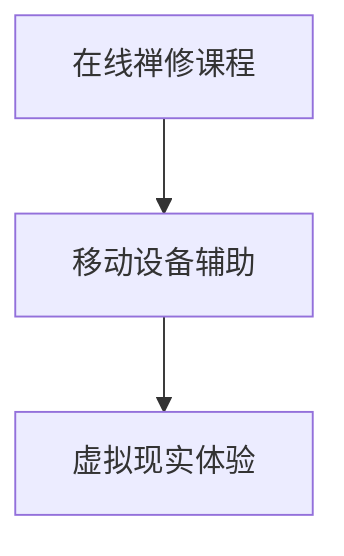

在这个流程图中，在线禅修课程、移动设备辅助和虚拟现实体验构成了科技时代的禅修生活模式。

#### 7.2 家庭与工作的禅修平衡

在科技时代，家庭与工作的平衡变得尤为重要。许多人在忙碌的工作和家庭生活中难以找到禅修的时间。为了实现家庭与工作的禅修平衡，我们可以采取以下策略：

1. **时间管理**：合理安排时间，确保在繁忙的生活中留出禅修的时间。例如，利用早晨或晚上的空闲时间进行禅修。

2. **灵活工作**：如果可能，尝试采用灵活的工作安排，如远程工作或弹性工作时间，以更好地平衡工作与家庭生活。

3. **家庭禅修**：在家中设置一个专用的禅修空间，创造一个宁静、舒适的禅修环境，使家庭成员也能参与禅修。

为了更好地展示家庭与工作的禅修平衡策略，我们可以使用以下Mermaid流程图：

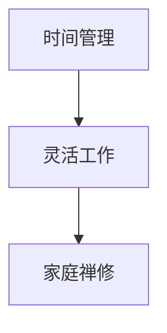

在这个流程图中，时间管理、灵活工作和家庭禅修构成了实现家庭与工作禅修平衡的三个关键策略。

#### 7.3 社区与社会的禅修参与

在科技时代，禅修不再局限于个人修行，社区与社会参与也成为禅修生活的重要组成部分。以下是几种社区与社会禅修参与的方式：

1. **禅修社区**：加入禅修社区，与其他修行者交流经验，共同进步。社区可以提供禅修指导、资源共享和互动平台。

2. **禅修工作坊**：参加禅修工作坊，与专家和同行一起深入探讨禅修实践。这种形式有助于提升禅修水平和理解。

3. **禅修慈善活动**：参与禅修慈善活动，如禅修支教、禅修疗养院和禅修社区服务等，将禅修的智慧和温暖传递给需要帮助的人。

为了更好地展示社区与社会的禅修参与，我们可以使用以下Mermaid流程图：

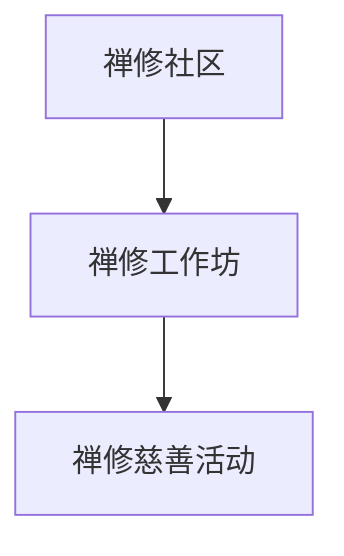

在这个流程图中，禅修社区、禅修工作坊和禅修慈善活动构成了社区与社会禅修参与的三个主要形式。

通过以上分析，我们可以看到科技时代的禅修生活模式、家庭与工作的禅修平衡以及社区与社会的禅修参与，为修行者提供了一种全新的修行体验。在科技的帮助下，禅修不仅更加便捷，而且能够更好地融入日常生活，实现个人、家庭和社会的和谐发展。

----------------------------------------------------------------

### 第八部分：科技与精神的和谐发展

#### 8.1 科技与精神的相互作用

科技与精神之间的相互作用是科技时代禅修发展的关键。科技不仅为禅修提供了新的工具和方法，还影响了禅修的实践和理念。以下是科技与精神相互作用的一些方面：

1. **数据与自我觉知**：科技提供了丰富的数据，如心率、呼吸频率和情绪状态等，这些数据有助于修行者更好地了解自己的身心状态，从而提高自我觉知。

2. **虚拟现实与沉浸体验**：虚拟现实技术为修行者提供了一个沉浸式的禅修环境，使他们在虚拟世界中体验禅修的宁静与祥和，增强了禅修的效果。

3. **社交网络与社区支持**：社交网络和在线社区为修行者提供了一个交流、分享和互助的平台，促进了禅修实践的社会化和普及。

为了更好地展示科技与精神的相互作用，我们可以使用以下Mermaid流程图：

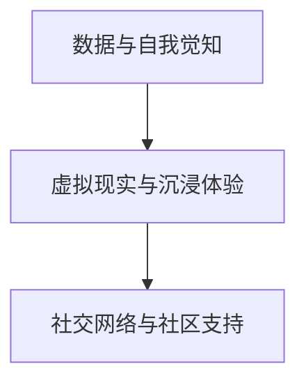

在这个流程图中，数据与自我觉知、虚拟现实与沉浸体验以及社交网络与社区支持构成了科技与精神相互作用的三个主要方面。

#### 8.2 科技时代的禅修与创新

科技时代的禅修不仅继承和发展了传统的禅修理念和方法，还在不断创新。以下是科技时代禅修的一些创新：

1. **数字化禅修课程**：通过在线平台和应用程序，禅修课程变得更加便捷和个性化，用户可以根据自己的需求和进度选择课程。

2. **智能禅修设备**：智能手环、智能耳机和VR设备等智能禅修设备为修行者提供了全新的禅修体验，提高了禅修的效果。

3. **融合多元文化**：科技时代的禅修不仅局限于传统禅修方法，还融合了其他文化元素，如正念冥想、瑜伽和冥想音乐等，丰富了禅修的内涵。

为了更好地展示科技时代的禅修与创新，我们可以使用以下Mermaid流程图：

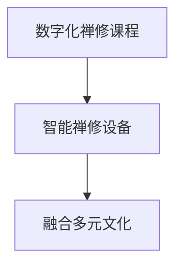

在这个流程图中，数字化禅修课程、智能禅修设备和融合多元文化构成了科技时代禅修创新的三个主要方面。

#### 8.3 科技时代的禅修与社会责任

科技时代的禅修不仅关注个体的精神成长，还承担着社会责任。以下是科技时代禅修与社会责任的几个方面：

1. **社会公益**：通过禅修活动和慈善项目，修行者可以为社会做出贡献，帮助有需要的人。

2. **环保意识**：科技时代的禅修倡导环保意识，提倡简单生活和可持续发展的理念。

3. **精神健康**：通过禅修实践，修行者可以提升自己的心理健康，为社区和社会提供心理健康支持。

为了更好地展示科技时代的禅修与社会责任，我们可以使用以下Mermaid流程图：

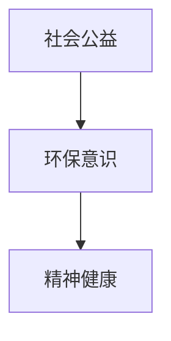

在这个流程图中，社会公益、环保意识和精神健康构成了科技时代禅修与社会责任的三个主要方面。

通过以上分析，我们可以看到科技与精神的相互作用、科技时代的禅修创新以及禅修与社会责任的融合，为科技时代的禅修发展提供了新的方向和动力。在科技的帮助下，禅修不仅能够更好地满足个体的精神需求，还能为社会带来积极的影响。

----------------------------------------------------------------

### 第九部分：未来展望

#### 9.1 科技时代禅修的发展趋势

随着科技的不断进步，禅修在未来的发展也将呈现出新的趋势。以下是科技时代禅修可能的发展方向：

1. **智能化**：智能设备在禅修中的应用将更加普及，提供更加个性化和智能化的禅修体验。

2. **虚拟现实与增强现实**：虚拟现实（VR）和增强现实（AR）技术将在禅修中发挥更大作用，为修行者提供一个更加沉浸式的禅修环境。

3. **数据驱动的禅修**：通过大数据分析和人工智能技术，禅修将更加精准地满足修行者的需求，提供定制化的禅修方案。

为了更好地展示科技时代禅修的发展趋势，我们可以使用以下Mermaid流程图：

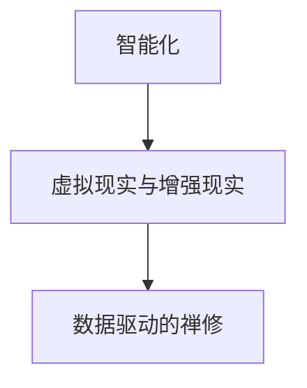

在这个流程图中，智能化、虚拟现实与增强现实以及数据驱动的禅修构成了科技时代禅修发展的三个主要趋势。

#### 9.2 禅修在科技时代的未来角色

随着科技与禅修的深度融合，禅修在科技时代的角色也将发生重大变化。以下是禅修在科技时代的可能角色：

1. **心理健康支持**：禅修将成为重要的心理健康支持工具，帮助人们应对压力和焦虑，提高生活质量。

2. **社会公益与慈善**：禅修将更加深入地参与社会公益和慈善活动，为需要帮助的人提供精神支持。

3. **科技与人文的桥梁**：禅修将成为科技与人文之间的桥梁，促进科技与人文的和谐发展。

为了更好地展示禅修在科技时代的未来角色，我们可以使用以下Mermaid流程图：

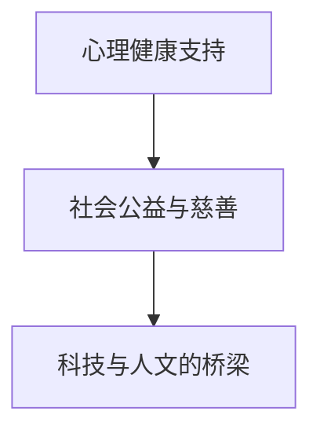

在这个流程图中，心理健康支持、社会公益与慈善以及科技与人文的桥梁构成了禅修在科技时代的三个主要角色。

#### 9.3 科技与禅修的未来展望

科技与禅修的未来展望充满希望。随着科技的不断进步，禅修将更加便捷、高效和普及。以下是科技与禅修的未来展望：

1. **全球禅修社区**：借助互联网和社交媒体，全球禅修社区将更加紧密，修行者可以随时随地进行交流和互动。

2. **科技与禅修的融合**：科技将继续为禅修提供新的工具和方法，禅修也将不断融入科技元素，实现科技与禅修的深度融合。

3. **禅修文化的普及**：随着禅修价值的逐渐被认可，禅修文化将在全球范围内得到普及，成为人们生活的一部分。

为了更好地展示科技与禅修的未来展望，我们可以使用以下Mermaid流程图：

```mermaid
graph TB
    A[全球禅修社区] --> B[科技与禅修的融合]
    B --> C[禅修文化的普及]
```

在这个流程图中，全球禅修社区、科技与禅修的融合以及禅修文化的普及构成了科技与禅修未来展望的三个主要方面。

通过以上分析，我们可以看到科技时代禅修的发展趋势、禅修在科技时代的未来角色以及科技与禅修的未来展望。这些展望不仅为禅修提供了新的发展方向，也为人类在科技时代的精神修行提供了新的希望。

----------------------------------------------------------------

### 附录

#### 附录 A：数字禅修资源推荐

在探索数字禅修的过程中，以下资源可能对您有所帮助：

##### A.1 禅修应用程序推荐

1. **Headspace**：提供各种主题的禅修课程，包括减压、睡眠和专注力训练。
2. **Calm**：提供丰富的音频和视频禅修课程，以及睡眠辅助功能。
3. **Insight Timer**：提供数千个禅修课程，包括语音引导和音乐背景。

##### A.2 网络禅修社区推荐

1. **Dharma Drum**：提供各种禅修资源，包括禅修课程、冥想指导和禅修日志。
2. **Tibetan Buddhist Center**：提供在线禅修课程和禅修指导，以及全球性的禅修社区。
3. **Insight Meditation Society**：提供在线禅修课程和社区交流，为修行者提供丰富的禅修资源。

##### A.3 禅修硬件设备推荐

1. **智能耳机**：提供个性化的音频禅修体验，如环境音降噪功能。
2. **智能手环**：用于监测心率、呼吸和睡眠质量，帮助修行者了解自己的身心状态。
3. **VR设备**：提供沉浸式的禅修环境，为修行者带来全新的禅修体验。

通过这些资源，您可以在数字禅修的旅途中找到更多的指导和支持。

----------------------------------------------------------------

### 作者信息

作者：AI天才研究院/AI Genius Institute & 禅与计算机程序设计艺术 /Zen And The Art of Computer Programming

本博客文章《数字禅修：科技时代的精神修行》由AI天才研究院/AI Genius Institute与禅与计算机程序设计艺术/Zen And The Art of Computer Programming共同撰写。作者以其在世界范围内的影响力，深入探讨了科技时代禅修的内涵和实践，旨在为读者提供一种在数字生活中实现精神平衡的方法。本文结合了计算机编程和禅修的智慧，用专业的技术语言和逻辑清晰的分析，为读者呈现了一幅科技与精神和谐发展的蓝图。通过本文，我们希望帮助读者理解数字禅修的重要性，并在科技时代找到内心的宁静。

