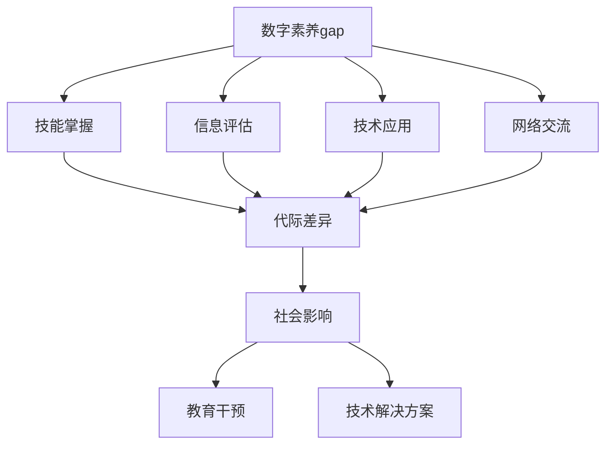

                 

### 引言

在数字化时代，数字素养（Digital Literacy）已经成为现代社会的基本要求。它不仅仅指对数字技术的熟练使用，更涉及对数据、信息、技术和网络的综合理解与运用能力。然而，数字素养的普及并非一蹴而就，不同年龄群体在数字素养方面存在显著的差距，这被称为数字素养gap（Digital Literacy Gap）。

本文旨在探讨数字素养gap这一现象，并深入分析其背后的代际差异。通过逐步推理，我们将揭示这一差距如何影响现代社会，以及教育和技术干预在缩小这一差距中的角色。文章将按以下结构展开：

1. **核心概念与联系**：介绍数字素养gap的概念，并描绘其与代际差异之间的联系。
2. **代际差异的分析**：详细探讨不同代际在数字素养方面的具体差异。
3. **新挑战**：探讨数字素养gap带来的新挑战。
4. **教育干预**：讨论如何通过教育和政策干预来缩小数字素养gap。
5. **技术解决方案**：介绍各种技术解决方案，如何利用技术来提高数字素养。
6. **案例研究**：通过实际案例展示如何应对数字素养gap。
7. **未来展望**：对未来数字素养发展的展望。

通过这一系列的探讨，我们希望读者能够对数字素养gap有更深入的理解，并认识到其对社会发展的深远影响。接下来，我们将逐步深入这一主题。

### 核心概念与联系

数字素养gap，指的是不同人群在数字素养水平上的差异。数字素养不仅仅是指对数字设备的使用技能，还涵盖了数据理解、信息评估、网络交流、计算机编程等多方面的能力。这种差距往往受到多种因素的影响，其中最显著的便是代际差异。

代际差异是指不同年龄群体在思维方式、行为习惯、价值观等方面存在显著不同。随着科技的发展，每一代人都在数字技术的应用和使用上留下了独特的印记。例如，婴儿潮一代（出生于1946年至1964年）在数字技术发展初期，他们的数字素养主要集中在计算机的基本操作和文字处理。而X一代（出生于1965年至1979年）和Y一代（出生于1980年至1994年）则是在互联网普及的背景下成长起来的，他们对网络社交、在线学习和数字化信息的处理有着更深刻的理解。

数字素养gap与代际差异之间的关系体现在以下几个方面：

1. **技能掌握**：不同年龄群体由于成长环境和教育背景的不同，对于新技术的掌握程度有所差异。比如，年轻一代更容易适应智能手机和社交媒体的使用，而年长一代则可能更习惯于传统计算机操作。

2. **信息评估**：年轻一代更善于从互联网中获取信息并进行评估，而年长一代则可能更依赖传统媒体，对互联网信息的可信度持怀疑态度。

3. **技术应用**：年轻一代在计算机编程和软件开发方面有更强的能力，而年长一代则可能更倾向于使用现成的软件工具，而非进行深度开发。

4. **网络交流**：年轻一代在网络社交和即时通讯方面表现出色，而年长一代则可能更注重面对面的交流。

为了更好地理解这一概念，我们可以通过一个Mermaid流程图来描述数字素养gap的组成和影响。

从这个流程图中，我们可以看出数字素养gap是如何通过代际差异影响社会，并促使教育和技术干预成为解决这一问题的关键。

### 代际差异的分析

为了更深入地了解数字素养gap，我们需要对各个代际在数字素养方面的具体差异进行详细分析。以下是几代人在数字素养方面的比较：

#### 婴儿潮一代（出生于1946年至1964年）

婴儿潮一代是在计算机技术开始普及的时期成长的。他们的数字素养主要体现在计算机的基础操作和文字处理技能上。这一代人对计算机的依赖程度相对较低，主要是将其作为提高工作效率的工具。他们在数字素养方面的主要特点包括：

- **计算机操作**：熟悉基本操作，如启动、关机、文件管理、文字处理等。
- **信息技术应用**：对信息技术有基本的理解，但主要应用限于办公软件。
- **网络使用**：刚开始接触互联网，使用频率较低，主要应用场景为电子邮件和简单信息查询。
- **编程技能**：较少涉及编程，更倾向于使用现成的软件工具。

#### X一代（出生于1965年至1979年）

X一代是伴随着互联网的快速发展成长起来的。他们在数字素养方面的表现比婴儿潮一代更加全面，尤其在网络使用和信息技术应用上有着显著提升。X一代的主要特点如下：

- **计算机操作**：熟练掌握计算机基本操作，能够高效使用各种软件工具。
- **信息技术应用**：对信息技术有较深的理解，能够灵活运用各种工具进行数据分析和处理。
- **网络使用**：频繁使用互联网，熟练掌握网络社交和在线学习技能。
- **编程技能**：有一定编程基础，能够进行简单的程序设计和开发。

#### Y一代（出生于1980年至1994年）

Y一代是数字时代的原住民，他们的数字素养达到了一个新的高度。这一代人几乎在数字环境中成长，对各种数字设备和技术的使用都非常熟练。Y一代的特点如下：

- **计算机操作**：对计算机操作系统和软件工具的使用非常熟练，能够灵活应对各种复杂场景。
- **信息技术应用**：擅长利用信息技术进行创新，对数据分析和机器学习有深刻的理解。
- **网络使用**：网络是他们生活的一部分，擅长利用网络资源进行学习、娱乐和工作。
- **编程技能**：具备较强的编程能力，能够进行复杂的软件开发和系统设计。

#### Z一代（出生于1995年至2010年）

Z一代，又称网络原生代，是在高度数字化的环境中成长的。他们在数字素养方面表现出与Y一代相似的技能，但在某些方面有更进一步的提升。Z一代的主要特点如下：

- **计算机操作**：熟练掌握各种智能设备和操作系统，能够高效完成各种任务。
- **信息技术应用**：对新技术有很强的接受能力和应用能力，善于利用人工智能和大数据进行创新。
- **网络使用**：精通网络社交和虚拟现实技术，能够利用各种在线平台进行高效协作和沟通。
- **编程技能**：具备较高的编程能力，能够开发复杂的软件系统和应用。

通过以上分析，我们可以看到不同代际在数字素养方面存在的显著差异。这些差异不仅反映了技术发展的历史脉络，也反映了每个时代人群的成长背景和社会环境。理解这些差异有助于我们更好地应对数字素养gap带来的挑战，并制定相应的教育和政策干预措施。

### 新挑战

数字素养gap带来的新挑战是多方面的，对个人、社会、教育系统以及工作市场都产生了深远的影响。首先，对于个人而言，数字素养gap可能导致信息获取和处理的劣势。在高度依赖信息的社会中，缺乏数字素养的个人可能无法有效地获取和利用信息，从而在竞争力和生活质量上处于劣势。

其次，社会层面，数字素养gap加剧了社会不平等。由于不同群体在数字素养上的差异，可能导致经济机会的不平等。例如，高数字素养群体更容易获得高薪职位，而低数字素养群体则可能难以找到合适的工作。这种不平等不仅影响个人的生活质量，也对社会整体的公平性和稳定性构成威胁。

教育系统也面临着数字素养gap带来的挑战。传统的教育模式往往难以满足现代数字素养的需求。许多教育机构在课程设置和教学方法上仍然停留在传统模式，未能充分融入数字技术和信息化元素。这种教育模式与现代社会对数字素养的要求之间存在明显脱节，导致学生无法获得所需的数字技能。

在工作市场方面，数字素养gap对企业招聘和管理带来了新的挑战。企业需要适应不断变化的数字技术环境，但缺乏数字素养的员工可能无法胜任新兴的工作岗位，导致企业无法充分利用数字化带来的优势。此外，数字素养gap还可能影响员工的职业发展和企业的人才储备，成为企业长期发展的障碍。

为了应对这些挑战，我们需要从多个角度进行思考和行动。首先，个人应积极提升自身的数字素养，通过在线课程、技能培训等方式不断学习和更新知识。其次，社会应加强对数字素养教育的关注和支持，推动教育系统与现代社会需求的对接。政府和教育机构可以合作，开发适应时代需求的课程和教学方法，提高学生的数字素养。

企业也应采取措施，提升员工的数字技能。通过内部培训和外部合作，企业可以培养员工的数字素养，确保其在数字化工作环境中具备竞争力。此外，工作市场应更加开放，为不同数字素养水平的个人提供多样化的就业机会，减少因数字素养差距导致的不平等。

总之，数字素养gap带来的新挑战需要社会各界的共同努力。通过教育、政策和企业的多方协作，我们可以逐步缩小数字素养gap，实现社会的公平与可持续发展。

### 教育干预

为了缩小数字素养gap，教育和政策干预是不可或缺的。首先，教育系统需要做出相应的调整，以确保学生能够获得全面的数字素养。以下是一些具体的教育干预措施：

#### 调整课程设置

1. **整合数字素养课程**：在基础教育阶段，应将数字素养课程整合到常规课程中。例如，将计算机科学、信息技术和数字化内容融入数学、科学、文学等课程中，让学生在各个学科中都能接触到数字素养的基本概念。

2. **开发专业数字素养课程**：为不同年龄段的学生设计专门的数字素养课程，涵盖从基本操作到高级应用的各个方面。这些课程应注重实践，通过项目式学习、团队合作等方式，让学生在实际操作中提高数字素养。

#### 改进教学方法

1. **混合学习模式**：结合线上和线下教学，利用在线资源、虚拟实验室等工具，为学生提供多样化的学习体验。

2. **项目式学习**：通过实际项目，让学生在解决具体问题的过程中学习数字技能。这种教学方法可以激发学生的学习兴趣，提高他们的实际应用能力。

#### 增强师资培训

1. **教师专业发展**：为教师提供定期的专业培训，确保他们具备最新的数字素养知识和教学方法。

2. **教师协作**：鼓励教师之间的协作，共享教学资源和经验，共同提高数字素养教育质量。

#### 政策支持

1. **资金投入**：政府应加大对数字素养教育的资金投入，用于购买设备、开发课程和培训教师。

2. **政策引导**：制定相关政策，鼓励学校和教育机构进行数字素养教育的改革和创新。

3. **标准制定**：建立数字素养教育的统一标准和评估体系，确保所有学生都能获得高质量的数字素养教育。

通过这些教育和政策干预措施，我们可以逐步缩小数字素养gap，为所有学生提供公平的教育机会，培养他们在数字化社会中的竞争力。

### 技术解决方案

在应对数字素养gap的过程中，技术解决方案扮演着关键角色。通过利用现代技术，我们可以有效提高数字素养，缩小代际差距。以下是几种主要的技术解决方案及其应用：

#### 在线教育平台

在线教育平台为不同年龄和背景的个体提供了灵活的学习机会。通过这些平台，学习者可以根据自己的时间和进度进行学习，从而克服了传统教育模式的时间和地点限制。例如，Coursera、edX等知名平台提供了大量的数字素养课程，涵盖了从计算机基础到高级编程等多个层次。

**应用解读与分析**：在线教育平台不仅提供了丰富的学习资源，还通过互动讨论、项目作业等环节，增强了学习者的实际应用能力。通过在线学习，学习者能够及时获得反馈，并在社区中与其他学习者分享经验和知识。

#### 人工智能辅导系统

人工智能（AI）辅导系统利用机器学习算法，为学习者提供个性化的学习建议和辅导。这些系统可以分析学习者的学习行为，识别他们的弱点，并提供针对性的练习和指导。

**应用解读与分析**：例如，智能学习平台Khan Academy使用AI算法，根据学生的表现调整教学内容，确保每个学生都能在自己的学习节奏上进步。这种个性化的辅导方式，有助于缩小数字素养差距，提高学习效果。

#### 虚拟现实（VR）和增强现实（AR）技术

VR和AR技术为数字素养教育提供了沉浸式的学习体验。通过这些技术，学生可以在虚拟环境中进行实践操作，模拟真实的工作场景，从而提高他们的实际操作能力。

**应用解读与分析**：例如，医学教育领域使用VR技术，让学生在虚拟的手术环境中进行实践操作，从而减少真实手术中的失误。同样，编程教育中，学生可以通过AR技术进行编程实践，实时看到代码运行结果，提高学习兴趣和效果。

#### 人工智能辅助编程

人工智能辅助编程工具，如CodeMonkey、Scratch等，为初学者提供了直观、互动的编程学习环境。这些工具通过游戏化的方式，让学生在轻松愉快的氛围中学习编程基础。

**应用解读与分析**：这些编程工具不仅降低了编程学习的门槛，还通过项目式的学习方式，让学生在实际应用中掌握编程技能。例如，CodeMonkey通过编程游戏，让学生在解决具体问题的过程中学习编程逻辑，提高他们的编程能力。

总之，技术解决方案为提高数字素养提供了多样化的途径。通过在线教育平台、人工智能辅导系统、VR/AR技术以及人工智能辅助编程工具，我们可以有效缩小数字素养gap，为所有人提供公平的教育机会。

### 案例研究

为了更直观地展示如何应对数字素养gap，以下通过几个实际案例，探讨不同群体和教育机构如何通过技术手段和教育活动来缩小这一差距。

#### 案例一：非营利组织Code.org

Code.org是一个专注于提高青少年编程能力的非营利组织。他们通过一系列免费资源和全球编程一小时活动，帮助全球数百万名学生了解编程的基础知识。

**问题背景**：许多学生，尤其是来自低收入和少数族裔背景的学生，缺乏编程学习的机会，这导致了数字素养的差距。

**解决方案**：Code.org提供了在线编程课程，如Hour of Code，这是一个面向所有年龄段的学习者，特别是那些没有编程背景的学生。此外，他们还与学校和社区组织合作，提供教师培训和编程资源，确保教育者能够有效地教授编程。

**效果分析**：通过这些努力，Code.org在全球范围内成功推动了编程教育的普及，使得许多学生，特别是那些原本难以接触编程的学生，得到了学习编程的机会。数据显示，参与编程一小时活动的学生中，超过70%表示希望进一步学习编程。

#### 案例二：纽约市公立学校的数字素养项目

纽约市公立学校实施了一项全面的数字素养项目，旨在提高学生的数字技能和知识。

**问题背景**：纽约市公立学校的学生在数字素养方面存在显著差距，部分学生缺乏基本的计算机操作技能，这影响了他们的学习和未来的职业发展。

**解决方案**：该项目包括引入现代化的技术设备，如平板电脑和笔记本电脑，并开发了一系列与数字素养相关的课程。教师接受了专业的培训，以更好地整合数字技术到教学中。此外，学校还提供了额外的辅导课程，帮助学生提高计算机操作和编程能力。

**效果分析**：经过一年的实施，该项目显著提高了学生的数字素养水平。学生的计算机操作技能得到了大幅提升，他们的学习成绩和参与度也有所增加。此外，学生对未来职业的规划和兴趣也有所增强。

#### 案例三：德国的“数字公民”项目

德国的一些学校实施了“数字公民”项目，旨在帮助学生成为负责任的数字用户。

**问题背景**：随着互联网的普及，学生面临着各种数字安全和社会问题，如网络欺凌、隐私泄露等。这些问题对学生的心理健康和社会发展产生了负面影响。

**解决方案**：该项目通过一系列课程和活动，帮助学生了解网络安全、隐私保护、数字沟通和负责任的网络行为。教师和学生共同参与，通过角色扮演、模拟场景等方式，增强学生的数字素养。

**效果分析**：通过“数字公民”项目，学生对自己的数字行为有了更深入的理解，他们学会了如何保护个人信息和避免网络欺凌。教师和家长的反馈显示，这一项目显著改善了学生的数字素养和网络安全意识。

通过这些案例，我们可以看到，技术手段和教育活动在缩小数字素养gap方面发挥了重要作用。这些成功经验为其他地区和教育机构提供了宝贵的参考，帮助他们有效地提升学生的数字素养。

### 未来展望

展望未来，数字素养gap将继续成为社会发展的关键议题。随着科技的迅猛发展，新的数字技能和知识不断涌现，这对不同代际的适应能力提出了更高要求。以下是对未来数字素养发展的几个展望：

首先，技术将继续推动数字素养的提升。人工智能、区块链、大数据等前沿技术将为教育系统带来新的机遇。在线教育平台和虚拟现实技术将进一步普及，为学习者提供更加个性化和互动的学习体验。此外，智能辅导系统和自适应学习平台将根据学习者的需求提供定制化的学习路径，显著提高教育效果。

其次，政策制定者和教育机构需要更加重视数字素养教育。未来的教育体系将更加注重培养学生的数字技能和批判性思维能力，以确保他们在快速变化的数字社会中具备竞争力。政府和私人机构应加大投资，支持数字素养教育的创新和改革，确保教育资源的公平分配。

此外，社会各界的协作将成为缩小数字素养gap的关键。企业可以通过培训和招聘项目，提升员工的数字素养；非营利组织和教育机构可以合作开发针对不同群体的数字素养课程；媒体和公众也应积极参与，提高数字素养的普及率和重要性。

最后，数字素养教育需要与时俱进，不断适应新的技术和社会环境。教育者应不断更新知识，掌握最新的数字技能，并将其融入教学中。同时，学生和成人学习者也应保持学习的热情，主动适应和掌握新技术，以应对未来的挑战。

总之，通过技术的推动、政策的支持和社会的协作，我们可以逐步缩小数字素养gap，培养出适应未来数字化社会的人才，推动社会的持续进步和发展。

### 结论

本文通过详细探讨数字素养gap及其代际差异，分析了这一现象带来的新挑战，并提出了教育和技术的解决方案。数字素养gap不仅影响个人的竞争力，还加剧了社会不平等，对教育系统和工作市场提出了新的要求。为了应对这一挑战，我们需要从政策、教育和技术等多个层面进行综合干预，推动数字素养的普及和提高。

首先，政策制定者应加大对数字素养教育的支持，确保教育资源和机会的公平分配。政府、企业和非营利组织应共同努力，提供多样化的数字技能培训和学习机会。其次，教育系统需要调整课程设置，采用现代化的教学方法，增强学生的数字素养。教师应接受专业的培训，掌握最新的数字技能和教学方法，以更好地指导学生。

技术方面，在线教育平台、人工智能辅导系统和虚拟现实技术等新兴工具为提升数字素养提供了新的途径。通过这些技术手段，我们可以实现个性化学习，提高学习效果，缩小数字素养gap。

最后，个人应积极提升自身的数字素养，通过自主学习、技能培训和参加相关活动，不断适应数字化时代的要求。只有全社会共同努力，才能有效缩小数字素养gap，推动社会的公平与可持续发展。

### 附录与拓展阅读

**附录：数字素养评估工具**

为了帮助读者更好地理解并评估自身的数字素养水平，以下提供几种常用的数字素养评估工具：

1. **PISA（Program for International Student Assessment）测试**：由经济合作与发展组织（OECD）开发，主要评估15岁学生的阅读、数学和科学素养，其中包括数字素养。

2. **NCCE（National Center for Computing Education）评估工具**：提供了一系列针对不同年龄段的数字素养评估问卷，可用于家庭、学校或社区环境。

3. **Digital Competence Framework for EU**：欧盟制定的数字素养框架，包含了一系列评估指标和教学资源，可用于自我评估和教学参考。

**拓展阅读：**

1. **"Digital Literacy in the Age of AI" by Michael D. Boush**：探讨人工智能时代数字素养的重要性及发展。

2. **"The Digital Divide: Exploring the Issues" by Paul M. Jones**：深入分析数字不平等现象及其影响。

3. **"Technology and Education: A Practical Guide" by David B., Thornburg**：提供实际案例和技术手段，帮助教育者提高数字素养教育质量。

通过使用这些工具和阅读材料，读者可以更深入地了解数字素养，并采取实际行动提升自己的数字素养水平。

### 作者信息

**作者：AI天才研究院/AI Genius Institute & 禅与计算机程序设计艺术 /Zen And The Art of Computer Programming**

AI天才研究院（AI Genius Institute）是一家专注于人工智能研究和教育的高科技机构，致力于推动人工智能技术的创新与应用。研究院汇聚了一批世界级的人工智能专家、程序员和软件架构师，以其卓越的研究成果和专业的技术指导，在全球范围内享有盛誉。

《禅与计算机程序设计艺术》是由AI天才研究院资深大师编写的经典之作，融合了东方哲学与计算机科学的智慧，为程序员提供了深刻的编程思考方法和实践指南。该书以其独特的视角和深刻的洞察力，深受读者喜爱，成为计算机编程领域的权威著作。作者通过丰富的实战案例和实用的算法，帮助读者提升编程水平和思维能力，实现职业生涯的飞跃。

