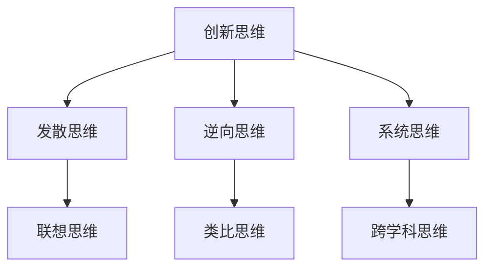
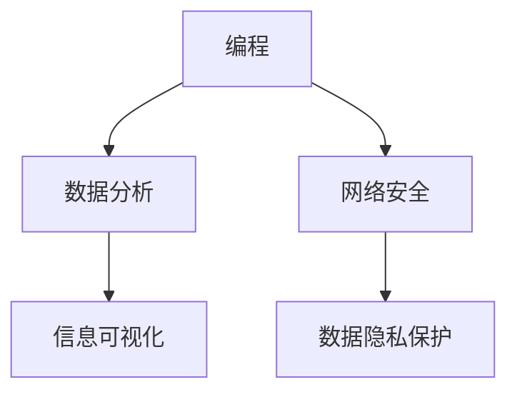
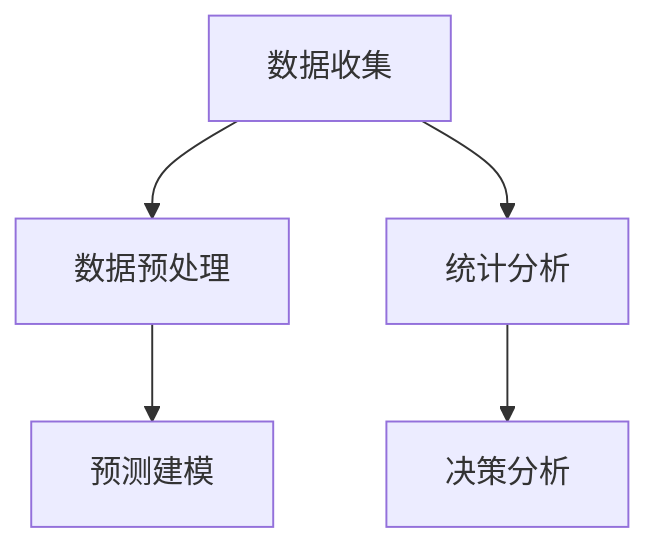
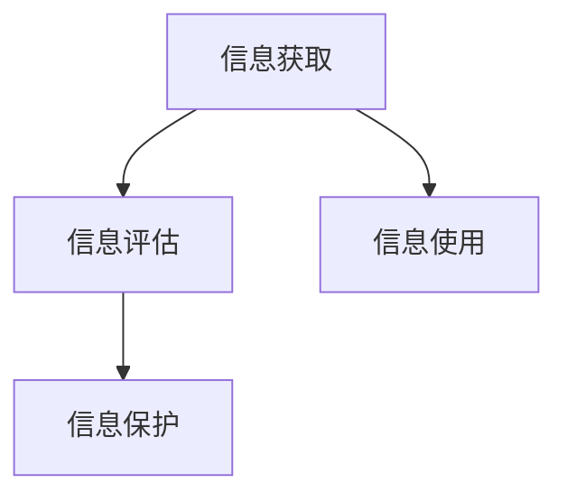

                 

### 1.3 信息时代的核心能力

在信息时代，数字素养教育不仅要传授技术技能，更重要的是培养学生的核心能力。这些核心能力是应对信息时代挑战的关键，是未来社会发展的基石。

#### 1.3.1 创新思维

创新思维是数字素养教育的核心能力之一。它不仅仅是发明新产品或新技术的能力，更是一种解决问题的方法和态度。创新思维要求学生能够从不同角度思考问题，能够灵活运用所学知识，创造出新的解决方案。

**核心概念与联系**

为了更好地理解创新思维，我们可以用Mermaid流程图来展示其核心概念与联系：



发散思维、逆向思维、系统思维和跨学科思维都是创新思维的重要构成部分。发散思维鼓励学生从多个角度看待问题，产生多个可能的解决方案；逆向思维则从结果出发，反向推导，寻找可能的解决方案；系统思维强调从整体出发，分析各个部分之间的相互作用；跨学科思维则是通过综合不同学科的知识，寻找创新的解决方案。

**核心算法原理讲解**

创新思维并没有一种固定的算法，但我们可以用一种简化版的伪代码来描述其基本流程：

```
function 创新思维(问题)
    if 问题尚未解决 then
        发散思维(问题)
        逆向思维(问题)
        系统思维(问题)
        跨学科思维(问题)
        联想思维(问题)
    end if
    返回解决方案
end function
```

通过上述流程，我们可以看到创新思维是一个迭代的过程，需要不断地从不同角度分析和思考问题，最终找到解决方案。

**数学模型和公式**

虽然创新思维本身不是一个可以量化的过程，但我们可以通过一些指标来评估学生的创新思维水平。例如，我们可以使用创新思维评分模型：

$$
InnovationScore = w_1 \cdot (发散思维评分) + w_2 \cdot (逆向思维评分) + w_3 \cdot (系统思维评分) + w_4 \cdot (跨学科思维评分) + w_5 \cdot (联想思维评分)
$$

其中，$w_1, w_2, w_3, w_4, w_5$ 是权重系数，可以根据实际情况进行调整。

**详细讲解与举例说明**

创新思维可以通过以下案例进行说明：

**案例一：太阳能电动车设计**

假设我们要设计一辆太阳能电动车，创新思维的过程如下：

1. **发散思维**：我们可以考虑使用各种不同的太阳能技术，如太阳能电池板、太阳能风扇等。
2. **逆向思维**：如果我们逆向思考，可能会考虑使用其他能源，如风力、水力等。
3. **系统思维**：我们需要考虑车辆的整体设计，包括电池容量、车速、续航时间等。
4. **跨学科思维**：我们可以考虑结合机械工程、电气工程、材料科学等多个学科的知识。
5. **联想思维**：我们可以联想其他太阳能设备，如太阳能充电器，太阳能烤箱等，来启发我们的设计。

通过上述创新思维的过程，我们可以设计出一款既节能又环保的太阳能电动车。

#### 1.3.2 信息技术应用

信息技术应用能力是数字素养教育的另一个核心能力。在信息时代，信息技术已经深入到各个领域，成为社会发展的重要驱动力。培养学生的信息技术应用能力，不仅有助于他们更好地适应社会需求，还能激发他们的创造力和创新能力。

**核心概念与联系**

信息技术应用能力的核心概念包括编程、数据分析和网络安全等。我们可以用Mermaid流程图来展示它们之间的联系：



编程是信息技术应用的基础，它涉及到如何编写程序来解决问题；数据分析则是利用编程获取和处理数据，提取有用信息；网络安全则是保护数据安全和隐私；信息可视化则是将数据以直观的方式展示出来；数据隐私保护则是确保数据在共享和使用过程中的安全。

**核心算法原理讲解**

编程、数据分析和网络安全等核心能力都可以通过伪代码进行讲解：

1. **编程伪代码**：

```
function 编程(问题)
    定义变量
    while 问题未解决 do
        读取输入数据
        执行算法
        输出结果
    end while
end function
```

2. **数据分析伪代码**：

```
function 数据分析(数据集)
    数据清洗
    数据预处理
    数据建模
    预测分析
    可视化结果
end function
```

3. **网络安全伪代码**：

```
function 网络安全(系统)
    防火墙设置
    密码加密
    数据备份
    安全审计
    恢复措施
end function
```

**数学模型和公式**

在数据分析中，我们经常使用回归模型来预测和分析数据：

$$
Y = \beta_0 + \beta_1 \cdot X_1 + \beta_2 \cdot X_2 + ... + \beta_n \cdot X_n + \epsilon
$$

其中，$Y$ 是预测目标，$X_1, X_2, ..., X_n$ 是特征变量，$\beta_0, \beta_1, ..., \beta_n$ 是模型参数，$\epsilon$ 是误差项。

**详细讲解与举例说明**

**案例一：编程**

假设我们要编写一个简单的计算器程序，可以使用以下步骤：

1. **定义变量**：输入、输出、操作符等。
2. **输入数据**：读取用户输入的数字和操作符。
3. **执行算法**：根据操作符执行相应的计算。
4. **输出结果**：显示计算结果。

以下是一个简单的Python代码示例：

```python
def calculate(num1, num2, operator):
    if operator == '+':
        return num1 + num2
    elif operator == '-':
        return num1 - num2
    elif operator == '*':
        return num1 * num2
    elif operator == '/':
        return num1 / num2
    else:
        return "Invalid operator"

num1 = float(input("Enter first number: "))
num2 = float(input("Enter second number: "))
operator = input("Enter operator: ")

result = calculate(num1, num2, operator)
print("Result:", result)
```

**案例二：数据分析**

假设我们有一组学生的考试成绩数据，需要分析考试成绩与学习时间之间的关系。我们可以使用线性回归模型进行分析：

1. **数据清洗**：去除无效数据、缺失值等。
2. **数据预处理**：标准化数据、归一化等。
3. **数据建模**：使用线性回归模型进行建模。
4. **预测分析**：根据模型预测学生的考试成绩。
5. **可视化结果**：使用图表展示分析结果。

以下是一个使用Python进行线性回归分析的基本步骤：

```python
import pandas as pd
from sklearn.linear_model import LinearRegression
import matplotlib.pyplot as plt

# 读取数据
data = pd.read_csv("exam_scores.csv")
X = data["learning_time"]
Y = data["exam_score"]

# 数据预处理
X = (X - X.mean()) / X.std()
Y = (Y - Y.mean()) / Y.std()

# 数据建模
model = LinearRegression()
model.fit(X, Y)

# 预测分析
predictions = model.predict(X)

# 可视化结果
plt.scatter(X, Y)
plt.plot(X, predictions, color='red')
plt.xlabel("Learning Time (standardized)")
plt.ylabel("Exam Score (standardized)")
plt.show()
```

**案例三：网络安全**

假设我们要保护一个网站的登录系统，需要采取以下措施：

1. **防火墙设置**：设置防火墙规则，阻止非法访问。
2. **密码加密**：使用哈希算法对用户密码进行加密。
3. **数据备份**：定期备份用户数据，防止数据丢失。
4. **安全审计**：定期进行安全审计，发现和修复安全漏洞。
5. **恢复措施**：在发生安全事件时，能够快速恢复系统。

以下是一个简单的Python代码示例，实现密码加密：

```python
import hashlib

def encrypt_password(password):
    hashed_password = hashlib.sha256(password.encode()).hexdigest()
    return hashed_password

password = input("Enter your password: ")
hashed_password = encrypt_password(password)
print("Hashed password:", hashed_password)
```

#### 1.3.3 数据分析与决策

数据分析与决策能力是数字素养教育的又一重要组成部分。随着大数据时代的到来，数据分析已经成为企业和组织做出明智决策的重要手段。培养学生数据分析与决策能力，有助于他们更好地理解数据和信息，从而做出更加准确和有效的决策。

**核心概念与联系**

数据分析与决策的核心概念包括数据收集、数据预处理、统计分析、预测建模和决策分析等。我们可以用Mermaid流程图来展示它们之间的联系：



数据收集是数据分析的基础，它涉及到如何获取数据；数据预处理是对数据进行清洗、转换等，使其适合分析和建模；统计分析是对数据进行描述性和推断性分析，以了解数据的特征和规律；预测建模是利用统计方法和机器学习算法，对未来进行预测；决策分析则是基于预测结果，制定决策策略。

**核心算法原理讲解**

数据分析与决策的过程可以用以下伪代码进行描述：

```
function 数据分析与决策(问题)
    收集数据
    预处理数据
    统计分析数据
    预测建模
    基于预测结果进行决策
end function
```

**数学模型和公式**

在数据分析中，常用的数学模型包括回归分析、时间序列分析、聚类分析和分类分析等。以下是一些基本的数学公式：

1. **回归分析**：

$$
Y = \beta_0 + \beta_1 \cdot X + \epsilon
$$

2. **时间序列分析**：

$$
Y_t = \alpha_0 + \alpha_1 \cdot Y_{t-1} + \epsilon_t
$$

3. **聚类分析**：

$$
\min \sum_{i=1}^{n} \sum_{j=1}^{k} d(x_i, c_j)^2
$$

4. **分类分析**：

$$
P(y|X) = \frac{e^{\beta_0 + \beta_1 \cdot X}}{1 + e^{\beta_0 + \beta_1 \cdot X}}
$$

**详细讲解与举例说明**

**案例一：回归分析**

假设我们要分析学生成绩与学习时间之间的关系，可以使用回归分析进行建模：

1. **数据收集**：收集学生的学习时间和考试成绩数据。
2. **数据预处理**：对数据进行清洗和预处理。
3. **统计分析**：计算平均值、方差等统计量。
4. **预测建模**：使用线性回归模型进行预测。
5. **决策分析**：根据预测结果，制定学习计划。

以下是一个简单的Python代码示例，实现线性回归分析：

```python
import pandas as pd
from sklearn.linear_model import LinearRegression

# 读取数据
data = pd.read_csv("student_data.csv")
X = data["learning_time"]
Y = data["exam_score"]

# 数据预处理
X = (X - X.mean()) / X.std()
Y = (Y - Y.mean()) / Y.std()

# 数据建模
model = LinearRegression()
model.fit(X, Y)

# 预测分析
predictions = model.predict(X)

# 可视化结果
plt.scatter(X, Y)
plt.plot(X, predictions, color='red')
plt.xlabel("Learning Time (standardized)")
plt.ylabel("Exam Score (standardized)")
plt.show()
```

**案例二：时间序列分析**

假设我们要分析某公司过去一年的月销售额，可以使用时间序列分析方法：

1. **数据收集**：收集过去一年的月销售额数据。
2. **数据预处理**：对数据进行清洗和预处理。
3. **统计分析**：计算平均值、趋势等统计量。
4. **预测建模**：使用ARIMA模型进行预测。
5. **决策分析**：根据预测结果，制定销售策略。

以下是一个简单的Python代码示例，实现ARIMA模型：

```python
import pandas as pd
from statsmodels.tsa.arima.model import ARIMA

# 读取数据
data = pd.read_csv("sales_data.csv")
sales = data["monthly_sales"]

# 数据预处理
sales = sales.diff().dropna()

# 数据建模
model = ARIMA(sales, order=(1, 1, 1))
model.fit()

# 预测分析
predictions = model.forecast(steps=12)

# 可视化结果
plt.plot(sales)
plt.plot(predictions, color='red')
plt.xlabel("Month")
plt.ylabel("Sales")
plt.show()
```

通过上述案例，我们可以看到数据分析与决策在现实中的应用。这些案例不仅帮助学生理解数据分析的基本原理，还能提高他们的实际操作能力。

#### 1.3.4 信息素养

信息素养是数字素养教育的重要组成部分，它不仅包括如何查找、评估和使用信息，还包括如何保护个人信息和网络安全。在信息时代，信息素养是每个人都应该具备的基本能力。

**核心概念与联系**

信息素养的核心概念包括信息获取、信息评估、信息使用和信息保护。我们可以用Mermaid流程图来展示它们之间的联系：



信息获取是指查找和收集信息；信息评估是指评估信息的准确性和可靠性；信息使用是指如何有效利用信息；信息保护是指保护个人信息和网络安全。

**核心算法原理讲解**

信息素养的算法原理主要包括信息检索算法、信息评估算法和信息保护算法。以下是一个简化版的伪代码：

```
function 信息素养(需求)
    获取信息
    评估信息
    使用信息
    保护信息
end function
```

**数学模型和公式**

信息素养中的数学模型主要包括信息熵、信息增益和决策树等。以下是一个简单的数学公式示例：

1. **信息熵**：

$$
H(X) = -\sum_{i=1}^{n} p(x_i) \cdot \log_2(p(x_i))
$$

2. **信息增益**：

$$
Gain(D, a) = \sum_{v \in V(a)} \sum_{x \in \{x_i | a=v\}} p(x) \cdot \log_2(p(x))
$$

3. **决策树**：

$$
\text{ID3}(\text{数据集}, \text{特征集}) = \\
\begin{cases}
创建叶子节点，返回 \\
\text{选择最大信息增益的特征} \\\\
\text{对特征进行分割，生成子数据集} \\
\text{递归调用ID3算法}
\end{cases}
$$

**详细讲解与举例说明**

**案例一：信息获取**

假设我们要查找某个学术期刊的文章，可以使用以下步骤：

1. **获取信息**：使用搜索引擎或学术数据库查找相关文章。
2. **评估信息**：评估文章的标题、摘要和引用次数等，判断其是否相关。
3. **使用信息**：阅读文章，提取有用信息。
4. **保护信息**：确保不泄露个人身份信息，遵守学术规范。

以下是一个简单的Python代码示例，实现信息检索：

```python
import requests
from bs4 import BeautifulSoup

# 获取网页内容
url = "https://www.google.com/search?q=information+retrieval"
response = requests.get(url)
html = response.text

# 解析网页内容
soup = BeautifulSoup(html, 'html.parser')
articles = soup.find_all('a')

# 提取文章标题
titles = [article.text for article in articles]

# 打印文章标题
for title in titles:
    print(title)
```

**案例二：信息评估**

假设我们要评估某个投资项目的风险，可以使用以下步骤：

1. **获取信息**：收集项目的财务数据、市场数据等。
2. **评估信息**：使用财务分析、市场分析等方法，评估项目的风险。
3. **使用信息**：根据评估结果，决定是否投资。
4. **保护信息**：确保不泄露项目机密信息。

以下是一个简单的Python代码示例，实现信息评估：

```python
import pandas as pd

# 读取数据
data = pd.read_csv("project_data.csv")

# 财务分析
data['ROI'] = (data['revenue'] - data['cost']) / data['initial_investment']

# 市场分析
data['market_share'] = data['sales'] / data['market_size']

# 风险评估
data['risk'] = data['ROI'] * data['market_share']

# 打印风险评估结果
print(data[['ROI', 'market_share', 'risk']])
```

**案例三：信息保护**

假设我们要保护某公司的客户信息，可以使用以下步骤：

1. **获取信息**：收集客户信息，包括姓名、电话、邮箱等。
2. **评估信息**：评估信息的重要性，确定保护措施。
3. **使用信息**：在业务过程中，合理使用客户信息，避免泄露。
4. **保护信息**：使用加密技术、防火墙等技术手段，保护客户信息安全。

以下是一个简单的Python代码示例，实现信息保护：

```python
import hashlib

# 加密函数
def encrypt_password(password):
    hashed_password = hashlib.sha256(password.encode()).hexdigest()
    return hashed_password

# 解密函数
def decrypt_password(hashed_password):
    decrypted_password = hashlib.sha256(hashed_password.encode()).hexdigest()
    return decrypted_password

# 测试加密解密
password = input("Enter your password: ")
hashed_password = encrypt_password(password)
print("Hashed password:", hashed_password)

decrypted_password = decrypt_password(hashed_password)
print("Decrypted password:", decrypted_password)
```

通过上述案例，我们可以看到信息素养在现实中的应用。这些案例不仅帮助学生理解信息素养的基本原理，还能提高他们的实际操作能力。

### 1.3.5 综合案例：数字素养教育在实践中的应用

为了更好地理解数字素养教育在实践中的应用，我们可以通过以下综合案例来探讨。

**案例背景**

某高中开展了一项名为“数字素养提升计划”的教育项目，旨在提高学生的数字素养能力。项目涵盖了编程、数据分析、网络安全和信息素养等多个方面。

**步骤一：项目规划**

1. **目标设定**：明确项目目标，包括提高学生的编程能力、数据分析能力、网络安全意识和信息素养水平。
2. **课程设计**：根据目标，设计相应的课程，包括编程基础、数据分析入门、网络安全基础和信息素养培训。
3. **资源准备**：准备教学资源，包括教材、在线课程、实验平台等。

**步骤二：课程实施**

1. **编程课程**：教授Python编程语言，通过实际项目，如制作小游戏、数据分析工具等，提高学生的编程能力。
2. **数据分析课程**：教授基本的统计方法和数据分析工具，如Pandas、Matplotlib等，通过实际数据分析项目，如学校成绩分析、市场调研等，提高学生的数据分析能力。
3. **网络安全课程**：教授网络安全基础知识，如密码学、防火墙、病毒防护等，通过实际案例，如网络攻击分析、网络安全演习等，提高学生的网络安全意识。
4. **信息素养课程**：教授信息检索、信息评估、信息保护等知识，通过实际案例，如学术论文写作、网络信息识别等，提高学生的信息素养水平。

**步骤三：评估与反馈**

1. **形成性评估**：在教学过程中，通过随堂测验、小组讨论、项目报告等形式，评估学生的学习情况。
2. **总结性评估**：在课程结束后，通过考试、项目展示等形式，评估学生的整体表现。
3. **反馈与改进**：根据评估结果，收集学生的反馈，调整课程内容和教学方法，以提高教学效果。

**案例分析与启示**

通过上述案例，我们可以看到数字素养教育在实践中的应用。以下是一些关键点和启示：

1. **理论与实践相结合**：课程设计注重理论与实践的结合，通过实际项目和案例分析，提高学生的实际操作能力。
2. **跨学科教学**：课程涵盖了多个学科领域，如编程、数据分析、网络安全和信息素养等，有助于培养学生的跨学科思维和创新能力。
3. **个性化学习**：通过形成性评估和反馈机制，学生可以根据自己的学习进度和需求，调整学习策略，实现个性化学习。
4. **持续改进**：教学过程中，不断收集学生和教师的反馈，根据反馈进行调整和改进，以提高教学效果。

**项目小结**

“数字素养提升计划”项目在实施过程中，取得了显著的成果。学生不仅在编程、数据分析、网络安全和信息素养等方面有了显著提高，还培养了创新思维和问题解决能力。项目实施过程中，我们也发现了一些问题和挑战，如部分学生基础知识薄弱、课程资源不足等。针对这些问题，我们计划在未来进一步改进和完善项目，提高学生的数字素养水平。

**最佳实践 tips**

1. **充分利用在线资源**：利用在线课程、开源项目等资源，丰富教学内容，提高教学效果。
2. **引入行业案例**：结合实际行业案例，让学生了解数字素养在现实中的应用，提高他们的实际操作能力。
3. **加强教师培训**：定期组织教师培训，提高教师的数字素养和教学水平，以更好地指导学生。

通过以上综合案例，我们可以看到数字素养教育在实践中的应用和成效。未来，随着信息技术的不断发展，数字素养教育将越来越重要，我们期待更多的教育项目能够关注和推动数字素养教育的发展。

