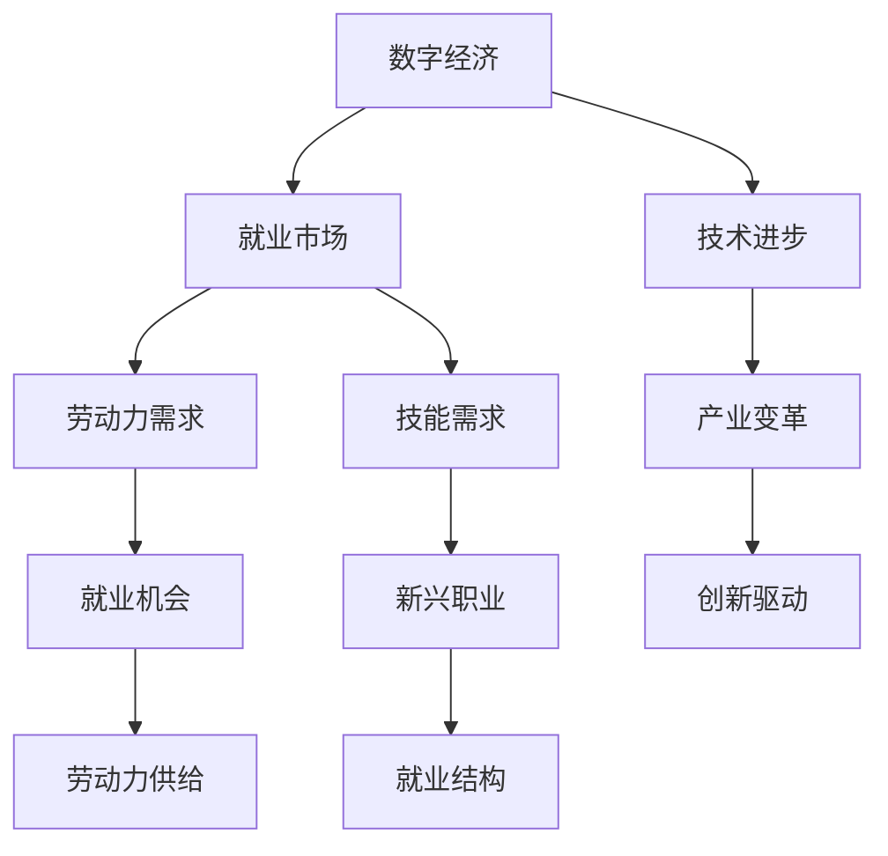

                 

## 文章标题：数字经济中的就业变革：新兴职业与技能需求

> 关键词：数字经济、就业变革、新兴职业、技能需求、技术进步

> 摘要：本文深入探讨了数字经济背景下的就业变革，分析了新兴职业与技能需求的发展趋势。首先，我们概述了数字经济的定义及其对就业市场的深远影响。随后，文章详细探讨了数字经济中的新兴职业及其技能需求，并通过案例分析和数据支持，提出了应对就业变革的策略与建议。

## 文章标题：数字经济中的就业变革：新兴职业与技能需求

数字经济是现代经济的核心驱动力，它以信息技术和数据资源为基础，推动着经济结构、生产方式和消费模式的深刻变革。随着互联网、人工智能、大数据等技术的迅猛发展，数字经济已成为全球经济增长的重要引擎。然而，这一变革也对就业市场带来了巨大的冲击和挑战，引发了就业结构的深刻变化和技能需求的新趋势。

本文旨在探讨数字经济背景下的就业变革，特别是新兴职业与技能需求的变化。文章首先回顾了数字经济的定义和特征，分析了其对就业市场的影响。接着，我们详细探讨了数字经济中的新兴职业，包括数据分析师、人工智能工程师、区块链开发者等，并分析了这些职业所需的技能。最后，通过案例分析和数据支持，提出了应对就业变革的策略与建议，以期为政策制定者、企业和个人提供有益的参考。

## 第一部分：数字经济与就业概述

### 核心概念与联系：数字经济的定义与就业市场的关系

数字经济的核心概念是指以信息技术和数据资源为基础，通过数字化手段进行生产、分配和消费的经济活动。其特征包括高度依赖信息技术、数据资源丰富、快速创新和高度互联互通。这些特征对就业市场产生了深远的影响，主要体现在以下几个方面：

1. **就业结构的变革**：数字经济催生了大量新兴职业，如数据分析师、人工智能工程师、区块链开发者等，同时也淘汰了一些传统职业。这种就业结构的变革，使得劳动力市场的需求与供给之间出现了新的矛盾。

2. **技能需求的升级**：数字经济的发展对劳动者的技能要求不断提高，不仅需要具备传统的职业技能，还需要掌握新兴技术，如编程、数据分析、人工智能等。这要求劳动者进行持续的学习和技能升级。

3. **劳动力市场的动态变化**：数字经济使得劳动力市场更加灵活，就业形式更加多样化，包括远程办公、兼职、自由职业等。同时，劳动力的流动性增加，使得劳动力市场更加动态化。

4. **全球化的加速**：数字经济促进了全球经济的深度融合，跨国公司的运营模式发生了变化，跨国劳动力流动也变得更加频繁。这为就业市场带来了新的机遇和挑战。

为了更好地理解数字经济与就业市场之间的关系，我们可以通过以下Mermaid流程图来展示其核心概念和联系：

在数字经济中，技术进步是推动产业变革和创新驱动的关键因素。产业变革又直接导致了就业结构的变革，进而影响劳动力需求和供给。同时，技能需求的升级促使新兴职业的产生，这些新兴职业又进一步推动了就业结构的变革。这一过程形成了一个动态的循环，不断地推动着就业市场的变革。

通过上述核心概念和联系的阐述，我们可以看出，数字经济对就业市场的影响是多方面且深远的。理解这些影响对于政策制定者、企业以及劳动者都至关重要，因为它不仅关系到经济发展的质量，也关系到劳动者的就业机会和职业发展。

### 数字经济概述

#### 1.1 数字经济的定义与发展历程

数字经济，作为一个新兴的经济概念，其定义在不同文献中有不同的表述，但其核心内容基本一致。一般来说，数字经济是指以数字化的信息和知识为关键生产要素，以现代信息网络为重要载体，通过信息通信技术的深度应用，促进经济结构优化、发展方式转变和增长动力转换的经济活动。具体而言，数字经济包括互联网经济、物联网经济、大数据经济、云计算经济、人工智能经济等子领域。

数字经济的发展历程可以追溯到20世纪末和21世纪初。其早期阶段可以追溯到互联网的兴起和普及，这标志着信息通信技术的快速发展。1990年代，互联网的普及使得信息传播速度大幅提升，电子商务、在线支付等新兴商业模式开始出现，这标志着数字经济的初步形成。进入21世纪，随着互联网技术的不断进步，特别是移动互联网、大数据、云计算、人工智能等技术的快速发展，数字经济进入了快速发展的阶段。

#### 1.2 数字经济的重要特征

数字经济具有以下几个重要特征：

1. **高度信息化**：数字经济以信息资源为主要驱动力，信息技术的应用贯穿于生产、分配、交换和消费的全过程。这种高度信息化使得数据成为新的生产要素，对经济增长的贡献显著提升。

2. **网络化**：数字经济以互联网为基础设施，通过信息网络实现全球范围内的互联互通。这种网络化特性不仅提升了资源配置效率，还推动了全球经济的深度融合。

3. **智能化**：随着人工智能技术的不断发展，数字经济正在向智能化方向转型。人工智能技术的应用，不仅提高了生产效率，还改变了人们的消费方式，促进了个性化服务的发展。

4. **创新驱动**：数字经济的发展离不开技术创新。技术创新是数字经济的重要推动力，推动了新兴产业的快速崛起和传统产业的转型升级。

5. **全球化**：数字经济打破了地域限制，使得全球范围内的经济活动更加紧密地联系在一起。全球化加速了技术、资本和人才的流动，为全球经济带来了新的机遇和挑战。

#### 1.3 数字经济对就业市场的影响

数字经济对就业市场的影响是深远而复杂的，主要表现在以下几个方面：

1. **就业结构的变革**：数字经济催生了大量新兴职业，如数据分析师、人工智能工程师、区块链开发者等。同时，一些传统职业因技术进步而逐渐消失。这种就业结构的变革，要求劳动者具备更高的技能和更广泛的知识。

2. **技能需求的升级**：数字经济的发展对劳动者的技能需求提出了新的要求。传统的职业技能已不足以满足数字经济的需要，劳动者需要掌握新兴技术，如编程、数据分析、人工智能等。

3. **劳动力市场的动态变化**：数字经济使得劳动力市场更加灵活和多元化，就业形式更加多样化，包括远程办公、兼职、自由职业等。同时，劳动力的流动性增加，使得劳动力市场更加动态化。

4. **全球化的加速**：数字经济促进了全球经济的深度融合，跨国公司的运营模式发生了变化，跨国劳动力流动也变得更加频繁。这为就业市场带来了新的机遇，同时也带来了新的挑战。

总之，数字经济的发展对就业市场带来了巨大的冲击和挑战，但同时也为劳动者提供了新的机遇。理解和应对这些影响，对于政策制定者、企业和劳动者都具有重要意义。

#### 1.4 数字经济与就业关系分析

数字经济的快速发展对就业市场产生了深远的影响，具体体现在以下几个方面：

**1. 数字经济对就业结构的影响**

数字经济对就业结构的影响是显而易见的。首先，数字经济催生了大量新兴职业，如数据分析师、人工智能工程师、区块链开发者等。这些新兴职业不仅填补了劳动力市场的空缺，还提升了就业市场的多样性。其次，数字经济使得某些传统职业逐渐消失或转型。例如，随着自动化和人工智能的普及，许多传统制造业和零售业的职位正在减少。这迫使劳动者适应新的职业环境，学习新的技能。

**2. 数字经济对就业质量的影响**

数字经济的兴起不仅改变了就业结构，还对就业质量产生了重要影响。一方面，数字经济提供了更多高质量的工作机会。例如，数据科学家、人工智能工程师等职业通常具有较高的薪酬和良好的职业发展前景。另一方面，数字经济也提升了劳动者的工作效率和满意度。通过数字化工具，劳动者可以更灵活地安排工作时间，提高工作效率。此外，数字经济还促进了工作方式的变革，如远程办公和远程协作的普及，使得工作地点不再成为限制劳动者的因素。

**3. 数字经济对劳动力市场动态的影响**

数字经济的快速发展改变了劳动力市场的动态。首先，劳动力市场的流动性增加。随着数字化工具的普及，劳动者可以更加方便地寻找新的工作机会，不再受地域限制。其次，劳动力市场的灵活性提高。数字经济的发展使得兼职、远程办公和自由职业等灵活就业形式成为可能，这为劳动者提供了更多的就业选择。最后，数字经济的全球化加速了跨国劳动力流动，为劳动力市场带来了新的机遇和挑战。

总的来说，数字经济对就业市场的影响是全面而深远的。它不仅改变了就业结构，提升了就业质量，还影响了劳动力市场的动态。理解和应对这些变化，对于政策制定者、企业和劳动者都具有重要意义。

#### 1.5 数字经济的未来发展趋势

随着数字技术的不断进步和应用的深入，数字经济在未来将继续呈现出几个显著的发展趋势：

**1. 技术融合与创新**

未来数字经济的发展将更加依赖于技术融合与创新。例如，人工智能、大数据、物联网、区块链等技术的集成应用，将推动传统产业的数字化和智能化转型。这种技术融合不仅提高了生产效率，还创造了新的商业模式和就业机会。

**2. 数字经济的全球化**

数字经济具有天然的国际性，未来其全球化趋势将更加明显。随着跨境电子商务、全球供应链和数据共享的发展，数字经济将打破地理和文化的界限，促进全球经济的深度融合。这将带来更多的国际就业机会，同时也要求劳动力具备跨文化的沟通能力和全球视野。

**3. 产业数字化升级**

未来，各行业的数字化升级将深入进行。制造业、服务业、农业等传统产业将通过数字化技术实现转型升级，提升整体生产力和竞争力。这种升级不仅会创造新的就业机会，还会提升现有就业岗位的技术含量和附加值。

**4. 新兴产业的崛起**

数字经济将进一步催生新兴产业的发展，如人工智能、云计算、区块链、虚拟现实等。这些新兴产业将成为未来经济增长的重要动力，带动相关产业链的发展，创造大量新兴职业。

**5. 数字技能需求的持续增长**

随着数字经济的发展，对数字技能的需求将持续增长。未来，劳动者需要不断学习新的技能，如编程、数据分析、人工智能等，以适应不断变化的工作环境。教育和培训体系将面临新的挑战，需要不断创新以适应数字经济发展的需求。

**6. 政策与监管的完善**

为了应对数字经济的快速发展，政策制定者和监管机构将不断完善相关政策和法规，确保数字经济的健康发展。这包括数据隐私保护、网络安全、公平竞争等方面的政策制定。

综上所述，数字经济的未来发展趋势将充满机遇与挑战。理解并适应这些趋势，对于政策制定者、企业以及劳动者都具有重要意义。通过技术创新、产业升级、人才培养和政策支持，我们可以更好地应对数字经济带来的变革，实现经济的可持续发展。

#### 1.6 本书的结构与内容安排

本书旨在深入探讨数字经济背景下的就业变革，特别是新兴职业与技能需求的发展趋势。为了系统地分析这一主题，本书分为五个主要部分：

**第一部分：数字经济与就业概述**

本部分将介绍数字经济的定义、特征及其对就业市场的影响。通过阐述数字经济的核心概念和重要特征，我们为后续章节的分析奠定基础。此外，还将探讨数字经济与就业市场之间的复杂关系，以及其对就业结构和劳动力需求的影响。

**第二部分：数字经济中的新兴职业**

本部分将详细探讨数字经济背景下的新兴职业，包括数据分析师、人工智能工程师、区块链开发者等。我们将分析这些职业的产生背景、发展历程以及未来的发展趋势。同时，还将探讨这些职业所需的技能和素质，为劳动者提供明确的职业发展路径。

**第三部分：数字经济中的技能需求**

本部分将深入探讨数字经济对劳动者技能需求的变化。我们将分析技术进步对技能需求的影响，以及不同职业对技能的不同要求。此外，还将探讨未来技能需求的发展趋势，为劳动者提供持续学习的方向和策略。

**第四部分：数字经济中的就业变革案例分析**

本部分将通过具体案例，分析数字经济对就业市场的实际影响。我们将选择具有代表性的企业或行业，详细剖析其就业变革的过程和成果。通过这些案例，我们希望为政策制定者、企业和劳动者提供实际的操作经验和借鉴。

**第五部分：就业变革的应对策略与建议**

本部分将提出应对数字经济背景下就业变革的多种策略与建议。我们将从政策层面、企业层面和个人层面分别提出对策，以帮助各方更好地适应和应对就业市场的变革。此外，还将探讨社会层面的应对策略，以促进整个社会的共同发展。

通过以上五个部分的系统分析，本书旨在为读者提供一个全面、深入的数字经济与就业变革的理解框架，帮助各方更好地应对未来的挑战和机遇。

## 第二部分：数字经济中的新兴职业

### 2.1 新兴职业概述

#### 2.1.1 新兴职业的概念

新兴职业是指在数字经济发展过程中，随着新技术的应用和产业结构的调整而出现的职业。这些职业通常需要较高的技术含量和创新能力，不仅填补了劳动力市场的空白，还推动了经济的持续发展。新兴职业的产生与数字技术的进步密不可分，如人工智能、大数据、区块链、物联网等技术的广泛应用，使得许多传统职业发生了变革，同时也催生了大量新的职业。

#### 2.1.2 新兴职业的特征

新兴职业具有以下显著特征：

1. **技术依赖性**：新兴职业通常依赖于先进的技术，如编程、数据分析、人工智能等。这些职业要求从业者具备深厚的专业知识和技能，能够熟练运用数字化工具和技术。

2. **跨界融合性**：新兴职业往往涉及多个学科和领域的知识，需要具备跨学科的综合能力。例如，人工智能工程师不仅需要掌握编程和算法知识，还需要了解心理学、认知科学等领域的知识。

3. **动态变化性**：新兴职业随着技术的进步和市场需求的变化而不断演变。例如，区块链技术的发展催生了区块链开发者的职业，但这一职业的需求和技能要求也在不断变化。

4. **高附加值**：新兴职业通常具有较高的附加值，能够为企业和个人创造更多的价值。例如，数据分析师通过对大数据的分析，可以帮助企业制定更精准的市场策略，从而提高企业的竞争力。

#### 2.1.3 新兴职业的分类

数字经济背景下的新兴职业种类繁多，根据其技术特点和应用领域，可以大致分为以下几类：

1. **技术工程师类**：包括人工智能工程师、数据工程师、区块链工程师等。这些职业通常需要具备深厚的编程技能和系统设计能力，能够开发、维护和优化数字化系统。

2. **数据分析类**：包括数据分析师、数据科学家、商业智能分析师等。这些职业主要负责数据收集、处理、分析和解释，帮助企业做出数据驱动的决策。

3. **数字内容创作类**：包括数字营销专家、虚拟现实设计师、人工智能内容创作者等。这些职业利用数字技术创作和传播内容，提升企业的品牌价值和市场影响力。

4. **数字安全类**：包括网络安全工程师、信息安全分析师、隐私保护专家等。这些职业致力于保护企业和个人数据的安全，防范网络攻击和数据泄露。

5. **新兴服务类**：包括数字化咨询顾问、数字化转型专家、智能客服等。这些职业通过提供专业的数字化解决方案和服务，帮助企业实现数字化转型。

### 2.2 新兴职业的产生与发展

#### 2.2.1 新兴职业的产生背景

新兴职业的产生背景可以追溯到数字经济的快速发展和技术创新的不断突破。随着互联网、大数据、人工智能、物联网等技术的广泛应用，传统行业正在经历深刻的变革，这催生了大量新的职业需求。例如，大数据技术的应用使得数据分析师成为企业争相招募的人才；人工智能的突破使得人工智能工程师成为炙手可热的专业人才。

#### 2.2.2 新兴职业的发展历程

1. **初期阶段**：在数字经济的初期，一些新兴职业如程序员、网络管理员等开始出现。随着互联网的普及，这些职业的需求逐渐增加，逐渐成为劳动力市场的重要组成部分。

2. **快速发展阶段**：随着大数据、人工智能、物联网等技术的发展，新兴职业的数量和种类迅速增加。例如，数据分析师、人工智能工程师、区块链开发者等职业在这一阶段迅速崛起，成为数字经济的重要组成部分。

3. **成熟阶段**：随着技术的进一步成熟和应用的深入，新兴职业的数量和种类将更加丰富，新兴职业的稳定性也将进一步增强。例如，数字内容创作者、智能客服、网络安全工程师等职业将在数字经济中扮演越来越重要的角色。

#### 2.2.3 新兴职业的未来趋势

1. **专业化与细分**：新兴职业将更加专业化，职业种类将更加细分。例如，数据分析师可能进一步细分为大数据分析师、商业智能分析师等。

2. **技能需求升级**：随着技术的不断进步，新兴职业对技能需求的要求将不断提高。从业者需要不断学习新技术，提升自身技能，以适应职业发展的需求。

3. **跨界融合**：新兴职业将与其他领域产生更多跨界融合。例如，人工智能技术将深入到医疗、教育、金融等领域，催生新的职业需求。

4. **全球发展**：随着数字经济的全球化，新兴职业将不仅限于某个国家或地区，而是全球范围内的职业需求。这将为全球劳动力市场带来新的机遇和挑战。

5. **社会责任与伦理**：随着新兴职业的兴起，职业责任和伦理问题也将受到更多关注。例如，数据隐私保护、人工智能伦理等将成为新兴职业发展的重要议题。

综上所述，新兴职业的产生和发展是数字经济背景下劳动力市场变革的重要体现。了解新兴职业的产生背景、发展历程和未来趋势，对于劳动者、企业和政策制定者都具有重要意义。

#### 2.3 新兴职业的技能需求

数字经济背景下，新兴职业的技能需求呈现出多样化和专业化特点。随着技术的不断进步和产业的升级，不同新兴职业所需的技能也在不断演变。以下将分析几个典型新兴职业的技能需求，并提供相应的技能提升策略。

**1. 数据分析师**

数据分析师是数字经济中不可或缺的职业，他们通过对数据的收集、清洗、分析和解释，为企业提供决策支持。主要技能需求包括：

- **数据分析工具**：熟练使用Python、R、SQL等数据分析工具，掌握数据可视化工具如Tableau、Power BI等。
- **统计知识**：具备统计学基础，能够运用统计方法进行分析和预测。
- **数据挖掘技能**：掌握数据挖掘算法，如聚类、分类、回归分析等，能够从大量数据中发现有价值的信息。

**技能提升策略**：

- **在线课程和认证**：报名参加数据分析相关的在线课程，如Coursera、edX等平台上的数据科学课程。
- **实际项目经验**：参与实际数据项目，通过实践提升数据分析技能。
- **参与社区和竞赛**：加入数据分析社区，参与数据分析竞赛，与他人交流学习。

**2. 人工智能工程师**

人工智能工程师负责开发和应用人工智能技术，构建智能系统。主要技能需求包括：

- **编程语言**：熟练掌握Python、C++等编程语言，熟悉机器学习框架如TensorFlow、PyTorch。
- **机器学习算法**：了解常见的机器学习算法，如决策树、神经网络、支持向量机等。
- **数学知识**：具备概率论、线性代数、微积分等数学基础。

**技能提升策略**：

- **专业书籍和教程**：阅读《深度学习》、《机器学习》等专业书籍，系统学习人工智能相关知识。
- **开源项目参与**：参与开源人工智能项目，通过实际编码提升技能。
- **在线实验室**：使用在线机器学习平台，如Google Colab、Kaggle等，进行实际操作和练习。

**3. 区块链开发者**

区块链开发者负责设计和开发区块链系统，确保数据的安全性和透明性。主要技能需求包括：

- **区块链技术原理**：熟悉区块链的基本原理，如分布式账本、智能合约等。
- **编程语言**：熟练掌握Solidity、JavaScript等编程语言。
- **加密算法**：了解常见的加密算法和哈希算法。

**技能提升策略**：

- **在线课程和认证**：参加区块链相关的在线课程和认证，如Blockchain Academy、Ethereum Foundation等。
- **实践项目**：参与实际的区块链项目，通过实践提升开发技能。
- **区块链社区参与**：加入区块链社区，了解行业动态，与其他开发者交流学习。

**4. 数字营销专家**

数字营销专家负责利用数字技术提升品牌知名度和市场影响力。主要技能需求包括：

- **数字营销工具**：熟练使用Google Analytics、SEO工具、社交媒体平台等数字营销工具。
- **数据分析技能**：掌握数据分析工具和技能，如Google Data Studio、Tableau等。
- **创意思维**：具备良好的创意思维和内容创作能力。

**技能提升策略**：

- **在线课程和认证**：参加数字营销相关的在线课程和认证，如Google数字营销课程、HubSpot认证等。
- **实际项目经验**：参与实际数字营销项目，提升实践能力。
- **参与社区和活动**：加入数字营销社区，参加行业活动，拓展人脉和知识。

总之，新兴职业的技能需求不断演变，劳动者需要不断学习和提升自身技能，以适应数字经济的发展需求。通过系统的学习和实践，劳动者可以更好地应对职业发展的挑战，实现自身价值的最大化。

#### 2.4 技能需求的变化趋势

数字经济背景下，技能需求正经历着显著的变化，这些变化不仅受到技术进步的影响，也受到市场动态和行业发展的驱动。以下将分析这些变化的主要趋势，并探讨其对劳动力市场和就业结构的影响。

**1. 技能需求多元化**

随着数字技术的快速发展，新的技术领域不断涌现，导致技能需求越来越多元化。例如，人工智能、区块链、云计算等前沿技术的兴起，催生了大量新的职业需求，如数据科学家、人工智能工程师、区块链开发者等。这些新兴职业要求劳动者具备跨学科的知识和技能，如编程、数据分析、算法设计等。这种多元化趋势要求劳动者不仅需要掌握传统技能，还需具备适应新技术的能力。

**2. 技能需求的动态性**

技能需求的变化具有明显的动态性，随着技术的不断迭代和市场需求的不断变化，技能需求也在持续演变。例如，5G技术的普及和物联网的快速发展，使得相关的技能需求迅速增长。相反，一些传统技能由于技术进步而逐渐减少。这种动态性要求劳动者具备快速学习新技能和适应新环境的能力，以保持竞争力。

**3. 技能需求的升级**

随着技术的进步，许多职业对技能的需求正在从基础技能向高级技能和专业知识升级。例如，数据分析师不仅需要掌握数据处理和分析的基本技能，还需要具备高级统计建模和机器学习的能力。人工智能工程师则需掌握深度学习和神经网络的高级知识。这种升级趋势要求劳动者不断学习和提升自身技能，以适应更高的职业要求。

**4. 技能需求的全球性**

数字经济的全球化加速了技能需求的全球性变化。跨国公司的运营和全球供应链的整合，使得劳动力市场更加紧密地联系在一起。这不仅带来了跨国就业机会，也要求劳动者具备跨文化沟通能力和全球视野。例如，国际商务谈判、跨文化管理技能等在全球劳动力市场中越来越重要。

**5. 技能需求的本土化**

尽管技能需求具有全球性，但本地市场的特殊需求也在不断出现。例如，一些地区由于特定产业的发展，对特定技能的需求量巨大。例如，中国的电商行业快速发展，催生了大量对电商运营和数据分析技能的需求。这种本土化趋势要求政策制定者和企业关注本地市场的特殊需求，制定相应的培训和发展计划。

**对劳动力市场和就业结构的影响**

技能需求的变化对劳动力市场和就业结构产生了深远的影响：

1. **就业机会的创造与消失**：技能需求的变化创造了大量新兴职业机会，如数据分析师、人工智能工程师等。同时，一些传统职业因技术进步而逐渐消失，如制造业中的低技能劳动密集型岗位。这种变化要求劳动者具备适应新职业的能力，同时也促使劳动力市场更加灵活。

2. **劳动力市场的流动性**：技能需求的动态性增加了劳动力市场的流动性。劳动者需要不断适应新的技能需求，这促使他们更加频繁地更换工作和职业路径。

3. **职业发展的多样性**：技能需求的多元化为劳动者提供了更多的职业发展机会。通过不断提升技能，劳动者可以在多个领域找到适合自己的职业路径。

4. **教育体系的挑战与机遇**：技能需求的变化对教育体系提出了新的挑战，同时也带来了机遇。教育机构需要不断更新课程内容，以适应技能需求的变化，为学生提供更具针对性的培训。

综上所述，数字经济背景下的技能需求变化趋势对劳动力市场和就业结构产生了深远影响。理解这些变化趋势，对于政策制定者、企业和劳动者都具有重要意义。通过不断学习和适应，劳动者可以更好地应对技能需求的变化，实现职业发展的目标。

### 3. 技能培训与教育体系

#### 3.1 技能培训的现状与挑战

在数字经济迅猛发展的背景下，技能培训已成为提升劳动者竞争力的重要手段。当前，全球范围内的技能培训呈现出以下现状：

1. **线上培训的兴起**：随着互联网技术的普及，线上培训成为技能培训的重要形式。各种在线教育平台如Coursera、edX、Udemy等，提供了丰富的课程资源，使学习者可以随时随地获取最新的知识和技能。

2. **职业培训的多元化**：各类职业培训机构和学校纷纷开设与数字经济相关的课程，如编程、数据分析、人工智能等。这些课程旨在满足劳动力市场对新兴技能的需求，提高劳动者的就业竞争力。

3. **政府支持力度加大**：许多国家政府意识到技能培训的重要性，纷纷出台相关政策，支持劳动者参加技能培训。例如，提供培训补贴、设立培训基金等，以促进技能培训的普及。

然而，技能培训在发展过程中也面临诸多挑战：

1. **培训质量参差不齐**：市场上存在着大量质量参差不齐的培训课程，一些课程内容陈旧、教学方法单一，难以满足劳动者的实际需求。

2. **技能供需错配**：技能培训课程的设计往往滞后于市场需求的变化，导致培训内容与实际工作需求之间存在差距，劳动者学到的技能难以直接应用到工作中。

3. **学习资源不均衡**：不同地区和群体的劳动者获取培训资源的条件存在差异，一些偏远地区和经济落后地区的劳动者难以享受到优质的培训资源。

4. **劳动者参与度低**：由于工作压力、家庭负担等原因，一些劳动者对参加技能培训的热情不高，参与度较低。

#### 3.2 教育体系的改革与创新

为了应对技能培训的现状和挑战，教育体系需要进行改革与创新，以更好地适应数字经济的需求：

1. **课程内容的更新**：教育机构应密切关注市场需求，及时更新课程内容，确保课程与实际工作需求紧密对接。例如，增加编程、数据分析、人工智能等新兴技术领域的课程，减少过时或不实用的课程。

2. **教学方法创新**：传统的教学方法往往注重知识传授，而忽视实践能力培养。教育机构应采用项目制学习、翻转课堂等创新教学方法，提高学生的实践能力和创新思维。

3. **校企联合**：教育机构应与企业和行业合作，开展校企合作项目，共同设计课程和培养方案，确保培训内容与实际工作需求一致。

4. **在线教育平台优化**：在线教育平台应提供更丰富的课程资源和互动功能，增强学生的学习体验和效果。同时，平台应加强对课程质量的管理，确保课程内容的实用性和前沿性。

5. **终身教育体系建设**：建立终身教育体系，鼓励劳动者在工作过程中持续学习和提升技能。政府和企业应提供相应的支持和激励政策，如培训补贴、职业发展基金等。

#### 3.3 技能培训与教育的发展趋势

未来，技能培训和教育的 发展趋势将呈现以下几个方向：

1. **个性化学习**：随着人工智能和大数据技术的发展，个性化学习将成为主流。教育机构和在线教育平台将通过数据分析，为学习者提供个性化的学习路径和资源，提高学习效果。

2. **跨界融合**：技能培训和教育的跨界融合将越来越普遍。教育机构将不仅提供单一领域的培训，还将涉及多个领域的交叉课程，如人工智能与金融、数据分析与市场营销等。

3. **全球合作**：技能培训和教育的全球合作将增强。各国教育机构和在线教育平台将开展合作项目，共同培养具备全球视野和国际竞争力的劳动者。

4. **虚拟现实与增强现实**：虚拟现实（VR）和增强现实（AR）技术将应用于技能培训和教育，提供更加沉浸式和互动的学习体验。

5. **可持续发展**：技能培训和教育的可持续发展将成为重要议题。教育机构和在线教育平台将注重社会责任，推广可持续发展理念，培养具备环保意识和可持续发展能力的劳动者。

总之，技能培训和教育的改革与创新是适应数字经济需求的关键。通过不断优化课程内容、创新教学方法、加强校企合作和推动终身教育体系建设，教育体系将更好地满足数字经济对新兴技能的需求，为劳动者提供持续的学习和发展机会。

### 4. 就业变革案例分析

#### 4.1 案例选择与评估

为了更好地探讨数字经济背景下的就业变革，我们选择了以下三个具有代表性的案例进行分析：

1. **某电子商务平台的人力资源管理变革**：这个案例涉及电子商务平台如何应对数字化时代的劳动力需求，调整其人力资源政策和管理策略。

2. **某智能制造企业的技能需求转型**：智能制造企业是数字经济的重要参与者，此案例探讨该企业在智能制造背景下如何调整其技能需求，并进行员工培训。

3. **某金融科技公司的职业发展路径**：金融科技（Fintech）是数字经济中的新兴行业，此案例分析金融科技公司如何为员工提供职业发展路径，以及其内部的人才培养体系。

选择这些案例的原因如下：

- **代表性**：这些案例分别代表了电子商务、智能制造和金融科技三个关键领域，具有广泛的代表性。
- **典型性**：这些案例在应对就业变革方面采取了不同的策略，能够提供多样化的经验和启示。
- **数据丰富**：这些案例提供了详细的数据和信息，有助于我们深入分析就业变革的具体表现和影响。

评估这些案例的方法包括：

- **数据收集**：通过文献调研、企业访谈、问卷调查等方式，收集相关数据和案例信息。
- **案例分析**：采用SWOT分析、五力模型等工具，对案例中的企业进行深入分析。
- **对比研究**：将不同案例进行对比，探讨它们之间的异同点和共性问题。
- **定量与定性分析**：结合定量数据和定性分析，全面评估案例的成果和影响。

#### 4.2 案例分析

**案例一：某电子商务平台的人力资源管理变革**

某大型电子商务平台在数字经济背景下，面临着人才需求多样化和技能需求升级的挑战。为了适应这一变化，该平台采取了一系列人力资源管理的变革措施。

1. **招聘策略调整**：该平台调整了招聘策略，加大了对数据分析师、人工智能工程师、数字营销专家等新兴职业的招聘力度。同时，通过合作院校和培训机构，建立了人才储备库，确保在需求高峰期能够迅速补充人才。

2. **培训体系建设**：该平台建立了系统的培训体系，包括基础技能培训和定制化培训。基础技能培训涵盖了编程、数据分析、人工智能等通用技能，而定制化培训则针对不同部门和岗位的特定需求进行。

3. **绩效评估改革**：该平台对绩效评估体系进行了改革，将数字化技能和创新能力纳入评估指标。同时，推行扁平化管理，鼓励员工提出创新建议，提升员工的参与感和归属感。

4. **人才发展路径**：该平台为员工制定了清晰的职业发展路径，包括技术路线和管理路线。技术路线注重员工的技能提升，管理路线则强调领导力和团队管理能力的培养。

通过这些变革措施，该平台在应对就业变革方面取得了显著成效。员工满意度提高，离职率下降，同时，平台在市场竞争力方面也取得了显著提升。

**案例二：某智能制造企业的技能需求转型**

某智能制造企业面临着智能制造技术带来的技能需求变革。为了实现企业的转型升级，该企业采取了以下措施：

1. **技能需求分析**：该企业对现有员工的技能水平进行了全面分析，识别出技能短板，并制定了详细的技能提升计划。

2. **员工培训**：该企业组织了多轮培训，内容包括智能制造技术、机器人编程、自动化控制等。培训方式包括内部培训、外部培训和企业内训。

3. **人才引进**：该企业加大了对高技能人才的引进力度，特别是智能制造领域的技术专家和工程师。通过高薪和良好的职业发展机会，吸引了一批优秀人才加入。

4. **员工激励机制**：该企业建立了绩效激励机制，对在技能提升和创新方面表现突出的员工进行奖励，提升员工的积极性和创造力。

通过这些措施，该企业成功实现了技能需求转型，提升了企业的智能制造水平和市场竞争力。

**案例三：某金融科技公司的职业发展路径**

某金融科技公司通过构建完善的人才培养体系，为员工提供了清晰的职业发展路径。

1. **人才培养体系**：该公司建立了系统的人才培养体系，包括基础培训、专业技能培训、管理能力培训等。同时，通过导师制，为员工提供职业发展的指导和支持。

2. **职业发展路径**：该公司为员工设计了技术路线和管理路线两种职业发展路径。技术路线注重员工的技能提升和项目经验积累，管理路线则强调领导力和团队管理能力的培养。

3. **内部晋升机制**：该公司建立了内部晋升机制，为表现优秀的员工提供晋升机会。同时，通过内部轮岗和跨部门合作，提升员工的综合素质和视野。

4. **职业发展规划**：该公司为每位员工制定了个人的职业发展规划，并定期进行跟踪和评估。通过职业发展规划，员工能够明确自己的职业目标和成长路径。

通过这些措施，该公司在吸引和留住人才方面取得了显著成效。员工满意度提高，离职率下降，同时，公司也在金融科技领域取得了显著的发展。

#### 4.3 案例总结与启示

通过对这三个案例的分析，我们可以总结出以下启示：

1. **灵活应对技能需求变化**：企业和组织需要灵活应对数字经济的技能需求变化，通过调整招聘策略、加强员工培训和优化绩效评估体系，确保能够吸引和留住符合企业发展需求的技能人才。

2. **建立系统的人才培养体系**：系统的人才培养体系是提升员工技能和创新能力的重要保障。通过设计明确的职业发展路径和提供多样化的培训机会，可以帮助员工不断提升自身能力，实现职业成长。

3. **重视员工参与和激励机制**：通过建立员工参与和激励机制，可以提高员工的积极性和创造力。鼓励员工提出创新建议，参与企业决策，增强员工的归属感和忠诚度。

4. **持续关注行业动态**：企业和组织需要持续关注行业动态和技术进步，及时调整人才培养策略，确保人才供给与市场需求保持同步。

总之，数字经济背景下的就业变革对企业提出了新的挑战，但同时也带来了新的机遇。通过灵活应对技能需求变化、建立系统的人才培养体系和关注员工参与和激励机制，企业可以更好地适应和应对就业变革，实现可持续发展。

### 5. 就业变革的应对策略与建议

面对数字经济的迅猛发展带来的就业变革，政策制定者、企业和个人都需要采取相应的策略来应对。以下将分别从政策层面、企业层面和个人层面提出具体的应对策略与建议。

#### 5.1 政策层面的应对策略

**1. 完善政策体系**

政策制定者应完善与数字经济相关的政策体系，包括税收优惠、研发支持、人才引进等。通过政策引导，鼓励企业投资于技术研发和人才培训，推动数字经济的发展。

**2. 加强职业培训**

政府应加大对职业培训的投入，建立完善的职业培训体系。通过提供免费的或低成本的培训课程，提高劳动者的技能水平，尤其是针对新兴职业的技能培训。

**3. 优化教育体系**

教育部门应优化教育体系，加强与市场需求的对接。通过调整课程设置、采用创新的教学方法，培养学生的实际操作能力和创新思维，提高其就业竞争力。

**4. 支持创新创业**

政府应提供支持创新创业的政策，包括资金支持、税收优惠、知识产权保护等。鼓励劳动者特别是年轻人投身于创新创业，以激发社会活力。

**5. 提高公共服务水平**

提升公共服务的水平，包括职业指导、就业咨询、创业辅导等。通过提供全面的服务，帮助劳动者更好地适应就业市场的变化，实现就业。

#### 5.2 企业层面的应对策略

**1. 调整招聘策略**

企业应根据数字经济的技能需求，调整招聘策略。加大对新兴职业如数据分析师、人工智能工程师等人才的招聘力度，确保人才供给与市场需求相匹配。

**2. 建立员工培训体系**

企业应建立系统化的员工培训体系，包括基础技能培训、专业培训和管理培训等。通过持续培训，提高员工的技能水平和创新能力。

**3. 优化绩效评估体系**

企业应优化绩效评估体系，将数字化技能和创新能力纳入评估指标。通过激励措施，鼓励员工不断提升自身技能，为企业创造更多价值。

**4. 推动企业数字化转型**

企业应积极推进数字化转型，引入新的技术和工具，提高生产效率和服务质量。通过数字化转型，企业可以更好地适应市场需求，提升竞争力。

**5. 建立人才发展路径**

企业应为员工提供清晰的职业发展路径，包括技术路线和管理路线。通过制定个人职业发展规划，帮助员工实现职业成长。

#### 5.3 个人层面的应对策略

**1. 持续学习**

个人应具备持续学习的意识，不断更新知识和技能。通过参加在线课程、培训和工作实践，不断提升自身的竞争力。

**2. 培养跨学科能力**

个人应培养跨学科的能力，掌握多个领域的知识和技能。这不仅可以提高就业竞争力，还可以应对未来职业发展的不确定性。

**3. 提高适应能力**

个人应提高适应能力，能够迅速适应新环境和新要求。通过参与各种培训和实践活动，增强自己的应变能力和解决问题的能力。

**4. 拓展社交网络**

个人应积极拓展社交网络，建立广泛的人脉资源。通过参加行业活动、社交聚会等，结识同行业人士，获取更多的就业机会和职业发展信息。

**5. 注重心理健康**

在就业变革的过程中，个人应注重心理健康。面对职业压力和不确定性，保持积极的心态和良好的心理状态，有助于更好地应对就业变革。

### 5.4 社会层面的应对策略

**1. 推动社会氛围建设**

社会应推动形成积极向上的社会氛围，鼓励劳动者不断提升自身技能，积极参与数字经济的发展。通过宣传教育和舆论引导，提高全社会对数字经济的认识和理解。

**2. 加强社会支持体系**

社会应加强支持体系，为劳动者提供各种支持和帮助。例如，提供职业咨询服务、创业指导、心理辅导等，帮助劳动者更好地应对就业变革。

**3. 促进公平就业**

社会应促进公平就业，消除就业歧视，保障劳动者的合法权益。通过政策引导和立法保障，确保所有劳动者在就业机会和职业发展方面享有平等的权利。

**4. 增强国际合作**

国际合作是应对数字经济背景下就业变革的重要途径。通过国际合作，可以引进先进的技术和经验，推动全球范围内的技能培训和人才培养。

### 总结

数字经济背景下的就业变革带来了新的机遇和挑战。政策制定者、企业和个人都需要积极应对，通过制定合适的策略，提升劳动者的技能和创新能力，推动数字经济的发展。通过综合运用政策支持、企业培训和自我提升等多种手段，我们可以更好地适应和应对就业变革，实现经济的可持续发展。

### 结论

在数字经济的背景下，就业市场经历了深刻的变革。本文通过详细的分析和探讨，揭示了数字经济对就业市场的影响，包括就业结构的变革、技能需求的升级以及劳动力市场的动态变化。同时，文章深入探讨了数字经济中新兴职业的产生与发展，以及这些新兴职业所需的技能和素质。通过案例分析，我们看到了政策制定者、企业和个人在应对就业变革方面采取的各种策略与措施，为未来的就业变革提供了宝贵的经验和启示。

**研究成果总结**：本文系统地分析了数字经济的概念、特征及其对就业市场的影响，详细探讨了数字经济中的新兴职业和技能需求，并通过案例分析总结了应对就业变革的策略。研究发现，数字经济对就业市场的影响是深远而复杂的，不仅改变了就业结构，还对劳动者的技能需求和职业发展产生了重要影响。

**研究不足与展望**：尽管本文对数字经济背景下的就业变革进行了全面的分析，但仍存在一些不足。首先，由于数字经济的发展是一个持续的过程，本文的案例分析可能无法完全反映未来的变化。其次，本文的讨论主要集中在技术和就业市场层面，对社会层面和伦理问题的探讨相对较少。未来研究可以进一步深化对数字经济背景下社会和伦理问题的研究，以更全面地理解数字经济对就业变革的影响。

**研究贡献与意义**：本文为理解数字经济背景下的就业变革提供了系统的理论框架和实践指导。对于政策制定者，本文的研究成果有助于制定更加有效的政策和措施，促进数字经济的健康发展；对于企业和个人，本文的分析有助于他们更好地应对就业变革，提升自身竞争力。

### 展望

数字经济对就业市场的影响将继续深化和扩展。未来，随着技术的不断进步和应用，我们将看到更多新兴职业的出现和传统职业的转型。以下是对未来就业市场发展的几个展望：

**1. 技术驱动的职业多样化**：随着人工智能、大数据、区块链等技术的广泛应用，新的职业需求将不断涌现。例如，自动化技术将改变制造业的生产方式，数据科学家、机器学习工程师等职业将变得更加重要。

**2. 技能需求的持续升级**：未来，劳动者的技能需求将不断升级，不仅需要掌握传统的职业技能，还需要具备跨学科的知识和创新能力。例如，编程、数据分析、人工智能等将成为基础技能，而领导力、沟通能力和解决问题的能力也将受到重视。

**3. 远程工作和灵活就业的普及**：数字技术的普及使得远程工作和灵活就业成为可能，未来这种就业形式将更加普遍。这将改变传统的就业模式，提供更多灵活的工作选择。

**4. 全球化的劳动力市场**：随着数字经济的全球化，跨国公司和跨境劳动力流动将更加频繁。未来，全球范围内的就业机会将更加丰富，但同时也将面临新的挑战，如文化差异、法律和政策差异等。

**5. 社会层面的就业挑战**：随着自动化和人工智能的普及，一些传统职业可能被淘汰，导致部分劳动者的就业困难。因此，社会需要提供相应的支持，如再培训、职业转换服务等，以帮助劳动者适应新的就业环境。

总之，未来就业市场将在数字经济的影响下发生深刻变化。理解和应对这些变化，对于政策制定者、企业和劳动者都具有重要意义。通过持续学习和适应新技术，我们可以更好地应对未来的就业挑战，实现经济的可持续发展。

