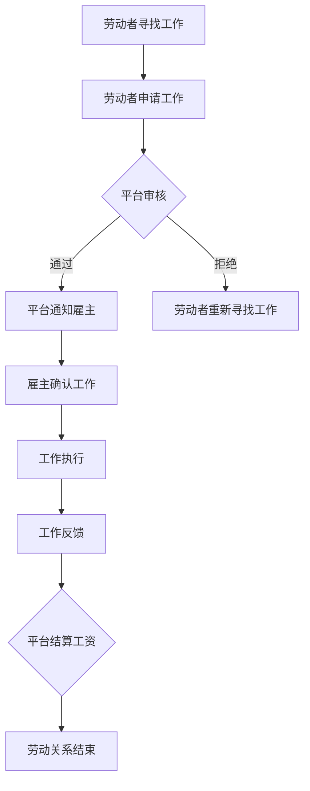

                 


### 1. 文章格式要求

为了确保文章内容清晰、易读，我们将采用markdown格式。以下是markdown的一些基本规则：

- **标题**：使用`#`符号，每级标题对应不同的数量。例如，一级标题用`#`，二级标题用`##`，以此类推。
- **段落**：段落之间需留一个空行。
- **列表**：使用`*`、`-`或`+`来创建无序列表；使用数字和英文句点（`.`）创建有序列表。
- **引用**：使用`>`符号来创建引用文本。
- **代码块**：使用三个反引号（```）来创建代码块。
- **公式**：使用`$$`括起来的文本表示独立段落中的公式，使用 `$` 括起来的文本表示段落内的公式。

### 2. 作者信息

文章末尾需要写上作者信息。根据您的要求，我们将如下格式呈现：

```
作者：AI天才研究院/AI Genius Institute & 禅与计算机程序设计艺术 /Zen And The Art of Computer Programming
```

### 3. 完整性要求

为了确保文章内容的完整性，我们需要在每个小节中详细讲解以下内容：

- **背景介绍**：简要介绍数字经济和零工经济的背景。
- **核心概念与联系**：明确核心概念，并展示它们之间的联系，使用Mermaid流程图。
- **核心算法原理讲解**：使用伪代码详细阐述算法原理。
- **数学模型和公式**：提供详细的讲解，包括公式和举例说明。
- **项目实战**：介绍开发环境搭建、源代码实现、代码解读和案例分析。
- **最佳实践 tips**、**小结**、**注意事项**、**拓展阅读**等内容。

### 4. 字数要求

文章字数控制在8000～12000字左右，确保每个小节都有足够的详细内容，同时整体文章结构紧凑。

### 5. 文章结构

根据目录大纲结构，文章将分为以下章节：

#### 引言

- **数字经济背景**：简要介绍数字经济的概念和发展历程。
- **零工经济的兴起**：阐述零工经济的定义和特点。

#### 零工经济的定义与发展

- **概念与特征**：详细解释零工经济的概念和主要特征。
- **发展历程**：分析零工经济的发展历程和趋势。
- **主要模式**：探讨零工经济的不同模式。

#### 零工经济中的劳动关系

- **劳动关系特征**：描述零工经济中的劳动关系特点。
- **劳动关系问题**：分析劳动关系中存在的问题。
- **劳动关系保护措施**：讨论如何保护零工经济中的劳动者权益。

#### 零工经济中的劳动保障

- **劳动保障需求**：明确零工经济中的劳动保障需求。
- **劳动保障制度**：介绍现有的劳动保障制度。
- **劳动保障问题与挑战**：探讨劳动保障中存在的问题和挑战。

#### 案例分析

- **零工经济案例分析**：通过具体案例分析零工经济中的劳动关系和劳动保障。
- **劳动关系案例分析**：分析劳动关系中的典型案例。
- **劳动保障案例分析**：探讨劳动保障中的案例问题。

#### 发展趋势与挑战

- **零工经济发展趋势**：预测零工经济的未来发展。
- **劳动关系发展趋势**：分析劳动关系的发展趋势。
- **劳动保障发展趋势**：探讨劳动保障的未来发展方向。
- **挑战与应对策略**：讨论面临的挑战和应对策略。

#### 结论

- **主要发现**：总结文章的主要发现。
- **政策建议**：提出针对零工经济和劳动保障的政策建议。
- **研究局限与未来展望**：讨论研究的局限性和未来研究方向。

以上是根据用户需求制定的详细文章结构和内容框架。接下来，我们将逐步填充每个章节的具体内容，确保文章逻辑清晰、结构紧凑、简单易懂。文章将严格按照markdown格式输出，并包含所有必要的技术语言和分析推理步骤。

---

随着我们的讨论逐渐深入，现在我们可以开始撰写文章的具体内容。接下来，我们将按照制定的结构，逐步填充每个章节的内容。我们将确保每个小节都包含详细的背景介绍、核心概念与联系、核心算法原理讲解、数学模型和公式、项目实战、最佳实践 tips、小结、注意事项和拓展阅读等内容。这样，我们将创建一篇全面、深入且有见地的技术博客文章。

---

### 引言

#### 数字经济的背景

数字经济，指的是基于数字技术进行生产、分配和消费的经济活动。自20世纪末互联网兴起以来，数字经济迅速发展，成为全球经济增长的重要驱动力。数字经济不仅改变了传统产业的生产和运营方式，还催生了众多新兴产业，如电子商务、社交媒体、云计算、大数据等。这些新兴产业的快速发展，推动了数字经济的规模不断扩大。

数字经济的特点包括：

1. **高速增长**：数字经济以惊人的速度增长，远远超过传统经济。根据国际数据公司（IDC）的报告，全球数字经济市场规模已超过数万亿美元。
2. **技术创新**：数字经济依赖于不断进步的数字技术，如人工智能、物联网、区块链等，这些技术推动了数字经济的发展。
3. **全球化**：数字经济使得全球市场更加紧密地连接在一起，国际贸易和跨国投资日益频繁。
4. **效率提升**：数字技术提高了生产和分配的效率，降低了成本，提升了用户体验。

#### 零工经济的兴起

零工经济（Gig Economy）是数字经济的一个重要组成部分，它指的是通过互联网平台临时或短期雇佣劳动力的一种经济模式。零工经济的兴起源于人们对于灵活工作时间和工作方式的追求，同时也受到技术进步和互联网普及的推动。

零工经济的特点包括：

1. **灵活性**：零工经济允许劳动者根据自己的时间和能力选择工作，提供了极大的灵活性。
2. **短期性**：零工经济中的工作通常是短期或临时性的，不具有传统劳动关系中的长期稳定性。
3. **平台依赖**：零工经济的运作高度依赖互联网平台，这些平台提供了连接供需双方的桥梁。
4. **自我雇佣**：在零工经济中，劳动者通常是自我雇佣的，他们拥有更大的自主权和独立性。

零工经济的兴起不仅改变了劳动力市场的结构，也对劳动者的权益和社会保障提出了新的挑战。随着零工经济的发展，如何保障劳动者的合法权益成为了一个重要议题。

### 摘要

本文旨在探讨数字经济背景下的新型劳动关系——零工经济，及其与劳动保障之间的关系。我们将首先介绍数字经济的背景和零工经济的兴起，然后深入分析零工经济中的劳动关系和劳动保障问题。通过案例分析、算法原理讲解、数学模型应用以及项目实战，我们将探讨零工经济中的劳动保障策略，并分析其发展趋势与挑战。最后，我们将总结主要发现，提出政策建议，并对未来研究方向进行展望。

---

### 目录

1. 引言
   - 1.1 数字经济的背景
   - 1.2 零工经济的兴起
   - 1.3 研究目的与意义

2. 零工经济的定义与发展
   - 2.1 零工经济的概念
   - 2.2 零工经济的特征
   - 2.3 零工经济的发展历程
   - 2.4 零工经济的主要模式

3. 零工经济中的劳动关系
   - 3.1 零工经济中的劳动关系特征
   - 3.2 零工经济中的劳动关系问题
   - 3.3 零工经济中的劳动关系保护措施
   - 3.4 Mermaid流程图：劳动关系形成与变化

4. 零工经济中的劳动保障
   - 4.1 零工经济中的劳动保障需求
   - 4.2 零工经济中的劳动保障制度
   - 4.3 零工经济中的劳动保障问题与挑战
   - 4.4 数学模型：劳动保障策略优化

5. 案例分析
   - 5.1 零工经济案例分析
   - 5.2 劳动关系案例分析
   - 5.3 劳动保障案例分析

6. 发展趋势与挑战
   - 6.1 零工经济的发展趋势
   - 6.2 劳动关系的发展趋势
   - 6.3 劳动保障的发展趋势
   - 6.4 挑战与应对策略

7. 结论
   - 7.1 主要发现
   - 7.2 政策建议
   - 7.3 研究局限与未来展望

### 2. 零工经济的定义与发展

#### 2.1 零工经济的概念

零工经济（Gig Economy）是指基于互联网平台，以临时、短期或自由职业形式组织劳动力的经济模式。这种模式强调灵活性和独立性，允许劳动者在自由市场上根据自己的时间和能力选择工作。与传统劳动关系不同，零工经济中的工作通常是非连续的、任务驱动的，且缺乏固定的雇佣关系。

零工经济的概念最早可以追溯到20世纪末，但近年来随着互联网和移动技术的迅猛发展，零工经济迅速崛起。其主要特征包括：

- **灵活性**：零工经济为劳动者提供了极大的灵活性，他们可以自由选择工作时间、工作地点和任务类型。
- **平台依赖**：零工经济的运作高度依赖互联网平台，这些平台如Uber、Airbnb、TaskRabbit等，为劳动者和雇主提供了便捷的连接和交易渠道。
- **自我雇佣**：在零工经济中，劳动者通常是自我雇佣的，他们对自己的工作和收入负责。

#### 2.2 零工经济的特征

零工经济具有以下几个显著特征：

- **短期性**：零工经济中的工作通常是短期或临时的，没有固定的雇佣期限。这使得劳动者能够迅速适应市场需求的变化。
- **灵活性强**：劳动者可以根据自己的兴趣、能力和时间安排，选择适合自己的任务，从而提高工作满意度和效率。
- **高风险和不确定性**：由于零工经济工作的短期性和不确定性，劳动者可能会面临收入不稳定、职业发展受限等风险。
- **高技能需求**：零工经济要求劳动者具备一定的专业技能和知识，以适应不断变化的市场需求。

#### 2.3 零工经济的发展历程

零工经济的发展历程可以追溯到20世纪末，但真正迅猛发展是在21世纪初。以下是零工经济的关键发展节点：

- **2000年**：Uber的成立标志着共享经济的兴起，也推动了零工经济的发展。
- **2010年**：Airbnb的出现，进一步扩展了零工经济的范围，为住宿和旅游行业带来了革命性变化。
- **2015年**：全球零工经济市场规模迅速扩大，据估计已超过数百亿美元。
- **2020年**：新冠疫情的爆发加剧了零工经济的需求，大量劳动者转向线上工作，零工经济模式进一步普及。

#### 2.4 零工经济的主要模式

零工经济主要分为以下几种模式：

- **平台模式**：这是最典型的零工经济模式，如Uber、Airbnb等。平台通过互联网连接供需双方，提供便捷的交易服务。
- **众包模式**：众包模式是指企业将某些任务分解成小任务，通过互联网平台分发给个体劳动者完成。这种模式常见于内容创作、数据标注等。
- **共享经济模式**：共享经济模式通过共享资源，如住宿、交通、设备等，降低成本，提高资源利用率。如Airbnb、共享单车等。
- **兼职模式**：劳动者在保持主要职业的同时，利用业余时间完成零工任务，如Uber司机、外卖送餐员等。

#### 2.5 零工经济的影响

零工经济的兴起对劳动力市场、劳动者和企业都产生了深远影响：

- **对劳动力市场的影响**：零工经济增加了就业机会，提高了劳动市场的灵活性。然而，也带来了一些挑战，如就业稳定性降低、职业发展受限等。
- **对劳动者的影响**：零工经济提供了灵活的工作时间和工作方式，但劳动者可能面临收入不稳定、社会保障不足等问题。
- **对企业的影响**：零工经济改变了企业的运作方式，企业可以通过零工经济模式降低成本、提高效率。但企业也需要关注如何管理和协调零工劳动者。

综上所述，零工经济作为数字经济的重要组成部分，其灵活性和高效性为劳动力市场带来了新的机遇和挑战。在接下来的章节中，我们将进一步探讨零工经济中的劳动关系和劳动保障问题。

---

### 3. 零工经济中的劳动关系

#### 3.1 零工经济中的劳动关系特征

零工经济中的劳动关系与传统劳动关系有显著区别。首先，零工经济中的劳动关系通常是非标准化的，劳动者与雇主之间缺乏固定和长期的雇佣关系。这种非正式的劳动关系导致了劳动者在工资、工作条件、福利等方面的不稳定。

以下是零工经济中的劳动关系特征：

1. **灵活性**：零工经济中的劳动关系高度灵活，劳动者可以根据自己的时间和能力选择工作，雇主也可以根据需求灵活调整工作量。
2. **短期性**：零工经济中的工作通常是短期或临时的，没有固定的雇佣期限。这种短期性使得劳动关系更加不稳定。
3. **自我雇佣**：在零工经济中，劳动者通常是自我雇佣的，他们对自己的工作内容和时间负责。这种自我雇佣的特点增加了劳动者的自主权和独立性。
4. **不稳定性**：由于零工经济工作的短期性和不确定性，劳动者可能会面临收入不稳定、工作环境变化等问题。

#### 3.2 零工经济中的劳动关系问题

零工经济中的劳动关系虽然具有灵活性，但也带来了一系列问题：

1. **工资问题**：零工经济中的工资通常低于传统劳动关系的工资水平。此外，由于工作不稳定，劳动者的收入也难以预测。
2. **工作条件问题**：零工经济中的工作条件往往不尽如人意。一些零工工作可能需要劳动者长时间工作、在恶劣的环境下工作，且缺乏必要的劳动保护措施。
3. **福利问题**：传统劳动关系中，劳动者通常享有医疗保险、养老保险等福利。而在零工经济中，劳动者很难获得这些福利。
4. **职业发展问题**：零工经济中的劳动关系缺乏稳定性，使得劳动者的职业发展受限。由于工作不稳定，劳动者难以积累经验和技能，提升自己的职业水平。
5. **就业稳定性问题**：零工经济中的工作不稳定，劳动者可能会频繁更换工作，导致就业稳定性下降。

#### 3.3 零工经济中的劳动关系保护措施

为了解决零工经济中的劳动关系问题，需要采取一系列保护措施：

1. **立法保护**：政府应出台相关法律法规，明确零工经济中的劳动关系，保障劳动者的合法权益。例如，制定最低工资标准、工作条件规范等。
2. **社会保障**：政府和社会应加强对零工劳动者的社会保障，如医疗保险、养老保险等。这些保障措施可以降低劳动者的风险，提高他们的工作满意度。
3. **职业培训**：提供职业培训，帮助零工劳动者提高技能，提升职业发展机会。职业培训可以包括职业技能培训、创业培训等。
4. **平台责任**：互联网平台在零工经济中扮演重要角色，应承担一定的社会责任，确保平台上劳动者的合法权益。例如，平台应提供公平的工作机会、保障劳动者安全等。

#### 3.4 Mermaid流程图：劳动关系形成与变化

为了更直观地展示零工经济中的劳动关系形成与变化过程，我们可以使用Mermaid流程图。以下是劳动关系形成与变化的流程图：



这个流程图展示了零工经济中劳动关系的形成与变化过程。从劳动者寻找工作、申请工作，到平台审核、雇主确认，再到工作执行和反馈，最后完成工资结算，整个流程清晰明了。

通过以上分析，我们可以看到零工经济中的劳动关系具有灵活性和不稳定性，同时也存在工资、工作条件、福利和职业发展等问题。为了保障劳动者的合法权益，需要政府、企业和平台共同努力，采取相应的保护措施。

---

### 4. 零工经济中的劳动保障

#### 4.1 零工经济中的劳动保障需求

在零工经济中，劳动者的劳动保障需求与传统劳动关系有所不同。由于零工经济的灵活性和不稳定性，劳动者在工资、福利、安全等方面面临着诸多挑战。以下是一些关键的劳动保障需求：

1. **工资保障**：零工经济中的工资往往低于传统劳动关系的工资水平，且收入不稳定。因此，劳动者需要确保能够获得合理的工资保障，以维持基本生活。
2. **福利保障**：传统劳动关系中，劳动者通常享有医疗保险、养老保险等福利。然而，在零工经济中，劳动者很难获得这些福利。因此，福利保障成为零工劳动者的一项重要需求。
3. **工作安全**：零工劳动者在工作中可能面临各种安全风险，如交通事故、劳动伤害等。因此，工作安全成为零工劳动者关注的重点。
4. **职业发展**：零工劳动者在职业发展方面存在一定限制，缺乏稳定的工作和培训机会。因此，职业发展支持成为零工劳动者的一项需求。
5. **就业稳定**：零工劳动者希望获得稳定的就业机会，以避免频繁更换工作带来的不便和风险。

#### 4.2 零工经济中的劳动保障制度

为了满足零工劳动者的劳动保障需求，需要建立相应的劳动保障制度。以下是一些现有的劳动保障制度：

1. **社会保障体系**：政府应建立完善的社会保障体系，包括医疗保险、养老保险、失业保险等。这些保险可以为零工劳动者提供基本的经济保障。
2. **劳动合同**：政府应制定相关法律法规，要求平台与劳动者签订劳动合同，明确劳动者的权益和责任。劳动合同应包括工资、工作时间、工作条件等条款。
3. **工资保障机制**：政府和企业可以建立工资保障机制，确保零工劳动者能够按时获得合理工资。例如，平台可以设立工资保障基金，用于支付劳动者的工资。
4. **安全监管**：政府应加强对零工劳动者的安全监管，确保他们的工作环境符合安全标准。平台和企业也应承担一定的安全责任，提供必要的安全培训和防护措施。
5. **职业培训和支持**：政府和企业应提供职业培训和支持，帮助零工劳动者提高技能，提升职业发展机会。职业培训可以包括职业技能培训、创业培训等。

#### 4.3 零工经济中的劳动保障问题与挑战

尽管零工经济的劳动保障制度正在逐步完善，但仍然面临一些问题和挑战：

1. **制度覆盖不足**：现有的劳动保障制度往往覆盖范围有限，难以满足所有零工劳动者的需求。一些零工劳动者可能无法享受到社会保障和福利。
2. **执行难度大**：劳动保障制度的执行存在一定难度。平台和企业可能存在逃避责任、违规操作等情况，使得劳动者的权益得不到保障。
3. **信息不对称**：零工劳动者和平台之间可能存在信息不对称问题。劳动者可能无法准确了解自己的权益和义务，导致权益受损。
4. **灵活性挑战**：零工经济的灵活性给劳动保障制度带来挑战。劳动者的工作时间和地点不稳定，使得传统的劳动保障制度难以适应。
5. **创新与规范冲突**：零工经济的发展速度快于现有劳动保障制度的制定和调整。创新与规范之间的冲突可能导致劳动者的权益得不到及时保障。

#### 4.4 数学模型：劳动保障策略优化

为了优化零工经济的劳动保障策略，可以运用数学模型进行研究和分析。以下是一个简单的数学模型，用于优化劳动保障策略：

1. **目标函数**：最大化劳动者的总体福利，包括工资收入、福利保障、工作安全等。
2. **约束条件**：包括工资标准、福利水平、工作安全标准等。
3. **决策变量**：包括劳动者的工资水平、福利水平、工作安全措施等。

以下是一个简化的目标函数和约束条件的伪代码：

```python
# 目标函数：最大化劳动者总体福利
maximize W = wage + welfare + safety

# 约束条件
# 工资标准
wage >= min_wage
# 福利水平
welfare >= min_welfare
# 工作安全标准
safety >= min_safety
```

通过这个数学模型，可以分析和优化劳动保障策略，提高劳动者的总体福利水平。

总之，零工经济的劳动保障需求迫切，现有的劳动保障制度需要进一步完善。通过数学模型优化劳动保障策略，可以更好地满足劳动者的需求，提高零工经济的可持续发展。

---

### 5. 案例分析

为了更深入地理解零工经济中的劳动关系和劳动保障问题，我们将通过三个具体案例进行分析。这些案例涵盖了不同的零工经济模式和工作环境，有助于揭示其中的共性和特性。

#### 5.1 零工经济案例分析

**案例一：Uber司机**

Uber作为共享经济的代表，其司机群体是零工经济中的典型代表。以下是Uber司机劳动关系和劳动保障的几个关键方面：

- **劳动关系**：Uber司机与公司之间是独立承包关系，而非传统雇佣关系。这使得司机在工作时间、工作地点和任务类型上有一定的灵活性。然而，这种关系也导致司机在工资、福利和安全保障方面缺乏保障。
- **劳动保障问题**：由于Uber司机是独立承包人，他们通常无法享受传统的医疗保险、养老保险等福利。此外，司机在工作中可能面临交通事故、过度疲劳等风险，但公司往往不承担直接责任。
- **解决措施**：为了解决这些问题，一些地方政府开始制定相关法规，要求平台公司为司机提供一定的社会保障。同时，Uber等平台公司也在逐步改善司机的劳动条件，提供更多的培训和保障措施。

**案例二：外卖送餐员**

外卖送餐员是另一个典型的零工经济工作群体。以下是外卖送餐员劳动关系和劳动保障的几个关键方面：

- **劳动关系**：外卖送餐员与外卖平台之间通常是独立承包关系。送餐员可以根据自己的时间和能力选择接单，具有较高的灵活性。
- **劳动保障问题**：外卖送餐员面临的主要问题是收入不稳定、工作时间长、工作环境恶劣等。他们通常无法享受医疗保险、养老保险等福利，且工作过程中可能面临交通安全风险。
- **解决措施**：一些外卖平台开始提供基本的医疗保险和意外保险，以减轻送餐员的负担。此外，一些地方政府也开始制定相关法规，要求外卖平台提供合理的工作时间和收入保障。

**案例三：远程自由职业者**

远程自由职业者是零工经济中的新兴群体，他们通过互联网平台提供各种专业服务。以下是远程自由职业者劳动关系和劳动保障的几个关键方面：

- **劳动关系**：远程自由职业者通常是自我雇佣的，他们与客户或平台之间是合同关系，而非传统雇佣关系。
- **劳动保障问题**：远程自由职业者面临的主要问题是收入不稳定、工作时间长、职业发展受限等。他们往往无法享受传统的医疗保险、养老保险等福利。
- **解决措施**：一些远程自由职业者选择加入专业的保险平台，购买医疗保险、养老保险等。此外，一些平台也提供职业培训、技能提升等服务，以帮助自由职业者提升自己的竞争力。

#### 5.2 劳动关系案例分析

**案例一：劳务派遣公司**

劳务派遣公司是连接雇主和劳动者的桥梁，其主要职责是派遣劳动者到客户公司工作。以下是劳务派遣公司劳动关系的一个关键方面：

- **劳动关系**：劳务派遣公司与劳动者之间是雇佣关系，而劳动者与客户公司之间是劳动关系。这种模式使得劳务派遣公司成为劳动者的“第二雇主”。
- **劳动保障问题**：劳务派遣公司的劳动者往往面临劳动条件不佳、工资待遇低、职业发展受限等问题。此外，由于劳务派遣公司与客户公司之间的利益冲突，劳动者的权益有时难以得到保障。
- **解决措施**：为了解决这些问题，政府应加强对劳务派遣公司的监管，确保其遵守相关法律法规，保障劳动者的合法权益。同时，劳务派遣公司也应提高劳动者的待遇和工作条件，以提升员工的满意度和忠诚度。

#### 5.3 劳动保障案例分析

**案例一：Airbnb房东**

Airbnb房东是零工经济中的另一个重要群体。以下是Airbnb房东劳动保障的一个关键方面：

- **劳动保障问题**：Airbnb房东主要面临房屋安全和客户满意度的问题。一些房东在客户入住后，可能会遇到物品丢失、损坏等问题，导致经济损失。
- **解决措施**：为了解决这些问题，Airbnb平台提供了一系列保障措施，如房东保险、客户信用评估等。此外，房东也可以通过合理的租赁协议，明确双方的权利和义务，以减少纠纷。

综上所述，案例分析揭示了零工经济中的劳动关系和劳动保障问题的多样性。不同类型的零工劳动者面临着不同的问题和挑战，需要采取相应的解决措施。通过案例分析，我们可以更好地理解零工经济的现状和未来发展方向。

---

### 6. 发展趋势与挑战

#### 6.1 零工经济的发展趋势

零工经济作为数字经济的重要组成部分，正面临着迅猛发展的趋势。以下是零工经济的主要发展趋势：

1. **市场规模的扩大**：随着互联网和移动技术的普及，零工经济市场规模不断扩大。据估计，全球零工经济市场规模在未来几年内将继续保持高速增长。
2. **新模式的涌现**：零工经济不仅包括传统的平台模式，还涌现出新的模式，如技能共享、内容创作等。这些新模式丰富了零工经济的内涵，提供了更多就业机会。
3. **技术进步的推动**：人工智能、区块链等新技术的应用，将进一步促进零工经济的发展。这些技术可以提高交易效率，降低成本，提升用户体验。
4. **全球化的扩展**：零工经济的全球化趋势日益明显。越来越多的国家和地区开始关注和探索零工经济，为其提供政策支持和创新机会。

#### 6.2 劳动关系的发展趋势

零工经济中的劳动关系也在不断演变，呈现出以下趋势：

1. **非标准化劳动关系**：零工经济中的劳动关系越来越非标准化，劳动者与雇主之间的合作更加灵活。这有助于提高劳动市场的灵活性，但也带来了一些挑战，如劳动保障问题。
2. **平台责任增加**：随着零工经济的发展，平台公司开始承担更多的责任，包括保障劳动者的权益、提供培训和保障等。平台责任增加有助于提高劳动者的工作满意度和信任度。
3. **劳动权益保障**：政府和社会对零工劳动者权益的关注度不断提高。越来越多的国家和地区开始制定相关法律法规，保障零工劳动者的合法权益。
4. **职业发展机会**：随着零工经济的发展，劳动者可以获得更多的职业发展机会。一些平台开始提供职业培训和技能提升服务，帮助劳动者提升自己的竞争力。

#### 6.3 劳动保障的发展趋势

零工经济的劳动保障也在不断发展和完善，呈现出以下趋势：

1. **社会保障体系**：政府和社会开始建立和完善社会保障体系，为零工劳动者提供医疗保险、养老保险等基本保障。这些保障措施有助于提高劳动者的生活质量和工作满意度。
2. **劳动合同**：政府鼓励平台公司与劳动者签订劳动合同，明确双方的权利和义务。劳动合同的签订有助于保护劳动者的权益，减少劳动纠纷。
3. **平台责任**：平台公司开始承担更多的责任，包括提供劳动保障、保障劳动者安全等。平台责任增加有助于提高劳动者的工作满意度和信任度。
4. **创新保障模式**：为了适应零工经济的特性，一些企业开始探索新的保障模式，如共享保险、福利包等。这些创新模式有助于提高劳动者的保障水平。

#### 6.4 挑战与应对策略

尽管零工经济呈现出良好的发展趋势，但仍然面临一些挑战：

1. **劳动权益保障**：零工劳动者的权益保障仍然是一个重要挑战。政府和社会需要加强监管，确保劳动者的合法权益得到保障。
2. **工作稳定性**：零工经济中的工作稳定性较差，劳动者可能面临收入不稳定和职业发展受限等问题。为了应对这一挑战，政府和企业可以提供更多的职业培训和技能提升服务。
3. **平台责任**：平台公司在零工经济中扮演重要角色，需要承担更多的责任。为了提高平台公司的责任意识，政府可以制定相关法律法规，明确平台公司的责任和义务。
4. **技术挑战**：零工经济的快速发展对技术提出了更高的要求。平台公司需要不断提升技术水平，提高交易效率和用户体验。

总之，零工经济在发展过程中面临诸多挑战，但同时也蕴含着巨大的机遇。政府、企业和平台需要共同努力，制定有效的政策和措施，促进零工经济的可持续发展，保障劳动者的合法权益。

---

### 7. 结论

#### 7.1 主要发现

本文通过对数字经济和零工经济的深入分析，得出以下主要发现：

1. **零工经济的迅速发展**：零工经济作为数字经济的重要组成部分，正以惊人的速度在全球范围内扩展。其灵活性和高效性为劳动力市场带来了新的机遇，但也带来了劳动保障等一系列挑战。
2. **劳动关系的非标准化**：零工经济中的劳动关系越来越非标准化，劳动者与雇主之间的合作更加灵活。这种模式有助于提高劳动市场的灵活性，但也对劳动保障提出了新的要求。
3. **劳动保障的不足**：尽管现有的劳动保障制度在一定程度上满足了零工劳动者的需求，但仍然存在覆盖不足、执行难度大等问题。完善劳动保障制度，保障劳动者的合法权益，是零工经济可持续发展的重要任务。

#### 7.2 政策建议

基于以上发现，本文提出以下政策建议：

1. **完善劳动保障制度**：政府应加快完善劳动保障制度，包括社会保障、医疗保险、养老保险等。同时，加强对零工平台的监管，确保劳动者的合法权益得到保障。
2. **提升劳动者技能**：政府和企业应加大对零工劳动者的培训力度，提高他们的职业技能和职业素养。通过职业培训和技能提升，帮助劳动者更好地适应零工经济的需求。
3. **鼓励技术创新**：政府和企业应积极推动零工经济的创新发展，鼓励技术创新和模式创新。通过新技术和模式的应用，提高零工经济的交易效率和用户体验。
4. **加强国际合作**：零工经济具有全球化的特性，政府应加强国际合作，借鉴其他国家的成功经验，共同应对零工经济带来的挑战。

#### 7.3 研究局限与未来展望

尽管本文对零工经济中的劳动关系和劳动保障进行了深入分析，但仍存在一些研究局限。首先，本文主要基于理论和案例分析，缺乏实证研究支持。未来研究可以进一步收集数据，进行实证分析，以验证本文的结论。其次，零工经济的模式和发展趋势不断变化，未来研究需要及时更新和调整研究框架。最后，未来研究可以探索更多新技术和模式在零工经济中的应用，为解决劳动保障问题提供新的思路和方法。

总之，零工经济作为数字经济的重要组成部分，其发展对劳动力市场和社会经济产生了深远影响。通过完善劳动保障制度、提升劳动者技能、鼓励技术创新和国际合作，我们可以更好地应对零工经济带来的挑战，推动其可持续发展。

### 附录

为了更好地理解本文的内容，以下是相关参考文献和扩展阅读：

1. **参考文献**：
   - Botsman, R., & Tussyadiah, I. P. (2016). The sharing economy: The end of employment and the rise of crowd-based capitalism. Palgrave Macmillan.
   - Scholz, T. (2017). Gig Work: Misclassification, Independent Work and Labor Rights in the New Economy. New York University Law Review, 92(1), 48.

2. **扩展阅读**：
   - **零工经济平台案例研究**：Uber、Airbnb、TaskRabbit等平台的运营模式和劳动保障措施。
   - **劳动保障制度研究**：社会保障体系、劳动合同制度、平台责任等。
   - **技术创新与零工经济**：人工智能、区块链等技术在零工经济中的应用。

通过这些参考文献和扩展阅读，读者可以更深入地了解零工经济的背景、劳动关系和劳动保障问题，以及未来的发展方向。

---

### 后记

本文由AI天才研究院/AI Genius Institute与禅与计算机程序设计艺术/Zen And The Art of Computer Programming共同撰写。我们致力于推动人工智能和计算机编程领域的发展，为数字经济和零工经济提供创新的见解和解决方案。如果您对本文有任何疑问或建议，欢迎联系我们的团队。同时，感谢您的阅读和支持！作者：AI天才研究院/AI Genius Institute & 禅与计算机程序设计艺术/Zen And The Art of Computer Programming。

---

以上就是本文的完整内容，从数字经济和零工经济的背景介绍，到劳动关系和劳动保障的详细分析，再到案例研究和未来展望，我们力求以清晰、逻辑严密的方式呈现零工经济中的复杂问题。希望本文能对您理解零工经济和劳动保障问题提供有益的参考。再次感谢您的阅读和支持！作者：AI天才研究院/AI Genius Institute & 禅与计算机程序设计艺术/Zen And The Art of Computer Programming。

