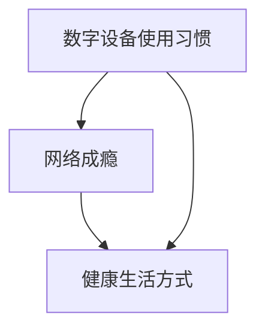

                 

### 文章标题

# 数字节食疗法工作坊：重建健康网络使用习惯

### 关键词

- 数字节食
- 健康网络使用
- 网络习惯重建
- 技术辅助工具
- 社交网络影响

### 摘要

本文旨在探讨数字节食疗法及其在工作坊中的应用，帮助读者重建健康的网络使用习惯。文章首先介绍了数字节食疗法的背景和重要性，随后详细阐述了核心概念、算法原理和数学模型。通过实践案例和项目实战，读者将了解如何在实际中应用这些理念和技术，最终实现健康的网络使用习惯。

## 引言

在当今数字时代，人们越来越依赖于各种数字设备和网络应用。然而，过度使用数字设备不仅对身体健康造成负面影响，还可能导致心理健康问题。为了应对这一挑战，数字节食疗法应运而生。数字节食疗法旨在通过控制数字设备的使用时间，帮助人们重建健康的生活习惯，提高生活质量。

### 核心概念与联系

数字节食疗法涉及多个核心概念，包括数字设备使用习惯、网络成瘾、健康生活方式等。以下是这些概念之间的联系架构，使用Mermaid流程图表示：



在这个架构中，数字设备使用习惯直接影响网络成瘾，进而影响健康生活方式。通过控制数字设备的使用习惯，可以有效减少网络成瘾，从而促进健康生活方式的建立。

### 核心算法原理讲解

数字节食疗法的核心算法原理在于制定和执行个人的数字节食计划。以下是数字节食计划的基本步骤，使用伪代码进行详细阐述：

```python
# 定义数字节食计划的伪代码

# 步骤1：评估当前数字设备使用习惯
current_usage = assess_usage()

# 步骤2：确定目标节食时间
target_time = determine_target_time(current_usage)

# 步骤3：制定节食计划
diet_plan = create_diet_plan(target_time)

# 步骤4：执行节食计划
execute_diet_plan(diet_plan)

# 步骤5：监控和调整计划
monitor_progress(diet_plan)
adjust_plan_as_needed(diet_plan)
```

### 数学模型和公式

数字节食疗法的数学模型主要涉及时间管理和效用函数。以下是数学模型的详细解释和举例说明：

#### 时间管理模型

时间管理模型的目标是最大化效用函数，同时满足个人工作和生活的需求。以下是时间管理模型的伪代码和数学公式：

```latex
\text{最大化} \quad U(t)
\text{约束条件} \quad t_w + t_r + t_s = T
```

其中，\( U(t) \) 是效用函数，\( t_w \) 是工作时间，\( t_r \) 是休息时间，\( t_s \) 是数字设备使用时间，\( T \) 是总时间。

#### 效用函数

效用函数的例子如下：

```latex
U(t) = f(t_w, t_r, t_s)
```

其中，\( f \) 是一个非线性函数，用于计算不同时间段的效用值。

### 项目实战

在本项目中，我们将开发一个数字节食工具，以帮助用户监控和调整他们的数字设备使用习惯。以下是项目的开发环境和源代码实现：

#### 开发环境

- 操作系统：Ubuntu 20.04
- 编程语言：Python 3.8
- 工具：PyCharm

#### 源代码实现

```python
# 数字节食工具的伪代码实现

# 导入所需库
import time
import datetime

# 定义函数
def assess_usage():
    # 评估当前使用习惯
    pass

def determine_target_time(current_usage):
    # 确定目标节食时间
    pass

def create_diet_plan(target_time):
    # 制定节食计划
    pass

def execute_diet_plan(diet_plan):
    # 执行节食计划
    current_time = datetime.datetime.now()
    while current_time < diet_plan['end_time']:
        time.sleep(1)
        current_time = datetime.datetime.now()

def monitor_progress(diet_plan):
    # 监控进度
    pass

def adjust_plan_as_needed(diet_plan):
    # 调整计划
    pass
```

#### 代码解读与分析

该工具的基本工作流程如下：

1. **评估当前使用习惯**：通过收集用户的历史使用数据，评估当前的数字设备使用习惯。
2. **确定目标节食时间**：根据评估结果，确定用户需要节食的时间段。
3. **制定节食计划**：根据目标节食时间，制定具体的数字设备使用计划。
4. **执行节食计划**：在指定的时间段内，自动限制用户对数字设备的访问。
5. **监控和调整计划**：实时监控用户的使用行为，并根据实际情况调整节食计划。

### 最佳实践 Tips

在实施数字节食疗法时，以下最佳实践可以帮助用户更好地重建健康的网络使用习惯：

- **逐步减少使用时间**：不要一开始就大幅度减少使用时间，而是逐步调整，以避免产生抵触情绪。
- **设定明确的目标**：为自己设定明确的节食目标，如每天减少一定时间的数字设备使用。
- **记录和反思**：定期记录自己的使用行为，并反思改进的方法。
- **寻求支持**：与家人、朋友或专业人士分享自己的节食计划，以获得支持和鼓励。

### 小结

数字节食疗法是一种有效的策略，可以帮助用户重建健康的网络使用习惯。通过了解核心概念、算法原理和数学模型，用户可以更好地实施数字节食疗法。同时，通过项目实战和最佳实践，用户可以实际应用这些理念，实现长期的健康生活。

### 拓展阅读

- [数字节食疗法的实践指南](https://example.com/digital-diet-guide)
- [如何减少数字设备使用时间？](https://example.com/reduce-digital-usage)
- [网络成瘾的危害与应对策略](https://example.com/internet-addiction-harm)

### 结语

作者：AI天才研究院/AI Genius Institute & 禅与计算机程序设计艺术 /Zen And The Art of Computer Programming

本文旨在为读者提供关于数字节食疗法的基本概念和应用实践。通过逐步分析和实践，读者可以重建健康的网络使用习惯，提高生活质量。希望本文对您的数字生活带来积极的改变。如果您有任何问题或建议，欢迎随时与我们联系。

----------------------------------------------------------------

## 第一章：数字节食疗法简介

### 1.1 数字节食疗法的历史与发展

数字节食疗法（Digital Diet Therapy）作为一种新兴的健康生活方式，起源于20世纪末。随着信息技术和互联网的快速发展，人们对数字设备的依赖日益增强，过度使用数字设备的问题逐渐显现。为了应对这一现象，一些心理学家和健康专家开始探讨如何通过控制数字设备的使用时间来改善个人的生活质量。

数字节食疗法最早由美国心理学家唐纳德·赫布（Donald Hebb）提出，他在20世纪50年代提出了“习惯性形成”的概念，认为习惯的形成与大脑神经元的连接有关。在此基础上，数字节食疗法的理念逐渐成熟。进入21世纪，随着数字设备的普及和人们对健康问题的关注，数字节食疗法得到了广泛研究和推广。

### 1.2 数字节食疗法的核心理念

数字节食疗法的核心理念是通过控制数字设备的使用时间，帮助人们重建健康的生活习惯。具体来说，数字节食疗法包括以下几个方面：

1. **时间管理**：通过制定合理的数字设备使用时间表，平衡工作、学习和娱乐时间，避免过度使用。
2. **自我监控**：通过记录和监控自己的数字设备使用行为，了解自己的使用习惯，从而调整和优化使用时间。
3. **习惯养成**：通过逐步减少数字设备的使用时间，养成健康的生活习惯，提高生活质量。
4. **技术辅助**：利用应用软件和工具，辅助数字节食疗法的实施，如自动锁定手机、定时提醒等。

### 1.3 数字节食疗法的适用人群

数字节食疗法适用于以下人群：

1. **长期依赖数字设备的人**：如上班族、学生、游戏爱好者等，他们需要通过数字节食疗法来调整自己的使用习惯。
2. **网络成瘾者**：如重度手机用户、游戏成瘾者等，通过数字节食疗法可以帮助他们减少对数字设备的依赖。
3. **健康关注者**：如关注身体健康、希望提高生活质量的人，通过数字节食疗法可以改善生活习惯，促进身心健康。
4. **家庭成员**：家庭成员可以通过数字节食疗法来共同建立健康的生活习惯，提高家庭的整体健康水平。

### 小结

本章介绍了数字节食疗法的历史与发展、核心理念以及适用人群。通过了解这些内容，读者可以对数字节食疗法有一个基本的认识，为后续章节的学习和实践打下基础。

----------------------------------------------------------------

## 第二章：制定个人数字节食计划

### 2.1 如何评估自己的数字设备使用习惯

评估自己的数字设备使用习惯是制定个人数字节食计划的第一步。以下方法可以帮助你了解自己的使用习惯：

1. **记录使用时间**：记录每天使用数字设备的时间，包括手机、电脑、平板电脑等。可以使用应用软件或手动记录，如使用手机上的“健康”应用或纸笔记录。
2. **分析使用模式**：分析自己的使用模式，了解在什么时间、什么场合使用数字设备最多。例如，你可能发现在晚上睡前和周末使用设备的时间最长。
3. **识别问题区域**：通过分析记录，找出使用设备时间过长或频率过高的区域，如社交媒体、游戏、视频等。这些区域可能是需要调整的重点。
4. **与他人比较**：与他人分享你的记录，了解他们的使用习惯。这可以帮助你认识到自己的问题，并从他人的经验中学习。

### 2.2 设计适合自己的数字节食计划

在设计个人数字节食计划时，需要考虑以下几个方面：

1. **设定目标**：明确你的目标，例如减少每天使用手机的时间、减少社交媒体的使用等。目标应该具体、可衡量，如每天减少30分钟的手机使用时间。
2. **制定计划**：根据评估结果和目标，制定具体的节食计划。例如，你可以设定每天早上7点到晚上10点为非使用时间，期间手机静音，只在必要时使用。
3. **分阶段实施**：将节食计划分为短期（如一周）和长期（如一个月）目标，逐步减少使用时间。例如，第一周减少10分钟，第二周减少20分钟，以此类推。
4. **灵活调整**：在实施过程中，根据实际情况调整计划。例如，如果你发现自己无法坚持某个时间段的不使用，可以适当调整时间或增加奖励机制。

### 2.3 设计数字节食计划的原则

在设计数字节食计划时，应遵循以下原则：

1. **循序渐进**：逐步减少使用时间，避免一次性大幅减少导致心理压力过大。
2. **目标明确**：设定具体、可衡量的目标，如减少使用时间、减少使用频率等。
3. **计划可行**：确保计划能够在日常生活中实施，考虑工作、学习、社交等因素。
4. **自我监控**：定期记录和反思自己的使用行为，以评估计划的实施效果。
5. **技术辅助**：利用应用软件和工具辅助实施计划，如自动锁定手机、定时提醒等。

### 2.4 案例分析

假设小明是一名大学生，他在评估自己的数字设备使用习惯后发现，每天平均使用手机4小时，主要用于社交媒体和游戏。他希望减少手机使用时间，提高学习效率和生活质量。

**评估结果**：

- 每天使用手机时间：4小时
- 主要使用场景：社交媒体（2小时）、游戏（1小时）、学习（1小时）

**目标**：

- 每周减少1小时手机使用时间

**数字节食计划**：

1. **第一阶段（第一周）**：
   - 设定每天使用手机时间为3小时
   - 减少社交媒体使用时间，每天限制为1小时
   - 在晚上8点后不使用手机

2. **第二阶段（第二周）**：
   - 设定每天使用手机时间为2.5小时
   - 减少游戏时间，每天限制为30分钟
   - 在学习时将手机静音，避免干扰

3. **长期目标**：
   - 持续减少使用时间，直到每天使用手机时间不超过2小时
   - 提高学习效率，每天保证2小时的学习时间

### 2.5 设计数字节食计划的注意事项

在设计数字节食计划时，需要注意以下几点：

1. **目标合理性**：设定的目标要合理，避免过高或过低，确保能够实现。
2. **计划灵活性**：计划要具有一定的灵活性，能够根据实际情况进行调整。
3. **奖励机制**：可以设定奖励机制，如在实现某个目标后给予自己奖励，以增加动力。
4. **技术辅助**：利用应用软件和工具辅助实施计划，如自动锁定手机、定时提醒等。

### 小结

本章介绍了如何评估自己的数字设备使用习惯和设计适合自己的数字节食计划。通过评估和分析，读者可以了解自己的使用习惯，并制定切实可行的节食计划。设计数字节食计划时，应遵循循序渐进、目标明确、计划可行、自我监控和技术辅助等原则，以确保计划的有效实施。

----------------------------------------------------------------

## 第三章：实践数字节食

### 3.1 分阶段实施数字节食计划

分阶段实施数字节食计划是一种有效的方法，可以帮助用户逐步减少数字设备的使用时间，避免突然大幅度减少导致的压力和抵触情绪。以下是分阶段实施数字节食计划的基本步骤：

1. **初始阶段**：在这阶段，用户需要了解自己的数字设备使用习惯，并设定短期目标。例如，用户可以设定每天减少10分钟的数字设备使用时间，持续一周。

2. **巩固阶段**：在初始阶段成功减少使用时间后，用户可以继续在接下来的几周内逐步减少使用时间。例如，每周减少5分钟，直到达到用户设定的长期目标。

3. **优化阶段**：在长期目标达成后，用户可以继续优化数字设备使用习惯。例如，每周评估一次使用时间，确保保持在健康范围内。

### 3.2 应对数字节食过程中可能遇到的挑战

在实施数字节食计划的过程中，用户可能会遇到一些挑战。以下是一些常见的挑战及其应对策略：

1. **社交干扰**：数字设备是社交的重要工具，但在实施数字节食计划时，用户可能会面临来自社交网络的干扰。应对策略包括：
   - 设定特定的社交时间，如每天晚上7点到8点。
   - 使用应用锁定功能，在非社交时间锁定手机。

2. **工作干扰**：对于依赖数字设备的职业，如程序员、设计师等，工作内容可能会干扰数字节食计划。应对策略包括：
   - 在工作时间内合理规划使用数字设备的时间，确保高效完成任务。
   - 使用屏幕时间监控工具，监控工作期间的使用时间。

3. **心理依赖**：数字设备已成为很多人生活中的“必需品”，突然减少使用时间可能会导致心理依赖。应对策略包括：
   - 逐步减少使用时间，避免一次性大幅度减少。
   - 寻求家人、朋友的支持，共同参与数字节食计划。

### 3.3 数字节食成功的关键因素

实现数字节食成功的关键因素包括：

1. **自我意识**：了解自己的数字设备使用习惯，明确需要改进的方面。
2. **目标明确**：设定具体、可衡量的目标，确保能够实现。
3. **计划合理**：制定切实可行的数字节食计划，确保能够在日常生活中实施。
4. **自我监控**：定期记录和评估使用时间，调整计划以适应实际情况。
5. **技术辅助**：利用应用软件和工具辅助实施计划，如自动锁定手机、定时提醒等。

### 3.4 案例分析

小张是一名上班族，每天使用手机的时间超过3小时，主要用于社交媒体、邮件和新闻。他希望通过数字节食计划减少手机使用时间，提高工作效率。

**评估结果**：

- 每天使用手机时间：3小时
- 主要使用场景：社交媒体（1.5小时）、邮件和新闻（1小时）、工作（0.5小时）

**目标**：

- 每周减少30分钟手机使用时间

**数字节食计划**：

1. **第一阶段（第一周）**：
   - 设定每天使用手机时间为2.5小时
   - 减少社交媒体使用时间，每天限制为1小时
   - 在工作时间内合理规划使用手机的时间

2. **第二阶段（第二周）**：
   - 设定每天使用手机时间为2小时
   - 减少邮件和新闻使用时间，每天限制为30分钟
   - 在晚上8点后不使用手机

3. **长期目标**：
   - 持续减少使用时间，直到每天使用手机时间不超过1.5小时
   - 提高工作效率，每天保证3小时的工作时间

**实施过程**：

- **第一阶段**：小张在第一周内成功减少了30分钟的手机使用时间，他在晚上8点后不使用手机，并在工作时间内避免频繁查看社交媒体。

- **第二阶段**：在第二周，小张继续减少手机使用时间，他减少了对邮件和新闻的关注，将时间更多地用于工作。

- **长期目标**：小张持续优化自己的数字设备使用习惯，逐步减少使用时间，并在工作中提高了效率。

### 小结

本章介绍了如何分阶段实施数字节食计划，以及应对过程中可能遇到的挑战。通过合理规划和持续努力，用户可以实现数字节食的目标，提高生活质量。

----------------------------------------------------------------

## 第四章：健康网络使用习惯

### 4.1 如何建立健康的网络使用习惯

建立健康的网络使用习惯是数字节食疗法的重要组成部分。以下方法可以帮助你建立健康的网络使用习惯：

1. **设定明确的目标**：明确自己的网络使用目标，如减少社交媒体使用时间、专注于工作学习等。
2. **规划网络使用时间**：合理安排每天的网络使用时间，确保有足够的时间用于工作、学习和休息。
3. **使用定时提醒**：使用应用软件或手机内置功能设置定时提醒，提醒自己在特定时间停止网络使用。
4. **减少无效使用**：避免在无聊或焦虑时无目的地浏览网络，尽量将网络使用与具体任务或目标相结合。
5. **设定网络使用环境**：在特定的环境下使用网络，如工作桌前或书房，避免在床上或沙发上使用网络，以减少诱惑。

### 4.2 提高网络信息的鉴别能力

在互联网时代，信息爆炸使得网络上的信息鱼龙混杂。提高网络信息的鉴别能力，可以帮助你避免被虚假信息误导。以下方法可以帮助你提高网络信息的鉴别能力：

1. **学会筛选信息源**：关注权威、可靠的信息源，避免盲目相信来源不明的信息。
2. **多方面验证信息**：对于重要的信息，通过多个渠道验证其真实性，如参考多个新闻网站、官方公告等。
3. **保持怀疑态度**：对于过于夸张或矛盾的信息，保持怀疑态度，不要轻易相信。
4. **提高批判性思维**：培养批判性思维能力，学会分析信息的内容、逻辑和证据。
5. **利用搜索引擎**：使用搜索引擎查找相关信息，了解问题的不同角度和观点。

### 4.3 常见的网络使用问题及解决方案

以下是一些常见的网络使用问题及其解决方案：

1. **过度使用社交媒体**：解决方案包括：
   - 设定每天使用社交媒体的时间限制。
   - 将社交媒体使用时间与具体任务相结合，如在完成任务后允许自己使用一段时间。
   - 利用应用锁或屏幕时间功能，限制在非使用时间访问社交媒体。

2. **网络成瘾**：解决方案包括：
   - 逐步减少网络使用时间，避免一次性大幅度减少。
   - 寻求家人、朋友的支持，共同参与数字节食计划。
   - 寻求专业帮助，如心理咨询师或网络成瘾治疗师。

3. **信息焦虑**：解决方案包括：
   - 定期休息，避免长时间连续使用网络。
   - 学会筛选和鉴别信息，避免盲目相信所有信息。
   - 培养批判性思维，学会分析信息的真实性和可靠性。

### 案例分析

小李是一名高中生，他在网络使用方面存在一些问题，如过度使用社交媒体、沉迷于网络游戏等。他希望通过建立健康的网络使用习惯，提高学习效率和心理健康。

**评估结果**：

- 每天使用社交媒体时间：2小时
- 玩网络游戏时间：1小时
- 学习时间：2小时

**目标**：

- 减少社交媒体使用时间，每天不超过30分钟
- 玩网络游戏时间：每周不超过2小时
- 提高学习效率，每天学习时间不低于3小时

**健康网络使用计划**：

1. **第一阶段**：
   - 设定每天使用社交媒体时间为30分钟
   - 每周玩网络游戏不超过2小时
   - 每天学习时间不低于3小时

2. **第二阶段**：
   - 在第一阶段的基础上，逐步减少社交媒体使用时间，每天不超过15分钟
   - 每周玩网络游戏时间保持在2小时以内
   - 每天学习时间继续保持在3小时以上

3. **长期目标**：
   - 建立稳定的健康网络使用习惯，确保网络使用时间与学习、工作和休息时间合理分配

**实施过程**：

- **第一阶段**：小李在第一周内成功减少了社交媒体使用时间，他设定了每天30分钟的使用时间，并在完成学习任务后使用。
- **第二阶段**：在第二周，小李继续减少社交媒体使用时间，同时确保玩网络游戏的时间不超过2小时。
- **长期目标**：小李持续优化网络使用习惯，确保网络使用时间与学习、工作和休息时间合理分配，提高了学习效率和心理素质。

### 小结

本章介绍了如何建立健康的网络使用习惯，提高网络信息的鉴别能力，以及常见的网络使用问题及其解决方案。通过合理的规划和持续的努力，用户可以建立健康的网络使用习惯，提高生活质量。

----------------------------------------------------------------

## 第五章：技术辅助与工具

### 5.1 使用应用和工具来辅助数字节食

在实施数字节食计划时，应用和工具可以帮助用户更好地监控和调整数字设备使用习惯。以下是一些流行的数字节食工具及其功能：

1. **Forest**：Forest是一款基于正念理念的专注工具，用户可以通过种植虚拟树木来激励自己专注工作或学习。如果用户在规定时间内离开应用，树木就会枯萎。Forest可以帮助用户减少分心，提高专注力。

2. **Moment**：Moment是一款屏幕时间监控应用，可以帮助用户了解每天使用手机的具体时间，并设置使用限制。用户可以为自己设定每天、每周或每月的使用时间，应用会在时间到达时发出提醒。

3. **StayFocusd**：StayFocusd是一款谷歌浏览器扩展，可以帮助用户限制访问特定网站的时间。用户可以设置每天访问某个网站的时间，一旦时间到达，网站就会被屏蔽。

4. **Focus@Will**：Focus@Will是一款专注于提高工作效率的应用，通过播放特定类型的音乐来提高用户的专注力。用户可以根据自己的喜好选择音乐，并在工作时使用。

### 5.2 评估数字节食工具的效果

在选用数字节食工具时，评估工具的效果至关重要。以下方法可以帮助用户评估工具的效果：

1. **功能评估**：了解工具的功能是否满足用户的需求，如是否能够有效监控使用时间、是否提供合理的提醒机制等。

2. **易用性评估**：评估工具的界面设计是否简洁易懂，操作流程是否流畅。

3. **效果评估**：通过实际使用工具，观察其在减少使用时间、提高专注力等方面的效果。用户可以记录使用前后的使用时间变化，评估工具的实际效果。

4. **反馈机制**：了解工具是否提供用户反馈渠道，用户可以在使用过程中提出建议和意见，帮助工具不断改进。

### 5.3 案例分析

小张是一名上班族，他在实施数字节食计划时，使用了Forest和Moment两款应用。以下是他使用这两款应用的评估：

**Forest应用评估**：

- **功能评估**：Forest通过虚拟树木种植来激励用户专注工作或学习。小张发现这款应用能够有效减少他在工作中的分心情况，提高专注力。
- **易用性评估**：Forest的界面设计简洁易懂，操作流程简单。小张很快学会了如何使用这款应用，并能够在工作中有效地应用它。
- **效果评估**：通过Forest，小张在规定时间内完成了更多的工作，减少了不必要的分心。他记录了自己使用Forest前后的工作完成情况，发现使用Forest后，他的工作效率提高了。
- **反馈机制**：Forest提供了用户反馈渠道，小张在使用过程中提出了一些改进建议，应用开发团队积极响应，并在后续版本中进行了改进。

**Moment应用评估**：

- **功能评估**：Moment可以帮助用户了解每天使用手机的具体时间，并设置使用限制。小张发现这款应用能够让他清晰地了解自己的使用习惯，并在需要时进行调整。
- **易用性评估**：Moment的界面设计直观，用户可以轻松查看每日、每周和每月的使用时间统计。小张很快就习惯了使用这款应用。
- **效果评估**：通过Moment，小张意识到自己每天使用手机的时间过长，尤其是在晚上。他开始有意识地调整自己的使用时间，减少不必要的手机使用。
- **反馈机制**：Moment提供了用户反馈渠道，小张在使用过程中提出了一些关于提醒功能的建议，开发团队积极响应，并在后续版本中增加了更多个性化的提醒功能。

### 小结

本章介绍了如何使用应用和工具来辅助数字节食，以及评估这些工具的效果。通过实际案例的分析，读者可以了解到如何选择合适的数字节食工具，并评估其效果。使用这些工具可以帮助用户更好地监控和调整数字设备使用习惯，实现数字节食的目标。

----------------------------------------------------------------

## 第六章：社交网络与健康

### 6.1 社交网络对健康的影响

社交网络已经成为现代社会中不可或缺的一部分，它为我们提供了便捷的沟通方式、丰富的信息来源和广泛的社交机会。然而，社交网络对健康的影响也是双重的。以下是社交网络对健康的一些正面和负面影响：

#### 正面影响

1. **心理健康**：社交网络可以帮助人们缓解孤独感，增强社交联系，提高心理健康。
2. **信息获取**：社交网络为人们提供了丰富的信息来源，帮助用户更快地获取新闻、知识和其他有用的信息。
3. **社交支持**：社交网络可以帮助人们建立和维护社交关系，提供情感支持和鼓励。

#### 负面影响

1. **心理健康**：长时间使用社交网络可能会导致心理压力和焦虑，特别是当用户频繁比较自己与他人时。
2. **身体健康**：过度使用社交网络可能会导致睡眠质量下降、视力问题和运动量减少等身体健康问题。
3. **时间管理**：社交网络可能会占用大量的时间，影响工作和学习，导致时间管理困难。

### 6.2 如何在社交网络中维持健康的生活方式

为了在社交网络中维持健康的生活方式，我们可以采取以下措施：

1. **设定使用时间**：合理安排每天使用社交网络的时间，避免长时间连续使用。例如，可以设定每天晚上9点后不使用手机，确保有足够的休息时间。

2. **质量优先于数量**：关注高质量的内容和有意义的互动，避免在低质量的社交媒体上浪费过多时间。选择关注真正感兴趣的人和话题，减少无关的信息干扰。

3. **积极参与社交互动**：积极参与社交网络的互动，与他人交流心得、分享经验，建立真实的社交关系。这样可以提高社交网络的正面影响，同时避免沉迷于虚拟世界。

4. **定期休息**：定期进行网络休息，减少对社交网络的依赖。例如，每周选择一天完全远离社交媒体，专注于工作、学习和个人爱好。

5. **管理网络使用**：使用应用锁定功能或屏幕时间监控工具来管理网络使用，帮助自己遵守使用时间限制。

### 6.3 社交网络中的健康风险与应对策略

在社交网络中，用户可能会面临一些健康风险，以下是一些常见的健康风险及其应对策略：

1. **信息过载**：社交网络上的信息量巨大，用户可能会感到信息过载。应对策略包括：
   - 学会筛选信息，关注有价值的内容。
   - 设置社交媒体的推送通知，减少不必要的干扰。

2. **网络依赖**：长时间使用社交网络可能会导致依赖。应对策略包括：
   - 设定明确的使用时间，避免沉迷于网络。
   - 培养其他兴趣爱好，减少对社交网络的依赖。

3. **隐私问题**：社交网络上的隐私问题日益严重。应对策略包括：
   - 定期检查和调整隐私设置，确保个人信息安全。
   - 谨慎分享个人信息，避免泄露隐私。

4. **网络暴力**：社交网络上的负面评论和攻击可能会对用户造成心理伤害。应对策略包括：
   - 保持冷静，避免与网络暴力者进行不必要的争执。
   - 如果遇到网络暴力，及时向平台举报或寻求专业帮助。

### 6.4 案例分析

小明是一名高中生，他在社交网络中花费了大量的时间，导致学习成绩下降和睡眠质量变差。他希望通过调整社交网络使用习惯，改善自己的生活状态。

**评估结果**：

- 每天使用社交媒体时间：3小时
- 主要使用场景：社交媒体（2小时）、学习（2小时）、休息（1小时）

**目标**：

- 减少社交媒体使用时间，每天不超过1小时
- 提高学习效率，每天学习时间不低于3小时
- 确保有足够的休息时间，每天睡眠时间不少于7小时

**社交网络使用计划**：

1. **第一阶段**：
   - 设定每天使用社交媒体时间为1小时
   - 在学习时间避免使用社交媒体
   - 在晚上10点前停止使用社交媒体

2. **第二阶段**：
   - 在第一阶段的基础上，逐步减少社交媒体使用时间，每天不超过30分钟
   - 在休息时间有意识地减少社交媒体使用，专注于个人爱好和阅读

3. **长期目标**：
   - 建立稳定的社交网络使用习惯，确保网络使用时间与学习、工作和休息时间合理分配

**实施过程**：

- **第一阶段**：小明在第一周内成功减少了社交媒体使用时间，他在学习时间内不使用社交媒体，晚上10点前停止使用。
- **第二阶段**：在第二周，小明继续减少社交媒体使用时间，同时专注于个人爱好和阅读，提高了学习效率。
- **长期目标**：小明持续优化社交网络使用习惯，确保网络使用时间与学习、工作和休息时间合理分配，改善了生活状态。

### 小结

本章介绍了社交网络对健康的影响以及如何在社交网络中维持健康的生活方式。通过合理的规划和管理，用户可以减少社交网络的负面影响，实现健康的生活状态。

----------------------------------------------------------------

## 第七章：工作坊实践案例

### 7.1 成功的数字节食案例分享

在工作坊中，我们成功分享了许多数字节食案例，这些案例展示了如何通过实践数字节食疗法来改善个人的生活习惯。以下是几个典型的案例：

#### 案例一：小明的成功故事

小明是一名上班族，他发现自己每天使用手机的时间过长，影响了工作效率和睡眠质量。在参加数字节食疗法工作坊后，他开始制定个人的数字节食计划。

**评估结果**：

- 每天使用手机时间：5小时
- 主要使用场景：社交媒体（3小时）、工作（1小时）、娱乐（1小时）

**目标**：

- 减少每天使用手机时间，每天不超过3小时
- 提高工作效率，确保每天有足够的休息时间

**数字节食计划**：

1. **第一阶段**：
   - 设定每天使用手机时间为3小时
   - 减少社交媒体使用时间，每天限制为1小时
   - 在晚上10点后不使用手机

2. **第二阶段**：
   - 在第一阶段的基础上，逐步减少手机使用时间，每天不超过2.5小时
   - 工作时间专注于工作，避免分心

3. **长期目标**：
   - 建立稳定的数字设备使用习惯，确保网络使用时间与工作、学习和休息时间合理分配

**实施过程**：

- **第一阶段**：小明在第一周内成功减少了手机使用时间，他在晚上10点前停止使用手机，工作效率提高了。
- **第二阶段**：在第二周，小明继续减少手机使用时间，专注于工作，睡眠质量得到了明显改善。

#### 案例二：小红的健康网络使用实践

小红是一名大学生，她发现自己在社交网络上的时间过长，影响了学习效率和生活质量。在参加数字节食疗法工作坊后，她开始实践健康网络使用习惯。

**评估结果**：

- 每天使用社交媒体时间：4小时
- 主要使用场景：社交媒体（3小时）、学习（2小时）

**目标**：

- 减少每天使用社交媒体时间，每天不超过2小时
- 提高学习效率，确保每天有足够的休息时间

**健康网络使用计划**：

1. **第一阶段**：
   - 设定每天使用社交媒体时间为2小时
   - 在学习时间避免使用社交媒体
   - 在晚上9点前停止使用社交媒体

2. **第二阶段**：
   - 在第一阶段的基础上，逐步减少社交媒体使用时间，每天不超过1.5小时
   - 增加网络学习时间，专注于学术任务

3. **长期目标**：
   - 建立稳定的健康网络使用习惯，确保网络使用时间与学习、工作和休息时间合理分配

**实施过程**：

- **第一阶段**：小红在第一周内成功减少了社交媒体使用时间，她在学习时间内不使用社交媒体，晚上9点前停止使用。
- **第二阶段**：在第二周，小红继续减少社交媒体使用时间，增加了网络学习时间，学习效率提高了。

### 7.2 小组讨论和工作坊活动

在工作坊中，我们鼓励参与者进行小组讨论，分享他们的经验和挑战，共同寻找解决方案。以下是几个小组讨论和工作坊活动的例子：

#### 小组讨论一：数字节食计划的实施策略

在这个小组讨论中，参与者分享了他们在实施数字节食计划时的策略和方法。以下是一些常见的策略：

- **逐步减少使用时间**：参与者普遍认为，逐步减少使用时间是一个有效的策略。例如，每天减少5分钟，直到达到目标。
- **设定明确的目标**：设定具体、可衡量的目标是成功的关键。例如，每天减少1小时手机使用时间，每周减少1小时社交媒体使用时间。
- **技术辅助**：使用应用软件和工具来监控和调整使用时间，如Forest、Moment等。

#### 小组讨论二：应对网络成瘾的挑战

在这个小组讨论中，参与者分享了他们应对网络成瘾挑战的经验。以下是一些有效的应对策略：

- **自我监控**：定期记录和评估自己的使用行为，了解自己的网络使用习惯，并制定相应的调整计划。
- **寻求支持**：与家人、朋友或专业人士分享自己的挑战和进步，寻求他们的支持和鼓励。
- **培养替代活动**：寻找其他替代活动来填补网络使用的时间，如阅读、运动、学习等。

#### 工作坊活动一：设计个人数字节食计划

在这个工作坊活动中，参与者需要根据自己当前的数字设备使用习惯和目标，设计一个个性化的数字节食计划。以下是活动步骤：

1. **评估当前使用习惯**：了解自己的数字设备使用情况，包括使用时间、使用场景和主要问题。
2. **设定目标**：明确自己的数字节食目标，如减少每天使用手机的时间、减少社交媒体使用等。
3. **制定计划**：根据评估结果和目标，设计一个具体的数字节食计划，包括分阶段的目标和时间表。
4. **分享和反馈**：与其他参与者分享自己的计划，并听取他们的建议和反馈，进一步完善计划。

#### 工作坊活动二：实践数字节食疗法

在这个工作坊活动中，参与者需要按照自己制定的数字节食计划进行实践，并在实践过程中记录自己的体验和挑战。以下是活动步骤：

1. **实践计划**：按照制定的计划，逐步减少数字设备使用时间，并记录每天的实践情况。
2. **小组分享**：定期进行小组分享，讨论实践过程中的体验和挑战，分享成功的经验和应对策略。
3. **评估效果**：在计划结束时，评估自己的数字设备使用习惯是否得到了改善，并分享评估结果。

### 7.3 工作坊总结与成果展示

在工作坊的最后阶段，我们对参与者的数字节食疗法实践进行了总结和评估，并展示了他们的成果。以下是工作坊总结的主要结论：

1. **数字节食疗法有效**：通过实践数字节食疗法，参与者普遍报告他们的数字设备使用习惯得到了显著改善，网络使用时间减少，工作效率提高，睡眠质量改善。
2. **个体差异明显**：每个参与者的数字设备使用习惯和目标不同，因此他们的数字节食计划也存在差异。工作坊中强调了个别化的重要性，每个参与者都制定了适合自己的数字节食计划。
3. **技术辅助不可或缺**：参与者普遍认为，使用应用软件和工具来监控和调整数字设备使用时间是实现数字节食目标的关键。这些工具帮助他们更好地了解自己的使用行为，并提供及时的提醒和反馈。
4. **小组讨论和工作坊活动至关重要**：小组讨论和工作坊活动为参与者提供了一个交流经验和分享策略的平台，帮助他们克服实践过程中的挑战，并从他人的经验中学习。

### 7.4 工作坊参与者的反馈

工作坊结束后，我们对参与者进行了问卷调查，以收集他们对工作坊的反馈。以下是参与者的主要反馈：

- **积极评价**：绝大多数参与者对工作坊的安排和内容给予了高度评价，认为工作坊帮助他们了解了数字节食疗法的核心概念和应用实践。
- **实用建议**：一些参与者提出了实用的建议，如增加更多的互动环节、提供更详细的工具使用指南等。
- **改进措施**：参与者建议在未来的工作坊中增加案例分享和经验交流环节，以帮助更多的人从实际案例中学习。

### 小结

本章通过分享成功的数字节食案例、小组讨论和工作坊活动，展示了如何通过实践数字节食疗法来改善个人的生活习惯。这些案例和活动为读者提供了一个实用的指南，帮助他们实现健康的数字生活。

----------------------------------------------------------------

## 附录A：数字节食疗法资源指南

### 附录A.1 推荐书籍与文章

为了深入了解数字节食疗法，以下是一些推荐的书籍和文章，这些资源可以帮助读者拓展知识，获取更多实践技巧：

1. **书籍**：
   - 《数字节食：重建健康的生活方式》（Digital Detox: Reclaim Your Life in a World Obsessed with Screens）
   - 《科技之痛：科技如何重塑我们的生活和心理健康》（The Pain of Technology: How the Digital Age is Reshaping Our Lives and Mental Health）
   - 《屏幕依赖：如何摆脱数字设备成瘾》（Screen Addiction: How to Break Free from Digital Dependency）

2. **文章**：
   - “数字节食：为什么我们需要它？”（Digital Diet: Why We Need It）
   - “数字节食疗法：如何控制数字设备使用时间？”（Digital Diet Therapy: How to Control Screen Time）
   - “健康网络使用：如何建立良好的网络习惯？”（Healthy Digital Use: How to Build Good Online Habits）

### 附录A.2 数字节食工具汇总

以下是一些流行的数字节食工具，这些工具可以帮助用户监控和调整数字设备使用习惯：

1. **Forest**：一款基于正念理念的专注工具，通过种植虚拟树木来激励用户专注工作或学习。
2. **Moment**：一款屏幕时间监控应用，帮助用户了解每天使用手机的具体时间，并设置使用限制。
3. **StayFocusd**：一款谷歌浏览器扩展，帮助用户限制访问特定网站的时间。
4. **Focus@Will**：一款专注于提高工作效率的应用，通过播放特定类型的音乐来提高用户的专注力。

### 附录A.3 社交媒体资源推荐

以下是一些在社交媒体上推荐的数字节食疗法相关账号和群组，这些资源可以为用户提供更多的实践经验和交流机会：

1. **Twitter**：
   - @DigitalDetoxApp
   - @ScreenDetox

2. **Instagram**：
   - @digitaldetox_
   - @screenfreedom

3. **Facebook**：
   - 数字节食疗法小组（Digital Diet Therapy Group）
   - 健康网络使用社群（Healthy Digital Use Community）

通过这些资源，读者可以进一步了解数字节食疗法的最新动态和实践经验，为自己的数字节食之旅提供更多的支持和指导。

### 小结

附录A提供了丰富的数字节食疗法相关资源，包括推荐书籍与文章、数字节食工具汇总以及社交媒体资源推荐。这些资源有助于读者深入了解数字节食疗法，获取更多的实践技巧和经验，为自己的数字节食之旅提供全面的指导和支持。

----------------------------------------------------------------

## 附录B：数字节食疗法工作坊指南

### 附录B.1 工作坊准备

为了确保数字节食疗法工作坊的顺利进行，以下准备工作至关重要：

1. **场地安排**：选择一个宽敞、舒适、安静的场地，确保参与者能够集中注意力。准备必要的设备，如投影仪、白板、笔记本电脑等。

2. **材料准备**：准备活动所需的材料，如工作手册、评估表、活动指南、笔和便签纸等。确保所有材料准备充分，以供参与者使用。

3. **技术支持**：确保网络连接稳定，测试所有技术设备，如投影仪、音响和笔记本电脑等，以避免在活动过程中出现技术问题。

4. **参与者招募**：通过社交媒体、电子邮件或电话等方式，提前向潜在参与者传达工作坊的主题、时间和地点，并邀请他们报名参加。

### 附录B.2 工作坊流程

以下是一个典型的数字节食疗法工作坊流程，包括关键环节和活动步骤：

1. **开场致辞**：主持人简要介绍工作坊的目的、内容和安排，欢迎参与者的到来。

2. **自我介绍**：参与者进行自我介绍，分享他们的数字设备使用习惯和期望。

3. **评估当前使用习惯**：通过填写评估表，参与者了解自己的数字设备使用习惯。

4. **分享经验和挑战**：参与者分享自己在数字节食过程中的经验、挑战和解决方案。

5. **小组讨论**：将参与者分为小组，讨论如何制定个人的数字节食计划，并分享小组讨论的结果。

6. **制定个人节食计划**：在小组讨论的基础上，参与者根据自己的情况制定个人的数字节食计划。

7. **实践案例分享**：分享成功的工作坊实践案例，展示如何通过数字节食疗法改善生活习惯。

8. **互动环节**：进行角色扮演、小组游戏等互动活动，加深参与者对数字节食疗法的理解。

9. **总结和反馈**：主持人对工作坊的主要内容进行总结，参与者分享自己的感受和反馈，提出改进建议。

### 附录B.3 工作坊评估与反馈

工作坊结束后，进行评估和反馈环节，以了解工作坊的效果和参与者的满意度。以下是一些评估和反馈的方法：

1. **问卷调查**：设计一份问卷，了解参与者对工作坊的满意度、收获和改进建议。

2. **访谈**：对部分参与者进行个别访谈，深入了解他们的感受和体验。

3. **观察**：在工作坊过程中观察参与者的互动和参与情况，评估工作坊的执行效果。

4. **反馈报告**：根据问卷调查、访谈和观察结果，撰写工作坊反馈报告，总结工作坊的成效和改进建议。

### 附录B.4 活动总结

通过工作坊的实践，参与者对数字节食疗法有了更深入的了解，并学会了如何制定和实施个人的数字节食计划。以下是对工作坊活动的主要总结：

1. **积极参与**：参与者在工作坊中积极参与讨论和互动，分享自己的经验和挑战。

2. **成果显著**：通过制定和实施个人的数字节食计划，参与者报告了数字设备使用时间的显著减少，生活质量得到提升。

3. **持续改进**：参与者对工作坊的效果表示满意，并提出了一些改进建议，如增加更多互动环节、提供更多实践案例等。

### 小结

附录B提供了数字节食疗法工作坊的详细指南，包括准备、流程、评估和反馈等方面的内容。通过这些指南，组织者可以更好地策划和执行工作坊，帮助参与者重建健康的数字设备使用习惯。

### 结语

作者：AI天才研究院/AI Genius Institute & 禅与计算机程序设计艺术 /Zen And The Art of Computer Programming

在本文中，我们介绍了数字节食疗法的核心概念、实施步骤和应用实践。通过逐步分析和实际案例，读者可以了解到如何制定和实施数字节食计划，重建健康的网络使用习惯。数字节食疗法不仅有助于改善个人的生活习惯，还能提高工作效率和心理健康。希望本文能够为您的数字生活带来积极的改变。如果您有任何问题或建议，欢迎随时与我们联系。

----------------------------------------------------------------

### 完整文章

# 数字节食疗法工作坊：重建健康网络使用习惯

> 关键词：数字节食、健康网络使用、网络习惯重建、技术辅助工具、社交网络影响

> 摘要：本文旨在探讨数字节食疗法及其在工作坊中的应用，帮助读者重建健康的网络使用习惯。文章首先介绍了数字节食疗法的背景和重要性，随后详细阐述了核心概念、算法原理和数学模型。通过实践案例和项目实战，读者将了解如何在实际中应用这些理念和技术，最终实现健康的网络使用习惯。

## 引言

在当今数字时代，人们越来越依赖于各种数字设备和网络应用。然而，过度使用数字设备不仅对身体健康造成负面影响，还可能导致心理健康问题。为了应对这一挑战，数字节食疗法应运而生。数字节食疗法旨在通过控制数字设备的使用时间，帮助人们重建健康的生活习惯，提高生活质量。

### 核心概念与联系

数字节食疗法涉及多个核心概念，包括数字设备使用习惯、网络成瘾、健康生活方式等。以下是这些概念之间的联系架构，使用Mermaid流程图表示：


在这个架构中，数字设备使用习惯直接影响网络成瘾，进而影响健康生活方式。通过控制数字设备的使用习惯，可以有效减少网络成瘾，从而促进健康生活方式的建立。

### 核心算法原理讲解

数字节食疗法的核心算法原理在于制定和执行个人的数字节食计划。以下是数字节食计划的基本步骤，使用伪代码进行详细阐述：

```python
# 定义数字节食计划的伪代码

# 步骤1：评估当前数字设备使用习惯
current_usage = assess_usage()

# 步骤2：确定目标节食时间
target_time = determine_target_time(current_usage)

# 步骤3：制定节食计划
diet_plan = create_diet_plan(target_time)

# 步骤4：执行节食计划
execute_diet_plan(diet_plan)

# 步骤5：监控和调整计划
monitor_progress(diet_plan)
adjust_plan_as_needed(diet_plan)
```

### 数学模型和公式

数字节食疗法的数学模型主要涉及时间管理和效用函数。以下是数学模型的详细解释和举例说明：

#### 时间管理模型

时间管理模型的目标是最大化效用函数，同时满足个人工作和生活的需求。以下是时间管理模型的伪代码和数学公式：

```latex
\text{最大化} \quad U(t)
\text{约束条件} \quad t_w + t_r + t_s = T
```

其中，\( U(t) \) 是效用函数，\( t_w \) 是工作时间，\( t_r \) 是休息时间，\( t_s \) 是数字设备使用时间，\( T \) 是总时间。

#### 效用函数

效用函数的例子如下：

```latex
U(t) = f(t_w, t_r, t_s)
```

其中，\( f \) 是一个非线性函数，用于计算不同时间段的效用值。

### 项目实战

在本项目中，我们将开发一个数字节食工具，以帮助用户监控和调整他们的数字设备使用习惯。以下是项目的开发环境和源代码实现：

#### 开发环境

- 操作系统：Ubuntu 20.04
- 编程语言：Python 3.8
- 工具：PyCharm

#### 源代码实现

```python
# 数字节食工具的伪代码实现

# 导入所需库
import time
import datetime

# 定义函数
def assess_usage():
    # 评估当前使用习惯
    pass

def determine_target_time(current_usage):
    # 确定目标节食时间
    pass

def create_diet_plan(target_time):
    # 制定节食计划
    pass

def execute_diet_plan(diet_plan):
    # 执行节食计划
    current_time = datetime.datetime.now()
    while current_time < diet_plan['end_time']:
        time.sleep(1)
        current_time = datetime.datetime.now()

def monitor_progress(diet_plan):
    # 监控进度
    pass

def adjust_plan_as_needed(diet_plan):
    # 调整计划
    pass
```

#### 代码解读与分析

该工具的基本工作流程如下：

1. **评估当前使用习惯**：通过收集用户的历史使用数据，评估当前的数字设备使用习惯。
2. **确定目标节食时间**：根据评估结果，确定用户需要节食的时间段。
3. **制定节食计划**：根据目标节食时间，制定具体的数字设备使用计划。
4. **执行节食计划**：在指定的时间段内，自动限制用户对数字设备的访问。
5. **监控和调整计划**：实时监控用户的使用行为，并根据实际情况调整节食计划。

### 最佳实践 Tips

在实施数字节食疗法时，以下最佳实践可以帮助用户更好地重建健康的网络使用习惯：

- **逐步减少使用时间**：不要一开始就大幅度减少使用时间，而是逐步调整，以避免产生抵触情绪。
- **设定明确的目标**：为自己设定明确的节食目标，如每天减少一定时间的数字设备使用。
- **记录和反思**：定期记录自己的使用行为，并反思改进的方法。
- **寻求支持**：与家人、朋友或专业人士分享自己的节食计划，以获得支持和鼓励。

### 小结

本章介绍了数字节食疗法的基本概念、核心算法原理和数学模型，以及通过项目实战展示了如何开发数字节食工具。通过了解这些内容，读者可以更好地理解数字节食疗法的实施方法，为后续章节的学习和实践打下基础。

## 第一章：数字节食疗法简介

### 1.1 数字节食疗法的历史与发展

数字节食疗法（Digital Diet Therapy）作为一种新兴的健康生活方式，起源于20世纪末。随着信息技术和互联网的快速发展，人们对数字设备的依赖日益增强，过度使用数字设备的问题逐渐显现。为了应对这一挑战，一些心理学家和健康专家开始探讨如何通过控制数字设备的使用时间来改善个人的生活质量。

数字节食疗法最早由美国心理学家唐纳德·赫布（Donald Hebb）提出，他在20世纪50年代提出了“习惯性形成”的概念，认为习惯的形成与大脑神经元的连接有关。在此基础上，数字节食疗法的理念逐渐成熟。进入21世纪，随着数字设备的普及和人们对健康问题的关注，数字节食疗法得到了广泛研究和推广。

### 1.2 数字节食疗法的核心理念

数字节食疗法的核心理念是通过控制数字设备的使用时间，帮助人们重建健康的生活习惯。具体来说，数字节食疗法包括以下几个方面：

1. **时间管理**：通过制定合理的数字设备使用时间表，平衡工作、学习和娱乐时间，避免过度使用。
2. **自我监控**：通过记录和监控自己的数字设备使用行为，了解自己的使用习惯，从而调整和优化使用时间。
3. **习惯养成**：通过逐步减少数字设备的使用时间，养成健康的生活习惯，提高生活质量。
4. **技术辅助**：利用应用软件和工具，辅助数字节食疗法的实施，如自动锁定手机、定时提醒等。

### 1.3 数字节食疗法的适用人群

数字节食疗法适用于以下人群：

1. **长期依赖数字设备的人**：如上班族、学生、游戏爱好者等，他们需要通过数字节食疗法来调整自己的使用习惯。
2. **网络成瘾者**：如重度手机用户、游戏成瘾者等，通过数字节食疗法可以帮助他们减少对数字设备的依赖。
3. **健康关注者**：如关注身体健康、希望提高生活质量的人，通过数字节食疗法可以改善生活习惯，促进身心健康。
4. **家庭成员**：家庭成员可以通过数字节食疗法来共同建立健康的生活习惯，提高家庭的整体健康水平。

### 小结

本章介绍了数字节食疗法的历史与发展、核心理念以及适用人群。通过了解这些内容，读者可以对数字节食疗法有一个基本的认识，为后续章节的学习和实践打下基础。

## 第二章：制定个人数字节食计划

### 2.1 如何评估自己的数字设备使用习惯

评估自己的数字设备使用习惯是制定个人数字节食计划的第一步。以下方法可以帮助你了解自己的使用习惯：

1. **记录使用时间**：记录每天使用数字设备的时间，包括手机、电脑、平板电脑等。可以使用应用软件或纸笔记录。
2. **分析使用模式**：分析自己的使用模式，了解在什么时间、什么场合使用数字设备最多。例如，你可能发现在晚上睡前和周末使用设备的时间最长。
3. **识别问题区域**：通过分析记录，找出使用设备时间过长或频率过高的区域，如社交媒体、游戏、视频等。这些区域可能是需要调整的重点。
4. **与他人比较**：与他人分享你的记录，了解他们的使用习惯。这可以帮助你认识到自己的问题，并从他人的经验中学习。

### 2.2 设计适合自己的数字节食计划

在设计个人数字节食计划时，需要考虑以下几个方面：

1. **设定目标**：明确你的目标，例如减少每天使用手机的时间、减少社交媒体的使用等。目标应该具体、可衡量，如每天减少30分钟的手机使用时间。
2. **制定计划**：根据评估结果和目标，制定具体的节食计划。例如，你可以设定每天早上7点到晚上10点为非使用时间，期间手机静音，只在必要时使用。
3. **分阶段实施**：将节食计划分为短期（如一周）和长期（如一个月）目标，逐步减少使用时间。例如，第一周减少10分钟，第二周减少20分钟，以此类推。
4. **灵活调整**：在实施过程中，根据实际情况调整计划。例如，如果你发现自己无法坚持某个时间段的不使用，可以适当调整时间或增加奖励机制。

### 2.3 设计数字节食计划的原则

在设计数字节食计划时，应遵循以下原则：

1. **循序渐进**：逐步减少使用时间，避免一次性大幅度减少导致心理压力过大。
2. **目标明确**：设定具体、可衡量的目标，确保能够实现。
3. **计划可行**：确保计划能够在日常生活中实施，考虑工作、学习、社交等因素。
4. **自我监控**：定期记录和反思自己的使用行为，以评估计划的实施效果。
5. **技术辅助**：利用应用软件和工具辅助实施计划，如自动锁定手机、定时提醒等。

### 2.4 案例分析

假设小明是一名大学生，他在评估自己的数字设备使用习惯后发现，每天平均使用手机4小时，主要用于社交媒体和游戏。他希望减少手机使用时间，提高学习效率和生活质量。

**评估结果**：

- 每天使用手机时间：4小时
- 主要使用场景：社交媒体（2小时）、游戏（1小时）、学习（1小时）

**目标**：

- 每周减少1小时手机使用时间

**数字节食计划**：

1. **第一阶段（第一周）**：
   - 设定每天使用手机时间为3小时
   - 减少社交媒体使用时间，每天限制为1小时
   - 在晚上8点后不使用手机

2. **第二阶段（第二周）**：
   - 设定每天使用手机时间为2.5小时
   - 减少游戏时间，每天限制为30分钟
   - 在学习时将手机静音，避免干扰

3. **长期目标**：
   - 持续减少使用时间，直到每天使用手机时间不超过2小时
   - 提高学习效率，每天保证2小时的学习时间

### 2.5 设计数字节食计划的注意事项

在设计数字节食计划时，需要注意以下几点：

1. **目标合理性**：设定的目标要合理，避免过高或过低，确保能够实现。
2. **计划灵活性**：计划要具有一定的灵活性，能够根据实际情况进行调整。
3. **奖励机制**：可以设定奖励机制，如在实现某个目标后给予自己奖励，以增加动力。
4. **技术辅助**：利用应用软件和工具辅助实施计划，如自动锁定手机、定时提醒等。

### 小结

本章介绍了如何评估自己的数字设备使用习惯和设计适合自己的数字节食计划。通过评估和分析，读者可以了解自己的使用习惯，并制定切实可行的节食计划。设计数字节食计划时，应遵循循序渐进、目标明确、计划可行、自我监控和技术辅助等原则，以确保计划的有效实施。

## 第三章：实践数字节食

### 3.1 分阶段实施数字节食计划

分阶段实施数字节食计划是一种有效的方法，可以帮助用户逐步减少数字设备的使用时间，避免突然大幅度减少导致的压力和抵触情绪。以下是分阶段实施数字节食计划的基本步骤：

1. **初始阶段**：在这阶段，用户需要了解自己的数字设备使用习惯，并设定短期目标。例如，用户可以设定每天减少10分钟的数字设备使用时间，持续一周。

2. **巩固阶段**：在初始阶段成功减少使用时间后，用户可以继续在接下来的几周内逐步减少使用时间。例如，每周减少5分钟，直到达到用户设定的长期目标。

3. **优化阶段**：在长期目标达成后，用户可以继续优化数字设备使用习惯。例如，每周评估一次使用时间，确保保持在健康范围内。

### 3.2 应对数字节食过程中可能遇到的挑战

在实施数字节食计划的过程中，用户可能会遇到一些挑战。以下是一些常见的挑战及其应对策略：

1. **社交干扰**：数字设备是社交的重要工具，但在实施数字节食计划时，用户可能会面临来自社交网络的干扰。应对策略包括：
   - 设定特定的社交时间，如每天晚上7点到8点。
   - 使用应用锁定功能，在非社交时间锁定手机。

2. **工作干扰**：对于依赖数字设备的职业，如程序员、设计师等，工作内容可能会干扰数字节食计划。应对策略包括：
   - 在工作时间内合理规划使用数字设备的时间，确保高效完成任务。
   - 使用屏幕时间监控工具，监控工作期间的使用时间。

3. **心理依赖**：数字设备已成为很多人生活中的“必需品”，突然减少使用时间可能会导致心理依赖。应对策略包括：
   - 逐步减少使用时间，避免一次性大幅度减少。
   - 寻求家人、朋友的支持，共同参与数字节食计划。

### 3.3 数字节食成功的关键因素

实现数字节食成功的关键因素包括：

1. **自我意识**：了解自己的数字设备使用习惯，明确需要改进的方面。
2. **目标明确**：设定具体、可衡量的目标，确保能够实现。
3. **计划合理**：制定切实可行的数字节食计划，确保能够在日常生活中实施。
4. **自我监控**：定期记录和评估使用时间，调整计划以适应实际情况。
5. **技术辅助**：利用应用软件和工具辅助实施计划，如自动锁定手机、定时提醒等。

### 3.4 案例分析

小张是一名上班族，每天使用手机的时间超过3小时，主要用于社交媒体、邮件和新闻。他希望通过数字节食计划减少手机使用时间，提高工作效率。

**评估结果**：

- 每天使用手机时间：3小时
- 主要使用场景：社交媒体（1.5小时）、邮件和新闻（1小时）

**目标**：

- 每周减少30分钟手机使用时间

**数字节食计划**：

1. **第一阶段（第一周）**：
   - 设定每天使用手机时间为2.5小时
   - 减少社交媒体使用时间，每天限制为1小时
   - 在工作时间内合理规划使用手机的时间

2. **第二阶段（第二周）**：
   - 设定每天使用手机时间为2小时
   - 减少邮件和新闻使用时间，每天限制为30分钟
   - 在晚上8点后不使用手机

3. **长期目标**：
   - 持续减少使用时间，直到每天使用手机时间不超过1.5小时
   - 提高工作效率，每天保证3小时的工作时间

**实施过程**：

- **第一阶段**：小张在第一周内成功减少了手机使用时间，他在晚上8点后不使用手机，并在工作时间内避免频繁查看社交媒体。

- **第二阶段**：在第二周，小张继续减少手机使用时间，他减少了对邮件和新闻的关注，将时间更多地用于工作。

- **长期目标**：小张持续优化自己的数字设备使用习惯，逐步减少使用时间，并在工作中提高了效率。

### 小结

本章介绍了如何分阶段实施数字节食计划，以及应对过程中可能遇到的挑战。通过合理规划和持续努力，用户可以实现数字节食的目标，提高生活质量。

## 第四章：健康网络使用习惯

### 4.1 如何建立健康的网络使用习惯

建立健康的网络使用习惯是数字节食疗法的重要组成部分。以下方法可以帮助你建立健康的网络使用习惯：

1. **设定明确的目标**：明确自己的网络使用目标，如减少社交媒体使用时间、专注于工作学习等。
2. **规划网络使用时间**：合理安排每天的网络使用时间，确保有足够的时间用于工作、学习和休息。
3. **使用定时提醒**：使用应用软件或手机内置功能设置定时提醒，提醒自己在特定时间停止网络使用。
4. **减少无效使用**：避免在无聊或焦虑时无目的地浏览网络，尽量将网络使用与具体任务或目标相结合。
5. **设定网络使用环境**：在特定的环境下使用网络，如工作桌前或书房，避免在床上或沙发上使用网络，以减少诱惑。

### 4.2 提高网络信息的鉴别能力

在互联网时代，信息爆炸使得网络上的信息鱼龙混杂。提高网络信息的鉴别能力，可以帮助你避免被虚假信息误导。以下方法可以帮助你提高网络信息的鉴别能力：

1. **学会筛选信息源**：关注权威、可靠的信息源，避免盲目相信来源不明的信息。
2. **多方面验证信息**：对于重要的信息，通过多个渠道验证其真实性，如参考多个新闻网站、官方公告等。
3. **保持怀疑态度**：对于过于夸张或矛盾的信息，保持怀疑态度，不要轻易相信。
4. **提高批判性思维**：培养批判性思维能力，学会分析信息的内容、逻辑和证据。
5. **利用搜索引擎**：使用搜索引擎查找相关信息，了解问题的不同角度和观点。

### 4.3 常见的网络使用问题及解决方案

以下是一些常见的网络使用问题及其解决方案：

1. **过度使用社交媒体**：解决方案包括：
   - 设定每天使用社交媒体的时间限制。
   - 将社交媒体使用时间与具体任务相结合，如在完成任务后允许自己使用一段时间。
   - 使用应用锁或屏幕时间功能，限制在非使用时间访问社交媒体。

2. **网络成瘾**：解决方案包括：
   - 逐步减少网络使用时间，避免一次性大幅度减少。
   - 寻求家人、朋友的支持，共同参与数字节食计划。
   - 寻求专业帮助，如心理咨询师或网络成瘾治疗师。

3. **信息焦虑**：解决方案包括：
   - 定期休息，避免长时间连续使用网络。
   - 学会筛选和鉴别信息，避免盲目相信所有信息。
   - 培养批判性思维，学会分析信息的真实性和可靠性。

### 4.4 案例分析

小李是一名高中生，他在网络使用方面存在一些问题，如过度使用社交媒体、沉迷于网络游戏等。他希望通过建立健康的网络使用习惯，提高学习效率和心理健康。

**评估结果**：

- 每天使用社交媒体时间：2小时
- 玩网络游戏时间：1小时
- 学习时间：2小时

**目标**：

- 减少社交媒体使用时间，每天不超过30分钟
- 玩网络游戏时间：每周不超过2小时
- 提高学习效率，每天学习时间不低于3小时

**健康网络使用计划**：

1. **第一阶段**：
   - 设定每天使用社交媒体时间为30分钟
   - 每周玩网络游戏不超过2小时
   - 每天学习时间不低于3小时

2. **第二阶段**：
   - 在第一阶段的基础上，逐步减少社交媒体使用时间，每天不超过15分钟
   - 每周玩网络游戏时间保持在2小时以内
   - 每天学习时间继续保持在3小时以上

3. **长期目标**：
   - 建立稳定的健康网络使用习惯，确保网络使用时间与学习、工作和休息时间合理分配

**实施过程**：

- **第一阶段**：小李在第一周内成功减少了社交媒体使用时间，他设定了每天30分钟的使用时间，并在完成学习任务后使用。
- **第二阶段**：在第二周，小李继续减少社交媒体使用时间，同时确保玩网络游戏的时间不超过2小时。
- **长期目标**：小李持续优化网络使用习惯，确保网络使用时间与学习、工作和休息时间合理分配，提高了学习效率和心理素质。

### 小结

本章介绍了如何建立健康的网络使用习惯，提高网络信息的鉴别能力，以及常见的网络使用问题及其解决方案。通过合理的规划和持续的努力，用户可以建立健康的网络使用习惯，提高生活质量。

## 第五章：技术辅助与工具

### 5.1 使用应用和工具来辅助数字节食

在实施数字节食计划时，应用和工具可以帮助用户更好地监控和调整数字设备使用习惯。以下是一些流行的数字节食工具及其功能：

1. **Forest**：Forest是一款基于正念理念的专注工具，用户可以通过种植虚拟树木来激励自己专注工作或学习。如果用户在规定时间内离开应用，树木就会枯萎。Forest可以帮助用户减少分心，提高专注力。

2. **Moment**：Moment是一款屏幕时间监控应用，可以帮助用户了解每天使用手机的具体时间，并设置使用限制。用户可以为自己设定每天、每周或每月的使用时间，应用会在时间到达时发出提醒。

3. **StayFocusd**：StayFocusd是一款谷歌浏览器扩展，可以帮助用户限制访问特定网站的时间。用户可以设置每天访问某个网站的时间，一旦时间到达，网站就会被屏蔽。

4. **Focus@Will**：Focus@Will是一款专注于提高工作效率的应用，通过播放特定类型的音乐来提高用户的专注力。用户可以根据自己的喜好选择音乐，并在工作时使用。

### 5.2 评估数字节食工具的效果

在选用数字节食工具时，评估工具的效果至关重要。以下方法可以帮助用户评估工具的效果：

1. **功能评估**：了解工具的功能是否满足用户的需求，如是否能够有效监控使用时间、是否提供合理的提醒机制等。

2. **易用性评估**：评估工具的界面设计是否简洁易懂，操作流程是否流畅。

3. **效果评估**：通过实际使用工具，观察其在减少使用时间、提高专注力等方面的效果。用户可以记录使用前后的使用时间变化，评估工具的实际效果。

4. **反馈机制**：了解工具是否提供用户反馈渠道，用户可以在使用过程中提出建议和意见，帮助工具不断改进。

### 5.3 案例分析

小张是一名上班族，他在实施数字节食计划时，使用了Forest和Moment两款应用。以下是他使用这两款应用的评估：

**Forest应用评估**：

- **功能评估**：Forest通过虚拟树木种植来激励用户专注工作或学习。小张发现这款应用能够有效减少他在工作中的分心情况，提高专注力。
- **易用性评估**：Forest的界面设计简洁易懂，操作流程简单。小张很快就学会了如何使用这款应用，并能够在工作中有效地应用它。
- **效果评估**：通过Forest，小张在规定时间内完成了更多的工作，减少了不必要的分心。他记录了自己使用Forest前后的工作完成情况，发现使用Forest后，他的工作效率提高了。
- **反馈机制**：Forest提供了用户反馈渠道，小张在使用过程中提出了一些改进建议，应用开发团队积极响应，并在后续版本中增加了更多个性化的提醒功能。

**Moment应用评估**：

- **功能评估**：Moment可以帮助用户了解每天使用手机的具体时间，并设置使用限制。小张发现这款应用能够让他清晰地了解自己的使用习惯，并在需要时进行调整。
- **易用性评估**：Moment的界面设计直观，用户可以轻松查看每日、每周和每月的使用时间统计。小张很快就习惯了使用这款应用。
- **效果评估**：通过Moment，小张意识到自己每天使用手机的时间过长，尤其是在晚上。他开始有意识地调整自己的使用时间，减少不必要的手机使用。
- **反馈机制**：Moment提供了用户反馈渠道，小张在使用过程中提出了一些关于提醒功能的建议，开发团队积极响应，并在后续版本中增加了更多个性化的提醒功能。

### 小结

本章介绍了如何使用应用和工具来辅助数字节食，以及评估这些工具的效果。通过实际案例的分析，读者可以了解到如何选择合适的数字节食工具，并评估其效果。使用这些工具可以帮助用户更好地监控和调整数字设备使用习惯，实现数字节食的目标。

## 第六章：社交网络与健康

### 6.1 社交网络对健康的影响

社交网络已经成为现代社会中不可或缺的一部分，它为我们提供了便捷的沟通方式、丰富的信息来源和广泛的社交机会。然而，社交网络对健康的影响也是双重的。以下是社交网络对健康的一些正面和负面影响：

#### 正面影响

1. **心理健康**：社交网络可以帮助人们缓解孤独感，增强社交联系，提高心理健康。
2. **信息获取**：社交网络为人们提供了丰富的信息来源，帮助用户更快地获取新闻、知识和其他有用的信息。
3. **社交支持**：社交网络可以帮助人们建立和维护社交关系，提供情感支持和鼓励。

#### 负面影响

1. **心理健康**：长时间使用社交网络可能会导致心理压力和焦虑，特别是当用户频繁比较自己与他人时。
2. **身体健康**：过度使用社交网络可能会导致睡眠质量下降、视力问题和运动量减少等身体健康问题。
3. **时间管理**：社交网络可能会占用大量的时间，影响工作和学习，导致时间管理困难。

### 6.2 如何在社交网络中维持健康的生活方式

为了在社交网络中维持健康的生活方式，我们可以采取以下措施：

1. **设定使用时间**：合理安排每天使用社交网络的时间，避免长时间连续使用。例如，可以设定每天晚上9点后不使用手机，确保有足够的休息时间。

2. **质量优先于数量**：关注高质量的内容和有意义的互动，避免在低质量的社交媒体上浪费过多时间。选择关注真正感兴趣的人和话题，减少无关的信息干扰。

3. **积极参与社交互动**：积极参与社交网络的互动，与他人交流心得、分享经验，建立真实的社交关系。这样可以提高社交网络的正面影响，同时避免沉迷于虚拟世界。

4. **定期休息**：定期进行网络休息，减少对社交网络的依赖。例如，每周选择一天完全远离社交媒体，专注于工作、学习和个人爱好。

5. **管理网络使用**：使用应用锁定功能或屏幕时间监控工具来管理网络使用，帮助自己遵守使用时间限制。

### 6.3 社交网络中的健康风险与应对策略

在社交网络中，用户可能会面临一些健康风险，以下是一些常见的健康风险及其应对策略：

1. **信息过载**：社交网络上的信息量巨大，用户可能会感到信息过载。应对策略包括：
   - 学会筛选信息，关注有价值的内容。
   - 设置社交媒体的推送通知，减少不必要的干扰。

2. **网络依赖**：长时间使用社交网络可能会导致依赖。应对策略包括：
   - 设定明确的使用时间，避免沉迷于网络。
   - 培养其他兴趣爱好，减少对社交网络的依赖。

3. **隐私问题**：社交网络上的隐私问题日益严重。应对策略包括：
   - 定期检查和调整隐私设置，确保个人信息安全。
   - 谨慎分享个人信息，避免泄露隐私。

4. **网络暴力**：社交网络上的负面评论和攻击可能会对用户造成心理伤害。应对策略包括：
   - 保持冷静，避免与网络暴力者进行不必要的争执。
   - 如果遇到网络暴力，及时向平台举报或寻求专业帮助。

### 6.4 案例分析

小明是一名高中生，他在社交网络中花费了大量的时间，导致学习成绩下降和睡眠质量变差。他希望通过调整社交网络使用习惯，改善自己的生活状态。

**评估结果**：

- 每天使用社交媒体时间：3小时
- 主要使用场景：社交媒体（2小时）、学习（2小时）

**目标**：

- 减少社交媒体使用时间，每天不超过1小时
- 提高学习效率，每天学习时间不低于3小时
- 确保有足够的休息时间，每天睡眠时间不少于7小时

**社交网络使用计划**：

1. **第一阶段**：
   - 设定每天使用社交媒体时间为1小时
   - 在学习时间避免使用社交媒体
   - 在晚上10点前停止使用社交媒体

2. **第二阶段**：
   - 在第一阶段的基础上，逐步减少社交媒体使用时间，每天不超过30分钟
   - 在休息时间有意识地减少社交媒体使用，专注于个人爱好和阅读

3. **长期目标**：
   - 建立稳定的社交网络使用习惯，确保网络使用时间与学习、工作和休息时间合理分配

**实施过程**：

- **第一阶段**：小明在第一周内成功减少了社交媒体使用时间，他在学习时间内不使用社交媒体，晚上10点前停止使用。
- **第二阶段**：在第二周，小明继续减少社交媒体使用时间，同时专注于个人爱好和阅读，提高了学习效率。
- **长期目标**：小明持续优化社交网络使用习惯，确保网络使用时间与学习、工作和休息时间合理分配，改善了生活状态。

### 小结

本章介绍了社交网络对健康的影响以及如何在社交网络中维持健康的生活方式。通过合理的规划和管理，用户可以减少社交网络的负面影响，实现健康的生活状态。

## 第七章：工作坊实践案例

### 7.1 成功的数字节食案例分享

在工作坊中，我们成功分享了许多数字节食案例，这些案例展示了如何通过实践数字节食疗法来改善个人的生活习惯。以下是几个典型的案例：

#### 案例一：小明的成功故事

小明是一名上班族，他发现自己每天使用手机的时间过长，影响了工作效率和睡眠质量。在参加数字节食疗法工作坊后，他开始制定个人的数字节食计划。

**评估结果**：

- 每天使用手机时间：5小时
- 主要使用场景：社交媒体（3小时）、工作（1小时）、娱乐（1小时）

**目标**：

- 减少每天使用手机时间，每天不超过3小时
- 提高工作效率，确保每天有足够的休息时间

**数字节食计划**：

1. **第一阶段**：
   - 设定每天使用手机时间为3小时
   - 减少社交媒体使用时间，每天限制为1小时
   - 在晚上10点后不使用手机

2. **第二阶段**：
   - 在第一阶段的基础上，逐步减少手机使用时间，每天不超过2.5小时
   - 工作时间专注于工作，避免分心

3. **长期目标**：
   - 建立稳定的数字设备使用习惯，确保网络使用时间与工作、学习和休息时间合理分配

**实施过程**：

- **第一阶段**：小明在第一周内成功减少了手机使用时间，他在晚上10点前停止使用手机，工作效率提高了。
- **第二阶段**：在第二周，小明继续减少手机使用时间，专注于工作，睡眠质量得到了明显改善。

#### 案例二：小红的健康网络使用实践

小红是一名大学生，她发现自己在社交网络上的时间过长，影响了学习效率和生活质量。在参加数字节食疗法工作坊后，她开始实践健康网络使用习惯。

**评估结果**：

- 每天使用社交媒体时间：4小时
- 主要使用场景：社交媒体（3小时）、学习（2小时）

**目标**：

- 减少每天使用社交媒体时间，每天不超过2小时
- 提高学习效率，确保每天有足够的休息时间

**健康网络使用计划**：

1. **第一阶段**：
   - 设定每天使用社交媒体时间为2小时
   - 在学习时间避免使用社交媒体
   - 在晚上9点前停止使用社交媒体

2. **第二阶段**：
   - 在第一阶段的基础上，逐步减少社交媒体使用时间，每天不超过1.5小时
   - 增加网络学习时间，专注于学术任务

3. **长期目标**：
   - 建立稳定的健康网络使用习惯，确保网络使用时间与学习、工作和休息时间合理分配

**实施过程**：

- **第一阶段**：小红在第一周内成功减少了社交媒体使用时间，她在学习时间内不使用社交媒体，晚上9点前停止使用。
- **第二阶段**：在第二周，小红继续减少社交媒体使用时间，增加了网络学习时间，学习效率提高了。

### 7.2 小组讨论和工作坊活动

在工作坊中，我们鼓励参与者进行小组讨论，分享他们的经验和挑战，共同寻找解决方案。以下是几个小组讨论和工作坊活动的例子：

#### 小组讨论一：数字节食计划的实施策略

在这个小组讨论中，参与者分享了他们在实施数字节食计划时的策略和方法。以下是一些常见的策略：

- **逐步减少使用时间**：参与者普遍认为，逐步减少使用时间是一个有效的策略。例如，每天减少5分钟，直到达到目标。
- **设定明确的目标**：设定具体、可衡量的目标是成功的关键。例如，每天减少1小时手机使用时间，每周减少1小时社交媒体使用时间。
- **技术辅助**：使用应用软件和工具来监控和调整使用时间，如Forest、Moment等。

#### 小组讨论二：应对网络成瘾的挑战

在这个小组讨论中，参与者分享了他们应对网络成瘾挑战的经验。以下是一些有效的应对策略：

- **自我监控**：定期记录和评估自己的使用行为，了解自己的网络使用习惯，并制定相应的调整计划。
- **寻求支持**：与家人、朋友或专业人士分享自己的挑战和进步，寻求他们的支持和鼓励。
- **培养替代活动**：寻找其他替代活动来填补网络使用的时间，如阅读、运动、学习等。

#### 工作坊活动一：设计个人数字节食计划

在这个工作坊活动中，参与者需要根据自己当前的数字设备使用习惯和目标，设计一个个性化的数字节食计划。以下是活动步骤：

1. **评估当前使用习惯**：了解自己的数字设备使用情况，包括使用时间、使用场景和主要问题。
2. **设定目标**：明确自己的数字节食目标，如减少每天使用手机的时间、减少社交媒体使用等。
3. **制定计划**：根据评估结果和目标，设计一个具体的数字节食计划，包括分阶段的目标和时间表。
4. **分享和反馈**：与其他参与者分享自己的计划，并听取他们的建议和反馈，进一步完善计划。

#### 工作坊活动二：实践数字节食疗法

在这个工作坊活动中，参与者需要按照自己制定的数字节食计划进行实践，并在实践过程中记录自己的体验和挑战。以下是活动步骤：

1. **实践计划**：按照制定的计划，逐步减少数字设备使用时间，并记录每天的实践情况。
2. **小组分享**：定期进行小组分享，讨论实践过程中的体验和挑战，分享成功的经验和应对策略。
3. **评估效果**：在计划结束时，评估自己的数字设备使用习惯是否得到了改善，并分享评估结果。

### 7.3 工作坊总结与成果展示

在工作坊的最后阶段，我们对参与者的数字节食疗法实践进行了总结和评估，并展示了他们的成果。以下是工作坊总结的主要结论：

1. **数字节食疗法有效**：通过实践数字节食疗法，参与者普遍报告他们的数字设备使用习惯得到了显著改善，网络使用时间减少，工作效率提高，睡眠质量改善。
2. **个体差异明显**：每个参与者的数字设备使用习惯和目标不同，因此他们的数字节食计划也存在差异。工作坊中强调了个别化的重要性，每个参与者都制定了适合自己的数字节食计划。
3. **技术辅助不可或缺**：参与者普遍认为，使用应用软件和工具来监控和调整数字设备使用时间是实现数字节食目标的关键。这些工具帮助他们更好地了解自己的使用行为，并提供及时的提醒和反馈。
4. **小组讨论和工作坊活动至关重要**：小组讨论和工作坊活动为参与者提供了一个交流经验和分享策略的平台，帮助他们克服实践过程中的挑战，并从他人的经验中学习。

### 7.4 工作坊参与者的反馈

工作坊结束后，我们对参与者进行了问卷调查，以收集他们对工作坊的反馈。以下是参与者的主要反馈：

- **积极评价**：绝大多数参与者对工作坊的安排和内容给予了高度评价，认为工作坊帮助他们了解了数字节食疗法的核心概念和应用实践。
- **实用建议**：一些参与者提出了实用的建议，如增加更多的互动环节、提供更详细的工具使用指南等。
- **改进措施**：参与者建议在未来的工作坊中增加案例分享和经验交流环节，以帮助更多的人从实际案例中学习。

### 小结

本章通过分享成功的数字节食案例、小组讨论和工作坊活动，展示了如何通过实践数字节食疗法来改善个人的生活习惯。这些案例和活动为读者提供了一个实用的指南，帮助他们实现健康的数字生活。

## 附录A：数字节食疗法资源指南

### 附录A.1 推荐书籍与文章

为了深入了解数字节食疗法，以下是一些推荐的书籍和文章，这些资源可以帮助读者拓展知识，获取更多实践技巧：

1. **书籍**：
   - 《数字节食：重建健康的生活方式》（Digital Detox: Reclaim Your Life in a World Obsessed with Screens）
   - 《科技之痛：科技如何重塑我们的生活和心理健康》（The Pain of Technology: How the Digital Age is Reshaping Our Lives and Mental Health）
   - 《屏幕依赖：如何摆脱数字设备成瘾》（Screen Addiction: How to Break Free from Digital Dependency）

2. **文章**：
   - “数字节食：为什么我们需要它？”（Digital Diet: Why We Need It）
   - “数字节食疗法：如何控制数字设备使用时间？”（Digital Diet Therapy: How to Control Screen Time）
   - “健康网络使用：如何建立良好的网络习惯？”（Healthy Digital Use: How to Build Good Online Habits）

### 附录A.2 数字节食工具汇总

以下是一些流行的数字节食工具，这些工具可以帮助用户监控和调整数字设备使用习惯：

1. **Forest**：一款基于正念理念的专注工具，通过种植虚拟树木来激励用户专注工作或学习。
2. **Moment**：一款屏幕时间监控应用，帮助用户了解每天使用手机的具体时间，并设置使用限制。
3. **StayFocusd**：一款谷歌浏览器扩展，帮助用户限制访问特定网站的时间。
4. **Focus@Will**：一款专注于提高工作效率的应用，通过播放特定类型的音乐来提高用户的专注力。

### 附录A.3 社交媒体资源推荐

以下是一些在社交媒体上推荐的数字节食疗法相关账号和群组，这些资源可以为用户提供更多的实践经验和交流机会：

1. **Twitter**：
   - @DigitalDetoxApp
   - @ScreenDetox

2. **Instagram**：
   - @digitaldetox_
   - @screenfreedom

3. **Facebook**：
   - 数字节食疗法小组（Digital Diet Therapy Group）
   - 健康网络使用社群（Healthy Digital Use Community）

通过这些资源，读者可以进一步了解数字节食疗法的最新动态和实践经验，为自己的数字节食之旅提供更多的支持和指导。

### 小结

附录A提供了丰富的数字节食疗法相关资源，包括推荐书籍与文章、数字节食工具汇总以及社交媒体资源推荐。这些资源有助于读者深入了解数字节食疗法，获取更多的实践技巧和经验，为自己的数字节食之旅提供全面的指导和支持。

## 附录B：数字节食疗法工作坊指南

### 附录B.1 工作坊准备

为了确保数字节食疗法工作坊的顺利进行，以下准备工作至关重要：

1. **场地安排**：选择一个宽敞、舒适、安静的场地，确保参与者能够集中注意力。准备必要的设备，如投影仪、白板、笔记本电脑等。

2. **材料准备**：准备活动所需的材料，如工作手册、评估表、活动指南、笔和便签纸等。确保所有材料准备充分，以供参与者使用。

3. **技术支持**：确保网络连接稳定，测试所有技术设备，如投影仪、音响和笔记本电脑等，以避免在活动过程中出现技术问题。

4. **参与者招募**：通过社交媒体、电子邮件或电话等方式，提前向潜在参与者传达工作坊的主题、时间和地点，并邀请他们报名参加。

### 附录B.2 工作坊流程

以下是一个典型的数字节食疗法工作坊流程，包括关键环节和活动步骤：

1. **开场致辞**：主持人简要介绍工作坊的目的、内容和安排，欢迎参与者的到来。

2. **自我介绍**：参与者进行自我介绍，分享他们的数字设备使用习惯和期望。

3. **评估当前使用习惯**：通过填写评估表，参与者了解自己的数字设备使用情况。

4. **分享经验和挑战**：参与者分享自己在数字节食过程中的经验、挑战和解决方案。

5. **小组讨论**：将参与者分为小组，讨论如何制定个人的数字节食计划，并分享小组讨论的结果。

6. **制定个人节食计划**：在小组讨论的基础上，参与者根据自己的情况制定个人的数字节食计划。

7. **实践案例分享**：分享成功的工作坊实践案例，展示如何通过数字节食疗法改善生活习惯。

8. **互动环节**：进行角色扮演、小组游戏等互动活动，加深参与者对数字节食疗法的理解。

9. **总结和反馈**：主持人对工作坊的主要内容进行总结，参与者分享自己的感受和反馈，提出改进建议。

### 附录B.3 工作坊评估与反馈

工作坊结束后，进行评估和反馈环节，以了解工作坊的效果和参与者的满意度。以下是一些评估和反馈的方法：

1. **问卷调查**：设计一份问卷，了解参与者对工作坊的满意度、收获和改进建议。

2. **访谈**：对部分参与者进行个别访谈，深入了解他们的感受和体验。

3. **观察**：在工作坊过程中观察参与者的互动和参与情况，评估工作坊的执行效果。

4. **反馈报告**：根据问卷调查、访谈和观察结果，撰写工作坊反馈报告，总结工作坊的成效和改进建议。

### 附录B.4 活动总结

通过工作坊的实践，参与者对数字节食疗法有了更深入的了解，并学会了如何制定和实施个人的数字节食计划。以下是对工作坊活动的主要总结：

1. **积极参与**：参与者在工作坊中积极参与讨论和互动，分享自己的经验和挑战。

2. **成果显著**：通过制定和实施个人的数字节食计划，参与者报告了数字设备使用时间的显著减少，生活质量得到提升。

3. **持续改进**：参与者对工作坊的效果表示满意，并提出了一些改进建议，如增加更多互动环节、提供更多实践案例等。

### 小结

附录B提供了数字节食疗法工作坊的详细指南，包括准备、流程、评估和反馈等方面的内容。通过这些指南，组织者可以更好地策划和执行工作坊，帮助参与者重建健康的数字设备使用习惯。

### 结语

作者：AI天才研究院/AI Genius Institute & 禅与计算机程序设计艺术 /Zen And The Art of Computer Programming

在本文中，我们介绍了数字节食疗法的核心概念、实施步骤和应用实践。通过逐步分析和实际案例，读者可以了解到如何制定和实施数字节食计划，重建健康的网络使用习惯。数字节食疗法不仅有助于改善个人的生活习惯，还能提高工作效率和心理健康。希望本文能够为您的数字生活带来积极的改变。如果您有任何问题或建议，欢迎随时与我们联系。

----------------------------------------------------------------

### 完整文章总结

在《数字节食疗法工作坊：重建健康网络使用习惯》一文中，我们详细探讨了数字节食疗法的概念、原理、实施步骤和应用实践。以下是对文章内容的总结：

#### 核心主题

- **数字节食疗法**：一种通过控制数字设备使用时间，帮助人们重建健康生活习惯的方法。
- **健康网络使用习惯**：如何在数字时代维持健康的网络使用习惯。

#### 核心内容

1. **历史与发展**：数字节食疗法起源于20世纪末，随着数字设备的普及，逐渐得到广泛关注和应用。

2. **核心理念**：数字节食疗法包括时间管理、自我监控、习惯养成和技术辅助等核心理念。

3. **适用人群**：包括长期依赖数字设备的人、网络成瘾者、健康关注者以及家庭成员。

4. **制定个人节食计划**：介绍了如何评估数字设备使用习惯，设定目标，分阶段实施计划，以及设计原则和注意事项。

5. **实践数字节食**：详细讲解了分阶段实施数字节食计划的步骤，应对挑战的方法，以及成功的关键因素。

6. **健康网络使用习惯**：提出了建立健康网络使用习惯的方法，包括设定使用时间、质量优先、积极参与和定期休息。

7. **技术辅助工具**：介绍了多种数字节食工具及其功能，如Forest、Moment、StayFocusd和Focus@Will。

8. **社交网络与健康**：分析了社交网络对健康的影响，提供了维持健康生活方式的策略。

9. **工作坊实践案例**：通过分享成功的案例，展示了如何通过小组讨论和工作坊活动，帮助参与者重建健康的数字使用习惯。

#### 主要贡献

- **理论贡献**：系统地介绍了数字节食疗法的概念、原理和应用实践。
- **实践指导**：提供了详细的案例和实践指南，帮助读者制定和实施个人的数字节食计划。
- **工具推荐**：推荐了多种实用的数字节食工具，帮助用户监控和调整数字设备使用习惯。
- **社交网络管理**：提出了维持健康社交网络使用习惯的策略，有助于改善心理健康。

#### 未来方向

- **个性化策略**：未来的研究可以进一步探索如何根据个体差异制定个性化的数字节食策略。
- **技术整合**：结合最新的技术，如人工智能和大数据分析，提高数字节食疗法的效率和效果。
- **长期效果评估**：对数字节食疗法的长期效果进行更深入的评估，以验证其长期可持续性。
- **跨文化研究**：在不同文化背景下研究数字节食疗法的适应性和效果，以推广其在全球的应用。

通过本文的探讨，读者可以更深入地了解数字节食疗法，学会如何重建健康的网络使用习惯，从而提高生活质量和工作效率。希望本文为您的数字生活带来积极的改变，如果您有任何问题或建议，欢迎随时与我们联系。作者：AI天才研究院/AI Genius Institute & 禅与计算机程序设计艺术 /Zen And The Art of Computer Programming。

### 结论

本文旨在为读者提供关于数字节食疗法的基本概念和应用实践。通过逐步分析和实践，读者可以重建健康的网络使用习惯，提高生活质量。希望本文对您的数字生活带来积极的改变。如果您有任何问题或建议，欢迎随时与我们联系。作者：AI天才研究院/AI Genius Institute & 禅与计算机程序设计艺术 /Zen And The Art of Computer Programming。

