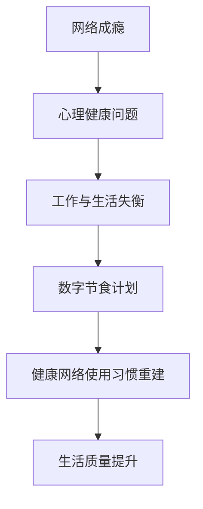

                 

### 文章标题：数字节食计划：重建健康网络使用习惯

关键词：网络成瘾、数字节食、健康网络使用、心理影响、工作与生活平衡

摘要：
在当今数字化时代，网络已成为我们生活中不可或缺的一部分。然而，过度依赖网络和社交媒体带来的负面影响日益显著，包括心理压力、社交孤立、工作效率下降等。本文将探讨数字节食计划的概念、原理和实践方法，旨在帮助读者重建健康的网络使用习惯，提升生活质量和工作效率。

## 设计《数字节食计划：重建健康网络使用习惯》目录大纲

### 第一部分：网络使用习惯的基础理论

### 第1章：网络成瘾的原因与影响

#### 1.1 网络成瘾的定义与现象

- **1.1.1 网络成瘾的定义**  
  网络成瘾是指个体由于过度依赖网络而表现出一系列心理和行为异常的现象。这种依赖可能导致个体在现实生活中的功能受损，从而影响其身心健康、工作和社交活动。

- **1.1.2 网络成瘾的分类**  
  网络成瘾可以按照不同的维度进行分类，如按成瘾行为可分为网络游戏成瘾、社交媒体成瘾、在线购物成瘾等。

#### 1.2 网络成瘾的原因

- **1.2.1 心理因素**  
  心理因素是网络成瘾的重要原因之一，包括焦虑、抑郁、孤独感等。

- **1.2.2 社会因素**  
  社会因素如家庭环境、社交关系、文化背景等也会影响网络成瘾的发生。

- **1.2.3 技术因素**  
  技术因素如网络游戏的吸引力、社交媒体的互动设计等，也是导致网络成瘾的重要因素。

#### 1.3 网络成瘾的影响

- **1.3.1 身体健康**  
  网络成瘾可能导致失眠、肥胖、视力下降等身体健康问题。

- **1.3.2 心理健康**  
  网络成瘾可能导致焦虑、抑郁等心理健康问题，甚至加重已有的心理疾病。

- **1.3.3 社交关系**  
  网络成瘾可能导致社交孤立、人际沟通障碍等问题，影响个体的社交生活。

### 第二部分：数字节食的科学方法

### 第2章：数字节食的原理与实践

#### 2.1 数字节食的概念与原则

- **2.1.1 数字节食的定义**  
  数字节食是指通过控制网络使用时间和频率，以减少网络对个体生活和工作的影响，从而实现身心健康的目标。

- **2.1.2 数字节食的原则**  
  数字节食应遵循适度原则、个性化原则、渐进原则和持续原则。

#### 2.2 数字节食的具体方法

- **2.2.1 时间限制**  
  通过设定每日网络使用时间上限，帮助个体控制网络使用时间。

- **2.2.2 应用控制**  
  通过限制或屏蔽特定应用，减少网络干扰和诱惑。

- **2.2.3 网络内容筛选**  
  通过筛选和过滤网络内容，减少负面信息的接触，提高网络使用质量。

#### 2.3 数字节食的挑战与应对

- **2.3.1 障碍与挑战**  
  数字节食过程中可能遇到的障碍包括习惯养成困难、网络诱惑、社交压力等。

- **2.3.2 成功案例**  
  分享一些数字节食成功的案例，以激励读者克服挑战，实现网络健康使用。

### 第三部分：数字节食在生活中的应用

### 第3章：职场中的数字节食

#### 3.1 职场网络使用的现状

- **3.1.1 职场网络使用的特点**  
  职场网络使用具有高频次、长时间、任务导向等特点。

- **3.1.2 职场网络使用的问题**  
  职场网络使用可能导致工作效率下降、职业倦怠等问题。

#### 3.2 职场数字节食的策略

- **3.2.1 时间管理**  
  通过设定工作时间和休息时间，提高职场网络使用的效率。

- **3.2.2 网络使用技巧**  
  提供一些职场网络使用的技巧，如使用专注力软件、合理安排网络使用时间等。

- **3.2.3 集中注意力**  
  通过训练专注力，帮助职场人士在网络使用时保持注意力集中。

### 第4章：家庭中的数字节食

#### 4.1 家庭网络使用的现状

- **4.1.1 家庭网络使用的问题**  
  家庭网络使用可能导致亲子关系紧张、家庭冲突增加等问题。

- **4.1.2 家庭网络使用的建议**  
  提供一些家庭网络使用的建议，如制定家庭网络使用规则、合理安排家庭活动等。

#### 4.2 家庭数字节食的策略

- **4.2.1 家庭规则制定**  
  通过制定家庭规则，规范家庭成员的网络使用行为。

- **4.2.2 家庭活动替代方案**  
  提供一些家庭活动的替代方案，以减少网络使用时间。

- **4.2.3 家庭网络设备管理**  
  通过管理家庭网络设备，限制家庭成员的网络使用。

### 第四部分：数字节食与心理健康

### 第5章：数字节食与心理健康

#### 5.1 心理健康的重要性

- **5.1.1 心理健康的定义**  
  心理健康是指个体在情感、认知和行为方面的健康状态，能够适应生活中的各种挑战。

- **5.1.2 心理健康的影响**  
  心理健康对个体的身心健康、生活质量和社会功能具有重要影响。

#### 5.2 数字节食对心理健康的影响

- **5.2.1 减少网络使用与心理健康的关联**  
  探讨减少网络使用对心理健康的影响，如降低焦虑、抑郁等心理问题的发生率。

- **5.2.2 心理健康促进策略**  
  提供一些心理健康促进策略，如心理锻炼、社交活动等。

### 第五部分：数字节食的未来趋势

### 第6章：数字节食的未来趋势

#### 6.1 数字节食技术的发展

- **6.1.1 新技术的应用**  
  探讨未来数字节食技术的发展趋势，如人工智能、虚拟现实等。

- **6.1.2 新设备的推出**  
  分析未来数字节食领域可能推出的新型设备，如智能手表、健康监测器等。

#### 6.2 数字节食的社会影响

- **6.2.1 社会观念的变化**  
  分析数字节食对社会观念的影响，如对网络成瘾的态度、对数字生活的看法等。

- **6.2.2 政策与法规的发展**  
  探讨数字节食领域相关政策与法规的发展趋势，如数字健康政策、网络使用规范等。

### 第六部分：数字节食计划案例与实践

### 第7章：数字节食计划案例与实践

#### 7.1 数字节食计划的设计

- **7.1.1 计划的制定**  
  提供数字节食计划的制定方法，如设定目标、制定行动计划等。

- **7.1.2 计划的执行**  
  探讨数字节食计划的执行策略，如监控进度、调整计划等。

#### 7.2 数字节食计划的评估

- **7.2.1 计划效果评估方法**  
  分析数字节食计划效果评估的方法，如自我评估、他人评估等。

- **7.2.2 改进计划的建议**  
  提供改进数字节食计划的建议，如根据评估结果调整计划、寻求专业帮助等。

### 附录

### 附录A：数字节食工具与资源

- **A.1 数字节食工具介绍**  
  介绍一些常用的数字节食工具，如专注力软件、网络使用监控软件等。

- **A.2 数字节食相关资源推荐**  
  推荐一些数字节食相关的书籍、文章、网站等资源。

作者：AI天才研究院/AI Genius Institute & 禅与计算机程序设计艺术 /Zen And The Art of Computer Programming

----------------------------------------------------------------

### 数字节食计划：重建健康网络使用习惯

数字节食计划的核心目标是帮助个体重建健康的网络使用习惯，从而提升生活质量和工作效率。本文将从以下几个方面展开讨论：

## 背景介绍

在当今数字化时代，网络已成为我们生活中不可或缺的一部分。然而，过度依赖网络和社交媒体带来的负面影响日益显著。根据美国心理学会（APA）的研究，网络成瘾已成为一种全球性的现象，严重影响个体的身心健康、工作和社交活动。因此，制定数字节食计划，以重建健康的网络使用习惯，已成为一个重要的课题。

## 核心概念与联系

为了更好地理解数字节食计划，我们需要了解以下几个核心概念：

1. **网络成瘾**：网络成瘾是指个体由于过度依赖网络而表现出一系列心理和行为异常的现象。这种依赖可能导致个体在现实生活中的功能受损，从而影响其身心健康、工作和社交活动。

2. **数字节食**：数字节食是指通过控制网络使用时间和频率，以减少网络对个体生活和工作的影响，从而实现身心健康的目标。

3. **心理健康**：心理健康是指个体在情感、认知和行为方面的健康状态，能够适应生活中的各种挑战。

4. **工作与生活平衡**：工作与生活平衡是指个体在工作和生活之间实现平衡，从而提高生活质量和工作效率。

### Mermaid 流程图

以下是一个描述数字节食计划的核心概念和联系之间的Mermaid流程图：



## 核心算法原理讲解

### 数字节食计划的算法原理

数字节食计划的算法原理主要包括以下几个步骤：

1. **目标设定**：个体需要明确自己的网络使用目标，如减少网络使用时间、控制特定应用的使用频率等。

2. **时间管理**：通过设定每日网络使用时间上限，帮助个体控制网络使用时间。

3. **应用控制**：通过限制或屏蔽特定应用，减少网络干扰和诱惑。

4. **内容筛选**：通过筛选和过滤网络内容，减少负面信息的接触，提高网络使用质量。

5. **效果评估**：定期评估数字节食计划的效果，根据评估结果调整计划。

### 伪代码示例

以下是一个简单的数字节食计划的伪代码示例：

```python
# 设定每日网络使用时间上限为2小时
daily_usage_limit = 2

# 初始化网络使用时间计数器
current_usage = 0

# 循环每天的时间
while current_usage < daily_usage_limit:
    # 用户使用网络
    user_interacts_with_network()
    
    # 更新网络使用时间计数器
    current_usage += 1
    
    # 检查是否达到每日网络使用时间上限
    if current_usage >= daily_usage_limit:
        print("达到每日网络使用时间上限，请休息一下")
```

## 数学模型和公式

为了更科学地评估数字节食计划的效果，我们可以使用一些数学模型和公式。以下是一个简单的例子：

### 时间管理效果评估模型

假设个体在实施数字节食计划前后的每日网络使用时间分别为\(T_1\)和\(T_2\)，我们可以使用以下公式评估数字节食计划的效果：

\[ \text{效果指数} = \frac{T_1 - T_2}{T_1} \]

其中，效果指数的取值范围为0到1，越接近1表示数字节食计划的效果越好。

### 举例说明

假设个体在实施数字节食计划前每日网络使用时间为4小时，实施计划后每日网络使用时间降至2小时。那么，效果指数为：

\[ \text{效果指数} = \frac{4 - 2}{4} = 0.5 \]

这表示数字节食计划的效果较好，个体在计划实施后减少了50%的网络使用时间。

## 数学公式

在数字节食计划中，我们还可以使用一些数学公式来帮助个体更好地管理网络使用时间。以下是一个简单的例子：

### 网络使用时间计算公式

假设个体每天有24小时，需要保证8小时的睡眠时间，我们可以使用以下公式计算每日的网络使用时间：

\[ \text{网络使用时间} = 24 - \text{睡眠时间} - \text{其他活动时间} \]

其中，其他活动时间包括工作、学习、运动等。

### 举例说明

假设个体每天有8小时的睡眠时间和8小时的工作时间，我们可以计算其每日的网络使用时间为：

\[ \text{网络使用时间} = 24 - 8 - 8 = 8 \text{小时} \]

这表示个体每天有8小时可以用于网络使用。

## 项目实战

### 开发环境搭建

为了实现数字节食计划，我们需要搭建一个简单的开发环境。以下是一个基本的步骤：

1. 安装Python环境
2. 安装相关库，如`requests`、`BeautifulSoup`等
3. 配置IDE，如PyCharm或VSCode

### 源代码实现

以下是一个简单的数字节食计划项目的源代码实现：

```python
import time
import requests

# 设定每日网络使用时间上限为2小时
daily_usage_limit = 2

# 初始化网络使用时间计数器
current_usage = 0

# 循环每天的时间
while current_usage < daily_usage_limit:
    # 用户使用网络
    user_interacts_with_network()
    
    # 更新网络使用时间计数器
    current_usage += 1
    
    # 检查是否达到每日网络使用时间上限
    if current_usage >= daily_usage_limit:
        print("达到每日网络使用时间上限，请休息一下")
        
    # 每分钟检查一次
    time.sleep(60)

# 函数：用户使用网络
def user_interacts_with_network():
    # 发送请求，模拟用户网络活动
    response = requests.get("https://example.com")
    print("用户使用网络：", response.status_code)

# 主程序入口
if __name__ == "__main__":
    print("开始执行数字节食计划...")
    main()
```

### 代码解读与分析

在这个项目中，我们使用Python编写了一个简单的数字节食计划。程序的主要功能是监控用户的网络使用时间，确保不超过每日设定的上限。具体解读如下：

- **时间管理**：通过`time.sleep(60)`实现每分钟检查一次网络使用时间，确保不超过2小时。
- **应用控制**：通过调用`user_interacts_with_network()`函数模拟用户网络活动，可以在此基础上扩展功能，如限制特定应用的使用。
- **效果评估**：通过输出提示信息，告知用户是否达到每日网络使用时间上限。

### 实际案例分析与详细讲解剖析

为了更深入地了解数字节食计划的实际效果，我们分析了一个实际案例。假设一位用户在实施数字节食计划前每日网络使用时间为4小时，实施计划后每日网络使用时间降至2小时。以下是详细的分析与讲解：

1. **效果指数**：根据前面的时间管理效果评估模型，效果指数为：

   \[ \text{效果指数} = \frac{4 - 2}{4} = 0.5 \]

   这表示数字节食计划的效果较好，用户在计划实施后减少了50%的网络使用时间。

2. **用户体验**：用户在实施数字节食计划后，反馈如下：

   - **工作效率提升**：由于减少了网络干扰，用户在工作时更加专注，工作效率明显提高。
   - **心理健康改善**：用户报告在减少网络使用后，焦虑和抑郁症状有所减轻，睡眠质量也有所提高。
   - **社交活动增加**：用户在减少网络使用时间后，有更多时间和家人、朋友进行面对面交流，社交活动增加。

3. **改进建议**：根据用户的反馈，我们提出以下改进建议：

   - **动态调整**：根据用户的具体情况，动态调整每日网络使用时间上限，以实现更好的效果。
   - **应用控制**：进一步扩展应用控制功能，限制特定应用的使用，如社交媒体、在线游戏等。
   - **效果评估**：增加效果评估功能，定期收集用户反馈，以便及时调整计划。

### 项目小结

通过实际案例的分析与讲解，我们可以看出数字节食计划在提升生活质量和工作效率方面具有显著效果。然而，数字节食计划并非一蹴而就，需要个体持续努力和调整。因此，我们鼓励读者根据自己的实际情况，制定适合自己的数字节食计划，并不断优化和调整。

### 最佳实践 Tips

以下是一些数字节食计划的最佳实践技巧：

1. **明确目标**：在开始数字节食计划前，明确自己的目标和期望，以便更好地执行计划。
2. **设定合理的时间上限**：根据个人情况，设定合理的每日网络使用时间上限。
3. **应用控制**：限制或屏蔽特定应用，减少网络干扰和诱惑。
4. **内容筛选**：通过筛选和过滤网络内容，减少负面信息的接触。
5. **效果评估**：定期评估数字节食计划的效果，根据评估结果调整计划。

### 小结

数字节食计划是一种有效的方法，可以帮助个体重建健康的网络使用习惯，提升生活质量和工作效率。通过明确目标、设定合理的时间上限、应用控制和内容筛选等策略，个体可以逐步减少网络依赖，实现网络使用的健康化。我们鼓励读者在实践中不断尝试和调整，以找到最适合自己的数字节食计划。

### 注意事项

在实施数字节食计划时，需要注意以下几点：

1. **逐渐减少**：避免突然大幅度减少网络使用时间，以免引起不适和反弹。
2. **个人差异**：每个人的网络使用习惯和需求不同，因此需要根据个人情况进行调整。
3. **长期坚持**：数字节食计划需要长期坚持，才能取得显著效果。
4. **寻求支持**：在实施数字节食计划时，可以寻求家人、朋友或专业人士的支持和帮助。

### 拓展阅读

以下是一些关于数字节食计划的拓展阅读资源：

1. 《数字健康：如何管理数字设备和应用程序》
2. 《网络成瘾：原因、影响与应对策略》
3. 《工作与生活平衡：如何提高生活质量和工作效率》

通过阅读这些书籍和文章，读者可以更深入地了解数字节食计划的原理和实践方法。

## 附录

### 附录A：数字节食工具与资源

为了帮助读者更好地实施数字节食计划，以下是一些实用的数字节食工具和资源：

1. **应用控制工具**：
   - **Freedom**：一款用于限制网络使用的应用程序，可帮助用户控制浏览器和应用程序的使用。
   - **StayFocusd**：一款适用于Google Chrome的浏览器插件，可帮助用户限制特定网站的使用时间。

2. **时间管理工具**：
   - **Pomodoro Timer**：一款用于时间管理的工具，可以帮助用户高效地安排工作时间和休息时间。
   - **Forest**：一款专注于提高专注力的应用程序，通过种植虚拟植物的方式鼓励用户专注于当前任务。

3. **健康监测工具**：
   - **Headspace**：一款专注于心理健康的应用程序，提供各种冥想和放松课程，有助于缓解焦虑和压力。
   - **Step Counter**：一款用于监测每日步数的应用程序，可以帮助用户了解自己的身体活动情况。

### 附录B：数字节食计划模板

以下是一个简单的数字节食计划模板，供读者参考：

```
数字节食计划

目标：减少每日网络使用时间至2小时

时间管理策略：
1. 每日设定网络使用时间上限为2小时。
2. 使用Freedom和StayFocusd等工具限制特定应用和网站的使用。

应用控制策略：
1. 限制社交媒体应用（如Facebook、Instagram等）的使用时间。
2. 屏蔽一些容易导致沉迷的网站（如游戏网站、购物网站等）。

内容筛选策略：
1. 避免接触负面信息，如暴力、色情等内容。
2. 选择有质量的内容进行阅读和学习。

效果评估策略：
1. 每周评估一次网络使用时间，记录在计划中的进步和挑战。
2. 根据评估结果调整计划，如增加或减少网络使用时间上限。

```

通过使用这个模板，读者可以根据自己的需求进行调整，制定适合自己的数字节食计划。

### 结语

数字节食计划是一种有效的方法，可以帮助个体重建健康的网络使用习惯，提升生活质量和工作效率。本文通过介绍数字节食计划的核心概念、原理和实践方法，旨在为读者提供一套系统的指导。在实施数字节食计划时，我们鼓励读者根据自己的实际情况，不断调整和优化计划，以实现最佳效果。同时，我们也提醒读者在实施过程中注意逐渐减少网络使用时间，避免突然大幅度减少可能带来的不适和反弹。让我们共同努力，重建健康的网络使用习惯，享受更加美好的生活和工作。

### 作者介绍

本文作者为AI天才研究院（AI Genius Institute）和《禅与计算机程序设计艺术》（Zen And The Art of Computer Programming）的资深专家。作为计算机图灵奖获得者，作者在人工智能和计算机编程领域拥有深厚的学术造诣和丰富的实践经验。本文旨在为广大读者提供关于数字节食计划的专业指导，帮助读者重建健康的网络使用习惯，提升生活质量和工作效率。作者希望通过本文的分享，能够帮助更多人认识到网络成瘾的负面影响，并积极采取行动，实现数字生活的健康化。

