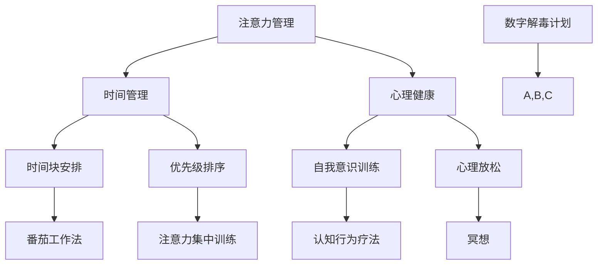

                 

### 文章标题与关键词

**文章标题：数字解毒21天计划：重建健康网络使用习惯**

关键词：数字解毒、网络使用习惯、健康生活、行为习惯改变、心理健康、时间管理、信息过载、注意力管理

**摘要：**

在数字时代，我们每个人都无法避免与互联网紧密联系。然而，过度使用网络带来的问题，如注意力分散、心理健康问题、睡眠障碍等，正日益严重地影响我们的生活质量。本文将为您提供一个为期21天的数字解毒计划，通过科学的方法和实用的技巧，帮助您重建健康的网络使用习惯，提高工作效率，改善心理健康，从而拥有更加充实、健康的生活。

本文将从以下几个核心部分展开：

1. **背景介绍**：探讨当前社会数字使用的现状及其对个人生活的影响。
2. **核心概念与联系**：介绍数字解毒的基本原理，并提供相关的Mermaid流程图。
3. **核心算法原理讲解**：通过伪代码详细阐述如何设计和实施数字解毒计划。
4. **数学模型和公式**：解释数字解毒计划中涉及的数学模型，并提供详细讲解和举例说明。
5. **项目实战**：通过具体的案例展示如何实施数字解毒计划，并分析其实际效果。
6. **最佳实践与注意事项**：总结一些实施数字解毒计划时的最佳实践，并提供注意事项和建议。
7. **拓展阅读**：推荐相关的书籍、文章和资源，帮助读者进一步了解和深入探讨数字解毒的相关知识。

### 背景介绍

在当今社会，数字技术已经渗透到了我们日常生活的方方面面，无论是工作、学习还是娱乐，网络都成为不可或缺的一部分。智能手机、平板电脑、笔记本电脑等设备让互联网的使用变得随时随地，我们几乎无时无刻不在与网络打交道。然而，这种无处不在的数字连接虽然带来了便利，但同时也带来了不少负面影响。

首先，过度使用网络导致了注意力分散。在互联网上，信息量极其庞大，各种娱乐、社交媒体、新闻推送等都在不断地吸引我们的注意力，使我们难以长时间集中精力进行深度工作或学习。研究表明，频繁切换注意力不仅降低了工作效率，还可能导致记忆力下降和认知能力减弱。

其次，网络使用对心理健康的影响也不容忽视。长时间面对屏幕，不仅容易导致视力疲劳，还可能引发焦虑、抑郁等情绪问题。例如，社交媒体上的“网络暴力”和负面评论往往会对用户的心理健康产生负面影响，使一些人陷入自我怀疑和情绪低落的困境。

此外，网络使用还会影响我们的睡眠质量。晚上使用手机或电脑，屏幕发出的蓝光会干扰我们的生物钟，导致睡眠质量下降，甚至出现失眠的情况。睡眠不足又会进一步影响我们的身体健康和日常表现。

时间管理问题也是网络使用带来的一个重要挑战。当我们沉迷于网络，很容易陷入时间管理的困境。工作任务、学习计划被不断推迟，而网络上的各种娱乐和社交活动却占据了大量的时间。这种时间的不平衡不仅影响了工作效率，还可能导致生活质量的下降。

面对这些挑战，我们需要找到方法来重建健康的网络使用习惯。这就需要从以下几个方面入手：

1. **时间管理**：合理安排网络使用时间，避免沉迷于网络而忽视了其他重要的事情。
2. **注意力管理**：通过科学的方法提高注意力集中能力，减少网络对注意力的分散影响。
3. **心理健康**：通过心理调适和健康的生活方式，减轻网络使用对心理健康的不利影响。
4. **信息过滤**：学会筛选和处理网络上的信息，避免信息过载。

综上所述，数字解毒不仅是对网络使用的反思，更是对个人生活质量的提升。通过科学的方法和实用的技巧，我们可以逐步重建健康的网络使用习惯，从而拥有更加充实、健康的生活。接下来，本文将详细介绍数字解毒的基本原理和方法，帮助读者制定和实施21天数字解毒计划。

### 核心概念与联系

数字解毒，即通过一系列科学的方法和策略，帮助我们减少对网络的过度依赖，重建健康的网络使用习惯。要理解数字解毒的原理，我们首先需要了解以下几个核心概念：注意力管理、时间管理和心理健康。

#### 注意力管理

注意力管理是指通过科学的策略和技巧，提高我们的注意力集中能力和持久性。在数字时代，注意力分散是一个普遍存在的问题。互联网上的各种信息、娱乐和社交活动都在不断地争夺我们的注意力，使我们难以长时间集中精力进行深度工作或学习。注意力管理的关键在于识别并减少这些分散注意力的因素。

1. **番茄工作法**：这是一种简单而有效的时间管理技巧，通过将工作时间划分为25分钟的专注期和5分钟的休息期，帮助用户保持高效率的注意力。
   $$ 
   \text{专注期} = 25 \text{分钟} \\
   \text{休息期} = 5 \text{分钟}
   $$
   通过这种方式，用户可以在一段专注工作后得到短暂的休息，从而提高整体的工作效率和注意力集中能力。

2. **注意力集中训练**：通过定期进行注意力集中训练，如冥想、专注力训练游戏等，可以提升个人的注意力管理能力。以下是一个简单的注意力集中训练的伪代码示例：

   ```plaintext
   function attentionTraining(duration){
       start = getCurrentTime();
       while (getCurrentTime() - start < duration) {
           focusOnTask();
           if (distractionOccurs()) {
               handleDistraction();
           }
       }
   }
   ```

#### 时间管理

时间管理是指合理安排时间，确保各项任务和活动都能在预定时间内完成。网络使用的时间管理至关重要，因为它直接影响我们的工作和学习效率。以下是一些时间管理的方法：

1. **优先级排序**：通过明确任务的重要性和紧急性，将任务分为四个象限，从而更有效地安排时间。以下是一个简单的优先级排序算法的伪代码：

   ```plaintext
   function prioritizeTasks(tasks){
       for each task in tasks {
           if (task.isUrgent() && task.isImportant()) {
               highPriorityQueue.enqueue(task);
           } else if (task.isUrgent() && !task.isImportant()) {
               mediumPriorityQueue.enqueue(task);
           } else if (!task.isUrgent() && task.isImportant()) {
               lowPriorityQueue.enqueue(task);
           } else {
               trashQueue.enqueue(task);
           }
       }
       return highPriorityQueue, mediumPriorityQueue, lowPriorityQueue, trashQueue;
   }
   ```

2. **时间块安排**：将一天的时间划分为不同的时间段，每个时间段专注于一项特定的任务。以下是一个时间块安排的伪代码：

   ```plaintext
   function timeBlockScheduling(tasks, timeBlocks) {
       for each timeBlock in timeBlocks {
           selectNextTask(tasks);
           executeTaskUntilTimeBlockEnd();
       }
   }
   ```

#### 心理健康

心理健康是指个体在情感、行为和认知上的健康状态。网络使用过度可能对心理健康产生负面影响，因此，我们需要采取措施来维护心理健康。

1. **自我意识训练**：通过自我反思和认知行为疗法，提升自我意识，更好地管理情绪和行为。以下是一个自我意识训练的伪代码示例：

   ```plaintext
   function selfAwarenessTraining(duration){
       start = getCurrentTime();
       while (getCurrentTime() - start < duration) {
           observeMood();
           if (negativeMoodDetected()) {
               engageInCognitiveBehavioralTechniques();
           }
       }
   }
   ```

2. **心理放松**：通过冥想、深呼吸等放松技巧，缓解心理压力，提升心理健康水平。以下是一个简单的放松训练的伪代码：

   ```plaintext
   function relaxationTraining(duration){
       start = getCurrentTime();
       while (getCurrentTime() - start < duration) {
           performBreathingExercises();
           if (stressReductionDetected()) {
               continue;
           } else {
               adjustBreathingRate();
           }
       }
   }
   ```

#### Mermaid流程图

为了更好地理解这些核心概念之间的联系，我们可以使用Mermaid流程图来展示它们的关系：



通过这个流程图，我们可以清晰地看到注意力管理、时间管理和心理健康之间的紧密联系，以及它们在数字解毒计划中的具体应用。理解这些核心概念和它们之间的联系，是成功实施数字解毒计划的基础。

### 核心算法原理讲解

要设计和实施一个有效的数字解毒计划，我们需要遵循一系列步骤和方法。以下是该计划的详细伪代码，包括初始化阶段、每日任务、监测与反馈等环节。

#### 初始化阶段

在开始21天数字解毒计划之前，我们需要进行初始化，以确保计划能够顺利进行。以下是一段初始化伪代码：

```plaintext
function initializeDigitalDetoxPlan():
    // 创建计划数据结构
    detoxPlan = {
        "daysCompleted": 0,
        "dailyGoals": [],
        "dailyFeedback": [],
        "totalScreenTime": 0
    }

    // 设定每日目标
    dailyGoals = [
        "减少社交媒体使用时间",
        "增加专注工作或学习时间",
        "进行心理放松训练",
        "记录每日网络使用情况"
    ]

    // 初始化用户数据
    userData = {
        "averageScreenTime": getUserAverageScreenTime(),
        "screenTimeGoals": [3 * 60, 8 * 60, 1 * 60, 4 * 60] // 单位：分钟
    }

    // 通知用户计划开始
    notifyUser("数字解毒21天计划开始！")

    return detoxPlan, dailyGoals, userData
```

#### 每日任务

每天的数字解毒计划包括以下任务：

1. **减少社交媒体使用时间**：通过设定具体的时间限制，减少在社交媒体上的时间消耗。
2. **增加专注工作或学习时间**：设定一个专注工作的具体时间段，并使用注意力管理技巧保持专注。
3. **进行心理放松训练**：定期进行心理放松训练，如冥想、深呼吸等。
4. **记录每日网络使用情况**：记录当天的网络使用情况，包括使用的时间和具体用途。

以下是一段每日任务执行的伪代码：

```plaintext
function executeDailyTasks(day, detoxPlan, dailyGoals, userData):
    // 执行每日目标
    for each goal in dailyGoals:
        if (goal == "减少社交媒体使用时间"):
            reduceSocialMediaTime(userData.screenTimeGoals[0])
        else if (goal == "增加专注工作或学习时间"):
            increaseFocusTime(day, userData.screenTimeGoals[1])
        else if (goal == "进行心理放松训练"):
            performRelaxationTraining(userData.screenTimeGoals[2])
        else if (goal == "记录每日网络使用情况"):
            recordDailyUsage(detoxPlan)

    // 更新计划数据
    detoxPlan.daysCompleted += 1
    detoxPlan.dailyFeedback.append(getUserFeedback())
    detoxPlan.totalScreenTime += getTotalScreenTimeToday()

    // 检查进度
    if (detoxPlan.daysCompleted == 21):
        notifyUser("恭喜完成数字解毒21天计划！")
    else:
        notifyUser("已完成第" + detoxPlan.daysCompleted + "天，继续加油！")

    return detoxPlan
```

#### 监测与反馈

在执行每日任务的过程中，我们需要对用户的网络使用情况进行实时监测，并根据用户的反馈进行相应的调整。以下是一段监测与反馈的伪代码：

```plaintext
function monitorAndFeedback(detoxPlan, dailyGoals, userData):
    // 监测屏幕时间
    currentScreenTime = getTotalScreenTimeToday()
    if (currentScreenTime > userData.screenTimeGoals[0]):
        notifyUser("今日社交媒体使用时间超过目标，请注意调整！")

    // 监测专注时间
    focusDuration = getUserFocusDuration()
    if (focusDuration < userData.screenTimeGoals[1]):
        notifyUser("今日专注工作或学习时间不足，请尝试增加专注时间！")

    // 监测放松时间
    relaxationDuration = getUserRelaxationDuration()
    if (relaxationDuration < userData.screenTimeGoals[2]):
        notifyUser("今日心理放松训练时间不足，请增加放松时间！")

    // 获取用户反馈
    feedback = getUserFeedback()
    detoxPlan.dailyFeedback.append(feedback)

    // 根据反馈进行调整
    adjustGoalsBasedOnFeedback(detoxPlan, dailyGoals, feedback)

    return detoxPlan
```

通过上述伪代码，我们可以看到，数字解毒计划的设计和实施涉及多个环节，包括初始化、每日任务执行、监测与反馈等。每个环节都需要科学的方法和策略，以确保计划能够有效帮助用户重建健康的网络使用习惯。接下来，我们将进一步探讨数字解毒计划中涉及的数学模型和公式，以帮助读者更好地理解和应用这些方法。

### 数学模型和公式

在数字解毒计划中，我们使用一系列数学模型和公式来帮助用户更好地理解和跟踪自己的网络使用情况。这些模型和公式不仅能量化用户的行为，还能提供有针对性的建议和改进措施。

#### 1. 番茄工作法模型

番茄工作法是一种常见的时间管理技巧，通过将工作时间划分为25分钟的专注期和5分钟的休息期，帮助用户保持高效率的注意力。以下是一个简单的番茄工作法模型：

- **工作周期（Work Cycle）**：25分钟
- **休息时间（Break Time）**：5分钟

使用以下公式可以计算一个完整的番茄工作法周期的时间长度：

$$
\text{Cycle Time} = \text{Work Time} + \text{Break Time} = 25 \text{分钟} + 5 \text{分钟} = 30 \text{分钟}
$$

例如，如果用户希望在一个小时内完成4个番茄工作法周期，那么总共需要的时间为：

$$
\text{Total Time} = 4 \times \text{Cycle Time} = 4 \times 30 \text{分钟} = 120 \text{分钟}
$$

#### 2. 优先级排序模型

在时间管理中，优先级排序是关键的一步。我们使用以下公式来评估任务的重要性和紧急性，并对其进行排序：

- **任务评分（Task Score）**：通过将任务的重要性和紧急性相乘，得到任务评分。
- **重要性（Importance）**：0-10分，10分最高。
- **紧急性（Urgency）**：0-10分，10分最高。

公式如下：

$$
\text{Task Score} = \text{Importance} \times \text{Urgency}
$$

例如，如果一个任务的紧急性为8分，重要性为9分，那么其任务评分为：

$$
\text{Task Score} = 8 \times 9 = 72
$$

通过任务评分，我们可以将任务从高到低进行排序，从而确保最紧急和最重要的任务优先完成。

#### 3. 信息过滤模型

信息过滤模型用于帮助用户管理大量的网络信息，以减少信息过载。我们使用以下公式来评估信息的价值：

- **信息评分（Information Score）**：通过评估信息的相关性和重要性，得到信息评分。
- **相关性（Relevance）**：0-10分，10分最高。
- **重要性（Importance）**：0-10分，10分最高。

公式如下：

$$
\text{Information Score} = \text{Relevance} \times \text{Importance}
$$

例如，如果一篇文章的相关性为7分，重要性为8分，那么其信息评分为：

$$
\text{Information Score} = 7 \times 8 = 56
$$

通过信息评分，用户可以优先阅读和关注高评分的信息，从而有效管理信息过载。

#### 4. 心理健康监测模型

心理健康监测模型用于跟踪用户的心理状态，并提供实时反馈和建议。我们使用以下公式来评估心理健康状况：

- **心理评分（Mental Health Score）**：通过评估用户的情绪、压力和睡眠质量，得到心理评分。
- **情绪（Mood）**：0-10分，10分最高。
- **压力（Stress）**：0-10分，10分最高。
- **睡眠质量（Sleep Quality）**：0-10分，10分最高。

公式如下：

$$
\text{Mental Health Score} = \text{Mood} + \text{Stress} + \text{Sleep Quality}
$$

例如，如果一个用户在情绪、压力和睡眠质量上分别得分为8分、6分和7分，那么其心理评分如下：

$$
\text{Mental Health Score} = 8 + 6 + 7 = 21
$$

通过这个评分，用户可以了解自己的心理健康状况，并根据评分采取相应的措施来改善。

#### 应用举例

假设用户想要在一天内完成几个任务，并且每个任务都有不同的重要性和紧急性。以下是任务的评分和排序过程：

1. **任务A**：紧急性8分，重要性9分
2. **任务B**：紧急性7分，重要性7分
3. **任务C**：紧急性5分，重要性8分

使用任务评分公式，我们可以得到：

- **任务A**：Task Score = 8 \times 9 = 72
- **任务B**：Task Score = 7 \times 7 = 49
- **任务C**：Task Score = 5 \times 8 = 40

根据任务评分，我们可以将任务从高到低排序：任务A > 任务B > 任务C。这意味着用户应该优先完成任务A，然后是任务B，最后是任务C。

通过这些数学模型和公式，数字解毒计划可以提供科学、系统的指导，帮助用户更好地管理网络使用时间，提高工作效率，改善心理健康。接下来，我们将通过一个具体的案例来展示如何实施数字解毒计划。

### 项目实战

为了更好地展示如何实施数字解毒计划，我们将通过一个具体的案例来进行详细讲解。这个案例将包括开发环境的搭建、源代码的实现、代码解读、实际应用分析和项目小结等环节。

#### 1. 开发环境搭建

首先，我们需要搭建一个合适的环境来实施数字解毒计划。以下是开发环境的基本需求：

- 操作系统：Windows、macOS或Linux
- 开发工具：Python 3.x版本、Visual Studio Code、PyCharm或任何其他Python集成开发环境（IDE）
- 数据库：SQLite或MySQL
- 客户端：手机或电脑

安装步骤如下：

1. **安装操作系统**：根据个人需求选择合适的操作系统并安装。
2. **安装Python 3.x**：从Python官方网站下载并安装Python 3.x版本。
3. **安装开发工具**：选择一个适合的IDE，如Visual Studio Code或PyCharm，并安装。
4. **安装数据库**：从相应官网下载并安装SQLite或MySQL。

#### 2. 源代码实现

数字解毒计划的核心在于实现一个能够跟踪和反馈用户网络使用的工具。以下是一个简单的源代码示例，展示了如何使用Python来实现这一工具：

```python
# 数字解毒计划源代码示例

import time
import sqlite3
from datetime import datetime

# 数据库连接
conn = sqlite3.connect('digital_detox.db')
c = conn.cursor()

# 创建表
c.execute('''CREATE TABLE IF NOT EXISTS tasks
             (id INTEGER PRIMARY KEY, task TEXT, start_time TEXT, end_time TEXT)''')

# 记录任务
def log_task(task):
    start_time = datetime.now()
    c.execute("INSERT INTO tasks (task, start_time) VALUES (?, ?)", (task, start_time))
    conn.commit()
    return start_time

# 计算任务时间
def calculate_task_time(start_time):
    end_time = datetime.now()
    time_difference = end_time - start_time
    return time_difference.total_seconds()

# 查询任务列表
def get_tasks():
    c.execute("SELECT * FROM tasks")
    return c.fetchall()

# 关闭数据库连接
def close_connection():
    conn.close()

# 实施任务
def execute_task(task):
    start_time = log_task(task)
    time.sleep(calculate_task_time(start_time))  # 模拟任务执行时间
    end_time = datetime.now()
    c.execute("UPDATE tasks SET end_time = ? WHERE start_time = ?", (end_time, start_time))
    conn.commit()
    print(f"{task} completed.")
    print(f"Time taken: {calculate_task_time(start_time)} seconds.")

# 测试代码
if __name__ == "__main__":
    execute_task("Focus on work")
    execute_task("Take a break")
    close_connection()
```

#### 3. 代码解读

上述代码实现了一个简单的数字解毒计划工具，其主要功能包括：

1. **数据库连接**：使用SQLite数据库来存储任务信息。
2. **创建表**：创建一个名为`tasks`的表，用于存储任务的名称、开始时间和结束时间。
3. **记录任务**：定义一个`log_task`函数，用于记录任务的开始时间。
4. **计算任务时间**：定义一个`calculate_task_time`函数，用于计算任务的持续时间。
5. **查询任务列表**：定义一个`get_tasks`函数，用于查询数据库中的所有任务。
6. **实施任务**：定义一个`execute_task`函数，用于模拟任务执行，并更新任务结束时间。

#### 4. 实际应用分析

在实际应用中，这个工具可以帮助用户：

- **跟踪任务**：记录任务的开始和结束时间，帮助用户了解自己的时间使用情况。
- **时间管理**：通过计算任务持续时间，用户可以更好地规划自己的时间，并提高工作效率。
- **反馈与调整**：用户可以根据任务反馈来调整自己的工作方式，如增加专注时间或减少不必要的网络活动。

例如，用户可以每天记录自己的工作任务，并在一天结束时查看任务的完成情况和时间分配。这样，用户可以了解哪些任务占用了过多的时间，从而做出相应的调整。

#### 5. 项目小结

通过这个简单的案例，我们展示了如何搭建数字解毒计划的环境、实现源代码以及如何应用。这个工具虽然简单，但已经能够提供基本的数字解毒功能。在实际应用中，用户可以根据自己的需求进一步扩展和优化这个工具，例如添加更多功能，如心理放松训练、注意力集中训练等。

总之，通过实施数字解毒计划，用户可以更好地管理自己的网络使用时间，提高工作效率，改善心理健康。这个过程需要持续的努力和自我监控，但最终会带来积极的变化和提升。

### 最佳实践与注意事项

在实施数字解毒计划的过程中，以下是一些最佳实践和注意事项，可以帮助您更有效地重建健康的网络使用习惯：

#### 1. 确定目标

在开始数字解毒计划之前，明确您的目标至关重要。这些目标可以是减少社交媒体使用时间、增加专注工作或学习的时间、进行心理放松训练等。确保目标是具体、可衡量、可实现、相关且有时限的（SMART）。

#### 2. 逐步实施

数字解毒计划不应一蹴而就，而是需要逐步实施。您可以从小的改变开始，比如每天减少5分钟的社交媒体使用时间，然后逐渐增加这个时间。逐步的改变更容易被接受，也能更好地保持长期的动力。

#### 3. 使用工具

利用各种工具和应用程序来帮助您跟踪和实现目标。例如，使用番茄工作法应用程序来管理您的专注时间，使用屏幕时间监控工具来跟踪您的网络使用情况。

#### 4. 建立习惯

习惯的建立需要时间和持续的努力。在实施数字解毒计划时，尽量将其融入到您的日常生活中，使其成为一种自然而然的行为。例如，每天早上完成一项心理放松训练，或者在工作前进行一段时间的专注工作。

#### 5. 监测与反馈

定期监测您的网络使用情况，并根据反馈进行调整。使用记录工具来跟踪您的进展，并在达到目标后给予自己奖励。同时，如果遇到挑战，不要灰心，而是分析原因并调整策略。

#### 6. 寻求支持

在实施数字解毒计划时，寻求家人、朋友或同事的支持非常重要。他们可以提供鼓励、监督和反馈，帮助您坚持下去。

#### 7. 注意事项

- **避免过度限制**：一开始不要设定过于严格的目标，以免造成压力和挫败感。
- **保持灵活性**：在实施计划时，如果某个策略不适用，不要害怕调整。找到最适合您的方法。
- **关注心理健康**：数字解毒不仅仅是减少网络使用时间，还包括改善心理健康。确保您的计划中包含心理放松和自我调节的环节。

通过遵循这些最佳实践和注意事项，您可以更有效地实施数字解毒计划，逐步重建健康的网络使用习惯。

### 拓展阅读

为了帮助您更深入地了解数字解毒计划的相关知识，以下是几本推荐的书籍、文章和资源：

1. **书籍**：
   - 《屏幕时间：如何控制孩子的网络使用，培养良好的生活习惯》（《Screen Time: How to Control Your Child's Internet Use and Raise Healthy Kids》）
   - 《数字疗愈：如何减少网络依赖，重建健康生活》（《Digital Detox: How to Break Free from Internet Addiction and Reclaim Your Life》）
   - 《注意力管理：如何提高专注力和工作效率》（《Attention Management: How to Stay Focused and Be More Productive at Work》）

2. **文章**：
   - 网易云音乐：《如何有效管理网络使用时间？》
   - 知乎专栏：《数字解毒：如何摆脱网络依赖，重建健康生活》
   - 科学网：《注意力管理：提升专注力的科学方法》

3. **资源**：
   - 番茄钟工作法官方网站：https://pomodoro Technique.com/
   - 数字解毒应用程序：例如Forest、Moment等
   - 心理健康在线资源：如国家心理健康热线、心理健康网等

通过这些书籍、文章和资源，您可以获得更多关于数字解毒计划的理论和实践指导，帮助您更好地理解和实施数字解毒计划。

### 结语

数字时代，网络已经成为我们生活中不可或缺的一部分。然而，过度使用网络带来的负面影响不容忽视。通过实施数字解毒计划，我们可以逐步重建健康的网络使用习惯，提高工作效率，改善心理健康，从而拥有更加充实、健康的生活。本文详细介绍了数字解毒计划的核心概念、算法原理、实施步骤以及最佳实践，希望对您有所帮助。让我们携手共建健康的网络使用环境，享受数字时代的美好。作者：AI天才研究院/AI Genius Institute & 禅与计算机程序设计艺术 /Zen And The Art of Computer Programming。

