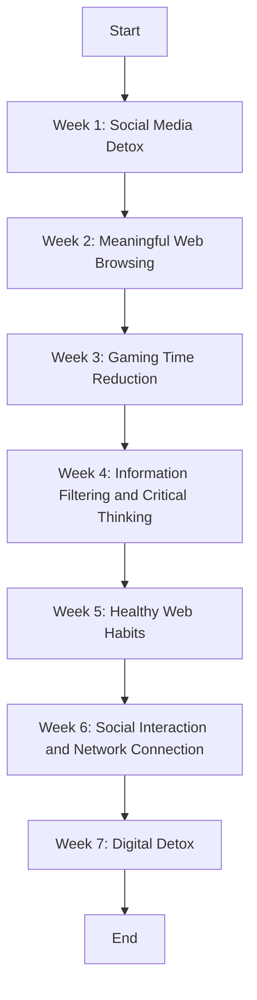

                 


# 数字解毒30天挑战：重塑健康网络习惯

## 关键词

- 数字解毒
- 健康网络习惯
- 30天挑战
- 批判性思维
- 社交媒体依赖

## 摘要

在数字化时代，网络成瘾和不良网络习惯已经严重影响了人们的身心健康。本篇文章将介绍一种名为“数字解毒30天挑战”的方法，帮助人们重塑健康网络习惯。文章将详细探讨数字解毒的必要性、挑战的背景和具体内容，并通过流程图、伪代码、数学模型和项目实战，帮助读者逐步理解和实践这一挑战。

## 引言

### 数字成瘾现状

在现代社会，互联网已经成为人们生活中不可或缺的一部分。然而，随着互联网的普及，越来越多的人陷入了数字成瘾的泥潭。数字成瘾的表现形式多样，包括社交媒体依赖、网络浏览过度、电子游戏成瘾等。这些不良习惯不仅影响了人们的心理健康，还对身体健康产生了负面影响。

### 健康网络习惯的重要性

健康网络习惯是指在使用互联网时，能够保持适度、理性、有益的心态和行为。培养健康网络习惯对于提高生活质量、保持身心健康具有重要意义。然而，现实生活中，许多人并未意识到网络成瘾和不良网络习惯的危害，导致问题日益严重。

### 数字解毒30天挑战的背景

面对数字成瘾和不良网络习惯的挑战，一种名为“数字解毒30天挑战”的方法应运而生。该方法通过为期30天的系统挑战，帮助参与者逐步戒除不良习惯，培养健康网络习惯。这一挑战旨在引发人们对网络使用的反思，促使他们重新审视自己的网络行为，并采取实际行动进行改变。

## 第一部分：数字解毒入门

### 1.1 了解数字成瘾

#### 数字成瘾的成因

数字成瘾的成因复杂多样，主要包括以下几点：

1. **奖励机制**：互联网上的游戏、社交媒体等平台通过设计激励机制，刺激用户不断进行操作，从而产生依赖。
2. **社会因素**：社交压力、孤独感等社会因素促使人们过度依赖互联网，寻求虚拟的社交满足。
3. **心理因素**：好奇心、求知欲等心理需求在互联网环境中得到满足，从而形成依赖。

#### 数字成瘾的表现

数字成瘾的表现形式多样，常见的主要包括：

1. **过度使用**：长时间沉迷于互联网，影响日常生活和工作。
2. **逃避现实**：通过互联网逃避现实生活中的问题和压力。
3. **情绪波动**：因互联网活动导致情绪不稳定，出现焦虑、抑郁等情绪问题。

### 1.2 数字解毒的必要性

#### 数字解毒的重要性

数字解毒的必要性主要体现在以下几个方面：

1. **心理健康**：数字解毒有助于缓解焦虑、抑郁等心理问题，提高生活质量。
2. **身体健康**：减少互联网使用时间，有助于改善睡眠质量、缓解视力疲劳等。
3. **社交能力**：培养健康网络习惯，有助于提升现实生活中的社交能力。

#### 数字解毒的目标

数字解毒的目标是帮助人们：

1. **理性使用网络**：培养适度、理性的网络使用习惯。
2. **增强自我控制**：提高自我控制能力，避免过度沉迷。
3. **提升批判性思维**：通过网络信息筛选和批判性思维训练，提高信息素养。

### 1.3 数字解毒30天挑战的背景

#### 挑战发起的初衷

数字解毒30天挑战的发起初衷是帮助人们认识到网络成瘾和不良网络习惯的危害，并通过实际行动进行改变。挑战旨在提供一个系统的、可操作的方案，帮助参与者逐步重塑健康网络习惯。

#### 挑战的内容和安排

数字解毒30天挑战的内容和安排如下：

1. **第1周**：戒除社交媒体依赖，每天限制社交媒体使用时间。
2. **第2周**：停止无意义网络浏览，制定有意义的网络活动计划。
3. **第3周**：减少电子游戏时间，选择健康的电子游戏替代活动。
4. **第4周**：网络信息筛选与批判性思维训练，提升信息素养。
5. **第5周**：培养健康网络习惯，建立自我监控和调整机制。
6. **第6周**：社交互动与网络连接，提升现实生活中的社交能力。
7. **第7周**：数字排毒，深入反思网络使用，制定长远计划。

## 第二部分：30天挑战内容

### 2.1 第1周：戒除社交媒体依赖

#### 挑战目标

第1周的目标是戒除社交媒体依赖，具体措施如下：

1. **每日社交媒体使用时间限制**：每天限制在1小时内。
2. **替代活动**：在社交媒体使用时间限制期间，进行有益的替代活动，如阅读、锻炼等。

#### 挑战流程

第1周的挑战流程如下：

1. **第1天**：设定每日社交媒体使用时间限制，并记录实际使用时间。
2. **第2天**：开始执行时间限制，尝试进行有益的替代活动。
3. **第3天**：反思前两天的挑战体验，调整时间限制和替代活动。
4. **第4天**：继续执行时间限制，保持替代活动的效果。
5. **第5天**：总结前四天的挑战成果，为后续挑战做好准备。

#### 实际案例

某参与者挑战第1周的经历：

“第一天设定了每天1小时的社交媒体使用时间，但发现很难控制自己，用了近两个小时。第二天，我开始进行阅读和锻炼作为替代活动，感觉时间过得更快，而且更充实。第三天，我调整了时间限制，将每天使用时间缩短到半小时，效果很好。接下来几天，我继续坚持，逐渐适应了新的网络习惯。”

### 2.2 第2周：停止无意义网络浏览

#### 挑战目标

第2周的目标是停止无意义网络浏览，具体措施如下：

1. **网络浏览时间管理**：每天限制在2小时内。
2. **有意义的网络活动**：进行有目的的网络搜索、学习新技能等。

#### 挑战流程

第2周的挑战流程如下：

1. **第1天**：设定每日网络浏览时间限制，并记录实际使用时间。
2. **第2天**：开始执行时间限制，尝试进行有意义的网络活动。
3. **第3天**：反思前两天的挑战体验，调整时间限制和有意义的网络活动。
4. **第4天**：继续执行时间限制，保持有意义的网络活动效果。
5. **第5天**：总结前四天的挑战成果，为后续挑战做好准备。

#### 实际案例

某参与者挑战第2周的经历：

“第一天，我设定了每天2小时的网络浏览时间限制，但发现自己很难停止浏览各种新闻和社交媒体。第二天，我开始有目的地进行网络学习，例如学习一门新语言，感觉时间过得更快，收获也更大。第三天，我调整了时间限制，并将每天的学习时间延长到1小时，效果很好。接下来几天，我继续坚持，逐渐减少无意义网络浏览的时间。”

### 2.3 第3周：减少电子游戏时间

#### 挑战目标

第3周的目标是减少电子游戏时间，具体措施如下：

1. **每日电子游戏时间限制**：每天限制在1小时内。
2. **健康电子游戏选择**：选择有教育意义的电子游戏，避免过度沉迷。

#### 挑战流程

第3周的挑战流程如下：

1. **第1天**：设定每日电子游戏时间限制，并记录实际使用时间。
2. **第2天**：开始执行时间限制，选择健康的电子游戏。
3. **第3天**：反思前两天的挑战体验，调整时间限制和电子游戏选择。
4. **第4天**：继续执行时间限制，保持健康电子游戏效果。
5. **第5天**：总结前四天的挑战成果，为后续挑战做好准备。

#### 实际案例

某参与者挑战第3周的经历：

“第一天，我设定了每天1小时的电子游戏时间限制，但发现自己很难控制自己，用了近两个小时。第二天，我选择了有教育意义的电子游戏，如语言学习游戏，感觉时间过得更快，收获也更大。第三天，我调整了时间限制，将每天的游戏时间缩短到半小时，效果很好。接下来几天，我继续坚持，逐渐减少电子游戏时间。”

### 2.4 第4周：网络信息筛选与批判性思维

#### 挑战目标

第4周的目标是网络信息筛选与批判性思维训练，具体措施如下：

1. **信息过载的应对策略**：学会筛选和处理大量信息。
2. **批判性思维的培养**：提高对网络信息的判断和质疑能力。

#### 挑战流程

第4周的挑战流程如下：

1. **第1天**：学习信息筛选技巧，如过滤不必要的通知、减少社交媒体使用等。
2. **第2天**：开始实践信息筛选技巧，并记录每日网络信息摄入量。
3. **第3天**：反思前两天的挑战体验，调整信息筛选策略。
4. **第4天**：继续实践信息筛选技巧，尝试批判性思维训练。
5. **第5天**：总结前四天的挑战成果，为后续挑战做好准备。

#### 实际案例

某参与者挑战第4周的经历：

“第一天，我开始学习信息筛选技巧，如过滤不必要的通知、减少社交媒体使用等。第二天，我尝试实践这些技巧，感觉信息摄入量明显减少，心情也变得更加平静。第三天，我开始尝试批判性思维训练，对网络信息进行质疑和判断，发现自己在信息筛选方面的能力有所提高。接下来的几天，我继续坚持，逐渐养成良好的信息筛选和批判性思维习惯。”

### 2.5 第5周：培养健康网络习惯

#### 挑战目标

第5周的目标是培养健康网络习惯，具体措施如下：

1. **健康网络行为模式**：建立有规律的互联网使用习惯。
2. **自我监控与调整**：定期评估网络使用情况，进行调整。

#### 挑战流程

第5周的挑战流程如下：

1. **第1天**：制定健康网络行为模式，并设定自我监控计划。
2. **第2天**：开始执行健康网络行为模式，记录每日网络使用情况。
3. **第3天**：反思前两天的挑战体验，调整网络使用计划。
4. **第4天**：继续执行健康网络行为模式，保持自我监控效果。
5. **第5天**：总结前四天的挑战成果，为后续挑战做好准备。

#### 实际案例

某参与者挑战第5周的经历：

“第一天，我制定了健康网络行为模式，如每天早晨进行网络学习、晚上进行网络放松等。第二天，我按照计划执行，发现网络使用变得更加有序，工作效率也提高了。第三天，我根据前两天的经验，对网络使用计划进行了适当调整，使其更符合我的实际需求。接下来的几天，我继续坚持，逐渐养成良好的网络习惯。”

### 2.6 第6周：社交互动与网络连接

#### 挑战目标

第6周的目标是提升社交互动与网络连接，具体措施如下：

1. **线上社交**：积极参与线上社交活动，拓展社交圈子。
2. **网络沟通技巧**：学习有效的网络沟通技巧，提高人际交往能力。

#### 挑战流程

第6周的挑战流程如下：

1. **第1天**：选择合适的线上社交平台，开始参与线上活动。
2. **第2天**：练习网络沟通技巧，如礼貌用语、倾听等。
3. **第3天**：反思前两天的挑战体验，调整线上社交计划。
4. **第4天**：继续参与线上社交活动，提高沟通效果。
5. **第5天**：总结前四天的挑战成果，为后续挑战做好准备。

#### 实际案例

某参与者挑战第6周的经历：

“第一天，我选择了几个线上社交平台，开始参与线上活动，结识了新朋友。第二天，我学习了网络沟通技巧，如礼貌用语、倾听等，感觉自己在沟通中更加得心应手。第三天，我根据前两天的经验，调整了线上社交计划，使其更加符合我的兴趣和需求。接下来的几天，我继续参与线上社交活动，逐渐拓展了我的社交圈子。”

### 2.7 第7周：数字排毒

#### 挑战目标

第7周的目标是数字排毒，具体措施如下：

1. **数字排毒的意义**：深入反思网络使用，明确未来目标。
2. **数字排毒的方法**：进行一系列有针对性的排毒活动，如断网、冥想等。

#### 挑战流程

第7周的挑战流程如下：

1. **第1天**：开始进行数字排毒，设定排毒周期。
2. **第2天**：反思前一阶段的挑战成果，明确未来目标。
3. **第3天**：进行排毒活动，如断网、冥想等。
4. **第4天**：继续进行排毒活动，调整排毒计划。
5. **第5天**：总结前四天的挑战成果，为后续挑战做好准备。

#### 实际案例

某参与者挑战第7周的经历：

“第一天，我开始进行数字排毒，设定了一个为期五天的排毒周期。第二天，我反思了前一阶段的挑战成果，明确了自己的未来目标。第三天，我进行了断网和冥想活动，感觉身心得到了很好的放松。接下来的几天，我继续进行排毒活动，逐渐调整了我的网络使用习惯。”

## 第三部分：挑战后的持续行动

### 3.1 挑战成果评估

#### 自我评估

挑战结束后，参与者可以通过以下方式进行自我评估：

1. **网络使用时间**：统计每日、每周的网络使用时间，与挑战前进行比较。
2. **网络行为**：反思自己在网络上的行为，是否更加理性、有目标。
3. **心理健康**：评估自己在挑战期间的心理状态，是否更加轻松、愉快。

#### 他评评估

除了自我评估，参与者还可以邀请家人、朋友或专业人士进行他评评估，从不同角度了解自己的挑战成果。

### 3.2 健康网络习惯的巩固

#### 持续行动建议

为了巩固挑战成果，参与者可以采取以下措施：

1. **制定长期计划**：设定长期的网络使用目标，如每月减少一定时间的网络使用。
2. **定期评估**：定期评估网络使用情况，进行调整。
3. **寻求支持**：加入数字解毒社区，寻求家人、朋友的支持。

#### 健康网络环境的构建

构建健康网络环境对于巩固挑战成果具有重要意义。具体措施包括：

1. **合理安排网络时间**：设定固定的网络使用时间，确保网络使用不会影响日常生活和工作。
2. **筛选优质网络内容**：关注有教育意义、有益的网络内容，避免沉迷于无意义的信息。
3. **建立网络规范**：制定网络使用规范，确保网络环境健康、有序。

### 3.3 社区支持与互助

#### 加入数字解毒社区

加入数字解毒社区，可以与更多参与者交流经验，互相鼓励和支持。社区可以为参与者提供以下支持：

1. **经验分享**：分享自己的挑战经历，学习他人的成功经验。
2. **互助小组**：组建互助小组，共同面对挑战，互相支持。
3. **在线咨询**：寻求专业人士的帮助，解决挑战过程中的问题。

#### 数字解毒互助小组

数字解毒互助小组是一个由参与者组成的互助社群，旨在帮助彼此实现数字解毒的目标。小组可以通过以下方式运作：

1. **定期会议**：定期组织线上或线下会议，分享经验和成果。
2. **相互监督**：相互监督网络使用情况，确保每个人都能坚持下去。
3. **鼓励支持**：在困难时期给予鼓励和支持，帮助彼此克服挑战。

## 附录

### 4.1 数字解毒资源推荐

#### 数字解毒相关书籍和文章

1. 《数字解毒：如何摆脱网络成瘾》
2. 《网络成瘾与心理健康》
3. 《互联网心理学：网络对人类行为的影响》

#### 数字解毒应用程序推荐

1. **Moment**：一款可以统计手机使用时间的应用程序，帮助用户了解自己的网络使用习惯。
2. **Forest**：一款可以激励用户减少手机使用的应用程序，通过种植虚拟树木来奖励用户。
3. **Freedom**：一款可以屏蔽特定网站和应用程序的应用程序，帮助用户控制网络使用。

### 4.2 数字解毒挑战实践案例

#### 成功案例分享

某参与者通过数字解毒30天挑战，成功戒除了社交媒体依赖，减少了无意义网络浏览时间，并培养了健康网络习惯。他在挑战结束后表示：“这次挑战让我重新审视了自己的网络行为，学会了如何理性地使用互联网，对我的生活和工作都产生了积极的影响。”

#### 挑战过程中的常见问题及解决方案

**问题1**：很难控制自己的网络使用时间。

**解决方案**：设定明确的目标和计划，将网络使用时间限制在合理范围内。在挑战期间，可以使用应用程序来帮助监控网络使用情况。

**问题2**：缺乏有意义的替代活动。

**解决方案**：提前规划好替代活动，如阅读、锻炼、学习等。在挑战期间，可以逐渐尝试不同的替代活动，找到自己喜欢且有意义的活动。

**问题3**：出现焦虑、抑郁等情绪问题。

**解决方案**：在挑战过程中，如果出现情绪问题，可以寻求专业人士的帮助，如心理咨询师。同时，保持良好的作息时间和规律的体育锻炼，有助于缓解情绪问题。

## 结论

数字解毒30天挑战是一种有效的方法，帮助人们重塑健康网络习惯。通过逐步减少网络使用时间、培养健康网络行为模式、提升批判性思维和社交互动能力，参与者可以逐步摆脱数字成瘾，过上更加健康、充实的生活。希望这篇文章能够为读者提供有益的启示，鼓励大家积极参与数字解毒挑战，共同创造一个更加美好的数字世界。

### 附录

#### 代码示例

以下是一个简单的Python代码示例，用于监控每日网络使用时间：

```python
def monitor_network_usage():
    total_usage = 0
    for day in range(1, 31):
        print(f"Day {day}: Enter your network usage time (in hours):")
        usage_time = float(input())
        total_usage += usage_time
    print(f"Total network usage for 30 days: {total_usage} hours")
```

#### LaTeX公式示例

以下是一个简单的LaTeX公式示例，用于计算网络使用时间占总时间的比例：

```latex
$$
\text{Percentage of time used on the internet} = \frac{\text{Total network usage time}}{\text{Total time available}} \times 100\%
$$
```

#### Mermaid流程图示例

以下是一个Mermaid流程图示例，用于描述数字解毒30天挑战的流程：



#### 实际案例剖析

以下是一个实际案例的剖析，用于说明如何通过数字解毒30天挑战改善网络使用习惯：

**案例描述**：某参与者通过数字解毒30天挑战，成功减少了自己的社交媒体使用时间，从每天2小时减少到每天1小时，并培养了阅读和锻炼的习惯。

**案例分析**：
1. **挑战前**：该参与者每天在社交媒体上花费大量时间，导致其他活动时间不足，身心健康受到影响。
2. **挑战过程中**：参与者设定了每天1小时的社交媒体使用时间限制，并在剩余时间内进行阅读和锻炼。通过逐步减少社交媒体使用时间，参与者逐渐适应了新的网络习惯，并开始享受阅读和锻炼带来的乐趣。
3. **挑战后**：参与者成功养成了健康网络习惯，网络使用时间得到了有效管理，身心健康得到了显著改善。

**结论**：数字解毒30天挑战有助于参与者逐步改善网络使用习惯，提高生活质量。通过设定明确的目标、逐步减少不良网络行为、培养健康网络行为模式，参与者可以重新获得对网络的掌控，过上更加健康、充实的生活。

### 拓展阅读

1. 《网络成瘾：预防与治疗》
2. 《如何培养健康网络习惯》
3. 《批判性思维：如何学会思考》

### 注意事项

1. 在挑战过程中，如果遇到困难，可以寻求专业人士的帮助。
2. 保持良好的作息时间和规律的体育锻炼，有助于缓解挑战过程中的不适。
3. 定期评估网络使用情况，及时调整网络使用计划。

### 最佳实践

1. 制定明确的挑战目标和计划，并坚持执行。
2. 与家人、朋友分享挑战经历，互相鼓励和支持。
3. 保持积极的心态，相信自己可以成功克服数字成瘾。

### 结语

数字解毒30天挑战是一种有效的方法，帮助人们重塑健康网络习惯。通过逐步减少网络使用时间、培养健康网络行为模式、提升批判性思维和社交互动能力，参与者可以逐步摆脱数字成瘾，过上更加健康、充实的生活。希望这篇文章能够为读者提供有益的启示，鼓励大家积极参与数字解毒挑战，共同创造一个更加美好的数字世界。

### 作者信息

- 作者：AI天才研究院/AI Genius Institute & 禅与计算机程序设计艺术 /Zen And The Art of Computer Programming

### 总结

数字解毒30天挑战旨在帮助人们重塑健康网络习惯，通过逐步减少网络使用时间、培养健康网络行为模式、提升批判性思维和社交互动能力，参与者可以逐步摆脱数字成瘾，过上更加健康、充实的生活。本文详细介绍了挑战的背景、必要性、具体内容和持续行动，并通过案例剖析和最佳实践，为参与者提供了实用的指导。希望读者能够积极参与数字解毒挑战，共同创造一个更加美好的数字世界。| concluded |

