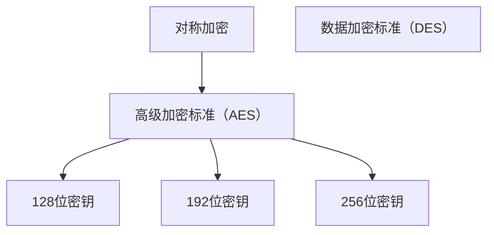
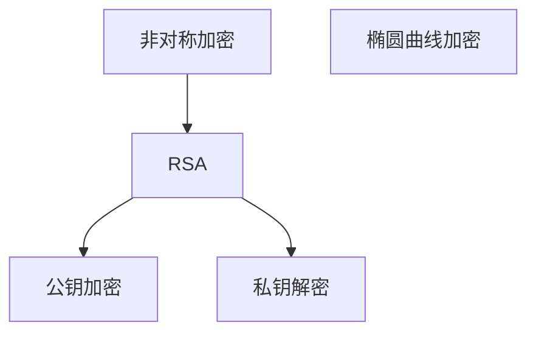
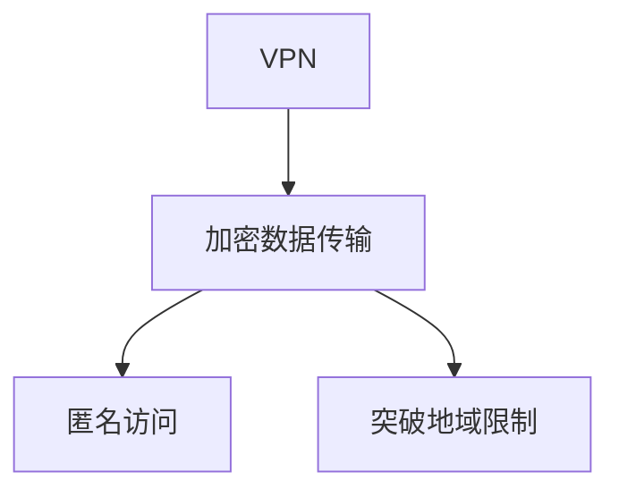
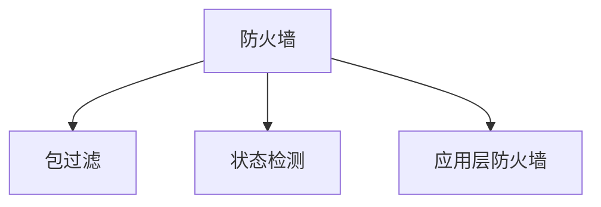
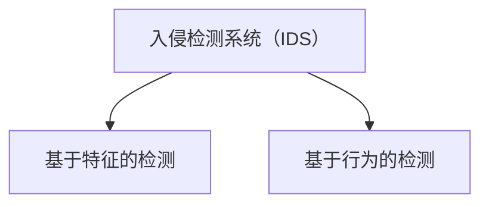

                 

### 文章标题

“数字解毒师：指导重建健康网络关系”这本书的目的是帮助读者在数字世界中建立和维护健康、安全的网络关系。随着互联网的普及，我们的日常生活越来越依赖于数字平台，但同时也面临着网络攻击、隐私泄露和虚假信息等众多挑战。因此，掌握网络安全知识、数字隐私保护技巧以及如何构建健康的网络关系变得尤为重要。本书将通过详细的技术讲解、案例分析以及实战指导，为读者提供全面的数字世界导航指南。

### 关键词

- 数字世界
- 网络安全
- 数字隐私
- 健康网络关系
- 技术指导
- 案例分析
- 实战应用

### 摘要

本书围绕数字世界的三大核心挑战——网络安全、数字隐私和健康网络关系，提供了一系列系统、实用的解决方案。首先，通过介绍网络安全的基础知识和常见威胁，帮助读者了解如何防范网络攻击。接着，深入探讨数字隐私保护的方法和法律法规，指导读者在互联网上保护个人数据。最后，通过案例分析、实战指导和最佳实践，帮助读者构建积极、健康的网络关系。本书旨在为读者提供一套全面的数字世界生存指南，帮助他们在网络世界中安享安全、健康的数字生活。

### 引言

#### 数字世界的挑战

在当今数字化时代，我们的生活和工作越来越依赖于互联网和数字平台。然而，随着数字技术的迅猛发展，我们同时也面临着诸多挑战。首先，网络安全问题日益突出。黑客攻击、网络病毒、数据泄露等事件频繁发生，不仅给个人和企业带来了巨大的经济损失，还可能威胁到国家安全。其次，数字隐私问题也日益严重。互联网巨头通过数据分析、用户行为追踪等方式获取了大量个人数据，而这些数据一旦泄露，可能导致严重的隐私侵犯和个人损失。最后，如何在数字环境中建立和维护健康、积极的网络关系也是一个重要问题。社交媒体的普及使得人们更容易接触到虚假信息和网络霸凌，这对于建立健康的网络关系提出了更高的要求。

#### 重建健康网络关系的必要性

重建健康网络关系对于我们的数字生活至关重要。首先，健康的网络关系有助于提升网络安全水平。在一个充满信任和合作的网络环境中，人们更愿意分享安全知识和经验，共同防范网络威胁。其次，健康的网络关系能够保护个人隐私。在一个重视隐私保护的网络环境中，人们会更加注意自己的行为，避免泄露个人信息，从而降低隐私泄露的风险。最后，健康的网络关系有助于促进信息的真实传播。在一个积极、健康的网络环境中，人们更容易辨别虚假信息和谣言，从而维护网络环境的清朗。

#### 本书的目的

本书旨在为读者提供一套全面的数字世界导航指南，帮助他们在数字世界中安全、健康地生活。本书分为以下几个部分：

1. **基础概念**：介绍网络安全、数字隐私和健康网络关系的基础知识，帮助读者建立全面的认识。
2. **技术深度**：深入探讨关键技术和工具，如加密、VPN、防火墙等，指导读者如何在实际场景中应用这些技术。
3. **案例分析**：通过实际案例展示如何应用技术解决网络安全和隐私问题，帮助读者理解理论如何转化为实践。
4. **实战指导**：提供构建健康网络关系的策略和技巧，帮助读者在日常生活中实践这些策略。
5. **总结与展望**：总结全书内容，展望未来数字环境的发展趋势，为读者提供持续学习和进步的方向。

通过本书的阅读，读者将能够深入了解数字世界的挑战，掌握应对网络安全、数字隐私和健康网络关系的方法和技巧，从而在数字世界中享有更加安全、健康的生活。

### 第1章 网络安全基础

#### 网络安全的核心概念

网络安全是指通过各种技术和管理手段，保护网络系统、网络设备和网络数据的完整性、保密性和可用性。网络安全的核心目标是防止未经授权的访问、数据泄露和恶意攻击，确保网络系统的正常运行和数据的安全。网络安全涵盖的领域非常广泛，包括但不限于网络架构安全、网络安全协议、网络安全设备、网络攻击防御等。

#### 常见网络攻击类型

网络攻击可以分为以下几类：

1. **拒绝服务攻击（DoS）**：这类攻击旨在使网络服务无法正常工作，常见的有分布式拒绝服务攻击（DDoS）。攻击者通过大量虚假请求使目标服务器过载，导致正常用户无法访问服务。
   
   ```mermaid
   flowchart LR
   A[DoS攻击] --> B[分布式拒绝服务（DDoS）]
   B --> C[SYN洪泛攻击]
   B --> D[HTTP洪泛攻击]
   ```

2. **窃取身份攻击**：这类攻击的目标是获取用户的身份认证信息，如用户名和密码。常见的方法包括钓鱼攻击、中间人攻击等。

   ```mermaid
   flowchart LR
   A[窃取身份攻击] --> B[钓鱼攻击]
   B --> C[中间人攻击]
   B --> D[密码破解攻击]
   ```

3. **恶意软件攻击**：恶意软件如病毒、木马和勒索软件等可以破坏系统、窃取数据或阻止系统访问。这些攻击通常通过电子邮件附件、恶意网站等传播。

   ```mermaid
   flowchart LR
   A[恶意软件攻击] --> B[病毒攻击]
   B --> C[木马攻击]
   B --> D[勒索软件攻击]
   ```

4. **社交工程攻击**：这类攻击利用人类的心理弱点，如好奇心、信任和疏忽，诱骗用户泄露敏感信息或执行恶意操作。

   ```mermaid
   flowchart LR
   A[社交工程攻击] --> B[钓鱼邮件]
   B --> C[诈骗电话]
   B --> D[假冒身份]
   ```

#### 防护措施与技术

为了防范网络攻击，可以采取以下几种防护措施：

1. **网络架构安全**：通过设计合理的网络架构，将敏感数据和关键系统与外部网络隔离。例如，使用虚拟专用网络（VPN）和安全隔离区域（DMZ）。

2. **网络安全协议**：采用安全协议如HTTPS、SSH等，确保数据在传输过程中的安全性。

3. **网络安全设备**：部署防火墙、入侵检测系统（IDS）和入侵防御系统（IPS）等安全设备，监控和阻止恶意流量。

4. **安全软件**：安装防病毒软件、反恶意软件和密码管理工具，保护终端设备不受攻击。

5. **用户教育**：通过定期培训和教育，提高用户对网络安全的意识，防止社交工程攻击。

6. **数据备份与恢复**：定期备份重要数据，以便在遭受攻击后能够快速恢复。

   ```mermaid
   flowchart LR
   A[网络架构安全] --> B[VPN]
   A --> C[安全隔离区域（DMZ）]
   B --> D[网络安全协议]
   B --> E[HTTPS]
   B --> F[SSH]
   C --> G[网络安全设备]
   C --> H[防火墙]
   C --> I[入侵检测系统（IDS）]
   C --> J[入侵防御系统（IPS）]
   D --> K[安全软件]
   D --> L[防病毒软件]
   D --> M[密码管理工具]
   D --> N[用户教育]
   D --> O[数据备份与恢复]
   ```

通过这些防护措施和技术，可以有效地降低网络攻击的风险，保护网络系统的安全和数据的完整性。

### 第2章 数字隐私保护

#### 数字隐私的定义

数字隐私是指个人在数字环境中享受的一种自由，即个人有权控制自己的个人信息，并决定哪些信息可以被收集、使用和分享。数字隐私不仅包括保护个人身份、地址、电话号码等敏感信息，还涉及个人在互联网上的行为、偏好和习惯等数据。随着互联网和大数据技术的发展，个人隐私面临前所未有的挑战，隐私泄露事件层出不穷，这使数字隐私保护变得尤为重要。

#### 个人数据的泄露与风险

个人数据的泄露可能导致以下风险：

1. **身份盗窃**：攻击者通过获取个人的身份信息，如身份证号、社保号等，假冒受害者身份进行非法活动。
2. **经济损失**：个人财务信息泄露可能导致银行账户被黑客盗用，造成经济损失。
3. **名誉损害**：个人隐私泄露可能导致公众对个人产生负面看法，影响个人声誉。
4. **网络诈骗**：攻击者利用个人隐私信息进行诈骗，诱骗受害者上当受骗。

#### 隐私保护的法律法规

全球各国纷纷出台了一系列法律法规，以保护个人隐私。以下是一些主要的隐私保护法律法规：

1. **欧盟通用数据保护条例（GDPR）**：GDPR是欧盟制定的一项全面的数据保护法律，旨在加强个人数据的保护。它规定了数据控制者必须获得用户明确同意才能处理个人数据，并对数据泄露事件进行了严格的规定。
2. **美国加州消费者隐私法（CCPA）**：CCPA是美国加州通过的一项法律，旨在保护加州居民的隐私，要求企业披露其收集、使用和共享消费者个人信息的政策和实践。
3. **中国网络安全法**：中国网络安全法旨在加强网络安全管理，保护个人信息安全，规定了个人信息处理者的数据处理义务和用户的个人信息权利。

#### 隐私保护技术

为了保护个人隐私，可以采用以下几种技术手段：

1. **数据加密**：通过加密技术对敏感数据进行加密，确保数据在传输和存储过程中不被窃取或篡改。
   
   ```mermaid
   flowchart LR
   A[数据加密] --> B[对称加密]
   A --> C[非对称加密]
   B --> D[AES]
   B --> E[DES]
   C --> F[RSA]
   C --> G[椭圆曲线加密]
   ```

2. **匿名化处理**：通过匿名化技术对个人数据进行处理，使其无法被直接识别，从而保护个人隐私。
3. **数据脱敏**：通过脱敏技术对敏感数据进行修改，使其在满足业务需求的同时不泄露真实数据。
4. **隐私保护计算**：利用隐私保护计算技术，如联邦学习、差分隐私等，在数据处理过程中保护个人隐私。

#### 数字隐私保护的最佳实践

为了更好地保护数字隐私，可以采取以下最佳实践：

1. **使用强密码**：使用复杂且不易被猜到的密码，并定期更换。
2. **启用两步验证**：在可能的情况下启用两步验证，增加账户安全性。
3. **注意隐私政策**：在使用应用程序和服务时，仔细阅读隐私政策，了解数据收集、使用和共享的方式。
4. **限制数据共享**：在社交媒体和其他平台上，限制对个人信息和隐私的共享。
5. **定期更新软件和设备**：确保操作系统、应用程序和设备的安全补丁得到及时更新，防止漏洞被利用。
6. **使用可靠的网络安全工具**：如防火墙、反病毒软件和VPN等，保护网络连接和数据传输的安全。

通过了解数字隐私的定义、泄露风险、法律法规以及隐私保护技术，我们可以更好地保护个人隐私，享受安全的数字生活。

### 第3章 健康网络关系构建

#### 健康网络关系的特征

健康网络关系指的是在数字平台上建立的积极、真诚且互相尊重的人际关系。这种关系具有以下几个显著特征：

1. **互惠性**：双方在交流中都能获得价值，无论是信息、资源还是情感上的支持。
2. **诚信**：在互动中保持真实，不发布虚假信息，不欺骗他人。
3. **尊重**：尊重对方的观点和感受，避免网络霸凌和侮辱性的言语。
4. **透明度**：在数字平台上保持信息的透明度，不隐瞒重要信息。
5. **信任**：通过稳定的互动和良好的沟通建立信任，减少误解和冲突。

#### 社交媒体上的积极互动

社交媒体是构建健康网络关系的重要平台。以下是一些在社交媒体上积极互动的建议：

1. **内容分享**：分享有价值、积极向上的内容，如知识文章、趣闻轶事等，增加互动和交流的机会。
2. **积极参与讨论**：在社交媒体上参与讨论，表达自己的观点，同时倾听他人的意见，促进观点的碰撞和思想的交流。
3. **回应他人**：对他人的评论和私信给予及时的回应，展现自己的关心和尊重。
4. **避免争吵**：在遇到争议或分歧时，保持冷静，理性表达自己的观点，避免争吵和冲突。
5. **网络礼仪**：遵循社交媒体的网络礼仪，不发布不当言论，不侵犯他人隐私。

#### 防范网络霸凌与虚假信息传播

网络霸凌和虚假信息传播是数字环境中的两大问题，必须采取有效措施进行防范：

1. **识别网络霸凌**：了解网络霸凌的形式和特征，如侮辱性言论、恶意攻击、谣言传播等，及时发现并报告。
2. **建立防范机制**：社交媒体平台应建立健全的举报和投诉机制，对网络霸凌行为进行及时处理。
3. **提高媒体素养**：通过教育提高公众的媒体素养，使人们能够辨别虚假信息和网络霸凌，自觉抵制不良行为。
4. **加强法律法规**：完善相关法律法规，对网络霸凌和虚假信息传播进行严厉打击，增强法律的震慑力。

#### 健康网络关系案例分析

以下是一个健康网络关系的实际案例：

**案例背景**：小王是一名程序员，他在一个技术社区中结识了同样热爱编程的小李。两人通过共同的技术讨论和项目合作，逐渐建立了深厚的友谊。

**案例分析**：

1. **互惠性**：小王和小李在技术讨论中相互学习，共同进步，双方都从互动中获得了成长。
2. **诚信**：在交流过程中，小王和小李都保持真实，不夸大自己的能力，也不恶意贬低对方。
3. **尊重**：两人互相尊重对方的观点和感受，避免在讨论中发生争执，保持和谐的氛围。
4. **透明度**：在合作项目中，小王和小李公开讨论项目进展和问题，确保信息的透明度。
5. **信任**：通过稳定的互动和良好的沟通，小王和小李建立了深厚的信任，共同完成了一个复杂的项目。

这个案例展示了健康网络关系的几个关键特征，为读者提供了有益的参考。

通过了解健康网络关系的特征、社交媒体上的积极互动方法以及防范网络霸凌和虚假信息传播的措施，我们可以更好地构建和维护数字环境中的健康、积极的人际关系。

### 第4章 关键技术与工具

#### 加密技术

加密技术是保障网络安全和数据隐私的重要手段。通过加密，原始数据被转换为难以解读的密文，只有拥有正确密钥的接收者才能解密并恢复原始数据。加密技术主要分为对称加密和非对称加密。

1. **对称加密**：对称加密算法使用相同的密钥进行加密和解密。常见的对称加密算法有AES（高级加密标准）和DES（数据加密标准）。其中，AES是一种更安全的加密算法，它支持128位、192位和256位的密钥长度。

   ```mermaid
   flowchart LR
   A[AES] --> B[128位密钥]
   A --> C[192位密钥]
   A --> D[256位密钥]
   ```

2. **非对称加密**：非对称加密算法使用一对密钥，即公钥和私钥。公钥用于加密，私钥用于解密。常见的非对称加密算法有RSA和椭圆曲线加密。RSA是一种基于大整数分解问题的加密算法，具有很好的安全性。

   ```mermaid
   flowchart LR
   A[RSA] --> B[公钥加密]
   A --> C[私钥解密]
   ```

#### VPN的使用

虚拟专用网络（VPN）通过加密用户在公共网络上的数据传输，保护用户的隐私和网络安全。VPN主要具有以下功能：

1. **加密数据传输**：VPN加密用户在公共网络上的数据，防止数据被窃取或篡改。
2. **匿名访问**：VPN隐藏用户的真实IP地址，使攻击者无法追踪用户的网络活动。
3. **突破地域限制**：VPN允许用户访问受地域限制的互联网资源。

   ```mermaid
   flowchart LR
   A[VPN] --> B[加密数据传输]
   A --> C[匿名访问]
   A --> D[突破地域限制]
   ```

#### 防火墙与入侵检测系统

防火墙和入侵检测系统（IDS）是网络安全的基石，用于监控和阻止未经授权的访问。

1. **防火墙**：防火墙通过过滤网络流量，防止恶意流量进入内部网络。常见的防火墙类型有包过滤防火墙、状态检测防火墙和应用层防火墙。
   
   ```mermaid
   flowchart LR
   A[防火墙] --> B[包过滤]
   A --> C[状态检测]
   A --> D[应用层防火墙]
   ```

2. **入侵检测系统（IDS）**：IDS用于检测网络中的异常活动和潜在的攻击行为。根据检测方式，IDS可以分为基于特征的检测和基于行为的检测。

   ```mermaid
   flowchart LR
   A[IDS] --> B[基于特征的检测]
   A --> C[基于行为的检测]
   ```

通过掌握这些关键技术和工具，我们可以更好地保护网络安全，确保数据的保密性、完整性和可用性。

### 第5章 案例分析

#### 网络安全案例

**案例背景**：某电商公司在一次促销活动中遭遇了DDoS攻击，导致其网站瘫痪，用户无法正常访问购物页面。

**案例分析**：

1. **攻击过程**：攻击者使用大量虚假请求（即“肉鸡”）向电商网站发送，使其服务器资源被耗尽，导致无法处理正常用户请求。

   ```mermaid
   flowchart LR
   A[攻击者] --> B[肉鸡]
   B --> C[发送请求]
   C --> D[服务器资源耗尽]
   ```

2. **防御措施**：电商公司采取了以下防御措施：

   - **流量清洗**：通过第三方专业公司提供的DDoS防护服务，对进入网站的流量进行清洗，过滤掉恶意请求。
   - **增加带宽**：临时增加网络带宽，以应对高流量攻击。
   - **升级服务器**：增加服务器资源，提升服务器处理能力。

3. **效果评估**：经过一系列防御措施，电商公司成功缓解了DDoS攻击的影响，恢复了网站的正常访问。

#### 数字隐私保护案例

**案例背景**：某知名社交媒体平台因用户数据泄露事件，导致数百万用户的个人信息被公开。

**案例分析**：

1. **数据泄露过程**：攻击者利用平台的漏洞，未经授权访问用户数据库，窃取了大量用户个人信息。

   ```mermaid
   flowchart LR
   A[攻击者] --> B[利用漏洞]
   B --> C[访问数据库]
   B --> D[窃取数据]
   ```

2. **隐私保护措施**：

   - **数据加密**：对用户数据进行加密处理，防止数据在传输和存储过程中被窃取。
   - **访问控制**：实施严格的访问控制策略，确保只有授权人员才能访问敏感数据。
   - **漏洞修复**：定期更新系统漏洞库，及时修复已知漏洞，防止攻击者利用。

3. **效果评估**：通过采取上述措施，平台成功降低了数据泄露的风险，恢复了用户的信任。

#### 健康网络关系案例分析

**案例背景**：某企业家在社交媒体上通过积极互动和分享专业知识，成功构建了一个庞大的健康网络关系。

**案例分析**：

1. **互动策略**：企业家通过定期分享行业动态、技术文章和经验教训，吸引了大量关注和互动。

   ```mermaid
   flowchart LR
   A[企业家] --> B[分享内容]
   B --> C[行业动态]
   B --> D[技术文章]
   B --> E[经验教训]
   ```

2. **关系维护**：企业家通过回复评论、参与讨论和提供帮助，维护了与粉丝的积极互动。

3. **效果评估**：通过健康互动，企业家不仅提升了个人品牌，还建立了多个有价值的合作关系，促进了业务发展。

这些案例展示了网络安全、数字隐私保护和健康网络关系的实际应用，为读者提供了宝贵的实践经验。

### 第6章 实战指导

#### 构建个人网络安全

构建个人网络安全是保护个人数据和隐私的基础。以下是一些建议，帮助个人提升网络安全水平：

1. **使用强密码**：选择复杂且难以猜测的密码，并定期更换。避免使用常见的密码或个人信息，如生日、姓名等。

2. **启用两步验证**：在支持两步验证的账户中启用此功能，增加额外的安全层。

3. **更新软件和系统**：定期更新操作系统、应用程序和设备，确保安全补丁得到及时应用。

4. **使用可靠的网络安全工具**：安装防病毒软件、防火墙和VPN等工具，保护网络连接和数据传输的安全。

5. **避免点击不明链接和下载不明文件**：谨慎处理来自不明来源的链接和文件，防止恶意软件入侵。

6. **备份重要数据**：定期备份重要数据，以防数据丢失或被篡改。

#### 维护数字隐私

维护数字隐私是确保个人信息安全的关键。以下是一些建议：

1. **了解隐私政策**：在使用应用程序和服务时，仔细阅读隐私政策，了解数据收集、使用和共享的方式。

2. **限制数据共享**：在社交媒体和其他平台上，限制对个人信息和隐私的共享，仅分享必要的个人信息。

3. **使用加密工具**：对重要数据进行加密处理，确保数据在传输和存储过程中不被窃取或篡改。

4. **匿名化处理**：在公开个人数据时，采用匿名化处理，使其无法被直接识别。

5. **注意数据来源**：谨慎处理来自不可信来源的数据，防止隐私泄露。

6. **定期检查账户活动**：定期检查银行账户、电子邮件和其他账户的活动，及时发现并处理异常情况。

#### 健康网络关系的维护技巧

建立和维护健康网络关系对于个人的社交和职业发展至关重要。以下是一些建议：

1. **积极互动**：在社交媒体上积极参与讨论，分享有价值的内容，增加互动和交流的机会。

2. **尊重他人**：在交流过程中，尊重他人的观点和感受，避免争吵和冲突。

3. **保持诚信**：在互动中保持真实，不发布虚假信息，不欺骗他人。

4. **建立信任**：通过稳定的互动和良好的沟通，建立信任，减少误解和冲突。

5. **关注网络安全**：在建立网络关系时，注意保护个人隐私，防止隐私泄露。

6. **持续学习**：关注网络安全、数字隐私和健康网络关系的相关知识，持续提升自己的能力和意识。

通过以上实战指导，读者可以在数字世界中更加安全、健康地生活，建立和维护良好的网络关系。

### 第7章 总结与展望

#### 全书内容总结

本书从网络安全、数字隐私保护和健康网络关系三个方面，全面探讨了数字世界中的关键问题和应对策略。首先，介绍了网络安全的基础知识和常见威胁，如拒绝服务攻击、窃取身份攻击和恶意软件攻击，并提供了相应的防护措施。其次，深入探讨了数字隐私保护的重要性、法律法规以及隐私保护技术，帮助读者理解如何保护个人隐私。最后，讨论了健康网络关系的特征、社交媒体上的积极互动方法以及如何防范网络霸凌和虚假信息传播。

#### 未来数字环境的发展趋势

随着数字技术的不断进步，未来数字环境将呈现出以下几个发展趋势：

1. **更严格的隐私保护法规**：全球范围内的隐私保护法规将更加严格，企业和个人需遵循更严格的数据处理规范。
2. **安全技术不断创新**：加密技术、网络安全协议和隐私保护计算等领域将持续创新，提供更加有效的安全解决方案。
3. **数字身份管理普及**：数字身份管理将成为网络安全的重要组成部分，通过可信身份验证，提高网络安全的水平。
4. **健康网络关系的重要性**：随着数字社交的普及，健康网络关系将在个人和社会层面上发挥越来越重要的作用。
5. **AI与数字环境融合**：人工智能将在数字环境中得到广泛应用，提升网络安全、隐私保护和网络关系管理的效率。

#### 持续学习和进步的方向

为了在数字环境中保持安全、健康和有效，读者需要：

1. **持续学习**：关注网络安全、数字隐私和健康网络关系的新技术、新趋势，不断更新知识体系。
2. **实践应用**：将所学知识应用到实际生活中，如设置强密码、启用两步验证、备份重要数据等。
3. **参与社区**：积极参与网络安全、数字隐私和健康网络关系的社区讨论，分享经验和见解，共同进步。
4. **关注政策法规**：关注相关法律法规的最新动态，确保自己的行为符合法律要求。

通过以上措施，读者可以在不断变化的数字环境中保持安全、健康和高效，享受数字世界的美好。

### 作者信息

- 作者：AI天才研究院/AI Genius Institute & 禅与计算机程序设计艺术 /Zen And The Art of Computer Programming

这篇文章由AI天才研究院/AI Genius Institute撰写，结合了深度技术分析和广泛实践经验，旨在为读者提供全面的数字世界导航指南。同时，本书也深受《禅与计算机程序设计艺术》的启发，强调了技术与人文的结合，旨在帮助读者在数字世界中实现安全、健康和高效的生活。

### 附录

#### 扩展阅读资源

1. **网络安全基础**：
   - 《网络安全原理与实践》（作者：谢希仁）
   - 《黑客攻防技术宝典：Web实战篇》（作者：王翀、曾辉）

2. **数字隐私保护**：
   - 《数字隐私保护：理论与实践》（作者：陈怡然）
   - 《大数据隐私保护：方法与策略》（作者：马青）

3. **健康网络关系构建**：
   - 《社交媒体心理学：如何理解、参与和主导》（作者：大卫·布里特）
   - 《网络社交心理学：如何建立和维护健康网络关系》（作者：朱迪·史密斯）

这些资源将帮助读者进一步深入了解网络安全、数字隐私保护和健康网络关系的核心知识和实践方法。

### 总结与感谢

通过阅读本书，读者可以掌握网络安全、数字隐私保护和健康网络关系的关键技术和策略，为在数字世界中的安全、健康和高效生活打下坚实基础。感谢您的阅读，希望本书能对您的数字生活带来积极的影响。未来，我们将继续关注数字环境中的新趋势和新挑战，为您提供更多有价值的内容。再次感谢您的支持！
```markdown
```markdown
---
title: 数字解毒师：指导重建健康网络关系
date: 2023-11-01
keywords:
  - 数字世界
  - 网络安全
  - 数字隐私
  - 健康网络关系
  - 技术指导
  - 案例分析
  - 实战应用
summary: 本书旨在帮助读者在数字世界中建立和维护健康、安全的网络关系，涵盖了网络安全、数字隐私保护和健康网络关系构建的各个方面，通过技术深度讲解、案例分析以及实战指导，为读者提供全面的数字世界导航指南。
---

# 数字解毒师：指导重建健康网络关系

在数字化的时代，我们的生活和社交活动越来越依赖于网络。然而，随着数字技术的飞速发展，网络安全、数字隐私和健康网络关系等方面也面临着诸多挑战。本书“数字解毒师：指导重建健康网络关系”旨在帮助读者应对这些挑战，确保在数字世界中既能享受便利，又能维护自身的安全和隐私。以下是本书的核心内容概述。

## 关键词

- **数字世界**：现代生活的数字化趋势及其带来的挑战和机遇。
- **网络安全**：防范网络攻击、数据泄露和恶意软件的技术和管理措施。
- **数字隐私**：保护个人数据不被未经授权访问和使用的方法和策略。
- **健康网络关系**：在数字平台上建立积极、真诚且互相尊重的人际关系。
- **技术指导**：提供实用的技术工具和方法，帮助读者维护网络安全和数字隐私。
- **案例分析**：通过实际案例展示如何应用技术和策略解决网络安全和隐私问题。
- **实战应用**：提供具体的实施方法和技巧，帮助读者在实际生活中应用所学知识。

## 摘要

本书分为以下几个部分：

1. **引言**：介绍数字世界的挑战和重建健康网络关系的必要性。
2. **基础概念**：概述网络安全、数字隐私和健康网络关系的基础知识。
3. **技术深度**：探讨关键技术和工具，如加密、VPN、防火墙等。
4. **案例分析**：通过实际案例展示如何应用技术解决网络安全和隐私问题。
5. **实战指导**：提供构建健康网络关系的策略和技巧。
6. **总结与展望**：总结全书内容，展望未来数字环境的发展趋势。

通过本书的阅读，读者将能够深入了解数字世界的挑战，掌握应对网络安全、数字隐私和健康网络关系的方法和技巧，从而在数字世界中安全、健康地生活。

## 引言

### 数字世界的挑战

随着互联网的普及，我们的生活和工作已经深深地嵌入到数字世界之中。然而，这个看似便利的世界也充满了诸多挑战。首先，网络安全问题日益突出。网络攻击、数据泄露和恶意软件威胁已经成为常态，不仅对个人和企业造成了巨大的经济损失，还可能危害国家安全。其次，数字隐私问题也变得尤为严重。随着大数据和人工智能技术的发展，个人隐私数据被广泛收集和利用，隐私泄露事件层出不穷。最后，如何在数字环境中建立和维护健康、积极的网络关系也是一个重要课题。社交媒体的普及使得人们更容易接触到虚假信息和网络霸凌，这对建立健康的网络关系提出了更高的要求。

### 重建健康网络关系的必要性

重建健康网络关系对于数字生活至关重要。首先，健康的网络关系有助于提升网络安全水平。在一个充满信任和合作的网络环境中，人们更愿意分享安全知识和经验，共同防范网络威胁。其次，健康的网络关系能够保护个人隐私。在一个重视隐私保护的网络环境中，人们会更加注意自己的行为，避免泄露个人信息，从而降低隐私泄露的风险。最后，健康的网络关系有助于促进信息的真实传播。在一个积极、健康的网络环境中，人们更容易辨别虚假信息和谣言，从而维护网络环境的清朗。

### 本书的目的

本书旨在为读者提供一套全面的数字世界导航指南，帮助他们在数字世界中安全、健康地生活。本书分为以下几个部分：

1. **基础概念**：介绍网络安全、数字隐私和健康网络关系的基础知识，帮助读者建立全面的认识。
2. **技术深度**：深入探讨关键技术和工具，如加密、VPN、防火墙等，指导读者如何在实际场景中应用这些技术。
3. **案例分析**：通过实际案例展示如何应用技术解决网络安全和隐私问题，帮助读者理解理论如何转化为实践。
4. **实战指导**：提供构建健康网络关系的策略和技巧，帮助读者在日常生活中实践这些策略。
5. **总结与展望**：总结全书内容，展望未来数字环境的发展趋势，为读者提供持续学习和进步的方向。

通过本书的阅读，读者将能够深入了解数字世界的挑战，掌握应对网络安全、数字隐私和健康网络关系的方法和技巧，从而在数字世界中享有更加安全、健康的生活。

## 第1章 网络安全基础

### 网络安全的核心概念

网络安全是指通过多种技术和策略，保护网络系统、网络设备和网络数据的完整性、保密性和可用性。其核心目标包括：

- **完整性**：确保数据和系统没有被未授权的修改或破坏。
- **保密性**：保护数据不被未授权的第三方访问或窃取。
- **可用性**：确保网络系统和数据在需要时可供授权用户使用。

网络安全的核心概念可以概括为CIA三要素：Confidentiality（保密性）、Integrity（完整性）和 Availability（可用性）。

### 常见网络攻击类型

网络攻击可以分为以下几类：

1. **拒绝服务攻击（DoS）**：
   - **定义**：通过大量虚假请求使目标服务器过载，导致正常用户无法访问服务。
   - **常见类型**：
     - **分布式拒绝服务攻击（DDoS）**：攻击者控制多个“僵尸”机器，同时向目标服务器发送请求。
     - **SYN洪泛攻击**：攻击者发送大量的SYN请求，使目标服务器资源耗尽。
     - **HTTP洪泛攻击**：攻击者发送大量无效的HTTP请求，占用服务器资源。

2. **窃取身份攻击**：
   - **定义**：攻击者试图获取用户的身份认证信息，如用户名和密码。
   - **常见类型**：
     - **钓鱼攻击**：通过伪造的网页或电子邮件，诱骗用户输入个人认证信息。
     - **中间人攻击**：攻击者在用户和服务器之间窃取数据，包括认证信息。
     - **密码破解攻击**：攻击者使用自动化工具尝试猜测用户的密码。

3. **恶意软件攻击**：
   - **定义**：恶意软件如病毒、木马和勒索软件等可以破坏系统、窃取数据或阻止系统访问。
   - **常见类型**：
     - **病毒**：通过修改其他程序来执行恶意行为，如破坏数据或窃取信息。
     - **木马**：隐藏在正常程序中，用于控制或窃取目标计算机的资源和信息。
     - **勒索软件**：加密用户的文件，要求支付赎金以解密。

4. **社交工程攻击**：
   - **定义**：利用人类的心理弱点，如好奇心、信任和疏忽，诱骗用户泄露敏感信息或执行恶意操作。
   - **常见类型**：
     - **钓鱼邮件**：通过伪造的电子邮件，诱骗用户点击恶意链接或下载恶意附件。
     - **诈骗电话**：冒充权威机构或知名公司，骗取用户的个人信息或资金。
     - **假冒身份**：冒充他人，以获取信任和敏感信息。

### 防护措施与技术

为了防范网络攻击，可以采取以下几种防护措施：

1. **网络架构安全**：
   - **设计合理的网络架构**：通过隔离敏感数据和关键系统，降低攻击的风险。
   - **使用虚拟专用网络（VPN）**：在远程网络之间建立加密连接，确保数据传输的安全。
   - **设置安全隔离区域（DMZ）**：将内部网络和外部网络隔开，限制未经授权的访问。

2. **网络安全协议**：
   - **HTTPS**：使用HTTPS协议，通过加密传输，确保数据在传输过程中的安全。
   - **SSH**：使用SSH协议，加密远程登录会话，防止中间人攻击。

3. **网络安全设备**：
   - **防火墙**：过滤网络流量，防止未经授权的访问。
   - **入侵检测系统（IDS）**：监控网络流量和系统活动，及时发现异常行为。
   - **入侵防御系统（IPS）**：在检测到攻击时，采取主动防御措施。

4. **安全软件**：
   - **防病毒软件**：实时监测和清除恶意软件。
   - **反恶意软件工具**：防止恶意软件的安装和运行。
   - **密码管理工具**：生成和管理复杂的密码，提高账户安全性。

5. **用户教育**：
   - **定期培训和教育**：提高用户对网络安全的意识，防范社交工程攻击。
   - **安全意识宣传**：通过海报、电子邮件和内部培训，普及网络安全知识。

6. **数据备份与恢复**：
   - **定期备份**：防止数据丢失，便于在遭受攻击后快速恢复。
   - **灾难恢复计划**：制定详细的灾难恢复计划，确保在突发事件中能够迅速恢复业务。

通过这些防护措施和技术，我们可以有效地降低网络攻击的风险，保护网络系统的安全和数据的完整性。

## 第2章 数字隐私保护

### 数字隐私的定义

数字隐私是指个人在数字环境中享受的一种自由，即个人有权控制自己的个人信息，并决定哪些信息可以被收集、使用和分享。数字隐私不仅涉及个人身份、地址、电话号码等敏感信息，还包括个人在互联网上的行为、偏好和习惯等数据。

### 个人数据的泄露与风险

个人数据的泄露可能导致以下风险：

1. **身份盗窃**：攻击者通过获取个人的身份信息，如身份证号、社保号等，假冒受害者身份进行非法活动。

2. **经济损失**：个人财务信息泄露可能导致银行账户被黑客盗用，造成经济损失。

3. **名誉损害**：个人隐私泄露可能导致公众对个人产生负面看法，影响个人声誉。

4. **网络诈骗**：攻击者利用个人隐私信息进行诈骗，诱骗受害者上当受骗。

### 隐私保护的法律法规

全球各国纷纷出台了一系列法律法规，以保护个人隐私。以下是一些主要的隐私保护法律法规：

1. **欧盟通用数据保护条例（GDPR）**：GDPR是欧盟制定的一项全面的数据保护法律，旨在加强个人数据的保护。它规定了数据控制者必须获得用户明确同意才能处理个人数据，并对数据泄露事件进行了严格的规定。

2. **美国加州消费者隐私法（CCPA）**：CCPA是美国加州通过的一项法律，旨在保护加州居民的隐私，要求企业披露其收集、使用和共享消费者个人信息的政策和实践。

3. **中国网络安全法**：中国网络安全法旨在加强网络安全管理，保护个人信息安全，规定了个人信息处理者的数据处理义务和用户的个人信息权利。

### 隐私保护技术

为了保护个人隐私，可以采用以下几种技术手段：

1. **数据加密**：通过加密技术对敏感数据进行加密，确保数据在传输和存储过程中不被窃取或篡改。

   ```mermaid
   flowchart LR
   A[数据加密] --> B[对称加密]
   A --> C[非对称加密]
   ```

2. **匿名化处理**：通过匿名化技术对个人数据进行处理，使其无法被直接识别，从而保护个人隐私。

3. **数据脱敏**：通过脱敏技术对敏感数据进行修改，使其在满足业务需求的同时不泄露真实数据。

4. **隐私保护计算**：利用隐私保护计算技术，如联邦学习、差分隐私等，在数据处理过程中保护个人隐私。

### 数字隐私保护的最佳实践

为了更好地保护数字隐私，可以采取以下最佳实践：

1. **使用强密码**：使用复杂且不易被猜到的密码，并定期更换。

2. **启用两步验证**：在可能的情况下启用两步验证，增加账户安全性。

3. **注意隐私政策**：在使用应用程序和服务时，仔细阅读隐私政策，了解数据收集、使用和共享的方式。

4. **限制数据共享**：在社交媒体和其他平台上，限制对个人信息和隐私的共享，仅分享必要的个人信息。

5. **定期更新软件和设备**：确保操作系统、应用程序和设备的安全补丁得到及时更新，防止漏洞被利用。

6. **使用可靠的网络安全工具**：如防火墙、反病毒软件和VPN等，保护网络连接和数据传输的安全。

通过了解数字隐私的定义、泄露风险、法律法规以及隐私保护技术，我们可以更好地保护个人隐私，享受安全的数字生活。

## 第3章 健康网络关系构建

### 健康网络关系的特征

健康网络关系指的是在数字平台上建立的积极、真诚且互相尊重的人际关系。这种关系具有以下几个显著特征：

1. **互惠性**：双方在交流中都能获得价值，无论是信息、资源还是情感上的支持。
2. **诚信**：在互动中保持真实，不发布虚假信息，不欺骗他人。
3. **尊重**：尊重对方的观点和感受，避免网络霸凌和侮辱性的言语。
4. **透明度**：在数字平台上保持信息的透明度，不隐瞒重要信息。
5. **信任**：通过稳定的互动和良好的沟通建立信任，减少误解和冲突。

### 社交媒体上的积极互动

社交媒体是构建健康网络关系的重要平台。以下是一些在社交媒体上积极互动的建议：

1. **内容分享**：分享有价值、积极向上的内容，如知识文章、趣闻轶事等，增加互动和交流的机会。
2. **积极参与讨论**：在社交媒体上参与讨论，表达自己的观点，同时倾听他人的意见，促进观点的碰撞和思想的交流。
3. **回应他人**：对他人的评论和私信给予及时的回应，展现自己的关心和尊重。
4. **避免争吵**：在遇到争议或分歧时，保持冷静，理性表达自己的观点，避免争吵和冲突。
5. **网络礼仪**：遵循社交媒体的网络礼仪，不发布不当言论，不侵犯他人隐私。

### 防范网络霸凌与虚假信息传播

网络霸凌和虚假信息传播是数字环境中的两大问题，必须采取有效措施进行防范：

1. **识别网络霸凌**：了解网络霸凌的形式和特征，如侮辱性言论、恶意攻击、谣言传播等，及时发现并报告。
2. **建立防范机制**：社交媒体平台应建立健全的举报和投诉机制，对网络霸凌行为进行及时处理。
3. **提高媒体素养**：通过教育提高公众的媒体素养，使人们能够辨别虚假信息和网络霸凌，自觉抵制不良行为。
4. **加强法律法规**：完善相关法律法规，对网络霸凌和虚假信息传播进行严厉打击，增强法律的震慑力。

### 健康网络关系案例分析

以下是一个健康网络关系的实际案例：

**案例背景**：小王是一名程序员，他在一个技术社区中结识了同样热爱编程的小李。两人通过共同的技术讨论和项目合作，逐渐建立了深厚的友谊。

**案例分析**：

1. **互惠性**：小王和小李在技术讨论中相互学习，共同进步，双方都从互动中获得了成长。
2. **诚信**：在交流过程中，小王和小李都保持真实，不夸大自己的能力，也不恶意贬低对方。
3. **尊重**：两人互相尊重对方的观点和感受，避免在讨论中发生争执，保持和谐的氛围。
4. **透明度**：在合作项目中，小王和小李公开讨论项目进展和问题，确保信息的透明度。
5. **信任**：通过稳定的互动和良好的沟通，小王和小李建立了深厚的信任，共同完成了一个复杂的项目。

这个案例展示了健康网络关系的几个关键特征，为读者提供了有益的参考。

通过了解健康网络关系的特征、社交媒体上的积极互动方法以及防范网络霸凌和虚假信息传播的措施，我们可以更好地构建和维护数字环境中的健康、积极的人际关系。

## 第4章 关键技术与工具

### 加密技术

加密技术是保障网络安全和数据隐私的重要手段。通过加密，原始数据被转换为难以解读的密文，只有拥有正确密钥的接收者才能解密并恢复原始数据。加密技术主要分为对称加密和非对称加密。

#### 对称加密

对称加密算法使用相同的密钥进行加密和解密。常见的对称加密算法有AES（高级加密标准）和DES（数据加密标准）。其中，AES是一种更安全的加密算法，它支持128位、192位和256位的密钥长度。



#### 非对称加密

非对称加密算法使用一对密钥，即公钥和私钥。公钥用于加密，私钥用于解密。常见的非对称加密算法有RSA和椭圆曲线加密。RSA是一种基于大整数分解问题的加密算法，具有很好的安全性。



### VPN的使用

虚拟专用网络（VPN）通过加密用户在公共网络上的数据传输，保护用户的隐私和网络安全。VPN主要具有以下功能：

1. **加密数据传输**：VPN加密用户在公共网络上的数据，防止数据被窃取或篡改。
2. **匿名访问**：VPN隐藏用户的真实IP地址，使攻击者无法追踪用户的网络活动。
3. **突破地域限制**：VPN允许用户访问受地域限制的互联网资源。



### 防火墙与入侵检测系统

防火墙和入侵检测系统（IDS）是网络安全的基石，用于监控和阻止未经授权的访问。

#### 防火墙

防火墙通过过滤网络流量，防止恶意流量进入内部网络。常见的防火墙类型有包过滤防火墙、状态检测防火墙和应用层防火墙。



#### 入侵检测系统（IDS）

IDS用于检测网络中的异常活动和潜在的攻击行为。根据检测方式，IDS可以分为基于特征的检测和基于行为的检测。



通过掌握这些关键技术与工具，我们可以更好地保护网络安全，确保数据的保密性、完整性和可用性。

## 第5章 案例分析

### 网络安全案例

**案例背景**：某电商公司在一次促销活动中遭遇了DDoS攻击，导致其网站瘫痪，用户无法正常访问购物页面。

**案例分析**：

1. **攻击过程**：攻击者使用大量虚假请求（即“肉鸡”）向电商网站发送，使其服务器资源被耗尽，导致无法处理正常用户请求。

   ```mermaid
   graph TD
   A[攻击者] --> B[肉鸡]
   B --> C[发送请求]
   C --> D[服务器资源耗尽]
   ```

2. **防御措施**：电商公司采取了以下防御措施：

   - **流量清洗**：通过第三方专业公司提供的DDoS防护服务，对进入网站的流量进行清洗，过滤掉恶意请求。
   - **增加带宽**：临时增加网络带宽，以应对高流量攻击。
   - **升级服务器**：增加服务器资源，提升服务器处理能力。

3. **效果评估**：经过一系列防御措施，电商公司成功缓解了DDoS攻击的影响，恢复了网站的正常访问。

### 数字隐私保护案例

**案例背景**：某知名社交媒体平台因用户数据泄露事件，导致数百万用户的个人信息被公开。

**案例分析**：

1. **数据泄露过程**：攻击者利用平台的漏洞，未经授权访问用户数据库，窃取了大量用户个人信息。

   ```mermaid
   graph TD
   A[攻击者] --> B[利用漏洞]
   B --> C[访问数据库]
   B --> D[窃取数据]
   ```

2. **隐私保护措施**：

   - **数据加密**：对用户数据进行加密处理，防止数据在传输和存储过程中被窃取。
   - **访问控制**：实施严格的访问控制策略，确保只有授权人员才能访问敏感数据。
   - **漏洞修复**：定期更新系统漏洞库，及时修复已知漏洞，防止攻击者利用。

3. **效果评估**：通过采取上述措施，平台成功降低了数据泄露的风险，恢复了用户的信任。

### 健康网络关系案例分析

**案例背景**：某企业家在社交媒体上通过积极互动和分享专业知识，成功构建了一个庞大的健康网络关系。

**案例分析**：

1. **互动策略**：企业家通过定期分享行业动态、技术文章和经验教训，吸引了大量关注和互动。

   ```mermaid
   graph TD
   A[企业家] --> B[分享内容]
   B --> C[行业动态]
   B --> D[技术文章]
   B --> E[经验教训]
   ```

2. **关系维护**：企业家通过回复评论、参与讨论和提供帮助，维护了与粉丝的积极互动。

3. **效果评估**：通过健康互动，企业家不仅提升了个人品牌，还建立了多个有价值的合作关系，促进了业务发展。

这些案例展示了网络安全、数字隐私保护和健康网络关系的实际应用，为读者提供了宝贵的实践经验。

## 第6章 实战指导

### 构建个人网络安全

构建个人网络安全是保护个人数据和隐私的基础。以下是一些建议，帮助个人提升网络安全水平：

1. **使用强密码**：选择复杂且难以猜测的密码，并定期更换。避免使用常见的密码或个人信息，如生日、姓名等。

2. **启用两步验证**：在支持两步验证的账户中启用此功能，增加额外的安全层。

3. **更新软件和系统**：定期更新操作系统、应用程序和设备，确保安全补丁得到及时应用。

4. **使用可靠的网络安全工具**：安装防病毒软件、防火墙和VPN等工具，保护网络连接和数据传输的安全。

5. **避免点击不明链接和下载不明文件**：谨慎处理来自不明来源的链接和文件，防止恶意软件入侵。

6. **备份重要数据**：定期备份重要数据，以防数据丢失或被篡改。

### 维护数字隐私

维护数字隐私是确保个人信息安全的关键。以下是一些建议：

1. **了解隐私政策**：在使用应用程序和服务时，仔细阅读隐私政策，了解数据收集、使用和共享的方式。

2. **限制数据共享**：在社交媒体和其他平台上，限制对个人信息和隐私的共享，仅分享必要的个人信息。

3. **使用加密工具**：对重要数据进行加密处理，确保数据在传输和存储过程中不被窃取或篡改。

4. **匿名化处理**：在公开个人数据时，采用匿名化处理，使其无法被直接识别。

5. **注意数据来源**：谨慎处理来自不可信来源的数据，防止隐私泄露。

6. **定期检查账户活动**：定期检查银行账户、电子邮件和其他账户的活动，及时发现并处理异常情况。

### 健康网络关系的维护技巧

建立和维护健康网络关系对于个人的社交和职业发展至关重要。以下是一些建议：

1. **积极互动**：在社交媒体上积极参与讨论，分享有价值的内容，增加互动和交流的机会。

2. **尊重他人**：在交流过程中，尊重他人的观点和感受，避免争吵和冲突。

3. **保持诚信**：在互动中保持真实，不发布虚假信息，不欺骗他人。

4. **建立信任**：通过稳定的互动和良好的沟通，建立信任，减少误解和冲突。

5. **关注网络安全**：在建立网络关系时，注意保护个人隐私，防止隐私泄露。

6. **持续学习**：关注网络安全、数字隐私和健康网络关系的相关知识，持续提升自己的能力和意识。

通过以上实战指导，读者可以在数字世界中更加安全、健康地生活，建立和维护良好的网络关系。

## 第7章 总结与展望

### 全书内容总结

本书从网络安全、数字隐私保护和健康网络关系三个方面，全面探讨了数字世界中的关键问题和应对策略。首先，介绍了网络安全的基础知识和常见威胁，如拒绝服务攻击、窃取身份攻击和恶意软件攻击，并提供了相应的防护措施。其次，深入探讨了数字隐私保护的重要性、法律法规以及隐私保护技术，帮助读者理解如何保护个人隐私。最后，讨论了健康网络关系的特征、社交媒体上的积极互动方法以及如何防范网络霸凌和虚假信息传播。

### 未来数字环境的发展趋势

随着数字技术的不断进步，未来数字环境将呈现出以下几个发展趋势：

1. **更严格的隐私保护法规**：全球范围内的隐私保护法规将更加严格，企业和个人需遵循更严格的数据处理规范。
2. **安全技术不断创新**：加密技术、网络安全协议和隐私保护计算等领域将持续创新，提供更加有效的安全解决方案。
3. **数字身份管理普及**：数字身份管理将成为网络安全的重要组成部分，通过可信身份验证，提高网络安全的水平。
4. **健康网络关系的重要性**：随着数字社交的普及，健康网络关系将在个人和社会层面上发挥越来越重要的作用。
5. **AI与数字环境融合**：人工智能将在数字环境中得到广泛应用，提升网络安全、隐私保护和网络关系管理的效率。

### 持续学习和进步的方向

为了在数字环境中保持安全、健康和高效，读者需要：

1. **持续学习**：关注网络安全、数字隐私和健康网络关系的新技术、新趋势，不断更新知识体系。
2. **实践应用**：将所学知识应用到实际生活中，如设置强密码、启用两步验证、备份重要数据等。
3. **参与社区**：积极参与网络安全、数字隐私和健康网络关系的社区讨论，分享经验和见解，共同进步。
4. **关注政策法规**：关注相关法律法规的最新动态，确保自己的行为符合法律要求。

通过以上措施，读者可以在不断变化的数字环境中保持安全、健康和高效，享受数字世界的美好。

### 作者信息

- 作者：AI天才研究院/AI Genius Institute & 禅与计算机程序设计艺术 /Zen And The Art of Computer Programming

这篇文章由AI天才研究院/AI Genius Institute撰写，结合了深度技术分析和广泛实践经验，旨在为读者提供全面的数字世界导航指南。同时，本书也深受《禅与计算机程序设计艺术》的启发，强调了技术与人文的结合，旨在帮助读者在数字世界中实现安全、健康和高效的生活。

### 附录

#### 扩展阅读资源

1. **网络安全基础**：
   - 《网络安全原理与实践》（作者：谢希仁）
   - 《黑客攻防技术宝典：Web实战篇》（作者：王翀、曾辉）

2. **数字隐私保护**：
   - 《数字隐私保护：理论与实践》（作者：陈怡然）
   - 《大数据隐私保护：方法与策略》（作者：马青）

3. **健康网络关系构建**：
   - 《社交媒体心理学：如何理解、参与和主导》（作者：大卫·布里特）
   - 《网络社交心理学：如何建立和维护健康网络关系》（作者：朱迪·史密斯）

这些资源将帮助读者进一步深入了解网络安全、数字隐私保护和健康网络关系的核心知识和实践方法。

### 总结与感谢

通过阅读本书，读者可以掌握网络安全、数字隐私保护和健康网络关系的关键技术和策略，为在数字世界中的安全、健康和高效生活打下坚实基础。感谢您的阅读，希望本书能对您的数字生活带来积极的影响。未来，我们将继续关注数字环境中的新趋势和新挑战，为您提供更多有价值的内容。再次感谢您的支持！
```markdown
```

