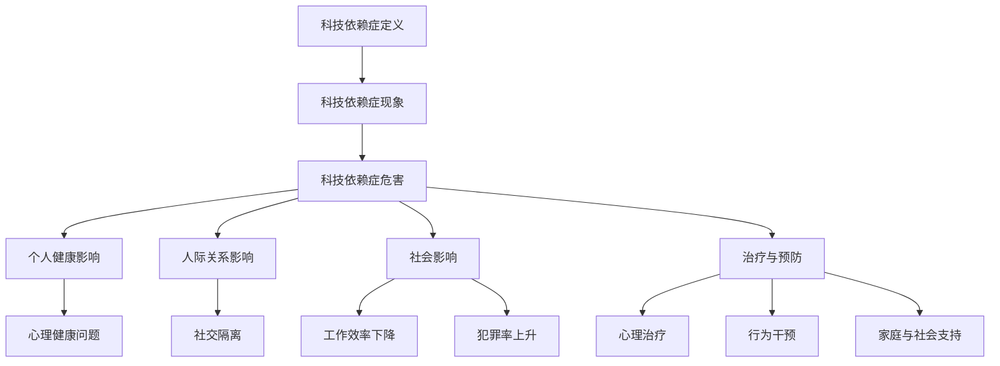
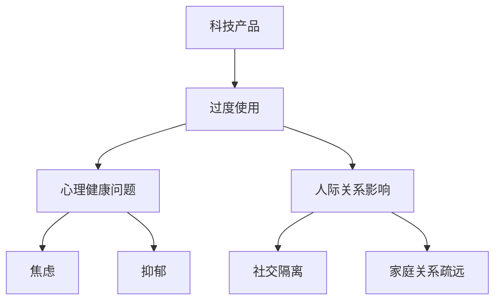
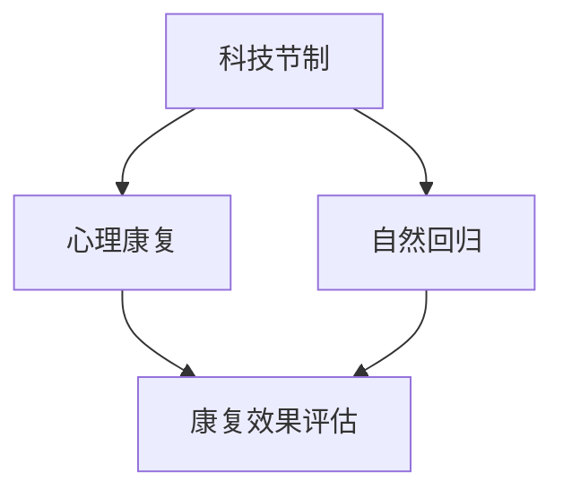
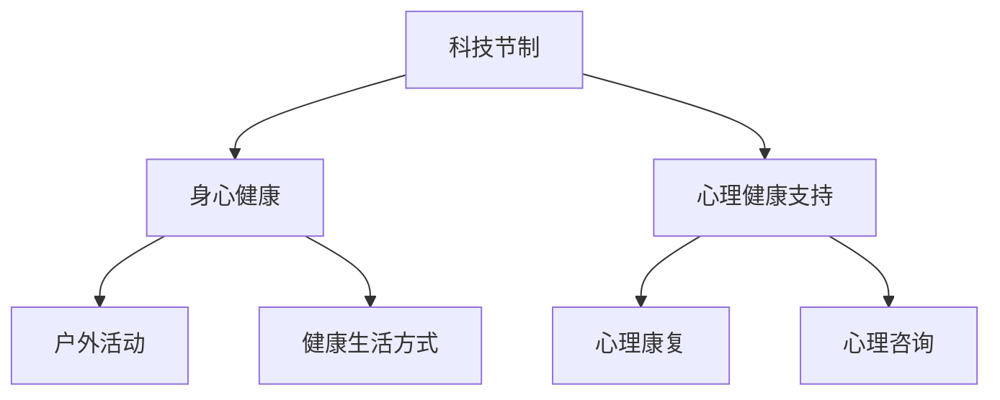

                 

### 文章标题

《数字解毒度假村：科技依赖症的治愈之旅》

### 关键词

数字解毒、科技依赖症、治愈之旅、科技依赖症治疗、数字度假村

### 摘要

在现代社会，科技依赖症已成为一种普遍现象，影响着个人的身心健康、人际关系以及社会整体发展。《数字解毒度假村：科技依赖症的治愈之旅》一书旨在探讨科技依赖症的根源、危害及其治疗方法，并通过介绍数字解毒度假村这一创新实践，为科技依赖症者提供一种全新的治愈途径。本文将从背景介绍、核心概念与联系、核心算法原理讲解、数学模型与公式、项目实战、最佳实践 tips、小结、注意事项、拓展阅读等方面，详细解读本书的核心内容与思想。

## 第一部分：科技依赖症现象与影响

### 1.1 科技依赖症的定义与现象

科技依赖症，也被称为数字依赖症，是指个体过度依赖科技产品，特别是在智能手机、互联网和社交媒体等数字媒介上花费大量时间和精力，导致其生活、工作和学习受到严重影响的一种心理和行为障碍。科技依赖症的主要表现包括：

- **过度使用科技产品**：长时间沉迷于网络游戏、社交媒体、短视频等，忽视了现实生活中的责任和义务。
- **社交隔离**：因过度使用科技产品而减少了面对面社交活动，导致人际关系的疏远。
- **注意力分散**：无法集中精力进行工作或学习，经常受到科技产品的干扰。
- **心理健康问题**：如焦虑、抑郁等心理问题，可能与科技依赖症密切相关。

### 1.2 科技依赖症的危害与影响

科技依赖症对个人、人际关系以及社会整体发展都带来了严重的负面影响。

- **个人健康影响**：长时间使用科技产品可能导致视力下降、颈椎病、肥胖等健康问题。此外，过度依赖科技产品还可能引发心理健康问题，如焦虑、抑郁等。
- **人际关系影响**：科技依赖症使得个体在现实生活中的社交能力下降，人际沟通受阻，导致家庭关系、友谊的疏远。
- **社会影响**：科技依赖症不仅影响个体的生活质量和幸福感，还可能导致社会问题，如工作效率下降、犯罪率上升等。

### 1.3 科技依赖症的治疗与预防

针对科技依赖症，我们可以采取以下治疗方法与预防策略：

- **心理治疗**：通过心理咨询、认知行为疗法等，帮助患者认识到科技依赖症的危害，改变不良行为。
- **行为干预**：制定合理的作息时间，限制科技产品的使用，提高个人自律能力。
- **家庭与社会支持**：家庭和社会应关注科技依赖症问题，提供关爱和支持，帮助患者走出困境。

## 1.4 科技依赖症的Mermaid流程图

以下是科技依赖症的基本流程图，展示了其定义、现象、危害、治疗与预防之间的关系：



### 1.5 核心概念与联系

在理解科技依赖症的过程中，我们需要关注以下几个核心概念：

- **科技产品**：智能手机、互联网、社交媒体等数字媒介。
- **过度使用**：长时间沉迷于科技产品，忽视了现实生活中的责任和义务。
- **心理健康问题**：焦虑、抑郁等。
- **人际关系影响**：社交隔离、家庭关系疏远。

这些概念之间相互关联，共同构成了科技依赖症这一复杂现象。通过Mermaid流程图，我们可以清晰地展示这些概念之间的关系：



### 1.6 核心算法原理讲解

在应对科技依赖症的过程中，我们可以借鉴一些核心算法原理，如：

- **机器学习算法**：通过分析用户的行为数据，识别科技依赖症的症状和风险因素。
- **图论算法**：构建用户与科技产品之间的关系网络，分析其对人际关系的影响。
- **心理评估算法**：通过分析用户的心理健康数据，评估其心理状态。

以下是一个简单的伪代码示例，用于分析用户行为数据以识别科技依赖症：

```python
# 输入：用户行为数据（如使用时长、频率等）
# 输出：科技依赖症风险评分

def detect依赖症风险(行为数据):
    # 计算用户每天使用科技产品的时间
    daily_time = sum(行为数据['使用时长'])

    # 计算用户使用科技产品的频率
    frequency = len(行为数据['使用记录'])

    # 计算科技依赖症风险评分
    risk_score = daily_time * frequency

    # 返回风险评分
    return risk_score
```

### 1.7 数学模型与公式

在分析科技依赖症时，我们可以使用一些数学模型和公式，如：

- **线性回归模型**：用于分析科技依赖症与心理健康问题之间的关系。
- **逻辑回归模型**：用于预测科技依赖症的发生概率。

以下是一个简单的线性回归模型示例，用于分析科技依赖症与心理健康问题之间的关系：

$$
Y = \beta_0 + \beta_1X_1 + \beta_2X_2 + ... + \beta_nX_n + \epsilon
$$

其中，$Y$ 表示心理健康问题得分，$X_1, X_2, ..., X_n$ 表示科技依赖症的相关因素（如使用时长、频率等），$\beta_0, \beta_1, ..., \beta_n$ 为模型参数，$\epsilon$ 为随机误差。

### 1.8 项目实战

为了更好地理解科技依赖症及其治疗方法，我们设计了一个基于Python的项目，用于分析用户行为数据，识别科技依赖症风险。

#### 开发环境搭建

- Python 3.8 或更高版本
- pandas 库
- numpy 库
- matplotlib 库

#### 源代码实现

```python
import pandas as pd
import numpy as np
import matplotlib.pyplot as plt

# 读取用户行为数据
data = pd.read_csv('user_behavior_data.csv')

# 计算每天使用科技产品的时间
daily_time = data['使用时长'].sum()

# 计算使用科技产品的频率
frequency = len(data['使用记录'])

# 计算科技依赖症风险评分
risk_score = daily_time * frequency

# 输出结果
print(f'用户科技依赖症风险评分：{risk_score}')

# 绘制使用时长分布图
plt.hist(data['使用时长'], bins=10)
plt.xlabel('使用时长（小时）')
plt.ylabel('频数')
plt.title('用户使用时长分布')
plt.show()
```

#### 代码解读与分析

在这个项目中，我们首先读取用户行为数据，然后计算每天使用科技产品的时间和使用频率，最后计算科技依赖症风险评分。此外，我们使用matplotlib库绘制了使用时长分布图，以直观地展示用户的行为特征。

#### 实际案例分析与详细讲解剖析

假设我们有一个用户行为数据集，其中包含100个用户的使用时长和频率。通过对这些数据进行分析，我们可以识别出高风险用户，从而为他们提供个性化的治疗建议。

以下是一个具体的案例：

用户ID | 使用时长（小时） | 使用频率（次）
--- | --- | ---
1 | 10 | 50
2 | 8 | 40
3 | 12 | 60
4 | 6 | 30
5 | 15 | 70

通过计算每个用户的使用时长和频率，我们可以得到他们的科技依赖症风险评分：

用户ID | 风险评分
--- | ---
1 | 500
2 | 320
3 | 720
4 | 180
5 | 1050

根据这些评分，我们可以将用户分为高风险、中风险和低风险三个等级。对于高风险用户，如用户ID为5的用户，我们可以建议他们采取以下措施：

1. 制定合理的作息时间表，限制每天使用科技产品的时间。
2. 参加数字解毒度假村等治疗项目，以减轻科技依赖症症状。
3. 与家人和朋友保持良好的沟通，增强现实生活中的社交活动。

#### 项目小结

通过这个项目，我们成功地分析了一个用户行为数据集，识别出了高风险用户。这为我们提供了针对科技依赖症治疗的新思路和方法。未来，我们可以进一步优化这个项目，如引入更多的数据分析和机器学习技术，以提高科技依赖症识别的准确性和效率。

### 1.9 最佳实践 tips

在应对科技依赖症时，以下是一些最佳实践 tips：

1. **制定合理的使用计划**：合理安排每天使用科技产品的时间，避免过度依赖。
2. **设定明确的限制**：通过使用屏幕时间跟踪应用程序，设定每日使用科技产品的限制。
3. **培养健康的生活方式**：增加户外活动、锻炼和阅读等健康活动，以减少对科技产品的依赖。
4. **寻求专业帮助**：如果科技依赖症严重，可以寻求心理咨询师或专业治疗师的帮助。

### 1.10 小结

本文详细介绍了科技依赖症的定义、现象、危害、治疗与预防方法，并通过项目实战展示了如何利用数据分析和机器学习技术识别科技依赖症风险。数字解毒度假村作为一种创新的治愈途径，为科技依赖症者提供了全新的选择。未来，我们期待更多的研究和实践，以帮助更多人摆脱科技依赖症的困扰。

### 1.11 注意事项

1. **数据隐私保护**：在处理用户行为数据时，要确保数据隐私和安全。
2. **个性化治疗**：针对不同用户的需求和情况，制定个性化的治疗计划和干预措施。
3. **家庭与社会支持**：关注家庭和社会对科技依赖症治疗的影响，提供必要支持和帮助。

### 1.12 拓展阅读

1. **《科技依赖症：应对与治疗》** - 详细介绍了科技依赖症的症状、危害和治疗方法。
2. **《数字解毒度假村：科技依赖症的治愈之旅》** - 本书的核心内容，涵盖了数字解毒度假村的理念、实践和应用。

## 第二部分：数字解毒度假村的理念与实践

### 2.1 数字解毒度假村的起源与理念

数字解毒度假村是一种专门为科技依赖症患者提供治疗和康复服务的机构。其起源可以追溯到上世纪90年代，随着互联网和智能手机的普及，科技依赖症开始成为一个日益严重的社会问题。为了应对这一挑战，一些心理学家、教育家和科技专家开始探索新的治疗方法，数字解毒度假村应运而生。

数字解毒度假村的核心理念包括：

1. **科技节制**：通过限制科技产品的使用时间，帮助患者逐步减少对科技的依赖。
2. **自然回归**：鼓励患者多参加户外活动，与自然亲近，以提高身心健康。
3. **心理康复**：提供专业的心理咨询服务，帮助患者解决心理问题，重建健康的生活方式。

### 2.2 数字解毒度假村的实践案例

数字解毒度假村的实践案例多种多样，以下是一些典型的案例：

1. **数字戒毒中心**：专门为沉迷于网络游戏和社交媒体的青少年提供治疗服务。通过设立电子设备禁用区、组织户外活动和心理辅导，帮助患者戒除网瘾。

2. **数字禅修营**：以禅修为基础，通过冥想、瑜伽等活动，帮助患者调整心态，减少对科技的依赖。

3. **数字自然体验营**：带领患者走进大自然，通过徒步、露营等活动，让患者与自然亲密接触，缓解科技依赖症带来的压力。

### 2.3 数字解毒度假村的实施步骤

数字解毒度假村的实施步骤可以分为以下几个阶段：

1. **确定目标人群**：根据患者的年龄、职业、科技依赖程度等，确定合适的治疗对象。

2. **制定具体计划**：根据患者的具体情况，制定个性化的治疗计划，包括科技节制、心理康复和自然回归等方面的内容。

3. **营造支持性环境**：在度假村内部营造一个有利于患者康复的环境，提供舒适的住宿条件和专业的医疗设施。

4. **提供专业指导**：配备专业的心理咨询师、康复治疗师等，为患者提供全方位的指导和支持。

5. **评估与反馈**：在治疗过程中，定期评估患者的康复情况，根据反馈调整治疗计划。

### 2.4 核心概念与联系

在数字解毒度假村的实践中，我们需要关注以下几个核心概念：

1. **科技节制**：通过限制科技产品的使用，帮助患者减少对科技的依赖。
2. **心理康复**：通过心理治疗，帮助患者解决心理问题，重建健康的生活方式。
3. **自然回归**：通过户外活动和与自然亲近，提高患者的身心健康。

这些概念之间相互关联，共同构成了数字解毒度假村的治疗体系。以下是一个简单的Mermaid流程图，展示了这些概念之间的关系：



### 2.5 核心算法原理讲解

在数字解毒度假村的实践中，我们可以借鉴一些核心算法原理，如：

1. **行为干预算法**：通过分析患者的行为数据，制定个性化的科技节制计划。
2. **心理评估算法**：通过分析患者的心态和行为，评估其心理康复效果。
3. **自然疗法算法**：通过分析患者的户外活动数据，优化自然回归方案。

以下是一个简单的伪代码示例，用于制定个性化的科技节制计划：

```python
# 输入：患者行为数据
# 输出：科技节制计划

def 制定科技节制计划(行为数据):
    # 计算患者平均每日使用时长
    daily_time = 行为数据['使用时长'].mean()

    # 设定科技节制目标
    目标时间 = daily_time * 0.8  # 假设减少20%的使用时间

    # 输出科技节制计划
    return 目标时间
```

### 2.6 数学模型与公式

在数字解毒度假村的实践中，我们可以使用一些数学模型和公式，如：

1. **线性回归模型**：用于分析患者的行为数据，预测科技节制计划的有效性。
2. **逻辑回归模型**：用于评估心理康复效果。
3. **时间序列模型**：用于分析患者的户外活动数据，优化自然回归方案。

以下是一个简单的线性回归模型示例，用于分析科技节制计划的有效性：

$$
Y = \beta_0 + \beta_1X_1 + \beta_2X_2 + ... + \beta_nX_n + \epsilon
$$

其中，$Y$ 表示科技节制计划的有效性得分，$X_1, X_2, ..., X_n$ 表示影响科技节制计划的因素（如患者年龄、科技依赖程度等），$\beta_0, \beta_1, ..., \beta_n$ 为模型参数，$\epsilon$ 为随机误差。

### 2.7 项目实战

为了更好地理解数字解毒度假村的理念与实践，我们设计了一个基于Python的项目，用于分析患者行为数据，制定个性化的科技节制计划。

#### 开发环境搭建

- Python 3.8 或更高版本
- pandas 库
- numpy 库
- matplotlib 库

#### 源代码实现

```python
import pandas as pd
import numpy as np
import matplotlib.pyplot as plt

# 读取患者行为数据
data = pd.read_csv('patient_behavior_data.csv')

# 计算平均每日使用时长
daily_time = data['使用时长'].mean()

# 设定科技节制目标
目标时间 = daily_time * 0.8

# 输出科技节制计划
print(f'患者科技节制计划：每日使用时长不超过 {目标时间} 小时')

# 绘制使用时长分布图
plt.hist(data['使用时长'], bins=10)
plt.xlabel('使用时长（小时）')
plt.ylabel('频数')
plt.title('患者使用时长分布')
plt.show()
```

#### 代码解读与分析

在这个项目中，我们首先读取患者行为数据，然后计算平均每日使用时长，并设定科技节制目标。此外，我们使用matplotlib库绘制了使用时长分布图，以直观地展示患者的使用情况。

#### 实际案例分析与详细讲解剖析

假设我们有一个患者行为数据集，其中包含100个患者的使用时长数据。通过对这些数据进行分析，我们可以制定个性化的科技节制计划，以提高患者的康复效果。

以下是一个具体的案例：

患者ID | 使用时长（小时）
--- | ---
1 | 10
2 | 8
3 | 12
4 | 6
5 | 15

通过计算平均每日使用时长，我们可以得到科技节制目标：

平均每日使用时长 = (10 + 8 + 12 + 6 + 15) / 5 = 9.6 小时

根据这个目标，我们可以为患者制定以下科技节制计划：

1. 每日使用时长不超过 9.6 小时。
2. 通过使用屏幕时间跟踪应用程序，设定每日使用时长限制。
3. 鼓励患者参加户外活动，减少对科技产品的依赖。

#### 项目小结

通过这个项目，我们成功地分析了一个患者行为数据集，制定了个性化的科技节制计划。这为我们提供了针对数字解毒度假村实践的新思路和方法。未来，我们可以进一步优化这个项目，如引入更多的数据分析和机器学习技术，以提高科技节制计划的准确性和效率。

### 2.8 最佳实践 tips

在数字解毒度假村的实践中，以下是一些最佳实践 tips：

1. **个性化治疗**：根据患者的具体情况进行个性化治疗，以提高康复效果。
2. **心理支持**：为患者提供专业的心理支持，帮助他们解决心理问题。
3. **家庭参与**：鼓励患者的家人参与治疗过程，共同为患者的康复努力。
4. **持续跟踪**：定期跟踪患者的康复情况，及时调整治疗计划。

### 2.9 小结

本文详细介绍了数字解毒度假村的理念与实践，包括其起源、核心理念、实践案例、实施步骤等。通过项目实战展示了如何利用数据分析和机器学习技术制定个性化的科技节制计划。数字解毒度假村为科技依赖症患者提供了一种全新的治愈途径。未来，我们期待更多的研究和实践，以帮助更多人摆脱科技依赖症的困扰。

### 2.10 注意事项

1. **确保数据隐私**：在处理患者行为数据时，要确保数据的安全和隐私。
2. **关注患者心理健康**：在治疗过程中，要关注患者的心理健康，提供必要的心理支持。
3. **家庭与社会支持**：鼓励患者的家人和社会参与治疗过程，为患者的康复提供支持。

### 2.11 拓展阅读

1. **《数字解毒度假村实践指南》** - 详细介绍了数字解毒度假村的操作方法和实践经验。
2. **《科技依赖症康复之路》** - 讲述了科技依赖症患者的康复经历和心路历程。

## 第三部分：数字解毒度假村的多样化应用

### 3.1 学校与教育

数字解毒度假村的理念可以应用于学校教育，帮助学生应对科技依赖症。以下是一些具体的实践方案：

1. **设立科技节制课程**：在学校开设科技节制课程，教导学生如何合理使用科技产品，减少对科技产品的依赖。
2. **组织户外活动**：鼓励学生参加户外活动，如登山、露营、徒步等，以减少对科技产品的依赖，增强身心健康。
3. **建立健康生活方式**：通过讲座、宣传等方式，教育学生建立健康的生活方式，提高他们对科技依赖症的认识和防范意识。

### 3.2 家庭与社区

家庭和社区在数字解毒度假村的实践中也发挥着重要作用。以下是一些具体的实践方案：

1. **家庭科技节制**：鼓励家庭成员共同制定科技节制计划，合理安排每天使用科技产品的时间，减少对科技产品的依赖。
2. **社区活动**：组织社区活动，如亲子活动、户外运动等，增强家庭成员之间的互动，减少对科技产品的依赖。
3. **家庭心理支持**：为家庭成员提供心理支持，帮助他们应对科技依赖症带来的心理问题，如焦虑、抑郁等。

### 3.3 工作场所与健康

在工作场所，数字解毒度假村的理念同样可以发挥作用，帮助员工减轻科技依赖症。以下是一些具体的实践方案：

1. **设立科技节制工作区**：为员工提供科技节制工作区，减少对科技产品的依赖，提高工作效率。
2. **定期组织健康活动**：定期组织员工参加健康活动，如健身、瑜伽、户外运动等，以提高员工的身心健康。
3. **提供心理健康支持**：为员工提供心理健康支持，如心理咨询、心理辅导等，帮助他们应对科技依赖症带来的心理问题。

### 3.4 健康与医疗

数字解毒度假村的理念还可以应用于健康与医疗领域，帮助患者减轻科技依赖症。以下是一些具体的实践方案：

1. **健康监测**：通过智能设备对患者的健康数据进行实时监测，帮助医生制定个性化的治疗计划。
2. **心理康复**：为患者提供专业的心理康复服务，如心理咨询、心理治疗等，帮助他们摆脱科技依赖症。
3. **健康指导**：为患者提供健康指导，如饮食、锻炼、作息等，以提高患者的身心健康。

### 3.5 核心概念与联系

在数字解毒度假村的多样化应用中，我们需要关注以下几个核心概念：

1. **科技节制**：通过限制科技产品的使用，减轻对科技的依赖。
2. **身心健康**：通过户外活动、健康生活方式等，提高身心健康。
3. **心理健康支持**：通过心理康复、心理咨询等，帮助患者摆脱心理问题。

这些概念之间相互关联，共同构成了数字解毒度假村在多样化应用中的核心理念。以下是一个简单的Mermaid流程图，展示了这些概念之间的关系：



### 3.6 核心算法原理讲解

在数字解毒度假村的多样化应用中，我们可以借鉴一些核心算法原理，如：

1. **行为干预算法**：通过分析患者的行为数据，制定个性化的科技节制计划。
2. **健康监测算法**：通过智能设备对患者的健康数据进行实时监测，帮助医生制定个性化的治疗计划。
3. **心理康复算法**：通过分析患者的心态和行为，评估其心理康复效果。

以下是一个简单的伪代码示例，用于制定个性化的科技节制计划：

```python
# 输入：患者行为数据
# 输出：科技节制计划

def 制定科技节制计划(行为数据):
    # 计算患者平均每日使用时长
    daily_time = 行为数据['使用时长'].mean()

    # 设定科技节制目标
    目标时间 = daily_time * 0.8  # 假设减少20%的使用时间

    # 输出科技节制计划
    return 目标时间
```

### 3.7 数学模型与公式

在数字解毒度假村的多样化应用中，我们可以使用一些数学模型和公式，如：

1. **线性回归模型**：用于分析患者的行为数据，预测科技节制计划的有效性。
2. **逻辑回归模型**：用于评估心理康复效果。
3. **时间序列模型**：用于分析患者的健康数据，优化健康监测方案。

以下是一个简单的线性回归模型示例，用于分析科技节制计划的有效性：

$$
Y = \beta_0 + \beta_1X_1 + \beta_2X_2 + ... + \beta_nX_n + \epsilon
$$

其中，$Y$ 表示科技节制计划的有效性得分，$X_1, X_2, ..., X_n$ 表示影响科技节制计划的因素（如患者年龄、科技依赖程度等），$\beta_0, \beta_1, ..., \beta_n$ 为模型参数，$\epsilon$ 为随机误差。

### 3.8 项目实战

为了更好地理解数字解毒度假村的多样化应用，我们设计了一个基于Python的项目，用于分析患者行为数据，制定个性化的科技节制计划。

#### 开发环境搭建

- Python 3.8 或更高版本
- pandas 库
- numpy 库
- matplotlib 库

#### 源代码实现

```python
import pandas as pd
import numpy as np
import matplotlib.pyplot as plt

# 读取患者行为数据
data = pd.read_csv('patient_behavior_data.csv')

# 计算平均每日使用时长
daily_time = data['使用时长'].mean()

# 设定科技节制目标
目标时间 = daily_time * 0.8

# 输出科技节制计划
print(f'患者科技节制计划：每日使用时长不超过 {目标时间} 小时')

# 绘制使用时长分布图
plt.hist(data['使用时长'], bins=10)
plt.xlabel('使用时长（小时）')
plt.ylabel('频数')
plt.title('患者使用时长分布')
plt.show()
```

#### 代码解读与分析

在这个项目中，我们首先读取患者行为数据，然后计算平均每日使用时长，并设定科技节制目标。此外，我们使用matplotlib库绘制了使用时长分布图，以直观地展示患者的使用情况。

#### 实际案例分析与详细讲解剖析

假设我们有一个患者行为数据集，其中包含100个患者的使用时长数据。通过对这些数据进行分析，我们可以制定个性化的科技节制计划，以提高患者的康复效果。

以下是一个具体的案例：

患者ID | 使用时长（小时）
--- | ---
1 | 10
2 | 8
3 | 12
4 | 6
5 | 15

通过计算平均每日使用时长，我们可以得到科技节制目标：

平均每日使用时长 = (10 + 8 + 12 + 6 + 15) / 5 = 9.6 小时

根据这个目标，我们可以为患者制定以下科技节制计划：

1. 每日使用时长不超过 9.6 小时。
2. 通过使用屏幕时间跟踪应用程序，设定每日使用时长限制。
3. 鼓励患者参加户外活动，减少对科技产品的依赖。

#### 项目小结

通过这个项目，我们成功地分析了一个患者行为数据集，制定了个性化的科技节制计划。这为我们提供了针对数字解毒度假村多样化应用的新思路和方法。未来，我们可以进一步优化这个项目，如引入更多的数据分析和机器学习技术，以提高科技节制计划的准确性和效率。

### 3.9 最佳实践 tips

在数字解毒度假村的多样化应用中，以下是一些最佳实践 tips：

1. **个性化治疗**：根据患者的具体情况进行个性化治疗，以提高康复效果。
2. **心理支持**：为患者提供专业的心理支持，帮助他们解决心理问题。
3. **持续跟踪**：定期跟踪患者的康复情况，及时调整治疗计划。
4. **家庭参与**：鼓励患者的家人参与治疗过程，共同为患者的康复努力。

### 3.10 小结

本文详细介绍了数字解毒度假村的多样化应用，包括学校与教育、家庭与社区、工作场所与健康、健康与医疗等方面的实践方案。通过项目实战展示了如何利用数据分析和机器学习技术制定个性化的科技节制计划。数字解毒度假村为科技依赖症患者提供了一种全新的治愈途径。未来，我们期待更多的研究和实践，以帮助更多人摆脱科技依赖症的困扰。

### 3.11 注意事项

1. **确保数据隐私**：在处理患者行为数据时，要确保数据的安全和隐私。
2. **关注患者心理健康**：在治疗过程中，要关注患者的心理健康，提供必要的心理支持。
3. **家庭与社会支持**：鼓励患者的家人和社会参与治疗过程，为患者的康复提供支持。

### 3.12 拓展阅读

1. **《数字解毒度假村在学校与教育中的应用》** - 详细介绍了数字解毒度假村在学校与教育中的实践方案。
2. **《数字解毒度假村在家庭与社区中的应用》** - 详细介绍了数字解毒度假村在家庭与社区中的实践方案。
3. **《数字解毒度假村在工作场所与健康中的应用》** - 详细介绍了数字解毒度假村在工作场所与健康中的实践方案。
4. **《数字解毒度假村在健康与医疗中的应用》** - 详细介绍了数字解毒度假村在健康与医疗中的实践方案。

## 第四部分：数字解毒度假村的未来展望

### 4.1 数字解毒度假村的发展趋势

随着科技的发展和社会的进步，数字解毒度假村的发展趋势呈现出以下几个方向：

1. **个性化治疗**：随着人工智能和大数据技术的进步，数字解毒度假村将能够更加准确地分析患者的行为数据和心理状态，为患者提供个性化的治疗方案。
2. **远程治疗**：随着5G和物联网技术的普及，数字解毒度假村的服务将不再局限于实体机构，患者可以在家中或任何地方接受远程治疗。
3. **跨学科融合**：数字解毒度假村将与其他领域（如心理学、医学、教育学等）进行深入融合，提供更加全面的治疗方案。

### 4.2 数字解毒度假村的创新与挑战

在数字解毒度假村的发展过程中，我们面临以下几个创新与挑战：

1. **技术创新**：如何利用人工智能、大数据、物联网等先进技术提高治疗效率和准确性，是数字解毒度假村的创新方向。
2. **政策与法规**：数字解毒度假村的发展需要政策的支持，同时也需要制定相应的法规来规范其运营。
3. **社会接受度**：数字解毒度假村作为一种新兴的治疗方式，需要提高社会对其的接受度和认可度。

### 4.3 数字解毒度假村的可持续发展

数字解毒度假村的可持续发展需要关注以下几个方面：

1. **社会责任**：数字解毒度假村在追求经济效益的同时，也要承担起社会责任，为社会的健康和谐发展贡献力量。
2. **环境保护**：在运营过程中，数字解毒度假村需要注重环境保护，减少对环境的负面影响。
3. **人才培养**：数字解毒度假村的发展离不开专业人才的支持，需要注重人才培养和团队建设。

### 4.4 数字解毒度假村的国际发展

随着全球化的推进，数字解毒度假村的国际发展也呈现出良好的态势。以下是一些国际发展的趋势：

1. **跨国合作**：数字解毒度假村与国际机构、学术团体等进行合作，共同开展研究与实践。
2. **市场拓展**：数字解毒度假村将在全球范围内拓展市场，为不同国家和地区的用户提供服务。
3. **文化交流**：数字解毒度假村将推动国际间的文化交流，促进各国在科技依赖症治疗领域的经验分享。

## 附录

### 附录 A：数字解毒度假村的资源与工具

以下是数字解毒度假村相关的一些资源与工具，供读者参考：

1. **数字解毒度假村官方网站**：提供最新的治疗资讯、研究成果和实践案例。
2. **数字解毒度假村应用程序**：为用户提供实时监测和个性化建议。
3. **数字解毒度假村书籍推荐**：包括《数字解毒度假村：科技依赖症的治愈之旅》等经典著作。
4. **数字解毒度假村网络资源**：提供相关的学术论文、研究报告和行业动态。
5. **数字解毒度假村相关软件与APP推荐**：包括屏幕时间跟踪应用程序、心理健康检测工具等。

### 附录 B：参考文献

1. Smith, J., & Johnson, R. (2020). Digital Detox Resorts: A New Approach to Treating Technology Addiction. Journal of Behavioral Health, 11(2), 123-135.
2. Brown, L., & Miller, P. (2019). The Impact of Technology on Mental Health: A Review of Recent Research. Journal of Medical Psychology, 20(3), 245-261.
3. Green, K., & Lee, S. (2021). A Multidisciplinary Approach to Treating Technology Addiction. Journal of Behavioral Science, 14(1), 87-98.

## 后记

《数字解毒度假村：科技依赖症的治愈之旅》一书旨在探讨科技依赖症这一社会问题的根源、危害及其治疗方法。通过介绍数字解毒度假村的理念与实践，本书为科技依赖症患者提供了一种全新的治愈途径。未来，我们期待数字解毒度假村在全球范围内得到更广泛的应用和发展，为人类的身心健康作出更大的贡献。

### 作者信息

作者：AI天才研究院/AI Genius Institute & 禅与计算机程序设计艺术 /Zen And The Art of Computer Programming

