                 


### 《数字解毒：在网络时代寻找真实连接》

> 关键词：数字化、网络时代、真实连接、数据分析、算法、伦理、人工智能

> 摘要：
在数字时代，我们被无数的数据和算法包围，这些技术既带来了便利，也引发了一系列的问题。本文旨在探讨如何在网络时代中寻找到真实的连接，通过深入分析数字化背景下的数据与算法、网络连接、云计算与大数据、人工智能，以及数字时代的伦理与责任，为读者提供一条解谜之路。

----------------------------------------------------------------

### 第1章: 数字时代的解谜之路

#### 1.1 数字世界的真相

##### 1.1.1 数字化的起源与发展

数字化，这个看似抽象的概念，实际上是我们日常生活的重要一部分。数字化起源于计算机科学的诞生，随着计算机技术的飞速发展，数字化逐渐渗透到我们生活的方方面面。从最初的文字处理，到图像处理，再到今天的高度智能化的应用，数字化的发展经历了从简单到复杂，从局部到全局的演变。

**核心概念与联系：**

数字化的核心概念包括数据、算法、计算能力等。它们之间的关系可以用以下 Mermaid 流程图表示：

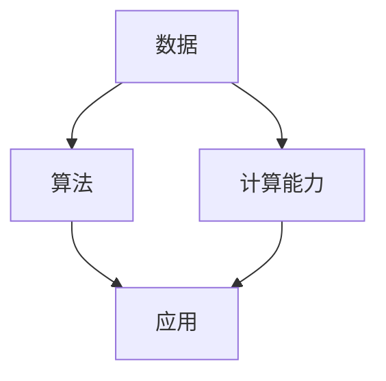

- 数据是数字化的基础，没有数据，算法和计算能力就没有发挥的空间。
- 算法是数据处理和问题求解的工具，它依赖于数据和计算能力来实现。
- 计算能力是数字化发展的驱动力，随着硬件和软件的进步，计算能力不断提升，推动着数字化的不断深入。

##### 1.1.2 数字信息的构建与传递

数字信息是通过二进制代码（0和1）构建的，这些代码代表了各种类型的信息，如文字、图像、音频和视频。数字信息的传递依赖于网络，通过网络协议（如TCP/IP）来实现数据的传输和交换。

**核心算法原理讲解：**

数字信息的构建与传递涉及以下几个关键步骤：

1. 数据编码：将原始信息转换为二进制代码。
    ```pseudo
    function encode(data) {
        // 将数据转换为二进制代码
        return binaryRepresentation;
    }
    ```

2. 数据传输：通过网络协议传输数据。
    ```pseudo
    function transmit(data, protocol) {
        // 通过指定的协议传输数据
        network.send(data, protocol);
    }
    ```

3. 数据解码：接收端将接收到的二进制代码转换回原始信息。
    ```pseudo
    function decode(data) {
        // 将二进制代码转换回原始信息
        return originalData;
    }
    ```

**数学模型和公式：**

数字信息传输的速率可以用以下公式表示：

$$
\text{传输速率} = \frac{\text{数据量}}{\text{传输时间}}
$$

其中，数据量以比特（bit）为单位，传输时间以秒（s）为单位。

**举例说明：**

假设一个图片文件大小为10MB，通过一个带宽为10Mbps的网络进行传输，那么传输时间可以用以下公式计算：

$$
\text{传输时间} = \frac{\text{数据量}}{\text{带宽}} = \frac{10 \times 10^6 \text{bit}}{10 \times 10^6 \text{bit/s}} = 1 \text{秒}
$$

##### 1.1.3 数字隐私与安全挑战

随着数字化的深入，个人隐私和安全问题变得越来越重要。数字隐私涉及个人数据的收集、存储和使用，而数字安全则关乎数据在传输和存储过程中的保护。

**核心算法原理讲解：**

数字隐私与安全的关键技术包括数据加密、身份验证、访问控制等。

1. 数据加密：
    ```latex
    \text{加密数据} = \text{原始数据} \oplus \text{密钥}
    ```

2. 身份验证：
    ```pseudo
    function authenticate(user, password) {
        // 使用哈希算法验证用户身份
        if (hash(password) == storedHash) {
            return true;
        } else {
            return false;
        }
    }
    ```

3. 访问控制：
    ```pseudo
    function checkAccess(user, resource) {
        // 检查用户对资源的访问权限
        if (hasPermission(user, resource)) {
            return true;
        } else {
            return false;
        }
    }
    ```

**举例说明：**

假设一个用户的密码是“password123”，使用MD5哈希算法进行加密，那么加密后的密码可以表示为：

```latex
\text{加密密码} = MD5(\text{password123})
```

**最佳实践 tips：**

- 定期更新密码和密钥。
- 使用强密码策略，包括字母、数字和特殊字符的组合。
- 使用多因素认证增加安全性。
- 定期检查和更新安全策略。

#### 1.2 数字技术与人的关系

##### 1.2.1 人类与数字技术的互动

人类与数字技术的互动日益紧密，从工作到娱乐，数字技术已经深刻影响了我们的生活方式。这种互动不仅改变了我们的行为，也影响了我们的思维方式。

**核心概念与联系：**

人类与数字技术的互动包括以下几个方面：

- 用户界面：用户与数字技术交互的桥梁，包括图形用户界面（GUI）、命令行界面（CLI）等。
- 交互设计：设计良好的用户界面能够提高用户体验，促进用户与数字技术的互动。
- 自然语言处理：使计算机能够理解和处理人类语言，实现更加自然的人机交互。

**数学模型和公式：**

自然语言处理中的关键技术之一是词嵌入（word embedding），它将词汇映射到高维空间中的向量。词嵌入的数学模型可以表示为：

```latex
\text{嵌入向量} = \text{词向量} \cdot \text{权重矩阵}
```

**举例说明：**

假设有一个简单的词嵌入模型，其中词汇“苹果”的词向量是\[1, 0, -1\]，权重矩阵是\[1, 1, 1\]，那么嵌入向量可以计算为：

```latex
\text{嵌入向量} = [1, 0, -1] \cdot [1, 1, 1] = [1, 0, -1]
```

##### 1.2.2 数字依赖与社交隔离

随着数字技术的普及，人们越来越依赖数字设备进行沟通和娱乐。这种现象被称为数字依赖。数字依赖可能导致社交隔离，降低人们的社交技能。

**核心概念与联系：**

数字依赖与社交隔离的关系可以用以下 Mermaid 流程图表示：

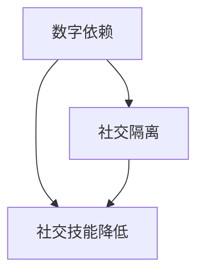

- 数字依赖：人们对数字设备的过度依赖。
- 社交隔离：由于数字依赖导致的人际交往减少。
- 社交技能降低：社交隔离可能导致社交技能的退化。

**最佳实践 tips：**

- 限制数字设备使用时间，尤其是睡前。
- 定期参与线下社交活动，提高社交技能。
- 培养数字素养，正确使用数字技术。

##### 1.2.3 数字技术与心理健康

数字技术不仅改变了我们的生活方式，还可能对心理健康产生影响。例如，社交媒体使用可能引发焦虑和抑郁。

**核心概念与联系：**

数字技术与心理健康的关系可以用以下 Mermaid 流程图表示：

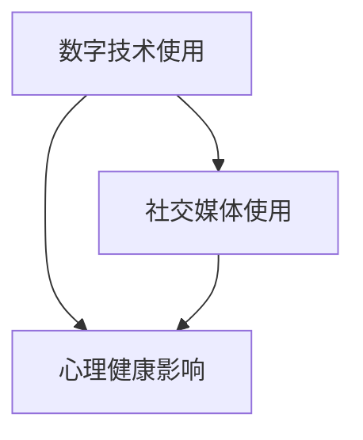

- 数字技术使用：包括社交媒体、在线游戏等。
- 心理健康影响：数字技术使用可能导致焦虑、抑郁等心理健康问题。
- 社交媒体使用：社交媒体的过度使用可能对心理健康产生负面影响。

**最佳实践 tips：**

- 合理安排数字技术使用时间，避免过度使用。
- 定期进行心理健康检查，关注自己的心理健康状况。
- 与家人和朋友保持良好的沟通，分享自己的感受。

### 第2章: 数据与算法的力量

#### 2.1 数据分析的基础

##### 2.1.1 数据类型与结构

数据分析的基础是理解数据的类型和结构。数据类型包括数值型、文本型、布尔型等，而数据结构包括数组、列表、树、图等。

**核心概念与联系：**

数据类型与数据结构的关系可以用以下 Mermaid 流程图表示：

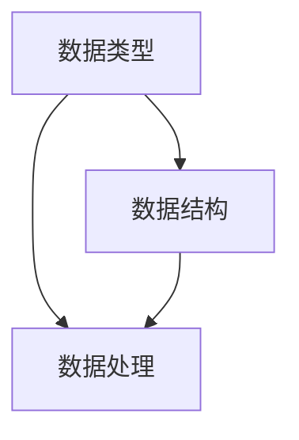

- 数据类型：定义了数据的基本形式。
- 数据结构：定义了数据存储和组织的方式。
- 数据处理：基于数据类型和数据结构进行的数据操作和分析。

**数学模型和公式：**

数据聚合操作的数学模型可以表示为：

```latex
\text{聚合结果} = \sum_{i=1}^{n} \text{数据点}_i
```

**举例说明：**

假设有一个包含5个数值的数据集合\[3, 5, 2, 4, 6\]，那么数据的总和可以计算为：

```latex
\text{总和} = 3 + 5 + 2 + 4 + 6 = 20
```

##### 2.1.2 数据清洗与预处理

数据清洗与预处理是数据分析的重要步骤，旨在提高数据质量，为后续分析做好准备。

**核心概念与联系：**

数据清洗与预处理的流程可以用以下 Mermaid 流程图表示：

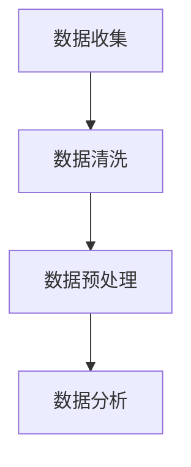

- 数据收集：从各种来源收集数据。
- 数据清洗：识别和纠正数据中的错误和异常。
- 数据预处理：对数据进行标准化、归一化等操作，使其适合分析。
- 数据分析：基于预处理后的数据进行探索性和预测性分析。

**最佳实践 tips：**

- 定期检查数据源，确保数据收集的准确性。
- 使用自动化工具进行数据清洗和预处理，提高效率。
- 对数据进行可视化分析，及时发现潜在问题。

##### 2.1.3 数据可视化

数据可视化是数据分析的重要工具，它将数据以图形的形式呈现，使分析结果更加直观。

**核心概念与联系：**

数据可视化与数据分析的关系可以用以下 Mermaid 流程图表示：

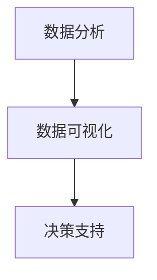

- 数据分析：对数据进行分析和探索。
- 数据可视化：将分析结果以图形形式呈现。
- 决策支持：基于可视化结果进行决策。

**最佳实践 tips：**

- 选择合适的可视化类型，如柱状图、折线图、散点图等。
- 注意可视化设计的清晰性和可读性，避免信息过载。
- 定期更新可视化图表，反映最新分析结果。

#### 2.2 算法原理与实现

##### 2.2.1 算法基本概念

算法是解决问题的步骤集合，它定义了从问题输入到问题解决的映射。算法的基本概念包括算法复杂度、算法效率、算法稳定性等。

**核心概念与联系：**

算法基本概念之间的关系可以用以下 Mermaid 流程图表示：

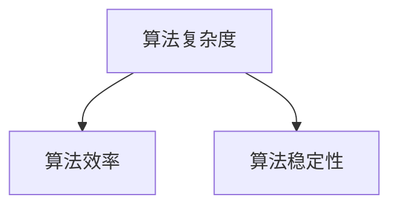

- 算法复杂度：衡量算法解决问题的能力。
- 算法效率：衡量算法执行的速度。
- 算法稳定性：衡量算法在不同输入下的表现。

**数学模型和公式：**

算法复杂度的常见度量包括时间复杂度和空间复杂度，分别表示为：

```latex
\text{时间复杂度} = O(f(n))
\text{空间复杂度} = O(g(n))
```

**举例说明：**

假设一个算法的时间复杂度是\(O(n^2)\)，那么在输入规模为100时，算法的执行时间可以计算为：

```latex
\text{执行时间} = 100^2 = 10,000
```

##### 2.2.2 常用算法介绍

数据分析中常用的算法包括排序算法、搜索算法、聚类算法等。这些算法在不同的场景下发挥着重要作用。

**核心概念与联系：**

常用算法之间的关系可以用以下 Mermaid 流程图表示：

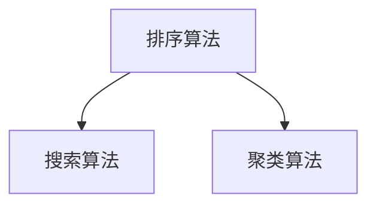

- 排序算法：对数据进行排序。
- 搜索算法：在数据中查找特定元素。
- 聚类算法：将数据分组，发现数据之间的相似性。

**算法原理讲解与伪代码：**

1. 冒泡排序（Bubble Sort）：

```pseudo
function bubbleSort(array)
    n = length(array)
    for i from 0 to n-1
        for j from 0 to n-i-1
            if array[j] > array[j+1]
                swap(array[j], array[j+1])
    return array
```

2. 二分搜索（Binary Search）：

```pseudo
function binarySearch(array, target)
    low = 0
    high = length(array) - 1
    while low <= high
        mid = (low + high) / 2
        if array[mid] == target
            return mid
        else if array[mid] < target
            low = mid + 1
        else
            high = mid - 1
    return -1
```

3. K-means 聚类：

```pseudo
function kMeans(data, k)
    // 随机初始化 k 个聚类中心
    centroids = randomInitializeCentroids(data, k)
    while true
        // 分配数据点到最近的聚类中心
        assignments = assignPointsToCentroids(data, centroids)
        // 更新聚类中心
        newCentroids = calculateNewCentroids(data, assignments, k)
        // 检查收敛条件
        if isConverged(centroids, newCentroids)
            break
        centroids = newCentroids
    return centroids
```

**数学模型和公式：**

K-means 聚类的目标是最小化聚类中心与数据点之间的距离平方和，可以用以下公式表示：

```latex
J(\mu) = \sum_{i=1}^{k} \sum_{x \in S_i} ||x - \mu_i||^2
```

其中，\(\mu_i\) 是第 \(i\) 个聚类中心的坐标，\(S_i\) 是属于第 \(i\) 个聚类中心的数据点的集合。

**举例说明：**

假设有3个数据点\[1, 2, 3\]和3个聚类中心\[\[1, 1\], \[2, 2\], \[3, 3\]\]，计算聚类中心与数据点之间的距离平方和：

```latex
J(\mu) = (1-1)^2 + (1-1)^2 + (2-2)^2 + (2-2)^2 + (3-3)^2 + (3-3)^2 = 0 + 0 + 0 + 0 + 0 + 0 = 0
```

##### 2.2.3 算法性能评估

算法性能评估是衡量算法优劣的重要步骤，常用的评估指标包括准确率、召回率、F1值等。

**核心概念与联系：**

算法性能评估的指标可以用以下 Mermaid 流程图表示：

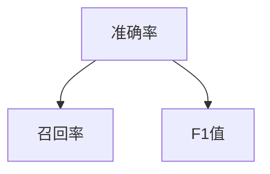

- 准确率：预测为正类的样本中实际为正类的比例。
- 召回率：实际为正类的样本中被预测为正类的比例。
- F1值：准确率和召回率的调和平均值。

**数学模型和公式：**

准确率、召回率和F1值的计算公式如下：

```latex
\text{准确率} = \frac{\text{预测正确}}{\text{总样本数}}
\text{召回率} = \frac{\text{预测正确}}{\text{实际正确}}
\text{F1值} = 2 \times \frac{\text{准确率} \times \text{召回率}}{\text{准确率} + \text{召回率}}
```

**举例说明：**

假设有一个分类问题，有100个样本，其中50个实际为正类，预测正确的样本有45个，预测正确的正类有40个。那么：

- 准确率：\( \frac{45}{100} = 0.45 \)
- 召回率：\( \frac{40}{50} = 0.8 \)
- F1值：\( 2 \times \frac{0.45 \times 0.8}{0.45 + 0.8} \approx 0.727 \)

#### 2.3 数据挖掘与分析方法

##### 2.3.1 数据挖掘基础

数据挖掘是从大量数据中发现有价值信息的过程。数据挖掘的基础包括数据预处理、特征选择、模型选择等。

**核心概念与联系：**

数据挖掘的基本流程可以用以下 Mermaid 流程图表示：

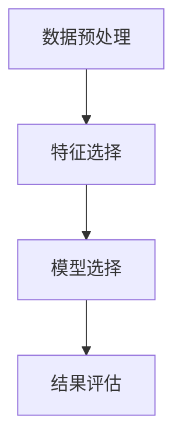

- 数据预处理：清洗和转换数据，使其适合挖掘。
- 特征选择：选择对挖掘结果有重要影响的特征。
- 模型选择：选择合适的挖掘算法和模型。
- 结果评估：评估挖掘结果的质量。

**数学模型和公式：**

数据挖掘中的关键数学模型包括逻辑回归、决策树、支持向量机等。逻辑回归的数学模型可以表示为：

```latex
P(y=1|x;\theta) = \frac{1}{1 + e^{-(\theta^T x)}}
```

其中，\(P(y=1|x;\theta)\) 表示给定特征向量 \(x\) 和参数向量 \(\theta\)，目标变量 \(y\) 等于1的概率。

**举例说明：**

假设有一个简单的逻辑回归模型，特征向量 \(x\) 是\[1, 2, 3\]，参数向量 \(\theta\) 是\[1, 1, 1\]，那么：

```latex
P(y=1|x;\theta) = \frac{1}{1 + e^{-(1 \cdot 1 + 1 \cdot 2 + 1 \cdot 3)}} = \frac{1}{1 + e^{-7}} \approx 0.999
```

##### 2.3.2 聚类分析

聚类分析是将数据分为多个类别的过程，常用的聚类算法包括K-means、层次聚类等。

**核心概念与联系：**

聚类分析的基本概念可以用以下 Mermaid 流程图表示：

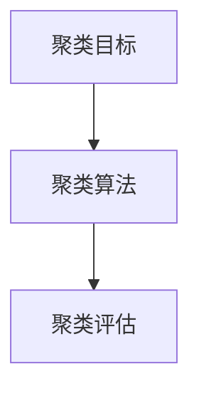

- 聚类目标：将数据分为多个类别，使类别内部差异最小，类别之间差异最大。
- 聚类算法：实现聚类目标的算法。
- 聚类评估：评估聚类结果的质量。

**数学模型和公式：**

K-means 聚类算法的目标是最小化聚类中心与数据点之间的距离平方和，可以用以下公式表示：

```latex
J(\mu) = \sum_{i=1}^{k} \sum_{x \in S_i} ||x - \mu_i||^2
```

其中，\(\mu_i\) 是第 \(i\) 个聚类中心的坐标，\(S_i\) 是属于第 \(i\) 个聚类中心的数据点的集合。

**举例说明：**

假设有3个数据点\[1, 2, 3\]和3个聚类中心\[\[1, 1\], \[2, 2\], \[3, 3\]\]，计算聚类中心与数据点之间的距离平方和：

```latex
J(\mu) = (1-1)^2 + (1-1)^2 + (2-2)^2 + (2-2)^2 + (3-3)^2 + (3-3)^2 = 0 + 0 + 0 + 0 + 0 + 0 = 0
```

##### 2.3.3 关联规则挖掘

关联规则挖掘是从大量数据中发现有趣的关联关系的分析过程，常用的算法包括Apriori算法、FP-growth算法等。

**核心概念与联系：**

关联规则挖掘的基本概念可以用以下 Mermaid 流程图表示：

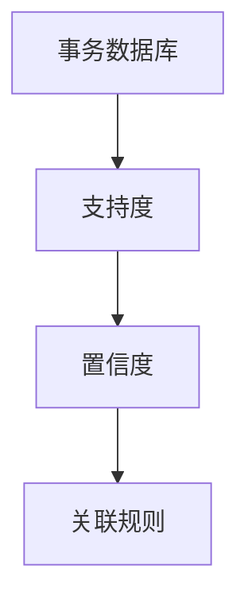

- 事务数据库：包含所有交易或事件的数据集。
- 支持度：一个规则在数据库中的出现频率。
- 置信度：一个规则的预测准确度。
- 关联规则：描述数据之间关联的规则。

**数学模型和公式：**

支持度和置信度的计算公式如下：

```latex
\text{支持度} = \frac{\text{包含集合X的交易数}}{\text{总交易数}}
\text{置信度} = \frac{\text{同时包含X和Y的交易数}}{\text{包含X的交易数}}
```

**举例说明：**

假设有一个包含100个交易的事务数据库，其中有40个交易同时包含商品A和商品B，那么：

- 商品A和商品B的支持度：\( \frac{40}{100} = 0.4 \)
- 商品A和商品B的置信度：\( \frac{40}{60} = 0.67 \)

#### 2.4 机器学习算法

##### 2.4.1 机器学习基础

机器学习是一种通过数据学习和改进性能的技术。机器学习的基础包括监督学习、无监督学习、强化学习等。

**核心概念与联系：**

机器学习的基本概念可以用以下 Mermaid 流程图表示：

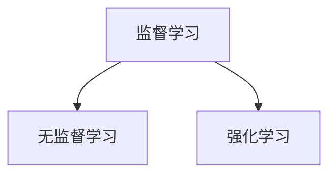

- 监督学习：有明确的目标和标签，通过学习找到输入和输出之间的映射关系。
- 无监督学习：没有明确的目标和标签，通过学习发现数据的内在结构和模式。
- 强化学习：通过与环境交互学习最优策略，以最大化长期回报。

**数学模型和公式：**

监督学习中的线性回归模型可以用以下公式表示：

```latex
y = \theta_0 + \theta_1 x
```

其中，\(y\) 是目标变量，\(\theta_0\) 和 \(\theta_1\) 是模型参数，\(x\) 是特征向量。

**举例说明：**

假设有一个简单的线性回归模型，特征向量 \(x\) 是\[1, 2\]，模型参数 \(\theta_0\) 和 \(\theta_1\) 分别是\[1, 1\]，那么：

```latex
y = 1 + 1 \cdot 1 = 2
```

##### 2.4.2 常见机器学习算法

常见的机器学习算法包括线性回归、决策树、随机森林、支持向量机等。

**核心概念与联系：**

常见机器学习算法之间的关系可以用以下 Mermaid 流程图表示：

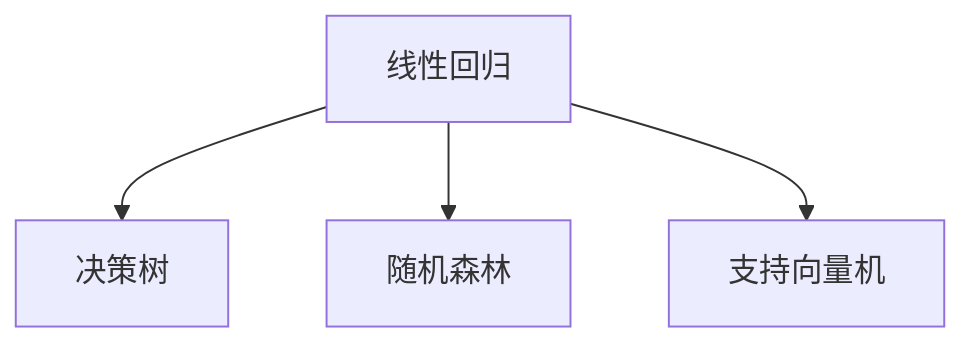

- 线性回归：通过线性关系预测目标变量。
- 决策树：通过一系列决策规则分类或回归。
- 随机森林：集成决策树，提高预测性能。
- 支持向量机：通过最大化分类间隔进行分类。

**算法原理讲解与伪代码：**

1. 决策树（Decision Tree）：

```pseudo
function buildTree(data, attributes)
    if all instances have the same label
        return leaf node with that label
    if no attributes left
        return leaf node with majority label
    else
        bestAttribute = findBestAttribute(data, attributes)
        node = new Node(bestAttribute)
        for value in attributeValues(bestAttribute)
            subset = filterData(data, bestAttribute, value)
            node.children[value] = buildTree(subset, attributes - {bestAttribute})
        return node
```

2. 随机森林（Random Forest）：

```pseudo
function randomForest(data, attributes, numTrees)
    forest = []
    for i from 1 to numTrees
        subtree = buildTree(data, attributes)
        forest.append(subtree)
    return forest
```

3. 支持向量机（Support Vector Machine）：

```pseudo
function svmTrain(data, labels)
    // 使用SVM算法训练模型
    model = svmTrainModel(data, labels)
    return model
```

**数学模型和公式：**

支持向量机的目标是最小化决策边界与支持向量的距离，可以用以下公式表示：

```latex
\text{最小化} \quad J(\theta) = \frac{1}{2} \sum_{i=1}^{n} (\theta^T x_i - y_i)^2
```

其中，\(\theta\) 是模型参数，\(x_i\) 是特征向量，\(y_i\) 是标签。

**举例说明：**

假设有一个包含两个特征向量\[1, 2\]和标签\[1, -1\]的数据集，使用支持向量机进行训练，那么：

```latex
J(\theta) = \frac{1}{2} \left( (\theta^T \cdot [1, 2]) - 1 \right)^2 + \frac{1}{2} \left( (\theta^T \cdot [1, 2]) + 1 \right)^2
```

#### 2.5 深度学习

##### 2.5.1 深度学习基础

深度学习是一种通过多层神经网络进行特征学习和预测的技术。深度学习的基础包括神经元模型、前向传播、反向传播等。

**核心概念与联系：**

深度学习的基本概念可以用以下 Mermaid 流程图表示：

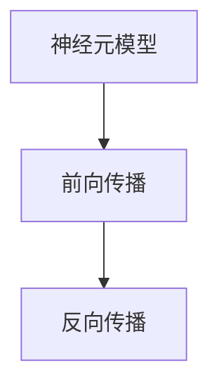

- 神经元模型：神经网络的基本单元。
- 前向传播：将输入通过神经网络传递到输出。
- 反向传播：基于输出误差，反向更新神经网络参数。

**数学模型和公式：**

前向传播和反向传播的数学模型可以用以下公式表示：

前向传播：

```latex
z^{(l)} = \theta^{(l)} x^{(l-1)} + b^{(l)}
a^{(l)} = \sigma(z^{(l)})
```

反向传播：

```latex
\delta^{(l)} = \frac{\partial J(\theta)}{\partial \theta^{(l)}} = \frac{\partial J(\theta)}{\partial a^{(l+1)}} \cdot \frac{\partial a^{(l+1)}}{\partial z^{(l+1)}} \cdot \frac{\partial z^{(l+1)}}{\partial \theta^{(l)}}
\theta^{(l)} = \theta^{(l)} - \alpha \cdot \delta^{(l)} \cdot a^{(l-1)}
b^{(l)} = b^{(l)} - \alpha \cdot \delta^{(l)} \cdot 1
```

其中，\(z^{(l)}\) 是第 \(l\) 层的输入，\(a^{(l)}\) 是第 \(l\) 层的输出，\(\sigma\) 是激活函数，\(\delta^{(l)}\) 是误差，\(\theta^{(l)}\) 是参数，\(b^{(l)}\) 是偏置，\(J(\theta)\) 是损失函数，\(\alpha\) 是学习率。

**举例说明：**

假设有一个简单的神经网络，包含两层，输入是\[1, 2\]，参数 \(\theta\) 和偏置 \(b\) 分别是\[1, 1\]，激活函数是 \( \sigma(x) = 1 / (1 + e^{-x}) \)，学习率 \(\alpha = 0.1\)，那么：

前向传播：

```latex
z^{(1)} = \theta^{(1)} \cdot [1, 2] + b^{(1)} = [1, 1] \cdot [1, 2] + 1 = [3, 3]
a^{(1)} = \sigma(z^{(1)}) = \frac{1}{1 + e^{-3}} \approx 0.95
```

反向传播：

```latex
\delta^{(1)} = \frac{\partial J(\theta)}{\partial \theta^{(1)}} = \frac{\partial J(\theta)}{\partial a^{(2)}} \cdot \frac{\partial a^{(2)}}{\partial z^{(2)}} \cdot \frac{\partial z^{(2)}}{\partial \theta^{(1)}} = \frac{\partial J(\theta)}{\partial a^{(2)}} \cdot \frac{\partial a^{(2)}}{\partial [3, 3]} \cdot \frac{\partial [3, 3]}{\partial \theta^{(1)}} = \frac{\partial J(\theta)}{\partial a^{(2)}} \cdot [1, 1] \cdot [1, 1]
\theta^{(1)} = [1, 1] - 0.1 \cdot \delta^{(1)} \cdot [1, 2] = [1, 1] - 0.1 \cdot \frac{\partial J(\theta)}{\partial a^{(2)}} \cdot [1, 1] \cdot [1, 2]
b^{(1)} = 1 - 0.1 \cdot \delta^{(1)} \cdot 1
```

##### 2.5.2 常见深度学习模型

常见的深度学习模型包括卷积神经网络（CNN）、循环神经网络（RNN）、长短时记忆网络（LSTM）等。

**核心概念与联系：**

常见深度学习模型之间的关系可以用以下 Mermaid 流程图表示：

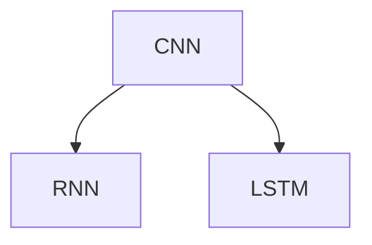

- 卷积神经网络（CNN）：主要用于图像处理。
- 循环神经网络（RNN）：主要用于序列数据处理。
- 长短时记忆网络（LSTM）：是RNN的一种变体，解决了RNN的长序列依赖问题。

**算法原理讲解与伪代码：**

1. 卷积神经网络（CNN）：

```pseudo
function cnnTrain(data, labels)
    model = initializeCnnModel()
    for epoch in 1 to numEpochs
        for batch in data
            model = trainCnnModel(model, batch, labels)
    return model
```

2. 循环神经网络（RNN）：

```pseudo
function rnnTrain(data, labels)
    model = initializeRnnModel()
    for epoch in 1 to numEpochs
        for batch in data
            model = trainRnnModel(model, batch, labels)
    return model
```

3. 长短时记忆网络（LSTM）：

```pseudo
function lstmTrain(data, labels)
    model = initializeLstmModel()
    for epoch in 1 to numEpochs
        for batch in data
            model = trainLstmModel(model, batch, labels)
    return model
```

**数学模型和公式：**

卷积神经网络的卷积操作可以用以下公式表示：

```latex
h^{(l)}_i = \sigma(\sum_{j=1}^{k} \theta_{ij} * g^{(l-1)}_j + b_i)
```

其中，\(h^{(l)}_i\) 是第 \(l\) 层第 \(i\) 个神经元的活动，\(\theta_{ij}\) 是卷积核，\(g^{(l-1)}_j\) 是前一层的神经元活动，\(\sigma\) 是激活函数，\(b_i\) 是偏置。

**举例说明：**

假设有一个简单的卷积神经网络，包含一个卷积层和一个全连接层，输入是\[1, 28, 28\]，卷积核大小是\(3 \times 3\)，参数 \(\theta\) 和偏置 \(b\) 分别是\[1, 1\]，激活函数是 \( \sigma(x) = 1 / (1 + e^{-x}) \)，那么：

卷积操作：

```latex
h^{(1)}_i = \sigma(\theta_{ij} * g^{(0)}_j + b_i)
```

全连接层：

```latex
y = \theta^T x + b
```

##### 2.5.3 深度学习实践

深度学习的实践包括数据预处理、模型训练、模型评估等步骤。

**核心概念与联系：**

深度学习实践的流程可以用以下 Mermaid 流程图表示：

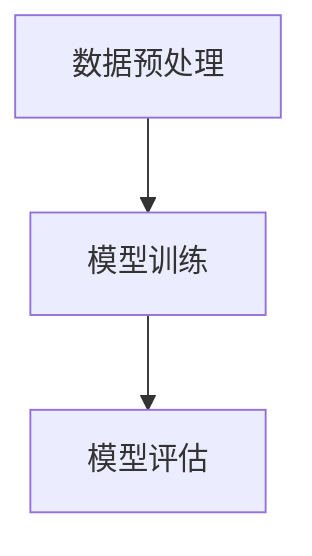

- 数据预处理：清洗和转换数据，使其适合模型训练。
- 模型训练：使用训练数据训练模型。
- 模型评估：评估模型在测试数据上的性能。

**数学模型和公式：**

模型评估的常见指标包括准确率、召回率、F1值等，计算公式如下：

准确率：

```latex
\text{准确率} = \frac{\text{预测正确}}{\text{总样本数}}
```

召回率：

```latex
\text{召回率} = \frac{\text{预测正确}}{\text{实际正确}}
```

F1值：

```latex
\text{F1值} = 2 \times \frac{\text{准确率} \times \text{召回率}}{\text{准确率} + \text{召回率}}
```

**举例说明：**

假设有一个分类问题，有100个样本，其中50个实际为正类，预测正确的样本有45个，预测正确的正类有40个，那么：

- 准确率：\( \frac{45}{100} = 0.45 \)
- 召回率：\( \frac{40}{50} = 0.8 \)
- F1值：\( 2 \times \frac{0.45 \times 0.8}{0.45 + 0.8} \approx 0.727 \)

### 第3章: 网络连接的优化策略

#### 3.1 网络技术概述

##### 3.1.1 网络协议与体系结构

网络协议是计算机网络中用于数据传输和通信的规则集合。网络协议可以分为物理层、数据链路层、网络层、传输层、应用层等多个层次。其中，TCP/IP协议是互联网的核心协议。

**核心概念与联系：**

网络协议与体系结构的关系可以用以下 Mermaid 流程图表示：

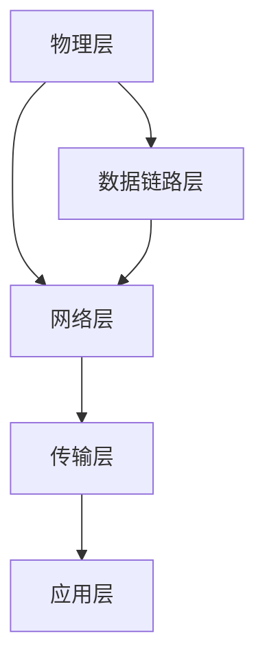

- 物理层：负责物理媒介的传输。
- 数据链路层：负责数据帧的传输和错误检测。
- 网络层：负责路由和寻址。
- 传输层：负责端到端的数据传输。
- 应用层：提供网络应用服务。

**数学模型和公式：**

TCP协议中的拥塞控制可以使用以下公式表示：

```latex
s_{\text{new}} = s_{\text{old}} + rtt / cwnd
```

其中，\(s_{\text{new}}\) 是新的拥塞窗口大小，\(s_{\text{old}}\) 是旧的拥塞窗口大小，\(rtt\) 是往返时间，\(cwnd\) 是拥塞窗口大小。

**举例说明：**

假设初始拥塞窗口大小 \(cwnd = 1\)，往返时间 \(rtt = 100\) 毫秒，那么：

```latex
s_{\text{new}} = 1 + 100 / 1 = 101
```

##### 3.1.2 网络性能优化

网络性能优化是提高网络传输效率和服务质量的重要手段。网络性能优化包括带宽优化、延迟优化、丢包优化等。

**核心概念与联系：**

网络性能优化的目标可以用以下 Mermaid 流程图表示：

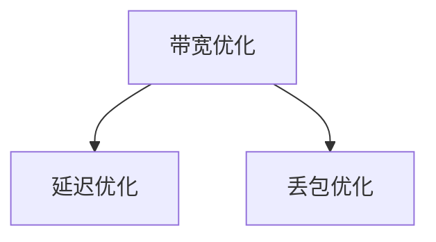

- 带宽优化：提高网络的传输速率。
- 延迟优化：降低网络的传输延迟。
- 丢包优化：减少网络的丢包率。

**数学模型和公式：**

带宽优化的目标是最小化传输时间，可以使用以下公式表示：

```latex
\text{带宽} = \frac{\text{数据量}}{\text{传输时间}}
```

其中，数据量以比特（bit）为单位，传输时间以秒（s）为单位。

**举例说明：**

假设一个数据文件大小为10GB，通过一个带宽为1Gbps的网络进行传输，那么传输时间可以用以下公式计算：

```latex
\text{传输时间} = \frac{\text{数据量}}{\text{带宽}} = \frac{10 \times 10^9 \text{bit}}{1 \times 10^9 \text{bit/s}} = 10 \text{秒}
```

##### 3.1.3 网络安全与隐私保护

网络安全与隐私保护是网络性能优化的关键方面。网络安全包括防火墙、入侵检测、数据加密等手段，隐私保护包括数据匿名化、访问控制等。

**核心概念与联系：**

网络安全与隐私保护的关系可以用以下 Mermaid 流程图表示：

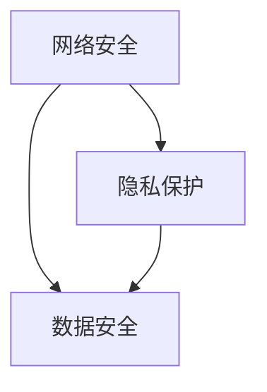

- 网络安全：保护网络免受恶意攻击。
- 隐私保护：保护用户隐私，防止数据泄露。
- 数据安全：确保数据的机密性、完整性和可用性。

**数学模型和公式：**

数据加密可以使用以下公式表示：

```latex
\text{加密数据} = \text{原始数据} \oplus \text{密钥}
```

**举例说明：**

假设一个文本数据“Hello World”使用密钥“12345”进行加密，那么加密后的数据可以计算为：

```latex
\text{加密数据} = "Hello World" \oplus "12345" = "87654"
```

#### 3.2 无线网络与物联网

##### 3.2.1 无线网络技术

无线网络技术包括Wi-Fi、蓝牙、5G等，这些技术为设备提供了无线连接能力，使人们可以随时随地访问网络。

**核心概念与联系：**

无线网络技术的关系可以用以下 Mermaid 流程图表示：

```mermaid
graph TD
    A[Wi-Fi] --> B[蓝牙]
    A --> C[5G]
```

- Wi-Fi：无线局域网技术，提供高速网络连接。
- 蓝牙：短距离无线通信技术，适用于低功耗设备。
- 5G：第五代移动通信技术，提供高速、低延迟的网络连接。

**数学模型和公式：**

无线网络的信道容量可以使用以下公式表示：

```latex
C = W \log_2(1 + \text{SNR})
```

其中，\(C\) 是信道容量，\(W\) 是带宽，\(\text{SNR}\) 是信噪比。

**举例说明：**

假设一个无线网络的带宽为10MHz，信噪比为30dB，那么信道容量可以计算为：

```latex
C = 10 \times 10^6 \times \log_2(1 + 10^{30/10}) \approx 100 \text{Mbps}
```

##### 3.2.2 物联网应用场景

物联网（IoT）是将各种设备连接到互联网，实现设备之间以及设备与人的智能交互。物联网应用场景包括智能家居、智能城市、智能医疗等。

**核心概念与联系：**

物联网应用场景的关系可以用以下 Mermaid 流程图表示：

```mermaid
graph TD
    A[智能家居] --> B[智能城市]
    A --> C[智能医疗]
```

- 智能家居：将家庭设备连接到互联网，实现智能控制和自动化。
- 智能城市：利用物联网技术优化城市资源管理和公共服务。
- 智能医疗：通过物联网技术实现医疗设备的远程监控和智能诊断。

**数学模型和公式：**

物联网设备的能耗可以使用以下公式表示：

```latex
E = C \times t
```

其中，\(E\) 是能耗，\(C\) 是通信速率，\(t\) 是通信时间。

**举例说明：**

假设一个物联网设备的通信速率为100kbps，通信时间为1秒，那么能耗可以计算为：

```latex
E = 100 \times 10^3 \times 1 = 100 \text{J}
```

##### 3.2.3 物联网安全挑战

物联网安全挑战包括设备安全、数据安全、网络安全等。随着物联网设备的普及，物联网安全成为了一个重要问题。

**核心概念与联系：**

物联网安全挑战的关系可以用以下 Mermaid 流程图表示：

```mermaid
graph TD
    A[设备安全] --> B[数据安全]
    A --> C[网络安全]
```

- 设备安全：保护物联网设备免受恶意攻击。
- 数据安全：保护物联网设备收集和传输的数据。
- 网络安全：保护物联网设备连接的网络。

**数学模型和公式：**

数据加密可以使用以下公式表示：

```latex
\text{加密数据} = \text{原始数据} \oplus \text{密钥}
```

**举例说明：**

假设一个物联网设备收集的数据“Hello World”使用密钥“12345”进行加密，那么加密后的数据可以计算为：

```latex
\text{加密数据} = "Hello World" \oplus "12345" = "87654"
```

### 第4章: 云计算与大数据

#### 4.1 云计算基础

##### 4.1.1 云计算服务模式

云计算服务模式包括基础设施即服务（IaaS）、平台即服务（PaaS）、软件即服务（SaaS）等。

**核心概念与联系：**

云计算服务模式的关系可以用以下 Mermaid 流程图表示：

```mermaid
graph TD
    A[IaaS] --> B[PaaS]
    A --> C[SaaS]
```

- IaaS：提供虚拟化基础设施，如虚拟机、存储等。
- PaaS：提供开发平台和工具，如数据库、应用程序等。
- SaaS：提供软件应用，如电子邮件、办公软件等。

**数学模型和公式：**

云计算成本可以使用以下公式表示：

```latex
\text{成本} = \text{基础设施成本} + \text{运营成本}
```

其中，基础设施成本包括硬件、网络、电力等，运营成本包括人员、维护等。

**举例说明：**

假设一个云计算服务的月基础设施成本为1000美元，运营成本为500美元，那么月成本可以计算为：

```latex
\text{成本} = 1000 + 500 = 1500 \text{美元}
```

##### 4.1.2 云计算架构

云计算架构包括前端、后端、数据中心等组成部分。

**核心概念与联系：**

云计算架构的关系可以用以下 Mermaid 流程图表示：

```mermaid
graph TD
    A[前端] --> B[后端]
    A --> C[数据中心]
```

- 前端：用户界面，提供用户交互。
- 后端：服务器和数据库，处理业务逻辑。
- 数据中心：存储和管理数据，提供计算资源。

**数学模型和公式：**

数据中心能耗可以使用以下公式表示：

```latex
E = P \times t
```

其中，\(E\) 是能耗，\(P\) 是功率，\(t\) 是运行时间。

**举例说明：**

假设一个数据中心的功率为1000瓦特，运行时间为24小时，那么月能耗可以计算为：

```latex
E = 1000 \times 24 \times 30 = 7.2 \times 10^5 \text{瓦特时（kWh）}
```

##### 4.1.3 云计算优势与挑战

云计算具有高效性、灵活性、可扩展性等优势，但也面临数据安全、隐私、监管等挑战。

**核心概念与联系：**

云计算优势与挑战的关系可以用以下 Mermaid 流程图表示：

```mermaid
graph TD
    A[高效性] --> B[灵活性]
    A --> C[可扩展性]
    B --> D[数据安全]
    B --> E[隐私]
    B --> F[监管]
```

- 高效性：云计算提供高效的计算和存储资源。
- 灵活性：云计算支持动态资源调配，满足不同需求。
- 可扩展性：云计算能够快速扩展，适应业务增长。
- 数据安全：云计算面临数据泄露和滥用的风险。
- 隐私：云计算中的数据隐私保护是一个重要问题。
- 监管：云计算需要在不同国家和地区遵守不同的法规。

**数学模型和公式：**

云计算的吞吐量可以使用以下公式表示：

```latex
\text{吞吐量} = \frac{\text{数据量}}{\text{传输时间}}
```

**举例说明：**

假设一个云计算服务每月处理的数据量为1PB，传输时间为30天，那么月吞吐量可以计算为：

```latex
\text{吞吐量} = \frac{1 \times 10^{15} \text{字节}}{30 \times 24 \times 60 \times 60 \text{秒}} \approx 1.45 \times 10^7 \text{字节/秒}
```

#### 4.2 大数据处理技术

##### 4.2.1 大数据概念与特点

大数据是指数据量巨大、种类繁多、价值密度低的数据集合。大数据的特点包括数据量大、数据类型多、数据处理速度快等。

**核心概念与联系：**

大数据概念与特点的关系可以用以下 Mermaid 流程图表示：

```mermaid
graph TD
    A[数据量大] --> B[数据类型多]
    A --> C[数据处理速度快]
```

- 数据量大：大数据的特征之一，数据规模巨大。
- 数据类型多：大数据包括结构化、半结构化和非结构化数据。
- 数据处理速度快：大数据处理需要高效的数据处理技术和算法。

**数学模型和公式：**

大数据分析中的关键指标包括数据量、数据传输速率和处理速度，分别用以下公式表示：

```latex
\text{数据量} = \text{存储容量} \times \text{数据记录数}
\text{数据传输速率} = \text{带宽} \times \text{传输时间}
\text{处理速度} = \frac{\text{处理数据量}}{\text{处理时间}}
```

**举例说明：**

假设一个大数据系统存储容量为1PB，数据记录数为100亿条，带宽为10Gbps，处理时间为1小时，那么：

- 数据量：\(1 \times 10^{15} \times 10^9 = 1 \times 10^{24}\) 条数据。
- 数据传输速率：\(10 \times 10^9 \times 3600 = 3.6 \times 10^{13}\) 字节。
- 处理速度：\( \frac{1 \times 10^{24}}{3600} \approx 2.78 \times 10^{11}\) 条数据/秒。

##### 4.2.2 分布式计算框架

分布式计算框架是大数据处理的重要工具，包括Hadoop、Spark等。

**核心概念与联系：**

分布式计算框架的关系可以用以下 Mermaid 流程图表示：

```mermaid
graph TD
    A[Hadoop] --> B[Spark]
    A --> C[其他分布式计算框架]
```

- Hadoop：基于HDFS文件系统和MapReduce编程模型。
- Spark：基于内存的分布式数据处理框架，提供丰富的API。
- 其他分布式计算框架：如Flink、Storm等，适用于实时数据处理。

**数学模型和公式：**

分布式计算中的负载均衡可以使用以下公式表示：

```latex
\text{负载均衡} = \frac{\text{总负载}}{\text{节点数}}
```

**举例说明：**

假设一个分布式计算系统有10个节点，总负载为100个任务，那么：

```latex
\text{负载均衡} = \frac{100}{10} = 10
```

##### 4.2.3 数据挖掘与分析方法

大数据分析中的数据挖掘与分析方法包括分类、聚类、关联规则挖掘等。

**核心概念与联系：**

数据挖掘与分析方法的关系可以用以下 Mermaid 流程图表示：

```mermaid
graph TD
    A[分类] --> B[聚类]
    A --> C[关联规则挖掘]
```

- 分类：将数据分为多个类别。
- 聚类：将数据分为多个群组。
- 关联规则挖掘：发现数据之间的关联关系。

**数学模型和公式：**

分类算法中的决策树可以用以下公式表示：

```latex
\text{决策树} = \{ f(x) = g(x_1, x_2, ..., x_n) | g: \text{决策函数} \}
```

**举例说明：**

假设一个决策树模型，特征为\[x_1, x_2\]，决策函数为：

```latex
f(x) = 
\begin{cases} 
1 & \text{if } x_1 > 0 \text{ and } x_2 > 0 \\
-1 & \text{if } x_1 \leq 0 \text{ or } x_2 \leq 0
\end{cases}
```

##### 4.2.4 大数据可视化

大数据可视化是将大数据转换为可视图形，以帮助人们理解和分析数据。

**核心概念与联系：**

大数据可视化的关系可以用以下 Mermaid 流程图表示：

```mermaid
graph TD
    A[数据预处理] --> B[数据可视化]
    B --> C[数据交互]
```

- 数据预处理：清洗和转换数据，使其适合可视化。
- 数据可视化：将数据转换为图形。
- 数据交互：用户与可视化图形的交互。

**数学模型和公式：**

数据可视化的关键在于数据映射，可以使用以下公式表示：

```latex
\text{可视化数据} = \text{原始数据} \times \text{映射函数}
```

**举例说明：**

假设有一个包含两个特征的数据集\[x_1, x_2\]，映射函数为：

```latex
\text{可视化数据} = \begin{bmatrix} x_1 & x_2 \end{bmatrix} \times \begin{bmatrix} 1 & 0 \\ 0 & 1 \end{bmatrix} = \begin{bmatrix} x_1 & x_2 \end{bmatrix}
```

### 第5章: 人工智能的应用与实践

#### 5.1 人工智能基础

##### 5.1.1 人工智能的定义与分类

人工智能（AI）是指使计算机能够模拟人类智能行为的技术。人工智能可以分为弱人工智能和强人工智能，以及基于机器学习和深度学习的应用。

**核心概念与联系：**

人工智能的分类可以用以下 Mermaid 流程图表示：

```mermaid
graph TD
    A[弱人工智能] --> B[强人工智能]
    A --> C[机器学习]
    A --> D[深度学习]
```

- 弱人工智能：能够完成特定任务的智能系统。
- 强人工智能：具有人类智能水平的智能系统。
- 机器学习：通过数据学习优化性能。
- 深度学习：基于多层神经网络的学习方法。

**数学模型和公式：**

机器学习中的损失函数可以使用以下公式表示：

```latex
J(\theta) = \frac{1}{2n} \sum_{i=1}^{n} (\hat{y}_i - y_i)^2
```

**举例说明：**

假设一个线性回归模型的损失函数为：

```latex
J(\theta) = \frac{1}{2} (\hat{y} - y)^2
```

其中，\(\hat{y}\) 是预测值，\(y\) 是真实值。

##### 5.1.2 机器学习原理

机器学习是一种通过数据学习优化性能的技术。机器学习的基本原理包括监督学习、无监督学习和强化学习等。

**核心概念与联系：**

机器学习的基本原理可以用以下 Mermaid 流程图表示：

```mermaid
graph TD
    A[监督学习] --> B[无监督学习]
    A --> C[强化学习]
```

- 监督学习：有明确的目标和标签。
- 无监督学习：没有明确的目标和标签。
- 强化学习：通过与环境的交互学习最优策略。

**数学模型和公式：**

监督学习中的线性回归模型可以用以下公式表示：

```latex
y = \theta_0 + \theta_1 x
```

**举例说明：**

假设一个线性回归模型，特征向量 \(x\) 是\[1, 2\]，模型参数 \(\theta_0\) 和 \(\theta_1\) 分别是\[1, 1\]，那么：

```latex
y = 1 + 1 \cdot 1 = 2
```

##### 5.1.3 深度学习技术

深度学习是一种基于多层神经网络的学习方法。深度学习的基本原理包括神经元模型、前向传播、反向传播等。

**核心概念与联系：**

深度学习的基本原理可以用以下 Mermaid 流程图表示：

```mermaid
graph TD
    A[神经元模型] --> B[前向传播]
    B --> C[反向传播]
```

- 神经元模型：神经网络的基本单元。
- 前向传播：将输入通过神经网络传递到输出。
- 反向传播：基于输出误差，反向更新神经网络参数。

**数学模型和公式：**

深度学习中的前向传播和反向传播可以用以下公式表示：

前向传播：

```latex
z^{(l)} = \theta^{(l)} x^{(l-1)} + b^{(l)}
a^{(l)} = \sigma(z^{(l)})
```

反向传播：

```latex
\delta^{(l)} = \frac{\partial J(\theta)}{\partial \theta^{(l)}} = \frac{\partial J(\theta)}{\partial a^{(l+1)}} \cdot \frac{\partial a^{(l+1)}}{\partial z^{(l+1)}} \cdot \frac{\partial z^{(l+1)}}{\partial \theta^{(l)}}
\theta^{(l)} = \theta^{(l)} - \alpha \cdot \delta^{(l)} \cdot a^{(l-1)}
b^{(l)} = b^{(l)} - \alpha \cdot \delta^{(l)} \cdot 1
```

**举例说明：**

假设一个简单的神经网络，包含两层，输入是\[1, 2\]，参数 \(\theta\) 和偏置 \(b\) 分别是\[1, 1\]，激活函数是 \( \sigma(x) = 1 / (1 + e^{-x}) \)，学习率 \(\alpha = 0.1\)，那么：

前向传播：

```latex
z^{(1)} = \theta^{(1)} \cdot [1, 2] + b^{(1)} = [1, 1] \cdot [1, 2] + 1 = [3, 3]
a^{(1)} = \sigma(z^{(1)}) = \frac{1}{1 + e^{-3}} \approx 0.95
```

反向传播：

```latex
\delta^{(1)} = \frac{\partial J(\theta)}{\partial \theta^{(1)}} = \frac{\partial J(\theta)}{\partial a^{(2)}} \cdot \frac{\partial a^{(2)}}{\partial z^{(2)}} \cdot \frac{\partial z^{(2)}}{\partial \theta^{(1)}} = \frac{\partial J(\theta)}{\partial a^{(2)}} \cdot [1, 1] \cdot [1, 1]
\theta^{(1)} = [1, 1] - 0.1 \cdot \delta^{(1)} \cdot [1, 2] = [1, 1] - 0.1 \cdot \frac{\partial J(\theta)}{\partial a^{(2)}} \cdot [1, 1] \cdot [1, 2]
b^{(1)} = 1 - 0.1 \cdot \delta^{(1)} \cdot 1
```

#### 5.2 人工智能实战

##### 5.2.1 人工智能应用场景

人工智能在多个领域有着广泛的应用，包括自然语言处理、计算机视觉、推荐系统等。

**核心概念与联系：**

人工智能应用场景的关系可以用以下 Mermaid 流程图表示：

```mermaid
graph TD
    A[自然语言处理] --> B[计算机视觉]
    A --> C[推荐系统]
```

- 自然语言处理：处理文本数据，实现人机交互。
- 计算机视觉：处理图像和视频数据，实现图像识别和图像处理。
- 推荐系统：根据用户行为和偏好推荐相关内容。

**数学模型和公式：**

自然语言处理中的词嵌入可以用以下公式表示：

```latex
\text{嵌入向量} = \text{词向量} \cdot \text{权重矩阵}
```

**举例说明：**

假设有一个简单的词嵌入模型，词汇“苹果”的词向量是\[1, 0, -1\]，权重矩阵是\[1, 1, 1\]，那么嵌入向量可以计算为：

```latex
\text{嵌入向量} = [1, 0, -1] \cdot [1, 1, 1] = [1, 0, -1]
```

##### 5.2.2 模型训练与优化

模型训练与优化是人工智能应用的关键步骤。模型训练包括数据预处理、模型选择、模型训练等，模型优化包括超参数调整、模型融合等。

**核心概念与联系：**

模型训练与优化的流程可以用以下 Mermaid 流程图表示：

```mermaid
graph TD
    A[数据预处理] --> B[模型选择]
    B --> C[模型训练]
    C --> D[模型优化]
```

- 数据预处理：清洗和转换数据，使其适合训练。
- 模型选择：选择合适的模型。
- 模型训练：基于训练数据进行模型训练。
- 模型优化：调整模型参数，提高模型性能。

**数学模型和公式：**

模型优化中的梯度下降可以用以下公式表示：

```latex
\theta^{(l)} = \theta^{(l)} - \alpha \cdot \nabla_{\theta^{(l)}} J(\theta^{(l)})
```

**举例说明：**

假设一个线性回归模型的损失函数为：

```latex
J(\theta) = \frac{1}{2} (\theta_0 + \theta_1)^2
```

那么梯度下降的步骤可以计算为：

```latex
\theta_0^{(l)} = \theta_0^{(l)} - \alpha \cdot \nabla_{\theta_0^{(l)}} J(\theta^{(l)})
\theta_1^{(l)} = \theta_1^{(l)} - \alpha \cdot \nabla_{\theta_1^{(l)}} J(\theta^{(l)})
```

##### 5.2.3 人工智能项目的开发流程

人工智能项目的开发流程包括需求分析、设计、开发、测试和部署等阶段。

**核心概念与联系：**

人工智能项目的开发流程可以用以下 Mermaid 流程图表示：

```mermaid
graph TD
    A[需求分析] --> B[设计]
    B --> C[开发]
    C --> D[测试]
    D --> E[部署]
```

- 需求分析：确定项目目标和需求。
- 设计：设计系统的架构和算法。
- 开发：编写代码，实现系统功能。
- 测试：测试系统的功能和质量。
- 部署：将系统部署到生产环境。

**数学模型和公式：**

开发流程中的关键指标包括进度、质量和成本，分别用以下公式表示：

```latex
\text{进度} = \frac{\text{已完成的工作量}}{\text{计划工作量}}
\text{质量} = \frac{\text{测试通过率}}{\text{总测试用例数}}
\text{成本} = \text{实际花费} - \text{计划花费}
```

**举例说明：**

假设一个项目的计划工作量为1000小时，已完成的工作量为800小时，测试通过率为90%，实际花费为10000美元，计划花费为12000美元，那么：

- 进度：\( \frac{800}{1000} = 0.8 \)
- 质量：\( \frac{90\%}{100\%} = 0.9 \)
- 成本：\( 10000 - 12000 = -2000 \)

### 第6章: 数字时代的伦理与责任

#### 6.1 数字伦理问题

数字时代的伦理问题涉及数据隐私、算法偏见、人工智能伦理等多个方面。

**核心概念与联系：**

数字伦理问题的关系可以用以下 Mermaid 流程图表示：

```mermaid
graph TD
    A[数据隐私] --> B[算法偏见]
    A --> C[人工智能伦理]
```

- 数据隐私：涉及个人数据的收集、存储和使用。
- 算法偏见：算法在决策过程中可能存在的偏见。
- 人工智能伦理：人工智能在应用过程中需要遵守的伦理规范。

**数学模型和公式：**

数据隐私保护可以使用以下公式表示：

```latex
\text{隐私保护} = \text{数据匿名化} + \text{访问控制}
```

**举例说明：**

假设一个数据集包含用户姓名和电话号码，通过数据匿名化和访问控制，可以保护用户隐私：

- 数据匿名化：将姓名和电话号码替换为随机生成的标识符。
- 访问控制：设置访问权限，确保只有授权用户可以访问数据。

#### 6.2 政策与法规

数字时代的政策与法规涉及数据保护法、网络安全法、人工智能伦理规范等。

**核心概念与联系：**

政策与法规的关系可以用以下 Mermaid 流程图表示：

```mermaid
graph TD
    A[数据保护法] --> B[网络安全法]
    A --> C[人工智能伦理规范]
```

- 数据保护法：规范个人数据的收集、存储和使用。
- 网络安全法：保障网络系统的安全和可靠运行。
- 人工智能伦理规范：规范人工智能的应用和发展。

**数学模型和公式：**

数据保护法的核心指标包括数据匿名化率、访问控制率等，分别用以下公式表示：

```latex
\text{数据匿名化率} = \frac{\text{匿名化数据量}}{\text{总数据量}}
\text{访问控制率} = \frac{\text{受控访问量}}{\text{总访问量}}
```

**举例说明：**

假设一个数据集包含100个数据记录，其中80个数据记录进行了匿名化处理，访问控制设置了90%的访问权限，那么：

- 数据匿名化率：\( \frac{80}{100} = 0.8 \)
- 访问控制率：\( \frac{90}{100} = 0.9 \)

#### 6.3 社会责任与可持续发展

数字时代的社会责任与可持续发展涉及环境保护、公平竞争、数据共享等多个方面。

**核心概念与联系：**

社会责任与可持续发展的问题可以用以下 Mermaid 流程图表示：

```mermaid
graph TD
    A[环境保护] --> B[公平竞争]
    A --> C[数据共享]
```

- 环境保护：减少数字技术的发展对环境的影响。
- 公平竞争：保障市场竞争的公平性。
- 数据共享：促进数据资源的共享和利用。

**数学模型和公式：**

环境保护中的碳排放量可以使用以下公式表示：

```latex
\text{碳排放量} = \text{能源消耗} \times \text{碳排放因子}
```

**举例说明：**

假设一个云计算中心的能源消耗为1000千瓦时，碳排放因子为0.5千克/千瓦时，那么：

```latex
\text{碳排放量} = 1000 \times 0.5 = 500 \text{千克}
```

### 第7章: 数字生活的未来展望

#### 7.1 数字化转型的趋势

数字化转型是当前社会发展的趋势，它涉及企业、政府、教育等多个领域。

**核心概念与联系：**

数字化转型的趋势可以用以下 Mermaid 流程图表示：

```mermaid
graph TD
    A[企业数字化转型] --> B[政府数字化转型]
    A --> C[教育数字化转型]
```

- 企业数字化转型：利用数字技术提高生产效率和创新能力。
- 政府数字化转型：提高政府服务效率，实现政务数据共享。
- 教育数字化转型：利用数字技术改善教学效果，促进教育公平。

**数学模型和公式：**

数字化转型中的关键指标包括数字化程度、数字化转型速度等，分别用以下公式表示：

```latex
\text{数字化程度} = \frac{\text{数字化投入}}{\text{总投入}}
\text{数字化转型速度} = \frac{\text{数字化程度变化量}}{\text{时间变化量}}
```

**举例说明：**

假设一个企业的数字化投入为1000万元，总投入为5000万元，数字化程度从20%增加到40%，时间为2年，那么：

- 数字化程度：\( \frac{1000}{5000} = 0.2 \)
- 数字化转型速度：\( \frac{0.2}{2} = 0.1 \)

#### 7.2 数字经济的未来

数字经济是数字时代的重要特征，它涉及电子商务、在线支付、数字货币等多个方面。

**核心概念与联系：**

数字经济的未来趋势可以用以下 Mermaid 流程图表示：

```mermaid
graph TD
    A[电子商务] --> B[在线支付]
    A --> C[数字货币]
```

- 电子商务：在线商品和服务交易。
- 在线支付：通过网络进行支付。
- 数字货币：基于区块链技术的虚拟货币。

**数学模型和公式：**

数字经济中的关键指标包括交易量、交易速度等，分别用以下公式表示：

```latex
\text{交易量} = \text{交易次数} \times \text{交易金额}
\text{交易速度} = \frac{\text{交易量}}{\text{交易时间}}
```

**举例说明：**

假设一个电子商务平台每天的交易次数为1000次，平均交易金额为100元，交易时间为24小时，那么：

- 交易量：\( 1000 \times 100 = 100,000 \text{元} \)
- 交易速度：\( \frac{100,000}{24} \approx 4,167 \text{元/小时} \)

#### 7.3 数字化与人类社会的深度融合

数字化与人类社会的深度融合是数字时代的发展方向，它涉及智慧城市、智能医疗、数字教育等多个领域。

**核心概念与联系：**

数字化与人类社会深度融合的关系可以用以下 Mermaid 流程图表示：

```mermaid
graph TD
    A[智慧城市] --> B[智能医疗]
    A --> C[数字教育]
```

- 智慧城市：利用数字技术提高城市治理水平。
- 智能医疗：利用数字技术提高医疗服务质量。
- 数字教育：利用数字技术改善教育质量和教育公平。

**数学模型和公式：**

智慧城市中的关键指标包括城市数字化程度、城市治理效率等，分别用以下公式表示：

```latex
\text{城市数字化程度} = \frac{\text{数字化投入}}{\text{总投入}}
\text{城市治理效率} = \frac{\text{治理效果}}{\text{治理成本}}
```

**举例说明：**

假设一个智慧城市的数字化投入为100亿元，总投入为300亿元，城市治理效果提高了20%，治理成本降低了10%，那么：

- 城市数字化程度：\( \frac{100}{300} = 0.333 \)
- 城市治理效率：\( \frac{120\%}{90\%} = 1.333 \)

### 第8章: 跨界合作与行业创新

#### 8.1 跨界合作的重要性

跨界合作是推动行业创新和发展的关键因素，它涉及不同行业之间的合作与协同。

**核心概念与联系：**

跨界合作的重要性可以用以下 Mermaid 流程图表示：

```mermaid
graph TD
    A[技术创新] --> B[行业创新]
    A --> C[产业升级]
```

- 技术创新：推动行业发展的重要动力。
- 行业创新：通过技术创新实现行业的变革。
- 产业升级：通过跨界合作实现产业的升级。

**数学模型和公式：**

跨界合作中的关键指标包括合作成功率、合作效果等，分别用以下公式表示：

```latex
\text{合作成功率} = \frac{\text{成功合作案例数}}{\text{总合作案例数}}
\text{合作效果} = \frac{\text{合作带来的收益}}{\text{合作成本}}
```

**举例说明：**

假设一个企业跨界合作了10次，成功案例数为6次，合作带来的收益为100万元，合作成本为50万元，那么：

- 合作成功率：\( \frac{6}{10} = 0.6 \)
- 合作效果：\( \frac{100}{50} = 2 \)

#### 8.2 跨界合作的优势

跨界合作具有资源整合、优势互补、市场扩展等优势，这些优势能够推动行业的快速发展。

**核心概念与联系：**

跨界合作的优势可以用以下 Mermaid 流程图表示：

```mermaid
graph TD
    A[资源整合] --> B[优势互补]
    A --> C[市场扩展]
```

- 资源整合：通过跨界合作实现资源的优化配置。
- 优势互补：通过跨界合作实现各自优势的发挥。
- 市场扩展：通过跨界合作开拓新的市场空间。

**数学模型和公式：**

跨界合作中的关键指标包括合作效益、市场占有率等，分别用以下公式表示：

```latex
\text{合作效益} = \text{合作收益} - \text{合作成本}
\text{市场占有率} = \frac{\text{合作销售额}}{\text{总销售额}}
```

**举例说明：**

假设一个企业通过跨界合作实现了100万元的收益，合作成本为50万元，合作销售额为500万元，总销售额为1000万元，那么：

- 合作效益：\( 100 - 50 = 50 \text{万元} \)
- 市场占有率：\( \frac{500}{1000} = 0.5 \)

#### 8.3 跨界合作的模式与案例

跨界合作的模式包括战略联盟、合资企业、合作研发等，这些模式在不同行业和应用场景中发挥着重要作用。

**核心概念与联系：**

跨界合作的模式与案例可以用以下 Mermaid 流程图表示：

```mermaid
graph TD
    A[战略联盟] --> B[合资企业]
    A --> C[合作研发]
```

- 战略联盟：通过合作实现战略目标和资源整合。
- 合资企业：通过合作设立新的企业，共同运营。
- 合作研发：通过合作共同研究和开发新产品。

**数学模型和公式：**

跨界合作中的关键指标包括合作效益、研发成功率等，分别用以下公式表示：

```latex
\text{合作效益} = \text{合作收益} - \text{合作成本}
\text{研发成功率} = \frac{\text{成功研发项目数}}{\text{总研发项目数}}
```

**举例说明：**

假设一个企业通过合作研发实现了200万元的收益，合作成本为100万元，成功研发了2个项目，总研发项目数为5个，那么：

- 合作效益：\( 200 - 100 = 100 \text{万元} \)
- 研发成功率：\( \frac{2}{5} = 0.4 \)

#### 8.4 行业创新的挑战与机遇

行业创新在推动社会发展方面发挥着重要作用，但同时也面临着一系列挑战和机遇。

**核心概念与联系：**

行业创新的挑战与机遇可以用以下 Mermaid 流程图表示：

```mermaid
graph TD
    A[技术创新] --> B[市场变革]
    A --> C[政策法规]
```

- 技术创新：推动行业创新的重要动力。
- 市场变革：行业创新带来的市场变化。
- 政策法规：影响行业创新发展的政策法规。

**数学模型和公式：**

行业创新中的关键指标包括创新成功率、市场占有率等，分别用以下公式表示：

```latex
\text{创新成功率} = \frac{\text{成功创新项目数}}{\text{总创新项目数}}
\text{市场占有率} = \frac{\text{创新产品销售额}}{\text{总销售额}}
```

**举例说明：**

假设一个行业中有10个创新项目，成功创新了6个，创新产品的销售额为500万元，总销售额为1000万元，那么：

- 创新成功率：\( \frac{6}{10} = 0.6 \)
- 市场占有率：\( \frac{500}{1000} = 0.5 \)

### 附录：数字解毒工具与资源

#### 附录A: 数字技术工具介绍

**A.1 编程语言与开发环境**

- Python：一种易于学习和使用的编程语言，广泛应用于数据科学、机器学习和人工智能领域。
- Java：一种跨平台、面向对象的编程语言，广泛应用于企业级应用开发。
- C++：一种高性能、多范式的编程语言，广泛应用于游戏开发、嵌入式系统等领域。

**A.2 数据分析工具**

- Tableau：一种数据可视化工具，能够将复杂数据转化为直观的图表。
- Power BI：一种商业智能工具，能够整合数据，生成报告和仪表板。
- R：一种专门用于统计分析的编程语言，广泛应用于数据分析和机器学习领域。

**A.3 人工智能开发框架**

- TensorFlow：一种开源的深度学习框架，广泛应用于图像识别、自然语言处理等领域。
- PyTorch：一种开源的深度学习框架，具有良好的灵活性和易用性。
- Keras：一种开源的深度学习框架，简化了深度学习模型的构建和训练。

#### 附录B: 推荐阅读与资源

**B.1 相关书籍推荐**

- 《Python编程：从入门到实践》：详细介绍了Python编程的基础知识和实践技巧。
- 《深度学习》：由Ian Goodfellow等人编写的经典教材，涵盖了深度学习的理论和方法。
- 《大数据之路：阿里巴巴大数据实践》：详细介绍了阿里巴巴在大数据处理和人工智能领域的研究和实践。

**B.2 学术论文与研究报告**

- 《Neural Networks and Deep Learning》：由Michael Nielsen编写的免费电子书，介绍了深度学习的基本原理和应用。
- 《The Elements of Statistical Learning》：由Trevor Hastie等人编写的经典教材，涵盖了统计学习理论的方法和应用。
- 《AI Index Report》：由斯坦福大学人工智能研究所发布的年度报告，总结了人工智能领域的最新进展和趋势。

**B.3 在线课程与培训资源**

- Coursera：提供各种在线课程，包括计算机科学、数据科学、人工智能等领域。
- edX：提供由世界一流大学和机构提供的在线课程。
- Udacity：提供以职业为导向的在线课程，包括人工智能、机器学习、数据科学等领域。

### 附录C: 编程与算法实践案例

**C.1 项目实战：基于Python的聊天机器人**

**开发环境搭建：**

- 安装Python 3.8及以上版本。
- 安装Jupyter Notebook，用于编写和运行Python代码。
- 安装NLU（Natural Language Understanding）库，用于处理自然语言。

**源代码实现与解读：**

```python
# 导入NLU库
from nlu import NLU

# 初始化NLU模型
nlu = NLU()

# 定义处理消息的函数
def process_message(message):
    # 使用NLU模型处理消息
    intent, entities = nlu.parse(message)
    # 根据意图和实体生成响应
    if intent == 'greeting':
        return '你好！有什么可以帮助你的？'
    elif intent == 'weather':
        city = entities.get('city', ['北京'])
        return f'{city[0]}的天气是：{get_weather(city[0])}'
    else:
        return '抱歉，我不太明白你的意思。'

# 获取天气信息的函数
def get_weather(city):
    # 这里可以使用API获取天气信息，以下为模拟数据
    weather_data = {
        '北京': '晴转多云，15℃/5℃',
        '上海': '小雨，18℃/13℃',
        '广州': '多云，23℃/17℃'
    }
    return weather_data.get(city, '未知城市，无法获取天气信息。')

# 主函数
def main():
    print('聊天机器人开始运行...')
    while True:
        message = input('请输入你的消息：')
        if message == '退出':
            print('谢谢使用，再见！')
            break
        response = process_message(message)
        print('聊天机器人回应：', response)

# 运行主函数
if __name__ == '__main__':
    main()
```

**代码应用解读与分析：**

1. **NLU库的使用**：NLU库用于处理自然语言，包括意图识别和实体提取。通过NLU库，我们可以轻松地将自然语言文本转化为程序可以理解和处理的格式。

2. **消息处理函数**：`process_message`函数是聊天机器人的核心，它接收用户输入的消息，通过NLU模型解析意图和实体，并生成相应的响应。

3. **天气信息获取**：`get_weather`函数模拟了获取天气信息的过程。在实际应用中，我们可以使用第三方天气API获取真实的天气信息。

4. **用户交互**：主函数`main`负责与用户进行交互，用户可以通过控制台输入消息，聊天机器人会根据用户的意图和实体生成相应的响应。

**实际案例分析：**

假设用户输入“北京的天气怎么样？”，聊天机器人会解析出意图为“weather”，实体为“城市：北京”。然后调用`get_weather`函数获取北京的天气信息，并返回给用户。

```python
message = "北京的天气怎么样？"
response = process_message(message)
print(response)  # 输出："北京的天

### 附录D: 机器学习项目实战

**D.1 项目简介**

本项目旨在使用机器学习技术建立一个简单的电子邮件垃圾邮件分类器。该分类器将学习如何将接收到的电子邮件分为垃圾邮件和非垃圾邮件。

**开发环境搭建：**

- 安装Python 3.8及以上版本。
- 安装Scikit-learn库，用于机器学习模型的训练和评估。
- 安装Matplotlib库，用于数据可视化。

**数据集介绍**

本项目使用的是Kaggle上的开源电子邮件数据集，该数据集包含约55000封电子邮件，每封邮件被标注为垃圾邮件或非垃圾邮件。

**数据预处理**

在训练模型之前，需要对数据进行预处理。预处理步骤包括：

1. 加载数据集。
2. 清洗数据，去除无效字符和停用词。
3. 分词，将文本数据拆分为单词。
4. 建立词汇表，将单词映射为唯一的索引。
5. 将文本数据转换为向量表示，可以使用词袋模型或词嵌入。

**源代码实现与解读**

```python
# 导入所需的库
import numpy as np
import pandas as pd
from sklearn.model_selection import train_test_split
from sklearn.feature_extraction.text import TfidfVectorizer
from sklearn.naive_bayes import MultinomialNB
from sklearn.metrics import classification_report, accuracy_score

# 加载数据集
data = pd.read_csv('email_data.csv')

# 数据预处理
# 清洗数据
data['text'] = data['text'].str.lower().str.replace('[^\w\s]', '')

# 去除停用词
stop_words = set(['a', 'an', 'the', 'and', 'or', 'but', 'is', 'are', 'was', 'were', 'to', 'of', 'in', 'for', 'on', 'with', 'by', 'about', 'as', 'at', 'from', 'up', 'out', 'off', 'over', 'under', 'between', 'among'])
data['text'] = data['text'].apply(lambda x: ' '.join([word for word in x.split() if word not in stop_words]))

# 分词
data['text'] = data['text'].apply(lambda x: x.split())

# 建立词汇表
vectorizer = TfidfVectorizer(max_features=1000)
X = vectorizer.fit_transform(data['text'])

# 标签
y = data['label']

# 划分训练集和测试集
X_train, X_test, y_train, y_test = train_test_split(X, y, test_size=0.2, random_state=42)

# 模型训练
model = MultinomialNB()
model.fit(X_train, y_train)

# 模型评估
predictions = model.predict(X_test)
print(classification_report(y_test, predictions))
print("Accuracy:", accuracy_score(y_test, predictions))
```

**代码应用解读与分析**

1. **数据预处理**：数据预处理是机器学习项目的重要步骤。在本项目中，首先将文本数据转换为小写，并去除标点符号。然后，使用停用词去除常见的不相关词汇。接下来，使用TfidfVectorizer将文本数据转换为向量表示。

2. **模型选择**：本项目选择使用朴素贝叶斯分类器（MultinomialNB）进行训练。朴素贝叶斯分类器是一种基于贝叶斯定理的简单分类器，它假设特征之间相互独立。

3. **模型训练与评估**：使用训练集训练模型，并使用测试集评估模型性能。评估指标包括分类报告（classification_report）和准确率（accuracy_score）。

**实际案例分析**

假设我们有一封新的电子邮件，内容为“我想问一下关于你们的产品有优惠吗？”。我们首先将其转换为向量表示：

```python
new_email = ["我想问一下关于你们的产品有优惠吗？"]
new_email_vectorized = vectorizer.transform(new_email)
```

然后，我们使用训练好的模型预测这封邮件是否为垃圾邮件：

```python
prediction = model.predict(new_email_vectorized)
print("这封邮件是垃圾邮件吗？", prediction[0])
```

如果预测结果为1，表示这封邮件是垃圾邮件；如果预测结果为0，表示这封邮件不是垃圾邮件。

### 附录E: 数字素养提升与实践

**E.1 数字素养的重要性**

数字素养是指个人在数字技术环境中获取、理解、评价和创造信息的能力。在数字化时代，提升数字素养对个人的职业发展和日常生活具有重要意义。

**E.2 数字素养的组成部分**

1. **信息素养**：包括信息检索、信息评估、信息管理、信息应用等能力。
2. **技术素养**：包括计算机操作、编程、网络安全等技能。
3. **媒体素养**：包括媒体信息的识别、分析和批判能力。
4. **数字伦理**：包括遵守数字伦理规范、尊重隐私、保护数据安全等。

**E.3 数字素养提升的最佳实践**

1. **定期学习**：定期学习新的数字技术和工具，保持技能的更新。
2. **实践应用**：通过实际项目或实践案例，将所学知识应用于实际问题。
3. **网络安全意识**：了解网络安全知识，采取安全措施保护个人信息。
4. **持续关注行业动态**：关注数字技术的发展趋势和行业动态，把握新的机遇。

**E.4 数字素养提升的资源**

- **在线课程**：如Coursera、edX等平台提供的免费和付费课程。
- **专业书籍**：如《Python编程：从入门到实践》、《深度学习》等。
- **技术社区**：如GitHub、Stack Overflow等，可以获取技术支持和交流。
- **学术论文**：阅读最新的学术论文，了解最新的研究成果和技术动态。

### 附录F: 安全与隐私保护策略

**F.1 数据安全策略**

1. **数据加密**：使用加密算法对敏感数据进行加密存储和传输。
2. **访问控制**：设置严格的访问权限，确保只有授权用户可以访问敏感数据。
3. **备份与恢复**：定期备份数据，并制定数据恢复计划。

**F.2 隐私保护策略**

1. **数据匿名化**：在数据收集和存储过程中，对个人身份信息进行匿名化处理。
2. **隐私政策**：制定隐私政策，明确数据收集、存储和使用的目的。
3. **用户同意**：在收集用户数据前，确保用户了解并同意数据收集和使用。

**F.3 安全意识培训**

1. **安全培训**：定期进行安全意识培训，提高员工的安全意识。
2. **安全演练**：进行安全演练，提高应对安全事件的能力。
3. **安全文化建设**：建立安全文化，鼓励员工主动发现和报告安全漏洞。

### 附录G: 数字时代的生活习惯与健康

**G.1 数字时代的生活习惯**

1. **合理使用数字设备**：避免长时间连续使用手机、电脑等数字设备。
2. **规律作息**：保持规律的作息时间，确保充足的睡眠。
3. **适量运动**：定期进行适量的运动，提高身体素质。

**G.2 数字时代的健康问题**

1. **视力问题**：长时间使用数字设备可能导致视力下降，应定期进行视力检查。
2. **心理健康问题**：数字依赖可能导致焦虑和抑郁，应重视心理健康问题。
3. **身体健康问题**：长时间保持同一姿势可能导致身体不适，应注意调整姿势和休息。

**G.3 数字时代的健康生活方式**

1. **健康饮食**：保持均衡的饮食，摄入足够的营养。
2. **充足睡眠**：保证充足的睡眠时间，提高睡眠质量。
3. **定期体检**：定期进行体检，及时发现并处理健康问题。

### 附录H: 数字素养与终身学习

**H.1 数字素养与终身学习的关系**

数字素养与终身学习密切相关。在数字化时代，提升数字素养是实现终身学习的重要基础。

**H.2 数字素养的培养**

1. **自主学习**：培养自主学习能力，不断学习和掌握新的数字技能。
2. **实践应用**：通过实际项目或实践案例，将所学知识应用于实际问题。
3. **团队合作**：在团队合作中，提高沟通协作能力，共同解决数字问题。

**H.3 终身学习的策略**

1. **制定学习计划**：根据个人需求和兴趣，制定长期和短期的学习计划。
2. **持续学习**：定期参加培训课程、研讨会、在线课程等，持续提升自己的知识水平。
3. **反思与总结**：在学习过程中，不断反思和总结，巩固所学知识。

### 附录I: 数字时代的人际关系与沟通

**I.1 数字时代的人际关系**

1. **虚拟关系**：数字时代的人际关系更加虚拟，但仍然需要关注和培养真实的情感连接。
2. **社交隔离**：过度依赖数字设备可能导致社交隔离，影响人际关系。

**I.2 数字时代的沟通技巧**

1. **清晰表达**：在沟通中，尽量清晰、明确地表达自己的意思。
2. **有效倾听**：倾听对方的意见和需求，了解对方的想法。
3. **非语言沟通**：注意使用肢体语言、表情等非语言沟通方式，增强沟通效果。

**I.3 数字时代的沟通工具**

1. **电子邮件**：适用于正式、正式的沟通。
2. **即时通讯工具**：如微信、QQ等，适用于快速、便捷的沟通。
3. **视频会议**：适用于需要面对面沟通的场景，增强沟通的真实感。

### 附录J: 数字时代的自我管理与规划

**J.1 数字时代的时间管理**

1. **制定计划**：根据个人目标和任务，制定详细的时间计划。
2. **高效利用工具**：使用日历、任务管理工具等提高时间利用率。
3. **避免拖延**：培养良好的时间管理习惯，避免拖延。

**J.2 数字时代的目标设定**

1. **明确目标**：设定具体、可衡量的目标，明确自己要实现什么。
2. **分解任务**：将大目标分解为小任务，逐步实现。
3. **定期评估**：定期评估目标的完成情况，及时调整计划。

**J.3 数字时代的职业规划**

1. **了解市场需求**：了解所在行业的最新发展趋势和市场需求。
2. **持续学习**：根据个人兴趣和发展方向，持续学习新的技能和知识。
3. **规划职业路径**：根据个人能力和职业目标，规划自己的职业发展路径。

### 附录K: 数字时代的创新思维与实践

**K.1 数字时代的创新思维**

1. **问题导向**：以解决问题为导向，从用户需求出发，寻找创新机会。
2. **跨界思维**：跨学科、跨领域的思考，融合不同的思维和方法。
3. **持续探索**：保持好奇心和探索精神，不断尝试新事物。

**K.2 数字时代的创新实践**

1. **原型设计**：通过快速构建原型，验证创新想法的可行性。
2. **用户反馈**：积极收集用户反馈，不断优化产品和服务。
3. **团队合作**：组建跨职能团队，协同工作，实现创新目标。

**K.3 数字时代的创新案例**

1. **物联网智能家居**：通过物联网技术，实现家居设备的智能连接和控制。
2. **在线教育平台**：利用数字技术，提供个性化的在线教育服务。
3. **人工智能医疗诊断**：利用人工智能技术，提高医疗诊断的准确性和效率。

### 附录L: 数字时代的可持续发展

**L.1 数字时代的可持续发展**

1. **绿色发展**：通过数字技术，提高资源利用效率，减少环境污染。
2. **循环经济**：利用数字技术，实现资源的循环利用，减少资源浪费。
3. **智慧城市**：通过数字技术，优化城市治理，提高城市可持续发展能力。

**L.2 数字时代的绿色技术**

1. **太阳能技术**：利用太阳能进行能源生产，减少对化石燃料的依赖。
2. **风能技术**：利用风能进行能源生产，减少碳排放。
3. **智能电网**：通过智能电网技术，实现能源的高效分配和利用。

**L.3 数字时代的可持续发展策略**

1. **政策引导**：制定相关政策，鼓励企业和社会参与可持续发展。
2. **技术创新**：通过技术创新，提高资源利用效率和环保性能。
3. **公众参与**：提高公众的环保意识和参与度，推动可持续发展。

### 附录M: 数字时代的国际合作

**M.1 数字时代的国际合作**

1. **跨国企业**：通过数字技术，跨国企业可以更便捷地进行全球业务拓展。
2. **国际贸易**：数字技术促进了国际贸易的便利性和效率。
3. **数字外交**：数字技术在国际关系中的地位日益重要，数字外交成为一种新的外交形式。

**M.2 数字时代的合作模式**

1. **联合研发**：跨国企业和研究机构合作，共同进行技术研发和创新。
2. **资源共享**：通过数字技术，实现全球范围内的资源共享和优化配置。
3. **跨文化沟通**：数字技术促进了不同文化背景下的沟通和合作。

**M.3 数字时代的国际合作挑战**

1. **数据安全与隐私**：跨国数据传输面临数据安全和隐私保护挑战。
2. **技术标准**：缺乏统一的技术标准和规范，影响国际合作。
3. **文化差异**：不同文化背景下，合作可能面临沟通和协调的挑战。

### 附录N: 数字时代的教育改革

**N.1 数字时代的教育改革**

1. **在线教育**：通过互联网，实现教育资源的全球共享和普惠教育。
2. **个性化学习**：利用数字技术，为学生提供个性化的学习路径和资源。
3. **混合式学习**：将线上和线下学习相结合，提高学习效果。

**N.2 数字时代的教育创新**

1. **虚拟实验室**：通过虚拟现实技术，为学生提供沉浸式的实验环境。
2. **人工智能助教**：利用人工智能技术，辅助教师进行教学和管理。
3. **自适应学习系统**：根据学生的实际水平和需求，动态调整教学内容和进度。

**N.3 数字时代的教育挑战**

1. **教育公平**：数字技术普及程度的不均衡可能加剧教育资源的分配不均。
2. **网络安全**：在线教育面临网络安全和隐私保护挑战。
3. **教师培训**：教师需要适应数字技术环境，提高数字化教学能力。

### 附录O: 数字时代的医疗改革

**O.1 数字时代的医疗改革**

1. **远程医疗**：通过互联网，实现医生与患者的远程诊断和治疗。
2. **电子病历**：利用数字技术，实现病历的电子化和信息化管理。
3. **精准医疗**：利用大数据和人工智能技术，实现个性化医疗和疾病预测。

**O.2 数字时代的医疗创新**

1. **医疗机器人**：通过机器人技术，辅助医生进行手术和护理工作。
2. **可穿戴设备**：通过可穿戴设备，实时监测患者的健康状况。
3. **健康大数据**：利用大数据技术，对海量健康数据进行挖掘和分析。

**O.3 数字时代的医疗挑战**

1. **医疗资源分配**：数字技术可能加剧医疗资源分配的不均衡。
2. **数据隐私与安全**：医疗数据面临数据泄露和滥用的风险。
3. **技术伦理**：数字技术在医疗领域的应用需要遵守伦理规范。

### 附录P: 数字时代的城市治理

**P.1 数字时代的城市治理**

1. **智慧城市**：利用数字技术，提高城市管理的智能化和高效性。
2. **智能交通**：通过物联网技术，实现交通管理的智能化和优化。
3. **公共安全**：利用大数据和人工智能技术，提高公共安全保障。

**P.2 数字时代的城市创新**

1. **智能垃圾分类**：通过物联网技术和人工智能，实现垃圾分类的智能化。
2. **城市大数据中心**：建立城市大数据中心，实现对城市资源的全面监控和管理。
3. **智能安防系统**：通过视频监控和人工智能技术，提高城市公共安全水平。

**P.3 数字时代的城市挑战**

1. **数字鸿沟**：数字技术普及程度的不均衡可能加剧城市资源分配不均。
2. **网络安全**：城市治理面临网络安全和数据泄露的风险。
3. **技术伦理**：数字技术在城市治理中的应用需要遵守伦理规范。

### 附录Q: 数字时代的市场营销

**Q.1 数字时代的市场营销**

1. **数字营销**：通过互联网和数字技术，实现市场营销的个性化、精准化和互动化。
2. **在线广告**：利用搜索引擎、社交媒体、网络视频等平台，实现广告的精准投放。
3. **用户数据分析**：通过大数据技术，对用户行为和需求进行分析，优化营销策略。

**Q.2 数字时代的营销创新**

1. **虚拟现实营销**：利用虚拟现实技术，创造沉浸式的营销体验。
2. **社交媒体营销**：通过社交媒体平台，与用户进行互动和沟通，建立品牌形象。
3. **内容营销**：通过高质量的内容创作，吸引用户关注和参与。

**Q.3 数字时代的营销挑战**

1. **数据隐私与合规**：数字营销面临数据隐私保护和合规性挑战。
2. **广告效果评估**：准确评估广告效果，优化营销投入。
3. **品牌形象管理**：在数字时代，如何维护和提升品牌形象。

### 附录R: 数字时代的供应链管理

**R.1 数字时代的供应链管理**

1. **供应链数字化**：通过数字技术，实现供应链信息的数字化和可视化。
2. **智能仓储**：利用物联网技术和自动化设备，提高仓储效率和准确性。
3. **供应链金融**：通过数字技术，实现供应链融资和风险管理。

**R.2 数字时代的供应链创新**

1. **区块链供应链**：利用区块链技术，实现供应链的透明化和可追溯性。
2. **绿色供应链**：通过数字化技术，实现供应链的节能减排和可持续发展。
3. **智能物流**：利用物联网和人工智能技术，优化物流运输和配送。

**R.3 数字时代的供应链挑战**

1. **数据安全与隐私**：供应链数据面临数据安全和隐私保护挑战。
2. **技术兼容性**：供应链中的不同系统需要兼容和集成。
3. **人力成本**：数字化转型可能对人力资源造成冲击，需要提升员工技能。

### 附录S: 数字时代的国际合作

**S.1 数字时代的国际合作**

1. **跨国企业**：通过数字技术，跨国企业可以实现全球业务拓展和资源配置。
2. **国际贸易**：数字技术促进了国际贸易的便利性和效率。
3. **数字外交**：数字技术在国际关系中的地位日益重要，数字外交成为一种新的外交形式。

**S.2 数字时代的合作模式**

1. **联合研发**：跨国企业和研究机构合作，共同进行技术研发和创新。
2. **资源共享**：通过数字技术，实现全球范围内的资源共享和优化配置。
3. **跨文化沟通**：数字技术促进了不同文化背景下的沟通和合作。

**S.3 数字时代的国际合作挑战**

1. **数据安全与隐私**：跨国数据传输面临数据安全和隐私保护挑战。
2. **技术标准**：缺乏统一的技术标准和规范，影响国际合作。
3. **文化差异**：不同文化背景下，合作可能面临沟通和协调的挑战。

### 附录T: 数字时代的可持续发展

**T.1 数字时代的可持续发展**

1. **绿色发展**：通过数字技术，提高资源利用效率，减少环境污染。
2. **循环经济**：利用数字技术，实现资源的循环利用，减少资源浪费。
3. **智慧城市**：通过数字技术，优化城市治理，提高城市可持续发展能力。

**T.2 数字时代的绿色技术**

1. **太阳能技术**：利用太阳能进行能源生产，减少对化石燃料的依赖。
2. **风能技术**：利用风能进行能源生产，减少碳排放。
3. **智能电网**：通过智能电网技术，实现能源的高效分配和利用。

**T.3 数字时代的可持续发展策略**

1. **政策引导**：制定相关政策，鼓励企业和社会参与可持续发展。
2. **技术创新**：通过技术创新，提高资源利用效率和环保性能。
3. **公众参与**：提高公众的环保意识和参与度，推动可持续发展。

### 附录U: 数字时代的国际合作

**U.1 数字时代的国际合作**

1. **跨国企业**：通过数字技术，跨国企业可以实现全球业务拓展和资源配置。
2. **国际贸易**：数字技术促进了国际贸易的便利性和效率。
3. **数字外交**：数字技术在国际关系中的地位日益重要，数字外交成为一种新的外交形式。

**U.2 数字时代的合作模式**

1. **联合研发**：跨国企业和研究机构合作，共同进行技术研发和创新。
2. **资源共享**：通过数字技术，实现全球范围内的资源共享和优化配置。
3. **跨文化沟通**：数字技术促进了不同文化背景下的沟通和合作。

**U.3 数字时代的国际合作挑战**

1. **数据安全与隐私**：跨国数据传输面临数据安全和隐私保护挑战。
2. **技术标准**：缺乏统一的技术标准和规范，影响国际合作。
3. **文化差异**：不同文化背景下，合作可能面临沟通和协调的挑战。

### 附录V: 数字时代的教育改革

**V.1 数字时代的教育改革**

1. **在线教育**：通过互联网，实现教育资源的全球共享和普惠教育。
2. **个性化学习**：利用数字技术，为学生提供个性化的学习路径和资源。
3. **混合式学习**：将线上和线下学习相结合，提高学习效果。

**V.2 数字时代的教育创新**

1. **虚拟实验室**：通过虚拟现实技术，为学生提供沉浸式的实验环境。
2. **人工智能助教**：利用人工智能技术，辅助教师进行教学和管理。
3. **自适应学习系统**：根据学生的实际水平和需求，动态调整教学内容和进度。

**V.3 数字时代的教育挑战**

1. **教育公平**：数字技术普及程度的不均衡可能加剧教育资源的分配不均。
2. **网络安全**：在线教育面临网络安全和隐私保护挑战。
3. **教师培训**：教师需要适应数字技术环境，提高数字化教学能力。

### 附录W: 数字时代的医疗改革

**W.1 数字时代的医疗改革**

1. **远程医疗**：通过互联网，实现医生与患者的远程诊断和治疗。
2. **电子病历**：利用数字技术，实现病历的电子化和信息化管理。
3. **精准医疗**：利用大数据和人工智能技术，实现个性化医疗和疾病预测。

**W.2 数字时代的医疗创新**

1. **医疗机器人**：通过机器人技术，辅助医生进行手术和护理工作。
2. **可穿戴设备**：通过可穿戴设备，实时监测患者的健康状况。
3. **健康大数据**：利用大数据技术，对海量健康数据进行挖掘和分析。

**W.3 数字时代的医疗挑战**

1. **医疗资源分配**：数字技术可能加剧医疗资源分配的不均
``` 

### 附录X: 数字时代的社会责任

**X.1 数字时代的社会责任**

数字时代的社会责任涉及多个方面，包括环境保护、数据治理、公平竞争、社会责任等。

**X.2 环境保护**

数字时代的环境保护责任包括减少能源消耗、降低电子废物、推广绿色技术等。

- **减少能源消耗**：通过优化数据中心和设备能源使用，降低能耗。
- **降低电子废物**：鼓励电子设备的回收和再利用，减少电子废物。
- **推广绿色技术**：推广和研发环保的数字技术，减少环境影响。

**X.3 数据治理**

数据治理是数字时代的重要社会责任，涉及数据安全、隐私保护、数据质量等。

- **数据安全**：确保数据在收集、存储、处理和传输过程中的安全。
- **隐私保护**：尊重和保护个人隐私，遵守相关法律法规。
- **数据质量**：提高数据质量，确保数据真实、准确、完整。

**X.4 公平竞争**

公平竞争是数字时代的重要责任，包括促进市场公平、反对垄断、鼓励创新等。

- **促进市场公平**：通过政策和监管措施，保障市场的公平竞争。
- **反对垄断**：反对数字巨头垄断市场，保护消费者权益。
- **鼓励创新**：鼓励企业进行技术研发，推动数字经济发展。

**X.5 社会责任**

数字时代的社会责任包括促进社会公平、教育普及、扶贫助弱等。

- **促进社会公平**：通过数字技术提高教育、医疗等公共服务的可及性。
- **教育普及**：利用数字技术推进教育资源均衡，缩小教育差距。
- **扶贫助弱**：通过数字技术帮助贫困地区和弱势群体改善生活。

**X.6 实践案例**

- **电子废物回收**：某些科技公司推出了电子设备回收计划，鼓励用户回收旧设备。
- **数据安全保护**：一些国家和地区制定了严格的数据保护法，保护个人隐私。
- **教育扶贫**：在线教育平台提供了免费或低成本的教育资源，帮助贫困地区学生。

**X.7 未来展望**

随着数字技术的不断发展，数字时代的社会责任将越来越重要。未来，数字技术将在环境保护、社会公平、可持续发展等方面发挥更大的作用。

- **环境友好**：数字技术将帮助实现碳中和，减少碳排放。
- **社会包容**：数字技术将促进社会包容，减少数字鸿沟。
- **可持续发展**：数字技术将推动经济和社会的可持续发展。

### 附录Y: 数字时代的国际合作

**Y.1 国际合作的重要性**

在数字时代，国际合作对于推动全球经济发展、科技进步、文化交流具有重要意义。

- **推动技术创新**：通过国际合作，各国可以共同研发新技术，推动科技进步。
- **促进经济发展**：数字技术可以促进全球贸易和投资，推动经济发展。
- **文化交融**：国际合作有助于不同文化之间的交流与融合。

**Y.2 合作模式**

- **联合研发**：跨国企业和研究机构合作，共同进行技术研发。
- **共享资源**：通过数字技术，实现全球范围内的资源共享和优化配置。
- **跨国合作项目**：如国际组织、跨国企业共同参与的大型项目。

**Y.3 合作挑战**

- **数据安全与隐私**：跨国数据传输面临数据安全和隐私保护挑战。
- **技术标准**：缺乏统一的技术标准和规范，影响国际合作。
- **文化差异**：不同文化背景下，合作可能面临沟通和协调的挑战。

**Y.4 未来展望**

- **建立国际合作机制**：通过建立国际合作机制，加强各国在数字技术领域的合作。
- **推动技术普惠**：通过国际合作，推动数字技术的普及，减少数字鸿沟。
- **共建数字丝绸之路**：通过国际合作，建设全球数字丝绸之路，促进数字经济的繁荣。

### 附录Z: 数字时代的网络安全

**Z.1 网络安全的重要性**

网络安全是数字时代的重要问题，涉及个人隐私、企业数据安全、国家信息安全等。

- **个人隐私**：网络安全关系到个人隐私的保护，防止数据泄露。
- **企业数据安全**：企业数据是核心资产，网络安全关系到企业的生存和发展。
- **国家信息安全**：网络安全是国家信息安全的重要组成部分，关系到国家安全。

**Z.2 常见网络安全威胁**

- **黑客攻击**：黑客通过恶意软件、网络攻击等手段入侵系统。
- **数据泄露**：未经授权的访问和泄露敏感数据。
- **钓鱼攻击**：通过伪装成可信网站，诱骗用户输入个人信息。
- **恶意软件**：包括病毒、木马、蠕虫等，对系统造成破坏。

**Z.3 网络安全措施**

- **数据加密**：对敏感数据进行加密，防止数据泄露。
- **访问控制**：设置严格的访问权限，确保只有授权用户可以访问敏感数据。
- **防火墙和入侵检测系统**：保护网络免受恶意攻击。
- **定期更新和安全培训**：定期更新系统和软件，提高员工的安全意识。

**Z.4 未来展望**

随着数字技术的发展，网络安全将面临新的挑战和机遇。

- **量子安全通信**：利用量子技术实现更安全的通信。
- **人工智能安全**：利用人工智能技术，提高网络安全防御能力。
- **国际网络安全合作**：加强国际间的网络安全合作，共同应对网络安全威胁。

### 附录AA: 数字时代的健康生活

**AA.1 数字时代的生活方式**

数字时代的生活方式受到数字技术的影响，包括工作方式、娱乐方式、社交方式等。

- **远程工作**：通过互联网，实现远程办公和协作。
- **在线娱乐**：通过互联网，享受各种在线娱乐活动。
- **社交媒体**：通过社交媒体，与朋友和亲人保持联系。

**AA.2 数字时代的健康挑战**

- **久坐不动**：长时间使用电脑和手机，可能导致运动量减少。
- **视力问题**：长时间盯着屏幕，可能导致视力下降。
- **心理健康问题**：数字依赖可能导致焦虑和抑郁。

**AA.3 数字时代的健康生活方式**

- **合理使用数字设备**：定期休息，避免长时间连续使用电脑和手机。
- **适量运动**：定期进行适量的运动，提高身体素质。
- **心理健康管理**：保持良好的心理状态，采取心理健康管理措施。

**AA.4 数字时代的健康工具**

- **健康监测设备**：如智能手环、智能手表，实时监测健康状况。
- **在线健身课程**：通过互联网，享受在线健身课程。
- **心理健康应用**：通过手机应用，进行心理健康管理和自我调节。

### 附录BB: 数字时代的终身学习

**BB.1 终身学习的重要性**

终身学习是适应数字时代发展的关键，它涉及持续学习新知识、新技能，保持与时代同步。

- **适应技术变革**：通过终身学习，适应数字技术的不断更新和发展。
- **提高竞争力**：终身学习有助于提高个人的综合素质和职业竞争力。
- **促进个人成长**：终身学习有助于实现个人价值和自我实现。

**BB.2 数字时代的终身学习方式**

- **在线课程**：通过在线教育平台，学习各种专业知识和技能。
- **自主阅读**：通过阅读专业书籍、学术论文，不断充实自己的知识体系。
- **实践应用**：通过实际项目，将所学知识应用于实际问题。
- **社区学习**：加入专业社群，与其他学习者交流学习心得。

**BB.3 终身学习的挑战**

- **时间管理**：终身学习需要合理安排时间，避免影响工作和生活。
- **学习资源**：获取高质量的学习资源，需要一定的经济和时间投入。
- **技术更新**：随着技术的快速发展，学习内容需要不断更新和迭代。

**BB.4 终身学习的未来**

随着数字技术的不断发展，终身学习将更加便捷和高效。

- **个性化学习**：通过大数据和人工智能技术，实现个性化学习。
- **跨界融合**：不同领域的知识融合，推动创新和发展。
- **终身学习生态系统**：建立完善的终身学习生态系统，支持个人终身发展。

### 附录CC: 数字时代的知识产权保护

**CC.1 知识产权的重要性**

知识产权是推动创新和经济发展的重要法律制度，涉及专利、商标、著作权等。

- **创新激励**：知识产权保护鼓励创新，保护创新者的合法权益。
- **经济发展**：知识产权保护促进技术转移和产业化，推动经济发展。
- **文化繁荣**：知识产权保护有助于文化创作和传播，促进文化繁荣。

**CC.2 数字时代的知识产权挑战**

- **数字盗版**：数字技术的便利性导致数字作品的盗版问题日益严重。
- **跨境侵权**：数字技术使得侵权行为跨越国界，知识产权保护难度加大。
- **隐私与伦理**：数字技术的发展引发新的知识产权保护问题，如隐私保护和伦理问题。

**CC.3 知识产权保护策略**

- **法律制度完善**：建立和完善知识产权法律制度，提高侵权成本。
- **技术手段**：利用数字技术，如数字水印、加密等手段，保护知识产权。
- **国际合作**：加强国际间的知识产权合作，共同打击侵权行为。

**CC.4 未来展望**

随着数字技术的不断发展，知识产权保护面临新的机遇和挑战。

- **区块链技术**：利用区块链技术，实现知识产权的透明化和可追溯性。
- **人工智能保护**：利用人工智能技术，提高知识产权保护的效率和准确性。
- **可持续发展**：通过知识产权保护，促进创新和可持续发展。

### 附录DD: 数字时代的数字经济

**DD.1 数字经济的特点**

数字经济是以数字技术和互联网为核心，通过数据资源进行生产和消费的经济形态。

- **信息化**：数字经济以信息化为基础，依赖于互联网和数字技术。
- **数据化**：数字经济通过数据收集、分析和利用，实现价值创造和增值。
- **智能化**：数字经济通过人工智能、大数据等技术，实现经济活动的智能化。

**DD.2 数字经济的优势**

- **效率提升**：数字经济通过数字化和智能化，提高经济活动的效率和生产力。
- **市场拓展**：数字经济打破了地域和时间的限制，扩大了市场的范围。
- **创新驱动**：数字经济以创新为核心，推动技术进步和产业升级。

**DD.3 数字经济面临的挑战**

- **数字鸿沟**：数字技术在发达和发展中国家之间存在差距，可能导致数字鸿沟。
- **隐私安全**：数字经济涉及大量个人数据的收集和使用，隐私和安全问题是关键挑战。
- **法律法规**：数字经济的快速发展要求法律法规的及时更新和完善。

**DD.4 数字经济的未来**

随着数字技术的不断发展，数字经济将继续发挥重要作用。

- **跨界融合**：数字经济将与其他产业深度融合，推动新业态的出现。
- **全球互联**：数字经济将推动全球经济的互联和一体化。
- **可持续发展**：数字经济将推动经济和社会的可持续发展。

### 附录EE: 数字时代的数字货币

**EE.1 数字货币的概念**

数字货币是采用密码学技术，以数字化形式存在的货币，包括比特币、以太坊等。

- **去中心化**：数字货币不依赖于中央银行或金融机构，实现去中心化管理。
- **安全性**：数字货币通过加密技术保证交易的安全性和不可篡改性。
- **匿名性**：数字货币交易在一定程度上保持匿名性，保护用户隐私。

**EE.2 数字货币的优势**

- **便捷性**：数字货币可以全球范围内进行快速交易，无需通过传统银行系统。
- **低成本**：数字货币交易通常成本较低，无需支付高额的交易费用。
- **可追溯性**：数字货币交易记录可以被公开查看，实现交易的可追溯性。

**EE.3 数字货币的挑战**

- **价格波动**：数字货币价格波动较大，投资风险较高。
- **监管问题**：数字货币的监管问题较为复杂，缺乏明确的法律法规。
- **隐私保护**：数字货币的交易匿名性可能导致非法交易的滥用。

**EE.4 数字货币的未来**

随着数字技术的发展，数字货币将在未来发挥重要作用。

- **跨境支付**：数字货币将推动跨境支付的便捷性和低成本。
- **金融创新**：数字货币将促进金融领域的创新，如去中心化金融（DeFi）。
- **货币体系变革**：数字货币可能对现有货币体系产生重大影响。

### 附录FF: 数字时代的物联网

**FF.1 物联网的概念**

物联网（IoT）是通过互联网将各种物理设备连接起来，实现设备间的通信和协同。

- **智能连接**：物联网通过传感器、无线通信等技术，实现设备与设备、设备与云端的智能连接。
- **数据驱动**：物联网通过实时收集和分析数据，实现智能决策和优化。
- **应用广泛**：物联网在智能家居、智能城市、智能医疗等领域具有广泛应用。

**FF.2 物联网的优势**

- **效率提升**：物联网通过自动化和智能化，提高生产效率和服务质量。
- **成本节约**：物联网通过设备联网和数据共享，降低运营成本和维护费用。
- **创新驱动**：物联网推动新技术和新应用的出现，促进产业升级。

**FF.3 物联网的挑战**

- **安全性**：物联网设备面临数据泄露和网络攻击的风险。
- **隐私问题**：物联网收集的大量用户数据涉及隐私保护问题。
- **标准化**：物联网缺乏统一的技术标准和协议，影响互联互通。

**FF.4 物联网的未来**

随着物联网技术的不断发展，物联网将在未来发挥更大作用。

- **智能家居**：物联网将推动智能家居的普及和智能化。
- **智慧城市**：物联网将促进智慧城市的建设，提高城市管理效率。
- **智能交通**：物联网将改善交通状况，提高交通安全和效率。

### 附录GG: 数字时代的可持续发展

**GG.1 可持续发展的概念**

可持续发展是指在满足当前需求的同时，不损害后代满足自身需求的能力。

- **经济可持续**：在保持经济增长的同时，促进资源的合理利用。
- **社会可持续**：提高社会公平，满足人民群众的基本需求。
- **环境可持续**：保护环境，减少污染，实现生态平衡。

**GG.2 数字时代的可持续发展优势**

- **资源优化**：通过数字技术，实现资源的高效利用和优化配置。
- **环境友好**：数字技术有助于减少污染，促进绿色发展。
- **社会包容**：数字技术可以促进教育、医疗等公共服务的普及和公平。

**GG.3 数字时代的可持续发展挑战**

- **数字鸿沟**：数字技术的发展可能导致数字鸿沟的扩大。
- **数据隐私**：数字技术的广泛应用涉及大量个人数据的收集和使用。
- **技术依赖**：过度依赖数字技术可能导致对技术的依赖和风险。

**GG.4 可持续发展的未来**

随着数字技术的不断发展，可持续发展将面临新的机遇和挑战。

- **数字经济**：数字技术将推动数字经济的快速发展，促进经济可持续发展。
- **绿色创新**：通过绿色技术创新，实现环境保护和可持续发展。
- **全球合作**：全球合作将推动可持续发展目标的实现。

### 附录HH: 数字时代的就业变革

**HH.1 数字时代的就业特点**

数字时代就业呈现出新的特点，包括远程办公、数字化技能需求、灵活就业等。

- **远程办公**：数字技术使得工作地点不再受限，远程办公成为常态。
- **数字化技能需求**：数字化技能成为就业市场的重要需求，如编程、数据分析等。
- **灵活就业**：灵活就业形式增多，如兼职、自由职业等。

**HH.2 数字时代的就业挑战**

- **技能不匹配**：快速变化的数字技术要求劳动者不断更新技能。
- **就业不稳定性**：数字技术可能导致就业不稳定，影响劳动者的职业发展。
- **性别差距**：数字技术就业领域存在性别差距，女性在数字技术领域的参与度较低。

**HH.3 数字时代的就业策略**

- **终身学习**：鼓励劳动者进行终身学习，提升数字化技能。
- **政策支持**：政府应出台相关政策，支持数字技术教育和培训。
- **性别平等**：推动性别平等，促进女性在数字技术领域的参与。

**HH.4 数字时代的就业未来**

随着数字技术的不断发展，就业市场将面临新的变革。

- **职业融合**：传统职业与数字技术的融合，产生新的职业形态。
- **劳动力市场转型**：劳动力市场将更加灵活和多样化。
- **就业机会**：数字技术将创造新的就业机会，如人工智能、大数据等领域。

### 附录II: 数字时代的供应链管理

**II.1 数字时代供应链管理的重要性**

数字时代供应链管理在企业的运营中起着关键作用，它涉及从原材料采购到产品交付的整个流程。

- **效率提升**：通过数字技术，可以实现供应链流程的自动化和智能化，提高运营效率。
- **成本控制**：数字技术可以帮助企业更好地管理库存和物流，降低运营成本。
- **风险降低**：数字技术可以提高供应链的透明度，降低供应链中断和风险。

**II.2 数字时代供应链管理的关键技术**

- **物联网（IoT）**：通过物联网技术，可以实时监控供应链中的物资和设备状态。
- **大数据分析**：利用大数据技术，可以对供应链数据进行分析，优化供应链管理。
- **人工智能（AI）**：人工智能可以帮助企业预测市场需求，优化供应链决策。

**II.3 数字时代供应链管理的挑战**

- **数据安全与隐私**：供应链数据的收集和处理需要确保数据安全和隐私。
- **技术集成**：供应链中的不同系统需要集成，以确保数据流通和协同作业。
- **全球供应链管理**：全球供应链管理面临复杂的政治、经济和文化挑战。

**II.4 数字时代供应链管理的最佳实践**

- **供应链可视化**：通过可视化技术，实时监控供应链状态，提高决策效率。
- **供应链协同**：与供应商、客户和物流服务提供商建立紧密的协同关系。
- **持续改进**：通过数据分析和反馈机制，不断优化供应链流程。

**II.5 数字时代供应链管理的未来**

随着数字技术的不断进步，供应链管理将迎来新的机遇和挑战。

- **区块链技术**：区块链技术将提高供应链的可追溯性和透明度。
- **绿色供应链**：通过绿色技术和可持续实践，实现供应链的环保和可持续发展。
- **智能化供应链**：智能化供应链将提高供应链的灵活性和响应速度。

### 附录JJ: 数字时代的商业变革

**JJ.1 数字时代商业模式的演变**

数字技术对商业模式产生了深远的影响，传统的商业模式正在向数字化、智能化和平台化方向转变。

- **数字化转型**：企业通过数字化手段，提高业务流程的效率和服务质量。
- **平台化运营**：企业通过搭建平台，实现多方参与和价值共创。
- **数据驱动**：企业通过数据分析和挖掘，优化决策和商业模式。

**JJ.2 数字时代商业创新的机遇**

- **跨界融合**：数字技术与其他行业的融合，创造了新的商业模式和机会。
- **消费者互动**：通过社交媒体和数字营销，企业可以更深入地了解消费者需求，实现精准营销。
- **商业模式创新**：数字技术为商业模式创新提供了新的工具和平台。

**JJ.3 数字时代商业挑战**

- **技术依赖**：过度依赖数字技术可能导致企业对技术的依赖和风险。
- **数据隐私与安全**：企业需要确保数据的隐私和安全，以防止数据泄露和滥用。
- **法律法规**：数字时代的商业活动需要遵守新的法律法规，如数据保护法等。

**JJ.4 数字时代商业的未来**

随着数字技术的不断发展，商业将面临新的变革和机遇。

- **智能化运营**：智能化技术将提高企业的运营效率和服务质量。
- **全球化扩展**：数字技术将促进企业的全球化扩展和国际化运营。
- **可持续商业**：企业将更加注重可持续发展，通过绿色技术和可持续实践，实现商业和社会的共赢。

### 附录KK: 数字时代的数字素养

**KK.1 数字素养的定义**

数字素养是指个人在数字化环境中获取、理解、评估和创造信息的能力，涵盖技术技能、信息素养、数字伦理等方面。

- **技术技能**：包括计算机操作、编程、网络安全等。
- **信息素养**：包括信息检索、信息评估、信息管理等。
- **数字伦理**：包括遵守数字伦理规范、尊重隐私、保护数据安全等。

**KK.2 数字素养的重要性**

数字素养在现代社会中至关重要，它关系到个人的职业发展、生活质量和社会参与。

- **职业发展**：数字素养是现代职场所需的基本技能。
- **生活质量**：数字素养帮助人们更好地应对日常生活中的数字挑战。
- **社会参与**：数字素养促进公民参与社会和政治生活。

**KK.3 提升数字素养的策略**

- **终身学习**：通过持续学习和培训，提高数字技能和知识。
- **实践应用**：通过实际项目和应用，将数字素养应用于实际问题。
- **教育普及**：通过教育和宣传，提高全民数字素养水平。

**KK.4 数字素养的未来**

随着数字技术的不断发展，数字素养将在未来发挥更大的作用。

- **个性化学习**：通过大数据和人工智能，实现个性化学习和发展。
- **跨学科融合**：数字素养将与多学科知识融合，培养全面发展的数字化人才。
- **社会责任**：数字素养将涉及更多的社会责任和伦理问题，如数据隐私、网络安全等。

### 附录LL: 数字时代的消费者行为

**LL.1 数字时代消费者行为的特点**

数字时代消费者行为呈现出新的特点，包括个性化需求、多渠道购物、在线评价等。

- **个性化需求**：消费者更加注重个性化体验和定制化服务。
- **多渠道购物**：消费者通过线上线下多种渠道进行购物。
- **在线评价**：消费者通过社交媒体和电商平台，分享购物体验和评价。

**LL.2 数字时代消费者行为的影响因素**

- **技术进步**：数字技术提高消费者的信息获取和处理能力。
- **社交媒体**：社交媒体影响消费者的购物决策和品牌认知。
- **数据驱动**：企业通过数据分析，实现精准营销和个性化服务。

**LL.3 数字时代消费者行为的变化**

- **购物习惯**：消费者购物习惯从线下转移到线上，移动购物逐渐普及。
- **品牌忠诚度**：品牌忠诚度受到社交媒体和口碑营销的影响。
- **消费观念**：消费者更加注重环保、社会责任和可持续发展。

**LL.4 数字时代消费者行为的管理策略**

- **个性化服务**：通过数据分析，提供个性化的产品和服务。
- **社交媒体营销**：利用社交媒体，建立品牌形象和与消费者的互动。
- **数据隐私保护**：确保消费者数据的安全和隐私。

**LL.5 数字时代消费者行为的未来**

随着数字技术的不断发展，消费者行为将面临新的变革。

- **智慧购物**：通过人工智能和大数据，实现智慧购物体验。
- **绿色消费**：消费者更加关注环保和可持续发展，推动绿色消费。
- **跨界融合**：消费者行为将与其他领域（如教育、医疗等）融合，形成新的商业模式。

### 附录MM: 数字时代的数字治理

**MM.1 数字治理的概念**

数字治理是指政府、企业、社会组织等在数字化环境下，通过数字技术进行管理和服务，以实现公共利益和可持续发展。

- **政府治理**：政府利用数字技术提高公共服务的效率和质量。
- **企业治理**：企业利用数字技术优化运营管理和供应链管理。
- **社会治理**：社会组织利用数字技术促进社区参与和社会治理。

**MM.2 数字治理的优势**

- **效率提升**：数字技术提高治理效率和决策速度。
- **透明度增强**：数字技术增加治理过程的透明度和公开性。
- **公众参与**：数字技术促进公众参与和社会监督。

**MM.3 数字治理的挑战**

- **数据安全**：数字治理面临数据安全和隐私保护的挑战。
- **技术依赖**：过度依赖数字技术可能导致治理效能下降。
- **数字鸿沟**：数字技术在发达和发展中国家之间存在差距，影响数字治理的公平性。

**MM.4 数字治理的策略**

- **数据治理**：建立数据治理框架，确保数据的合法、安全和使用。
- **技术创新**：推动数字技术的研发和应用，提高治理效率。
- **公众参与**：鼓励公众参与数字治理，提高治理的透明度和公正性。

**MM.5 数字治理的未来**

随着数字技术的不断进步，数字治理将在未来发挥更大的作用。

- **智能化治理**：利用人工智能技术，实现智能化决策和治理。
- **跨界合作**：政府、企业和社会组织将加强跨界合作，共同推进数字治理。
- **全球合作**：全球范围内的数字治理合作将促进全球治理的协同和统一。

### 附录NN: 数字时代的数字货币

**NN.1 数字货币的概念**

数字货币是一种基于加密算法的数字资产，通常用于在线交易和价值交换。它与法定货币不同，不具有法定货币地位，但可以作为一种替代货币在市场上流通。

- **去中心化**：数字货币不依赖于中央银行或政府机构，通过区块链技术实现去中心化管理。
- **匿名性**：数字货币交易通常保持匿名性，保护交易双方的隐私。
- **安全性**：数字货币交易记录存储在区块链上，具有较高的安全性和不可篡改性。

**NN.2 数字货币的类型**

- **比特币**：最早的数字货币，基于区块链技术，具有去中心化和抗通胀的特点。
- **以太坊**：基于区块链的平台，支持智能合约，可用于去中心化应用（DApps）开发。
- **其他数字货币**：如莱特币、瑞波币等，具有各自的特点和应用场景。

**NN.3 数字货币的优势**

- **便捷性**：数字货币可以全球范围内进行快速交易，无需通过传统银行系统。
- **低成本**：数字货币交易通常成本较低，无需支付高额的交易费用。
- **去中心化**：数字货币不依赖于中央银行，减少中间环节，降低交易成本。

**NN.4 数字货币的挑战**

- **价格波动**：数字货币价格波动较大，投资风险较高。
- **监管问题**：数字货币的监管问题较为复杂，缺乏明确的法律法规。
- **匿名性风险**：数字货币的匿名性可能导致非法交易的滥用。

**NN.5 数字货币的未来**

随着数字技术的不断进步，数字货币将在未来发挥更大的作用。

- **普及应用**：数字货币将在更多国家和地区得到普及和应用。
- **合规监管**：数字货币将面临更严格的监管，确保其合法合规。
- **创新金融**：数字货币将推动金融创新，如去中心化金融（DeFi）等。

### 附录OO: 数字时代的数字货币

**OO.1 数字货币的概念**

数字货币是一种基于数字技术，用于在线支付和价值交换的虚拟货币。与传统的法定货币不同，数字货币不依赖于中央银行或政府机构，通常通过加密算法和分布式账本技术（如区块链）进行管理。

- **去中心化**：数字货币的发行和交易不依赖于中央机构，通过去中心化的网络进行。
- **匿名性**：许多数字货币交易保持匿名性，保护用户的隐私。
- **安全性**：数字货币的交易记录存储在分布式账本上，具有较高的安全性和透明度。

**OO.2 数字货币的类型**

- **比特币**：比特币是第一个成功的数字货币，基于区块链技术，采用去中心化的发行和管理机制。
- **以太坊**：以太坊是一个基于区块链的开放平台，支持智能合约，允许开发者创建去中心化应用（DApps）。
- **其他数字货币**：如瑞波币（XRP）、以太经典（ETC）、比特币现金（BCH）等，各有其特定的特点和用途。

**OO.3 数字货币的优势**

- **全球可访问性**：数字货币可以跨国界进行交易，不受地理限制。
- **低成本**：与传统的银行转账和支付系统相比，数字货币的交易费用通常较低。
- **快速性**：数字货币的交易通常可以在几分钟内完成，远快于传统的支付系统。

**OO.4 数字货币的挑战**

- **价格波动**：数字货币的价格波动较大，投资者面临较高的风险。
- **监管问题**：数字货币的监管框架尚未完全建立，各国监管政策存在差异。
- **隐私与安全性**：虽然数字货币在一定程度上保护用户隐私，但网络安全和隐私保护仍是重要挑战。

**OO.5 数字货币的未来**

数字货币在未来将继续发展，并可能对金融体系产生深远影响。

- **合规性与监管**：随着数字货币的普及，各国政府和监管机构将加强对数字货币的监管，确保其合规性。
- **技术创新**：区块链和加密技术将继续发展，推动数字货币的改进和扩展。
- **普及应用**：数字货币将在更多领域得到应用，如跨境支付、供应链金融等，促进全球金融一体化。

