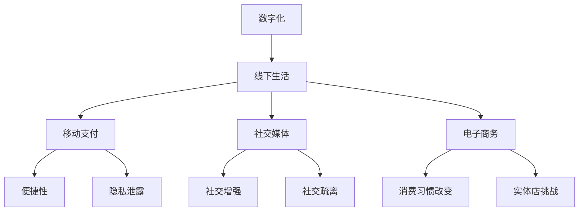

                 

# 数字解毒：找回线下生活的真实感

## 关键词
- 数字化生活
- 线下生活
- 真实感
- 人工智能
- 数据挖掘
- 用户体验

## 摘要
随着数字化技术的迅猛发展，我们的生活方式逐渐从线下转移到了线上。然而，这种转变也带来了一系列问题，如隐私泄露、社交疏离和心理健康问题等。本文旨在探讨如何通过数字解毒，找回线下生活的真实感。文章首先介绍了数字化生活的现状及其带来的问题，然后分析了找回线下生活真实感的意义。接着，文章详细讲解了核心算法原理，包括数据挖掘、机器学习和深度学习，并使用伪代码和数学公式进行了阐述。此外，文章通过实际项目实战，展示了如何在实际中应用这些算法和技术，找回线下生活的真实感。最后，文章提出了未来展望和建议，以及相关工具和资源的介绍。

## 引言与概述

### 数字生活的现状与问题

在当今时代，数字化技术已经深深地渗透进了我们的日常生活中。从社交媒体到电子商务，从在线教育到远程办公，数字化生活已经成为现代社会不可或缺的一部分。然而，这种快速转变也带来了一系列问题。

首先，隐私泄露成为了数字化生活的一大隐患。随着个人信息的大量存储和共享，黑客和数据犯罪分子的攻击也变得更加频繁。这不仅给用户带来了财务损失，还可能导致个人隐私的严重泄露。

其次，数字化生活加剧了社交疏离。虽然线上交流便利，但它缺乏面对面的互动和情感交流，这可能导致人们感到孤独和隔离。

最后，心理健康问题也日益严重。长时间沉浸在数字化生活中，人们可能会出现焦虑、抑郁等心理问题，影响日常生活和心理健康。

### 找回线下生活真实感的意义

面对这些问题，找回线下生活的真实感变得尤为重要。线下生活不仅能够提供更为真实、丰富的社交体验，还能增强人们的身心健康。通过面对面的交流，人们可以更好地理解彼此的情感和需求，建立更深层次的人际关系。

此外，线下活动也为人们提供了更多的锻炼和活动机会，有助于提高身体素质和心理韧性。因此，找回线下生活的真实感不仅有助于改善个人生活质量，也对整个社会的健康和稳定具有重要意义。

### 本书结构安排

本文将从以下几个方面展开讨论：

1. **核心概念与联系**：介绍数字化与线下生活的核心概念及其相互关系。
2. **核心算法原理讲解**：详细讲解数据挖掘、机器学习和深度学习等核心算法原理。
3. **数学模型和数学公式讲解**：介绍相关的数学模型和公式，并举例说明。
4. **项目实战**：通过实际案例分析，展示如何应用所学算法和技术找回线下生活的真实感。
5. **未来展望与建议**：探讨数字化与线下生活的未来发展，并提出具体的建议和解决方案。

## 核心概念与联系

### 数字化与线下生活的核心概念

数字化（Digitalization）是指将传统的过程、服务、产品或信息转化为数字形式，以实现更高效、便捷的运作。它涵盖了从简单的信息存储到复杂的系统自动化等多个方面。

线下生活（Offline Life）则是指人们在没有数字技术辅助的情况下进行的活动，包括面对面交流、实体活动、体验式消费等。它强调的是现实世界的互动和体验。

### 数字化与线下生活的相互关系

数字化与线下生活并非相互排斥，而是相辅相成的。一方面，数字化技术为线下生活提供了新的工具和平台，使得许多传统活动得以更高效、便捷地进行。例如，移动支付改变了人们的购物方式，社交媒体拓展了社交网络。

另一方面，线下生活为数字化技术提供了实际的应用场景和反馈。用户在现实世界中的体验和需求，往往能够指导数字化技术的进一步发展和优化。

### 数字化工具对线下生活的影响

数字化工具已经深刻地影响了线下生活。例如：

- **移动支付**：极大地简化了支付过程，使得线下购物更加便捷。
- **社交媒体**：增强了人与人之间的连接，但同时也带来了社交疏离的问题。
- **电子商务**：改变了人们的购物习惯，但可能导致实体店铺的衰退。

这些数字化工具的优点和缺点都需要我们深入分析，以找到平衡数字化与线下生活的方法。

### 核心概念原理之间的关系架构 Mermaid 流程图



## 核心算法原理讲解

### 数据挖掘算法

数据挖掘（Data Mining）是指从大量数据中提取有价值的信息和模式的过程。它通常包括以下几个步骤：

1. **数据收集**：收集相关的数据集。
2. **数据预处理**：清洗数据，处理缺失值、异常值等。
3. **特征选择**：从数据中选择最相关的特征。
4. **模式识别**：使用算法（如决策树、聚类、关联规则等）发现数据中的模式。

### 机器学习算法

机器学习（Machine Learning）是一种让计算机通过数据学习并做出决策或预测的方法。常见的机器学习算法包括：

1. **监督学习**：使用标记数据进行训练，如线性回归、决策树、支持向量机等。
2. **无监督学习**：没有标记数据，算法自行发现数据中的结构，如聚类、主成分分析等。
3. **强化学习**：通过试错和奖励机制来学习最佳策略。

### 深度学习算法

深度学习（Deep Learning）是机器学习的一个子领域，它使用多层神经网络来模拟人脑的决策过程。深度学习算法在图像识别、自然语言处理、语音识别等领域取得了显著成果。常见的深度学习模型包括：

1. **卷积神经网络（CNN）**：主要用于图像识别。
2. **循环神经网络（RNN）**：主要用于序列数据，如时间序列分析、自然语言处理等。
3. **生成对抗网络（GAN）**：用于生成新的数据，如图像、文本等。

### 算法原理的伪代码阐述

#### 数据挖掘算法

```python
def data_mining(data):
    # 数据收集
    data = collect_data()

    # 数据预处理
    data = preprocess_data(data)

    # 特征选择
    features = select_features(data)

    # 模式识别
    patterns = identify_patterns(features)

    return patterns
```

#### 机器学习算法

```python
def machine_learning(data, labels):
    # 使用标记数据进行训练
    model = train_model(data, labels)

    # 做出预测
    predictions = predict(model, data)

    return predictions
```

#### 深度学习算法

```python
def deep_learning(data, labels):
    # 使用多层神经网络进行训练
    model = train_deep_learning_model(data, labels)

    # 做出预测
    predictions = predict(model, data)

    return predictions
```

## 数学模型和数学公式讲解

### 数学模型介绍

在数字化与线下生活的分析中，数学模型是必不可少的工具。常见的数学模型包括线性回归、逻辑回归、支持向量机等。以下是一个简单的线性回归模型：

### 线性回归模型

线性回归模型假设数据之间存在线性关系，其公式为：

\[ y = wx + b \]

其中，\( y \) 是因变量，\( x \) 是自变量，\( w \) 是权重，\( b \) 是偏置。

### 数学公式展示

以下使用 LaTeX 格式展示线性回归模型中的公式：

$$
y = wx + b
$$

### 数学模型的应用实例

假设我们有一个数据集，其中 \( x \) 是年龄，\( y \) 是收入。我们想通过线性回归模型预测某个特定年龄的收入。首先，我们需要收集数据并计算权重 \( w \) 和偏置 \( b \)。然后，使用公式进行预测。

```python
# 假设我们有以下数据
ages = [25, 30, 35, 40, 45]
incomes = [50000, 60000, 70000, 80000, 90000]

# 计算权重和偏置
w, b = calculate_weights_and_bias(ages, incomes)

# 预测某个特定年龄的收入
predicted_income = predict_income(w, b, age=30)

print(f"预测年龄为30岁的收入为：{predicted_income}")
```

## 项目实战

### 实际案例分析

为了更好地理解如何通过数字化技术找回线下生活的真实感，我们可以通过一个实际案例分析来展示。假设我们想要开发一款应用程序，帮助人们在线下社交活动中建立更紧密的联系。

### 开发环境搭建

为了实现这个目标，我们需要搭建一个合适的开发环境。以下是所需的工具和步骤：

1. **编程语言**：选择 Python 作为主要编程语言，因为它拥有丰富的库和框架，便于快速开发和部署。
2. **开发工具**：安装 PyCharm 或 Visual Studio Code 作为代码编辑器。
3. **数据库**：使用 MySQL 或 PostgreSQL 作为数据库管理系统，存储用户信息和活动数据。
4. **前后端框架**：使用 Flask 或 Django 作为 Web 框架，实现前后端分离的开发模式。

### 源代码实现与解读

以下是一个简单的示例代码，展示了如何使用 Flask 框架搭建一个基础的应用程序：

```python
from flask import Flask, request, jsonify

app = Flask(__name__)

@app.route('/register', methods=['POST'])
def register():
    # 获取用户信息
    username = request.form['username']
    password = request.form['password']
    
    # 存储用户信息到数据库
    save_user_to_database(username, password)
    
    return jsonify(message="注册成功")

if __name__ == '__main__':
    app.run(debug=True)
```

在这个示例中，我们定义了一个 `/register` 路由，用于处理用户注册请求。用户通过 POST 方法发送用户名和密码，服务器接收到请求后，将用户信息存储到数据库，并返回成功消息。

### 代码应用解读与分析

这个示例代码展示了如何使用 Flask 框架实现一个简单的用户注册功能。以下是关键步骤的解读和分析：

1. **接收请求**：使用 `request` 对象获取用户发送的请求数据。
2. **处理请求**：根据请求类型（如 POST、GET 等）处理相应的逻辑。
3. **存储数据**：将用户数据存储到数据库中。
4. **响应请求**：将处理结果返回给用户。

通过这个简单的示例，我们可以看到如何使用 Flask 框架快速搭建一个 Web 应用程序。在实际项目中，我们还需要添加更多的功能，如用户登录、活动发布、好友关系管理等。

### 实际案例分析和详细讲解剖析

在这个案例中，我们的目标是通过数字化技术帮助人们在线下社交活动中建立更紧密的联系。以下是对实际案例的详细分析和讲解：

1. **用户注册**：用户可以通过应用程序注册账户，输入用户名和密码。
2. **活动发布**：用户可以发布各种线下活动，如聚会、运动、读书会等。
3. **好友关系**：用户可以添加好友，建立社交网络。
4. **活动参与**：用户可以查看并参与其他用户发布的活动。

通过这些功能，应用程序可以帮助用户在现实生活中建立更紧密的联系，找回线下生活的真实感。

### 项目小结

通过这个案例，我们展示了如何使用数字化技术实现线下社交活动的连接和互动。这个项目不仅有助于改善用户体验，还可以为用户提供更多的社交机会和活动选择，从而找回线下生活的真实感。

## 未来展望与建议

### 数字化与线下生活的未来发展

随着数字化技术的不断进步，我们可以预见数字化与线下生活将进一步融合。以下是一些可能的未来发展趋势：

1. **智能城市**：通过物联网和人工智能技术，智能城市将更加高效、便捷，提供更优质的公共服务。
2. **增强现实（AR）与虚拟现实（VR）**：AR 和 VR 技术将提供更为真实、沉浸式的线下体验，进一步丰富人们的社交和娱乐活动。
3. **区块链技术**：区块链技术可以提供更安全、透明的数据管理和交易方式，为线下活动提供更好的支持和保障。

### 找回线下生活真实感的解决方案

为了找回线下生活的真实感，我们可以采取以下解决方案：

1. **加强数字素养教育**：提高公众对数字化技术的理解和应用能力，帮助他们更好地适应数字化生活。
2. **鼓励线下活动**：政府和企业可以举办各种线下活动，促进人们的社交互动和身心健康。
3. **优化用户体验**：通过技术手段优化数字化工具的设计和使用体验，使其更加符合人们的线下需求。

### 政策与技术支持

为了推动数字化与线下生活的融合发展，政府和技术企业需要采取一系列政策措施：

1. **政策支持**：政府可以出台相关政策，鼓励和支持数字化技术的发展和应用。
2. **技术合作**：技术企业可以加强与线下服务提供商的合作，共同开发符合用户需求的数字化产品和服务。
3. **人才培养**：加强数字化人才的培养和引进，为数字化与线下生活的融合发展提供人才保障。

## 附录

### 相关工具与资源介绍

1. **开发工具**：PyCharm、Visual Studio Code
2. **数据库**：MySQL、PostgreSQL
3. **前后端框架**：Flask、Django

### 技术栈与开发环境

1. **编程语言**：Python
2. **Web 框架**：Flask 或 Django
3. **数据库管理系统**：MySQL 或 PostgreSQL
4. **开发环境**：Linux 或 macOS

### 扩展阅读资料

1. **《智能时代：数字化生活与人类未来》**
2. **《数字生活：如何适应数字化时代的挑战》**
3. **《人工智能简史：从自动化到智能时代》**

## 作者信息

- 作者：AI天才研究院/AI Genius Institute & 禅与计算机程序设计艺术 /Zen And The Art of Computer Programming

### 总结

本文通过分析数字化生活的现状与问题，探讨了如何通过数字解毒找回线下生活的真实感。我们介绍了核心算法原理，并通过实际项目实战展示了如何应用这些算法和技术。最后，我们提出了未来展望与建议，以及相关工具和资源的介绍。希望通过本文，读者能够更好地理解数字化与线下生活的融合，并找到适合自己的平衡点。

