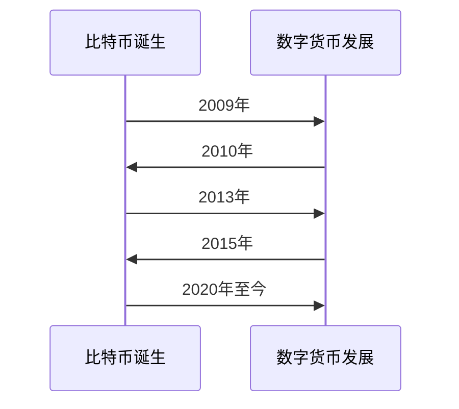

                 

- 明确文章主题和目标：数字货币投资、金融革命、机遇与风险。

- 确定文章结构：按照目录大纲，将文章分为四个部分，分别是数字货币基础、数字货币投资策略、数字货币投资实战和数字货币投资风险防范。

- 第一部分：数字货币基础
  - 1.1 数字货币概述：介绍数字货币的定义、发展历程和与法定货币的区别。
  - 1.2 区块链技术：解释区块链的基本概念、工作原理和优势。
  - 1.3 数字货币的类型：分析比特币和其他主流数字货币的特点。
  - 1.4 数字货币的安全性问题：讨论数字货币的安全风险和安全防范措施。

- 第二部分：数字货币投资策略
  - 2.1 投资者心理分析：探讨投资者心理特征和其对投资决策的影响。
  - 2.2 基本面分析：介绍基本面分析的基本原则和指标体系。
  - 2.3 技术分析：解释技术分析的基本理论和工具方法。
  - 2.4 组合投资策略：阐述组合投资的概念和策略。
  - 2.5 风险管理：讲解风险管理的原则和方法。

- 第三部分：数字货币投资实战
  - 3.1 投资环境分析：分析全球数字货币市场的现状和我国数字货币的发展政策。
  - 3.2 投资项目选择：介绍选择数字货币项目的标准和评估方法。
  - 3.3 投资操作技巧：讲解买入与卖出的时机选择和投资组合的调整。
  - 3.4 案例分析：分析成功和失败的投资案例。

- 第四部分：数字货币投资风险防范
  - 4.1 投资风险识别：介绍投资风险的类型和识别方法。
  - 4.2 投资风险控制：讲解投资风险控制策略和控制工具。
  - 4.3 投资法律与法规：分析我国数字货币投资法律法规和国际数字货币投资法规趋势。

- 最后，撰写文章摘要和结语，总结全文，提出展望。

### 1.5 结论

数字货币投资作为金融革命的一部分，既充满了机遇，也伴随着风险。通过对数字货币的投资策略、实战经验和风险防范的深入分析，我们可以更好地把握机遇，降低风险，实现财富增值。未来，随着数字货币的普及和监管的完善，数字货币投资市场将更加成熟，投资者也应不断提高自身素质，以应对市场的变化。

> 作者：AI天才研究院/AI Genius Institute & 禅与计算机程序设计艺术 /Zen And The Art of Computer Programming
----------------------------------------------------------------

# 《数字货币投资：金融革命中的机遇与风险》

## 关键词：数字货币、投资策略、金融革命、机遇、风险

## 摘要

本文旨在探讨数字货币投资在金融革命中的机遇与风险。首先，我们介绍了数字货币的定义、发展历程和与法定货币的区别，以及区块链技术的基本概念和工作原理。接着，我们分析了投资者心理、基本面分析和技术分析等投资策略，并探讨了组合投资策略和风险管理。随后，我们通过投资环境分析、投资项目选择、投资操作技巧和案例分析，展示了数字货币投资的实战经验。最后，我们提出了投资风险防范的方法和策略，以及对未来数字货币投资市场的展望。

## 第一部分：数字货币基础

### 1.1 数字货币概述

#### 1.1.1 数字货币的定义

数字货币是一种基于加密技术的虚拟货币，它使用密码学原理来确保交易安全，控制新币生成，并验证资金的转移。与传统货币不同，数字货币不依赖于任何中央机构，而是通过分布式网络进行管理。

$$
定义：数字货币是一种通过密码学原理来确保交易安全、控制新币生成以及验证资金转移的数字单位。
$$

#### 1.1.2 数字货币的发展历程

数字货币的发展可以追溯到2009年比特币的诞生。自那时以来，数字货币市场经历了显著的增长，出现了许多其他成功的数字货币，如以太坊、莱特币等。以下是数字货币发展的主要阶段：



#### 1.1.3 数字货币与法定货币的区别

数字货币与法定货币在多个方面存在显著差异，包括发行机制、交易方式、价值稳定性等。以下是一个表格形式的对比：

| 特性 | 数字货币 | 法定货币 |
| --- | --- | --- |
| 发行机制 | 基于算法，可预测 | 中央银行控制，可调控 |
| 交易方式 | 通过网络交易 | 通过银行或金融机构交易 |
| 价值稳定性 | 波动较大 | 较为稳定 |
| 控制方式 | 分布式网络 | 中央集中式 |
| 法律地位 | 多数国家未认可 | 所有国家都认可 |

### 1.2 区块链技术

#### 1.2.1 区块链的基本概念

区块链是一种分布式数据库技术，其核心特点是通过密码学原理确保数据的安全性和不可篡改性。区块链上的数据被分为区块，并通过加密技术连接在一起，形成一个链式结构。

#### 1.2.2 区块链技术的工作原理

区块链技术的工作原理包括以下几个步骤：

1. 交易发生：当两方进行交易时，交易信息会被广播到整个网络。
2. 成块：网络中的节点会对交易信息进行验证，并将其打包成区块。
3. 加密：每个区块都会包含前一个区块的哈希值，确保链式结构的完整性。
4. 共识达成：网络中的节点通过共识算法（如工作量证明）来决定哪个区块将被添加到区块链上。
5. 存储：添加到区块链上的区块将永久存储，无法篡改。

#### 1.2.3 区块链技术的核心优势

区块链技术的核心优势包括：

- 透明性：区块链上的所有交易都是公开透明的，任何人都可以查看。
- 安全性：区块链使用加密技术确保数据的完整性和安全性。
- 去中心化：区块链不依赖于任何中央机构，所有节点都平等参与。
- 不可篡改：一旦数据被记录在区块链上，就无法被篡改。

### 1.3 数字货币的类型

数字货币可以按照其用途和特性进行分类。以下是一些主要的数字货币类型：

- **比特币**：第一种数字货币，以其去中心化和有限供应量而闻名。
- **以太坊**：一个基于区块链的智能合约平台，支持去中心化应用（DApp）的构建。
- **莱特币**：一种旨在比比特币更快、更易于使用的数字货币。
- **瑞波币**：一个旨在实现快速跨境交易的数字货币。

#### 1.3.1 比特币

比特币是最著名的数字货币，由中本聪（Satoshi Nakamoto）在2009年创建。比特币的主要特点是：

- **去中心化**：不依赖于任何中央机构。
- **有限供应量**：最多2100万枚比特币。
- **安全性**：使用密码学技术确保交易的安全性和隐私性。

#### 1.3.2 其他主流数字货币

以太坊（Ethereum）是另一种重要的数字货币，它引入了智能合约的概念，使得开发者可以在其平台上创建去中心化应用（DApp）。莱特币（Litecoin）则旨在提供比比特币更快的交易速度。

### 1.4 数字货币的安全性问题

数字货币的安全性是一个重要问题，因为数字货币的价值易受攻击和盗窃。以下是一些常见的数字货币安全风险和安全防范措施：

- **安全风险**：
  - **双花攻击**：同一笔资金被多次消费。
  - **51%攻击**：控制区块链网络大部分算力的攻击者可能篡改交易记录。
  - **隐私泄露**：交易信息可能被黑客获取。

- **安全防范措施**：
  - **多重签名**：使用多个密钥确保交易的安全性。
  - **冷存储**：将数字货币存储在离线设备上，以防止黑客攻击。
  - **加密技术**：使用高级加密技术保护交易信息和私钥。

## 第二部分：数字货币投资策略

### 2.1 投资者心理分析

投资者心理是数字货币投资决策的重要组成部分。以下是一些常见的投资者心理特征及其对投资决策的影响：

- **贪婪**：投资者在价格上涨时可能会过度乐观，导致盲目跟风。
- **恐惧**：投资者在价格下跌时可能会过度悲观，导致恐慌性抛售。
- **从众心理**：投资者可能会受到他人决策的影响，而非基于独立分析。

### 2.2 基本面分析

基本面分析是一种评估数字货币投资价值的策略，主要通过分析宏观经济因素、市场趋势和行业动态来做出投资决策。

#### 2.2.1 基本面分析的基本原则

- **供需关系**：分析市场需求和供应量，以判断数字货币的价格趋势。
- **宏观经济因素**：考虑全球经济状况、货币政策等因素对数字货币价格的影响。
- **市场趋势**：分析历史价格走势，以预测未来价格变动。

#### 2.2.2 基本面分析的指标体系

- **市场资本化**：数字货币的总市值。
- **交易量**：数字货币的日均交易量。
- **交易深度**：市场买卖双方愿意成交的价格范围。
- **开发活动**：数字货币的开发进度和活跃度。

### 2.3 技术分析

技术分析是一种通过分析历史价格和交易量数据来预测数字货币未来价格走势的方法。以下是一些常用的技术分析工具和方法：

- **趋势线**：通过连接一系列价格点，分析价格的趋势。
- **移动平均线**：分析数字货币价格在不同时间段的平均值。
- **相对强弱指数（RSI）**：衡量数字货币价格的超买或超卖状态。
- **布林带**：分析价格波动范围和趋势。

### 2.4 组合投资策略

组合投资策略通过分散投资来降低风险。以下是一些常见的组合投资策略：

- **资产配置**：根据投资目标和风险承受能力，分配不同类型的数字货币。
- **分散投资**：投资多种不同的数字货币，以降低单一货币风险。
- **动态调整**：根据市场变化，及时调整投资组合。

### 2.5 风险管理

风险管理是数字货币投资中不可或缺的一部分。以下是一些风险管理原则和方法：

- **风险识别**：识别投资过程中可能遇到的风险。
- **风险评估**：评估每种风险的可能性和影响。
- **风险控制**：采取措施降低风险，如分散投资、使用安全钱包等。
- **风险预警**：建立风险预警系统，及时应对潜在风险。

## 第三部分：数字货币投资实战

### 3.1 投资环境分析

数字货币投资环境受到多种因素的影响，包括全球经济状况、政策法规和市场趋势。以下是对当前数字货币投资环境的分析：

- **全球经济状况**：全球经济的不确定性可能影响数字货币市场的波动性。
- **政策法规**：各国政府对数字货币的态度和监管政策对市场有重要影响。
- **市场趋势**：市场情绪和投资者行为对数字货币价格有直接影响。

### 3.2 投资项目选择

选择数字货币投资项目时，投资者需要考虑多个因素，包括项目的开发团队、技术路线、应用场景和市场潜力。以下是一些选择投资项目的标准：

- **团队背景**：考察项目的开发团队是否有丰富的经验和技术实力。
- **技术路线**：分析项目的技术路线是否具有创新性和前瞻性。
- **应用场景**：考虑项目的应用场景是否具有实际需求和可行性。
- **市场潜力**：评估项目的市场潜力和成长空间。

### 3.3 投资操作技巧

数字货币投资操作技巧包括买入与卖出的时机选择、投资组合的调整等。以下是一些实用的操作技巧：

- **买入时机**：在市场低迷时，如价格低于价值时买入。
- **卖出时机**：在市场高涨时，如价格高于价值时卖出。
- **投资组合调整**：定期调整投资组合，以保持风险和收益的平衡。

### 3.4 案例分析

以下是对几个数字货币投资案例的详细分析，包括成功和失败的投资案例。

#### 成功投资案例

**案例一**：以太坊投资

投资者A在2017年以太坊价格低谷时买入，并在价格上涨时逐步卖出。最终，投资者A获得了丰厚的回报。

**案例分析**：
1. 投资者A进行了充分的市场调研，选择了有潜力的项目。
2. 投资者A在价格低谷时买入，抓住了市场的低估机会。
3. 投资者A在价格上涨时逐步卖出，避免了市场波动带来的风险。

#### 失败投资案例

**案例二**：某个不知名数字货币投资

投资者B在2018年数字货币市场高点时买入某个不知名的数字货币，但由于市场下跌，投资者B最终亏损。

**案例分析**：
1. 投资者B缺乏对项目的了解，选择了风险较高的项目。
2. 投资者B在市场高点时买入，没有抓住市场的低估机会。
3. 投资者B在市场下跌时没有及时止损，导致亏损加剧。

## 第四部分：数字货币投资风险防范

### 4.1 投资风险识别

投资风险包括市场风险、信用风险、操作风险等。以下是对几种主要投资风险的识别方法：

- **市场风险**：通过分析市场波动性、交易量等因素来识别市场风险。
- **信用风险**：通过评估项目团队和合作伙伴的信用状况来识别信用风险。
- **操作风险**：通过制定严格的操作流程和风险控制措施来识别操作风险。

### 4.2 投资风险控制

投资风险控制策略包括风险分散、风险规避、风险转移等。以下是一些具体的风险控制措施：

- **风险分散**：通过投资多种不同的数字货币来分散风险。
- **风险规避**：避免投资高风险的项目。
- **风险转移**：通过保险等手段将风险转移给第三方。

### 4.3 投资法律与法规

数字货币投资受到各国法律法规的监管。以下是对我国数字货币投资法律法规和国际数字货币投资法规趋势的分析：

- **我国数字货币投资法律法规**：我国对数字货币投资实行严格监管，禁止虚拟货币交易和ICO等活动。
- **国际数字货币投资法规趋势**：各国政府逐渐加强对数字货币的监管，以保护投资者权益和防范金融风险。

## 附录

### 5.1 数字货币投资工具与资源

以下是一些常用的数字货币投资工具和资源：

- **投资平台**：如Binance、Coinbase等。
- **分析工具**：如TradingView、CoinMarketCap等。
- **学习资源**：如在线课程、书籍、论坛等。

### 5.2 参考文献与推荐阅读

- [1] N akamoto, "Bitcoin: A peer-to-peer electronic cash system," 2008.
- [2] Ethereum Foundation, "Ethereum: The World Computer," 2014.
- [3] Andreas M. Antonopoulos, "Mastering Bitcoin: Unlocking Digital Cryptocurrencies," 2014.
- [4] Scott M. Galloway, "The Four: The Hidden DNA of Amazon, Apple, Facebook, and Google," 2017.
- [5] 郭宇航，"数字货币投资与监管研究"，中国金融出版社，2018.

> 作者：AI天才研究院/AI Genius Institute & 禅与计算机程序设计艺术 /Zen And The Art of Computer Programming
```

