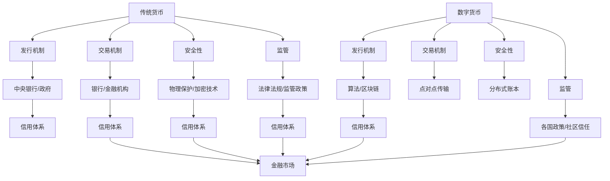
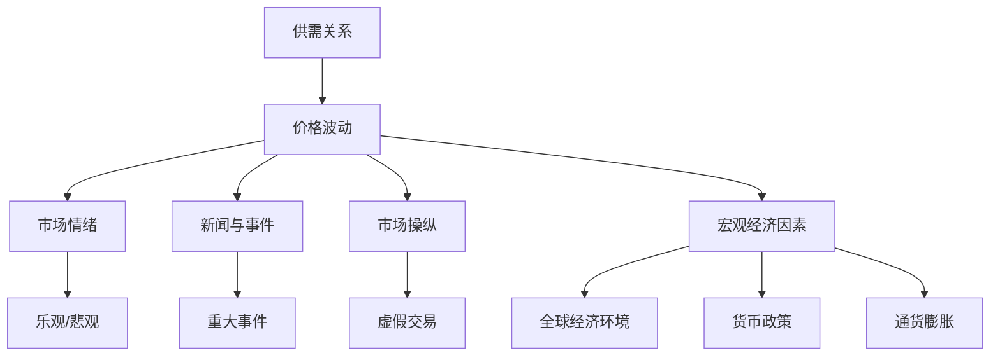

                 

### 文章标题：数字货币经济：金融系统的革命性变革

#### 关键词：数字货币、金融系统、区块链、加密技术、经济原理、市场监管

> **摘要**：
> 本文将深入探讨数字货币经济对金融系统的革命性变革。首先，我们将介绍数字货币的基本概念和起源，探讨其与传统货币的区别。接着，文章将详细解释数字货币的底层技术，如区块链和加密技术。然后，我们将分析数字货币的经济原理，包括价值衡量、供需关系等。随后，文章将探讨数字货币市场与监管的挑战，以及数字货币对金融系统的影响。最后，我们将展望数字货币的未来发展，并总结最佳实践和未来趋势。通过这篇文章，读者将全面了解数字货币经济，以及其对金融系统带来的深远变革。

### 背景介绍

随着互联网技术的飞速发展，数字货币逐渐成为金融领域的一个热门话题。从比特币的出现到如今各类加密货币的百花齐放，数字货币已经在全球范围内引发了广泛的关注和讨论。然而，尽管数字货币的应用日益普及，但人们对它的认识仍存在诸多误区和疑问。

首先，许多人将数字货币简单地等同于虚拟货币或电子货币。实际上，数字货币是一种基于区块链技术的去中心化货币，它不仅具有匿名性和不可篡改性，还具备快速交易和高安全性等特点。与传统货币相比，数字货币在交易效率、成本和安全性方面具有显著优势，这使得它在金融领域具有巨大的潜力。

其次，数字货币的崛起不仅改变了货币的形态，还对金融系统产生了深远的影响。从货币政策的制定到银行业的服务模式，数字货币正在挑战传统的金融体系。例如，数字货币的出现使得跨境支付变得更加便捷和低成本，同时也为金融包容性提供了新的解决方案。然而，数字货币的发展也面临着诸多监管挑战，如隐私保护、资金流向监管等。

此外，数字货币市场的波动性和风险性也引发了广泛的讨论。尽管数字货币在价格上存在巨大波动，但其作为一种投资工具，吸引了大量的投资者。然而，数字货币市场的监管缺失和投机行为也带来了诸多风险，如市场操纵、非法集资等。

总之，数字货币的兴起不仅改变了货币的形态，还对金融系统产生了革命性的影响。本文将深入探讨数字货币经济的基本概念、底层技术、经济原理、市场与监管挑战、金融应用以及未来发展趋势，旨在为读者提供一幅全面的数字货币经济图景，以及其对金融系统的深远影响。

### 核心概念与联系：数字货币与传统货币的对比与联系

在深入探讨数字货币经济之前，我们有必要理解数字货币与传统货币之间的基本概念和联系。数字货币和传统货币在形态、机制、功能和特性上都有显著的差异，但它们之间也存在一些紧密的联系。

#### 数字货币与传统货币的对比

**1. 形态与存在形式**

传统货币是物理实体，如纸币和硬币，具有直观的物理形态，便于流通和使用。而数字货币则是以数字形式存在的，通过电子账户或区块链网络进行存储和转移。

**2. 发行机制**

传统货币的发行通常由中央银行或政府控制，通过印刷和铸币的方式增加货币供应量。数字货币的发行则基于特定的算法和区块链技术，通过挖矿或预定的发行计划进行。

**3. 交易机制**

传统货币交易需要通过物理交割或银行转账等方式进行，存在交易时间较长和成本较高的问题。数字货币交易则是基于区块链网络的点对点传输，交易速度快且成本低。

**4. 安全性**

传统货币的安全依赖于物理保护和银行的安全措施，存在被盗窃或伪造的风险。数字货币通过加密技术和分布式账本确保交易安全，攻击者难以篡改或复制。

**5. 监管**

传统货币的监管由中央银行和政府主导，受到严格的监管和法律法规的约束。数字货币的监管则较为复杂，各国监管政策不一，存在监管空白和监管套利的风险。

#### 数字货币与传统货币的联系

**1. 功能替代**

数字货币在支付、结算、储蓄等方面与传统货币具有类似的功能，可以作为货币的一种形式存在。

**2. 价值储存**

数字货币与传统货币一样，可以作为一种价值储存工具，具备一定的价值稳定性和保值功能。

**3. 信用体系**

数字货币的信用体系与传统货币的信用体系密切相关。传统货币的信用建立在政府和中央银行的信任基础上，而数字货币的信用则依赖于其算法和社区信任。

**4. 金融市场**

数字货币和传统货币都参与金融市场，作为投资和交易工具。然而，由于数字货币的匿名性和去中心化特性，其市场表现和风险特征与传统货币有所不同。

#### 关系架构 Mermaid 流程图

为了更直观地展示数字货币与传统货币之间的联系，我们可以使用Mermaid流程图进行描述。以下是一个简化的Mermaid流程图示例：



通过这个流程图，我们可以清晰地看到数字货币与传统货币在发行、交易、安全性和监管等方面的区别和联系。这有助于我们更好地理解数字货币经济的运作机制和其对传统金融系统的影响。

### 核心概念与联系：数字货币的底层技术

在深入理解数字货币的概念和与传统货币的联系之后，我们接下来将探讨数字货币的底层技术，特别是区块链技术和加密技术。这些技术是数字货币能够实现去中心化、安全性高、透明度强等特性的关键。

#### 区块链技术

区块链技术是一种分布式数据库技术，它通过多个节点共同维护一个共享的账本，确保数据的不可篡改性和透明性。区块链的核心特点包括：

1. **分布式账本**：区块链上的数据由多个节点共同维护，每个节点都保存一份完整的账本副本。这使得数据不会被单一节点控制或篡改，提高了系统的安全性。

2. **去中心化**：区块链技术不需要中心化的第三方中介，如银行或政府，进行交易验证和记录。交易由网络中的多个节点共同验证，并记录在区块链上，实现了去中心化的交易。

3. **智能合约**：区块链上的智能合约是一种自动执行合约条款的计算机程序。当满足特定的条件时，智能合约会自动执行，确保交易的透明性和不可篡改性。

4. **安全性**：区块链技术通过加密算法和共识机制确保数据的安全性和完整性。攻击者要篡改区块链上的数据，需要同时攻击多个节点，这几乎是不可能的。

以下是一个简化的区块链运作流程的伪代码：

```python
# 定义区块链类
class Blockchain:
    def __init__(self):
        self.chain = []  # 存储区块链的列表
        self.current_transactions = []  # 存储当前区块的交易列表
        self.create_genesis_block()  # 创建创世区块

    def create_genesis_block(self):
        # 创建创世区块
        genesis_block = {
            'index': 0,
            'transactions': [],
            'timestamp': time(),
            'prev_hash': 1,
        }
        self.chain.append(genesis_block)

    def add_block(self, block):
        # 添加新的区块到区块链
        self.current_transactions = []
        self.chain.append(block)

    def proof_of_work(self, last_block):
        # 计算工作量证明
        last_hash = hash_block(last_block)
        nonce = 0
        while valid_proof(last_hash) is False:
            nonce += 1
        return nonce

    def valid_proof(self, last_hash):
        # 验证工作量证明是否有效
        guess = f'{last_hash}{nonce}{time()}'.encode()
        guess_hash = hash_block(guess)
        return guess_hash[:4] == '0000'

# 工具函数
def hash_block(block):
    # 计算区块的哈希值
    block_string = json.dumps(block, sort_keys=True)
    return hashlib.sha256(block_string.encode()).hexdigest()

# 创建区块链实例并添加区块
blockchain = Blockchain()

# 添加新区块到区块链
block = {
    'index': 2,
    'transactions': blockchain.current_transactions,
    'timestamp': time(),
    'prev_hash': hash_block(blockchain.chain[-1]),
}
proof = blockchain.proof_of_work(block)
block['proof'] = proof
blockchain.add_block(block)
```

#### 加密技术

加密技术是数字货币安全性的基石，它通过将明文转换为密文，确保数据在传输和存储过程中的保密性和完整性。以下是几种常用的加密技术：

1. **哈希函数**：哈希函数是一种将任意长度的输入数据转换成固定长度的字符串的算法。在区块链中，哈希函数用于确保数据的完整性和不可篡改性。常见的哈希函数包括SHA-256、SHA-3等。

2. **对称加密**：对称加密是指加密和解密使用相同的密钥。常见的对称加密算法包括AES、DES等。对称加密适用于数据传输和存储的加密，但其安全性依赖于密钥的保密性。

3. **非对称加密**：非对称加密使用一对密钥（公钥和私钥），公钥用于加密，私钥用于解密。常见的非对称加密算法包括RSA、ECC等。非对称加密适用于数字签名和密钥交换，其安全性比对称加密更高。

4. **数字签名**：数字签名是一种用于验证数据完整性和真实性的技术。发送者使用私钥对数据进行签名，接收者使用公钥验证签名。常见的数字签名算法包括RSA签名、ECC签名等。

以下是一个使用RSA算法进行数字签名的伪代码：

```python
from Crypto.PublicKey import RSA
from Crypto.Signature import pkcs1_15
from Crypto.Hash import SHA256

# 生成RSA密钥对
key = RSA.generate(2048)
private_key = key.export_key()
public_key = key.publickey().export_key()

# 对数据进行哈希计算
data = 'Hello, world!'
hash_value = SHA256.new(data.encode())

# 使用私钥对哈希进行签名
signature = pkcs1_15.new(key).sign(hash_value)

# 签名验证
public_key = RSA.import_key(public_key)
is_valid = pkcs1_15.new(public_key).verify(hash_value, signature)

if is_valid:
    print("签名验证成功")
else:
    print("签名验证失败")
```

通过区块链技术和加密技术的结合，数字货币实现了去中心化、安全性和透明性等特性。这些技术不仅为数字货币提供了强大的安全保障，也为数字货币的广泛应用奠定了基础。

### 数字货币的经济原理

在深入探讨数字货币的技术原理之后，我们接下来将分析数字货币的经济原理，这包括价值衡量、供需关系、价格波动等核心概念。理解这些经济原理对于全面把握数字货币的运行机制和潜在风险至关重要。

#### 价值衡量

数字货币的价值衡量是理解其经济原理的重要一环。与传统货币不同，数字货币的价值不仅取决于市场供需，还受到技术、政策、社区信心等多种因素的影响。以下是几个关键概念：

1. **市场供需**：数字货币的价值主要受市场供需影响。当需求增加而供应量不变时，价格上升；反之，当需求减少或供应量增加时，价格下降。市场需求通常由投资者的兴趣、风险偏好以及特定事件（如新功能的推出或重大新闻）驱动。

2. **稀缺性**：许多数字货币（如比特币）通过预设的发行计划保证其稀缺性。比特币的发行量有一个上限，这使得比特币具有稀缺性，从而在一定程度上支撑了其价值。

3. **技术因素**：技术性能，如安全性、可扩展性、交易速度等，也会影响数字货币的价值。技术进步通常会增加数字货币的吸引力，进而提高其价值。

4. **政策法规**：政府政策法规对数字货币的价值也有显著影响。一些国家对数字货币持开放态度，鼓励创新和应用，而另一些国家则对其进行严格监管，限制了其发展空间。

5. **社区信心**：数字货币的社区信心，即用户和开发者对其未来发展的信心，也是影响其价值的重要因素。强大的社区支持有助于稳定数字货币的价格，而信任危机则可能导致价格大幅波动。

#### 供需关系

数字货币的供需关系是其价值稳定性的关键。以下是对供需关系的详细分析：

1. **需求因素**：数字货币的需求主要来自以下几个方面：
   - **投资需求**：许多投资者将数字货币视为一种高风险、高回报的投资工具。
   - **支付需求**：随着数字货币支付渠道的增加，越来越多的人开始使用数字货币进行日常交易。
   - **储备需求**：一些机构和个人将数字货币作为一种价值储备工具，以对冲通货膨胀或货币贬值。

2. **供应因素**：数字货币的供应通常受到以下因素的影响：
   - **发行计划**：一些数字货币如比特币有固定的发行计划，而其他货币则通过挖矿等方式持续发行。
   - **挖矿难度**：在区块链系统中，挖矿难度会根据网络的算力进行调整，这影响了新币的生成速度。
   - **流动性**：数字货币的流动性，即供应量在市场上的流通程度，也会影响其价格。

3. **供需平衡**：供需关系决定了数字货币的价格。当需求大于供应时，价格上涨；当需求小于供应时，价格下跌。然而，供需平衡是一个动态过程，受到多种外部因素的影响。

#### 价格波动

数字货币价格波动是市场关注的重点，以下是几个关键因素：

1. **市场情绪**：市场情绪的变化可以迅速影响数字货币的价格。投资者情绪乐观时，价格可能迅速上涨；情绪悲观时，价格可能急剧下跌。

2. **新闻与事件**：重大新闻事件、政策变化、技术突破等都可以引起市场反应，导致价格波动。

3. **市场操纵**：市场操纵行为，如虚假交易、操纵市场情绪等，也可能导致价格剧烈波动。

4. **宏观经济因素**：全球经济环境、货币政策、通货膨胀等宏观经济因素也会影响数字货币的价格。

以下是一个简化的价格波动分析模型：



通过上述分析，我们可以看到数字货币的经济原理是一个复杂的系统，受到多种因素的共同影响。理解这些原理有助于我们更准确地预测市场动态，从而做出更明智的投资决策。

### 数字货币的市场与监管挑战

数字货币市场的快速发展带来了诸多挑战，尤其在监管方面。这些挑战不仅关乎市场稳定，也涉及法律合规和社会信任。以下将详细探讨数字货币市场的监管现状、政策发展、监管与市场创新的关系，并分析其中存在的风险。

#### 监管现状

当前，全球各国对数字货币的监管态度不尽相同，但总体上可以分为三个阶段：

1. **观望期**：许多国家在数字货币初期发展时持观望态度，缺乏明确的监管政策。这一阶段主要由于数字货币的匿名性和去中心化特性使得监管机构难以有效监管。

2. **探索期**：随着数字货币市场的逐步扩大，一些国家开始探索和制定初步的监管政策。例如，美国、日本、瑞士等国家已经对加密货币交易所、ICO等进行了监管，并出台了一系列法律法规。

3. **规范期**：随着数字货币市场的成熟，一些国家加大了对数字货币的监管力度，试图建立完善的监管体系。例如，中国对数字货币交易所进行了严格限制，禁止ICO和虚拟货币交易。

#### 政策发展

数字货币政策的发展呈现出几个趋势：

1. **监管沙箱**：一些国家推出了监管沙箱机制，允许企业在一定范围内进行数字货币相关创新，同时进行监管测试。这种政策有助于促进数字货币市场的健康发展。

2. **反洗钱（AML）和反恐融资（CFT）**：随着数字货币的匿名性，反洗钱和反恐融资成为监管的重要方向。许多国家要求加密货币交易所和钱包提供商遵循AML/CFT法规，以防止非法资金流动。

3. **跨境支付**：跨境支付是数字货币的一个重要应用领域。一些国家正在探索跨境支付的监管框架，以确保资金流动的透明性和合法性。

#### 监管与市场创新的关系

监管与市场创新之间存在复杂的关系：

1. **平衡创新与风险**：监管的目的是确保市场稳定和投资者保护，但过度的监管可能抑制创新。因此，监管机构需要在创新和风险之间找到平衡点。

2. **推动合规创新**：合理的监管可以推动合规创新，例如，一些数字货币公司通过技术手段提高交易透明度和安全性，以满足监管要求。

3. **国际协调**：由于数字货币跨国特性，国际协调成为监管的关键。各国监管机构需要加强合作，共同应对跨境监管挑战。

#### 风险分析

数字货币市场存在以下主要风险：

1. **市场操纵**：市场操纵可能导致价格剧烈波动，损害投资者利益。监管机构需要加强市场监控和处罚力度。

2. **资金流向问题**：数字货币匿名性较高，可能被用于非法资金流动。监管机构需要完善AML/CFT法规，加强跨境监管合作。

3. **网络安全问题**：数字货币依赖于网络和加密技术，存在被黑客攻击的风险。监管机构需要推动网络安全技术的创新和应用。

4. **法律合规问题**：数字货币市场的快速发展带来了法律合规挑战，如税务问题、金融诈骗等。监管机构需要完善相关法律法规，提供明确的法律指引。

总之，数字货币市场的监管挑战是多方面的，需要政府、企业和社会各界的共同努力。通过合理监管，我们可以促进数字货币市场的健康发展，同时保护投资者利益，维护社会稳定。

### 数字货币对金融系统的影响

数字货币的崛起正在对金融系统产生深远的影响，从货币政策到银行业，再到支付系统和金融包容性，各个领域都在经历一场革命性的变革。以下将详细分析数字货币对金融系统的影响，包括数字货币对货币政策的冲击、数字货币对银行业的影响、数字货币支付的发展以及数字货币如何促进金融包容性。

#### 数字货币对货币政策的冲击

数字货币的崛起对传统货币政策提出了新的挑战。首先，数字货币的存在可能会影响货币供应和货币需求。例如，比特币等加密货币的稀缺性和去中心化特性可能导致其价值与法定货币产生背离，影响货币市场的稳定性。以下是其具体影响：

1. **货币供应**：传统货币政策通常通过调整货币供应量来影响经济。然而，数字货币的供应机制通常由算法控制，不受中央银行直接控制，这可能削弱中央银行对货币供应的调控能力。

2. **货币需求**：随着数字货币的普及，人们可能会减少对传统货币的需求，转而使用数字货币进行交易和投资。这种变化可能导致货币需求减少，影响货币政策的有效性。

3. **通货膨胀和利率**：数字货币的价格波动性可能导致通货膨胀预期发生变化。如果数字货币被视为一种保值工具，人们可能会减少持有法定货币，导致通货膨胀压力增大。此外，数字货币对利率的影响也值得探讨，因为其可能导致传统货币政策工具的失效。

4. **货币政策传导机制**：数字货币的去中心化特性可能影响货币政策传导机制。传统货币政策通过银行体系传导，而数字货币绕过了银行体系，使得货币政策的传导路径变得更加复杂。

#### 数字货币对银行业的影响

数字货币的发展对传统银行业也产生了重大影响。以下是其具体影响：

1. **支付系统**：数字货币的出现使得跨境支付变得更加快速和低成本。传统银行在支付系统中面临巨大压力，需要通过技术创新来提高支付效率，降低成本。

2. **存款和贷款业务**：数字货币的普及可能导致存款和贷款业务量的减少。例如，许多人可能更愿意将资金投资于数字货币，而不是存入银行。这将对银行的盈利模式产生冲击。

3. **信用评价**：数字货币的去中心化特性可能改变信用评价体系。传统银行依赖信用记录和风险评估，而数字货币的匿名性使得信用评价变得更加复杂。

4. **金融科技**：数字货币的兴起推动了金融科技的快速发展。银行需要加快数字化转型，通过技术创新来提高效率和竞争力。

#### 数字货币支付的发展

数字货币支付作为一种新型支付方式，具有诸多优势，正在迅速发展：

1. **交易速度**：数字货币支付通常可以在几秒钟内完成，远快于传统银行支付系统。

2. **交易成本**：数字货币支付的成本通常较低，尤其是在跨境支付中，可以显著降低交易费用。

3. **跨境支付**：数字货币支付不受国界限制，可以轻松实现跨境交易，这对于国际贸易和跨境支付具有重要意义。

4. **安全性**：数字货币支付基于区块链技术，具有较高的安全性。交易记录不可篡改，可以有效防止欺诈和洗钱。

#### 数字货币如何促进金融包容性

数字货币的发展有助于促进金融包容性，使更多的人能够享受到金融服务：

1. **无银行账户人群**：许多人在传统金融体系中无法获得金融服务，如存款、贷款等。数字货币可以绕过传统银行体系，为这些人提供金融服务。

2. **跨境支付**：数字货币支付可以简化跨境支付流程，降低成本，使跨境支付变得更加便捷。

3. **透明性和可追溯性**：数字货币交易记录公开透明，有助于提高金融交易的可追溯性，减少金融欺诈和腐败。

4. **教育和普及**：数字货币的普及需要教育用户，提高其金融素养。通过教育和普及，可以减少金融排斥，提高金融包容性。

总之，数字货币的崛起正在对金融系统产生深远的影响，从货币政策到银行业，再到支付系统和金融包容性，各个领域都在经历一场革命性的变革。理解和应对这些变化，对于金融系统的健康发展具有重要意义。

### 数字货币的金融应用

随着数字货币技术的不断成熟，其在金融领域的应用越来越广泛。以下将详细探讨数字货币支付和数字货币投资这两个重要领域，包括其应用场景、优势与挑战，并结合实际案例进行分析。

#### 数字货币支付

**1. 应用场景**

数字货币支付已经在多个领域得到广泛应用，以下是一些典型的应用场景：

- **日常消费**：许多商家开始接受比特币、以太坊等数字货币作为支付手段，尤其是在互联网购物和在线服务领域。
- **跨境支付**：数字货币支付可以绕过传统银行和支付网关，实现跨境交易，提高支付速度并降低成本。这对于国际贸易和跨境电商具有重要意义。
- **慈善捐赠**：数字货币的匿名性和快速交易特性使其成为慈善捐赠的理想选择，许多非营利组织和慈善基金会已经开始接受数字货币捐赠。
- **供应链金融**：数字货币支付可以提高供应链的透明度和效率，通过区块链技术实现实时结算和信用验证。

**2. 优势**

数字货币支付具有以下优势：

- **速度快**：数字货币支付通常可以在几秒钟内完成，远快于传统银行支付系统。
- **成本低**：尤其是在跨境支付中，数字货币支付可以显著降低交易费用。
- **安全性高**：数字货币交易记录不可篡改，可以有效防止欺诈和洗钱。
- **匿名性**：数字货币交易可以保持一定程度的匿名性，这对于需要保护隐私的用户具有重要意义。

**3. 挑战**

尽管数字货币支付具有诸多优势，但也面临一些挑战：

- **技术门槛**：数字货币支付需要一定的技术知识，对于不熟悉区块链和加密技术的用户来说，使用起来可能存在困难。
- **监管不确定性**：不同国家对数字货币支付的监管政策不一，这可能导致法律风险和合规挑战。
- **市场波动性**：数字货币价格波动性较大，可能影响支付稳定性和用户体验。

**实际案例分析：**

- **案例一：特斯拉接受比特币支付**：特斯拉在2021年宣布接受比特币作为购买其汽车的支付手段，这一举措引起了广泛关注。特斯拉的这一决定不仅提高了比特币的知名度，也展示了数字货币支付在消费领域的潜力。
- **案例二：去中心化应用（DApp）**：许多去中心化应用（DApp）使用以太坊等数字货币作为支付手段，例如游戏和社交平台。这些应用通过数字货币支付实现了去中心化的运营模式，提高了用户隐私和交易透明度。

#### 数字货币投资

**1. 应用场景**

数字货币投资已经成为许多投资者的重要选择，以下是一些典型的应用场景：

- **长期投资**：许多投资者将数字货币视为一种长期投资工具，期望其未来价值增长。
- **短期交易**：一些投资者通过数字货币市场进行短期交易，以获取利润。
- **基金和投资组合**：一些传统投资基金也开始涉足数字货币市场，将其纳入投资组合中。
- **ICO和STO**：初始币币发行（ICO）和证券化代币发行（STO）是数字货币投资的重要方式，许多初创公司通过这些方式筹集资金。

**2. 优势**

数字货币投资具有以下优势：

- **高回报潜力**：数字货币市场波动性较大，一些数字货币的价格在短时间内可能出现显著增长，为投资者提供高回报潜力。
- **去中心化**：数字货币投资通常不受传统金融体系限制，投资者可以自由交易和投资。
- **透明度**：区块链技术确保了数字货币交易的透明性，投资者可以轻松跟踪和管理自己的投资。

**3. 挑战**

数字货币投资也面临一些挑战：

- **市场波动性**：数字货币价格波动性较大，投资者需要具备较高的风险承受能力。
- **监管风险**：不同国家对数字货币投资的监管政策不一，这可能导致法律风险和合规挑战。
- **网络安全风险**：数字货币投资依赖于网络安全，黑客攻击和系统漏洞可能导致重大损失。

**实际案例分析：**

- **案例一：比特币价格波动**：比特币的价格在2021年经历了显著波动，从年初的约30,000美元上涨至最高点的近70,000美元，后又回落至50,000美元左右。这一价格波动吸引了大量投资者，但也引发了一些关于数字货币稳定性的担忧。
- **案例二：以太坊2.0**：以太坊2.0的推出标志着以太坊网络从 proof-of-work（工作量证明）机制转向 proof-of-stake（权益证明）机制，这一转变提高了网络的可持续性和交易效率。许多投资者对以太坊2.0的未来发展充满期待，推动了其价格持续上涨。

总之，数字货币的金融应用在支付和投资领域具有巨大潜力，但也面临诸多挑战。通过深入了解这些应用场景、优势和挑战，投资者和开发者可以更好地把握数字货币的发展趋势，实现其在金融领域的广泛应用。

### 数字货币的未来发展

数字货币的崛起不仅在当前金融领域产生了深远影响，其未来的发展同样充满期待。随着技术的不断进步和市场的逐渐成熟，数字货币有望在多个方面实现新的突破，从而对金融体系产生更深远的影响。

#### 长期趋势

1. **广泛普及**：随着数字货币技术的不断成熟，预计未来数字货币将在全球范围内得到更广泛的普及。特别是在一些金融基础设施不完善的国家和地区，数字货币有望成为传统货币的有力补充，提高金融服务的可及性和效率。

2. **融合传统金融**：数字货币将与传统金融体系逐步融合，成为金融体系的重要组成部分。金融机构将更加重视数字货币的应用，开发更多的数字货币金融服务，以满足不同用户的需求。

3. **多元化应用**：数字货币的应用场景将不断扩展，不仅局限于支付和投资，还将在供应链金融、数字身份验证、智能合约等多个领域得到广泛应用。

#### 挑战与机遇

1. **技术挑战**：尽管数字货币技术已经取得了显著进展，但未来仍面临一些技术挑战，如提高交易速度、降低成本、增强安全性等。此外，随着数字货币交易的规模不断扩大，如何确保系统的可扩展性和稳定性也是一个重要问题。

2. **监管挑战**：数字货币的监管仍是一个复杂的问题，不同国家和地区的监管政策差异较大。未来，全球各国需要加强合作，建立统一的监管框架，以应对数字货币带来的监管挑战。

3. **市场波动性**：数字货币市场的价格波动性较大，投资者需要具备较高的风险承受能力。未来，如何通过技术手段和市场机制降低数字货币的价格波动性，提高市场的稳定性，是一个重要的研究方向。

4. **用户教育**：数字货币的普及需要广泛的用户教育，提高用户的金融素养和风险管理能力。未来，需要通过多种渠道和方式，加强数字货币知识的普及和推广，帮助用户更好地理解和使用数字货币。

#### 未来发展方向

1. **中央银行数字货币（CBDC）**：中央银行数字货币（CBDC）将成为未来数字货币发展的重要方向。许多国家已经在研究和试点CBDC，如中国的数字人民币（e-CNY）和瑞士的数字瑞士法郎（e-franc）。CBDC有望提高货币政策的效率、降低交易成本，并在金融包容性和跨境支付等方面发挥重要作用。

2. **加密资产**：加密资产（如加密货币、加密债券等）将成为金融市场的重要组成部分。随着区块链和智能合约技术的不断发展，加密资产的应用场景将不断扩展，为投资者提供更多选择。

3. **去中心化金融（DeFi）**：去中心化金融（DeFi）将通过区块链技术实现金融服务的去中心化，降低金融中介的成本，提高金融服务的透明度和效率。DeFi的发展将推动数字货币在金融领域的广泛应用。

总之，数字货币的未来发展充满机遇与挑战。通过技术创新、政策完善和市场教育，数字货币有望在金融领域实现更广泛的应用，推动金融体系的变革和进步。

### 最佳实践 tips、小结、注意事项、拓展阅读

**最佳实践 tips：**
- **风险管理**：在进行数字货币投资时，务必做好风险管理，分散投资，避免将所有资金投入单一货币。
- **安全性**：确保数字货币钱包的安全，使用多重签名和硬件钱包等安全措施。
- **持续学习**：数字货币技术不断发展，投资者和开发者需要持续学习和更新知识。

**小结：**
本文全面探讨了数字货币经济对金融系统的革命性变革，从数字货币的基本概念、底层技术、经济原理到市场与监管挑战、金融应用以及未来发展。通过深入分析，我们了解到数字货币的潜力巨大，但也面临诸多挑战。

**注意事项：**
- **政策合规**：在进行数字货币交易和应用时，务必关注当地法律法规，确保合规运营。
- **技术风险**：数字货币技术不断更新，需关注技术风险，及时调整投资策略。

**拓展阅读：**
- **《数字货币：从技术到应用》**
- **《区块链革命：数字货币与智能合约》**
- **《中央银行数字货币：理论与实践》**

作者：AI天才研究院/AI Genius Institute & 禅与计算机程序设计艺术 /Zen And The Art of Computer Programming

### 总结

在本文中，我们全面探讨了数字货币经济对金融系统的革命性变革。首先，我们介绍了数字货币的基本概念、起源和与传统货币的区别。接着，详细解释了数字货币的底层技术，如区块链和加密技术。然后，分析了数字货币的经济原理，包括价值衡量、供需关系和市场波动性。在市场与监管方面，我们探讨了数字货币面临的挑战和机遇，并分析了其对金融系统的影响。最后，我们探讨了数字货币的金融应用和未来发展趋势。

数字货币的崛起不仅改变了货币的形态，还对金融系统产生了深远的影响。从货币政策到银行业、支付系统和金融包容性，各个领域都在经历一场革命性的变革。理解这些变化，对于金融系统的健康发展具有重要意义。

随着技术的不断进步和市场的逐渐成熟，数字货币有望在更多领域实现广泛应用，推动金融体系的变革和进步。然而，数字货币的发展也面临诸多挑战，如技术风险、监管不确定性和市场波动性等。通过技术创新、政策完善和市场教育，我们可以更好地应对这些挑战，实现数字货币的可持续发展。

总之，数字货币经济是金融系统的一次革命性变革，其潜力巨大，但同时也充满挑战。通过深入了解和分析，我们可以更好地把握数字货币的发展趋势，为未来的金融创新提供有力支持。

