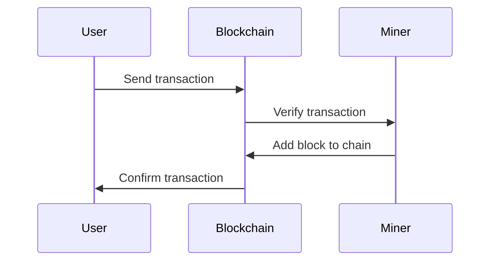
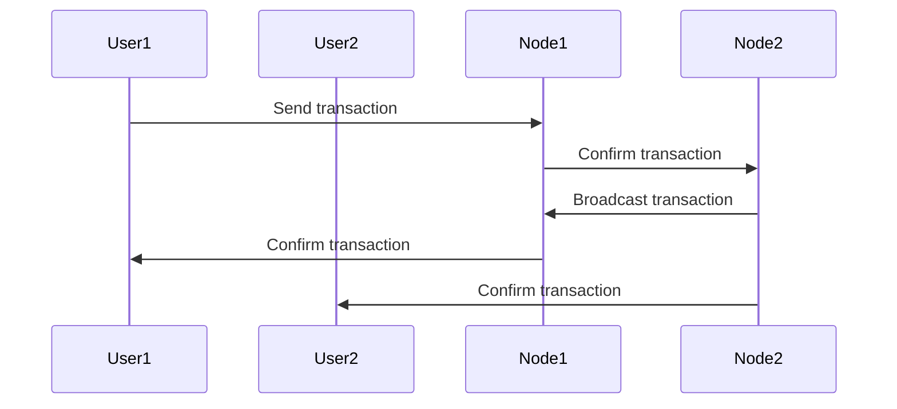

                 

### 数字货币：金融系统的革命性变革

#### 关键词：
- 数字货币
- 金融系统
- 区块链
- 加密算法
- 分布式账本
- 智能合约
- 监管

#### 摘要：
本文将深入探讨数字货币对金融系统的革命性变革。通过分析数字货币的概念、技术基础、类型与特性，以及数字货币在金融系统中的应用和挑战，我们旨在展示数字货币如何正在重塑金融生态，并对未来发展趋势进行展望。本文将结合具体案例，详细讲解数字货币的核心算法原理、数学模型、项目实战，以及最佳实践，为读者提供全面的数字货币知识框架。

### 第一部分：数字货币基础

#### 第1章：数字货币的概念与历史

##### 1.1 数字货币的定义

数字货币是一种基于数字形式的货币，它不依赖于传统金融系统，通过互联网进行传输和交易。与传统的物理货币不同，数字货币不存在实体形态，它以数字代码的形式存在。

##### 1.2 数字货币的起源与发展

数字货币的概念最早可以追溯到电子现金（E-Cash），1990年代初，David Chaum提出了盲签名和混洗技术的概念，为电子现金系统提供了安全保障。比特币（Bitcoin）作为第一种成功的加密货币，于2009年诞生。比特币的发行和管理完全基于区块链技术，它的出现标志着数字货币进入了一个新的时代。

#### 第2章：数字货币技术基础

##### 2.1 区块链技术

区块链技术是数字货币的核心组成部分，它通过分布式账本的方式记录交易信息，确保数据的透明性和不可篡改性。区块链的基本结构包括区块、链和节点。

**Mermaid 流程图：**


##### 2.2 加密算法

加密算法是保障数字货币安全的重要技术。常用的加密算法包括哈希算法（如SHA-256）和不对称加密算法（如RSA）。哈希算法用于确保数据的一致性和不可篡改性，而不对称加密算法则用于安全传输和验证。

**伪代码示例：**
```python
def sha256_hash(message):
    hash = hashlib.sha256(message.encode('utf-8')).hexdigest()
    return hash
```

##### 2.3 分布式账本技术

分布式账本技术（DLT）是数字货币的关键支撑。它通过多个节点共同维护账本，确保数据的可靠性和透明性。与传统的集中式数据库不同，分布式账本技术具有更强的抗攻击能力和更高的容错性。

**Mermaid 流程图：**


#### 第3章：数字货币的类型与特性

##### 3.1 法定数字货币

法定数字货币是由国家或央行发行的数字货币，它与法定货币等值。法定数字货币的发行和管理通常由央行负责，它具有法定的货币地位。

##### 3.2 加密货币

加密货币是基于加密算法发行的数字货币，如比特币和以太坊。加密货币的交易和发行通常不受任何政府或机构的控制。

##### 3.3 智能合约

智能合约是一种基于区块链的自动执行合约。它通过预先编写的代码执行交易，确保交易的安全和透明。

**伪代码示例：**
```solidity
contract SmartContract {
    function transfer(address sender, address recipient, uint amount) {
        if (balanceOf(sender) >= amount) {
            balanceOf(recipient) += amount;
            balanceOf(sender) -= amount;
        }
    }
}
```

#### 第4章：数字货币与金融系统

##### 4.1 数字货币对金融系统的影响

数字货币的出现对传统金融系统产生了深远影响。它降低了交易成本，提高了交易效率，同时也带来了新的风险和挑战。

##### 4.2 数字货币与传统金融的融合

数字货币与传统金融的融合已经成为趋势。许多金融机构开始探索如何将数字货币纳入其业务流程，以适应这一新兴的金融领域。

#### 第5章：数字货币监管与法律问题

##### 5.1 监管框架

随着数字货币的发展，各国政府和国际组织开始制定相关的监管政策。监管框架的建立旨在保护投资者权益，维护金融稳定。

##### 5.2 法律风险与合规

数字货币的交易和使用涉及到一系列法律问题，如洗钱、偷税等。合规操作是数字货币健康发展的重要保障。

### 第二部分：数字货币应用与挑战

#### 第6章：数字货币的应用场景

##### 6.1 支付与结算

数字货币在支付与结算领域的应用最为广泛。它提供了快速、低成本的跨境支付解决方案。

##### 6.2 投资

数字货币投资成为了一种新兴的投资方式。加密货币市场的高波动性为投资者提供了机会，但也带来了风险。

##### 6.3 供应链金融

数字货币在供应链金融中的应用有助于提高供应链的透明度和效率。

##### 6.4 银行服务

数字货币的兴起对银行服务产生了冲击，同时也为银行提供了新的业务机会。

### 第三部分：未来展望与趋势

#### 第7章：数字货币的未来发展与趋势

##### 7.1 技术演进

随着技术的不断进步，数字货币的性能和安全性将持续提升。

##### 7.2 法律与监管演变

随着数字货币的普及，法律和监管环境也将逐步完善。

##### 7.3 金融生态系统的变革

数字货币将推动金融生态系统的变革，为金融服务带来新的可能性。

### 附录

#### 附录 A：数字货币相关资源与工具

- 主流区块链框架对比
- 加密货币交易工具
- 数字货币研究平台

#### 附录 B：案例研究

- 比特币的崛起
- 莱特币的社区建设
- 瑞波币的跨境支付解决方案

### 作者

作者：AI天才研究院/AI Genius Institute & 禅与计算机程序设计艺术 /Zen And The Art of Computer Programming

### 最佳实践 Tips

- **保持关注**：数字货币领域发展迅速，持续关注最新动态，是保持专业素养的关键。
- **风险意识**：数字货币投资具有高风险，投资者应谨慎对待。
- **合规操作**：遵守相关法律法规，是数字货币合法运营的基础。
- **技术深耕**：深入了解区块链技术和加密算法，有助于在数字货币领域取得成功。

### 小结

数字货币正在改变金融系统的格局。通过本文的深入探讨，我们了解了数字货币的基础知识、技术架构、应用场景以及未来发展趋势。随着数字货币的不断演进，它将在金融生态系统中扮演越来越重要的角色。让我们继续关注这一领域的动态，共同迎接数字货币时代的到来。

### 注意事项

- 在投资数字货币前，请确保充分了解相关风险。
- 数字货币的监管环境不断变化，请密切关注相关政策。
- 技术实现细节需要根据具体应用场景进行调整。

### 拓展阅读

- **《比特币：一个颠覆性的数字货币》**
- **《区块链革命：金融科技的未来》**
- **《加密货币投资指南》**

### 结束语

感谢您的阅读，希望本文能为您在数字货币领域的探索提供有益的参考。作者：AI天才研究院/AI Genius Institute & 禅与计算机程序设计艺术 /Zen And The Art of Computer Programming。让我们共同期待数字货币的未来，期待在下一个金融革命中找到自己的位置。

