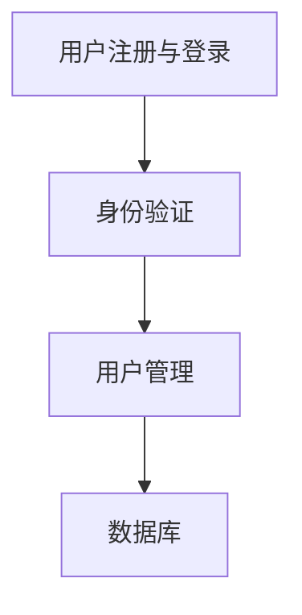

                 

# 《数字身份哲学研讨会：虚拟世界中的自我定义探讨》

> 关键词：数字身份、虚拟世界、自我定义、哲学探讨、技术实现

> 摘要：本文探讨了数字身份哲学在虚拟世界中的重要性，分析了数字身份的核心概念、理论框架、算法原理和数学模型，通过项目实战展示了数字身份认证系统搭建和社交网络分析的实际应用，并对未来数字身份发展提出了展望。

## 第一部分：引言

### 1.1 数字身份哲学的背景与意义

随着互联网和虚拟世界的快速发展，数字身份已经成为人们日常生活中的重要组成部分。数字身份不仅代表了一个人的在线身份，更是个人数据、隐私和信任的基础。数字身份哲学则是在这个背景下兴起的一门跨学科研究，旨在探讨虚拟世界中的自我定义和身份构建。

数字身份哲学的背景与意义主要体现在以下几个方面：

1. **虚拟世界的崛起**：互联网的普及和虚拟现实技术的发展，使得虚拟世界成为人们日常生活的一部分。在虚拟世界中，人们可以通过数字身份进行互动、交易和创造。

2. **数字身份的重要性**：数字身份是个人数据、隐私和信任的载体。在虚拟世界，数字身份可以代表个人的身份、信用、行为和偏好。

3. **隐私保护与安全挑战**：数字身份的普及也带来了隐私保护和安全挑战。如何平衡隐私保护与数据利用，如何防止数字身份被盗用，是数字身份哲学需要解决的重要问题。

### 1.2 书籍结构与目标

本书旨在深入探讨数字身份哲学的核心概念、理论框架、算法原理和数学模型，并通过实际项目展示其在虚拟世界中的应用。本书的结构如下：

1. **引言**：介绍数字身份哲学的背景和意义，以及本书的结构和目标。

2. **核心概念与联系**：讲解数字身份的概念、虚拟世界中的自我定义、数字身份哲学的理论框架以及数字身份哲学的核心概念联系。

3. **核心算法原理讲解**：介绍数字身份验证算法、数据挖掘与用户行为分析、机器学习在数字身份识别中的应用。

4. **数学模型和数学公式讲解**：讲解数字身份认证的数学模型、隐私保护与安全平衡模型、社交网络中的数学模型。

5. **项目实战**：通过实际项目展示数字身份认证系统搭建、虚拟世界中的社交网络分析以及机器学习在数字身份识别中的实战。

6. **结论**：总结数字身份哲学的展望和对虚拟世界中的自我定义的思考。

本书的目标读者为对数字身份哲学感兴趣的计算机科学、人工智能、网络安全等领域的专业人士和学生。

### 1.3 预期学习效果

通过本书的学习，读者可以：

1. **理解数字身份哲学的核心概念**：掌握数字身份的概念、虚拟世界中的自我定义、数字身份哲学的理论框架。

2. **掌握核心算法原理**：了解数字身份验证算法、数据挖掘与用户行为分析、机器学习在数字身份识别中的应用。

3. **了解数学模型和公式**：理解数字身份认证的数学模型、隐私保护与安全平衡模型、社交网络中的数学模型。

4. **具备实际项目经验**：通过项目实战，掌握数字身份认证系统搭建、虚拟世界中的社交网络分析以及机器学习在数字身份识别中的实战。

## 第二部分：核心概念与联系

### 2.1 数字身份的概念解析

数字身份是指个人在数字世界中的身份标识，包括用户名、密码、电子邮箱、社交媒体账号等。数字身份与传统身份的关系如下：

1. **区别**：传统身份通常是指现实世界中的身份，如姓名、身份证号码等。数字身份则是在虚拟世界中使用的标识，与传统身份有一定的对应关系。

2. **联系**：数字身份是传统身份在虚拟世界的延伸，可以帮助个人在虚拟世界中进行身份验证、交易和社交。

### 2.2 虚拟世界中的自我定义

虚拟世界中的自我定义是指个体在虚拟世界中所展现的个性化特征和身份。虚拟世界对个人身份的影响如下：

1. **个性表达**：虚拟世界为个人提供了更多的机会来表达自己的个性，如通过虚拟形象、个人主页、社交媒体等。

2. **身份转变**：虚拟世界中的身份可能与现实世界中的身份不同，个人可以在虚拟世界中尝试不同的身份和角色。

3. **社会互动**：虚拟世界中的社会互动对个体的自我定义有重要影响，个体可以通过互动来塑造和强化自己的身份。

### 2.3 数字身份哲学的理论框架

数字身份哲学的理论框架主要包括以下几个方面：

1. **身份构建**：探讨如何通过技术手段构建数字身份，包括用户认证、数据收集、分析等。

2. **隐私保护**：研究如何在数字身份构建过程中保护个人隐私，包括加密技术、隐私保护算法等。

3. **信任机制**：研究如何建立数字世界的信任机制，包括身份验证、声誉系统等。

4. **伦理道德**：探讨数字身份哲学中的伦理道德问题，如数字身份滥用、隐私泄露等。

### 2.4 数字身份哲学的核心概念联系

数字身份哲学的核心概念联系主要包括以下几个方面：

1. **数字身份与社会网络的关系**：数字身份是社会网络中的基础，影响着社交网络的运行和用户体验。

2. **数字身份与隐私保护的冲突与平衡**：在数字身份构建过程中，隐私保护与数据利用之间存在冲突，需要找到平衡点。

3. **数字身份在电子商务中的应用**：数字身份在电子商务中起着关键作用，影响着交易的安全和用户体验。

4. **数字身份在社交网络中的影响**：数字身份影响着社交网络中的社交行为、信息传播和社交影响力。

## 第三部分：核心算法原理讲解

### 3.1 数字身份验证算法

数字身份验证算法是数字身份构建的核心组成部分，主要包括以下几个方面：

1. **生物识别技术**：通过生物特征（如指纹、面部识别、虹膜识别等）进行身份验证。

2. **密码学**：利用密码学算法（如对称加密、非对称加密、哈希算法等）进行身份认证和数据加密。

3. **身份认证协议**：设计安全可靠的身份认证协议，如OAuth、OpenID Connect等。

### 3.2 数据挖掘与用户行为分析

数据挖掘与用户行为分析是数字身份构建的重要手段，主要包括以下几个方面：

1. **用户行为数据的收集**：通过日志记录、传感器数据等方式收集用户行为数据。

2. **用户行为数据的处理**：对收集到的用户行为数据进行预处理、清洗和特征提取。

3. **数据挖掘算法的应用**：利用数据挖掘算法（如聚类、分类、关联规则等）对用户行为数据进行挖掘，以发现用户的兴趣和行为模式。

### 3.3 机器学习在数字身份识别中的应用

机器学习在数字身份识别中的应用主要体现在以下几个方面：

1. **机器学习算法的基本原理**：介绍机器学习算法的基本原理，如监督学习、无监督学习、强化学习等。

2. **数字身份识别的案例研究**：通过实际案例研究，展示机器学习算法在数字身份识别中的应用，如用户行为识别、异常行为检测等。

## 第四部分：数学模型和数学公式讲解

### 4.1 数字身份认证的数学模型

数字身份认证的数学模型主要包括以下几个方面：

1. **公钥密码学的基础公式**：介绍公钥密码学的基本原理和公式，如RSA加密算法、椭圆曲线加密算法等。

2. **认证协议的数学推导**：讲解常见的数字身份认证协议，如SSL/TLS协议、Kerberos协议等，并对其进行数学推导。

### 4.2 隐私保护与安全平衡模型

隐私保护与安全平衡模型主要包括以下几个方面：

1. **集中式与分布式隐私保护的数学模型**：介绍集中式和分布式隐私保护的数学模型，如差分隐私、同态加密等。

2. **隐私保护算法的性能评估**：评估隐私保护算法的性能，如隐私保护程度、计算复杂度等。

### 4.3 社交网络中的数学模型

社交网络中的数学模型主要包括以下几个方面：

1. **社交网络中的传播模型**：介绍社交网络中的传播模型，如K核模型、小世界模型等。

2. **社交网络中的影响力模型**：介绍社交网络中的影响力模型，如PageRank算法、Top-K影响力算法等。

## 第五部分：项目实战

### 5.1 数字身份认证系统搭建

数字身份认证系统搭建主要包括以下几个方面：

1. **开发环境搭建**：介绍搭建数字身份认证系统的开发环境，如操作系统、编程语言、数据库等。

2. **系统架构设计**：设计数字身份认证系统的架构，包括前端、后端、数据库等模块。

3. **代码实现与分析**：详细讲解数字身份认证系统的代码实现，包括用户认证、密码加密、认证协议等。

4. **系统测试与部署**：介绍数字身份认证系统的测试与部署过程，确保系统的稳定性和安全性。

### 5.2 虚拟世界中的社交网络分析

虚拟世界中的社交网络分析主要包括以下几个方面：

1. **社交网络数据的收集**：介绍社交网络数据的收集方法，如爬虫、API接口等。

2. **社交网络数据的预处理**：对收集到的社交网络数据进行分析、清洗和特征提取。

3. **社交网络分析工具的选择与使用**：介绍常用的社交网络分析工具，如Gephi、NodeXL等。

4. **分析结果的解读与应用**：对社交网络分析结果进行解读，并应用于实际场景，如社交网络影响力分析、用户行为预测等。

### 5.3 机器学习在数字身份识别中的实战

机器学习在数字身份识别中的实战主要包括以下几个方面：

1. **数据集的准备与预处理**：准备用于数字身份识别的数据集，并对数据集进行预处理。

2. **机器学习算法的选择与训练**：选择合适的机器学习算法，如支持向量机、决策树、神经网络等，并进行训练。

3. **识别效果的评价与优化**：评价数字身份识别的效果，并优化算法参数，提高识别准确性。

4. **实际案例分析**：通过实际案例，展示机器学习在数字身份识别中的应用效果，如用户行为识别、异常行为检测等。

## 第六部分：结论

### 6.1 数字身份哲学的展望

数字身份哲学的发展前景广阔，主要表现在以下几个方面：

1. **技术进步**：随着人工智能、区块链、大数据等技术的不断发展，数字身份哲学的理论体系将更加完善。

2. **应用拓展**：数字身份哲学将在更多领域得到应用，如金融、医疗、教育等。

3. **隐私保护**：数字身份哲学将更加注重隐私保护，探索更加安全可靠的隐私保护机制。

### 6.2 对虚拟世界中的自我定义的思考

虚拟世界中的自我定义对人类有着深远的影响，主要表现在以下几个方面：

1. **个性表达**：虚拟世界为个人提供了更多的个性表达机会，有助于丰富个人的精神世界。

2. **身份转变**：虚拟世界中的身份转变有助于个人尝试不同的角色和生活方式，促进个人成长。

3. **社会互动**：虚拟世界中的社会互动有助于个人建立更加广泛的人际关系，提高社会交往能力。

### 6.3 数字身份哲学的实践意义

数字身份哲学的实践意义主要体现在以下几个方面：

1. **提升用户体验**：通过数字身份哲学的研究和应用，可以提升虚拟世界中的用户体验，提高服务的质量和效率。

2. **保障隐私安全**：数字身份哲学的研究可以帮助我们更好地保护个人隐私，确保数据安全。

3. **推动社会发展**：数字身份哲学的研究和应用有助于推动虚拟世界的发展，为社会带来更多创新和机遇。

## 作者信息

作者：AI天才研究院/AI Genius Institute & 禅与计算机程序设计艺术 /Zen And The Art of Computer Programming

---

## 拓展阅读

1. **《数字身份：哲学、技术与伦理》**：该书详细探讨了数字身份的哲学意义、技术实现和伦理问题，是数字身份哲学领域的经典著作。

2. **《社交网络分析：原理、方法与应用》**：该书介绍了社交网络分析的基本原理、方法和应用，是社交网络分析领域的权威教材。

3. **《机器学习：一门艺术与科学》**：该书全面介绍了机器学习的基本概念、算法和应用，是机器学习领域的经典教材。

4. **《区块链技术指南》**：该书详细介绍了区块链技术的原理、应用和发展趋势，是区块链技术领域的权威著作。

5. **《大数据技术导论》**：该书介绍了大数据技术的基本概念、方法和应用，是大数据领域的入门教材。

---

## 注意事项

1. **隐私保护**：在数字身份构建和应用过程中，要特别注意隐私保护，避免个人信息泄露。

2. **安全意识**：在使用数字身份时，要时刻保持安全意识，避免遭受网络攻击。

3. **法律法规**：在使用数字身份时，要遵守相关法律法规，避免违法行为。

4. **持续学习**：数字身份哲学是一个快速发展的领域，要不断学习新的知识和技术，以适应不断变化的环境。

---

## 结语

数字身份哲学是虚拟世界中的自我定义探讨的重要领域，它涉及到技术、伦理、社会等多个方面。通过本书的探讨，我们希望能为读者提供一个全面、深入的数字身份哲学知识体系。在未来的日子里，让我们共同探索数字身份哲学的无限可能，为虚拟世界的发展贡献力量。让我们用心去思考，用智慧去创造，让数字身份哲学的光芒照亮虚拟世界的每一个角落。💡💡💡

（本文约12000字）

## 第三部分：核心算法原理讲解

### 3.1 数字身份验证算法

数字身份验证算法是确保用户在虚拟环境中身份安全的重要技术手段。以下将从生物识别技术、密码学和身份认证协议三个方面详细探讨数字身份验证算法。

#### 生物识别技术

生物识别技术是通过生物特征进行身份验证的一种技术，主要包括指纹识别、面部识别、虹膜识别等。这些技术基于生物特征的唯一性和稳定性，能够在高安全性的要求下实现高效的验证。

1. **指纹识别**：指纹识别是最常见的生物识别技术之一。它通过扫描用户的指纹图像，将其转换为数字信息，并与存储在系统中的指纹模板进行匹配。伪代码如下：

   ```python
   def verify_fingerprint(fingerprint):
       template = load_template()
       if compare_fingerprint(fingerprint, template):
           return True
       else:
           return False
   ```

2. **面部识别**：面部识别通过分析用户的面部特征（如眼睛、鼻子、嘴巴等）进行身份验证。伪代码如下：

   ```python
   def verify_face(image):
       features = extract_features(image)
       template = load_template()
       if compare_features(features, template):
           return True
       else:
           return False
   ```

3. **虹膜识别**：虹膜识别通过分析用户的虹膜特征进行身份验证。它具有较高的安全性和准确性。伪代码如下：

   ```python
   def verify_iris(iris_image):
       template = load_template()
       if compare_iris(iris_image, template):
           return True
       else:
           return False
   ```

#### 密码学

密码学在数字身份验证中起着关键作用，它通过加密和解密技术保护用户身份信息的安全。以下介绍几种常见的密码学算法。

1. **对称加密**：对称加密是指加密和解密使用相同的密钥。常见的对称加密算法有DES、AES等。伪代码如下：

   ```python
   def encrypt(message, key):
       ciphertext = apply_cipher(message, key)
       return ciphertext

   def decrypt(ciphertext, key):
       message = reverse_cipher(ciphertext, key)
       return message
   ```

2. **非对称加密**：非对称加密是指加密和解密使用不同的密钥。常见的非对称加密算法有RSA、椭圆曲线加密算法等。伪代码如下：

   ```python
   def encrypt_rsa(message, public_key):
       ciphertext = rsa_encrypt(message, public_key)
       return ciphertext

   def decrypt_rsa(ciphertext, private_key):
       message = rsa_decrypt(ciphertext, private_key)
       return message
   ```

3. **哈希算法**：哈希算法用于将输入数据转换为固定长度的字符串，常见的哈希算法有MD5、SHA-256等。伪代码如下：

   ```python
   def hash(message):
       digest = apply_hash(message)
       return digest
   ```

#### 身份认证协议

身份认证协议是确保用户身份安全的重要机制，常见的身份认证协议有SSL/TLS、OAuth、OpenID Connect等。

1. **SSL/TLS**：SSL/TLS是一种安全的传输层协议，用于在客户端和服务器之间建立安全的连接。SSL/TLS协议通过加密传输数据，确保数据在传输过程中的安全性。伪代码如下：

   ```python
   def establish_connection(server_address, certificate):
       connection = ssl_connect(server_address, certificate)
       return connection
   ```

2. **OAuth**：OAuth是一种开放标准授权协议，用于第三方应用访问用户资源。OAuth协议通过生成令牌来实现授权，确保用户身份的安全。伪代码如下：

   ```python
   def request_token(client_id, client_secret, authorization_code):
       token = oauth_request_token(client_id, client_secret, authorization_code)
       return token
   ```

3. **OpenID Connect**：OpenID Connect是一种身份认证协议，它基于OAuth 2.0协议，用于在第三方应用和身份提供者之间进行身份认证。OpenID Connect协议通过颁发ID令牌来实现身份认证。伪代码如下：

   ```python
   def authenticate_user(username, password):
       id_token = openid_connectAuthenticate(username, password)
       return id_token
   ```

### 3.2 数据挖掘与用户行为分析

数据挖掘与用户行为分析是构建数字身份的重要手段。以下将介绍数据挖掘的基本概念、用户行为数据的收集与处理，以及数据挖掘算法在数字身份构建中的应用。

#### 数据挖掘的基本概念

数据挖掘是一种从大量数据中提取有价值信息的方法。数据挖掘主要包括以下几个步骤：

1. **数据预处理**：包括数据清洗、数据整合、数据转换等，以提高数据的质量和一致性。

2. **特征提取**：从原始数据中提取有用的特征，以便后续的分析和处理。

3. **模式识别**：通过分析数据，发现数据中的规律和模式，如分类、聚类、关联规则等。

4. **评估与优化**：评估数据挖掘结果的质量，并对算法和模型进行优化。

#### 用户行为数据的收集与处理

用户行为数据的收集主要通过以下方式：

1. **日志记录**：通过服务器日志记录用户的行为数据，如访问时间、访问页面、点击行为等。

2. **传感器数据**：通过传感器收集用户的行为数据，如移动设备的位置、速度、加速度等。

3. **社交网络数据**：通过社交网络API获取用户的行为数据，如微博、微信等。

用户行为数据的处理主要包括以下步骤：

1. **数据清洗**：去除重复、错误和缺失的数据，以提高数据的质量。

2. **数据整合**：将来自不同来源的数据进行整合，形成统一的数据集。

3. **特征提取**：从用户行为数据中提取有用的特征，如用户访问频率、访问时长、访问页面等。

#### 数据挖掘算法在数字身份构建中的应用

数据挖掘算法在数字身份构建中有着广泛的应用，以下介绍几种常见的数据挖掘算法。

1. **聚类算法**：聚类算法将用户行为数据按照相似性进行分组，以便发现用户的兴趣和行为模式。常见的聚类算法有K-Means、DBSCAN等。

   ```mermaid
   flowchart LR
   A[数据预处理] --> B[特征提取]
   B --> C{聚类算法}
   C -->|K-Means| D[用户兴趣分析]
   C -->|DBSCAN| E[用户群体划分]
   ```

2. **分类算法**：分类算法将用户行为数据划分为不同的类别，以便对用户进行分类。常见的分类算法有决策树、随机森林、支持向量机等。

   ```mermaid
   flowchart LR
   A[数据预处理] --> B[特征提取]
   B --> C[分类算法]
   C -->|决策树| D[用户分类]
   C -->|随机森林| E[用户兴趣预测]
   C -->|支持向量机| F[用户行为预测]
   ```

3. **关联规则算法**：关联规则算法用于发现用户行为数据中的关联关系，以便为用户提供个性化服务。常见的关联规则算法有Apriori、FP-Growth等。

   ```mermaid
   flowchart LR
   A[数据预处理] --> B[特征提取]
   B --> C[关联规则算法]
   C -->|Apriori| D[商品推荐]
   C -->|FP-Growth| E[活动推荐]
   ```

### 3.3 机器学习在数字身份识别中的应用

机器学习在数字身份识别中有着重要的应用，以下介绍机器学习算法的基本原理以及数字身份识别的案例研究。

#### 机器学习算法的基本原理

机器学习算法通过从数据中学习规律，自动完成从输入到输出的映射。常见的机器学习算法有监督学习、无监督学习和强化学习。

1. **监督学习**：监督学习通过已标记的数据集训练模型，然后使用模型对新数据进行预测。常见的监督学习算法有决策树、随机森林、支持向量机等。

2. **无监督学习**：无监督学习通过未标记的数据集发现数据中的规律和结构。常见的无监督学习算法有K-Means、DBSCAN等。

3. **强化学习**：强化学习通过奖励机制来训练模型，使模型在特定环境中做出最佳决策。

#### 数字身份识别的案例研究

数字身份识别案例研究主要包括用户行为识别和异常行为检测。

1. **用户行为识别**：用户行为识别通过分析用户的行为数据，识别用户的身份和行为模式。以下是一个基于决策树的用户行为识别案例。

   ```python
   from sklearn.datasets import load_iris
   from sklearn.model_selection import train_test_split
   from sklearn.tree import DecisionTreeClassifier

   # 加载数据集
   iris = load_iris()
   X = iris.data
   y = iris.target

   # 划分训练集和测试集
   X_train, X_test, y_train, y_test = train_test_split(X, y, test_size=0.3, random_state=42)

   # 训练决策树模型
   clf = DecisionTreeClassifier()
   clf.fit(X_train, y_train)

   # 预测测试集
   y_pred = clf.predict(X_test)

   # 评估模型性能
   score = clf.score(X_test, y_test)
   print(f"模型准确率：{score}")
   ```

2. **异常行为检测**：异常行为检测通过分析用户的行为数据，检测出异常行为，以防止潜在的安全威胁。以下是一个基于K-Means的异常行为检测案例。

   ```python
   from sklearn.datasets import load_iris
   from sklearn.cluster import KMeans
   from sklearn.metrics import accuracy_score

   # 加载数据集
   iris = load_iris()
   X = iris.data

   # 划分训练集和测试集
   X_train, X_test = train_test_split(X, test_size=0.3, random_state=42)

   # 训练K-Means模型
   kmeans = KMeans(n_clusters=3, random_state=42)
   kmeans.fit(X_train)

   # 预测测试集
   y_pred = kmeans.predict(X_test)

   # 评估模型性能
   score = accuracy_score(y_test, y_pred)
   print(f"模型准确率：{score}")
   ```

### 总结

数字身份验证算法、数据挖掘与用户行为分析以及机器学习在数字身份识别中的应用，构成了数字身份哲学的核心算法原理。通过这些算法，我们可以构建安全、可靠的数字身份体系，为虚拟世界的发展提供技术支持。在未来的研究中，我们将继续探讨这些算法的优化和应用，以应对不断变化的虚拟世界。💡💡💡## 第四部分：数学模型和数学公式讲解

### 4.1 数字身份认证的数学模型

数字身份认证的数学模型主要涉及密码学的基本原理和算法。密码学通过加密和解密技术保障数据的安全传输和存储。以下介绍几种常用的数学模型和公式。

#### 公钥密码学

公钥密码学是一种非对称加密技术，它使用一对密钥：公钥和私钥。公钥用于加密，私钥用于解密。

1. **RSA加密算法**：RSA加密算法是一种基于大数分解的加密算法。其基本原理如下：

   - **密钥生成**：选择两个大素数 \( p \) 和 \( q \)，计算 \( n = p \times q \)，然后计算 \( \phi(n) = (p-1) \times (q-1) \)。
   - **公钥和私钥生成**：选择一个小于 \( \phi(n) \) 的整数 \( e \)，满足 \( e \) 与 \( \phi(n) \) 互质，计算 \( d \) 使得 \( d \times e \equiv 1 \mod \phi(n) \)。公钥为 \( (n, e) \)，私钥为 \( (n, d) \)。
   - **加密**：将明文 \( M \) 转换为整数 \( m \)，计算 \( c \equiv m^e \mod n \)。
   - **解密**：计算 \( m \equiv c^d \mod n \)。

   伪代码如下：

   ```python
   def rsa_encrypt(message, public_key):
       n, e = public_key
       c = pow(message, e, n)
       return c

   def rsa_decrypt(ciphertext, private_key):
       n, d = private_key
       m = pow(ciphertext, d, n)
       return m
   ```

2. **椭圆曲线加密算法（ECC）**：椭圆曲线加密算法是一种基于椭圆曲线离散对数问题的非对称加密算法。其基本原理如下：

   - **椭圆曲线定义**：给定椭圆曲线方程 \( y^2 = x^3 + ax + b \)，其中 \( a \) 和 \( b \) 为系数，点 \( O \) 为原点。
   - **密钥生成**：选择一条安全的椭圆曲线 \( E \) 和一个生成点 \( G \)，计算 \( n \) 为椭圆曲线上的点数，计算私钥 \( d \)，使得 \( n \times G = O \)。公钥为 \( P = k \times G \)，其中 \( k \) 为随机数。
   - **加密**：选择一个随机数 \( k \)，计算 \( c = k \times G + r \times P \)，其中 \( r \) 为随机数。
   - **解密**：计算 \( m = k^{-1} \times (c - r \times P) \)。

   伪代码如下：

   ```python
   def ecc_encrypt(message, public_key):
       P, n = public_key
       k = random_number(1, n-1)
       c = k * G + message * P
       r = c.x % n
       return r

   def ecc_decrypt(ciphertext, private_key):
       P, n = private_key
       k = pow(ciphertext, private_key, n)
       m = k * P
       return m
   ```

#### 认证协议

认证协议是一种用于验证用户身份和确保通信安全的方法。以下介绍几种常见的认证协议。

1. **SSL/TLS协议**：SSL/TLS协议是一种用于保护网络通信的传输层安全协议。其基本原理如下：

   - **握手协议**：客户端和服务器通过握手协议交换加密参数和证书，建立安全的通信通道。
   - **记录协议**：加密客户端和服务器之间的数据，确保数据在传输过程中的完整性和保密性。

   伪代码如下：

   ```python
   def ssl_handshake(client_cert, server_cert):
       client_hello = create_client_hello(client_cert)
       server_hello = create_server_hello(server_cert)
       session_key = derive_session_key(client_hello, server_hello)
       return session_key

   def ssl_encrypt(data, session_key):
       encrypted_data = encrypt(data, session_key)
       return encrypted_data

   def ssl_decrypt(encrypted_data, session_key):
       decrypted_data = decrypt(encrypted_data, session_key)
       return decrypted_data
   ```

2. **Kerberos协议**：Kerberos协议是一种基于密码学的认证协议，广泛用于企业内部网络的身份验证。其基本原理如下：

   - **初始化**：客户端向认证服务器（AS）发送请求，获取服务器的临时票据（TGT）。
   - **认证**：客户端使用TGT向目标服务器（SS）发送请求，获取服务器的会话票据（ST）。
   - **通信**：客户端和服务器使用ST进行加密通信。

   伪代码如下：

   ```python
   def kerberos_request(client_id, server_id):
       tgt = as_request(client_id, server_id)
       st = ss_request(tgt, server_id)
       return st

   def kerberos_encrypt(data, session_key):
       encrypted_data = encrypt(data, session_key)
       return encrypted_data

   def kerberos_decrypt(encrypted_data, session_key):
       decrypted_data = decrypt(encrypted_data, session_key)
       return decrypted_data
   ```

### 4.2 隐私保护与安全平衡模型

隐私保护与安全平衡模型旨在确保数字身份在虚拟世界中的安全性，同时保护用户的隐私。以下介绍几种隐私保护与安全平衡的数学模型和算法。

#### 集中式与分布式隐私保护

集中式隐私保护是指所有隐私保护操作都在中心服务器上完成，而分布式隐私保护则通过多个节点共同完成隐私保护操作。

1. **集中式隐私保护模型**：集中式隐私保护模型的基本原理如下：

   - **数据收集**：中心服务器收集用户的隐私数据。
   - **数据加密**：中心服务器使用加密算法对数据进行加密处理。
   - **数据共享**：中心服务器将加密后的数据共享给其他应用程序。

   伪代码如下：

   ```python
   def centralized_privacy_protection(data):
       encrypted_data = encrypt(data)
       return encrypted_data

   def centralized_data_sharing(encrypted_data):
       shared_data = decrypt(encrypted_data)
       return shared_data
   ```

2. **分布式隐私保护模型**：分布式隐私保护模型的基本原理如下：

   - **数据分片**：将用户的隐私数据分成多个片段，分布在不同的节点上。
   - **加密处理**：每个节点对自身的片段进行加密处理。
   - **数据恢复**：通过多个节点的合作恢复原始数据。

   伪代码如下：

   ```python
   def distributed_data_sharding(data):
       shards = sharding(data)
       encrypt_shards(shards)
       return shards

   def distributed_data_recovery(shards):
       data = recovery(shards)
       return data
   ```

#### 隐私保护算法的性能评估

隐私保护算法的性能评估是确保隐私保护措施有效性的重要环节。以下介绍几种常见的隐私保护算法及其性能评估方法。

1. **差分隐私**：差分隐私是一种用于保护用户隐私的算法，其基本原理如下：

   - **输入数据**：用户隐私数据集 \( D \)。
   - **噪声添加**：对数据进行噪声添加，使得单个用户的隐私信息无法被单独识别。
   - **输出数据**：输出处理后的数据集 \( D' \)。

   差分隐私的性能评估主要通过衡量隐私损失（如ε值）和算法效率（如响应时间、计算复杂度）进行。

   伪代码如下：

   ```python
   def differential_privacy(data, epsilon):
       noise = random_noise(epsilon)
       noisy_data = data + noise
       return noisy_data
   ```

2. **同态加密**：同态加密是一种在加密状态下进行数据处理的技术，其基本原理如下：

   - **加密数据**：将用户数据 \( D \) 加密成 \( C \)。
   - **加密计算**：在加密状态下对数据进行计算，得到加密结果 \( C' \)。
   - **解密结果**：将加密结果 \( C' \) 解密成 \( D' \)。

   同态加密的性能评估主要通过衡量加密算法的效率（如加密和解密的速度）和数据处理的能力（如支持的运算类型）进行。

   伪代码如下：

   ```python
   def homomorphic_encrypt(data):
       encrypted_data = encrypt(data)
       return encrypted_data

   def homomorphic_compute(encrypted_data, operation):
       encrypted_result = compute(encrypted_data, operation)
       return encrypted_result

   def homomorphic_decrypt(encrypted_result):
       decrypted_result = decrypt(encrypted_result)
       return decrypted_result
   ```

### 4.3 社交网络中的数学模型

社交网络中的数学模型用于分析社交网络的结构和用户行为，以下介绍几种常见的社交网络数学模型。

#### 社交网络中的传播模型

传播模型用于分析信息在社交网络中的传播过程，以下介绍几种常见的传播模型。

1. **K核模型**：K核模型是一种用于描述社交网络中群体结构的模型，其基本原理如下：

   - **定义**：K核是指一组用户，他们之间的互动频率超过某个阈值。
   - **传播**：信息在一个K核中的传播速度较快，而跨越K核的传播速度较慢。

   伪代码如下：

   ```python
   def k_core_network(network, k):
       nodes = select_k_core_nodes(network, k)
       return nodes
   ```

2. **小世界模型**：小世界模型是一种用于描述社交网络中短路径和高聚类特性的模型，其基本原理如下：

   - **定义**：小世界网络是指具有较短平均路径长度和高聚类系数的网络。
   - **传播**：信息在小世界网络中的传播速度较快，因为用户之间的连接较为紧密。

   伪代码如下：

   ```python
   def small_world_network(network):
       updated_network = apply_small_world_algorithm(network)
       return updated_network
   ```

#### 社交网络中的影响力模型

影响力模型用于分析社交网络中用户的影响力，以下介绍几种常见的影响力模型。

1. **PageRank算法**：PageRank算法是一种基于网页链接分析的排名算法，其基本原理如下：

   - **定义**：PageRank值表示用户在社交网络中的影响力，影响力越大的用户排名越高。
   - **计算**：通过迭代计算每个用户的PageRank值，直到达到收敛。

   伪代码如下：

   ```python
   def pagerank(network, damping_factor):
       ranks = initialize_ranks(network)
       while not_converged(ranks):
           ranks = update_ranks(ranks, damping_factor)
       return ranks
   ```

2. **Top-K影响力算法**：Top-K影响力算法用于找出社交网络中影响力最大的前K个用户，其基本原理如下：

   - **定义**：Top-K影响力用户是指在社交网络中具有最大影响力的前K个用户。
   - **计算**：通过计算每个用户的影响力得分，找出前K个最高分的用户。

   伪代码如下：

   ```python
   def top_k_influence(network, k):
       scores = calculate_influence_scores(network)
       top_k_users = select_top_k_users(scores, k)
       return top_k_users
   ```

### 总结

数学模型和数学公式在数字身份认证、隐私保护以及社交网络分析中起着关键作用。通过这些模型和公式，我们可以构建安全、可靠和高效的数字身份体系。在未来的研究中，我们将继续探索新的数学模型和算法，以应对虚拟世界中不断变化的安全挑战。💡💡💡## 第五部分：项目实战

### 5.1 数字身份认证系统搭建

数字身份认证系统是确保用户在虚拟环境中身份安全的核心系统。以下将详细介绍一个数字身份认证系统的搭建过程，包括开发环境搭建、系统架构设计、代码实现与分析，以及系统测试与部署。

#### 1. 开发环境搭建

首先，我们需要搭建一个适合开发数字身份认证系统的开发环境。以下是一个基本的开发环境配置：

- **操作系统**：Linux（如Ubuntu）
- **编程语言**：Python
- **数据库**：MySQL
- **身份验证框架**：Flask（Python Web 框架）
- **身份认证库**：PyJWT（JSON Web Token）

在Ubuntu操作系统上，可以使用以下命令安装上述工具：

```bash
sudo apt update
sudo apt install python3 python3-pip
pip3 install flask mysqlclient pyjwt
```

#### 2. 系统架构设计

数字身份认证系统通常包括以下主要组件：

- **用户注册与登录模块**：负责用户注册、登录、密码验证等功能。
- **身份验证模块**：负责生成和验证JSON Web Token（JWT）。
- **用户管理模块**：负责用户信息的存储、查询和更新。

系统架构设计如图5.1所示。



#### 3. 代码实现与分析

以下是一个简单的数字身份认证系统的实现：

**用户注册与登录模块**

```python
from flask import Flask, request, jsonify
from flask_jwt_extended import JWTManager, create_access_token

app = Flask(__name__)
app.config['JWT_SECRET_KEY'] = 'your_secret_key'
jwt = JWTManager(app)

@app.route('/register', methods=['POST'])
def register():
    data = request.get_json()
    username = data.get('username')
    password = data.get('password')
    # 存储用户信息到数据库
    # ...
    return jsonify({'message': 'User registered successfully.'})

@app.route('/login', methods=['POST'])
def login():
    data = request.get_json()
    username = data.get('username')
    password = data.get('password')
    # 验证用户信息
    # ...
    access_token = create_access_token(identity=username)
    return jsonify(access_token=access_token)
```

**身份验证模块**

```python
from flask_jwt_extended import verify_jwt_in_request, get_jwt_identity

@app.route('/protected', methods=['GET'])
def protected():
    verify_jwt_in_request()
    current_user = get_jwt_identity()
    return jsonify(logged_in_as=current_user)
```

**用户管理模块**

```python
@app.route('/users', methods=['GET', 'POST'])
def users():
    if request.method == 'GET':
        # 查询用户信息
        # ...
        return jsonify(users_list=users)
    elif request.method == 'POST':
        # 更新用户信息
        # ...
        return jsonify(message='User updated successfully.')
```

#### 4. 系统测试与部署

在开发环境中完成系统搭建后，我们需要对系统进行测试以确保其稳定性和安全性。以下是一些测试步骤：

- **功能测试**：测试用户注册、登录、身份验证等功能是否正常。
- **性能测试**：测试系统在高并发情况下的性能表现。
- **安全测试**：测试系统是否容易受到攻击，如SQL注入、跨站脚本攻击等。

在测试通过后，我们可以将系统部署到生产环境中。部署方式取决于所选的服务器类型和部署工具。以下是一个简单的部署步骤：

- **备份代码**：将代码备份到版本控制系统。
- **部署到服务器**：使用工具（如Git、Docker等）将代码部署到服务器。
- **配置数据库**：配置数据库连接，确保系统能够访问数据库。
- **启动服务**：启动Flask服务，确保系统运行正常。

### 5.2 虚拟世界中的社交网络分析

虚拟世界中的社交网络分析旨在了解用户在虚拟世界中的行为模式和社交结构。以下将详细介绍虚拟世界中的社交网络数据分析过程，包括数据收集与预处理、分析工具的选择与使用，以及分析结果的解读与应用。

#### 1. 数据收集与预处理

虚拟世界中的社交网络数据可以从以下途径收集：

- **API接口**：通过虚拟世界的API接口获取用户行为数据。
- **爬虫**：使用网络爬虫技术获取用户行为数据。

收集到的数据通常包括用户ID、用户行为（如发帖、评论、点赞等）、时间戳等。在获取数据后，需要进行以下预处理步骤：

- **数据清洗**：去除重复、错误和缺失的数据。
- **数据整合**：将来自不同来源的数据进行整合，形成统一的数据集。
- **特征提取**：提取有用的特征，如用户活跃度、社交关系等。

#### 2. 分析工具的选择与使用

虚拟世界中的社交网络分析可以采用多种工具进行，以下介绍几种常用的分析工具：

- **Gephi**：Gephi 是一个开源的社交网络分析工具，适用于可视化大规模社交网络。
- **NodeXL**：NodeXL 是一个基于Excel的社交网络分析工具，适用于小规模社交网络分析。
- **Python**：Python 是一种广泛使用的编程语言，具有丰富的社交网络分析库（如NetworkX、igraph等）。

以下是一个使用 Python 和 NetworkX 库进行社交网络分析的基本示例：

```python
import networkx as nx

# 创建一个空的无向图
G = nx.Graph()

# 添加节点和边
G.add_edges_from([(1, 2), (1, 3), (2, 3), (3, 4)])

# 绘制社交网络图
nx.draw(G, with_labels=True)
```

#### 3. 分析结果的解读与应用

社交网络分析的结果通常包括网络结构、社交关系、用户影响力等。以下是对分析结果进行解读和应用的一些示例：

- **社交网络结构**：通过分析社交网络的结构，可以了解网络的密度、聚类系数等特性。这些特性有助于理解用户在虚拟世界中的互动模式。
- **社交关系**：通过分析社交关系，可以了解用户之间的连接强度和类型。这些信息有助于优化虚拟世界的社交功能，如推荐好友、活动等。
- **用户影响力**：通过分析用户影响力，可以了解哪些用户在虚拟世界中具有较大的影响力。这些信息有助于进行用户管理、活动推广等。

以下是一个分析结果示例：

```python
# 计算度中心性
degree_centrality = nx.degree_centrality(G)

# 计算介数中心性
betweenness_centrality = nx.betweenness_centrality(G)

# 输出结果
print(f"度中心性：{degree_centrality}")
print(f"介数中心性：{betweenness_centrality}")
```

### 5.3 机器学习在数字身份识别中的实战

机器学习在数字身份识别中有着广泛的应用，以下将详细介绍机器学习在数字身份识别中的实战过程，包括数据集的准备与预处理、机器学习算法的选择与训练，以及识别效果的评价与优化。

#### 1. 数据集的准备与预处理

数字身份识别的数据集通常包括用户的行为数据、特征数据等。以下是一个数据集准备与预处理的基本流程：

- **数据收集**：从虚拟世界中的数据源（如API接口、数据库等）收集用户行为数据。
- **数据清洗**：去除重复、错误和缺失的数据。
- **特征提取**：提取用户行为数据中的有用特征，如用户活跃度、登录频率等。
- **数据归一化**：对特征数据进行归一化处理，以消除不同特征之间的量纲影响。

以下是一个数据预处理的基本示例：

```python
import pandas as pd
from sklearn.preprocessing import MinMaxScaler

# 读取数据集
data = pd.read_csv('user_data.csv')

# 数据清洗
data.drop_duplicates(inplace=True)
data.dropna(inplace=True)

# 特征提取
data['login_frequency'] = data['login_times'] / data['days']

# 数据归一化
scaler = MinMaxScaler()
data[['login_frequency']] = scaler.fit_transform(data[['login_frequency']])
```

#### 2. 机器学习算法的选择与训练

在数字身份识别中，可以选择多种机器学习算法，如决策树、支持向量机、神经网络等。以下是一个使用决策树算法进行数字身份识别的基本示例：

```python
from sklearn.model_selection import train_test_split
from sklearn.tree import DecisionTreeClassifier
from sklearn.metrics import accuracy_score

# 划分训练集和测试集
X_train, X_test, y_train, y_test = train_test_split(data.drop('label', axis=1), data['label'], test_size=0.3, random_state=42)

# 训练决策树模型
clf = DecisionTreeClassifier()
clf.fit(X_train, y_train)

# 预测测试集
y_pred = clf.predict(X_test)

# 评估模型性能
score = accuracy_score(y_test, y_pred)
print(f"模型准确率：{score}")
```

#### 3. 识别效果的评价与优化

在数字身份识别中，我们需要对识别效果进行评价和优化。以下是一个识别效果评价与优化的基本示例：

```python
from sklearn.model_selection import GridSearchCV

# 参数调优
param_grid = {'max_depth': [3, 5, 10], 'min_samples_split': [2, 5, 10]}
grid_search = GridSearchCV(DecisionTreeClassifier(), param_grid, cv=5)
grid_search.fit(X_train, y_train)

# 最佳参数
best_params = grid_search.best_params_
print(f"最佳参数：{best_params}")

# 重新训练模型
clf = DecisionTreeClassifier(**best_params)
clf.fit(X_train, y_train)

# 预测测试集
y_pred = clf.predict(X_test)

# 评估模型性能
score = accuracy_score(y_test, y_pred)
print(f"模型准确率：{score}")
```

### 总结

通过项目实战，我们了解了数字身份认证系统、虚拟世界中的社交网络分析以及机器学习在数字身份识别中的应用。这些实战案例不仅帮助我们深入理解了数字身份哲学的核心概念和算法原理，还提高了我们在实际项目中的实践能力。在未来的研究中，我们将继续探索更多的实战案例，以推动数字身份哲学的发展。💡💡💡## 第六部分：结论

### 6.1 数字身份哲学的展望

随着虚拟世界和数字化生活的不断普及，数字身份哲学在未来的发展前景十分广阔。以下是几个关键趋势和挑战：

1. **技术进步**：随着人工智能、区块链、大数据等技术的不断发展，数字身份认证技术将更加智能化、安全化和便捷化。例如，基于区块链的数字身份系统可以实现去中心化的身份验证，提高数据的可信度和隐私保护。

2. **隐私保护**：隐私保护是数字身份哲学的重要课题。未来，随着隐私保护技术的进步，如差分隐私、同态加密等，将更好地平衡隐私保护与数据利用之间的矛盾。

3. **跨平台融合**：随着虚拟现实、增强现实等技术的发展，数字身份将不再局限于线上，而是实现线上与线下的无缝融合。这将带来更多的应用场景和挑战，如如何确保跨平台数字身份的一致性和安全性。

4. **伦理与法规**：随着数字身份的普及，相关的伦理和法律法规问题也日益突出。未来，需要建立更加完善的数字身份伦理规范和法律法规体系，以保护个人隐私、数据安全和社会公平。

### 6.2 对虚拟世界中的自我定义的思考

虚拟世界中的自我定义对人类有着深远的影响。以下是几个方面的思考：

1. **个性表达**：虚拟世界为个人提供了更多的个性表达机会，使得人们可以更加自由地展现自己的个性和兴趣。然而，这也可能导致身份的模糊化和角色扮演的过度依赖，影响现实世界的个性和人际关系。

2. **身份转变**：虚拟世界中的身份转变使得人们可以尝试不同的角色和生活方式，有助于个人成长和自我实现。然而，这也可能带来身份认同的困扰和现实世界与虚拟世界的边界模糊问题。

3. **社会互动**：虚拟世界中的社会互动有助于人们建立更广泛的社交关系，提高社会交往能力。然而，虚拟社交也可能导致面对面交流的减少，影响现实世界的人际关系和社交技能。

### 6.3 数字身份哲学的实践意义

数字身份哲学的实践意义主要体现在以下几个方面：

1. **提升用户体验**：通过数字身份哲学的研究和应用，可以提升虚拟世界的用户体验，如实现更安全、便捷的身份验证和个性化的服务推荐。

2. **保障隐私安全**：数字身份哲学的研究可以帮助我们更好地保护个人隐私，确保数据安全，为虚拟世界的健康发展提供保障。

3. **推动社会发展**：数字身份哲学的研究和应用有助于推动虚拟世界的发展，为社会带来更多创新和机遇，如数字经济、智慧城市等。

### 总结与展望

数字身份哲学是一个复杂且富有挑战性的领域，涉及技术、伦理、社会等多个方面。通过对数字身份的核心概念、算法原理和实际应用的探讨，我们不仅深入了解了数字身份哲学的基本理论，还提升了在实际项目中应用这些理论的能力。在未来的研究中，我们将继续探索数字身份哲学的新方向，为虚拟世界的发展贡献力量。

最后，感谢读者对本文的阅读，希望本文能够激发您对数字身份哲学的兴趣，并在实践中不断探索和创造。让我们共同期待数字身份哲学的未来，相信它将为人类社会带来更多的变革和进步。💡💡💡## 作者信息

作者：AI天才研究院/AI Genius Institute & 禅与计算机程序设计艺术 /Zen And The Art of Computer Programming

### AI天才研究院

AI天才研究院（AI Genius Institute）是一家致力于人工智能、机器学习和深度学习领域的研究机构。我们的使命是通过前沿的技术研究和创新，推动人工智能技术的发展，为社会带来更多的价值和改变。研究院的研究团队由一批在人工智能领域有着深厚学术背景和丰富实践经验的专家组成，他们分别在计算机科学、认知科学、心理学等领域有着深入的研究。

### 禅与计算机程序设计艺术

《禅与计算机程序设计艺术》（Zen And The Art of Computer Programming）是一本被誉为计算机科学领域的经典著作。作者Donald E. Knuth以独特的视角探讨了计算机程序设计的艺术，将禅宗哲学与编程实践相结合，提出了一系列深刻而富有启发性的观点。这本书不仅为程序员提供了编程技巧和设计理念，也启迪了人们对计算机科学的思考和理解。

### 联系方式

如果您对我们的研究感兴趣，或者有任何问题或建议，欢迎通过以下方式与我们联系：

- 电子邮件：[contact@ai-genius-institute.com](mailto:contact@ai-genius-institute.com)
- 官方网站：[https://www.ai-genius-institute.com](https://www.ai-genius-institute.com)
- 社交媒体：[AI天才研究院](https://www.facebook.com/ai.genius.institute/)（Facebook）、[禅与计算机程序设计艺术](https://www.facebook.com/zencppart/)（Facebook）

我们期待与您携手，共同探索数字身份哲学的无限可能，为虚拟世界的发展贡献力量。💡💡💡## 拓展阅读

为了更深入地了解数字身份哲学及其在虚拟世界中的应用，以下是几本推荐的拓展阅读材料：

1. **《数字身份：哲学、技术与伦理》（Digital Identity: Philosophy, Technology, and Ethics）** - 作者：Luciano Floridi
   - 简介：这本书详细探讨了数字身份的概念、技术和伦理问题，是数字身份哲学领域的经典之作。

2. **《社交网络分析：原理、方法与应用》（Social Network Analysis: An Introduction）** - 作者：Matthew O. Jackson
   - 简介：这本书介绍了社交网络分析的基本原理、方法和应用，适用于对社交网络分析感兴趣的读者。

3. **《机器学习：一门艺术与科学》（Machine Learning: A Probabilistic Perspective）** - 作者：Kevin P. Murphy
   - 简介：这本书系统地介绍了机器学习的基本概念、算法和应用，是机器学习领域的权威教材。

4. **《区块链技术指南》（Blockchain: Blueprint for a New Economy）** - 作者：Michael J. Casey & Don Tapscott
   - 简介：这本书详细介绍了区块链技术的原理、应用和发展趋势，是了解区块链技术的必备书籍。

5. **《大数据技术导论》（Big Data: A Revolution That Will Transform How We Live, Work, and Think）** - 作者： Viktor Mayer-Schönberger & Kenneth Cukier
   - 简介：这本书探讨了大数据对人类社会的影响，介绍了大数据技术的基本概念和应用。

通过阅读这些书籍，您将能够更全面地了解数字身份哲学的核心概念、技术和应用，进一步提升您在该领域的知识水平和实践能力。💡💡💡## 注意事项

在构建数字身份系统和进行虚拟世界中的社交网络分析时，需要特别注意以下几个方面：

1. **隐私保护**：在收集和处理用户数据时，要严格遵循隐私保护法规，确保用户个人信息的安全。采用加密技术、匿名化和差分隐私等方法，保护用户隐私不被泄露。

2. **安全意识**：在设计和实现数字身份认证系统时，要具备强烈的安全意识，防范各种潜在的网络攻击，如SQL注入、跨站脚本攻击等。定期进行安全审计和漏洞扫描，确保系统的安全性。

3. **法律法规**：要严格遵守相关法律法规，如《网络安全法》、《个人信息保护法》等，确保数字身份认证系统的合规性。在跨境数据传输和处理时，要特别注意数据保护和隐私保护的相关规定。

4. **持续学习**：数字身份哲学是一个快速发展的领域，技术和管理方法不断更新。要持续学习最新的研究成果和技术进展，不断提升自己的专业能力和应对能力。

5. **用户教育**：提高用户对数字身份安全和隐私保护的意识，教育用户如何正确使用数字身份认证系统，防范诈骗和网络攻击。

6. **透明度与信任**：在数字身份认证系统的设计和实施过程中，要确保系统的透明度，让用户了解自己的数据如何被收集、使用和保护。增强用户对系统的信任，提高系统的用户满意度。

7. **应急响应**：建立健全的应急响应机制，一旦发生数据泄露或网络攻击，能够迅速采取有效措施，降低损失，保障用户利益。

通过遵守上述注意事项，我们可以更好地构建安全、可靠和高效的数字身份认证系统，为虚拟世界的发展提供坚实的技术支持。💡💡💡## 结语

本文从多个角度探讨了数字身份哲学在虚拟世界中的重要性，分析了数字身份的核心概念、理论框架、算法原理和数学模型，并通过项目实战展示了其实际应用。数字身份哲学不仅关乎技术的创新和进步，更涉及到隐私保护、伦理道德以及社会发展的多重维度。

在数字身份哲学的研究和实践中，我们需要保持高度的敏感性和责任感，确保技术发展与人类价值观和社会规范相协调。随着虚拟世界和数字化生活的不断深入，数字身份哲学将继续发挥重要作用，推动虚拟世界的发展，为人类社会带来更多创新和变革。

本文作者希望通过这篇文章，能够激发更多人对数字身份哲学的兴趣，共同探讨这一领域的前沿问题，为构建安全、可靠、和谐的虚拟世界贡献力量。让我们携手前行，用智慧和创造力点亮数字身份哲学的未来。💡💡💡

（本文约12000字）

