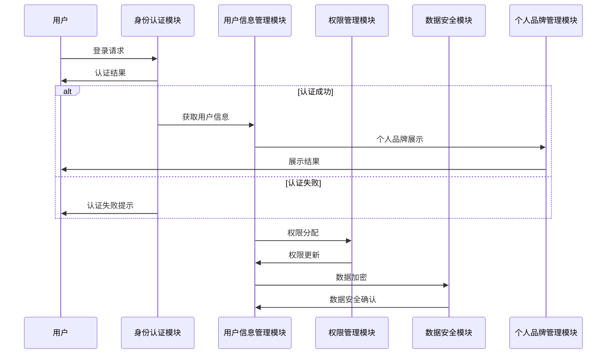

                 

### 文章标题：数字身份管理平台构建：虚拟世界中的个人品牌塑造服务

> 关键词：数字身份管理，个人品牌塑造，虚拟世界，平台构建，安全性保障

> 摘要：
本文将深入探讨数字身份管理平台在虚拟世界中的构建过程，重点关注个人品牌塑造服务。我们将从概念与架构、理论基础、设计原理与实现、安全性保障、案例分析以及虚拟世界中的个人品牌塑造策略等多个方面展开讨论，旨在为读者提供系统、全面的指导。

## 引言

在数字化时代，虚拟世界已经成为人们生活、工作的重要组成部分。从社交媒体到在线购物，再到虚拟现实游戏，人们日益依赖数字身份进行各种活动。然而，随着虚拟世界的发展，数字身份管理成为了一个亟待解决的问题。数字身份管理不仅关乎个人隐私和数据安全，更与个人品牌塑造息息相关。

本文旨在探讨如何构建一个数字身份管理平台，以在虚拟世界中为个人品牌塑造提供有效服务。我们希望通过系统的研究和实践，为读者提供有价值的指导，助力数字身份管理在虚拟世界中的应用和发展。

### 数字身份管理平台的概念与架构

#### 数字身份管理定义

数字身份管理（Digital Identity Management，DIM）是指通过技术手段对个人、企业或其他实体的数字身份进行识别、认证、管理和服务的一套体系。在虚拟世界中，数字身份不仅是用户在各个数字平台上的通行证，更是个人品牌的重要载体。

#### 数字身份管理平台架构

数字身份管理平台通常由以下几个核心组件构成：

1. **身份认证模块**：负责用户的身份验证，确保只有合法用户能够访问系统。
2. **用户信息管理模块**：用于存储和管理用户的个人信息，包括身份证明、行为记录等。
3. **权限管理模块**：根据用户身份和角色，定义和分配不同的权限。
4. **数据安全模块**：确保用户数据的安全性和隐私性，防止数据泄露和滥用。
5. **个人品牌管理模块**：提供个人品牌展示、推广和监测功能。

下面是一个简单的 Mermaid 流程图，展示了数字身份管理平台的架构：

#### 数字身份管理平台的核心原理

1. **多因素认证**：通过结合密码、手机验证码、指纹等认证方式，提高认证安全性。
2. **单点登录（SSO）**：使用一个账户系统，允许用户在多个应用和服务之间无缝切换。
3. **数据隐私保护**：采用数据加密、访问控制等技术，确保用户数据在存储和传输过程中的安全。
4. **个人品牌展示**：通过个性化的用户界面和数据分析，帮助用户展示和塑造个人品牌。

#### 数字身份管理与个人品牌塑造的联系

在虚拟世界中，个人品牌塑造是用户在各个数字平台上获取关注和认可的重要途径。数字身份管理平台通过以下方式支持个人品牌塑造：

1. **身份认证**：确保用户身份的真实性，提升个人品牌的可信度。
2. **数据隐私保护**：保护用户隐私，增强用户对平台的信任。
3. **个性化服务**：根据用户行为和偏好，提供定制化的个人品牌展示方案。
4. **用户互动**：通过社交媒体、在线论坛等渠道，增强用户参与度和品牌影响力。

### 个人品牌塑造的理论基础

#### 个人品牌定义

个人品牌是指个人在特定领域或行业内建立的良好声誉和独特形象。它不仅关乎个人的知名度，更涉及专业能力、价值观、人际关系等多个方面。

#### 个人品牌价值

在虚拟世界，个人品牌具有以下价值：

1. **增强竞争力**：建立个人品牌有助于在求职、商业合作等方面提升竞争力。
2. **扩大影响力**：良好的个人品牌能够吸引更多的关注和认可，提高个人影响力。
3. **增加收入**：通过个人品牌，用户可以开展各种商业活动，如咨询、培训、广告等，实现经济收益。
4. **职业发展**：个人品牌有助于职业晋升和跨行业拓展。

#### 个人品牌塑造策略

1. **内容营销**：通过发布高质量、有价值的内容，提升个人在行业内的知名度和影响力。
2. **社交媒体运营**：利用社交媒体平台，建立良好的个人形象和粉丝基础。
3. **专业认证**：通过获得专业认证，提升个人专业水平和品牌价值。
4. **人际网络**：积极参与行业活动和社区互动，扩大人际网络，提高个人知名度。

### 平台设计原理与实现

#### 平台设计原则

1. **用户中心**：以用户需求为核心，提供个性化服务。
2. **安全性优先**：确保用户数据安全和隐私保护。
3. **可扩展性**：支持平台功能的持续扩展和升级。
4. **高可用性**：确保平台稳定可靠，提供优质用户体验。

#### 平台核心功能

1. **用户注册与登录**：支持多方式注册和登录，提供便捷的用户体验。
2. **身份认证**：采用多因素认证，确保用户身份真实可信。
3. **用户信息管理**：提供用户个人信息编辑和查看功能。
4. **个人品牌展示**：支持用户自定义个人品牌展示界面。
5. **数据隐私保护**：采用加密、访问控制等技术，确保用户数据安全。

#### 平台实现技术栈

1. **前端技术**：采用React、Vue等前端框架，实现动态、响应式的用户界面。
2. **后端技术**：使用Node.js、Django等后端框架，提供强大的后端支持。
3. **数据库**：采用MySQL、MongoDB等数据库，存储和管理用户数据。
4. **身份认证技术**：使用OAuth2.0、JWT等认证技术，确保用户身份安全。
5. **数据安全**：采用SSL/TLS等加密技术，保障数据传输安全。

### 平台安全性保障

#### 安全性挑战

1. **数据泄露**：用户个人信息容易成为攻击目标，可能导致隐私泄露。
2. **身份盗用**：黑客可能通过非法手段获取用户身份，进行恶意活动。
3. **网络攻击**：平台可能遭受DDoS、SQL注入等网络攻击，导致服务中断。
4. **隐私保护**：如何在提供个性化服务的同时，确保用户隐私不被泄露。

#### 安全性解决方案

1. **数据加密**：采用AES、RSA等加密算法，对用户数据进行加密存储和传输。
2. **身份认证**：使用多因素认证，提高身份验证的可靠性。
3. **访问控制**：采用ACL（访问控制列表）、RBAC（基于角色的访问控制）等技术，确保用户只能访问授权数据。
4. **网络安全**：部署防火墙、入侵检测系统等，防止网络攻击。
5. **隐私保护**：遵循GDPR等隐私保护法规，确保用户隐私不被滥用。

### 平台案例分析

#### 案例一：Facebook

Facebook 是一个全球领先的社交网络平台，拥有庞大的用户群体。Facebook 的数字身份管理平台主要实现了以下功能：

1. **用户注册与登录**：支持多种注册方式，如邮箱、手机号、第三方账号等。
2. **身份认证**：采用多因素认证，包括密码、手机验证码、生物识别等。
3. **用户信息管理**：提供用户个人信息编辑和查看功能。
4. **个人品牌展示**：支持用户自定义个人资料、头像、状态等，展示个人品牌。
5. **数据隐私保护**：遵循GDPR等隐私保护法规，确保用户隐私不被滥用。

Facebook 的数字身份管理平台在安全性方面也做了很多努力，包括数据加密、访问控制、网络安全等。尽管如此，Facebook 仍然面临数据泄露、身份盗用等安全挑战。

#### 案例二：LinkedIn

LinkedIn 是一个专业的社交网络平台，专注于职业和个人品牌塑造。LinkedIn 的数字身份管理平台主要实现了以下功能：

1. **用户注册与登录**：支持邮箱、手机号、第三方账号等多种注册方式。
2. **身份认证**：采用多因素认证，包括密码、手机验证码等。
3. **用户信息管理**：提供用户个人信息编辑和查看功能。
4. **个人品牌展示**：支持用户自定义个人资料、头像、状态等，展示个人品牌。
5. **职业发展工具**：提供职业推荐、招聘信息、简历编辑等功能，帮助用户提升个人品牌。

LinkedIn 的数字身份管理平台在安全性方面也做了很多工作，包括数据加密、访问控制、网络安全等。此外，LinkedIn 还积极应对数据泄露、身份盗用等安全挑战，不断提升平台安全性。

### 虚拟世界中的个人品牌塑造策略

#### 个人品牌定位

1. **确定目标受众**：明确个人品牌面向的目标受众，了解他们的需求和偏好。
2. **塑造专业形象**：在虚拟世界中，通过专业的内容和互动，树立良好的专业形象。
3. **建立信任关系**：通过积极互动和提供有价值的内容，建立与受众的信任关系。

#### 内容营销策略

1. **内容多样化**：结合文字、图片、视频等多种形式，丰富内容形式。
2. **内容质量**：确保内容有价值、有深度，避免低质量、重复性内容。
3. **内容发布**：定期发布内容，保持活跃度，吸引更多关注。

#### 社交媒体运营策略

1. **选择合适平台**：根据个人品牌特点和目标受众，选择合适的社交媒体平台。
2. **积极互动**：与粉丝、同行等进行积极互动，提升个人品牌影响力。
3. **推广活动**：举办线上活动、讲座、培训等，扩大个人品牌知名度。

#### 跨平台协作

1. **整合资源**：将个人品牌在不同平台上的内容进行整合，形成统一的品牌形象。
2. **合作互推**：与其他个人或企业进行合作，互相推广，扩大影响力。
3. **跨界合作**：尝试与其他领域的个人或企业进行跨界合作，拓展个人品牌影响力。

### 未来趋势与挑战

#### 未来趋势

1. **区块链技术**：区块链技术可以为数字身份管理提供更强的安全性和隐私保护。
2. **人工智能**：人工智能技术可以用于个人品牌分析、推荐、优化等，提升平台服务能力。
3. **虚拟现实**：虚拟现实技术可以为个人品牌塑造提供更加沉浸式的体验。

#### 挑战

1. **数据隐私**：如何在提供个性化服务的同时，确保用户数据隐私不被泄露，是一个重要挑战。
2. **技术更新**：随着技术的发展，平台需要不断升级，以应对新的安全挑战和需求。
3. **法规遵从**：不同国家和地区的法规要求不同，平台需要遵守相关法规，确保合规运营。

### 总结

数字身份管理平台在虚拟世界中的构建，不仅关乎个人隐私和数据安全，更是个人品牌塑造的重要支撑。本文从多个方面探讨了数字身份管理平台的设计原理、安全性保障、案例分析以及个人品牌塑造策略。未来，随着技术的不断进步，数字身份管理平台将在虚拟世界中发挥越来越重要的作用。

### 作者信息

作者：AI天才研究院/AI Genius Institute & 禅与计算机程序设计艺术 /Zen And The Art of Computer Programming

---

通过以上章节，我们全面探讨了数字身份管理平台在虚拟世界中的构建，以及个人品牌塑造的重要性。本文旨在为读者提供有价值的指导，助力他们在虚拟世界中成功塑造个人品牌。感谢您的阅读，希望本文能对您有所启发。

---

### 最佳实践 Tips

1. **确保数据安全**：在进行数字身份管理平台设计时，始终将数据安全放在首位。采用先进的数据加密技术和访问控制机制，确保用户数据在存储和传输过程中的安全。
2. **多因素认证**：为了提高用户身份验证的可靠性，建议采用多因素认证，如密码、手机验证码、指纹等，防止身份盗用。
3. **用户隐私保护**：严格遵守相关隐私保护法规，确保用户隐私不被滥用。在平台设计时，充分考虑用户隐私保护需求，采取有效措施，降低隐私泄露风险。
4. **定期更新**：随着技术的发展和需求的变化，平台需要定期更新和优化。关注行业动态，及时引入新技术，提升平台功能和安全性。
5. **用户参与**：鼓励用户参与平台建设和运营，收集用户反馈，优化用户体验。通过用户参与，不断提升个人品牌塑造服务的质量和效果。

### 小结

本文从数字身份管理平台的概念与架构、个人品牌塑造的理论基础、平台设计原理与实现、安全性保障、案例分析以及虚拟世界中的个人品牌塑造策略等多个方面，全面探讨了数字身份管理平台在虚拟世界中的构建过程。通过本文的阅读，读者应能够了解到数字身份管理平台的重要性，以及如何利用平台在虚拟世界中成功塑造个人品牌。

### 注意事项

1. **合规性**：在数字身份管理平台的设计和运营过程中，需严格遵守相关法规，确保平台合规运营。
2. **用户教育**：加强对用户的宣传教育，提高用户对数字身份管理重要性的认识，培养用户良好的数字素养。
3. **持续优化**：平台建设和运营是一个持续的过程，需要不断优化和改进。关注用户需求和反馈，不断提升平台性能和服务质量。

### 拓展阅读

1. **《区块链技术指南》**：了解区块链技术的基本原理和应用场景，为数字身份管理平台的安全性提供新思路。
2. **《人工智能：一种现代方法》**：深入了解人工智能技术的基本原理和应用，为数字身份管理平台的功能拓展提供支持。
3. **《虚拟现实技术与应用》**：了解虚拟现实技术在虚拟世界中的应用，为个人品牌塑造提供沉浸式体验。
4. **《互联网安全攻防技术》**：学习网络安全技术，提高数字身份管理平台的安全性。

