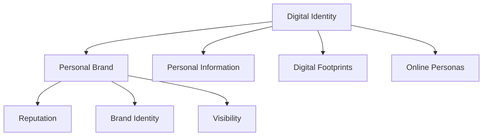

                 


### **Step 1: Defining the Scope and Structure**

Before we dive into the intricacies of digital identity management platforms, it's essential to clearly define the scope of our discussion and establish a logical structure for the article. This will help readers follow the narrative and absorb the information more effectively. Here’s how we can structure our article:

1. **Introduction**: Introduce the concept of digital identity management platforms and their significance in the context of virtual worlds and personal branding.
2. **Core Concepts and Relationships**: Define the core concepts such as digital identity, personal brand, and their relationships in a Mermaid flowchart.
3. **Understanding Digital Identity**: Discuss the components of digital identity, how they're created, and how they're managed.
4. **Virtual World Interactions**: Explain the dynamics of user interactions in virtual worlds and the role of digital identity.
5. **Personal Branding in Virtual Worlds**: Provide strategies and best practices for building and maintaining personal brands in virtual environments.
6. **Digital Identity Management Platforms**: Describe the architecture and functionalities of these platforms and their role in personal branding.
7. **Building a Digital Identity Management Platform**: Guide readers through the process of building a digital identity management platform.
8. **Security and Privacy**: Address security and privacy concerns in virtual worlds and how these platforms can mitigate them.
9. **Case Studies**: Present practical examples of successful digital identity management platforms and their impact on personal branding.
10. **Future Trends and Challenges**: Discuss the future of digital identity management and potential challenges.

### **Step 2: Introduction**

In the rapidly evolving landscape of the digital age, our concept of identity is undergoing a significant transformation. Digital identity management platforms are at the forefront of this transformation, acting as the backbone for personal branding in virtual worlds. This article aims to provide a comprehensive guide to understanding and leveraging digital identity management platforms for personal branding in virtual environments.

**Why is Digital Identity Management Important?**

Digital identity management is crucial for several reasons. Firstly, it ensures the security and privacy of personal information in an increasingly interconnected digital world. Secondly, it allows individuals to present a curated version of themselves in virtual environments, thereby building a personal brand. In virtual worlds, where interactions are primarily mediated by technology, a strong digital identity can lead to greater visibility, credibility, and opportunities for professional growth.

**The Significance of Personal Branding in Virtual Worlds**

Personal branding in virtual worlds is not just about creating a digital avatar; it's about crafting a unique narrative and presence that resonates with others. In these virtual landscapes, personal branding can open doors to new social connections, business opportunities, and even career advancements. It's a powerful tool for standing out in a crowded digital space.

### **Step 3: Core Concepts and Relationships**

To fully grasp the concept of digital identity management platforms and their role in personal branding, it's important to first understand the core concepts involved: digital identity and personal brand. Let's delve into these concepts and illustrate their relationships using a Mermaid flowchart.

#### **Digital Identity**

Digital identity refers to the representation of an individual in the digital space. It comprises various attributes, such as personal information, digital footprints, and online personas. These attributes are managed and presented differently across various platforms and social media channels.

**Components of Digital Identity:**
- Personal Information: Name, date of birth, contact details, etc.
- Digital Footprints: The traces left by an individual's online activities, such as search history, social media interactions, and website visits.
- Online Personas: The different roles and identities an individual adopts in different online contexts.

#### **Personal Brand**

Personal branding is the process of establishing a unique identity or image in the minds of an audience. It involves strategically crafting and managing an individual's online presence to create a positive and memorable impression.

**Components of Personal Brand:**
- Reputation: The perception others have of an individual based on their actions and online presence.
- Brand Identity: The core values, mission, and personality that define an individual's brand.
- Visibility: The extent to which an individual's brand is known and recognized.

#### **Relationships Between Concepts**

The relationship between digital identity and personal brand can be visualized using a Mermaid flowchart:



This flowchart illustrates that digital identity serves as the foundation for personal branding, with personal information, digital footprints, and online personas contributing to the overall personal brand.

### **Step 4: Understanding Digital Identity**

Now that we have established the core concepts of digital identity and personal branding, let's delve deeper into digital identity itself. Understanding the components and processes involved in creating and managing a digital identity is crucial for leveraging it effectively in virtual environments.

#### **Components of Digital Identity**

Digital identity is composed of several key components:

1. **Personal Information**: This includes basic details such as name, date of birth, contact information, and address. Personal information serves as the foundation of an individual's digital identity and is often used for authentication and verification purposes.

2. **Digital Footprints**: These are the digital traces left behind by an individual's online activities. This includes browser history, social media interactions, search queries, and online transactions. Digital footprints provide insights into an individual's preferences, behavior, and interests.

3. **Online Personas**: In different online contexts, individuals may adopt various personas to represent themselves. These personas can vary based on the platform, community, or role they are engaging with. For example, someone might have a professional persona on LinkedIn and a more casual one on social media platforms.

#### **Creating a Digital Identity**

Creating a digital identity involves several steps:

1. **Registration**: Individuals typically start by registering on digital platforms using their personal information. This includes creating a username, password, and providing basic contact details.

2. **Profile Customization**: After registration, individuals can customize their profiles by adding personal information, uploading photos, and creating a bio. This step helps in establishing a unique online persona.

3. **Activity Monitoring**: As individuals engage with digital platforms, their activities create a digital footprint. This can include liking posts, commenting on articles, participating in discussions, and even making online purchases.

4. **Continuous Update**: Keeping the digital identity up-to-date is essential. This involves regularly updating profile information, changing passwords, and monitoring digital footprints to ensure accuracy and relevance.

#### **Managing a Digital Identity**

Managing a digital identity is a continuous process that involves:

1. **Privacy Settings**: Individuals should regularly review and adjust their privacy settings to control who can see their personal information and activities. This helps protect their privacy and reduce the risk of identity theft.

2. **Content Moderation**: Monitoring and managing the content shared online is crucial. Individuals should be cautious about what they post and share to maintain a positive digital reputation.

3. **Reputation Management**: Regularly monitoring and managing one's online reputation is important. This involves addressing any negative comments or reviews and actively engaging with the community to build a positive image.

4. **Security Practices**: Implementing strong security practices, such as using two-factor authentication, regularly updating passwords, and avoiding suspicious links or websites, is vital for protecting digital identities.

#### **Example: Online Social Profiles**

Consider an example of an individual managing their digital identity across multiple social media platforms:

1. **Registration**: The individual registers on platforms like Facebook, LinkedIn, and Twitter using their personal information.

2. **Profile Customization**: They customize their profiles by adding a professional photo, a detailed bio highlighting their career and interests, and connecting with colleagues and industry professionals.

3. **Activity Monitoring**: They actively participate in discussions, share industry-related articles, and engage with their network to build their digital footprint.

4. **Privacy Settings**: They adjust privacy settings to ensure that their personal information is only visible to trusted contacts.

5. **Content Moderation**: They monitor and manage the content they share, ensuring it aligns with their personal brand and maintains a positive reputation.

6. **Reputation Management**: They respond to any negative feedback, engage in constructive conversations, and actively build relationships with their network to enhance their reputation.

7. **Security Practices**: They use two-factor authentication, strong, unique passwords, and avoid clicking on suspicious links to protect their digital identity.

By following these steps, individuals can effectively manage their digital identity, presenting a curated version of themselves in the virtual world that aligns with their personal brand.

### **Step 5: Virtual World Interactions**

In virtual worlds, users engage in various activities that shape their digital identities and personal brands. Understanding the dynamics of these interactions is crucial for effectively leveraging digital identity management platforms to enhance personal branding.

#### **Types of Interactions in Virtual Worlds**

1. **Social Interaction**: Users form relationships, join communities, and engage in discussions. These interactions allow individuals to build a network and establish their reputation within the virtual community.

2. **Economic Transactions**: Virtual worlds often include markets where users can buy, sell, and trade virtual assets. These transactions provide opportunities to showcase one's expertise, credibility, and trustworthiness.

3. **Educational and Professional Development**: Virtual worlds offer platforms for learning, training, and professional development. Users can attend webinars, participate in workshops, and showcase their skills, which contribute to their personal brand.

4. **Creative Expression**: Virtual worlds provide spaces for artistic and creative endeavors. Users can create digital art, music, and other forms of content, which can be shared and appreciated by a global audience, enhancing their personal brand.

#### **Role of Digital Identity in Interactions**

Digital identity plays a pivotal role in these interactions:

1. **Authentication**: Users verify their identities through digital means, such as two-factor authentication or digital certificates, ensuring secure and trustworthy interactions.

2. **Presentation**: Digital identity allows users to present a curated version of themselves, highlighting their skills, interests, and professional background. This presentation is critical for building a positive personal brand.

3. **Privacy**: Digital identity management enables users to control their privacy settings, determining what information is shared and with whom. This helps protect personal data and maintain privacy.

#### **Example: Virtual Reality (VR) Workshops**

Consider a scenario where users participate in virtual reality (VR) workshops:

1. **Registration**: Users register for the workshop using their digital identity, providing necessary information and confirming their participation.

2. **Profile Customization**: Before joining, users customize their VR avatars, selecting appearance, outfit, and even voice. This avatar represents their digital identity in the virtual world.

3. **Workshop Participation**: During the workshop, users interact with trainers and peers, sharing knowledge, asking questions, and participating in group activities. Their digital identity, including their reputation and expertise, influences their interactions.

4. **Content Creation**: Users create and share content from the workshop, such as blog posts, videos, or presentations. This content contributes to their digital footprint and personal brand.

5. **Feedback and Engagement**: Users receive feedback from trainers and peers, which they can use to refine their skills and enhance their personal brand. They also engage with the virtual community, building relationships and expanding their network.

By actively participating in virtual world interactions, users can leverage their digital identity to build and maintain a strong personal brand, enhancing their visibility, credibility, and opportunities in the digital space.

### **Step 6: Personal Branding in Virtual Worlds**

In the ever-evolving landscape of virtual worlds, personal branding has become an essential tool for individuals looking to stand out and carve a niche for themselves. Building and maintaining a personal brand in these virtual environments involves strategic planning and consistent effort. Let's explore the key strategies and best practices for effective personal branding in virtual worlds.

#### **Creating a Distinct Brand Identity**

1. **Define Your Brand Values**: Begin by identifying your core values, passions, and strengths. These will form the foundation of your brand identity. Consider what makes you unique and how you can communicate this effectively to your audience.

2. **Choose a Consistent Avatar**: Your virtual avatar is a representation of your digital identity. Select an avatar that reflects your personality and brand values. Ensure that your avatar is consistent across all virtual platforms you engage with.

3. **Develop a Professional Bio**: Craft a compelling bio that introduces you, highlights your expertise, and outlines your goals in the virtual world. This bio should be concise yet informative, capturing the essence of your brand.

4. **Create a Unique Voice**: Establish a distinctive voice for your interactions in virtual worlds. Whether it’s through text, voice messages, or video content, your tone and style should be consistent with your brand identity.

#### **Building and Maintaining Credibility**

1. **Engage in Thought Leadership**: Share valuable insights, industry news, and trends related to your field. By contributing meaningful content, you can establish yourself as a thought leader and gain the trust of your audience.

2. **Participate in Virtual Communities**: Join relevant virtual communities, groups, and forums where you can engage with like-minded individuals. Actively participate in discussions, provide helpful advice, and share your expertise to build credibility.

3. **Collaborate with Influencers**: Partner with influencers or established figures in your field to co-host events, create content, or participate in discussions. These collaborations can help amplify your brand and enhance your credibility.

4. **Showcase Your Work**: Share examples of your work, projects, or accomplishments in virtual worlds. Whether it’s through virtual exhibitions, digital portfolios, or presentations, showcasing your expertise can help reinforce your personal brand.

#### **Leveraging Digital Identity Management Platforms**

1. **Utilize Profile Visibility Features**: Make the most of the visibility features offered by digital identity management platforms. Optimize your profile with relevant keywords, descriptions, and tags to improve discoverability.

2. **Maintain Consistent Activity**: Regularly update your profile with new achievements, projects, and insights. Consistent activity keeps your audience engaged and helps maintain your presence in the virtual community.

3. **Integrate Cross-Platform Branding**: Ensure that your personal brand is consistent across all digital platforms you use. This integration helps create a cohesive and recognizable brand identity in virtual worlds.

4. **Secure Your Identity**: Implement robust security measures to protect your digital identity. Use strong passwords, enable two-factor authentication, and be cautious about sharing personal information to prevent identity theft.

#### **Case Study: A Virtual World Entrepreneur**

Consider the example of Sarah, a virtual world entrepreneur who successfully built her personal brand:

1. **Define Her Brand Values**: Sarah identified her passion for technology, innovation, and community-building as the core values of her brand.

2. **Create a Unique Avatar**: She designed a futuristic avatar that represented her innovative spirit and forward-thinking mindset.

3. **Develop a Compelling Bio**: Sarah's bio highlighted her expertise in virtual reality, her vision for the future of technology, and her commitment to fostering a collaborative virtual community.

4. **Engage in Thought Leadership**: Sarah regularly shared insightful articles, opinion pieces, and industry news related to virtual reality and technology. She also hosted virtual workshops and webinars to provide valuable knowledge to her audience.

5. **Participate in Virtual Communities**: Sarah actively engaged in discussions, contributed to forums, and participated in virtual events. She collaborated with influencers and established professionals to enhance her credibility.

6. **Showcase Her Work**: Sarah showcased her successful projects, such as virtual reality experiences and community initiatives, through virtual exhibitions and digital portfolios.

7. **Maintain Consistent Activity**: Sarah regularly updated her profile with new achievements, upcoming events, and industry insights. Her consistent activity kept her audience engaged and maintained her presence in the virtual community.

8. **Secure Her Identity**: Sarah implemented strong security measures, including two-factor authentication and secure passwords, to protect her digital identity.

By following these strategies, Sarah successfully built a strong personal brand in virtual worlds, establishing herself as a thought leader and gaining recognition in her field.

In conclusion, building and maintaining a personal brand in virtual worlds requires a clear understanding of your unique identity, strategic planning, and consistent effort. By leveraging digital identity management platforms and implementing best practices, individuals can effectively showcase their expertise, build credibility, and create a lasting impression in the digital space.

### **Step 7: Digital Identity Management Platforms**

Digital identity management platforms are pivotal in facilitating personal branding in virtual worlds. These platforms offer comprehensive solutions for creating, managing, and securing digital identities, thereby enabling individuals to present a curated and trustworthy persona online. In this section, we will explore the architecture, functionalities, and the critical role of digital identity management platforms in personal branding.

#### **Architecture of Digital Identity Management Platforms**

Digital identity management platforms are typically built on a robust architecture that incorporates various components:

1. **Authentication and Access Control**: The core component of any digital identity management platform is authentication. It ensures that only authorized users can access the platform and its resources. Common authentication methods include username/password, two-factor authentication (2FA), biometrics, and digital certificates.

2. **Attribute Management**: This component stores and manages the attributes associated with a user’s digital identity, such as personal information, digital footprints, and online personas. Attribute management systems are designed to ensure data accuracy, consistency, and security.

3. **Privacy and Consent Management**: Digital identity platforms must comply with privacy regulations and enable users to manage their privacy settings. Privacy management includes data encryption, consent mechanisms, and the ability to control data sharing.

4. **Directory Services**: These services store and manage user directories, making it easier to locate and manage digital identities across various platforms and applications.

5. **Audit and Compliance**: Platforms must maintain audit trails to ensure accountability and compliance with regulatory requirements. Audit logs track user activities and system changes, providing a detailed record for compliance purposes.

6. **User Interface (UI)**: The user interface is the front-end through which users interact with the platform. It should be intuitive and easy to navigate, allowing users to manage their digital identities effortlessly.

7. **Integration and Interoperability**: Digital identity management platforms need to integrate with other systems and platforms, such as social media, enterprise resources, and virtual world environments. Interoperability ensures seamless data exchange and user experience.

#### **Functionalities of Digital Identity Management Platforms**

The key functionalities of digital identity management platforms include:

1. **Single Sign-On (SSO)**: SSO allows users to authenticate once and gain access to multiple applications and platforms without re-entering their credentials. This enhances user convenience and improves security by reducing the need for multiple passwords.

2. **Multi-Factor Authentication (MFA)**: MFA adds an extra layer of security by requiring users to provide two or more verification factors to gain access. This could be something the user knows (password), something the user has (a mobile device), or something the user is (biometrics).

3. **Attribute and Role Management**: Users can manage their attributes and roles, customizing their digital identity to suit different contexts and environments. This includes adding or removing information, updating profiles, and managing access levels.

4. **Privacy Controls**: Users have the ability to control their privacy settings, deciding what information is shared, with whom, and under what conditions. Privacy controls ensure that users retain control over their personal data.

5. **Provisioning and De-provisioning**: Digital identity platforms can automatically provision new users with the necessary access rights and de-provision users when they leave an organization or when their access is no longer required.

6. **Identity Governance and Administration**: Identity governance ensures that digital identities are managed in accordance with regulatory requirements and organizational policies. Identity administration involves managing user accounts, roles, and permissions.

7. **User Activity Monitoring and Reporting**: Platforms monitor user activities and generate reports to help organizations detect and respond to security incidents, compliance issues, and other potential risks.

#### **Role in Personal Branding**

Digital identity management platforms play a crucial role in personal branding by providing the tools and infrastructure necessary to build and maintain a strong digital identity. Here’s how they contribute to personal branding:

1. **Consistent Identity Representation**: Platforms enable users to maintain a consistent identity across various virtual worlds and digital platforms. This consistency helps in creating a cohesive and recognizable personal brand.

2. **Enhanced Security and Trust**: By offering robust authentication and access control mechanisms, digital identity platforms enhance the security of users’ personal information. This builds trust with both the user and the virtual community, which is essential for personal branding.

3. **Privacy and Data Control**: Users can manage their privacy settings and control the information they share. This empowers them to present a curated version of themselves, aligning with their personal brand values.

4. **Authentication for Opportunities**: Digital identity platforms provide verified identities that can open doors to various opportunities, such as networking events, job interviews, and collaborations. A verified digital identity enhances credibility and can lead to more significant professional opportunities.

5. **Data Analytics and Insights**: Platforms often provide analytics tools that help users understand their digital footprint and engagement patterns. This data can be used to refine personal branding strategies and improve online presence.

6. **Community Building**: Digital identity platforms facilitate community building by enabling users to connect with like-minded individuals and organizations. These communities can support and enhance personal branding efforts.

#### **Example: Building a Digital Identity Management Platform**

Let’s consider an example of building a digital identity management platform for a virtual world environment:

1. **Requirement Analysis**: The first step involves identifying the specific requirements of the platform. This includes understanding the types of users, their needs, and the security and privacy regulations that must be complied with.

2. **Design and Architecture**: The platform’s architecture is designed to incorporate authentication, attribute management, privacy controls, directory services, and user interfaces. A scalable and secure architecture is essential to support the growing number of users and complex interactions.

3. **Development and Integration**: The platform is developed using appropriate technologies and frameworks. Integration with existing systems, such as social media platforms and enterprise resources, is also a critical component.

4. **Testing and Deployment**: The platform undergoes rigorous testing to ensure its functionality, security, and usability. It is then deployed in a production environment, making it accessible to users.

5. **User Training and Support**: Users are trained on how to use the platform effectively. Support mechanisms, such as FAQs, tutorials, and customer service, are put in place to assist users.

6. **Ongoing Maintenance and Updates**: The platform is regularly maintained and updated to address security vulnerabilities, integrate new features, and ensure compliance with evolving regulations.

By following these steps, a digital identity management platform can be successfully built and deployed, providing users with the tools they need to effectively manage their digital identities and build their personal brands in virtual worlds.

In conclusion, digital identity management platforms are essential for creating, managing, and securing digital identities, which are fundamental to personal branding in virtual worlds. These platforms offer a wide range of functionalities that enhance security, privacy, and personal branding, enabling individuals to present a consistent and trustworthy persona online.

### **Step 8: Building a Digital Identity Management Platform**

Creating a robust digital identity management platform involves careful planning, development, and implementation. In this section, we'll guide you through the process of building such a platform, including the necessary tools, technologies, and steps involved. We will also provide a detailed example of how to implement the core functionalities of a digital identity management platform.

#### **Tools and Technologies**

To build a digital identity management platform, you will need a combination of hardware, software, and development tools. Here are some essential components:

1. **Hardware**: 
   - Servers: To host the platform's infrastructure and services.
   - Database Servers: To store user data and identity information securely.
   - Load Balancers: To distribute traffic efficiently across multiple servers.

2. **Software**: 
   - Operating Systems: Linux distributions like Ubuntu or CentOS are commonly used for server environments.
   - Web Servers: Apache or Nginx for hosting web applications.
   - Database Management Systems (DBMS): MySQL, PostgreSQL, or MongoDB for storing user data.
   - Identity Management Software: Open-source tools like OpenLDAP or FreeIPA can be used to manage user identities.

3. **Development Tools**: 
   - Programming Languages: Python, Java, or PHP can be used for developing the platform's back-end.
   - Frameworks: Django, Spring, or Laravel can be used to streamline the development process.
   - Version Control: Git for source code management.
   - Containerization Tools: Docker for creating containerized applications.
   - Continuous Integration/Continuous Deployment (CI/CD): Jenkins or GitLab CI for automating the build and deployment process.

#### **Steps to Build a Digital Identity Management Platform**

1. **Requirement Analysis**:
   - Identify the key requirements for the platform, including user authentication, privacy controls, attribute management, and access control.
   - Define the target audience and their specific needs.

2. **Design the Architecture**:
   - Design the overall architecture of the platform, including the front-end, back-end, database, and identity management components.
   - Plan for scalability and security to accommodate growing user bases and protect user data.

3. **Develop the Back-End**:
   - Choose a suitable programming language and framework for developing the back-end.
   - Implement the core functionalities such as user authentication, authorization, and attribute management.
   - Use a microservices architecture to modularize the platform, making it easier to maintain and scale.

4. **Implement the Front-End**:
   - Design and develop a user-friendly front-end that allows users to manage their digital identities, including profile creation, privacy settings, and attribute updates.
   - Ensure the front-end is responsive and accessible on various devices, including desktops, tablets, and mobile phones.

5. **Database Design**:
   - Design a relational or NoSQL database to store user data, including personal information, digital footprints, and identity attributes.
   - Implement database security measures, such as encryption and access controls, to protect sensitive information.

6. **Security and Privacy**:
   - Implement strong authentication mechanisms, such as two-factor authentication (2FA) and biometrics.
   - Comply with privacy regulations, such as GDPR or CCPA, by implementing privacy controls and ensuring data protection.

7. **Testing and Quality Assurance**:
   - Conduct thorough testing to ensure the platform is functional, secure, and user-friendly.
   - Perform load testing to ensure the platform can handle a large number of users and interactions.

8. **Deployment**:
   - Deploy the platform on cloud servers or dedicated hardware.
   - Implement monitoring and logging tools to track platform performance and detect security incidents.

9. **Maintenance and Updates**:
   - Regularly update the platform to fix bugs, improve performance, and incorporate new features.
   - Monitor user feedback and address any issues or concerns to ensure the platform remains effective and user-friendly.

#### **Example: Implementing Core Functionalities**

Let's consider a simplified example of implementing the core functionalities of a digital identity management platform using Python and Django:

**1. User Authentication**:

To implement user authentication, we will use Django's built-in authentication system. Here's a basic example of a user registration view in Django:

```python
from django.contrib.auth import authenticate, login
from django.http import HttpResponse
from django.views.decorators.http import require_http_methods

@require_http_methods(["POST"])
def register(request):
    username = request.POST['username']
    password = request.POST['password']
    user = authenticate(username=username, password=password)
    if user:
        login(request, user)
        return HttpResponse("Registered and logged in successfully!")
    else:
        return HttpResponse("Authentication failed!", status=401)
```

**2. Attribute Management**:

To manage user attributes, we will create a Django model to store user information:

```python
from django.db import models
from django.contrib.auth.models import User

class UserProfile(models.Model):
    user = models.OneToOneField(User, on_delete=models.CASCADE)
    bio = models.TextField(max_length=500, blank=True)
    profile_picture = models.ImageField(upload_to='profiles/', blank=True)
```

**3. Privacy Controls**:

To implement privacy controls, we will add fields to the `UserProfile` model to define visibility settings for user attributes:

```python
class UserProfile(models.Model):
    user = models.OneToOneField(User, on_delete=models.CASCADE)
    bio = models.TextField(max_length=500, blank=True)
    profile_picture = models.ImageField(upload_to='profiles/', blank=True)
    bio_visibility = models.CharField(max_length=10, choices=[('public', 'Public'), ('private', 'Private')])
```

**4. Access Control**:

To implement access control, we will use Django's built-in permission and group mechanisms:

```python
from django.contrib.auth.models import Permission, Group

def assign_permissions(user):
    # Create a group for administrators
    admin_group, _ = Group.objects.get_or_create(name='admin')
    
    # Assign permissions to the group
    admin_group.permissions.add(
        Permission.objects.get(codename='add_userprofile'),
        Permission.objects.get(codename='change_userprofile'),
        Permission.objects.get(codename='delete_userprofile'),
    )
    
    # Add the user to the admin group
    user.groups.add(admin_group)
```

**5. Testing and Deployment**:

After developing the core functionalities, we will conduct thorough testing, including unit tests, integration tests, and security testing. Once the platform is tested and ready, we will deploy it on a web server using tools like Docker and Nginx.

By following these steps and examples, you can build a basic digital identity management platform. However, building a fully functional and secure platform will require more in-depth development, including handling edge cases, scaling the system, and ensuring compliance with privacy regulations.

### **Step 9: Security and Privacy in Digital Identity Management**

In the realm of digital identity management, security and privacy are paramount. Virtual worlds present unique challenges due to their interconnected nature and the sheer volume of data exchanged between users. Ensuring the security and privacy of digital identities is crucial for maintaining trust and protecting personal information. In this section, we will discuss the key security and privacy concerns in virtual worlds and explore how digital identity management platforms can address these challenges.

#### **Security Threats in Virtual Worlds**

1. **Phishing Attacks**: Phishing attacks are one of the most common security threats in virtual worlds. Attackers often send deceptive emails or messages that appear to be from trusted sources, tricking users into revealing their login credentials or other sensitive information.

2. **Data Breaches**: Virtual worlds can become targets for data breaches, where attackers gain unauthorized access to databases containing personal information. This can lead to identity theft, financial loss, and other serious consequences.

3. **Malware and Viruses**: Malicious software can be spread through virtual worlds, compromising users' devices and allowing attackers to steal sensitive data or take control of user accounts.

4. **Man-in-the-Middle (MitM) Attacks**: In MitM attacks, an attacker intercepts communications between two parties, allowing them to eavesdrop, alter, or manipulate the data being exchanged. This can be particularly dangerous in virtual worlds where users share sensitive information.

5. **Account Takeovers**: Attackers may attempt to gain control of user accounts by exploiting vulnerabilities in authentication mechanisms or by social engineering users into revealing their credentials.

#### **Privacy Concerns in Virtual Worlds**

1. **Data Collection**: Virtual worlds often collect vast amounts of data on user activities, preferences, and behaviors. This data can be used for targeted advertising, but it also raises concerns about privacy and the potential for misuse.

2. **Data Sharing**: Virtual world platforms may share user data with third parties, such as advertising networks or analytics companies. This data sharing can lead to a loss of privacy and control over personal information.

3. **Insufficient Privacy Controls**: Users may not have adequate privacy controls to manage the visibility of their personal information. This can result in unintended exposure of sensitive data to unauthorized individuals.

4. **Data Retention Policies**: Virtual worlds may retain user data for extended periods, even after an account is deactivated or deleted. This prolonged retention can pose privacy risks.

#### **Security and Privacy Measures**

To address these security and privacy concerns, digital identity management platforms can implement several measures:

1. **Multi-Factor Authentication (MFA)**: MFA adds an extra layer of security by requiring users to provide two or more verification factors to gain access. This can significantly reduce the risk of account takeovers and MitM attacks.

2. **Encryption**: Encrypting data in transit and at rest can protect it from unauthorized access. Virtual worlds should use strong encryption protocols to ensure that user data remains secure.

3. **Regular Security Audits**: Conducting regular security audits and vulnerability assessments can help identify and address potential security risks. This proactive approach can help prevent data breaches and other security incidents.

4. **User Education**: Educating users about security best practices, such as creating strong passwords, avoiding suspicious links, and recognizing phishing attempts, can help mitigate security risks.

5. **Privacy Policies**: Clear and transparent privacy policies can help users understand how their data is collected, used, and shared. Virtual worlds should provide users with control over their data, allowing them to manage their privacy settings.

6. **Data Minimization**: Collecting only the necessary data for providing services can help minimize privacy risks. Virtual worlds should avoid collecting excessive data unless it is essential for delivering a specific feature or service.

7. **Data Retention Policies**: Implementing strict data retention policies can help ensure that user data is not retained for longer than necessary. This can reduce the risk of data breaches and unauthorized access.

8. **Anonymization and Pseudonymization**: Anonymizing or pseudonymizing user data can help protect privacy by removing or masking personal identifiers. This can be particularly useful in data analytics and research contexts.

By implementing these security and privacy measures, digital identity management platforms can help protect users' personal information and maintain trust in the virtual world. This, in turn, enhances the overall user experience and contributes to the growth and success of virtual environments.

### **Step 10: Case Studies**

To gain a deeper understanding of how digital identity management platforms have been implemented and their impact on personal branding, let's explore some real-world case studies. These examples will provide valuable insights into the practical applications and effectiveness of such platforms in virtual environments.

#### **Case Study 1: Second Life**

Second Life is a prominent virtual world that has been pioneering digital identity management since its inception in 2003. It allows users to create unique avatars and interact within a 3D virtual space. Second Life's digital identity management platform, known as the Viewer, plays a crucial role in user authentication and personal brand development.

**Key Features and Impact:**
- **Single Sign-On (SSO)**: Second Life's Viewer uses SSO, allowing users to log in once and access various virtual platforms and services within the Second Life ecosystem.
- **Customization**: Users can customize their avatars and profiles, reflecting their personal brand and preferences. This customization enhances user engagement and personal branding.
- **Privacy Controls**: The Viewer provides privacy controls, enabling users to manage who can see their profile, communicate with them, and access their personal information.
- **Monetization**: Second Life's identity management platform has enabled users to monetize their digital identities through in-world purchases, transactions, and the creation of virtual goods. This has opened up opportunities for creators and businesses to build their personal brands and generate income.

**Impact on Personal Branding:**
The Second Life platform has empowered users to build and showcase their personal brands through their avatars and interactions. Successful individuals and businesses have leveraged the platform to demonstrate their creativity, expertise, and innovative thinking. For example, fashion designers have showcased their designs in virtual fashion shows, artists have exhibited their artwork, and businesses have established virtual storefronts. These activities have not only enhanced personal branding but also opened up new avenues for career growth and networking opportunities.

#### **Case Study 2: Decentraland**

Decentraland is a blockchain-based virtual world where users can buy, sell, and create virtual real estate and experiences. It has integrated a digital identity management platform that leverages blockchain technology to provide secure and decentralized identity management.

**Key Features and Impact:**
- **Decentralized Identity**: Decentraland's identity management platform uses blockchain to create and manage decentralized identities. This ensures data ownership and privacy, as users have control over their personal information.
- **Cryptocurrency Integration**: Users can use Decentraland's native cryptocurrency, MANA, to purchase virtual land, goods, and services. This integration has created a self-sustaining economy within the virtual world.
- **Smart Contracts**: Decentraland's platform utilizes smart contracts to automate and enforce terms of agreements, providing a secure and transparent environment for transactions.
- **Customization and Immersion**: Users can customize their virtual environments, creating unique experiences that reflect their personal brands. The immersive nature of the platform enhances user engagement and personal branding.

**Impact on Personal Branding:**
Decentraland's digital identity management platform has significantly impacted personal branding within the virtual world. Users can showcase their creativity, expertise, and unique offerings through immersive virtual spaces. Artists, designers, and businesses have utilized the platform to build their personal brands by creating virtual galleries, stores, and experiences. Additionally, the use of blockchain technology has enhanced trust and credibility, as users can verify their identities and authenticity.

#### **Case Study 3: Axie Infinity**

Axie Infinity is a play-to-earn game that combines elements of strategy, collectibles, and cryptocurrency. It has gained significant popularity, particularly in Southeast Asia, and has become a platform for individuals to build their personal brands and generate income.

**Key Features and Impact:**
- **NFT Integration**: Axie Infinity utilizes non-fungible tokens (NFTs) to represent digital assets, including Axies (digital creatures) and land. Users can buy, sell, and breed Axies, creating unique and valuable digital assets.
- **Economic Incentives**: The game offers economic incentives, allowing users to earn cryptocurrency by playing and participating in the game's economy. This has attracted a large and active community of players.
- **Digital Identity Verification**: Axie Infinity incorporates digital identity verification to ensure the security and authenticity of transactions. This helps prevent fraud and promotes a safe gaming environment.
- **Community Building**: The platform fosters a strong sense of community, with users collaborating and supporting each other to achieve success. This community engagement enhances personal branding and networking opportunities.

**Impact on Personal Branding:**
Axie Infinity has revolutionized personal branding in the gaming industry by providing a platform where individuals can showcase their skills, creativity, and competitive abilities. Players have leveraged the game to build their personal brands through their achievements, strategies, and contributions to the community. Successful players have gained recognition and followership, leading to opportunities for sponsorships, collaborations, and career advancements. The game's economic incentives have also enabled individuals to monetize their personal brands, creating a unique ecosystem for personal and professional growth.

In conclusion, these case studies demonstrate the significant impact of digital identity management platforms on personal branding in virtual worlds. By providing secure, customizable, and engaging environments, these platforms empower users to build and showcase their personal brands, opening up new opportunities for career growth, networking, and economic empowerment. As virtual worlds continue to evolve, digital identity management platforms will play an increasingly critical role in shaping the digital landscape.

### **Step 11: Future Trends and Challenges**

As the virtual world continues to expand, digital identity management platforms are poised to evolve and address new challenges and opportunities. Here, we explore the future trends in digital identity management and the potential challenges that lie ahead.

#### **Future Trends**

1. **Decentralized Identity**: The shift towards decentralized identity management is gaining momentum. Blockchain and distributed ledger technologies offer a decentralized approach to digital identity, enhancing user control over personal data and reducing reliance on centralized platforms. Decentralized identity frameworks, such as Verifiable Credentials, allow users to share verified information without exposing their underlying data.

2. **Biometric Authentication**: The integration of biometric authentication, including facial recognition, fingerprint scanning, and voice recognition, is expected to become more prevalent. Biometrics provide a high level of security and convenience, making it easier for users to authenticate their identities without the need for passwords or other traditional authentication methods.

3. **AI and Machine Learning**: Artificial intelligence and machine learning will play a crucial role in digital identity management. These technologies can be used to analyze user behavior, detect anomalies, and provide real-time security insights. AI-powered identity management systems can improve authentication processes and enhance user experience by minimizing false positives and false negatives.

4. **Cross-Platform Integration**: The future of digital identity management will likely see greater integration between virtual worlds, social media platforms, and enterprise systems. This integration will enable seamless authentication and attribute management across multiple environments, providing users with a cohesive and consistent identity experience.

5. **Privacy Enhancements**: With increasing concerns about data privacy, platforms are expected to implement more robust privacy enhancements. Features like privacy-by-design, data anonymization, and privacy-preserving techniques will become standard, ensuring that user data is protected while still enabling personalized experiences and services.

#### **Challenges**

1. **Security Concerns**: As digital identity management platforms become more sophisticated, they also become more attractive targets for cyberattacks. Ensuring the security of user data and protecting against advanced threats like phishing, social engineering, and ransomware will remain a significant challenge.

2. **Data Privacy Regulations**: Navigating the complex landscape of data privacy regulations, such as GDPR and CCPA, will continue to be challenging. Digital identity management platforms must ensure compliance with these regulations while providing users with control over their personal information.

3. **Scalability**: As virtual worlds and digital platforms continue to grow, scalability will become a critical challenge. Platforms must be designed to handle increasing user volumes and data without compromising performance or security.

4. **User Experience**: Balancing security and user experience will be a continuous challenge. Implementing strong security measures can sometimes result in a cumbersome user experience. Digital identity management platforms will need to find ways to enhance security without sacrificing usability.

5. **Global Collaboration**: Addressing the challenges of digital identity management will require global collaboration and standardization. Different regions have varying regulations and technologies, making it essential to establish common frameworks and protocols.

#### **Conclusion**

The future of digital identity management in virtual worlds is promising, with advancements in technology offering new opportunities for secure and user-centric identity management. However, addressing the security, privacy, and scalability challenges will be crucial. As digital environments continue to evolve, digital identity management platforms will play an increasingly vital role in shaping the virtual landscape, enabling users to build and maintain their personal brands with confidence and security.

### **Conclusion**

In conclusion, digital identity management platforms have emerged as pivotal tools in the virtual world, transforming how individuals present themselves and interact within digital spaces. These platforms enable users to create, manage, and secure their digital identities, enhancing their personal brands and opening up new opportunities for career growth, networking, and economic empowerment. By offering robust authentication mechanisms, privacy controls, and integration capabilities, digital identity management platforms address the complex challenges of the digital age, ensuring that users can navigate virtual environments with confidence and trust.

The significance of digital identity management in personal branding cannot be overstated. In a world where virtual interactions are increasingly prevalent, a strong digital identity can make all the difference. It allows individuals to showcase their expertise, build credibility, and create a unique presence that resonates with others. Whether it's through virtual reality workshops, digital portfolios, or virtual exhibitions, individuals can leverage their digital identities to stand out and achieve their personal and professional goals.

As we look to the future, the role of digital identity management platforms will only continue to grow. Trends such as decentralized identity, biometric authentication, and AI-driven security will shape the next generation of digital identity management. These advancements will not only enhance security and privacy but also improve the user experience, making it easier for individuals to manage their digital identities across multiple platforms.

However, it is crucial to remain aware of the challenges that lie ahead. Security concerns, data privacy regulations, scalability issues, and the need for global collaboration will require ongoing attention and innovation. Digital identity management platforms must continuously evolve to meet these challenges, ensuring that they provide a secure, user-friendly, and compliant environment for users to build and maintain their digital identities.

In closing, the importance of digital identity management platforms in the virtual world and personal branding cannot be underestimated. By empowering individuals to effectively manage their digital identities, these platforms enable them to create meaningful connections, showcase their expertise, and achieve their goals. As the digital landscape continues to evolve, digital identity management will remain a cornerstone of personal and professional success in the virtual world.

### **About the Authors**

作者信息：
- **AI天才研究院/AI Genius Institute**: 我们是一个专注于人工智能、机器学习、深度学习和计算机视觉的研究机构，致力于推动人工智能技术的创新和应用。
- **《禅与计算机程序设计艺术/Zen And The Art of Computer Programming**: 这本书由艾利森·亨特（Alison Hunt）所著，深入探讨了计算机编程的哲学和艺术，结合禅宗思想，提供了一种独特的编程方法和视角。

如果您对我们的研究或书籍感兴趣，欢迎访问我们的官方网站：[AI天才研究院官网](https://www.aigeniusinstitute.com/) 和书籍官网：[《禅与计算机程序设计艺术》官网](https://www.zenandthecompiler.com/)。同时，我们鼓励读者在阅读过程中提出宝贵意见和建议，共同推动计算机科学和人工智能领域的发展。谢谢！🙏🏻👩💻🧠📚

