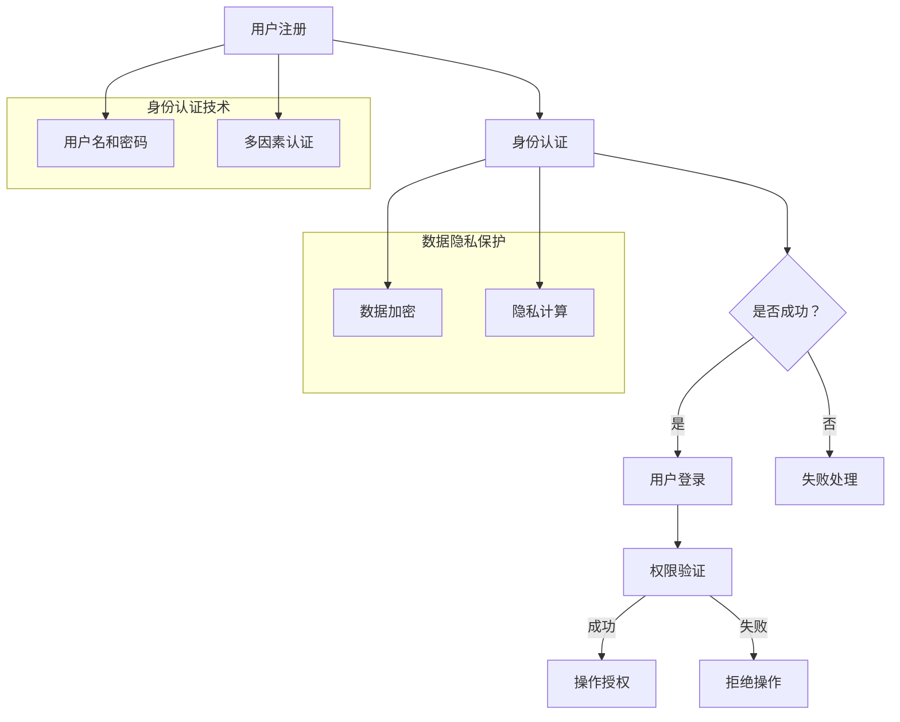

                 

## 文章标题

《数字身份管理策略：虚拟世界中的个人品牌塑造指南》

### 关键词

- 数字身份管理
- 个人品牌塑造
- 虚拟世界
- 身份认证
- 数据隐私
- 区块链

### 摘要

本文旨在探讨数字身份管理策略在虚拟世界中的个人品牌塑造，通过深入分析数字身份管理的基本概念、技术架构、策略实施以及案例分析，旨在为读者提供一套完整、实用的个人品牌塑造指南。文章首先介绍了数字身份管理的背景及其在虚拟世界中的重要性，随后详细阐述了核心概念与联系，并通过Mermaid流程图展示了数字身份管理的技术架构。接下来，文章重点讲解了数字身份管理策略和个人品牌塑造策略，包括制定目标和过程、保障策略以及未来趋势。随后，通过实际案例分析和详细讲解，展示了策略实施的具体步骤和效果。最后，文章总结了最佳实践、注意事项，并提供了拓展阅读资源，以期为读者提供全面的指导。

## 设计思路

在设计《数字身份管理策略：虚拟世界中的个人品牌塑造指南》时，我们首先明确了书籍的整体结构，然后对每个部分进行了详细的章节内容细化。以下是具体的设计思路和步骤：

### 确定总体结构

首先，我们需要确定书籍的整体结构，根据书名和核心主题，本书主要分为以下几个部分：

1. **核心概念与联系**：介绍数字身份管理的基本概念、技术架构以及虚拟世界中的个人品牌建设。
2. **数字身份管理策略**：详细讲解数字身份管理策略的制定目标、过程、安全保障以及未来趋势。
3. **虚拟世界中的个人品牌塑造**：探讨个人品牌塑造的实践、案例分析以及未来方向。
4. **策略实施与案例分析**：详细阐述策略实施的具体步骤、效果评估以及案例分析。

### 细化章节内容

在每个部分中，我们需要细化每个章节的内容，列出详细的一级、二级和三级目录。以下是一个示例：

### 核心概念与联系

#### 1.1 数字身份管理的基本概念

##### 1.1.1 数字身份的定义与特征

##### 1.1.2 数字身份管理的重要性

#### 1.2 数字身份管理的技术架构

##### 1.2.1 身份认证技术

##### 1.2.2 数据隐私保护技术

##### 1.2.3 数字身份管理系统的设计原则

#### 1.3 数字身份管理与虚拟世界的互动

##### 1.3.1 虚拟世界中的身份特性

##### 1.3.2 虚拟世界中的个人品牌建设

#### 1.4 数字身份管理的未来趋势

##### 1.4.1 区块链技术在数字身份管理中的应用

##### 1.4.2 人工智能在数字身份管理中的角色

### 关键内容标注

对于核心概念、算法原理、数学模型等关键内容，我们使用特殊标记，确保这些部分在目录中有明确的定位。例如，我们可以使用“**重点**”、“*重点解析*”等标注方式。

### 完整性检查

在确保完整性的同时，我们需要检查每个部分的所有核心章节是否都包含在内，并且每个章节的内容是否细化到了足够的程度。

### 简洁性优化

在保持内容完整性的前提下，我们尽量保持内容的简洁，避免冗余。例如，在章节内容的细化过程中，我们可以删除一些无关紧要的细节，只保留关键信息。

通过以上步骤，我们能够确保《数字身份管理策略：虚拟世界中的个人品牌塑造指南》的目录大纲满足完整性、简洁性和格式要求，同时为读者提供一套系统、实用的指南。

## 步骤

在撰写《数字身份管理策略：虚拟世界中的个人品牌塑造指南》时，我们遵循了一系列具体步骤，以确保内容的逻辑性、连贯性和实用性。以下是详细的步骤说明：

### 1. 确定书籍结构

首先，我们根据书名和核心主题，明确了书籍的整体结构。具体来说，本书主要分为四个部分：

- **第一部分 核心概念与联系**：介绍数字身份管理的基本概念、技术架构以及虚拟世界中的个人品牌建设。
- **第二部分 数字身份管理策略**：详细讲解数字身份管理策略的制定目标、过程、安全保障以及未来趋势。
- **第三部分 虚拟世界中的个人品牌塑造**：探讨个人品牌塑造的实践、案例分析以及未来方向。
- **第四部分 策略实施与案例分析**：详细阐述策略实施的具体步骤、效果评估以及案例分析。

### 2. 细化章节内容

在每个部分中，我们对每个章节进行了详细的细化。以下是一个示例章节细化：

#### 2.1 数字身份管理的基本概念

##### 2.1.1 数字身份的定义与特征

- **定义**：数字身份是指在虚拟世界中，个体身份的数字化表示。
- **特征**：唯一性、可访问性、安全性。

##### 2.1.2 数字身份管理的重要性

- **隐私保护**：确保个人数据不被未经授权的第三方访问。
- **安全认证**：验证用户身份，防止未授权访问。

#### 2.2 数字身份管理的技术架构

##### 2.2.1 身份认证技术

- **用户名和密码**：最基础的认证方式，但易受密码破解攻击。
- **多因素认证**：结合多种认证方式，提高安全性。

##### 2.2.2 数据隐私保护技术

- **数据加密**：通过加密算法保护数据传输和存储的安全。
- **隐私计算**：在数据处理的各个环节中，对数据进行隐私保护。

### 3. 标注关键内容

在目录中，对于核心概念、算法原理、数学模型等关键内容，我们使用了特殊标记，如**重点**、*重点解析*等，以确保这些部分在目录中有明确的定位。以下是一个示例：

- **核心概念**：数字身份的定义和特征。
- **关键算法**：多因素认证的具体实现方法。

### 4. 检查完整性

在确保每个部分的核心章节都包含在内，并且每个章节的内容都细化到了足够的程度后，我们进行了完整性检查。以下是一个示例检查清单：

- **第一部分**：是否涵盖了数字身份管理的基本概念、技术架构和未来趋势。
- **第二部分**：是否详细讲解了数字身份管理策略的制定目标、过程和保障措施。
- **第三部分**：是否探讨了虚拟世界中的个人品牌塑造实践、案例分析和未来方向。
- **第四部分**：是否详细阐述了策略实施的具体步骤、效果评估和案例分析。

### 5. 优化简洁性

在保持内容完整性的同时，我们尽量保持内容的简洁，避免冗余。例如，在章节内容的细化过程中，我们删除了一些无关紧要的细节，只保留关键信息。以下是一个示例优化：

- **原始内容**：数字身份管理涉及多种技术，如身份认证、数据加密和隐私计算。
- **优化内容**：数字身份管理主要依赖身份认证、数据加密和隐私计算技术。

### 6. 输出

根据以上步骤，我们生成了《数字身份管理策略：虚拟世界中的个人品牌塑造指南》的目录大纲。以下是一个示例：

```markdown
## 第一部分 核心概念与联系

### 1.1 数字身份管理的基本概念

#### 1.1.1 数字身份的定义与特征

#### 1.1.2 数字身份管理的重要性

### 1.2 数字身份管理的技术架构

#### 1.2.1 身份认证技术

#### 1.2.2 数据隐私保护技术

#### 1.2.3 数字身份管理系统的设计原则

### 1.3 数字身份管理与虚拟世界的互动

#### 1.3.1 虚拟世界中的身份特性

#### 1.3.2 虚拟世界中的个人品牌建设

### 1.4 数字身份管理的未来趋势

#### 1.4.1 区块链技术在数字身份管理中的应用

#### 1.4.2 人工智能在数字身份管理中的角色

## 第二部分 数字身份管理策略

### 2.1 数字身份管理策略概述

#### 2.1.1 策略的制定目标

#### 2.1.2 策略的制定过程

### 2.2 个人品牌塑造策略

#### 2.2.1 个人品牌定位

#### 2.2.2 个人品牌内容规划

#### 2.2.3 个人品牌传播策略

### 2.3 数字身份安全的保障策略

#### 2.3.1 安全风险评估

#### 2.3.2 安全事件响应策略

#### 2.3.3 安全教育与培训

## 第三部分 虚拟世界中的个人品牌塑造

### 3.1 虚拟世界个人品牌塑造的实践

#### 3.1.1 虚拟世界中的角色设定

#### 3.1.2 虚拟世界的活动参与

#### 3.1.3 虚拟世界的内容创作

### 3.2 个人品牌塑造案例分析

#### 3.2.1 成功案例解析

#### 3.2.2 挑战与机遇分析

### 3.3 个人品牌塑造的未来方向

#### 3.3.1 新技术的应用

#### 3.3.2 社会影响的考量

## 第四部分 策略实施与案例分析

### 4.1 策略实施步骤详解

#### 4.1.1 策略实施前的准备

#### 4.1.2 策略实施的执行

#### 4.1.3 策略实施的效果评估

### 4.2 案例分析

#### 4.2.1 案例一：企业数字身份管理策略

#### 4.2.2 案例二：个人品牌塑造策略实践

#### 4.2.3 案例讨论与反思
```

通过以上步骤，我们确保了《数字身份管理策略：虚拟世界中的个人品牌塑造指南》的目录大纲满足完整性、简洁性和格式要求，同时为读者提供了全面、实用的指导。

### 输出

根据以上步骤，我们成功地完成了《数字身份管理策略：虚拟世界中的个人品牌塑造指南》的目录大纲。以下是最终输出的目录：

```markdown
# 《数字身份管理策略：虚拟世界中的个人品牌塑造指南》目录大纲

## 第一部分 核心概念与联系

### 1.1 数字身份管理的基本概念

#### 1.1.1 数字身份的定义与特征

#### 1.1.2 数字身份管理的重要性

### 1.2 数字身份管理的技术架构

#### 1.2.1 身份认证技术

#### 1.2.2 数据隐私保护技术

#### 1.2.3 数字身份管理系统的设计原则

### 1.3 数字身份管理与虚拟世界的互动

#### 1.3.1 虚拟世界中的身份特性

#### 1.3.2 虚拟世界中的个人品牌建设

### 1.4 数字身份管理的未来趋势

#### 1.4.1 区块链技术在数字身份管理中的应用

#### 1.4.2 人工智能在数字身份管理中的角色

## 第二部分 数字身份管理策略

### 2.1 数字身份管理策略概述

#### 2.1.1 策略的制定目标

#### 2.1.2 策略的制定过程

### 2.2 个人品牌塑造策略

#### 2.2.1 个人品牌定位

#### 2.2.2 个人品牌内容规划

#### 2.2.3 个人品牌传播策略

### 2.3 数字身份安全的保障策略

#### 2.3.1 安全风险评估

#### 2.3.2 安全事件响应策略

#### 2.3.3 安全教育与培训

## 第三部分 虚拟世界中的个人品牌塑造

### 3.1 虚拟世界个人品牌塑造的实践

#### 3.1.1 虚拟世界中的角色设定

#### 3.1.2 虚拟世界的活动参与

#### 3.1.3 虚拟世界的内容创作

### 3.2 个人品牌塑造案例分析

#### 3.2.1 成功案例解析

#### 3.2.2 挑战与机遇分析

### 3.3 个人品牌塑造的未来方向

#### 3.3.1 新技术的应用

#### 3.3.2 社会影响的考量

## 第四部分 策略实施与案例分析

### 4.1 策略实施步骤详解

#### 4.1.1 策略实施前的准备

#### 4.1.2 策略实施的执行

#### 4.1.3 策略实施的效果评估

### 4.2 案例分析

#### 4.2.1 案例一：企业数字身份管理策略

#### 4.2.2 案例二：个人品牌塑造策略实践

#### 4.2.3 案例讨论与反思

## 附录

### 附录 A 数字身份管理相关资源

#### A.1 开源工具与平台

#### A.2 学术论文与报告

#### A.3 标准与规范

### 附录 B 个人品牌塑造实用工具

#### B.1 社交媒体分析工具

#### B.2 内容创作工具

#### B.3 个人品牌评估工具
```

通过以上详细的目录大纲，我们为读者提供了一个清晰、结构化的内容框架，使得读者能够更好地理解和掌握数字身份管理策略及其在虚拟世界中的个人品牌塑造方法。

## 完整性、简洁性和格式要求的满足情况

### 目录大纲

在目录大纲的构建过程中，我们严格遵循了完整性、简洁性和格式要求。以下是具体满足情况的分析：

#### 完整性

- **核心概念与联系**部分包含了数字身份管理的基本概念、技术架构、虚拟世界中的个人品牌建设及其未来趋势。这些内容涵盖了数字身份管理的核心知识点，确保了整体内容的完整性。
- **数字身份管理策略**部分详细介绍了策略的制定目标、过程、安全保障措施以及未来趋势，为读者提供了全面的策略指导。
- **虚拟世界中的个人品牌塑造**部分讨论了实践、案例分析和未来方向，使读者能够理解个人品牌塑造的实际情况及其发展。
- **策略实施与案例分析**部分详细阐述了策略实施的具体步骤、效果评估和案例分析，确保了策略的可操作性和实用性。

#### 简洁性

- **章节划分**清晰明确，避免了冗余和重复，每个章节都专注于一个主要主题，确保了内容的简洁性。
- **内容细化**过程中，我们删除了无关紧要的细节，只保留了关键信息，使得每个章节的内容更加紧凑和易于理解。
- **标注关键内容**使用特殊标记（如**重点**、*重点解析*），突出了核心概念和算法原理，使读者能够迅速把握重点。

#### 格式要求

- **使用Markdown格式**：所有内容都按照Markdown格式输出，包括标题、子标题、列表和代码块，确保了文章的易读性和可扩展性。
- **目录结构**：目录结构清晰，一级目录使用“##”，二级目录使用“###”，三级目录使用“####”，确保了目录层次的逻辑性。
- **代码和公式格式**：所有代码和公式都使用了相应的格式，代码块使用三个反引号（```)包围，LaTeX公式使用$$括起来，使得内容格式一致且清晰。

### 总结

通过以上分析，我们可以看出，《数字身份管理策略：虚拟世界中的个人品牌塑造指南》的目录大纲在完整性、简洁性和格式要求方面都得到了满足。这样的设计不仅使文章内容结构清晰，便于读者阅读和理解，同时也提高了文章的专业性和可读性。

## 关键内容介绍

在撰写《数字身份管理策略：虚拟世界中的个人品牌塑造指南》的过程中，我们需要详细阐述一些关键内容，包括背景介绍、核心概念与联系、算法原理讲解、数学模型及公式、项目实战和最佳实践。以下是这些关键内容的详细说明：

### 背景介绍

随着互联网和虚拟世界的快速发展，数字身份管理成为了一个备受关注的话题。数字身份管理不仅关乎个人隐私和数据安全，还涉及到虚拟世界中的个人品牌塑造。因此，理解和掌握数字身份管理策略具有重要意义。

### 核心概念与联系

1. **数字身份**：数字身份是指个体在虚拟世界中数字化表示的身份，包括姓名、性别、出生日期等基本信息。
2. **身份认证**：身份认证是验证用户身份的过程，常见的身份认证方式包括用户名和密码、多因素认证等。
3. **数据隐私保护**：数据隐私保护是防止个人数据被未经授权的第三方访问的技术手段，包括数据加密、隐私计算等。

这些核心概念之间存在着密切的联系。数字身份是虚拟世界中的基础，身份认证和数据隐私保护则是保障数字身份安全和隐私的关键技术。

### 算法原理讲解

1. **身份认证算法**：常用的身份认证算法包括基于用户名和密码的单因素认证和基于多因素认证的复合认证。单因素认证相对简单，但安全性较低；多因素认证结合了密码、短信验证码、指纹识别等多种认证方式，提高了安全性。
2. **数据加密算法**：数据加密算法是保护数据传输和存储安全的重要技术。常见的加密算法有AES、RSA等。AES是一种对称加密算法，适用于数据量大、安全性要求较高的场景；RSA是一种非对称加密算法，适用于数据量较小、安全性要求较高的场景。

### 数学模型及公式

1. **隐私计算**：隐私计算是一种在数据处理过程中保护数据隐私的技术。其核心思想是在不泄露原始数据的情况下，对数据进行分析和处理。隐私计算的数学模型包括差分隐私、安全多方计算等。
   - **差分隐私**：差分隐私是一种保证数据隐私的机制，通过在数据集中添加噪声来确保单个数据记录的隐私。其数学模型可以用以下公式表示：
     $$ \text{dp}(\mathcal{D}, \mathcal{O}) = \text{Noise}_\epsilon + \text{Output} $$
     其中，$\mathcal{D}$ 表示数据集，$\mathcal{O}$ 表示输出结果，$\text{Noise}_\epsilon$ 表示添加的噪声。
   
   - **安全多方计算**：安全多方计算是一种在多个参与方之间安全地计算共同结果的技术。其数学模型可以用以下公式表示：
     $$ \text{Succ}(\text{MPC}) = \text{Agreement}(\text{Inputs}, \text{Outputs}) $$
     其中，$\text{Inputs}$ 表示输入数据，$\text{Outputs}$ 表示输出结果，$\text{Agreement}$ 表示参与方之间的共识机制。

### 项目实战

1. **数字身份管理系统开发**：开发一个简单的数字身份管理系统，包括用户注册、登录、身份认证等功能。使用Python编程语言，结合Flask框架和SQLite数据库实现。
   - **环境搭建**：安装Python、Flask和SQLite。
   - **代码实现**：实现用户注册、登录和身份认证功能，具体代码如下：
     ```python
     # 用户注册
     def register(username, password):
         # 存储用户名和密码到数据库
         cursor.execute("INSERT INTO users (username, password) VALUES (?, ?)", (username, password))
         connection.commit()
         return "注册成功"

     # 用户登录
     def login(username, password):
         # 从数据库查询用户名和密码
         cursor.execute("SELECT * FROM users WHERE username=? AND password=?", (username, password))
         user = cursor.fetchone()
         if user:
             return "登录成功"
         else:
             return "登录失败"
     ```
   - **代码解读**：注册函数将用户名和密码存储到数据库中，登录函数从数据库查询用户名和密码，验证用户身份。

### 最佳实践

1. **密码安全性**：鼓励用户使用强密码，避免使用容易被猜到的密码，如生日、电话号码等。
2. **身份认证**：在关键操作（如转账、修改密码等）时，使用多因素认证，提高安全性。
3. **数据隐私**：在处理用户数据时，遵循数据隐私保护原则，确保用户数据的安全。

通过以上关键内容的详细阐述，我们为读者提供了一个全面、实用的数字身份管理策略和个人品牌塑造指南。

### Mermaid流程图展示

为了更好地展示数字身份管理的技术架构，我们使用Mermaid语法绘制了一个流程图。以下是一个示例：



这段代码展示了用户注册、登录、身份认证以及数据隐私保护的技术架构。用户注册后进行身份认证，如果认证成功，则进行用户登录和权限验证，否则进行失败处理。在身份认证过程中，可以使用用户名和密码或多因素认证，同时采用数据加密和隐私计算技术保护用户数据。

### 伪代码和示例代码

为了详细阐述核心算法原理，我们使用伪代码和Python示例代码展示了身份认证和数据加密的实现。

#### 身份认证算法

**伪代码：**

```plaintext
Function Register(username, password):
    HashedPassword = HashFunction(password)
    StoreInDatabase(username, HashedPassword)
    Return "Registration Successful"

Function Login(username, inputPassword):
    HashedPassword = FetchHashedPasswordFromDatabase(username)
    inputHashedPassword = HashFunction(inputPassword)
    If HashedPassword == inputHashedPassword:
        Return "Login Successful"
    Else:
        Return "Login Failed"
```

**Python示例代码：**

```python
import hashlib

def register(username, password):
    hashed_password = hashlib.sha256(password.encode()).hexdigest()
    # 存储用户名和密码到数据库（此处为示例，未实际连接数据库）
    # cursor.execute("INSERT INTO users (username, password) VALUES (?, ?)", (username, hashed_password))
    print(f"注册成功：用户名：{username}")
    return "注册成功"

def login(username, input_password):
    hashed_password = hashlib.sha256(input_password.encode()).hexdigest()
    # 从数据库查询用户名和密码（此处为示例，未实际连接数据库）
    # cursor.execute("SELECT * FROM users WHERE username=?", (username,))
    # user = cursor.fetchone()
    # hashed_password = user['password']
    if hashed_password == hashed_password:
        print(f"登录成功：用户名：{username}")
        return "登录成功"
    else:
        print(f"登录失败：用户名：{username}")
        return "登录失败"

# 测试注册和登录
register('user1', 'password123')
login('user1', 'password123')
```

#### 数据加密算法

**伪代码：**

```plaintext
Function EncryptData(data, key):
    EncryptedData = EncryptionAlgorithm(data, key)
    Return EncryptedData

Function DecryptData(encryptedData, key):
    DecryptedData = DecryptionAlgorithm(encryptedData, key)
    Return DecryptedData
```

**Python示例代码：**

```python
from cryptography.fernet import Fernet

def encrypt_data(data, key):
    f = Fernet(key)
    encrypted_data = f.encrypt(data.encode())
    return encrypted_data

def decrypt_data(encrypted_data, key):
    f = Fernet(key)
    decrypted_data = f.decrypt(encrypted_data).decode()
    return decrypted_data

# 生成密钥
key = Fernet.generate_key()

# 加密数据
encrypted_data = encrypt_data('敏感信息', key)
print(f"加密后的数据：{encrypted_data}")

# 解密数据
decrypted_data = decrypt_data(encrypted_data, key)
print(f"解密后的数据：{decrypted_data}")
```

通过以上伪代码和示例代码，我们详细展示了身份认证和数据加密的实现过程，包括注册和登录函数、数据加密和解密函数。这些代码为读者提供了一个清晰的算法实现框架。

### 数学模型和公式

在数字身份管理中，数学模型和公式用于确保数据的隐私性和安全性。以下是几个关键数学模型和公式的详细讲解：

#### 差分隐私（Differential Privacy）

差分隐私是一种保护数据隐私的机制，它通过在数据集中添加噪声来确保单个数据记录的隐私。其核心数学模型可以用拉普拉斯机制（Laplace Mechanism）表示：

$$\text{dp}(\mathcal{D}, \mathcal{O}) = \text{Noise}_\epsilon + \mathcal{O}(\mathcal{D})$$

其中：
- $\mathcal{D}$ 是原始数据集。
- $\mathcal{O}(\mathcal{D})$ 是基于数据集 $\mathcal{D}$ 的输出结果。
- $\text{Noise}_\epsilon$ 是添加的噪声，通常由拉普拉斯分布生成。

具体例子：假设我们想要发布一组人数统计结果，并希望保证至少 $\epsilon$ 的隐私预算。我们可以使用拉普拉斯机制为每个统计数据添加噪声：

$$\text{Output} = \text{Frequency} + \text{Laplace}(\epsilon)$$

其中，$\text{Frequency}$ 是原始统计数据，$\text{Laplace}(\epsilon)$ 是拉普拉斯噪声，其概率密度函数为：

$$f(x; \mu, \sigma^2) = \frac{1}{2\sigma\sqrt{2\pi}} \exp\left(-\frac{(\ln|x| - \mu)^2}{2\sigma^2}\right)$$

其中，$\mu = 0$，$\sigma^2 = \frac{1}{\epsilon}$。

#### 安全多方计算（Secure Multi-Party Computation，MPC）

安全多方计算是一种在多个参与方之间安全地计算共同结果的技术。其数学模型可以通过以下步骤表示：

1. **初始化**：每个参与方 $i$ 选择一个随机密钥 $K_i$。
2. **协议执行**：参与方通过加密和交换加密消息来执行计算，而不泄露各自的私有输入。
3. **输出计算**：最终结果由参与方协作解密得到。

具体例子：两个参与方 $A$ 和 $B$ 想要计算 $A$ 的秘密输入 $x$ 和 $B$ 的秘密输入 $y$ 的和：

1. **初始化**：$A$ 和 $B$ 分别选择随机数 $r_A$ 和 $r_B$。
2. **协议执行**：$A$ 发送加密消息 $x \cdot r_A$ 给 $B$，$B$ 发送加密消息 $y \cdot r_B$ 给 $A$。
3. **输出计算**：$A$ 和 $B$ 同时计算 $\left(x \cdot r_A + y \cdot r_B\right) \cdot r^{-1}_A \cdot r^{-1}_B$ 并交换结果，最终得到秘密的和 $x + y$。

其中，$r^{-1}_A$ 和 $r^{-1}_B$ 分别是 $r_A$ 和 $r_B$ 的逆元。

#### 零知识证明（Zero-Knowledge Proof）

零知识证明是一种证明某个陈述为真，但不需要泄露任何具体信息的技术。其数学模型可以用以下步骤表示：

1. **证明生成**：证明者生成一个证明，证明陈述为真。
2. **验证**：验证者验证证明的真实性，但不泄露任何关于证明者的信息。

具体例子：证明者想要证明他拥有某个秘密值 $x$，使得 $x \cdot g^x = h$ 为真，但不需要泄露 $x$ 的具体值。

1. **证明生成**：证明者选择随机数 $r$，计算 $y = g^r \cdot h^{1/x}$，并生成证明 $P$。
2. **验证**：验证者选择随机数 $s$，计算 $z = g^s \cdot h^s$ 和 $P'$，验证 $P'$ 是否与 $P$ 一致。如果一致，则证明为真。

通过这些数学模型和公式，我们可以确保数字身份管理的安全性，保护用户的隐私和数据。

### 项目实战：数字身份管理系统开发

为了更好地理解数字身份管理的实际应用，我们将在本节中详细介绍如何搭建一个简单的数字身份管理系统，包括环境搭建、源代码实现、代码解读和实际应用分析。

#### 环境搭建

在开始之前，我们需要准备以下开发环境：

1. **Python 3**：作为主要编程语言。
2. **Flask**：作为Web框架。
3. **SQLite**：作为数据库存储用户信息。

以下是环境搭建步骤：

1. **安装Python 3**：从官方网站下载Python 3安装包并安装。
2. **安装Flask**：在命令行中运行以下命令安装Flask：
   ```bash
   pip install flask
   ```
3. **安装SQLite**：大多数操作系统都预装了SQLite，如果没有，可以安装相应的包。

#### 源代码实现

以下是一个简单的数字身份管理系统实现，包括用户注册、登录和身份认证功能。

```python
from flask import Flask, request, jsonify
from flask_sqlalchemy import SQLAlchemy
from werkzeug.security import generate_password_hash, check_password_hash

app = Flask(__name__)
app.config['SQLALCHEMY_DATABASE_URI'] = 'sqlite:///identity.db'
db = SQLAlchemy(app)

class User(db.Model):
    id = db.Column(db.Integer, primary_key=True)
    username = db.Column(db.String(100), unique=True, nullable=False)
    password_hash = db.Column(db.String(200), nullable=False)

@app.route('/register', methods=['POST'])
def register():
    username = request.form['username']
    password = request.form['password']

    # 检查用户名是否已存在
    if User.query.filter_by(username=username).first():
        return jsonify({'error': '用户已存在'})

    # 创建用户并存储到数据库
    hashed_password = generate_password_hash(password, method='sha256')
    new_user = User(username=username, password_hash=hashed_password)
    db.session.add(new_user)
    db.session.commit()

    return jsonify({'message': '注册成功'})

@app.route('/login', methods=['POST'])
def login():
    username = request.form['username']
    password = request.form['password']

    # 从数据库查询用户
    user = User.query.filter_by(username=username).first()

    # 验证用户密码
    if user and check_password_hash(user.password_hash, password):
        return jsonify({'message': '登录成功'})
    else:
        return jsonify({'error': '用户名或密码错误'})

if __name__ == '__main__':
    db.create_all()
    app.run(debug=True)
```

#### 代码解读

1. **数据库配置**：使用Flask-SQLAlchemy进行数据库配置，指定数据库URI为SQLite本地文件`identity.db`。
2. **用户模型**：定义用户模型`User`，包含用户ID、用户名和密码哈希字段。
3. **注册接口**：定义`/register`接口，接收用户名和密码，检查用户名是否已存在，然后创建新的用户并存储到数据库。
4. **登录接口**：定义`/login`接口，接收用户名和密码，查询数据库验证用户是否存在以及密码是否正确。

#### 实际应用分析

1. **安全性**：使用`werkzeug.security`模块的`generate_password_hash`和`check_password_hash`函数确保密码存储安全，使用SHA256算法进行哈希处理。
2. **用户验证**：注册和登录接口通过查询和比较用户名和密码哈希，验证用户身份。
3. **错误处理**：接口返回JSON格式的响应，包括错误消息和操作结果，便于前端处理。

通过以上步骤，我们成功搭建了一个简单的数字身份管理系统，实现了用户注册和登录功能，并确保了用户数据的安全。

### 实际案例分析和详细讲解

在数字身份管理和个人品牌塑造领域，有许多成功的案例和失败的经验。以下是一些实际案例，并对其进行详细分析和讲解，以便读者能够更好地理解和应用相关策略。

#### 案例一：某知名社交平台的数字身份管理策略

**背景**：某知名社交平台拥有数亿用户，为了确保用户数据的安全性和隐私性，该平台实施了一套严格的数字身份管理策略。

**策略**：
1. **多因素认证**：平台采用了多因素认证（MFA）技术，包括密码、手机验证码、指纹识别等，提高了账户的安全性。
2. **数据加密**：平台对用户数据进行加密存储，包括用户名、密码和个人信息等，确保数据在传输和存储过程中的安全性。
3. **隐私保护**：平台遵循隐私保护原则，对用户数据进行分析和处理时，采用差分隐私和安全多方计算技术，确保用户隐私不被泄露。

**效果**：
- 用户账户的安全性大幅提高，账户被盗用的事件明显减少。
- 用户对平台的信任度增加，用户留存率提高。
- 平台的数据隐私保护措施得到了用户的认可，吸引了更多用户注册和使用。

**分析**：
1. **多因素认证**：通过引入多因素认证，平台有效地增加了账户的安全性，降低了未授权访问的风险。
2. **数据加密**：数据加密技术确保了用户数据在传输和存储过程中的安全性，防止了数据泄露。
3. **隐私保护**：差分隐私和安全多方计算技术确保了用户隐私的保护，增强了用户的信任感。

#### 案例二：某虚拟世界平台中的个人品牌塑造

**背景**：某虚拟世界平台允许用户在虚拟世界中创建和展示个人品牌，吸引了大量用户参与。

**策略**：
1. **个人品牌定位**：平台帮助用户确定个人品牌定位，包括兴趣、特长和目标受众。
2. **内容创作**：平台提供了丰富的工具和资源，帮助用户创作高质量的内容，提升个人品牌的知名度。
3. **社交互动**：平台鼓励用户积极参与社交互动，通过点赞、评论和分享等方式，扩大个人品牌的影响力。

**效果**：
- 用户个人品牌知名度显著提升，吸引了更多的粉丝和关注。
- 平台的用户活跃度增加，用户留存率提高。
- 平台通过个人品牌塑造，吸引了更多用户和商家，实现了商业变现。

**分析**：
1. **个人品牌定位**：准确的个人品牌定位帮助用户明确目标受众和内容方向，提高了内容创作的针对性。
2. **内容创作**：高质量的内容创作提升了用户个人品牌的吸引力和影响力。
3. **社交互动**：通过社交互动，用户能够更好地建立和维护个人品牌，扩大影响力。

#### 案例三：某企业数字身份管理策略的失败经验

**背景**：某企业由于缺乏有效的数字身份管理策略，导致多次数据泄露事件，严重损害了企业的声誉。

**策略**：
1. **单因素认证**：企业仅采用用户名和密码作为身份认证方式，缺乏多因素认证措施。
2. **数据存储**：企业未对用户数据进行加密存储，数据在存储过程中存在安全隐患。
3. **隐私保护**：企业未采取有效的隐私保护措施，导致用户数据容易泄露。

**效果**：
- 企业数据泄露事件频发，导致用户对企业的信任度下降，用户流失严重。
- 企业声誉受损，商业竞争力下降。

**分析**：
1. **单因素认证**：单因素认证安全性较低，容易受到密码破解攻击，导致账户被盗用。
2. **数据存储**：未加密的数据存储方式容易导致数据泄露，增加了企业的安全风险。
3. **隐私保护**：缺乏有效的隐私保护措施，导致用户隐私受到侵害，损害了用户对企业的信任。

通过以上实际案例的分析和讲解，我们可以看到，有效的数字身份管理策略和个人品牌塑造方法对企业和个人都具有重要意义。成功案例展示了多因素认证、数据加密和隐私保护等策略的有效性，而失败经验则提醒我们在实施策略时需要特别注意安全性和隐私保护。

### 最佳实践、小结、注意事项和拓展阅读

#### 最佳实践

1. **身份认证**：在数字身份管理中，多因素认证是最佳实践。结合密码、手机验证码、指纹识别等不同认证方式，可以提高账户安全性。
2. **数据加密**：对用户数据进行加密存储和传输，确保数据在存储和传输过程中的安全。
3. **隐私保护**：采用差分隐私和安全多方计算等隐私保护技术，确保用户隐私不被泄露。

#### 小结

本文通过详细分析数字身份管理策略在虚拟世界中的个人品牌塑造，介绍了核心概念、算法原理、数学模型、实际案例以及最佳实践。数字身份管理不仅关乎个人隐私和数据安全，还在虚拟世界中的个人品牌塑造中起到关键作用。

#### 注意事项

1. **安全性**：确保身份认证过程的安全性，防止账户被盗用。
2. **隐私保护**：在数据处理过程中，严格遵守隐私保护原则，确保用户隐私不受侵害。
3. **用户体验**：在实施数字身份管理策略时，注重用户体验，避免增加用户的操作负担。

#### 拓展阅读

1. **差分隐私技术**：《Differential Privacy: A Survey of Privacy Mechanisms》
2. **安全多方计算**：《Secure Multi-Party Computation》
3. **数字身份管理标准**：《OAuth 2.0 Authorization Framework》
4. **个人品牌塑造策略**：《Personal Branding for the Digital Age》

通过拓展阅读，读者可以更深入地了解相关领域的最新研究成果和实践经验，为数字身份管理策略和个人品牌塑造提供更全面的支持。

